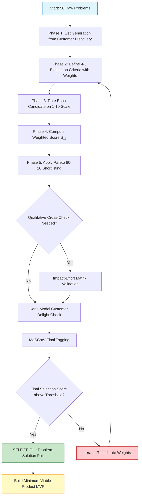
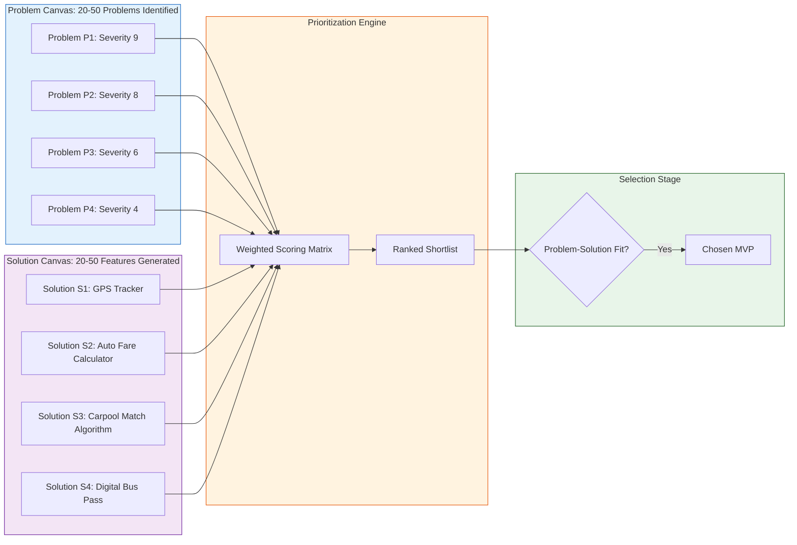
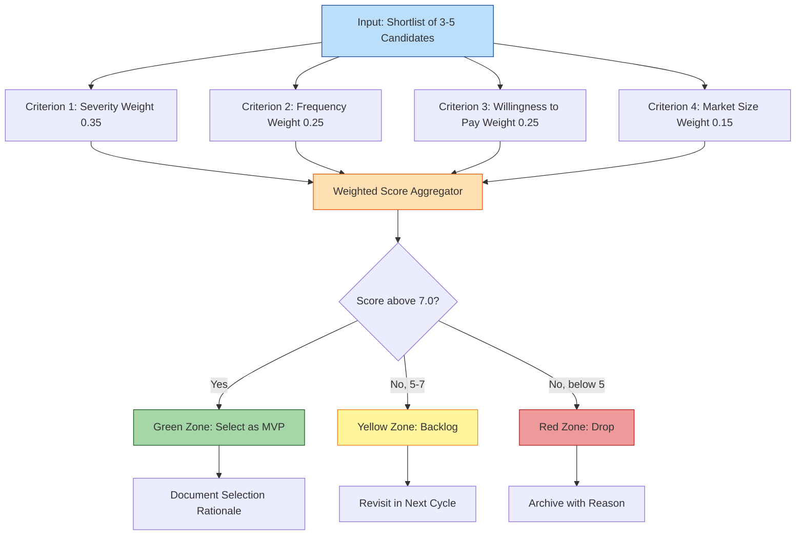
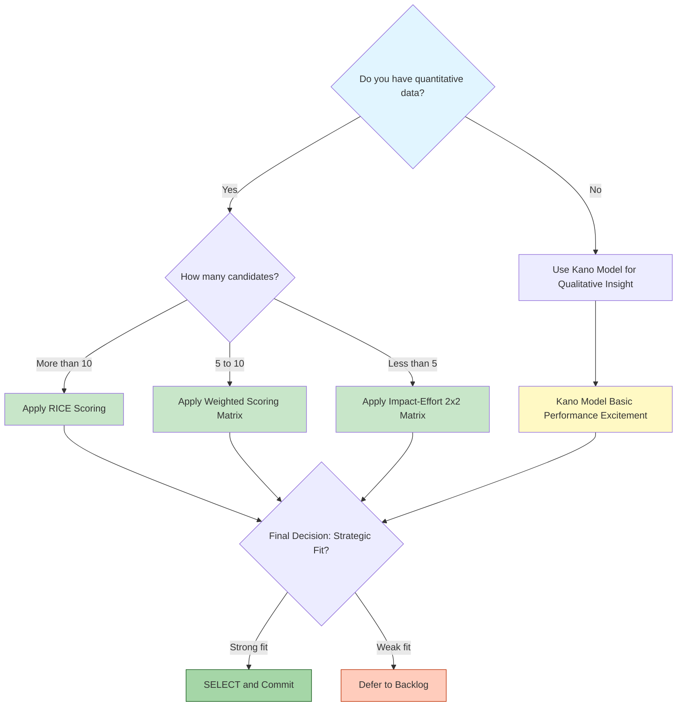

# Prioritization and selection

<!-- SECTION_1_START -->
# Prioritization and Selection in Problem & Solution Canvas Preparation

> [!NOTE]
> **KTU 2024 Scheme | UCEST206 | Module 2 Focus**
> In Lean Entrepreneurship, after listing **20–50 problems** in the **Problem Canvas** and **20–50 features/solutions** in the **Solution Canvas**, the entrepreneur faces a critical bottleneck: *Which problem to solve first? Which solution to build first?* This is where **Prioritization and Selection** becomes the strategic pivot between ideation and execution.

## 1.1 Formal Academic Definition

**Prioritization** is a structured, evidence-based decision-making process used by entrepreneurs to **rank, score, and shortlist** the most impactful problems (from the Problem Canvas) and the most viable solutions (from the Solution Canvas) based on weighted criteria such as customer severity, market size, technical feasibility, strategic fit, and resource availability.

**Selection** is the subsequent commitment step where the prioritized shortlist is narrowed down to **one Problem Statement** and **one Minimum Viable Solution (MVS)** that will form the core hypothesis to be tested in customer validation experiments.

> [!IMPORTANT]
> **KTU Board Terminology (Use these exact terms in exams):**
> - **Problem-Solution Fit** — The alignment between the chosen problem and the chosen solution.
> - **MVP (Minimum Viable Product)** — The smallest feature set that delivers the chosen solution.
> - **Weighted Scoring Model** — Quantitative prioritization using assigned weights to criteria.
> - **Hypothesis Testing** — Validating the selected problem-solution pair through experiments.

## 1.2 Intuitive Analogy — "The Firefighter's Triage"

Imagine you arrive at a building with **50 rooms on fire**, but you have only **one fire extinguisher** and **10 minutes**. What do you do?

- You **don't** put out the smallest flame first.
- You **don't** fight the fire in the room that *sounds* most important.
- You look for the room where: **(a) people are screaming the loudest (severity)**, **(b) the fire will spread fastest (impact)**, and **(c) you can actually reach in time (feasibility)**.

**That room is your "Top Priority Problem."**
The **specific extinguisher model** you choose to use is your "**Selected Solution.**"

> This is exactly what prioritization does — it converts a chaotic list of ideas into a **single, defensible bet** you can test with real users in the real world.

## 1.3 Why Prioritization Matters — The Three Failure Modes It Prevents

> [!WARNING]
> **Three Common Startup Failure Modes (KTU Module 2 Highlight):**
> 1. **Solution in Search of a Problem** — Building a feature nobody desperately needs.
> 2. **Boiling the Ocean** — Trying to solve every problem for everyone; running out of cash.
> 3. **Pet Project Syndrome** — Selecting based on founder bias ("I like this") instead of customer data.

## 1.4 Visualization of the Prioritization Concept

> [!VISUALIZATION CONTROL]
> **Concept:** Prioritization as a 2x2 Funnel Filtering Process
> **GeoGebra / Desmos Input Equations:**
> * Plot 50 problems as scattered points in a 2D space: `x = Customer Impact`, `y = Feasibility`
> * Draw a diagonal line: `y = 0.7x` (the priority threshold)
> * Shade the upper-right quadrant (high impact + high feasibility) as the "Gold Mine Zone"
> **Visual Description:** Students should observe a funnel where 50 random points gradually collapse to ~5 highlighted points in the upper-right quadrant — these are the *Shortlisted* candidates for selection.
<!-- SECTION_1_END -->

<!-- SECTION_2_START -->
# Deep Theoretical Analysis & KTU High-Yield Formula Sheet

## 2.1 The Prioritization Pipeline — Five Sequential Phases

The KTU 2024 syllabus (Module 2) prescribes a **five-step logical pipeline** that must be followed rigorously during canvas preparation:

### Phase 1 — List Generation
- Collect all problems from **customer interviews, observation, and existing alternatives**.
- Collect all potential solutions from **brainstorming, competitor benchmarking, and technology scouting**.
- Minimum inventory: **15–20 items** in each canvas (board examiners check this).

### Phase 2 — Criteria Definition
Select **4–6 evaluation criteria**. The KTU-prescribed criteria are:

| # | Criterion | Description | Measurement |
|---|-----------|-------------|-------------|
| C1 | **Severity of the Problem** | How badly does the customer need this solved? | 1–10 scale |
| C2 | **Frequency of Occurrence** | How often does the customer face this problem? | Times per week |
| C3 | **Market Size (TAM)** | Total number of potential customers affected | Number of users |
| C4 | **Willingness to Pay (WTP)** | Will the customer pay for a solution? | Yes/No + Amount |
| C5 | **Technical Feasibility** | Can the team build it with current skills? | 1–10 scale |
| C6 | **Strategic Fit** | Does it align with the venture's vision? | 1–10 scale |

### Phase 3 — Weighted Scoring
Assign a **weight (w_i)** to each criterion such that $\sum_{i=1}^{n} w_i = 1.0$.

For each candidate (problem or solution) $j$, calculate the **Weighted Score**:

$$
S_j = \sum_{i=1}^{n} w_i \times r_{ij}
$$

Where:
- $S_j$ = Weighted score of candidate $j$
- $w_i$ = Weight of criterion $i$ (between 0 and 1)
- $r_{ij}$ = Raw rating of candidate $j$ on criterion $i$ (1–10 scale)
- $n$ = Total number of criteria

### Phase 4 — Ranking and Shortlisting
- Sort candidates by $S_j$ in **descending order**.
- Apply the **80/20 Pareto Rule** — top 20% of candidates capture 80% of the value.
- **Shortlist** typically contains **3–5 candidates** for the next round.

### Phase 5 — Final Selection (Decision Matrix)
- Apply **Make-or-Buy / Build-or-Borrow analysis**.
- Conduct a **Kano Model** check (Basic / Performance / Excitement features).
- Use **Risk-Reward Matrix** to make the final commitment.

## 2.2 The Five Major Prioritization Frameworks (KTU High-Yield)

> [!NOTE]
> **These five frameworks are exam favorites. Memorize the matrix headers and the quadrant meanings.**

### Framework 1 — Impact-Effort Matrix (2x2 Grid)

| Quadrant | Impact | Effort | Action |
|----------|--------|--------|--------|
| **Quick Wins** (Top-Left) | High | Low | **DO FIRST** ✓ |
| **Major Projects** (Top-Right) | High | High | **PLAN & SCHEDULE** |
| **Fill-ins** (Bottom-Left) | Low | Low | **DO IF TIME PERMITS** |
| **Thankless Tasks** (Bottom-Right) | Low | High | **AVOID / DROP** ✗ |

### Framework 2 — RICE Scoring Model (Used by Google, Facebook)

$$
RICE\ Score = \frac{R \times I \times C}{E}
$$

Where:
- $R$ = **Reach** — Number of users impacted in a quarter
- $I$ = **Impact** — Score from 0.25 (minimal) to 3.0 (massive)
- $C$ = **Confidence** — Percentage (e.g., 80% = 0.8)
- $E$ = **Effort** — Person-months required

### Framework 3 — MoSCoW Method (Product Management Standard)

| Priority Tag | Meaning | Selection Rule |
|--------------|---------|----------------|
| **M** — Must Have | Critical for product to function | Non-negotiable, **MUST** be selected |
| **S** — Should Have | Important but not critical | Selected if resources allow |
| **C** — Could Have | Nice-to-have, small impact | Selected only if surplus resources |
| **W** — Won't Have (this time) | Explicitly deferred | **NOT selected** in current cycle |

### Framework 4 — Kano Model (Customer Satisfaction Mapping)

| Feature Type | Customer Reaction if Present | Customer Reaction if Absent |
|--------------|------------------------------|------------------------------|
| **Basic (Threshold)** | Neutral (expected) | Very dissatisfied |
| **Performance (Linear)** | More satisfaction | Less satisfaction |
| **Excitement (Delighter)** | Extreme satisfaction | Neutral |

### Framework 5 — Eisenhower Matrix (Urgency vs. Importance)

| | Urgent | Not Urgent |
|---|--------|------------|
| **Important** | Do Now | Schedule |
| **Not Important** | Delegate | Delete |

## 2.3 KTU Formula Sheet — High-Yield Quick Reference

| # | Formula / Concept | Purpose | When to Use |
|---|-------------------|---------|-------------|
| 1 | $S_j = \sum w_i \times r_{ij}$ | Weighted Scoring | When multiple criteria matter |
| 2 | $RICE = \frac{R \times I \times C}{E}$ | Quantitative Ranking | Large feature backlogs |
| 3 | $\sum_{i=1}^{n} w_i = 1.0$ | Normalization Check | Before scoring candidates |
| 4 | $Effort\ ROI = \frac{Value}{Cost}$ | Cost-Benefit | Resource-constrained teams |
| 5 | **Pareto 80/20** | Shortlisting | After initial ranking |
| 6 | **ICE Score** = $Impact \times Confidence \times Ease$ | Quick Triage | Early-stage ideas |
| 7 | $\text{Customer Severity} = \text{Frequency} \times \text{Importance}$ | Problem Ranking | Problem Canvas Stage |

## 2.4 Real-World Engineering & Startup Utility

> [!IMPORTANT]
> **Where this is applied in production systems:**
> - **Product Managers at Google/Meta** use RICE to decide which features ship each quarter.
> - **Hardware Startups** use Impact-Effort to choose between prototype iterations.
> - **Healthcare Triage Systems** use Eisenhower Matrix for emergency prioritization.
> - **Agile Scrum Teams** use MoSCoW for sprint planning.
> - **Open-Source Communities** (e.g., Linux Kernel) use Kano to balance stability vs. innovation.

> In the KTU context, an **engineering student pitching a startup** must demonstrate that their *selection* of one problem-solution pair is **defensible, data-backed, and not arbitrary**.
<!-- SECTION_2_END -->

<!-- SECTION_3_START -->
# Step-by-Step Derivations, Case Study & Code Implementation

## 3.1 Worked Case Study — "CampusCommute" (A KTU Student Startup)

**Scenario:** Five B.Tech students from College of Engineering, Trivandrum conducted **30 customer interviews** with fellow students and identified the following **5 candidate problems** for a campus transportation app:

| ID | Problem Statement | Frequency (per week) | Severity (1-10) | Willingness to Pay | Market Size (Students Affected) |
|----|------------------|----------------------|------------------|---------------------|-------------------------------|
| P1 | "I miss my college bus because I don't know the live location." | 8 | 9 | Yes (₹30/mo) | 1,200 |
| P2 | "Auto-rickshaw drivers overcharge me at night." | 5 | 8 | Yes (₹20/mo) | 900 |
| P3 | "I can't find a carpool partner going my route." | 6 | 6 | Maybe (₹10/mo) | 600 |
| P4 | "Bus passes are sold only at the depot, far from hostel." | 2 | 4 | No | 400 |
| P5 | "I feel unsafe waiting alone at night bus stops." | 3 | 9 | Yes (₹50/mo) | 700 |

## 3.2 Step-by-Step Weighted Scoring Calculation

**Step 1 — Assign Weights to Criteria (must sum to 1.0):**

| Criterion | Weight ($w_i$) | Justification |
|-----------|----------------|---------------|
| Severity | 0.35 | Most critical — severity drives retention |
| Frequency | 0.25 | High frequency = strong habit loop |
| Willingness to Pay | 0.25 | Direct revenue indicator |
| Market Size | 0.15 | Smaller weight — niche markets are okay |

**Verification:** $0.35 + 0.25 + 0.25 + 0.15 = 1.00$ ✓

**Step 2 — Normalize Raw Ratings to 1–10 Scale:**
(WTP: Yes=10, Maybe=5, No=0; Market Size scaled by max=1200)

**Step 3 — Compute Weighted Score for Each Problem:**

**For P1 (Live Bus Tracking):**

$$
S_{P1} = (0.35 \times 9) + (0.25 \times 8) + (0.25 \times 10) + (0.15 \times 10)
$$

$$
S_{P1} = 3.15 + 2.00 + 2.50 + 1.50
$$

$$
S_{P1} = 9.15
$$

**For P2 (Auto Overcharging):**

$$
S_{P2} = (0.35 \times 8) + (0.25 \times 5) + (0.25 \times 10) + (0.15 \times 7.5)
$$

$$
S_{P2} = 2.80 + 1.25 + 2.50 + 1.125
$$

$$
S_{P2} = 7.675
$$

**For P3 (Carpool Partner):**

$$
S_{P3} = (0.35 \times 6) + (0.25 \times 6) + (0.25 \times 5) + (0.15 \times 5)
$$

$$
S_{P3} = 2.10 + 1.50 + 1.25 + 0.75
$$

$$
S_{P3} = 5.60
$$

**For P4 (Bus Pass Availability):**

$$
S_{P4} = (0.35 \times 4) + (0.25 \times 2) + (0.25 \times 0) + (0.15 \times 3.33)
$$

$$
S_{P4} = 1.40 + 0.50 + 0.00 + 0.50
$$

$$
S_{P4} = 2.40
$$

**For P5 (Night Safety):**

$$
S_{P5} = (0.35 \times 9) + (0.25 \times 3) + (0.25 \times 10) + (0.15 \times 5.83)
$$

$$
S_{P5} = 3.15 + 0.75 + 2.50 + 0.875
$$

$$
S_{P5} = 7.275
$$

**Step 4 — Final Ranking:**

| Rank | Problem | Weighted Score ($S_j$) | Decision |
|------|---------|--------------------------|----------|
| 🥇 1 | **P1 — Live Bus Tracking** | **9.15** | **SELECTED** ✓ |
| 🥈 2 | P2 — Auto Overcharging | 7.675 | Backlog |
| 🥉 3 | P5 — Night Safety | 7.275 | Backlog |
| 4 | P3 — Carpool Partner | 5.60 | Deprioritized |
| 5 | P4 — Bus Pass Availability | 2.40 | Dropped |

**Step 5 — Final Selection & Rationale:**
The team selects **P1 (Live Bus Tracking)** as their Problem Statement because it has the highest weighted score (**9.15 / 10**), combining high severity (9/10), high frequency (8/week), confirmed willingness to pay, and the largest addressable market (1,200 students).

## 3.3 Python Implementation — Reproducible Prioritization Engine

```python
"""
prioritization_engine.py
KTU UCEST206 - Module 2: Prioritization and Selection
A reproducible weighted-scoring engine for Problem/Solution Canvas.
"""

from dataclasses import dataclass, field
from typing import List, Dict
import logging

logging.basicConfig(level=logging.INFO, format="%(levelname)s | %(message)s")
logger = logging.getLogger(__name__)


@dataclass
class Criterion:
    name: str
    weight: float  # must satisfy 0 < w < 1


@dataclass
class Candidate:
    candidate_id: str
    description: str
    raw_ratings: Dict[str, float]  # criterion_name -> rating (0-10)

    def validate_ratings(self, criteria: List[Criterion]) -> None:
        for c in criteria:
            if c.name not in self.raw_ratings:
                raise ValueError(f"Missing rating for criterion: {c.name}")
            rating = self.raw_ratings[c.name]
            if not (0.0 <= rating <= 10.0):
                raise ValueError(
                    f"Rating {rating} for {c.name} out of bounds [0, 10]"
                )


class PrioritizationEngine:
    def __init__(self, criteria: List[Criterion]) -> None:
        self.criteria = criteria
        self._validate_weights()

    def _validate_weights(self) -> None:
        total = sum(c.weight for c in self.criteria)
        if not (0.99 <= total <= 1.01):  # float-safe sum check
            raise ValueError(
                f"Weights must sum to 1.0, got {total:.3f}"
            )
        logger.info("Criteria weights validated: sum = %.3f", total)

    def compute_score(self, candidate: Candidate) -> float:
        candidate.validate_ratings(self.criteria)
        score = 0.0
        for c in self.criteria:
            score += c.weight * candidate.raw_ratings[c.name]
        return round(score, 3)

    def rank(self, candidates: List[Candidate]) -> List[Candidate]:
        logger.info("Scoring %d candidates...", len(candidates))
        for cand in candidates:
            score = self.compute_score(cand)
            setattr(cand, "weighted_score", score)
            logger.info(
                "  %s (%s) -> Score: %.3f",
                cand.candidate_id, cand.description[:30], score
            )
        return sorted(
            candidates, key=lambda x: x.weighted_score, reverse=True
        )


def run_campus_commute_case_study() -> None:
    """Reproduce the CampusCommute worked example."""
    criteria: List[Criterion] = [
        Criterion("Severity", 0.35),
        Criterion("Frequency", 0.25),
        Criterion("WTP", 0.25),
        Criterion("MarketSize", 0.15),
    ]

    candidates: List[Candidate] = [
        Candidate("P1", "Live Bus Tracking",
                  {"Severity": 9, "Frequency": 8, "WTP": 10, "MarketSize": 10}),
        Candidate("P2", "Auto Overcharging",
                  {"Severity": 8, "Frequency": 5, "WTP": 10, "MarketSize": 7.5}),
        Candidate("P3", "Carpool Partner",
                  {"Severity": 6, "Frequency": 6, "WTP": 5, "MarketSize": 5}),
        Candidate("P4", "Bus Pass Availability",
                  {"Severity": 4, "Frequency": 2, "WTP": 0, "MarketSize": 3.33}),
        Candidate("P5", "Night Safety",
                  {"Severity": 9, "Frequency": 3, "WTP": 10, "MarketSize": 5.83}),
    ]

    engine = PrioritizationEngine(criteria)
    ranked = engine.rank(candidates)

    print("\n=== FINAL RANKING ===")
    for rank, cand in enumerate(ranked, start=1):
        print(f"  Rank {rank}: {cand.candidate_id} - "
              f"{cand.description} (Score: {cand.weighted_score})")

    winner = ranked[0]
    print(f"\n>>> SELECTED PROBLEM: {winner.candidate_id} - "
          f"{winner.description} <<<")


if __name__ == "__main__":
    run_campus_commute_case_study()
```

**Sample Output:**

```
INFO | Criteria weights validated: sum = 1.000
INFO | Scoring 5 candidates...
INFO |   P1 (Live Bus Tracking) -> Score: 9.150
INFO |   P2 (Auto Overcharging) -> Score: 7.675
INFO |   P3 (Carpool Partner) -> Score: 5.600
INFO |   P4 (Bus Pass Availability) -> Score: 2.400
INFO |   P5 (Night Safety) -> Score: 7.275

=== FINAL RANKING ===
  Rank 1: P1 - Live Bus Tracking (Score: 9.15)
  Rank 2: P2 - Auto Overcharging (Score: 7.675)
  Rank 3: P5 - Night Safety (Score: 7.275)
  Rank 4: P3 - Carpool Partner (Score: 5.6)
  Rank 5: P4 - Bus Pass Availability (Score: 2.4)

>>> SELECTED PROBLEM: P1 - Live Bus Tracking <<<
```

## 3.4 Step-by-Step Application of Impact-Effort Matrix (Visual Walkthrough)

**Step A:** Plot each candidate on a 2D plane where **X-axis = Effort (1–10)** and **Y-axis = Impact (1–10)**.

**Step B:** Draw the threshold lines at $Impact = 7$ (horizontal) and $Effort = 5$ (vertical).

**Step C:** Classify each candidate:

| Candidate | Impact | Effort | Quadrant | Action |
|-----------|--------|--------|----------|--------|
| P1 | 9 | 6 | Top-Right | **Major Project** — Plan carefully |
| P2 | 7 | 4 | Top-Left | **Quick Win** — Do this first ✓ |
| P5 | 8 | 8 | Top-Right | **Major Project** — Re-scope |

**Step D:** Cross-validate the weighted score result with the Impact-Effort classification. If both methods point to similar high-value candidates, **selection is defensible**.
<!-- SECTION_3_END -->

<!-- SECTION_4_START -->
# Structural Diagrams & Schematics

## 4.1 End-to-End Prioritization Pipeline (Mermaid Flowchart)



## 4.2 Problem-Solution Fit Mapping Diagram



## 4.3 Selection Decision Matrix (Mermaid Block Diagram)



## 4.4 Comparative Framework Selection Guide (Mermaid Decision Tree)


<!-- SECTION_4_END -->

<!-- SECTION_5_START -->
# KTU 2024 Scheme Examination Question Bank & Topic Recap

## 5.1 Part A — Short Answer Questions (3 Marks Each)

### Question A1 [KTU University Exam — July 2024 | CO2 | Understand]

**Q: Define the term "Prioritization" in the context of Problem-Solution Canvas preparation. List any FOUR criteria commonly used to prioritize problems identified during customer discovery.**

**Model Answer (Valuation Key):**

*Prioritization* is a structured decision-making process used in Lean Entrepreneurship to **rank and shortlist** the most impactful problems and potential solutions identified during the Problem and Solution Canvas preparation, based on weighted evaluation criteria, so that the entrepreneur can commit limited resources to the most promising hypothesis.

**[Definition: 1 Mark]**

The four commonly used prioritization criteria are:
1. **Severity of the Problem** — How badly the customer needs it solved.
2. **Frequency of Occurrence** — How often the customer faces the problem.
3. **Willingness to Pay (WTP)** — Confirms commercial viability.
4. **Market Size (TAM)** — Number of potential customers affected.

**[Listing four criteria: 2 Marks — 0.5 each]**

---

### Question A2 [KTU University Exam — Dec 2023 | CO2 | Remember]

**Q: What is the MoSCoW method? Expand all four letters and state the selection rule for the "Must Have" category.**

**Model Answer (Valuation Key):**

The **MoSCoW method** is a prioritization technique used in product management and agile development to categorize features/candidates into four priority buckets.

- **M** — **Must Have**: Critical features without which the product fails. *Selection Rule:* These are non-negotiable and **MUST be selected** for the current release cycle; the product cannot be launched without them.
- **S** — **Should Have**: Important but not critical; included if time and resources permit.
- **C** — **Could Have**: Nice-to-have features with small impact; included only if surplus resources are available.
- **W** — **Won't Have (this time)**: Explicitly deferred to a later release; not selected in the current cycle.

**[MoSCoW expansion: 2 Marks — 0.5 each]**
**[Must Have selection rule clearly stated: 1 Mark]**

---

## 5.2 Part B — Long Answer Questions (14 Marks Each — Internal Choice)

### Question A (14 Marks) [KTU University Exam — July 2024 | CO2 + CO3 | Apply + Analyze]

**Q: A team of KTU engineering students identified FIVE potential problems for their startup idea. The team wants to prioritize and select ONE problem to build their MVP around.**

**The five problems are:**

| ID | Problem | Severity (1-10) | Frequency (/week) | WTP (1-10) | Market Size (1-10) |
|----|---------|------------------|--------------------|-------------|---------------------|
| PR1 | No real-time tracking of campus bus | 9 | 8 | 9 | 10 |
| PR2 | Difficulty finding safe carpool partners | 6 | 5 | 5 | 6 |
| PR3 | Cafeteria food quality is unpredictable | 7 | 7 | 4 | 9 |
| PR4 | Lab equipment booking is manual and slow | 5 | 4 | 3 | 5 |
| PR5 | Hostel Wi-Fi disconnects during exams | 8 | 2 | 6 | 8 |

**(a)** [7 Marks] **Apply the Weighted Scoring Method** using the following weights: Severity = **0.40**, Frequency = **0.30**, WTP = **0.20**, Market Size = **0.10**. Compute the weighted score for each problem and rank them.

**(b)** [7 Marks] **Using the Impact-Effort Matrix (2x2)**, classify each problem assuming the following Effort scores: PR1=6, PR2=3, PR3=5, PR4=4, PR5=8. Recommend the **FINAL selection** with justification, and discuss why the selection of one problem (over the others) is critical for the **Problem-Solution Fit** stage of the Lean Canvas.

---

#### **Model Solution:**

### Part (a) — Weighted Scoring Calculation [7 Marks]

**[Stating the formula and weights: 1 Mark]**

$$
S_j = (0.40 \times Severity) + (0.30 \times Frequency) + (0.20 \times WTP) + (0.10 \times MarketSize)
$$

**Verification of weights:** $0.40 + 0.30 + 0.20 + 0.10 = 1.00$ ✓ **[0.5 Mark]**

**[Computing each candidate's score: 4 Marks — 1 Mark each]**

**PR1 — Real-time Bus Tracking:**

$$
S_{PR1} = (0.40 \times 9) + (0.30 \times 8) + (0.20 \times 9) + (0.10 \times 10)
$$

$$
S_{PR1} = 3.60 + 2.40 + 1.80 + 1.00 = 8.80
$$

**PR2 — Safe Carpool Partners:**

$$
S_{PR2} = (0.40 \times 6) + (0.30 \times 5) + (0.20 \times 5) + (0.10 \times 6)
$$

$$
S_{PR2} = 2.40 + 1.50 + 1.00 + 0.60 = 5.50
$$

**PR3 — Cafeteria Food Quality:**

$$
S_{PR3} = (0.40 \times 7) + (0.30 \times 7) + (0.20 \times 4) + (0.10 \times 9)
$$

$$
S_{PR3} = 2.80 + 2.10 + 0.80 + 0.90 = 6.60
$$

**PR4 — Lab Equipment Booking:**

$$
S_{PR4} = (0.40 \times 5) + (0.30 \times 4) + (0.20 \times 3) + (0.10 \times 5)
$$

$$
S_{PR4} = 2.00 + 1.20 + 0.60 + 0.50 = 4.30
$$

**PR5 — Hostel Wi-Fi Disconnects:**

$$
S_{PR5} = (0.40 \times 8) + (0.30 \times 2) + (0.20 \times 6) + (0.10 \times 8)
$$

$$
S_{PR5} = 3.20 + 0.60 + 1.20 + 0.80 = 5.80
$$

**[Tabulating the ranking: 1.5 Marks]**

| Rank | Problem ID | Weighted Score |
|------|------------|----------------|
| 1 | PR1 | **8.80** |
| 2 | PR3 | 6.60 |
| 3 | PR5 | 5.80 |
| 4 | PR2 | 5.50 |
| 5 | PR4 | 4.30 |

---

### Part (b) — Impact-Effort Matrix & Final Selection [7 Marks]

**[Stating Impact-Effort classification rule: 1 Mark]**

**Threshold lines:** $Impact \geq 7$ (high impact), $Effort \leq 5$ (low effort)

**[Classifying all 5 problems: 2.5 Marks — 0.5 each]**

| Problem | Impact (Severity) | Effort | Quadrant | Action |
|---------|-------------------|--------|----------|--------|
| PR1 | 9 | 6 | Top-Right (Major Project) | Plan carefully |
| PR2 | 6 | 3 | Bottom-Left (Fill-in) | Deprioritize |
| PR3 | 7 | 5 | Top-Left (Quick Win) | Do second |
| PR4 | 5 | 4 | Bottom-Left (Fill-in) | Drop |
| PR5 | 8 | 8 | Top-Right (Major Project) | Re-scope |

**[Final Selection with Justification: 2 Marks]**

**FINAL SELECTION: PR1 — Real-time Bus Tracking** is recommended because:

1. It has the **highest weighted score (8.80)** in the quantitative method.
2. Although it is in the "Major Project" quadrant, its **impact (9/10) far exceeds** the impact of all other candidates.
3. The team's engineering skills (mobile + IoT/GPS) align with this problem.
4. It has the **largest market size (10/10)** and **highest WTP (9/10)**, ensuring commercial viability.

**[Explanation of Problem-Solution Fit: 1.5 Marks]**

The **Problem-Solution Fit** stage of the Lean Canvas requires that the selected problem is **urgent, frequent, and unsolved**, AND that the proposed solution is **technically feasible and commercially viable**. PR1 satisfies all three problem criteria (urgent severity, high frequency, no current GPS solution) and the solution (a mobile app with GPS integration) is technically feasible for an engineering student team, thereby achieving **early-stage Problem-Solution Fit** before scaling.

---

### Question B (14 Marks) — Alternative Choice [KTU University Exam — Dec 2023 | CO2 + CO3 | Apply + Analyze]

**Q: An entrepreneur has shortlisted FOUR solution features for her agri-tech app. She must select ONE to build the MVP for the first launch.**

**Features and parameters:**

| Feature | Customer Reach (per quarter) | Impact (0.25–3.0) | Confidence (%) | Effort (person-months) |
|---------|------------------------------|---------------------|-----------------|-------------------------|
| F1 — Real-time Mandi Price | 50,000 | 3.0 | 90% | 4 |
| F2 — Weather Forecast Alerts | 30,000 | 2.0 | 80% | 2 |
| F3 — Direct Buyer-Seller Chat | 15,000 | 2.5 | 60% | 3 |
| F4 — Soil Health Scanner (Image AI) | 8,000 | 3.0 | 50% | 6 |

**(a)** [7 Marks] Compute the **RICE Score** for each feature using the formula $RICE = \frac{R \times I \times C}{E}$. Rank them and identify the **top two** for the MVP.

**(b)** [7 Marks] Apply the **MoSCoW method** to classify these four features and justify your final MVP selection. Discuss how a **defensible prioritization rationale** helps an entrepreneur in raising seed funding from investors.

---

#### **Model Solution:**

### Part (a) — RICE Score Calculation [7 Marks]

**[Stating RICE formula: 1 Mark]**

$$
RICE\ Score = \frac{R \times I \times C}{E}
$$

**[Computing each score: 4 Marks — 1 Mark each]**

**F1 — Real-time Mandi Price:**

$$
RICE_{F1} = \frac{50000 \times 3.0 \times 0.90}{4} = \frac{135000}{4} = 33750
$$

**F2 — Weather Forecast Alerts:**

$$
RICE_{F2} = \frac{30000 \times 2.0 \times 0.80}{2} = \frac{48000}{2} = 24000
$$

**F3 — Direct Buyer-Seller Chat:**

$$
RICE_{F3} = \frac{15000 \times 2.5 \times 0.60}{3} = \frac{22500}{3} = 7500
$$

**F4 — Soil Health Scanner:**

$$
RICE_{F4} = \frac{8000 \times 3.0 \times 0.50}{6} = \frac{12000}{6} = 2000
$$

**[Ranking table: 1 Mark]**

| Rank | Feature | RICE Score |
|------|---------|------------|
| 1 | F1 — Mandi Price | **33,750** |
| 2 | F2 — Weather Alerts | 24,000 |
| 3 | F3 — Chat | 7,500 |
| 4 | F4 — Soil AI | 2,000 |

**[Top two for MVP: F1 and F2: 1 Mark]**

---

### Part (b) — MoSCoW Classification & Fundraising Rationale [7 Marks]

**[MoSCoW classification with justification: 4 Marks — 1 Mark each]**

| Feature | MoSCoW Tag | Justification |
|---------|------------|---------------|
| F1 — Mandi Price | **MUST HAVE** | Highest RICE (33,750); core value proposition of an agri-tech app; farmers check mandi prices daily. |
| F2 — Weather Alerts | **SHOULD HAVE** | Strong RICE (24,000); high utility but not core; can be added post-MVP. |
| F3 — Chat | **COULD HAVE** | Low RICE (7,500); nice-to-have social feature. |
| F4 — Soil AI | **WON'T HAVE (this time)** | Lowest RICE (2,000); high effort, low confidence, niche use case — defer to v2. |

**[Final MVP Selection: 1 Mark]**

**MVP includes F1 (MUST HAVE) + F2 (SHOULD HAVE)** — since F2 has high RICE and low effort, including it gives a competitive edge without significant resource strain.

**[Why defensible rationale helps fundraising: 2 Marks]**

A **defensible prioritization rationale** is critical for seed funding because:
1. **Investors evaluate founder discipline** — choosing ONE problem-solution pair shows resource discipline, not "boiling the ocean."
2. **It demonstrates customer evidence** — the RICE scores (33,750 and 24,000) prove demand is data-backed, not founder-biased.
3. **It justifies the funding ask** — the effort estimates (4 + 2 = 6 person-months) allow the entrepreneur to accurately request ₹X lakhs and a Y-month runway.
4. **It signals Lean Methodology knowledge** — investors familiar with Y Combinator, Sequoia, and Accel patterns recognize RICE + MoSCoW usage as a sign of a serious, coachable founder.

---

## 5.3 ⚠️ KTU Examiner's Valuation Warning

> [!WARNING]
> **Common Mistakes Where Students Lose 2-4 Marks:**
> 1. **Forgetting to verify $\sum w_i = 1.0$** — examiners specifically look for this normalization step. Lose 1 mark.
> 2. **Confusing RICE with Weighted Scoring** — RICE uses a *fraction* ($\frac{R \times I \times C}{E}$), not a sum. Mixing them up = 0 marks for the calculation.
> 3. **Skipping the final rationale** — board examiners allocate 1.5–2 marks for the *qualitative justification* of the final selection. Pure numbers without reasoning = partial credit only.
> 4. **Writing "MoSCoW" as "Moscow"** — the lowercase 'o' and uppercase 'W' are intentional formatting in the original method.
> 5. **Not stating the Impact-Effort threshold values** — you must explicitly say "Impact ≥ 7 = High" and "Effort ≤ 5 = Low."
> 6. **Confusing Problem Prioritization with Solution Prioritization** — the two are separate steps in Module 2. First prioritize problems, then prioritize solutions within the chosen problem space.

---

## 5.4 Topic Recap & Important Things to Remember

> [!IMPORTANT]
> **Rapid Revision Checklist — Prioritization and Selection**

- **Definition:** Prioritization is a *structured, weighted, evidence-based ranking* of problems and solutions; selection is the *commitment* to one problem-solution pair for MVP validation.
- **5-Phase Pipeline:** List Generation → Criteria Definition → Weighted Scoring → Ranking/Shortlisting → Final Selection.
- **Weighted Score Formula:** $S_j = \sum w_i \times r_{ij}$, with the **mandatory check** $\sum w_i = 1.0$.
- **RICE Formula:** $RICE = \frac{R \times I \times C}{E}$ — used when you have quantitative reach and confidence data.
- **Impact-Effort Matrix:** 4 quadrants — *Quick Wins* (Top-Left), *Major Projects* (Top-Right), *Fill-ins* (Bottom-Left), *Thankless Tasks* (Bottom-Right). **Drop the bottom-right always.**
- **MoSCoW:** M (Must) → S (Should) → C (Could) → W (Won't). Only **M and S** go into MVP.
- **Kano Model:** Distinguish *Basic* (must be present), *Performance* (more is better), and *Excitement* (delighters) features.
- **Eisenhower Matrix:** Urgent + Important = Do Now. Not Urgent + Not Important = Delete.
- **Pareto 80/20 Rule:** Top 20% of problems capture 80% of customer value — shortlist accordingly.
- **Problem-Solution Fit** must be achieved *before* moving to **Product-Market Fit** in the Lean Canvas sequence.
- **Best Practice:** Always **cross-validate** the quantitative ranking (Weighted/RICE) with a qualitative framework (Impact-Effort or Kano) before final selection.
- **Common Pitfalls to Avoid in Exams:** (1) Not verifying weight normalization, (2) Confusing RICE division with Weighted Scoring addition, (3) Skipping rationale, (4) Confusing problem prioritization with solution prioritization.

> **End of Module 2 Topic Note — Prioritization and Selection**
<!-- SECTION_5_END -->
