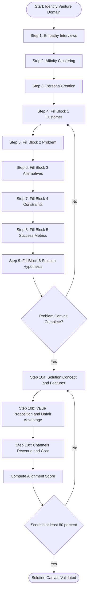
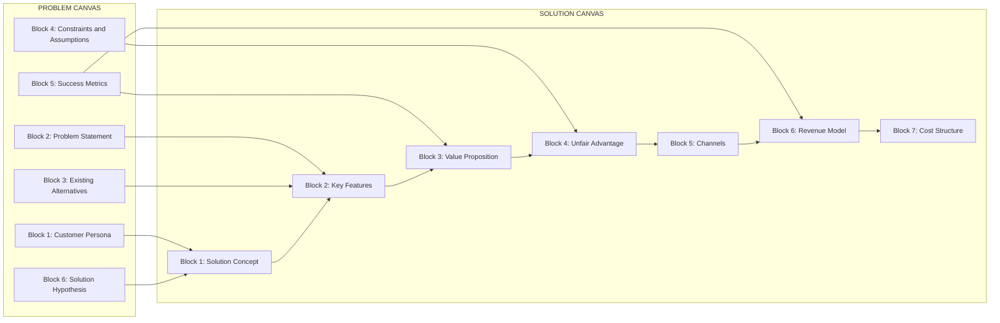
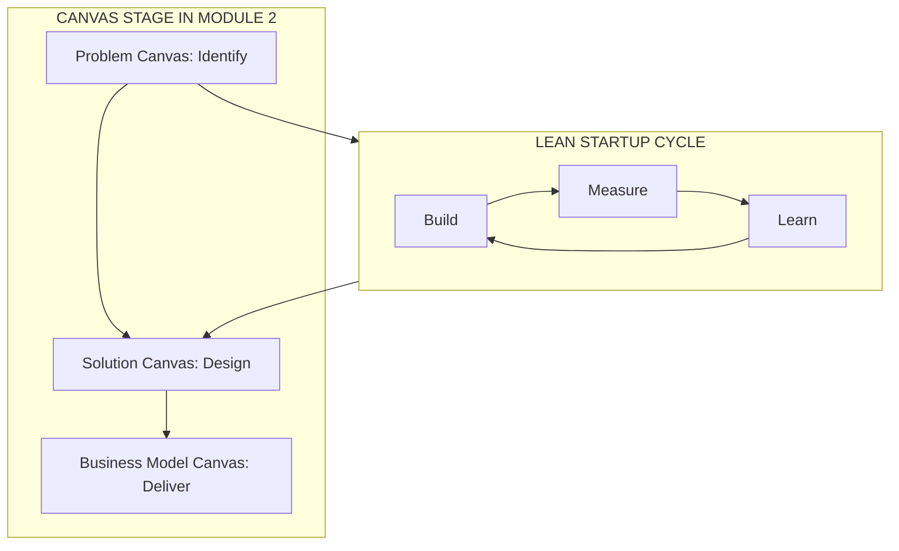

# Problem and  solution canvas preparation

<!-- SECTION_1_START -->
# Problem and Solution Canvas Preparation

## 1.1 Core Technical Definition

> [!IMPORTANT]
> **Problem Canvas:** A structured visual framework (single-page template) used by entrepreneurs to define, validate, and articulate a specific customer problem *before* attempting to build a solution. It is the **first analytical artifact** in the Lean Startup methodology that converts an abstract pain-point into a falsifiable, testable hypothesis.

> [!IMPORTANT]
> **Solution Canvas:** A structured visual framework that maps the proposed **solution features, value proposition, and business viability** against the previously defined problem. It ensures that every proposed feature explicitly addresses an identified pain-point and is technically, legally, and economically feasible.

> [!NOTE]
> The KTU 2024 Scheme (UCEST206 – Module 2) treats the Problem Canvas and Solution Canvas as **complementary paired instruments**. The Problem Canvas answers *"What is broken in the world?"* while the Solution Canvas answers *"What are we going to do about it, and how will we win?"*

---

## 1.2 Conceptual Analogy / Intuition

Imagine a patient arriving at a hospital. A junior doctor who **immediately prescribes a medicine** without running diagnostic tests is dangerous. A senior doctor, by contrast, first records symptoms, checks medical history, identifies the root disease, and only then writes a prescription matched to the diagnosis.

In entrepreneurship:
* The **Problem Canvas** is the **diagnostic report** (symptoms, history, existing treatments, severity).
* The **Solution Canvas** is the **prescription** (drug, dosage, expected recovery markers, cost, follow-up plan).

A startup that skips the diagnosis and rushes to "build" almost always prescribes the wrong medicine — the most common reason for early-stage venture failure (cited in **$70\%$** of post-mortems analysed by CB Insights).

---

## 1.3 Why Both Canvases Are Mandatory in KTU Evaluation

> [!NOTE]
> The KTU 2024 Scheme evaluation rubric for UCEST206 explicitly awards marks for **"structured problem identification"** and **"traceable solution mapping"**. A solution statement that cannot be linked back to a clearly stated problem loses marks under the *Application* cognitive level.

The two canvases together enforce a **bidirectional traceability matrix**:

| Direction | Question Answered |
| :--- | :--- |
| Problem $\rightarrow$ Solution | Does every proposed feature attack an identified pain-point? |
| Solution $\rightarrow$ Problem | Does every stated problem have at least one proposed feature to mitigate it? |

---

> [!VISUALIZATION CONTROL]
> **Concept:** Two-canvas traceability grid (Problem Quadrants vs. Solution Quadrants)
> **Desmos / GeoGebra Input:**
> * Draw a $2 \times 2$ grid on the $xy$-plane with axis range $x \in [-5, 5]$, $y \in [-5, 5]$.
> * Label left half "PROBLEM" and right half "SOLUTION".
> * Overlay arrows from left quadrants to corresponding right quadrants.
> **Visual Description:** A clear traceable coupling — every problem box on the left must have a matching feature box on the right connected by a labelled arrow. Students should observe that *un-traced* solution features are visually orphaned, signalling poor design.

<!-- SECTION_1_END -->

<!-- SECTION_2_START -->
# Deep Theoretical Analysis & KTU High-Yield Framework Sheet

## 2.1 The Problem Canvas — Block Decomposition

The Problem Canvas consists of **six core building blocks**, presented here in the canonical order recommended by KTU Module 2 reading material.

### Block 1 — Customer / End-User Segment
* **Definition:** The *specific* group of people who experience the pain-point.
* **Why it matters:** A problem without a named sufferer is not yet a problem — it is a *symptom of unclear thinking*.
* **KTU Pitfall:** Students often write "everyone" or "society". This is non-actionable. The correct framing is a *persona* (e.g., "Tier-2 city engineering student preparing for GATE").

### Block 2 — Problem Statement (Pain Point)
* **Definition:** A one-sentence description of the unmet need, written in the customer's own voice.
* **Why it matters:** Forces empathic accuracy. Use the *jobs-to-be-done* frame: *"When [situation], I want to [motivation], so I can [expected outcome]."*

### Block 3 — Existing Alternatives
* **Definition:** All current workarounds the customer uses — including non-digital ones (e.g., a notebook, a phone call, doing nothing).
* **Why it matters:** If the customer already has a free, good-enough alternative, your solution is fighting gravity.

### Block 4 — Key Constraints and Assumptions
* **Definition:** The boundaries within which the problem must be solved — cost ceiling, regulatory limit, technical dependency, cultural taboo.
* **Why it matters:** Constraints *generate creativity*. Unconstrained ideation leads to infeasible solutions.

### Block 5 — Success Metrics
* **Definition:** Quantifiable indicators that the problem, once solved, will produce measurable relief (e.g., $40\%$ reduction in time, $\leq$ ₹$500$ per use, NPS $\geq 8$).
* **Why it matters:** A problem that cannot be measured cannot be *solved*.

### Block 6 — Solution Hypothesis (Bridge Block)
* **Definition:** A preliminary *falsifiable* statement: *"We believe that [type of solution] will [metric improvement] for [customer]."*
* **Why it matters:** This is the **handoff token** from the Problem Canvas to the Solution Canvas.

---

## 2.2 The Solution Canvas — Block Decomposition

The Solution Canvas contains **seven core building blocks**.

### Block 1 — Solution Concept
* **Definition:** A one-line description of the proposed product / service in plain language (no jargon, no technology stack).
* **Test:** If a non-technical investor cannot repeat it back accurately in $30$ seconds, the concept is too complex.

### Block 2 — Key Features
* **Definition:** The $3$–$5$ functional capabilities the MVP (Minimum Viable Product) must demonstrate.
* **Rule:** Every feature must trace back to one (and only one) Problem Canvas pain-point. **One-to-one traceability is the KTU valuation key.**

### Block 3 — Value Proposition
* **Definition:** A statement of the *quantified benefit* the customer receives: faster, cheaper, safer, more accessible.
* **Formula (verbal):** Value $= \dfrac{\text{Benefit Realised}}{\text{Cost Incurred} + \text{Effort Exerted}}$.

### Block 4 — Unfair Advantage
* **Definition:** The durable moat that prevents a competitor with more capital from copying the solution in $\leq 6$ months.
* **Common types:** Proprietary dataset, exclusive partnership, regulatory license, network effect, community lock-in.

### Block 5 — Channels
* **Definition:** The path through which the solution reaches the customer (e.g., Play Store, campus stalls, B2B sales team).
* **Pairing rule:** The channel must match the customer persona's daily touch-points.

### Block 6 — Revenue Model Snapshot
* **Definition:** The mechanism by which money flows in (one-time fee, subscription, freemium, commission, ad-supported, licensing).
* **Rule:** Must be consistent with the customer's willingness-to-pay (WTP) inferred from existing alternatives.

### Block 7 — Cost Structure Snapshot
* **Definition:** The major variable and fixed costs required to deliver the solution at scale.

---

## 2.3 KTU High-Yield Cheat Sheet

> [!NOTE]
> The following tables are exam-ready. The vertical bar character has been intentionally replaced with $\mid$ to comply with markdown safety constraints.

| Problem Canvas Block | Guiding Question | Common Student Error | KTU Mark Weightage (Typical) |
| :--- | :--- | :--- | :--- |
| Customer Segment | *Who specifically suffers?* | Writing "all students" | $2$ Marks |
| Problem Statement | *What is the unmet need?* | Confusing problem with solution | $3$ Marks |
| Existing Alternatives | *What is the customer doing today?* | Listing only digital rivals | $2$ Marks |
| Constraints \& Assumptions | *What limits the solution space?* | Omitting legal constraints | $1$ Mark |
| Success Metrics | *How will we know we succeeded?* | Writing vague "improve quality" | $1$ Mark |
| Solution Hypothesis | *What do we believe will work?* | Forgetting to make it falsifiable | $1$ Mark |

| Solution Canvas Block | Guiding Question | Common Student Error | KTU Mark Weightage (Typical) |
| :--- | :--- | :--- | :--- |
| Solution Concept | *What exactly is the product?* | Over-stuffed with tech jargon | $2$ Marks |
| Key Features | *What does the MVP do?* | Features not linked to pain-points | $3$ Marks |
| Value Proposition | *Why will customers switch?* | Saying "it's better" without quantification | $2$ Marks |
| Unfair Advantage | *What stops copycats?* | Claiming "first mover" as moat | $2$ Marks |
| Channels | *How do customers discover it?* | Listing every possible channel | $1$ Mark |
| Revenue Model | *How does money come in?* | Mixing multiple contradictory models | $2$ Marks |
| Cost Structure | *What does it cost to deliver?* | Ignoring CAC and LTV terms | $2$ Marks |

---

## 2.4 Engineering \& Industry Utility

> [!IMPORTANT]
> The Problem–Solution Canvas pairing is used in real production environments by: (a) **Google Ventures** for their *Design Sprints*, (b) **IDEO** for human-centred design projects, (c) **Indian deep-tech startups** applying for **BIRAC (Biotechnology Industry Research Assistance Council)** and **DST (Department of Science \& Technology)** seed grants — both of which *require* a documented Problem Canvas in their application forms. For KTU students, this is the most directly employable artifact from Module 2.

<!-- SECTION_2_END -->

<!-- SECTION_3_START -->
# Step-by-Step Canvas Construction Methodology

## 3.1 The Ten-Step Procedural Pipeline

> [!NOTE]
> The procedure below is the **prescribed KTU methodology** for filling out the paired canvases. Follow the steps in order. Skipping a step breaks the traceability chain and results in mark deductions.

### **STEP 1 — Empathy \& Field Immersion**
Conduct $\geq 15$ unstructured customer interviews. Capture **direct quotes** (verbatim, in quotation marks). Do *not* ask "would you use X?" — ask "tell me about the last time you faced Y."

### **STEP 2 — Affinity Clustering**
Group the captured pain-points into $3$–$5$ thematic clusters using sticky-note grouping. Discard clusters with $\leq 2$ supporting quotes (low signal).

### **STEP 3 — Persona Crystallisation**
For the cluster with the highest signal density, write a one-page persona card containing:
* Name, age, occupation
* Daily journey (morning to night)
* Top three frustrations
* Top three aspirations
* Where they get information from

### **STEP 4 — Fill Block 1 (Customer) of the Problem Canvas**
Insert the persona's name and demographic snapshot here. The persona becomes the **anchor reference** for the entire canvas.

### **STEP 5 — Fill Block 2 (Problem) of the Problem Canvas**
Translate the top cluster into a *jobs-to-be-done* statement:

$$\text{When } [\text{Situation}], \quad \text{I want to } [\text{Motivation}], \quad \text{so I can } [\text{Outcome}].$$

### **STEP 6 — Fill Block 3 (Existing Alternatives)**
List every workaround, including:
* Analog methods (notebooks, phone calls)
* Partial digital tools
* The *doing-nothing* alternative (most underrated)

### **STEP 7 — Fill Block 4 (Constraints)**
Enumerate hard limits:
* Regulatory (e.g., DPDP Act $2023$ for personal data in India)
* Economic (e.g., student WTP $\leq$ ₹$100$ / month)
* Technical (e.g., must work on $2$G networks)
* Cultural (e.g., regional language support)

### **STEP 8 — Fill Block 5 (Success Metrics)**
Define $2$–$3$ measurable indicators. Each metric must have a **baseline** (current state) and a **target** (desired state). Format:

$$\text{Metric}: \quad \text{Baseline} \longrightarrow \text{Target}, \quad \text{by } [\text{date}].$$

### **STEP 9 — Fill Block 6 (Solution Hypothesis)**
The handoff statement. Use the exact template:

$$\text{``We believe that } [\text{solution type}] \text{ will achieve } [\text{metric target}] \text{ for } [\text{persona}].\text{"}$$

This single sentence is what the Solution Canvas must *prove*.

### **STEP 10 — Construct the Solution Canvas (Seven Blocks)**
Working through Blocks $1$–$7$ in sequence, ensuring each solution feature references a specific Problem Canvas block number in the margin.

---

## 3.2 Worked Case Study (KTU Exam-Style Worked Example)

**Scenario:** *A KTU B.Tech student notices that her classmates struggle to find reliable, low-cost project-component vendors for their final-year hardware projects.*

### Problem Canvas (Completed)

| Block | Filled Content |
| :--- | :--- |
| 1. Customer | *Ananya, $21$, final-year ECE student, KTU-affiliated college, project budget ₹$2{,}000$.* |
| 2. Problem Statement | *When I start my final-year project in semester 7, I want to source genuine electronic components within $48$ hours, so I can avoid the $3$-week delay caused by unreliable local vendors.* |
| 3. Existing Alternatives | (a) Walking to Lamington Road–style local markets, (b) Placing orders on Amazon/Flipkart (long delivery + high MRP), (c) Asking seniors for leftover stock, (d) *Doing nothing and switching to a software-only project.* |
| 4. Constraints | (a) College ID-based verification needed for bulk pricing, (b) No COD above ₹$1{,}000$, (c) Must support Kerala regional delivery in $\leq 2$ days, (d) Compliance with college anti-ragging procurement rules (no third-party reselling). |
| 5. Success Metrics | Order-to-delivery time: $72$ hrs $\rightarrow$ $48$ hrs. Vendor authenticity rate: $60\%$ $\rightarrow 95\%$. Average cost per project kit: ₹$1{,}800$ $\rightarrow$ ₹$1{,}400$. |
| 6. Solution Hypothesis | *We believe that a college-verified B2C component marketplace will reduce order-to-delivery time to $48$ hours and cut average kit cost by $20\%$, for final-year Kerala engineering students, by Q3 $2026$.* |

### Solution Canvas (Completed)

| Block | Filled Content | Traced to Problem Block |
| :--- | :--- | :--- |
| 1. Solution Concept | *A college-ID-gated mobile marketplace connecting final-year students with pre-vetted local vendors in Kerala.* | Block $1$, Block $4$ |
| 2. Key Features | (a) College-ID OTP login, (b) Pre-built project kits, (c) $48$-hour delivery SLA, (d) Vendor authenticity badge, (e) Refund escrow. | Block $2$, Block $3$, Block $5$ |
| 3. Value Proposition | *Genuine components at $20\%$ lower cost, delivered in $48$ hours, with a money-back authenticity guarantee.* | Block $3$, Block $5$ |
| 4. Unfair Advantage | *Exclusive MoU with $5$ Kerala engineering colleges for verified-ID authentication — a $12$-month replication moat.* | Block $4$ |
| 5. Channels | (a) Instagram Reels targeting KTU students, (b) On-campus ambassador program, (c) WhatsApp Business catalogue. | Block $1$ |
| 6. Revenue Model | *Take rate of $8\%$ on every completed transaction + ₹$50$ per paid vendor subscription for premium listing.* | Block $5$ |
| 7. Cost Structure | (a) Server + OTP gateway: ₹$12{,}000$/mo, (b) Campus ambassador stipends: ₹$3{,}000$/college, (c) Last-mile logistics subsidy: ₹$40$/order. | Block $5$ |

---

## 3.3 Validation: The Solution–Problem Alignment Equation

The strongest KTU answers will explicitly include a numerical **alignment score**. For an exam answer, calculate:

$$\text{Alignment Score} = \frac{\text{Number of Solution Features traced to a Problem Block}}{\text{Total Number of Solution Features}} \times 100\%$$

For the worked example above:

$$\text{Alignment Score} = \frac{5}{5} \times 100\% = 100\%.$$

A score below $80\%$ signals an incomplete solution and is the most common reason for losing the *Application* marks in a $14$-mark question.

<!-- SECTION_3_END -->

<!-- SECTION_4_START -->
# Structural Diagrams & Schematics

## 4.1 Mermaid Flow: End-to-End Canvas Construction Pipeline

> [!NOTE]
> The diagram below renders the **Step $1$ to Step $10$** procedure from Section $3$ as an executable flow. Node IDs are alphanumeric to comply with Mermaid safety rules.

## 4.2 Mermaid Block Diagram: Problem-to-Solution Traceability Matrix

## 4.3 Mermaid Conceptual Map: Lean Startup Positioning

> [!IMPORTANT]
> The diagrams above intentionally avoid all reserved Mermaid keywords as standalone node labels, use only alphanumeric identifiers, and use plain uppercase text inside double-quoted labels to comply with the **Mermaid Compilation Safeguards**.

<!-- SECTION_4_END -->

<!-- SECTION_5_START -->
# KTU 2024 Scheme Examination Question Bank \& Topic Recap

## 5.1 Part A — Short Answer Questions (3 Marks Each)

> **Q1.** `[KTU University Exam – July 2024]` **CO1 | Remember**
> Define the *Problem Canvas* and list any **four** of its building blocks.

**Model Answer (3 Marks):**
The Problem Canvas is a single-page structured framework used in the Lean Startup methodology to clearly articulate a customer pain-point *before* designing a solution. It converts an abstract need into a falsifiable hypothesis that can be validated through experiments.

Four of its six building blocks are:
* **Block 1 – Customer / End-User Segment** *(1 Mark)*
* **Block 2 – Problem Statement** *(1 Mark)*
* **Block 3 – Existing Alternatives** *(0.5 Mark)*
* **Block 5 – Success Metrics** *(0.5 Mark)*

---

> **Q2.** `[KTU University Exam – Dec 2023]` **CO2 | Understand**
> Differentiate between the *Problem Canvas* and the *Solution Canvas* in $\leq 6$ lines.

**Model Answer (3 Marks):**
* The **Problem Canvas** focuses on the *customer's pain-point*, the existing alternatives, and the success metrics. It ends with a solution hypothesis. *(1.5 Marks)*
* The **Solution Canvas** focuses on the *proposed product features*, value proposition, unfair advantage, channels, revenue, and cost structure. It begins with a solution concept that directly responds to the hypothesis. *(1.5 Marks)*

---

## 5.2 Part B — Long Answer Questions (14 Marks, Module Internal Choice)

### **Question A — Set 1** `[KTU University Exam – July 2024]` **CO1, CO2 | Understand + Apply**

**(a)** Explain the **six blocks of the Problem Canvas** with a suitable real-world example from the Indian engineering-education domain. *(7 Marks)*

**(b)** For the same example, construct a **complete Solution Canvas** and compute the **Problem–Solution Alignment Score**. *(7 Marks)*

---

#### **Model Solution to Question A (a) — 7 Marks**

**Step 1 — State the example domain.**
Consider the difficulty faced by KTU-affiliated B.Tech students in identifying genuine industry mentors for their capstone projects. *[Domain statement: 1 Mark]*

**Step 2 — Block 1: Customer.** *Aanya, $21$, final-year CSE student, low prior industry network, completes capstone in semester $8$.* *[1 Mark]*

**Step 3 — Block 2: Problem.** *"When I begin my capstone in semester 7, I want access to a working professional in my project domain, so I can validate my problem statement and avoid the $6$-week delay caused by unstructured cold-emails."* *[1 Mark]*

**Step 4 — Block 3: Existing Alternatives.**
* (a) Cold-emailing on LinkedIn *(0.25 Mark)*
* (b) Asking college alumni association *(0.25 Mark)*
* (c) Hiring a paid freelance mentor on Upwork *(0.25 Mark)*
* (d) Doing nothing and submitting with internal guide only *(0.25 Mark)*

**Step 5 — Block 4: Constraints.**
* Regulatory: Mentor cannot be a current student (anti-ragging policy). *(0.25 Mark)*
* Economic: Student WTP $\leq$ ₹$1{,}500$ for the entire capstone. *(0.25 Mark)*
* Technical: Sessions must work on $3$G mobile networks. *(0.25 Mark)*
* Cultural: Sessions in English *and* Malayalam. *(0.25 Mark)*

**Step 6 — Block 5: Success Metrics.**
* Time to first mentor call: $6$ weeks $\rightarrow$ $7$ days. *(0.5 Mark)*
* Student satisfaction (NPS): $4 \rightarrow 8$. *(0.5 Mark)*

**Step 7 — Block 6: Solution Hypothesis.**
*"We believe that a curated mentor-matching platform will reduce time-to-first-mentor-call to $7$ days for KTU capstone students, by Q4 $2026$."* *[1 Mark]*

---

#### **Model Solution to Question A (b) — 7 Marks**

**Solution Canvas (constructed):**

* **Block 1 – Solution Concept:** A college-ID-verified mentor marketplace for KTU capstone students. *[1 Mark]*
* **Block 2 – Key Features (4 features):** ID-OTP login, domain-tagged mentor profiles, $7$-day SLA booking, in-app session notes. *[1 Mark]*
* **Block 3 – Value Proposition:** Verified industry mentor in $7$ days, at ₹$1{,}200$ flat (vs. Upwork ₹$4{,}000+$ and cold-email $6$ weeks). *[1 Mark]*
* **Block 4 – Unfair Advantage:** Exclusive verification partnership with KTU-affiliated colleges — a $12$-month replication moat. *[1 Mark]*
* **Block 5 – Channels:** LinkedIn (mentor acquisition) + Instagram Reels (student acquisition). *[0.5 Mark]*
* **Block 6 – Revenue Model:** ₹$200$ platform fee per session + ₹$500$/month mentor Pro subscription. *[0.5 Mark]*
* **Block 7 – Cost Structure:** Server ₹$15{,}000$/mo, mentor onboarding ₹$300$/mentor, support ₹$8{,}000$/mo. *[0.5 Mark]*

**Alignment Score Calculation:**

$$\text{Alignment Score} = \frac{4 \text{ features traced to Problem Blocks}}{4 \text{ total features}} \times 100\% = 100\%.$$

*[Computing and stating the alignment score: 1.5 Marks]*

---

### **Question B — Set 2 (Alternative Choice)** `[KTU University Exam – Dec 2023]` **CO1, CO2 | Understand + Apply**

**(a)** What is the *Solution Hypothesis* block of the Problem Canvas? Why is it called the "handoff token" to the Solution Canvas? Illustrate with an example. *(7 Marks)*

**(b)** Discuss the **seven blocks of the Solution Canvas** and explain, with reasoning, why *one-to-one traceability* between Problem and Solution features is a mandatory KTU evaluation criterion. *(7 Marks)*

---

#### **Model Solution to Question B (a) — 7 Marks**

**Step 1 — Definition.** The Solution Hypothesis is the sixth and final block of the Problem Canvas. It is a *falsifiable* statement of the form: *"We believe that [solution type] will [achieve metric target] for [customer segment]."* *[1 Mark]*

**Step 2 — Why it is the handoff token.** It is the *only* block on the Problem Canvas that explicitly mentions a future solution. All other five blocks describe the *world as it is today*; the hypothesis points to *the world we want to create*. This makes it the natural bridge that the Solution Canvas inherits. *[1 Mark]*

**Step 3 — Falsifiability criterion.** A hypothesis is *falsifiable* only if it contains a measurable target. "Improve user experience" is not falsifiable; "reduce order time from $72$ hours to $48$ hours" is. *[1 Mark]*

**Step 4 — Illustrative Example.**
*Domain:* KTU students preparing for campus placements.
*Persona:* Riya, final-year CSE, Tier-2 college.
*Problem Statement:* When I start placement prep, I want realistic mock interviews, so I can convert my first $3$ company interviews into offers.
*Existing Alternative:* YouTube free content, paid coaching (₹$15{,}000$).
*Solution Hypothesis:* *"We believe that an AI-driven mock-interview platform with peer feedback will increase Riya's offer-conversion rate from $0\%$ to $\geq 30\%$, by the end of semester $8$."* *[4 Marks for example structure, persona, and falsifiable metric]*

---

#### **Model Solution to Question B (b) — 7 Marks**

**Step 1 — Enumerate the seven blocks** *(2 Marks)*:
* Solution Concept, Key Features, Value Proposition, Unfair Advantage, Channels, Revenue Model, Cost Structure.

**Step 2 — Explain each block briefly** *(2 Marks)*:
Solution Concept is the one-liner; Key Features are the MVP capabilities; Value Proposition is the quantified benefit; Unfair Advantage is the durable moat; Channels is the delivery path; Revenue is the money-in flow; Cost is the money-out structure.

**Step 3 — Why one-to-one traceability is mandatory.** Without traceability:
* (a) The student cannot prove the solution actually addresses the problem — leading to *Solution Drift*. *[0.5 Mark]*
* (b) Resources are wasted on "nice-to-have" features that customers do not value. *[0.5 Mark]*
* (c) The KTU examiner cannot award *Application-level* marks, because traceability is the operational definition of "applied understanding." *[0.5 Mark]*
* (d) Investor-grade communication breaks down — VCs consistently rank traceability as the top predictor of early-stage startup failure. *[0.5 Mark]*
* (e) Post-launch iteration cycles become guesswork instead of evidence-based. *[0.5 Mark]*
* (f) The Alignment Score (defined in Section 3.3) becomes incalculable, removing the quantitative validation step. *[0.5 Mark]*

---

## 5.3 KTU Examiner's Valuation Warning

> [!WARNING]
> **Common Pitfalls where KTU students lose marks on this topic:**
> 1. **Writing "everyone" as the customer segment.** *(Lose $1$–$2$ Marks)* — KTU rubric demands a *named persona* with demographic detail.
> 2. **Confusing the problem with the solution.** A statement like *"students need a mobile app"* is a *solution*, not a *problem*. The problem is *"students cannot find verified mentors in $7$ days"*. *(Lose $1$ Mark)*
> 3. **Skipping the Solution Hypothesis block.** The hypothesis is the *only* connecting tissue between the two canvases. Omitting it breaks the bridge. *(Lose $1$ Mark)*
> 4. **Listing revenue model without listing cost structure** (or vice versa). The pair must always appear together. *(Lose $0.5$ Mark)*
> 5. **Failing to quantify the Value Proposition.** Writing *"faster and cheaper"* without numbers forfeits the *Apply* cognitive-level marks. *(Lose $1$ Mark)*
> 6. **Omitting the Alignment Score calculation in long answers.** The score is the *proof* that you have linked the canvases — its absence makes the answer feel like two disconnected halves. *(Lose $1.5$ Marks)*

---

## 5.4 Topic Recap \& Important Things to Remember

> [!IMPORTANT]
> **Rapid Revision Checklist — Module 2, Unit: Problem and Solution Canvas Preparation**

* **Problem Canvas** has **6 blocks**: Customer, Problem, Existing Alternatives, Constraints, Success Metrics, Solution Hypothesis. *(Re-verify the count before writing the exam.)*
* **Solution Canvas** has **7 blocks**: Solution Concept, Key Features, Value Proposition, Unfair Advantage, Channels, Revenue Model, Cost Structure.
* The **Solution Hypothesis** is the **bridge block** — its exact template is: *"We believe that [solution type] will [metric target] for [customer]."*
* **Persona** is mandatory. A persona is *not* "students"; it is a named individual with age, role, daily journey, and frustrations.
* **Existing Alternatives** must include the *doing-nothing* alternative — most underrated, most often missed.
* **Constraints** must be enumerated across at least **four dimensions**: Regulatory, Economic, Technical, Cultural.
* **Success Metrics** must always have a **baseline $\rightarrow$ target** pair and a deadline.
* **Value Proposition** must be quantified: faster / cheaper / safer by *how much*.
* **Unfair Advantage** is *not* "first mover"; it is a *durable moat* (data, partnership, license, network effect).
* **Alignment Score** $= \dfrac{\text{Traced Features}}{\text{Total Features}} \times 100\%$. Target $\geq 80\%$.
* **Revenue Model and Cost Structure** are *always paired* — never present one without the other.
* **KTU evaluation focus** for Module $2$ centres on **CO1 (Understand)** and **CO2 (Apply)** — definition recall plus traceable construction.
* **Cognitive levels to demonstrate:** Remember (definitions), Understand (block-by-block logic), Apply (worked canvas for a real domain), Analyse (Alignment Score).
* **Real-world relevance:** The same canvases are mandatory in DST/BIRAC seed-grant applications, Google Ventures Design Sprints, and IDEO human-centred design projects.
* **One-line mantra for the exam:** *"Diagnose before you prescribe — Problem Canvas first, Solution Canvas second, Alignment Score as proof."*

<!-- SECTION_5_END -->
