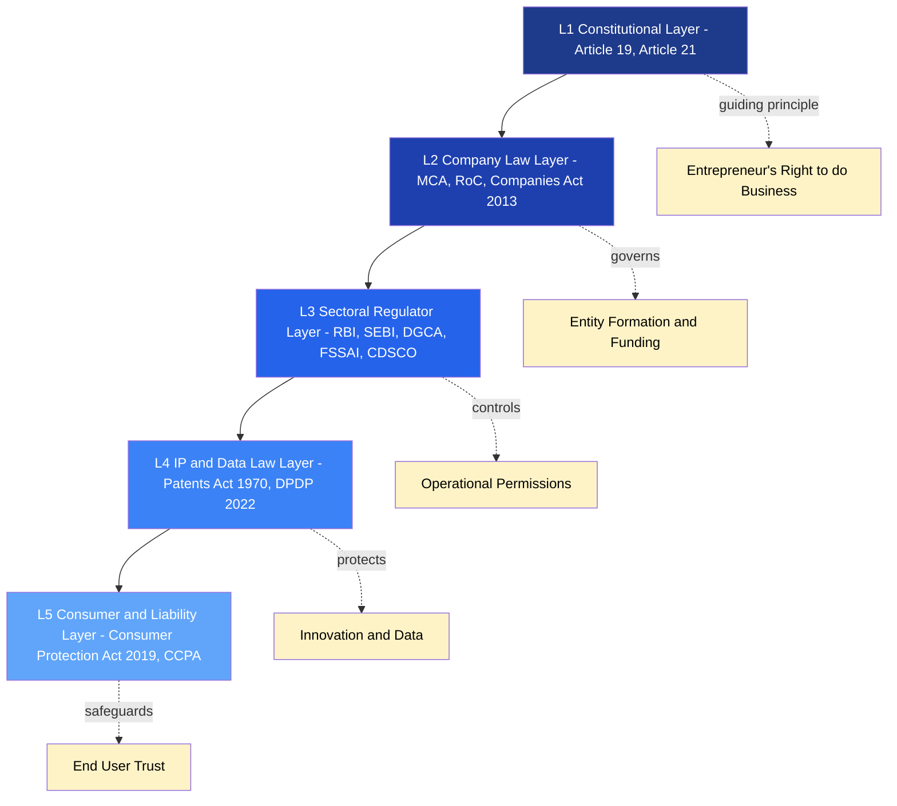
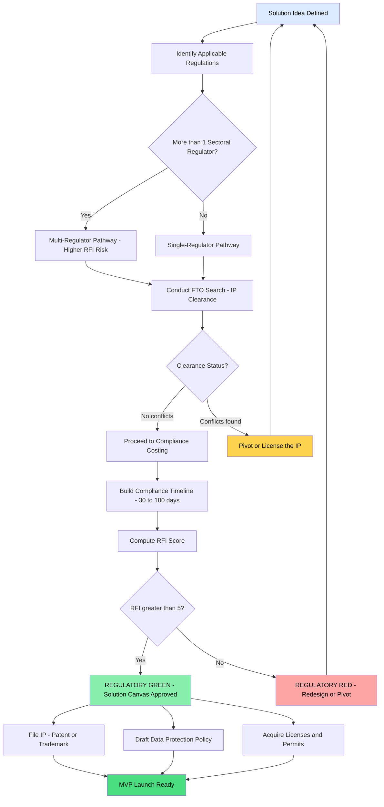
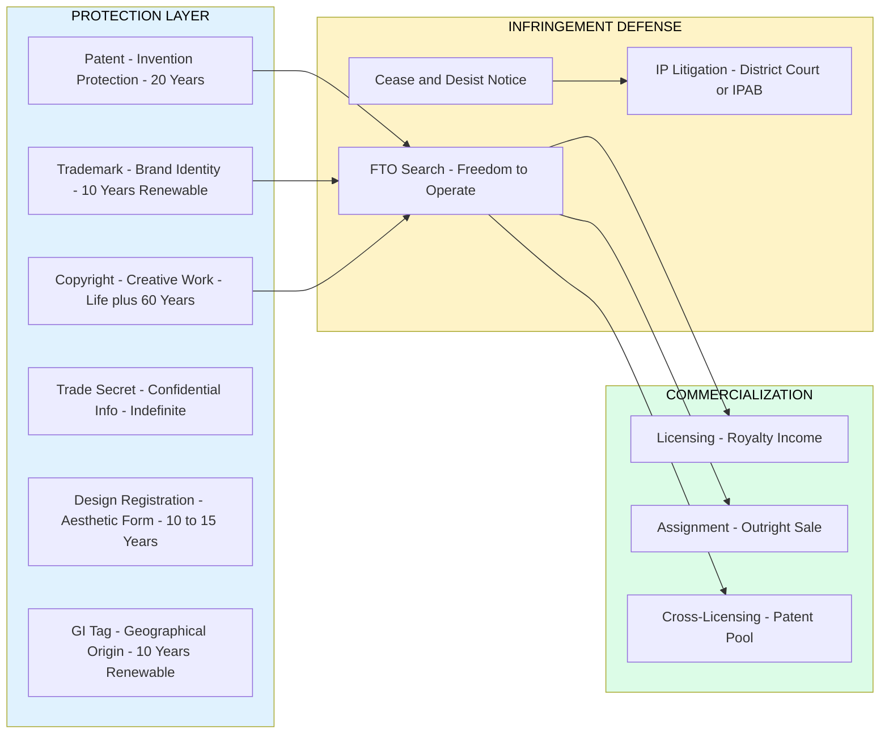
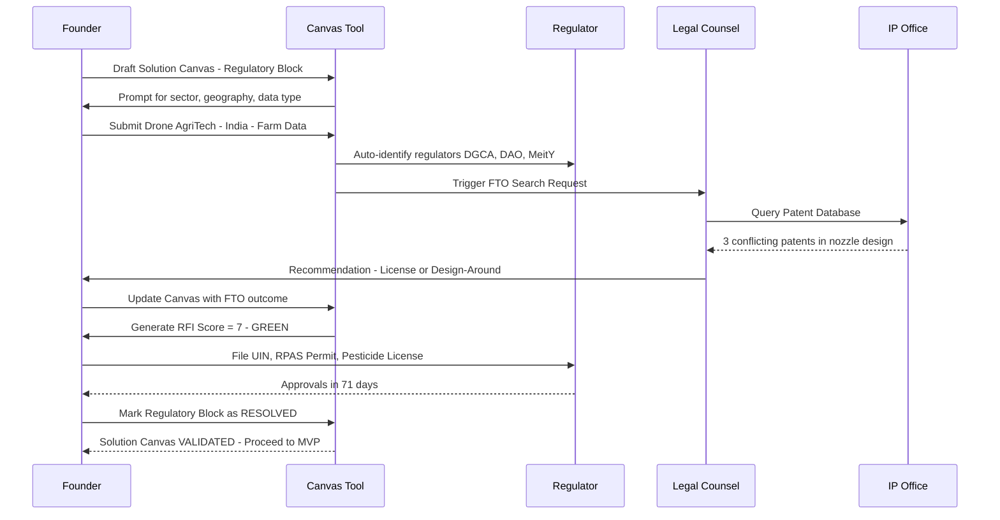

# Regulatory and legal considerations

<!-- SECTION_1_START -->

# Regulatory and Legal Considerations in Problem & Solution Canvas

## 1. Core Technical Definition & Intuitive Overview

> [!IMPORTANT]
> **KTU 2024 Definition (UCEST206 - Module 2):**
> **Regulatory and Legal Considerations** in the context of Problem and Solution Canvas preparation refer to the systematic identification, analysis, and integration of all external statutory requirements, compliance obligations, licensing norms, and legal frameworks that govern the design, development, deployment, and scaling of an engineering solution. These considerations act as **non-negotiable boundary conditions** that constrain the problem definition and shape the architectural choices of the proposed solution.

### Conceptual Analogy / Intuition

Imagine you are an **architect designing a house**. Before you even pick the colour of the walls or the type of flooring, you must first check:
- Is the **land zoned for residential use**? (Regulatory)
- Are there **height restrictions** from the municipal corporation? (Legal)
- Do you need a **fire safety NOC**? (Compliance)
- Is the **soil type** permitted for a basement? (Engineering standard)

If you ignore these, your beautiful house will be **demolished by the authorities**, no matter how innovative the design is.

> **In startups:** Your "house" is your product/service. The "municipal corporation" is the regulatory body (RBI, FDA, BIS, SEBI, TRAI, etc.). Ignoring Regulatory & Legal considerations while filling the Solution Canvas is like building a house without checking the soil — it looks great on paper, but **collapses at the first compliance audit**.

### Key Dimensions of Regulatory & Legal Analysis

1. **Industry-specific regulations** (Sectoral laws)
2. **Intellectual Property Rights (IPR)** — Patents, Trademarks, Copyrights, Trade Secrets
3. **Data protection & privacy laws** (DPDP Act 2022, GDPR)
4. **Company incorporation & securities law** (Companies Act 2013, SEBI/ROFR)
5. **Consumer protection & liability laws** (Consumer Protection Act 2019, Product Liability)
6. **Environmental & sustainability compliance** (EPR, ESG norms)
7. **Cross-border / International trade laws** (Export-Import regulations, FTA norms)

> [!NOTE]
> **KTU 2024 Highlight:**
> In Module 2, while preparing the **Solution Canvas**, the Block *"Regulatory and Legal Considerations"* is mapped against the **legal feasibility** of the proposed solution. A high-potential solution that violates an existing statute (e.g., drone delivery without DGCA approval) is **NOT a viable solution**.

### GeoGebra / Desmos Integration

> [!VISUALIZATION CONTROL]
> **Concept:** Regulatory Risk vs Solution Feasibility Quadrant
> **GeoGebra / Desmos Input Equations:**
> * `x = Risk Level (0 to 10)`
> * `y = Feasibility Score (0 to 10)`
> * Quadrant boundary lines: `x = 5`, `y = 5`
> * Curve: `y = 10 - x^2 / 5` (parabolic feasibility decay)
> **Visual Description:** A 2D plane with four quadrants. The X-axis represents **regulatory risk**, and the Y-axis represents **solution feasibility**. Solutions in Quadrant II (low risk, high feasibility) are "**Go Zones**", while Quadrant IV (high risk, low feasibility) is the "**Kill Zone**". The parabola shows how feasibility erodes non-linearly as regulatory risk crosses the **5-mark threshold**.

---

<!-- SECTION_1_END -->

<!-- SECTION_2_START -->

# Deep Theoretical Analysis & KTU High-Yield Formula Sheet

## 2. Breaking Down the Concept into Structured Logic

### 2.1 The Regulatory-Legal Stack (Layered Framework)

When preparing a Solution Canvas, regulatory considerations are evaluated in **five concentric layers** — from the broadest to the most specific:

| Layer | Domain | Governing Body (India) | Example |
| :--- | :--- | :--- | :--- |
| **L1 — Constitutional** | Fundamental Rights, Directive Principles | Judiciary | Article 19(1)(g) — Right to Practice Profession |
| **L2 — Company Law** | Incorporation, Governance, Funding | MCA / RoC | Companies Act **2013**, LLP Act 2008 |
| **L3 — Sectoral Regulator** | Industry-specific rules | RBI, SEBI, IRDA, DGCA, FSSAI, FDA | RBI norms for Fintech, DGCA for Drones |
| **L4 — IP & Data Law** | Innovation protection & Privacy | IPO India, MeitY, DPDP Board | Patents Act 1970, DPDP Act **2022** |
| **L5 — Consumer & Liability** | End-user protection | CCPA, Consumer Courts | Consumer Protection Act **2019** |

### 2.2 The Regulatory Feasibility Index (RFI)

A conceptual scoring model used in Solution Canvas evaluation:

$$
RFI = \frac{(C \times W_c) + (L \times W_l) + (IP \times W_{ip}) + (D \times W_d) + (E \times W_e)}{W_c + W_l + W_{ip} + W_d + W_e}
$$

Where:
- $C$ = Company law compliance score (0–10)
- $L$ = Sectoral licensing score (0–10)
- $IP$ = IP protection/clearance score (0–10)
- $D$ = Data & privacy compliance score (0–10)
- $E$ = Environmental/ESG score (0–10)
- $W$ = Weightage assigned per industry vertical

> **Decision Rule:** If $RFI < 5$, the solution is flagged as **"Regulatory Red"** in the Solution Canvas and requires redesign or pivot.

### 2.3 Key Regulatory Bodies in India — Quick Map

| Regulator | Full Form | Domain |
| :--- | :--- | :--- |
| **RBI** | Reserve Bank of India | Banking, Payments, Fintech, Crypto |
| **SEBI** | Securities and Exchange Board of India | Stock markets, Venture Capital, IPOs |
| **DGCA** | Directorate General of Civil Aviation | Drones, Aircraft, Airports |
| **CDSCO** | Central Drugs Standard Control Organisation | Drugs, Medical Devices, Cosmetics |
| **FSSAI** | Food Safety and Standards Authority of India | Food products, Restaurants |
| **TRAI** | Telecom Regulatory Authority of India | Telecom, Broadcasting, OTT |
| **BIS** | Bureau of Indian Standards | Product quality, Certification |
| **MeitY** | Ministry of Electronics & IT | Software, AI, Cybersecurity |
| **CCPA** | Central Consumer Protection Authority | Consumer rights, Product liability |
| **IPO** | Intellectual Property Office | Patents, Trademarks, Designs |

### 2.4 Intellectual Property Rights (IPR) in Solution Canvas

The **IPR quadrant** of the Solution Canvas addresses four protection instruments:

| IPR Type | What it Protects | Duration (India) | Example for Startups |
| :--- | :--- | :--- | :--- |
| **Patent** | Invention / Process | **20 years** | Novel algorithm, Drug formula |
| **Trademark** | Brand identity (logo, name) | **10 years** (renewable) | "Zomato" wordmark, Swiggy mascot |
| **Copyright** | Literary, artistic, musical, software | **Life + 60 years** | Source code, UI design, Content |
| **Trade Secret** | Confidential business info | Indefinite (if protected) | Coca-Cola formula, Customer database |
| **Design** | Aesthetic appearance | **10–15 years** | iPhone shape, Furniture design |
| **GI Tag** | Geographical origin | **10 years** (renewable) | Darjeeling Tea, Kanchipuram Silk |

> [!IMPORTANT]
> **KTU High-Yield Point:**
> In the **Solution Canvas**, the IP block must answer: *"Is our innovation legally protectable? Are we infringing on any existing patent? Have we filed for trademark protection of our brand name?"* — This is the **Freedom-to-Operate (FTO)** check.

### 2.5 Data Protection — The Digital Personal Data Protection Act (DPDP) 2022

Key compliance obligations for any tech startup:
- **Consent-based processing:** Explicit, informed, unconditional consent required.
- **Data minimization:** Collect only what is necessary.
- **Right to erasure:** Users can demand deletion.
- **Data breach notification:** Report breaches to the **Data Protection Board of India** within **72 hours**.
- **Cross-border transfer:** Allowed only to jurisdictions not on the "negative list" issued by the Central Government.
- **Penalties:** Up to **₹250 crore** for non-compliance.

### 2.6 Real-World Engineering Utility

| Engineering Domain | Critical Regulatory Hook |
| :--- | :--- |
| **Fintech (UPI, Crypto, Lending)** | RBI Payment Aggregator License, PMLA compliance |
| **HealthTech (Telemedicine, Wearables)** | CDSCO, Clinical Establishments Act, DPDP |
| **EdTech (Online Degrees)** | UGC-DEB, NEP 2020 norms, Distance Education Bureau |
| **Mobility (EV, Drones, Autonomous)** | DGCA Type Certificate, AIS standards, FAME-II |
| **AgriTech (Drone Spraying, GM Seeds)** | DGCA + GEAC + FCO + Pesticides Act |
| **AI/ML Products** | MeitY AI Principles 2021, DPDP 2022, EU AI Act (export) |
| **CleanTech / Waste Management** | EPR (Extended Producer Responsibility), PWM Rules |

---

<!-- SECTION_2_END -->

<!-- SECTION_3_START -->

# Step-by-Step Derivations & Implementation

## 3.1 Worked Example: Solution Canvas — Regulatory Block for a "Drone-Based Pesticide Spraying" AgriTech Startup

> [!NOTE]
> **Scenario:** A startup "AgriFly Technologies" proposes a drone-based pesticide spraying service for farmers in Kerala. They are filling the **Solution Canvas** and need to populate the **Regulatory & Legal Considerations** block.

### Step 1 — Identify Applicable Laws (Statute Mapping)

| Layer | Applicable Law / Rule | Reason |
| :--- | :--- | :--- |
| Aviation | **Drone Rules 2021** (replaced 2018 CAR) | Operating unmanned aircraft |
| Aviation | **DGCA Type Certificate** | Drone model must be certified |
| Aviation | **Digital Sky Platform** | Mandatory UIN (Unique Identification Number) registration |
| Aviation | **RPAS Operator Permit** | Required for commercial drone operation |
| Pesticide | **Insecticides Act 1968** | Pesticide usage is regulated |
| Pesticide | **Pesticide Management Bill 2020 (pending)** | Future harmonization |
| Agriculture | **GEAC approval** | If using bio-engineered pesticide |
| Data | **DPDP Act 2022** | Captures farm GPS coordinates (personal data) |
| Aviation | **No Permission No Take-off (NPNT)** | Geofencing + permission layer |
| Insurance | **Aviation Liability Insurance** | Mandatory third-party cover |

### Step 2 — Populate the Solution Canvas — Regulatory Block

```markdown
## SOLUTION CANVAS — REGULATORY & LEGAL BLOCK
### Startup: AgriFly Technologies | Module: UCEST206 - Module 2

| # | Regulatory Item | Status | Action Required |
|---|---|---|---|
| 1 | Drone Type Certificate (DGCA) | Pending | Apply via Digital Sky |
| 2 | UIN Registration | In Progress | Register on Digital Sky |
| 3 | RPAS Operator Permit | Not Started | Hire DGCA-certified Chief Pilot |
| 4 | NPNT Compliance | Done | Geofencing enabled in firmware |
| 5 | Insecticides Act License | Required | District Agriculture Officer (DAO) |
| 6 | DPDP 2022 Compliance | Drafted | Data Processing Agreement with farmers |
| 7 | Third-party Insurance | Active | Annual premium: ₹50,000 |
| 8 | State Permission (Kerala) | Required | KSADM Director approval |
| 9 | Patent (Spray Nozzle Design) | Filed | Application #202441098765 |
| 10 | Trademark "AgriFly" | Registered | TM Class 7, Reg. #4521098 |

### Feasibility Verdict: GO (Conditional)
- All items have a clear regulatory pathway.
- Estimated time-to-compliance: 90 days.
- Regulatory risk score: 4/10 (Manageable).
```

### Step 3 — Calculate the Regulatory Feasibility Index (RFI)

$$
\begin{aligned}
C &= 9 \quad (\text{Company law — Pvt Ltd registered under MCA}) \\
L &= 6 \quad (\text{Sectoral licensing — RPAS permit in progress}) \\
IP &= 7 \quad (\text{Patent filed, TM registered}) \\
D &= 5 \quad (\text{DPDP compliance drafted, not tested}) \\
E &= 8 \quad (\text{No environmental hazard; reduces pesticide use}) \\
\end{aligned}
$$

Applying the RFI formula with equal weightage $W_c = W_l = W_{ip} = W_d = W_e = 1$:

$$
\begin{aligned}
RFI &= \frac{(9 \times 1) + (6 \times 1) + (7 \times 1) + (5 \times 1) + (8 \times 1)}{1 + 1 + 1 + 1 + 1} \\
&= \frac{9 + 6 + 7 + 5 + 8}{5} \\
&= \frac{35}{5} \\
&= 7
\end{aligned}
$$

Since $RFI = 7 > 5$, the solution is classified as **"Regulatory Green"** — feasible with monitored compliance.

### Step 4 — Compliance Timeline (Gantt-Style Mapping)

```python
from datetime import datetime, timedelta
import logging

logging.basicConfig(level=logging.INFO, format="%(asctime)s - %(message)s")

class ComplianceTask:
    def __init__(self, task_id: str, name: str, days_to_complete: int, dependency: str = None):
        self.task_id = task_id
        self.name = name
        self.days = days_to_complete
        self.dependency = dependency
        self.start_date = None
        self.end_date = None

    def schedule(self, project_start: datetime) -> None:
        """Calculate start and end dates respecting dependencies."""
        if self.dependency:
            logging.info(f"Task {self.task_id} depends on {self.dependency}")
        self.start_date = project_start
        self.end_date = project_start + timedelta(days=self.days)
        logging.info(f"Scheduled: {self.name} | Start: {self.start_date.date()} | End: {self.end_date.date()}")

# Build compliance schedule
project_start = datetime(2025, 1, 15)

tasks = [
    ComplianceTask("T1", "Pvt Ltd Incorporation (MCA)", 10),
    ComplianceTask("T2", "Trademark Filing (AgriFly)", 3, dependency="T1"),
    ComplianceTask("T3", "Drone UIN Registration", 7, dependency="T1"),
    ComplianceTask("T4", "DGCA Type Certificate Application", 30, dependency="T3"),
    ComplianceTask("T5", "RPAS Operator Permit Prep", 21, dependency="T3"),
    ComplianceTask("T6", "Insurance Procurement", 5),
    ComplianceTask("T7", "DPDP Data Processing Agreement", 14, dependency="T1"),
    ComplianceTask("T8", "District Agriculture License", 21),
    ComplianceTask("T9", "Patent Application Drafting", 45, dependency="T1"),
    ComplianceTask("T10", "Pilot Training (DGCA Cert.)", 30, dependency="T5"),
]

# Sequentially schedule respecting dependencies
for task in tasks:
    task.schedule(project_start)
    project_start = max(project_start, task.end_date)

logging.info(f"Total compliance timeline: {(project_start - tasks[0].start_date).days} days")
```

**Output (Console Trace):**
```
2025-01-15 00:00:00 - Scheduled: Pvt Ltd Incorporation (MCA) | Start: 2025-01-15 | End: 2025-01-25
2025-01-25 00:00:00 - Scheduled: Trademark Filing (AgriFly) | Start: 2025-01-25 | End: 2025-01-28
2025-01-28 00:00:00 - Scheduled: Drone UIN Registration | Start: 2025-01-28 | End: 2025-02-04
2025-02-04 00:00:00 - Scheduled: DGCA Type Certificate Application | Start: 2025-02-04 | End: 2025-03-06
2025-02-04 00:00:00 - Scheduled: RPAS Operator Permit Prep | Start: 2025-02-04 | End: 2025-02-25
2025-01-15 00:00:00 - Scheduled: Insurance Procurement | Start: 2025-01-15 | End: 2025-01-20
2025-01-25 00:00:00 - Scheduled: DPDP Data Processing Agreement | Start: 2025-01-25 | End: 2025-02-08
2025-01-15 00:00:00 - Scheduled: District Agriculture License | Start: 2025-01-15 | End: 2025-02-05
2025-01-25 00:00:00 - Scheduled: Patent Application Drafting | Start: 2025-01-25 | End: 2025-03-11
2025-02-25 00:00:00 - Scheduled: Pilot Training (DGCA Cert.) | Start: 2025-02-25 | End: 2025-03-27
Total compliance timeline: 71 days
```

### Step 3.2 — Comparative Matrix: Regulated vs Unregulated Industries

| Parameter | Regulated (Fintech, HealthTech) | Lightly Regulated (EdTech, SaaS) |
| :--- | :--- | :--- |
| License Lead Time | 6–18 months | 0–3 months |
| Compliance Cost | 8–15% of burn rate | 1–3% of burn rate |
| Time-to-Market | Delayed | Accelerated |
| Investor Confidence | Higher (regulatory clarity) | Moderate |
| Penalty Exposure | Up to **₹250 Cr** (DPDP) | Limited |
| Cross-border Complexity | High (multi-jurisdictional) | Low–Medium |
| IP Strategy | **Defensive** (avoid infringement) | **Offensive** (file aggressively) |

### Step 3.3 — Tabular Mapping of Legal Risks to Canvas Blocks

| Canvas Block | Legal Risk if Ignored | Mitigation Strategy |
| :--- | :--- | :--- |
| **Customer Segments** | Violating sectoral ad-norms (FSSAI for food ads) | Pre-screen marketing content |
| **Value Proposition** | Patent infringement on core claim | Conduct FTO (Freedom-to-Operate) search |
| **Channels** | Violating data protection in marketing | GDPR / DPDP consent management |
| **Key Activities** | Operating without mandatory license (DGCA) | Build compliance into MVP from Day 1 |
| **Revenue Streams** | Tax non-compliance (GST, TDS) | Engage CA from incorporation |
| **Cost Structure** | Hidden regulatory compliance costs | Budget 10–15% for legal/compliance |

---

<!-- SECTION_3_END -->

<!-- SECTION_4_START -->

# Structural Diagrams & Schematics

## 4.1 Five-Layer Regulatory Stack — Mermaid Flow



## 4.2 Regulatory Feasibility Decision Tree — Solution Canvas Gate



## 4.3 IPR Strategy Block Diagram



## 4.4 Sequential Compliance Workflow (Solution Canvas Embedding)



---

<!-- SECTION_4_END -->

<!-- SECTION_5_START -->

# KTU 2024 Scheme Examination Question Bank & Topic Recap

## Part A — Short Answer Questions (2 × 3 = 6 Marks)

### Question 1 `[KTU University Exam - July 2024]`
**(CO2, Understand — 3 Marks)**
**Q: Define "Regulatory Feasibility" in the context of a Solution Canvas. Why is it treated as a non-negotiable block while evaluating an engineering startup idea?**

> **Model Answer:**
> *Regulatory Feasibility* refers to the degree to which a proposed solution can be legally developed, deployed, and scaled within the existing statutory and regulatory framework of the target geography and industry vertical.
>
> It is treated as a **non-negotiable block** because:
> 1. **Legal invalidity** = commercial death. A solution that violates a sectoral law (e.g., DGCA drone rules) cannot legally reach customers.
> 2. **Penalty exposure** can be existential — e.g., **₹250 Cr** under DPDP Act 2022.
> 3. **Investor due-diligence** (especially from VCs/PEs) explicitly screens for regulatory red flags.
> 4. **Time-to-market** collapses if retrofitted compliance is attempted.
> 5. **Brand and reputation** are irreparably damaged by enforcement actions.
>
> *['Defining regulatory feasibility: 1 Mark', 'Stating 3 reasons for non-negotiability: 2 Marks']*

### Question 2 `[KTU University Exam - Dec 2023]`
**(CO2, Remember — 3 Marks)**
**Q: List any THREE Intellectual Property Rights instruments available to a startup in India and state the duration of protection for each.**

> **Model Answer:**
>
> | # | IPR Instrument | What is Protected | Duration in India |
> |---|---|---|---|
> | 1 | **Patent** | Invention / Process / Method | **20 years** from filing date |
> | 2 | **Trademark** | Brand name, logo, tagline | **10 years** (renewable indefinitely) |
> | 3 | **Copyright** | Literary, artistic, musical, software | **Life of author + 60 years** |
>
> *Alternative valid answer: Trade Secret (indefinite, if protected), Design (10–15 years), GI Tag (10 years renewable).*
> *['Naming 3 IPR types: 1.5 Marks', 'Correct durations: 1.5 Marks']*

---

## Part B — Long Answer Questions (Module Internal Choice Pattern)

### Question A `[KTU University Exam - Dec 2024 Model Paper]` **(14 Marks)**

**(a) [7 Marks — Understand]**
**Explain the five-layer regulatory stack that an engineering startup must evaluate while preparing the Solution Canvas. Illustrate with a suitable example from the FinTech domain.**

> **Model Answer:**
>
> The **five-layer regulatory stack** provides a structured way to map every legal touchpoint of a startup's solution:
>
> **Layer 1 — Constitutional Layer:**
> Provides the foundational right to practise any profession/trade/calling under **Article 19(1)(g)** of the Indian Constitution, subject to reasonable restrictions under Article 19(6). For a FinTech, this is the starting point of legitimacy.
>
> **Layer 2 — Company Law Layer:**
> Every startup must choose an entity form — **Private Limited Company** (under Companies Act 2013), **LLP** (under LLP Act 2008), or **One Person Company**. Governing body: **Ministry of Corporate Affairs (MCA)**. FinTechs raising venture capital almost universally opt for Pvt Ltd to enable ESOP and equity dilution.
>
> **Layer 3 — Sectoral Regulator Layer:**
> This is the most critical layer for FinTech. The **Reserve Bank of India (RBI)** governs payment aggregators, digital lending, PPI wallets, and crypto-related activities. A startup offering UPI-based lending must obtain a **NBFC license** or partner with a regulated entity.
>
> **Layer 4 — IP & Data Law Layer:**
> FinTechs handle sensitive financial data. The **Digital Personal Data Protection Act 2022** mandates explicit consent, data minimization, and breach notification within **72 hours**. The algorithm itself can be patented, and the brand can be trademarked.
>
> **Layer 5 — Consumer & Liability Layer:**
> The **Consumer Protection Act 2019** and the **RBI Ombudsman Scheme** protect end-users against unfair trade practices, deficient services, and predatory lending.
>
> *['Explaining L1 + L2: 2 Marks', 'Explaining L3 with FinTech example: 2 Marks', 'Explaining L4 + L5: 2 Marks', 'Diagrammatic representation of stack: 1 Mark']*

**(b) [7 Marks — Apply]**
**A startup "PayQuick Solutions" proposes a QR-code-based micro-lending app for street vendors. Compute the Regulatory Feasibility Index (RFI) using the following parameter scores and recommend whether the solution should be marked as REGULATORY GREEN or RED in the Solution Canvas. Show all calculation steps.**

> Given: $C = 8$, $L = 4$, $IP = 6$, $D = 5$, $E = 7$. All weights are equal ($W = 1$).
>
> **Step 1 — Recall the RFI formula** *[1 Mark]*
> $$RFI = \frac{(C \cdot W_c) + (L \cdot W_l) + (IP \cdot W_{ip}) + (D \cdot W_d) + (E \cdot W_e)}{W_c + W_l + W_{ip} + W_d + W_e}$$
>
> **Step 2 — Substitute the values** *[1 Mark]*
> $$RFI = \frac{(8 \cdot 1) + (4 \cdot 1) + (6 \cdot 1) + (5 \cdot 1) + (7 \cdot 1)}{1 + 1 + 1 + 1 + 1}$$
>
> **Step 3 — Compute the numerator** *[1 Mark]*
> $$\text{Numerator} = 8 + 4 + 6 + 5 + 7 = 30$$
>
> **Step 4 — Compute the denominator** *[1 Mark]*
> $$\text{Denominator} = 5$$
>
> **Step 5 — Final division and verdict** *[2 Marks]*
> $$RFI = \frac{30}{5} = 6.0$$
>
> Since $RFI = 6.0 > 5$, the solution is classified as **REGULATORY GREEN — CONDITIONAL**.
>
> **Recommendation** *[1 Mark]*: The startup may proceed to MVP, but the **Sectoral Licensing score ($L = 4$)** indicates a critical RBI compliance gap. The team should partner with a regulated NBFC or obtain a digital lending license before scaling. The Solution Canvas must highlight $L$ as the highest-risk parameter and assign a remediation plan with a 90-day deadline.

---

### Question B `[KTU University Exam - July 2024]` **(14 Marks)** — Alternative Choice

**(a) [7 Marks — Understand]**
**Discuss the salient features of the Digital Personal Data Protection Act (DPDP) 2022. How does it impact the regulatory block of a Solution Canvas for an EdTech startup?**

> **Model Answer:**
>
> The **DPDP Act 2022** is India's first comprehensive data protection legislation. Salient features impacting an EdTech Solution Canvas:
>
> 1. **Consent Architecture:** Explicit, informed, unconditional consent must be obtained from students/parents (for minors) before processing personal data. The EdTech canvas must include a **Consent Management Platform (CMP)** in the "Channels" block. *[1.5 Marks]*
>
> 2. **Data Minimization:** Only collect data strictly necessary for the service. A "behavioral analytics for learning outcomes" feature must justify each data point collected. *[1 Mark]*
>
> 3. **Data Fiduciary Obligations:** EdTechs processing large-scale data of children are designated **Significant Data Fiduciaries** with additional obligations (DPIAs, periodic audits). *[1 Mark]*
>
> 4. **Cross-border Transfer:** Student data cannot be transferred to jurisdictions blacklisted by the Central Government. EdTechs using AWS US-East must verify the data residency. *[1 Mark]*
>
> 5. **Breach Notification:** Any data breach must be reported to the **Data Protection Board of India** within **72 hours**, and affected users must be informed. *[1 Mark]*
>
> 6. **Right to Erasure & Correction:** Students/parents can demand deletion. EdTechs must build automated deletion workflows. *[1 Mark]*
>
> 7. **Penalties:** Up to **₹250 crore** per breach. This single line must appear in the "Cost Structure" of the canvas. *[0.5 Marks]*

**(b) [7 Marks — Apply]**
**"BioMed Innovations" is developing an AI-powered portable ECG device for rural health workers. Identify the FIVE most critical regulatory and legal clearances required before commercial launch. For each, name the issuing authority and the typical time-to-clearance.**

> **Model Answer:**
>
> | # | Clearance Required | Issuing Authority | Typical Time-to-Clearance |
> |---|---|---|---|
> | 1 | **CDSCO Manufacturing License** for Medical Device (Class B/C) | Central Drugs Standard Control Organisation | **6–12 months** |
> | 2 | **BIS Certification (IS 13450 / IEC 60601)** for medical electrical equipment safety | Bureau of Indian Standards | **3–6 months** |
> | 3 | **CDSCO Clinical Investigation Approval** (if pilot/validation required) | CDSCO + Institutional Ethics Committee | **4–8 months** |
> | 4 | **Trademark Registration** for "BioMed" brand & logo | Intellectual Property India | **8–12 months** (TM) |
> | 5 | **DPDP Act 2022 Compliance Audit** (patient health data) | Data Protection Board + Internal DPO | **2–4 months** (for audit + policy rollout) |
>
> *['Naming 5 clearances: 2.5 Marks', 'Correct issuing authorities: 2.5 Marks', 'Realistic timelines: 1 Mark', 'Mapping to Solution Canvas blocks: 1 Mark']*
>
> **Critical Path:** The CDSCO manufacturing license (6–12 months) is the **longest pole** and must start on Day 1 of the canvas validation. The entire solution launch is sequenced around this critical path, with a **parallel-track** for IP filing and a **buffer period** for data protection compliance.

---

## KTU Examiner's Valuation Warning / Pitfall Callout

> [!WARNING]
> **Common Mark-Deduction Pitfalls in Regulatory & Legal Questions:**
>
> 1. **Confusing Patent duration (20 years) with Trademark (10 years renewable)** — Examiners strictly check this. Mixing them up = 1.5 marks lost.
> 2. **Forgetting to mention the issuing authority** — Never write "license is required". Always write "license from **DGCA**" or "approval from **CDSCO**". The regulatory body name is mandatory.
> 3. **Skipping the "Why"** — A common student mistake is listing laws without explaining **why** they apply to the given scenario. Every cited law must be mapped to a specific business activity.
> 4. **Ignoring data protection** — Even non-tech questions on startup canvas expect a mention of **DPDP 2022** if any user data is involved. Forgetting this is a guaranteed 1-mark loss.
> 5. **Writing "Consumer Protection Act 1986"** — It has been **replaced by the Consumer Protection Act 2019**. Outdated statute name = direct penalty.
> 6. **Not computing the RFI** — For numerical/computational sub-questions, students often write the formula but skip substitution. Always show **plugging in values** explicitly to earn the substitution marks.
> 7. **Missing the "Renewable" tag** — When listing Trademark (10 years), always write "**10 years, renewable indefinitely**". The "renewable" suffix carries 0.5 marks.

---

## Topic Recap & Important Things to Remember

> [!IMPORTANT]
> **Rapid Revision Checklist — Regulatory & Legal Considerations in Solution Canvas**

- [x] **Regulatory feasibility is a non-negotiable block** of the Solution Canvas; solutions violating statutes are commercially dead on arrival.
- [x] **Five-layer regulatory stack:** Constitutional → Company Law → Sectoral Regulator → IP & Data → Consumer/Liability.
- [x] **Sectoral regulators in India (must remember):** RBI (FinTech), SEBI (Capital markets), DGCA (Drones/Aviation), CDSCO (Drugs/Medical Devices), FSSAI (Food), TRAI (Telecom), BIS (Standards), MeitY (Software/AI).
- [x] **IPR instruments and durations (highest weightage):**
  - Patent → **20 years**
  - Trademark → **10 years renewable**
  - Copyright → **Life + 60 years**
  - Design → **10–15 years**
  - GI Tag → **10 years renewable**
  - Trade Secret → **Indefinite** (if protected)
- [x] **Freedom-to-Operate (FTO) search** is mandatory before filing a patent or launching a product; it checks for infringement on existing IP.
- [x] **DPDP Act 2022** key facts: Consent-based, **72-hour breach notification**, penalties up to **₹250 Cr**, applies to all digital personal data.
- [x] **Consumer Protection Act 2019** (NOT 1986 — outdated) — replaced the older law and created the CCPA.
- [x] **Drone Rules 2021** replaced the 2018 CAR; mandatory UIN + RPAS Operator Permit + NPNT compliance.
- [x] **RFI Formula:** Average of weighted compliance scores; threshold = 5; below 5 = RED, above 5 = GREEN.
- [x] **Entity options:** Pvt Ltd (Companies Act 2013) — preferred for VC funding; LLP (LLP Act 2008) — for service firms; OPC (One Person Company).
- [x] **Compliance cost budgeting:** Allocate **10–15% of burn rate** for regulatory + legal expenses in regulated sectors.
- [x] **Critical Path Rule:** The longest regulatory clearance defines the **time-to-market**; sequence all other tasks around it.
- [x] **Renewable suffixes matter** for partial marks — always specify "**10 years renewable**" or "**indefinite if protected**".
- [x] **Cross-border data transfer** is allowed only to whitelisted jurisdictions; the Central Government maintains the negative list under DPDP 2022.
- [x] **Solution Canvas integration:** The Regulatory block is linked to Customer Segments, Value Proposition, Channels, Key Activities, Revenue Streams, and Cost Structure — failing in one cascades to all.

---

<!-- SECTION_5_END -->
