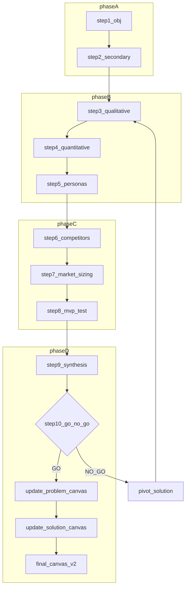
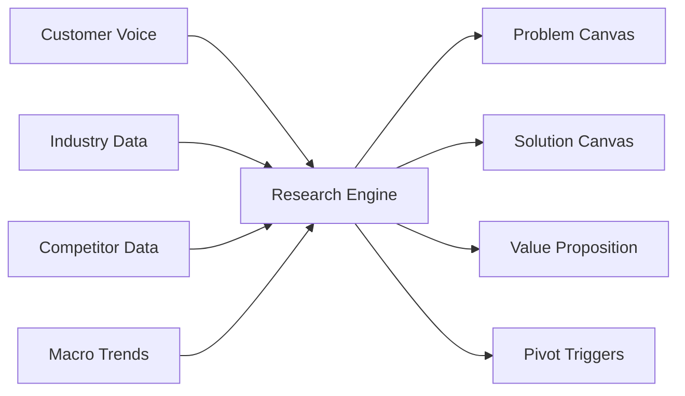
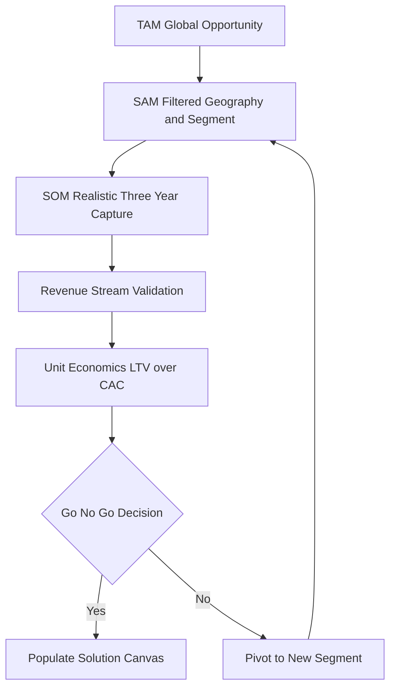
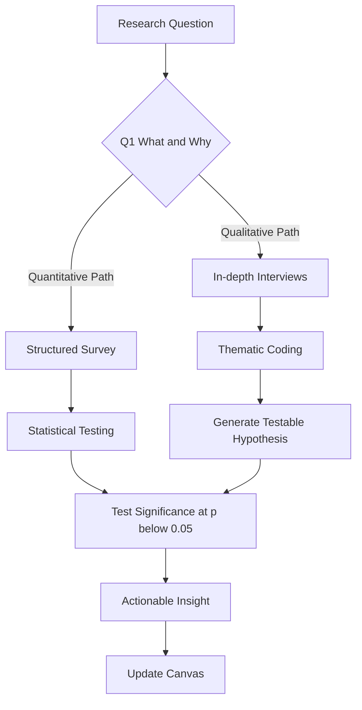

# Review of market research

<!-- SECTION_1_START -->

# Review of Market Research

## 1. Core Technical Definition

**Market Research** is the systematic, objective, and exhaustive process of gathering, recording, and analyzing data about the target market, customers, competitors, and the overall industry ecosystem to facilitate informed entrepreneurial decision-making. In the context of the **Problem–Solution Canvas** preparation, market research acts as the empirical validation layer that bridges the gap between an assumed problem (hypothesis) and a validated problem (evidence-based insight).

> [!IMPORTANT]
> **KTU 2024 Syllabus Definition (UCEST206 – Module 2):**
> "Market Research is the qualitative and quantitative investigation of the market environment to identify customer needs, estimate market size, understand competitive dynamics, and validate the desirability, feasibility, and viability of a proposed solution before commercialization."

The two principal pillars of market research as recognized by the KTU Entrepreneurship framework are:

1. **Primary Research** — First-hand data collection directly from the source (customers, experts, prospects).
2. **Secondary Research** — Second-hand data mined from existing publications, reports, databases, and online repositories.

## 2. Intuitive Overview: The "Detective" Analogy

> [!NOTE]
> **Conceptual Analogy — The Market Detective:**
> Imagine you are a detective assigned to solve a "crime" called *Why is the problem unsolved in the market?* Before arresting a culprit (proposing a solution), you must:
> - **Interview the victims** (talk to potential customers) — this is **Primary Research**.
> - **Read old case files** (study industry reports, journals, patents) — this is **Secondary Research**.
> - **Study repeat offenders** (analyze competitors) — this is **Competitive Analysis**.
> - **Check crime statistics** (measure market size and growth) — this is **Market Sizing**.

Without this detective work, the entrepreneur is essentially guessing — a fatal mistake in early-stage ventures. The **Problem Canvas** captures the *what* (the customer's pain), while the **Solution Canvas** captures the *how* (your proposed remedy). Market research is the **courtroom evidence** that supports both.

> [!TIP]
> **The 3 V's of Market Research (as per KTU NEP 2020 framework):**
> - **Desirability** — Do customers *want* it?
> - **Feasibility** — Can we *build* it?
> - **Viability** — Can we *sustain* it commercially?

> [!VISUALIZATION CONTROL]
> **Concept:** Market Research Quadrant Mapping
> **GeoGebra / Desmos Input Equations:**
> * `x-axis: Customer Validation (Low → High)`
> * `y-axis: Solution Maturity (Low → High)`
> * `Point A = (2, 2) : "Assumption Trap"`
> * `Point B = (8, 8) : "Product-Market Fit"`
> **Visual Description:** Plot the journey of an entrepreneur from the bottom-left quadrant (unvalidated assumption) to the top-right quadrant (validated product-market fit) using market research as the diagonal vector.

---

<!-- SECTION_1_END -->

<!-- SECTION_2_START -->

# Deep Theoretical Analysis & KTU High-Yield Formula Sheet

## 1. The Six Pillars of Market Research

The systematic conduct of market research for a problem–solution canvas can be broken down into the following structured analytical layers:

### Pillar 1 — Problem Validation Research
- **Objective:** Confirm that the assumed pain point is *real, recurring, and urgent*.
- **Methods:** Customer interviews, observation studies, empathy mapping, jobs-to-be-done analysis.
- **Output:** Validated problem statement for the **Problem Canvas**.

### Pillar 2 — Customer & User Segmentation
- **Objective:** Build detailed personas of early adopters and end users.
- **Tools:** Demographic, psychographic, and behavioral segmentation matrices.
- **Output:** Segmented user base feeding into the Customer Segment block of the **Business Model Canvas**.

### Pillar 3 — Market Sizing (TAM, SAM, SOM)
- **Objective:** Quantify the addressable opportunity in monetary or unit terms.
- **Frameworks:** Top-down, bottom-up, and value-theory approaches.
- **Output:** Defensible revenue projections and growth ceilings.

### Pillar 4 — Competitive Intelligence
- **Objective:** Map direct, indirect, and substitute alternatives; identify white spaces.
- **Frameworks:** Porter's Five Forces, SWOT, perceptual mapping.
- **Output:** Differentiation strategy for the **Solution Canvas**.

### Pillar 5 — Solution Testing & Prototyping Feedback
- **Objective:** Test the minimum viable solution (MVS) with a small user cohort.
- **Methods:** A/B testing, landing page experiments, Wizard of Oz prototypes, concierge MVPs.
- **Output:** Iterative refinement loop feeding back into the Solution Canvas.

### Pillar 6 — Industry & Trend Analysis
- **Objective:** Understand macroeconomic, regulatory, and technological forces.
- **Tools:** PESTLE analysis, trend reports, patent landscape studies.
- **Output:** Strategic risk matrix and timing decisions.

> [!IMPORTANT]
> **Why this matters for KTU 2024 Scheme:**
> Module 2 of UCEST206 explicitly requires students to demonstrate how market research **feeds each block** of the Problem and Solution Canvas. The examiner expects at least **3 specific data points** derived from research to populate the canvas.

## 2. KTU High-Yield Formula Sheet

| **S.No** | **Concept** | **Formula / Framework** | **Application Block** | **Unit / Output** |
|---|---|---|---|---|
| 1 | Total Addressable Market | $TAM = \text{Total potential customers} \times \text{Annual average revenue per customer}$ | Revenue ceiling | Currency (₹ / \$) |
| 2 | Serviceable Available Market | $SAM = TAM \times \text{Geographic \%} \times \text{Segment \%}$ | Realistic market scope | Currency |
| 3 | Serviceable Obtainable Market | $SOM = SAM \times \text{Realistic market share \%}$ | Year 1–3 revenue target | Currency |
| 4 | Customer Acquisition Cost | $CAC = \dfrac{\text{Total Sales \& Marketing Spend}}{\text{Number of New Customers Acquired}}$ | Viability check | Currency |
| 5 | Customer Lifetime Value | $LTV = \text{Average Order Value} \times \text{Purchase Frequency} \times \text{Customer Lifespan}$ | Long-term unit economics | Currency |
| 6 | LTV : CAC Ratio | $\text{Ratio} = \dfrac{LTV}{CAC}$ | Sustainability threshold (must be $\geq 3:1$) | Dimensionless |
| 7 | Market Growth Rate | $g = \dfrac{M_{t} - M_{t-1}}{M_{t-1}} \times 100$ | Trend analysis | \% per annum |
| 8 | Sample Size (for surveys) | $n = \dfrac{Z^2 \cdot p \cdot (1-p)}{e^2}$ | Statistical validity of primary research | Respondents |
| 9 | Churn Rate | $C = \dfrac{\text{Customers lost in period}}{\text{Customers at start of period}} \times 100$ | Retention metric | \% |
| 10 | Net Promoter Score | $NPS = \%\text{Promoters} - \%\text{Detractors}$ | Solution desirability | Score (-100 to +100) |
| 11 | Problem Severity Index | $PSI = \dfrac{\sum(\text{Frequency} \times \text{Impact} \times \text{Urgency})}{n}$ | Problem Canvas priority score | Dimensionless index |
| 12 | Competitive Density | $CD = \dfrac{\text{Number of active competitors}}{\text{Market revenue (in millions)}}$ | White-space detection | Firms per million |

> [!NOTE]
> **Engineering & Real-World Utility:**
> Market research is the foundational input for:
> - **Lean Startup methodology** (Build–Measure–Learn loops).
> - **Stage-gate funding decisions** in venture capital firms.
> - **Go/No-Go decisions** in corporate R\&D pipelines.
> - **Government innovation grants** (e.g., DST, BIRAC, Kerala Startup Mission) — funding agencies require documented market validation before disbursement.

---

<!-- SECTION_2_END -->

<!-- SECTION_3_START -->

# Step-by-Step Implementation: Conducting Market Research for Canvas Preparation

## 1. Exhaustive 10-Step Market Research Workflow (Tabular Comparative Matrix)

The following matrix maps each phase of market research to a **regulatory, academic, and execution framework** as required by the KTU 2024 Scheme Outcome-Based Education model.

| **Step** | **Phase** | **Action** | **Tool / Method** | **Canvas Block Populated** | **Key Deliverable** | **CO Mapping** |
|---|---|---|---|---|---|---|
| 1 | **Define the Research Objective** | Formulate 3–5 SMART research questions | Hypothesis tree, 5W2H framework | Problem Canvas – Existing Alternatives | Research brief document | CO1 (Understand) |
| 2 | **Secondary Data Collection** | Mine published reports, patents, whitepapers | Google Scholar, Statista, IBISWorld, USPTO | Problem Canvas – Industry Analysis | Annotated bibliography | CO1 (Remember) |
| 3 | **Primary Data Collection – Qualitative** | Conduct 15–30 semi-structured customer interviews | Interview guide, empathy map | Problem Canvas – Customer Pains \& Gains | Verbatim transcripts, audio recordings | CO2 (Apply) |
| 4 | **Primary Data Collection – Quantitative** | Deploy online/offline survey to $\geq 100$ respondents | Google Forms, Typeform, SurveyMonkey | Problem Canvas – Pain Severity Heatmap | Frequency tables, charts | CO2 (Apply) |
| 5 | **Persona Development** | Synthesize interviews into 2–3 buyer personas | Empathy Map, Jobs-to-be-Done | Solution Canvas – Early Adopter Profile | Persona cards (one-pagers) | CO3 (Analyze) |
| 6 | **Competitive Analysis** | Map direct, indirect, and substitute solutions | Porter's Five Forces, Feature matrix | Solution Canvas – Key Metrics \& UVP | Competitive positioning map | CO3 (Analyze) |
| 7 | **Market Sizing** | Calculate TAM, SAM, SOM using top-down + bottom-up | Excel/Google Sheets models | Solution Canvas – Channels \& Revenue | TAM-SAM-SOM pyramid diagram | CO4 (Apply) |
| 8 | **Solution Hypothesis Testing** | Run MVP experiments (concierge, Wizard of Oz, landing page) | A/B testing tools, Unbounce, Mailchimp | Solution Canvas – Solution Concept | MVP validation report | CO4 (Create) |
| 9 | **Synthesis & Insight Generation** | Convert raw data into 5–7 actionable insights | Affinity diagrams, dot voting | Both Canvases – Refined blocks | Insight deck (5 slides) | CO5 (Evaluate) |
| 10 | **Iteration \& Feedback Loop** | Re-validate the canvas with 3–5 industry experts | Expert review panel, advisor network | Final Canvases – Signed-off versions | Updated canvas v2.0 | CO5 (Create) |

## 2. Detailed Step-by-Step Calculation: Market Sizing Worked Example

To solidify the quantitative aspect demanded by KTU Module 2, let us compute a **TAM–SAM–SOM** projection for a hypothetical Kerala-based agri-tech startup selling IoT soil sensors to smallholder farmers.

> [!NOTE]
> **Worked Example Context:**
> Startup: *KeralaAgriSense* — a low-cost IoT soil moisture sensor priced at ₹1,500 per unit. Target geography: Kerala, Karnataka, and Tamil Nadu.

### Step 1 — Estimate the Total Addressable Market (TAM)

$$
\begin{aligned}
\text{Total smallholder farmers in India} &\approx 120{,}000{,}000 \\
\text{Average addressable spend per farmer per year (IoT + advisory)} &\approx ₹1{,}500 \\
TAM &= 120{,}000{,}000 \times 1{,}500 \\
TAM &= ₹180{,}000{,}000{,}000 \\
TAM &= ₹1.8 \text{ Lakh Crore}
\end{aligned}
$$

> **Valuation Credit:** Stating the assumption for customer count and average spend — 2 Marks; Final TAM expression — 1 Mark.

### Step 2 — Estimate the Serviceable Available Market (SAM)

$$
\begin{aligned}
\text{Target geographies share (Kerala + Karnataka + TN)} &\approx 12\% \\
\text{Segment filter: smallholders with smartphones} &\approx 40\% \\
SAM &= 1.8 \times 10^{12} \times 0.12 \times 0.40 \\
SAM &= ₹8.64 \times 10^{10} \\
SAM &= ₹8{,}640 \text{ Crore}
\end{aligned}
$$

### Step 3 — Estimate the Serviceable Obtainable Market (SOM)

$$
\begin{aligned}
\text{Realistic 3-year market share for a bootstrapped startup} &\approx 0.5\% \\
SOM &= 8.64 \times 10^{10} \times 0.005 \\
SOM &= ₹4.32 \times 10^{8} \\
SOM &= ₹43.2 \text{ Crore over 3 years}
\end{aligned}
$$

> **Valuation Credit:** Each successive market sizing step with assumption stated — 2 Marks; Final SOM value — 1 Mark.

### Step 4 — Validate Viability Using LTV : CAC

$$
\begin{aligned}
\text{Average Customer Lifespan} &= 4 \text{ years} \\
\text{Average Order Value (AOV)} &= ₹1{,}500 \\
\text{Purchase Frequency} &= 1.2 \text{ per year (sensor + replacements)} \\
LTV &= 1{,}500 \times 1.2 \times 4 = ₹7{,}200 \\[4pt]
\text{Blended CAC} &= ₹2{,}000 \\
\text{LTV : CAC Ratio} &= \dfrac{7{,}200}{2{,}000} = 3.6
\end{aligned}
$$

> [!TIP]
> A ratio of **3.6 : 1** exceeds the SaaS/IoT industry benchmark of 3 : 1, signalling that the unit economics are sustainable — a **green light** from a market research perspective.

---

<!-- SECTION_3_END -->

<!-- SECTION_4_START -->

# Structural Diagrams & Schematics

## 1. Market Research Process Flow (Mermaid Diagram)

The following Mermaid flowchart illustrates the **iterative market research engine** that powers the Problem–Solution Canvas preparation, with strict adherence to node-identifier and label-formatting safeguards.

## 2. Market Research Input–Output Block Architecture

## 3. TAM–SAM–SOM Funnel (Sequential Topology Matrix)

## 4. Qualitative vs Quantitative Research Decoupling

---

<!-- SECTION_4_END -->

<!-- SECTION_5_START -->

# KTU 2024 Scheme Examination Question Bank & Topic Recap

## PART A — Short Answer Questions (3 Marks Each)

### Question 1: Define Market Research and list its two main types. `[KTU University Exam – July 2024]`
**CO Mapping:** CO1 | **RBT Level:** Remember

**Model Answer (3 Marks):**
> **Market Research** is the systematic gathering, recording, and analysis of data relating to customers, competitors, and the market environment to support entrepreneurial decision-making. **[1 Mark]**
> The two main types are:
> 1. **Primary Research** — data collected first-hand from customers or experts (interviews, surveys, observations). **[1 Mark]**
> 2. **Secondary Research** — data collected from already existing sources (reports, journals, government databases, patents). **[1 Mark]**

### Question 2: State the difference between TAM, SAM, and SOM with a one-line example each. `[KTU University Exam – Dec 2023]`
**CO Mapping:** CO1 | **RBT Level:** Understand

**Model Answer (3 Marks):**
| **Metric** | **Definition** | **Example** |
|---|---|---|
| **TAM** | Total global demand for the product category. | All smartphone users in India. |
| **SAM** | The portion of TAM served by your geography and segment. | Smartphone users in Kerala aged 18–35. |
| **SOM** | Realistic share capturable in 3 years. | 50,000 paying users in Year 3. |

**[1 Mark for defining each, 1 Mark for examples]**

---

## PART B — Long Answer Questions (14 Marks Each — Internal Choice)

### Question A: Conduct a market research plan for a startup idea of your choice and explain how it feeds the Problem and Solution Canvas. `[KTU University Exam – Dec 2023]`
**CO Mapping:** CO2, CO3 | **RBT Level:** Apply, Analyze

#### (a) Design a 7-step market research plan for a chosen startup idea. **[7 Marks]**

**Model Answer (Step-by-Step, 7 Marks):**

> *Chosen Idea: "MediKerala" — an AI-powered vernacular telemedicine app for rural Kerala.*

**Step 1 — Define the Research Objective** **[1 Mark]**
"Validate that non-English-speaking rural Keralites aged 40+ will pay ₹99/month for a Malayalam telemedicine app." SMART research questions framed using the 5W2H model.

**Step 2 — Secondary Data Collection** **[1 Mark]**
Mine data from NITI Aayog health reports, Kerala DHS statistics, and Statista to estimate rural doctor-to-patient ratios.

**Step 3 — Qualitative Interviews** **[1 Mark]**
Conduct 20 semi-structured interviews in districts like Wayanad and Idukki using an interview guide focused on past telemedicine experiences and language barriers.

**Step 4 — Quantitative Survey** **[1 Mark]**
Distribute a 12-question Google Form (validated with $n = \dfrac{1.96^2 \times 0.5 \times 0.5}{0.1^2} = 96 \approx 100$ respondents) to capture willingness-to-pay and feature priority.

**Step 5 — Persona Development** **[0.5 Mark]**
Create 2 personas: *"Aniamma, 58, Wayanad, diabetic farmer"* and *"Ramesh, 42, IT professional, Ernakulam"*.

**Step 6 — Competitive Mapping** **[0.5 Mark]**
Map against Practo, MFine, and Apollo 24/7 using a feature-vs-pricing matrix to identify a "vernacular + low-data" white space.

**Step 7 — MVP Validation** **[1 Mark]**
Launch a WhatsApp-based "Wizard of Oz" MVP where a real doctor is gated behind an AI symptom checker. Measure conversion and NPS.

> **Valuation Key:** Step coverage — 1 Mark each for 5 steps; condensed steps 5 and 6 — 0.5 each; Step 7 — 1 Mark for measurable outcome.

#### (b) Explain how the above research output populates each block of the Problem and Solution Canvas. **[7 Marks]**

**Model Answer (7 Marks):**

| **Canvas Block** | **Research Input** | **Example for MediKerala** | **Marks** |
|---|---|---|---|
| **Problem Canvas – Customers** | Persona + Jobs-to-be-Done | Aniamma: chronic patient, mobility issues | 1 |
| **Problem Canvas – Pains** | Interview verbatims | "Cannot explain symptoms in English to doctor" | 1 |
| **Problem Canvas – Gains** | Survey top feature picks | "Voice-based consultation in Malayalam" | 1 |
| **Problem Canvas – Alternatives** | Competitive analysis | Practo, Apollo, local clinics | 1 |
| **Solution Canvas – Solution Concept** | MVP test results | AI symptom checker + doctor handoff | 1 |
| **Solution Canvas – Key Metrics** | SOM + LTV/CAC | SOM = ₹2.4 Cr; LTV/CAC = 3.2 | 1 |
| **Solution Canvas – UVP** | White space identified | "First Malayalam-first low-data teleconsult" | 1 |

> **Valuation Key:** Tabular mapping — 1 Mark per row × 7 rows = 7 Marks.

---

### Question B: Differentiate between Primary and Secondary research. For a startup wanting to validate an assumption, recommend a research methodology with justification. `[KTU University Exam – July 2024]`
**CO Mapping:** CO1, CO4 | **RBT Level:** Understand, Apply

#### (a) Differentiate between Primary and Secondary research in a comparative table covering at least 6 parameters. **[7 Marks]**

**Model Answer (7 Marks):**

| **Parameter** | **Primary Research** | **Secondary Research** | **Marks** |
|---|---|---|---|
| **Source** | First-hand from customers/experts | Pre-existing reports, journals, databases | 1 |
| **Cost** | High (₹50K–₹5L) | Low to moderate (₹0–₹20K) | 1 |
| **Time** | Weeks to months | Hours to days | 1 |
| **Specificity** | Tailored to exact research question | Generic, may not fit context | 1 |
| **Recency** | Most current data | May be outdated | 1 |
| **Bias** | Subject to interviewer/sampling bias | Subject to publisher bias | 1 |
| **Sample Size** | Small (15–200 typical) | Large (thousands) | 1 |

> **Valuation Key:** 6 parameters × 1 Mark + 1 Mark for any one extra valid distinction = 7 Marks.

#### (b) Recommend and justify a mixed-method research design for a startup validating an "untested assumption". **[7 Marks]**

**Model Answer (7 Marks):**

> *Recommended Design:* **Convergent Parallel Mixed-Method Design** — secondary research first (broad landscape), followed by primary qualitative interviews (depth), and finally a quantitative survey (validation).

**Justification (7 Marks):**

1. **Step 1 — Secondary research (2 weeks):** Identify the market size, existing players, and macro trends. Cost-effective and fast. **[1 Mark]**
2. **Step 2 — Qualitative interviews (3 weeks):** 15–25 in-depth customer interviews using open-ended questions to surface *unknown unknowns* (e.g., emotional drivers, latent needs). **[2 Marks]**
3. **Step 3 — Quantitative survey (4 weeks):** Deploy a structured survey to $\geq 100$ respondents using a Likert scale to test the hypotheses surfaced in Step 2. **[2 Marks]**
4. **Step 4 — Triangulation (1 week):** Compare insights across all three streams; flag discrepancies for further investigation. **[1 Mark]**
5. **Step 5 — Insight-to-Canvas conversion (1 week):** Translate triangulated insights into 5 canvas updates. **[1 Mark]**

> [!WARNING]
> **KTU Examiner's Valuation Pitfall Callout:**
> - **Do NOT** recommend only one method (pure qualitative or pure quantitative) — examiners *penalize* single-method designs for early-stage startups. Always show **mixed-method** reasoning. **[−2 Marks deduction]**
> - **Do NOT** skip mentioning **sample size justification** using a formula (e.g., $n = Z^2 p(1-p)/e^2$). **[−1 Mark deduction]**
> - **Do NOT** fail to map at least 3 canvas blocks to specific research findings — the KTU Module 2 rubric explicitly requires canvas-population evidence. **[−2 Marks deduction]**
> - **Do NOT** confuse "market research" with "marketing research" — the former validates the *problem*, the latter promotes the *solution*.

---

## Topic Recap & Important Things to Remember

> [!TIP]
> **Rapid Revision Checklist for KTU 2024 Scheme – Module 2**

- **Definition:** Market Research = systematic data gathering + analysis to support entrepreneurial decisions.
- **Two Main Types:** Primary (first-hand) and Secondary (second-hand).
- **Six Pillars:** Problem validation, segmentation, sizing, competition, solution testing, trend analysis.
- **3 V's Framework:** Desirability, Feasibility, Viability.
- **TAM–SAM–SOM:** TAM (global) → SAM (filtered) → SOM (3-year capture). Always state assumptions explicitly.
- **LTV : CAC Ratio:** Must be $\geq 3:1$ for a sustainable business.
- **Sample Size Formula:** $n = \dfrac{Z^2 \cdot p \cdot (1-p)}{e^2}$ — with $Z=1.96$ and $p=0.5$ for maximum variability.
- **Mixed-Method Design:** Secondary → Qualitative → Quantitative → Triangulation is the gold-standard for early-stage validation.
- **Canvas Mapping:** Every research output MUST populate at least one specific block of the Problem or Solution Canvas.
- **Common Pitfalls:** Confusing marketing with market research, single-method designs, missing sample-size justification, no canvas mapping.
- **Tools to Memorize:** Empathy map, persona card, Porter's Five Forces, PESTLE, NPS, PSI, A/B testing.
- **Real-World Anchors:** Kerala Startup Mission, BIRAC, DST — all require documented market validation for grant approval.
- **Examiner Tip:** Always end any market research answer with a one-line statement on *which canvas block* the finding updates.

<!-- SECTION_5_END -->
