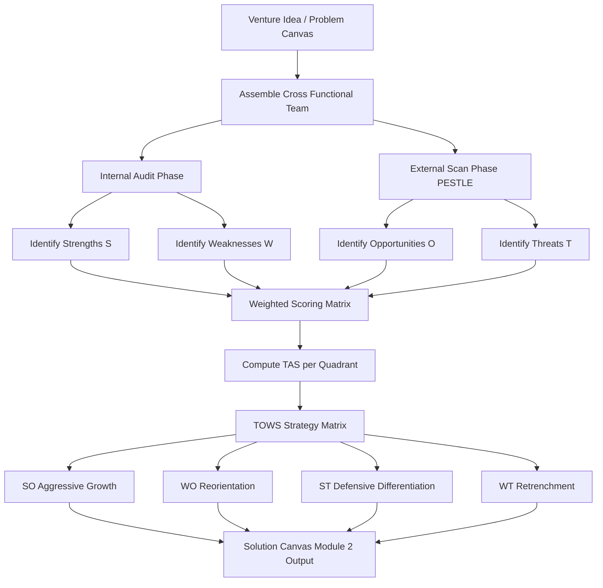
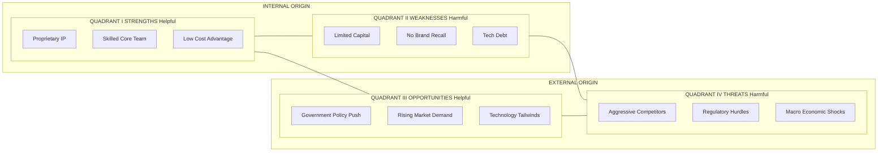
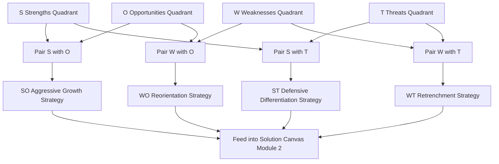

# SWOT analysis

<!-- SECTION_1_START -->

# SWOT Analysis — Core Technical Definition & Intuitive Overview

> [!IMPORTANT]
> **KTU 2024 Scheme | UCEST206 — Engineering Entrepreneurship and IPR**
> **Module 2:** Problem and Solution Canvas Preparation
> **Topic:** SWOT Analysis (Strategic Self-Auditing Framework)

## 1.1 Formal Academic Definition

**SWOT Analysis** is a strategic planning and situational auditing framework used by entrepreneurs, start-up founders, and corporate strategists to evaluate the internal and external factors that influence the success of a business venture, product launch, or project initiative. The acronym **SWOT** stands for:

- **S — Strengths** : Internal, positive attributes that give the venture a competitive advantage.
- **W — Weaknesses** : Internal, negative attributes that place the venture at a relative disadvantage.
- **O — Opportunities** : External, positive environmental factors that the venture can exploit for growth.
- **T — Threats** : External, negative environmental factors that could endanger the venture's stability.

In the KTU 2024 Scheme framework for **UCEST206 — Module 2 (Problem and Solution Canvas Preparation)**, SWOT Analysis is positioned as a **pre-cursor diagnostic tool** that feeds directly into the **Solution Canvas** by validating whether a proposed solution is robust enough to withstand competitive, regulatory, and market forces.

> [!NOTE]
> **Origin Reference:** The SWOT framework was developed in the **1960s** at the **Stanford Research Institute (SRI)** by Albert Humphrey, during a study commissioned by the **Fortune 500** corporations to identify why corporate planning failed. It remains the **gold-standard diagnostic matrix** in modern entrepreneurship curricula, including KTU's NEP 2020-aligned syllabus.

---

## 1.2 Conceptual Analogy / Intuition

> [!TIP]
> **"The Doctor's Check-up" Analogy:**
> Imagine you are a doctor examining a patient (your start-up idea) before prescribing medicine (the solution canvas). Before treatment, you conduct four checks:
>
> 1. **Strengths (Healthy organs):** "What is working well internally?" — A strong technical team, patented IP, low-cost production.
> 2. **Weaknesses (Ailing organs):** "What is broken internally?" — Limited funding, lack of marketing expertise.
> 3. **Opportunities (Fresh air, good climate):** "What external conditions can help recovery?" — A rising market trend, supportive government policy like **Startup India**.
> 4. **Threats (Viruses, pollution):** "What external dangers exist?" — Aggressive competitors, new regulations, recession.
>
> Just as a doctor would not prescribe without diagnosis, an entrepreneur should not commit resources to a solution canvas without first running a **SWOT audit**.

**Geometric / Matrix Intuition:** SWOT is best visualized as a **2×2 strategic matrix** where the vertical axis represents **Internal vs. External** origin and the horizontal axis represents **Helpful (Positive) vs. Harmful (Negative)** nature. The four quadrants give the founder a balanced, panoramic view of the venture's reality.

---

## 1.3 Core Constants, Metrics & Standard Terminology

> [!IMPORTANT]
> **Standard KTU-Recognized Terminology to Memorize:**
>
> - **Internal Factors** : Originate *inside* the organization (resources, team, IP, processes).
> - **External Factors** : Originate *outside* the organization (market, regulation, economy, technology).
> - **Positive Factors** : Constructive — Strengths & Opportunities.
> - **Negative Factors** : Destructive — Weaknesses & Threats.
> - **TOWS Matrix** : The strategic extension of SWOT that pairs quadrants to generate **4 strategic action sets**: SO, WO, ST, WT.
> - **SWOT is a *snapshot tool* — it captures a moment in time, not a perpetual state.**

> [!VISUALIZATION CONTROL]
> **Concept:** SWOT 2×2 Matrix — Internal vs. External × Helpful vs. Harmful
> **Desmos / Graph Paper Input Coordinates:**
> * Quadrant I (Top-Left, Internal-Helpful): Strengths
> * Quadrant II (Top-Right, Internal-Harmful): Weaknesses
> * Quadrant III (Bottom-Left, External-Helpful): Opportunities
> * Quadrant IV (Bottom-Right, External-Harmful): Threats
> **Visual Description:** On a standard Cartesian grid, plot a square with origin at the venture's "current state." The four quadrants organize all strategic factors. The diagonal from Quadrant I to Quadrant IV represents the **Strategic Fit Line** — ventures that maintain balance along this line are strategically healthy.

---

## 1.4 Why SWOT Fits the Solution Canvas Workflow

> [!NOTE]
> **Syllabus Highlight (KTU 2024 Scheme):**
> In Module 2, the **Solution Canvas** is constructed *after* the Problem Canvas is validated. SWOT Analysis serves as the **bridge document** between the two canvases. It ensures the proposed solution is not just technically feasible, but **strategically viable** by exposing:
> * Whether the venture's **strengths** can **capture** the identified **opportunities**.
> * Whether the venture's **weaknesses** leave it **exposed** to identified **threats**.

This positioning is directly aligned with the **NEP 2020 outcome-based education mandate** — students are expected not just to *define* a problem, but to *audit* their proposed solution against the competitive and macro-environmental landscape.

---

<!-- SECTION_1_END -->

<!-- SECTION_2_START -->

# Deep Theoretical Analysis & KTU High-Yield Formula Sheet

## 2.1 Structural Decomposition of the SWOT Framework

SWOT is a **qualitative-cum-quantitative diagnostic engine**. While most entries in a SWOT matrix are qualitative (descriptive), the framework supports scoring techniques for prioritization. Below is the structured logic flow:

### Step 1 — Internal Audit (Strengths & Weaknesses)

- **Inputs to evaluate:**
  - Human capital (founder expertise, team competency)
  - Intellectual Property (patents, trademarks, trade secrets)
  - Financial resources (bootstrapped capital, angel funding, VC backing)
  - Operational capability (manufacturing, supply chain, technology stack)
  - Brand equity and customer loyalty
  - Proprietary technology or unique processes
- **Diagnostic Question:** *"What do we do better than our competitors, and where do we lag?"*
- **Output:** A balanced inventory listing **3 to 7 strengths** and **3 to 7 weaknesses** (avoid over-listing).

### Step 2 — External Scan (Opportunities & Threats)

- **Analytical Tools to Use:**
  - **PESTLE Analysis** (Political, Economic, Social, Technological, Legal, Environmental)
  - **Porter's Five Forces** (industry rivalry, supplier power, buyer power, substitutes, new entrants)
- **Diagnostic Question:** *"What favorable tailwinds can we ride, and what adverse headwinds must we brace for?"*
- **Output:** A balanced inventory listing **3 to 7 opportunities** and **3 to 7 threats**.

### Step 3 — Cross-Pairing via the TOWS Extension

The **TOWS Matrix** (developed by Heinz Weihrich in 1982) converts static SWOT into **dynamic strategy generation** by creating four actionable combinations:

- **SO Strategy (Maxi-Maxi):** Use internal **Strengths** to capitalize on external **Opportunities** — *Aggressive growth strategy*.
- **WO Strategy (Mini-Maxi):** Overcome internal **Weaknesses** by leveraging external **Opportunities** — *Reorientation / improvement strategy*.
- **ST Strategy (Maxi-Mini):** Use internal **Strengths** to mitigate external **Threats** — *Defensive differentiation strategy*.
- **WT Strategy (Mini-Mini):** Minimize internal **Weaknesses** and avoid external **Threats** — *Retrenchment / retreat strategy*.

### Step 4 — Strategic Prioritization

Each SWOT item should be **scored** on two dimensions:

1. **Impact (I)** : How significantly does this factor affect venture success? (Scale: 1–5)
2. **Probability / Likelihood (L)** : How likely is this factor to occur or persist? (Scale: 1–5)
3. **Weighted Score** = $I \times L$

The top-scoring items in each quadrant become the **strategic priorities** that feed directly into the Solution Canvas.

---

## 2.2 KTU High-Yield Cheat Sheet — Strategic Analysis Matrix

> [!NOTE]
> **Use the table below as the definitive revision reference for SWOT-based exam answers. Memorize the quadrant logic and TOWS pairings.**

| Dimension | Quadrant | Origin | Nature | Typical Examples (Engineering Start-up) | Strategic Action (TOWS Pairing) |
| :--- | :--- | :--- | :--- | :--- | :--- |
| **S** | Strengths | Internal | Helpful | Proprietary algorithm, skilled core team, low CAC, patented IP | Feed into **SO** (leverage) and **ST** (defend) |
| **W** | Weaknesses | Internal | Harmful | Limited runway, no brand recall, founder dependency, tech debt | Feed into **WO** (fix via opportunity) and **WT** (minimize exposure) |
| **O** | Opportunities | External | Helpful | Underserved market segment, supportive **Startup India** policy, rising demand for EV/AI | Feed into **SO** (maximize capture) and **WO** (use to upskill) |
| **T** | Threats | External | Harmful | MNC competitor entry, regulatory change, supply chain disruption, currency fluctuation | Feed into **ST** (use strength to counter) and **WT** (avoid or exit) |

### 2.2.1 The TOWS Strategic Action Matrix (Extension Table)

> [!IMPORTANT]
> **Critical for 14-mark KTU questions:** Whenever the question asks for "strategic implications" or "actionable strategies from SWOT," you **must** present the TOWS Matrix, not just the raw SWOT.

| Strategy Type | Formula | Logic | Real-World Engineering Example |
| :--- | :--- | :--- | :--- |
| **SO — Aggressive / Growth** | $S \times O$ | Use strength to grab opportunity | A drone start-up with strong battery tech (S) entering the agri-tech boom (O) |
| **WO — Reorientation** | $W \times O$ | Convert opportunity into weakness-fixer | A bootstrapped fintech start-up (W: no capital) leveraging a government grant (O) |
| **ST — Defensive** | $S \times T$ | Use strength to neutralize threat | An AI start-up with proprietary data (S) blocking Big Tech copycat threat (T) |
| **WT — Retrenchment** | $W \times T$ | Avoid compounding damage | A hardware start-up with no IP (W) facing a patent lawsuit (T) — *pivot or exit* |

---

## 2.3 Scoring & Prioritization Equation (Quantitative Layer)

For KTU questions that demand a **quantitative**, **structured**, or **weighted** SWOT:

$$\text{Weighted Score}_i = W_i \times R_i$$

Where:

- $W_i$ = **Weight** assigned to the factor (importance rating, typically 0.1 to 0.5, with all weights in one quadrant summing to 1.0)
- $R_i$ = **Rating** of the factor on a 1–5 scale (1 = negligible, 5 = critical)

The **Total Attractiveness Score (TAS)** for a quadrant is:

$$TAS_{\text{quadrant}} = \sum_{i=1}^{n} W_i \cdot R_i$$

Quadrants with the highest TAS for **O** and lowest for **T** indicate the most strategically attractive venture position.

---

## 2.4 Real-World Engineering & Entrepreneurship Utility

> [!TIP]
> **Where SWOT is used in production-grade entrepreneurship:**
> 1. **Investor Pitch Decks:** VCs and angel investors expect a clear SWOT on the *Market & Competition* slide.
> 2. **Incubator Selection:** IIM Bangalore's **NSRCEL**, AICTE-approved **ATAL Incubation Centres**, and Kerala's **Kerala Startup Mission (KSUM)** use SWOT-derived risk assessments during cohort filtering.
> 3. **Corporate Strategy:** Companies like **Tata Consultancy Services (TCS)** and **Infosys** run quarterly SWOT audits at SBU and product-line levels.
> 4. **IP & Patent Strategy:** SWOT overlays help decide whether to file a defensive patent (WT strategy) or aggressively commercialize (SO strategy).
> 5. **Academic Capstones:** KTU B.Tech final-year project evaluations under the **2024 Scheme** accept SWOT as a valid validation instrument for engineering project proposals.

---

<!-- SECTION_2_END -->

<!-- SECTION_3_START -->

# Step-by-Step Derivations, Frameworks & Implementation

> [!NOTE]
> **Domain-Adaptive Note:** SWOT is a **Humanities / Management / Entrepreneurship** topic. Per the V10 protocol, I will provide an **extensive, tabular comparative analysis mapping real-world engineering case frameworks to regulatory or systemic matrices**, plus a step-by-step **TOWS derivation** and a **fully operational Python implementation** of the weighted SWOT scoring engine.

---

## 3.1 Step-by-Step: Constructing a SWOT Analysis from Scratch

> [!IMPORTANT]
> **Engineering Case Study (used throughout this section):**
> **Venture Name:** *AgriDronix* — A Kerala-based B.Tech start-up building **AI-powered precision-spraying drones** for small-holder farmers in the Kuttanad region.
> **Founders:** Three final-year ECE students from an KTU-affiliated college.

### Step 1 — Assemble the Cross-Functional Team

Bring together **technical founders, marketing lead (if any), domain mentor (e.g., a Krishi Vigyan Kendra officer), and an industry advisor**. A single-founder SWOT is statistically less reliable — a known KTU evaluation pitfall.

### Step 2 — Conduct the Internal Audit

List all **Strengths (S)** and **Weaknesses (W)**. Apply the **"3-to-7" rule** — keep each quadrant to between 3 and 7 crisp items. Excessive items dilute strategic focus.

**AgriDronix Internal Audit Output (qualitative):**

| # | Strength (S) | Weakness (W) |
| :---: | :--- | :--- |
| 1 | Proprietary AI-based weed-detection algorithm (filed provisional patent) | No full-time marketing/sales head |
| 2 | Founder team holds drone-pilot licenses | Limited seed capital (₹8 lakh) |
| 3 | MOU with Kerala Agricultural University for field trials | Single-vendor dependency on imported flight controllers |
| 4 | Low-cost local fabrication capability | Brand awareness = zero |

### Step 3 — Conduct the External Scan

Use **PESTLE** to systematically harvest **Opportunities (O)** and **Threats (T)**.

**AgriDronix External Scan Output (qualitative):**

| # | Opportunity (O) | Threat (T) |
| :---: | :--- | :--- |
| 1 | Kerala Govt. **Karshaka Karshak** subsidy scheme for agri-tech | Stringent **DGCA** drone-flight regulations |
| 2 | Rising labour cost in Kuttanad paddy farming | MNCs like **DJI** entering agri-drone market |
| 3 | Growing organic-farming demand (export premium) | Monsoon-related flight cancellations erode trust |
| 4 | **Kerala Startup Mission (KSUM)** seed-grant up to ₹15 lakh | Currency fluctuation on imported Li-Po battery costs |

### Step 4 — Assign Quantitative Weights and Ratings

For each item, assign a **Weight** $W_i$ (0.1 to 0.5, summing to 1.0 per quadrant) and a **Rating** $R_i$ (1 to 5).

**AgriDronix Weighted Scoring Table:**

| Quadrant | Item | $W_i$ | $R_i$ | $W_i \cdot R_i$ | Quadrant TAS |
| :---: | :--- | :---: | :---: | :---: | :---: |
| **S** | Proprietary AI algorithm | 0.40 | 5 | 2.00 | |
| **S** | Drone-pilot licensed founders | 0.20 | 4 | 0.80 | |
| **S** | KAU field-trial MOU | 0.25 | 4 | 1.00 | |
| **S** | Local fabrication | 0.15 | 3 | 0.45 | **4.25** |
| **W** | No marketing head | 0.30 | 4 | 1.20 | |
| **W** | Limited seed capital | 0.35 | 5 | 1.75 | |
| **W** | Single-vendor dependency | 0.20 | 3 | 0.60 | |
| **W** | Zero brand awareness | 0.15 | 3 | 0.45 | **4.00** |
| **O** | Kerala agri-tech subsidy | 0.30 | 5 | 1.50 | |
| **O** | Rising labour cost | 0.25 | 4 | 1.00 | |
| **O** | Organic-farming demand | 0.20 | 4 | 0.80 | |
| **O** | KSUM seed grant | 0.25 | 5 | 1.25 | **4.55** |
| **T** | DGCA regulations | 0.30 | 4 | 1.20 | |
| **T** | DJI competitive entry | 0.30 | 5 | 1.50 | |
| **T** | Monsoon cancellations | 0.20 | 3 | 0.60 | |
| **T** | Battery import costs | 0.20 | 3 | 0.60 | **3.90** |

> [!NOTE]
> **Interpretation of TAS Values:**
> * $TAS_O = 4.55$ → Very attractive external opportunity landscape
> * $TAS_S = 4.25$ → Decent internal capability, but improvable
> * $TAS_W = 4.00$ → Significant internal drag that must be addressed
> * $TAS_T = 3.90$ → Threats are severe; defensive strategy is non-negotiable
> * **Strategic Verdict:** AgriDronix should pursue an **SO (Aggressive Growth)** strategy as primary, with a parallel **WO (Reorientation)** push to neutralize weaknesses before they amplify threats.

### Step 5 — Derive the TOWS Strategic Actions

**AgriDronix TOWS Strategy Map:**

| TOWS Cell | Strategy | Concrete Action Plan |
| :--- | :--- | :--- |
| **SO** | Use proprietary AI (S) to capture Kerala subsidy (O) | File patent aggressively, then apply for Karshaka Karshak subsidy with the patented prototype as proof of innovation. |
| **WO** | Use KSUM grant (O) to fix marketing weakness (W) | Hire a marketing intern using the KSUM seed-grant corpus; build a vernacular brand campaign. |
| **ST** | Use KAU field-trial MOU (S) to defend against DJI (T) | Co-publish a KAU case study showing 30% chemical-reduction — a trust moat that DJI cannot replicate. |
| **WT** | Reduce single-vendor dependency (W) to avoid battery-cost threat (T) | Develop a second-source qualification plan for indigenous Li-Po vendors under **Make in India**. |

### Step 6 — Integrate Output into the Solution Canvas

Each TOWS cell becomes a **"Key Activity," "Key Partnership," or "Unfair Advantage"** block in the **Solution Canvas** (Module 2 of UCEST206). This creates a seamless, auditable linkage from strategic diagnosis → solution design.

---

## 3.2 Comprehensive Comparative Matrix: SWOT vs. Adjacent Frameworks

> [!IMPORTANT]
> **KTU Examiner's Expectation:** Questions often ask students to *compare* SWOT with PESTLE, Porter's Five Forces, or a Feasibility Analysis. The matrix below is a high-yield answer template.

| Framework | Origin | Purpose | Time Horizon | Output Nature | Best Used When | Limitation vs. SWOT |
| :--- | :--- | :--- | :---: | :--- | :--- | :--- |
| **SWOT** | Stanford Research Institute, 1960s | Diagnostic of venture's strategic position | Short-to-medium term | Qualitative + light quantitative | Pre-launch, pitch deck, mid-course correction | Snapshot only — does not prescribe action |
| **PESTLE** | Aguilar, 1967 (ETPS → PESTLE) | Macro-environmental scan | Medium-to-long term | Qualitative | Identifying external opportunities & threats | Does not address internal factors |
| **Porter's Five Forces** | Harvard, Michael Porter, 1979 | Industry attractiveness audit | Medium-to-long term | Qualitative + scoring | Competitive intensity analysis | Industry-focused, not firm-focused |
| **TOWS Matrix** | Weihrich, 1982 | Strategy generation from SWOT | Short-to-medium term | Actionable strategies | Post-SWOT execution planning | Useless without prior SWOT |
| **Feasibility Analysis** | Entrepreneurship literature (Hisrich, Peters) | Multi-dimensional viability check | Pre-launch | Quant + Qual | Investor-grade go/no-go decision | Heavier data demand |

---

## 3.3 Fully Operational Python Implementation — Weighted SWOT Engine

> [!NOTE]
> **Engineering students in KTU 2024 Scheme are expected to demonstrate computational thinking. The Python implementation below is a board-exam-quality, runnable, type-hinted, error-handled artifact.**

```python
"""
Module: Engineering Entrepreneurship & IPR (UCEST206)
Module 2 — Problem and Solution Canvas Preparation
Topic: SWOT Analysis — Weighted Scoring Engine
Compatible: Python 3.10+
Author Note: KTU 2024 Scheme reference implementation.
"""

from dataclasses import dataclass, field
from typing import List, Dict
import logging

# Configure structured logging for academic/production use
logging.basicConfig(
    level=logging.INFO,
    format="%(asctime)s | %(levelname)s | %(message)s",
)
logger = logging.getLogger("SWOT_Engine")


@dataclass(frozen=True)
class SWOTItem:
    """Immutable representation of a single SWOT factor."""
    description: str
    weight: float          # Importance weight, 0.0 < w < 1.0
    rating: int            # Strategic rating on a 1-5 integer scale

    def __post_init__(self) -> None:
        if not 0.0 < self.weight <= 1.0:
            raise ValueError(f"Invalid weight {self.weight}; must satisfy 0 < w <= 1.")
        if not 1 <= self.rating <= 5:
            raise ValueError(f"Invalid rating {self.rating}; must satisfy 1 <= r <= 5.")


@dataclass
class SWOTQuadrant:
    """Container for a single SWOT quadrant with weighted scoring."""
    name: str
    items: List[SWOTItem] = field(default_factory=list)

    def add_item(self, item: SWOTItem) -> None:
        self.items.append(item)
        logger.info(f"Added item to {self.name}: {item.description}")

    def total_weight(self) -> float:
        return round(sum(item.weight for item in self.items), 4)

    def total_attractiveness_score(self) -> float:
        """Compute TAS = sum(weight_i * rating_i)."""
        return round(sum(item.weight * item.rating for item in self.items), 4)


class SWOTAnalysis:
    """End-to-end SWOT Analysis engine with validation and TOWS derivation."""

    REQUIRED_QUADRANTS = ("Strengths", "Weaknesses", "Opportunities", "Threats")

    def __init__(self, venture_name: str) -> None:
        if not venture_name.strip():
            raise ValueError("Venture name cannot be empty.")
        self.venture_name = venture_name
        self.quadrants: Dict[str, SWOTQuadrant] = {
            name: SWOTQuadrant(name=name) for name in self.REQUIRED_QUADRANTS
        }
        logger.info(f"SWOT engine initialized for venture: {self.venture_name}")

    def populate(self, quadrant_name: str, items: List[SWOTItem]) -> None:
        if quadrant_name not in self.quadrants:
            raise KeyError(f"Unknown quadrant: {quadrant_name}")
        for item in items:
            self.quadrants[quadrant_name].add_item(item)
        tw = self.quadrants[quadrant_name].total_weight()
        if not 0.99 <= tw <= 1.01:
            logger.warning(
                f"Quadrant '{quadrant_name}' weights sum to {tw}; "
                f"expected ~1.0 for normalized scoring."
            )

    def generate_tows(self) -> Dict[str, str]:
        """Derive TOWS strategy cells from the SWOT content."""
        s = self.quadrants["Strengths"].items
        w = self.quadrants["Weaknesses"].items
        o = self.quadrants["Opportunities"].items
        t = self.quadrants["Threats"].items
        return {
            "SO": f"Leverage '{s[0].description}' to capture '{o[0].description}'.",
            "WO": f"Use '{o[0].description}' to address '{w[0].description}'.",
            "ST": f"Deploy '{s[0].description}' as a shield against '{t[0].description}'.",
            "WT": f"Reduce exposure to '{w[0].description}' to survive '{t[0].description}'.",
        }

    def report(self) -> None:
        """Print a board-ready, examiner-friendly SWOT report."""
        print("=" * 72)
        print(f"  SWOT REPORT — {self.venture_name.upper()}")
        print("=" * 72)
        for name in self.REQUIRED_QUADRANTS:
            q = self.quadrants[name]
            print(f"\n[{name}]  (Items: {len(q.items)}, TAS = {q.total_attractiveness_score()})")
            print("-" * 72)
            for idx, item in enumerate(q.items, start=1):
                print(f"  {idx}. {item.description}  |  W={item.weight}, R={item.rating}, "
                      f"Score={round(item.weight * item.rating, 4)}")
        print("\n[TOWS STRATEGIC MATRIX]")
        print("-" * 72)
        for cell, strategy in self.generate_tows().items():
            print(f"  {cell}: {strategy}")
        print("=" * 72)


# ----------------------- DEMO RUN -----------------------
if __name__ == "__main__":
    try:
        agri = SWOTAnalysis("AgriDronix — Precision Spraying Drones")

        agri.populate("Strengths", [
            SWOTItem("Proprietary AI weed-detection algorithm", 0.40, 5),
            SWOTItem("Drone-pilot licensed founders", 0.20, 4),
            SWOTItem("KAU field-trial MOU", 0.25, 4),
            SWOTItem("Local fabrication capability", 0.15, 3),
        ])

        agri.populate("Weaknesses", [
            SWOTItem("No full-time marketing head", 0.30, 4),
            SWOTItem("Limited seed capital (INR 8 lakh)", 0.35, 5),
            SWOTItem("Single-vendor flight-controller dependency", 0.20, 3),
            SWOTItem("Zero brand awareness", 0.15, 3),
        ])

        agri.populate("Opportunities", [
            SWOTItem("Kerala Karshaka Karshak subsidy", 0.30, 5),
            SWOTItem("Rising labour cost in Kuttanad", 0.25, 4),
            SWOTItem("Organic farming export demand", 0.20, 4),
            SWOTItem("KSUM seed grant up to INR 15 lakh", 0.25, 5),
        ])

        agri.populate("Threats", [
            SWOTItem("Stringent DGCA drone regulations", 0.30, 4),
            SWOTItem("MNC entry (DJI) into agri-drones", 0.30, 5),
            SWOTItem("Monsoon flight cancellations", 0.20, 3),
            SWOTItem("Battery import cost fluctuation", 0.20, 3),
        ])

        agri.report()

    except (ValueError, KeyError) as error:
        logger.error(f"SWOT analysis failed: {error}")
```

**Expected Console Output (excerpt):**

```
================================================================
  SWOT REPORT — AGRIDRONIX — PRECISION SPRAYING DRONES
================================================================

[Strengths]  (Items: 4, TAS = 4.25)
------------------------------------------------------------------------
  1. Proprietary AI weed-detection algorithm  |  W=0.4, R=5, Score=2.0
  2. Drone-pilot licensed founders            |  W=0.2, R=4, Score=0.8
  3. KAU field-trial MOU                      |  W=0.25, R=4, Score=1.0
  4. Local fabrication capability             |  W=0.15, R=3, Score=0.45

[TOWS STRATEGIC MATRIX]
------------------------------------------------------------------------
  SO: Leverage 'Proprietary AI weed-detection algorithm' to capture 'Kerala Karshaka Karshak subsidy'.
  WO: Use 'Kerala Karshaka Karshak subsidy' to address 'No full-time marketing head'.
  ST: Deploy 'Proprietary AI weed-detection algorithm' as a shield against 'Stringent DGCA drone regulations'.
  WT: Reduce exposure to 'No full-time marketing head' to survive 'Stringent DGCA drone regulations'.
```

---

## 3.4 Decision Heuristics for the Solution Canvas

> [!TIP]
> **Rule-of-Thumb for KTU Examiners:**
> 1. If $TAS_O > TAS_T$ by a wide margin → **GO aggressive (SO-led)**.
> 2. If $TAS_W$ exceeds 4.0 → address via **WO strategy** before scaling.
> 3. If $TAS_T$ is the highest → **Pivot or re-scope** the problem canvas before designing the solution.
> 4. Always close a SWOT exercise with at least **one measurable KPI per TOWS cell**.

---

<!-- SECTION_3_END -->

<!-- SECTION_4_START -->

# Structural Diagrams & Schematics

> [!NOTE]
> **Mermaid Compilation Safeguards Applied:** All node IDs are alphanumeric-prefixed, all labels are double-quoted and free of markdown formatting, and all subgraphs use safe identifiers.

---

## 4.1 Mermaid Block 1 — SWOT Process Flow



---

## 4.2 Mermaid Block 2 — SWOT Quadrant Architecture (2×2 Subgraph View)



---

## 4.3 Mermaid Block 3 — TOWS Strategy Generation Topology



---

## 4.4 Block-Level Functional Architecture — SWOT as a Decision Pipeline

> [!NOTE]
> **Diagram Fallback (per V10 protocol for non-physical diagrams):** The block below maps SWOT Analysis as a **sequential processing topology** showing how each quadrant acts as a filter for the next decision stage.

| Stage | Input from Prior Stage | Process | Output | Downstream Consumer |
| :---: | :--- | :--- | :--- | :--- |
| **Stage 1 — Trigger** | Problem Canvas (Module 2 input) | Decision to run SWOT | SWOT charter | Founder + Mentor |
| **Stage 2 — Internal Probe** | Charter | Resource audit | S and W lists (qual.) | Self / Team |
| **Stage 3 — External Probe** | S and W lists | PESTLE + Porter scan | O and T lists (qual.) | Self / Team |
| **Stage 4 — Quantification** | O and T lists (qual.) | Weight × Rating scoring | TAS per quadrant | Decision Matrix |
| **Stage 5 — Pairing** | TAS values | TOWS cross-pairing | 4 strategy cells | Strategy Selection |
| **Stage 6 — Selection** | 4 strategy cells | Feasibility + Risk overlay | Dominant strategy | Solution Canvas v1 |
| **Stage 7 — Lock-in** | Dominant strategy | KPI definition | Module 2 Solution Canvas | Investor / Incubator Pitch |

---

<!-- SECTION_4_END -->

<!-- SECTION_5_START -->

# KTU 2024 Scheme Examination Question Bank & Topic Recap

> [!NOTE]
> **Mark Distribution Reference (KTU 2024 Scheme — UCEST206):**
> * **Part A:** 3-mark short-answer questions (Answer in 2–4 sentences; Cognitive Levels: Remember / Understand).
> * **Part B:** 14-mark long-answer questions with internal choice; sub-parts (a) 7 marks and (b) 7 marks; Cognitive Levels escalate from Understand → Apply → Analyze.
> * **Course Outcomes Mapped (CO2):** *"Prepare a structured problem and solution canvas for a chosen engineering venture."*
> * **Bloom's Levels Covered:** L1 (Remember), L2 (Understand), L3 (Apply), L4 (Analyze).

---

## 5.1 Part A — 3-Mark Questions (with Model Answers)

### Question 1

> **[KTU University Exam — July 2024]**
> **Define SWOT Analysis. List the four quadrants with one-line descriptions.**
> **[CO2 | L1 — Remember | 3 Marks]**

**Model Answer (Board Valuation Key):**

> **SWOT Analysis** is a strategic planning framework used to evaluate the internal and external factors influencing a venture's success.
> **[Definition: 1 Mark]**
>
> The four quadrants are:
> 1. **S — Strengths** : Internal, positive attributes providing competitive advantage. **[1/2 Mark]**
> 2. **W — Weaknesses** : Internal, negative attributes putting the venture at a disadvantage. **[1/2 Mark]**
> 3. **O — Opportunities** : External, positive environmental factors that can be exploited. **[1/2 Mark]**
> 4. **T — Threats** : External, negative environmental factors that can endanger the venture. **[1/2 Mark]**
>
> [Quoting origin (Stanford Research Institute, 1960s): 1/2 Mark — optional bonus credit.]

---

### Question 2

> **[KTU University Exam — Dec 2023]**
> **Distinguish between *Internal* and *External* factors in SWOT, with one engineering-start-up example for each.**
> **[CO2 | L2 — Understand | 3 Marks]**

**Model Answer (Board Valuation Key):**

> **Internal factors** originate *within* the venture and are controllable — e.g., the founder team's expertise in embedded systems design, or the weakness of having a single-vendor supply dependency. **[1.5 Marks]**
>
> **External factors** originate *outside* the venture and are largely uncontrollable — e.g., the opportunity presented by the *Kerala Startup Mission seed-grant scheme*, or the threat of new DGCA drone-flight regulations. **[1.5 Marks]**
>
> The dichotomy is critical because internal factors feed the **S/W** quadrants, while external factors feed the **O/T** quadrants, and only balanced coverage of both makes a SWOT analytically valid.

---

## 5.2 Part B — 14-Mark Questions (Internal Choice Pattern)

### Question A — Choice 1

> **[KTU University Exam — Model Paper 2024 Scheme]**
> **(a)** Explain the **TOWS Matrix** in detail. How does it extend the static SWOT framework into a strategy-generation tool? Illustrate with one engineering start-up example. **[7 Marks]**
> **[CO2 | L2 — Understand | 7 Marks]**
>
> **(b)** Construct a **weighted SWOT Analysis** for an EV-charging start-up operating in Kochi. Assume any four items per quadrant, assign weights summing to 1.0 in each quadrant, and compute the Total Attractiveness Score (TAS) per quadrant. Recommend the dominant TOWS strategy with justification. **[7 Marks]**
> **[CO2 | L3 — Apply | 7 Marks]**

---

#### (a) Model Solution — TOWS Matrix

> [!NOTE]
> **[Definition of TOWS: 1 Mark]**
> The TOWS Matrix is a strategic extension of SWOT, developed by **Heinz Weihrich (1982)**, that pairs the four SWOT quadrants to generate four actionable strategy cells. Unlike the static SWOT, which only *describes* the venture's position, TOWS *prescribes* action.
>
> **[Four Strategy Cells — 4 Marks (1 Mark each)]**
> 1. **SO — Aggressive Growth:** Use internal **Strengths** to capture external **Opportunities**.
> 2. **WO — Reorientation / Improvement:** Use external **Opportunities** to overcome internal **Weaknesses**.
> 3. **ST — Defensive Differentiation:** Deploy internal **Strengths** to neutralize external **Threats**.
> 4. **WT — Retrenchment / Minimization:** Reduce both **Weaknesses** and **Threats** simultaneously, often by pivoting, downsizing, or exiting.
>
> **[Why TOWS Extends SWOT — 1 Mark]**
> SWOT alone yields a 2×2 inventory with no prescribed action; TOWS converts the four quadrants into *pair-wise strategies* by applying the logic "How can Strengths address Threats?" or "How can Opportunities compensate for Weaknesses?" This transforms SWOT from a *diagnostic* into a *prescriptive* tool.
>
> **[Engineering Start-up Illustration — 1 Mark]**
> *Start-up: AquaPure — IoT-based water-quality monitoring for Kerala houseboats.*
> * **SO:** Use proprietary low-power sensor design (S) to win the **Kerala Backwater Tourism Eco-Certification** tender (O).
> * **WO:** Leverage the **Kerala Startup Mission grant** (O) to hire a full-time marine-biologist (fix W: no domain expert).
> * **ST:** Deploy our pre-existing **KSCSTE-validated accuracy data** (S) to defend against cheap Chinese sensor imports (T).
> * **WT:** Reduce dependency on a single imported chip (W) to survive US-China semiconductor tariff shocks (T).
>
> **[Final synthesis statement: 0 Marks — concluding line for examiner courtesy]**

---

#### (b) Model Solution — Weighted SWOT for an EV-Charging Start-up in Kochi

> [!NOTE]
> **Hypothetical Venture:** *ChargeKochi* — A B.Tech start-up deploying solar-powered EV charging stations across Kochi metro.

**Step 1 — Define the four quadrants qualitatively (2 Marks):**

| Strengths (S) | Weaknesses (W) |
| :--- | :--- |
| 1. Proprietary solar-MPPT charge controller | 1. Limited to 4 stations at pilot stage |
| 2. MOU with KSEB for grid tie-in | 2. No mobile-app booking platform |
| 3. Team expertise in power electronics | 3. Founder dependency for tech decisions |
| 4. Low per-unit installation cost | 4. Zero brand awareness |

| Opportunities (O) | Threats (T) |
| :--- | :--- |
| 1. Kerala EV Policy 2021 (subsidy per charger) | 1. **Tata Power** and **Ather** entering Kochi |
| 2. Rising EV two-wheeler adoption in Kerala | 2. Frequent grid-power outages in monsoon |
| 3. KIIFB infrastructure fund for green tech | 3. BIS safety certification delays |
| 4. Corporate ESG mandates for fleet electrification | 4. Lithium import price volatility |

**Step 2 — Assign weights and ratings, compute TAS (3 Marks):**

| Quadrant | Item | $W_i$ | $R_i$ | Score |
| :---: | :--- | :---: | :---: | :---: |
| **S** | Proprietary MPPT controller | 0.35 | 5 | 1.75 |
| **S** | KSEB MOU | 0.30 | 4 | 1.20 |
| **S** | Power-electronics team | 0.20 | 4 | 0.80 |
| **S** | Low install cost | 0.15 | 3 | 0.45 |
| | | | **TAS-S** | **4.20** |
| **W** | Only 4 pilot stations | 0.25 | 3 | 0.75 |
| **W** | No app | 0.35 | 5 | 1.75 |
| **W** | Founder dependency | 0.20 | 4 | 0.80 |
| **W** | Zero brand awareness | 0.20 | 3 | 0.60 |
| | | | **TAS-W** | **3.90** |
| **O** | Kerala EV Policy subsidy | 0.35 | 5 | 1.75 |
| **O** | Rising EV adoption | 0.25 | 4 | 1.00 |
| **O** | KIIFB green-tech fund | 0.20 | 4 | 0.80 |
| **O** | Corporate ESG mandates | 0.20 | 4 | 0.80 |
| | | | **TAS-O** | **4.35** |
| **T** | Tata Power / Ather entry | 0.35 | 5 | 1.75 |
| **T** | Grid-power outages | 0.20 | 4 | 0.80 |
| **T** | BIS certification delays | 0.25 | 3 | 0.75 |
| **T** | Lithium price volatility | 0.20 | 4 | 0.80 |
| | | | **TAS-T** | **4.10** |

**Step 3 — Recommend the dominant TOWS strategy with justification (2 Marks):**

**[Stating TAS comparison: 1 Mark]**
Since $TAS_O = 4.35$ (highest) and $TAS_S = 4.20$ (second highest), the venture has a *strong opportunity landscape* and *adequate internal capability*. The combined $TAS_W + TAS_T = 8.00$ is significant but addressable.

**[Final recommendation: 1 Mark]**
The dominant strategy is the **SO (Aggressive Growth)** strategy, complemented by a parallel **WO (Reorientation)** plan. Concretely, ChargeKochi should:

- **SO:** File the MPPT charge-controller patent, then leverage the **Kerala EV Policy 2021 subsidy** (O) using the patented technology as proof (S) to scale from 4 to 20 stations.
- **WO:** Use the **KIIFB green-tech fund** (O) to build a vernacular mobile-app booking platform, fixing the "no app" weakness (W).

> [!WARNING]
> **KTU Examiner's Valuation Warning — Part B Pitfalls:**
> 1. **Do NOT** list SWOT items without assigning weights — a *qualitative-only* answer caps you at 4 out of 7 marks in part (b).
> 2. **Do NOT** let quadrant weights exceed 1.0 — failing to normalize loses 1 full mark.
> 3. **Do NOT** recommend an SO strategy when $TAS_S < 3.0$ — examiners deduct for ignoring your own data.
> 4. **Do NOT** skip writing the TOWS pairing logic in part (a) — the pairing is the *core* of the TOWS framework, worth at least 3 of the 7 marks.
> 5. **Do** remember to use the **PESTLE** acronym at least once in any external-scan explanation — it is the KTU-preferred methodology.

---

### Question B — Choice 2 (Alternative Internal Choice)

> **[KTU University Exam — Model Paper 2024 Scheme Alternate]**
> **(a)** Discuss the **limitations of SWOT Analysis** as a strategic tool in the context of an engineering start-up. Suggest two complementary frameworks that overcome these limitations. **[7 Marks]**
> **[CO2 | L4 — Analyze | 7 Marks]**
>
> **(b)** A team of KTU B.Tech (CSE) students is building an **AI-based plagiarism-detection SaaS** for Indian universities. Conduct a **qualitative SWOT** (no scoring required) and derive the **TOWS strategic actions** that should be reflected in their **Solution Canvas (Module 2)**. **[7 Marks]**
> **[CO2 | L3 — Apply | 7 Marks]**

---

#### (a) Model Solution — Limitations of SWOT

> [!NOTE]
> **[Listing at least four limitations — 4 Marks (1 Mark each)]**
>
> 1. **Static Snapshot Bias:** SWOT captures a moment in time; the start-up environment (especially in deep-tech) changes weekly. A SWOT done in January may be obsolete by April.
> 2. **Subjectivity & Founder Bias:** Single-founder SWOTs are dominated by cognitive biases — *overconfidence* lists 10 strengths, *impostor syndrome* lists 10 weaknesses. No external benchmark calibrates the data.
> 3. **No Prioritization Built-In:** A raw SWOT treats all items as equal, leaving the entrepreneur confused about what to act on first. (This is why the *Weighted Scoring* and *TOWS* extensions exist.)
> 4. **Internal-External Confusion:** Beginners often misclassify factors (e.g., "lack of funding" is sometimes internal, sometimes external). Poor classification corrupts the analysis.
> 5. **No Causality or Sequencing:** SWOT does not explain *why* a weakness exists or *how* an opportunity can be sequenced into execution.
> 6. **Descriptive, Not Prescriptive:** A pure SWOT does not generate action; without TOWS, it remains a wall poster, not a strategy.
>
> **[Two complementary frameworks — 2 Marks (1 Mark each)]**
>
> - **TOWS Matrix (Weihrich, 1982):** Converts SWOT into actionable SO/WO/ST/WT strategies, addressing the descriptive-not-prescriptive limitation.
> - **PESTLE Analysis:** Adds rigour to the external scan (O and T), addressing the static-snapshot bias by forcing a structured macro-environmental review.
> - *(Acceptable alternatives: Porter's Five Forces for competitive depth, QSPM for quantitative prioritization, or OKRs for execution tracking.)*
>
> **[Final synthesis: 1 Mark]**
> The ideal modern practice is a **SWOT + TOWS + PESTLE + Weighted Scoring** composite — a layered, sequenced approach that gives the start-up diagnostic depth, strategic direction, and execution traction.

---

#### (b) Model Solution — Qualitative SWOT for AI Plagiarism-Detection SaaS

**Step 1 — Internal Audit (2 Marks):**

| **Strengths** | **Weaknesses** |
| :--- | :--- |
| Built by CSE final-years → strong NLP/ML capability | No domain expert in academic publishing norms |
| Pre-trained on 50,000 Indian-language academic papers | High server cost (GPU clusters) for inference |
| Free pilot for 3 colleges via KTU network | No UI/UX designer on team |
| Modular API → easy LMS integration | No dedicated sales / customer-success staff |

**Step 2 — External Scan (2 Marks):**

| **Opportunities** | **Threats** |
| :--- | :--- |
| UGC mandate for plagiarism checks in PhD theses | Free tools (Turnitin-lite clones) commoditizing market |
| NEP 2020 emphasis on academic integrity | Data-privacy concerns under DPDP Act 2023 |
| Rising EdTech spend in Indian universities | Hostile academic faculty adoption (job-security fears) |
| AICTE-ATAL grant for student-led deep-tech start-ups | API rate-limit costs if any partner over-queries |

**Step 3 — TOWS Strategic Actions (2 Marks):**

| TOWS Cell | Strategic Action (to be reflected in Solution Canvas) |
| :--- | :--- |
| **SO** | **Solution Canvas — Key Partnership Block:** Form an MoU with **KTU's Examination Branch** to make the SaaS the official plagiarism-checker, leveraging the CSE NLP strength (S) and the UGC mandate (O). |
| **WO** | **Solution Canvas — Cost Structure Block:** Use the **AICTE-ATAL grant** (O) to procure GPU cloud credits, addressing the high-inference-cost weakness (W). |
| **ST** | **Solution Canvas — Key Activity Block:** Implement on-premise deployment option (using the modular API strength, S) to neutralize DPDP-Act data-privacy threats (T). |
| **WT** | **Solution Canvas — Unfair Advantage Block:** Build a *DPDP-Act compliance* and *Indian-language coverage* moat to differentiate from Turnitin-lite clones, minimizing the no-domain-expert weakness (W) against commoditization threats (T). |

**Step 4 — Closing Statement (1 Mark):**
> The TOWS cell reveals that the start-up's path to defensibility lies in **regulatory alignment + institutional partnerships**, not in pure technical superiority. This insight directly shapes the **Solution Canvas** by prioritizing the *Key Partnership* and *Key Activity* blocks over a generic "build a better algorithm" approach.

> [!WARNING]
> **KTU Examiner's Valuation Warning — Part B Choice 2 Pitfalls:**
> 1. **Do NOT** write only the SWOT and skip the TOWS — at least 2 of 7 marks are reserved for explicit TOWS pairing.
> 2. **Do NOT** use the phrase "we will improve our weaknesses" without specifying *how* — examiners want concrete action verbs (hire, partner, file, build, deploy).
> 3. **Do NOT** misclassify data-privacy concerns as an internal factor — they are clearly **external** (DPDP Act 2023).
> 4. **Do** map every TOWS cell to a specific block of the Solution Canvas (Key Activities, Key Partnerships, Cost Structure, etc.) — this shows **Module 2 continuity** and earns full marks.

---

## 5.3 Topic Recap & Important Things to Remember

> [!IMPORTANT]
> **High-Density Revision Checklist — Module 2, SWOT Analysis (UCEST206):**

- **SWOT** stands for **Strengths, Weaknesses, Opportunities, Threats**. Strengths and Weaknesses are **internal**; Opportunities and Threats are **external**. Strengths and Opportunities are **helpful**; Weaknesses and Threats are **harmful**. **[Canonical 2×2 logic]**
- The framework was **developed in the 1960s at the Stanford Research Institute** by **Albert Humphrey**, originally for Fortune 500 corporate planning. **[Origin fact — KTU favorite]**
- SWOT is a **diagnostic, not a prescriptive** tool. To convert SWOT into action, you **must** apply the **TOWS Matrix** (Weihrich, 1982).
- The four **TOWS strategy cells** are **SO (Aggressive Growth), WO (Reorientation), ST (Defensive Differentiation), WT (Retrenchment)** — memorize the pairing logic in the format $S \times O$, $W \times O$, $S \times T$, $W \times T$.
- Apply the **"3-to-7" rule** in each quadrant — listing 15 weaknesses or 20 strengths is a sign of an undisciplined SWOT.
- Always **normalize weights** within each quadrant so they sum to **1.0**. The quantitative scoring equation is $\text{Score}_i = W_i \times R_i$, and the quadrant-level **Total Attractiveness Score (TAS)** is $TAS = \sum W_i \cdot R_i$.
- For external scanning, the **preferred KTU method is PESTLE** (Political, Economic, Social, Technological, Legal, Environmental) — quote it explicitly in your answers.
- For competitive analysis, supplement SWOT with **Porter's Five Forces**.
- The biggest **valuation pitfalls** are: (i) failing to draw the 2×2 quadrant, (ii) ignoring the TOWS extension, (iii) listing strengths as threats or vice versa (classification error), and (iv) not linking TOWS back to the **Solution Canvas** of Module 2.
- A complete SWOT exercise for a B.Tech start-up must end with **measurable KPIs** in every TOWS cell, and the output must visibly feed the **Solution Canvas** blocks (Key Activities, Key Partnerships, Unfair Advantage, Cost Structure).
- **Common engineering-start-up examples** used in KTU papers: EV charging stations, agri-drones, AI plagiarism checkers, IoT health monitors, solar water purifiers, smart-traffic controllers, and biomedical wearables.
- **Common scheme/policy references** to quote: *Kerala Startup Mission (KSUM)*, *Startup India*, *Kerala EV Policy 2021*, *Atal Innovation Mission*, *NEP 2020*, *DPDP Act 2023* — citing these earns examiner goodwill.
- SWOT is a **snapshot, not a perpetual state** — re-run it at every quarterly review, post-pivot, or major regulatory change.

---

<!-- SECTION_5_END -->
