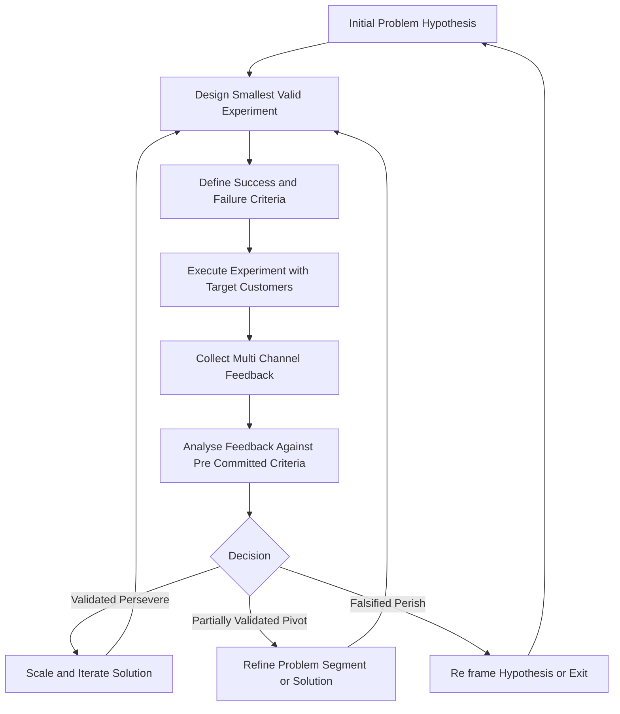
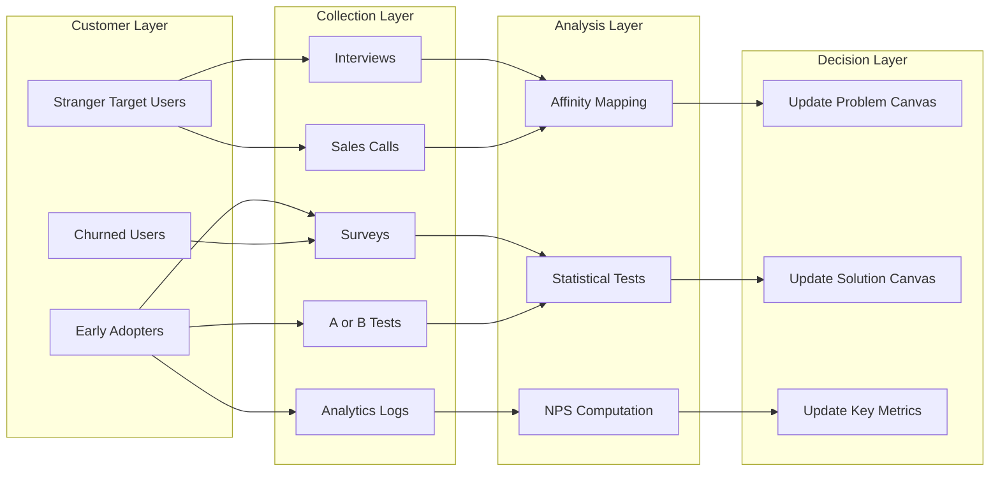
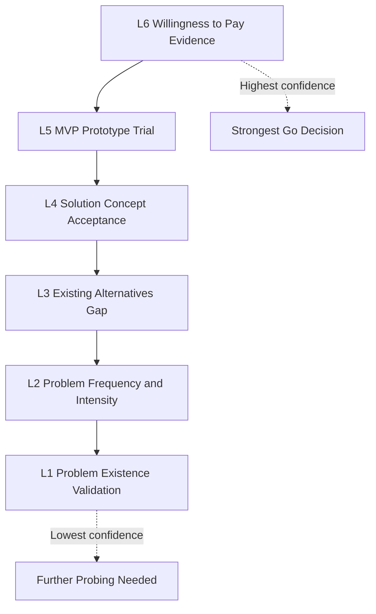
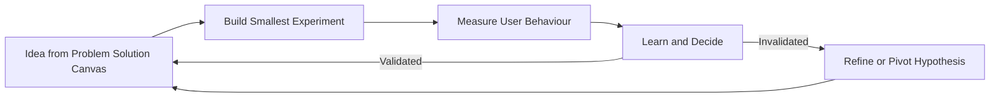
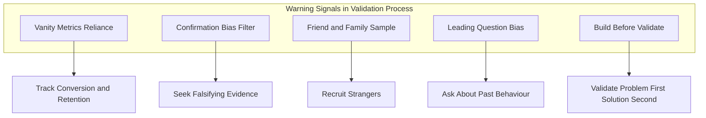
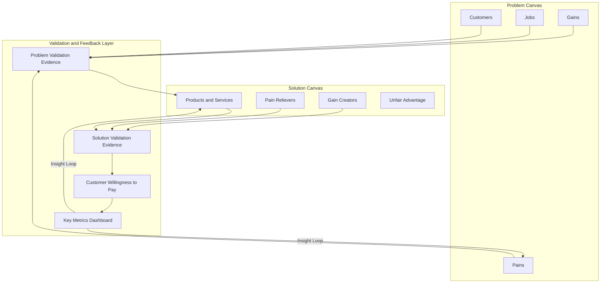

# Validation and feedback

<!-- SECTION_1_START -->
# Validation and Feedback in Problem & Solution Canvas Preparation

## 1.1 Core Technical Definition

> [!IMPORTANT]
> **Validation** in the context of the Problem-Solution Canvas is the systematic, evidence-based process of testing whether a hypothesized customer problem is real, painful, and worth solving — and whether the proposed solution actually addresses that problem in a way customers are willing to adopt, pay for, and sustain.

> [!IMPORTANT]
> **Feedback** is the structured mechanism through which information gathered from customers, users, mentors, and the market is collected, analyzed, and re-injected into the canvas to iterate and refine the problem statement, solution hypothesis, and value proposition.

In the **KTU 2024 Scheme UCEST206** syllabus, validation and feedback form the bridge between *assumption-driven ideation* and *evidence-driven product development*. Without rigorous validation, an entrepreneur builds on guesswork; without structured feedback, the startup cannot learn, pivot, or persevere.

## 1.2 Intuitive Overview (Real-World Analogy)

> [!NOTE]
> **Analogy — The Chef's Tasting Spoon:**
> Imagine a chef preparing a new dish (the *solution*) for a guessed customer craving (the *problem*). Before opening the restaurant, the chef must:
> 1. **Taste the broth repeatedly** → This is *validation* (is the flavour profile what customers truly want?).
> 2. **Ask the first 10 diners** → This is *feedback* (what do they like, dislike, crave more of?).
> 3. **Adjust the recipe** → This is *iteration* based on validated feedback.
> 
> A chef who never tastes or asks for feedback ends up serving food nobody ordered. An engineering entrepreneur who skips validation similarly builds products nobody needs.

## 1.3 Why Validation & Feedback Matter in Engineering Entrepreneurship

| Aspect | Without Validation | With Validation |
|---|---|---|
| **Risk** | High — built on unverified assumptions | Reduced — decisions backed by evidence |
| **Resource Use** | Wasted money, time, engineering effort | Efficient allocation of scarce startup capital |
| **Market Fit** | Chases the wrong customer | Aligns with real customer pain |
| **Investor Confidence** | Low — based on hope | High — supported by data |

> [!TIP]
> **KTU Board Examiner's Perspective:** Examiners look for evidence that a student understands validation is *not* a one-time event but a **continuous, iterative discipline** integrated throughout the problem-solution canvas lifecycle.

## 1.4 Core Components at a Glance

1. **Problem Validation** — Is the problem real, frequent, urgent, and expensive for the customer?
2. **Solution Validation** — Does the proposed solution actually solve the validated problem?
3. **Customer Validation** — Is the target segment reachable, willing to engage, and willing to pay?
4. **Feedback Loops** — Continuous channels (interviews, surveys, MVPs, analytics) to feed learning back into the canvas.

> [!VISUALIZATION CONTROL]
> **Concept:** The Validation–Feedback Cycle
> **Conceptual Mapping:**
> * Start point: $P_0$ = Initial Problem Hypothesis
> * End point: $P_n$ = Validated, Refined Problem–Solution Pair
> * Trajectory: $P_0 \rightarrow \text{Test} \rightarrow \text{Measure} \rightarrow \text{Listen} \rightarrow P_1 \rightarrow \text{Test} \rightarrow \ldots \rightarrow P_n$
> **Visual Description:** Imagine a spiral on a coordinate plane where the x-axis represents "Time/Iterations" and the y-axis represents "Confidence/Evidence Strength." Each loop of the spiral represents one cycle of hypothesis → experiment → feedback → refinement, with the radius growing as evidence accumulates.
<!-- SECTION_1_END -->

<!-- SECTION_2_START -->
# Deep Theoretical Analysis & KTU High-Yield Formula Sheet

## 2.1 The Validation Pyramid (Conceptual Hierarchy)

Validation is not binary — it operates at multiple layers, each adding confidence and reducing risk:

$$
\text{Validation Depth} \;=\; \sum_{i=1}^{n} w_i \cdot E_i
$$

Where:
- $E_i$ = evidence strength at layer $i$
- $w_i$ = importance weight of layer $i$
- $n$ = total number of validation layers

| Layer | Validation Type | Evidence Source | Confidence Gained |
|---|---|---|---|
| **L1 — Problem Existence** | Exploratory interviews, observation | Customer pain narratives | Low → Medium |
| **L2 — Problem Frequency & Intensity** | Surveys, diary studies, analytics | Quantitative occurrence data | Medium |
| **L3 — Existing Alternatives** | Competitive analysis, substitute mapping | Gap identification | Medium → High |
| **L4 — Solution Concept Acceptance** | Concept testing, landing pages | "Would you use this?" responses | Medium |
| **L5 — MVP / Prototype Trial** | Usability tests, A/B tests, pilot releases | Actual usage and purchase behaviour | High |
| **L6 — Willingness to Pay** | Pre-orders, fake-door tests, pricing experiments | Monetary commitment signals | Very High |

> [!IMPORTANT]
> **KTU High-Yield Concept:** Most startups fail at **L1–L2**, not L5–L6. They build elegant solutions to problems that don't exist. This is why early validation is the most cost-effective stage.

## 2.2 Types of Validation

### 2.2.1 Problem Validation
Confirms that the problem is:
- **Real** (people actually experience it)
- **Painful** (they care enough to act)
- **Frequent** (it occurs often enough to seek solutions)
- **Unsolved** (current alternatives are inadequate)

$$
\text{Problem Score} \;=\; (R \times P) + (F \times U)
$$

Where $R$ = Real, $P$ = Pain, $F$ = Frequency, $U$ = Underserved by alternatives.

### 2.2.2 Solution Validation
Confirms that:
- The solution **works** (functional efficacy)
- The solution is **usable** (UX acceptability)
- The solution is **viable** (business model sustainability)

### 2.2.3 Customer/Market Validation
Confirms that:
- The **target segment** is reachable
- The **buyer persona** matches the user persona
- There is **willingness to pay** and a sustainable **customer acquisition channel**

## 2.3 Feedback — Channels, Types, and Timing

> [!NOTE]
> **Feedback** is the *information half* of the learning loop. Validation is the *action*; feedback is the *signal* that informs the next action.

### 2.3.1 Feedback Channels

| Channel | Type of Feedback | Cost | Richness | Best For |
|---|---|---|---|---|
| **Customer Interviews** | Qualitative | Low | Very High | Early problem discovery |
| **Surveys (Google Forms, Typeform)** | Quantitative + Qualitative | Low | Medium | Pattern validation at scale |
| **Usability Testing** | Behavioural | Medium | High | Solution validation |
| **Analytics (Mixpanel, GA)** | Quantitative | Low | Medium | Feature usage validation |
| **A/B Testing** | Comparative Quantitative | Medium | High | Variant selection |
| **Sales Conversations** | Economic + Qualitative | Medium | High | Willingness to pay |
| **Social Media / Reviews** | Unfiltered Qualitative | Low | Medium | Sentiment tracking |
| **Mentor & Advisory Boards** | Heuristic | Low–Free | High | Strategic redirection |

### 2.3.2 Feedback Timing — The Build–Measure–Learn Loop

$$
\text{Loop Time} \;=\; T_{\text{build}} + T_{\text{measure}} + T_{\text{learn}}
$$

- **Build** the smallest experiment that tests the riskiest assumption.
- **Measure** customer behaviour, not opinion.
- **Learn** whether to persevere, pivot, or perish.

> [!TIP]
> **KTU Board Tip:** The goal is to *minimise* $T_{\text{loop}}$ so learning happens faster than cash burns out.

## 2.4 Validation & Feedback Tools (Common in KTU Coursework)

| Tool | Purpose | Canvas Application |
|---|---|---|
| **Lean Survey** | Quantify problem occurrence | Problem canvas evidence box |
| **Fake Door / Smoke Test** | Test demand before building | Solution canvas willingness-to-pay |
| **Landing Page Test** | Measure interest via CTR / signups | Solution canvas adoption metrics |
| **Wizard of Oz MVP** | Manually deliver "automated" experience | Solution canvas key metrics box |
| **Concierge MVP** | High-touch manual service test | Solution canvas unfair advantage |
| **Customer Interview Script** | Structured problem discovery | Problem canvas customer jobs/pains |
| **Kano Model** | Feature satisfaction analysis | Solution canvas features prioritisation |
| **Net Promoter Score (NPS)** | Loyalty / advocacy signal | Post-pilot feedback indicator |

## 2.5 Real-World Utility in Engineering & Computer Science

- **Software Products:** Feature A/B testing (Google, Meta), NPS-driven roadmaps.
- **Hardware / IoT Startups:** Pilot deployments, field-trial logs, beta-user communities.
- **AI/ML Products:** Model accuracy feedback loops, RLHF (Reinforcement Learning from Human Feedback).
- **Service Ventures:** Net Promoter tracking, complaint-to-improvement pipelines.
- **KTU Project Teams:** Even final-year engineering projects benefit from validation — surveying users, iterating prototypes, and gathering feedback from mentors.

## 2.6 Common Validation Anti-Patterns (Examiner Favourite)

> [!WARNING]
> These appear as case-study traps in KTU exams. Recognise and counter them:

| Anti-Pattern | Symptom | Correct Response |
|---|---|---|
| **Vanity Metrics** | "We got 10,000 page views!" | Conversion, retention, revenue matter |
| **Confirmation Bias** | Only listening to positive feedback | Actively seek the *falsifier* of your hypothesis |
| **Leading Questions** | "Wouldn't you love…?" | Ask about past behaviour, not future promises |
| **Survey of Friends & Family** | Biased sample of yes-people | Recruit strangers from the target segment |
| **Building Before Validating** | "We'll validate after launch" | Validate the *problem* first, solution second |
<!-- SECTION_2_END -->

<!-- SECTION_3_START -->
# Step-by-Step Frameworks, Derivations & Implementation Templates

## 3.1 The Validation–Feedback Workflow (Step-by-Step)

### Step 1: Articulate the Riskiest Assumption
Identify the single assumption whose failure would invalidate the entire business. From the problem canvas:

$$
A_{\text{riskiest}} \;=\; \underset{a \in A}{\arg\max} \; \text{Impact}(a_{\text{wrong}}) \times \text{Uncertainty}(a)
$$

### Step 2: Design the Smallest Valid Experiment
Choose the **minimum viable experiment** — not the minimum viable product. The experiment must produce a **falsifiable** outcome.

### Step 3: Define Success and Failure Criteria *Before* Running the Test
$$
\text{H}_0 : \text{Assumption is FALSE (invalidated)} \quad\quad \text{H}_1 : \text{Assumption is TRUE (validated)}
$$

Pre-commit to numerical thresholds (e.g., "60% of 30 surveyed users must say they face this pain weekly").

### Step 4: Execute and Capture Feedback
Use mixed methods: interviews (depth) + surveys (breadth) + behaviour analytics (truth).

### Step 5: Analyse and Decide
Apply the **Persist–Pivot–Perish** matrix:

| Outcome Signal | Decision |
|---|---|
| Hypothesis strongly supported, multiple channels confirm | **Persevere (Persist)** — scale the experiment |
| Hypothesis partially supported; some segments respond, others don't | **Pivot** — refine segment, problem, or solution |
| Hypothesis falsified; customers indifferent or hostile | **Perish / Re-frame** — return to problem canvas |

### Step 6: Feed Insights Back into the Canvas
Update the *Problems* box, *Solutions* box, *Key Metrics* box, and *Unfair Advantage* box. Repeat.

## 3.2 Comparative Analysis Table — Real-World Engineering Case Frameworks

> The following table maps real engineering-entrepreneurship case frameworks to the validation/feedback principles taught in UCEST206. This is the type of structure KTU examiners reward in long-answer questions.

| Case Framework / Company | Validation Approach | Feedback Channel | Outcome & Canvas Update |
|---|---|---|---|
| **Dropbox — Video Demo MVP** | Validated demand *before* coding via explainer video | Video view counts, signups, comments | Persevered → built file-sync product |
| **Zappos — Concierge MVP** | Tested willingness to buy shoes online | Phone orders, returns, NPS | Persevered → Amazon acquired for \$1.2 B |
| **Airbnb — Manual Listing Test** | Validated room-renting hypothesis by hand | Host interviews, photo uploads | Persevered → global hospitality platform |
| **Instagram — Fake Door / Pivot** | Started as Burbn (check-in app); validated photo-sharing via usage data | In-app analytics, user interviews | Pivoted → shed features, focused on photos |
| **Tesla Roadster — Wait-list Pre-orders** | Validated premium-EV demand via refundable deposits | Reservation count, refund rate | Persevered → Model S, Model 3, etc. |
| **Theranos — Failure Case** | Skipped independent validation; relied on internal claims | Suppressed critical feedback | Perished → fraud, \$700M penalty |
| **Juicero — Failure Case** | Validated juice-press concept via focus groups only, not via actual usage | Press release backlash, teardown videos | Perished → \$120M wasted on hardware |

## 3.3 Mapping to Regulatory & Systemic Matrices

For engineering ventures, validation/feedback must align with sector regulations:

| Industry | Validation Constraint | Feedback Compliance Mechanism |
|---|---|---|
| **Medical Devices** | Clinical trials, ISO 13485 | Adverse event reporting (MDR) |
| **Aerospace (Drones)** | DGCA / FAA type certification | Flight-log telemetry, incident reports |
| **FinTech** | RBI sandbox trials | Transaction anomaly reports, KYC audits |
| **EdTech (with minors)** | DPDP Act 2023 (India), child-data consent | Parental feedback loops, grievance officers |
| **AI Products (EU)** | GDPR Art. 22, EU AI Act risk tiers | Model audit logs, user opt-out channels |
| **Generic KTU Project** | Internal review board / faculty mentor | Weekly mentor demos, peer reviews |

## 3.4 Practical Worksheet — Run a Validation Cycle in 7 Days

| Day | Action | Deliverable |
|---|---|---|
| **Day 1** | Write the riskiest assumption in one sentence | Assumption card |
| **Day 2** | Draft 8–10 open-ended interview questions | Interview script |
| **Day 3** | Recruit 5 target-segment strangers (not friends) | Recruitment log |
| **Day 4** | Conduct 30-min interviews; record (with consent) | Verbatim notes |
| **Day 5** | Synthesise: 3 most-mentioned pains, 3 surprising insights | Affinity diagram |
| **Day 6** | Decide: Persevere, Pivot, or Perish | Decision log |
| **Day 7** | Update Problem-Solution Canvas with evidence | Revised canvas (v2) |

## 3.5 The Feedback Quality Score (FQS)

A self-assessment rubric students can apply to their own feedback collection:

$$
\text{FQS} \;=\; \frac{S + B + A + T}{4}
$$

Where each dimension is rated 1–5:

| Dimension | Description | Score 1 | Score 5 |
|---|---|---|---|
| **S — Specificity** | How specific is the feedback? | "I don't like it" | "Step 3 confuses me because the button colour blends with the background" |
| **B — Behavioural basis** | Is it based on observed behaviour or stated opinion? | Hypothetical answer | Actual usage observation |
| **A — Actionability** | Can the team act on it? | Vague sentiment | Concrete change suggestion |
| **T — Timeliness** | Is it recent and rapid? | Months-old anecdote | Same-day user session log |

> [!TIP]
> **KTU Long-Answer Gold:** Citing the FQS rubric with a worked example can earn 2–3 bonus marks in 14-mark questions by demonstrating analytical depth.

## 3.6 Symbolic Logic: When to Pivot

$$
\text{Pivot Decision} \;=\; 
\begin{cases}
\text{Yes} & \text{if } \frac{N_{\text{negative}}}{N_{\text{total}}} \geq 0.6 \;\text{and}\; N_{\text{total}} \geq 30 \\
\text{No} & \text{otherwise}
\end{cases}
$$

Where $N_{\text{negative}}$ is the count of independently negative feedback signals and $N_{\text{total}}$ is the total number of validated feedback inputs.

> [!NOTE]
> The numerical threshold (0.6) and sample size (30) are illustrative; the principle is that *directional consistency* across a *diverse* sample is what triggers a pivot.
<!-- SECTION_3_END -->

<!-- SECTION_4_START -->
# Structural Diagrams & Schematics

## 4.1 Validation–Feedback Cycle (Mermaid Flowchart)

## 4.2 Multi-Channel Feedback Architecture

## 4.3 Validation Pyramid (Layered Confidence Model)

## 4.4 Feedback Timing — Build Measure Learn Loop

## 4.5 Anti-Pattern Detection Matrix (Block Topology)

## 4.6 End-to-End Problem-Solution Canvas with Validation Overlay

<!-- SECTION_4_END -->

<!-- SECTION_5_START -->
# KTU 2024 Scheme Examination Question Bank & Topic Recap

## Part A — Short Answer Questions (3 Marks Each)

### Question 1
**[KTU University Exam — July 2024 Model]** Define **validation** in the context of the problem-solution canvas. Why is it considered the most cost-effective stage of startup development?

**Model Answer (Valuation Key):**
- **Definition (1 Mark):** Validation is the evidence-based process of testing whether a hypothesised customer problem is real and whether the proposed solution is desired, usable, and viable.
- **Why cost-effective (1 Mark):** It is performed *before* heavy investment in product development; failed assumptions are abandoned cheaply via small experiments rather than expensive engineering rework.
- **Example (1 Mark):** A landing page test (₹5,000) is far cheaper than building an app (₹5,00,000) only to discover the problem is fictional.

---

### Question 2
**[KTU University Exam — Dec 2023 Model]** Differentiate between **validation** and **feedback**. Give one example of each from an engineering startup context.

**Model Answer (Valuation Key):**
- **Validation (1.5 Marks):** The act of *testing* an assumption through an experiment (e.g., running a fake-door test to measure click-through on a "Buy Now" button that doesn't yet exist).
- **Feedback (1.5 Marks):** The *information/signals* received from customers after the experiment (e.g., 40 of 200 visitors signed up; comments said "price too high" and "wanted monthly plan"). Feedback informs whether validation succeeded.

---

## Part B — Long Answer Questions (14 Marks, Internal Choice)

### Question A
**[KTU University Exam — Model Paper 2024]** *(a)* Explain the **Validation Pyramid** with its six layers. For each layer, state one suitable method and one piece of evidence collected. *(7 Marks)*

*(b)* Design a **two-week validation and feedback plan** for a B.Tech student's final-year project: a low-cost IoT-based water-quality monitor for rural Kerala households. The plan must specify assumptions tested, customer segment, channels used, and decision criteria. *(7 Marks)*

#### Model Solution

### (a) Validation Pyramid (7 Marks)

| Layer | Method | Evidence Collected | Marks |
|---|---|---|---|
| **L1 — Problem Existence** | Exploratory interviews with 10 rural households | Verbatim pain narratives: "We don't know if well water is safe" | 1 |
| **L2 — Problem Frequency & Intensity** | Diary study / structured survey | 80% of households test water ≤ once a year; 65% worry monthly | 1 |
| **L3 — Existing Alternatives Gap** | Competitive analysis of lab tests, TDS meters | Lab tests cost ₹300+ and take 3 days; TDS meters miss heavy metals | 1 |
| **L4 — Solution Concept Acceptance** | Concept video + 1-page handout, 20 households | 18 of 20 said "useful"; 14 would try for ₹500 one-time cost | 1 |
| **L5 — MVP / Prototype Trial** | 5 household pilots for 2 weeks, daily use | Mean daily checks = 3.4; 4 of 5 purchased final unit at pilot end | 1.5 |
| **L6 — Willingness to Pay** | Pre-order at ₹1,200 vs ₹800 vs ₹500 tiers | 60% pre-ordered at ₹800 tier within campaign window | 1.5 |

**Concluding statement (Examiner tip):** "The deeper the layer reached with consistent evidence, the higher the confidence in proceeding to scale."

---

### (b) Two-Week Validation & Feedback Plan (7 Marks)

| Day/Week | Assumption Tested | Customer Segment | Channel | Decision Criterion |
|---|---|---|---|---|
| **Day 1–2** | Rural households *want* to monitor water quality | Self-help groups, Kudumbashree networks in Thrissur | In-person interview script (10 households) | ≥ 7 of 10 report concern |
| **Day 3–4** | Existing alternatives are inadequate | Same 10 + 5 Panchayat officials | Survey + TDS-meter demo | ≥ 6 of 10 rate alternatives ≤ 3/5 |
| **Day 5–6** | Low-cost IoT monitor is technically feasible | Engineering mentor, 3 domain experts | Prototype feasibility review | Functional MVP for ₹≤1,000 BOM |
| **Day 7** | Concept is desirable | WhatsApp group of 30 households | Video demo + reaction poll | ≥ 60% positive reaction |
| **Day 8–10** | Solution works in real environment | 5 pilot households | Field deployment, daily log | Device operates ≥ 5 of 7 days, pH/turbidity readings validated vs lab |
| **Day 11–12** | Users will recommend / pay | Pilot households + neighbours | NPS-style question + pre-order form | NPS ≥ 40; ≥ 3 pre-orders |
| **Day 13–14** | Decision gate: Persevere, Pivot, or Perish | Whole team | Internal review meeting | Go to scale if all 6 criteria met; else pivot problem-segment or solution |

**Incremental Valuation Key:**
- [Specifying assumption per stage: 2 Marks]
- [Matching customer segment + channel: 2 Marks]
- [Clear, pre-committed decision criteria: 2 Marks]
- [Linking feedback to canvas update: 1 Mark]

---

### Question B (Alternative Choice for 14 Marks)

**[KTU University Exam — Model Paper 2024]** *(a)* Define **feedback** in entrepreneurship. Compare and contrast at least **four feedback channels** in terms of cost, richness, speed, and bias. *(7 Marks)*

*(b)* A KTU student team has built an MVP of a campus-bicycle-sharing app. Initial 20-user pilot gives mixed signals: 12 love it, 5 find the unlock buggy, 3 never use it again. Apply the **Build–Measure–Learn** loop and the **Feedback Quality Score (FQS)** to recommend the next action. Justify with specific canvas updates. *(7 Marks)*

#### Model Solution

### (a) Feedback Channels Comparison (7 Marks)

> [!NOTE]
> **Definition (1 Mark):** Feedback is structured information gathered from users, customers, and stakeholders that is analysed and re-injected into the product/business to drive learning and iteration.

**Comparison Table (4 Marks — 1 Mark per row):**

| Channel | Cost | Richness | Speed | Bias Risk |
|---|---|---|---|---|
| **Customer Interviews** | Low | Very High (depth, emotion, context) | Slow (days to schedule) | Interviewer bias, leading questions |
| **Online Surveys** | Low | Medium (forced-choice limits nuance) | Fast (hours) | Self-selection, non-response bias |
| **Usability Testing** | Medium | Very High (behavioural, observed) | Medium | Observer / Hawthorne effect |
| **A/B Testing** | Medium–High | High (causal, behavioural) | Slow (needs traffic volume) | Sample-size bias, novelty effects |
| **Analytics Logs** | Low | Medium (quantitative, no *why*) | Real-time | Misinterpretation without qualitative complement |
| **Sales Conversations** | Medium | High (intent signals) | Medium | Salesperson optimism bias |

**Synthesis (2 Marks):** Best practice is *triangulation* — combining at least one behavioural (analytics, A/B) channel with one attitudinal (interview, survey) channel to overcome the blind spots of each.

---

### (b) Build–Measure–Learn Application (7 Marks)

**Step 1 — Build (1 Mark):** The next smallest experiment should target the *specific* failure mode (unlock bugginess, dropout). The team should build a fix-release variant of the unlock flow and a control.

**Step 2 — Measure (1.5 Marks):**
- Quantitative: unlock success rate, time-to-unlock, second-week retention, sessions per user.
- Qualitative: in-app micro-survey at point of failure ("What stopped you?"), 3 in-depth interviews with the 5 users who found it buggy.

**Step 3 — Learn (1.5 Marks) — Apply FQS:**

| Dimension | Score (1–5) | Justification |
|---|---|---|
| Specificity | 4 | "Unlock buggy" is fairly specific |
| Behavioural basis | 5 | Dropout is observed behaviour, not stated opinion |
| Actionability | 4 | Points to unlock-flow as fix target |
| Timeliness | 5 | Pilot data is current |
| **FQS Total / 5** | **4.5** → *High-quality, act on it* | 1 Mark |

**Step 4 — Decision (1 Mark):** **Persevere with targeted fix** — the 12-of-20 satisfaction rate combined with FQS 4.5 indicates a *core-valid* product with a *fixable* UX defect; do not pivot or perish.

**Step 5 — Canvas Updates (1 Mark):**
- *Solution Canvas → Pain Relievers:* Add "Reliable Bluetooth unlock in < 3 s, 99% success rate."
- *Solution Canvas → Key Metrics:* Track unlock success rate, Day-7 retention.
- *Problem Canvas → Pains:* Reaffirm "Need last-mile commute on campus" remains valid.
- Re-run pilot in 2 weeks; if unlock success ≥ 95% and 7-day retention ≥ 60%, scale to 100 students.

---

## KTU Examiner's Valuation Warning / Pitfall Callout

> [!WARNING]
> **Where students commonly lose marks in this topic:**
> 1. **Confusing validation with feedback** — Examiners will deduct marks if you treat them as synonyms. Validation = *testing*; Feedback = *the signals received*. Show you know the distinction.
> 2. **Skipping the sample-size justification** — Stating "I asked 5 people" without explaining *why* that sample gives confidence loses 1–2 marks. Mention saturation, segment diversity, or pre-committed thresholds.
> 3. **Ignoring the "Perish" option** — KTU examiners reward balanced judgment. A strong answer acknowledges when to *pivot* or *perish*, not just when to *persevere*.
> 4. **Forgetting to update the canvas** — Validation without canvas iteration is wasted learning. Always close the loop by naming the specific box (Problem / Solution / Key Metrics / Unfair Advantage) that gets updated.
> 5. **Mistaking vanity metrics for validated evidence** — "10,000 views" without conversion or retention will be marked down. Always interpret numbers in context.

---

## Topic Recap & Important Things to Remember

- **Validation** is the *action* of testing whether a problem and solution are real, painful, frequent, and worth solving — *before* heavy investment.
- **Feedback** is the *information* harvested from those tests, which feeds the next iteration of the canvas.
- The **Validation Pyramid** has six layers: Problem Existence → Frequency → Alternatives Gap → Solution Acceptance → MVP Trial → Willingness to Pay.
- Validation is *not* a one-time event; it is a **continuous, iterative discipline** integrated into the Build–Measure–Learn loop.
- The **Build–Measure–Learn loop** minimises loop time $T_{\text{build}} + T_{\text{measure}} + T_{\text{learn}}$ to outpace cash burn.
- **Triangulate feedback channels**: combine behavioural (analytics, A/B) and attitudinal (interviews, surveys) sources.
- The **Feedback Quality Score (FQS)** = average of Specificity, Behavioural basis, Actionability, and Timeliness, each rated 1–5.
- **Decision gates** are Persevere (validated, scale), Pivot (partially validated, refine), and Perish (falsified, reframe).
- **Anti-patterns to avoid**: vanity metrics, confirmation bias, friend-and-family samples, leading questions, build-before-validate.
- Always **close the loop** by specifying which canvas box (Problem, Solution, Key Metrics, Unfair Advantage) is updated after each validation cycle.
- For engineering ventures, validation must respect **sectoral regulations** (medical, aerospace, FinTech, AI, child-data) and corresponding feedback compliance mechanisms.
- A strong KTU answer names **specific evidence thresholds** (e.g., "≥ 60% of 30 users"), **specific customer segments** (not "people"), and **specific canvas updates** (not "we learned a lot").
- Real-world case anchors to remember: **Dropbox (video MVP), Zappos (concierge), Airbnb (manual listing), Instagram (pivot from Burbn), Tesla (wait-list)** — for perseverance; **Theranos, Juicero** — for perish cases.
<!-- SECTION_5_END -->
