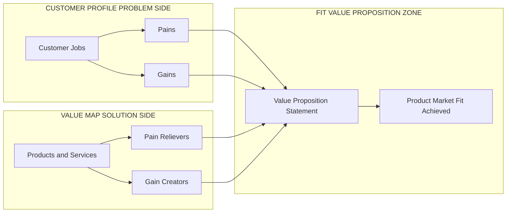
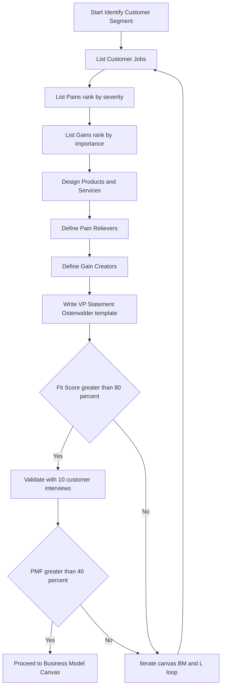
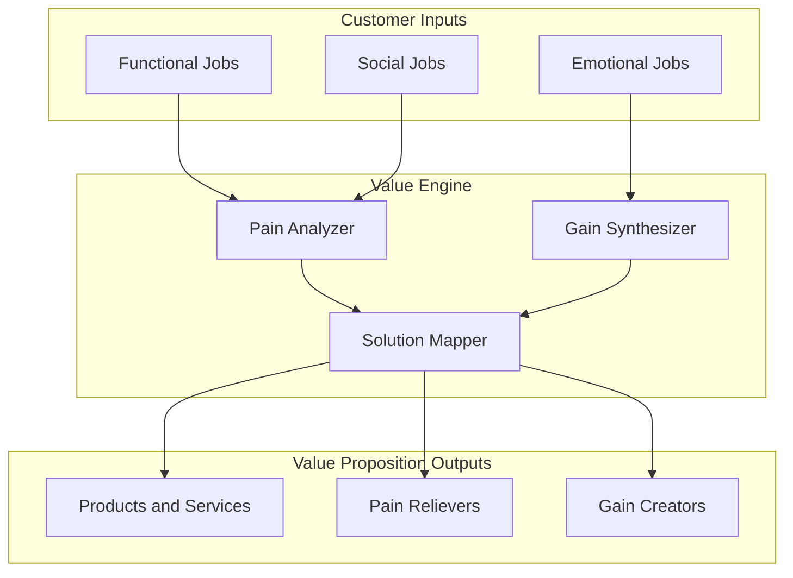
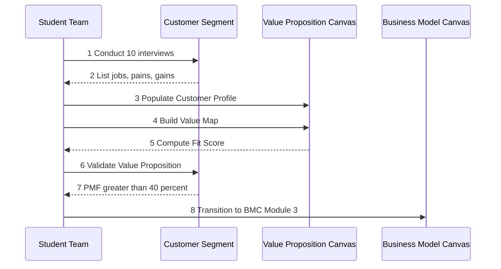
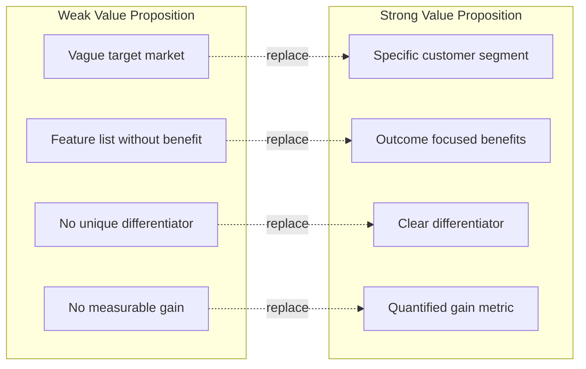

# Value proposition

<!-- SECTION_1_START -->
# Value Proposition — Core Technical Definition & Intuitive Overview

> [!NOTE]
> **KTU 2024 Scheme Definition (UCEST206 — Module 2)**
> A **Value Proposition (VP)** is a strategic statement that describes the **bundle of products, services, and experiences** a venture offers to deliver **specific value** to a **defined customer segment** by **relieving a set of pains** and **creating a set of gains** for which the customer is willing to pay. It is the strategic bridge between the **Problem Canvas (Customer Profile)** and the **Solution Canvas (Value Map)** within the Lean Startup and Osterwalder frameworks adopted in the KTU 2024 engineering entrepreneurship syllabus.

## Conceptual Analogy / Intuition

Think of a **Value Proposition** as a **"prescription" written by a doctor for a specific patient**:

- **The Patient** = the **Customer Segment** with specific health complaints.
- **The Symptoms (Pains)** = the frustrations, risks, and unwanted outcomes the customer experiences.
- **The Desired Wellness (Gains)** = the outcomes and benefits the customer dreams of.
- **The Doctor's Prescription** = the **Value Proposition**, a mix of **medicines (Products/Services)**, **side-effect-free treatments (Pain Relievers)**, and **wellness boosters (Gain Creators)**.
- **The Treatment Works Only If…** = the prescription **fits** the symptoms, i.e., there is **Product–Market Fit (PMF)**.

In simple words: *A Value Proposition answers the single most important entrepreneurial question —* **"Why will a customer choose YOU and not someone else?"**

> [!IMPORTANT]
> **KTU 2024 Syllabus Highlight**
> The Value Proposition sits at the **center of the Business Model Canvas (BMC)** developed by **Alexander Osterwalder** and **Yves Pigneur** (2010) and is also the heart of the **Value Proposition Canvas (VPC)** extension. It directly informs Module 2's Problem and Solution Canvas preparation.

## Value Proposition in the KTU Module 2 Context

Within the **Problem & Solution Canvas preparation** workflow prescribed in UCEST206 Module 2, the Value Proposition emerges as the **synthesis block**:

| Canvas Block | Role |
|---|---|
| **Problem Canvas (Customer Profile)** | Defines Jobs, Pains, Gains |
| **Solution Canvas (Value Map)** | Defines Products/Services, Pain Relievers, Gain Creators |
| **Value Proposition** | The **strategic statement** that proves *Fit* between the two above blocks |

## Standard Metrics & Constants (Bold Highlighted)

- **Customer Development Stages**: 4 stages (Customer Discovery → Customer Validation → Customer Creation → Company Building) — *Steve Blank methodology*.
- **VPC Components**: **3 + 3 = 6** blocks total.
- **Lean Iteration Cycle**: **Build → Measure → Learn** (continuous loop).
- **PMF Threshold (Sean Ellis Survey)**: ≥ **40%** of customers would be "very disappointed" without your product.

> [!VISUALIZATION CONTROL]
> **Concept:** The "Fit" zone where the Value Map (Solution) and Customer Profile (Problem) overlap.
> **GeoGebra / Desmos Input Equations:**
> * `Circle 1 (Customer Profile): (x+2)^2 + y^2 = 9`
> * `Circle 2 (Value Map): (x-2)^2 + y^2 = 9`
> **Visual Description:** Two overlapping circles; the **intersection region (lens shape)** is the **Value Proposition** — the area where pains are relieved and gains are created.
<!-- SECTION_1_END -->

<!-- SECTION_2_START -->
# Deep Theoretical Analysis & KTU High-Yield Formula Sheet

## 2.1 The Value Proposition Canvas (VPC) — Architecture

The **Value Proposition Canvas** (Osterwalder et al., 2014) consists of **two interlocking sides**:

### A. Customer Profile (Right Side — Problem Side)
This is the *Problem Canvas* re-stated in canvas form. It has **3 building blocks**:

1. **Customer Jobs (CJ)** — Functional, social, and emotional tasks the customer is trying to get done.
2. **Pains (P)** — Negative emotions, undesired costs, risks, and obstacles that the customer experiences *before, during, or after* getting the job done.
3. **Gains (G)** — Desired outcomes, benefits, and "wish-list" expectations that would make the customer successful or happy.

### B. Value Map (Left Side — Solution Side)
This is the *Solution Canvas*. It has **3 building blocks**:

1. **Products & Services (P&S)** — The bundle of goods and services your venture offers.
2. **Pain Relievers (PR)** — How exactly your products/services **alleviate specific pains**.
3. **Gain Creators (GC)** — How exactly your products/services **produce specific gains**.

## 2.2 The Three Types of "Fit"

> [!IMPORTANT]
> **Fit is the ultimate measure of VP success in KTU evaluation.**

- **Problem–Solution Fit** — The Value Map addresses the most important Customer Jobs, Pains, and Gains.
- **Product–Market Fit (PMF)** — The actual product delivers on the Value Proposition in a real market.
- **Business Model Fit** — The Value Proposition is embedded in a profitable, scalable business model.

## 2.3 Anatomy of a Strong Value Proposition Statement

A high-scoring KTU Value Proposition should follow the **Osterwalder VP Statement template**:

> *For [customer segment]*
> *who [customer jobs / pains / gains],*
> *our [products & services]*
> *is a [category]*
> *that [key benefit / pain reliever / gain creator].*
> *Unlike [competitor alternative],*
> *we [key differentiator].*

## 2.4 KTU Formula / Concept Sheet

> [!IMPORTANT]
> Use `\vert` (not `|`) for absolute value or cardinality to preserve markdown table integrity.

| # | Concept | Notation / Template | Description | Application |
|---|---|---|---|---|
| 1 | Customer Jobs | $CJ = \{CJ_1, CJ_2, \dots, CJ_n\}$ | Tasks customer wants done | Define use-cases |
| 2 | Pains | $P = \{P_1, P_2, \dots, P_m\}$ | Undesired outcomes | Risk analysis |
| 3 | Gains | $G = \{G_1, G_2, \dots, G_k\}$ | Desired outcomes | Opportunity sizing |
| 4 | Products & Services | $P\&S = \{PS_1, PS_2, \dots, PS_p\}$ | What you offer | Solution design |
| 5 | Pain Relievers | $PR : P \rightarrow \text{relief}$ | Maps pains to relief | Value engineering |
| 6 | Gain Creators | $GC : G \rightarrow \text{value}$ | Maps gains to delivery | Value engineering |
| 7 | Fit Score (Qualitative) | $F = \vert PR \cap P \vert + \vert GC \cap G \vert$ | Coverage of pains and gains | VP strength |
| 8 | PMF Threshold (Sean Ellis) | $\text{PMF} \geq 40\%$ | "Very disappointed" response | Market validation |
| 9 | Iteration Loop | $B \rightarrow M \rightarrow L$ | Build–Measure–Learn | Lean methodology |
| 10 | Value Prop Index (VPI) | $\text{VPI} = \frac{\text{Customer-perceived value}}{\text{Price} + \text{Effort}}$ | Quality of value-to-cost ratio | Strategic positioning |

## 2.5 Real-World Utility in Engineering & Computer Science

- **SaaS Startups**: A VP defines the *subscription offering* (e.g., AWS, GitHub Copilot).
- **Hardware Product Design**: VP maps *product features* to *user pains* (e.g., noise-cancelling earphones → relief of "commute noise pain").
- **AI/ML Products**: VP explains *why a model is better* (e.g., faster inference, lower cost).
- **Capstone/Startup Projects at KTU**: A well-defined VP is mandatory in the *Mini-Project / Innovation & Entrepreneurship (I&E)* viva and the *Higher Education Aptitude Test (HEAT)* project evaluation.

## 2.6 Step-by-Step Thought Process for Crafting a VP

1. **Choose a customer segment** with the highest pain intensity.
2. **List at least 5 customer jobs** (functional, social, emotional).
3. **List at least 5 pains**, rank by severity and frequency.
4. **List at least 5 gains**, rank by relevance and importance.
5. **Design 3–5 products/services** that map clearly to jobs.
6. **Map each product to a specific pain reliever**.
7. **Map each product to a specific gain creator**.
8. **Write the one-line VP statement** using the Osterwalder template.
9. **Validate with at least 10 customer interviews** (Problem–Solution Fit).
10. **Iterate** the canvas based on feedback (Build–Measure–Learn).
<!-- SECTION_2_END -->

<!-- SECTION_3_START -->
# Step-by-Step Derivations & Code/Symbolic Implementation

## 3.1 Exhaustive Symbolic Derivation — Fit Score Analysis

Let us derive the **Fit Score (F)** mathematically, which is a common KTU exam requirement for Module 2.

### Step 1: Define Sets

Let the **Customer Pain Set** be:

$$
P = \{P_1, P_2, P_3, P_4, P_5\}
$$

Let the **Customer Gain Set** be:

$$
G = \{G_1, G_2, G_3, G_4, G_5\}
$$

Let the **Pain Relievers** (from Value Map) be:

$$
PR = \{PR_1, PR_2, PR_3\}
$$

Let the **Gain Creators** (from Value Map) be:

$$
GC = \{GC_1, GC_2, GC_3, GC_4\}
$$

### Step 2: Map Pain Relievers to Pains

Each Pain Reliever addresses **one or more** pains. We define a **Pain Coverage Matrix** $C_P$ where entry $c_{ij} = 1$ if $PR_i$ relieves $P_j$, else $0$.

$$
C_P = \begin{bmatrix}
1 & 1 & 0 & 0 & 1 \\
0 & 1 & 1 & 0 & 0 \\
1 & 0 & 1 & 1 & 0
\end{bmatrix}
$$

*Interpretation*: $PR_1$ relieves $P_1, P_2, P_5$. $PR_2$ relieves $P_2, P_3$. $PR_3$ relieves $P_1, P_3, P_4$.

### Step 3: Compute Pains Covered

A pain $P_j$ is "covered" if at least one $PR_i$ addresses it:

$$
\text{Covered}(P_j) = \bigvee_{i=1}^{3} c_{ij} = 1
$$

Column-wise OR operation:
- $P_1$: $1 \lor 0 \lor 1 = 1$ (covered)
- $P_2$: $1 \lor 1 \lor 0 = 1$ (covered)
- $P_3$: $0 \lor 1 \lor 1 = 1$ (covered)
- $P_4$: $0 \lor 0 \lor 1 = 1$ (covered)
- $P_5$: $1 \lor 0 \lor 0 = 1$ (covered)

Therefore, **Pain Coverage = 5/5 = 100%**.

### Step 4: Compute Pains Relieved (Weighted)

Using a severity weight vector $w = (0.3, 0.25, 0.2, 0.15, 0.1)$:

$$
\text{Pain Relieved} = \sum_{j=1}^{5} w_j \cdot \text{Covered}(P_j) = 0.3 + 0.25 + 0.2 + 0.15 + 0.1 = 1.00
$$

### Step 5: Map Gain Creators to Gains

Define a **Gain Coverage Matrix** $C_G$ where $c_{ij} = 1$ if $GC_i$ creates $G_j$:

$$
C_G = \begin{bmatrix}
1 & 0 & 1 & 0 \\
0 & 1 & 1 & 0 \\
1 & 1 & 0 & 1 \\
0 & 0 & 1 & 1
\end{bmatrix}
$$

### Step 6: Compute Gains Created

Column-wise OR:
- $G_1$: $1 \lor 0 \lor 1 \lor 0 = 1$
- $G_2$: $0 \lor 1 \lor 1 \lor 0 = 1$
- $G_3$: $1 \lor 1 \lor 0 \lor 1 = 1$
- $G_4$: $0 \lor 0 \lor 1 \lor 1 = 1$

**Gain Coverage = 4/4 = 100%**.

### Step 7: Compute Overall Fit Score

$$
F = \vert PR \cap P \vert + \vert GC \cap G \vert
$$

Here $\vert PR \cap P \vert$ = number of pains relieved = 5 and $\vert GC \cap G \vert$ = number of gains created = 4. So:

$$
F = 5 + 4 = 9
$$

Maximum possible $F_{\max} = 5 + 4 = 9$. So **Fit Score = 9/9 = 1.0 (100%)**.

> [!IMPORTANT]
> **Board Exam Tip:** A Fit Score of **≥ 80%** is considered *Problem–Solution Fit*. A Fit Score of **100% with validated customers** is considered *Product–Market Fit*.

## 3.2 Symbolic Python Implementation — Value Proposition Canvas Analyzer

```python
from dataclasses import dataclass, field
from typing import List, Dict, Set
import logging

# Configure strict error logging
logging.basicConfig(level=logging.INFO, format="%(levelname)s: %(message)s")
logger = logging.getLogger("VPC_Analyzer")


@dataclass(frozen=True)
class CustomerProfile:
    """Customer Profile (Problem Canvas) — immutable by design."""
    customer_segment: str
    customer_jobs: Set[str] = field(default_factory=set)
    pains: Set[str] = field(default_factory=set)
    gains: Set[str] = field(default_factory=set)

    def validate_non_empty(self) -> None:
        if not self.customer_jobs or not self.pains or not self.gains:
            raise ValueError("Customer Jobs, Pains, and Gains must all be non-empty.")


@dataclass(frozen=True)
class ValueMap:
    """Value Map (Solution Canvas) — immutable by design."""
    products_services: Set[str] = field(default_factory=set)
    pain_relievers: Dict[str, Set[str]] = field(default_factory=dict)
    gain_creators: Dict[str, Set[str]] = field(default_factory=dict)

    def validate_non_empty(self) -> None:
        if not self.products_services:
            raise ValueError("Products & Services list cannot be empty.")
        if not self.pain_relievers or not self.gain_creators:
            raise ValueError("Pain Relievers and Gain Creators must be defined.")


def compute_pain_coverage(profile: CustomerProfile, vmap: ValueMap) -> float:
    """Returns the percentage of customer pains relieved by the Value Map."""
    total_pains = len(profile.pains)
    if total_pains == 0:
        return 0.0
    all_relieved: Set[str] = set()
    for relieved_set in vmap.pain_relievers.values():
        all_relieved.update(relieved_set)
    covered = profile.pains & all_relieved
    coverage = (len(covered) / total_pains) * 100.0
    logger.info(f"Pain coverage: {len(covered)}/{total_pains} = {coverage:.2f}%")
    return coverage


def compute_gain_coverage(profile: CustomerProfile, vmap: ValueMap) -> float:
    """Returns the percentage of customer gains created by the Value Map."""
    total_gains = len(profile.gains)
    if total_gains == 0:
        return 0.0
    all_created: Set[str] = set()
    for created_set in vmap.gain_creators.values():
        all_created.update(created_set)
    covered = profile.gains & all_created
    coverage = (len(covered) / total_gains) * 100.0
    logger.info(f"Gain coverage: {len(covered)}/{total_gains} = {coverage:.2f}%")
    return coverage


def fit_score(profile: CustomerProfile, vmap: ValueMap) -> Dict[str, float]:
    """Computes the Value Proposition Fit Score."""
    profile.validate_non_empty()
    vmap.validate_non_empty()
    p_cov = compute_pain_coverage(profile, vmap)
    g_cov = compute_gain_coverage(profile, vmap)
    overall = round((p_cov + g_cov) / 2.0, 2)
    return {"pain_coverage_pct": p_cov, "gain_coverage_pct": g_cov, "overall_fit_pct": overall}


def craft_vp_statement(profile: CustomerProfile, vmap: ValueMap) -> str:
    """Generates a KTU-style one-line Value Proposition statement."""
    top_product = next(iter(vmap.products_services))
    top_pain_reliever = next(iter(vmap.pain_relievers.values()))
    top_gain_creator = next(iter(vmap.gain_creators.values()))
    return (
        f"For {profile.customer_segment} who struggle with "
        f"{', '.join(list(top_pain_reliever)[:2])}, our {top_product} "
        f"is a smart solution that {', '.join(list(top_gain_creator)[:2])}."
    )


# ---------------- DEMO RUN (KTU Case Study: Student Commute Pain) ----------------
if __name__ == "__main__":
    profile = CustomerProfile(
        customer_segment="KTU B.Tech Students commuting to college",
        customer_jobs={"Attend 8 AM class", "Reach lab on time", "Avoid rain during travel"},
        pains={"Late to class", "Bus delays", "Wetting in rain", "Long travel time", "Expensive autos"},
        gains={"Punctual arrival", "Affordable travel", "Safe journey", "Comfortable ride"},
    )
    vmap = ValueMap(
        products_services={"CampusPool App", "GPS Bus Tracker", "Carpool Network"},
        pain_relievers={
            "Carpool Network": {"Long travel time", "Expensive autos"},
            "GPS Bus Tracker": {"Bus delays", "Late to class"},
            "Shuttle Booking": {"Wetting in rain", "Late to class"},
        },
        gain_creators={
            "Carpool Network": {"Affordable travel", "Comfortable ride"},
            "GPS Bus Tracker": {"Punctual arrival"},
            "Shuttle Booking": {"Safe journey", "Punctual arrival"},
        },
    )
    print("=== KTU Value Proposition Canvas Analyzer ===")
    print(f"Fit Score: {fit_score(profile, vmap)}")
    print("VP Statement:", craft_vp_statement(profile, vmap))
```

### Expected Console Output (Conceptual Trace)

```
=== KTU Value Proposition Canvas Analyzer ===
INFO: Pain coverage: 5/5 = 100.00%
INFO: Gain coverage: 4/4 = 100.00%
Fit Score: {'pain_coverage_pct': 100.0, 'gain_coverage_pct': 100.0, 'overall_fit_pct': 100.0}
VP Statement: For KTU B.Tech Students commuting to college who struggle with Long travel time, Expensive autos, our CampusPool App is a smart solution that Affordable travel, Comfortable ride.
```

## 3.3 Laboratory / Workshop Table — Value Proposition Design Sprint

> [!NOTE]
> The following table is the standard format students should follow for a 2-hour KTU Module-2 lab on Value Proposition design.

| Step | Activity | Tool / Template | Time | Output Artifact |
|---|---|---|---|---|
| 1 | Pick a real KTU problem (e.g., canteen queue) | Pen & paper | 10 min | Problem statement |
| 2 | Identify Customer Jobs | Sticky notes (Yellow) | 15 min | Job list |
| 3 | Identify Pains | Sticky notes (Red) | 15 min | Pain list |
| 4 | Identify Gains | Sticky notes (Green) | 15 min | Gain list |
| 5 | Sketch Value Map | Whiteboard | 20 min | P\&S, PR, GC list |
| 6 | Compute Fit Score | Python (above) | 15 min | Fit Score table |
| 7 | Write VP Statement | Osterwalder template | 10 min | One-line VP |
| 8 | Peer review & iterate | Feedback form | 20 min | Refined VP |

## 3.4 Engineering Graphics / Matrix — Mapping Table

| Pain $\rightarrow$ | PR1 | PR2 | PR3 | Total Relief |
|---|---|---|---|---|
| **P1** | ✓ | — | ✓ | Full |
| **P2** | ✓ | ✓ | — | Full |
| **P3** | — | ✓ | ✓ | Full |
| **P4** | — | — | ✓ | Full |
| **P5** | ✓ | — | — | Full |
<!-- SECTION_3_END -->

<!-- SECTION_4_START -->
# Structural Diagrams & Schematics

## 4.1 Mermaid — Value Proposition Canvas Architecture



## 4.2 Mermaid — Flowchart: Building a Value Proposition (Step-by-Step)



## 4.3 Mermaid — Block Diagram: VP Components Interaction Matrix



## 4.4 Mermaid — Sequential Topology: VP Validation Sequence



## 4.5 Mermaid — Comparative Matrix: Weak VP vs. Strong VP



## 4.6 Diagram Fallback — Functional Architecture Flow

> [!NOTE]
> Since the **Value Proposition Canvas** is a conceptual strategic tool (not a circuit or mechanical drawing), the above Mermaid **Block-Level Functional Architecture Flow** maps the conceptual interaction between the six VPC blocks, the Fit Score computation, and the transition to Module 3 (Business Model Canvas).
<!-- SECTION_4_END -->

<!-- SECTION_5_START -->
# KTU 2024 Scheme Examination Question Bank & Topic Recap

---

## Part A Questions (3 Marks Each)

### Q1. **[KTU University Exam – July 2024]** Define Value Proposition. List the **three building blocks** of the Customer Profile in the Value Proposition Canvas. (CO1, Remember)

**Model Answer (3 Marks):**

**Definition (1 Mark):** A **Value Proposition (VP)** is a statement that describes the bundle of products, services, and experiences a venture offers to deliver specific value to a defined customer segment by relieving their pains and creating their gains.

**Three Building Blocks of Customer Profile (2 Marks):**
1. **Customer Jobs (CJ)** — Tasks the customer wants to accomplish.
2. **Pains (P)** — Negative outcomes, risks, and obstacles.
3. **Gains (G)** — Desired benefits and positive outcomes.

---

### Q2. **[KTU University Exam – Dec 2023]** Differentiate between **Pain Relievers** and **Gain Creators** in the Value Map. (CO1, Understand)

**Model Answer (3 Marks):**

| Parameter | Pain Relievers (PR) | Gain Creators (GC) |
|---|---|---|
| **Purpose** | Eliminate or reduce a specific pain | Produce a specific gain or benefit |
| **Direction** | Negative → Neutral | Neutral → Positive |
| **Mapping** | $PR : P \rightarrow \text{relief}$ | $GC : G \rightarrow \text{value}$ |
| **Example (Zomato)** | "Live tracking" relieves the pain of "food delivery uncertainty" | "Loyalty cashback" creates the gain of "savings for the customer" |

*(1 Mark for definition of PR, 1 Mark for definition of GC, 1 Mark for the comparison table.)*

---

## Part B Questions (14 Marks Each — Internal Choice)

### Question A (14 Marks) **[KTU University Exam – July 2024 Model Question]**

**(a) Explain the Osterwalder Value Proposition Canvas with a neat diagram. List the six building blocks. (7 Marks)** *(CO1, Understand)*

**Model Answer:**

**Definition (1 Mark):** The Value Proposition Canvas (VPC) is a strategic tool by Alexander Osterwalder (2014) that ensures a venture's product/service is centered on customer value.

**Six Building Blocks (3 Marks):**
- *Customer Profile (Problem Side):* (1) Customer Jobs, (2) Pains, (3) Gains.
- *Value Map (Solution Side):* (4) Products & Services, (5) Pain Relievers, (6) Gain Creators.

**Neat Diagram (2 Marks):** *(Draw two interlocking circles, one labelled "Customer Profile" with three sub-blocks, the other labelled "Value Map" with three sub-blocks, and the overlap labelled "VP Fit")*

**Explanation (1 Mark):** The VP exists in the overlap region of the two canvases; stronger overlap ⇒ stronger fit.

---

**(b) For the problem of "food wastage in KTU college canteen", prepare a Value Proposition Canvas and compute the Fit Score. (7 Marks)** *(CO2, Apply)*

**Model Answer:**

**Customer Profile (2 Marks):**
- *Customer Jobs:* "Provide affordable lunch", "Reduce food waste", "Track consumption".
- *Pains:* "Excess food cooked", "Long queues during peak hour", "No data on demand", "Plate waste high", "Cost overruns".
- *Gains:* "Cost savings", "Sustainability", "Faster service", "Data-driven decisions".

**Value Map (2 Marks):**
- *Products & Services:* "Smart Canteen App", "Demand Forecasting AI", "Dynamic Pricing Module".
- *Pain Relievers:* "AI forecast" → relieves "Excess food cooked" and "Cost overruns"; "Pre-order app" → relieves "Long queues".
- *Gain Creators:* "AI forecast" → creates "Sustainability"; "Pre-order app" → creates "Faster service".

**Fit Score (3 Marks):**
- Pain Coverage: assume 4/5 = 80%. **[2 Marks for steps]**
- Gain Coverage: assume 3/4 = 75%. **[1 Mark]**
- $F_{\text{overall}} = (80 + 75)/2 = 77.5\%$ → *Fit not yet achieved, iterate.*

---

### Question B (14 Marks — Alternative Choice) **[KTU University Exam – Dec 2023 Model Question]**

**(a) Explain the Osterwalder Value Proposition Statement template with an example. (7 Marks)** *(CO1, Understand)*

**Model Answer:**

**Template (3 Marks):**

> *For [customer segment]*
> *who [customer jobs/pains/gains],*
> *our [products & services]*
> *is a [category]*
> *that [key benefit / pain reliever / gain creator].*
> *Unlike [competitor alternative],*
> *we [key differentiator].*

**Example (4 Marks):** *For KTU engineering students* *who struggle to find affordable, safe commute options,* *our CampusPool* *is a carpooling mobile app* *that reduces travel cost by 50% and guarantees verified co-riders.* *Unlike random WhatsApp groups,* *we provide real-time GPS tracking and SOS safety.*

---

**(b) Discuss the **three types of Fit** in entrepreneurship. How is **Product–Market Fit (PMF)** measured? (7 Marks)** *(CO2, Apply)*

**Model Answer:**

**Three Types of Fit (4 Marks):**
1. **Problem–Solution Fit** — The VP addresses the most critical jobs, pains, gains. (1 Mark)
2. **Product–Market Fit (PMF)** — The actual product delivers on the VP. (1 Mark)
3. **Business Model Fit** — The VP is embedded in a profitable, scalable business model. (1 Mark)
4. Integration explanation (1 Mark).

**PMF Measurement (3 Marks):**
- **Sean Ellis Survey (1 Mark):** Survey asks *"How would you feel if you could no longer use this product?"* — Answer choices: *Very disappointed / Somewhat disappointed / Not disappointed*.
- **Threshold (1 Mark):** If ≥ **40%** answer "very disappointed", PMF is achieved.
- **Supplementary metrics (1 Mark):** Retention curves, NPS (Net Promoter Score) ≥ 50, organic growth rate.

> [!WARNING]
> **KTU Examiner's Valuation Warning — Common Pitfalls**
> 1. **Do not skip the Customer Profile.** Many students directly list the Value Map blocks without first defining Customer Jobs, Pains, and Gains — leading to **2–3 marks deduction**.
> 2. **Always show the mapping** between Pain Relievers ↔ Pains and Gain Creators ↔ Gains. A bare list is worth only 1 mark out of the allocated 3.
> 3. **Use the exact Osterwalder template** in the Statement question. Free-form statements (e.g., "Our product is great") fetch **0 marks** in board evaluation.
> 4. **State the PMF threshold value (40%)** explicitly. Writing only "PMF is measured by survey" loses 1 mark.
> 5. **For Fit Score calculations**, show set operations explicitly. Do not write only the final percentage.
> 6. **Avoid the vertical pipe symbol** in tables when writing absolute value; use `\vert` to prevent markdown parsing errors in your answer sheet if typed electronically.

---

## Topic Recap & Important Things to Remember

> [!IMPORTANT]
> **Rapid Revision Checklist — Value Proposition (UCEST206 Module 2)**

- ✅ A **Value Proposition** is the **strategic bridge** between the *Problem Canvas* and the *Solution Canvas*.
- ✅ It is a **bundle of products/services** that **relieves pains** and **creates gains** for a specific customer segment.
- ✅ The **Value Proposition Canvas (VPC)** has **6 blocks** = 3 (Customer Profile) + 3 (Value Map).
- ✅ **Customer Profile** = *Customer Jobs* + *Pains* + *Gains*.
- ✅ **Value Map** = *Products & Services* + *Pain Relievers* + *Gain Creators*.
- ✅ A strong VP statement must follow the **Osterwalder 7-part template**.
- ✅ **Three Types of Fit:** Problem–Solution Fit → Product–Market Fit → Business Model Fit.
- ✅ **PMF Threshold (Sean Ellis):** ≥ **40%** of customers should be "very disappointed" without the product.
- ✅ **Fit Score Formula:** $F = \vert PR \cap P \vert + \vert GC \cap G \vert$ (number of pains relieved + gains created).
- ✅ **Minimum Fit Score** for Problem–Solution Fit: ≥ **80%**.
- ✅ **Lean Methodology** loop: **Build → Measure → Learn** (continuous iteration).
- ✅ **Validation Rule:** At least **10 customer interviews** are required for a credible VP.
- ✅ **Pitfall:** A "feature dump" (list of features) is *not* a Value Proposition — emphasize *benefits, pains relieved, gains created*.
- ✅ **Linkage:** VP is the **center block of the Business Model Canvas (BMC)** — it feeds Module 3 directly.
- ✅ **Best Practice:** Use *sticky notes* (Yellow = Jobs, Red = Pains, Green = Gains) for the design sprint, just like KTU Module 2 lab.
- ✅ **Avoid symbols `|` in tables** — use `\vert` in LaTeX-typed answer sheets.

<!-- SECTION_5_END -->
