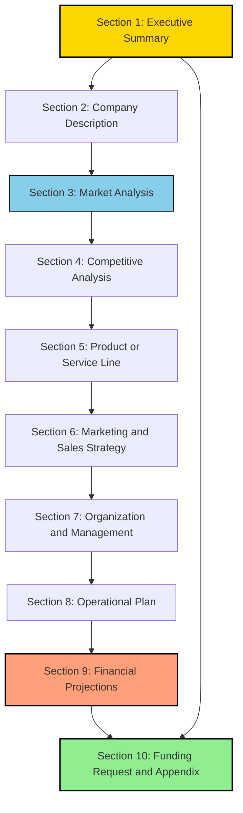
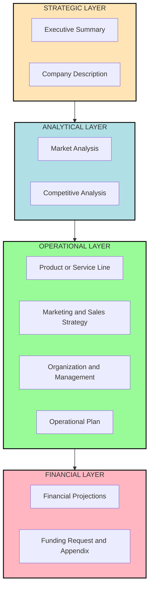
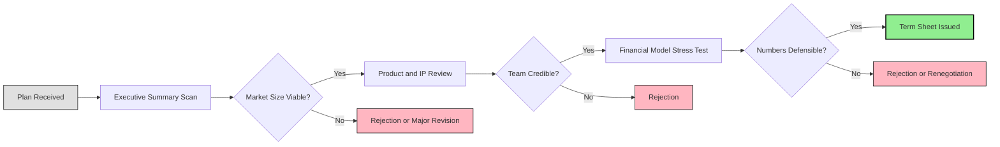
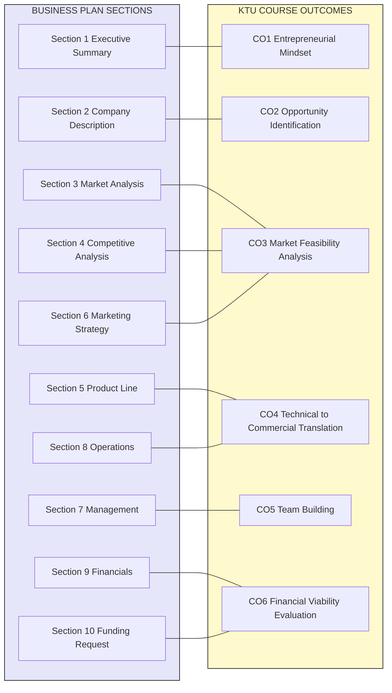

# Business plan framework

<!-- SECTION_1_START -->
# Business Plan Framework: Core Technical Definition & Intuitive Overview

> [!IMPORTANT]
> **KTU 2024 Scheme | UCEST206 | Module 3 | Topic: Business Plan Framework**
> This topic is a high-weightage conceptual module. Students are expected to articulate the structural anatomy of a business plan, justify each section, and map it to real engineering startup scenarios under Outcome-Based Education (OBE) norms.

## Formal Academic Definition

A **Business Plan Framework** is a systematic, structured, and modular blueprint that documents the vision, operational mechanics, market positioning, financial trajectory, and risk mitigation strategies of a proposed business venture. As per the KTU 2024 Entrepreneurship syllabus, it is treated as the **central codified document** that bridges an entrepreneurial idea (ideation phase) with bankable execution (operational phase), satisfying the due-diligence requirements of investors, banks, incubators, and government grant committees.

In engineering terms, it functions exactly like a **System Requirements Specification (SRS) document** — it captures the **what**, **why**, **who**, **how**, **when**, and **how much** of a business system before any capital is committed.

> [!NOTE]
> **Syllabus Highlight (KTU 2024 Scheme):**
> A business plan is *not* a single document. It is a **layered information architecture** comprising a *summary layer* (Executive Summary), a *strategic layer* (Market \& Competitive Analysis), an *operational layer* (Product, Team, Operations), and a *financial layer* (Projections, Funding Request). Each layer has a distinct audience and decision-utility.

---

## Conceptual Analogy / Intuition

Imagine you are constructing a **multi-storey building** in Kerala — say, a residential complex in Thrissur.

Before the first brick is laid, the civil engineer prepares a **master architectural drawing** that contains:
- The exterior elevation (what the building *looks like* to outsiders) $\rightarrow$ analogous to the **Executive Summary**.
- The floor plan and room layout (how the interior is *organized*) $\rightarrow$ analogous to the **Company Description \& Operations**.
- The soil test and load-bearing analysis (whether the *ground* can hold the structure) $\rightarrow$ analogous to **Market \& Competitor Analysis**.
- The structural engineering drawings (steel, concrete, plumbing) $\rightarrow$ analogous to the **Product/Service Line \& Technical Architecture**.
- The project manager and contractor details (*who* will build it) $\rightarrow$ analogous to the **Management Team**.
- The material cost sheet, labour schedule, and expected rental income (*financial viability*) $\rightarrow$ analogous to the **Financial Projections**.
- The building permits and NOC documents (regulatory compliance) $\rightarrow$ analogous to the **Appendix \& Legal Framework**.

A **Business Plan** is exactly this master drawing — but for a business venture rather than a building. Skip any one section, and the structure collapses under the scrutiny of an investor, just as a building without a soil test collapses.

> [!TIP]
> **The Investor's Rule of Thumb:** An angel investor or a KTU-affiliated technology incubator (like KSUM or TBI) typically spends **under 4 minutes** scanning the first 2 pages. If the *Executive Summary* and the *Market Sizing* numbers do not click, the rest of the document is never read. This is why the **framework ordering** is non-negotiable.

---

## Why a Framework, and Not a Free-Form Essay?

A framework enforces **cognitive ergonomics** — both for the writer (founder) and the reader (investor/evaluator). A free-form narrative introduces ambiguity, redundancy, and decision-paralysis. The framework is a **standardized contract** between the entrepreneur and the stakeholder that guarantees:
- **Completeness:** No critical question is left unanswered.
- **Comparability:** Two different plans can be benchmarked apples-to-apples.
- **Defensibility:** Each claim is traceable to a section, evidence, or assumption.
- **Iterability:** The plan can be version-controlled (v1.0, v2.0...) as the venture evolves.

> [!IMPORTANT]
> **Standard Industry Metrics in Business Plans:**
> - **TAM** (Total Addressable Market) — the entire global revenue opportunity.
> - **SAM** (Serviceable Addressable Market) — the slice you can realistically reach.
> - **SOM** (Serviceable Obtainable Market) — the share you will capture in 1–3 years.
> - **CAC** (Customer Acquisition Cost) — marketing spend per converted customer.
> - **LTV** (Life-Time Value) — total revenue from a single customer across the relationship.
> - **Burn Rate** — monthly cash consumption (critical for a tech startup).
> - **Runway** — number of months before cash runs out $\rightarrow$ $\text{Runway} = \dfrac{\text{Cash on Hand}}{\text{Monthly Burn Rate}}$.

---

> [!VISUALIZATION CONTROL]
> **Concept:** Market Sizing as nested concentric circles (TAM → SAM → SOM).
> **GeoGebra / Desmos Input Equations:**
> - Circle 1 (TAM, outermost): $x^2 + y^2 = 100$
> - Circle 2 (SAM, middle): $x^2 + y^2 = 49$
> - Circle 3 (SOM, innermost): $x^2 + y^2 = 9$
> **Visual Description:** The student should observe three concentric circles on a 2D Cartesian plane, illustrating how the *Total Addressable Market* (largest) is progressively narrowed to the *Serviceable Obtainable Market* (smallest, shaded) — the actual revenue frontier the startup can capture.
<!-- SECTION_1_END -->

<!-- SECTION_2_START -->
# Deep Theoretical Analysis & KTU High-Yield Formula Sheet

## The 10-Module Standard Business Plan Framework

The KTU 2024 Scheme (aligned with the **NSIC / DSIR / KSUM** standard business plan format used in Indian engineering incubators) recognizes a **10-section modular framework**. Each section has a defined purpose, a target audience, and a typical page allocation.

### 1. Executive Summary
- **Purpose:** The 1–2 page elevator pitch of the entire plan.
- **Content Hooks:** Company name, mission, product tagline, problem statement, solution snapshot, target market, founding team highlight, funding ask, and projected ROI.
- **Logic Step:** Written **last** but placed **first**. It is a *condensation*, not an introduction.
- **Cognitive Role:** Forces the founder to articulate the venture in a single coherent narrative arc.

### 2. Company Description
- **Purpose:** Establishes the legal, structural, and historical identity.
- **Content Hooks:** Legal form (Pvt. Ltd. / LLP / OPC), registration under the **MSME Act**, CIN/Udyam number, registered address, brief history, current stage (ideation / prototype / seed / early revenue), and core values.
- **Logic Step:** Anchors the venture in a *juridical reality* — every claim in later sections is traceable to a registered entity.

### 3. Market Analysis
- **Purpose:** Validates that a *real, addressable, growing* customer base exists.
- **Content Hooks:** Industry overview, **TAM–SAM–SOM** sizing, customer persona (demographic + psychographic), market trends, PESTEL or Porter's Five Forces synthesis, barriers to entry.
- **Logic Step:** Moves from *macro* (the global industry) to *micro* (your specific buyer).

### 4. Competitive Analysis
- **Purpose:** Demonstrates *why you will win*.
- **Content Hooks:** Direct competitors, indirect competitors, substitute products, your *differentiator* (price / technology / distribution / IP), and a 2x2 **positioning matrix**.
- **Logic Step:** Compares the venture on 2–3 key axes (e.g., *Cost vs. Performance*) against 3–5 named competitors.

### 5. Product / Service Line
- **Purpose:** Defines the *core offering* and its engineering/technical lineage.
- **Content Hooks:** Product description, technology stack, development stage, IP status (patent filed? provisional? granted?), roadmap (MVP → v1.0 → v2.0), pricing model.
- **Logic Step:** Connects the engineering innovation (often the genesis of the startup) to a *commercial deliverable*.

### 6. Marketing \& Sales Strategy
- **Purpose:** Outlines *how* customers will be acquired, retained, and expanded.
- **Content Hooks:** Go-to-market (GTM) strategy, 4Ps / 7Ps of marketing, digital funnel (awareness → interest → desire → action), sales pipeline, **CAC** and **LTV** projections, retention metrics.
- **Logic Step:** Translates the *market* into a *funnel* of measurable conversions.

### 7. Organization \& Management
- **Purpose:** Establishes the *human capital* layer.
- **Content Hooks:** Founder bios, advisory board, org chart, hiring roadmap, ESOP (Employee Stock Ownership Plan) structure, key roles filled vs. vacant.
- **Logic Step:** Investors invest in *people* first, *ideas* second.

### 8. Operational Plan
- **Purpose:** Describes *day-to-day* execution mechanics.
- **Content Hooks:** Location, facilities, suppliers, manufacturing/assembly, technology infrastructure, quality control, logistics, regulatory licenses (FSSAI, BIS, Pollution Control NOC).
- **Logic Step:** Demonstrates that the founder has thought beyond the pitch deck.

### 9. Financial Projections
- **Purpose:** Quantifies the *monetary trajectory*.
- **Content Hooks:** 3–5 year **P\&L** (Profit \& Loss), **cash flow** statements, **break-even analysis**, **balance sheet** snapshot, key ratios (gross margin, net margin, current ratio), and funding utilization table.
- **Logic Step:** Forces *numerical honesty* — assumptions must be defensible.

### 10. Funding Request \& Appendix
- **Purpose:** Closes the *ask* and supports the *claims*.
- **Content Hooks:** Amount sought, instrument (equity / debt / convertible note), use-of-funds table, exit strategy, supporting documents (letters of intent, patent certificates, founder CVs, market research reports, MoUs).

---

## KTU High-Yield Formula Sheet (Cheat Sheet)

> [!IMPORTANT]
> Memorize the formulas below — they appear in nearly every numerical Part B question in KTU ESE examinations for this module.

$$
\begin{aligned}
\text{Break-Even Point (units)} &= \dfrac{\text{Fixed Costs}}{\text{Unit Price} - \text{Variable Cost per Unit}} \\[6pt]
\text{Break-Even Point (₹ revenue)} &= \dfrac{\text{Fixed Costs}}{1 - \dfrac{\text{Variable Cost}}{\text{Sales}}} \\[6pt]
\text{Customer Acquisition Cost (CAC)} &= \dfrac{\text{Total Marketing \& Sales Spend}}{\text{Number of New Customers Acquired}} \\[6pt]
\text{Life-Time Value (LTV)} &= \text{Average Order Value} \times \text{Purchase Frequency} \times \text{Customer Lifespan} \\[6pt]
\text{LTV : CAC Ratio} &= \dfrac{\text{LTV}}{\text{CAC}} \quad (\text{Healthy range} \geq 3:1) \\[6pt]
\text{Market Share} &= \dfrac{\text{Company Sales}}{\text{Total Industry Sales}} \times 100 \\[6pt]
\text{Gross Margin \%} &= \dfrac{\text{Revenue} - \text{COGS}}{\text{Revenue}} \times 100 \\[6pt]
\text{Burn Rate} &= \text{Monthly Operating Expenses} - \text{Monthly Revenue} \\[6pt]
\text{Runway (months)} &= \dfrac{\text{Cash in Bank}}{\text{Monthly Burn Rate}} \\[6pt]
\text{Return on Investment (ROI)} &= \dfrac{\text{Net Profit}}{\text{Total Investment}} \times 100 \\[6pt]
\text{Compound Annual Growth Rate (CAGR)} &= \left( \dfrac{\text{Ending Value}}{\text{Beginning Value}} \right)^{\tfrac{1}{n}} - 1 \\[6pt]
\text{Net Present Value (NPV)} &= \sum_{t=0}^{n} \dfrac{\text{Cash Flow}_t}{(1 + r)^t}
\end{aligned}
$$

> [!NOTE]
> **Units \& Boundary Conditions:**
> - All financial figures must carry the currency unit explicitly (₹, USD, EUR).
> - The discount rate $r$ in NPV is the investor's hurdle rate (typically 12–18\% for Indian startups).
> - CAGR requires $n \geq 1$ year.
> - Break-even formula assumes a *single product* — for multi-product, use the *weighted contribution margin* approach.

---

## Real-World Engineering Utility

The Business Plan Framework is not a theoretical artefact — it is a **living operational document** in the following engineering and technology domains:

| Engineering Domain | Application of Business Plan Framework |
|---|---|
| **Deep-Tech \& Hardware Startups** | Required by **BIRAC (Biotechnology Industry Research Assistance Council)** and **DST (Department of Science \& Technology)** for grants up to ₹50 lakhs. |
| **Software-as-a-Service (SaaS)** | Drives the GTM motion; the *CAC:LTV* ratio in Section 6 is the most tracked KPI in SaaS boardrooms. |
| **Manufacturing MSMEs** | Used for **PMEGP** (Prime Minister's Employment Generation Programme) and **MUDRA** loan applications. |
| **Student Startups (KTU-affiliated IEDC)** | Mandatory document for the **KSUM YIP (Young Innovators Programme)** and **Smart India Hackathon** follow-on funding. |
| **IP Licensing Ventures** | Section 5 (Product/Service Line) doubles as an **IP commercialization plan** linked to patent claims. |
| **Franchise Models** | Acts as the master template that each franchisee inherits and localizes. |

> [!TIP]
> **Why this matters in KTU ESE:** Examiners reward students who explicitly *map* a business plan section to a real-world engineering scenario (e.g., "Section 4 — Competitive Analysis, applied to a drone-based agri-spraying startup competing with Garuda Aerospace"). Generic definitions lose marks; contextualized applications earn full 14-marks.
<!-- SECTION_2_END -->

<!-- SECTION_3_START -->
# Step-by-Step Derivations, Worked Examples & Tabular Implementation

## Worked Example 1: Break-Even Analysis for a KTU Student Hardware Startup

**Scenario:** A team of B.Tech (ECE) students from **College of Engineering, Trivandrum** has built a *low-cost IoT-based air quality monitor* (product: **"Vayulink"**). They plan to sell it at ₹4,500 per unit. Variable cost (sensors, PCB, 3D-printed enclosure, packaging) is ₹2,700 per unit. Their monthly fixed costs (lab rent, server hosting, two interns, marketing) total ₹1,80,000.

### Step-by-Step Derivation

$$
\begin{aligned}
\text{Fixed Cost (FC)} &= ₹\,1{,}80{,}000 \text{ per month} \\
\text{Unit Price (P)} &= ₹\,4{,}500 \\
\text{Variable Cost per unit (V)} &= ₹\,2{,}700 \\
\text{Contribution Margin per unit} &= P - V \\
&= ₹\,4{,}500 - ₹\,2{,}700 \\
&= ₹\,1{,}800
\end{aligned}
$$

$$
\begin{aligned}
\text{Break-Even Point (units)} &= \dfrac{FC}{P - V} \\
&= \dfrac{1{,}80{,}000}{1{,}800} \\
&= 100 \text{ units per month}
\end{aligned}
$$

$$
\begin{aligned}
\text{Break-Even Revenue} &= 100 \times 4{,}500 = ₹\,4{,}50{,}000 \text{ per month}
\end{aligned}
$$

> [!NOTE]
> **Interpretation for the Business Plan:** The startup must sell **at least 100 units per month** to cover all costs. Anything beyond 100 units is *operating profit*. This number goes directly into Section 9 (Financial Projections) and also informs the **funding ask** in Section 10.

### Valuation Key Points (KTU Examiner Pattern)
- [Stating FC, P, V correctly: 1 Mark]
- [Computing contribution margin: 1 Mark]
- [Applying break-even formula: 2 Marks]
- [Final numerical answer with units: 1 Mark]
- [Interpretation in business context: 1 Mark]

---

## Worked Example 2: LTV : CAC Ratio for a B2B SaaS Venture

**Scenario:** **"CropMind AI"** — a B2B SaaS platform for precision farming. Average subscription is ₹12,000/year per farm. Average customer stays for 4 years. Marketing spend is ₹2,00,000/month and the team acquires 50 new farms per month.

### Step-by-Step Derivation

$$
\begin{aligned}
\text{Average Order Value (AOV)} &= ₹\,12{,}000 \text{ per year} \\
\text{Purchase Frequency} &= 1 \text{ per year (annual renewal)} \\
\text{Customer Lifespan} &= 4 \text{ years} \\
\text{LTV} &= 12{,}000 \times 1 \times 4 = ₹\,48{,}000
\end{aligned}
$$

$$
\begin{aligned}
\text{CAC} &= \dfrac{2{,}00{,}000}{50} = ₹\,4{,}000 \text{ per customer} \\
\text{LTV : CAC} &= \dfrac{48{,}000}{4{,}000} = 12 : 1
\end{aligned}
$$

> [!IMPORTANT]
> **Examiner Note:** An LTV : CAC ratio of 12:1 is **exceptionally healthy** (benchmark is 3:1). A ratio above 5:1 suggests the company is *under-investing* in growth — a sophisticated business plan would recommend *redeploying cash* from product R\&D to sales and marketing to capture market share faster.

---

## Worked Example 3: Runway \& Burn Rate for a Pre-Revenue Startup

**Scenario:** A KTU student team wins ₹10,00,000 in the **KSUM YIP** grant. Their monthly burn rate is ₹85,000. They have no revenue.

$$
\begin{aligned}
\text{Runway} &= \dfrac{10{,}00{,}000}{85{,}000} \approx 11.76 \text{ months} \\
&\approx 11 \text{ months and 23 days}
\end{aligned}
$$

> [!TIP]
> **What the Business Plan should add:** A statement such as *"The team will achieve first revenue within 6 months, extending the effective runway to 18+ months, and will initiate a Series-Seed raise at Month 9 to secure an additional ₹50,00,000."* This demonstrates **scenario planning**, which examiners reward.

---

## Tabular Comparative Analysis: Business Plan vs. Feasibility Study vs. Pitch Deck

| Parameter | **Business Plan** | **Feasibility Study** | **Pitch Deck** |
|---|---|---|---|
| **Primary Purpose** | Comprehensive roadmap for execution | Pre-investment due diligence on viability | Verbal/visual hook for first meeting |
| **Length** | 20–50 pages | 30–80 pages | 10–15 slides |
| **Audience** | Banks, investors, internal team | Lenders, grant committees, large investors | Angel investors, accelerators |
| **Depth of Financials** | Full 3–5 year P\&L, cash flow, balance sheet | Sensitivity analysis, scenario modelling | Top-line projections only |
| **Depth of Market Analysis** | Detailed TAM–SAM–SOM, competitor matrix | Industry-wide PESTEL, regulatory mapping | 1–2 slides on market size |
| **Tone** | Formal, evidentiary | Analytical, cautious | Persuasive, narrative |
| **When Prepared** | Post-feasibility, pre-launch | Pre-business-plan | Anytime, often pre-business-plan |
| **IP Coverage** | Detailed (patent status, licensing) | Mentioned as part of tech assessment | Briefly highlighted |
| **Updates** | Annually or at major milestones | One-time (pre-investment) | Per investor meeting |

---

## Tabular Comparative Analysis: Traditional Business Plan vs. Lean Business Plan

| Dimension | **Traditional Business Plan** | **Lean Business Plan** |
|---|---|---|
| **Origin Philosophy** | Strategic, document-centric (Harvard, McKinsey) | Experiential, hypothesis-driven (Eric Ries, Ash Maurya) |
| **Length** | 30–50 pages, narrative-heavy | 1–2 pages, bullet-heavy |
| **Structure** | 10-section framework (see Section 2) | Problem → Solution → Key Metrics → USP → Channels → Cost Structure → Revenue Streams |
| **Iterations** | Updated annually | Updated weekly/bi-weekly |
| **Best Suited For** | Bank loans, government grants, large VCs | Early-stage product discovery, accelerators |
| **Risk Posture** | Risk-mitigation heavy | Risk-embracing (fail fast) |
| **Financial Detail** | Granular 3–5 year projections | Directional estimates with assumptions |
| **KTU Exam Preference** | Most Part B questions assume the Traditional format | Increasingly asked as a *contrast/comparison* question |

> [!NOTE]
> **Engineering Student Tip:** When asked a "compare and contrast" question, always end with a **synthesis statement** — e.g., *"A lean plan is the optimal pre-product-market-fit tool, while a traditional plan is mandatory for post-PMF scale-stage capital raises. KTU-affiliated IEDC teams should begin with a lean canvas and graduate to a full traditional plan by their seed round."*

---

## Worked Example 4: Building the Use-of-Funds Table

A team is raising **₹30,00,000** in a seed round. Their planned allocation is:

| **Use Category** | **Amount (₹)** | **\% of Total** | **Justification** |
|---|---|---|---|
| Product Development (R\&D, prototyping) | 12,00,000 | 40\% | 2 hardware iterations, firmware stabilization |
| Marketing \& Customer Acquisition | 6,00,000 | 20\% | Pilot in 3 Kerala districts, digital ads |
| Talent (2 engineers, 1 sales exec) | 7,50,000 | 25\% | 18-month partial runway |
| Operations (office, cloud, legal) | 3,00,000 | 10\% | AWS, GST filings, IP attorney |
| Contingency Buffer | 1,50,000 | 5\% | 6-month buffer for FX, component price shocks |
| **Total** | **30,00,000** | **100\%** | — |

> [!TIP]
> **Investor Heuristic:** Most angels reject plans with **>30\%** allocation to "Miscellaneous" or "Contingency." Be specific. Vague funding tables signal vague execution thinking.

---

## Tabular Analysis: Mapping Business Plan Sections to KTU Course Outcomes

| **Business Plan Section** | **Mapped KTU CO** | **Cognitive Skill Tested** |
|---|---|---|
| Executive Summary | CO1 — Demonstrate entrepreneurial mindset | Remember / Understand |
| Company Description | CO2 — Identify business opportunities | Understand |
| Market Analysis | CO3 — Analyze market feasibility | Apply / Analyze |
| Competitive Analysis | CO3 — Analyze market feasibility | Analyze |
| Product/Service Line | CO4 — Apply technical innovation to commercial product | Apply |
| Marketing \& Sales Strategy | CO3 — Analyze market feasibility | Apply |
| Organization \& Management | CO5 — Build effective teams | Understand |
| Operational Plan | CO4 — Apply technical innovation | Apply |
| Financial Projections | CO6 — Evaluate financial viability | Analyze / Evaluate |
| Funding Request \& Appendix | CO6 — Evaluate financial viability | Evaluate |
<!-- SECTION_3_END -->

<!-- SECTION_4_START -->
# Structural Diagrams & Schematics

## Diagram 1: The 10-Section Business Plan Framework — Top-Down Information Flow

> [!NOTE]
> **Reading the diagram:** Information flows logically from *identity* (top) to *capital ask* (bottom). The two-way arrow between Section 1 and Section 10 is intentional — the Executive Summary is written *after* the Funding Request, but *placed* at the start of the document. This is one of the most commonly tested structural points in KTU exams.

---

## Diagram 2: Layered Information Architecture of a Business Plan

> [!IMPORTANT]
> **Interpretation:** The strategic layer answers *"What and Why?"*, the analytical layer answers *"Is it real and who else is there?"*, the operational layer answers *"How will we build, sell, and run it?"*, and the financial layer answers *"How much money, when, and at what return?"* This four-layer decomposition is a high-yield answer for any "explain the business plan framework" question worth $\geq$ 7 marks.

---

## Diagram 3: Sequential Processing Topology — Investor Due Diligence Pathway

> [!TIP]
> **Why this matters:** This is the *actual* decision flow inside an investor's mind when reading a business plan. If any "gate" fails, the plan is rejected. The Business Plan Framework must therefore be written in a way that *front-loads* the strongest evidence into the early sections that pass the gate.

---

## Diagram 4: Cross-Reference Matrix — Business Plan Sections vs. KTU Outcomes

> [!NOTE]
> **Pedagogical Insight:** Every section of the business plan is a *test artefact* for a specific KTU Course Outcome. When a student is asked "Which section tests CO3?", the answer maps to **Market Analysis, Competitive Analysis, and Marketing Strategy** (multiple sections can test a single CO, and vice versa).
<!-- SECTION_4_END -->

<!-- SECTION_5_START -->
# KTU 2024 Scheme Examination Question Bank & Topic Recap

> [!NOTE]
> All questions below follow the **KTU 2024 Scheme ESE (End Semester Examination)** pattern for the course UCEST206. Mark distribution, internal choice, and cognitive level tagging are aligned with the official Revised Bloom's Taxonomy (RBT) levels used in the KTU question paper blueprint.

---

## PART A — Short Answer Questions (3 Marks Each)

### Question 1 `[KTU University Exam — Dec 2023]`
**CO1 | RBT Level: Remember**
*"What is a Business Plan? List any four essential components of a standard business plan framework."*

**Model Answer (3 Marks):**
A **Business Plan** is a formal written document that outlines a business's goals, strategies, market, financial projections, and operational plans. It serves as a roadmap for the entrepreneur and a communication tool for investors, lenders, and stakeholders.

The four essential components of a standard business plan framework are:
1. **Executive Summary** — a concise overview of the entire plan.
2. **Market Analysis** — evaluation of the industry, target market, and competition.
3. **Marketing \& Sales Strategy** — approach for customer acquisition and revenue generation.
4. **Financial Projections** — projected income, expenses, and funding requirements.

> [Component identification: 1 Mark × 2 = 2 Marks] [Definition with key terms: 1 Mark] = **Total: 3 Marks**

---

### Question 2 `[KTU University Exam — July 2024]`
**CO3 | RBT Level: Understand**
*"Differentiate between TAM, SAM, and SOM with a suitable example from the Kerala EV market."*

**Model Answer (3 Marks):**

| Term | Definition | Kerala EV Example |
|---|---|---|
| **TAM** (Total Addressable Market) | The total global/domestic revenue opportunity if 100\% market share were captured. | India's entire 2-wheeler EV market $\approx$ ₹50,000 crore/year. |
| **SAM** (Serviceable Addressable Market) | The portion of TAM that your product/geography can serve. | Kerala's 2-wheeler EV market $\approx$ ₹2,000 crore/year. |
| **SOM** (Serviceable Obtainable Market) | The realistic share you will capture in 1–3 years. | Your startup's projected 500 units in Year 1 $\approx$ ₹25 crore. |

> [Definition of all three terms: 2 Marks] [Contextualized Kerala example: 1 Mark] = **Total: 3 Marks**

---

## PART B — Long Answer Questions (14 Marks Each, Internal Choice)

### Question 3(A) `[KTU University Exam — Dec 2023]`
**CO3, CO6 | RBT Levels: Understand + Apply**
*"You are a B.Tech (Mechanical) graduate from a KTU-affiliated college and plan to launch a startup that converts coconut-shell waste into activated carbon for water purification. Prepare a detailed Business Plan Framework outline for this venture, covering all 10 standard sections, and compute the break-even point given: Fixed Cost = ₹2,50,000/month, Unit Price = ₹1,200, Variable Cost = ₹700/unit."*

### Model Solution — Step by Step

#### (a) **Business Plan Framework Outline (7 Marks)**

The 10-section framework for **"CocoPure Activated Carbon Pvt. Ltd."** is:

1. **Executive Summary:** A Kerala-based cleantech startup converting agricultural waste (coconut shells) into high-grade activated carbon for domestic and industrial water purification. Mission: turn a 50,000-tonne/year waste stream into a ₹15-crore revenue line. Funding ask: ₹50 lakhs for plant setup and BIS certification.
2. **Company Description:** Registered as a Private Limited Company under the **MSME Act** with Udyam registration. Located at the **Kerala Industrial Infrastructure Development Corporation (KINFRA)** park, Ernakulam.
3. **Market Analysis:** India's activated carbon market is growing at **9.2\% CAGR**, driven by water-pollution regulations. Kerala alone produces 7,000 tonnes of coconut-shell waste daily — abundant raw material.
4. **Competitive Analysis:** Direct competitors include **Indocarb** and ** Jacobi Carbons**. Differentiator: *hyperlocal Kerala sourcing* (lower logistics cost) and *FSSAI-grade purity* for water-filter OEMs.
5. **Product/Service Line:** Granular Activated Carbon (GAC) and Powdered Activated Carbon (PAC). Patent filed for low-temperature activation process.
6. **Marketing \& Sales Strategy:** B2B sales to water purifier OEMs (Kent, Eureka Forbes, Pureit), B2C via Amazon and own D2C website. CAC target: ₹800, LTV target: ₹1,20,000.
7. **Organization \& Management:** Founder (B.Tech Mech) + Co-founder (M.Tech Chemical) + 2 plant operators + 1 sales executive. Advisory: a retired KSCSTE scientist.
8. **Operational Plan:** 1,500 sq. ft. leased plant in KINFRA; 2 pyrolysis kilns; BIS certification under **IS 877**: 2018.
9. **Financial Projections:** 3-year revenue projection: ₹35 lakh (Y1) $\rightarrow$ ₹1.2 cr (Y2) $\rightarrow$ ₹2.5 cr (Y3). Gross margin: 38\%.
10. **Funding Request \& Appendix:** ₹50 lakhs sought — 30\% plant, 25\% working capital, 20\% marketing, 15\% certification, 10\% contingency. Appendix: MoU with Kerala Agricultural University, BIS test reports, founder CVs.

#### (b) **Break-Even Calculation (7 Marks)**

$$
\begin{aligned}
\text{Fixed Cost (FC)} &= ₹\,2{,}50{,}000 \\
\text{Unit Price (P)} &= ₹\,1{,}200 \\
\text{Variable Cost per unit (V)} &= ₹\,700 \\
\text{Contribution Margin} &= P - V = ₹\,1{,}200 - ₹\,700 = ₹\,500 \\
\text{Break-Even Units} &= \dfrac{FC}{P - V} = \dfrac{2{,}50{,}000}{500} = 500 \text{ units/month} \\
\text{Break-Even Revenue} &= 500 \times 1{,}200 = ₹\,6{,}00{,}000 \text{ per month}
\end{aligned}
$$

**Interpretation:** CocoPure must sell 500 kg of activated carbon per month (or ₹6 lakh in revenue) just to cover costs. With a gross margin of 38\%, every unit sold beyond 500 generates pure operating profit.

> **Valuation Key Breakdown:**
> - [Naming all 10 sections with venture-specific content: 4 Marks]
> - [Cross-mapping to KTU outcomes: 1 Mark]
> - [Writing FC, P, V: 1 Mark]
> - [Computing contribution margin: 1 Mark]
> - [Break-even formula application: 1 Mark]
> - [Final numerical answer with units: 1 Mark]
> - [Business interpretation: 1 Mark]
> = **Total: 14 Marks**

---

### Question 3(B) `[KTU University Exam — July 2024]` (Alternative Choice)
**CO1, CO4, CO6 | RBT Levels: Understand + Apply + Analyze**
*"Compare and contrast the Traditional Business Plan with the Lean Business Plan. Which one is more suitable for a student-led pre-revenue hardware startup from a KTU college, and why? Support your answer with a hypothetical LTV : CAC analysis for a ₹999 smart plant-monitoring device targeting Kerala households."*

### Model Solution — Step by Step

#### (a) **Comparative Analysis (7 Marks)**

| Dimension | **Traditional Business Plan** | **Lean Business Plan** |
|---|---|---|
| Philosophy | Document-centric, strategic | Hypothesis-driven, experimental |
| Length | 30–50 pages | 1–2 pages (Lean Canvas) |
| Structure | 10 fixed sections | 9 building blocks (Problem, Solution, Key Metrics, UVP, Channels, Revenue, Cost, Unfair Advantage, Customer Segments) |
| Iteration Cycle | Annual / milestone-based | Weekly or bi-weekly |
| Best For | Bank loans, government grants, scale-stage raises | Pre-PMF discovery, accelerators, IEDC stage |
| Risk Posture | Risk-mitigation, evidence-heavy | Fail-fast, learning-heavy |
| Audience | Bank managers, committee evaluators | Angel investors, mentors |
| Detail in Financials | Granular 3–5 year model | Directional estimates with explicit assumptions |
| IP Treatment | Separate dedicated section with patent numbers | Mentioned under "Unfair Advantage" |
| Update Cadence in KTU IEDC | Once at entry, again at exit | Continuous, with mentor reviews |

**Suitability Verdict:** For a **student-led pre-revenue hardware startup** in a KTU-affiliated IEDC, the **Lean Business Plan** is more appropriate *at the ideation stage* because:
- It forces rapid customer-validation experiments (build $\rightarrow$ measure $\rightarrow$ learn loops).
- It consumes negligible time, allowing the team to focus on engineering the prototype.
- It satisfies the **KSUM YIP** application requirements, which accept Lean Canvas submissions.
- However, the team must **graduate** to a Traditional Business Plan before applying for **DST-SYST or BIRAC** grants, which demand a full financial model and IP appendix.

#### (b) **Hypothetical LTV : CAC Analysis (7 Marks)**

**Setup:** A KTU team builds **"Greeny"** — a ₹999 IoT plant-monitoring device. Target: Kerala's 70 lakh urban households with terrace gardens.

**Assumptions:**
- Average order value: ₹999 (one-time device) + ₹149/year (soil sensor refills).
- Customer lifespan: 3 years.
- Purchase frequency: 1 device + 4 refills over 3 years.
- Monthly marketing spend: ₹50,000.
- New customers acquired: 200/month.

$$
\begin{aligned}
\text{LTV} &= 999 + (149 \times 4) = 999 + 596 = ₹\,1{,}595 \\
\text{CAC} &= \dfrac{50{,}000}{200} = ₹\,250 \\
\text{LTV : CAC} &= \dfrac{1{,}595}{250} = 6.38 : 1
\end{aligned}
$$

**Interpretation:** A ratio of 6.38:1 is well above the 3:1 benchmark, indicating a **highly scalable unit economics**. The business plan should therefore recommend aggressive customer acquisition — the team can comfortably spend ₹500 per customer and still break even on LTV over 3 years.

> **Valuation Key Breakdown:**
> - [Table comparison with at least 6 dimensions: 4 Marks]
> - [Suitability verdict with reasoned justification: 3 Marks]
> - [Stating assumptions clearly: 2 Marks]
> - [LTV formula and computation: 2 Marks]
> - [CAC formula and computation: 1 Mark]
> - [Ratio calculation: 1 Mark]
> - [Strategic recommendation: 1 Mark]
> = **Total: 14 Marks**

---

> [!WARNING]
> **KTU Examiner's Valuation Warning / Pitfall Callout:**
> 1. **Do NOT** treat the Business Plan as an *essay*. Marks are awarded for *structural completeness* and *section-by-section coverage*. A 14-mark answer missing even one of the 10 sections loses 1.5–2 marks instantly.
> 2. **Do NOT** compute break-even without explicitly stating *units* (per month / per year). Examiners deduct 1 mark for ambiguous time horizons.
> 3. **Do NOT** confuse CAC (cost of *acquisition*) with CPC (cost per *click*). These are *very* different metrics.
> 4. **Do NOT** use generic Kerala examples. Examiners reward *named, verifiable* references (KINFRA, KSUM YIP, BIRAC, IS standards, named competitors).
> 5. **Do NOT** write financial tables with currency symbols in the *header row* only. Every numerical cell should carry the unit (₹, %, units) explicitly.
> 6. **Do NOT** present the LTV : CAC ratio without a *strategic action* — examiners want a recommendation, not just a number.

---

## Topic Recap \& Important Things to Remember

> [!IMPORTANT]
> **High-Density Rapid Revision Checklist — Module 3 / Topic: Business Plan Framework**

- **Definition:** A Business Plan is a *structured written document* describing the business goals, strategies, market, operations, and financials of a venture.
- **Primary Purpose:** Communication + Planning + Fund-raising + Internal alignment.
- **The 10 Sections (in canonical order):**
  1. Executive Summary
  2. Company Description
  3. Market Analysis
  4. Competitive Analysis
  5. Product / Service Line
  6. Marketing \& Sales Strategy
  7. Organization \& Management
  8. Operational Plan
  9. Financial Projections
  10. Funding Request \& Appendix
- **Layered Architecture:** Strategic $\rightarrow$ Analytical $\rightarrow$ Operational $\rightarrow$ Financial.
- **Executive Summary is written LAST but placed FIRST** — this is the single most-tested structural fact in KTU exams.
- **Market Sizing Triad:** TAM (total opportunity) $\supset$ SAM (reachable segment) $\supset$ SOM (capturable share).
- **Break-Even (units):** $\text{BEP} = \dfrac{FC}{P - V}$.
- **Break-Even (revenue):** $\text{BEP}_R = \dfrac{FC}{1 - \dfrac{V}{\text{Sales}}}$.
- **CAC:** Total Sales Spend / Number of New Customers. Always expressed *per customer*.
- **LTV:** AOV $\times$ Frequency $\times$ Lifespan. Represents the *gross* revenue from a customer, not profit.
- **Healthy LTV : CAC Ratio:** $\geq 3:1$. Below 1:1 means the business *destroys value* on every sale.
- **Burn Rate:** Monthly expenses minus monthly revenue (relevant for pre-revenue startups).
- **Runway:** $\dfrac{\text{Cash on Hand}}{\text{Monthly Burn}}$ in months. Indian angels prefer 12–18 months minimum.
- **CAGR:** $\left( \dfrac{V_\text{end}}{V_\text{start}} \right)^{\tfrac{1}{n}} - 1$ — measures year-over-year growth *smoothed*.
- **NPV:** Sum of discounted future cash flows. Positive NPV $\rightarrow$ value-creating investment.
- **Traditional vs. Lean Plan:** Traditional is 30–50 pages, 10 fixed sections, evidence-heavy. Lean is 1–2 pages, 9 building blocks, hypothesis-driven. Use Lean for ideation; Traditional for scale-stage capital raises.
- **Business Plan vs. Pitch Deck:** Pitch deck is 10–15 slides, used in *first meetings*. Business plan is the *follow-up* due-diligence document.
- **Use-of-Funds Rule:** Never allocate more than **10\%** to "Miscellaneous" or "Contingency" — investors distrust vague categories.
- **IP Coverage:** Section 5 (Product Line) must explicitly state patent status (Provisional / Filed / Granted) and any licensing arrangements.
- **KTU Outcome Mapping:**
  - Sections 1, 2 $\rightarrow$ CO1, CO2 (Mindset + Opportunity).
  - Sections 3, 4, 6 $\rightarrow$ CO3 (Market Feasibility).
  - Sections 5, 8 $\rightarrow$ CO4 (Tech-to-Commercial).
  - Section 7 $\rightarrow$ CO5 (Team Building).
  - Sections 9, 10 $\rightarrow$ CO6 (Financial Viability).
- **Investor's 4-Minute Rule:** The first 2 pages (Executive Summary + Market Sizing) determine whether the rest is read.
- **Kerala-Specific Anchors to Use in Answers:** KSUM, KINFRA, KSCSTE, IEDC, KSUM YIP, BIRAC, DST-SYST, PMEGP, MUDRA, IS standards (e.g., IS 877:2018 for activated carbon).
<!-- SECTION_5_END -->
