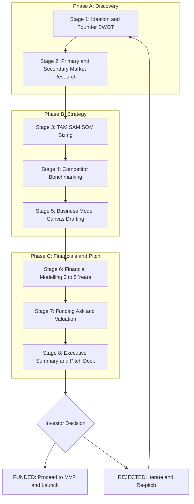
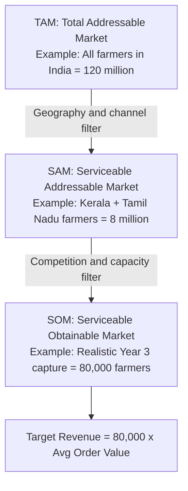
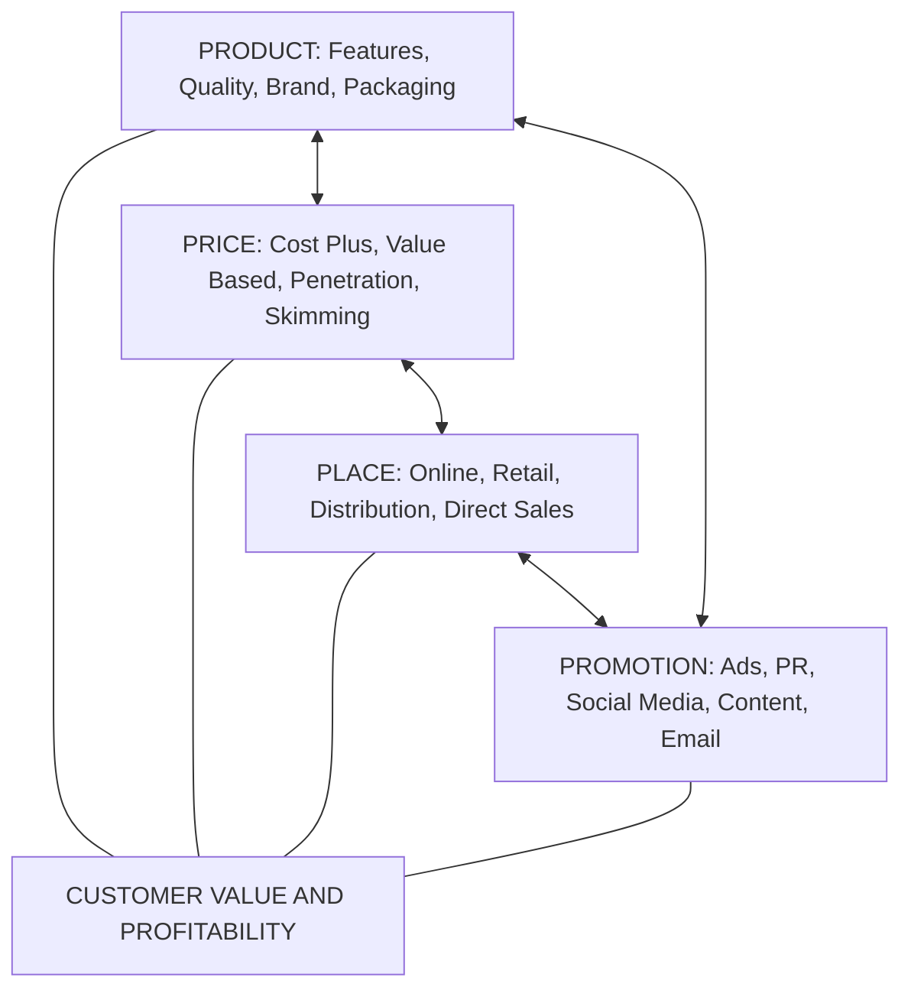

# Business plan preparation

<!-- SECTION_1_START -->

# Business Plan Preparation — KTU 2024 Scheme (UCEST206 | Module 3)

## 1. Core Technical Definition & Intuitive Overview

> [!NOTE]
> **Definition (KTU 2024 Syllabus, UCEST206):**
> A **Business Plan** is a **formal written document** that describes in detail the **goals, objectives, strategies, market scope, operational framework, financial projections, and funding requirements** of a new or existing business venture. It serves as a **strategic roadmap** that guides the entrepreneur from the concept stage to commercial execution and is the **primary instrument** used to attract investors, secure bank loans, and align internal teams.

### Conceptual Analogy / Intuition

> [!IMPORTANT]
> **Blueprint Analogy:**
> Think of a business plan exactly like the **architectural blueprint of a skyscraper**.
> * An architect cannot pour concrete without a blueprint that defines the **foundation, structural load, number of floors, electrical wiring, water pipelines, and budget**.
> * Similarly, an entrepreneur cannot "pour money" into a venture without a **business plan** that defines the **problem, the customer, the revenue model, the cost structure, the team, and the financial roadmap**.
> * A blueprint is also a **communication device** — it convinces the municipal corporation, the contractors, and the buyers that the building is feasible. Likewise, a business plan convinces **investors, banks, incubators, and government funding agencies** that the venture is worth backing.

### Why it Matters in Engineering Entrepreneurship

> [!TIP]
> For an **engineering student founder**, the business plan is the bridge between the **lab prototype** and the **marketplace product**. It forces the inventor to answer the four harshest questions investors ask:
> 1. **What problem are you solving?**
> 2. **Who is your customer?**
> 3. **How will you make money?**
> 4. **Why will you succeed where others failed?**

### Key Terms to Anchor (KTU High-Yield Vocabulary)

| # | Term | One-Line Anchor Meaning |
|---|------|------------------------|
| 1 | **Business Plan** | Written strategic + financial roadmap of a venture. |
| 2 | **Executive Summary** | A 1-page "movie trailer" of the entire plan. |
| 3 | **SWOT Analysis** | Strengths, Weaknesses, Opportunities, Threats. |
| 4 | **TAM / SAM / SOM** | Total / Serviceable / Obtainable Market sizing. |
| 5 | **Break-Even Point (BEP)** | The revenue point where total cost = total revenue. |
| 6 | **Pitch Deck** | A 10–15 slide visual version of the business plan. |
| 7 | **Burn Rate** | Monthly cash a startup spends before turning profitable. |
| 8 | **Runway** | Number of months before cash runs out. |
| 9 | **Go-To-Market (GTM) Strategy** | The plan to deliver the product to the first customer. |
| 10 | **Investor Memorandum** | Confidential detailed plan shared with serious investors. |

> [!VISUALIZATION CONTROL]
> **Concept:** Strategic Position Matrix (2×2) — Risk vs Reward for Business Plans
> **Desmos / Graph Paper Input:**
> * X-axis: $Risk \rightarrow Low \mid High$
> * Y-axis: $Reward \rightarrow Low \mid High$
> **Visual Description:** Plot four venture archetypes — Lifestyle (Low/Low), Franchise (Low/Med), Disruptor (Med/High), Moonshot (High/High). A good business plan explicitly states which quadrant the venture occupies.

---

<!-- SECTION_1_END -->

<!-- SECTION_2_START -->

## 2. Deep Theoretical Analysis & KTU High-Yield Formula Sheet

### 2.1 The 10 Building Blocks of a Business Plan (KTU Board-Favourite Structure)

A business plan is **not a single essay**. It is a **modular document** with ten well-defined sections. Examiners at KTU reward students who can list, define, and explain **each section in the correct order**.

1. **Cover Page & Title** — Company name, logo, founders, contact, date, confidentiality statement.
2. **Table of Contents** — Page-wise navigation.
3. **Executive Summary** — The single most-read page; written *last* but placed *first*.
4. **Company Description & Vision-Mission** — Legal structure (Pvt. Ltd / LLP / Partnership), history, vision, mission, values.
5. **Problem Statement & Solution** — What pain exists, and how your product/service cures it.
6. **Market Analysis** — Industry size, customer segmentation, competitor mapping, **SWOT**.
7. **Products / Services** — Features, USPs (Unique Selling Propositions), IP status, roadmap.
8. **Marketing & Sales Strategy** — **4Ps of Marketing**, GTM (Go-To-Market) plan, pricing, channels.
9. **Operations Plan** — Location, technology stack, supply chain, production, logistics.
10. **Management Team & HR Plan** — Founders' background, advisory board, hiring roadmap.
11. **Financial Plan** — Revenue model, 3–5 year P&L, cash flow, balance sheet, **BEP**, funding ask.
12. **Appendix** — Resumes, patents, letters of intent, technical diagrams, market data.

### 2.2 The "Why" Behind Each Block

> [!IMPORTANT]
> * **Executive Summary** exists because investors spend an average of **3 minutes 30 seconds** on a plan; the summary must hook them.
> * **Market Analysis** exists because *"a great product in a non-existent market"* = **zero revenue**.
> * **Financial Plan** exists because **numbers are the language of investors** — narratives without rupee values are rejected.

### 2.3 KTU Formula Sheet (Numerical & Strategic)

> [!NOTE]
> The following formulas are **frequently tested** in KTU 2024 ESE (End Semester Exam) under Module 3.

| # | Concept | Formula (LaTeX) | Meaning / Use |
|---|---------|------------------|----------------|
| 1 | **Total Revenue** | $Revenue = Price \times Quantity$ | Top-line sales figure. |
| 2 | **Gross Profit** | $Gross\ Profit = Revenue - COGS$ | Profit after direct costs. |
| 3 | **Gross Margin (%)** | $Gross\ Margin = \frac{Revenue - COGS}{Revenue} \times 100$ | Pricing power indicator. |
| 4 | **Net Profit Margin** | $Net\ Margin = \frac{Net\ Profit}{Revenue} \times 100$ | Overall profitability. |
| 5 | **Break-Even Point (units)** | $BEP_{units} = \frac{Fixed\ Cost}{Selling\ Price - Variable\ Cost\ per\ Unit}$ | The "zero-loss" sales volume. |
| 6 | **Break-Even Revenue** | $BEP_{revenue} = \frac{Fixed\ Cost}{1 - \frac{Variable\ Cost}{Revenue}}$ | The "zero-loss" sales value. |
| 7 | **TAM → SAM → SOM** | $SOM \subseteq SAM \subseteq TAM$ | Nested market sizing. |
| 8 | **Customer Acquisition Cost** | $CAC = \frac{Total\ Marketing\ \&\ Sales\ Spend}{New\ Customers\ Acquired}$ | Cost to win one customer. |
| 9 | **Customer Lifetime Value** | $LTV = Avg.\ Order\ Value \times Purchase\ Frequency \times Customer\ Lifespan$ | Long-term value of one customer. |
| 10 | **LTV : CAC Ratio** | $Healthy\ Ratio = \frac{LTV}{CAC} \geq 3$ | Investor health benchmark. |
| 11 | **Burn Rate** | $Burn\ Rate = \frac{Starting\ Cash - Ending\ Cash}{Months\ Elapsed}$ | Monthly cash consumption. |
| 12 | **Runway** | $Runway = \frac{Cash\ in\ Bank}{Monthly\ Burn\ Rate}$ | Months before insolvency. |
| 13 | **Return on Investment** | $ROI = \frac{Net\ Profit}{Total\ Investment} \times 100$ | Investor gain percentage. |
| 14 | **Payback Period** | $Payback = \frac{Initial\ Investment}{Annual\ Cash\ Inflow}$ | Years to recover money. |
| 15 | **Market Share (%)** | $Market\ Share = \frac{Company\ Sales}{Total\ Market\ Sales} \times 100$ | Competitive position. |

> [!WARNING]
> **Pipe-Symbol Pitfall in Tables:** Always use $\vert$ or $\mid$ inside the table cell — never the raw $\vert$ character, as it breaks markdown table parsing.

### 2.4 The 4Ps of Marketing (Extended Marketing Mix)

| P | Element | Strategic Question |
|---|---------|---------------------|
| **Product** | What are you selling? | Features, quality, branding, packaging. |
| **Price** | At what price? | Cost-plus, value-based, penetration, skimming. |
| **Place** | Where is it sold? | Online, retail, distribution channels. |
| **Promotion** | How do you tell? | Ads, PR, social media, content, sales. |

**Extended 7Ps** (for service businesses) add: *People, Process, Physical Evidence.*

### 2.5 Real-World Engineering Utility

> [!TIP]
> A business plan is not just for MBA students. KTU engineering graduates use it for:
> * **KTU-EDC / IEDC Bootcamp Funding** (₹2 lakh seed grants).
> * **Kerala Startup Mission (KSUM)** IDEA, PACE, and Productization grants.
> * **DST-TBI (Technology Business Incubator)** applications.
> * **BIRAC (Biotechnology Industry Research Assistance Council)** biotech funding.
> * **MSME Udyam Registration + bank Mudra loans** (up to ₹10 lakh).
> * **Tide 2.0, SISFS, and Atal Innovation Mission** grants.

---

<!-- SECTION_2_END -->

<!-- SECTION_3_START -->

## 3. Step-by-Step Preparation of a Business Plan

> [!NOTE]
> For a **Humanities / Management topic** under KTU, the "derivation" is replaced by a **structured, tabular comparative walkthrough** mapping real-world engineering cases to the regulatory / systemic matrix. The preparation of a business plan is broken into **8 sequential steps** below.

### 3.1 Step-by-Step Roadmap (8 Stages)

#### **Stage 1 — Ideation & Self-Audit**

* Write down the **problem** in one sentence.
* Identify the **target customer persona** (age, income, geography, pain-point).
* Perform a **founder SWOT** — what skills do you have, what do you lack?

#### **Stage 2 — Market Research (Primary + Secondary)**

* **Primary research:** Surveys, interviews, focus groups, observation.
* **Secondary research:** Industry reports, government data (NITI Aayog, IBEF), published market studies.
* Build the **TAM → SAM → SOM funnel** numerically.

#### **Stage 3 — Competitor Benchmarking**

* List **5 direct competitors** and **5 indirect competitors**.
* Plot them on a **2×2 matrix** (Price vs Quality / Innovation vs Market Share).

#### **Stage 4 — Business Model Canvas (BMC)**

* The BMC is a **one-page visual summary** with 9 blocks: Customer Segments, Value Propositions, Channels, Customer Relationships, Revenue Streams, Key Resources, Key Activities, Key Partnerships, Cost Structure.

#### **Stage 5 — Revenue & Pricing Model**

* Decide: **one-time sale / subscription / freemium / licensing / advertisement**.
* Set price using either **cost-plus** or **value-based** pricing.

#### **Stage 6 — Financial Modelling (3–5 Year Horizon)**

* Project: **Sales forecast, COGS, Operating expenses, P&L, Cash flow, Balance sheet**.
* Compute **BEP, ROI, Payback Period, LTV, CAC**.

#### **Stage 7 — Funding Ask**

* State **how much money** you need.
* State **what the money will buy** (hiring, equipment, marketing, runway months).
* State **what you offer in return** (equity % / interest rate / convertible note).

#### **Stage 8 — Executive Summary & Pitch Deck**

* Distil all the above into a **1-page summary**.
* Convert the summary into a **10–12 slide pitch deck** for verbal presentation.

### 3.2 Worked Numerical Example (KTU Exam-Style)

> [!EXAMPLE]
> **Q:** A startup sells an IoT-based smart irrigation device. Fixed cost per year is **₹6,00,000**. Variable cost per unit is **₹1,500**. Selling price is **₹3,000**. Compute the **Break-Even Point in units and revenue**.

**Solution:**

$$
\begin{aligned}
BEP_{units} &= \frac{Fixed\ Cost}{Selling\ Price - Variable\ Cost\ per\ Unit} \\
&= \frac{6{,}00{,}000}{3{,}000 - 1{,}500} \\
&= \frac{6{,}00{,}000}{1{,}500} \\
&= 400\ units\ per\ year
\end{aligned}
$$

$$
\begin{aligned}
BEP_{revenue} &= 400 \times 3{,}000 = 12{,}00{,}000\ \text{rupees per year}
\end{aligned}
$$

> **Interpretation:** The company must sell **400 units** (or earn **₹12 lakh revenue**) every year to neither profit nor lose. Anything above this is profit.

**[Valuation Key: Stating the formula: 2 Marks; Correct substitution: 2 Marks; Final answer in units: 2 Marks; Final answer in revenue: 1 Mark — 7 Marks total]**

### 3.3 Tabular Comparative Case Matrix (Engineering Ventures vs Business Plan Strategy)

| # | Engineering Venture Type | Core Problem Solved | Target Customer | Primary Revenue Model | Key Cost Driver | Recommended Plan Emphasis |
|---|---------------------------|---------------------|-----------------|------------------------|-----------------|----------------------------|
| 1 | **IoT / Hardware Startup** | Manual monitoring inefficiency | Factories, farms, smart homes | Hardware sale + SaaS subscription | Bill of materials (BOM) | Emphasize **operations & supply chain** sections. |
| 2 | **SaaS / Software Product** | Workflow inefficiency | SMEs, enterprises | Monthly/annual subscription | Cloud & dev salaries | Emphasize **LTV, CAC, churn**. |
| 3 | **EdTech Platform** | Quality education access | Students, parents | Freemium + paid courses | Content + marketing | Emphasize **market analysis & 4Ps**. |
| 4 | **AgriTech (KTU Kerala context)** | Low farm yield | Kerala farmers | Device sale + advisory | Hardware + field ops | Emphasize **social impact + government grants**. |
| 5 | **MedTech / Health Device** | Diagnostic delay | Hospitals, clinics | Equipment sale + AMC | R&D + regulatory | Emphasize **IP, CDSCO approvals, clinical trials**. |
| 6 | **CleanTech / EV** | Carbon emissions | Logistics, B2B | Vehicle sale + battery leasing | Battery + R&D | Emphasize **TAM and government subsidies**. |
| 7 | **FinTech (UPI / Lending)** | Financial inclusion | Retail, SMBs | Transaction fee + interest | Compliance + tech | Emphasize **RBI compliance + risk model**. |
| 8 | **Student Freelance / Service** | Skill-job gap | Local SMEs | Hourly / project billing | Self-time | Emphasize **management team + portfolio**. |

### 3.4 SWOT Analysis — Real Engineering Example (Kerala EV Startup)

> [!NOTE]
> **Company:** "K-EV Motors" — designing electric two-wheelers in Thrissur.

| | **Helpful** | **Harmful** |
|---|---|---|
| **Internal** | **Strengths:** Local R\&D, low-cost BLDC motor design, founder has 8 yrs industry exp. | **Weaknesses:** No manufacturing unit, limited working capital, single-product dependency. |
| **External** | **Opportunities:** Kerala EV Policy 2021 subsidies, rising fuel prices, FAME-II central subsidy. | **Threats:** Aggressive pricing from Ola Electric, Ather, battery price volatility, charger infra gap. |

### 3.5 Step-by-Step Funding-Ask Template (Copy-Paste Ready)

```
1. Funding Sought          : ₹50,00,000
2. Instrument Offered       : 8% Equity Stake (Pre-money valuation ₹6 Cr)
3. Use of Funds:
   a) Product Development   : ₹20,00,000  (40%)
   b) Marketing & Sales     : ₹10,00,000  (20%)
   c) Hiring (3 engineers)  : ₹12,00,000  (24%)
   d) Working Capital       : ₹5,00,000   (10%)
   e) Miscellaneous         : ₹3,00,000   (6%)
4. 18-Month Milestones     : MVP, 1,000 paying users, ₹1 Cr ARR.
5. Exit Strategy            : Acquisition by Ola / Ather within 5 years.
```

### 3.6 Common Pitfalls in a KTU Student Business Plan (And How to Avoid Them)

> [!WARNING]
> * ❌ Writing **"we have no competitors"** — every market has competitors; if not, your market does not exist.
> * ❌ Projecting **"₹100 Cr revenue in Year 1"** with no justification — examiners reject unrealistic numbers.
> * ❌ Confusing **"profit" with "cash"** — you can be profitable on paper and still run out of cash.
> * ❌ Ignoring **regulatory / IP / compliance** sections in the plan.
> * ❌ Skipping the **risk mitigation** section.

---

<!-- SECTION_3_END -->

<!-- SECTION_4_START -->

## 4. Structural Diagrams & Schematics

### 4.1 End-to-End Business Plan Preparation Flow



### 4.2 Block Diagram — Anatomy of a Standard Business Plan

```mermaid
flowchart LR
    subgraph block1["FRONT MATTER"]
        b1a["Cover Page"]
        b1b["Table of Contents"]
        b1c["Confidentiality Notice"]
    end

    subgraph block2["STRATEGIC CORE"]
        b2a["Executive Summary"]
        b2b["Company Description"]
        b2c["Problem and Solution"]
        b2d["Vision Mission and Values"]
    end

    subgraph block3["MARKET INTELLIGENCE"]
        b3a["Industry Analysis"]
        b3b["Target Customer Persona"]
        b3c["Competitor Mapping"]
        b3d["SWOT Matrix"]
    end

    subgraph block4["OPERATIONS"]
        b4a["Product and Service Line"]
        b4b["Marketing 4Ps and GTM"]
        b4c["Operations and Supply Chain"]
        b4d["Management Team and HR Plan"]
    end

    subgraph block5["FINANCIALS"]
        b5a["Revenue Model"]
        b5b["3 to 5 Year P and L"]
        b5c["Cash Flow Forecast"]
        b5d["Break Even Analysis"]
        b5e["Funding Ask and Use of Funds"]
    end

    subgraph block6["APPENDICES"]
        b6a["Founder Resumes"]
        b6b["Patents and IP Filings"]
        b6c["Letters of Intent"]
        b6d["Technical Diagrams"]
    end

    block1 --> block2 --> block3 --> block4 --> block5 --> block6
```



### 4.3 TAM → SAM → SOM Funnel (Sequential Processing Topology)



### 4.4 Marketing Mix (4Ps) Interaction Map



---

<!-- SECTION_4_END -->

<!-- SECTION_5_START -->

## 5. KTU 2024 Scheme Examination Question Bank & Topic Recap

### 5.1 Part A — Short Answer Questions (3 Marks Each)

> **[KTU University Exam — July 2024, UCEST206]**
> **Q1. (CO1, Remember)** — *Define a Business Plan. List any **four** essential components of a business plan.*
>
> **Model Answer:**
> A **Business Plan** is a written strategic document outlining the vision, objectives, market strategy, operational plan, and financial projections of a venture, used to attract investors and guide execution.
> **Four essential components:** (1) Executive Summary, (2) Market Analysis, (3) Marketing \& Sales Strategy, (4) Financial Plan.
> **[Valuation: Definition 2 Marks; Listing 4 components 1 Mark]**

> **[KTU University Exam — Dec 2023, UCEST206]**
> **Q2. (CO1, Understand)** — *What is **Break-Even Analysis**? Why is it critical in a business plan?*
>
> **Model Answer:**
> **Break-Even Analysis** is the calculation of the sales volume at which **total revenue equals total cost**, resulting in **zero profit and zero loss**. It is critical because it tells the entrepreneur the **minimum sales target** needed to survive, helps in **pricing decisions**, and is the **first financial question** every investor asks.
> **[Valuation: Definition 2 Marks; Criticality explanation 1 Mark]**

---

### 5.2 Part B — Long Answer Questions (14 Marks, Internal Choice)

> **[KTU University Exam — July 2024, UCEST206, Module 3]**

#### ✅ **Option A — Question A (14 Marks)**

**(a) [7 Marks, CO2, Understand]** — Explain in detail the **structure and components of a standard business plan**. Mention the purpose of each section.

**Model Answer (Incremental Valuation Key):**

* **Definition and Purpose** — 2 Marks
   A business plan is a written strategic document outlining a venture's goals, strategies, market, operations, and financials. Its purpose is to **secure funding**, **align teams**, and **serve as a roadmap**.
* **Listing of 8–10 components** — 3 Marks
   Cover Page, Executive Summary, Company Description, Market Analysis, Products/Services, Marketing Strategy, Operations Plan, Management Team, Financial Plan, Appendix.
* **Brief purpose of each major section** — 2 Marks
   (Executive Summary hooks the reader; Market Analysis proves demand; Financial Plan proves viability.)

**(b) [7 Marks, CO3, Apply]** — A startup manufactures solar-powered streetlights. Annual fixed cost is **₹8,00,000**, variable cost per unit is **₹4,000**, selling price is **₹6,000**. Compute the **Break-Even Point in units and in revenue**. Also, calculate the **net profit if 1,000 units are sold in a year**.

**Model Answer:**

$$
\begin{aligned}
BEP_{units} &= \frac{Fixed\ Cost}{Selling\ Price - Variable\ Cost\ per\ Unit} \\
&= \frac{8{,}00{,}000}{6{,}000 - 4{,}000} \\
&= \frac{8{,}00{,}000}{2{,}000} \\
&= 400\ units
\end{aligned}
$$

$$
\begin{aligned}
BEP_{revenue} &= 400 \times 6{,}000 = 24{,}00{,}000\ \text{rupees}
\end{aligned}
$$

$$
\begin{aligned}
Net\ Profit\ at\ 1000\ units &= Total\ Revenue - Total\ Cost \\
&= 1000 \times 6{,}000 - (8{,}00{,}000 + 1000 \times 4{,}000) \\
&= 60{,}00{,}000 - (8{,}00{,}000 + 40{,}00{,}000) \\
&= 60{,}00{,}000 - 48{,}00{,}000 \\
&= 12{,}00{,}000\ \text{rupees}
\end{aligned}
$$

**[Valuation: Stating formula 2 Marks; BEP units 2 Marks; BEP revenue 1 Mark; Net profit 2 Marks]**

---

#### ✅ **Option B — Question B (14 Marks) — Alternative Choice**

**(a) [7 Marks, CO2, Understand]** — Differentiate between **TAM, SAM, and SOM** with one numerical example each. Why is this funnel critical for an engineering startup pitching to an investor?

**Model Answer:**

* **TAM (Total Addressable Market)** — 2 Marks
   The **total global revenue opportunity** if the product were available everywhere with zero competition. *Example: World electric vehicle market = \$800 billion by 2030.*
* **SAM (Serviceable Addressable Market)** — 2 Marks
   The **slice of TAM** your geography, channel, and product can realistically serve. *Example: India EV two-wheeler market = ₹20,000 crore.*
* **SOM (Serviceable Obtainable Market)** — 2 Marks
   The **realistic Year 3 capture** after accounting for competition, capacity, and sales. *Example: Kerala EV two-wheeler Year 3 target = ₹50 crore.*
* **Criticality for investor pitch** — 1 Mark
   Investors reject "we will capture 10% of TAM" claims. The funnel shows the founder has **realistic, grounded ambition**.

**(b) [7 Marks, CO3, Apply]** — Prepare a **use-of-funds table** for a robotics startup raising **₹1 crore**. Allocate for (i) R\&D, (ii) Marketing, (iii) Hiring, (iv) Working Capital, (v) Miscellaneous. Justify each allocation.

**Model Answer (Tabular Form):**

| Sl. No. | Allocation Head | Amount (₹) | % of Total | Justification (Valuation Key) |
|---------|------------------|------------|------------|-------------------------------|
| 1 | R\&D (Sensors, Microcontrollers, Prototyping) | 40,00,000 | 40% | Hardware startups must spend heavily on prototype iteration. |
| 2 | Marketing \& Sales (Trade fairs, digital ads) | 15,00,000 | 15% | Need to build brand before scale. |
| 3 | Hiring (2 Mech, 2 Electronics, 1 Software) | 25,00,000 | 25% | Talent is the costliest asset. |
| 4 | Working Capital (Inventory + rent + utilities) | 12,00,000 | 12% | Smooth day-to-day operations. |
| 5 | Miscellaneous (Legal, IP filing, travel) | 8,00,000 | 8% | Patent filing + compliance buffer. |
| | **Total** | **1,00,00,000** | **100%** | |

**[Valuation: Tabular format 2 Marks; Total adds to 100% 1 Mark; Justification 4 Marks]**

---

### 5.3 KTU Examiner's Valuation Warning / Pitfall Callout

> [!WARNING]
> **Where KTU Students Lose Marks in Module 3 (Business Plan Preparation):**
> * ❌ **Forgetting the executive summary** — it is the most-graded page; do not skip it.
> * ❌ **Writing only qualitative content** — KTU 2024 scheme rewards **numerical clarity**. Always include at least **BEP, TAM/SAM/SOM, or a funding table**.
> * ❌ **Mixing up TAM with SAM** — they are **NOT the same**. TAM is the universe; SAM is your slice.
> * ❌ **No SWOT analysis** — examiners explicitly test for SWOT under CO2.
> * ❌ **Omitting the "Use of Funds" table** — this is the **single most-tested** financial sub-component in Module 3.
> * ❌ **Forgetting confidentiality statement and appendices** — these are part of the 3-mark short-answer "list the components" question.

---

### 5.4 Topic Recap & Important Things to Remember

> 📋 **Rapid Revision Checklist (Module 3 — Business Plan Preparation)**
>
> * **Business Plan** = Strategic + Financial + Operational roadmap of a venture.
> * **Primary purpose** = secure funding, align team, measure progress.
> * **12 standard components** = Cover, TOC, Executive Summary, Company Description, Problem-Solution, Market Analysis, Products/Services, Marketing (4Ps), Operations, Management Team, Financial Plan, Appendix.
> * **Executive Summary** is written **last** but placed **first**.
> * **TAM (Total) ⊃ SAM (Serviceable) ⊃ SOM (Obtainable).**
> * **4Ps of Marketing** = Product, Price, Place, Promotion (+3 for services: People, Process, Physical Evidence).
> * **SWOT** = Strengths, Weaknesses, Opportunities, Threats (Internal vs External).
> * **Break-Even Point (units)** $BEP_{units} = \frac{Fixed\ Cost}{Selling\ Price - Variable\ Cost\ per\ Unit}$.
> * **Break-Even Revenue** = $BEP_{units} \times Selling\ Price$.
> * **LTV : CAC ratio** should be **≥ 3** for a healthy SaaS business.
> * **Burn Rate** = monthly cash consumed; **Runway** = $\frac{Cash}{Burn\ Rate}$ in months.
> * **Funding ask must include** = amount, instrument (equity/loan), use of funds table, milestones, exit strategy.
> * **Every engineering venture plan must address** = problem, customer, revenue model, cost model, competition, team, IP, regulatory compliance, financials.
> * **Avoid these magic words in plans** = "no competitors", "first of its kind in the world", "will capture 10% of TAM in Year 1", "guaranteed returns".
> * **KTU Kerala-specific opportunities** = KSUM (Kerala Startup Mission), IEDC, BIRAC, DST-TBI, MSME, Udyam registration, KSEDM, KFC (Kerala Financial Corporation), TIDE 2.0.
> * **For 14-mark questions, always include** = definition + 8–10 list items + a numerical sub-question (BEP / funding table / TAM-SAM-SOM).
> * **For 3-mark questions, always include** = crisp definition + at least 4–5 supporting points.

---

<!-- SECTION_5_END -->
