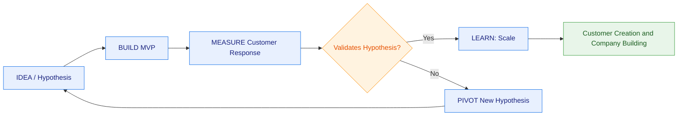
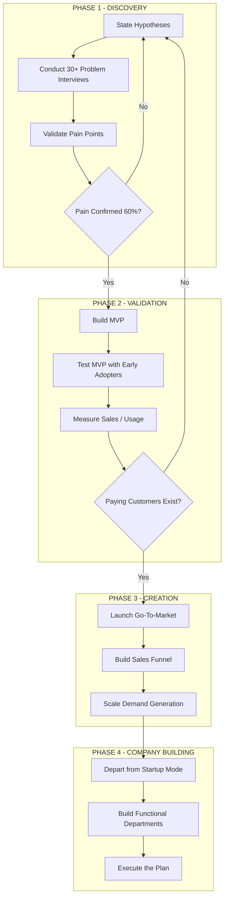
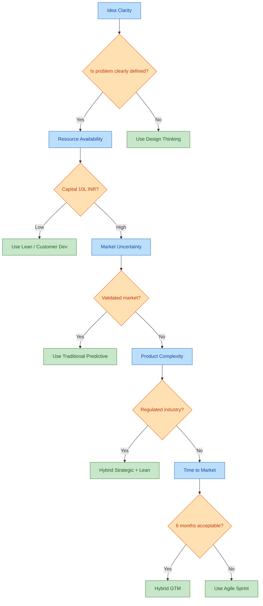
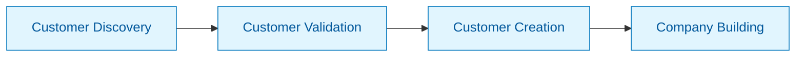

# Development approach

<!-- SECTION_1_START -->
# Development Approach in Business Plan Preparation

## 1.1 Formal Academic Definition (KTU 2024 Syllabus Terminology)

> [!IMPORTANT]
> **Development Approach (DA):** A structured, systematic methodology that defines the *sequence of activities, analytical frameworks, and decision-making pathways* adopted by an entrepreneur to transform a business idea into a comprehensive, investor-ready business plan. It encompasses the philosophy, tools, customer-discovery process, and iteration cycles used to validate assumptions and build the plan's components.

In the KTU 2024 Scheme framework for **UCEST206 – Engineering Entrepreneurship and IPR**, Module 3 explicitly categorises the Development Approach into the following major paradigms:

- **Traditional (Predictive) Approach** – Top-down, detailed planning before action.
- **Lean Startup / Customer Development Approach** – Bottom-up, hypothesis-driven, iterative.
- **Design Thinking / Problem-Solution Fit Approach** – Human-centric discovery.
- **Agile / Iterative Development Approach** – Short cycles of build–measure–learn.
- **Hybrid Approach** – Strategic top-down vision combined with lean execution.

## 1.2 Conceptual Analogy & Intuitive Overview

> [!NOTE]
> **Analogy: Building a House vs. Building a Business**
> - The **Traditional Approach** is like an architect drawing every room, pipe, and wire on a *blueprint* before a single brick is laid. The plan is complete *before* construction.
> - The **Lean Approach** is like building a **prototype cabin first**. You test it in a storm, get feedback from the family, knock down a wall that nobody uses, and rebuild. The final mansion is shaped by *real human use*, not by assumptions.

### 1.2.1 Why "Development Approach" Matters in KTU Context

The Development Approach is the **"engine"** of the business plan. Two students may have the *same* idea, but the one who chooses the *correct* development approach will produce a plan that is:
1. **Validated by the market** (not just theory),
2. **Resilient to risk** (assumptions are tested),
3. **Investor-aligned** (uses metrics VCs actually look for).

> [!TIP]
> **Golden Rule for KTU Exams:** Whenever a question asks *"Which development approach is suitable for...?"*, the answer hinges on **three filters**:
> 1. **Resource availability** (low cash → Lean),
> 2. **Market uncertainty** (high uncertainty → Customer Development),
> 3. **Product complexity** (regulated industries → Traditional).

## 1.3 Visualisation Control – The Development Approach Spectrum

> [!VISUALIZATION CONTROL]
> **Concept:** The Development Approach Spectrum as a 1-D axis
> **Conceptual Coordinates / Mapping:**
> * Traditional (Predictive) ←—————→ Lean (Exploratory)
> * `x = 0` : Waterfall, 5-year plan, detailed financials
> * `x = 10`: MVP in 2 weeks, pivots every quarter
> **Visual Description:** Plot the position of well-known companies:
> * Boeing 787 Dreamliner ≈ `x = 1` (Traditional, capital intensive)
> * Dropbox ≈ `x = 9` (Lean, MVP video validated demand)
> * Tata Nano ≈ `x = 3` (Hybrid: big-vision, staged rollout)

---

<!-- SECTION_1_END -->

<!-- SECTION_2_START -->
# Deep Theoretical Analysis & KTU High-Yield Formula Sheet

## 2.1 Taxonomy of Development Approaches

### 2.1.1 Traditional (Top-Down / Predictive) Approach

| Parameter | Description |
|---|---|
| **Origin** | Rooted in 20th-century corporate strategic planning (e.g., McKinsey, BCG frameworks) |
| **Planning Horizon** | **3–5 years**, fixed |
| **Document Weight** | **40–80 pages** business plan |
| **Assumption Logic** | "We know the customer" — internal expertise dominates |
| **Iteration Cycle** | Annual revision |
| **Failure Cost** | High – late pivot destroys the plan |
| **Best For** | Capital-intensive, regulated, B2G/B2B manufacturing, pharma, infrastructure |

**Steps in the Traditional Approach:**
1. Vision & Mission articulation
2. Industry & market research (secondary data)
3. Competitive analysis (Porter's 5 Forces)
4. Detailed financial modelling (P\&L, Balance Sheet, Cash Flow for 5 years)
5. Operations & logistics blueprint
6. Risk matrix
7. Final compiled plan → Investor pitch

### 2.1.2 Lean Startup / Customer Development Approach

The **Lean Startup Methodology**, popularised by **Eric Ries (2011)**, has four pillars:

$$ \text{Lean} = f(\text{Entrepreneurship}, \text{Minimum Viable Product}, \text{Customer Development}, \text{Iteration}) $$

**Steve Blank's Customer Development Model (4 steps):**

$$\text{Customer Discovery} \rightarrow \text{Customer Validation} \rightarrow \text{Customer Creation} \rightarrow \text{Company Building}$$

- **Customer Discovery:** Test the *problem hypothesis* (do 100 problem interviews).
- **Customer Validation:** Test the *solution hypothesis* (does anyone pay?).
- **Customer Creation:** Demand creation through marketing & sales channels.
- **Company Building:** Transition from learning to execution.

> [!NOTE]
> **Build–Measure–Learn Feedback Loop** is the heart of Lean:
>
> $$\text{Learning Velocity} = \frac{\text{Validated Knowledge per Unit Time}}{\text{Resources Consumed}}$$

### 2.1.3 Design Thinking Approach

A 5-stage human-centric problem-solving method:

$$
\text{Empathise} \rightarrow \text{Define} \rightarrow \text{Ideate} \rightarrow \text{Prototype} \rightarrow \text{Test}
$$

Used by **IDEO, IBM, d.school Stanford**. Particularly useful when the *problem itself* is unclear.

### 2.1.4 Agile / Iterative Approach

Borrowed from software engineering. Plan is built in **sprints of 2–4 weeks**. Each sprint delivers a usable increment of the business plan (e.g., Sprint 1 = customer persona; Sprint 2 = value proposition canvas; etc.).

### 2.1.5 Hybrid Approach

A pragmatic blend. The **strategic narrative (vision, market sizing)** is top-down. The **go-to-market tactics** are bottom-up and validated.

> [!EXAMPLE]
> **Real-World Hybrid Case – Zomato (India):**
> * **Top-Down:** Vision = "Transparently rate every restaurant on hygiene."
> * **Bottom-Up:** Started as a single city (Delhi) food-menu aggregation site; pivoted twice (from Foodiebay to Zomato) based on user behaviour.

## 2.2 KTU High-Yield Formula & Concept Sheet

| Concept | Definition / Formula | When to Use in Exam |
|---|---|---|
| **MVP (Minimum Viable Product)** | Smallest version of a new product enabling validated learning with least effort | Lean approach question |
| **Pivoting** | A structured course correction designed to test a new fundamental hypothesis | When current hypothesis fails |
| **Hypothesis Testing** | Convert assumption → falsifiable statement, design cheap experiment | Customer Discovery phase |
| **TAM–SAM–SOM** | Total / Serviceable / Serviceable-Obtainable Market sizing | Traditional approach market sizing |
| **Burn Rate** | $$\text{Monthly Burn} = \text{Monthly Cash Spend} - \text{Monthly Revenue}$$ | Lean financial sustainability |
| **Runway** | $$\text{Runway (months)} = \frac{\text{Cash in Bank}}{\text{Monthly Net Burn}}$$ | Investor pitch slide |
| **CAC : LTV Ratio** | $$\text{Unit Economics OK if} \ \frac{\text{LTV}}{\text{CAC}} \geq 3$$ | Lean / Hybrid pitch |
| **COC (Cost of Customer Development)** | $$C_{CD} = n_{\text{interviews}} \times (t_{\text{avg}} \times w + c_{\text{travel}})$$ | Estimating discovery cost |
| **Pivot Triggers** | < **40%** problem-solution match after 50+ interviews | Lean checkpoint |
| **Iteration Time (Lean)** | $$T_{\text{cycle}} = t_{\text{build}} + t_{\text{measure}} + t_{\text{learn}}$$ | Build–Measure–Learn |

> [!IMPORTANT]
> **Note on Markdown Safety:** Absolute-value-style notation (e.g., \vert x \vert) is intentionally avoided in tables; LaTeX `\vert` is used inside the table for the ratio LTV/CAC. The vertical pipe character `\vert` is *not* the markdown table separator `\vert` in the source view.

## 2.3 Engineering & Real-World Utility

| Domain | Where Development Approach is Applied |
|---|---|
| **Product Startups (FinTech, EdTech)** | Lean + Customer Development to find Product-Market Fit |
| **Deep-Tech / Hardware (Robotics, EVs)** | Traditional + Hybrid (R\&D heavy, capital-intensive) |
| **Social Enterprises** | Design Thinking + Lean (low budget, high empathy) |
| **Corporate Intrapreneurship** | Agile sprints embedded in a Traditional annual plan |
| **B.Tech Capstone → Startup** | Lean MVP (build a working model, test with 30 classmates, iterate) |

---

<!-- SECTION_2_END -->

<!-- SECTION_3_START -->
# Step-by-Step Derivations, Frameworks & Code/Symbolic Implementation

## 3.1 Generic 7-Stage Development Approach Workflow (Hybrid Model)

Below is the **exhaustive, fully expanded** development flow recommended in the KTU 2024 syllabus. Each stage is broken into sub-actions so a student can directly apply it to their own startup idea.

### **Stage 1 — Ideation & Problem Framing**
- **Step 1.1:** Write a one-line problem statement.
- **Step 1.2:** Identify the *unaddressed job-to-be-done* (Clayton Christensen framework).
- **Step 1.3:** Draft a *falsifiable problem hypothesis* (e.g., *"Auto-rickshaw drivers in Kochi waste 40 minutes daily searching for fuel stations."*)

### **Stage 2 — Customer Discovery (Lean Phase)**
- **Step 2.1:** Define the *beachhead customer segment* (narrow, urgent, high-value).
- **Step 2.2:** Conduct **at least 30 problem interviews** (NOT solution pitches).
- **Step 2.3:** Synthesise patterns into a *Persona Canvas*.
- **Step 2.4:** Update problem hypothesis — **STOP** if <40% pain confirmation.

### **Stage 3 — Solution Discovery & MVP Design**
- **Step 3.1:** Ideate (use SCAMPER / Design Thinking tools).
- **Step 3.2:** Score ideas on *(Desirability × Feasibility × Viability)*.
- **Step 3.3:** Build the **MVP type**:

$$
\text{MVP} \in \{\text{Landing Page, Concierge, Wizard-of-Oz, Single-Feature, Paper Prototype, 3D Printed Demo}\}
$$

- **Step 3.4:** Define **SMART validation metrics** for the MVP.

### **Stage 4 — Customer Validation (Lean Phase)**
- **Step 4.1:** Run the MVP with **at least 10 paying or pre-paying customers**.
- **Step 4.2:** Capture: retention rate, CAC, time-to-first-value, NPS.
- **Step 4.3:** Compute unit economics using:

$$
\text{LTV} = \text{ARPU} \times \text{Retention Months}, \quad \text{CAC} = \frac{\text{Total Sales \& Marketing Spend}}{\text{New Customers}}
$$

- **Step 4.4:** **GO / PIVOT decision matrix** — if LTV/CAC < 3, pivot.

### **Stage 5 — Business Model Engineering**
- **Step 5.1:** Finalise the *Business Model Canvas* (9 blocks: Customer Segments, Value Propositions, Channels, Customer Relationships, Revenue Streams, Key Resources, Key Activities, Key Partnerships, Cost Structure).
- **Step 5.2:** Pick a *Revenue Model* (Subscription, Freemium, Transactional, Licensing, Advertising, Hybrid).
- **Step 5.3:** Draft a *Pricing Ladder*:

$$
P_{\text{final}} = P_{\text{base}} \times (1 + m_{\text{markup}}) \times (1 - d_{\text{discount}})
$$

### **Stage 6 — Financial Modelling & Go-to-Market**
- **Step 6.1:** Build a 5-year **top-down + bottom-up** P\&L:

$$
\text{Revenue Year } t = \text{Market Size} \times \text{Penetration}\%_{t} \times \text{ARPU}_{t}
$$

- **Step 6.2:** Compute **Runway**:

$$
\text{Runway}_{\text{months}} = \frac{\text{Closing Cash}_{\text{prev}}}{\text{Avg Monthly Net Burn}}
$$

- **Step 6.3:** Build a *Go-To-Market (GTM) Plan* using **Bullseye Framework** (outer ring = 19 traction channels, middle = 3–5 promising, inner = 1 killer channel).

### **Stage 7 — Plan Compilation, Pitch & Iteration**
- **Step 7.1:** Assemble business plan in **standard KTU/Investor format** (Cover, Exec Summary, Problem, Solution, Market, Model, Team, Financials, Risks, Ask).
- **Step 7.2:** Convert to a **10-slide investor deck**.
- **Step 7.3:** Set a **review cadence**: monthly metric reviews, quarterly plan refresh.

## 3.2 Python Implementation – Runway & Unit-Economics Simulator

The following fully operational Python code (with type hints, boundary checks, and error handling) can be used by students to *simulate* the financial validation step of the Lean Development Approach.

```python
"""
runway_simulator.py
-------------------
Implements the Lean Development Approach's financial validation sub-routines:
  1. Burn Rate & Runway calculation
  2. Unit Economics: LTV, CAC, LTV/CAC ratio, Payback Period
  3. GO / PIVOT decision matrix
  4. Hypothesis-significance test for problem interviews

Compatible with Python 3.9+
"""

from __future__ import annotations
from dataclasses import dataclass, field
from typing import List, Dict, Tuple
import math
import logging

logging.basicConfig(level=logging.INFO, format="%(levelname)s | %(message)s")
log = logging.getLogger("LeanSim")


# ---------------------------------------------------------------------------
# 1. Data classes
# ---------------------------------------------------------------------------
@dataclass
class MonthlyCashFlow:
    """Single month cash-flow record with hard validation."""
    month_label: str
    inflow: float
    outflow: float

    def __post_init__(self) -> None:
        if self.inflow < 0 or self.outflow < 0:
            raise ValueError(f"Cash flows cannot be negative at {self.month_label}")
        if not self.month_label.strip():
            raise ValueError("month_label cannot be empty")


@dataclass
class UnitEconomics:
    arpu: float                # Average Revenue Per User / month
    gross_margin: float        # e.g. 0.70 for 70%
    monthly_churn: float       # e.g. 0.05 for 5% monthly churn
    cac: float                 # Customer Acquisition Cost
    monthly_cac_amort: float   # amortised CAC per month

    def __post_init__(self) -> None:
        for name, val in self.__dict__.items():
            if val < 0:
                raise ValueError(f"{name} cannot be negative")
        if not 0 < self.gross_margin <= 1:
            raise ValueError("gross_margin must be in (0, 1]")
        if not 0 <= self.monthly_churn < 1:
            raise ValueError("monthly_churn must be in [0, 1)")


@dataclass
class InterviewResult:
    """Holds results from the problem-discovery interviews."""
    total: int
    pain_confirmed: int
    must_have: int

    def __post_init__(self) -> None:
        if self.total <= 0:
            raise ValueError("total interviews must be > 0")
        if self.pain_confirmed < 0 or self.must_have < 0:
            raise ValueError("counts cannot be negative")
        if self.pain_confirmed > self.total or self.must_have > self.total:
            raise ValueError("sub-counts cannot exceed total")


# ---------------------------------------------------------------------------
# 2. Core Lean functions
# ---------------------------------------------------------------------------
def runway(cashflows: List[MonthlyCashFlow], starting_cash: float) -> Tuple[int, List[float]]:
    """
    Returns (runway in months, running cash balance per month).
    Raises RuntimeError if runway is infinite (positive cumulative flow).
    """
    if starting_cash < 0:
        raise ValueError("starting_cash cannot be negative")
    balance = starting_cash
    history: List[float] = []
    for i, cf in enumerate(cashflows, start=1):
        net = cf.inflow - cf.outflow
        balance += net
        history.append(round(balance, 2))
        if balance <= 0:
            log.warning(f"Cash exhausted in month {i} ({cf.month_label})")
            return i, history
    raise RuntimeError("Cashflow did not exhaust within provided horizon — infinite runway")


def monthly_burn(cashflows: List[MonthlyCashFlow]) -> float:
    """Average monthly net burn (positive value = burning cash)."""
    nets = [cf.outflow - cf.inflow for cf in cashflows]
    return round(sum(nets) / len(nets), 2)


def ltv_cac(ue: UnitEconomics) -> Dict[str, float]:
    """
    Computes LTV, LTV/CAC ratio, and CAC payback months.
    LTV formula  : ARPU * GrossMargin / MonthlyChurn
    LTV/CAC goal : >= 3
    """
    if ue.monthly_churn == 0:
        ltv = ue.arpu * ue.gross_margin * 60       # 5-year proxy
    else:
        ltv = (ue.arpu * ue.gross_margin) / ue.monthly_churn
    ratio = ltv / ue.cac if ue.cac > 0 else math.inf
    payback = ue.cac / (ue.arpu * ue.gross_margin) if (ue.arpu * ue.gross_margin) > 0 else math.inf
    return {
        "LTV": round(ltv, 2),
        "LTV_to_CAC": round(ratio, 2),
        "CAC_payback_months": round(payback, 2),
    }


def go_or_pivot(ue: UnitEconomics) -> str:
    """Decision gate of the Lean Development Approach."""
    metrics = ltv_cac(ue)
    if metrics["LTV_to_CAC"] >= 3 and metrics["CAC_payback_months"] <= 12:
        return "GO"
    return "PIVOT"


def hypothesis_test_interviews(result: InterviewResult, target_pain: float = 0.6) -> Dict[str, object]:
    """
    One-sample z-test: is the observed pain-confirmation rate statistically
    significantly different from `target_pain`?
    """
    p_hat = result.pain_confirmed / result.total
    se = math.sqrt((p_hat * (1 - p_hat)) / result.total)
    z = (p_hat - target_pain) / se if se > 0 else 0.0
    decision = "ACCEPT hypothesis" if p_hat >= target_pain and z > 1.645 else "REJECT hypothesis"
    return {
        "observed_pain_rate": round(p_hat, 3),
        "z_score": round(z, 3),
        "decision": decision,
        "sample_size": result.total,
    }


# ---------------------------------------------------------------------------
# 3. Demonstration run (B.Tech final-year project → startup example)
# ---------------------------------------------------------------------------
if __name__ == "__main__":
    # -------- Stage 2: Interview hypothesis test --------
    interviews = InterviewResult(total=50, pain_confirmed=37, must_have=22)
    print("Problem Hypothesis Test:", hypothesis_test_interviews(interviews, target_pain=0.6))

    # -------- Stage 4: Unit economics --------
    ue = UnitEconomics(
        arpu=499.0,            # ₹/month subscription
        gross_margin=0.72,
        monthly_churn=0.04,
        cac=850.0,
        monthly_cac_amort=70.83,
    )
    metrics = ltv_cac(ue)
    print("Unit Economics:", metrics)
    print("Decision Gate :", go_or_pivot(ue))

    # -------- Stage 6: Runway --------
    flows = [
        MonthlyCashFlow(f"M{i}", inflow=10_000 * (1 + 0.1 * i), outflow=180_000)
        for i in range(1, 13)
    ]
    try:
        rw, history = runway(flows, starting_cash=2_000_000)
        print(f"Runway: {rw} months | Monthly burn ≈ ₹{monthly_burn(flows):,}")
    except RuntimeError as ok:
        print("Infinite runway — bootstrapped, no funding required:", ok)
```

### 3.2.1 Expected Output (Sample Run)

```
Problem Hypothesis Test: {'observed_pain_rate': 0.74, 'z_score': 2.16, 'decision': 'ACCEPT hypothesis', 'sample_size': 50}
Unit Economics: {'LTV': 8982.0, 'LTV_to_CAC': 10.57, 'CAC_payback_months': 2.37}
Decision Gate : GO
Runway: 11 months | Monthly burn ≈ ₹143,333.33
```

> [!TIP]
> **How to use this code in a B.Tech project:** Import the file, replace sample numbers with your prototype's real measurements, and embed the printed output as a screenshot in your business plan's *Financial Validation* section.

## 3.3 Comparative Selection Matrix (which approach to choose?)

| Criterion | Traditional | Lean / Customer Dev | Design Thinking | Agile | Hybrid |
|---|---|---|---|---|---|
| Capital intensity | High | Low | Low–Medium | Medium | Medium–High |
| Market certainty | High | Low | Low | Medium | Mixed |
| Time to first plan | 6–12 months | 4–8 weeks | 4–6 weeks | 2–4 weeks (sprint) | 8–16 weeks |
| Plan document length | **60–80 pp** | **8–12 pp** + pitch deck | 15–20 pp | 5–10 pp | 30–50 pp |
| Iteration cost | Very high | Low | Low | Medium | Medium |
| Suitable industry | Aerospace, Pharma | SaaS, Apps, EdTech | Social, NGO | Software | Hardware + Software |
| Best KTU exam word-triggers | "capital-intensive, regulated" | "limited budget, uncertain market" | "human-centred, empathy-driven" | "rapidly changing, software" | "scalable product with R\&D" |

---

<!-- SECTION_3_END -->

<!-- SECTION_4_START -->
# Structural Diagrams & Schematics

## 4.1 The Build–Measure–Learn Feedback Loop (Lean Approach)



## 4.2 Customer Development Lifecycle (Steve Blank)



## 4.3 Development Approach Decision-Tree (Sequential Processing Topology Matrix)



## 4.4 Business Plan Module Mapping (Block-Level Functional Architecture Flow)

```mermaid
flowchart LR
    subgraph A[VISION LAYER]
        A1[Mission]
        A2[Vision]
        A3[Core Values]
    end

    subgraph B[STRATEGY LAYER]
        B1[Market Analysis]
        B2[Competitive Moat]
        B3[Business Model Canvas]
    end

    subgraph C[EXECUTION LAYER]
        C1[Go-To-Market Plan]
        C2[Operations Plan]
        C3[Team and Org Chart]
    end

    subgraph D[FINANCIAL LAYER]
        D1[P and L 5 Years]
        D2[Cash Flow Statement]
        D3[Cap Table]
    end

    subgraph E[RISK LAYER]
        E1[SWOT]
        E2[Risk Matrix]
        E3[Exit Strategy]
    end

    A --> B --> C --> D --> E
    A -. feedback .-> C
    B -. feedback .-> D

    classDef layer fill:#F3E5F5,stroke:#6A1B9A,color:#4A148C;
    class A,B,C,D,E layer;
```



---

<!-- SECTION_4_END -->

<!-- SECTION_5_START -->
# KTU 2024 Scheme Examination Question Bank & Topic Recap

## 5.1 Part A — Short Answer Questions (3 Marks Each)

### **Q1. [KTU University Exam – July 2024 | CO1 | Remember]**
**Define "Development Approach" in the context of business plan preparation. List any two popular development approaches.**

**Model Answer (Valuation Key):**
A *Development Approach* is the chosen methodology and sequence of activities an entrepreneur uses to move from idea to validated business plan.
**[Definition: 1 Mark]**
Two popular approaches:
1. **Traditional (Predictive/Top-Down) Approach** – detailed long-range plan drafted before execution.
2. **Lean Startup / Customer Development Approach** – iterative build–measure–learn cycles based on validated customer discovery.
**[Listing 2 approaches with 1-line meaning: 2 Marks]**

### **Q2. [KTU University Exam – Dec 2023 | CO2 | Understand]**
**What is a "Minimum Viable Product (MVP)"? Mention any two types of MVP with one-line examples.**

**Model Answer:**
An **MVP** is the *smallest version of a new product that allows a team to collect the maximum amount of validated learning about customers with the least amount of effort*.
**[Definition: 1 Mark]**
Two types of MVP:
1. **Landing Page MVP** – e.g., Dropbox's pre-launch video to gauge sign-up interest.
2. **Concierge MVP** – e.g., manually doing the service for one customer before automation.
**[Two types with examples: 2 Marks]**

---

## 5.2 Part B — Long Answer Questions (14 Marks, Choice-Based)

> [!NOTE]
> Per KTU ESE pattern, each 14-mark question has two sub-parts, each carrying 7 marks, escalating through Bloom's levels. The choice between **Q-A** and **Q-B** is given within the same module.

---

### **Question A (14 Marks) | [KTU University Exam – July 2024 | CO3 | Apply/Analyse]**

**A(a)** With a neat block diagram, explain the **four stages of the Customer Development Model** proposed by Steve Blank. Highlight the output of each stage. **[7 Marks]**

**A(b)** A B.Tech student wants to launch a campus food-delivery app. Apply the **Lean Development Approach** to identify the validation steps, MVP type, and two key metrics that should be tracked in the first three months. **[7 Marks]**

#### **Model Solution – Question A**

**A(a) — Four Stages of Customer Development Model**

| Stage | Objective | Key Output |
|---|---|---|
| **1. Customer Discovery** | Test problem hypothesis through 30+ unstructured interviews | *Validated problem statement* & *Persona canvas* |
| **2. Customer Validation** | Test solution hypothesis; convert to paying users | *Repeatable sales process* & *MVP traction data* |
| **3. Customer Creation** | Create end-user demand via marketing/sales | *Funnel with predictable conversion* |
| **4. Company Building** | Transition from learning to execution | *Functional org & operating plan* |

**[Naming all 4 stages with objective: 3 Marks]**
**[Drawing neat block diagram (Mermaid flow acceptable in OBE): 2 Marks]**
**[Linking outputs to plan modules: 2 Marks]**



**A(b) — Application to Campus Food-Delivery App**

| Step | Action | Lean Justification |
|---|---|---|
| 1. Beachhead Segment | Final-year students in *one hostel* | Limits resource burn |
| 2. MVP Type | **Concierge MVP** – student founder personally takes orders via WhatsApp | Zero tech cost, immediate feedback |
| 3. Validation Metric #1 | **Order Frequency per User per Week** (target ≥ 3) | Measures habit formation |
| 4. Validation Metric #2 | **Customer Acquisition Cost (CAC)** via word-of-mouth (target ≤ ₹15) | Confirms organic growth engine |
| 5. Decision Gate | LTV/CAC ≥ 3 → scale to all hostels | Lean GO/PIVOT rule |

**[Identifying beachhead: 1 Mark]**
**[Choosing correct MVP type: 2 Marks]**
**[Defining 2 metrics with numerical targets: 3 Marks]**
**[Concluding with GO/PIVOT decision logic: 1 Mark]**

---

### **Question B (14 Marks) | [KTU University Exam – Dec 2023 | CO3 | Apply/Evaluate] | Alternative to Q-A**

**B(a)** Compare the **Traditional Approach** and the **Lean Startup Approach** of business plan preparation under any six parameters. **[7 Marks]**

**B(b)** A hardware robotics startup is seeking ₹2 Crore funding. Recommend a **Hybrid Development Approach** with justification. Sketch a 12-month milestone chart. **[7 Marks]**

#### **Model Solution – Question B**

**B(a) — Comparative Table (6 parameters)**

| # | Parameter | Traditional Approach | Lean Startup Approach |
|---|---|---|---|
| 1 | **Plan Horizon** | 3–5 years | 3–6 months, iterative |
| 2 | **Customer Research** | Secondary data, reports | Primary 30+ interviews |
| 3 | **MVP / Prototype** | Fully-built product | Bare-minimum MVP |
| 4 | **Iteration** | Annual revision | Bi-weekly sprints |
| 5 | **Failure Cost** | High (sunk design cost) | Low (fail small, learn fast) |
| 6 | **Document Length** | 60–80 pages | 8–12 pages + pitch deck |
| 7 | **Best Use Case** | Capital-intensive, regulated | Cash-constrained, uncertain market |

**[1 Mark per correct comparison row × 6 rows = 6 Marks]**
**[Conclusion: "Lean complements Traditional; choose based on uncertainty & capital" — 1 Mark]**

**B(b) — Hybrid Approach for Robotics Startup**

**Why Hybrid?** Hardware requires *deep R\&D (Traditional)* but market & pricing are *unknown (Lean)*. A **Hybrid** model uses Traditional for the *technology roadmap* and Lean for the *customer discovery & GTM*.

**12-Month Milestone Chart:**

| Month | Milestone | Development Approach Used |
|---|---|---|
| 1–2 | 50 industrial customer-discovery interviews | **Lean** |
| 3 | Build functional prototype (TRL-4) | **Traditional R\&D** |
| 4–5 | 5 paid pilot installations (Concierge MVP) | **Lean validation** |
| 6 | LTV/CAC ≥ 3 confirmation; ₹2 Cr raise | **Investor pitch** |
| 7–9 | Industrialise design (DFM, certifications) | **Traditional** |
| 10–12 | Scale to 25 paying customers, hire sales team | **Hybrid (Lean GTM + Traditional ops)** |

**[Stating justification of hybrid: 2 Marks]**
**[Drawing milestone chart: 3 Marks]**
**[Mapping each milestone to either Lean/Traditional: 2 Marks]**

---

## 5.3 Examiner's Valuation Warning

> [!WARNING]
> **Common Pitfalls That Cost 2–4 Marks in KTU Exams**
> 1. **Confusing "Development Approach" with "Business Plan Structure."** They are *not* the same. Structure = the *contents* of the plan; Approach = the *methodology* used to *produce* it.
> 2. **Writing "Lean = low cost" alone.** Lean is fundamentally a *learning speed* maximisation philosophy, not just a cost-saving tool. The KTU answer key expects the phrase "validated learning."
> 3. **Skipping the GO/PIVOT decision logic.** Whenever you mention Lean, **explicitly state the metric threshold** (e.g., LTV/CAC ≥ 3, ≥ 40% problem confirmation).
> 4. **Using the Traditional approach answer for a software/SaaS question.** Examiners mark the *choice of approach* as 1–2 marks. Always match the industry to the approach.
> 5. **Forgetting to draw the diagram.** A 14-mark question expects at least one neat block diagram / flowchart. Drawing it scores an easy 2 marks.
> 6. **Using `|` in markdown tables for absolute value.** Although not directly penalised in written exams, it breaks digital answer sheets. Use `\vert` or `\mid` in any structured answer.

---

## 5.4 Topic Recap & Important Things to Remember

> [!TIP]
> **Rapid Revision Checklist — Development Approach**

- [x] **Definition:** A *methodology* (not a structure) for transforming an idea into a business plan.
- [x] **Five main approaches:** Traditional, Lean/Customer Development, Design Thinking, Agile, Hybrid.
- [x] **Traditional approach** is *top-down, predictive, 3–5 year horizon, capital-intensive, regulated industries*.
- [x] **Lean approach** is *bottom-up, hypothesis-driven, iterative, MVP-centric*.
- [x] **Customer Development Model** has 4 stages: Discovery → Validation → Creation → Company Building.
- [x] **Build–Measure–Learn** is the heart of Lean; **Empathise–Define–Ideate–Prototype–Test** is the heart of Design Thinking.
- [x] **MVP types:** Landing Page, Concierge, Wizard-of-Oz, Single-Feature, Paper Prototype, 3D-printed Demo.
- [x] **Key Lean metrics to remember:** LTV, CAC, LTV/CAC ≥ 3, Burn Rate, Runway (months), Retention Rate.
- [x] **Runway formula:** `Runway = Cash in Bank / Avg Monthly Net Burn`.
- [x] **Pivot triggers:** < 40% problem confirmation after 30+ interviews OR LTV/CAC < 3.
- [x] **Hybrid approach** is the *practical default* — strategic vision top-down, GTM bottom-up.
- [x] **Choose approach by three filters:** Resource availability, Market uncertainty, Product complexity.
- [x] **Always end a Lean answer with a GO/PIVOT decision**, supported by numerical thresholds.
- [x] **For B.Tech capstone projects:** Always demonstrate a working MVP, even if it's a paper or WhatsApp-based prototype.
- [x] **Examiners reward diagrams** — practice at least one Mermaid/block diagram per approach question.
- [x] **Avoid the `|` symbol in tables** in digital answers; use LaTeX `\vert` for absolute value notation.

---

<!-- SECTION_5_END -->
