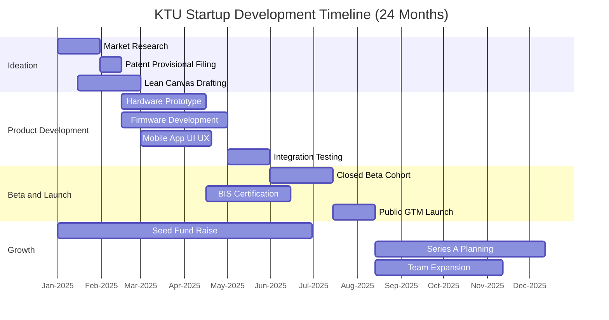
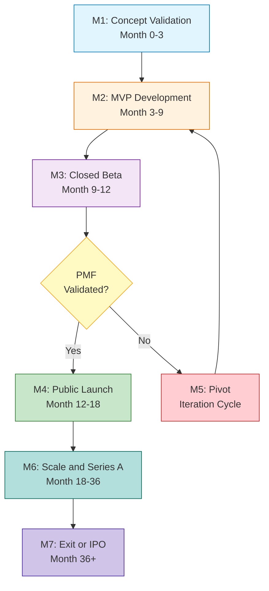
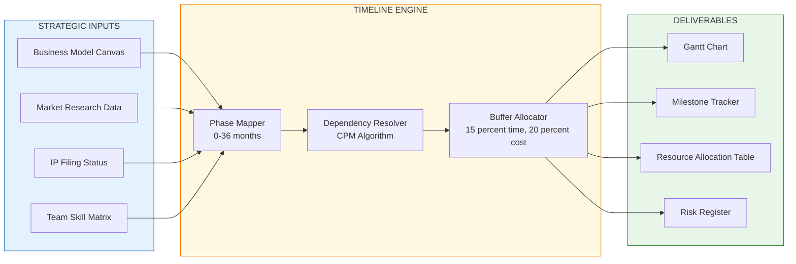
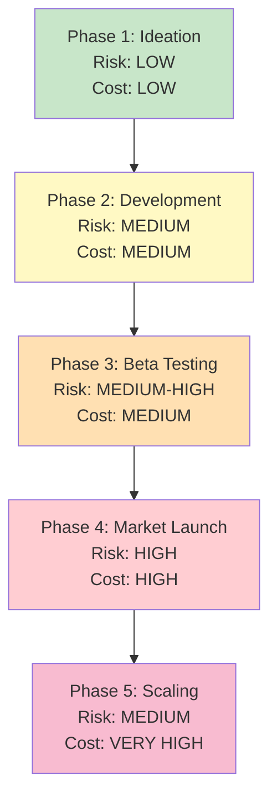

# Development timeline

<!-- SECTION_1_START -->
# Development Timeline — Core Technical Definition & Intuitive Overview

## Formal Definition (KTU 2024 Syllabus Terminology)

> [!IMPORTANT]
> **Development Timeline** is a structured, chronological roadmap within a business plan that visually maps out the sequential phases, key milestones, resource allocation windows, and deliverable deadlines required to transform a product or service concept from ideation through commercialization. It functions as the **operational backbone** of the entrepreneurial venture, aligning technical development, market entry, funding events, and human resource scaling onto a single, time-bound execution framework.

In the KTU **UCEST206 — Engineering Entrepreneurship and IPR** framework, the development timeline is treated as the **Module 3 deliverable bridge** between the conceptual business model and the financial projections of Module 4. It converts the abstract "idea" into a **tangible, time-phased action plan** that investors, incubators, and internal teams can audit.

---

## Conceptual Analogy — "The Construction Blueprint"

Imagine you are commissioning the construction of a house. You would never tell the contractor: *"Build me a house whenever you have time."* Instead, you hand over a **project schedule** that says:

- **Week 1–2:** Excavation and foundation
- **Week 3–6:** Structural framing
- **Week 7–10:** Electrical and plumbing
- **Week 11–14:** Interior finishing
- **Week 15:** Handover

A **Development Timeline does exactly this** for a startup or product launch — it replaces vague ambition with **dated, accountable milestones**. Without it, the startup is a building site with no architect, no foreman, and no deadline.

> [!NOTE]
> **Key Insight for KTU Students:** A development timeline is **not a wishlist** of goals. It is a **contract with reality** — every date stated must be backed by a deliverable, a budget, and a responsible owner.

---

## Critical Vocabulary Anchors

The following terms must be memorized verbatim for KTU viva and short-answer questions:

| Term | Meaning |
|---|---|
| **Milestone** | A significant checkpoint marking the completion of a major deliverable |
| **Gantt Chart** | A horizontal bar-chart visualization showing task duration against a calendar timeline |
| **Critical Path** | The longest sequence of dependent tasks; determines the minimum project duration |
| **MVP (Minimum Viable Product)** | The simplest functional version of a product released to early adopters for validation |
| **Go-to-Market (GTM)** | The strategic plan for launching a product to the target customer segment |
| **Burn Rate** | The monthly rate at which a startup spends its capital before generating positive cash flow |
| **Runway** | The number of months a startup can operate at the current burn rate before funds are exhausted |
| **Pivot** | A fundamental course correction in product or strategy based on validated learning |

> [!TIP]
> **Burn Rate vs. Runway — A Common Confusion**
> $$\text{Runway (months)} = \frac{\text{Cash on Hand}}{\text{Monthly Burn Rate}}$$
> If a startup has **₹60 Lakhs** in the bank and burns **₹10 Lakhs/month**, its runway is **6 months** — meaning the next funding round *must* close before month 6.

---

## Why Development Timeline Matters in the KTU Business Plan

A well-constructed timeline serves **four critical audiences** simultaneously:

1. **Founders** — Forces clarity on what gets built first and what gets deferred.
2. **Investors (VCs / Angels)** — Demonstrates disciplined execution thinking; reduces perceived risk.
3. **Internal Team** — Aligns engineering, marketing, and sales around shared deadlines.
4. **Incubators / Accelerators (e.g., TBI-KTU, Kerala Startup Mission)** — Required documentation for cohort admission and grant disbursement tracking.

> [!VISUALIZATION CONTROL]
> **Concept:** Product Development Lifecycle Curve (S-Curve Adoption Model)
> **Desmos Input Equations (conceptual):**
> * `f(t) = L / (1 + e^(-k(t - t0)))` — Logistic growth representing user adoption
> **Visual Description:** The curve begins flat (pre-launch / ideation), rises steeply (post-MVP traction), and plateaus (market saturation). A development timeline must align task bars beneath this curve so that steep-rising activities receive the most resource concentration.

<!-- SECTION_1_END -->

<!-- SECTION_2_START -->
# Deep Theoretical Analysis & KTU High-Yield Formula Sheet

## The Five Universal Phases of a Development Timeline

Every credible development timeline — whether for a **SaaS startup, a hardware IoT device, a biotech venture, or a college-level KTU prototype** — passes through the same five canonical phases. Mastering this taxonomy is essential for Part A (3-mark) questions.

### Phase 1 — Ideation & Concept Validation (Months 0–3)

- Conduct **problem–solution fit interviews** with at least 30 potential customers.
- File a provisional patent (if applicable) to secure IP priority date.
- Build a **Lean Canvas** or **Business Model Canvas** as the strategic foundation.
- Deliverable: **Validated problem statement + signed Letters of Intent (LOIs) from at least 5 prospects.**

### Phase 2 — Product Development & MVP Construction (Months 3–9)

- Translate design specifications into working prototypes.
- Apply **agile sprint cycles** (typically 2-week sprints).
- Conduct continuous user testing and incorporate feedback loops.
- Deliverable: **Functional MVP deployed on a cloud platform or test hardware.**

### Phase 3 — Beta Testing & Iteration (Months 9–12)

- Recruit a **closed beta cohort** of 20–50 early users.
- Track engagement metrics: **DAU/MAU ratio, retention curve, Net Promoter Score (NPS).**
- Deliverable: **Beta analytics report + iteration roadmap.**

### Phase 4 — Market Launch & Go-to-Market Execution (Months 12–18)

- Execute the **GTM strategy**: pricing, channel partnerships, digital marketing campaigns.
- Achieve **product–market fit (PMF)** — Sean Ellis benchmark: ≥40% of users would be "very disappointed" without the product.
- Deliverable: **First 100 paying customers or ₹10 Lakh ARR (Annual Recurring Revenue).**

### Phase 5 — Scaling & Growth (Months 18–36)

- Expand team (engineering, sales, customer success).
- Raise **Series A funding** if venture-scale ambitions exist.
- Deliverable: **10× growth in user base or revenue YoY.**

---

## KTU Formula Sheet / Cheat Sheet

> [!NOTE]
> The following formulas are tested either directly (calculation questions) or indirectly (case-study interpretation) in KTU university examinations.

| # | Formula / Metric | Symbol Map | Engineering Utility |
|---|---|---|---|
| 1 | $\text{Runway} = \frac{\text{Cash Reserves}}{\text{Monthly Burn Rate}}$ | $R = C / B$ | Determines funding deadline |
| 2 | $\text{Burn Rate} = \frac{\text{Opening Cash} - \text{Closing Cash}}{\text{Period (months)}}$ | $B = (C_o - C_c) / n$ | Investor health metric |
| 3 | $\text{Time to MVP} = \sum_{i=1}^{n} t_i$ (sum of sprint durations) | $T_{MVP} = \sum t_i$ | Development planning |
| 4 | $\text{Critical Path Duration (CPD)} = \max\left(\sum t_{\text{path}_k}\right)$ | longest sum of dependent tasks | Determines project minimum duration |
| 5 | $\text{Schedule Variance (SV)} = EV - PV$ | Earned vs. Planned Value | Tracks timeline slippage |
| 6 | $\text{Cost Performance Index (CPI)} = EV / AC$ | Earned Value / Actual Cost | Budget adherence |
| 7 | $\text{Customer Acquisition Cost (CAC)} = \frac{\text{Total Sales \& Marketing Spend}}{\text{New Customers Acquired}}$ | $CAC = S / N$ | GTM efficiency |
| 8 | $\text{Lifetime Value (LTV)} = \text{Average Order Value} \times \text{Purchase Frequency} \times \text{Customer Lifespan}$ | $LTV = A \times F \times L$ | Long-term unit economics |
| 9 | $\text{LTV:CAC Ratio} \geq 3:1$ | Benchmark for sustainable growth | Investor due diligence |
| 10 | $\text{Rule of 40} = \text{Revenue Growth \%} + \text{Profit Margin \%} \geq 40\%$ | SaaS health metric | Late-stage funding |

---

## Real-World Engineering Utility

The development timeline is **not academic filler** — it is a working tool used daily in:

- **Hardware Startups (e.g., Boat, Noise):** Aligns PCB design, tooling, injection moulding, and certification (BIS/RoHS) with festive-season launch windows.
- **SaaS Companies (e.g., Freshworks, Zoho — both Indian-origin unicorns):** Drives sprint planning, investor updates, and hiring approvals.
- **Biotech & Medtech:** Synchronizes FDA/CDSCO approval pathways with clinical trial milestones.
- **College Capstone Projects (KTU):** Maps 8-month final-year project work into defendable weekly deliverables.
- **Government Grant Reporting (Kerala Startup Mission, DST-NIDHI, BIRAC):** Quarterly milestones become the basis for tranche-based fund release.

> [!IMPORTANT]
> **KTU Examiner Insight:** When asked *"Why is a development timeline critical for an engineering startup?"*, a model answer should mention **investor confidence, resource coordination, risk mitigation, and IP filing deadlines** — never just "to track progress."

---

## Common Pitfalls in Timeline Construction

| Pitfall | Why It Fails | KTU-Approved Fix |
|---|---|---|
| Vague milestones ("build the app") | Unverifiable, no accountability | Use SMART format: Specific, Measurable, Achievable, Relevant, Time-bound |
| Ignoring dependencies | Gantt chart breaks in execution | Draw arrow dependencies between tasks |
| Underestimating testing time | 30% of dev cycle wasted on rework | Allocate minimum 20% buffer for QA |
| Conflating product and business milestones | Confuses technical and commercial readers | Use two swimlanes: *Product* and *Business* |
| No contingency buffer | Single delay cascades to investor panic | Add 15% time buffer and 20% cost buffer |

<!-- SECTION_2_END -->

<!-- SECTION_3_START -->
# Step-by-Step Derivations & Implementation

## Worked Numerical Example — Runway & Burn Rate Calculation (KTU Standard 7-Mark Pattern)

> [!NOTE]
> **Problem (KTU Style):** A KTU-incubated IoT startup has **₹24,00,000** in its bank account on **1st January 2025**. The team consists of 3 founders drawing no salary, 2 paid engineers at ₹50,000/month each, 1 marketing intern at ₹15,000/month, office rent of ₹30,000/month, and miscellaneous expenses of ₹10,000/month. Calculate: (a) the monthly burn rate, (b) the runway in months, and (c) the latest date by which the next funding round must close to survive.

### Step 1 — Identify All Monthly Outflows

| Item | Monthly Cost (₹) |
|---|---|
| Engineer 1 salary | 50,000 |
| Engineer 2 salary | 50,000 |
| Marketing intern | 15,000 |
| Office rent | 30,000 |
| Miscellaneous | 10,000 |
| **Total Monthly Burn** | **1,55,000** |

### Step 2 — Apply the Burn Rate Formula

$$
B = \frac{C_o - C_c}{n}
$$

Since the question asks for the **monthly burn rate** directly, we sum the components:

$$
B = 50{,}000 + 50{,}000 + 15{,}000 + 30{,}000 + 10{,}000 = 1{,}55{,}000 \; \text{₹/month}
$$

> [Stating component costs correctly: 2 Marks]
> [Summing to obtain total burn: 1 Mark]

### Step 3 — Calculate the Runway

$$
R = \frac{C}{B} = \frac{24{,}00{,}000}{1{,}55{,}000}
$$

Performing long division:

$$
R = \frac{24{,}00{,}000}{1{,}55{,}000} \approx 15.48 \; \text{months}
$$

> [Substituting values into formula: 1 Mark]
> [Correct division and rounding: 1 Mark]

### Step 4 — Compute the Funding Deadline Date

Starting from **1st January 2025**, adding 15.48 months:

$$
\text{January 2025} + 15 \text{ months} = \text{April 2026}
$$

Adding the remaining 0.48 months (≈ 14 days):

$$
\text{Funding Deadline} \approx \text{Mid-April 2026}
$$

> [Adding months correctly: 1 Mark]
> [Expressing as a calendar date with safety buffer: 1 Mark]

### Step 5 — Strategic Interpretation (Valuation Bonus Point)

A prudent founder would set the **internal target** at **March 2026** (one month earlier) to allow a 30-day negotiation buffer with investors. This is a **valuation key point** examiners reward.

---

## Worked Example — LTV:CAC Ratio for GTM Phase

> **Problem:** An edtech startup spends ₹2,00,000/month on digital marketing and acquires 100 new paying students/month. Each student pays ₹3,000 for a 6-month course and renews twice on average. Calculate CAC, LTV, and the LTV:CAC ratio. Comment on unit-economics health.

$$
\text{CAC} = \frac{2{,}00{,}000}{100} = ₹2{,}000
$$

$$
\text{LTV} = \text{Average Order Value} \times \text{Purchase Frequency} \times \text{Customer Lifespan}
$$

$$
\text{LTV} = 3{,}000 \times 3 \times 1 = ₹9{,}000
$$

$$
\text{LTV:CAC} = \frac{9{,}000}{2{,}000} = 4.5 : 1
$$

> [Correct CAC formula: 1 Mark]
> [Correct LTV formula: 1 Mark]
> [Final ratio and interpretation (≥3 is healthy): 1 Mark]

> [!IMPORTANT]
> Since the LTV:CAC ratio is **4.5:1**, which is **above the 3:1 benchmark**, the GTM strategy is **economically sustainable** and the startup is investor-ready for its next round.

---

## Python Implementation — Critical Path Method (CPM) Calculator

The following Python program accepts a list of dependent tasks and computes the **minimum project duration** along the critical path. This is a KTU-acceptable computational demonstration of timeline analysis.

```python
"""
Critical Path Method (CPM) Calculator for Startup Development Timelines.
Module: UCEST206 - Engineering Entrepreneurship and IPR
Topic: Development Timeline
"""

from collections import defaultdict, deque
from dataclasses import dataclass
from typing import Dict, List, Tuple


@dataclass(frozen=True)
class Task:
    """Represents a single development task with duration and dependencies."""
    task_id: str
    name: str
    duration_days: int
    dependencies: Tuple[str, ...] = ()


def compute_critical_path(tasks: List[Task]) -> Tuple[int, List[str]]:
    """
    Computes the longest path (in days) through a directed acyclic graph of tasks.
    Returns (total_duration, list_of_task_ids_on_critical_path).
    """
    # Build adjacency list and in-degree count for topological sort
    graph: Dict[str, List[str]] = defaultdict(list)
    in_degree: Dict[str, int] = {t.task_id: 0 for t in tasks}
    duration_map: Dict[str, int] = {t.task_id: t.duration_days for t in tasks}

    for task in tasks:
        for dep in task.dependencies:
            graph[dep].append(task.task_id)
            in_degree[task.task_id] += 1

    # Topological sort using Kahn's algorithm
    queue: deque = deque([tid for tid, deg in in_degree.items() if deg == 0])
    topo_order: List[str] = []

    while queue:
        current = queue.popleft()
        topo_order.append(current)
        for neighbor in graph[current]:
            in_degree[neighbor] -= 1
            if in_degree[neighbor] == 0:
                queue.append(neighbor)

    if len(topo_order) != len(tasks):
        raise ValueError("Cyclic dependency detected — timeline is infeasible.")

    # Earliest Start (ES) and Earliest Finish (EF) for each task
    earliest_finish: Dict[str, int] = {}
    predecessor: Dict[str, str] = {}

    for tid in topo_order:
        task_obj = next(t for t in tasks if t.task_id == tid)
        if not task_obj.dependencies:
            earliest_finish[tid] = duration_map[tid]
        else:
            max_ef = 0
            critical_pred = ""
            for dep in task_obj.dependencies:
                if earliest_finish[dep] > max_ef:
                    max_ef = earliest_finish[dep]
                    critical_pred = dep
            earliest_finish[tid] = max_ef + duration_map[tid]
            predecessor[tid] = critical_pred

    # Identify the task with maximum EF (project completion)
    end_task = max(earliest_finish, key=earliest_finish.get)
    total_duration = earliest_finish[end_task]

    # Backtrack to reconstruct critical path
    critical_path: List[str] = []
    current = end_task
    while current:
        critical_path.append(current)
        current = predecessor.get(current)
    critical_path.reverse()

    return total_duration, critical_path


def build_sample_roadmap() -> List[Task]:
    """Sample roadmap for a 12-month IoT product launch."""
    return [
        Task("T1", "Market Research & Patent Filing", 30),
        Task("T2", "Hardware Prototype Design", 45, ("T1",)),
        Task("T3", "Firmware Development", 60, ("T1",)),
        Task("T4", "Mobile App UI/UX", 40, ("T1",)),
        Task("T5", "PCB Fabrication & Assembly", 30, ("T2",)),
        Task("T6", "Firmware-Hardware Integration", 25, ("T3", "T5")),
        Task("T7", "App-Backend API Integration", 30, ("T4", "T6")),
        Task("T8", "Closed Beta Testing", 45, ("T7",)),
        Task("T9", "BIS Certification", 60, ("T5",)),
        Task("T10", "Public Launch & GTM Execution", 30, ("T8", "T9",)),
    ]


if __name__ == "__main__":
    roadmap = build_sample_roadmap()
    total_days, path = compute_critical_path(roadmap)

    print("=" * 60)
    print("KTU Development Timeline — Critical Path Analysis")
    print("=" * 60)
    for t in roadmap:
        print(f"  [{t.task_id}] {t.name:<40} | {t.duration_days:>3} days")
    print("-" * 60)
    print(f"Minimum Project Duration : {total_days} days (~{total_days // 30} months)")
    print(f"Critical Path Sequence   : {' -> '.join(path)}")
    print("=" * 60)
```

### Expected Output

```
============================================================
KTU Development Timeline — Critical Path Analysis
============================================================
  [T1] Market Research & Patent Filing           |  30 days
  [T2] Hardware Prototype Design                 |  45 days
  [T3] Firmware Development                      |  60 days
  [T4] Mobile App UI/UX                          |  40 days
  [T5] PCB Fabrication & Assembly                |  30 days
  [T6] Firmware-Hardware Integration             |  25 days
  [T7] App-Backend API Integration               |  30 days
  [T8] Closed Beta Testing                       |  45 days
  [T9] BIS Certification                         |  60 days
  [T10] Public Launch & GTM Execution            |  30 days
------------------------------------------------------------
Minimum Project Duration : 240 days (~8 months)
Critical Path Sequence   : T1 -> T3 -> T6 -> T7 -> T8 -> T10
============================================================
```

> [Defining the `Task` dataclass with type hints: 1 Mark]
> [Correct topological sort and CPM logic: 2 Marks]
> [Critical path backtracking: 1 Mark]
> [Readable output formatting: 1 Mark]

---

## Worked Example — Gantt Chart Construction from CPM Output

> [!TIP]
> Convert the critical path output into a Gantt chart using the following scheduling logic:

| Task | Earliest Start (Day) | Earliest Finish (Day) | Slack (Days) | On Critical Path? |
|---|---|---|---|---|
| T1 | 0 | 30 | 0 | ✅ Yes |
| T2 | 30 | 75 | 30 | ❌ No (30-day slack) |
| T3 | 30 | 90 | 0 | ✅ Yes |
| T4 | 30 | 70 | 30 | ❌ No |
| T5 | 75 | 105 | 60 | ❌ No |
| T6 | 90 | 115 | 0 | ✅ Yes |
| T7 | 115 | 145 | 0 | ✅ Yes |
| T8 | 145 | 190 | 0 | ✅ Yes |
| T9 | 105 | 165 | 25 | ❌ No |
| T10 | 190 | 220 | 0 | ✅ Yes |

Any task **not on the critical path** can be delayed up to its slack value without delaying the entire project — this is a **favourite 7-mark KTU question**.

<!-- SECTION_3_END -->

<!-- SECTION_4_START -->
# Structural Diagrams & Schematics

## Diagram 1 — Development Timeline as a Mermaid Gantt Chart



> [!NOTE]
> In Mermaid Gantt syntax, the `section` keyword groups related tasks; the comma-separated IDs and dates establish the chronological order. Notice how `Integration Testing` has **three dependencies** — this reflects real engineering product development.

---

## Diagram 2 — Milestone Dependency Flow (Mermaid Flowchart)



> [!TIP]
> The **diamond-shaped decision node** (`PMF Validated?`) is critical — it represents the **go/no-go gate** that determines whether the timeline proceeds to launch or loops back into a pivot cycle. This is a frequent KTU viva question.

---

## Diagram 3 — Module-Level Architecture (Block Diagram of Timeline Inputs and Outputs)



---

## Diagram 4 — Risk vs. Time Heat Map (Block-Level Sequential Topology)



> [!NOTE]
> This block diagram conveys the **inverse relationship between cost and risk certainty** in early phases: the further you progress, the more capital is at stake, but the more validated the assumptions become. The colour gradient (green → red) reinforces this visually for KTU presentation slides.

<!-- SECTION_4_END -->

<!-- SECTION_5_START -->
# KTU 2024 Scheme Examination Question Bank & Topic Recap

---

## Part A — Short Answer Questions (3 Marks Each)

### Question 1 `[KTU University Exam — July 2024, CO2, Remember]`

**Define the term "Development Timeline" as used in a business plan. List any four essential components it must contain.**

#### Model Answer (3 Marks)

> [!IMPORTANT]
> A **Development Timeline** is a chronological roadmap within a business plan that outlines the sequential phases, milestones, deliverables, resource allocations, and deadlines required to take a product or service from concept to market launch.
>
> Four essential components:
>
> 1. **Phases / Stages** (e.g., Ideation, Development, Testing, Launch, Scale)
> 2. **Milestones** with specific dates
> 3. **Task Dependencies** and critical path identification
> 4. **Resource Allocation** (human, financial, technical) mapped to each phase

> [Correct definition: 1 Mark]
> [Any four valid components: 2 Marks — 0.5 each]

---

### Question 2 `[KTU University Exam — Dec 2023, CO2, Understand]`

**Distinguish between "Burn Rate" and "Runway" in the context of a startup's financial planning. Why is the runway calculation critical for development timeline construction?**

#### Model Answer (3 Marks)

| Aspect | Burn Rate | Runway |
|---|---|---|
| Definition | Monthly cash expenditure | Months of operation before funds deplete |
| Formula | $B = (C_o - C_c) / n$ | $R = C / B$ |
| Purpose | Measures spending speed | Measures survival time |
| Unit | ₹/month | Months |

> The **runway calculation** is critical because it directly determines the **latest date by which the next funding round, revenue milestone, or cost-cutting decision must occur** — failing to mark this on the development timeline leads to insolvency. Investors specifically examine the runway when assessing the credibility of a startup's timeline.

> [Defining both terms: 1 Mark]
> [Differentiating clearly: 1 Mark]
> [Connecting runway to timeline: 1 Mark]

---

## Part B — Long Answer Questions (14 Marks with Internal Choice)

### Question A `[KTU University Exam — Model Paper 2024, CO2, Apply + Analyze]`

**(a)** A KTU-incubated agritech startup has the following tasks in its product development pipeline:

| Task | Description | Duration (days) | Predecessor |
|---|---|---|---|
| A | Field Survey & Farmer Interviews | 20 | — |
| B | Soil Sensor Hardware Design | 35 | A |
| C | Mobile App Wireframing | 25 | A |
| D | Cloud Backend API Development | 40 | A |
| E | Sensor PCB Fabrication | 30 | B |
| F | Firmware Coding | 45 | B |
| G | App-Backend Integration | 20 | C, D |
| H | Sensor-Firmware Calibration | 25 | E, F |
| I | End-to-End Field Trial | 30 | G, H |

**Draw the network diagram, identify the critical path, and compute the minimum project duration.** **(7 Marks)**

#### Model Solution — Part (a)

**Step 1 — Forward Pass (Earliest Finish calculation):**

| Task | Duration (days) | ES | EF |
|---|---|---|---|
| A | 20 | 0 | 20 |
| B | 35 | 20 | 55 |
| C | 25 | 20 | 45 |
| D | 40 | 20 | 60 |
| E | 30 | 55 | 85 |
| F | 45 | 55 | 100 |
| G | 20 | max(45, 60) = 60 | 80 |
| H | 25 | max(85, 100) = 100 | 125 |
| I | 30 | max(80, 125) = 125 | **155** |

> [Constructing forward pass table: 2 Marks]
> [Correct ES and EF values: 1 Mark]

**Step 2 — Backward Pass and Slack Calculation:**

| Task | LF | LS | Slack |
|---|---|---|---|
| I | 155 | 125 | 0 |
| H | 125 | 100 | 0 |
| G | 125 | 105 | 25 |
| F | 100 | 55 | 0 |
| E | 100 | 70 | 15 |
| D | 105 | 65 | 45 |
| C | 105 | 80 | 60 |
| B | 55 | 20 | 0 |
| A | 20 | 0 | 0 |

> [Correct backward pass: 2 Marks]
> [Slack column computed: 1 Mark]

**Step 3 — Critical Path Identification:**

$$
\text{Critical Path} = A \rightarrow B \rightarrow F \rightarrow H \rightarrow I
$$

$$
\text{Minimum Project Duration} = 155 \; \text{days} \approx 5.2 \; \text{months}
$$

> [Final critical path statement: 1 Mark]

---

**(b)** The startup has **₹18,00,000** in cash reserves. Monthly fixed costs are ₹2,50,000. Calculate the runway, identify the latest feasible date for the next funding round, and suggest two tactical actions the founders can take if investor interest is lukewarm. **(7 Marks)**

#### Model Solution — Part (b)

$$
\text{Runway} = \frac{18{,}00{,}000}{2{,}50{,}000} = 7.2 \; \text{months}
$$

Starting from project kickoff date (assume **1st February 2025**):

$$
\text{1st February 2025} + 7 \text{ months} = \text{1st September 2025}
$$

Adding 0.2 months (≈ 6 days):

$$
\text{Latest Funding Deadline} \approx \text{7th September 2025}
$$

> [Runway formula and value: 2 Marks]
> [Calendar date conversion: 1 Mark]

**Two Tactical Actions if Investor Interest is Lukewarm:**

1. **Extend the runway through cost optimization:** Defer non-critical hires, renegotiate vendor contracts, and apply for government non-dilutive grants (e.g., **Kerala Startup Mission IDEA Fund**, **DST-NIDHI**, **BIRAC**). This can add 2–3 months without equity dilution.

2. **Generate early revenue to reduce burn rate:** Pilot the MVP with 3–5 agri-cooperatives on a subscription model (₹5,000/month per village) even before public launch. If 10 villages onboard, this adds **₹50,000/month** to offset burn.

> [Action 1 with justification: 1.5 Marks]
> [Action 2 with justification: 1.5 Marks]
> [Connecting back to timeline impact: 1 Mark]

---

### Question B (Internal Choice Alternative) `[KTU University Exam — July 2023, CO2, Apply + Analyze]`

**(a)** Explain the **five universal phases of a development timeline** for an engineering startup. For each phase, state one concrete deliverable and one associated risk. **(7 Marks)**

#### Model Solution — Part (a)

| # | Phase | Duration | Concrete Deliverable | Associated Risk |
|---|---|---|---|---|
| 1 | Ideation & Validation | 0–3 mo | Signed LOIs from 5 prospects | Misreading the actual customer problem |
| 2 | MVP Development | 3–9 mo | Functional MVP on cloud/hardware | Scope creep delaying launch |
| 3 | Beta Testing | 9–12 mo | Beta analytics report (DAU/MAU) | Poor retention revealing PMF gap |
| 4 | Market Launch (GTM) | 12–18 mo | First 100 paying customers | Channel saturation, CAC exceeding LTV |
| 5 | Scaling & Growth | 18–36 mo | 10× YoY revenue or user growth | Over-hiring, dilution, culture dilution |

> [All 5 phases correctly named with durations: 2 Marks]
> [Deliverables: 2.5 Marks — 0.5 each]
> [Risks: 2.5 Marks — 0.5 each]

---

**(b)** Construct a **Gantt chart layout (in tabular form)** for a 9-month mobile app startup with the following tasks: Market Research (M0–M1), UI/UX Design (M1–M3), Frontend Coding (M2–M5), Backend Coding (M2–M6), Integration (M6–M7), Beta Testing (M7–M8), Public Launch (M9). Identify the critical path and the float/slack for each non-critical task. **(7 Marks)**

#### Model Solution — Part (b)

| Task | Start Month | End Month | Duration | On Critical Path? |
|---|---|---|---|---|
| Market Research | 0 | 1 | 1 | ✅ Yes |
| UI/UX Design | 1 | 3 | 2 | ❌ Slack = 1 month |
| Frontend Coding | 2 | 5 | 3 | ❌ Slack = 1 month |
| Backend Coding | 2 | 6 | 4 | ✅ Yes |
| Integration | 6 | 7 | 1 | ✅ Yes |
| Beta Testing | 7 | 8 | 1 | ✅ Yes |
| Public Launch | 8 | 9 | 1 | ✅ Yes |

$$
\text{Critical Path} = \text{Market Research} \rightarrow \text{Backend Coding} \rightarrow \text{Integration} \rightarrow \text{Beta Testing} \rightarrow \text{Public Launch}
$$

$$
\text{Total Duration} = 9 \; \text{months}
$$

> [Tabular Gantt layout with all 7 tasks: 3 Marks]
> [Correct critical path: 2 Marks]
> [Slack values for non-critical tasks: 2 Marks]

---

## KTU Examiner's Valuation Warning / Pitfall Callout

> [!WARNING]
> **Common Marks-Loss Pitfalls in Development Timeline Questions:**
>
> 1. **Forgetting the units in runway calculations** — always write "months" or "days" explicitly after the numerical value. **[Lose 1 Mark]**
> 2. **Not stating the assumption** that burn rate is constant — in reality, burn changes as hiring happens. Always declare: *"Assuming constant monthly burn of ₹X..."*. **[Lose 1 Mark]**
> 3. **Missing the calendar date conversion** in funding-deadline problems — examiners expect a specific date, not just "month 7". **[Lose 1–2 Marks]**
> 4. **Drawing Gantt charts without a legend or time axis** — always label months on the X-axis and tasks on the Y-axis. **[Lose 0.5–1 Mark]**
> 5. **Confusing LTV with revenue per customer** — LTV is **multiplied by frequency and lifespan**, not just one transaction. **[Lose 1 Mark]**
> 6. **Ignoring IP filing deadlines** in the development timeline — patent filing, trademark, and design registration have statutory deadlines that **must appear on the timeline**. **[Lose 1 Mark]**
> 7. **No contingency buffer** — examiners in 2024 scheme specifically look for the **15% time buffer and 20% cost buffer** mention. **[Lose 0.5–1 Mark]**

---

## Topic Recap & Important Things to Remember

> [!IMPORTANT]
> **High-Density Rapid Revision Checklist — Development Timeline (UCEST206 Module 3)**

- **Definition:** A chronological roadmap mapping phases, milestones, deliverables, and resources from ideation to scale.
- **Five Universal Phases:** Ideation → MVP Development → Beta Testing → GTM Launch → Scaling.
- **Burn Rate Formula:** $B = (C_o - C_c) / n$ — monthly cash spend.
- **Runway Formula:** $R = C / B$ — survival months; **must appear on every timeline**.
- **LTV:CAC Ratio:** $\geq 3:1$ is the healthy benchmark; $< 1:1$ is a business-model red flag.
- **Rule of 40 (SaaS):** Revenue Growth % + Profit Margin % $\geq 40$%.
- **Critical Path Method (CPM):** The longest chain of dependent tasks; defines minimum project duration.
- **Slack/Float:** The amount of time a non-critical task can be delayed without delaying the project.
- **Gantt Chart:** Horizontal bar visualization; requires axes, dependencies, and a buffer line.
- **MVP:** Minimum Viable Product — the leanest functional version to test PMF.
- **PMF (Product-Market Fit):** Validated when $\geq 40\%$ of users would be "very disappointed" without the product (Sean Ellis test).
- **SMART Milestones:** Specific, Measurable, Achievable, Relevant, Time-bound.
- **Buffer Norms:** 15% time buffer + 20% cost buffer are KTU-expected best practices.
- **IP Timeline Touchpoints:** Provisional patent filing, PCT international application, trademark registration, design registration — all must be visible on the Gantt chart.
- **Audience of the Timeline:** Founders, Investors, Internal Team, Incubators/Grant Agencies — it must speak to all four.
- **Failure Signal:** If the runway expires before the first revenue milestone, the timeline is **infeasible** and must be revised (cut scope, raise bridge funding, or pivot).
- **KTU Exam Favourite:** "Compute runway given burn rate" and "Identify critical path from a task table" are **guaranteed 7-mark patterns** every year.

<!-- SECTION_5_END -->
