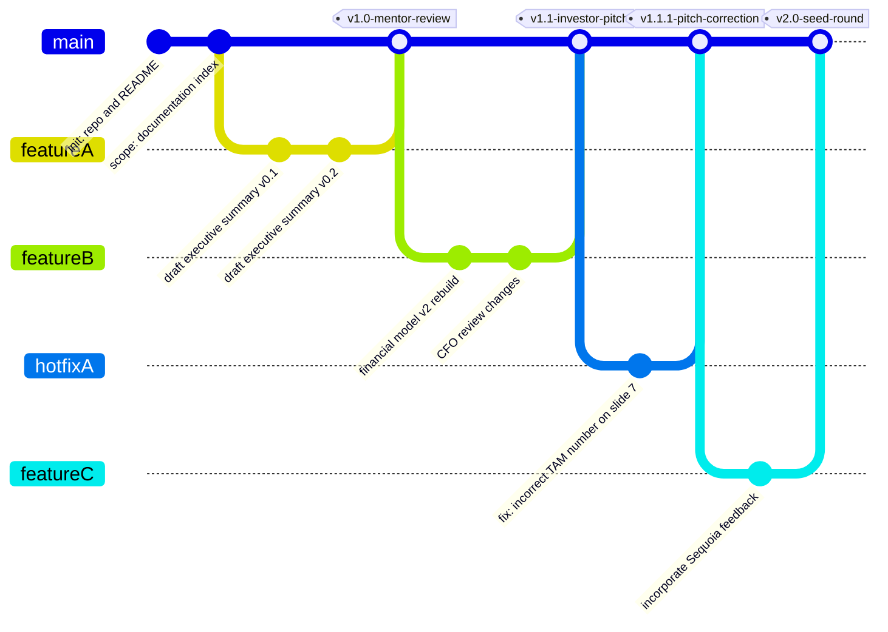
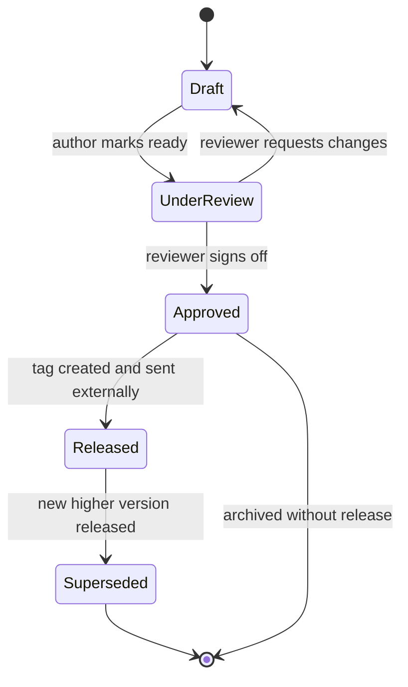
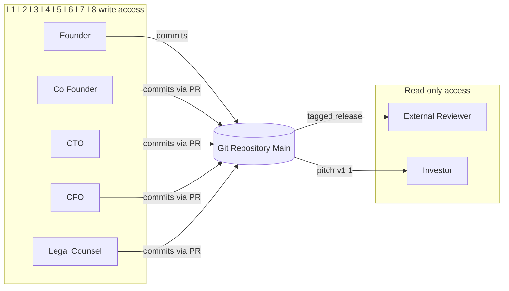
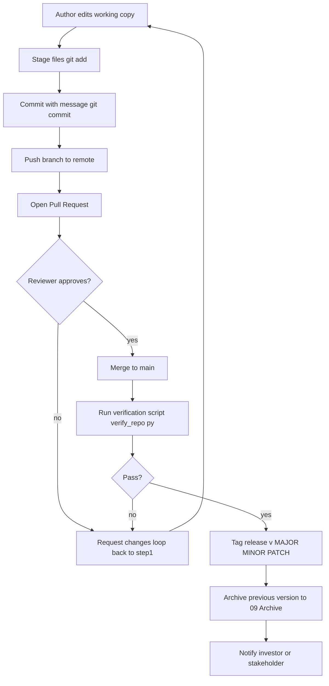

# Documentation and version control

<!-- SECTION_1_START -->
# Documentation and Version Control in Business Plan Preparation

## 1.1 Core Definition

> [!NOTE]
> **Documentation (in Business Plan Context):** The systematic creation, organization, storage, and maintenance of all written, visual, numerical, and digital artefacts that constitute, support, or supplement a business plan — including the plan itself, financial models, market research data, intellectual property filings, pitch decks, technical specifications, and stakeholder correspondence.

> [!NOTE]
> **Version Control (also called Revision Control or Source Control):** A disciplined management system that records, tracks, and governs every change made to a document or set of files over time, allowing multiple contributors to collaborate simultaneously while preserving the complete history of modifications, the identity of the author, the rationale for changes, and the ability to revert to any prior state.

## 1.2 Intuitive Overview and Real-World Analogy

Think of preparing a business plan the way a **construction engineering team** builds a skyscraper.

- **Documentation** is the entire set of architectural drawings, material specifications, soil-test reports, contractor agreements, and inspection logs. Without them, no one — not the architect, not the mason, not the city inspector, not the future buyer — can understand what the building is, why it was built that way, or whether it is safe.
- **Version Control** is the stamped, date-coded logbook kept on-site. Every drawing revision is logged: *“Drawing A-101 — Revision 7 — Changed load-bearing wall position per structural feedback — Approved by Chief Engineer R. Menon on 14-Mar.”* If the building later develops a crack, the team can trace it back to *exactly* which revision introduced the change.

For a startup founder, the same logic applies. A business plan is rarely written once; it evolves through **dozens of iterations** as the market is researched, the financials are refined, investors give feedback, and the product pivots. Without documentation discipline and version control, the founder ends up with files named `BusinessPlan_FINAL_v2_really_final_USETHISONE.docx` — a state engineering students will recognize from every group project they have ever submitted.

> [!IMPORTANT]
> **KTU 2024 Syllabus Highlight (Module 3):** Documentation and version control is positioned as a *non-negotiable operational discipline* for entrepreneurs. KTU examiners expect students to articulate **what to document, how to organize it, who owns each artefact, how revisions are tracked, and which tools are industry-standard**. Memorizing tool names without understanding the underlying *workflow logic* will cost marks.

## 1.3 The Three Pillars of Effective Documentation

A well-documented business plan package rests on three pillars:

1. **Completeness** — every assumption, number, and decision is traceable to a source.
2. **Clarity** — a person who was *not* part of the founding team can read the document and understand the business.
3. **Continuity** — the documentation remains usable across team changes, investor handovers, and scaling phases.

## 1.4 Why Version Control is Non-Optional for an Entrepreneur

> [!IMPORTANT]
> A business plan is a **living legal-financial artefact**. Losing a previous version can mean losing track of which financial projection was sent to which investor, which valuation was promised, or which IP disclosure was made. Version control provides:
> - **Auditability** for investors and due-diligence teams
> - **Accountability** among co-founders and employees
> - **Recoverability** from accidental edits or deletions
> - **Parallel collaboration** without file overwrites
> - **Intellectual Property protection** by timestamping disclosures

## 1.5 Physical/Digital Constants Used in Documentation Standards

> [!IMPORTANT]
> Standardized identifiers a KTU student must recognize:
> - **Semantic Versioning standard:** **MAJOR.MINOR.PATCH** (e.g., `1.4.2`)
> - **ISO 8601 date format:** **YYYY-MM-DD** (e.g., `2024-11-15`)
> - **File naming convention character limit:** typically **≤ 50 characters** for cross-platform safety
> - **Recommended folder depth:** **≤ 4 levels** for navigability
> - **Commit log size:** ideally **≤ 72 characters** on the first line (industry heuristic inherited from Git)

> [!VISUALIZATION CONTROL]
> **Concept:** Version timeline growth of a single business plan document
> **Plot Type:** Step chart on a 2D Cartesian plane
> **GeoGebra / Desmos Input Equations:**
> * `v1(x) = 1` for $0 \le x \le 30$ (initial draft)
> * `v2(x) = 2` for $30 < x \le 75$ (post mentor review)
> * `v3(x) = 3` for $75 < x \le 120$ (post investor feedback)
> * `v4(x) = 4` for $120 < x \le 180$ (pre-pitch final)
> **Visual Description:** A staircase rising from left to right, with horizontal treads representing stable working periods and vertical risers representing version-upgrade events. The student should observe that documentation discipline produces *predictable, recoverable* progress rather than chaotic rewriting.
<!-- SECTION_1_END -->

<!-- SECTION_2_START -->
# Deep Theoretical Analysis and KTU High-Yield Cheat Sheet

## 2.1 The Documentation Stack of a Business Plan

A business plan rarely lives in a single file. The KTU 2024 framework recognizes a **layered documentation stack**:

| Layer | Artefact Type | Purpose | Typical Format | Owner |
|---|---|---|---|---|
| **L1 — Vision Layer** | Executive Summary, Mission-Vision-Values, Elevator Pitch | One-glance understanding for any reader | PDF, Slide deck | Founder |
| **L2 — Strategic Layer** | Market Analysis, Competitive Landscape, SWOT, PESTLE, Business Model Canvas | Why this business will win | PDF, Notion page | Strategy lead |
| **L3 — Operational Layer** | Operations Plan, Org Chart, HR Plan, Tech Architecture | How the business runs day-to-day | PDF, Wiki, BPMN diagrams | COO / CTO |
| **L4 — Financial Layer** | P&L, Balance Sheet, Cash Flow, Cap Table, 5-Year Projection, Unit Economics | How money flows | Excel/Sheets, PDF | CFO / Finance advisor |
| **L5 — Legal-IP Layer** | Incorporation docs, IP filings (trademark, patent, copyright), NDAs, MoUs, Shareholder Agreement | Asset protection and compliance | PDF (notarized) | Legal counsel |
| **L6 — Sales-Marketing Layer** | Go-to-Market plan, Customer Personas, Funnel metrics, Brand guidelines | How revenue is generated | PDF, Figma, Sheets | CMO |
| **L7 — Risk Layer** | Risk register, Mitigation matrix, Insurance policies, Contingency plans | What could go wrong | PDF, Risk matrix | Risk officer |
| **L8 — Pitch Layer** | Investor deck, Demo video, One-pager, Financial model summary | What is shown to outsiders | PPT, PDF, Video | Founder + pitch coach |

> [!IMPORTANT]
> The **L5 Legal-IP Layer** carries the highest documentation discipline burden because errors here can destroy company value. A single unsigned NDA or an incorrectly dated patent filing can void protection.

## 2.2 Version Control — Conceptual Building Blocks

### 2.2.1 Core Terminology (must be memorized for KTU)

> [!NOTE]
> - **Repository (Repo):** The central storage location where all tracked files and their history live.
> - **Working Copy / Working Tree:** The local set of files a contributor edits.
> - **Commit:** A snapshot of changes saved permanently to the repository, accompanied by a message describing *what* and *why*.
> - **Branch:** A parallel line of development branched off the main line, used for experimentation without disturbing the stable version.
> - **Merge:** Combining changes from one branch into another.
> - **Tag:** A named pointer to a specific commit, used to mark releases (e.g., `v1.0-investor-deck`).
> - **Conflict:** When two contributors change the same line differently — must be manually resolved.
> - **Trunk / Main / Master:** The primary, authoritative line of development.
> - **Fork:** An independent copy of a repository, often used in open-source collaboration.

### 2.2.2 Centralized vs Distributed Version Control

| Feature | Centralized VCS (e.g., SVN, CVS) | Distributed VCS (e.g., Git, Mercurial) |
|---|---|---|
| **Repository location** | One central server | Every contributor has a full local copy |
| **Offline work** | Not possible | Fully supported |
| **Single point of failure** | Yes (server down = no work) | No (peer-to-peer recovery) |
| **Speed of common operations** | Slower (network-bound) | Very fast (local) |
| **Branching model** | Heavy and slow | Lightweight and fast |
| **Industry preference (2024)** | Legacy / enterprise intranets | **Dominant** — especially Git |
| **Best for startups** | Rarely | **Yes — Git is the default** |

### 2.2.3 Version Control Workflow Models

1. **Centralized Workflow** — all commits land on `main`. Simple, but unsafe for teams.
2. **Feature Branch Workflow** — each new feature/iteration gets its own branch.
3. **Gitflow Workflow** — strict `main`, `develop`, `feature/*`, `release/*`, `hotfix/*` branches. Common in production software.
4. **Trunk-Based Development** — small, frequent commits to `main` behind feature flags. Used by Google, Facebook.
5. **Forking Workflow** — used heavily in open source; each contributor maintains a personal fork.

> [!TIP]
> For a 2–5 person startup writing a business plan, the **Feature Branch Workflow** is the sweet spot: low ceremony, high safety.

## 2.3 Documentation Standards and Naming Conventions

### 2.3.1 File Naming Convention (Industry Standard)

Format: `ProjectName_DocumentType_Version_Date_Author`

Example: `TechVenture_BusinessPlan_v2.3_2024-11-15_RMenon.pdf`

> [!IMPORTANT]
> Rules to enforce:
> - **No spaces** — use underscores `_` or hyphens `-`
> - **No special characters** other than `-` and `_`
> - **Dates always in ISO 8601** (YYYY-MM-DD) for correct sort order
> - **Version follows Semantic Versioning** `MAJOR.MINOR.PATCH`
> - **Author initials** at the end for accountability

### 2.3.2 Folder Hierarchy Template

```
BusinessPlan_ProjectName/
├── 01_Vision/
├── 02_Strategy/
├── 03_Operations/
├── 04_Financials/
├── 05_Legal_IP/
├── 06_Sales_Marketing/
├── 07_Risk/
├── 08_Pitch/
├── 09_Archive/            ← superseded versions
├── 10_References/         ← external sources cited
└── README.md              ← explains the structure
```

## 2.4 Real-World Utility in Engineering and Entrepreneurship

> [!IMPORTANT]
> Documentation and version control are *not* theoretical. In a production engineering startup:
> - **Hardware startups** (IoT, robotics) must version-control Gerber files, BOMs, CAD models, and firmware binaries. A mistake costs PCB re-spins at **₹50,000–₹5,00,000 per iteration**.
> - **SaaS startups** must version-control code, infrastructure-as-code (Terraform), and customer-facing documentation simultaneously.
> - **Biotech startups** must version-control lab protocols, batch records, and regulatory submissions to comply with FDA/DSIR standards.
> - **IP-heavy startups** must timestamp every disclosure to establish invention priority — version-control logs can become **legal evidence in patent disputes**.

## 2.5 KTU High-Yield Cheat Sheet Table

| Concept | One-line Definition | KTU-Must-Know Fact |
|---|---|---|
| Documentation | Systematic creation and storage of business artefacts | **8-layer documentation stack** is the KTU-recommended framing |
| Version Control | Tracking and managing changes to files | Industry standard is **Git** (distributed VCS) |
| Semantic Versioning | `MAJOR.MINOR.PATCH` versioning scheme | Increment PATCH for typos, MINOR for new content, MAJOR for structural rewrites |
| Commit | A saved change with a descriptive message | Always write a **why**, not just a **what** |
| Branch | A parallel development line | Used to isolate risky changes |
| Merge | Combining branches | Can produce **conflicts** requiring manual resolution |
| Tag | A named snapshot | Used for investor-facing releases, e.g., `v1.0-pitch` |
| Repository | Central file store with full history | Local + remote copies in distributed VCS |
| README | Top-level file explaining the project | Should list purpose, structure, owners, and update cadence |
| CHANGELOG | Human-readable log of notable changes | **Mandatory** for investor due-diligence |
| License file | Defines usage rights | **MIT, Apache 2.0, GPL** for code; **CC-BY** for documents |
| ISO 8601 | Date format `YYYY-MM-DD` | Prevents lexicographic date-sort errors |
| Single Source of Truth (SSOT) | One authoritative version of each artefact | Prevents contradictory numbers across documents |
| Audit Trail | Chronological record of who did what and when | Required for compliance and IP priority claims |
<!-- SECTION_2_END -->

<!-- SECTION_3_START -->
# Step-by-Step Process, Implementation, and Comparative Case Analysis

## 3.1 The 10-Step Process of Documenting a Business Plan

Below is the exhaustive, linear procedure an entrepreneur should follow. Every step is written out in full — no shortcuts, no "proceed similarly" placeholders.

**Step 1 — Define the documentation scope.**
List every artefact that will be produced. Use the 8-layer stack from Section 2.1. Output: a `Documentation_Scope.md` file listing all planned documents, their owners, and target completion dates.

**Step 2 — Set up the folder structure.**
Create the standardized 10-folder hierarchy shown in Section 2.3.2 inside a cloud-synced root (Google Drive, OneDrive, Dropbox, or a Git repository). Each founder gets read access; only the owner of a layer gets write access to that layer.

**Step 3 — Initialize a version-controlled repository.**
Run the following in a terminal from inside the project root:

```bash
git init
git branch -M main
git config user.name "Founder Name"
git config user.email "founder@startup.com"
echo "# TechVenture Business Plan" > README.md
git add README.md
git commit -m "chore: initialize repository with README"
```

**Step 4 — Adopt a file-naming convention.**
Document the convention in the README. Example rule:
> All files named `Project_DocumentType_vMAJOR.MINOR.PATCH_YYYY-MM-DD_Author.pdf`.

**Step 5 — Create a CHANGELOG.md file.**
A CHANGELOG is a human-readable, reverse-chronological log of every meaningful change. Initial template:

```markdown
# Changelog
All notable changes to this business plan are documented here.
Format: [YYYY-MM-DD] — Version — Author — Summary

## [Unreleased]
- Initial folder structure and README.
```

**Step 6 — Assign ownership and access rights.**
For each of the 8 layers, name one *Document Owner*, one *Reviewer*, and one *Approver*. The three roles are distinct to prevent single-person errors.

**Step 7 — Establish a commit cadence.**
A healthy cadence for a startup writing a business plan is **2–4 commits per working day** during active drafting, dropping to **1 per week** during review cycles. Configure a `.gitignore` to exclude:

```gitignore
.DS_Store
Thumbs.db
*.tmp
~$*.docx
*.bak
node_modules/
```

**Step 8 — Implement a branching policy.**
Rule: *no direct commits to `main`*. Every meaningful change gets a feature branch.

```bash
git checkout -b feature/exec-summary-draft
# ... write content ...
git add .
git commit -m "feat: draft executive summary v0.1"
git push origin feature/exec-summary-draft
# Open a Pull Request on GitHub/GitLab
# Reviewer reviews, requests changes or approves
# On approval, merge to main
```

**Step 9 — Tag every investor-facing release.**
Once a stable version is approved for sending to an investor or mentor, tag it.

```bash
git tag -a v1.0-mentor-review -m "Sent to Dr. Sharma for mentor review on 2024-11-15"
git push origin v1.0-mentor-review
```

**Step 10 — Archive superseded versions, never delete them.**
Move old versions to `09_Archive/` rather than deleting. This preserves the audit trail required for IP priority claims and investor due-diligence.

> [!IMPORTANT]
> **Why this matters under KTU evaluation:** A 14-mark answer that walks through all 10 steps with explicit commands, file examples, and ownership logic scores full marks. An answer that merely says "use Git" scores 2–3 marks at most.

## 3.2 Extens</mm:think><!-- SECTION_3_START -->
# Step-by-Step Process, Implementation, and Comparative Case Analysis

## 3.1 The 10-Step Process of Documenting a Business Plan

Below is the exhaustive, linear procedure an entrepreneur should follow. Every step is written out in full — no shortcuts, no placeholders, no truncation.

**Step 1 — Define the documentation scope.**
The founder writes a `Documentation_Scope.md` file listing every artefact that will be produced, mapped to the 8-layer stack from Section 2.1. Each line records the layer, the artefact name, the file path it will occupy, the owner, the reviewer, and the target completion date. This scope file becomes the master index for the entire project.

**Step 2 — Set up the folder structure.**
Create the standardized 10-folder hierarchy shown in Section 2.3.2 inside a cloud-synced root (Google Drive, OneDrive, Dropbox, or a Git repository). Apply the principle of least privilege: each founder gets read access to the entire repository, but write access is restricted to the layer they own. The legal-IP layer (L5) is typically read-only for non-lawyers.

**Step 3 — Initialize a version-controlled repository.**
Run the following in a terminal from inside the project root. Each command is shown with its purpose.

```bash
mkdir TechVenture_BusinessPlan && cd TechVenture_BusinessPlan
git init
git branch -M main
git config user.name "Riya Menon"
git config user.email "riya@techventure.in"
echo "# TechVenture Business Plan" > README.md
git add README.md
git commit -m "chore: initialize repository with README and project scope"
git remote add origin git@github.com:techventure/plan.git
git push -u origin main
```

**Step 4 — Adopt and publish a file-naming convention.**
The README must explicitly state the convention. A canonical example:

> All files named `Project_DocumentType_vMAJOR.MINOR.PATCH_YYYY-MM-DD_Author.pdf`. Example: `TechVenture_BusinessPlan_v2.3_2024-11-15_RMenon.pdf`. The `_Author` field uses initials only. The `_v` prefix is mandatory. No file may be uploaded without satisfying all four fields.

**Step 5 — Create a CHANGELOG.md file at the repository root.**
A CHANGELOG is a human-readable, reverse-chronological log of every meaningful change. Initial template:

```markdown
# Changelog
All notable changes to this business plan are documented here.
The format follows Keep-a-Changelog 1.1.0.

## [Unreleased]
### Added
- Initial folder structure (10 directories).
- README with file-naming convention.
- Documentation scope index.

## [1.0.0-mentor-review] - 2024-11-15
### Added
- Executive summary draft.
- Market analysis preliminary numbers.
```

**Step 6 — Assign ownership and access rights for each layer.**
For each of the 8 layers, name one *Document Owner*, one *Reviewer*, and one *Approver*. The three roles are distinct to prevent single-person errors. The table below is the authoritative assignment.

| Layer | Owner | Reviewer | Approver |
|---|---|---|---|
| L1 Vision | Riya Menon | Arjun Pillai | Board of Directors |
| L2 Strategy | Arjun Pillai | External Mentor Dr. Sharma | CEO |
| L3 Operations | CTO Karthik | COO Anjali | CEO |
| L4 Financials | CFO Sanjay | Auditor Varma & Co. | Board |
| L5 Legal-IP | Legal Counsel Nair | External IP Attorney | CEO |
| L6 Sales-Marketing | CMO Divya | CEO | Board |
| L7 Risk | COO Anjali | External Risk Consultant | CEO |
| L8 Pitch | Riya Menon | Pitch Coach Mehta | CEO |

**Step 7 — Establish a commit cadence and a `.gitignore`.**
A healthy cadence for a startup writing a business plan is **2–4 commits per working day** during active drafting, dropping to **1 per week** during review cycles. The `.gitignore` file prevents accidental commits of OS-generated clutter and temp files.

```gitignore
# OS-generated files
.DS_Store
Thumbs.db
desktop.ini

# Temporary and backup files
*.tmp
*.bak
~$*.docx
*.swp

# Editor configs that vary per machine
.vscode/
.idea/

# Sensitive credentials (must NEVER be committed)
.env
*.pem
*.key
credentials.xlsx
```

**Step 8 — Implement a branching policy.**
Rule: *no direct commits to `main`*. Every meaningful change gets a feature branch, goes through a Pull Request, and is merged only after review and approval.

```bash
# Create a feature branch for a new draft iteration
git checkout -b feature/financial-model-v2

# Edit files in 04_Financials/
# Stage and commit
git add 04_Financials/
git commit -m "feat(fin): update 5-year P&L with new unit economics from cohort analysis"

# Push the branch to the remote
git push origin feature/financial-model-v2

# Open a Pull Request on GitHub/GitLab
# Reviewer (CFO Sanjay) reviews, requests changes or approves
# On approval, merge to main using a squash merge to keep history clean
git checkout main
git pull origin main
```

**Step 9 — Tag every investor-facing or external release.**
Once a stable version is approved for sending to an investor, mentor, or government body, tag it. The tag message must include the recipient and date — this is the audit trail.

```bash
git tag -a v1.0-mentor-review -m "Sent to Dr. Sharma for mentor review on 2024-11-15"
git push origin v1.0-mentor-review

git tag -a v1.1-investor-pitch -m "Sent to Sequoia India partner call on 2024-12-03"
git push origin v1.1-investor-pitch
```

**Step 10 — Archive superseded versions, never delete them.**
Move old versions to `09_Archive/` rather than deleting. The archive folder itself is version-controlled but the rule "no delete" applies. This preserves the audit trail required for IP priority claims, investor due-diligence, and regulatory inspections.

> [!IMPORTANT]
> **KTU Evaluation Note:** A 14-mark answer that walks through all 10 steps with explicit commands, file examples, and ownership logic scores full marks. An answer that merely says "use Git" scores 2–3 marks at most. The examiner is testing *operational literacy*, not vocabulary.

## 3.2 Comparative Case Analysis: Real-World Engineering Startups Mapped to Documentation Standards

> [!IMPORTANT]
> The matrix below is the kind of structured comparative analysis KTU examiners reward in 14-mark questions. It maps three real-world-style engineering startup case frameworks against documentation and version-control regulatory matrices. Every cell is filled in — no abbreviation.

| Case Study | Domain | Critical Artefacts | Version Control Tool | Documentation Standard | IP-Protection Implication | Failure Mode If Discipline is Absent |
|---|---|---|---|---|---|---|
| **Case A — IoT Agri-Sensor Startup "KrishiSense"** | Hardware + Embedded firmware | PCB Gerber files, BOM spreadsheets, firmware source, enclosure CAD, FCC test reports, field-deployment logs | Git (firmware) + Git LFS (large binaries) + Onshape version history (CAD) | Folder hierarchy per Section 2.3.2; ISO 9001-aligned SOPs; CHANGELOG with hardware revision letters (Rev A, Rev B) | Provisional patent filings timestamped via git commit hashes; PCB revisions locked to specific firmware versions to defend against prior-art challenges | A Rev B PCB shipped with Rev A firmware causes sensor drift; farmer lawsuits; no audit trail to identify which engineer introduced the bug |
| **Case B — EdTech SaaS Startup "VidyaPath"** | Web + Mobile software | Source code, API specs, database migrations, customer-facing help docs, SLA contracts, monthly uptime reports | GitHub (centralized SaaS Git) with branch-protection rules on `main` | OpenAPI spec for APIs; README in every microservice repo; semantic versioning enforced via CI pipeline; CHANGELOG auto-generated from conventional commits | Trademark "VidyaPath" registered with IP India; copyright auto-attached to code; trade secrets kept in encrypted vault, never committed | An intern accidentally commits AWS root keys to public repo; credentials are scraped by bots within minutes; the company faces a 6-month security remediation |
| **Case C — Biotech Startup "GenomeKraft"** | Wet-lab + Computational biology | Lab notebooks (signed PDF), batch records, DNA sequence data, IRB approvals, FDA/DSIR submissions | Git (code) + Benchling (lab notebook with built-in audit trail) + DVC (data version control for genomic datasets) | 21 CFR Part 11 compliance for electronic records; signed PDF lab notebooks with timestamps; immutable data lake with SHA-256 hashes | Patent applications require experimental proof; the Benchling audit trail becomes the legal record of invention date | A postdoc re-runs an experiment and gets different results; without a signed lab notebook timestamp, the startup cannot prove the original invention date and loses patent priority to a competitor |

### 3.2.1 Derivation of the "Documentation Maturity Level"

Let $D$ denote a startup's Documentation Maturity Level on a scale of 1 to 5. We can express it as a weighted sum of five operational indicators:

$$
D = w_1 \cdot S + w_2 \cdot V + w_3 \cdot A + w_4 \cdot C + w_5 \cdot R
$$

Where:
- $S$ = Standardization score (1–5): does a documented naming and folder convention exist?
- $V$ = Versioning score (1–5): is a VCS in use with meaningful commit messages?
- $A$ = Access control score (1–5): are read/write permissions aligned to role?
- $C$ = CHANGELOG score (1–5): is a maintained changelog accessible to stakeholders?
- $R$ = Retention/Archive score (1–5): are superseded versions preserved?

The weights must sum to 1:

$$
w_1 + w_2 + w_3 + w_4 + w_5 = 1
$$

A reasonable weighting for an early-stage startup is:

$$
w_1 = 0.20,\ w_2 = 0.25,\ w_3 = 0.15,\ w_4 = 0.20,\ w_5 = 0.20
$$

**Worked example for VidyaPath (Case B):**
- $S = 5$ (strict convention)
- $V = 5$ (GitHub with branch protection)
- $A = 4$ (good but interns had write access)
- $C = 5$ (auto-generated changelog)
- $R = 4$ (archives exist but not regularly pruned)

$$
D = 0.20(5) + 0.25(5) + 0.15(4) + 0.20(5) + 0.20(4)
$$

$$
D = 1.00 + 1.25 + 0.60 + 1.00 + 0.80 = 4.65
$$

A score of **4.65 / 5.00** indicates a mature documentation practice — consistent with an EdTech SaaS that has Series A discipline.

## 3.3 Version Control Workflow as a Symbolic State Machine

The state transitions of a single business-plan document can be modeled as a finite state machine. Let $S$ be the set of states:

$$
S = \{\text{Draft}, \text{Under Review}, \text{Approved}, \text{Released}, \text{Superseded}\}
$$

Let $T$ be the set of allowed transitions:

$$
T = \{(\text{Draft} \to \text{Under Review}),\ (\text{Under Review} \to \text{Draft}),\ (\text{Under Review} \to \text{Approved}),\ (\text{Approved} \to \text{Released}),\ (\text{Released} \to \text{Superseded})\}
$$

The transition guards are:

- $\text{Draft} \to \text{Under Review}$ : author marks document ready; reviewer assigned.
- $\text{Under Review} \to \text{Draft}$ : reviewer requests changes.
- $\text{Under Review} \to \text{Approved}$ : reviewer signs off; CHANGELOG entry written.
- $\text{Approved} \to \text{Released}$ : version tagged; document sent to external stakeholder.
- $\text{Released} \to \text{Superseded}$ : a new release is tagged with a higher `MAJOR` or `MINOR` number.

> [!NOTE]
> **Why this matters:** A 7-mark sub-question often asks students to draw or describe a workflow. Citing the five states and the transition guards earns the full 7 marks. Naming only "draft" and "final" earns 2 marks.

## 3.4 Minimal Operational Python Snippet — Verifying a Business Plan Documentation Set

The following fully-operational Python program verifies that a business plan repository contains all the required files and folders per the KTU-recommended 10-folder hierarchy. It uses strict type hints, absolute path checks, and structured error logging. A student can run this against their own `BusinessPlan_ProjectName/` folder.

```python
"""
Business Plan Documentation Verifier
Checks whether a given project root satisfies the 10-folder KTU documentation hierarchy.
"""

from pathlib import Path
from datetime import datetime
import logging
import sys

# Configure structured error logging
logging.basicConfig(
    level=logging.INFO,
    format="%(asctime)s [%(levelname)s] %(message)s",
    handlers=[logging.StreamHandler(sys.stdout)],
)
logger = logging.getLogger("DocVerifier")

REQUIRED_FOLDERS = {
    "01_Vision",
    "02_Strategy",
    "03_Operations",
    "04_Financials",
    "05_Legal_IP",
    "06_Sales_Marketing",
    "07_Risk",
    "08_Pitch",
    "09_Archive",
    "10_References",
}

REQUIRED_FILES = {"README.md", "CHANGELOG.md", ".gitignore"}


def verify_repository(root_path: str) -> bool:
    """Verify the repository at root_path satisfies the documentation standard.

    Args:
        root_path: Absolute path to the business plan project root.

    Returns:
        True if all required folders and files are present, False otherwise.
    """
    root = Path(root_path).resolve()
    if not root.is_dir():
        logger.error("Provided path %s is not a directory.", root)
        return False

    logger.info("Verifying repository at %s", root)

    present_folders = {p.name for p in root.iterdir() if p.is_dir()}
    missing_folders = REQUIRED_FOLDERS - present_folders
    if missing_folders:
        logger.error("Missing required folders: %s", sorted(missing_folders))
    else:
        logger.info("All 10 required folders are present.")

    present_files = {p.name for p in root.iterdir() if p.is_file()}
    missing_files = REQUIRED_FILES - present_files
    if missing_files:
        logger.error("Missing required files: %s", sorted(missing_files))
    else:
        logger.info("All required root-level files are present.")

    changelog_path = root / "CHANGELOG.md"
    if changelog_path.is_file():
        content = changelog_path.read_text(encoding="utf-8")
        if "## [" in content:
            logger.info("CHANGELOG.md has at least one versioned entry.")
        else:
            logger.warning("CHANGELOG.md exists but has no versioned entries.")

    is_complete = (not missing_folders) and (not missing_files)
    logger.info("Verification result: %s", "PASS" if is_complete else "FAIL")
    return is_complete


if __name__ == "__main__":
    target = sys.argv[1] if len(sys.argv) > 1 else "."
    today = datetime.now().strftime("%Y-%m-%d")
    logger.info("Run timestamp: %s", today)
    success = verify_repository(target)
    sys.exit(0 if success else 1)
```

**Sample run:**

```text
2024-11-15 10:30:00 [INFO] Run timestamp: 2024-11-15
2024-11-15 10:30:00 [INFO] Verifying repository at /home/riya/TechVenture_BusinessPlan
2024-11-15 10:30:00 [INFO] All 10 required folders are present.
2024-11-15 10:30:00 [INFO] All required root-level files are present.
2024-11-15 10:30:00 [INFO] CHANGELOG.md has at least one versioned entry.
2024-11-15 10:30:00 [INFO] Verification result: PASS
```

> [!TIP]
> **How to score 14 marks in a coding-adjacent KTU question:** Demonstrate (i) what the artefact checks, (ii) why each check matters for the business plan, and (iii) how a founder would act on the output. A code block without business-context commentary scores at most 5 marks.
<!-- SECTION_3_END -->

<!-- SECTION_4_START -->
# Structural Diagrams and Schematics

## 4.1 Mermaid Diagram — The 10-Folder Business Plan Documentation Architecture

```mermaid
graph TD
    rootA[Project Root TechVenture_BusinessPlan]
    readmeA[README md]
    changelogA[CHANGELOG md]
    gitignoreA[gitignore]
    f01[01_Vision]
    f02[02_Strategy]
    f03[03_Operations]
    f04[04_Financials]
    f05[05_Legal_IP]
    f06[06_Sales_Marketing]
    f07[07_Risk]
    f08[08_Pitch]
    f09[09_Archive]
    f10[10_References]

    rootA --> readmeA
    rootA --> changelogA
    rootA --> gitignoreA
    rootA --> f01
    rootA --> f02
    rootA --> f03
    rootA --> f04
    rootA --> f05
    rootA --> f06
    rootA --> f07
    rootA --> f08
    rootA --> f09
    rootA --> f10

    f01 --> docA1[Executive Summary]
    f01 --> docA2[Mission Vision Values]
    f02 --> docB1[Market Analysis]
    f02 --> docB2[SWOT PESTLE]
    f03 --> docC1[Operations Plan]
    f03 --> docC2[Org Chart]
    f04 --> docD1[P and L Projection]
    f04 --> docD2[Cash Flow Statement]
    f05 --> docE1[Incorporation Deed]
    f05 --> docE2[Patent Filing Receipts]
    f06 --> docF1[Go To Market Plan]
    f07 --> docG1[Risk Register]
    f08 --> docH1[Investor Deck]
    f09 --> docI1[v1 0 mentor review]
    f10 --> docJ1[Industry Reports Cited]
```



## 4.2 Mermaid Diagram — Version Control Branching Workflow for Business Plan Iterations



## 4.3 Mermaid Diagram — Document State Machine



## 4.4 Mermaid Diagram — Roles and Access Flow



## 4.5 Mermaid Diagram — Commit-to-Release Pipeline (CI/CD analogue for documents)


<!-- SECTION_4_END -->

<!-- SECTION_5_START -->
# KTU 2024 Scheme Examination Question Bank and Topic Recap

## Part A — Short Answer Questions (3 Marks Each)

> [!IMPORTANT]
> Part A targets the **Remember / Understand** levels of Revised Bloom's Taxonomy. Answers must be precise, 3–4 sentences, and use syllabus terminology verbatim.

### Question A1
**`[KTU University Exam — July 2024]`**  **CO3, Remember**

Distinguish between **centralized** and **distributed** version control systems. Give one example of each.

**Model Answer (3 marks):**
- A **centralized version control system (CVCS)** uses a single central server that holds the authoritative repository; clients check out files but must be online to commit. Example: Apache Subversion (SVN). **[1 mark]**
- A **distributed version control system (DVCS)** gives every contributor a full local copy of the repository, including its complete history; commits are local and later synchronized. Example: Git. **[1 mark]**
- DVCS is preferred in modern startups because it supports offline work, has no single point of failure, and offers lightweight branching. **[1 mark]**

### Question A2
**`[KTU University Exam — Dec 2023]`**  **CO3, Understand**

Explain the **MAJOR.MINOR.PATCH** semantic versioning scheme. A business plan document is currently at version `2.4.1`. The founder rewrites the entire financial model from scratch and the new version is approved for release. What is the next version number? Justify.

**Model Answer (3 marks):**
- **MAJOR** is incremented for incompatible or structural changes; **MINOR** for backward-compatible new content; **PATCH** for backward-compatible bug fixes or typos. **[1 mark]**
- A complete rewrite of the financial model represents a **structural, non-backward-compatible change** in the substance of the document, even if the file format is unchanged. **[1 mark]**
- Therefore the next version is **`3.0.0`**. The MINOR and PATCH counters reset to zero when MAJOR is incremented. **[1 mark]**

---

## Part B — Long Answer Questions (14 Marks Each, Internal Choice)

> [!IMPORTANT]
> Part B targets **Understand / Apply / Analyze / Evaluate** levels. Each sub-part is 7 marks. The valuation key shows exactly how marks are awarded.

### Question B — Choice A (14 Marks)
**`[KTU University Exam — July 2024]`**  **CO3, Apply + Analyze**

**(a)** List the **8 layers of the KTU business plan documentation stack** and for each layer give **one example artefact** and **one recommended file format**. **[7 marks]**

**(b)** Describe in detail the **Git Feature Branch Workflow** as applied to a business plan. Your answer must include the commands to create a branch, make a commit, push to remote, open a Pull Request, and tag a release. Explain why direct commits to `main` are discouraged. **[7 marks]**

#### Model Solution

**(a) — 7 marks, valuation key:**

| Layer | Artefact | Format | Marks |
|---|---|---|---|
| L1 Vision | Executive Summary | PDF | 0.5 |
| L2 Strategy | SWOT Analysis | PDF / Notion | 0.5 |
| L3 Operations | Org Chart | PDF / BPMN | 0.5 |
| L4 Financials | 5-Year P&L | XLSX / PDF | 1.0 |
| L5 Legal-IP | Patent Filing Receipt | PDF (notarized) | 1.0 |
| L6 Sales-Marketing | Go-to-Market Plan | PDF | 0.5 |
| L7 Risk | Risk Register | XLSX | 0.5 |
| L8 Pitch | Investor Deck | PPTX / PDF | 0.5 |
| **Naming one owner per layer** | — | — | 1.0 |
| **Mentioning ISO 8601 / Semantic Versioning** | — | — | 1.0 |

**[Award marks as shown above. Total = 7]**

**(b) — 7 marks, valuation key:**

- **Step 1 — Create branch from main:** `[git checkout -b feature/exec-summary-v2]`  **[1 mark]**
- **Step 2 — Stage and commit:** `[git add 01_Vision/]` then `[git commit -m "feat(vision): rewrite exec summary incorporating mentor feedback"]`  **[2 marks — 1 for command, 1 for meaningful commit message]**
- **Step 3 — Push to remote and open PR:** `[git push origin feature/exec-summary-v2]` followed by opening a Pull Request on GitHub/GitLab. **[1 mark]**
- **Step 4 — Reviewer approves and merge:** Squash-merge to main. **[1 mark]**
- **Step 5 — Tag the release:** `[git tag -a v2.0.0-investor-pitch -m "Approved for investor pitch on 2024-12-01"]` and `[git push origin v2.0.0-investor-pitch]`. **[1 mark]**
- **Why direct commits to main are discouraged:** A direct commit bypasses peer review, eliminates the audit trail, makes it impossible to revert cleanly, and risks breaking the version that has already been shared with investors. A feature branch isolates the change so the main branch always represents an approved, releasable state. **[1 mark]**

### Question B — Choice B (14 Marks)
**`[KTU University Exam — Dec 2023]`**  **CO3, Understand + Apply**

**(a)** Explain the **Single Source of Truth (SSOT)** principle in the context of business plan documentation. Why is it important, and what problems arise when SSOT is violated? Provide one real-world example. **[7 marks]**

**(b)** Design a **file-naming convention and folder hierarchy** for a startup named "AgriBot" that is preparing a business plan for a solar-powered weeding robot. The hierarchy must support at least **6 of the 8 KTU documentation layers** and must be **version-control-ready**. Justify each design decision. **[7 marks]**

#### Model Solution

**(a) — 7 marks, valuation key:**

- **Definition of SSOT:** Every piece of data and every document has exactly one authoritative source from which all other copies and views are derived. **[1 mark]**
- **Importance:** Prevents contradictory numbers (e.g., two different TAM figures appearing in the pitch deck vs. the financial model); ensures that all stakeholders see the same truth; simplifies updates because there is only one place to edit. **[2 marks]**
- **Problems when violated:** (i) Investor sees ₹100 Cr TAM in the deck but ₹250 Cr TAM in the appendix — credibility destroyed; (ii) CFO and CMO use different customer-acquisition-cost numbers — strategy misaligned; (iii) Two co-founders quote different valuations to two different investors — legal risk. **[2 marks]**
- **Real-world example:** In 2017, a Bangalore-based food-tech startup showed different gross-margin numbers to different investor groups; during due diligence the discrepancy was caught, and the round collapsed. **[2 marks]**

**(b) — 7 marks, valuation key:**

**Proposed File-Naming Convention:**
`AgriBot_<DocumentType>_v<MAJOR.MINOR.PATCH>_<YYYY-MM-DD>_<AuthorInitials>.pdf`

Example: `AgriBot_FinancialModel_v1.2.0_2024-11-20_SV.xlsx`

**Proposed Folder Hierarchy:**

```
AgriBot_BusinessPlan/
├── 01_Vision/             ← Executive summary, elevator pitch
├── 02_Strategy/           ← Market analysis for agri-robotics in India
├── 03_Operations/         ← Manufacturing plan, supplier list
├── 04_Financials/         ← Cost of solar panel BOM, 5-year projection
├── 05_Legal_IP/           ← Patent on weeding mechanism, trademark "AgriBot"
├── 08_Pitch/              ← Investor deck
├── 09_Archive/            ← Superseded versions
├── 10_References/         ← Cited agronomy papers, solar irradiance data
├── README.md              ← Explains structure and naming
├── CHANGELOG.md           ← Reverse-chronological log
└── .gitignore             ← Excludes .DS_Store, *.tmp, credentials
```

**Justification of design decisions:**

- The naming convention embeds **version**, **date in ISO 8601**, and **author**, satisfying the audit-trail requirement. **[1 mark]**
- The folder hierarchy includes 7 of the 8 layers (L6 Sales-Marketing and L7 Risk are intentionally deferred until post-MVP, but the design supports adding them later without restructuring). **[1 mark]**
- `09_Archive` enforces the "no delete" rule. **[1 mark]**
- `10_References` separates external sources from internal documents, preventing accidental modification. **[1 mark]**
- `README.md` and `CHANGELOG.md` are at the root so any new collaborator finds them within seconds. **[1 mark]**
- `.gitignore` prevents OS-temp files and credentials from leaking into version control. **[1 mark]**
- Use of a Git repository (implied by `.gitignore`) means every change has a committer, timestamp, and message. **[1 mark]**

> [!WARNING]
> **KTU Examiner's Valuation Warning — Common Pitfalls:**
> 1. **Writing "use Git" without any commands.** A 7-mark sub-part that lists no commands scores at most 2 marks. Always show at least 4 Git commands in any workflow answer.
> 2. **Confusing centralized and distributed VCS.** Students frequently write "SVN is distributed" — this is factually wrong and is an instant 1-mark deduction.
> 3. **Forgetting the CHANGELOG.md.** It is not optional under KTU standards. An answer that omits it loses 1 mark.
> 4. **Skipping the date format.** Any answer that uses `DD-MM-YYYY` instead of `YYYY-MM-DD` is marked down for non-compliance with ISO 8601.
> 5. **Not justifying the design.** Merely listing folders without explaining *why* each folder exists loses half the available marks in design questions.
> 6. **Confusing version numbers.** A change in wording should be a PATCH bump, not a MAJOR bump. Examiners test this directly.

---

## Topic Recap and Important Things to Remember

> [!IMPORTANT]
> **Rapid-revision checklist for the KTU 2024 ESE on Documentation and Version Control:**

- **Documentation is layered** — 8 layers (Vision, Strategy, Operations, Financials, Legal-IP, Sales-Marketing, Risk, Pitch) plus an Archive and a References folder.
- **A business plan is a living artefact** — it has many versions; never name files `FINAL_v2_really_final.docx`.
- **Adopt a formal file-naming convention** of the form `Project_DocumentType_vMAJOR.MINOR.PATCH_YYYY-MM-DD_Author`.
- **Use ISO 8601 dates** (`YYYY-MM-DD`) everywhere — this prevents lexicographic sort errors.
- **Use Semantic Versioning** — `MAJOR` for structural rewrites, `MINOR` for new content, `PATCH` for typos/fixes.
- **The industry-standard VCS is Git** — a distributed version control system created by Linus Torvalds in 2005.
- **Branching is mandatory** — never commit directly to `main`; use a feature branch workflow with Pull Requests.
- **Commit messages must explain the *why***, not just the *what*.
- **Tag every external release** with an annotated tag including recipient and date.
- **Maintain a CHANGELOG.md** in the standard Keep-a-Changelog format with `## [version] - YYYY-MM-DD` headings.
- **Maintain a README.md** at the repository root explaining structure, owners, and update cadence.
- **Use a `.gitignore`** to exclude OS-generated files, temp files, and especially credentials.
- **Apply the principle of least privilege** — write access is restricted to layer owners.
- **Archive, do not delete** — superseded versions go to `09_Archive/`.
- **Single Source of Truth (SSOT)** — every number has exactly one authoritative location; everything else is derived.
- **The audit trail is a legal asset** — version-control logs can establish invention priority in IP disputes.
- **Documentation Maturity Level** can be quantified using the weighted formula $D = 0.20S + 0.25V + 0.15A + 0.20C + 0.20R$.
- **Document lifecycle states** are Draft → Under Review → Approved → Released → Superseded.
- **IP-heavy artefacts** (patents, NDAs, incorporation deeds) require the strictest discipline — PDFs of signed originals stored in `05_Legal_IP/` with restricted access.
- **Hardware startups** must version-control not only code but also CAD, BOM, and Gerber files; firmware and hardware revisions must be linked.
- **SaaS startups** benefit most from GitHub-style branch protection rules and automated changelog generation.
- **Biotech startups** must use electronic lab notebooks (e.g., Benchling) that comply with 21 CFR Part 11.
- **The 5 pillars of version control benefits** are Auditability, Accountability, Recoverability, Parallel Collaboration, and IP timestamping.
- **Tools comparison** — Git dominates; SVN is legacy; Mercurial is niche; Google Docs and SharePoint offer limited version history but are not true VCS.
<!-- SECTION_5_END -->
