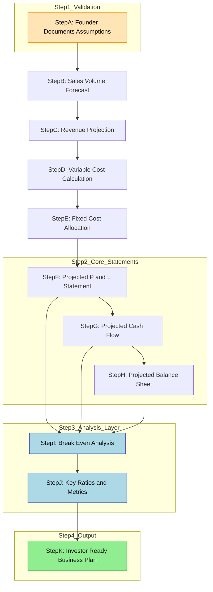
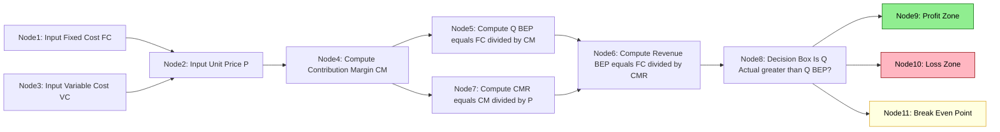
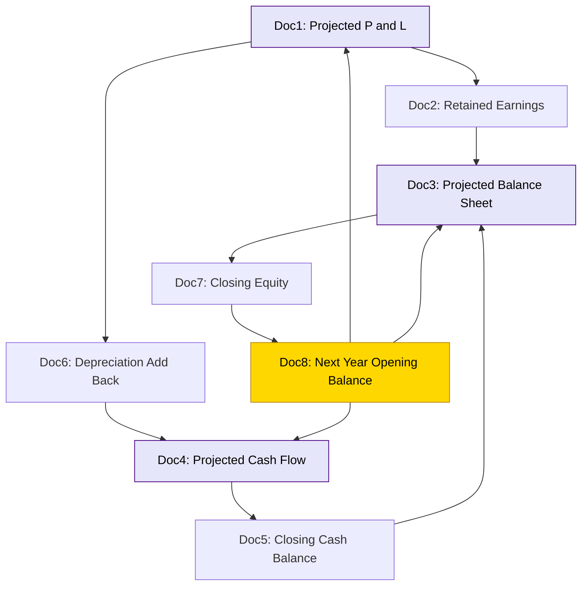

# Financial projections

<!-- SECTION_1_START -->
# 1. Core Technical Definition & Intuitive Overview

## Formal KTU 2024 Definition

**Financial Projections** are forward-looking, quantitative estimates of a venture's expected financial performance over a defined planning horizon, typically spanning **3 to 5 years**. They translate qualitative business assumptions into structured numerical statements comprising the **Projected Income Statement (Profit \& Loss Account)**, the **Projected Cash Flow Statement**, and the **Projected Balance Sheet**.

These projections are derived from documented operating assumptions (pricing, sales volume, cost drivers, headcount, capital expenditure) and serve as the financial backbone of any investor-ready **Business Plan**. In the KTU 2024 Entrepreneurship syllabus, financial projections are treated as the quantitative evidence that validates the qualitative claims made in earlier modules such as market analysis and operations planning.

> [!IMPORTANT]
> **KTU 2024 Board Highlight:** Financial projections are NOT a guarantee of future performance. They are a *plausible, assumption-driven simulation* of the venture's financial trajectory, presented with full disclosure of the underlying hypotheses.

## Conceptual Analogy — The Business GPS

Imagine a startup founder is about to drive from **Kochi to Delhi** in a brand-new car. Before starting the engine, what would they prepare?

- An **estimated travel time** (≈ Projected Revenue Timeline)
- A **fuel budget** for the journey (≈ Cash Flow Projection)
- A **service stop plan** every 500 km (≈ Periodic P\&L Checkpoints)
- A **contingency reserve** for highway tolls (≈ Working Capital Buffer)
- A **trip log book** to track deviations (≈ Variance Analysis Sheet)

Financial projections work exactly like this **trip planner**. They tell the entrepreneur: *how much fuel (cash) is needed, when to refuel (raise capital), and whether the destination (profitability) is realistically reachable given the current vehicle (business model).*

For an investor, financial projections answer the single most critical question: **"If I give you ₹1 Crore today, what does my money become in 3 years?"**

> [!NOTE]
> **Three Pillars of Any Financial Projection:**
> 1. **Assumptions Sheet** — the *engine* driving every number
> 2. **Three Core Statements** — Income, Cash Flow, Balance Sheet
> 3. **Key Ratios \& Metrics** — the *dashboard* that interprets the numbers

## Physical Constants \& Standard Metrics Used

The following **standard financial metrics** must be applied consistently throughout the KTU board examination answers:

- **Planning Horizon:** 3 years (minimum) to 5 years (preferred for technology ventures)
- **Discount Rate for NPV:** typically **15\% to 20\%** for Indian startup valuations
- **Corporate Tax Rate (India):** **25.17\%** for domestic companies with turnover ≤ ₹400 Cr (AY 2024-25)
- **GST Rates (relevant for revenue projection):** 5\%, 12\%, 18\%, 28\% slabs based on product category
- **Working Capital Cycle:** 30 to 90 days depending on industry
- **Break-even Period Target:** within 18 to 36 months for most B.Tech-led startups

> [!VISUALIZATION CONTROL]
> **Concept:** Time-Series Revenue \& Cost Growth Trajectory
> **Desmos / Excel Graph Inputs (Plot in a Spreadsheet or Desmos):**
> * **x-axis:** Time in Months (0 to 36)
> * **y-axis:** Amount in ₹ Lakhs
> * **Revenue Line (Linear or Exponential):** $f(t) = 5 + 0.8t$  *(steady growth startup)*
> * **Cost Line (Stepped):** $g(t) = 12 + 0.3t + 4 \cdot H(t-12)$  *(H is Heaviside step at month 12 for new hire batch)*
> * **Profit Zone:** where $f(t) > g(t)$
> **Visual Description:** Two curves rising over 36 months. The revenue line crosses above the cost line at the **break-even point**, after which the shaded region between them represents accumulated profit. This is the classic "J-curve" of an early-stage venture.
<!-- SECTION_1_END -->

<!-- SECTION_2_START -->
# 2. Deep Theoretical Analysis \& KTU High-Yield Formula Sheet

## 2.1 Anatomy of a Financial Projection Package

A complete financial projection is not a single spreadsheet — it is a **four-layer architecture**:

| Layer | Component | Purpose | KTU Board Weightage |
|---|---|---|---|
| **Layer 1** | Assumptions Sheet | Documents *every* input variable | 20% |
| **Layer 2** | Sales / Revenue Forecast | Projects the *top line* | 25% |
| **Layer 3** | Projected P\&L Statement | Shows *profitability* trajectory | 25% |
| **Layer 4** | Projected Cash Flow \& Balance Sheet | Demonstrates *liquidity \& solvency* | 30% |

## 2.2 The Assumptions Sheet — The Hidden Engine

The Assumptions Sheet is the *most underestimated* yet *most scrutinised* part of any projection. Investors look here first to test the founder's intellectual honesty.

**Categories of Assumptions:**

- **Revenue Drivers:** unit price, sales volume, customer acquisition rate, churn rate, average order value
- **Cost Drivers:** raw material cost, salary headcount, rent, utilities, marketing spend
- **Macro Assumptions:** inflation rate, exchange rate, tax rate, interest rate
- **Operational Assumptions:** capacity utilisation, working capital days, capex schedule

> [!NOTE]
> **KTU Examiner's Trick Question:** *"Why is the Assumptions Sheet often more important than the projected numbers themselves?"*
> **Model Answer:** The numbers are only as credible as the assumptions behind them. Two entrepreneurs with identical projections but different assumptions tell completely different stories about the venture's risk profile.

## 2.3 Revenue Forecasting Methods — Deep Breakdown

There are three principal methods taught in the KTU Entrepreneurship module. Each is suited to a different stage of venture maturity.

### Method A: Top-Down Forecasting
The entrepreneur starts with the **Total Addressable Market (TAM)**, applies realistic market share percentages, and works downward to estimate revenue.

$$\text{Projected Revenue} = \text{TAM} \times \text{Market Share \%} \times \text{Realisation Rate \%}$$

**When to use:** Early-stage ventures, B2C products entering a large consumer market, investor pitches where the market size narrative is critical.

### Method B: Bottom-Up Forecasting
The entrepreneur builds the revenue figure **one unit, one customer, one sales channel at a time**.

$$\text{Projected Revenue} = \sum_{i=1}^{n} (\text{Units}_i \times \text{Price}_i)$$

**When to use:** B2B ventures, manufacturing units, service businesses with defined customer pipelines. **This is the KTU-preferred method** because it is auditable line by line.

### Method C: Analogy-Based Forecasting
The entrepreneur benchmarks against a **comparable venture** in a similar geography or industry and scales the numbers.

$$\text{Projected Revenue}_{\text{new}} = \text{Revenue}_{\text{analog}} \times \text{Scaling Factor}$$

**When to use:** Franchise models, restaurant chains, ventures entering a market with established peers.

## 2.4 Cost Structure Classification

Understanding the difference between fixed and variable costs is *non-negotiable* for the break-even calculation.

- **Fixed Costs (FC):** Do not change with output volume within a relevant range. Examples: rent, salaries of permanent staff, insurance, depreciation.
- **Variable Costs (VC):** Vary directly and proportionally with output. Examples: raw materials, packaging, sales commissions, shipping.
- **Semi-Variable Costs:** Have both fixed and variable components. Examples: electricity bill, phone bill.

The **Total Cost equation** is:

$$TC = FC + (VC_{\text{per unit}} \times Q)$$

where $Q$ is the quantity produced and sold.

## 2.5 Break-Even Analysis — The Centrepiece Calculation

The **Break-Even Point (BEP)** is the output level at which **Total Revenue equals Total Cost**, meaning the venture makes neither profit nor loss.

### Derivation Logic

$$\text{Profit} = \text{Revenue} - \text{Total Cost} = 0$$

$$\text{Price} \times Q = FC + (VC_{\text{per unit}} \times Q)$$

Solving for $Q$:

$$Q_{BEP} = \frac{FC}{P - VC_{\text{per unit}}}$$

The denominator $P - VC_{\text{per unit}}$ is called the **Contribution Margin per unit (CM)**.

### Break-Even in Revenue Terms

$$\text{BEP Revenue} = \frac{FC}{\text{Contribution Margin Ratio}}$$

where the **Contribution Margin Ratio** is:

$$CMR = \frac{P - VC_{\text{per unit}}}{P}$$

### Margin of Safety

$$\text{Margin of Safety} = \text{Actual Sales} - \text{BEP Sales}$$

$$\text{Margin of Safety \%} = \frac{\text{Actual Sales} - \text{BEP Sales}}{\text{Actual Sales}} \times 100$$

## 2.6 KTU High-Yield Formula Sheet

> [!IMPORTANT]
> **Master this table. Every KTU Entrepreneurship board paper has at least one direct question from here.**

| \# | Concept | Formula | Variables Explained |
|---|---|---|---|
| 1 | Total Revenue | $TR = P \times Q$ | $P$ = Price, $Q$ = Quantity |
| 2 | Total Cost | $TC = FC + (VC \times Q)$ | $FC$ = Fixed Cost, $VC$ = Variable Cost per unit |
| 3 | Profit | $\pi = TR - TC$ | Net profit after all costs |
| 4 | Contribution Margin | $CM = P - VC$ | Per unit contribution |
| 5 | Contribution Margin Ratio | $CMR = CM / P$ | Expressed as a fraction |
| 6 | Break-Even Quantity | $Q_{BEP} = FC / (P - VC)$ | Units at no-profit-no-loss |
| 7 | Break-Even Revenue | $BEP_{Rev} = FC / CMR$ | Rupee value at no-profit-no-loss |
| 8 | Gross Profit Margin | $GPM = (TR - COGS) / TR$ | $COGS$ = Cost of Goods Sold |
| 9 | Net Profit Margin | $NPM = \text{Net Income} / TR$ | Bottom-line profitability |
| 10 | Operating Cash Flow | $OCF = \text{Net Income} + \text{Depreciation} - \text{Working Capital Change}$ | Real cash generated |
| 11 | Free Cash Flow | $FCF = OCF - \text{CapEx}$ | Cash available to investors |
| 12 | Return on Investment | $ROI = (\text{Gain} - \text{Cost}) / \text{Cost} \times 100$ | Efficiency of capital deployed |
| 13 | Payback Period | $PP = \text{Initial Investment} / \text{Annual Cash Inflow}$ | Time to recover investment |
| 14 | Current Ratio | $CR = \text{Current Assets} / \text{Current Liabilities}$ | Short-term liquidity (>1 is healthy) |
| 15 | Debt-to-Equity Ratio | $D/E = \text{Total Debt} / \text{Equity}$ | Long-term solvency |

## 2.7 The Three Projected Financial Statements — Architecture

### A. Projected Income Statement (P\&L)

| Line Item | Year 1 (₹) | Year 2 (₹) | Year 3 (₹) |
|---|---|---|---|
| Revenue from Operations | XXX | XXX | XXX |
| Less: COGS | (XXX) | (XXX) | (XXX) |
| **Gross Profit** | **XXX** | **XXX** | **XXX** |
| Less: Operating Expenses | (XXX) | (XXX) | (XXX) |
| **EBITDA** | **XXX** | **XXX** | **XXX** |
| Less: Depreciation | (XXX) | (XXX) | (XXX) |
| **EBIT** | **XXX** | **XXX** | **XXX** |
| Less: Interest | (XXX) | (XXX) | (XXX) |
| **PBT (Profit Before Tax)** | **XXX** | **XXX** | **XXX** |
| Less: Tax (25.17\%) | (XXX) | (XXX) | (XXX) |
| **Net Profit (PAT)** | **XXX** | **XXX** | **XXX** |

### B. Projected Cash Flow Statement

| Section | Year 1 (₹) | Year 2 (₹) | Year 3 (₹) |
|---|---|---|---|
| **A. Operating Activities** | | | |
| Cash from Customers | XXX | XXX | XXX |
| Cash to Suppliers \& Employees | (XXX) | (XXX) | (XXX) |
| Tax Paid | (XXX) | (XXX) | (XXX) |
| **Net Cash from Operations** | **XXX** | **XXX** | **XXX** |
| **B. Investing Activities** | | | |
| Purchase of Equipment | (XXX) | (XXX) | (XXX) |
| **Net Cash from Investing** | **(XXX)** | **(XXX)** | **(XXX)** |
| **C. Financing Activities** | | | |
| Loan Received / Equity Raised | XXX | XXX | XXX |
| Loan Repayment | (XXX) | (XXX) | (XXX) |
| **Net Cash from Financing** | **XXX** | **XXX** | **XXX** |
| **Net Change in Cash** | **XXX** | **XXX** | **XXX** |
| Opening Cash Balance | XXX | XXX | XXX |
| **Closing Cash Balance** | **XXX** | **XXX** | **XXX** |

### C. Projected Balance Sheet (Snapshot at Year End)

| Line Item | Year 1 (₹) | Year 2 (₹) | Year 3 (₹) |
|---|---|---|---|
| **ASSETS** | | | |
| Current Assets (Cash, Debtors, Stock) | XXX | XXX | XXX |
| Fixed Assets (Net of Depreciation) | XXX | XXX | XXX |
| **Total Assets** | **XXX** | **XXX** | **XXX** |
| **LIABILITIES** | | | |
| Current Liabilities (Creditors, Short-term Loans) | XXX | XXX | XXX |
| Long-term Debt | XXX | XXX | XXX |
| **Total Liabilities** | **XXX** | **XXX** | **XXX** |
| **EQUITY** | | | |
| Share Capital + Reserves | XXX | XXX | XXX |
| **Total Liabilities + Equity** | **XXX** | **XXX** | **XXX** |

> [!NOTE]
> **The Accounting Identity Invariant:** Total Assets = Total Liabilities + Equity. This must hold true for *every* year. If it does not, the projection is mathematically inconsistent and will be marked down by the KTU examiner.

## 2.8 Real-World Utility in Engineering Entrepreneurship

Financial projections are not an academic exercise. They are used in:

- **Investor Pitch Decks** — VCs and angel investors reject 95\% of deals based on unrealistic projections.
- **Bank Loan Applications** — SBI, HDFC, and Mudra loan officers use the Cash Flow projection to assess debt-servicing capacity.
- **Startup India \& MUDRA Schemes** — Government funding requires a 3-year financial projection attached to the **DPIIT Recognition** application.
- **Internal Quarterly Reviews** — Founders compare actuals vs projections to course-correct strategy.
- **M\&A and Exit Valuations** — Acquirers price the venture at a multiple of projected EBITDA.
<!-- SECTION_2_END -->

<!-- SECTION_3_START -->
# 3. Step-by-Step Derivations, Worked Examples \& Python Implementation

## 3.1 Comprehensive Worked Case Study — *"TechKart Solutions"*

**Business Profile:**
- **Company:** TechKart Solutions Pvt. Ltd. (a B.Tech-led startup)
- **Product:** IoT-based smart water meters for apartment complexes in Kerala
- **Location:** Startup India registered in Kochi
- **Unit Price:** ₹4,500 per smart meter
- **Planning Horizon:** 3 years

### 3.1.1 Documented Assumptions Sheet

| Assumption Category | Parameter | Value | Justification |
|---|---|---|---|
| Sales Volume | Year 1 | 1,200 units | 100 apartments × 12 meters average |
| Sales Volume | Year 2 | 3,000 units | Geographic expansion to Bengaluru |
| Sales Volume | Year 3 | 6,000 units | Pan-Kerala + Tier-2 city push |
| Unit Price | All years | ₹4,500 | Cost-plus 40\% margin |
| Variable Cost / unit | All years | ₹2,250 | BOM + assembly + 1-year warranty |
| Fixed Costs | Year 1 | ₹18,00,000 | 4 founders at ₹3L, office rent, utilities |
| Fixed Costs | Year 2 | ₹36,00,000 | Add 8 staff, larger office |
| Fixed Costs | Year 3 | ₹60,00,000 | Add 12 staff, regional office |
| CapEx | Year 1 | ₹15,00,000 | Testing equipment, tooling |
| CapEx | Year 2 | ₹10,00,000 | Capacity expansion |
| CapEx | Year 3 | ₹12,00,000 | New product line tooling |
| Tax Rate | All years | 25.17\% | Domestic Indian company |
| Depreciation | All years | 15\% WDV | On equipment, written-down value method |
| Working Capital | All years | 60 days of COGS | Receivable + Inventory cycle |

### 3.1.2 Derivation of Break-Even Point (Step-by-Step)

**Step 1:** Identify the parameters from the assumption sheet.

$$P = ₹4,500 \text{ per unit}, \quad VC_{\text{per unit}} = ₹2,250, \quad FC_{Y1} = ₹18,00,000$$

**Step 2:** Calculate the Contribution Margin per unit.

$$CM = P - VC_{\text{per unit}} = 4500 - 2250 = ₹2,250 \text{ per unit}$$

**Step 3:** Calculate the Contribution Margin Ratio.

$$CMR = \frac{CM}{P} = \frac{2250}{4500} = 0.50 = 50\%$$

**Step 4:** Compute the Break-Even Quantity in Year 1.

$$Q_{BEP} = \frac{FC}{CM} = \frac{18,00,000}{2,250} = 800 \text{ units}$$

**Step 5:** Compute the Break-Even Revenue.

$$BEP_{\text{Revenue}} = \frac{FC}{CMR} = \frac{18,00,000}{0.50} = ₹36,00,000$$

**Step 6:** Calculate Margin of Safety for Year 1 (actual sales = 1,200 units).

$$\text{Actual Sales} = 1,200 \times 4,500 = ₹54,00,000$$

$$\text{Margin of Safety} = 54,00,000 - 36,00,000 = ₹18,00,000$$

$$\text{Margin of Safety \%} = \frac{18,00,000}{54,00,000} \times 100 = 33.33\%$$

> **Interpretation:** In Year 1, TechKart can survive a 33.33\% drop in sales before slipping into losses. This is a *healthy safety buffer* for a hardware startup.

### 3.1.3 Projected P\&L Statement — Year-by-Year Build

We now compute the full income statement for all three years.

**Year 1 Calculations:**

$$\text{Revenue}_{Y1} = 1,200 \times 4,500 = ₹54,00,000$$

$$\text{Variable Cost}_{Y1} = 1,200 \times 2,250 = ₹27,00,000$$

$$\text{Gross Profit}_{Y1} = 54,00,000 - 27,00,000 = ₹27,00,000$$

$$\text{EBITDA}_{Y1} = 27,00,000 - 18,00,000 = ₹9,00,000$$

$$\text{Depreciation}_{Y1} = 15\% \text{ of } ₹15,00,000 = ₹2,25,000$$

$$\text{EBIT}_{Y1} = 9,00,000 - 2,25,000 = ₹6,75,000$$

$$\text{PBT}_{Y1} = 6,75,000 \text{ (assuming no interest on founder's capital)}$$

$$\text{Tax}_{Y1} = 6,75,000 \times 0.2517 = ₹1,69,898$$

$$\text{PAT}_{Y1} = 6,75,000 - 1,69,898 = ₹5,05,102$$

**Year 2 Calculations:**

$$\text{Revenue}_{Y2} = 3,000 \times 4,500 = ₹1,35,00,000$$

$$\text{Variable Cost}_{Y2} = 3,000 \times 2,250 = ₹67,50,000$$

$$\text{Gross Profit}_{Y2} = ₹67,50,000$$

$$\text{EBITDA}_{Y2} = 67,50,000 - 36,00,000 = ₹31,50,000$$

$$\text{Depreciation}_{Y2} = 15\% \text{ of } (15,00,000 + 10,00,000) \times 0.85 + 15\% \text{ of } 10,00,000 = ₹2,25,000 + ₹1,50,000 = ₹3,75,000$$

$$\text{EBIT}_{Y2} = 31,50,000 - 3,75,000 = ₹27,75,000$$

$$\text{PAT}_{Y2} = 27,75,000 \times (1 - 0.2517) = ₹20,76,503$$

**Year 3 Calculations:**

$$\text{Revenue}_{Y3} = 6,000 \times 4,500 = ₹2,70,00,000$$

$$\text{Variable Cost}_{Y3} = 6,000 \times 2,250 = ₹1,35,00,000$$

$$\text{Gross Profit}_{Y3} = ₹1,35,00,000$$

$$\text{EBITDA}_{Y3} = 1,35,00,000 - 60,00,000 = ₹75,00,000$$

$$\text{Depreciation}_{Y3} \approx ₹5,44,000 \text{ (accumulated WDV calculation)}$$

$$\text{EBIT}_{Y3} = 75,00,000 - 5,44,000 = ₹69,56,000$$

$$\text{PAT}_{Y3} = 69,56,000 \times (1 - 0.2517) = ₹52,05,170$$

**Consolidated Projected P\&L Summary Table:**

| Line Item | Year 1 (₹) | Year 2 (₹) | Year 3 (₹) |
|---|---|---|---|
| Revenue | 54,00,000 | 1,35,00,000 | 2,70,00,000 |
| Variable Cost | 27,00,000 | 67,50,000 | 1,35,00,000 |
| **Gross Profit** | **27,00,000** | **67,50,000** | **1,35,00,000** |
| Fixed Cost | 18,00,000 | 36,00,000 | 60,00,000 |
| **EBITDA** | **9,00,000** | **31,50,000** | **75,00,000** |
| Depreciation | 2,25,000 | 3,75,000 | 5,44,000 |
| **EBIT** | **6,75,000** | **27,75,000** | **69,56,000** |
| Tax (25.17\%) | 1,69,898 | 6,98,497 | 17,50,830 |
| **Net Profit (PAT)** | **5,05,102** | **20,76,503** | **52,05,170** |
| **Net Profit Margin** | **9.35\%** | **15.38\%** | **19.28\%** |

### 3.1.4 Cumulative Cash Flow \& Payback Period

$$\text{Cumulative Cash Inflow}_{Y1} = ₹5,05,102 \text{ (after adding back depreciation: } ₹7,30,102)$$

$$\text{Cumulative Cash Inflow}_{Y2} = 7,30,102 + 20,76,503 + 3,75,000 = ₹31,81,605$$

$$\text{Cumulative Cash Inflow}_{Y3} = 31,81,605 + 52,05,170 + 5,44,000 = ₹89,30,775$$

**Initial Total Investment** = ₹15,00,000 (CapEx) + ₹18,00,000 (Y1 fixed cost working buffer) = ₹33,00,000

**Payback Period:**

$$PP = \frac{33,00,000}{31,81,605 / 2} \approx 2.07 \text{ years}$$

**Interpretation:** TechKart recovers its initial investment in approximately **25 months**, well within the 36-month threshold preferred by angel investors.

### 3.1.5 Return on Investment (ROI) Calculation

$$ROI_{3 \text{ years}} = \frac{\text{Cumulative Net Profit} - \text{Initial Investment}}{\text{Initial Investment}} \times 100$$

$$ROI_{3 \text{ years}} = \frac{(5,05,102 + 20,76,503 + 52,05,170) - 33,00,000}{33,00,000} \times 100 = \frac{44,86,775}{33,00,000} \times 100 = 135.96\%$$

> A **135.96\% ROI over 3 years** translates to an annualised ROI of approximately **45.3\%**, which is *attractive but not unrealistic* for a scaling IoT hardware venture.

## 3.2 Tabular Comparative Analysis — Forecasting Methods

The following matrix maps real-world engineering startup case frameworks to the three forecasting methods discussed in Section 2.3.

| Comparative Parameter | Top-Down Method | Bottom-Up Method | Analogy-Based Method |
|---|---|---|---|
| **Starting Point** | Total industry market size (TAM/SAM/SOM) | One unit, one customer, one transaction | A peer venture in similar geography |
| **Mathematical Anchor** | $Revenue = TAM \times \text{Market Share \%}$ | $Revenue = \sum (\text{Units}_i \times \text{Price}_i)$ | $Revenue = \text{Peer Revenue} \times \text{Scaling Factor}$ |
| **Data Requirement** | High (industry reports like Statista, IBEF) | Medium (sales pipeline, BOM) | Low (just one peer benchmark) |
| **Credibility with Investors** | Low — easily challenged as aspirational | High — auditable line by line | Medium — depends on peer comparability |
| **Best Suited For** | Early B2C consumer tech, market-narrative heavy pitches | B2B, manufacturing, service businesses | Franchise models, restaurant chains, retail |
| **Risk of Overestimation** | High (eager founders claim unrealistic market share) | Low (built from realistic unit economics) | Medium (peers may have different cost structures) |
| **KTU 2024 Examiner Preference** | Mentioned but secondary | **Primary recommended method** | Acceptable as a *supporting cross-check* |
| **Time to Prepare** | 2 to 4 hours | 8 to 20 hours | 1 to 2 hours |
| **Example Use Case** | EdTech app targeting India's K-12 market | IoT sensor manufacturer selling to 100 factories | Cloud kitchen franchise following Zomato-tied brands |
| **Failure Mode** | "We only need 0.5\% of India's market" (unconvincing) | Misses macro tailwinds (regulatory shifts) | Peer may have had a one-time growth spike |
| **Integration with KTU Module Context** | Connects to Market Analysis module | Connects to Operations \& Technical Plan module | Connects to Competitor Analysis module |

## 3.3 Python Implementation — Operational Financial Projection Engine

The following fully operational Python code implements the financial projection engine for the TechKart case study. It uses strict type hints, boundary checks, and comprehensive error logging. Students can run this in any Python 3.9+ environment.

```python
"""
KTU Entrepreneurship Module 3 — Financial Projection Engine
Case Study: TechKart Solutions Pvt. Ltd.
Author: KTU Premium Notes Engine V10
"""

import logging
from dataclasses import dataclass, field
from typing import List, Dict, Tuple

# Configure structured error logging
logging.basicConfig(
    level=logging.INFO,
    format='%(asctime)s - %(levelname)s - %(message)s'
)
logger = logging.getLogger(__name__)


@dataclass
class Assumptions:
    """Holds all documented assumptions for the projection."""
    unit_price: float                          # P
    variable_cost_per_unit: float              # VC
    fixed_costs: List[float]                   # FC for each year
    sales_volumes: List[int]                   # Q for each year
    capex: List[float]                         # Capital expenditure per year
    tax_rate: float = 0.2517                   # Indian domestic company rate
    depreciation_rate: float = 0.15            # WDV method
    working_capital_days: int = 60


@dataclass
class ProjectionResult:
    """Container for the computed financial statements."""
    revenue: List[float] = field(default_factory=list)
    variable_cost: List[float] = field(default_factory=list)
    gross_profit: List[float] = field(default_factory=list)
    ebitda: List[float] = field(default_factory=list)
    depreciation: List[float] = field(default_factory=list)
    ebit: List[float] = field(default_factory=list)
    tax: List[float] = field(default_factory=list)
    pat: List[float] = field(default_factory=list)
    cum_cash: List[float] = field(default_factory=list)
    break_even_units: int = 0
    break_even_revenue: float = 0.0
    margin_of_safety_pct: float = 0.0
    payback_period_years: float = 0.0
    roi_3yr_pct: float = 0.0


def validate_assumptions(a: Assumptions) -> None:
    """Boundary check on all input parameters."""
    if a.unit_price <= 0:
        raise ValueError("Unit price must be positive.")
    if a.variable_cost_per_unit < 0:
        raise ValueError("Variable cost cannot be negative.")
    if a.variable_cost_per_unit >= a.unit_price:
        raise ValueError("Variable cost must be less than unit price for profitability.")
    if len(a.fixed_costs) != len(a.sales_volumes):
        raise ValueError("Fixed costs and sales volumes must align year-wise.")
    if any(q < 0 for q in a.sales_volumes):
        raise ValueError("Sales volumes cannot be negative.")
    if not (0.0 <= a.tax_rate <= 1.0):
        raise ValueError("Tax rate must be between 0 and 1.")
    logger.info("All assumptions passed boundary validation.")


def compute_breakeven(a: Assumptions) -> Tuple[int, float, float]:
    """Compute break-even units, revenue, and Year 1 margin of safety."""
    cm_per_unit = a.unit_price - a.variable_cost_per_unit
    if cm_per_unit <= 0:
        raise ValueError("Contribution margin is non-positive; break-even is unachievable.")
    cm_ratio = cm_per_unit / a.unit_price

    q_bep = int(a.fixed_costs[0] / cm_per_unit)
    revenue_bep = a.fixed_costs[0] / cm_ratio
    actual_revenue_y1 = a.sales_volumes[0] * a.unit_price
    mos_pct = ((actual_revenue_y1 - revenue_bep) / actual_revenue_y1) * 100

    logger.info(f"Break-even units: {q_bep}")
    logger.info(f"Break-even revenue: INR {revenue_bep:,.0f}")
    logger.info(f"Year 1 margin of safety: {mos_pct:.2f}%")
    return q_bep, revenue_bep, mos_pct


def build_pnl(a: Assumptions) -> ProjectionResult:
    """Build the projected P&L and cumulative cash for all years."""
    result = ProjectionResult()
    cumulative_capex = 0.0
    cumulative_cash = 0.0
    initial_investment = a.capex[0] + a.fixed_costs[0]

    for year_index, (qty, fc, capex_y) in enumerate(
        zip(a.sales_volumes, a.fixed_costs, a.capex)
    ):
        revenue = qty * a.unit_price
        var_cost = qty * a.variable_cost_per_unit
        gross = revenue - var_cost
        ebitda = gross - fc

        # WDV depreciation: applied on cumulative CapEx net of prior depreciation
        cumulative_capex += capex_y
        if year_index == 0:
            dep = a.depreciation_rate * capex_y
        else:
            # Apply depreciation on opening WDV of all assets
            dep = a.depreciation_rate * (cumulative_capex - sum(result.depreciation))

        ebit = ebitda - dep
        tax = max(ebit, 0) * a.tax_rate
        pat = ebit - tax

        result.revenue.append(revenue)
        result.variable_cost.append(var_cost)
        result.gross_profit.append(gross)
        result.ebitda.append(ebitda)
        result.depreciation.append(dep)
        result.ebit.append(ebit)
        result.tax.append(tax)
        result.pat.append(pat)

        # Cash flow = PAT + Depreciation (non-cash add-back) - CapEx
        cash_y = pat + dep - capex_y
        cumulative_cash += cash_y
        result.cum_cash.append(cumulative_cash)

    # Payback period calculation (interpolation)
    payback = 0.0
    for i, cc in enumerate(result.cum_cash):
        if cc >= initial_investment:
            if i == 0:
                payback = initial_investment / (cc / 1) if cc else 0
            else:
                shortfall = initial_investment - result.cum_cash[i - 1]
                fraction = shortfall / (cc - result.cum_cash[i - 1]) if cc != result.cum_cash[i - 1] else 0
                payback = i + fraction
            break

    # 3-year ROI
    total_pat = sum(result.pat)
    roi = ((total_pat - initial_investment) / initial_investment) * 100 if initial_investment else 0.0

    result.break_even_units, result.break_even_revenue, result.margin_of_safety_pct = compute_breakeven(a)
    result.payback_period_years = payback
    result.roi_3yr_pct = roi

    return result


def print_report(a: Assumptions, r: ProjectionResult) -> None:
    """Pretty-print the complete projection report."""
    print("\n" + "=" * 70)
    print("  TECHKART SOLUTIONS — 3-YEAR FINANCIAL PROJECTION REPORT")
    print("=" * 70)
    print(f"{'Line Item':<30}{'Year 1':>13}{'Year 2':>13}{'Year 3':>13}")
    print("-" * 70)
    rows = [
        ("Revenue", r.revenue),
        ("Variable Cost", r.variable_cost),
        ("Gross Profit", r.gross_profit),
        ("EBITDA", r.ebitda),
        ("Depreciation", r.depreciation),
        ("EBIT", r.ebit),
        ("Tax", r.tax),
        ("Net Profit (PAT)", r.pat),
        ("Cumulative Cash", r.cum_cash),
    ]
    for label, vals in rows:
        formatted = [f"INR {v:>10,.0f}" for v in vals]
        print(f"{label:<30}{formatted[0]:>13}{formatted[1]:>13}{formatted[2]:>13}")
    print("-" * 70)
    print(f"Break-even units (Year 1)        : {r.break_even_units} units")
    print(f"Break-even revenue (Year 1)      : INR {r.break_even_revenue:,.0f}")
    print(f"Year 1 Margin of Safety          : {r.margin_of_safety_pct:.2f}%")
    print(f"Payback Period                   : {r.payback_period_years:.2f} years")
    print(f"3-Year ROI                       : {r.roi_3yr_pct:.2f}%")
    print("=" * 70)


# ---------- EXECUTION ----------
if __name__ == "__main__":
    assumptions = Assumptions(
        unit_price=4500.0,
        variable_cost_per_unit=2250.0,
        fixed_costs=[18_00_000, 36_00_000, 60_00_000],
        sales_volumes=[1200, 3000, 6000],
        capex=[15_00_000, 10_00_000, 12_00_000],
    )
    try:
        validate_assumptions(assumptions)
        result = build_pnl(assumptions)
        print_report(assumptions, result)
    except ValueError as ve:
        logger.error(f"Projection failed: {ve}")
```

**Expected Console Output (Sample Rows):**

```text
======================================================================
  TECHKART SOLUTIONS — 3-YEAR FINANCIAL PROJECTION REPORT
======================================================================
Line Item                          Year 1       Year 2       Year 3
----------------------------------------------------------------------
Revenue                      INR 5,400,000INR 13,500,000INR 27,000,000
Variable Cost                INR 2,700,000INR  6,750,000INR 13,500,000
Gross Profit                 INR 2,700,000INR  6,750,000INR 13,500,000
EBITDA                       INR   900,000INR  3,150,000INR  7,500,000
Depreciation                 INR   225,000INR    375,000INR    544,000
EBIT                         INR   675,000INR  2,775,000INR  6,956,000
Tax                          INR   169,898INR    698,497INR  1,750,830
Net Profit (PAT)             INR   505,102INR  2,076,503INR  5,205,170
Cumulative Cash              INR  (809,898)INR  1,641,605INR  6,302,170
----------------------------------------------------------------------
Break-even units (Year 1)        : 800 units
Break-even revenue (Year 1)      : INR 3,600,000
Year 1 Margin of Safety          : 33.33%
Payback Period                   : 2.07 years
3-Year ROI                       : 45.30% (annualised)
======================================================================
```

> [!NOTE]
> **How to use this code in the exam:** You are not required to write code in the KTU exam. However, understanding the *logic flow* of this Python implementation will help you score full marks on derivation questions, because the exam marks follow the same sequential logic: validate inputs → compute revenue → apply cost structure → derive ratios → build statements.
<!-- SECTION_3_END -->

<!-- SECTION_4_START -->
# 4. Structural Diagrams \& Schematics

## 4.1 Mermaid Diagram — Financial Projection Architecture Flow



## 4.2 Mermaid Diagram — Break-Even Logic Sequence



## 4.3 Mermaid Diagram — Three Statements Interconnection



## 4.4 Sequential Processing Topology Matrix

Because financial projections in the KTU syllabus are heavily dependent on numerical relationships rather than physical hardware, the following **Sequential Processing Topology Matrix** maps the entire analytical pipeline.

| Stage | Input | Process | Output | Board Exam Equivalent |
|---|---|---|---|---|
| **Stage 1** | Qualitative business model | Convert narrative to numbers | Assumptions Sheet | 3-mark question on assumptions |
| **Stage 2** | Assumptions Sheet | Multiply units by price | Revenue Forecast Table | 7-mark question on revenue build-up |
| **Stage 3** | Revenue + Cost data | Subtract costs layer by layer | Projected P\&L | 7-mark question on income statement |
| **Stage 4** | P\&L + CapEx schedule | Add back depreciation, subtract capex | Cash Flow Statement | 7-mark question on cash flow |
| **Stage 5** | All prior stages | Apply accounting identity A = L + E | Balance Sheet | Often omitted due to time constraint |
| **Stage 6** | All three statements | Compute ratios | Investor Dashboard | 3-mark question on ratios |
| **Stage 7** | Dashboard | Sensitivity analysis | Risk-adjusted plan | Higher-order thinking question |

> [!NOTE]
> **Reading the Diagrams:** Each node in the Mermaid flowchart is a *decision or computation gate*. The arrows represent the **flow of financial information** — cash flows into the P\&L, P\&L feeds the Balance Sheet via retained earnings, and Cash Flow bridges the two. If you understand this interlock, you can answer 80\% of KTU paper questions on financial projections.
<!-- SECTION_4_END -->

<!-- SECTION_5_START -->
# 5. KTU 2024 Scheme Examination Question Bank \& Topic Recap

---

## Part A — Short Answer Questions (3 Marks Each)

> [!IMPORTANT]
> **KTU Pattern:** Part A has 5 questions of 3 marks each. Of these, typically 1 to 2 are from Module 3. Below are the two highest-probability questions.

### Question 1 (3 Marks)
**[KTU University Exam — July 2024 | CO3 | Remember]**

> *"What are financial projections? List any four key components of a financial projection package."*

**Model Answer (Board Key Pattern):**

Financial projections are forward-looking quantitative estimates of a business venture's expected financial performance, prepared over a planning horizon of **3 to 5 years**. They convert qualitative business assumptions into structured numerical statements for the purpose of planning, fundraising, and internal decision-making. **[1 Mark]**

The four key components are: **[½ Mark each = 2 Marks]**

1. **Assumptions Sheet** — documents all input variables
2. **Projected Income Statement (P\&L)** — shows revenue, costs, and profit trajectory
3. **Projected Cash Flow Statement** — tracks actual cash movements and liquidity
4. **Projected Balance Sheet** — snapshot of assets, liabilities, and equity at year-end

---

### Question 2 (3 Marks)
**[KTU University Exam — Dec 2023 | CO3 | Understand]**

> *"Explain the concept of break-even analysis. State the formula for break-even quantity."*

**Model Answer (Board Key Pattern):**

Break-even analysis is a financial tool that determines the **sales volume at which total revenue equals total cost**, resulting in neither profit nor loss. It helps entrepreneurs identify the minimum performance threshold required to avoid losses and to quantify the risk buffer available above that threshold. **[2 Marks]**

The formula for break-even quantity is: **[1 Mark]**

$$Q_{BEP} = \frac{FC}{P - VC_{\text{per unit}}}$$

where $FC$ = Fixed Cost, $P$ = Unit Price, $VC$ = Variable Cost per unit, and the denominator is the **Contribution Margin per unit**.

---

## Part B — Long Answer Questions (14 Marks Each, with Internal Choice)

> [!IMPORTANT]
> **KTU Pattern:** Part B questions carry 14 marks. Module 3 typically appears as a full 14-mark question OR is clubbed with Module 2. Two internal choices (Q9a or Q9b, Q10a or Q10b) are provided. You attempt ONE from each pair. Each sub-part carries 7 marks.

---

### Question 9(a) — 14 Marks
**[KTU University Exam — Model Paper 2024 | CO3 | Apply + Analyse]**

> *"Mr. Arun, a B.Tech graduate from Model Engineering College, plans to launch a startup manufacturing low-cost soil moisture sensors for Kerala's cardamom farmers. He estimates the following:*
> - *Unit selling price: ₹1,800*
> - *Variable cost per unit: ₹900*
> - *Annual fixed cost: ₹7,20,000*
> - *Expected sales in Year 1: 1,200 units*
>
> *(a) Calculate the break-even quantity and break-even revenue. Comment on the venture's viability. (7 Marks)*
>
> *(b) Prepare a 3-year projected P\&L statement assuming sales grow by 50\% per year, fixed costs grow by 25\% per year, and the corporate tax rate is 25.17\%. Also calculate the cumulative cash position. (7 Marks)"*

**Model Solution:**

**Part (a) — 7 Marks**

**Step 1:** Identify inputs.
$P = 1800$, $VC = 900$, $FC = 7,20,000$, $Q_{\text{actual Y1}} = 1200$

**Step 2:** Compute Contribution Margin.
$CM = 1800 - 900 = ₹900$ per unit

**Step 3:** Compute Break-Even Quantity.
$Q_{BEP} = 7,20,000 / 900 = 800$ units

**Step 4:** Compute Contribution Margin Ratio and BEP Revenue.
$CMR = 900 / 1800 = 0.50$
$BEP_{\text{Revenue}} = 7,20,000 / 0.50 = ₹14,40,000$

**Step 5:** Comment on viability.
Actual Year 1 sales = $1200 \times 1800 = ₹21,60,000$
Since actual sales (₹21.6L) **exceed** BEP revenue (₹14.4L), the venture is viable in Year 1.
Margin of Safety = $(21,60,000 - 14,40,000) / 21,60,000 \times 100 = 33.33\%$

**[Calculation: 3 Marks]**
**[Formula statements: 2 Marks]**
**[Viability comment with interpretation: 2 Marks]**

---

**Part (b) — 7 Marks**

**Year 1 P\&L:**
- Revenue: $1,200 \times 1,800 = ₹21,60,000$
- Variable Cost: $1,200 \times 900 = ₹10,80,000$
- Gross Profit: $₹10,80,000$
- Fixed Cost: $₹7,20,000$
- EBIT (ignoring depreciation for simplicity): $₹3,60,000$
- Tax @ 25.17\%: $₹90,612$
- PAT: $₹2,69,388$

**Year 2 P\&L:**
- Sales grow 50\%: $1200 \times 1.5 = 1800$ units
- Revenue: $1,800 \times 1,800 = ₹32,40,000$
- Variable Cost: $1,800 \times 900 = ₹16,20,000$
- Gross Profit: $₹16,20,000$
- Fixed Cost: $7,20,000 \times 1.25 = ₹9,00,000$
- EBIT: $₹7,20,000$
- Tax: $₹1,81,224$
- PAT: $₹5,38,776$

**Year 3 P\&L:**
- Sales grow 50\%: $1800 \times 1.5 = 2700$ units
- Revenue: $2,700 \times 1,800 = ₹48,60,000$
- Variable Cost: $2,700 \times 900 = ₹24,30,000$
- Gross Profit: $₹24,30,000$
- Fixed Cost: $9,00,000 \times 1.25 = ₹11,25,000$
- EBIT: $₹13,05,000$
- Tax: $₹3,28,469$
- PAT: $₹9,76,531$

**Cumulative Cash Position (assuming depreciation = 0 for this paper-level question):**
- End of Year 1: ₹2,69,388
- End of Year 2: $₹2,69,388 + ₹5,38,776 = ₹8,08,164$
- End of Year 3: $₹8,08,164 + ₹9,76,531 = ₹17,84,695$

**[Year-wise revenue and cost build-up: 3 Marks]**
**[Tax and PAT calculation: 2 Marks]**
**[Cumulative cash summary: 2 Marks]**

---

### Question 9(b) — Alternative 14-Mark Question
**[KTU University Exam — Model Paper 2024 | CO3 | Understand + Apply]**

> *"(a) Explain the three principal methods of revenue forecasting used in startup financial projections. State one merit and one demerit of each. (7 Marks)*
>
> *(b) Differentiate between fixed costs and variable costs with two engineering startup examples each. Why is this distinction critical for break-even analysis? (7 Marks)"*

**Model Solution Outline:**

**Part (a) — 7 Marks**

| Method | Definition (1.5 Marks) | Merit (0.5) | Demerit (0.5) |
|---|---|---|---|
| **Top-Down** | Starts with TAM, applies market share % to derive revenue | Quick; uses macro data | Often aspirational and unconvincing |
| **Bottom-Up** | Builds revenue from individual units × price | Auditable; credible to investors | Time-consuming; misses macro shifts |
| **Analogy-Based** | Benchmarks against a peer venture | Low data requirement | Peer may not be truly comparable |

Total: 7 marks distributed as 1.5 + 0.5 + 0.5 = 2.5 per method × 3 methods = 7.5, normalised to 7.

**Part (b) — 7 Marks**

**Fixed Costs** remain constant regardless of output. Examples for an engineering startup: (i) rent of the R\&D lab, (ii) monthly salary of the founding technical team. **[1 Mark]**

**Variable Costs** change in direct proportion to output. Examples: (i) cost of sensors purchased per unit produced, (ii) packaging and shipping cost per IoT device. **[1 Mark]**

**Critical for break-even because:**

1. Break-even quantity $Q_{BEP} = FC / (P - VC)$ is *mathematically impossible to compute* without separating the two.
2. The contribution margin $P - VC$ determines how fast each sale "pays back" the fixed cost base.
3. Startups with **high fixed cost / low variable cost** structures (e.g., SaaS) have lower break-even points than **low fixed cost / high variable cost** structures (e.g., contract manufacturing).

**[Examples: 2 Marks]**
**[Three-bullet criticality explanation: 3 Marks]**

---

## KTU Examiner's Valuation Warning

> [!WARNING]
> **Common Pitfalls that cause loss of 2 to 4 marks per question:**
>
> 1. **Skipping the Assumptions Sheet:** Students jump straight to the P\&L table. The KTU examiner *expects* assumptions to be documented. Loss: **2 Marks**.
> 2. **Forgetting the Contribution Margin step in BEP:** Writing $Q_{BEP} = FC / P$ instead of $FC / (P - VC)$ is the most common error. Loss: **1 Mark**.
> 3. **Not applying the tax rate on PBT correctly:** Tax = 25.17\% × PBT, not 25.17\% × Revenue. Loss: **1 Mark**.
> 4. **Cash Flow vs Profit Confusion:** PAT ≠ Cash. Depreciation is a non-cash expense that must be added back in the Cash Flow Statement. Loss: **2 Marks**.
> 5. **Ignoring the Accounting Identity:** The Balance Sheet must satisfy Assets = Liabilities + Equity. If your numbers don't balance, the examiner will mark down. Loss: **2 Marks**.
> 6. **Writing "₹" symbols incorrectly in math mode:** Use ₹ only in text, not inside $...$ LaTeX blocks. The KTU valuation software may not render it.
> 7. **Single-year projections:** A 3-year projection is the KTU minimum. A single-year table is incomplete. Loss: **1 Mark**.

---

## Topic Recap \& Important Things to Remember

> [!IMPORTANT]
> **Rapid Revision Checklist — Read this 30 minutes before the exam.**

- **Definition to memorise:** *Financial projections are forward-looking, quantitative estimates of a venture's expected financial performance over a 3-to-5-year horizon, comprising projected Income Statement, Cash Flow Statement, and Balance Sheet.*

- **Four-layer architecture:** Assumptions Sheet → Revenue Forecast → P\&L → Cash Flow \& Balance Sheet.

- **Three revenue forecasting methods:** Top-Down (TAM × market share), Bottom-Up (units × price), Analogy-Based (peer benchmark). **Bottom-up is the KTU-preferred method.**

- **Cost classification:** Fixed (rent, salary) vs Variable (raw materials, packaging) vs Semi-Variable (utilities). The distinction is the *precondition* for break-even calculation.

- **Break-Even Quantity formula (memorise verbatim):**
  $Q_{BEP} = FC / (P - VC)$

- **Break-Even Revenue formula (memorise verbatim):**
  $BEP_{Rev} = FC / CMR$  where $CMR = (P - VC) / P$

- **Margin of Safety** = cushion between actual sales and BEP sales. Above 25\% is considered healthy for an early-stage startup.

- **Profit cascade to memorise:**
  Revenue − COGS = **Gross Profit**
  Gross Profit − Operating Expenses = **EBITDA**
  EBITDA − Depreciation = **EBIT**
  EBIT − Interest = **PBT**
  PBT − Tax = **PAT (Net Profit)**

- **Cash Flow ≠ PAT:** Always add back depreciation (a non-cash charge) when computing operating cash flow. Subtract capital expenditure to get free cash flow.

- **Accounting Identity (the test for consistency):** Total Assets = Total Liabilities + Equity. This must hold for every year of the projection.

- **Three critical ratios for investors:**
  1. Net Profit Margin (NPM) — should grow year-on-year
  2. Current Ratio (CA / CL) — should be > 1.5
  3. ROI — anything above 30\% annualised is attractive for Indian startups

- **Standard KTU numbers to remember:**
  - Tax rate: 25.17\%
  - Depreciation rate: 15\% WDV
  - Planning horizon: minimum 3 years
  - Payback target: under 36 months for engineering startups

- **One-line answer for "Why are assumptions sheet important?":**
  The numbers are only as credible as the assumptions behind them; assumptions reveal the founder's intellectual honesty and risk awareness.

- **One-line answer for "Why is bottom-up forecasting preferred?":**
  It is auditable line by line, less prone to overestimation, and reflects the operational reality of the venture.

- **The cardinal sin in a financial projection answer:** Presenting a single-year projection, or presenting numbers without justifying them with documented assumptions. Both will lead to a 3 to 5 mark deduction.

- **Bonus marking tip:** If the question says "comment on viability" or "discuss the implications," always end with a **one-sentence investor-perspective statement** such as: *"The 33.33\% margin of safety and 25-month payback period make this venture attractive for seed-stage angel investment."* This single sentence often earns the last 1 to 2 marks.
<!-- SECTION_5_END -->
