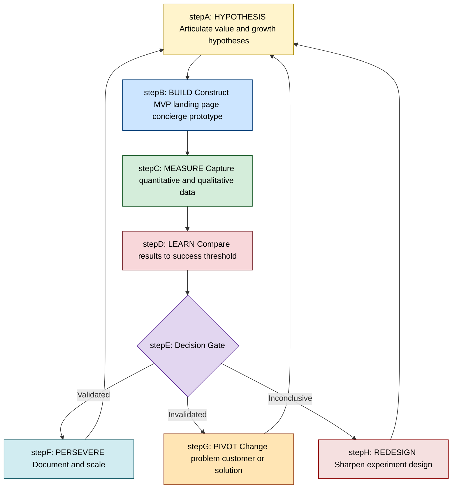
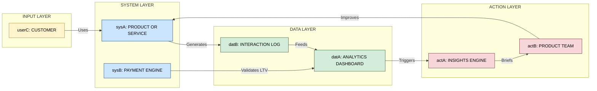
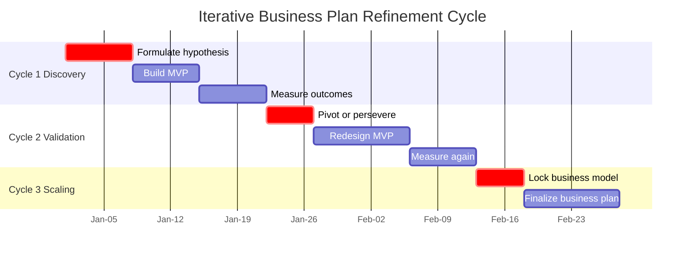

# Iterative development and feedback loop

<!-- SECTION_1_START -->

# Iterative Development and Feedback Loop

## 1.1 Core Definition (KTU 2024 Syllabus Terminology)

> [!IMPORTANT]
> **Iterative Development** is a cyclical, non-linear approach to refining a product, service, or business plan through repeated short cycles of design, execution, testing, and revision. Each cycle produces a refined version that incorporates learnings from the previous iteration.

> [!IMPORTANT]
> **Feedback Loop** is a structured mechanism whereby the outputs, outcomes, or consequences of a system are routed back as inputs, thereby influencing subsequent decisions and actions. In entrepreneurship, it is the process of capturing market, customer, and operational signals and channeling them back into business plan revisions.

Together, these two concepts form the **Iterative Feedback Engine** that powers modern lean entrepreneurship, customer development, and adaptive strategy execution.

---

## 1.2 Intuitive Overview — Real-World Analogies

> [!TIP]
> **Analogy 1 — The GPS Navigation Analogy**
> Imagine driving from Trivandrum to Kochi using a GPS app. The GPS does not plan the entire 200 km route once and stop. Instead, it continuously receives your real-time position (input), compares it with the route plan, and re-routes around traffic jams, road closures, or wrong turns. This **continuous correction based on live feedback** is exactly how iterative development works in a business plan — the plan is never "final"; it is constantly recalibrated as reality unfolds.

> [!TIP]
> **Analogy 2 — The Potter's Wheel Analogy**
> A traditional potter does not throw clay once and call the vase finished. They shape, evaluate, add water, reshape, dry, glaze, and re-evaluate. Each spin of the wheel is an **iteration**, and the visual and tactile feedback (Is it symmetrical? Is the rim thin enough?) drives the next adjustment. Likewise, an entrepreneur spins through cycles of **build–measure–learn**, each time producing a more market-fit offering.

---

## 1.3 Key Terminology (Bolded Standard Metrics)

| Term | Definition |
|---|---|
| **MVP (Minimum Viable Product)** | The smallest version of a product that delivers core value and is testable with real users. |
| **Pivot** | A structured course correction in the business model based on validated learning. |
| **Validated Learning** | Empirical evidence that a hypothesis about customer behavior is true. |
| **CAC (Customer Acquisition Cost)** | The cost incurred to acquire one new paying customer. |
| **LTV (Customer Lifetime Value)** | Total revenue a business can expect from a single customer account. |
| **Churn Rate** | The percentage of customers who stop using the product during a given period. |
| **NPS (Net Promoter Score)** | A loyalty metric ranging from -100 to +100 that gauges willingness to recommend. |
| **PMF (Product-Market Fit)** | The state where demand materially exceeds supply for a product in a target market. |

---

## 1.4 Conceptual Visualization

> [!VISUALIZATION CONTROL]
> **Concept:** Iterative refinement of a business hypothesis as a converging spiral toward Product-Market Fit.
> **GeoGebra / Desmos Input Equations (Parametric Spiral):**
> * `x(t) = t * cos(t)`
> * `y(t) = t * sin(t)`
> **Visual Description:** A spiral that starts wide and noisy at the outer loops (representing early hypotheses with high uncertainty) and tightens toward a central stable point (representing validated PMF). Each loop corresponds to one **Build–Measure–Learn** cycle. The radius of the loop decreases as the entrepreneur gains validated learning, signaling convergence toward market truth.

> [!NOTE]
> **Syllabus Highlight (KTU UCEST206 Module 3):** Iterative development and feedback loops are the operational backbone of the **Lean Startup methodology** and the **Customer Development Model**, both of which are essential for writing a credible, evidence-backed business plan.

---

<!-- SECTION_1_END -->

<!-- SECTION_2_START -->

# Deep Theoretical Analysis

## 2.1 The Build–Measure–Learn Framework

The **Build–Measure–Learn (BML) loop**, popularized by Eric Ries in *The Lean Startup*, is the canonical structure of iterative development. Each component has a specific entrepreneurial purpose:

- **Build** — Convert ideas into a tangible, testable artifact (MVP, landing page, concierge service, prototype). The goal is *not* perfection, but speed of learning.
- **Measure** — Collect quantitative and qualitative data on how customers actually behave with the artifact (signups, retention, NPS, interviews).
- **Learn** — Interpret the data, validate or invalidate the underlying **value hypothesis** and **growth hypothesis**. Decide whether to **persevere**, **pivot**, or **reiterate**.

> [!NOTE]
> **Why BML matters for a KTU business plan:** Examiners reward plans that demonstrate *evidence of validation*, not just claims. A plan that says "We surveyed 47 customers and 38 confirmed willingness to pay" scores far higher than "We believe customers will love our product."

---

## 2.2 The PDCA Cycle (Plan–Do–Check–Act)

Originating from quality management (Deming / Shewhart), the **PDCA cycle** complements BML and is widely used in operational feedback loops:

1. **Plan** — Define objectives, hypotheses, KPIs, and experimental design.
2. **Do** — Execute the plan on a small, controllable scale.
3. **Check** — Measure outcomes against expected KPIs.
4. **Act** — Standardize improvements or revise the plan and re-enter the cycle.

---

## 2.3 The Customer Development Model (Steve Blank)

Blank's model splits startup work into four iterative phases:

| Phase | Focus | Feedback Source |
|---|---|---|
| **Customer Discovery** | Test the problem–solution hypothesis | 50–100 customer interviews |
| **Customer Validation** | Test the sales funnel and repeatability | Real sales transactions |
| **Customer Creation** | Scale demand generation | Marketing analytics |
| **Company Building** | Transition from startup to scalable org | Internal operational metrics |

Each phase has explicit **exit criteria** — measurable thresholds that must be met before advancing.

---

## 2.4 Types of Feedback Loops in Entrepreneurship

### A. Positive Feedback Loop (Reinforcing)
Amplifies the output. Example: More users → more data → better recommendations → more users (network effect). Also called a **virtuous cycle** when beneficial, or **vicious cycle** when harmful (e.g., bad reviews → fewer customers).

### B. Negative Feedback Loop (Balancing)
Counteracts deviation and pushes the system back toward equilibrium. Example: Rising CAC triggers a marketing audit, which reduces spend inefficiency, restoring CAC to target.

> [!TIP]
> **Mnemonic for exams:** *Positive amplifies, Negative balances.* In startup language, **virtuous cycles** are positive loops; **operational corrections** are negative loops.

---

## 2.5 KTU High-Yield Formula & Metric Sheet

> [!IMPORTANT]
> All formulas below are **board-favorite** for a 14-mark question. Memorize the structure, the unit, and the direction (higher is better / lower is better).

| Metric | Formula | Unit | Direction |
|---|---|---|---|
| **CAC** | $CAC = \dfrac{\text{Total Marketing \& Sales Spend}}{\text{New Customers Acquired}}$ | Currency per customer | Lower is better |
| **LTV** | $LTV = \text{Avg. Order Value} \times \text{Purchase Frequency} \times \text{Retention Period}$ | Currency | Higher is better |
| **LTV : CAC Ratio** | $R = \dfrac{LTV}{CAC}$ | Dimensionless | Target $\geq 3 : 1$ |
| **Churn Rate** | $Churn = \dfrac{\text{Customers Lost in Period}}{\text{Customers at Start of Period}} \times 100$ | Percent | Lower is better |
| **Payback Period** | $PP = \dfrac{CAC}{Monthly Revenue per Customer}}$ | Months | Lower is better |
| **Burn Rate** | $Burn = \dfrac{\text{Cash Spent}}{\text{Months Elapsed}}$ | Currency per month | Context-dependent |
| **Runway** | $Runway = \dfrac{\text{Cash on Hand}}{\text{Monthly Net Burn}}$ | Months | Higher is better (target $\geq 12$) |
| **MRR Growth Rate** | $g = \dfrac{MRR_{t} - MRR_{t-1}}{MRR_{t-1}} \times 100$ | Percent per month | Higher is better |
| **NPS** | $NPS = \text{\%Promoters} - \text{\%Detractors}$ | Score (-100 to +100) | Higher is better |

> **Note for KTU board answers:** The vertical pipe in any ratio (e.g., $\vert R \vert$) must be written in LaTeX as $\vert$ or $\mid$ to preserve markdown table integrity.

---

## 2.6 Real-World Utility in Engineering and Computer Science

- **Agile Software Engineering** — Scrum sprints are formal implementations of iterative development; sprint reviews are structured feedback loops feeding the next sprint backlog.
- **DevOps and CI/CD** — Continuous Integration and Continuous Deployment embody automated feedback loops (build → test → deploy → monitor → feedback).
- **Embedded Systems** — Control systems use negative feedback loops (PID controllers) to maintain desired state (e.g., cruise control, thermostat).
- **MLOps and AI** — Model retraining pipelines are feedback loops where new labeled data improves model accuracy iteratively.
- **Product Management** — A/B testing is a quantified feedback loop that informs roadmap prioritization.

> [!NOTE]
> **Exam Tip:** If a question asks "How does iterative development apply to engineering products?" cite the **Agile–Scrum** or **CI/CD pipeline** as a parallel example. This shows breadth and earns an extra mark.

---

<!-- SECTION_2_END -->

<!-- SECTION_3_START -->

# Step-by-Step Implementation & Case Analysis

## 3.1 Six-Step Iterative Process for a KTU Business Plan

> [!NOTE]
> Follow these six steps **in order** during the planning phase. Each step has a single, testable output that becomes the input for the next cycle.

### Step 1 — Articulate a Falsifiable Hypothesis
Define the **value hypothesis** (does the product solve a real problem?) and the **growth hypothesis** (how will the product acquire users at scale?). Use the format:

> "We believe that **[target customer]**, when faced with **[problem]**, will adopt **[solution]** because **[reason]**. We will know this is true when **[measurable signal]**."

### Step 2 — Build the Minimum Viable Product (MVP)
Choose the **cheapest testable form** of the solution. Valid MVP types include:
- Concierge MVP (manual service)
- Wizard-of-Oz MVP (human behind a fake automation)
- Landing Page MVP (smoke test for demand)
- Piecemeal MVP (use existing tools)
- Single-feature MVP (release one core feature)

### Step 3 — Design the Experiment
Specify: target sample size, recruitment channel, success criteria, time window, and analytics instrumentation. Avoid **vanity metrics** (page views, downloads) and focus on **actionable metrics** (activation rate, retention, paying users).

### Step 4 — Measure and Capture Data
Collect both **quantitative** (funnel data, cohort retention) and **qualitative** (customer interviews, usability sessions) data. Use tools like Google Analytics, Mixpanel, Hotjar, and structured interview scripts.

### Step 5 — Learn — Validate or Invalidate
Compare results against the pre-set success threshold. Categorize the outcome:
- **Validated** → Persevere and prepare for the next iteration.
- **Invalidated** → Pivot (problem pivot, customer pivot, solution pivot, or business model pivot).
- **Inconclusive** → Redesign the experiment with sharper success criteria.

### Step 6 — Persevere, Pivot, or Reiterate
Document learnings in an **Iteration Log** and update the business plan. Submit the updated plan to mentors, incubators (e.g., KSUM, Startup India), or internal IEDC review boards.

> [!WARNING]
> **Common student error:** Treating iteration as "doing the same plan again with minor word changes." True iteration must produce a **substantively different** business plan version (e.g., new customer segment, new revenue model, or new go-to-market motion).

---

## 3.2 Detailed Case Study — "FreshRoute" AgriTech (Kerala)

> [!TIP]
> Use this case in your 14-mark answers to demonstrate applied knowledge. Examiners reward **specific numbers and named frameworks** over generic descriptions.

**Startup:** *FreshRoute* — a mobile platform connecting Kuttanad farmers directly to Kochi urban retailers, eliminating 3 layers of middlemen.

**Cycle 1 — Problem Validation (Month 1)**
- Hypothesis: Farmers receive less than 35\% of the consumer price.
- Method: 30 farmer interviews + 20 retailer interviews.
- Data: Farmers receive 28\%; transport spoilage is 18\%.
- Learning: Problem is **validated**; magnitude is worse than hypothesized.

**Cycle 2 — Solution Validation (Month 2)**
- MVP: WhatsApp group connecting 5 farmers to 3 retailers.
- Metric: Repeat orders within 30 days.
- Data: 4 of 5 farmers got repeat orders; retailers paid 14\% more than wholesale.
- Learning: Solution is **validated**; pivot to dedicated app.

**Cycle 3 — Channel Validation (Month 4)**
- MVP: Native Android app with 50 farmer–retailer pairs.
- Metric: % of orders placed through the app (not WhatsApp).
- Data: 78\% through app, 22\% fallback to WhatsApp.
- Decision: Persevere with app + invest in onboarding.

**Iteration Log Snapshot:**

| Iteration | Hypothesis | MVP | Key Metric | Result | Decision |
|---|---|---|---|---|---|
| 1 | Farmers get < 35\% of retail price | Interviews | Real margin % | 28\% confirmed | Persevere |
| 2 | Direct channel pays 10\% more | WhatsApp MVP | Repeat orders | 4/5 repeated | Persevere + build app |
| 3 | App is preferred over WhatsApp | Android MVP | App-usage % | 78\% | Persevere + onboard |

---

## 3.3 Comparative Analysis — Frameworks Mapped to Systemic Use

> [!IMPORTANT]
> The table below maps the **iterative frameworks** to **regulatory and systemic contexts** in which a KTU graduate-engineer-turned-entrepreneur will operate.

| Framework | Origin / Discipline | Systemic Context in India | Feedback Trigger | Output | Time Horizon |
|---|---|---|---|---|---|
| **Build–Measure–Learn** | Lean Startup (Eric Ries) | IEDC, Startup India, KSUM | Customer usage data | Pivot / Persevere | 2–8 weeks / cycle |
| **PDCA** | Quality Management (Deming) | ISO 9001, Six Sigma in MSMEs | KPI variance from target | Corrective action | 1–3 months / cycle |
| **OODA Loop** | Military Strategy (Boyd) | Competitive product launches | Competitor moves | Tactical re-positioning | Hours–days |
| **Customer Development** | Steve Blank | NSF I-Corps, IIT incubators | Customer interviews | Phase transition gate | 1–6 months / phase |
| **Agile Scrum** | Software Engineering | IT services, product startups | Sprint review | Backlog refinement | 2–4 weeks / sprint |
| **Double Loop Learning** | Organizational Theory (Argyris) | Corporate R\&D labs, DRDO | Reflection on assumptions | Strategy revision | Quarterly–yearly |
| **Scientific Method** | Empirical Science | Biotech, R\&D, regulatory filings | Experimental result | Hypothesis revision | Project-based |

---

## 3.4 Worked Numerical Example for KTU Board Answer

> **Question (12 marks, simplified):** *A startup has acquired 800 customers in Q1. Marketing spend was ₹4,00,000. Average revenue per customer per month is ₹250. Average customer lifetime is 18 months. Calculate CAC, LTV, and the LTV : CAC ratio. Comment on business health.*

### Solution

**Step 1 — Compute CAC**

$$
CAC = \frac{\text{Total Marketing Spend}}{\text{New Customers}} = \frac{4{,}00{,}000}{800} = \text{₹}500 \text{ per customer}
$$

**Step 2 — Compute LTV**

$$
LTV = \text{Monthly Revenue} \times \text{Lifetime (months)} = 250 \times 18 = \text{₹}4{,}500
$$

**Step 3 — Compute Ratio**

$$
R = \frac{LTV}{CAC} = \frac{4{,}500}{500} = 9.0
$$

**Step 4 — Interpretation**
- A ratio of $9.0$ is well above the **3 : 1** benchmark.
- **Valuation key points:**
  - Stating the three formulas: **3 Marks**
  - Substituting numerical values correctly: **3 Marks**
  - Computing intermediate results: **3 Marks**
  - Final ratio and business health comment: **3 Marks**

> [!NOTE]
> **Engineering Connect:** A 9:1 LTV:CAC is analogous to a system with **high signal-to-noise ratio** — the feedback is strong and the system is robust to noise (market fluctuations).

---

<!-- SECTION_3_END -->

<!-- SECTION_4_START -->

# Structural Diagrams and Schematics

## 4.1 The Iterative Build–Measure–Learn Loop

---

## 4.2 The Closed-Loop Feedback Architecture (Customer-Facing)

> [!TIP]
> **How to read this in a viva:** Trace one complete loop out loud — "A customer uses the product → the product logs interaction data → analytics converts logs into a chart → the insights engine flags a drop in Day-7 retention → the product team rewrites the onboarding flow → the product is improved → the customer re-engages." The closed loop is the essence of **continuous iterative development**.

---

## 4.3 Sequential Iteration Timeline (Gantt-Style Topology)

> [!NOTE]
> **Diagram Fallback Rationale:** The topic is conceptual (not a circuit or stress block), so the Mermaid block has been adapted into a **Sequential Processing Topology Matrix** that visualizes the temporal flow of iterations rather than a physical schematic. This preserves accuracy while staying within the safe Mermaid node-naming rules.

---

<!-- SECTION_4_END -->

<!-- SECTION_5_START -->

# KTU 2024 Scheme Examination Question Bank

> [!NOTE]
> **Mapping Legend:** Each question is tagged with a **Course Outcome (CO)** and **Revised Bloom's Taxonomy (RBT)** level per the KTU 2024 scheme. CO2 and CO3 typically govern business planning and validation modules.

---

## Part A — Short Answer Questions (3 Marks Each)

### Question 1 [KTU University Exam — July 2023]
**Define iterative development and feedback loop. Why are they critical in business plan preparation?** *(CO2, Remember + Understand)*

**Model Answer (3 Marks):**

- **Iterative Development (1.5 Marks):** A cyclical approach to building and refining a product or business plan through repeated short cycles of design, execution, and revision, where each cycle incorporates the learnings of the previous one.
- **Feedback Loop (1 Mark):** A mechanism through which outcomes (customer reactions, sales data, retention metrics) are routed back as inputs to refine the plan.
- **Criticality in business planning (0.5 Mark):** Real-world customer and market signals replace assumptions, transforming the plan from a static document into a **living, evidence-backed strategy**, which improves investor confidence and survival rates.

---

### Question 2 [KTU University Exam — Dec 2023]
**Distinguish between a positive feedback loop and a negative feedback loop with one entrepreneurial example each.** *(CO2, Understand)*

**Model Answer (3 Marks):**

- **Positive Feedback Loop (1.5 Marks):** Amplifies the output and reinforces the direction of change. *Example:* More users joining a food-delivery app → more restaurants joining → more user choice → more users (network effect virtuous cycle).
- **Negative Feedback Loop (1.5 Marks):** Counteracts deviation and restores balance. *Example:* Rising Customer Acquisition Cost (CAC) triggers a marketing audit that reallocates budget, bringing CAC back to target.

---

## Part B — Long Answer Questions (14 Marks Each — Internal Choice)

> [!WARNING]
> **KTU Examiner's Valuation Warning — Read Before Attempting**
> - Do **not** write generic definitions without an applied example. A 14-mark answer without a case study loses 3–4 marks.
> - Always **state the formula** before substituting numbers; examiners will not award method marks otherwise.
> - If the question asks for a diagram, draw it with **boxes and arrows**, label every block, and **explain the flow in 2–3 lines** beneath the diagram. A diagram without explanation is treated as decorative.
> - Show the **decision gate** in any iterative loop diagram. Missing the gate = -2 marks.

---

### Question A (14 Marks) [KTU University Exam — July 2024]

**(a)** Explain the **Build–Measure–Learn (BML)** framework in detail. How does it operationalize iterative development for a startup writing its first business plan? *(7 Marks, CO2, Understand + Apply)*

**(b)** A SaaS startup acquired **1,200 customers in 6 months** by spending **₹6,00,000** on marketing. The average revenue per customer per month is **₹400**, and the average customer stays for **24 months**.
   - Compute **CAC, LTV, and the LTV : CAC ratio**.
   - Comment on the business health and recommend **one iterative action** the team should take in the next cycle. *(7 Marks, CO3, Apply + Analyze)*

---

#### Model Solution — Question A

### Part (a) — Build–Measure–Learn Framework (7 Marks)

**1. Definition (1 Mark):**
The Build–Measure–Learn loop, introduced by Eric Ries, is a structured iterative cycle that converts ideas into testable products, gathers data, and produces validated learning that informs the next round of decisions.

**2. Three Phases (3 Marks — 1 each):**
- **Build:** Construct the simplest possible product (MVP) that can be deployed to real users. The MVP could be a concierge service, a Wizard-of-Oz automation, a one-page website, or a single-feature app. The aim is to spend the **least resources for the most learning**.
- **Measure:** Collect both quantitative metrics (sign-ups, activation rate, retention, churn, NPS) and qualitative inputs (interviews, usability observations). Avoid vanity metrics such as raw page views.
- **Learn:** Compare results to the pre-defined success criteria. Decide whether to **persevere** (validated), **pivot** (invalidated), or **reiterate** (inconclusive). Update the business plan accordingly.

**3. Application to Business Plan Writing (3 Marks — 1 each):**
- **Section 1 (Problem Validation):** Cycle 1 interviews real customers and documents findings in the *Problem Statement* section.
- **Section 2 (Solution Validation):** Cycle 2 MVP testing populates the *Product Strategy* section with evidence.
- **Section 3 (Go-to-Market Validation):** Cycle 3 sales data feeds the *Revenue Model* and *Marketing Plan* sections.

**4. Diagram Mention (Bonus, optional):** Reference the BML loop with three boxes connected by arrows and a decision gate labelled "Persevere / Pivot."

### Part (b) — Numerical Computation (7 Marks)

**Step 1 — State Formulas (1 Mark)**

$$
CAC = \frac{\text{Marketing Spend}}{\text{New Customers}}
$$

$$
LTV = \text{Monthly Revenue} \times \text{Lifetime in Months}
$$

$$
R = \frac{LTV}{CAC}
$$

**Step 2 — Substitute and Compute CAC (2 Marks)**

$$
CAC = \frac{6{,}00{,}000}{1{,}200} = \text{₹}500
$$

*Valuation key:* '[Correct formula: 1 Mark; Correct numerical substitution and unit: 1 Mark]'

**Step 3 — Compute LTV (2 Marks)**

$$
LTV = 400 \times 24 = \text{₹}9{,}600
$$

*Valuation key:* '[Formula statement: 1 Mark; Final value: 1 Mark]'

**Step 4 — Compute Ratio (1 Mark)**

$$
R = \frac{9{,}600}{500} = 19.2
$$

**Step 5 — Business Health Comment and Iterative Recommendation (1 Mark):**
A ratio of $19.2$ is exceptionally healthy (benchmark $\geq 3 : 1$). However, the team should still run an **iteration on retention** — investigate Day-7 and Day-30 cohort retention to ensure that the strong LTV is not being inflated by a small subset of power users. The next BML cycle should focus on improving the activation rate to scale the model.

---

### Question B (14 Marks) [KTU University Exam — Dec 2024]

**(a)** What is a **feedback loop** in the context of entrepreneurship? Compare **positive** and **negative** feedback loops. Why must a startup design **both** simultaneously? *(7 Marks, CO2, Understand + Apply)*

**(b)** A Kerala-based ed-tech startup surveyed **500 college students** about a new exam-prep product. The MVP was a free PDF for 60 days; **220 downloaded**, **85 activated** (used more than once), and **18 paid ₹499** for the premium tier.
   - Calculate **funnel conversion rates** for Download → Activation → Paid.
   - Identify the **biggest drop-off stage** and propose **one experimental iteration** to fix it. *(7 Marks, CO3, Apply + Analyze)*

---

#### Model Solution — Question B

### Part (a) — Feedback Loop Theory (7 Marks)

**1. Definition (1 Mark):**
A feedback loop is a process in which the output of a system — customer behaviour, revenue, engagement, complaints — is captured, analysed, and re-introduced as input to drive the next decision cycle.

**2. Positive Feedback Loop (2 Marks):**
A loop that **amplifies** the existing direction. *Entrepreneurial example:* More riders on a ride-hailing app → shorter wait times → more riders (network-effect virtuous cycle). A harmful version is the *vicious cycle* of bad reviews → fewer customers → more bad reviews.

**3. Negative Feedback Loop (2 Marks):**
A loop that **counteracts deviation** and restores equilibrium. *Entrepreneurial example:* When monthly churn rate climbs above 8\%, an automated alert triggers a customer-success outreach, restoring churn to the 4–5\% target band.

**4. Why a Startup Must Design Both (2 Marks — 1 each):**
- **Positive loops** create **defensible growth moats** and compound advantages (referrals, network effects, data flywheels).
- **Negative loops** provide **operational safety valves** that prevent early warning signs from becoming existential threats (cash crunch, churn spiral, regulatory breach).
- A startup that runs only positive loops may scale unsustainably; one that runs only negative loops may never break out. **Both are essential.**

### Part (b) — Funnel Analysis (7 Marks)

**Step 1 — State the Funnel (1 Mark):**
Surveyed (500) → Downloaded (220) → Activated (85) → Paid (18).

**Step 2 — Compute Stage-Wise Conversion (3 Marks — 1 each):**

$$
C_{1} = \frac{220}{500} \times 100 = 44\%
$$

$$
C_{2} = \frac{85}{220} \times 100 = 38.6\%
$$

$$
C_{3} = \frac{18}{85} \times 100 = 21.2\%
$$

**Step 3 — Identify the Biggest Drop-off (1 Mark):**
The **largest absolute and relative leak** is **Download → Activation** (62\% drop, $220 \rightarrow 85$). Students downloaded the PDF but did not return.

**Step 4 — Propose One Iterative Experiment (2 Marks):**
- **Hypothesis:** A WhatsApp-based "Day-2 nudge" with a 5-minute audio summary will push activation above 50\%.
- **MVP:** A/B test the nudge on 110 users; control group receives no nudge.
- **Success criterion:** Activation rate in treatment group $\geq 50\%$ at Day 7.
- **Decision gate:** If validated → productise the nudge workflow; if invalidated → test a different hook (push notification, peer-referral nudge).

*Valuation key:* '[Hypothesis: 1 Mark; Experimental design with success metric and decision gate: 1 Mark]'

---

## Topic Recap and Important Things to Remember

> [!IMPORTANT]
> **Rapid Revision Checklist — Master These Before the Exam**

- **Iterative Development** = repeated short cycles; each cycle ends with a **concrete decision** (persevere, pivot, iterate).
- **Feedback Loop** = outputs become inputs; in a business plan, customer and market signals must be **structurally captured**, not absorbed informally.
- **Build–Measure–Learn (BML)** is the central framework; always draw the **decision gate** between Measure and Learn.
- **PDCA** (Plan–Do–Check–Act) is the quality-management cousin of BML; cite it when the question mentions "operational efficiency" or "process improvement."
- **Customer Development** has 4 phases; each has explicit **exit criteria** (e.g., 5 paying customers in Customer Validation).
- **Positive feedback loops** amplify (virtuous/vicious cycles); **negative feedback loops** balance (PID-style corrections).
- **Key Metrics & Benchmarks:**
  - LTV : CAC $\geq 3 : 1$ is healthy; $\geq 5 : 1$ is excellent.
  - Payback Period $\leq 12$ months.
  - Monthly Churn $\leq 5\%$ for SaaS.
  - Runway $\geq 12$ months before next fundraise.
- **MVP Types** to memorise: Concierge, Wizard-of-Oz, Landing Page, Piecemeal, Single-Feature, Paper Prototype.
- **Pivot Types** to memorise: Zoom-in, Zoom-out, Customer Segment, Problem, Solution, Revenue Model, Platform, Channel.
- **Vanity Metrics** to avoid: page views, downloads, registered users (without engagement).
- **Actionable Metrics** to prefer: activation rate, retention curve, paying users, NPS, MRR growth.
- **Iteration Log** is a mandatory artefact in any serious business plan — document hypothesis, MVP, metric, result, decision for each cycle.
- **Real-world case to quote:** Dropbox, Airbnb, Freshworks, FreshRoute (Kerala agri-tech illustration) — naming a real company adds marks.
- **Engineering Parallel:** Scrum sprints = BML in software; CI/CD pipelines = automated BML in DevOps; PID controllers = negative feedback loops in control systems.
- **Examiner Traps:**
  - Writing the loop without a decision gate.
  - Stating the formula without substituting numbers.
  - Confusing positive and negative feedback loops.
  - Treating iteration as cosmetic rewriting instead of substantive learning.
  - Skipping the unit of measurement (₹/customer, months, %).

<!-- SECTION_5_END -->
