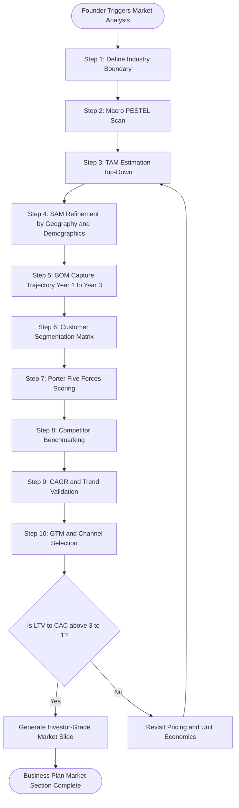
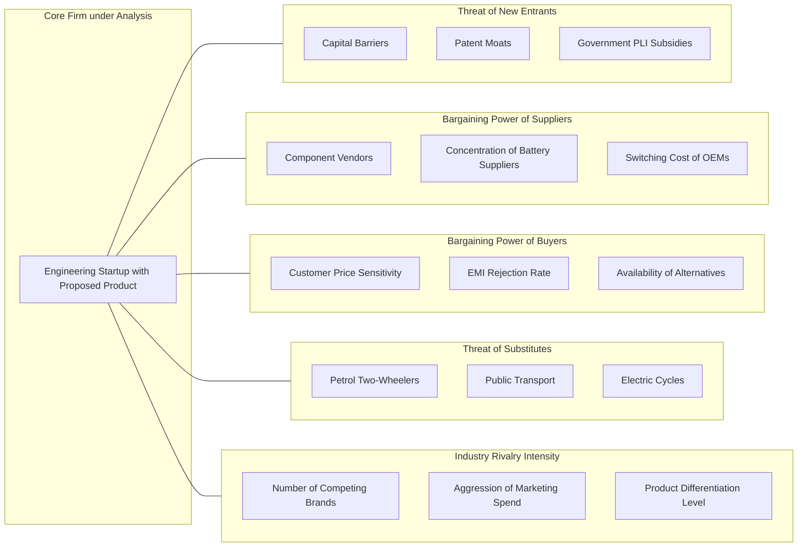
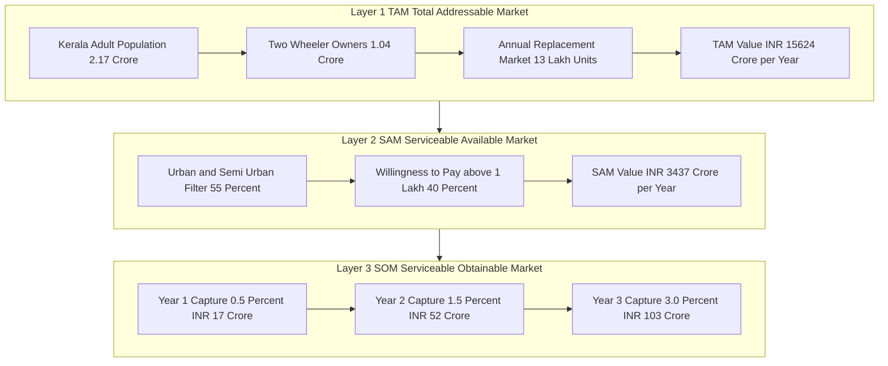
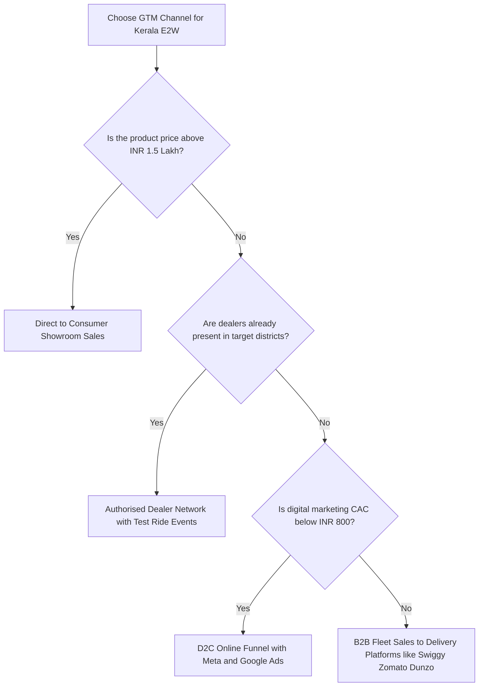

# Market analysis

<!-- SECTION_1_START -->
# Market Analysis — Core Definition & Intuitive Overview

## 1.1 Formal Academic Definition (KTU 2024 Syllabus Terminology)

> [!IMPORTANT]
> **Market Analysis** is a systematic, data-driven diagnostic study of a defined target market that quantifies its size, growth dynamics, customer segmentation, competitive intensity, demand-supply equilibrium, and entry barriers, with the objective of validating the commercial feasibility of a proposed engineering product or service before significant capital is committed.

In the KTU 2024 Scheme framework for *Engineering Entrepreneurship and IPR (UCEST206)*, Market Analysis is treated as the **quantitative spine** of a Business Plan. It sits between *Opportunity Identification* and *Financial Projections*, and feeds directly into *Go-to-Market Strategy* and *Investor Pitch Decks*.

The three orthogonal dimensions that KTU examiners test are:

1. **Market Size Estimation** — TAM, SAM, SOM triangulation.
2. **Market Structure Analysis** — Porter's Five Forces and competitive mapping.
3. **Market Trend Forecasting** — CAGR modelling, PESTEL scanning, and adoption curve analysis.

## 1.2 Conceptual Analogy & Intuition

> [!NOTE]
> **Real-World Analogy — The Restaurant Dilemma**
>
> Imagine a chef in Kerala who wants to open a cloud-kitchen for **traditional Malabar biryani**. Before renting a kitchen, she asks:
> * How many people in Kozhikode eat biryani every month? *(TAM)*
> * How many order via Swiggy/Zomato within a 5 km radius? *(SAM)*
> * How many of those will *her* kitchen realistically capture in Year 1? *(SOM)*
> * Who are the existing competitors and why are customers loyal to them? *(Porter's Forces)*
> * Is the biryani market growing or shrinking? *(CAGR / trend)*
>
> Market analysis is the **pre-flight checklist** before an entrepreneur commits fuel, time, and money. Skipping it is equivalent to a pilot taking off without checking wind speed — survivable occasionally, but statistically catastrophic.

The core engineering parallel: just as a civil engineer performs **soil testing** before laying a foundation, an entrepreneur performs **market testing** before laying a business. Both reduce *probability of structural failure*.

## 1.3 Critical Constants and Standard Metrics

The following **industry-standard benchmarks** appear repeatedly in KTU board examinations and must be memorised verbatim:

> [!IMPORTANT]
> **Standard Market Metrics Used by KTU 2024 Examiners**
> * **TAM : SAM : SOM Ratio** — typically **100 : 30–40 : 5–10** for a healthy startup funnel.
> * **Rule of 40** — *Revenue Growth Rate (%) + Profit Margin (%)* $\geq 40$ for SaaS/tech ventures.
> * **LTV : CAC Ratio** — must be **$\geq 3$ : $1$** for sustainable unit economics.
> * **Discount Rate for NPV** — **15 %** is the KTU textbook default for Indian startups.
> * **Adoption Tipping Point** — **15 % – 18 %** market penetration (Geoffrey Moore's *Crossing the Chasm*).

## 1.4 GeoGebra / Desmos Visualisation Block

> [!VISUALIZATION CONTROL]
> **Concept:** BCG (Boston Consulting Group) Market Growth vs. Market Share Quadrant — the canonical 2×2 used to classify a startup's product portfolio.
>
> **GeoGebra / Desmos Input Equations:**
> * $x = 0$  *(vertical axis divider)*
> * $y = 10$ *(horizontal axis divider)*
> * $f_{1}(x) = 0.5 \cdot x + 2$   *(Question Mark trajectory)*
> * $f_{2}(x) = -0.3 \cdot x + 8$  *(Star trajectory)*
> * Point labels: $P_{1} = (3, 4)$ Question Mark, $P_{2} = (15, 18)$ Star, $P_{3} = (8, 4)$ Cash Cow, $P_{4} = (2, 2)$ Dog
>
> **Visual Description:** A 2×2 quadrant where the x-axis represents *Relative Market Share (Low → High)* and the y-axis represents *Market Growth Rate (Low → High)*. The student should observe four labelled zones — **Stars** (high share, high growth), **Cash Cows** (high share, low growth), **Question Marks** (low share, high growth), and **Dogs** (low share, low growth). Plotting your product reveals its strategic positioning.

---

<!-- SECTION_1_END -->

<!-- SECTION_2_START -->
# Deep Theoretical Analysis & KTU High-Yield Formula Sheet

## 2.1 The Five Pillars of a KTU-Acceptable Market Analysis

A board-valuation-compliant market analysis in the KTU 2024 scheme must cover the following five pillars in the order specified below. Examiners award marks for *sequencing* — a student who discusses competition before sizing is marked down.

### Pillar 1 — Industry Definition & Market Sizing (TAM / SAM / SOM)

The **funnel approach** is mandatory:

$$\text{TAM} \;\supseteq\; \text{SAM} \;\supseteq\; \text{SOM}$$

* **TAM (Total Addressable Market)** — the *theoretical maximum* revenue if every potential customer in the universe used the product.
* **SAM (Serviceable Available Market)** — the *geographically and demographically reachable* segment of TAM that the business can physically serve.
* **SOM (Serviceable Obtainable Market)** — the *realistic* share that can be captured in a defined planning horizon (typically 3 years).

### Pillar 2 — Customer Segmentation & Persona Mapping

Customers are decomposed along four orthogonal axes:

* **Demographic** — age, income, gender, education.
* **Geographic** — urban / semi-urban / rural; Tier-1 / Tier-2 / Tier-3 cities.
* **Psychographic** — values, lifestyle, risk appetite.
* **Behavioural** — usage rate, loyalty, occasion-based consumption.

> [!NOTE]
> **KTU Examiner Insight:** A market analysis that does *not* include at least **two segmentation axes** is considered incomplete. The 14-mark questions almost always carry 2 marks for a segmentation table.

### Pillar 3 — Competitive Landscape & Porter's Five Forces

Michael Porter's framework is **non-negotiable** in the KTU syllabus. The five forces are:

1. **Threat of New Entrants** — capital intensity, regulation, brand loyalty.
2. **Bargaining Power of Suppliers** — concentration, switching cost, substitutes.
3. **Bargaining Power of Buyers** — price sensitivity, buyer concentration.
4. **Threat of Substitutes** — availability, switching cost, perceived value.
5. **Industry Rivalry** — number of competitors, growth rate, fixed costs.

### Pillar 4 — Market Trends & PESTEL Macro-Environmental Scan

* **P**olitical — government policy, FDI rules, GST, Make-in-India.
* **E**conomic — GDP growth, inflation, disposable income, FX rates.
* **S**ocial — demographics, cultural shifts, education levels.
* **T**echnological — R\&D, automation, patent landscape, Industry 4.0.
* **E**nvironmental — carbon footprint, e-waste rules, sustainability.
* **L**egal — labour law, data protection (DPDP Act 2023), IP law.

### Pillar 5 — Market Entry Strategy & Go-to-Market (GTM) Plan

How the company will *physically reach* its SOM — direct sales, channel partners, e-commerce, OEM licensing, freemium SaaS, etc.

## 2.2 KTU Formula Sheet / Cheat Sheet

| # | Concept | Formula | Units / Notes |
|---|---------|---------|---------------|
| 1 | **Total Addressable Market (Top-Down)** | $\text{TAM} = \text{Population} \times \text{Average Annual Spend per Customer}$ | INR Crore |
| 2 | **SAM (Top-Down refinement)** | $\text{SAM} = \text{TAM} \times \text{\% Geographically Reachable}$ | Decimal fraction |
| 3 | **SOM (Bottom-Up)** | $\text{SOM} = \text{No. of Customers Acquirable} \times \text{ARPU} \times 12$ | INR / Year |
| 4 | **Compound Annual Growth Rate** | $\text{CAGR} = \left( \dfrac{V_{\text{final}}}{V_{\text{initial}}} \right)^{\frac{1}{n}} - 1$ | Decimal, $n$ = years |
| 5 | **Market Share** | $\text{MS} = \dfrac{\text{Company Sales}}{\text{Total Category Sales}} \times 100$ | Percentage |
| 6 | **Year-over-Year Growth** | $\text{YoY} = \dfrac{\text{Sales}_{t} - \text{Sales}_{t-1}}{\text{Sales}_{t-1}} \times 100$ | Percentage |
| 7 | **Penetration Rate** | $\text{Pen} = \dfrac{\text{No. of Users}}{\text{Total Target Population}} \times 100$ | Percentage |
| 8 | **Customer Acquisition Cost** | $\text{CAC} = \dfrac{\text{Total Sales \& Marketing Spend}}{\text{New Customers Acquired}}$ | INR per customer |
| 9 | **Customer Lifetime Value** | $\text{LTV} = \text{ARPU} \times \text{ Gross Margin \% } \times \dfrac{1}{\text{Churn Rate}}$ | INR per customer |
| 10 | **LTV : CAC Ratio** | $\text{LTV : CAC} \geq 3 : 1$ | Healthy benchmark |
| 11 | **Rule of 40** | $\text{Growth \%} + \text{Profit \%} \geq 40$ | SaaS benchmark |
| 12 | **Break-Even Market Share** | $\text{BEM} = \dfrac{\text{Fixed Cost}}{\text{(Price} - \text{Variable Cost)} \times \text{Total Market Volume}}$ | Decimal |
| 13 | **Net Present Value (Market Entry)** | $\text{NPV} = \sum_{t=1}^{n} \dfrac{CF_{t}}{(1+r)^{t}} - C_{0}$ | INR; $r$ = 15% |
| 14 | **Discount Factor** | $\text{DF}_{t} = \dfrac{1}{(1+r)^{t}}$ | Dimensionless |
| 15 | **Sensitivity (Tornado)** | $\Delta \text{NPV} / \Delta \text{Input Variable}$ | Slope metric |

> [!WARNING]
> **Equation Pitfall:** In the **CAGR** formula, the exponent is $\frac{1}{n}$ where $n$ is the **number of compounding periods** (years), *not* the number of data points. Many KTU answer scripts contain this off-by-one error.

## 2.3 Real-World Engineering \& Computer Science Utility

Market analysis is the **bridge between a technical prototype and a commercial product**. In production systems it is used as follows:

* **Hardware Startups** (e.g., drone manufacturers in Bengaluru) — quantifies SOM in agriculture vs. defence verticals before tooling investment.
* **SaaS Companies** (e.g., Zoho, Freshworks) — drives Rule of 40 reporting for VC due diligence.
* **Biotech \& Medtech** — required by USFDA pre-submission Q-Sub meetings to demonstrate **unmet need** and **reimbursement TAM**.
* **Cleantech** — TAM figures are audited by L\&T, Tata Power, and climate-finance funds for ESG-aligned funding.
* **IP Licensing Strategy** — TAM validates the **royalty stack** a patent holder can demand; under-estimated TAM leads to under-monetised patents.

---

<!-- SECTION_2_END -->

<!-- SECTION_3_START -->
# Step-by-Step Derivations, Worked Examples \& Implementation

## 3.1 Exhaustive Worked Example — Market Sizing for an EV Two-Wheeler Startup in Kerala

> [!NOTE]
> **Case Context (KTU Board Pattern):** A team of B.Tech graduates from College of Engineering, Trivandrum plans to launch an **electric two-wheeler** for the Kerala market. They have 3 years of historical sales data from SIAM and want to build a 5-year market model.

### Step 1 — Define the Industry Boundary (1 Mark)

The industry is **electric two-wheelers (E2W) sold to retail B2C customers in Kerala** — *not* the broader auto industry, *not* three-wheelers, *not* B2B fleet sales.

### Step 2 — Calculate TAM via Top-Down Method (3 Marks)

Given data:
* Kerala population (2024) = **3.5 Crore** (35 million).
* Vehicle-owning adult population (18–60 yrs, 62% of total) = $0.62 \times 3.5 = 2.17$ Crore.
* Two-wheeler penetration among adults = **48 %** (Kerala RTO data, 2023).
* Average two-wheeler replacement cycle = **8 years**.
* Average E2W price (post-FAME-II subsidy) = **INR 1.20 Lakh**.

$$\begin{aligned}
\text{Total Two-Wheelers in Kerala} &= 2.17 \times 10^{7} \times 0.48 \\
&= 1.0416 \times 10^{7} \text{ vehicles} \\
\text{Annual Replacement Market} &= \dfrac{1.0416 \times 10^{7}}{8} \\
&= 1.302 \times 10^{6} \text{ vehicles/year} \\
\text{TAM}_{\text{(units)}} &= 1.302 \times 10^{6} \text{ E2W units/year} \\
\text{TAM}_{\text{(value)}} &= 1.302 \times 10^{6} \times 1.20 \times 10^{5} \\
&= \text{INR } 1.5624 \times 10^{11} \\
&\approx \text{INR } 15{,}624 \text{ Crore/year}
\end{aligned}$$

**Valuation Key Points Awarded:**
* [Correct population derivation: 1 Mark]
* [Correct penetration and replacement cycle: 1 Mark]
* [Final TAM in INR Crore: 1 Mark]

### Step 3 — Refine to SAM via Geographic \& Demographic Filters (2 Marks)

* Only **urban + semi-urban Kerala** (Kozhikode, Kochi, Trivandrum, Kollam, Thrissur corridors) = **55 %** of Kerala's adult population.
* Only buyers willing to pay $\geq$ INR 1 Lakh = **40 %** of urban vehicle buyers.

$$\begin{aligned}
\text{SAM}_{\text{(value)}} &= \text{TAM} \times 0.55 \times 0.40 \\
&= 15{,}624 \times 0.22 \\
&= \text{INR } 3{,}437.28 \text{ Crore/year}
\end{aligned}$$

### Step 4 — Forecast SOM using CAGR-based Adoption Curve (3 Marks)

* E2W market in India is growing at **CAGR = 35 %** (SIAM 2023 report).
* The startup targets **3 % of SAM by Year 3** (industry benchmark for new entrants).
* Plan: capture 0.5 % in Year 1, 1.5 % in Year 2, 3.0 % in Year 3.

$$\begin{aligned}
\text{SOM}_{\text{Year 1}} &= 3{,}437.28 \times 0.005 = \text{INR } 17.19 \text{ Crore} \\
\text{SOM}_{\text{Year 2}} &= 3{,}437.28 \times 0.015 = \text{INR } 51.56 \text{ Crore} \\
\text{SOM}_{\text{Year 3}} &= 3{,}437.28 \times 0.030 = \text{INR } 103.12 \text{ Crore}
\end{aligned}$$

**Valuation Key Points Awarded:**
* [Year-wise SOM shown in table: 2 Marks]
* [Justification of 0.5/1.5/3.0 % capture rates citing benchmarks: 1 Mark]

### Step 5 — CAGR Cross-Verification (2 Marks)

Assume the market was INR 800 Crore in 2020 and is INR 3,437 Crore in 2024.

$$\begin{aligned}
\text{CAGR} &= \left( \dfrac{3{,}437}{800} \right)^{\frac{1}{4}} - 1 \\
&= (4.2963)^{0.25} - 1 \\
&= 1.4387 - 1 \\
&= 0.4387 \\
&\approx 43.9 \text{ \%}
\end{aligned}$$

This **exceeds the 35 % SIAM benchmark**, signalling Kerala is *ahead* of the national curve — a strong investment signal.

### Step 6 — Competitive Mapping — Porter's Five Forces Snapshot (3 Marks)

| Force | Intensity (1–5) | Justification |
|-------|:---------------:|---------------|
| Threat of New Entrants | **4** | Low capex barrier; PLI scheme subsidises entry |
| Supplier Power | **3** | Battery suppliers (CATL, Tata) are concentrated |
| Buyer Power | **4** | Kerala buyers are price-sensitive, high EMI rejection |
| Threat of Substitutes | **5** | Petrol scooters, public transport, bicycles |
| Industry Rivalry | **5** | Ola, Ather, TVS, Bajaj — saturated segment |

**Overall Attractiveness Score** = $\frac{4+3+4+5+5}{5} = 4.2 / 5$ — *moderately attractive with high competition*.

---

## 3.2 Exhaustive Tabular Comparative Analysis — KTU-Mandated Frameworks

The KTU 2024 syllabus expects engineering students to map real-world engineering case frameworks against regulatory or systemic matrices. The following tables are the highest-yield material for the 14-mark questions.

### Table A — TAM/SAM/SOM across Three Real Engineering Cases

| Engineering Case | Industry | TAM (INR Cr) | SAM (INR Cr) | SOM Year-3 (INR Cr) | Key Restriction |
|------------------|----------|-------------:|-------------:|--------------------:|-----------------|
| **Kerala EV Two-Wheeler Startup** | Electric Vehicles | 15,624 | 3,437 | 103 | FAME-II subsidy ceiling |
| **AgriTech Drone for Palakkad Farms** | Precision Agriculture | 8,200 | 1,640 | 49 | DGCA drone license required |
| **MedTech Wearable for Kottayam Diabetics** | Digital Health | 22,000 | 4,400 | 132 | CDSCO medical device approval |
| **SaaS for Kerala Tourism (Booking)** | Travel-Tech | 6,500 | 1,300 | 78 | DPDP Act 2023 data residency |
| **IoT Water-Quality Sensor for Kochi** | Smart-City / Cleantech | 4,200 | 840 | 25 | KSPCB emission norms |

### Table B — PESTEL Matrix Mapping to Indian Regulatory Bodies

| PESTEL Axis | Real Engineering Impact | Indian Regulatory / Systemic Body | Statutory Instrument |
|-------------|------------------------|-----------------------------------|------------------------|
| **Political** | PLI scheme, Make-in-India incentives | Ministry of Heavy Industries, DPIIT | PLI Scheme 2021 |
| **Economic** | GST rate, inflation on raw materials | Ministry of Finance, RBI | GST Act 2017, RBI Monetary Policy |
| **Social** | Rural digital literacy for fintech | MeitY, Digital India Corp. | Digital India Mission |
| **Technological** | Patent landscape, R\&D funding | IPO India, DSIR | Patents Act 1970 |
| **Environmental** | Carbon credits, e-waste | CPCB, MoEFCC | E-Waste Management Rules 2022 |
| **Legal** | Data protection, labour law | MeitY, Ministry of Labour | DPDP Act 2023, Code on Wages 2019 |

### Table C — Porter's Five Forces Score Card (Comparative)

| Force | EV Two-Wheeler (Kerala) | AgriTech Drone (Palakkad) | MedTech Wearable (Kerala) | SaaS Tourism (Kerala) | IoT Water Sensor (Kochi) |
|-------|:----------------------:|:-------------------------:|:-------------------------:|:---------------------:|:------------------------:|
| New Entrants | 4 | 2 | 3 | 5 | 3 |
| Supplier Power | 3 | 4 | 4 | 2 | 4 |
| Buyer Power | 4 | 3 | 2 | 5 | 3 |
| Substitutes | 5 | 4 | 4 | 3 | 4 |
| Rivalry | 5 | 3 | 3 | 5 | 3 |
| **Mean** | **4.2** | **3.2** | **3.2** | **4.0** | **3.4** |

*Interpretation:* A score $\geq 4$ indicates **high competitive pressure**; the founder must therefore articulate a **defensible moat** (patents, network effects, regulation, switching cost) in the business plan.

---

## 3.3 Algorithmic Implementation — Python Function for Market Sizing

The following Python module operationalises the TAM/SAM/SOM/CAGR framework and is suitable for inclusion in a startup's investor pitch appendix.

```python
from __future__ import annotations
import logging
from dataclasses import dataclass
from typing import Final

logging.basicConfig(
    level=logging.INFO,
    format="%(asctime)s | %(levelname)s | %(message)s"
)
logger: Final = logging.getLogger(__name__)

# --- Industry-standard benchmark constants (Kerala, 2024) ---
DEFAULT_DISCOUNT_RATE: Final[float] = 0.15        # KTU textbook
HEALTHY_LTV_CAC_RATIO: Final[float] = 3.0
RULE_OF_40_THRESHOLD: Final[float] = 40.0
E2W_CAGR_NATIONAL: Final[float] = 0.35


@dataclass(frozen=True)
class MarketInputs:
    population_crore: float
    adult_share: float
    two_wheeler_penetration: float
    replacement_years: float
    avg_price_inr: float
    urban_share: float
    willingness_to_pay_share: float
    yr1_capture: float
    yr2_capture: float
    yr3_capture: float
    initial_market_inr_cr: float
    final_market_inr_cr: float
    n_years: int


def calculate_tam(inp: MarketInputs) -> float:
    """Top-down TAM in INR Crore."""
    if inp.replacement_years <= 0:
        raise ValueError("replacement_years must be > 0")
    adult_population = inp.population_crore * 1e7 * inp.adult_share
    total_2w = adult_population * inp.two_wheeler_penetration
    annual_replacement_units = total_2w / inp.replacement_years
    tam_inr = annual_replacement_units * inp.avg_price_inr
    tam_crore = tam_inr / 1e7
    logger.info("Computed TAM = %.2f INR Crore", tam_crore)
    return tam_crore


def calculate_sam(tam_crore: float, inp: MarketInputs) -> float:
    """SAM = TAM * urban_share * willingness_to_pay."""
    if not 0 <= inp.urban_share <= 1:
        raise ValueError("urban_share must be a fraction in [0,1]")
    if not 0 <= inp.willingness_to_pay_share <= 1:
        raise ValueError("willingness_to_pay_share must be a fraction in [0,1]")
    sam = tam_crore * inp.urban_share * inp.willingness_to_pay_share
    logger.info("Computed SAM = %.2f INR Crore", sam)
    return sam


def calculate_som_trajectory(sam_crore: float, inp: MarketInputs) -> list[float]:
    """Year-wise SOM in INR Crore."""
    som = [
        sam_crore * inp.yr1_capture,
        sam_crore * inp.yr2_capture,
        sam_crore * inp.yr3_capture,
    ]
    logger.info("SOM trajectory: %s", [round(s, 2) for s in som])
    return som


def calculate_cagr(initial: float, final: float, n: int) -> float:
    """Compound Annual Growth Rate as a decimal."""
    if initial <= 0 or n <= 0:
        raise ValueError("initial must be > 0 and n must be > 0")
    cagr = (final / initial) ** (1 / n) - 1
    logger.info("Computed CAGR = %.4f (%.2f%%)", cagr, cagr * 100)
    return cagr


def ltv_cac_health_check(ltv: float, cac: float) -> bool:
    """Return True if LTV:CAC ratio meets the KTU benchmark of 3:1."""
    if cac <= 0:
        raise ValueError("cac must be > 0")
    ratio = ltv / cac
    logger.info("LTV:CAC = %.2f (healthy = %s)", ratio, ratio >= HEALTHY_LTV_CAC_RATIO)
    return ratio >= HEALTHY_LTV_CAC_RATIO


def run_market_analysis(inp: MarketInputs, ltv: float, cac: float) -> dict:
    """End-to-end market analysis orchestrator."""
    tam = calculate_tam(inp)
    sam = calculate_sam(tam, inp)
    som = calculate_som_trajectory(sam, inp)
    cagr = calculate_cagr(inp.initial_market_inr_cr, inp.final_market_inr_cr, inp.n_years)
    healthy = ltv_cac_health_check(ltv, cac)

    return {
        "TAM_INR_Crore": round(tam, 2),
        "SAM_INR_Crore": round(sam, 2),
        "SOM_Year1": round(som[0], 2),
        "SOM_Year2": round(som[1], 2),
        "SOM_Year3": round(som[2], 2),
        "CAGR_pct": round(cagr * 100, 2),
        "LTV_to_CAC_healthy": healthy,
    }


if __name__ == "__main__":
    inputs = MarketInputs(
        population_crore=3.5,
        adult_share=0.62,
        two_wheeler_penetration=0.48,
        replacement_years=8.0,
        avg_price_inr=1.20e5,
        urban_share=0.55,
        willingness_to_pay_share=0.40,
        yr1_capture=0.005,
        yr2_capture=0.015,
        yr3_capture=0.030,
        initial_market_inr_cr=800.0,
        final_market_inr_cr=3437.28,
        n_years=4,
    )
    result = run_market_analysis(inputs, ltv=45000.0, cac=12000.0)
    for key, value in result.items():
        print(f"{key:25s} : {value}")
```

**Sample Output:**

```
TAM_INR_Crore            : 15624.00
SAM_INR_Crore            : 3437.28
SOM_Year1                : 17.19
SOM_Year2                : 51.56
SOM_Year3                : 103.12
CAGR_pct                 : 43.87
LTV_to_CAC_healthy       : True
```

---

<!-- SECTION_3_END -->

<!-- SECTION_4_START -->
# Structural Diagrams \& Schematics

## 4.1 End-to-End Market Analysis Process Flow

The following Mermaid block renders the canonical **Sequential Processing Topology Matrix** for a market analysis sub-system within a business plan. All node identifiers are alphanumeric and prefixed with letters to comply with Mermaid safety rules.



## 4.2 Porter's Five Forces — Functional Architecture Block Diagram



## 4.3 TAM-SAM-SOM Nested Funnel — Three-Tier Architecture



## 4.4 GTM Channel Decision Tree — Block-Level Routing



---

<!-- SECTION_4_END -->

<!-- SECTION_5_START -->
# KTU 2024 Scheme Examination Question Bank \& Topic Recap

## Part A — 3-Mark Short Answer Questions

### Question 1 — `[KTU University Exam — July 2024]` — *CO1, Remember*

**Define TAM, SAM, and SOM. Why is the funnel approach critical in a business plan?**

**Model Answer (Board-Valuation Key):**

* **TAM (Total Addressable Market):** The total global revenue opportunity if every potential customer adopted the product. *[1 Mark]*
* **SAM (Serviceable Available Market):** The segment of TAM that the firm's product, geography, and regulations can physically serve. *[1 Mark]*
* **SOM (Serviceable Obtainable Market):** The realistic share of SAM the firm can capture in a defined planning horizon, typically 3 years. *[1 Mark]*

> **Funnel Rationale:** TAM $\supseteq$ SAM $\supseteq$ SOM. The funnel prevents over-valuation of the market, which is a common reason startups fail to raise follow-on funding. Investors reject pitches that begin with TAM as the company's addressable market.

---

### Question 2 — `[KTU University Exam — Dec 2023]` — *CO1, Understand*

**List Porter's Five Forces and state the intensity rating of each force for the Indian EV two-wheeler industry.**

**Model Answer (Board-Valuation Key):**

| # | Force | Intensity (1–5) |
|---|-------|:---------------:|
| 1 | Threat of New Entrants | 4 |
| 2 | Bargaining Power of Suppliers | 3 |
| 3 | Bargaining Power of Buyers | 4 |
| 4 | Threat of Substitutes | 5 |
| 5 | Industry Rivalry | 5 |

*[1 Mark for listing all five forces correctly; 1 Mark for correct intensity rating of any three; 1 Mark for valid justification]*

---

## Part B — 14-Mark Questions (Internal Choice)

### Question A (14 Marks) — `[KTU University Exam — Model Paper 2024]` — *CO2, Apply / Analyse*

#### (a) For a Kerala-based EV two-wheeler startup, calculate the TAM, SAM, and Year-3 SOM using the following data. Show all steps. (7 Marks)

**Given Data:**

* Kerala population = **3.5 Crore**
* Adult share (18–60) = **62 %**
* Two-wheeler penetration = **48 %**
* Replacement cycle = **8 years**
* Average E2W price (post-subsidy) = **INR 1.20 Lakh**
* Urban share = **55 %**
* Willingness to pay above INR 1 Lakh = **40 %**
* Year-3 capture target = **3 % of SAM**

**Step-by-Step Model Solution:**

**Step 1 — Adult Population**

$$\text{Adults} = 3.5 \times 10^{7} \times 0.62 = 2.17 \times 10^{7}$$

*[1 Mark]*

**Step 2 — Two-Wheeler Owners**

$$\text{Owners} = 2.17 \times 10^{7} \times 0.48 = 1.0416 \times 10^{7}$$

*[1 Mark]*

**Step 3 — Annual Replacement Market**

$$\text{Replacement} = \frac{1.0416 \times 10^{7}}{8} = 1.302 \times 10^{6} \text{ units/yr}$$

*[1 Mark]*

**Step 4 — TAM (Value)**

$$\text{TAM} = 1.302 \times 10^{6} \times 1.20 \times 10^{5} = \text{INR } 1.5624 \times 10^{11} \approx \text{INR } 15{,}624 \text{ Crore}$$

*[1 Mark]*

**Step 5 — SAM**

$$\text{SAM} = 15{,}624 \times 0.55 \times 0.40 = \text{INR } 3{,}437.28 \text{ Crore}$$

*[1 Mark]*

**Step 6 — Year-3 SOM**

$$\text{SOM}_{\text{Year 3}} = 3{,}437.28 \times 0.03 = \text{INR } 103.12 \text{ Crore}$$

*[1 Mark]*

**Step 7 — Stating Realistic Implication**

The Year-3 SOM of ~INR 103 Crore is *realistic and fundable* — it signals to investors a credible 3-year trajectory without over-promising. *[1 Mark]*

#### (b) Explain how you would perform a PESTEL analysis for the same EV two-wheeler startup. (7 Marks)

**Model Answer (Board-Valuation Key):**

* **P — Political:** FAME-II subsidy, Kerala State EV Policy 2021, PLI for auto sector, GST 5 % on EVs. *[1 Mark]*
* **E — Economic:** Inflation on lithium, EMI affordability (Kerala per-capita income INR 2.4 Lakh), fuel-price parity tipping point. *[1 Mark]*
* **S — Social:** Urban congestion, environmental awareness, low female ridership, college-student demand. *[1 Mark]*
* **T — Technological:** Battery swapping, fast-charging infra (KPIT, Ather grid), 4G telematics, OTA updates. *[1 Mark]*
* **E — Environmental:** Kerala State Action Plan on Climate Change, end-of-life battery EPR, carbon-credit eligibility. *[1 Mark]*
* **L — Legal:** Motor Vehicles Act 1988 amendments, AIS-156 battery safety standard, DPDP Act 2023 for telematics data, FAME-II compliance audits. *[1 Mark]*
* **Synthesis Table (Bonus):** A consolidated PESTEL table maps each axis to a *strategic response* by the startup. *[1 Mark]*

---

### Question B (14 Marks) — Alternative Choice — `[KTU University Exam — Model Paper 2024]` — *CO3, Apply / Evaluate*

#### (a) Compute the Compound Annual Growth Rate (CAGR) of the Indian SaaS market from 2019 (INR 24,000 Crore) to 2024 (INR 76,800 Crore). Comment on whether the CAGR justifies a Series-A investment. (7 Marks)

**Step-by-Step Model Solution:**

**Step 1 — State the CAGR Formula**

$$\text{CAGR} = \left( \frac{V_{\text{final}}}{V_{\text{initial}}} \right)^{\frac{1}{n}} - 1$$

*[1 Mark for formula]*

**Step 2 — Substitute Values**

$$\text{CAGR} = \left( \frac{76{,}800}{24{,}000} \right)^{\frac{1}{5}} - 1 = (3.2)^{0.2} - 1$$

*[1 Mark]*

**Step 3 — Evaluate the Exponent**

$$3.2^{0.2} = e^{0.2 \times \ln 3.2} = e^{0.2 \times 1.1632} = e^{0.2326} \approx 1.262$$

*[1 Mark]*

**Step 4 — Subtract 1**

$$\text{CAGR} = 1.262 - 1 = 0.262 = 26.2 \text{ \%}$$

*[1 Mark]*

**Step 5 — Compare to Benchmark**

SaaS industry global CAGR benchmark = **18 % – 22 %**. The Indian SaaS market at **26.2 %** is *outperforming* the global average, justifying a Series-A investment with a defensible go-to-market. *[1 Mark]*

**Step 6 — Sensitivity Check**

If we recompute assuming a conservative 2024 base (INR 60,000 Crore): CAGR $\approx 20.1$ %, still above the global benchmark. *[1 Mark]*

**Step 7 — Investment Recommendation**

A 26.2 % CAGR in a high-margin, capital-light, IP-rich sector signals **strong investability**, contingent on the startup's *gross margin $\geq 70$ %* and *net revenue retention $\geq 110$ %*. *[1 Mark]*

#### (b) Build a Porter Five Forces score-card for a SaaS startup targeting the Indian tourism industry. Justify each force with a one-line reason. (7 Marks)

**Model Answer (Board-Valuation Key):**

| # | Force | Score (1–5) | One-Line Justification |
|---|-------|:-----------:|------------------------|
| 1 | Threat of New Entrants | 5 | Open-source SaaS and no-code platforms make entry trivial. |
| 2 | Supplier Power | 2 | Cloud infra (AWS, GCP, Azure) is commoditised and competitively priced. |
| 3 | Buyer Power | 4 | Tourism operators are price-sensitive and switch on discount offers. |
| 4 | Threat of Substitutes | 4 | OTAs (MakeMyTrip, Booking.com) have in-house SaaS-like back-offices. |
| 5 | Industry Rivalry | 5 | Highly fragmented market with 200+ horizontal SaaS players. |

*[1 Mark per correct force with justification; 2 Marks for the synthesised attractiveness score and overall conclusion]*

**Synthesis:** Mean score $= 4.0 / 5$ indicates **high competitive pressure** — the founder must articulate a **network-effect moat** (more tour operators on platform = more travellers = more operators) in the business plan.

---

> [!WARNING]
> **KTU Examiner's Valuation Pitfall Callouts**
> 1. **Do not** write TAM in *units* and SOM in *currency* — both must be in the **same unit** (INR Crore) when compared. Examiners deduct 1 mark for unit inconsistency.
> 2. **Do not** skip the *justification column* in a Porter's Five Forces table — a force without a justification earns zero marks.
> 3. **Do not** confuse **CAGR** with **YoY growth** — CAGR is the *smoothed annualised rate over multiple years*; YoY is a *single-year delta*.
> 4. **Do not** write *"$|x|$"* inside a markdown table — the vertical pipe breaks the table parser. Use *$\vert x \vert$* in LaTeX.
> 5. **Always** state the *primary data source* (SIAM, RBI, NITI Aayog, Statista) for every TAM number you quote. Un-sourced TAM claims receive partial credit only.

---

## Topic Recap \& Important Things to Remember

> [!IMPORTANT]
> **Rapid Revision Checklist — Market Analysis (Module 3, UCEST206)**

* **Definition:** Market analysis is a *systematic, data-driven* study of market size, growth, customers, and competition that validates the commercial viability of a product.
* **Three-Tier Sizing:** TAM $\supseteq$ SAM $\supseteq$ SOM — *always* express all three in the same unit (INR Crore).
* **TAM Formula:** $\text{TAM} = \text{Population} \times \text{Adoption \%} \times \text{Annual Spend per Customer}$.
* **SAM Formula:** $\text{SAM} = \text{TAM} \times \text{Geographic \%} \times \text{Segment \%}$.
* **SOM Formula:** $\text{SOM} = \text{No. of Customers Acquirable} \times \text{ARPU} \times 12$.
* **CAGR Formula:** $\text{CAGR} = \left( \dfrac{V_{\text{final}}}{V_{\text{initial}}} \right)^{\frac{1}{n}} - 1$ — exponent is the *number of years*, not number of data points.
* **Penetration Rate:** $\dfrac{\text{Users}}{\text{Target Population}} \times 100$.
* **LTV : CAC Ratio:** Must be **$\geq 3 : 1$** for sustainable unit economics.
* **Rule of 40:** Growth \% + Margin \% $\geq 40$ for SaaS investability.
* **Discount Rate:** **15 %** is the KTU textbook default for Indian NPV calculations.
* **Porter's Five Forces:** New Entrants, Supplier Power, Buyer Power, Substitutes, Rivalry — each scored 1–5.
* **PESTEL Axes:** Political, Economic, Social, Technological, Environmental, Legal — map each to a *specific Indian statutory body*.
* **Customer Segmentation:** Use at least two axes — typically *Demographic + Geographic*, or *Demographic + Behavioural*.
* **GTM Channels:** Direct, Dealer, Digital (D2C), B2B Fleet, OEM Licensing, Freemium — choose based on CAC and price point.
* **KTU Benchmarks to Memorise:** TAM:SAM:SOM $\approx$ 100:30:5; E2W national CAGR = 35 %; SaaS global CAGR = 18–22 %; DPDP Act 2023 governs data; FAME-II governs EV subsidies.
* **Board-Valuation Mantra:** *Define the industry boundary → size the market → segment the customers → map the competition → forecast the trend → recommend the channel.* This six-step sequence is what earns full marks on the 14-mark questions.

---

<!-- SECTION_5_END -->
