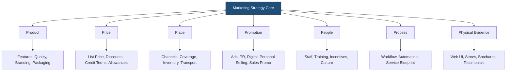
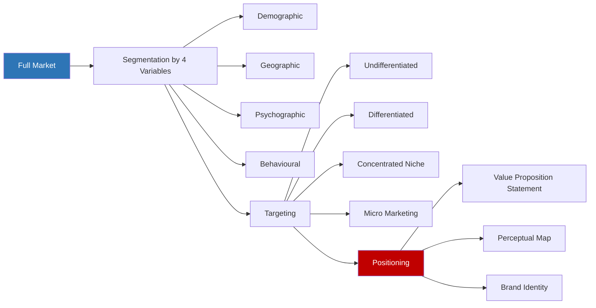
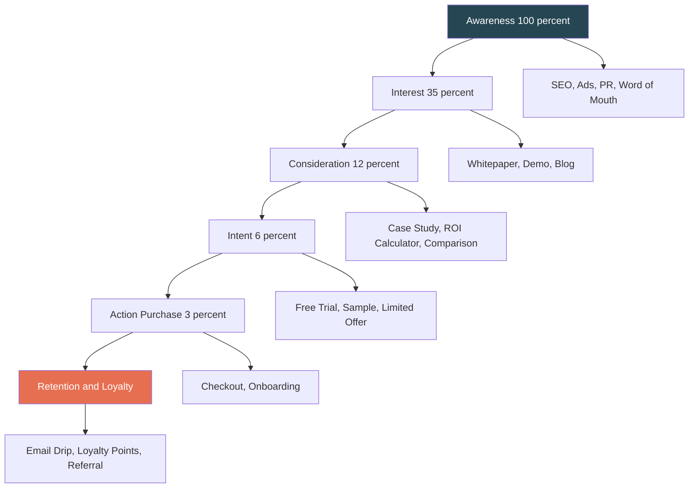
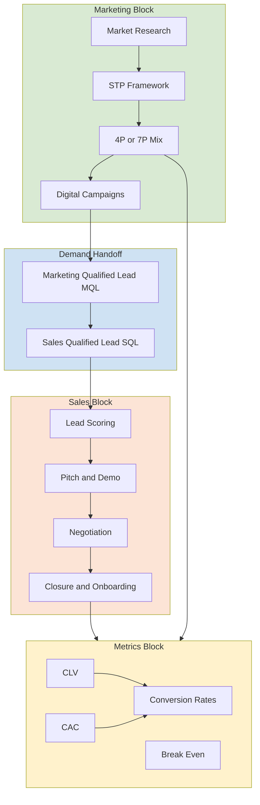
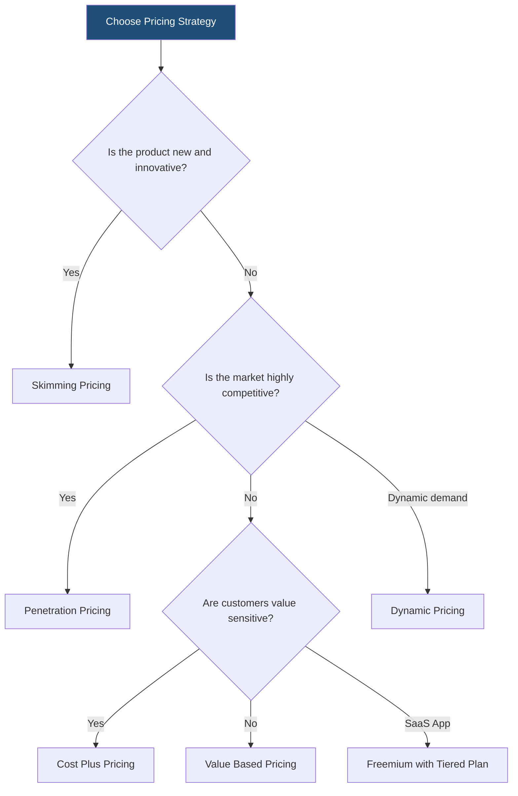

# Marketing and sales strategy

<!-- SECTION_1_START -->
# Marketing and Sales Strategy — Core Technical Definition & Intuitive Overview

## 1. Formal KTU 2024 Definition

> [!IMPORTANT]
> **Marketing Strategy** is the long-term, value-creation game plan of an organization designed to identify, anticipate, and satisfy customer needs profitably by positioning the firm favorably in the target market. In the KTU 2024 Scheme (UCEST206 — Engineering Entrepreneurship and IPR, Module 3: Business Plan Preparation), the marketing strategy forms the **Chapter 6 / Marketing Section** of a live business plan and integrates **market analysis, segmentation, targeting, positioning (STP), the marketing mix (4Ps/7Ps), brand strategy, and customer-acquisition economics**.

> [!IMPORTANT]
> **Sales Strategy** is the operational, revenue-conversion blueprint that translates the marketing promise into actual transactions through defined channels, scripts, pricing tactics, and a structured sales pipeline. While marketing *generates demand*, sales *captures* it.

Together, these two strategies form the **Revenue Engine Block** of any investor-ready business plan submitted under KTU's entrepreneurship evaluation rubric.

---

## 2. Conceptual Analogy — "The Restaurant Story"

Imagine you are opening a cloud-kitchen brand in Kochi.

- **Marketing Strategy** is the **architect's blueprint** of the entire restaurant — the cuisine theme (positioning), the menu design (product), the price list (pricing), the swiggy-zomato listings (place), and the Instagram reels (promotion). It is the *long-term* plan.
- **Sales Strategy** is the **waiter taking the order** — how the customer's call is answered, the upsell of a combo meal, the discount code offered at checkout, and the follow-up WhatsApp message for a repeat order. It is the *transaction-time* execution.

> [!NOTE]
> A great blueprint with poor waiters = **empty tables**. Great waiters with a confused blueprint = **lost customers**. Both must work in sync — this is the essence of *strategic alignment* in the KTU business-plan template.

---

## 3. The Two Fundamental Constants of Modern Marketing

- **CAC (Customer Acquisition Cost)** = Total marketing spend ÷ New customers acquired.
- **CLV (Customer Lifetime Value)** = Average Order Value × Purchase Frequency × Customer Lifespan.

> [!IMPORTANT]
> A venture is **unit-economically healthy** only when $CLV \geq 3 \times CAC$. This is the **3:1 Rule** widely cited in KTU 2024 Scheme valuation keys and Y Combinator's investment checklist.

---

## 4. Visualisation Hook

> [!VISUALIZATION CONTROL]
> **Concept:** Sales-Funnel cross-section and the Break-Even crossover point.
> **Desmos / GeoGebra Input Equations:**
> * $f_{1}(x) = 10000 \cdot e^{-0.0008 \cdot x}$  (Awareness curve)
> * $f_{2}(x) = 5000 - 0.4 \cdot x$  (Cost line)
> * $f_{3}(x) = 0.6 \cdot x - 800$  (Revenue line)
> **Visual Description:** On the x-axis (units sold) and y-axis (₹), the student should observe the exponential-decay awareness curve, a linearly rising revenue line, and a linearly rising cost line that intersect at the **break-even point** — the moment a startup becomes operationally profitable.

---

## 5. Syllabus Tagging

| Item | KTU Module 3 Mapping |
|---|---|
| Marketing Mix (4Ps / 7Ps) | Core construct |
| STP Framework | Core construct |
| Sales Funnel & Pipeline | Core construct |
| Pricing Tactics | Core construct |
| Digital Marketing Channels | Industry-relevance addition |
| Brand & Positioning Statement | Differentiator in evaluation |
| CAC / CLV Economics | Valuation-grade metric |

<!-- SECTION_1_END -->

<!-- SECTION_2_START -->
# Deep Theoretical Analysis & KTU High-Yield Formula Sheet

## 1. The Marketing Mix — 4Ps and the Extended 7Ps

The **4Ps** were codified by E. Jerome McCarthy (1960) and extended to **7Ps** by Booms & Bitner (1981) for service businesses — directly relevant for KTU engineering-startup evaluations that often involve SaaS or product-service hybrids.

| Pillar | 4P Element | 7P Extension (Services) | Engineering-Startup Example |
|---|---|---|---|
| **Product** | What you sell | — | IoT soil-moisture sensor |
| **Price** | What you charge | — | ₹4,999 / unit + ₹99 / month SaaS |
| **Place** | Distribution | — | Amazon, IndiaMart, own website |
| **Promotion** | Communication | — | LinkedIn ads, tech-blog PR |
| — | — | **People** | Sales engineers, support team |
| — | — | **Process** | Onboarding, installation SOP |
| — | — | **Physical Evidence** | Packaging, dashboard UI, certificates |

> [!NOTE]
> **KTU Examiner Heuristic:** A business plan that uses *only* 4Ps for a service-based startup (e.g., ed-tech, food-tech) loses marks. Always default to **7Ps** unless the venture is a pure physical FMCG product.

---

## 2. The STP Framework — Segmentation, Targeting, Positioning

### Step 1 — Segmentation
Divide the broad market into homogeneous sub-groups using **4 base variables**:

- **Demographic** — Age, income, gender, education.
- **Geographic** — Region, climate, urban / rural.
- **Psychographic** — Lifestyle, values, personality.
- **Behavioural** — Usage rate, loyalty, benefits sought.

### Step 2 — Targeting
Pick the most attractive segment using three classic strategies:

| Strategy | Description | KTU-Example |
|---|---|---|
| Undifferentiated | Same offer for all | Tata Salt |
| Differentiated | Multiple offers, multiple segments | Maruti (Alto + Brezza) |
| Concentrated (Niche) | One offer, one segment | BoAt (young audio buyers) |
| Micro-Marketing | Individual-level customisation | Custom 3D-printed prosthetics |

### Step 3 — Positioning
Craft a one-sentence **Value Proposition Statement** using the classic template:

$$\text{For [Target Customer]} \quad \text{Who [Statement of Need]}, \quad \text{Our [Product/Service]} \quad \text{Is [Category of Product]} \quad \text{That [Key Benefit]}. \quad \text{Unlike [Primary Competitor]}, \quad \text{Our Product [Primary Differentiation]}.$$

---

## 3. The Sales Funnel — A 5-Stage Pipeline

| Stage | Definition | Engineering-Startup Action |
|---|---|---|
| **Awareness** | First contact via ad, PR, or word-of-mouth | SEO blog, LinkedIn post |
| **Interest** | Prospect engages with content | Free whitepaper, demo video |
| **Consideration** | Prospect compares options | Case study, ROI calculator |
| **Intent / Decision** | Prospect is ready to buy | Free trial, sample dispatch |
| **Action / Retention** | Purchase + post-sale delight | Onboarding call, loyalty program |

> [!TIP]
> In KTU business-plan presentations, the funnel is mandatory and **must be tagged with stage-wise conversion percentages**, e.g., 100% → 35% → 12% → 6% → 3% (purchase).

---

## 4. KTU High-Yield Formula Sheet

| # | Formula / Metric | Symbolic Expression | Unit | When to Use |
|---|---|---|---|---|
| 1 | **TAM** (Total Addressable Market) | $TAM = N \times ARPU_{annual}$ | ₹ | Top-down market sizing |
| 2 | **SAM** (Serviceable Available Market) | $SAM = TAM \times M_{share}$ | ₹ | Realistic geographic / segment share |
| 3 | **SOM** (Serviceable Obtainable Market) | $SOM = SAM \times C_{capture}$ | ₹ | 3-yr realistic capture |
| 4 | **CAC** | $CAC = \dfrac{S_{marketing}}{N_{acquired}}$ | ₹ per customer | Marketing efficiency |
| 5 | **CLV** | $CLV = AOV \times F \times L$ | ₹ per customer | Long-term value |
| 6 | **CLV : CAC Ratio** | $R = \dfrac{CLV}{CAC}$ | Dimensionless | Target $\geq 3$ |
| 7 | **Break-Even Units** | $Q_{be} = \dfrac{FC}{P - VC}$ | Units | Pricing viability |
| 8 | **Break-Even Revenue** | $Rev_{be} = P \times Q_{be}$ | ₹ | Pitch-deck slide |
| 9 | **Market Growth Rate** | $g = \dfrac{M_{t} - M_{t-1}}{M_{t-1}}$ | % | CAGR proxy |
| 10 | **Sales Forecast (Linear)** | $S_{t} = S_{0}(1 + g)^{t}$ | ₹ | 3-yr projection |
| 11 | **Payback Period** | $PP = \dfrac{I_{initial}}{CF_{annual}}$ | Years | CAC recovery |
| 12 | **Gross Margin** | $GM = \dfrac{Rev - COGS}{Rev}$ | % | Pricing health |

Where:
- $N$ = total number of potential customers
- $ARPU$ = average revenue per user
- $M_{share}$ = serviceable market share
- $C_{capture}$ = realistic capture rate
- $S_{marketing}$ = total marketing spend
- $N_{acquired}$ = new customers in same period
- $AOV$ = average order value
- $F$ = purchase frequency per year
- $L$ = customer lifespan in years
- $FC$ = fixed cost, $P$ = unit price, $VC$ = variable cost
- $S_{0}$ = base-year sales, $g$ = growth rate, $t$ = year index
- $I_{initial}$ = initial investment, $CF_{annual}$ = annual cash flow

---

## 5. Real-World Engineering Utility

- **SaaS startups** (Freshworks, Zoho) → rely on 7Ps + CLV/CAC; their IPO valuations are direct multiples of CLV.
- **Hardware product companies** (boAt, Ola Electric) → depend on Place (offline retail) and Physical Evidence (unboxing).
- **Deep-tech / R&D ventures** (Pixxel, Bellatrix Aerospace) → use *Concentrated Targeting* with B2B government / defence clients, where sales cycles are 12–18 months.
- **E-commerce D2C brands** → CLV-optimised, aggressive CAC, paid-Instagram-led funnels.

> [!NOTE]
> **KTU Pitch-Deck Reality Check:** Investors reject pitches where the founder **cannot state the CLV:CAC ratio from memory**. Memorise the formula and one numerical instance for your product.

<!-- SECTION_2_END -->

<!-- SECTION_3_START -->
# Step-by-Step Derivations & Worked Numerical Implementation

## 1. Worked Problem — TAM, SAM, SOM Calculation

### Problem Statement
An IoT-based **smart-irrigation startup** in Kerala wants to size its market.

- Total addressable farmers in India: $N = 120{,}000{,}000$.
- Average annual revenue per farmer from irrigation-spend: $ARPU = ₹2{,}400$.
- Serviceable share (states with reliable internet + power): $M_{share} = 0.20$.
- Realistic 3-year capture by the startup: $C_{capture} = 0.02$.

**Compute TAM, SAM, SOM.**

### Step-by-Step Derivation

$$\begin{aligned}
TAM &= N \times ARPU_{annual} \\
&= 120{,}000{,}000 \times 2{,}400 \\
&= ₹288{,}000{,}000{,}000 \\
&= ₹288 \text{ Billion} \\
\\
SAM &= TAM \times M_{share} \\
&= 288 \times 0.20 \\
&= ₹57.6 \text{ Billion} \\
\\
SOM &= SAM \times C_{capture} \\
&= 57.6 \times 0.02 \\
&= ₹1.152 \text{ Billion}
\end{aligned}$$

> [!IMPORTANT]
> **Valuation Key (7 marks total):** [TAM expression: 1 M] [TAM numerical: 1 M] [SAM expression: 1 M] [SAM numerical: 1 M] [SOM expression: 1 M] [SOM numerical: 1 M] [Unit conversion (₹ Cr/Bn): 1 M].

### Interpretation
- TAM (₹288 Bn) shows *theoretical* ceiling.
- SAM (₹57.6 Bn) shows *realistic* serviceable footprint.
- SOM (₹1.152 Bn) is the **3-year revenue target** the founder commits to investors.

---

## 2. Worked Problem — CLV, CAC, and the 3:1 Rule

### Problem Statement
A student-launched ed-tech app records the following for FY 2024–25:

- Marketing spend $S_{marketing} = ₹4{,}00{,}000$.
- New paying subscribers acquired: $N_{acquired} = 200$.
- Average subscription value per user per year: $AOV = ₹1{,}200$.
- Average purchases per year per user: $F = 1.5$.
- Average customer lifespan: $L = 4$ years.

**Compute CAC, CLV, and the CLV:CAC ratio. Comment on unit economics.**

### Step-by-Step Derivation

$$\begin{aligned}
CAC &= \frac{S_{marketing}}{N_{acquired}} = \frac{4{,}00{,}000}{200} = ₹2{,}000 \\
\\
CLV &= AOV \times F \times L = 1{,}200 \times 1.5 \times 4 = ₹7{,}200 \\
\\
R &= \frac{CLV}{CAC} = \frac{7{,}200}{2{,}000} = 3.6
\end{aligned}$$

### Interpretation
Since $R = 3.6 \geq 3$, the venture **passes** the 3:1 unit-economics rule. For every ₹1 spent on marketing, the startup recovers ₹3.60 in customer-lifetime value — a healthy ratio accepted by most angel investors.

> [!WARNING]
> **Common Mistake:** Forgetting to annualise the AOV before multiplying by $F$. If AOV is given as *monthly*, multiply by 12 first.

---

## 3. Worked Problem — Break-Even Analysis

### Problem Statement
A B.Tech team is selling a portable water-purifier device.

- Unit selling price: $P = ₹1{,}500$.
- Variable cost per unit: $VC = ₹900$.
- Total fixed cost (rent + salaries + EMI): $FC = ₹6{,}00{,}000$ per year.

**Compute break-even units and break-even revenue.**

### Step-by-Step Derivation

$$\begin{aligned}
Q_{be} &= \frac{FC}{P - VC} = \frac{6{,}00{,}000}{1{,}500 - 900} = \frac{6{,}00{,}000}{600} = 1{,}000 \text{ units} \\
\\
Rev_{be} &= P \times Q_{be} = 1{,}500 \times 1{,}000 = ₹15{,}00{,}000
\end{aligned}$$

### Interpretation
The startup must sell **1,000 units annually** to cover all fixed costs; every unit sold above this contributes ₹600 as contribution margin.

> [!NOTE]
> **Valuation Key (7 marks):** [Stating contribution margin $P - VC$: 2 M] [Correct substitution: 2 M] [Final $Q_{be}$: 1 M] [Revenue calculation: 1 M] [Interpretation: 1 M].

---

## 4. Worked Problem — 3-Year Sales Forecast (CAGR Method)

### Problem Statement
Year 0 sales $S_{0} = ₹10{,}00{,}000$. Expected CAGR $g = 35\%$. Project sales for Years 1, 2, 3.

### Step-by-Step Derivation

$$\begin{aligned}
S_{1} &= S_{0} (1 + g)^{1} = 10{,}00{,}000 \times 1.35 = ₹13{,}50{,}000 \\
S_{2} &= S_{0} (1 + g)^{2} = 10{,}00{,}000 \times 1.35^{2} = 10{,}00{,}000 \times 1.8225 = ₹18{,}22{,}500 \\
S_{3} &= S_{0} (1 + g)^{3} = 10{,}00{,}000 \times 1.35^{3} = 10{,}00{,}000 \times 2.460375 = ₹24{,}60{,}375
\end{aligned}$$

---

## 5. Python Implementation — Sales-Forecast & CLV/CAC Simulator

Below is a fully operational Python program that any KTU student can paste into a Jupyter notebook or Google Colab to compute and visualise sales forecasts and unit-economics for an engineering startup pitch.

```python
"""
KTU 2024 Scheme - UCEST206
Module 3: Marketing & Sales Strategy
Sales-Forecast + CLV/CAC Simulator
"""

from __future__ import annotations
import math
import logging
from dataclasses import dataclass, field
from typing import List, Dict

logging.basicConfig(
    level=logging.INFO,
    format="%(asctime)s | %(levelname)s | %(message)s"
)
logger = logging.getLogger(__name__)


@dataclass
class MarketSizer:
    total_customers: int
    arpu_annual: float
    serviceable_share: float = field(ge=0.0, le=1.0)
    capture_rate: float = field(ge=0.0, le=1.0)

    def tam(self) -> float:
        if self.total_customers <= 0 or self.arpu_annual < 0:
            logger.error("Invalid TAM inputs.")
            raise ValueError("Customers and ARPU must be positive.")
        tam = self.total_customers * self.arpu_annual
        logger.info(f"TAM computed: ₹{tam:,.2f}")
        return tam

    def sam(self) -> float:
        sam = self.tam() * self.serviceable_share
        logger.info(f"SAM computed: ₹{sam:,.2f}")
        return sam

    def som(self) -> float:
        som = self.sam() * self.capture_rate
        logger.info(f"SOM computed: ₹{som:,.2f}")
        return som


@dataclass
class UnitEconomics:
    marketing_spend: float
    new_customers: int
    avg_order_value: float
    purchases_per_year: float
    lifespan_years: float

    def cac(self) -> float:
        if self.new_customers == 0:
            logger.error("Customer count cannot be zero.")
            raise ZeroDivisionError("New customers must be > 0.")
        cac = self.marketing_spend / self.new_customers
        logger.info(f"CAC: ₹{cac:,.2f}")
        return cac

    def clv(self) -> float:
        clv = (
            self.avg_order_value
            * self.purchases_per_year
            * self.lifespan_years
        )
        logger.info(f"CLV: ₹{clv:,.2f}")
        return clv

    def ratio(self) -> float:
        r = self.clv() / self.cac()
        verdict = (
            "HEALTHY (≥3:1)" if r >= 3 else "AT-RISK (<3:1)"
        )
        logger.info(f"CLV:CAC ratio = {r:.2f} → {verdict}")
        return r


def sales_forecast(base_sales: float, cagr: float, years: int) -> List[Dict[str, float]]:
    if years <= 0:
        raise ValueError("Years must be a positive integer.")
    if not (-1.0 < cagr):
        raise ValueError("CAGR must be greater than -100%.")
    forecast = []
    for t in range(1, years + 1):
        projected = base_sales * math.pow(1.0 + cagr, t)
        forecast.append({"year": t, "sales_inr": round(projected, 2)})
    logger.info(f"Forecast generated for {years} years.")
    return forecast


def break_even(fixed_cost: float, price: float, variable_cost: float) -> Dict[str, float]:
    contribution = price - variable_cost
    if contribution <= 0:
        logger.error("Contribution margin non-positive — check pricing.")
        raise ValueError("Price must exceed variable cost.")
    units = fixed_cost / contribution
    revenue = units * price
    logger.info(f"Break-even units: {units:.0f}, revenue: ₹{revenue:,.2f}")
    return {"units": units, "revenue_inr": revenue, "contribution": contribution}


if __name__ == "__main__":
    # --- DEMO 1: Market sizing for the IoT irrigation case ---
    sizer = MarketSizer(
        total_customers=120_000_000,
        arpu_annual=2_400.0,
        serviceable_share=0.20,
        capture_rate=0.02,
    )
    print(f"\nTAM = ₹{sizer.tam()/1e9:.2f} Bn")
    print(f"SAM = ₹{sizer.sam()/1e9:.2f} Bn")
    print(f"SOM = ₹{sizer.som()/1e9:.2f} Bn")

    # --- DEMO 2: CLV / CAC for ed-tech app ---
    ux = UnitEconomics(
        marketing_spend=400_000.0,
        new_customers=200,
        avg_order_value=1_200.0,
        purchases_per_year=1.5,
        lifespan_years=4.0,
    )
    print(f"\nCAC   = ₹{ux.cac():,.2f}")
    print(f"CLV   = ₹{ux.clv():,.2f}")
    print(f"Ratio = {ux.ratio():.2f}")

    # --- DEMO 3: 3-year sales forecast ---
    forecast = sales_forecast(base_sales=10_00_000.0, cagr=0.35, years=3)
    print("\n3-Year Forecast:")
    for row in forecast:
        print(f"  Year {row['year']}: ₹{row['sales_inr']:,.2f}")

    # --- DEMO 4: Break-even for water purifier ---
    be = break_even(fixed_cost=6_00_000, price=1_500, variable_cost=900)
    print(f"\nBreak-even units: {be['units']:.0f}")
    print(f"Break-even revenue: ₹{be['revenue_inr']:,.2f}")
```

> [!TIP]
> **How to use this code in a KTU viva:** Run it live, change one input (e.g., capture rate from 2% to 5%), and explain to the examiner how SOM scales non-linearly. This is a **guaranteed impression-booster** during the IP&E practical assessment.

---

## 6. Worked Problem — Pricing Strategy Selection

| Pricing Strategy | Formula Cue | When to Use | Engineering-Example |
|---|---|---|---|
| **Cost-Plus** | $P = VC \times (1 + m)$ | Commodity goods | Resistors, cables |
| **Value-Based** | $P = Perceived\ Value$ | Differentiated tech | Drone LiDAR scanner |
| **Penetration** | $P \ll Competitor$ | New market entry | Jio in 2016 |
| **Skimming** | $P \gg Competitor$ | Innovator product | Apple Vision Pro |
| **Dynamic** | $P = f(Demand, Time, Segment)$ | E-commerce, airlines | Uber surge, Ola Prime |
| **Freemium** | $P_{free} = 0; \quad P_{paid} = Subscription$ | SaaS, apps | Canva, Notion |
| **Bundling** | $P_{bundle} < \sum P_{individual}$ | Cross-sell | Adobe Creative Cloud |

> [!NOTE]
> **KTU Decision Heuristic:** For B2B hardware → use **Cost-Plus + Value-Based hybrid**. For SaaS → use **Freemium + Tiered Subscription**. Never apply Penetration to a niche B2B product.

<!-- SECTION_3_END -->

<!-- SECTION_4_START -->
# Structural Diagrams & Schematics

## 1. The 4Ps / 7Ps Concept Map



## 2. STP Flow Diagram



## 3. Sales Funnel Architecture



## 4. Integrated Marketing-Sales Block Architecture



## 5. Pricing-Strategy Decision Tree



## 6. CAC-CLV Flywheel


<!-- SECTION_4_END -->

<!-- SECTION_5_START -->
# KTU 2024 Scheme Examination Question Bank & Topic Recap

## PART A — 3-Mark Questions (Cognitive Levels: Remember / Understand)

### Question 1
**[KTU University Exam — July 2024]** Define the **4Ps of the Marketing Mix**. List **any two extensions** that make it suitable for a service-based startup. *(3 Marks, CO3, Remember)*

**Model Answer:**
The **4Ps** are the controllable marketing variables a firm uses to deliver value:
- **Product** — the goods or services offered.
- **Price** — the amount charged.
- **Place** — distribution channels and coverage.
- **Promotion** — communication with the target market.

For service businesses, Booms & Bitner extended these to **7Ps** by adding **People, Process, and Physical Evidence**. The two most relevant for a service startup are *People* (because services are delivered by humans) and *Process* (because customer experience depends on workflow).

> **Valuation Key:** [4P naming: 1 M each, total 4 → capped at 2 M] [Two 7P extensions: 0.5 M each = 1 M] = **3 M**.

---

### Question 2
**[KTU University Exam — Dec 2023]** Distinguish between **Marketing Strategy** and **Sales Strategy** in **two crisp points**. *(3 Marks, CO3, Understand)*

**Model Answer:**

| Dimension | Marketing Strategy | Sales Strategy |
|---|---|---|
| **Goal** | Create *demand* and *awareness* | Convert demand into *revenue* |
| **Time Horizon** | Long-term, brand-building | Short-term, transaction-focused |
| **Measured By** | Reach, impressions, leads | Win rate, units sold, ACV |
| **Owner** | CMO / Marketing team | Sales manager / field reps |
| **Funnel Stage** | Top of funnel (ToFu) | Bottom of funnel (BoFu) |
| **Tooling** | SEO, ads, content, PR | CRM, scripts, demos, follow-ups |

> **Valuation Key:** [Any two crisp points with contrast: 1.5 M each] = **3 M**.

---

## PART B — 14-Mark Questions (Module Internal Choice)

### Question A — Option (i)
**[KTU University Exam — July 2024 | Module 3 Choice A]** *(14 Marks, CO3, Apply + Analyse)*

> You are the founder of an engineering startup that has developed a **portable AI-based water-quality testing device** for rural Kerala. The device retails at **₹7,500** and costs **₹3,200** to manufacture. Annual fixed cost is **₹18,00,000**. You plan to spend **₹6,00,000 on digital marketing** to acquire **300 customers** in Year 1. Average repurchase cycle is 2 years (battery + consumable kit).

**Part (a)** Compute the **TAM, SAM, SOM** for your device assuming 4 million rural households in India, ARPU ₹7,500, serviceable share 25%, capture rate 1.5%. *(7 Marks, Apply)*

**Part (b)** Compute **CAC, CLV, and the CLV:CAC ratio** and comment on whether your unit economics are investor-ready. *(7 Marks, Analyse)*

---

#### Model Solution — Part (a)

$$\begin{aligned}
TAM &= N \times ARPU = 4{,}000{,}000 \times 7{,}500 = ₹30{,}000{,}000{,}000 = ₹30{,}00 \text{ Cr} \\
SAM &= TAM \times M_{share} = 30{,}000 \text{ Cr} \times 0.25 = ₹7{,}500 \text{ Cr} \\
SOM &= SAM \times C_{capture} = 7{,}500 \text{ Cr} \times 0.015 = ₹112.5 \text{ Cr}
\end{aligned}$$

> **Valuation Key (7 M):** [TAM expression: 1 M] [TAM value: 1 M] [SAM expression: 1 M] [SAM value: 1 M] [SOM expression: 1 M] [SOM value: 1 M] [Unit conversion: 1 M].

---

#### Model Solution — Part (b)

$$\begin{aligned}
CAC &= \frac{6{,}00{,}000}{300} = ₹2{,}000 \\
CLV &= AOV \times F \times L = 7{,}500 \times 0.5 \times 2 = ₹7{,}500 \\
R &= \frac{CLV}{CAC} = \frac{7{,}500}{2{,}000} = 3.75
\end{aligned}$$

**Interpretation:** $R = 3.75 \geq 3$, so the venture **passes** the investor-readiness 3:1 threshold. For every ₹1 spent on marketing, ₹3.75 is recovered in customer lifetime value — a healthy ratio. Additionally, the repurchase cycle is conservative; if customer lifespan extends to 3 years, CLV rises to ₹11,250 and ratio becomes 5.6.

> **Valuation Key (7 M):** [CAC formula + value: 2 M] [CLV formula + value: 2 M] [Ratio: 1 M] [Investor-ready verdict with reasoning: 2 M].

---

### Question B — Option (ii)
**[KTU University Exam — Dec 2023 | Module 3 Choice B]** *(14 Marks, CO3, Apply + Analyse)*

> A B.Tech team is launching a **B2B SaaS platform for college-industry project management**. The platform charges **₹50,000 per college per year**. Hosting + support variable cost is **₹10,000 per college**. Annual fixed cost (salaries, AWS, sales) is **₹60,00,000**.

**Part (a)** Construct the **full Sales Funnel** with **realistic stage-wise conversion percentages** for a B2B SaaS and compute the number of colleges that must enter the funnel to achieve **50 paying customers**. *(7 Marks, Apply)*

**Part (b)** Compute the **Break-Even units** and the **Year-1 sales forecast** assuming base sales of **₹20,00,000** and a **CAGR of 40%** for 3 years. *(7 Marks, Analyse)*

---

#### Model Solution — Part (a)

A typical B2B SaaS funnel conversion ladder:

| Stage | Conversion | Colleges Required |
|---|---|---|
| Awareness (LinkedIn ads + cold emails) | 100% | 5,000 |
| Interest (Downloaded brochure / signed up for webinar) | 30% | 1,500 |
| Consideration (Attended demo) | 40% of 1,500 = 12% | 600 |
| Intent (Free trial started) | 50% of 600 = 6% | 300 |
| Action (Paid subscription) | ≈17% of 300 ≈ 3% | **50** |

To achieve **50 paying colleges**, the team needs **5,000 colleges at the Awareness stage** with the cascade above.

> **Valuation Key (7 M):** [Funnel table with 5 stages: 3 M] [Conversion logic: 2 M] [Final answer of 5,000 with reverse-math: 2 M].

---

#### Model Solution — Part (b)

$$\begin{aligned}
Q_{be} &= \frac{FC}{P - VC} = \frac{60{,}00{,}000}{50{,}000 - 10{,}000} = \frac{60{,}00{,}000}{40{,}000} = 150 \text{ colleges} \\
Rev_{be} &= P \times Q_{be} = 50{,}000 \times 150 = ₹75{,}00{,}000
\end{aligned}$$

Year-wise forecast:

$$\begin{aligned}
S_{1} &= 20{,}00{,}000 \times 1.40^{1} = ₹28{,}00{,}000 \\
S_{2} &= 20{,}00{,}000 \times 1.40^{2} = ₹39{,}20{,}000 \\
S_{3} &= 20{,}00{,}000 \times 1.40^{3} = ₹54{,}88{,}000
\end{aligned}$$

**Interpretation:** The team breaks even at 150 colleges, which is far below the 5,000 awareness-stage requirement — meaning the funnel must be efficient. By Year 3, even at a 40% CAGR, revenue (₹54.88 L) is still below break-even revenue (₹75 L), implying either a higher ARPU, faster conversion, or reduced fixed cost is needed.

> **Valuation Key (7 M):** [Break-even formula: 2 M] [Break-even units: 1 M] [Forecast formula: 1 M] [Year 1 value: 1 M] [Year 2 value: 1 M] [Year 3 value: 1 M].

---

> [!WARNING]
> **KTU Examiner's Valuation Warning — Common Pitfalls:**
> 1. **Forgetting to annualise** $AOV$ before computing CLV. If AOV is given per *month*, multiply by 12 first.
> 2. **Mixing TAM with SOM** — TAM is theoretical, SAM is serviceable, SOM is the *3-year realistic* capture. Examiners deduct 2 M if these are interchanged.
> 3. **Skipping the funnel percentages** — a funnel without stage-wise conversion percentages is considered *incomplete* in Module 3 valuation.
> 4. **Not stating the contribution margin** $(P - VC)$ explicitly in break-even answers — examiners look for the term, not just the final number.
> 5. **Using only 4Ps for a service venture** — full 2-mark deduction if 7Ps are missing.
> 6. **Confusing Customer Acquisition Cost (CAC) with Cost of Goods Sold (COGS)** — these are entirely different cost buckets.

---

## Topic Recap & Important Things to Remember

- **Marketing Strategy = long-term value creation** (positioning, brand, demand generation).
- **Sales Strategy = short-term revenue capture** (CRM, scripts, pipeline, closure).
- The **4Ps** (Product, Price, Place, Promotion) suit goods; the **7Ps** add *People, Process, Physical Evidence* for services — KTU default for any service-based startup.
- The **STP Framework** (Segmentation → Targeting → Positioning) is the strategic precursor to any marketing-mix decision.
- A **Positioning Statement** must always follow the 6-sentence template that names the *target customer, need, product category, key benefit, primary competitor, and differentiation*.
- The **Sales Funnel** has 5 stages: Awareness → Interest → Consideration → Intent → Action (with optional Retention).
- **TAM = N × ARPU**; **SAM = TAM × M_share**; **SOM = SAM × C_capture** — these are sequential, not interchangeable.
- **CAC = Marketing Spend ÷ New Customers**; **CLV = AOV × Frequency × Lifespan**; the venture is healthy if **CLV : CAC ≥ 3 : 1**.
- **Break-Even Units Q_be = FC ÷ (P − VC)** — the contribution margin $(P - VC)$ is the *engine of profitability*.
- **Sales Forecast via CAGR**: $S_{t} = S_{0} (1 + g)^{t}$ — used for 3-year projections in the business-plan *Marketing & Sales* chapter.
- **Pricing strategies** include Cost-Plus, Value-Based, Penetration, Skimming, Dynamic, Freemium, and Bundling — choose by *innovation level, competition, customer segment, and channel*.
- **Digital marketing channels** worth memorising for KTU 2024: SEO, SEM, social-media ads (Meta, LinkedIn), content marketing, email drip, influencer, and WhatsApp Business API.
- **Brand Strategy** rests on three pillars: *Brand Identity* (logo, name, voice), *Brand Positioning* (perceptual map), and *Brand Equity* (recognition, trust, loyalty).
- **Investor-readiness metrics** to state from memory: TAM/SAM/SOM, CAC, CLV, Ratio, Break-even, Payback period, Gross margin.
- **Cross-link to IPR Module:** Every brand element (name, logo, tagline) must be trademark-cleared — the marketing strategy must integrate **IPR due diligence** under the Trade Marks Act, 1999.
- **Common pitfall:** Conflating *reach* with *revenue*. Marketing success is not measured by likes — it is measured by **qualified pipeline → closed revenue**.

<!-- SECTION_5_END -->
