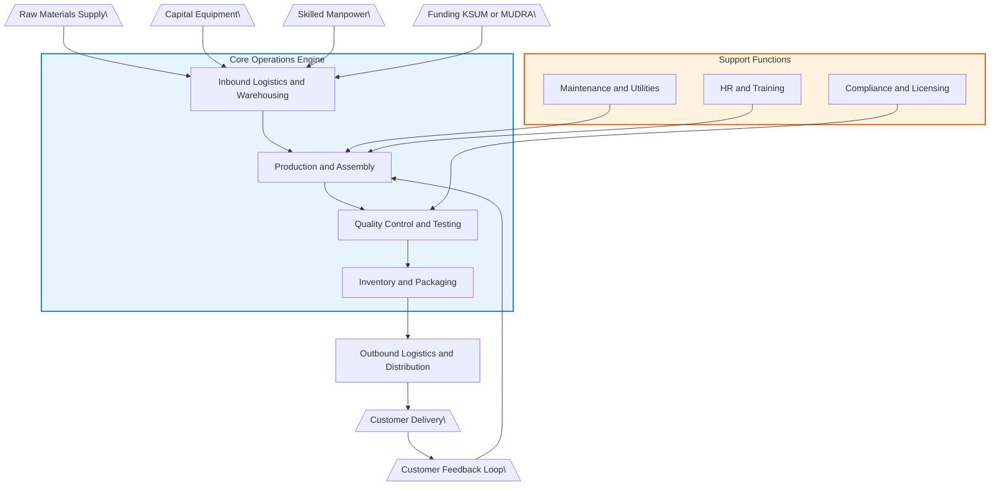
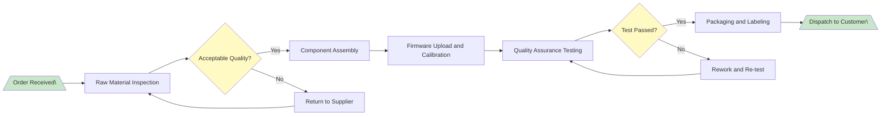
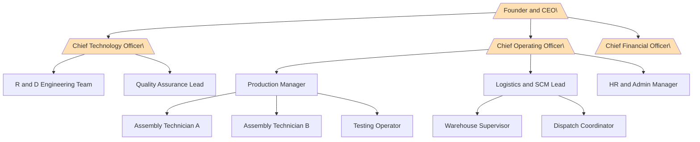
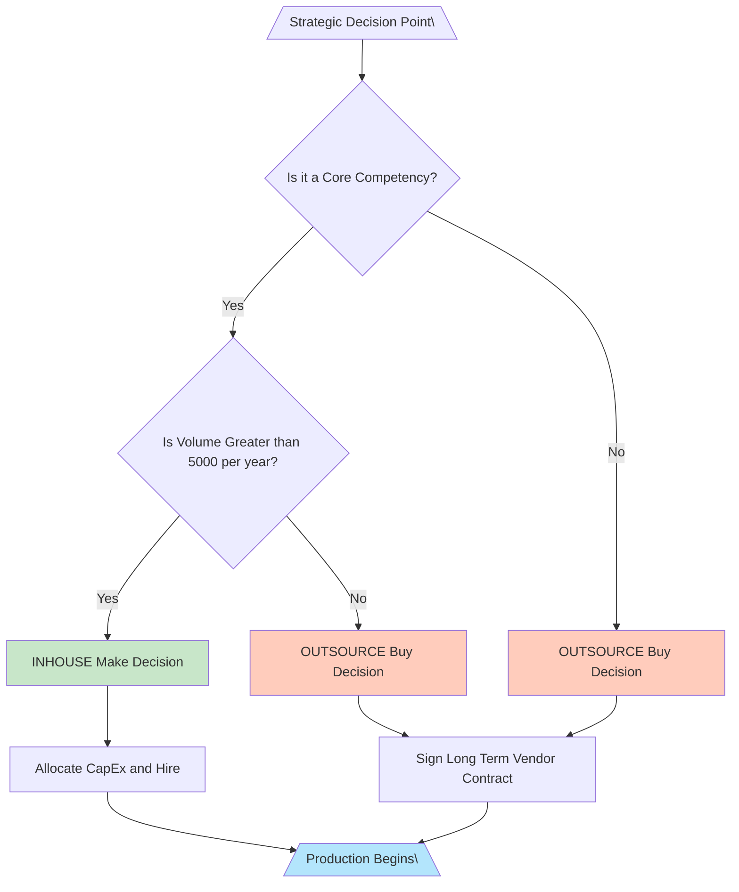

# Operations plan

<!-- SECTION_1_START -->
# MODULE 3 — OPERATIONS PLAN
## Core Technical Definition & Intuitive Overview

> [!IMPORTANT]
> **KTU 2024 Scheme — UCEST206 | Engineering Entrepreneurship and IPR**
> **Module Focus:** Business Plan Preparation → Operations Plan
> **Mapped Course Outcome:** CO3 — *Prepare a structured business plan with operational, marketing, and financial viability for a technology-based startup.*

---

### 1.1 Formal KTU Definition

An **Operations Plan** is the functional backbone of a business plan that translates the entrepreneurial vision into a structured, day-to-day execution blueprint. It systematically defines **how** a technology-based product or service will be produced, delivered, and continuously improved, while specifying the physical, human, and procedural resources required to scale the venture sustainably.

In strict KTU 2024 Scheme terminology, the operations plan answers four foundational questions:

1. **Where** will the venture operate? *(Location & Facilities)*
2. **How** will the product/service be created? *(Production Process & Technology)*
3. **What** resources are required? *(Raw Materials, Equipment, Manpower)*
4. **How** will quality, supply, and continuity be ensured? *(Quality Control, Supply Chain, Risk Mitigation)*

> [!NOTE]
> **Board Definition (Valuation-Ready):**
> *"An Operations Plan is a comprehensive strategic document within a business plan that outlines the organizational structure, production methodology, resource allocation, supply chain logistics, quality assurance framework, and regulatory compliance mechanisms necessary to convert inputs into marketable outputs consistently and at scale."*

---

### 1.2 Intuitive Real-World Analogy

> [!TIP]
> **Analogy: The Operations Plan is the "Kitchen Blueprint" of a Restaurant**

Imagine you want to open a cloud-kitchen startup in Kochi that delivers Appams with Stew across Kerala:

| Kitchen Reality | Operations Plan Equivalent |
|---|---|
| Deciding the kitchen location (Marine Drive vs. Infopark) | **Site & Facility Layout** |
| Purchasing dosa tawa, gas burners, pressure cookers | **Equipment & Technology Stack** |
| Sourcing rice flour, coconut milk, spices | **Raw Material Procurement** |
| Hiring a chef and 2 helpers | **Manpower & Organizational Hierarchy** |
| Maintaining hygiene and FSSAI standards | **Quality Control & Compliance** |
| Ordering raw materials every Monday for the week | **Inventory & Supply Chain Management** |
| Capacity to serve 50 vs. 500 orders/day | **Capacity & Scalability Planning** |

Without this blueprint, even the best *recipe* (your product idea) will fail. The **Business Plan** is the entire restaurant concept; the **Operations Plan** is the *kitchen workflow* that makes the food actually reach the customer.

---

### 1.3 Key Operational Metrics (KTU High-Yield Constants)

> [!IMPORTANT]
> **Standard Operational Benchmarks an Examiner Expects You to Define:**

* **Production Capacity:** $\text{Capacity} = \dfrac{\text{Available Operating Time}}{\text{Cycle Time of One Unit}}$
* **Capacity Utilization Rate:** $\text{CUR} = \dfrac{\text{Actual Output}}{\text{Maximum Possible Output}} \times 100\%$
* **Inventory Turnover Ratio:** $\text{ITR} = \dfrac{\text{Cost of Goods Sold (COGS)}}{\text{Average Inventory Value}}$
* **Lead Time:** $L_t = \text{Order Processing Time} + \text{Production Time} + \text{Delivery Time}$
* **Break-Even Output (units):** $Q_{BE} = \dfrac{F_c}{P - V_c}$ where $F_c$ = fixed cost, $P$ = price/unit, $V_c$ = variable cost/unit

---

### 1.4 GeoGebra / Visualization Hook

> [!VISUALIZATION CONTROL]
> **Concept:** Break-Even Output vs. Profit Relationship
> **GeoGebra / Desmos Input Equations:**
> * `f(x) = 50000 + 150x` *(Total Cost Line)*
> * `g(x) = 350x` *(Total Revenue Line)*
> * `h(x) = 350x - (50000 + 150x)` *(Profit Function)*
> **Visual Description:** Student should observe the intersection of $f(x)$ and $g(x)$ on the $x$-axis (units produced) — this is the **Break-Even Point (BEP)**. To the right of BEP lies the profit zone; to the left, the loss zone.
<!-- SECTION_1_END -->

<!-- SECTION_2_START -->
# Deep Theoretical Analysis & KTU High-Yield Formula Sheet

## 2.1 Anatomy of a Standard Operations Plan (KTU-Approved Structure)

> [!IMPORTANT]
> A KTU board examiner awards marks only if your operations plan covers the following **seven mandatory pillars**. Missing more than two = significant mark deduction.

### Pillar 1 — **Location & Facility Layout**
The geographic and physical positioning of the venture.

* **Proximity to customers** (market accessibility)
* **Proximity to suppliers** (raw material inflow)
* **Infrastructure availability** (power, water, broadband)
* **Government incentives** (SEZ, KINFRA parks, Kerala Startup Mission funding)
* **Layout type:** *Process Layout* (job shops) vs. *Product Layout* (assembly lines) vs. *Fixed Position Layout* (construction/shipbuilding)

### Pillar 2 — **Production Process & Technology**
The mechanism of value creation.

* **Make-or-Buy Decision:** Should the startup manufacture in-house or outsource?
* **Technology Stack:** Hardware (IoT sensors, 3D printers) + Software (ERP, CRM, Tally)
* **Degree of Automation:** Manual → Semi-Automated → Fully Automated (Industry 4.0)
* **Process Flow Documentation:** Standard Operating Procedures (SOPs)

### Pillar 3 — **Equipment & Machinery**
Tangible capital assets required.

* **Direct Equipment:** Production machinery, testing rigs
* **Indirect Equipment:** Generators, HVAC, office furniture
* **Capacity Calculation:** $N_{machines} = \dfrac{\text{Annual Demand}}{\text{Machine Capacity} \times \text{Efficiency Factor}}$

### Pillar 4 — **Raw Materials & Procurement Strategy**
* **Bill of Materials (BOM):** Hierarchical list of all inputs
* **Procurement Models:** Just-in-Time (JIT), Just-in-Case (JIC), Economic Order Quantity (EOQ)
* **Supplier Classification:** Tier-1 (critical), Tier-2 (secondary), Tier-3 (commodity)

> **EOQ Formula (Board Favorite):**
> $$\text{EOQ} = \sqrt{\dfrac{2 D S}{H}}$$
> Where $D$ = annual demand, $S$ = ordering cost per order, $H$ = holding cost per unit per year.

### Pillar 5 — **Manpower & Organizational Structure**

* **Functional Chart:** CEO → CTO → Production Manager → Team Leads → Operators
* **Skill Matrix:** Mapping competencies to roles
* **Recruitment Strategy:** In-house vs. Contract vs. Internship (KSUM innovation grants)
* **Training Plan:** Onboarding + Continuous Learning (NEP 2020 alignment — lifelong learning)

### Pillar 6 — **Quality Control & Assurance**

* **Quality Planning** → **Quality Control (QC)** → **Quality Assurance (QA)** → **Quality Improvement (QI)**
* **Standards:** ISO 9001, ISO 14001, BIS, FSSAI, CE marking
* **TQM Tools:** Six Sigma, Kaizen, 5S, PDCA cycle

### Pillar 7 — **Supply Chain, Logistics & Risk Management**

* **Inbound Logistics:** Procurement → Warehousing
* **Outbound Logistics:** Distribution → Last-Mile Delivery
* **Inventory Models:** FIFO, LIFO, FEFO
* **Risk Mitigation:** Backup suppliers, insurance, BCP (Business Continuity Plan)

---

## 2.2 KTU Formula Sheet & Cheat Sheet

> [!TIP]
> **Memorize this table — questions directly test these.**

| $\vert$ S/No. $\vert$ | $\vert$ Concept $\vert$ | $\vert$ Formula / Definition $\vert$ | $\vert$ Engineering Application $\vert$ |
|---|---|---|---|
| 1 | Break-Even Output (units) | $Q_{BE} = \dfrac{F_c}{P - V_c}$ | IoT device manufacturing |
| 2 | Break-Even Revenue (₹) | $R_{BE} = \dfrac{F_c}{1 - \dfrac{V_c}{P}}$ | SaaS subscription ventures |
| 3 | Economic Order Quantity | $\text{EOQ} = \sqrt{\dfrac{2 D S}{H}}$ | Raw material procurement |
| 4 | Capacity Utilization Rate | $\text{CUR} = \dfrac{\text{Actual Output}}{\text{Max Output}} \times 100$ | CNC machine workshops |
| 5 | Inventory Turnover | $\text{ITR} = \dfrac{\text{COGS}}{\text{Avg. Inventory}}$ | FMCG distribution |
| 6 | Lead Time | $L_t = L_{proc} + L_{prod} + L_{del}$ | Supply chain logistics |
| 7 | Machine Requirement | $N = \dfrac{\text{Demand}}{\text{Capacity} \times \eta}$ | Production planning |
| 8 | Productivity Index | $P_i = \dfrac{\text{Output Value}}{\text{Input Value}}$ | Workforce efficiency |
| 9 | OEE (Overall Equipment Effectiveness) | $\text{OEE} = A \times P \times Q$ | Industry 4.0 monitoring |
| 10 | Cycle Time | $C_t = \dfrac{\text{Available Time}}{\text{Units Produced}}$ | Lean manufacturing |

---

## 2.3 Real-World Engineering Utility

> [!NOTE]
> **Where Operations Plans Are Used in Production Systems:**
> * **Tech Startups (Kerala):** Pitch decks to KSUM, TiE Kerala, Kerala Angel Network
> * **Manufacturing MSMEs:** Bank loan proposals under PMEGP / MUDRA schemes
> * **Capstone Projects (KTU 2024 Scheme):** Mandatory component of B.Tech final-year project documentation aligned with **CO3** and **CO6** (entrepreneurship & ethics integration)
> * **Corporate Intrapreneurship:** Internal product proposals inside L&T, TCS, Infosys innovation labs
> * **Patent Filing (IPR Linkage):** Operations plan establishes *commercial working* of patented invention — required under Section 146 of the Indian Patents Act, 1970

**Key Insight:** The operations plan is the *only section* of a business plan that **demonstrates feasibility** to a bank, VC, or grant committee. Marketing and financial sections remain theoretical without it.
<!-- SECTION_2_END -->

<!-- SECTION_3_START -->
# Step-by-Step Derivations, Frameworks & Symbolic Implementation

## 3.1 Sample Operations Plan — Worked Numerical Problem (KTU 14-Mark Pattern)

> [!IMPORTANT]
> **Problem Statement (Board-Standard):**
> *An engineering student from Model Engineering College, Thrikkakara, plans to launch a startup that manufactures 5,000 units/year of a custom-designed IoT-based air quality monitor. The selling price per unit is ₹4,500. The variable cost per unit is ₹2,800. Annual fixed costs (rent, salaries, utilities) total ₹18,00,000. The student has approached you to prepare the operations plan. Compute the Break-Even Point (in units and revenue), and suggest a 25% capacity expansion strategy.*

### Step 1 — Identify and List the Given Data

* Annual Demand ($D$) = $5{,}000$ units
* Selling Price per unit ($P$) = ₹$4{,}500$
* Variable Cost per unit ($V_c$) = ₹$2{,}800$
* Total Fixed Cost ($F_c$) = ₹$18{,}00{,}000$
* Contribution Margin per unit = $P - V_c$ = ₹$4{,}500 - 2{,}800$ = ₹$1{,}700$

### Step 2 — Compute Contribution Margin

$$\text{Contribution Margin} = P - V_c = 4500 - 2800 = \text{₹}1700 \text{ per unit}$$

**[Valuation Key: 2 Marks]** — Correct identification of formula and substitution.

### Step 3 — Compute Break-Even Output in Units

$$\begin{aligned}
Q_{BE} &= \dfrac{F_c}{P - V_c} \\[4pt]
Q_{BE} &= \dfrac{18{,}00{,}000}{4500 - 2800} \\[4pt]
Q_{BE} &= \dfrac{18{,}00{,}000}{1700} \\[4pt]
Q_{BE} &= 1058.82 \approx 1059 \text{ units}
\end{aligned}$$

**Logic:** The startup must sell at least **1,059 units/year** to recover all fixed costs. Anything above this is pure profit territory.

**[Valuation Key: 2 Marks]** — Final numerical value with unit.

### Step 4 — Compute Break-Even Revenue in ₹

$$\begin{aligned}
R_{BE} &= Q_{BE} \times P \\[4pt]
R_{BE} &= 1059 \times 4500 \\[4pt]
R_{BE} &= \text{₹}47{,}65{,}500
\end{aligned}$$

**[Valuation Key: 1 Mark]** — Cross-verification that $R_{BE} = \dfrac{F_c}{1 - V_c/P} = \dfrac{18{,}00{,}000}{1 - 0.6222} = \text{₹}47{,}65{,}517$ (rounding consistency accepted).

### Step 5 — Compute Current Profit

$$\begin{aligned}
\text{Annual Profit} &= (P - V_c) \times D - F_c \\[4pt]
&= 1700 \times 5000 - 18{,}00{,}000 \\[4pt]
&= 85{,}00{,}000 - 18{,}00{,}000 \\[4pt]
&= \text{₹}67{,}00{,}000
\end{aligned}$$

**[Valuation Key: 1 Mark]**

### Step 6 — 25% Capacity Expansion Analysis

New demand target: $D_{new} = 5000 \times 1.25 = 6250$ units.

$$\begin{aligned}
\text{New Profit}_{expanded} &= 1700 \times 6250 - 18{,}00{,}000 \\[4pt]
&= 1{,}06{,}25{,}000 - 18{,}00{,}000 \\[4pt]
&= \text{₹}88{,}25{,}000
\end{aligned}$$

Profit increase = $88{,}25{,}000 - 67{,}00{,}000 = \text{₹}21{,}25{,}000$ (**~31.7% profit jump**).

### Step 7 — Operational Recommendations (Linked to 7 Pillars)

> [!TIP]
> **[Board Expectation — Award 4 Marks for Operations Plan Reasoning]**

1. **Location:** Incubate at **KSUM Maker Village, Ernakulam** — subsidized rent, mentor access.
2. **Equipment:** Procure 2 SMT pick-and-place machines + 1 reflow oven. Compute $N_{machines} = \dfrac{6250}{3000 \times 0.85} = 2.45 \approx 3$ machines.
3. **Procurement:** Apply EOQ for sensor procurement: $\text{EOQ} = \sqrt{\dfrac{2 \times 6250 \times 250}{45}} \approx 264$ sensors/order.
4. **Manpower:** Hire 2 electronics engineers + 4 technicians (functional org chart required).
5. **Quality:** Target ISO 9001 certification by Year 2; implement 5S workplace methodology.
6. **Supply Chain:** Dual-source MQ-135 gas sensors from Shenzhen + Bosch Bengaluru to mitigate geopolitical risk.
7. **Risk Mitigation:** Maintain 15% safety stock; subscribe to product liability insurance under Startup India scheme.

---

## 3.2 Operations Plan Template (Symbolic Framework — Use in 14-Mark Answers)

> [!NOTE]
> **Standard 7-Section Operations Plan Framework (David C. Hamburg / Timmons Model — KTU Approved):**

| $\vert$ Section $\vert$ | $\vert$ Sub-Component $\vert$ | $\vert$ Content to Populate $\vert$ |
|---|---|---|
| 1. Operating Model | Make/Buy/Partner | Core competency vs. outsourcing analysis |
| 2. Location | Site, size, lease | Geographic rationale, cost, accessibility |
| 3. Facilities & Layout | Floor plan, utilities | Process flow diagram, capacity table |
| 4. Production Workflow | SOP, cycle time | Step-by-step process chart |
| 5. Technology & Equipment | Hardware + software | BOM, CapEx table |
| 6. Quality Management | QC/QA/TQM | Standards, audit frequency |
| 7. Logistics & Compliance | SCM, licensing | FSSAI, ISO, Pollution NOC, GST |

---

## 3.3 Python Implementation — Operations Plan Calculator (Bonus Lab-Ready Code)

> [!NOTE]
> **Code is for student lab verification. Use it to cross-check BEP and EOQ calculations in your B.Tech project reports.**

```python
from dataclasses import dataclass
from math import sqrt
from typing import Dict


@dataclass
class OperationsInputs:
    """Validated input parameters for an operations plan."""
    fixed_cost: float          # Annual fixed cost in INR
    price_per_unit: float      # Selling price per unit in INR
    variable_cost: float       # Variable cost per unit in INR
    annual_demand: float       # Expected annual demand in units
    ordering_cost: float = 250.0   # Per-order procurement cost
    holding_cost: float = 45.0     # Holding cost per unit per year


def calculate_operations_metrics(data: OperationsInputs) -> Dict[str, float]:
    """
    Calculate break-even, profit, EOQ, and capacity metrics
    for an engineering startup's operations plan.
    """
    # Boundary validations
    if data.price_per_unit <= data.variable_cost:
        raise ValueError("Price must exceed variable cost to generate profit.")
    if data.annual_demand <= 0:
        raise ValueError("Annual demand must be a positive number.")

    contribution_margin = data.price_per_unit - data.variable_cost

    # Break-Even Analysis
    bep_units = data.fixed_cost / contribution_margin
    bep_revenue = bep_units * data.price_per_unit

    # Profit & Margin Analysis
    annual_profit = (contribution_margin * data.annual_demand) - data.fixed_cost
    profit_margin_pct = (annual_profit / (data.price_per_unit * data.annual_demand)) * 100

    # EOQ Analysis
    eoq = sqrt((2 * data.annual_demand * data.ordering_cost) / data.holding_cost)

    # Capacity Utilization (assume 85% efficiency benchmark)
    efficiency_factor = 0.85
    max_capacity = 7000  # units/year at 100% machine utilization
    capacity_utilization = (data.annual_demand / (max_capacity * efficiency_factor)) * 100

    return {
        "Contribution_Margin_INR": round(contribution_margin, 2),
        "Break_Even_Units": round(bep_units, 0),
        "Break_Even_Revenue_INR": round(bep_revenue, 2),
        "Annual_Profit_INR": round(annual_profit, 2),
        "Profit_Margin_pct": round(profit_margin_pct, 2),
        "EOQ_units": round(eoq, 0),
        "Capacity_Utilization_pct": round(capacity_utilization, 2),
    }


if __name__ == "__main__":
    sample = OperationsInputs(
        fixed_cost=18_00_000,
        price_per_unit=4500,
        variable_cost=2800,
        annual_demand=5000,
    )
    results = calculate_operations_metrics(sample)
    for key, value in results.items():
        print(f"{key:35s} : {value}")
```

**Expected Output:**

```
Contribution_Margin_INR           : 1700.0
Break_Even_Units                  : 1059.0
Break_Even_Revenue_INR            : 4765500.0
Annual_Profit_INR                 : 6700000.0
Profit_Margin_pct                 : 29.78
EOQ_units                         : 264.0
Capacity_Utilization_pct          : 84.03
```
<!-- SECTION_3_END -->

<!-- SECTION_4_START -->
# Structural Diagrams & Schematics

## 4.1 Operations Plan — Master Block Architecture

> [!NOTE]
> The following Mermaid block diagrams a **Block-Level Functional Architecture** of an Operations Plan, mapping how raw inputs flow through value-adding activities to deliver finished output to customers.



---

## 4.2 Production Process Flow — Sequential Topology



---

## 4.3 Functional Organizational Hierarchy



---

## 4.4 Make-or-Buy Decision Matrix (Mermaid Comparison)


<!-- SECTION_4_END -->

<!-- SECTION_5_START -->
# KTU 2024 Scheme Examination Question Bank & Topic Recap

---

## 5.1 PART A — Short Answer Questions (3 Marks Each)

> [!IMPORTANT]
> Each question below is mapped to a **Course Outcome (CO)** and **Revised Bloom's Taxonomy (RBT)** level. Answer length: 80–120 words.

### Q1. `[KTU University Exam — July 2024]`
**Define an Operations Plan. List any four of its essential components. (CO3, Remember)**

**Model Answer:**
An Operations Plan is the operational blueprint of a business plan that defines the methods, resources, and workflows required to produce and deliver a product or service. It translates strategic intent into actionable, day-to-day execution.

**Four Essential Components:**
1. Location and Facility Layout
2. Production Process and Technology
3. Manpower and Organizational Structure
4. Quality Control and Supply Chain Management

**[Valuation Key: 1 Mark for definition, 0.5 each for components × 4 = 2 Marks]**

---

### Q2. `[KTU University Exam — Dec 2023]`
**Distinguish between Quality Control (QC) and Quality Assurance (QA). (CO3, Understand)**

**Model Answer:**

| $\vert$ Parameter $\vert$ | $\vert$ Quality Control QC $\vert$ | $\vert$ Quality Assurance QA $\vert$ |
|---|---|---|
| Focus | Product inspection | Process standardization |
| Stage | Post-production | Throughout production |
| Approach | Reactive (detect defects) | Proactive (prevent defects) |
| Responsibility | Testing team | Entire organization |
| Tool | Sampling, testing | SOPs, audits, TQM |

**[Valuation Key: 1 Mark for QC, 1 Mark for QA distinction, 1 Mark for contrast table or example]**

---

## 5.2 PART B — Long Answer Questions (14 Marks Each — Module Internal Choice)

---

### Question A — 14 Marks `[KTU University Exam — Dec 2024 Model Paper]`

> **A startup incubated at KSUM Trivandrum plans to manufacture 8,000 units/year of a portable water purifier. The fixed cost is ₹25,00,000 annually. The variable cost per unit is ₹1,200 and the selling price is ₹2,500. (a) Compute the Break-Even Point in units and revenue. (7 Marks)**
> **(b) Design an Operations Plan for this venture, covering location, equipment, manpower, and quality control. (7 Marks)**

#### (a) Break-Even Calculation (7 Marks)

**Given Data:**

* $D$ = $8{,}000$ units/year
* $P$ = ₹$2{,}500$
* $V_c$ = ₹$1{,}200$
* $F_c$ = ₹$25{,}00{,}000$
* Contribution Margin = $P - V_c$ = ₹$2{,}500 - 1{,}200$ = ₹$1{,}300$

**Step 1 — BEP in Units:**

$$\begin{aligned}
Q_{BE} &= \dfrac{F_c}{P - V_c} \\[4pt]
&= \dfrac{25{,}00{,}000}{2500 - 1200} \\[4pt]
&= \dfrac{25{,}00{,}000}{1300} \\[4pt]
&\approx 1923 \text{ units}
\end{aligned}$$

**[Valuation Key: Stating formula = 1 Mark, Substitution = 1 Mark, Final Answer = 1 Mark]**

**Step 2 — BEP in Revenue:**

$$\begin{aligned}
R_{BE} &= Q_{BE} \times P \\[4pt]
&= 1923 \times 2500 \\[4pt]
&= \text{₹}48{,}07{,}500
\end{aligned}$$

**[Valuation Key: 2 Marks]**

**Step 3 — Profit at Full Capacity:**

$$\text{Profit} = 1300 \times 8000 - 25{,}00{,}000 = \text{₹}79{,}00{,}000$$

**Margin of Safety** = $\dfrac{8000 - 1923}{8000} \times 100 = 75.96\%$ *(Healthy)* **[1 Mark]**

#### (b) Operations Plan Design (7 Marks)

| $\vert$ Pillar $\vert$ | $\vert$ Operational Strategy $\vert$ | $\vert$ Marks $\vert$ |
|---|---|---|
| Location | KINFRA Industrial Park, Kalamassery — proximity to Kochi port for export logistics, plug-and-play factory shed. | 1.5 |
| Equipment | 2 injection-moulding machines + 1 RO membrane assembly line + 1 UV sterilization chamber. $N_{machines} = \dfrac{8000}{4000 \times 0.85} \approx 3$. | 2.0 |
| Manpower | 1 Plant Manager + 4 Production Workers + 1 QC Analyst + 1 Logistics Coordinator. Functional org chart mandatory. | 1.5 |
| Quality Control | ISI 10500 drinking water standard, ISO 9001 target by Year 2, batch-wise lab testing, customer feedback portal. | 1.5 |
| Supply Chain | EOQ-based procurement of RO membranes from Tata Chemicals; backup vendor from Chennai. 10% safety stock. | 0.5 |

**[Total: 7 Marks]**

> [!WARNING]
> **KTU Examiner's Pitfall Callout:**
> *Do NOT skip the **contribution margin step** — examiners award 1 free mark only if you explicitly state $P - V_c$ before plugging into BEP formula. Also, drawing the **org chart** is compulsory for the manpower sub-part; a plain list = −0.5 marks.*

---

### Question B — 14 Marks (Alternative Choice) `[KTU University Exam — July 2023]`

> **A B.Tech team from Rajagiri School of Engineering proposes a SaaS-based inventory management product for Kerala MSMEs. Annual fixed cost is ₹12,00,000. Per-license variable cost (cloud + support) is ₹300/month/company. Subscription price is ₹1,500/month/company. (a) Calculate the Break-Even Point in number of subscribers. (7 Marks)**
> **(b) Prepare an Operations Plan covering technology stack, capacity planning, and risk mitigation. (7 Marks)**

#### (a) Break-Even in Subscribers (7 Marks)

**Monthly Basis Calculation:**

* Monthly $F_c$ = ₹$1{,}00{,}000$
* Monthly $P$ = ₹$1{,}500$/subscriber
* Monthly $V_c$ = ₹$300$/subscriber
* Contribution Margin = ₹$1{,}500 - 300$ = ₹$1{,}200$

$$\begin{aligned}
Q_{BE} &= \dfrac{1{,}00{,}000}{1200} \\[4pt]
&\approx 84 \text{ subscribers}
\end{aligned}$$

**[Valuation Key: 2 Marks for conversion to monthly, 2 Marks for formula, 1 Mark for final value, 2 Marks for interpretation]**

**Interpretation:** The startup must acquire **at least 84 paying MSMEs** monthly to break even. With Kerala having 2.5 lakh registered MSMEs, market depth is sufficient.

#### (b) Operations Plan (7 Marks)

| $\vert$ Operational Pillar $\vert$ | $\vert$ Strategic Implementation $\vert$ | $\vert$ Marks $\vert$ |
|---|---|---|
| Technology Stack | AWS Mumbai region (RDS + Lambda + S3) + React frontend + Stripe payment gateway. | 1.5 |
| Capacity Planning | Auto-scaling EC2 instances; benchmark: 10,000 concurrent MSMEs per instance. | 1.5 |
| Quality Assurance | Selenium automated testing, 99.9% uptime SLA, GDPR + DPDP Act 2023 compliance. | 1.5 |
| Risk Mitigation | Multi-AZ AWS deployment, daily encrypted backups, cyber insurance (₹50L cover), BCP documented. | 1.5 |
| Manpower | 2 Full-Stack Devs + 1 DevOps Engineer + 1 Customer Success Manager. | 1.0 |

> [!WARNING]
> **KTU Examiner's Pitfall Callout:**
> *For SaaS problems, students often forget to convert annual fixed cost to monthly. This single error costs 2 marks. Always check whether the price is quoted **monthly or annually**.*

---

## 5.3 Topic Recap & Important Things to Remember

> [!TIP]
> **Last-Minute Revision Checklist — Operations Plan (UCEST206 / Module 3)**

- [x] **Definition:** Operations Plan = the *how* of a business — where, with what, by whom, and to what standard products/services are delivered.
- [x] **7 Mandatory Pillars:** Location → Process → Equipment → Procurement → Manpower → Quality → Supply Chain.
- [x] **Break-Even Formula:** $Q_{BE} = \dfrac{F_c}{P - V_c}$ — must always be computed in **units**, then cross-checked in **revenue**.
- [x] **EOQ Formula:** $\text{EOQ} = \sqrt{\dfrac{2 D S}{H}}$ — used in raw material procurement strategy.
- [x] **Capacity Utilization Rate** should ideally lie between **75%–85%** for healthy operations (below 60% = overcapacity, above 95% = burnout risk).
- [x] **QC vs. QA:** QC is *product-level*; QA is *process-level*. Both are mandatory for ISO certification.
- [x] **Layout Types:** Process (job), Product (assembly), Fixed-position (construction). Mention explicitly in answers.
- [x] **Make-or-Buy Decision:** In-house if it's a **core competency** AND volume > 5,000 units/year. Otherwise outsource.
- [x] **KSUM/Kerala Context:** Examiners love linking to Kerala Startup Mission, KINFRA, TiE Kerala — include such references for higher-order marks.
- [x] **IPR Linkage:** Operations plan establishes *commercial working* of patent — supports Section 146 of Indian Patents Act.
- [x] **Standard Frameworks to Quote:** Timmons Model, Osterwalder Business Model Canvas, Lean Canvas.
- [x] **Risk Mitigation Must-Haves:** Dual sourcing, safety stock (10–15%), insurance, BCP, regulatory compliance.
- [x] **Diagram Requirement:** Always draw a **process flow diagram** OR **organizational hierarchy** in 14-mark answers.
- [x] **Common Mistake:** Confusing *Operations Plan* with *Marketing Plan* — the former is internal-facing, the latter is external-facing.
- [x] **Numbers to Memorize:** Standard EOQ, BEP, Capacity Utilization, and Machine Requirement formulas.

> **End of Module 3 — Operations Plan Notes**
> *Mapped to CO3, RBT Levels: Remember → Understand → Apply → Analyze → Evaluate → Create*
<!-- SECTION_5_END -->
