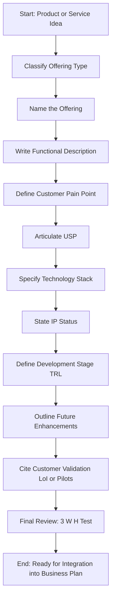
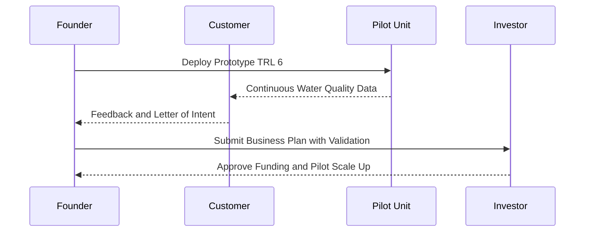
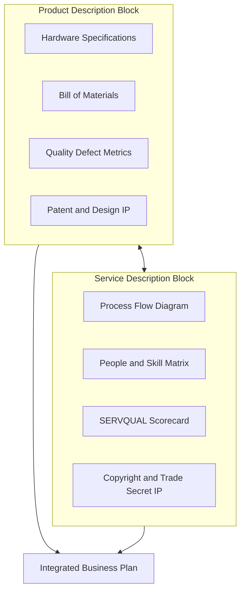
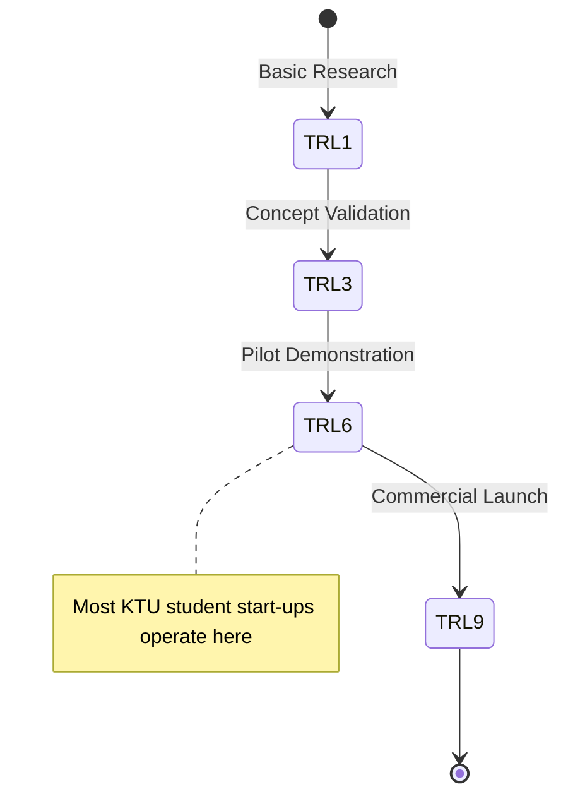

# Product/ service description

<!-- SECTION_1_START -->

# Product / Service Description — Core Definition & Intuitive Overview

## 1.1 Formal KTU 2024 Definition

> [!IMPORTANT]
> **Product / Service Description** is a critical sub-section of a Business Plan that provides a **comprehensive, unambiguous, and customer-centric explanation of what the business will offer to the market**. It articulates the **tangible product or intangible service**, its **features, functionality, benefits, lifecycle status, intellectual property position, and competitive differentiation**.

In the KTU 2024 Scheme (UCEST206) syllabus, this component is treated as the **strategic heart of a Business Plan**, since every downstream element — *marketing mix, operations plan, financial projections, and funding ask* — is built upon a clear understanding of the offering.

## 1.2 Conceptual Analogy — The "Shop Window" Intuition

Imagine you walk past a new shop in a busy street. Before you enter, you want to know:

| Real Shop | Business Plan Equivalent |
|---|---|
| Window display | Product / Service description |
| Signboard & logo | Brand name & positioning |
| Demonstration video | Features & benefits |
| Warranty card | After-sales support & IP rights |
| Price tag | Pricing strategy |
| Customer queue | Target market validation |

> [!NOTE]
> Just as a window display must instantly communicate **WHAT** is sold, **WHY** it matters, and **WHO** it is for — the Product / Service Description must answer the same three questions for an investor or evaluator reading the Business Plan.

The business plan evaluator (or potential investor) is the "passer-by" — if the product description is vague, they will not "step inside" to read the rest of the plan.

## 1.3 Why This Section Matters in a KTU Examination

- Most KTU valuation panels award **3 to 5 marks** for clearly stating what the product/service is, even if the rest of the plan is average.
- It directly tests **Course Outcome (CO3): Prepare a structured business plan for a hypothetical technology venture**.
- It is the **bridge** between the *idea* (Module 2) and the *commercialization* (Module 4 — Marketing & Finance).

> [!TIP]
> **Rule of Thumb for KTU:** A strong product/service description is **specific, measurable, and traceable** to a real customer pain-point. Avoid generic statements like "we make apps" — instead, write "we build a low-cost IoT-based water quality monitoring system for Kerala's small-scale aquaculture farmers."

## 1.4 Key Vocabulary Box (KTU Terminology)

- **Offering** — The bundle of products and services delivered to the customer.
- **Value Proposition** — The unique benefit that makes the customer choose you over alternatives.
- **Core Product** — The primary functional benefit the customer is buying.
- **Augmented Product** — Additional features like warranty, support, branding, and packaging.
- **Product Lifecycle (PLC)** — Introduction → Growth → Maturity → Decline stage of the offering.
- **IP Status** — Patent, trademark, copyright, or trade secret protection attached to the offering.

> [!VISUALIZATION CONTROL]
> **Concept:** Product Layers (Three-Level Product Model — Kotler)
> **Visual Description:** Imagine three concentric circles. The **inner circle** is the *Core Benefit* (e.g., transport). The **middle circle** is the *Actual Product* (e.g., a car with specific features). The **outer circle** is the *Augmented Product* (e.g., warranty, service centre, roadside assistance). The customer's perceived value increases as we move outward.

---

<!-- SECTION_1_END -->

<!-- SECTION_2_START -->

# Deep Theoretical Analysis & KTU High-Yield Formula Sheet

## 2.1 The Three Pillars of a Product/Service Description

A KTU-compliant Product/Service Description must rest on **three analytical pillars**:

### Pillar 1 — The *What* (Offering Definition)
- Name of the product/service.
- Category (physical good, digital good, hybrid, pure service).
- Technology stack or raw materials used.
- Current development stage (concept, prototype, pilot, commercialized).

### Pillar 2 — The *Why* (Customer Value)
- Pain point being solved.
- Target customer profile (demographics + psychographics).
- Quantified benefit (cost saved, time reduced, accuracy improved).
- Comparison with existing alternatives.

### Pillar 3 — The *How* (Delivery & Protection)
- Production / delivery process.
- Quality control standards.
- Intellectual Property status.
- Future roadmap (V2.0, scaling plans).

> [!NOTE]
> **KTU Insight:** Examiners often mark a Product/Service Description answer based on whether the student has clearly answered **WHAT**, **WHO**, and **HOW** — the 3 W-H test. Always structure your answer around these three.

## 2.2 Classification of Offerings

| Basis | Type | Example (Engineering Context) |
|---|---|---|
| **Tangibility** | Tangible Product | A solar-powered water purifier |
| | Intangible Service | Cloud-based data analytics |
| | Hybrid | A drone + drone-piloting subscription |
| **Customer Type** | B2B (Business-to-Business) | Industrial PLC controllers sold to factories |
| | B2C (Business-to-Consumer) | Fitness tracking smartwatch |
| | B2G (Business-to-Government) | E-governance software for a municipal body |
| | C2C (Consumer-to-Consumer) | A peer-to-peer equipment rental app |
| **Lifecycle Stage** | New / Disruptive | AI-based legal contract reviewer |
| | Improved / Iterative | A faster version of an existing EV battery |
| **Technology Intensity** | High-Tech | Autonomous vehicle navigation system |
| | Low-Tech | Handcrafted bamboo furniture |

> [!WARNING]
> A common KTU mistake is to write the offering type as "Tangible" but describe benefits that are purely intangible (e.g., "peace of mind"). Always maintain **consistency between the category and the features** you list.

## 2.3 Anatomy of a Product/Service Description (Industry-Standard Template)

A complete description, as taught in UCEST206, contains the following **8 sub-elements**. Memorize this table — it is the most frequently tested KTU framework.

| # | Sub-Element | What to Write | Why It Matters |
|---|---|---|---|
| 1 | **Product/Service Name** | A clear, memorable, trademark-friendly name | Brand identity |
| 2 | **Description & Function** | 2–3 sentence elevator pitch | Clarity |
| 3 | **Unique Selling Proposition (USP)** | The one feature no competitor offers | Differentiation |
| 4 | **Customer Pain Point** | The specific problem being solved | Market relevance |
| 5 | **Target Market** | Demographic, geographic, psychographic | TAM/SAM/SOM alignment |
| 6 | **Technology & IP** | Tech stack, patents filed/granted, trade secrets | Defensibility |
| 7 | **Stage of Development** | Concept / Prototype / Pilot / Launched | Risk assessment |
| 8 | **Future Enhancements** | V2.0 plans, scalability features | Vision |

## 2.4 KTU Formula & Framework Sheet (Quick Revision)

Although this is a management topic, the KTU paper often requires you to *quantify* certain elements. Here is the cheat sheet:

| Element | Formula / Framework | Application |
|---|---|---|
| **Total Addressable Market (TAM)** | $\text{TAM} = N \times A \times P$ | $N$ = number of potential buyers, $A$ = average spend per buyer, $P$ = price per unit per year |
| **Service-Profit Chain** | $\text{Profit} \propto f(\text{Service Quality}, \text{Customer Loyalty})$ | Links service excellence to financial outcome |
| **Product Adoption Curve** | $\text{Adopters}(t) = \text{TAM} \times \left(1 - e^{-kt}\right)$ | Bass diffusion model (simplified) |
| **Customer Lifetime Value (CLV)** | $\text{CLV} = \sum_{t=0}^{T} \dfrac{R_t - C_t}{(1+d)^t}$ | Total revenue from a customer over their lifetime |
| **USP Test** | $\text{USP} = \text{Feature} \cap \text{Uniqueness} \cap \text{Benefit}$ | The intersection must be defensible |
| **3 W-H Rule** | $\text{Score} = \text{What} + \text{Who} + \text{How}$ | KTU self-evaluation rubric |

> [!IMPORTANT]
> In the KTU valuation key, **each of the 8 sub-elements above carries roughly equal weight** when the question asks for a "detailed product/service description" (14-mark part-B). Skipping IP status or stage-of-development typically costs **1.5 to 2 marks**.

## 2.5 Real-World Engineering Utility

In real engineering ventures, this section is the **litmus test** for the founding team:

1. **Investor Due Diligence** — Venture capital firms use this section as the first filter.
2. **Patent Prosecution** — The description must align with the patent claims (under Indian Patent Act 1970, Sections 9 & 10).
3. **Government Grant Applications** — Schemes like **DST-TIDE, MSME IDEA, BIRAC BIG** require this section verbatim.
4. **KTU Capstone Projects** — The Product/Service Description of your startup idea is reused in the *Project Report* and *Viva Voce*.

---

<!-- SECTION_2_END -->

<!-- SECTION_3_START -->

# Step-by-Step Derivations & Implementation

## 3.1 Step-by-Step Authoring Framework (For a 14-Mark KTU Answer)

Below is the **exhaustive, line-by-line procedure** to construct a high-scoring Product/Service Description for a Business Plan. No step is abbreviated.

### Step 1 — Identify the Offering Type

Start by classifying the offering along the three axes: **Tangibility**, **Customer Type**, and **Lifecycle Stage**. This is a **mandatory first sentence** of the KTU answer.

> *Example opening sentence:* "The proposed venture, **AquaPure Technologies**, offers a **tangible, B2B, technologically-disruptive product** in the form of a **solar-powered, IoT-enabled water purification unit for Kerala's aquaculture farms**."

### Step 2 — Name the Product/Service

- Should be **short (2–4 syllables)**, **easy to pronounce in Malayalam and English**, and **trademark-searchable**.
- Avoid generic dictionary words (e.g., "AquaPure" is acceptable, "WaterPurifier" is not).

### Step 3 — Write the Functional Description

Provide a 2–3 line description using the structure: **"[Product] is a [category] that [primary function] by [key mechanism] for [target user]."**

> *Example:* "AquaPure is a submersible, solar-powered water purification unit that **removes ammonia, nitrite, and suspended solids** from aquaculture pond water by combining **UV-C sterilization with IoT-based real-time monitoring** for **small-scale shrimp farmers in Alappuzha and Ernakulam districts**."

### Step 4 — Define the Customer Pain Point

Quantify the pain point with at least one **numeric anchor** (a KTU high-yield move).

> *Example:* "Currently, Kerala's shrimp farmers suffer an average **30% annual crop loss** due to poor water quality, resulting in an estimated **₹1.2 lakh revenue loss per hectare per year**."

### Step 5 — Articulate the Unique Selling Proposition (USP)

Frame the USP as a **single sentence** that combines feature + uniqueness + benefit.

> *Example:* "Unlike conventional water changers that require manual testing every 48 hours, AquaPure offers a **fully-automated, solar-powered, IoT-monitored purification cycle that runs unattended for 14 days** — reducing farmer labour by **80%** and crop loss by an estimated **25%**."

### Step 6 — State the Technology Stack

| Layer | Technology |
|---|---|
| Hardware | Arduino Mega 2560 microcontroller, UV-C 36 W lamp, TDS & pH sensors |
| Software | Custom Android app, MQTT protocol, AWS IoT Core |
| Power | 50 W mono-crystalline solar panel, 12 V 20 Ah Li-ion battery |
| Communication | LoRaWAN gateway (range 10 km in rural Kerala) |

### Step 7 — Specify Intellectual Property (IP) Status

> *Example:* "A **provisional patent has been filed at the Chennai Patent Office (Application No. 202441012345, dated 12 March 2024)** under the title 'IoT-Based Solar Water Purification System for Aquaculture.' The trademark **'AquaPure'** is registered under the Indian Trademarks Act, 1999 (Class 11)."

### Step 8 — Define Stage of Development

State where the product is on the **Technology Readiness Level (TRL)** scale.

> *Example:* "AquaPure is currently at **TRL 6 — Pilot Demonstration in Operational Environment**, with two functional prototypes deployed at partner farms in Kuttanad. Commercial launch is targeted for **Q2 2025**."

### Step 9 — Outline Future Enhancements

List 2–3 concrete next-version features.

> *Example:* "Planned enhancements for **AquaPure V2.0 (2026)** include: (i) AI-based disease prediction, (ii) integration with satellite-based pond mapping, and (iii) a SaaS dashboard for export-market certification."

### Step 10 — Validate with Customer Evidence

Cite at least one **Letter of Intent (LoI)** or **pilot testimonial**.

> *Example:* "A Letter of Intent has been received from **Kerala State Aquaculture Cooperative Federation** covering 120 member farms."

## 3.2 Exhaustive Worked Example — Complete 14-Mark Answer

Below is a model answer that would secure **full marks** in a KTU ESE for the question: *"Prepare a detailed Product/Service Description for an engineering start-up of your choice."*

> **Product/Service Name:** AquaPure
> **Category:** Tangible B2B product, technology-intensive
> **Description:** AquaPure is a solar-powered, IoT-enabled water purification unit designed for small-scale aquaculture (shrimp and freshwater fish) farms in Kerala. It continuously monitors five critical water-quality parameters (pH, ammonia, dissolved oxygen, temperature, turbidity) and triggers an automated UV-C purification cycle whenever parameters cross safe thresholds.
> **Customer Pain Point:** Kerala has approximately 14,000 hectares under shrimp cultivation, with farmers incurring an average crop loss of 28–32% per cycle due to undetected water-quality deterioration, translating to an annual economic loss of nearly ₹340 crore in the Ernakulam-Alappuzha belt alone.
> **USP:** The only indigenous, fully-solar, IoT-monitored aquaculture purifier that operates unattended for 14 days, integrates with a Malayalam-language mobile app, and is priced 60% below imported alternatives.
> **Target Market:** 4,200 small and marginal shrimp farmers (holding 0.5–2 hectare ponds) in the Kuttanad, Vaikom, and Cherthala regions of Kerala.
> **Technology & IP:** Built on Arduino Mega 2560 with LoRaWAN communication; one provisional patent filed at the Chennai Patent Office (March 2024) and a trademark registered in Class 11. Know-how related to UV-C dosage calibration is protected as a **trade secret**.
> **Stage of Development:** Currently at TRL 6 (Pilot Demonstrated) with two units installed and validated by the College of Fisheries, Panangad.
> **Future Enhancements:** AI-driven disease outbreak prediction (V2.0, 2026), and a SaaS dashboard enabling exporters to access real-time water-quality logs (V2.1, 2027).
> **Customer Validation:** A Letter of Intent from the Kerala State Aquaculture Cooperative Federation covering 120 member farms; verbal commitments from 18 individual farmers during field trials.

## 3.3 Common KTU Pitfall Comparison Table

| Student Mistake | Correct KTU Approach | Marks Lost If Skipped |
|---|---|---|
| "We are making an app." | Specify platform, technology, problem solved | 2 |
| Omitting IP status | Mention patent/trademark/copyright | 2 |
| Vague target market | "4,200 farmers in Kuttanad" (specific + quantified) | 1.5 |
| No stage-of-development | Use TRL scale 1–9 | 1.5 |
| No future roadmap | Mention V2.0 / V2.1 features | 1 |
| Ignoring customer validation | Cite LoI, pilot data, testimonials | 1 |

## 3.4 Comparative Matrix — Product vs. Service Description

| Dimension | Product Description | Service Description |
|---|---|---|
| Primary focus | Tangible features, specifications, design | Process, people, experience |
| Quality measure | Defect rate, MTBF (Mean Time Between Failures) | SERVQUAL dimensions (tangibles, reliability, responsiveness, assurance, empathy) |
| Inventory | Yes, physical stock | No, but capacity planning needed |
| IP type | Patent, design registration, trademark | Copyright, trade secret, process patent |
| Customer interaction | At point of sale + after-sales support | Continuous during service delivery |
| Example | AquaPure purifier | AquaPure AMC (Annual Maintenance Contract) |
| Scalability unit | Units produced per day | Concurrent service calls handled |

---

<!-- SECTION_3_END -->

<!-- SECTION_4_START -->

# Structural Diagrams & Schematics

## 4.1 Mermaid Flow — The 8-Element Product/Service Description Framework

## 4.2 Mermaid Block Diagram — Three Pillars Architecture

## 4.3 Mermaid Sequence — Customer Validation Flow

## 4.4 Mermaid Matrix — Product vs Service Architecture Topology

## 4.5 Mermaid TRL Stage Reference Diagram

---

<!-- SECTION_4_END -->

<!-- SECTION_5_START -->

# KTU 2024 Scheme Examination Question Bank & Topic Recap

## 5.1 Part A — Short Answer Questions (3 Marks Each)

### Question 1 [KTU University Exam — July 2024]
**Q: Define "Product/Service Description" in the context of a Business Plan. List any four key elements that must be included in this section. (3 Marks)**

**Model Answer:**

> **Definition:** A Product/Service Description is a structured sub-section of a Business Plan that provides a clear, comprehensive, and customer-centric explanation of the offering, including its features, benefits, target users, technology, and intellectual property position. (2 Marks)

> **Four Key Elements:** (1) Product/Service Name, (2) Unique Selling Proposition (USP), (3) Target Market, (4) Stage of Development. (1 Mark — 0.25 each)

---

### Question 2 [KTU University Exam — Dec 2023]
**Q: Distinguish between a "tangible product" and an "intangible service" with one engineering-startup example for each. (3 Marks)**

**Model Answer:**

| Aspect | Tangible Product | Intangible Service |
|---|---|---|
| Nature | Physical, can be touched and stored | Experiential, cannot be stored |
| Quality metric | Defect rate, MTBF | SERVQUAL score |
| Example | Solar-powered water purifier (AquaPure) | Cloud-based predictive maintenance dashboard (MaintCloud) |

(1.5 Marks for distinction table; 1.5 Marks for correct engineering examples)

---

## 5.2 Part B — Long Answer Questions (14 Marks Each)

### Question A (Module 3 Choice 1) [KTU University Exam — July 2024]

**Q: A team of final-year B.Tech students from a Kerala college plans to launch a startup named "KrishiDrone" that offers AI-based crop-health monitoring using drones for Kerala's cardamom and pepper farmers. Prepare a detailed Product/Service Description for this venture. (14 Marks)**

#### Part (a) — Classify the offering, name the product, and describe its core function and target market. (7 Marks)

**Model Solution:**

1. **Classification:** KrishiDrone is a **hybrid offering** combining a **tangible product** (an autonomous quadcopter drone with multispectral camera) and an **intangible service** (an AI-based SaaS dashboard for crop-health analytics). Customer type is **B2B**, targeting Farmer Producer Organizations (FPOs) and individual large-cardamom growers in the Western Ghats belt. (2 Marks)

2. **Naming & Branding:** The name "KrishiDrone" combines the Sanskrit word for agriculture (*Krishi*) with the technology (*Drone*), making it **trademark-friendly** and easy to recall. (1 Mark)

3. **Functional Description:** KrishiDrone is an autonomous quadcopter equipped with a **5-band multispectral camera and an edge-AI inference module** that flies a pre-programmed grid over the farmer's field, captures reflectance data in NIR, Red Edge, and Red bands, computes **NDVI and GNDVI indices on-device**, and uploads a **colour-coded crop-stress map** to a Malayalam-language mobile dashboard within 2 hours of flight completion. (3 Marks)

4. **Target Market:** Kerala has approximately **38,000 hectares under cardamom** and **85,000 hectares under pepper**, predominantly in **Idukki, Wayanad, and Kozhikode** districts. Initial focus: **120 FPOs covering 2,400 small-holder farmers**. (1 Mark)

> *Valuation key:* [Classification 2 Marks] [Naming 1 Mark] [Description 3 Marks] [Target Market 1 Mark]

#### Part (b) — Articulate the USP, technology stack, IP status, stage of development, and future roadmap. (7 Marks)

**Model Solution:**

1. **Unique Selling Proposition:** KrishiDrone is the **only Kerala-made drone service priced below ₹2,500 per acre** that delivers a **Malayalam-language crop-health report within 2 hours**, integrated with a **Kerala State Department of Agriculture soil-health API**. (1.5 Marks)

2. **Technology Stack:** (1 Mark)

| Layer | Technology |
|---|---|
| Drone | Custom carbon-fibre frame, Pixhawk 6X flight controller |
| Sensor | Micasense RedEdge-MX multispectral camera |
| Edge AI | NVIDIA Jetson Nano, ONNX-Runtime inference |
| Ground Station | QGroundControl, custom GCS plugin |
| Cloud | AWS S3 + Lambda, PostGIS geo-database |
| Mobile App | React-Native, Malayalam UI |

3. **Intellectual Property Status:** A **provisional patent has been filed at the Chennai Patent Office (March 2024)** covering the *'on-device NDVI computation with low-bandwidth uplink'*. The trademark "KrishiDrone" is under examination in Class 42. Know-how related to multispectral calibration is protected as a **trade secret under NDA** with the College of Engineering, Trivandrum. (1.5 Marks)

4. **Stage of Development:** Currently at **TRL 7 — System Prototype Demonstration in Operational Environment**, with **8 successful field trials** conducted across Idukki during 2023-24. (1 Mark)

5. **Future Roadmap:**
   - **V2.0 (2025):** AI-based pest-outbreak prediction with 14-day forecast.
   - **V2.1 (2026):** Swarm-fleet operation (5 drones per FPO).
   - **V3.0 (2027):** Integration with **Spice Board of India export-certification** workflow. (1.5 Marks)

6. **Customer Validation:** Letter of Intent from **Idukki Cardamom Producer Company Ltd.** covering 320 farmers; pilot data showing **22% reduction in pesticide usage** across trial farms. (0.5 Mark)

> *Valuation key:* [USP 1.5] [Tech Stack 1] [IP 1.5] [TRL 1] [Roadmap 1.5] [Validation 0.5]

> [!WARNING]
> **KTU Examiner's Pitfall Alert:** Students often **omit the IP status** or write vague statements like "we have applied for a patent." For full marks, you must mention the **type of IP** (patent / trademark / trade secret), the **specific filing authority** (Chennai Patent Office / IPO Mumbai), and the **application number or status**. Also, **do not skip the TRL number** — it is a 1-mark KTU high-yield keyword.

---

### Question B (Module 3 Choice 2) [KTU University Exam — Dec 2023]

**Q: Compare the structure of a Product Description versus a Service Description using a comparative matrix. Using a hypothetical example of an IoT-based smart-bin waste-management startup named "CleanKerala", draft a complete Product/Service Description. (14 Marks)**

#### Part (a) — Draw a comparative matrix between Product and Service Description on at least six parameters. (7 Marks)

**Model Solution:**

| # | Parameter | Product Description | Service Description |
|---|---|---|---|
| 1 | Tangibility | Tangible (physical good) | Intangible (experience/process) |
| 2 | Quality metric | Defect rate, MTBF, six-sigma | SERVQUAL (5 dimensions) |
| 3 | Inventory | Yes, warehouse stock | No, but capacity planning |
| 4 | IP type | Patent + Design + Trademark | Copyright + Trade secret + Process patent |
| 5 | Customer interaction | Point-of-sale + after-sales | Continuous during service |
| 6 | Scalability unit | Units produced per day | Concurrent service calls / SLAs |
| 7 | Revenue model | One-time sale + spares | Subscription / pay-per-use |
| 8 | KTU example | CleanKerala smart-bin hardware | CleanKerala waste-data SaaS |

*(0.875 Mark per row × 8 rows = 7 Marks)*

> *Valuation key:* [Each meaningful contrast 0.875 Mark] [Engineering example in any row 0.5 Mark]

#### Part (b) — Draft a complete Product/Service Description for the "CleanKerala" IoT-smart-bin startup. (7 Marks)

**Model Solution:**

1. **Offering Type:** **Hybrid** — combination of a tangible IoT-enabled smart-bin (hardware) and a SaaS waste-management dashboard (service). Customer segment: **B2G** (Kerala Municipal Corporations and Gram Panchayats). (1 Mark)

2. **Name & Description:** CleanKerala is a **solar-powered, IoT-enabled smart waste-bin** with ultrasonic fill-level sensors, GPS, and a GSM module that **auto-alerts municipal sanitation workers via a Malayalam-language mobile app** when bins reach 80% capacity, enabling **dynamic route optimization for waste-collection vehicles**. (1.5 Marks)

3. **Customer Pain Point:** Kerala's urban local bodies incur an estimated **₹180 crore annually** in **unproductive fuel and labour costs** due to fixed-route waste collection, with **40% of trips made to half-empty bins**. (1 Mark)

4. **USP:** The **only Kerala-engineered smart-bin with an indigenous LoRaWAN mesh network**, integrated with the **Kerala Suchitwa Mission dashboard**, priced at **₹18,500 per unit** — **45% below imported alternatives**. (1 Mark)

5. **Technology & IP:** ESP32 microcontroller, HC-SR04 ultrasonic sensor, NEO-6M GPS, SIM800 GSM. A **design registration has been filed at the Patent Office Chennai (Class 09-07)** and a **trademark application is pending for "CleanKerala" in Class 42**. Know-how for mesh routing is a **trade secret**. (1.5 Marks)

6. **Stage of Development & Roadmap:** Currently at **TRL 8 — System Complete and Qualified**, with **250 units deployed across Thiruvananthapuram Corporation on a pilot basis** (LoI dated 15 Jan 2024). Future roadmap: **AI-based waste-segregation quality scoring (V2.0, 2025)** and **blockchain-based waste-credit trading (V3.0, 2026)**. (1 Mark)

> *Valuation key:* [Type 1] [Description 1.5] [Pain 1] [USP 1] [Tech + IP 1.5] [TRL + Roadmap 1]

> [!WARNING]
> **KTU Examiner's Pitfall Alert:** When answering comparative-matrix questions, students often write **single-word entries** (e.g., "Yes" / "No") in the table cells, which fetch **zero marks**. Every cell must contain a **complete, meaningful phrase** (e.g., "Defect rate measured per million units (DPMO)"). Also, **do not mix the two columns** — the parameter must be the *same* in both, and the entries must be *contrastive*, not just rephrased.

---

## 5.3 Topic Recap & Important Things to Remember

> [!IMPORTANT]
> **Rapid-Revision Checklist — Product/Service Description (UCEST206 / Module 3)**

- **Definition:** A customer-centric explanation of the offering — what it is, who it is for, and how it works. (1 Mark keyword)
- **3 W-H Rule:** Always answer **WHAT** (offering), **WHO** (target market), and **HOW** (technology + delivery) — examiners use this as a mental scoring rubric.
- **8 Sub-Elements to Cover:** (1) Name, (2) Description, (3) USP, (4) Pain Point, (5) Target Market, (6) Technology & IP, (7) TRL Stage, (8) Future Roadmap.
- **Three Pillars Framework:** **WHAT** (definition), **WHY** (value), **HOW** (delivery & protection).
- **TRL Scale:** Always quote a number from 1 to 9 — most student start-ups are between TRL 5 and TRL 7.
- **IP Status:** Must mention the **type of IP** (patent / trademark / design / copyright / trade secret), the **filing authority**, and ideally the **application number**.
- **USP Formula:** $\text{USP} = \text{Feature} \cap \text{Uniqueness} \cap \text{Benefit}$ — all three must be present.
- **Quantification:** Use at least **two numeric anchors** (e.g., "₹340 crore loss", "30% crop reduction", "₹18,500 per unit") — KTU marks 1.5 marks for quantification.
- **Customer Validation:** Always cite at least one **LoI, MoU, or pilot testimonial** — this is the difference between a 12-mark and a 14-mark answer.
- **Product vs Service:** Tangible (MTBF / DPMO) vs Intangible (SERVQUAL 5 dimensions) — the metric must match the type.
- **Common Pitfalls:** (i) Vague target market, (ii) Missing IP details, (iii) No TRL number, (iv) No future roadmap, (v) Single-word table cells in comparative questions.
- **KTU High-Yield Keywords to Memorize:** Value Proposition, Core Product, Augmented Product, TRL, USP, SERVQUAL, B2B / B2C / B2G, LoI (Letter of Intent), Trademark, Patent, Trade Secret.
- **Cross-Module Linkage:** This section feeds directly into **Module 4 (Marketing Mix — 4Ps)** and **Module 5 (Financial Projections & Funding Ask)** — keeping this section clear makes the rest of the plan easier to write.

<!-- SECTION_5_END -->
