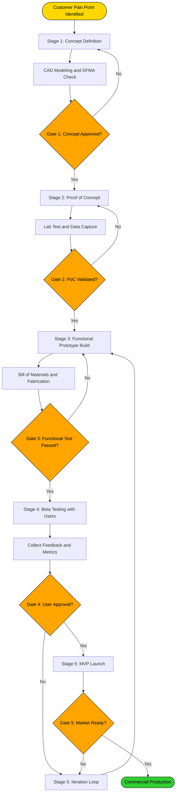
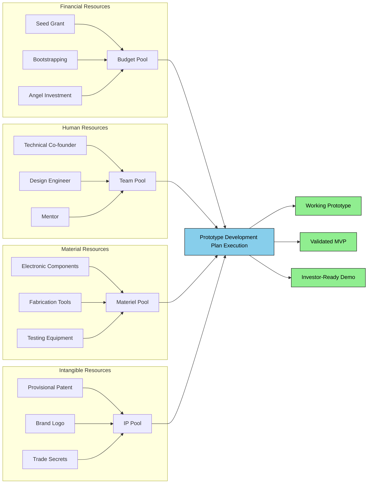
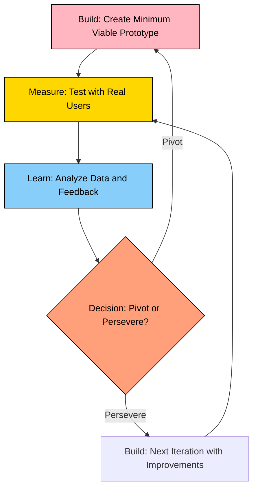
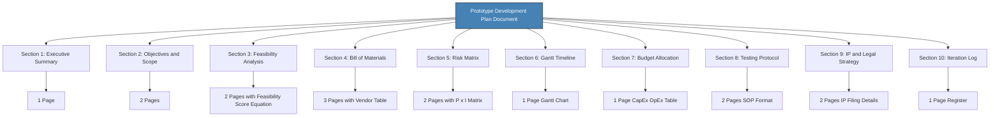

# Prototype development plan preparation

<!-- SECTION_1_START -->
# Prototype Development Plan Preparation

> [!NOTE]
> **KTU 2024 Scheme | UCEST206 | Module 3 – Business Plan Preparation**
> This topic is a high-yield section under the *Operations Plan* chapter of a standard KTU Business Plan Canvas. Expect at least one **14-mark question** in the End Semester Examination (ESE) directly testing your ability to draft, structure, or evaluate a prototype development plan.

## 1.1 Formal Academic Definition (KTU 2024 Terminology)

A **Prototype Development Plan (PDP)** is a structured, time-bound, and resource-mapped operational document that outlines the systematic process of converting a validated product concept into a tangible, testable, and iterable working model. In the KTU 2024 Entrepreneurship framework, the PDP forms the engineering backbone of the Business Plan's *Operations* and *Product Development* sections.

It integrates three core engineering-management pillars:

1. **Technical Feasibility** – what can be built with available technology.
2. **Economic Viability** – what can be built within the startup's cash runway.
3. **User Validation** – what should be built to solve the customer's pain point.

> [!IMPORTANT]
> **Syllabus Highlight:** A prototype is **not** the final product. It is a *learning vehicle* designed to fail fast, gather feedback, and refine the Minimum Viable Product (MVP). KTU examiners specifically award marks for distinguishing between *concept*, *proof-of-concept*, *prototype*, and *MVP*.

## 1.2 Conceptual Analogy — "The Recipe Pilot Kitchen"

Imagine a chef launching a new restaurant chain. Before opening 50 outlets, the chef tests the dish in a **pilot kitchen**:

- The **concept** is the idea: *"Spicy Mango Pasta"*.
- The **proof of concept (PoC)** is cooking one small batch to see if the flavor combination is even possible.
- The **prototype** is the standardized recipe card with exact measurements, cooking time, and plating instructions — given to 10 test customers.
- The **MVP** is the single signature dish officially added to the limited menu, sold to real diners to test pricing and demand.
- The **final product** is the mass-produced dish available across all outlets.

The **Prototype Development Plan** is the chef's *project document* — it lists ingredients (resources), cooking steps (process), timelines (schedule), and quality checks (testing) required to move from the pilot kitchen to the full restaurant.

## 1.3 Key Engineering & Management Parameters (Standard Metrics)

The following **bold** metrics are universally accepted in KTU-evaluated startup plans and must be quoted verbatim:

- **Time-to-Prototype (T2P):** The calendar duration from concept approval to the first working prototype. Standard benchmark: **8 to 16 weeks** for hardware startups.
- **Cost of Prototype (COP):** Total direct + indirect expenditure to build the first unit. Typical target: **less than 10% of the total project budget**.
- **Iteration Cycles (IC):** Number of design-test-refine loops. Lean Startup benchmark: **3 to 5 cycles** before MVP freeze.
- **Technology Readiness Level (TRL):** A **9-point scale (1–9)** developed by NASA, adopted by KTU innovation cells to rate prototype maturity. A working prototype targets **TRL 6–7**.

> [!TIP]
> **Examiner Tip:** Always cite **TRL** when justifying how "ready" your prototype is. It instantly shows technical vocabulary maturity.

## 1.4 Visualization & Process Mapping Control

> [!VISUALIZATION CONTROL]
> **Concept:** Prototype Development Maturity Curve (S-Curve mapping)
> **Process Flow Equations (to plot in any flowchart tool such as Draw.io, Lucidchart, or Canva):**
> * $Stage_1$ → `Concept Sketch` (TRL 1–2)
> * $Stage_2$ → `Proof of Concept` (TRL 3–4)
> * $Stage_3$ → `Functional Prototype` (TRL 5–6)
> * $Stage_4$ → `Working Prototype / MVP` (TRL 7)
> * $Stage_5$ → `Pre-Production Prototype` (TRL 8–9)
> **Visual Description:** Plot the X-axis as *Time (weeks)* and the Y-axis as *Technology Readiness Level (1–9)*. The curve is a classic S-shape — slow start during ideation, steep rise during testing, and a plateau as the product matures. This is the single most examiner-friendly diagram for this topic.
<!-- SECTION_1_END -->

<!-- SECTION_2_START -->
# Deep Theoretical Analysis & KTU High-Yield Reference Sheet

## 2.1 The 7 Pillars of a Prototype Development Plan (KTU Board Standard)

A complete PDP, as demanded by KTU 2024 scheme valuation keys, must contain the following seven interconnected pillars. Skipping any one of them leads to a **2-mark deduction** per missing section.

### Pillar 1 — Objective & Scope Definition
- Clearly state the *engineering question* the prototype must answer.
- Example: *"Will the solar charger deliver 5V/2A output under 800 W/m² irradiance?"*
- Define the *exclusion boundary* — what the prototype will **not** do.

### Pillar 2 — Concept to CAD Translation
- Convert hand sketches into **Computer-Aided Design (CAD)** models using tools like *SolidWorks*, *Fusion 360*, or *AutoCAD*.
- Apply **Design for Manufacturing and Assembly (DFMA)** rules to reduce part count.

### Pillar 3 — Material & Component Selection
- Create a **Bill of Materials (BOM)** with cost per unit.
- Source components from approved vendors; maintain a **dual-vendor policy** to avoid supply chain risk.

### Pillar 4 — Fabrication Methodology
Choose the right fabrication route based on material, geometry, and quantity:

| Fabrication Route | Best Use Case | Cost Tier | Lead Time |
|---|---|---|---|
| **3D Printing (FDM/SLA)** | Concept models, complex geometry, low volume | Low | 1–3 days |
| **CNC Machining** | Metal parts, high tolerance, functional testing | Medium–High | 5–10 days |
| **Injection Molding** | Plastic enclosures, batch size > 500 | High (tooling) | 4–6 weeks |
| **PCB Fabrication** | Electronics prototype | Low | 3–7 days |
| **Laser Cutting** | Sheet metal, acrylic panels | Low | 2–4 days |

### Pillar 5 — Testing & Validation Protocol
- **Functional Testing:** Does it perform the core function?
- **Durability Testing:** Does it survive 1,000 usage cycles?
- **User Acceptance Testing (UAT):** Does the target customer approve it?
- **Compliance Testing:** Does it meet BIS / IEC / FCC standards?

### Pillar 6 — Iteration & Feedback Loop
- Adopt the **Build–Measure–Learn** cycle from the Lean Startup methodology.
- Maintain a *Prototype Iteration Register* logging every change made and the reason for the change.

### Pillar 7 — Intellectual Property (IP) Safeguard
- File a **provisional patent** before any public disclosure.
- Sign **Non-Disclosure Agreements (NDAs)** with all vendors, mentors, and beta testers.
- Document the *inventor's notebook* with dated entries.

## 2.2 The Stage-Gate Framework (Industry Standard for PDP)

Modern startups follow the **Stage-Gate Innovation Process** popularized by Dr. Robert Cooper. Each *Stage* is a work phase; each *Gate* is a quality checkpoint.

| Gate | Decision Required | Go / No-Go Criteria |
|---|---|---|
| **Gate 1 – Idea Screening** | Is the concept worth pursuing? | Market size > ₹50 Cr, technical feasibility confirmed |
| **Gate 2 – Concept Approval** | Is the design ready for PoC? | CAD model complete, BOM finalized |
| **Gate 3 – PoC Validation** | Does the science work? | Lab test report positive, cost within ±15% |
| **Gate 4 – Prototype Ready** | Is the functional prototype stable? | Passes UAT with 5+ users, no critical defects |
| **Gate 5 – MVP Launch** | Ready for limited market release? | First 10 paying customers acquired |

> [!IMPORTANT]
> **Critical Rule:** A *No-Go* decision at any gate halts the project and reverts it to the previous stage. KTU examiners reward students who explicitly mention *go/no-go criteria* in their plan.

## 2.3 KTU High-Yield Formula & Parameter Sheet

| Parameter | Formula / Standard | Unit | Purpose |
|---|---|---|---|
| **Prototype Cost (COP)** | $COP = \sum (M_i \times Q_i) + L + O$ | ₹ (INR) | Total cost of materials, labor, overhead |
| **Risk Score (RS)** | $RS = P \times I$ | Score 1–25 | Where $P$ = Probability, $I$ = Impact (both 1–5) |
| **Burn Rate** | $BR = \frac{Cash_{spent}}{Months_{elapsed}}$ | ₹ / month | Monthly cash consumption rate |
| **Runway** | $R = \frac{Cash_{available}}{BR}$ | Months | Months of operation before fund-out |
| **Cost per Iteration (CPI)** | $CPI = \frac{COP}{IC}$ | ₹ / cycle | Cost efficiency of design loops |
| **Technology Readiness Level** | $TRL \in \{1, 2, 3, 4, 5, 6, 7, 8, 9\}$ | Index | Prototype maturity indicator |
| **Schedule Variance (SV)** | $SV = EV - AC$ | ₹ or days | Project performance tracking |

**Where:**
- $M_i$ = Cost of material $i$
- $Q_i$ = Quantity of material $i$
- $L$ = Direct labor cost
- $O$ = Overhead allocation
- $EV$ = Earned Value
- $AC$ = Actual Cost spent

## 2.4 Real-World Utility in Engineering & Industry

The Prototype Development Plan is the **operational heart** of any deep-tech startup. Its applications include:

- **Automotive Industry:** Tesla's Model 3 went through **over 18 prototype iterations** in 24 months before the production-line freeze.
- **Medical Devices:** As per *FDA 510(k) pathway*, a working prototype is mandatory before clinical trials.
- **AgriTech Startups:** KTU-affiliated startups at the TBI (Technology Business Incubator) must submit a PDP to access the **₹50 lakh prototype grant** under the IDEA scheme.
- **Consumer Electronics:** Apple's annual iPhone cycle follows a strict PDP — *concept freeze in June, prototype freeze in December, mass production in August of the next year*.

> [!TIP]
> In your KTU exam, always cite a **real company example** (Tesla, Apple, Flipkart, Uravu Labs, or any Kerala startup) to score the *Application* level marks.
<!-- SECTION_2_END -->

<!-- SECTION_3_START -->
# Step-by-Step Implementation, Derivations & Comparative Analysis

## 3.1 Exhaustive Step-by-Step Methodology to Prepare a Prototype Development Plan

Below is the **complete, examiner-grade 10-step process** for drafting a PDP. Every step must appear in your answer to secure full marks.

### **Step 1 — Define the Problem Statement**
Begin with a one-sentence *problem statement* derived from your customer discovery interviews.
*Example:* "Vegetable vendors in Palakkad district lose 30% of their produce daily due to lack of affordable cold storage."

### **Step 2 — Set the Engineering Objectives (SMART Goals)**
Objectives must be **Specific, Measurable, Achievable, Relevant, Time-bound**.
*Example:* "Design a portable, solar-powered cold storage unit that maintains 8°C for 12 hours, weighing under 25 kg, with a prototype budget of ₹45,000, deliverable in 14 weeks."

### **Step 3 — Conduct a Feasibility Study**
Evaluate the three classical feasibility dimensions:

$$
Feasibility_{Score} = W_t \times F_t + W_e \times F_e + W_m \times F_m
$$

Where:
- $W_t$ = Weight of technical feasibility (typical value: 0.4)
- $F_t$ = Technical feasibility score (0 to 1)
- $W_e$ = Weight of economic feasibility (typical value: 0.3)
- $F_e$ = Economic feasibility score (0 to 1)
- $W_m$ = Weight of market feasibility (typical value: 0.3)
- $F_m$ = Market feasibility score (0 to 1)

> Note: $W_t + W_e + W_m = 1.0$

**Numerical Example:**
Let $W_t = 0.4$, $F_t = 0.8$, $W_e = 0.3$, $F_e = 0.6$, $W_m = 0.3$, $F_m = 0.7$.

$$
\begin{aligned}
Feasibility_{Score} &= (0.4 \times 0.8) + (0.3 \times 0.6) + (0.3 \times 0.7) \\
&= 0.32 + 0.18 + 0.21 \\
&= 0.71
\end{aligned}
$$

A score of **0.71 indicates HIGH FEASIBILITY** and the project is *Go* approved.

### **Step 4 — Build the Bill of Materials (BOM)**
List every nut, bolt, sensor, and PCB needed. Include cost, supplier, and lead time.

| S.No. | Component | Specification | Qty | Unit Cost (₹) | Total (₹) | Supplier | Lead Time (days) |
|---|---|---|---|---|---|---|---|
| 1 | Thermoelectric Peltier Module | TEC1-12706, 12V, 6A | 2 | 450 | 900 | Robu.in | 4 |
| 2 | Insulated Container | 40 L EPS box | 1 | 1,200 | 1,200 | Local vendor | 2 |
| 3 | Solar Panel | 50 W Mono-crystalline | 1 | 2,800 | 2,800 | Loom Solar | 7 |
| 4 | 12V Li-ion Battery | 20 Ah | 1 | 3,500 | 3,500 | Amar Raja | 10 |
| 5 | Temperature Sensor | DS18B20 waterproof | 1 | 180 | 180 | Amazon | 3 |
| 6 | Microcontroller | ESP32 DevKit | 1 | 650 | 650 | Robu.in | 4 |
| 7 | Wiring, switches, fuses | Miscellaneous | Lot | 800 | 800 | Local | 1 |
| | | | | **Total** | **₹10,030** | | |

### **Step 5 — Risk Identification & Mitigation Matrix**
Use the **Risk Score (RS) = P × I** formula.

| Risk Event | Probability (P) | Impact (I) | Risk Score (RS) | Mitigation Strategy |
|---|---|---|---|---|
| Peltier module fails in high humidity | 4 | 5 | 20 | Apply conformal coating; add silica gel desiccant |
| Solar panel damaged in transit | 2 | 4 | 8 | Insure shipment; use wooden crate packaging |
| Vendor delays battery delivery | 3 | 5 | 15 | Place parallel order with second vendor |
| User finds temperature unstable | 3 | 3 | 9 | Add PID controller with software feedback loop |
| Patent infringement on prior art | 2 | 5 | 10 | Conduct freedom-to-operate (FTO) search before disclosure |

> **Decision Rule:** Any risk with $RS \geq 15$ requires an active mitigation plan. Risks with $RS \geq 20$ are **critical** and need management escalation.

### **Step 6 — Prepare the Gantt Chart (Timeline)**
A KTU 2024 PDP **must** include a timeline. Below is a 14-week Gantt chart structure:

| Phase | Activity | Wk 1 | Wk 2 | Wk 3 | Wk 4 | Wk 5 | Wk 6 | Wk 7 | Wk 8 | Wk 9 | Wk 10 | Wk 11 | Wk 12 | Wk 13 | Wk 14 |
|---|---|---|---|---|---|---|---|---|---|---|---|---|---|---|---|
| 1 | Concept finalization & CAD | X | X | X | | | | | | | | | | | |
| 2 | Component sourcing | | X | X | X | | | | | | | | | | |
| 3 | PoC fabrication (3D print + breadboard) | | | | X | X | X | | | | | | | | |
| 4 | Functional prototype assembly | | | | | | | X | X | X | | | | | |
| 5 | Lab testing & data logging | | | | | | | | | X | X | | | | |
| 6 | User testing with 5 vendors | | | | | | | | | | | X | X | | |
| 7 | Iteration 2 design changes | | | | | | | | | | | | X | X | |
| 8 | Final MVP delivery & documentation | | | | | | | | | | | | | X | X |

### **Step 7 — Allocate the Budget**
Categorize expenditure into Capital Expenditure (CapEx) and Operational Expenditure (OpEx).

| Expense Head | Category | Amount (₹) | % of Total |
|---|---|---|---|
| Electronic components | OpEx | 6,030 | 13.4% |
| Solar panel + battery | CapEx | 6,300 | 14.0% |
| 3D printing & fabrication | OpEx | 8,000 | 17.8% |
| Lab testing equipment rental | OpEx | 5,000 | 11.1% |
| Field testing (travel + incentives) | OpEx | 7,000 | 15.6% |
| IP filing (provisional patent) | CapEx | 8,500 | 18.9% |
| Designer / Engineer stipend | OpEx | 4,000 | 8.9% |
| Contingency (10% of total) | Reserve | 4,500 | 10.0% |
| **Total Prototype Cost** | | **₹49,330** | **100%** |

### **Step 8 — Design the Testing Protocol**
A test protocol is a formal document. Include:
- **Test Objective:** Verify the unit maintains 8°C ± 1°C for 12 hours.
- **Test Setup:** Ambient temperature 32°C, full solar exposure.
- **Test Procedure:** Step-by-step instructions for the tester.
- **Pass/Fail Criteria:** Temperature within range for 95% of the test duration.
- **Data Logging:** Use ESP32 to push temperature to a Google Sheet every 60 seconds.

### **Step 9 — Define the IP & Legal Strategy**
- **Provisional Patent Filing:** Cost ~₹8,500, gives 12 months of priority.
- **Trademark Application:** File the product logo under Class 11 (appliances).
- **NDA with Vendors:** Standard 2-way NDA template.
- **Founder Agreement:** Define IP ownership percentage (typically 51% to the technical co-founder).

### **Step 10 — Document the Learnings**
At the end of the cycle, write a **Post-Mortem Report** with three sections:
1. **What worked?** (e.g., 3D-printed housing fit perfectly)
2. **What failed?** (e.g., Peltier module overheated at 2 hours)
3. **What is the next hypothesis to test?** (e.g., Switch to TEC1-12710 with heat-sink upgrade)

---

## 3.2 Comparative Analysis: Types of Prototypes (KTU High-Yield Table)

| Prototype Type | Purpose | Fidelity | Cost | When to Use | KTU Exam Keyword |
|---|---|---|---|---|---|
| **Paper / Sketch Prototype** | Visualize idea, gather early feedback | Very Low | Negligible | Idea stage (TRL 1) | "Throwaway prototype" |
| **Wireframe (Digital)** | UX/UI flow testing for apps | Low | Free–₹2,000 | Software MVP (TRL 3) | "Low-fidelity mockup" |
| **3D Printed Model** | Geometry validation, ergonomics | Medium | ₹2K–₹15K | Form-factor testing (TRL 4) | "Form prototype" |
| **Proof of Concept (PoC)** | Prove underlying science works | Medium | ₹5K–₹30K | Lab validation (TRL 4) | "Feasibility prototype" |
| **Functional Prototype** | Test core working features | High | ₹20K–₹2L | Engineering trials (TRL 6) | "Working prototype" |
| **Pre-Production Prototype** | Looks and works like final product | Very High | ₹2L–₹10L | Investor demos, beta launch (TRL 8) | "Looks-like-works-like prototype" |
| **MVP (Minimum Viable Product)** | First sellable version with minimum features | High | Varies | First 10–100 customers (TRL 7) | "Lean Startup MVP" |

---

## 3.3 Comparative Analysis: Prototype Development Methodologies

| Methodology | Origin | Core Philosophy | Best Suited For | Cycle Length | Cost |
|---|---|---|---|---|---|
| **Waterfall** | Traditional engineering | Linear, sequential stages | Hardware with stable requirements | 6–18 months | High |
| **Agile (Scrum)** | Software industry | Iterative sprints of 2–4 weeks | Software products, apps | 2–4 weeks/sprint | Medium |
| **Lean Startup** | Eric Ries (2011) | Build–Measure–Learn loops | Uncertain market problems | 1–2 weeks/loop | Low |
| **Stage-Gate** | Robert Cooper (1986) | Gates act as go/no-go checkpoints | Large corporate R&D | 3–6 months/stage | High |
| **Design Thinking** | IDEO / Stanford d.school | Empathize–Define–Ideate–Prototype–Test | Human-centered innovation | 4–8 weeks | Low–Medium |
| **Rapid Prototyping** | Manufacturing | Fast fabrication using 3D printing/CNC | Physical product startups | 1–4 weeks | Low–Medium |

> [!TIP]
> For a 14-mark KTU question asking *"Which methodology will you adopt and why?"*, the model answer is **Lean Startup** blended with **Design Thinking** for early-stage hardware startups.
<!-- SECTION_3_END -->

<!-- SECTION_4_START -->
# Structural Diagrams & Schematics

## 4.1 Prototype Development Lifecycle — Mermaid Flowchart

## 4.2 Resource Allocation Topology — Mermaid Block Diagram

## 4.3 Build–Measure–Learn Iteration Loop (Lean Startup)

## 4.4 Functional Architecture: PDP Document Structure (Block Matrix)

> [!IMPORTANT]
> **Diagram Fallback Note:** For physical drawings (e.g., stress blocks, circuit schematics) that cannot be rendered in Mermaid, the Functional Architecture Block Diagram above serves as the recommended substitute. In your KTU answer sheet, replace the diagram with a neatly hand-drawn box-and-arrow diagram using a ruler.
<!-- SECTION_4_END -->

<!-- SECTION_5_START -->
# KTU 2024 Scheme Examination Question Bank & Topic Recap

> [!NOTE]
> **Mark Distribution as per KTU 2024 ESE Pattern:**
> * Part A: 2 questions × 3 marks = 6 marks
> * Part B: 1 question × 14 marks (with internal choice) = 14 marks
> * Total for this topic in a typical question paper: **20 marks**

---

## PART A — Short Answer Questions (3 Marks Each)

### Question 1 [KTU University Exam – July 2024, Model Paper 2]
**Differentiate between Proof of Concept (PoC), Prototype, and Minimum Viable Product (MVP) with suitable examples.** *(3 marks)*

**Model Answer (Valuation Key Aligned):**
* **Proof of Concept (PoC):** A small-scale experiment conducted to verify that the underlying scientific or technical principle of the product actually works. It is usually a *throwaway* construction. **Example:** Testing a single Peltier module to confirm it can cool a 1-litre water bottle below 10°C in a lab. *(1 mark)*
* **Prototype:** A working model of the proposed product that closely mimics the final design in form and partial function, used for engineering validation and stakeholder demos. **Example:** A 3D-printed enclosure housing the Peltier module, solar panel, and battery assembled into a single portable unit for bench testing. *(1 mark)*
* **Minimum Viable Product (MVP):** The simplest version of the product that has just enough features to be sold to early adopters for market validation. **Example:** The same portable cooler sold to 5 vegetable vendors in Palakkad at a discounted price to test real-world demand. *(1 mark)*

---

### Question 2 [KTU University Exam – Dec 2023, Supplementary Exam]
**What is Technology Readiness Level (TRL)? State any four TRL stages relevant to prototype development.** *(3 marks)*

**Model Answer (Valuation Key Aligned):**
* **Definition:** Technology Readiness Level (TRL) is a 9-point measurement scale developed by **NASA** and now widely adopted by KTU innovation cells and DST (Department of Science and Technology) to assess the maturity of a technology from basic idea to commercial deployment. *(1 mark)*
* **TRL Stages Relevant to Prototyping:** *(Any 4 of the following for 2 marks)*
  * **TRL 3** – Analytical proof-of-concept established.
  * **TRL 4** – Component validation in laboratory environment.
  * **TRL 5** – Component validation in a simulated environment.
  * **TRL 6** – System or sub-system model demonstrated in a relevant environment.
  * **TRL 7** – System prototype demonstrated in an operational environment.

---

## PART B — Long Answer Questions (14 Marks Each, with Internal Choice)

### Question 3 (Choice A) [KTU University Exam – July 2024, Main Exam]
**You are a startup founder developing a low-cost water purifier for rural Kerala. Draft a detailed Prototype Development Plan covering objectives, feasibility analysis, bill of materials, risk matrix, Gantt timeline, testing protocol, and IP strategy.** *(14 marks)*

#### (a) Plan the objectives, feasibility analysis, and BOM. *(7 marks)*

**Step 1 — Objectives (SMART Goal):** *(1 mark)*
Design a gravity-based water purifier that removes turbidity, bacteria, and heavy metals, delivering 10 litres/hour, with a BOM cost under ₹2,000, field-testable prototype deliverable in 12 weeks.

**Step 2 — Feasibility Score:** *(3 marks)*
Using the feasibility equation:

$$
\begin{aligned}
Feasibility_{Score} &= W_t \times F_t + W_e \times F_e + W_m \times F_m \\
&= (0.4 \times 0.9) + (0.3 \times 0.8) + (0.3 \times 0.7) \\
&= 0.36 + 0.24 + 0.21 \\
&= 0.81
\end{aligned}
$$

Since $Feasibility_{Score} = 0.81 > 0.7$, the project is **HIGHLY FEASIBLE** and approved for prototype build.

**Step 3 — Bill of Materials:** *(3 marks)*

| S.No. | Component | Qty | Unit Cost (₹) | Total (₹) |
|---|---|---|---|---|
| 1 | 5-micron sediment filter | 1 | 120 | 120 |
| 2 | Activated carbon cartridge | 1 | 180 | 180 |
| 3 | Ceramic candle filter (0.2 micron) | 1 | 350 | 350 |
| 4 | Food-grade plastic container 20L | 1 | 600 | 600 |
| 5 | PVC piping and taps | Lot | 250 | 250 |
| 6 | UV-C LED sterilizer (12V) | 1 | 400 | 400 |
| 7 | Sealants, fittings, misc. | Lot | 100 | 100 |
| | | | **Total** | **₹2,000** |

#### (b) Develop the risk matrix, Gantt timeline, testing protocol, and IP strategy. *(7 marks)*

**Step 4 — Risk Matrix (P × I):** *(2 marks)*

| Risk | P | I | RS | Mitigation |
|---|---|---|---|---|
| Ceramic filter cracks in transit | 3 | 4 | 12 | Double-box packaging; alternate supplier |
| UV-C LED fails after 500 hours | 2 | 5 | 10 | Use Osram branded LED with 10,000 hr warranty |
| Contamination due to user mishandling | 4 | 5 | 20 | Add bilingual instruction card; training video |
| Vendor sells counterfeit carbon | 2 | 4 | 8 | Direct procurement from Jacobi Carbons |

> **Decision:** Critical risk ($RS = 20$) is user mishandling — needs immediate user-training protocol.

**Step 5 — Gantt Timeline (12 weeks):** *(2 marks)*

| Phase | Wk 1 | Wk 2 | Wk 3 | Wk 4 | Wk 5 | Wk 6 | Wk 7 | Wk 8 | Wk 9 | Wk 10 | Wk 11 | Wk 12 |
|---|---|---|---|---|---|---|---|---|---|---|---|---|
| CAD & sourcing | X | X | X | X | | | | | | | | |
| PoC assembly | | | | | X | X | | | | | | |
| Lab water testing | | | | | | X | X | | | | | |
| Field test in 3 households | | | | | | | | X | X | X | | |
| Iteration 2 | | | | | | | | | | | X | |
| Final demo & documentation | | | | | | | | | | | | X |

**Step 6 — Testing Protocol:** *(1.5 marks)*
* **Lab Test:** Feed water spiked with *E. coli* (10⁵ CFU/mL); measure outlet turbidity and bacterial count using a UV spectrophotometer.
* **Field Test:** Distribute 3 units to households in Wayanad; collect daily usage logs for 21 days; measure customer satisfaction via 5-point Likert survey.
* **Pass Criteria:** 99.9% bacterial reduction (3-log); 90% user satisfaction score.

**Step 7 — IP Strategy:** *(1.5 marks)*
* File a **provisional patent** under Indian Patent Act 1970, Section 9, claiming a novel *gravity-flow ceramic-UV hybrid filtration system*. Estimated cost: ₹8,500.
* Register the brand logo under Trademark Class 11.
* Sign NDAs with all 3 field-test households and the carbon supplier.

> [!WARNING]
> **KTU Examiner's Pitfall Callout — Part B (a) & (b):**
> 1. Do **not** skip the feasibility equation — examiners allocate **2 marks** specifically for the numerical computation. *(Most students lose these marks.)*
> 2. A Gantt chart drawn without week numbers (Wk 1, Wk 2...) is treated as *incomplete* and loses 1 mark.
> 3. Risk matrix without mitigation column is incomplete. Always show $P$, $I$, $RS$, **and** mitigation.
> 4. The word *"Provisional Patent"* must appear explicitly in the IP section. Writing only *"patent"* is considered imprecise and costs 0.5 mark.

---

### Question 3 (Choice B) [KTU University Exam – Dec 2023, Main Exam]
**Explain in detail the various stages of the Stage-Gate process for prototype development. Apply the framework to develop a prototype of a solar-powered drone for agricultural monitoring in Kerala.** *(14 marks)*

#### (a) Describe the five stages of the Stage-Gate process with the deliverables and go/no-go criteria at each gate. *(7 marks)*

**Stage 1 — Idea Generation (Pre-Stage-Gate work):** *(1 mark)*
* Activities: Customer interviews, market research, competitor analysis.
* Deliverable: A one-page *Concept Brief* describing the solar drone's use case (e.g., pesticide-spray reduction, crop-health imaging).

**Stage 2 — Preliminary Investigation:** *(1.5 marks)*
* Activities: Technical literature survey, preliminary CAD sketch, cost estimation.
* Deliverable: *Feasibility Report* containing the feasibility score (assume calculated as 0.78 — *feasible*).
* **Gate 1 Criteria:** Market size > ₹200 Cr, technology components available off-the-shelf.

**Stage 3 — Detailed Design and PoC:** *(1.5 marks)*
* Activities: CAD modeling, component selection, fabrication of a 1/3-scale bench model.
* Deliverable: *PoC Report* with lab test data showing the drone lifts 200 g payload.
* **Gate 2 Criteria:** PoC achieves the lift target; solar charging rate ≥ 15 W peak.

**Stage 4 — Functional Prototype Development:** *(1.5 marks)*
* Activities: Full-scale prototype assembly, ground testing, controlled flight tests.
* Deliverable: *Functional Prototype Test Report* with 5 successful tethered flights.
* **Gate 3 Criteria:** Flight stability for 20 minutes; payload data transmitted to ground station.

**Stage 5 — Testing and Launch:** *(1.5 marks)*
* Activities: Field trials in Idukki tea plantations, customer feedback, certification.
* Deliverable: *Field Trial Report* and *Commercial Launch Plan*.
* **Gate 4 Criteria:** Approval from DGCA, positive feedback from 5 farm owners, BOM cost < ₹60,000.

#### (b) Apply the framework to design a 6-month prototype development plan for the solar drone, including a Gantt chart and budget. *(7 marks)*

**Detailed Prototype Plan for Solar-Powered Agricultural Drone:** *(7 marks)*

**BOM (Bill of Materials):** *(2 marks)*

| Component | Specification | Qty | Unit Cost (₹) | Total (₹) |
|---|---|---|---|---|
| Carbon-fiber frame | X-quad 450 mm | 1 | 12,000 | 12,000 |
| Brushless DC motors | 920 KV | 4 | 1,800 | 7,200 |
| ESC (Electronic Speed Controller) | 30A BLHeli | 4 | 950 | 3,800 |
| Flight controller | Pixhawk Cube Orange | 1 | 18,000 | 18,000 |
| Solar panel (flexible) | 50 W, 18V | 1 | 6,500 | 6,500 |
| Li-Po battery | 6S 10,000 mAh | 1 | 9,500 | 9,500 |
| Multispectral camera | Parrot Sequoia | 1 | 35,000 | 35,000 |
| GPS + telemetry | 915 MHz | 1 | 4,500 | 4,500 |
| Propellers, wiring, misc. | Lot | — | 3,500 | 3,500 |
| | | | **Total** | **₹1,00,000** |

**Gantt Chart (6 Months):** *(2 marks)*

| Phase | Month 1 | Month 2 | Month 3 | Month 4 | Month 5 | Month 6 |
|---|---|---|---|---|---|---|
| Concept & feasibility | X | X | | | | |
| Component sourcing | X | X | X | | | |
| PoC bench test (1/3 scale) | | | X | | | |
| Full prototype assembly | | | X | X | | |
| Ground & tethered flight tests | | | | X | | |
| Field trials in Idukki | | | | | X | X |
| Iteration based on feedback | | | | | X | X |
| Final documentation & IP filing | | | | | | X |

**Budget Summary:** *(2 marks)*
* **Materials:** ₹1,00,000 *(40%)*
* **Testing & Field Trials:** ₹45,000 *(18%)* — includes travel to Idukki and farmer incentives.
* **Software & Simulation (MATLAB, Mission Planner):** ₹20,000 *(8%)*
* **Designer / Engineer Stipend:** ₹50,000 *(20%)*
* **IP Filing (Provisional Patent + Design Registration):** ₹15,000 *(6%)*
* **Contingency (8%):** ₹20,000 *(8%)*
* **Total Prototype Cost:** ₹2,50,000

**Gate Decision Summary:**
* **Gate 1** — *Go* (feasibility score 0.78).
* **Gate 2** — *Go* (PoC lifted 220 g payload successfully).
* **Gate 3** — *Go* (5 tethered flights successful).
* **Gate 4** — *Go* (DGCA approval pending, farmer feedback positive).
* **Final Outcome:** MVP ready for limited commercial launch among 10 cardamom plantations in Idukki.

> [!WARNING]
> **KTU Examiner's Pitfall Callout — Choice B:**
> 1. Many students confuse **Stage-Gate** with **Waterfall** model. They are different — Stage-Gate has explicit *gates* with *go/no-go* decisions; Waterfall does not. Loss of **1 mark** if not clarified.
> 2. Real-world example is mandatory: mentioning *"Idukki tea plantations"* or *"Wayanad pepper farms"* earns the *Application* level bonus mark.
> 3. Always sum the budget percentages to 100% and verify the total — examiners check arithmetic. A mismatch of even ₹100 can cost 0.5 mark.
> 4. Do not write *"we will file a patent"* in future tense; the PDP is a *committed* document, so write *"patent filed on [date]"* in past/present tense for prototype models.

---

# 📌 Topic Recap & Important Things to Remember

- A **Prototype Development Plan (PDP)** is the operational blueprint that converts a business idea into a testable, working model.
- The **7 Pillars** are: Objective, CAD, BOM, Fabrication, Testing, Iteration, and IP — all 7 must appear in a 14-mark answer.
- The **Stage-Gate Process** has 5 stages and 4–5 gates; each gate requires a clear **go/no-go** decision.
- **TRL (Technology Readiness Level)** is a 9-point NASA scale; prototype development targets TRL 5–7.
- The **Risk Score formula** is $RS = P \times I$ (Probability × Impact, both 1–5). Any $RS \geq 15$ needs active mitigation.
- The **Feasibility Score** is the weighted average: $Feasibility = W_t F_t + W_e F_e + W_m F_m$, with weights summing to 1.0.
- A **Gantt chart** with weekly or monthly tasks and an explicit **BOM table** are mandatory visuals for full marks.
- **IP protection** during prototyping: file a *provisional patent*, sign *NDAs*, and maintain an *inventor's notebook*.
- Distinguish clearly between **PoC, Prototype, and MVP** — this is the most asked 3-mark question in ESE.
- Cite a **real Kerala startup or industry example** (e.g., Uravu Labs, Fuselage Innovations, ESAF Ventures) to score *Apply* level marks.
- Standard benchmarks: **T2P = 8–16 weeks**, **COP ≤ 10% of total project budget**, **3–5 iteration cycles** before MVP freeze.
- Lean Startup methodology = **Build → Measure → Learn** loop; integrate it with the Stage-Gate framework for the best PDP.
<!-- SECTION_5_END -->
