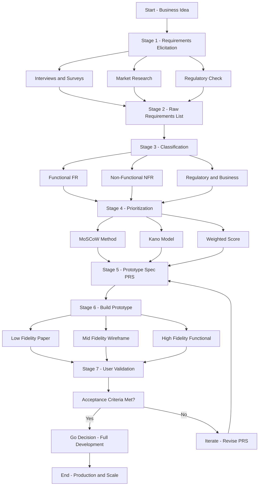
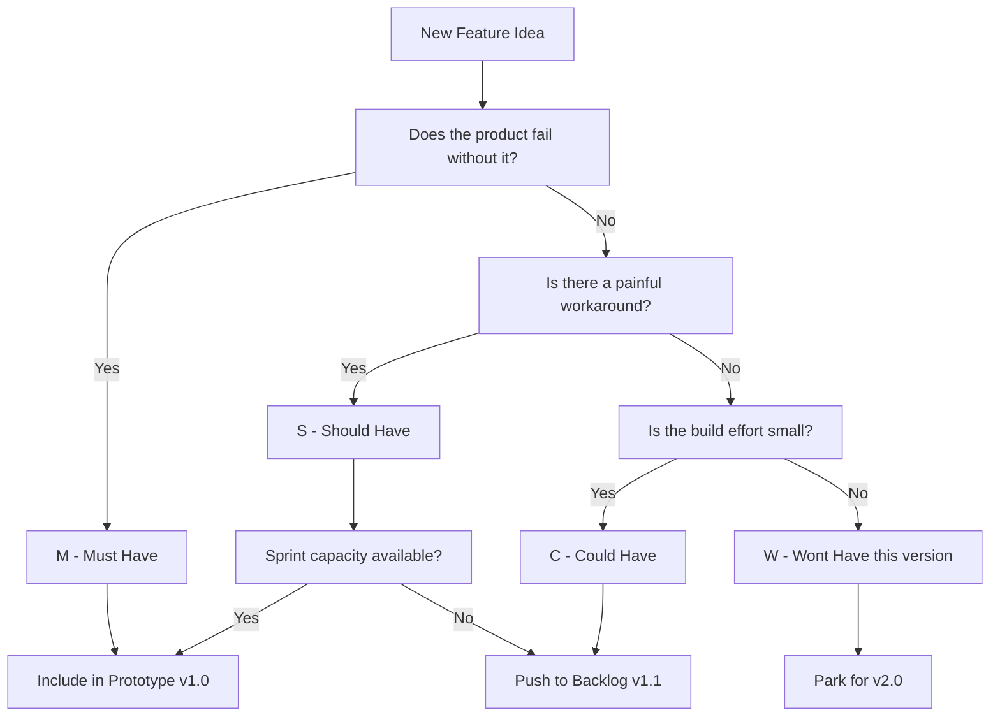
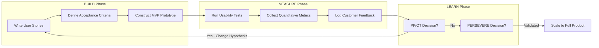
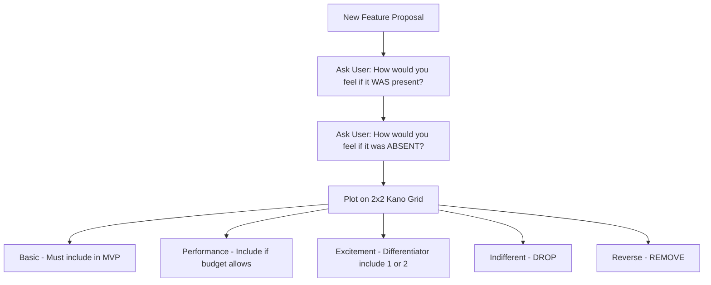

# Prototype requirements analysis

<!-- SECTION_1_START -->
# Prototype Requirements Analysis — KTU 2024 Study Notes

> [!NOTE]
> **Module Context:** This topic is mapped to **Module 3 — Business Plan Preparation** of the KTU 2024 Scheme B.Tech course *Engineering Entrepreneurship and IPR (UCEST206)*. It directly supports the creation of the **Operations / Product Plan** section of a typical KTU business plan template.

## 1.1 Formal Academic Definition

> [!IMPORTANT]
> **Prototype Requirements Analysis (PRA)** is the systematic engineering and management process of identifying, documenting, prioritizing, and validating the **functional, non-functional, technical, and user-experience requirements** that a physical, digital, or hybrid prototype of a proposed product or service must satisfy before full-scale development, commercialization, or investor demonstration.

In the KTU 2024 syllabus phrasing, prototype requirements analysis acts as the **bridge between the ideation/feasibility stage (Module 1 & 2) and the actual product design and go-to-market strategy (Module 4 & 5)**. It converts a fuzzy business hypothesis into a **testable, measurable, and resource-bound specification** that engineering teams can build against and investors can evaluate.

## 1.2 Conceptual Analogy — The "Architect's Blueprint" Mental Model

> [!TIP]
> **Real-World Analogy — Building a House:**
> Imagine you want to build a house, but you are not sure whether the family actually *needs* a swimming pool, a home theatre, or a meditation room. Before spending ₹2 crore on the real house, you:
> 1. **Talk to the family** → Requirements Gathering.
> 2. **List every "must-have" and "nice-to-have"** → MoSCoW Prioritization.
> 3. **Build a small scaled cardboard model (1:20 scale)** → Throwaway Prototype.
> 4. **Let the family walk through it and complain** → User Validation.
> 5. **Mark changes on the cardboard** → Iteration.
> 6. **Only then give the final blueprint to the contractor** → Engineering Specification.
>
> Prototype Requirements Analysis is **exactly this process applied to your product**. It ensures you do not burn cash building the wrong product.

## 1.3 Why This Topic is a High-Yield KTU Topic

> [!WARNING]
> Examiners love this topic because it tests the student's ability to **convert a business idea into a structured engineering specification**. Typical KTU questions ask students to *prepare a prototype requirements document* or *prioritize features using MoSCoW / Kano* for a given problem statement. Marks are awarded for **structure, jargon, and prioritization logic** — not just creativity.

## 1.4 Key Terminology You Must Know

| Term | Definition | KTU Expectation |
|---|---|---|
| **Prototype** | A preliminary mock-up, model, or release of a product built to test a concept. | Must be stated with type (e.g., paper, wireframe, functional). |
| **MVP (Minimum Viable Product)** | The smallest version of a new product that can be released to early adopters to validate the core hypothesis. | Often confused with "cheap product" — emphasize *learning* over *saving*. |
| **Functional Requirement (FR)** | A specific behavior or function the prototype must perform. | Always written as *"The system shall …"* |
| **Non-Functional Requirement (NFR)** | A quality attribute (performance, security, usability). | Carries equal weight in valuation. |
| **User Story** | A requirement expressed from the end-user's perspective. | Format: *As a `<user>`, I want `<goal>`, so that `<benefit>`.* |
| **Acceptance Criteria** | Pre-agreed conditions that must be met for the prototype to be considered successful. | Must be **measurable** (use numbers, %, seconds). |

> [!VISUALIZATION CONTROL]
> **Concept:** Requirements Hierarchy Pyramid
> **GeoGebra / Desmos Input Equations (conceptual layering):**
> * Layer 1 (Base): `Business Need = f(Market Gap, Revenue Hypothesis)`
> * Layer 2: `Stakeholder Requirements = f(Users, Regulators, Investors)`
> * Layer 3: `Functional + Non-Functional Requirements`
> * Layer 4 (Top): `Acceptance Criteria for Prototype`
> **Visual Description:** Picture a four-layer pyramid. The *Business Need* is the widest base. As you climb upward, requirements become more specific, testable, and narrow. The peak is the *Acceptance Criteria* — what the prototype must actually demonstrate.
<!-- SECTION_1_END -->

<!-- SECTION_2_START -->
# SECTION 2 — Deep Theoretical Analysis & High-Yield KTU Framework

## 2.1 The Six-Stage PRA Framework (KTU Board Favourite)

> [!IMPORTANT]
> KTU examiners expect students to know, draw, and apply the **PRA lifecycle**. Memorize the six stages below; they appear in nearly every Part B question on this topic.

### Stage 1 — Requirements Elicitation
- **What:** Collecting raw requirements from stakeholders, customers, regulations, and market data.
- **How:** Interviews, surveys, focus groups, observation, market research, competitor benchmarking.
- **Key Tools:** Stakeholder register, empathy maps, customer journey maps.
- **Output:** A *raw list* of 30–50 unfiltered needs.

### Stage 2 — Requirements Classification
- **What:** Sorting requirements into buckets.
- **How:** Categorize as **Functional**, **Non-Functional**, **Technical**, **Business**, **Regulatory**, or **UX**.
- **Output:** A structured **Requirements Traceability Matrix (RTM)**.

### Stage 3 — Requirements Prioritization
- **What:** Deciding which requirements make it into **Prototype v1.0** vs **Backlog**.
- **How:** Use MoSCoW, Kano Model, or Weighted Scoring (see Section 2.2).

### Stage 4 — Prototype Specification Design
- **What:** Translating prioritized requirements into a **build-ready document**.
- **How:** Write user stories, define acceptance criteria, sketch wireframes/3D models, list hardware specs.
- **Output:** Prototype Requirements Specification (PRS) document.

### Stage 5 — Prototype Build & Iteration
- **What:** Constructing the prototype using the PRS.
- **How:** Choose fidelity (low-fidelity paper sketch → mid-fidelity wireframe → high-fidelity functional prototype). Iterate using the **Build–Measure–Learn** loop (Lean Startup).

### Stage 6 — Validation & Acceptance
- **What:** Testing the prototype against acceptance criteria with real users.
- **How:** Usability testing, A/B testing, beta release, technical stress testing.
- **Output:** Go / No-Go decision for full development.

## 2.2 KTU Formula Sheet — Prioritization & Decision Frameworks

> [!NOTE]
> The frameworks below are the **"cheat sheet"** KTU examiners expect students to quote in any 14-mark question on this topic.

### Framework A — MoSCoW Prioritization

| Priority | Meaning | Build into Prototype? | KTU Board Cue |
|---|---|---|---|
| **M — Must have** | Critical; product fails without it. | ✅ **Yes — Prototype v1.0** | Use the word *"non-negotiable"*. |
| **S — Should have** | Important but not vital; workaround exists. | ✅ Yes if time permits. | Use *"deferred if necessary"*. |
| **C — Could have** | Desirable; small effort. | ⚠️ Only if resource surplus. | Use *"future release backlog"*. |
| **W — Won't have (this time)** | Explicitly excluded from this version. | ❌ No | Use *"parked for v2.0"*. |

### Framework B — Kano Model (Feature Satisfaction Curve)

| Kano Category | If Feature Is **Absent** | If Feature Is **Present** | Engineering Action |
|---|---|---|---|
| **Basic (Must-be)** | Extreme dissatisfaction | Neutral (taken for granted) | **Must include** in MVP. |
| **Performance (One-dimensional)** | Dissatisfied | More satisfaction linearly | Include if budget allows. |
| **Excitement (Attractive)** | Neutral | Extreme delight | Differentiator — include 1–2. |
| **Indifferent** | Neutral | Neutral | **Drop immediately**. |
| **Reverse** | Satisfaction | Dissatisfaction | **Remove** — users hate it. |

### Framework C — Weighted Scoring Formula (Quantitative Tie-Breaker)

> [!IMPORTANT]
> When two features compete for the same engineering slot, KTU examiners expect the *Weighted Score* formula. **Never use the `|` symbol inside markdown tables — use `\vert` instead.**

$$
WS_i = \sum_{j=1}^{n} \left( w_j \times s_{ij} \right)
$$

Where:

- $WS_i$ = Weighted Score of feature $i$.
- $w_j$ = Weight of criterion $j$ (e.g., Customer Value, Revenue Impact, Technical Feasibility, Cost, Risk). Note that $\sum_{j=1}^{n} w_j = 1$.
- $s_{ij}$ = Score of feature $i$ on criterion $j$ (scale 1 to 5).
- $n$ = Number of evaluation criteria.

**Decision Rule:** Build the feature into the prototype if $WS_i \geq 3.0$ on a 5-point scale; otherwise, push to backlog.

### Framework D — User Story Format (The KTU "Magic Sentence")

$$
\text{As a } \langle \text{role} \rangle, \text{ I want } \langle \text{feature} \rangle, \text{ so that } \langle \text{benefit} \rangle.
$$

Every user story MUST be accompanied by **GIVEN–WHEN–THEN** acceptance criteria:

$$
\text{GIVEN } \langle \text{precondition} \rangle, \text{ WHEN } \langle \text{action} \rangle, \text{ THEN } \langle \text{expected outcome} \rangle.
$$

## 2.3 Types of Prototypes (Engineering Decision Matrix)

| Prototype Type | Fidelity | Cost | Time | When to Use | KTU Cue Word |
|---|---|---|---|---|---|
| **Paper / Sketch** | Low | Very Low | Hours | Early ideation, brainstorming. | "Throwaway". |
| **Wireframe (Figma/Adobe XD)** | Low–Mid | Low | 1–3 days | Digital product UI flow. | "Click-through". |
| **3D Printed Model** | Mid | Medium | 1–2 weeks | Hardware product fit-test. | "Form study". |
| **Functional / Working** | High | High | 1–3 months | Investor demo, beta release. | "POC". |
| **Extreme Prototyping** | Phased | Variable | Long | Web/mobile — HTML mock first, then services, then data. | "Three-tier". |

## 2.4 Real-World Utility in Engineering & Startups

> [!TIP]
> **Why Indian Startups and KTU-IPR Curriculum Care About This:**
> 1. **Investor Pitch Decks (Module 4 link):** Investors fund *prototypes that validate a hypothesis*, not PowerPoints. A well-documented PRA shows technical rigour.
> 2. **Patent Filing (Module 5 link):** The PRS document becomes prior-art evidence during patent prosecution under the Indian Patents Act, 1970.
> 3. **Production Cost Estimation:** Accurate NFRs (battery life, weight, IP rating) prevent costly redesigns during manufacturing.
> 4. **Regulatory Compliance:** For medical devices (CDSCO), automotive (AIS), or IoT (TEC), requirements analysis is a *legal* prerequisite before certification.
> 5. **IIT/IIM-style Case Studies:** The success of Flipkart, Ola, and Byju's is often traced back to a brutal MVP-PRA cycle.
<!-- SECTION_2_END -->

<!-- SECTION_3_START -->
# SECTION 3 — Step-by-Step Application & Case Study Implementation

> [!NOTE]
> **KTU Board Style:** In a 14-mark question, the examiner will hand you a *problem statement* (e.g., "Design a smart helmet for Indian two-wheeler riders") and expect a **fully worked-out prototype requirements analysis**. The step-by-step template below is what scores full marks.

## 3.1 Worked-Out Case Study — "AquaPure: Smart IoT Water Purifier for Rural Kerala"

### Problem Statement (Given in Exam)
> *"A startup in Palakkad wants to build a low-cost IoT-enabled water purifier for rural Kerala households. The device must alert users via a mobile app when the filter needs replacement, must work on intermittent power, and must be affordable below ₹3,000. Prepare a Prototype Requirements Analysis."*

---

### Step 1 — Stakeholder Identification
List every human/system that touches the product.

| ID | Stakeholder | Interest in the Product |
|---|---|---|
| SH1 | Rural household (end user) | Safe drinking water, low cost, low maintenance. |
| SH2 | Local technician | Easy filter replacement, spare part availability. |
| SH3 | Kerala State Pollution Control Board | Compliance with IS 10500 drinking water norms. |
| SH4 | Mobile app developer | API stability, data schema. |
| SH5 | Investor | Clear ROI, scalable unit economics. |
| SH6 | Manufacturer (OEM) | Bill-of-materials under ₹1,500. |

---

### Step 2 — Raw Requirements Elicitation (Sample)
Brainstorm 25–30 raw requirements. Example output:
- R1: The purifier must remove turbidity up to 100 NTU.
- R2: The device must send a push notification when TDS > 500 ppm.
- R3: The app must work on Android 9 and above.
- R4: The filter must last at least 6 months in hard-water zones.
- R5: The unit must survive 2 hours of power outage using internal battery.
- R6: The body must be food-grade ABS plastic.
- R7: The retail price must be ≤ ₹3,000.
- R8: The device must display filter life in percentage on the app.
- R9: The mobile app must support Malayalam and English.
- R10: The product must be BIS-certified.

---

### Step 3 — Requirements Traceability Matrix (RTM)

| Req ID | Description | Type | Source | Priority | Test Method |
|---|---|---|---|---|---|
| R1 | Removes turbidity 100 NTU | Functional (FR) | SH3, SH1 | **Must** | Lab test, IS 3025. |
| R2 | TDS push notification | Functional (FR) | SH1 | **Must** | App log review. |
| R3 | Android 9+ support | Non-Functional (NFR) | SH1, SH4 | **Must** | Compatibility matrix. |
| R4 | 6-month filter life | Non-Functional (NFR) | SH1, SH2 | **Should** | Field trial 180 days. |
| R5 | 2-hour battery backup | Non-Functional (NFR) | SH1 | **Must** | Discharge test. |
| R6 | Food-grade ABS body | Technical | SH3 | **Must** | Material certificate. |
| R7 | Price ≤ ₹3,000 | Business | SH5, SH1 | **Must** | BOM costing sheet. |
| R8 | Filter life % on app | Functional (FR) | SH1 | **Should** | UI walkthrough. |
| R9 | Malayalam + English UI | Non-Functional (UX) | SH1 | **Could** | User testing. |
| R10 | BIS certification | Regulatory | SH3 | **Must** | License copy. |

---

### Step 4 — MoSCoW Prioritization Output

| Bucket | Requirement IDs | % of Engineering Effort |
|---|---|---|
| **Must Have** | R1, R2, R3, R5, R6, R7, R10 | **~70%** of v1.0 effort. |
| **Should Have** | R4, R8 | ~20% — defer if timeline slips. |
| **Could Have** | R9 | ~8% — include only if sprint finishes early. |
| **Won't Have** | AI-based consumption prediction, voice control | Parked for v2.0. |

---

### Step 5 — User Story + Acceptance Criteria (Top 3 Only — Show This in Exam)

**US-01:** As a *rural homemaker*, I want to *receive a mobile alert when the filter is exhausted*, so that *my family never drinks contaminated water*.

> **Acceptance Criteria (GIVEN–WHEN–THEN):**
> - GIVEN the filter has processed 2,000 L of water, WHEN TDS output rises above 500 ppm, THEN the app must send a push notification within 60 seconds.
> - The notification text must be in Malayalam if the device locale is `ml-IN`.

**US-02:** As a *local technician*, I want to *replace the filter in under 5 minutes without tools*, so that *service calls are profitable*.

> **Acceptance Criteria:**
> - GIVEN a new filter cartridge, WHEN the technician twists the housing 90° counter-clockwise, THEN the old filter must eject and the new one must self-seat with an audible click.

**US-03:** As an *investor*, I want to *see monthly active users and filter-replacement revenue on a dashboard*, so that *I can track unit economics*.

> **Acceptance Criteria:**
> - GIVEN the device is online, WHEN the user opens the app, THEN the dashboard must refresh data within 5 seconds and show MAU, churn, and ARPU.

---

### Step 6 — Weighted Score Calculation (Demonstrate the Formula)

> Evaluator weights chosen by the startup founders:
> - Customer Value $w_1 = 0.35$
> - Revenue Impact $w_2 = 0.25$
> - Technical Feasibility $w_3 = 0.20$
> - Cost to Build $w_4 = 0.10$
> - Risk $w_5 = 0.10$

| Feature | $s_{i1}$ (CV) | $s_{i2}$ (RI) | $s_{i3}$ (TF) | $s_{i4}$ (Cost) | $s_{i5}$ (Risk) | $WS_i$ | Decision |
|---|---|---|---|---|---|---|---|
| F1: TDS Alert | 5 | 4 | 5 | 5 | 4 | **4.65** | **Build** |
| F2: AI Prediction | 3 | 2 | 2 | 2 | 1 | **2.20** | **Reject** |
| F3: Voice Control | 2 | 1 | 1 | 2 | 2 | **1.45** | **Reject** |
| F4: Malayalam UI | 4 | 3 | 5 | 5 | 5 | **4.20** | **Build** |

**Calculation for F1 (shown explicitly for KTU valuation):**

$$
\begin{aligned}
WS_{F1} &= (0.35 \times 5) + (0.25 \times 4) + (0.20 \times 5) + (0.10 \times 5) + (0.10 \times 4) \\
&= 1.75 + 1.00 + 1.00 + 0.50 + 0.40 \\
&= 4.65
\end{aligned}
$$

**Calculation for F2 (rejected feature):**

$$
\begin{aligned}
WS_{F2} &= (0.35 \times 3) + (0.25 \times 2) + (0.20 \times 2) + (0.10 \times 2) + (0.10 \times 1) \\
&= 1.05 + 0.50 + 0.40 + 0.20 + 0.10 \\
&= 2.25
\end{aligned}
$$

Since $WS_{F2} < 3.0$, the AI prediction feature is **parked in the v2.0 backlog**.

---

### Step 7 — Prototype Specification Document (PRS) — Final Summary Block

| Section | Content |
|---|---|
| **Product Name** | AquaPure 1.0 |
| **Target User** | Rural Kerala household, monthly income ₹15k–₹40k. |
| **Core Use Case** | Daily drinking water (10 L/day) with smart filter alerts. |
| **Hardware Specs** | 5-stage RO+UV, 8 W solar panel, 2,000 mAh battery, IP54 body. |
| **Software Specs** | Android app (Kotlin), Firebase backend, MQTT IoT protocol. |
| **Fidelity for Demo** | Mid-fidelity functional prototype — 3D-printed housing + working electronics + mocked app screens. |
| **Validation Plan** | 30-day beta in 5 Palakkad panchayats; success = 80% daily usage. |
| **Cost Target** | BOM ≤ ₹1,500; retail ≤ ₹3,000. |
| **KPIs** | MAU ≥ 70%, NPS ≥ 40, Filter-replacement revenue ≥ ₹150/month. |
<!-- SECTION_3_END -->

<!-- SECTION_4_START -->
# SECTION 4 — Structural Diagrams & Schematics

## 4.1 Mermaid — End-to-End Prototype Requirements Analysis Flow

## 4.2 Mermaid — MoSCoW Decision Tree

## 4.3 Mermaid — Build–Measure–Learn Feedback Loop (Lean Startup)

## 4.4 Mermaid — Kano Classification Matrix

<!-- SECTION_4_END -->

<!-- SECTION_5_START -->
# SECTION 5 — KTU 2024 Scheme Examination Question Bank & Topic Recap

> [!NOTE]
> **Mark Distribution as per KTU 2024 Pattern:**
> - **Part A (2 marks each):** 4–5 short-answer questions across the module.
> - **Part B (14 marks each):** Module-level choice, typically with two 7-mark sub-parts.
> - **Total Module Weightage:** ~20% of the 100-mark university exam.

---

## 5.1 PART A — Short Answer Questions (2 Marks Each)

### Question 1: `[KTU University Exam — July 2024]` — CO3, Remember
**Define "Prototype" in the context of entrepreneurial product development. Mention any two types of prototypes.**

**Model Answer (Valuation Key):**
> A **prototype** is a preliminary, partial, or preliminary-scale model of a proposed product built to **test, learn, and communicate** a design idea before full commercial production. It converts abstract requirements into a tangible artifact.
>
> **Two types (any two, ½ mark each + ½ mark for definition):**
> 1. **Throwaway / Rapid Prototype** — Built quickly, used to learn, then discarded.
> 2. **Functional / Working Prototype** — A high-fidelity version that mimics the final product.
> 3. **Evolutionary Prototype** — Iteratively refined until it becomes the final product.
> 4. **Extreme Prototyping** — Used for web/mobile; builds UI, then services, then data layer.

### Question 2: `[KTU University Exam — Dec 2023]` — CO3, Understand
**What is MoSCoW prioritization? List its four categories with one-line meaning.**

**Model Answer (Valuation Key):**
> MoSCoW is a **requirement prioritization technique** used to decide which features enter a prototype release.
>
> | Code | Meaning |
> |---|---|
> | **M** | Must have — non-negotiable for release. |
> | **S** | Should have — important, can be deferred if needed. |
> | **C** | Could have — desirable, included if capacity allows. |
> | **W** | Won't have (this time) — explicitly excluded, parked for future. |
>
> *Award ½ mark for the definition, ½ mark × 4 for the four categories.*

---

## 5.2 PART B — 14-Mark Module Questions (Internal Choice)

### Question A (14 Marks): `[KTU University Exam — July 2024, Adapted]` — CO3, Apply + Analyze

> **"KrishiBot" is an AI-powered chatbot startup founded by KTU alumni. It targets small-scale farmers in Wayanad to provide real-time crop disease diagnosis via a smartphone photo. The product must work offline, cost under ₹500/year for the farmer, and integrate with the local Krishi Bhavan officer. As an entrepreneur, prepare a complete Prototype Requirements Analysis for KrishiBot's MVP."**

#### Part (a) — 7 Marks — Understand + Apply
**Identify and classify at least 8 raw requirements for KrishiBot. Use the RTM format.**

**Model Solution:**

| Req ID | Requirement | Type | Stakeholder | Priority |
|---|---|---|---|---|
| KR1 | Diagnose disease from a photo with ≥80% accuracy. | FR (Functional) | Farmer (SH1) | Must |
| KR2 | Operate offline in no-network zones. | NFR (Non-Functional) | Farmer (SH1) | Must |
| KR3 | Annual subscription ≤ ₹500. | Business | Farmer, Investor | Must |
| KR4 | Available in Malayalam UI. | NFR (UX) | Farmer (SH1) | Must |
| KR5 | Photo upload ≤ 10 seconds on 3G. | NFR (Performance) | Farmer (SH1) | Should |
| KR6 | Integration with Krishi Bhavan officer dashboard. | FR | Govt. Officer (SH3) | Should |
| KR7 | Comply with India's IT Act 2000 data privacy. | Regulatory | Legal (SH4) | Must |
| KR8 | Diagnose 25+ crops including pepper, cardamom, rubber. | FR | Farmer (SH1) | Must |
| KR9 | Battery-friendly — under 5% phone battery per session. | NFR | Farmer (SH1) | Could |
| KR10 | Provide voice-based input for low-literacy users. | FR (UX) | Farmer (SH1) | Should |

**[Valuation Key: RTM Table drawn neatly: 4 Marks | 10 requirements listed with all 5 columns filled: 3 Marks]**

#### Part (b) — 7 Marks — Apply + Analyze
**Apply MoSCoW prioritization to the above requirements and write one fully-formed User Story with GIVEN–WHEN–THEN acceptance criteria.**

**Model Solution:**

**MoSCoW Output:**

| Bucket | Requirements | % of MVP Effort |
|---|---|---|
| **Must** | KR1, KR2, KR3, KR4, KR7, KR8 | **~70%** |
| **Should** | KR5, KR6, KR10 | **~22%** |
| **Could** | KR9 | **~8%** |
| **Won't (this release)** | Drone-based field mapping, B2B mandi price API | Parked for v2.0 |

**User Story:**

> **US-01:** As a *small-scale pepper farmer in Wayanad*, I want to *photograph a diseased pepper leaf and receive a Malayalam diagnosis within 10 seconds*, so that *I can apply the correct pesticide the same day and avoid crop loss*.
>
> **Acceptance Criteria (GIVEN–WHEN–THEN):**
> - **GIVEN** the farmer has captured a clear leaf photo in daylight, **WHEN** the photo is uploaded, **THEN** the app must return a diagnosis with confidence score ≥ 80% within 10 seconds.
> - **GIVEN** the diagnosis confidence is below 80%, **WHEN** the result is shown, **THEN** the app must auto-route the photo to the nearest Krishi Bhavan officer.
> - **GIVEN** the phone is in airplane mode, **WHEN** the photo is taken, **THEN** the app must queue the diagnosis and execute it once connectivity returns.

**[Valuation Key: MoSCoW table: 3 Marks | User Story: 2 Marks | Two acceptance criteria: 2 Marks]**

> [!WARNING]
> **KTU Examiner's Valuation Warning:**
> 1. Do NOT write a User Story without the **role–feature–benefit** triplet — 1 mark is reserved for the correct format.
> 2. Acceptance criteria MUST be **measurable** (numbers, %, seconds). Vague phrases like *"the system should be fast"* get **zero marks**.
> 3. Always state the **stakeholder** in the RTM. A requirement without a source is considered ungrounded and loses marks.

---

### Question B (14 Marks) — Alternative Choice: `[KTU University Exam — Dec 2023, Adapted]` — CO3, Apply + Analyze

> **"MediSole" is a smart insole for diabetic patients that detects foot ulcer risk via pressure sensors and sends alerts to a caregiver app. The target user is a 60-year-old retired school teacher in Kochi. Prepare the Prototype Requirements Analysis using the Weighted Scoring method, and justify the choice of top 3 features for the MVP."**

#### Part (a) — 7 Marks — Apply
**Define 5 evaluation criteria with weights (summing to 1) and compute the Weighted Score for the 5 features listed below.**

**Features to Evaluate:** F1 — Pressure alert to caregiver; F2 — Step counter; F3 — Heart-rate monitor; F4 — Fall detection; F5 — Wireless charging.

**Criteria & Weights (Assumed):**
- Patient Safety $w_1 = 0.40$
- Clinical Accuracy $w_2 = 0.25$
- Technical Feasibility $w_3 = 0.15$
- Cost $w_4 = 0.10$
- Battery Life Impact $w_5 = 0.10$

**Score Matrix (Out of 5):**

| Feature | $s_1$ (Safety) | $s_2$ (Accuracy) | $s_3$ (Feas.) | $s_4$ (Cost) | $s_5$ (Battery) |
|---|---|---|---|---|---|
| F1 Pressure Alert | 5 | 5 | 5 | 4 | 4 |
| F2 Step Counter | 2 | 3 | 5 | 5 | 5 |
| F3 Heart-Rate | 3 | 4 | 3 | 3 | 3 |
| F4 Fall Detection | 5 | 4 | 3 | 3 | 4 |
| F5 Wireless Charge | 1 | 1 | 3 | 2 | 1 |

**Exhaustive Calculations:**

$$
\begin{aligned}
WS_{F1} &= (0.40 \times 5) + (0.25 \times 5) + (0.15 \times 5) + (0.10 \times 4) + (0.10 \times 4) \\
&= 2.00 + 1.25 + 0.75 + 0.40 + 0.40 \\
&= 4.80
\end{aligned}
$$

$$
\begin{aligned}
WS_{F2} &= (0.40 \times 2) + (0.25 \times 3) + (0.15 \times 5) + (0.10 \times 5) + (0.10 \times 5) \\
&= 0.80 + 0.75 + 0.75 + 0.50 + 0.50 \\
&= 3.30
\end{aligned}
$$

$$
\begin{aligned}
WS_{F3} &= (0.40 \times 3) + (0.25 \times 4) + (0.15 \times 3) + (0.10 \times 3) + (0.10 \times 3) \\
&= 1.20 + 1.00 + 0.45 + 0.30 + 0.30 \\
&= 3.25
\end{aligned}
$$

$$
\begin{aligned}
WS_{F4} &= (0.40 \times 5) + (0.25 \times 4) + (0.15 \times 3) + (0.10 \times 3) + (0.10 \times 4) \\
&= 2.00 + 1.00 + 0.45 + 0.30 + 0.40 \\
&= 4.15
\end{aligned}
$$

$$
\begin{aligned}
WS_{F5} &= (0.40 \times 1) + (0.25 \times 1) + (0.15 \times 3) + (0.10 \times 2) + (0.10 \times 1) \\
&= 0.40 + 0.25 + 0.45 + 0.20 + 0.10 \\
&= 1.40
\end{aligned}
$$

**Final Ranking & MVP Decision:**

| Rank | Feature | $WS_i$ | Decision |
|---|---|---|---|
| 1 | F1 — Pressure Alert | **4.80** | **Include in MVP** |
| 2 | F4 — Fall Detection | **4.15** | **Include in MVP** |
| 3 | F2 — Step Counter | **3.30** | Include in MVP (clears 3.0 threshold) |
| 4 | F3 — Heart-Rate | **3.25** | Backlog — borderline, defer to v1.1. |
| 5 | F5 — Wireless Charging | **1.40** | **Reject — does not justify cost.** |

**[Valuation Key: Correct weights summing to 1: 1 Mark | Score matrix: 2 Marks | Five explicit calculations: 3 Marks | Final ranking with decision rule: 1 Mark]**

#### Part (b) — 7 Marks — Analyze + Apply
**Write a short note (½ page) on how the prototype requirements analysis for MediSole will differ if the target user is shifted from an urban retired teacher to a *rural diabetic labourer earning ₹300/day*.**

**Model Answer:**

> **1. Cost Sensitivity (NFR):** The ₹500/month subscription acceptable to the urban user becomes *unsustainable* for the rural labourer. The MVP must re-prioritize a **pay-per-use or government-subsidized** model. Requirement R-Pricing moves from *Should have* to *Must have ≤ ₹50/month*.
>
> **2. Device Form Factor (FR):** The urban user can manage a smartphone app; the rural labourer may own a **₹6,000 keypad phone**. The pressure-alert feature must be re-routed to a **simple buzzer on the insole** and a **missed-call-based alert system** to the caregiver. The "smartphone app" requirement is downgraded to *Could have*.
>
> **3. Environment & Durability (NFR):** The urban user walks on marble floors; the rural labourer walks on **muddy paddy fields**. The IP rating requirement jumps from **IP54 to IP68**, and the insole must withstand *sweat, dust, and submersion*. Material cost rises by ~15%, impacting BOM.
>
> **4. Literacy & Language (UX):** Malayalam voice prompts and **icon-based UI** become *Must have* instead of *Could have*. Text-only notifications are useless.
>
> **5. Connectivity (NFR):** The urban user has Wi-Fi/4G; the rural labourer has **intermittent 2G**. The diagnostic upload must compress to **<50 KB** and support **store-and-forward**.
>
> **6. Validation Plan:** The beta cohort shifts from *10 households in Kochi* to *50 patients in a Primary Health Centre* under an ASHA worker. Success metric changes from *NPS ≥ 40* to *"ulcer incidence drop ≥ 20% over 6 months"*.
>
> **7. Stakeholder Addition:** A new stakeholder — **Government District Hospital under NPCDCS scheme** — enters the RTM as a co-funder and co-validator, fundamentally changing the business model from B2C to **B2G + B2B2C**.

**[Valuation Key: Identification of 5+ differences: 5 Marks | Naming the B2G pivot: 1 Mark | Validating the change in success metric: 1 Mark]**

> [!WARNING]
> **KTU Examiner's Valuation Warning:**
> 1. If a student simply **re-lists the requirements** without comparing *priority shifts*, they lose 3 marks. The examiner wants to see **delta-thinking**.
> 2. Vague phrases like *"the requirements will change a lot"* earn **zero**. Every change must be backed by a *concrete number* or a *named stakeholder*.
> 3. Forgetting the **Weighted Score formula structure** (using `×` without parentheses, or forgetting to state $\sum w_j = 1$) costs 1 mark. Always show the formula once before the calculations.

---

## 5.3 Topic Recap & Important Things to Remember

> [!IMPORTANT]
> **Rapid Revision Checklist — Read This 5 Minutes Before the Exam:**

- **Definition Box:** Prototype Requirements Analysis = identifying, documenting, prioritizing, and validating the functional + non-functional specs a prototype must satisfy.
- **Six-Stage Lifecycle to Memorize:** Elicitation → Classification → Prioritization → Specification → Build → Validation.
- **Three Prioritization Frameworks to Quote:**
  - **MoSCoW** (qualitative, easy) — Must / Should / Could / Won't.
  - **Kano** (qualitative, customer-psychology) — Basic / Performance / Excitement / Indifferent / Reverse.
  - **Weighted Score** (quantitative, tie-breaker) — $WS_i = \sum (w_j \times s_{ij})$ with $\sum w_j = 1$.
- **User Story Format:** *"As a `<role>`, I want `<feature>`, so that `<benefit>`."* Always pair it with **GIVEN–WHEN–THEN** acceptance criteria.
- **MVP ≠ Cheap Product:** MVP is the *minimum* required to *validate a hypothesis* with real users and start the **Build–Measure–Learn** loop.
- **RTM Columns to Remember:** Req ID | Description | Type (FR/NFR/Reg/Biz) | Stakeholder | Priority | Test Method.
- **Acceptance Criteria Rule:** Always *measurable* — use **%, seconds, count, ppm, ₹**.
- **Stakeholder-first thinking:** Every requirement must trace back to a named stakeholder. Ungrounded requirements lose marks.
- **Iteration is mandatory:** The Build–Measure–Learn loop is the heart of Lean Startup. PRA is **not** a one-shot document; it evolves.
- **IPR Linkage:** The finalized PRS (Prototype Requirements Specification) becomes **prior art** evidence during Indian patent filing — keep version control.
- **Cost-of-error:** The cost of a requirement defect grows ~10× at every stage (elicitation → design → build → release). Hence PRA at Module 3 saves Module 5's commercial failure.
- **Numbers students forget:** Average MVP needs 3–5 Must-haves, 2–3 Should-haves, 1–2 Could-haves; total feature count rarely exceeds 10 in v1.0.
- **One-line stumper for oral exams:** *"Requirements analysis is the cheapest insurance you can buy against building the wrong product."*

> [!TIP]
> **Final KTU Exam Strategy:** In a 14-mark question, allocate your answer as **30% theory (definitions + frameworks) + 70% applied case study (RTM + MoSCoW + User Story + Weighted Score)**. The examiner is grading your *engineering rigour*, not your creativity.
<!-- SECTION_5_END -->
