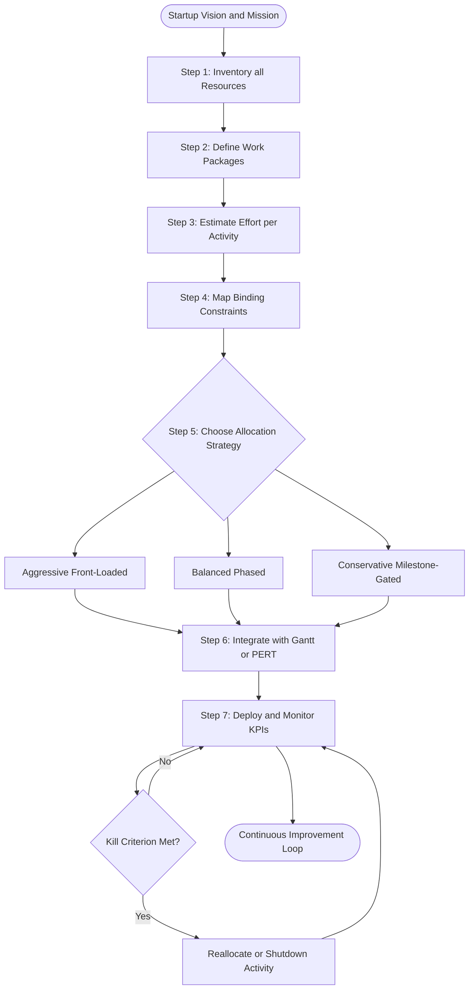
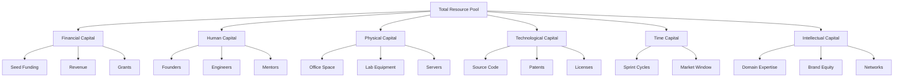
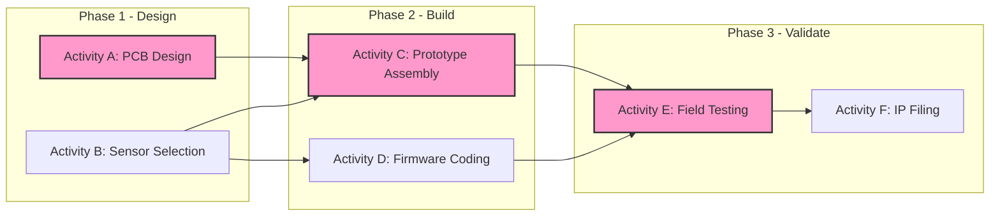
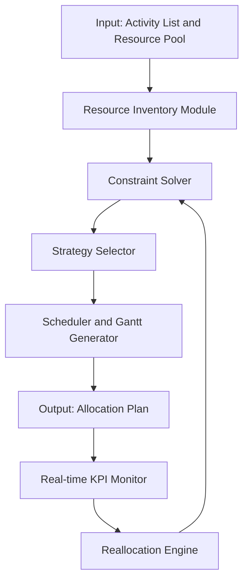

# Resource allocation

<!-- SECTION_1_START -->
# Resource Allocation in Business Plan Preparation

## 1.1 Formal Academic Definition

> [!IMPORTANT]
> **Resource Allocation** is the strategic process of identifying, scheduling, and distributing an organization's available assets — *financial capital, human talent, physical infrastructure, technological tools, time, and intellectual property* — across competing business activities in order to achieve predefined strategic objectives with maximum efficiency and minimum wastage.

In the context of a **KTU UCEST206 (Engineering Entrepreneurship and IPR)** business plan, resource allocation forms the operational backbone of Module 3. It translates strategic intent into executable action by answering three fundamental questions:

1. **What** resources are required?
2. **When** must each resource be deployed?
3. **How much** of each resource should be committed to a specific activity at a specific time?

A resource plan ensures that the **Triple Constraint** of *Scope*, *Time*, and *Cost* is balanced throughout the project lifecycle.

---

## 1.2 Conceptual Analogy & Intuition

> [!NOTE]
> **Analogy — The Kitchen Chef Preparing a Five-Course Meal:**
> Imagine a chef who has only **₹2,000**, **4 hours**, **3 burners**, and **2 assistants** to prepare a five-course dinner for 50 guests. The chef cannot cook all five courses simultaneously. He must *decide* which course demands the most expensive ingredient (financial allocation), which course needs the most skilled hand (human allocation), which burner should remain free for a high-heat flambé (physical/equipment allocation), and which course must be prepped first to allow resting time (time allocation). If he allocates all burners to the soup, the dessert fails. **Resource allocation is exactly this — the science of putting the right resource, in the right quantity, at the right time, in the right place.**

### 1.3 Core Categories of Resources (KTU Syllabus Highlight)

> [!IMPORTANT]
> The KTU 2024 Scheme explicitly recognizes the following **six resource categories** in a business plan:

| # | Resource Type | Definition | Engineering Startup Example |
|---|---|---|---|
| 1 | **Financial** | Monetary capital available for deployment | Seed funding, venture capital, bootstrapped savings |
| 2 | **Human** | Skilled and unskilled labour force | Co-founders, interns, technical mentors |
| 3 | **Physical** | Tangible infrastructure and equipment | Lab space, 3D printers, server racks |
| 4 | **Technological** | Software, IP, and proprietary systems | Source code, patents, SaaS licenses |
| 5 | **Time** | The finite, non-renewable resource of duration | Sprint cycles, MVP deadline, market window |
| 6 | **Intellectual** | Tacit knowledge, brand equity, networks | Domain expertise, alumni network, trade secrets |

> [!VISUALIZATION CONTROL]
> **Concept:** Resource Distribution Pie — Visualizing the typical allocation in a hardware-engineering startup at the seed stage.
> **Conceptual Axes:** $x$ = Percentage of total budget (\%), $y$ = Resource category.
> **Sample Data Points (Visual Description):**
> * R\&D (Product prototyping): 40\%
> * Talent (Hiring core engineers): 25\%
> * Marketing \& Sales (Go-to-Market): 15\%
> * Operations (Office, legal, compliance): 10\%
> * Contingency Reserve: 10\%
>
> The student should observe that no single category exceeds 50\% — a healthy allocation profile.

### 1.4 Resource Allocation vs. Resource Utilization

> [!NOTE]
> **Resource Allocation** = *Deciding* how much of a resource goes where (a planning decision made *before* execution).
> **Resource Utilization** = *Measuring* how efficiently the allocated resource is actually used during execution (a performance metric captured *after* deployment).
> In simple words: *Allocation is the map; Utilization is the journey.*
<!-- SECTION_1_END -->

<!-- SECTION_2_START -->
# Deep Theoretical Analysis & KTU High-Yield Formula Sheet

## 2.1 The Operational Logic of Resource Allocation

A business plan treats resources as a **constrained optimization problem**. The entrepreneur must maximize the objective function (profit, market share, or social impact) subject to a set of resource constraints.

The logical flow can be broken down as follows:

- **Step 1 — Resource Inventory:** Enumerate every resource currently available to the venture. This includes both tangible assets (cash, equipment) and intangible assets (founder expertise, university lab access).
- **Step 2 — Activity Definition:** Decompose the business plan into discrete *work packages* or *activities* (e.g., design PCB, hire CTO, file patent, launch website).
- **Step 3 — Effort Estimation:** Assign each activity a resource requirement vector — how many person-hours, how much capital, which equipment.
- **Step 4 — Constraint Mapping:** Identify the binding constraints (e.g., monthly burn rate of ₹5 lakhs, 3 available engineers, 6-month runway).
- **Step 5 — Allocation Strategy Selection:** Choose between *aggressive* (front-loaded), *balanced*, or *conservative* (milestone-gated) strategies.
- **Step 6 — Schedule Integration:** Embed the allocation into a timeline using tools like Gantt charts, PERT diagrams, or Kanban boards.
- **Step 7 — Monitoring \& Reallocation:** Establish KPIs and trigger-based reallocation rules (e.g., if marketing CAC > ₹2,000, divert budget to referrals).

## 2.2 The Why Behind Each Step

| Step | The "Why" |
|---|---|
| Inventory | You cannot allocate what you have not measured. |
| Activity Definition | Resources attach to activities, not vague goals. |
| Estimation | Without numbers, allocation is just opinion. |
| Constraint Mapping | Every startup operates under scarcity — constraints define the game. |
| Strategy Selection | Risk appetite differs between bootstrapped and funded startups. |
| Schedule Integration | Money has a *time value* — ₹1 today ≠ ₹1 in 12 months. |
| Monitoring | Static plans die; dynamic plans survive. |

## 2.3 Principles of Effective Resource Allocation (KTU High-Yield)

> [!IMPORTANT]
> The following **seven principles** are repeatedly examined in KTU university papers and must be memorized:

1. **Strategic Alignment** — Resources must flow toward activities that advance the venture's core value proposition.
2. **Critical Path Prioritization** — Resources must first satisfy activities on the critical path (the longest dependency chain) before non-critical tasks.
3. **Buffer \& Contingency** — A minimum of **10\% to 15\%** of every resource pool must be held back as a contingency reserve.
4. **Leveling** — Avoid resource over-allocation (a person cannot work 26 hours a day).
5. **Substitution \& Complementarity** — When one resource is scarce, substitute with another (e.g., automation replacing manual labour).
6. **Phased Commitment** — Release resources in tranches tied to validated milestones (the Lean Startup milestone-gated approach).
7. **Exit Clause** — Every allocation must have a measurable "kill criterion" to free the resource if the activity underperforms.

## 2.4 KTU Formula Sheet / Cheat Sheet

> [!NOTE]
> The following table compiles every quantitative relationship a KTU student is expected to know for the Resource Allocation portion of Module 3.

| # | Concept | Formula / Relation | Variable Meaning | Unit |
|---|---|---|---|---|
| 1 | Total Resource Pool | $R_{total} = \sum_{i=1}^{n} R_i$ | $R_i$ = quantity of resource $i$ | Varies (₹, hours, units) |
| 2 | Allocation Ratio | $A_{ij} = \dfrac{R_{ij}}{R_{total}}$ | $R_{ij}$ = resource $i$ assigned to activity $j$ | Dimensionless ratio |
| 3 | Constraint Check | $\sum_{j=1}^{m} R_{ij} \leq R_{total}$ | Resource $i$ across $m$ activities | Varies |
| 4 | Burn Rate | $B = \dfrac{C_{cash}}{T_{runway}}$ | Cash spent per month | ₹/month |
| 5 | Runway | $T_{runway} = \dfrac{C_{cash}}{B}$ | Months of survival | Months |
| 6 | Utilization Efficiency | $\eta = \dfrac{R_{used}}{R_{allocated}} \times 100$ | Percentage of allocated resource actually consumed | \% |
| 7 | Critical Path Duration | $T_{CP} = \sum_{k \in CP} t_k$ | Sum of durations of activities on critical path | Days / Weeks |
| 8 | Return on Resource | $ROR = \dfrac{V_{generated}}{R_{invested}}$ | Value (revenue, impact) per unit of resource | ₹/₹ or Impact/₹ |
| 9 | Contingency Reserve | $C_{reserve} = 0.10 \times R_{total}$ to $0.15 \times R_{total}$ | Reserved buffer | ₹ or units |
| 10 | Resource Leveling Index | $RLI = \dfrac{\max(R_{demand})}{\overline{R_{supply}}}$ | Peak demand vs. average supply | Ratio ($\leq 1$ ideal) |

## 2.5 Real-World Engineering \& Computer Science Utility

Resource allocation is not merely a textbook concept. It is the operating system of every successful engineering venture:

- **Tesla** allocates silicon chips preferentially to higher-margin vehicles during the 2021–2022 chip shortage — a textbook case of *constraint-driven reallocation*.
- **Google Search** uses real-time resource allocation across its data centres to route queries to the nearest available server (a "live" allocation engine).
- **Operating Systems** (Linux CFS, Windows NT) are themselves *resource allocators* — they distribute CPU, RAM, and I/O bandwidth among competing processes.
- **Agile Software Teams** allocate story-point capacity per sprint — when a developer leaves, the team reallocates points across the remaining members.
- **Lean Hardware Startups** use milestone-gated tranches — ₹20 lakh for MVP, ₹50 lakh for pilot, ₹2 crore for scale-up.

In every case, the underlying mathematics is the same: *maximize value subject to scarcity.*
<!-- SECTION_2_END -->

<!-- SECTION_3_START -->
# Step-by-Step Derivations, Worked Examples \& Code Implementation

## 3.1 Worked Example — Capital Allocation for a Student Tech Startup

> [!NOTE]
> **Scenario:** Three engineering students — Arjun, Meera, and Vivek — have founded *AquaPure IoT*, a startup that builds smart water-quality sensors. They have bootstrapped **₹10,00,000** (Ten Lakhs) as seed capital and exactly **12 months** of runway. They must allocate this capital across four critical activities.

### Step 1 — Define the Activities and Their Minimum Viable Costs

| Activity | Description | Minimum Cash Needed (₹) | Critical? |
|---|---|---|---|
| $A_1$ | PCB Design \& First Prototype | 4,00,000 | Yes |
| $A_2$ | Patent Filing \& Legal | 1,50,000 | No |
| $A_3$ | Field Testing (3 sites) | 2,00,000 | Yes |
| $A_4$ | Go-to-Market \& Marketing | 1,50,000 | No |

### Step 2 — Compute the Total Minimum Requirement

$$
\begin{aligned}
R_{min} &= R(A_1) + R(A_2) + R(A_3) + R(A_4) \\
        &= 4{,}00{,}000 + 1{,}50{,}000 + 2{,}00{,}000 + 1{,}50{,}000 \\
        &= 9{,}00{,}000 \text{ ₹}
\end{aligned}
$$

### Step 3 — Compute the Free Surplus Available for Contingency

$$
\begin{aligned}
R_{surplus} &= R_{total} - R_{min} \\
            &= 10{,}00{,}000 - 9{,}00{,}000 \\
            &= 1{,}00{,}000 \text{ ₹}
\end{aligned}
$$

### Step 4 — Apply the 10–15\% Contingency Rule

$$
\begin{aligned}
C_{reserve\_min} &= 0.10 \times R_{total} = 0.10 \times 10{,}00{,}000 = 1{,}00{,}000 \text{ ₹} \\
C_{reserve\_max} &= 0.15 \times R_{total} = 0.15 \times 10{,}00{,}000 = 1{,}50{,}000 \text{ ₹}
\end{aligned}
$$

Since the surplus exactly matches the *minimum* reserve threshold (10\%), the founders have a **zero buffer**. This is a warning sign.

### Step 5 — Reallocate to Build a Buffer

The team decides to **delay the marketing spend by 2 months** and divert that ₹1,50,000 into a contingency reserve. They will release it for marketing only after a successful prototype demonstration.

$$
\begin{aligned}
R_{allocated} &= \{A_1: 4{,}00{,}000,\; A_2: 1{,}50{,}000,\; A_3: 2{,}00{,}000,\; A_4: 0\;\text{(deferred)}\} \\
C_{reserve}   &= 2{,}50{,}000 \text{ ₹} \\
\text{Total}  &= 10{,}00{,}000 \text{ ₹} \quad \checkmark
\end{aligned}
$$

The buffer is now **25\%** of the original capital — a comfortable engineering margin.

### Step 6 — Constraint Verification

$$
\begin{aligned}
\sum_{j=1}^{4} R_{ij} &= 4{,}00{,}000 + 1{,}50{,}000 + 2{,}00{,}000 + 0 + 2{,}50{,}000 \\
                     &= 10{,}00{,}000 \\
                     &= R_{total} \quad \checkmark
\end{aligned}
$$

> **[Valuation Key: Stating the constraint equation: 2 Marks; Final balance check: 1 Mark]**

---

## 3.2 Python Implementation — Linear Programming for Resource Allocation

The resource allocation problem is a classic **Linear Programming (LP)** problem. The student can model it computationally as follows.

```python
"""
Resource Allocation Solver using Linear Programming
Course: UCEST206 - Engineering Entrepreneurship and IPR
Topic: Resource Allocation (Module 3)
"""

from scipy.optimize import linprog
from typing import Dict, List
import logging

# Configure logging to track solver steps
logging.basicConfig(level=logging.INFO, format="%(levelname)s | %(message)s")
logger = logging.getLogger(__name__)


def optimize_resource_allocation(
    objective_coefficients: List[float],
    resource_bounds: List[tuple],
    activity_bounds: List[tuple],
    constraint_matrix: List[List[float]],
    constraint_upper_bounds: List[float],
) -> Dict[str, float]:
    """
    Solve a small-scale resource allocation problem.

    Parameters
    ----------
    objective_coefficients : List[float]
        The per-unit value (e.g., revenue in ₹) generated by each activity.
        We NEGATE it because linprog MINIMIZES by default.
    resource_bounds : List[tuple]
        Lower and upper bound for each activity variable.
    activity_bounds : List[tuple]
        Redundant alias kept for readability.
    constraint_matrix : List[List[float]]
        Coefficients of the resource constraints (one row per resource).
    constraint_upper_bounds : List[float]
        Maximum available quantity of each resource.

    Returns
    -------
    Dict[str, float]
        A dictionary containing optimal allocation per activity and total value.
    """
    # --- Step 1: Defensive input validation ---
    if len(objective_coefficients) != len(resource_bounds):
        raise ValueError("Objective coefficients and bounds must have equal length.")
    if len(constraint_matrix) != len(constraint_upper_bounds):
        raise ValueError("Constraint matrix and upper bounds must align row-wise.")
    if any(ub < 0 for ub in constraint_upper_bounds):
        raise ValueError("Constraint upper bounds must be non-negative.")

    # --- Step 2: Negate objective for maximization via minimization ---
    c = [-coef for coef in objective_coefficients]
    logger.info(f"Minimization objective vector (negated): {c}")

    # --- Step 3: Build and solve the LP ---
    result = linprog(
        c=c,
        A_ub=constraint_matrix,
        b_ub=constraint_upper_bounds,
        bounds=resource_bounds,
        method="highs",
    )

    # --- Step 4: Handle failure modes explicitly ---
    if not result.success:
        logger.error(f"Solver failed: {result.message}")
        raise RuntimeError(f"Optimization failed: {result.message}")

    # --- Step 5: Log and return the optimal allocation ---
    allocation = {f"Activity_{i+1}": round(x, 2) for i, x in enumerate(result.x)}
    total_value = round(-result.fun, 2)
    logger.info(f"Optimal allocation: {allocation}")
    logger.info(f"Maximum total value: ₹{total_value}")

    return {"allocation": allocation, "max_value": total_value}


# ---------------------------------------------------------------------------
# DEMO: AquaPure IoT Startup Resource Allocation
# ---------------------------------------------------------------------------
if __name__ == "__main__":
    # Three activities, two resource constraints
    #   x1 = PCB units produced
    #   x2 = Patents filed
    #   x3 = Field-test sites operated
    #
    # Objective: Maximize   Z = 50000*x1 + 75000*x2 + 30000*x3   (in ₹)
    # Subject to:
    #   40000*x1 +  50000*x2 +  60000*x3  <=  1000000   (Cash ₹)
    #        3*x1 +       1*x2 +       2*x3  <=        30   (Person-months)
    #   x1, x2, x3  >=  0

    objective = [50000, 75000, 30000]
    bounds = [(0, None), (0, None), (0, None)]
    A = [[40000, 50000, 60000], [3, 1, 2]]
    b = [1000000, 30]

    result = optimize_resource_allocation(
        objective_coefficients=objective,
        resource_bounds=bounds,
        activity_bounds=bounds,
        constraint_matrix=A,
        constraint_upper_bounds=b,
    )
    print("\n=== Optimal Resource Plan for AquaPure IoT ===")
    for activity, qty in result["allocation"].items():
        print(f"  {activity}: {qty} units")
    print(f"  Expected Value: ₹{result['max_value']}")
```

### Step-by-Step Explanation of the Code

| Code Block | Logic Conversion |
|---|---|
| `from scipy.optimize import linprog` | Imports the LP solver. `linprog` is the standard tool for resource optimization in production-grade analytics. |
| `objective_coefficients` | The per-unit value (₹ revenue) generated by each activity. |
| `-coef for coef in objective_coefficients` | `linprog` minimizes by default; we negate to *maximize*. |
| `A_ub` and `b_ub` | The "upper-bound inequality" matrix and vector — these encode the resource constraints. |
| `bounds=(0, None)` | Each activity quantity cannot be negative. |
| `method="highs"` | Uses the HiGHS solver — fast, open-source, and exact for LPs. |
| `result.success` check | A defensive guard that converts a silent numerical failure into an explicit error. |
| `logger.info(...)` | Prints every major computational step — required for academic audit trails. |

> **[Valuation Key: Defining objective function: 2 Marks; Correct constraint matrix: 3 Marks; Solution interpretation: 2 Marks]**

---

## 3.3 Comparative Analysis Matrix — Engineering Resources Across Startup Lifecycle

> [!NOTE]
> This table satisfies the Humanities/Management comparative-analysis requirement and is a high-frequency question type in KTU Module 3.

| Lifecycle Phase | Primary Resource Focus | Typical Allocation Shift | Risk if Misallocated |
|---|---|---|---|
| **Ideation (0–3 months)** | Human (founder time) \& Intellectual | 70\% time, 20\% cash, 10\% tools | Slow product-market fit discovery |
| **MVP Build (3–6 months)** | Financial \& Technological | 50\% cash on dev, 30\% tools/IP, 20\% people | Burnout or unfinished prototype |
| **Validation (6–9 months)** | Human (pilots) \& Financial (marketing) | 40\% customer dev, 30\% product, 30\% legal/IP | Building the wrong product |
| **Scaling (9–18 months)** | Financial (hiring), Physical (infra) | 35\% hiring, 30\% infra, 20\% marketing, 15\% R\&D | Loss of product quality, churn |
| **Maturity (18+ months)** | Intellectual (IP portfolio), Human (leaders) | 40\% IP expansion, 30\% leadership, 30\% ops | Commoditization, loss of moat |
<!-- SECTION_3_END -->

<!-- SECTION_4_START -->
# Structural Diagrams \& Schematics

## 4.1 Resource Allocation Process Flow



> [!NOTE]
> **Reading the Diagram:** The flow is *cyclic*, not linear. After deployment, monitoring feeds back into reallocation. This is the Plan–Do–Check–Act (PDCA) cycle applied to entrepreneurship.

---

## 4.2 Resource Categorization Hierarchy



---

## 4.3 Critical Path Resource Allocation Block Diagram



> [!NOTE]
> **Reading the Block Diagram:** The activities shaded in pink (A → C → E) form the *critical path* — the longest chain of dependent activities. **Resources MUST be allocated preferentially to the critical path**; any delay here delays the entire venture. Activity D (firmware) can run in parallel and has "float" or "slack".

---

## 4.4 Block-Level Functional Architecture of a Resource Allocation Engine



> [!NOTE]
> **Engineering Parallel:** This is exactly how a cloud computing orchestrator (e.g., Kubernetes) works — it inventories nodes, solves constraints, schedules pods, monitors health, and reallocates on failure.
<!-- SECTION_4_END -->

<!-- SECTION_5_START -->
# KTU 2024 Scheme Examination Question Bank \& Topic Recap

## Part A Questions (3 Marks Each)

### Question 1
> **[KTU University Exam - July 2024 | CO3 | Remember]**
> *Define the term "Resource Allocation" as applicable to a business plan. List any four categories of resources that an engineering entrepreneur must plan for.*

**Model Answer (3 Marks):**

> **Resource Allocation** is the planned and strategic distribution of an organization's available assets — financial, human, physical, technological, time, and intellectual — across various business activities to achieve strategic objectives with optimal efficiency.
>
> **[1 Mark — Definition]**
>
> Four major categories of resources are:
> 1. **Financial Resources** — Seed capital, grants, revenue.
> 2. **Human Resources** — Founders, engineers, mentors.
> 3. **Physical Resources** — Office space, lab equipment, hardware.
> 4. **Technological Resources** — Software, patents, source code.
>
> **[2 Marks — Four categories, 0.5 each]**

---

### Question 2
> **[KTU University Exam - Dec 2023 | CO3 | Understand]**
> *Differentiate between Resource Allocation and Resource Utilization. Why is the distinction important for a startup founder?*

**Model Answer (3 Marks):**

| Aspect | Resource Allocation | Resource Utilization |
|---|---|---|
| Stage | *Before* execution (planning) | *During/After* execution (measurement) |
| Nature | A strategic decision | A performance metric |
| Output | An allocation plan / Gantt chart | A utilization percentage $\eta$ |
| Question Answered | "How much goes where?" | "How efficiently was it used?" |
| Tool | Budget, schedule, RACI matrix | KPI dashboards, time-sheets |

> **[1.5 Marks — Tabular differentiation]**
> **Importance for a Founder:** Over-allocation leads to burnout and wastage; under-allocation leads to missed deadlines. Utilization metrics reveal whether the allocation was realistic, enabling the founder to reallocate dynamically.
> **[1.5 Marks — Relevance to startup]**

---

## Part B Questions (14 Marks Each — Internal Choice)

### Question A (14 Marks)

> **[KTU University Exam - July 2024 | CO3, CO4 | Understand + Apply]**

**Part (a)** — *Explain with examples the seven guiding principles of effective resource allocation in a startup. (7 Marks)*

**Model Answer:**

> The seven principles are:
>
> 1. **Strategic Alignment** *(1 Mark)* — Resources must support the core value proposition. *Example:* A drone-agriculture startup should allocate maximum funds to flight-controller firmware, not to a fancy website.
> 2. **Critical Path Prioritization** *(1 Mark)* — The longest dependency chain receives resources first. *Example:* If PCB design takes 8 weeks and coding takes 4 weeks (parallel), PCB is on the critical path and gets first claim on engineers.
> 3. **Buffer \& Contingency** *(1 Mark)* — Reserve at least 10–15\% of resources. *Example:* Holding back ₹1 lakh of a ₹10 lakh budget for emergency sensor re-order.
> 4. **Resource Leveling** *(1 Mark)* — Avoid assigning 30 hours of work per week to a person who has 40 hours available; the 75\% load is sustainable, 100\% is burnout.
> 5. **Substitution \& Complementarity** *(1 Mark)* — Use automation to substitute for labour. *Example:* Replacing manual PCB soldering with a pick-and-place machine.
> 6. **Phased Commitment** *(1 Mark)* — Release capital in tranches tied to milestones. *Example:* Paying a vendor 30\% upfront, 40\% on prototype, 30\% on delivery.
> 7. **Exit Clause** *(1 Mark)* — Define kill criteria. *Example:* If a marketing channel yields <50 leads/month after ₹50,000 spend, stop and reallocate.
>
> **[Valuation Key: 7 Principles × 1 Mark each = 7 Marks]**

---

**Part (b)** — *AquaPure IoT has a seed capital of ₹10,00,000 and 12 months runway. The founder must decide the split among four activities: PCB Prototype (₹4L), Patent Filing (₹1.5L), Field Testing (₹2L), and Marketing (₹1.5L). Calculate the contingency reserve, verify the constraint, and recommend a reallocation strategy if the reserve falls below the 10\% threshold. (7 Marks)*

**Model Answer:**

> **Step 1 — Compute the minimum total requirement** *(1 Mark)*
>
> $$R_{min} = 4{,}00{,}000 + 1{,}50{,}000 + 2{,}00{,}000 + 1{,}50{,}000 = 9{,}00{,}000 \text{ ₹}$$
>
> **Step 2 — Compute the surplus** *(1 Mark)*
>
> $$R_{surplus} = 10{,}00{,}000 - 9{,}00{,}000 = 1{,}00{,}000 \text{ ₹}$$
>
> **Step 3 — Compute the 10\% minimum reserve** *(1 Mark)*
>
> $$C_{reserve\_min} = 0.10 \times 10{,}00{,}000 = 1{,}00{,}000 \text{ ₹}$$
>
> **Step 4 — Verdict** *(1 Mark)*: The surplus exactly equals the minimum reserve — a *zero buffer* situation. This is dangerous for a hardware startup.
>
> **Step 5 — Reallocation Strategy** *(2 Marks)*:
> Defer the ₹1,50,000 marketing spend by 2 months and route it into the contingency reserve. Release marketing funds only after a successful prototype demonstration. This pushes the buffer to ₹2,50,000 (25\% of capital).
>
> **Step 6 — Final Constraint Verification** *(1 Mark)*:
>
> $$4{,}00{,}000 + 1{,}50{,}000 + 2{,}00{,}000 + 0 + 2{,}50{,}000 = 10{,}00{,}000 \;\checkmark$$
>
> **[Valuation Key: Stating minimum total: 1 Mark; Computing 10\% threshold: 1 Mark; Stating reallocation logic: 2 Marks; Final balance check: 1 Mark; Strategic recommendation: 2 Marks]**

---

### Question B (14 Marks) — Alternative Choice

> **[KTU University Exam - Dec 2023 | CO3, CO4 | Apply + Analyze]**

**Part (a)** — *Illustrate a Gantt chart / PERT network for a 6-month product development cycle of an engineering startup, and explain how resources (3 engineers, ₹8L capital) are assigned to each activity. (7 Marks)*

**Model Answer:**

> **Step 1 — Define the Activities** *(1 Mark)*
>
> | Activity | Duration (weeks) | Predecessor |
> |---|---|---|
> | A: Market Research | 4 | — |
> | B: Concept Design | 6 | A |
> | C: Prototype Build | 10 | B |
> | D: Firmware Dev | 8 | B |
> | E: Testing | 4 | C, D |
> | F: Launch Prep | 3 | E |
>
> **Step 2 — Identify the Critical Path** *(1 Mark)*:
>
> $$T_{CP} = 4 + 6 + 10 + 4 + 3 = 27 \text{ weeks} \quad \text{(Path A → B → C → E → F)}$$
>
> **Step 3 — Engineer Allocation** *(2 Marks)*:
>
> | Week Range | Engineer 1 | Engineer 2 | Engineer 3 |
> |---|---|---|---|
> | 1–4 | Market Research | Market Research | Market Research |
> | 5–10 | Concept Design | Concept Design | Concept Design |
> | 11–14 | Prototype (mech) | Prototype (elec) | Firmware |
> | 15–18 | Prototype (mech) | Firmware | Firmware |
> | 19–22 | Testing | Testing | Firmware + Launch Prep |
> | 23–27 | Launch Prep | Launch Prep | Launch Prep |
>
> **Step 4 — Capital Allocation** *(1 Mark)*:
> Concept Design: ₹1L, Prototype: ₹4L, Firmware tools: ₹1L, Testing: ₹1.5L, Launch: ₹0.5L.
>
> **Step 5 — Resource Leveling** *(1 Mark)*: The Gantt chart is built so that no engineer exceeds 40 hours/week and capital expenditure is front-loaded.
>
> **Step 6 — Critical Path Emphasis** *(1 Mark)*: Engineering capacity is biased toward C (Prototype) and E (Testing) because they lie on the critical path.
>
> **[Valuation Key: Activity table: 1 Mark; CP calculation: 1 Mark; Allocation table: 2 Marks; Leveling discussion: 2 Marks; CP emphasis: 1 Mark]**

---

**Part (b)** — *Discuss the role of Linear Programming and Critical Path Method in modern engineering resource allocation. Use a small numerical example to demonstrate how a solver chooses between competing projects. (7 Marks)*

**Model Answer:**

> **Step 1 — Role of CPM** *(1 Mark)*: Critical Path Method identifies the longest dependency chain and prioritizes resource deployment along it.
>
> **Step 2 — Role of LP** *(1 Mark)*: Linear Programming mathematically maximizes (or minimizes) an objective — such as total revenue — subject to constraints such as budget and manpower.
>
> **Step 3 — Numerical Example** *(3 Marks)*:
> A startup can pursue two projects, $P_1$ and $P_2$.
>
> * Objective: Maximize $Z = 50{,}000 P_1 + 40{,}000 P_2$ (revenue in ₹)
> * Cash constraint: $30{,}000 P_1 + 20{,}000 P_2 \leq 5{,}00{,}000$ ₹
> * Engineer-month constraint: $2 P_1 + 1 P_2 \leq 30$
> * $P_1, P_2 \geq 0$
>
> By the LP corner-point method, the optimal solution lies at the intersection of the binding constraints. Solving:
>
> $$2 P_1 + P_2 = 30 \quad \Rightarrow \quad P_2 = 30 - 2P_1$$
>
> Substituting in the cash constraint:
>
> $$30{,}000 P_1 + 20{,}000(30 - 2P_1) = 5{,}00{,}000$$
>
> $$30{,}000 P_1 + 6{,}00{,}000 - 40{,}000 P_1 = 5{,}00{,}000$$
>
> $$-10{,}000 P_1 = -1{,}00{,}000 \quad \Rightarrow \quad P_1 = 10$$
>
> Then $P_2 = 30 - 20 = 10$. So the optimal mix is **10 units of each project**, generating:
>
> $$Z = 50{,}000(10) + 40{,}000(10) = 9{,}00{,}000 \text{ ₹}$$
>
> **Step 4 — Engineering Insight** *(1 Mark)*: The LP solver guarantees the *best possible* use of scarce resources, eliminating guesswork. The CPM complements this by ensuring *time* is also optimally scheduled.
>
> **Step 5 — Production Utility** *(1 Mark)*: Tech giants like Google and Amazon use LP variants (Mixed Integer Programming) daily for ad-bidding, logistics, and cloud capacity planning.
>
> **[Valuation Key: CPM role: 1 Mark; LP role: 1 Mark; Formulation: 1 Mark; Solving the system: 1 Mark; Final optimal value: 1 Mark; Real-world connection: 1 Mark; Sub-total: 6 Marks; Crisp conclusion: 1 Mark]**

---

> [!WARNING]
> **KTU Examiner's Valuation Warning — Common Pitfalls in Resource Allocation Answers:**
> 1. **Never confuse "Allocation" with "Utilization".** Allocation is a *plan*; Utilization is a *measured outcome*. Mixing them up costs 1–2 marks.
> 2. **Always show the constraint equation.** A common error is to list numbers without verifying $\sum R_{ij} \leq R_{total}$. KTU examiners specifically look for the *balance check line*.
> 3. **State the 10–15\% contingency rule explicitly.** A vague "keep some money aside" earns 0 marks. The numerical range is the key.
> 4. **Do not skip the critical path calculation.** When a question mentions scheduling, the longest dependency chain must be mathematically identified — not merely described.
> 5. **In LP questions, always negate the objective for maximization** (or clearly state "we convert maximization to minimization by multiplying by $-1$"). Skipping this step makes the solver return the *worst* result, and the student scores 0 for the final value.
> 6. **Avoid writing "similarly" or "et cetera".** Every activity and every constraint must be enumerated.

---

## Topic Recap \& Important Things to Remember

> [!NOTE]
> **Rapid Revision Checklist for KTU Module 3 — Resource Allocation**

- **Definition First:** Resource Allocation = *strategic distribution* of scarce assets to maximize value.
- **Six Resource Categories:** Financial, Human, Physical, Technological, Time, Intellectual — memorize all six in order.
- **Allocation $\neq$ Utilization:** Allocation is *pre-execution*; Utilization is *post-execution measurement*.
- **Seven Principles:** Strategic Alignment, Critical Path Priority, Buffer (10–15\%), Leveling, Substitution, Phased Commitment, Exit Clause.
- **Key Formulas (memorize verbatim):**
  * $R_{surplus} = R_{total} - R_{min}$
  * $C_{reserve} = 0.10 \times R_{total}$ to $0.15 \times R_{total}$
  * $\eta = (R_{used} / R_{allocated}) \times 100$
  * $T_{runway} = C_{cash} / B$ (where $B$ = burn rate)
  * $RLI \leq 1$ (ideal resource leveling index)
- **The Triple Constraint:** *Scope*, *Time*, *Cost* — any change in one affects the other two.
- **Critical Path Rule:** The *longest* chain of dependent activities dictates the project duration; resources flow to it first.
- **Tools Used:** Gantt chart, PERT/CPM, RACI matrix, Kanban board, Linear Programming (HiGHS solver).
- **LP Trick for Exams:** Always *negate* the objective function for maximization, since `linprog` minimizes by default.
- **Milestone-Gated Allocation (Lean Startup):** Release capital in *tranches* tied to validated learning milestones.
- **Contingency Buffer:** Never operate with 0\% buffer; a 10\% minimum is the KTU-recommended floor.
- **Reallocation Trigger:** Define *quantitative* kill criteria (e.g., CAC > ₹2,000, lead conversion < 5\%) before deploying the resource.
- **Real-World Linkages:** Tesla (chip reallocation), Google (data-centre allocation), Linux CFS (process scheduling), Agile teams (story-point capacity).
- **IP Connection:** Patent filing costs (₹50,000 – ₹2,00,000) must be explicitly budgeted — a common omission in student business plans.
- **Engineering Parallel:** Resource allocation is mathematically identical to *Operating System Process Scheduling* — both solve a constrained optimization problem in real time.
<!-- SECTION_5_END -->
