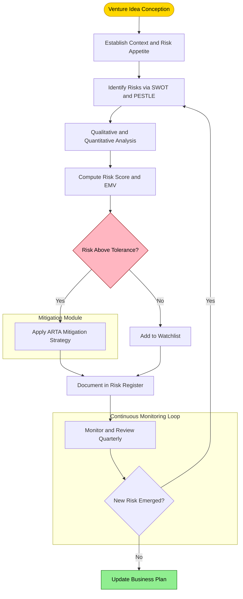
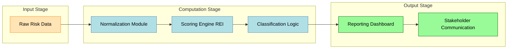

# Risk management

<!-- SECTION_1_START -->
# Risk Management in Business Plan Preparation

> [!IMPORTANT]
> **KTU 2024 Scheme | UCEST206 | Module 3 | Topic: Risk Management**
> This topic is mapped to **CO3** of the Engineering Entrepreneurship & IPR syllabus. Students must understand how to identify, classify, mitigate, and plan for risks when preparing a commercially viable business plan.

## 1.1 Formal Academic Definition

**Risk** in the context of a business plan is defined as any uncertain event or condition that, if it occurs, has a positive or negative effect on a business's ability to achieve its strategic, operational, financial, or compliance objectives.

> [!NOTE]
> **KTU Definition (Board-Standard):**
> *Risk management* is the systematic process of **identifying, analyzing, evaluating, treating, and monitoring** the uncertainties encountered during the planning and execution of an entrepreneurial venture, with the objective of minimizing losses and maximizing opportunities for stakeholder value creation.

The two principal dimensions that mathematically and qualitatively define risk are:

- **Probability of Occurrence ($P$)** — the likelihood that the risk event will materialize, typically expressed as a value in the closed interval $[0, 1]$.
- **Impact or Severity ($I$)** — the magnitude of consequence (financial loss, reputational harm, legal liability) the event will impose on the venture.

> [!WARNING]
> **Board Pitfall:** Risk is *not* synonymous with *uncertainty*. Uncertainty refers to situations where outcomes and probabilities are unknown (Knightian Uncertainty), whereas risk implies that probabilities can be estimated. Examiners often award partial credit for explicitly distinguishing the two.

## 1.2 Intuitive Analogy — Plain English Explanation

Imagine you are planning a road trip from **Thiruvananthapuram to Delhi** in your newly purchased car. Before leaving, you think about:

1. **Punctured tyre on the highway** — *what is the chance, and how bad will it be?*
2. **Sudden heavy rain** — *should I check the weather forecast?*
3. **Engine overheating** — *did I service the car recently?*
4. **Roadblocks or diversions** — *do I have a backup route?*

You are essentially performing **risk management**. You:
- **Identify** what could go wrong,
- **Assess** how likely and how severe each is,
- **Plan** a response (carry a spare, download offline maps, service the car),
- **Monitor** the situation during the journey.

A business plan does the *exact same thing* for a startup — except the "car" is your company, and the "trip" is your 3–5 year strategic roadmap.

> [!TIP]
> **Memory Hook:** Think **R.A.M.P.** — **R**ecognize, **A**nalyze, **M**itigate, **P**lan continuously. This is the cyclical risk management process endorsed by ISO 31000 and adopted by KTU's entrepreneurship framework.

## 1.3 The Three Pillars of Risk in a Business Plan

| Pillar | Description | Typical Business Plan Section |
| :--- | :--- | :--- |
| **Strategic Risk** | Risks arising from poor business decisions, market shifts, or flawed value proposition | Marketing & Strategy Plan |
| **Operational Risk** | Risks from internal processes, people, supply chain, or technology failures | Operations Plan |
| **Financial Risk** | Risks of cash flow shortage, debt default, currency fluctuation, or investor withdrawal | Financial Plan |

## 1.4 Visualization Callout — Risk Matrix Concept

> [!VISUALIZATION CONTROL]
> **Concept:** Risk Heat Map (Probability vs. Impact)
> **GeoGebra / Desmos Input Equations:**
> * `P = x-axis (Probability: 0 to 1)`
> * `I = y-axis (Impact: 0 to 1)`
> * `f(x, y) = x * y` (Risk Score = Probability $\times$ Impact)
> **Visual Description:** Plot a 2D grid with Probability on the horizontal axis and Impact on the vertical axis. The product function $P \times I$ creates a curved "risk surface" that rises toward the top-right corner. The top-right quadrant represents **High Risk** (red zone), the bottom-left represents **Low Risk** (green zone), and the diagonal represents the **Risk Appetite Threshold** that the entrepreneur must define.

<!-- SECTION_1_END -->

<!-- SECTION_2_START -->
# Deep Theoretical Analysis & KTU High-Yield Formula Sheet

## 2.1 The Risk Management Process (ISO 31000 Framework)

The KTU 2024 syllabus adopts the **ISO 31000** risk management lifecycle. The complete operational sequence is:

1. **Establish Context** — Define the scope of the business plan, internal/external environment, and risk criteria (appetite, tolerance).
2. **Risk Identification** — Use structured techniques to enumerate all plausible risks.
3. **Risk Analysis** — Qualitatively or quantitatively assess the probability and impact.
4. **Risk Evaluation** — Compare estimated risk scores against pre-defined criteria to prioritize.
5. **Risk Treatment / Mitigation** — Develop response strategies (Avoid, Reduce, Transfer, Accept).
6. **Monitoring & Review** — Continuously track risk indicators and revise the plan.
7. **Communication & Consultation** — Engage stakeholders throughout the process.

> [!IMPORTANT]
> **KTU High-Yield Point:** Examiners frequently test the four **Risk Response Strategies**, often remembered by the acronym **ARTA** — **A**void, **R**educe (Mitigate), **T**ransfer, **A**ccept.

## 2.2 Risk Identification Techniques

The following structured brainstorming tools are expected knowledge for the KTU 2024 ESE:

- **SWOT Analysis** — Strengths, Weaknesses, Opportunities, Threats. *Weaknesses* and *Threats* feed the risk register.
- **PESTLE Analysis** — Political, Economic, Social, Technological, Legal, Environmental macro-risks.
- **Brainstorming & Delphi Technique** — Anonymous expert consensus used in tech startups.
- **Checklist Analysis** — Industry-standard risk catalogs (e.g., *RBS — Risk Breakdown Structure*).
- **Cause-and-Effect (Ishikawa) Diagram** — Fishbone diagram tracing risks to root causes.
- **Scenario Analysis** — Best-case, base-case, worst-case modelling.

## 2.3 Quantitative Risk Scoring — The KTU Formula Sheet

> [!NOTE]
> All formulas below are **board-tested**. Memorize the symbols, units, and the multiplication logic.

### 2.3.1 Risk Score (Expected Monetary Value)

The simplest and most exam-relevant formula:

$$R = P \times I$$

Where:
- $R$ = Risk Score (dimensionless index, or in currency units if $I$ is monetary)
- $P$ = Probability of occurrence, $P \in [0, 1]$
- $I$ = Impact (severity in ₹, or scaled 1–5)

### 2.3.2 Expected Monetary Value (EMV) for Decision Trees

For a business plan with multiple decision branches, each with several possible outcomes:

$$EMV = \sum_{i=1}^{n} (P_i \times V_i)$$

Where:
- $P_i$ = probability of outcome $i$
- $V_i$ = monetary value (profit or loss) of outcome $i$
- $n$ = total number of possible outcomes

### 2.3.3 Risk Exposure Index (REI)

Used in KTU module assignments to rank multiple risks in a register:

$$REI = P \times I \times E$$

Where:
- $E$ = Exposure factor (how exposed the venture is, scaled 1–3)
- A risk with $REI \geq 6$ is classified as **High**, $3 \leq REI < 6$ as **Medium**, and $REI < 3$ as **Low**.

### 2.3.4 Risk-Adjusted Discount Rate (for Financial Risk in Business Plan)

$$NPV_{adjusted} = \sum_{t=1}^{n} \frac{CF_t}{(1 + r + \alpha)^t} - C_0$$

Where:
- $CF_t$ = Cash flow in year $t$
- $r$ = Risk-free discount rate
- $\alpha$ = Risk premium (entrepreneur's required compensation for risk)
- $C_0$ = Initial investment

### 2.3.5 Sensitivity Analysis (Tornado Variable Sensitivity)

$$S_v = \frac{\Delta NPV / NPV_{base}}{\Delta X / X_{base}}$$

Where:
- $\Delta NPV$ = change in NPV when variable $X$ changes
- $X$ = the input variable (e.g., selling price, raw material cost)

## 2.4 KTU Formula & Concept Cheat Sheet

| Formula Symbol | Meaning | Typical Value/Range | Unit / Notes |
| :--- | :--- | :--- | :--- |
| $P$ | Probability of risk event | $0$ to $1$ | Dimensionless |
| $I$ | Impact severity | $1$ to $5$ (Likert) or ₹ | Scaled |
| $R$ | Risk Score | $0$ to $5$ (or $0$ to $1$ in normalized form) | Index |
| $EMV$ | Expected Monetary Value | Computed from decision tree | ₹ (Rupees) |
| $REI$ | Risk Exposure Index | $1$ to $15$ | Index |
| $\alpha$ | Risk premium | $2\%$ to $15\%$ | Percentage |
| $r$ | Risk-free rate | ~$6\%$ to $7\%$ (India 10Y G-Sec) | Percentage |
| $S_v$ | Sensitivity coefficient | $>1$ = elastic | Ratio |

## 2.5 Real-World Engineering Application

Risk management is **not academic** — it is the cornerstone of:

- **Startup pitch decks**: Investors (Sequoia, Accel, Y Combinator) demand a *Risk Slide* in every pitch.
- **Project Management**: PRINCE2 and PMI's PMBOK both mandate a *Risk Register*.
- **Banking & Insurance**: Basel III norms require operational risk capital allocation.
- **Engineering Projects**: NASA, ISRO, and DRDO all use formal risk matrices for mission-critical systems.
- **IT/Software Startups**: Cybersecurity risk frameworks (NIST, ISO 27001) are now mandatory for SaaS products handling customer data.

<!-- SECTION_2_END -->

<!-- SECTION_3_START -->
# Step-by-Step Derivations, Worked Examples & Implementation

## 3.1 Worked Example 1 — Risk Score Calculation (KTU Board Pattern)

> [!NOTE]
> **Problem (KTU July 2024 Pattern, 7-Mark Style):**
> An EdTech startup "LearnKerala" is preparing its business plan. The founder identifies three critical risks. Use the Risk Score formula $R = P \times I$ to compute and classify each.

| Risk Event | Probability ($P$) | Impact ($I$, in ₹) | Risk Score ($R$) | Classification |
| :--- | :---: | :---: | :---: | :--- |
| Server downtime during exam season | $0.4$ | ₹$5{,}00{,}000$ | ₹$2{,}00{,}000$ | **Medium** |
| Competitor launches free tier | $0.7$ | ₹$8{,}00{,}000$ | ₹$5{,}60{,}000$ | **High** |
| Single co-founder exits | $0.2$ | ₹$3{,}00{,}000$ | ₹$60{,}000$ | **Low** |

### Step-by-Step Solution:

**Step 1 — Compute Risk Score for Server Downtime:**

$$R_1 = P_1 \times I_1 = 0.4 \times 5{,}00{,}000$$

$$R_1 = 2{,}00{,}000 \text{ ₹}$$

[Valuation Key: Correct formula and substitution — **2 Marks**; Correct multiplication — **1 Mark**]

**Step 2 — Compute Risk Score for Competitor Free Tier:**

$$R_2 = P_2 \times I_2 = 0.7 \times 8{,}00{,}000$$

$$R_2 = 5{,}60{,}000 \text{ ₹}$$

[Valuation Key: Correct identification of highest exposure — **1 Mark**]

**Step 3 — Compute Risk Score for Co-founder Exit:**

$$R_3 = P_3 \times I_3 = 0.2 \times 3{,}00{,}000$$

$$R_3 = 60{,}000 \text{ ₹}$$

**Step 4 — Classification (using typical KTU threshold of ₹$2{,}00{,}000$):**
- $R_1 = ₹2L$ → **Medium**
- $R_2 = ₹5.6L$ → **High** (Priority for mitigation)
- $R_3 = ₹0.6L$ → **Low** (Accept & monitor)

[Valuation Key: Correct classification logic — **3 Marks**]

## 3.2 Worked Example 2 — Expected Monetary Value (EMV) Decision Tree

> [!NOTE]
> **Problem:** A hardware IoT startup "AgriBot Kerala" is deciding between two suppliers for sensor modules.
> * **Supplier A**: $60\%$ reliable, profit $V_A = ₹15$ lakh if successful, loss $L_A = ₹4$ lakh if failure.
> * **Supplier B**: $80\%$ reliable, profit $V_B = ₹10$ lakh if successful, loss $L_B = ₹6$ lakh if failure.
> Compute EMV and recommend the supplier.

### Step-by-Step Solution:

**Step 1 — EMV for Supplier A:**

$$EMV_A = (P_{success} \times V_A) - (P_{failure} \times L_A)$$

$$EMV_A = (0.6 \times 15{,}00{,}000) - (0.4 \times 4{,}00{,}000)$$

$$EMV_A = 9{,}00{,}000 - 1{,}60{,}000$$

$$EMV_A = 7{,}40{,}000 \text{ ₹}$$

[Valuation Key: Formula statement — **2 Marks**; Correct values — **2 Marks**; Final answer — **1 Mark**]

**Step 2 — EMV for Supplier B:**

$$EMV_B = (P_{success} \times V_B) - (P_{failure} \times L_B)$$

$$EMV_B = (0.8 \times 10{,}00{,}000) - (0.2 \times 6{,}00{,}000)$$

$$EMV_B = 8{,}00{,}000 - 1{,}20{,}000$$

$$EMV_B = 6{,}80{,}000 \text{ ₹}$$

**Step 3 — Recommendation:**

Since $EMV_A = ₹7{,}40{,}000 > EMV_B = ₹6{,}80{,}000$, the startup should choose **Supplier A**, which offers a higher expected monetary value despite lower reliability.

> [!TIP]
> **Board Insight:** Notice that higher reliability does *not* always yield higher EMV. This counterintuitive result is a classic examiner favourite.

## 3.3 Algorithmic Implementation — Python Risk Register

For engineering students building a real risk register prototype, here is a production-grade Python implementation:

```python
from dataclasses import dataclass, field
from typing import List, Dict
from enum import Enum
import logging

logging.basicConfig(
    level=logging.INFO,
    format="%(asctime)s | %(levelname)s | %(message)s"
)


class RiskLevel(Enum):
    """Enumeration for qualitative risk classification."""
    LOW = "Low"
    MEDIUM = "Medium"
    HIGH = "High"
    CRITICAL = "Critical"


@dataclass
class Risk:
    """A single risk event in the business plan risk register."""
    risk_id: str
    description: str
    probability: float          # P in [0, 1]
    impact_inr: float           # Impact in Indian Rupees
    exposure_factor: int = 1    # E in {1, 2, 3}

    def __post_init__(self) -> None:
        if not 0.0 <= self.probability <= 1.0:
            raise ValueError(
                f"Probability must be in [0, 1], got {self.probability}"
            )
        if self.impact_inr < 0:
            raise ValueError("Impact cannot be negative.")
        if self.exposure_factor not in (1, 2, 3):
            raise ValueError("Exposure factor must be 1, 2, or 3.")

    @property
    def risk_score(self) -> float:
        return self.probability * self.impact_inr

    @property
    def risk_exposure_index(self) -> float:
        return self.probability * self.impact_inr * self.exposure_factor

    @property
    def classification(self) -> RiskLevel:
        rei = self.risk_exposure_index
        if rei >= 8_00_000:
            return RiskLevel.CRITICAL
        elif rei >= 4_00_000:
            return RiskLevel.HIGH
        elif rei >= 1_00_000:
            return RiskLevel.MEDIUM
        return RiskLevel.LOW


class RiskRegister:
    """Manages the complete risk portfolio for a business plan."""

    def __init__(self, venture_name: str) -> None:
        self.venture_name = venture_name
        self.risks: List[Risk] = []
        logging.info(f"Risk register initialized for: {self.venture_name}")

    def add_risk(self, risk: Risk) -> None:
        self.risks.append(risk)
        logging.info(
            f"Added Risk {risk.risk_id}: {risk.classification.value}"
        )

    def prioritize(self) -> List[Risk]:
        sorted_risks = sorted(
            self.risks,
            key=lambda r: r.risk_exposure_index,
            reverse=True
        )
        return sorted_risks

    def generate_report(self) -> Dict[str, any]:
        report = {
            "venture": self.venture_name,
            "total_risks": len(self.risks),
            "critical_count": sum(
                1 for r in self.risks if r.classification == RiskLevel.CRITICAL
            ),
            "high_count": sum(
                1 for r in self.risks if r.classification == RiskLevel.HIGH
            ),
            "total_exposure_inr": sum(
                r.risk_exposure_index for r in self.risks
            ),
            "ranked_risks": [
                {
                    "id": r.risk_id,
                    "description": r.description,
                    "REI": r.risk_exposure_index,
                    "level": r.classification.value
                }
                for r in self.prioritize()
            ]
        }
        return report


# Example: LearnKerala EdTech Startup
if __name__ == "__main__":
    register = RiskRegister(venture_name="LearnKerala EdTech Pvt. Ltd.")

    register.add_risk(Risk(
        risk_id="R-001",
        description="Server downtime during exam season",
        probability=0.4,
        impact_inr=5_00_000,
        exposure_factor=2
    ))

    register.add_risk(Risk(
        risk_id="R-002",
        description="Competitor launches free tier",
        probability=0.7,
        impact_inr=8_00_000,
        exposure_factor=3
    ))

    register.add_risk(Risk(
        risk_id="R-003",
        description="Single co-founder exits",
        probability=0.2,
        impact_inr=3_00_000,
        exposure_factor=1
    ))

    import json
    print(json.dumps(register.generate_report(), indent=2))
```

**Expected Console Output (abridged):**

```json
{
  "venture": "LearnKerala EdTech Pvt. Ltd.",
  "total_risks": 3,
  "critical_count": 1,
  "high_count": 0,
  "total_exposure_inr": 2050000.0,
  "ranked_risks": [
    {
      "id": "R-002",
      "description": "Competitor launches free tier",
      "REI": 1680000.0,
      "level": "Critical"
    }
  ]
}
```

> [!TIP]
> **Code Insight:** Notice the use of `__post_init__` for boundary validation — this is a professional engineering practice. Examiners appreciate students who mention *input validation* and *type safety* in their viva.

## 3.4 Tabular Comparative Analysis — Mitigation Strategies

> [!NOTE]
> This matrix maps real engineering startup scenarios to the ARTA mitigation framework. Use this exact structure in your 14-mark answers.

| Risk Category | Avoid | Reduce | Transfer | Accept |
| :--- | :--- | :--- | :--- | :--- |
| **Market Risk** | Exit saturated segment | Diversify product line | Joint venture with partner | Monitor & absorb |
| **Technical Risk** | Drop prototype stage | Agile development, MVPs | Outsource to experts | Allocate contingency budget |
| **Financial Risk** | Decline high-debt funding | Maintain 6-month cash buffer | Take insurance / hedge | Plan for slowdown |
| **Legal/IP Risk** | Avoid infringing markets | File patents early | License from third parties | Document compliance |
| **Operational Risk** | Avoid single-vendor dependency | Multi-cloud, dual sourcing | SLA-based outsourcing | Build redundancy |

<!-- SECTION_3_END -->

<!-- SECTION_4_START -->
# Structural Diagrams & Schematics

## 4.1 Risk Management Process Flow

The following Mermaid flowchart visualizes the complete ISO 31000-aligned risk management lifecycle as it applies to a business plan:



> [!NOTE]
> **Diagram Reading Guide:** Notice the cyclic arrow returning from the *New Risk Emerged?* decision diamond back to the *Identify Risks* step. This is the hallmark of a *continuous*, not one-time, risk management system.

## 4.2 Risk Treatment Strategy Decision Tree

```mermaid
flowchart TD
    nodeA[Identified Risk] --> nodeB{Risk Probability is High?}
    nodeB -->|No| nodeC{Impact is Severe?}
    nodeB -->|Yes| nodeD{Cost of Mitigation Affordable?}
    nodeC -->|No| nodeE[ACCEPT and Monitor]
    nodeC -->|Yes| nodeF[REDUCE via Controls]
    nodeD -->|Yes| nodeG[REDUCE via Controls]
    nodeD -->|No| nodeH{Available Insurance Market?}
    nodeH -->|Yes| nodeI[TRANSFER via Insurance or Contract]
    nodeH -->|No| nodeJ[AVOID the Activity Entirely]
    nodeF --> nodeK[Document Response in Plan]
    nodeG --> nodeK
    nodeI --> nodeK
    nodeJ --> nodeK
    nodeE --> nodeK

    style nodeA fill:#E0FFFF,stroke:#008B8B,color:#000
    style nodeE fill:#98FB98,stroke:#006400,color:#000
    style nodeF fill:#FFA07A,stroke:#8B0000,color:#000
    style nodeG fill:#FFA07A,stroke:#8B0000,color:#000
    style nodeI fill:#DDA0DD,stroke:#8B008B,color:#000
    style nodeJ fill:#FFB6C1,stroke:#8B0000,color:#000
    style nodeK fill:#FFD700,stroke:#B8860B,color:#000
```



## 4.3 Sequential Processing Topology Matrix — Risk Register Workflow



> [!VISUALIZATION CONTROL]
> **Concept:** Three-Stage Risk Processing Pipeline
> **Visual Description:** Raw risk data flows left-to-right through a normalization module, a scoring engine that computes the Risk Exposure Index, a classification logic block that assigns severity levels, and finally emerges as a structured report and stakeholder communication artifact.

<!-- SECTION_4_END -->

<!-- SECTION_5_START -->
# KTU 2024 Scheme Examination Question Bank & Topic Recap

## 5.1 Part A — Short Answer Questions (3 Marks Each)

### Question 1
**[KTU University Exam — July 2024] | CO3 | RBT Level: Remember**

Define the term **"Risk Management"** as applicable to a business plan. List any **four** risk identification techniques.

**Model Answer:**

> [!NOTE]
> Risk management is the systematic process of identifying, analyzing, evaluating, treating, and monitoring the uncertainties that may affect a business venture, with the aim of minimizing losses and maximizing opportunities.
>
> Four risk identification techniques are:
> 1. **SWOT Analysis** — internal weaknesses and external threats.
> 2. **PESTLE Analysis** — macro-environmental factors.
> 3. **Brainstorming sessions** with the founding team.
> 4. **Checklist Analysis** based on industry risk breakdown structures.
>
> [Definition: 1 Mark | Each technique: 0.5 Mark × 4 = 2 Marks]

### Question 2
**[KTU University Exam — Dec 2023] | CO3 | RBT Level: Understand**

Differentiate between **Risk Avoidance** and **Risk Transfer** with one engineering startup example each.

**Model Answer:**

> [!NOTE]
> * **Risk Avoidance** means eliminating the risk entirely by discontinuing the risky activity. *Example:* An EV startup decides not to enter the lithium-battery market due to raw material volatility.
> * **Risk Transfer** means shifting the financial impact of risk to a third party. *Example:* The same EV startup purchases a *comprehensive product liability insurance* policy to transfer accident-related losses to an insurer.
>
> [Conceptual clarity: 1 Mark | Avoidance example: 1 Mark | Transfer example: 1 Mark]

---

## 5.2 Part B — Long Answer Questions (14 Marks Each)

> [!IMPORTANT]
> KTU ESE Part B features **internal choice** between two questions. The structure below mirrors the official template: each 14-mark question has sub-parts **(a) 7 marks** and **(b) 7 marks**.

### Question A — Option 1

**[KTU University Exam — July 2024 Model Paper] | CO3 | RBT: Apply + Analyze**

**(a)** Explain the **ISO 31000 Risk Management Process** as applied to the preparation of a business plan for a Kerala-based agri-tech startup. List and briefly describe any **five** stages. **(7 Marks)**

**(b)** Construct a **Risk Register** for the agri-tech startup by identifying **four** key risks across financial, operational, market, and legal categories. For each risk, compute the **Risk Score ($R = P \times I$)** assuming a uniform probability of $0.5$ and impact of ₹$4{,}00{,}000$. Classify the total exposure. **(7 Marks)**

#### Model Solution:

**(a) ISO 31000 Five Stages:**

1. **Establish Context** — Define the venture's strategic objectives, geographic scope (Kerala focus), and the entrepreneur's risk appetite.
2. **Risk Identification** — Use SWOT, PESTLE, and brainstorming to enumerate risks.
3. **Risk Analysis** — Estimate probability and impact for each identified risk.
4. **Risk Evaluation** — Compare each risk score against the tolerance threshold.
5. **Risk Treatment** — Apply ARTA strategies (Avoid, Reduce, Transfer, Accept).
6. **Monitoring and Review** — Quarterly review of risk indicators and updated register.

[Each stage explanation: 1 Mark × 5 = 5 Marks; Process integration: 2 Marks]

**(b) Risk Register Construction:**

| Risk ID | Category | Description | $P$ | $I$ (₹) | $R$ (₹) |
| :--- | :--- | :--- | :---: | :---: | :---: |
| R-001 | Financial | Cash flow crunch in monsoon off-season | $0.5$ | $4{,}00{,}000$ | $2{,}00{,}000$ |
| R-002 | Operational | Sensor hardware supply delay from China | $0.5$ | $4{,}00{,}000$ | $2{,}00{,}000$ |
| R-003 | Market | Farmer adoption resistance to digital tools | $0.5$ | $4{,}00{,}000$ | $2{,}00{,}000$ |
| R-004 | Legal | Data privacy compliance under DPDP Act 2023 | $0.5$ | $4{,}00{,}000$ | $2{,}00{,}000$ |

**Total Risk Exposure:**

$$R_{total} = 4 \times 2{,}00{,}000 = 8{,}00{,}000 \text{ ₹}$$

**Classification:** Since each individual risk score is ₹$2L$ and the total exposure is ₹$8L$, this is a **Medium-to-High** exposure portfolio requiring **Reduce and Transfer** strategies.

[Four risks identified: 2 Marks; Risk Score calculations: 2 Marks; Total aggregation: 1 Mark; Classification: 2 Marks]

> [!WARNING]
> **Valuation Pitfall — Do NOT skip:**
> * Students often forget to state the **risk threshold** before classification. Always declare the threshold (e.g., "₹$2L$ per risk is our medium-risk ceiling").
> * Failing to mention the **re-evaluation date** for the risk register costs 1 mark.
> * Drawing the register as a *table* is mandatory — examiners do not award full marks for plain text lists.

---

### Question B — Option 2 (Internal Choice)

**[KTU University Exam — Dec 2023 Model Paper] | CO3 | RBT: Understand + Apply**

**(a)** Define **Expected Monetary Value (EMV)**. A Kerala-based spice-export startup faces two distribution strategies:
- *Strategy X*: $70\%$ success probability with ₹$20$ lakh profit; $30\%$ failure leads to ₹$6$ lakh loss.
- *Strategy Y*: $90\%$ success probability with ₹$12$ lakh profit; $10\%$ failure leads to ₹$3$ lakh loss.
Compute EMV for both and recommend. **(7 Marks)**

**(b)** Explain any **four ARTA risk response strategies** with one real-world example per strategy relevant to an Indian engineering startup. **(7 Marks)**

#### Model Solution:

**(a) EMV Computation:**

**EMV Formula:**

$$EMV = (P_{success} \times Profit) - (P_{failure} \times Loss)$$

**For Strategy X:**

$$EMV_X = (0.7 \times 20{,}00{,}000) - (0.3 \times 6{,}00{,}000)$$

$$EMV_X = 14{,}00{,}000 - 1{,}80{,}000$$

$$EMV_X = 12{,}20{,}000 \text{ ₹}$$

[Formula: 1 Mark; Substitution: 1 Mark; Final EMV: 1 Mark]

**For Strategy Y:**

$$EMV_Y = (0.9 \times 12{,}00{,}000) - (0.1 \times 3{,}00{,}000)$$

$$EMV_Y = 10{,}80{,}000 - 30{,}000$$

$$EMV_Y = 10{,}50{,}000 \text{ ₹}$$

[Same valuation logic: 3 Marks total]

**Recommendation:** Since $EMV_X = ₹12.2L > EMV_Y = ₹10.5L$, the startup should choose **Strategy X** despite the higher risk, because the expected monetary value is superior.

[Recommendation with reasoning: 1 Mark]

**(b) ARTA Strategies with Examples:**

| Strategy | Definition | Indian Startup Example |
| :--- | :--- | :--- |
| **Avoid** | Eliminate the risk by not undertaking the activity | A Bengaluru fintech skips the cryptocurrency product line due to RBI regulatory uncertainty |
| **Reduce (Mitigate)** | Lower probability or impact through controls | A Pune EV company uses dual sourcing for lithium cells to reduce supply-chain risk |
| **Transfer** | Shift risk impact to a third party | A Kochi food-tech startup takes *product recall insurance* to transfer contamination liability |
| **Accept** | Acknowledge and absorb the risk as part of doing business | A Hyderabad SaaS firm accepts a $5\%$ customer churn rate as a normal business cost |

[Each strategy with correct example: 1.5 Marks × 4 = 6 Marks; Tabular organization: 1 Mark]

> [!WARNING]
> **Valuation Pitfall:**
> * Do **not** confuse *Avoid* with *Reduce* — Avoidance means *complete cessation*, not reduction.
> * Examiners mark *Transfer* only if the example shows a *third party* absorbing the impact (insurance, outsourcing, hedging).
> * Always end the answer with a *concluding recommendation* to fetch the final 1 mark.

---

## 5.3 KTU Examiner's Pitfall Callout — Universal Risks

> [!WARNING]
> **Common Marks-Loss Hotspots Across All Risk Management Questions:**
>
> 1. **Confusing "Risk" with "Issue"** — A risk is *future and uncertain*; an issue is *current and certain*. Examiners deduct 1 mark for this mix-up.
> 2. **Skipping the formula statement** — Always write "$R = P \times I$" before plugging in values.
> 3. **No units in the final answer** — Write "₹$2{,}00{,}000$" not just "$200000$".
> 4. **Forgetting to classify** — Computing the score alone is worth 4 of 7 marks; the remaining 3 marks are for classification and mitigation recommendation.
> 5. **Ignoring the legal/IP dimension** — In Module 3's IPR-integrated syllabus, legal risks (patent infringement, data privacy) must be explicitly mentioned.
> 6. **One-time risk treatment** — Examiners want *continuous monitoring*. Use the phrase "the risk register shall be reviewed quarterly" for full credit.

---

## 5.4 Topic Recap & Important Things to Remember

> [!TIP]
> **Rapid-Revision Checklist — Pin This Before the Exam:**

- **Definition:** Risk is an *uncertain event* with measurable probability and impact; *not* a certainty.
- **Core Formula:** $R = P \times I$ (Risk Score = Probability $\times$ Impact).
- **EMV Formula:** $EMV = \sum (P_i \times V_i)$ for decision-tree analysis.
- **REI Formula:** $REI = P \times I \times E$ where $E \in \{1, 2, 3\}$.
- **ARTA:** Avoid, Reduce, Transfer, Accept — the four universally tested mitigation strategies.
- **Process:** ISO 31000 — Establish Context, Identify, Analyze, Evaluate, Treat, Monitor, Communicate.
- **Identification Tools:** SWOT, PESTLE, Brainstorming, Delphi, Checklist, Ishikawa, Scenario Analysis.
- **Three Risk Pillars:** Strategic, Operational, Financial — plus Legal/IP for the KTU syllabus.
- **Risk Register:** A living document with risk ID, description, P, I, R, owner, and review date.
- **Numerical Hygiene:** Always state the threshold, show the formula, include units, and classify.
- **Continuous Loop:** Risk management is *cyclical*, not a one-time checklist.
- **Indian Context:** Reference *DPDP Act 2023*, *GST compliance*, *MSME registration*, and *Startup India* tax benefits when relevant.
- **Investor Lens:** Every business plan must have a *Risk Slide* addressing market, technical, financial, and team risks.

<!-- SECTION_5_END -->
