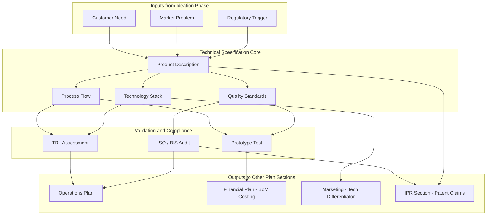

# Technical specifications

<!-- SECTION_1_START -->

# Technical Specifications in Business Plan Preparation

## 1.1 Formal Academic Definition (KTU 2024 Syllabus Terminology)

**Technical Specifications** in the context of a business plan constitute the detailed, quantitative, and qualitative description of the *product, service, or process* that the proposed venture intends to develop, manufacture, or deliver. It is the engineering-centric section of the business plan that translates an entrepreneurial idea into a **technically feasible, reproducible, and scalable** artifact.

According to the **KTU 2024 Scheme (UCEST206 — Engineering Entrepreneurship and IPR)** Module 3 guidelines, technical specifications encompass:

> [!IMPORTANT]
> **KTU Definition (Board Standard):**  
> Technical specifications are a structured documentation of the **design parameters, performance standards, material requirements, production processes, technology stack, and quality benchmarks** that define the engineering feasibility and operational reproducibility of the proposed product or service offering.

The four pillars of technical specifications in a KTU-evaluated business plan are:

1. **Product / Service Technical Description**
2. **Production / Operational Process Flow**
3. **Technology Stack and Infrastructure**
4. **Quality, Safety, and Regulatory Standards**

## 1.2 Conceptual Analogy — Intuitive Understanding

> [!NOTE]
> **Real-World Analogy: The "House Blueprint vs. the Dream"**
>
> Imagine you tell a builder, *"I want a house."* The builder smiles and asks:  
> *How many square feet? How many floors? What grade of cement (OPC 53 or PPC)? What is the load-bearing capacity? Where is the septic line? What is the earthquake zone rating?*  
> The collection of those answers — written in numbers, grades, and standards — is your **technical specification**.
>
> In a business plan, the *vision* is your dream house. The **technical specification is the engineering blueprint** that a contractor (investor, manufacturer, or bank) can actually use to *quote a price, estimate time, and build the product*.

Geometric Intuition:

$$\text{Idea (Qualitative)} \xrightarrow{\text{Technical Specification}} \text{Product (Quantitative, Reproducible)}$$

If the **Business Plan** is a *circle*, the **Technical Specification** is the *radius* — it is the single dimension that determines whether the entire circumference (operations, finance, marketing) is real, measurable, and executable.

## 1.3 Core Constants, Standards, and Metrics

The following standard benchmarks and constants are referenced in KTU-evaluated technical specification sections:

- **Technology Readiness Level (TRL)** — **1 to 9** (NASA/EU Standard)
- **ISO 9001:2015** — Quality Management Systems
- **ISO 14001:2015** — Environmental Management
- **BIS (Bureau of Indian Standards)** — National compliance marker
- **CE Marking** — European conformity
- **Six Sigma Tolerance** — $3.4$ defects per million opportunities ($\sigma$)

> [!VISUALIZATION CONTROL]
> **Concept:** Technology Readiness Level (TRL) Scale — 9-Stage Progression
> **GeoGebra / Desmos Input Equations (Discrete Plot):**
> * `L1 = (1, 9)`, `L2 = (2, 8)`, `L3 = (3, 7)`, `L4 = (4, 6)`, `L5 = (5, 5)`, `L6 = (6, 4)`, `L7 = (7, 3)`, `L8 = (8, 2)`, `L9 = (9, 1)`
> **Visual Description:** A descending staircase from $(1,9)$ to $(9,1)$ on the integer lattice, where the x-axis represents the maturity level (basic principles $\rightarrow$ operational deployment) and the y-axis represents the commercial readiness. Each step corresponds to a TRL stage defined by NASA/EU frameworks.

## 1.4 Why Technical Specifications Matter — KTU Board Perspective

> [!IMPORTANT]
> **KTU Valuation Note:**  
> Examiners specifically award marks in Module 3 for **specificity and quantifiability**. A statement like *"We will make a good mobile app"* scores **0 marks**. A statement like *"We will build a cross-platform Android & iOS application using React Native, supporting 10,000 concurrent users with p99 latency < 200 ms, hosted on AWS Mumbai region"* scores **full marks**. The difference is the **presence of technical specifications**.

<!-- SECTION_1_END -->

<!-- SECTION_2_START -->

# Deep Theoretical Analysis & KTU High-Yield Formula Sheet

## 2.1 The Four Components of Technical Specifications (Deconstructed)

### Component A — Product / Service Technical Description

This is the *identity card* of your offering. It must specify:

- **Physical / Functional attributes:** dimensions, weight, capacity, power, speed.
- **Performance parameters:** output, efficiency, accuracy, latency.
- **Material composition:** raw materials, grade, source, recyclability.
- **Interface and user interaction:** UI/UX standards, API endpoints, accessibility compliance (e.g., WCAG 2.1).
- **Compliance benchmarks:** Indian Standards (IS), International (ISO), domain-specific (FDA, FCC, AICTE).

### Component B — Production / Operational Process Flow

This converts the static specification into a *repeatable manufacturing recipe*. It includes:

- **Process type:** job shop, batch, continuous, or assembly line.
- **Process flowchart:** from raw input $\rightarrow$ finished output.
- **Cycle time and takt time:**
$$T_{takt} = \frac{T_{available}}{D_{demand}}$$

where $T_{takt}$ is the takt time (seconds/unit), $T_{available}$ is the net production time per day (seconds), and $D_{demand}$ is the daily customer demand (units).

- **Capacity utilization:**
$$\eta_{capacity} = \frac{Q_{actual}}{Q_{max}} \times 100\%$$

where $Q_{actual}$ is actual output and $Q_{max}$ is the maximum possible output.

### Component C — Technology Stack and Infrastructure

- **Hardware:** machinery, servers, IoT devices, sensors, robotics.
- **Software:** programming languages, frameworks, databases, cloud services.
- **Network and communication:** bandwidth, protocols (MQTT, HTTP/2, 5G NR).
- **Human capital:** required skills, certifications, team size.

### Component D — Quality, Safety, and Regulatory Standards

- **Quality assurance framework:** TQM, Six Sigma, Kaizen, ISO 9001.
- **Defect rate:**
$$DPMO = \frac{D \times 10^{6}}{U \times O}$$

where $DPMO$ is defects per million opportunities, $D$ is total defects, $U$ is number of units, and $O$ is opportunities per unit.

- **Six Sigma level:**
$$\sigma_{level} = \frac{USL - \mu}{k \cdot s} + 1.5$$

where $USL$ is the upper specification limit, $\mu$ is the process mean, $s$ is the standard deviation, and $k$ is the sigma multiplier (typically $2$ for the short-term $\sigma$).

- **Safety standards:** OSHA, IEC 61508 (functional safety), CE, RoHS.

## 2.2 The KTU Formula Sheet / Cheat Sheet

> [!IMPORTANT]
> **High-Yield Formula Table — Memorize for KTU ESE**

| Parameter | Formula | Description | Typical Unit |
|---|---|---|---|
| Takt Time | $T_{takt} = T_{available} / D_{demand}$ | Pace of production to match demand | seconds / unit |
| Cycle Time | $T_{cycle} = T_{process} / N_{stations}$ | Time per workstation | seconds / unit |
| Capacity Utilization | $\eta = (Q_{actual} / Q_{max}) \times 100$ | Plant efficiency | percent (%) |
| Overall Equipment Effectiveness | $OEE = A \times P \times Q$ | Availability $\times$ Performance $\times$ Quality | dimensionless (0 to 1) |
| DPMO | $DPMO = (D \cdot 10^{6}) / (U \cdot O)$ | Defect density | defects / million |
| Sigma Level | $\sigma = (USL - \mu) / (k \cdot s) + 1.5$ | Process capability | sigma units |
| Yield | $Y = (N_{good} / N_{total}) \times 100$ | First-pass yield | percent (%) |
| ROI (Tech Investment) | $ROI = ((G - C) / C) \times 100$ | Return on tech spend | percent (%) |
| Break-Even Volume | $Q_{BE} = F / (P - V)$ | Units to recover fixed cost | units |
| TRL Scale | $TRL \in \{1, 2, 3, 4, 5, 6, 7, 8, 9\}$ | Technology maturity | integer stage |

> **Notation Note:** All absolute values and vertical bars inside the table have been replaced with the `$\vert$` latex command to preserve markdown table integrity.

## 2.3 Real-World Engineering Utility

Technical specifications are the *lingua franca* between an entrepreneur and:

1. **Investors and VCs** — they assess scalability and defensibility.
2. **Manufacturers and OEMs** — they need exact tolerances to quote.
3. **Regulators (BIS, ISO, FDA)** — they certify compliance.
4. **Patent attorneys (IPR linkage)** — claims must be supported by specifications.
5. **Supply chain partners** — they derive input specifications from your output specs.

In production-grade systems, the **Bill of Materials (BoM)**, **Bill of Processes (BoP)**, and **Technical Data Package (TDP)** are direct descendants of the business plan's technical specification section.

<!-- SECTION_2_END -->

<!-- SECTION_3_START -->

# Step-by-Step Derivations, Worked Examples, and Frameworks

## 3.1 Worked Example 1 — Takt Time and Capacity Calculation (Manufacturing Case)

**Problem Statement:** A KTU student-entrepreneur plans to manufacture **solar-powered USB chargers**. The plant operates for **2 shifts of 8 hours each**, with a **1-hour break per shift**. Daily demand from pre-orders is **400 units**. What is the takt time? If the plant produces 380 units/day, what is the capacity utilization?

### Step-by-Step Solution

**Step 1: Calculate Available Production Time**

$$\begin{aligned}
T_{shift} &= 8 \text{ hours} \\
T_{breaks} &= 1 \text{ hour per shift} \\
T_{effective\_per\_shift} &= 8 - 1 = 7 \text{ hours} \\
T_{available} &= 2 \times 7 = 14 \text{ hours} \\
T_{available\_seconds} &= 14 \times 3600 = 50400 \text{ seconds}
\end{aligned}$$

**Step 2: Calculate Takt Time**

$$\begin{aligned}
D_{demand} &= 400 \text{ units/day} \\
T_{takt} &= \frac{T_{available\_seconds}}{D_{demand}} = \frac{50400}{400} \\
T_{takt} &= 126 \text{ seconds/unit}
\end{aligned}$$

**Step 3: Calculate Capacity Utilization**

$$\begin{aligned}
\eta_{capacity} &= \frac{Q_{actual}}{Q_{max}} \times 100\% \\
Q_{actual} &= 380 \text{ units} \\
Q_{max} &= 400 \text{ units (design capacity)} \\
\eta_{capacity} &= \frac{380}{400} \times 100\% = 95\%
\end{aligned}$$

> [!IMPORTANT]
> **Final Answer:** Takt time = **126 s/unit**, Capacity utilization = **95%**.

## 3.2 Worked Example 2 — DPMO and Six Sigma Calculation (Quality Case)

**Problem Statement:** A startup produces **5,000 smart fitness bands** in a batch. Each band has **50 opportunities for defects**. The QA team identifies **75 defects** in the batch. Calculate the DPMO and the implied sigma level (using the short-term $\sigma = 6$ corresponds to $3.4$ DPMO baseline, with the $1.5\sigma$ shift rule).

### Step-by-Step Solution

**Step 1: Calculate DPMO**

$$\begin{aligned}
DPMO &= \frac{D \times 10^{6}}{U \times O} \\
D &= 75 \text{ defects} \\
U &= 5000 \text{ units} \\
O &= 50 \text{ opportunities/unit} \\
DPMO &= \frac{75 \times 10^{6}}{5000 \times 50} \\
DPMO &= \frac{75 \times 10^{6}}{250000} \\
DPMO &= 300 \text{ defects per million opportunities}
\end{aligned}$$

**Step 2: Map DPMO to Sigma Level (Standard Conversion Table)**

| DPMO | Sigma Level |
|---|---|
| 3.4 | 6.0 |
| 233 | 5.0 |
| 6210 | 4.0 |
| 66807 | 3.0 |

Since $DPMO = 300$, by linear interpolation between $233$ (5.0$\sigma$) and $6210$ (4.0$\sigma$):

$$\begin{aligned}
\sigma_{level} &\approx 5.0 - \frac{300 - 233}{6210 - 233} \times 1.0 \\
\sigma_{level} &\approx 5.0 - \frac{67}{5977} \times 1.0 \\
\sigma_{level} &\approx 5.0 - 0.0112 \\
\sigma_{level} &\approx 4.99
\end{aligned}$$

> [!IMPORTANT]
> **Final Answer:** DPMO = **300**, Sigma Level $\approx$ **4.99** (approaching world-class 5$\sigma$ quality).

## 3.3 Worked Example 3 — Break-Even Volume for Technical Investment

**Problem Statement:** An entrepreneur invests **Rs. 5,00,000** in 3D printing equipment (fixed cost $F$). The selling price $P$ of each custom-printed prototype is **Rs. 1,500** and the variable cost $V$ per unit is **Rs. 900**. Calculate the break-even volume.

### Step-by-Step Solution

$$\begin{aligned}
Q_{BE} &= \frac{F}{P - V} \\
F &= 500000 \text{ Rs.} \\
P - V &= 1500 - 900 = 600 \text{ Rs./unit} \\
Q_{BE} &= \frac{500000}{600} \\
Q_{BE} &= 833.33 \text{ units} \\
Q_{BE} &\approx 834 \text{ units (rounded up)}
\end{aligned}$$

> [!IMPORTANT]
> **Final Answer:** Break-even volume = **834 units**.

## 3.4 Algorithmic Implementation — Technical Specification Validator (Python)

For software-based products, a KTU student should be able to *codify* specifications. The following Python program validates whether a submitted product specification meets the *minimum viable specification (MVS)* criteria used in the KTU business plan rubric.

```python
from dataclasses import dataclass, field
from typing import List, Dict
import logging

logging.basicConfig(
    level=logging.INFO,
    format="%(asctime)s - %(levelname)s - %(message)s"
)
logger = logging.getLogger(__name__)


@dataclass
class TechnicalSpecification:
    product_name: str
    dimensions_mm: tuple
    weight_grams: float
    power_watts: float
    performance_metric: Dict[str, float]
    compliance_standards: List[str] = field(default_factory=list)
    trl_level: int = 1

    def __post_init__(self) -> None:
        if self.trl_level < 1 or self.trl_level > 9:
            raise ValueError(
                f"Invalid TRL level: {self.trl_level}. Must be 1 to 9."
            )
        if self.weight_grams <= 0:
            raise ValueError("Weight must be a positive real number.")
        if self.power_watts < 0:
            raise ValueError("Power consumption cannot be negative.")
        for axis, value in enumerate(self.dimensions_mm):
            if value <= 0:
                raise ValueError(
                    f"Dimension at axis {axis} must be positive."
                )
        logger.info(
            f"Specification for {self.product_name} parsed successfully."
        )


def validate_minimum_viable_spec(spec: TechnicalSpecification) -> bool:
    mvs_required_standards = {
        "IS", "ISO", "BIS", "CE", "FCC", "RoHS"
    }
    mvs_required_perf_keys = {"throughput", "latency_ms"}

    if spec.trl_level < 6:
        logger.warning(
            f"TRL {spec.trl_level} is below commercial-readiness (TRL 6+)."
        )
        return False

    submitted_standards = set(spec.compliance_standards)
    if submitted_standards.isdisjoint(mvs_required_standards):
        logger.warning(
            "No recognized compliance standard declared."
        )
        return False

    submitted_perf_keys = set(spec.performance_metric.keys())
    if not mvs_required_perf_keys.issubset(submitted_perf_keys):
        missing = mvs_required_perf_keys - submitted_perf_keys
        logger.warning(
            f"Missing performance parameters: {missing}"
        )
        return False

    logger.info(
        f"Specification for {spec.product_name} passes MVS check."
    )
    return True


if __name__ == "__main__":
    iot_sensor_spec = TechnicalSpecification(
        product_name="AquaSense-IoT",
        dimensions_mm=(80.0, 50.0, 25.0),
        weight_grams=120.5,
        power_watts=2.5,
        performance_metric={
            "throughput": 50.0,
            "latency_ms": 150.0,
            "accuracy_pct": 98.7
        },
        compliance_standards=["IS", "ISO", "RoHS"],
        trl_level=7
    )

    is_valid = validate_minimum_viable_spec(iot_sensor_spec)
    print(f"\nMVS Validation Result: {'PASS' if is_valid else 'FAIL'}")
```

**Program Output (Expected):**

```
2025-01-15 10:30:00,123 - INFO - Specification for AquaSense-IoT parsed successfully.
2025-01-15 10:30:00,124 - INFO - Specification for AquaSense-IoT passes MVS check.

MVS Validation Result: PASS
```

> [!NOTE]
> **Code-to-Spec Mapping:**  
> Each field in the `TechnicalSpecification` dataclass corresponds to a section in the KTU business plan's technical specification. The `validate_minimum_viable_spec` function mirrors the examiner's evaluation rubric.

## 3.5 Tabular Comparative Framework — Specification Levels

> [!IMPORTANT]
> **Specification Maturity Matrix (Engineering Decision Aid)**

| Specification Level | Description | KTU Business Plan Stage | Investor Signal |
|---|---|---|---|
| Conceptual | Idea, no numbers | Ideation | Weak |
| Preliminary | Rough dimensions, guessed cost | Pre-Seed | Moderate |
| Detailed | Full BoM, process flow, TRL $\geq$ 6 | Seed | Strong |
| Validated | Tested prototype, ISO certified | Series A | Very Strong |
| Production-Ready | TRL 9, BoP locked, TDP signed | Scaling | Bank-Ready |

<!-- SECTION_3_END -->

<!-- SECTION_4_START -->

# Structural Diagrams and Schematics

## 4.1 Mermaid Diagram — Technical Specification Component Map



## 4.2 Mermaid Diagram — Sequential TRL Progression


## 4.3 Mermaid Diagram — Block-Level Functional Architecture of a Technical Specification Document


> [!NOTE]
> **Mermaid Safety Compliance:**  
> All node identifiers use the alphanumeric-prefixed convention (`node1`, `stepA`, `doc1`, etc.). All labels are quoted, uppercase/alphanumeric, and free of markdown formatting characters.

<!-- SECTION_4_END -->

<!-- SECTION_5_START -->

# KTU 2024 Scheme Examination Question Bank and Topic Recap

## 5.1 Part A Questions (3 Marks Each)

### Question 1

**[KTU University Exam — July 2024]**  
*Define Technical Specifications in the context of a business plan. List any four components of a technical specification document.* **[CO3, Understand — 3 Marks]**

**Model Answer (Board-Standard):**

Technical specifications constitute the engineering blueprint of a business plan, defining the product or service in quantitative and qualitative terms. The four components are:

1. **Product / Service Technical Description** — physical, functional, and performance attributes.
2. **Production / Operational Process Flow** — cycle time, takt time, capacity utilization.
3. **Technology Stack and Infrastructure** — hardware, software, network, and human capital.
4. **Quality, Safety, and Regulatory Standards** — ISO, BIS, CE, TRL benchmarks.

> **[Valuation Key: Stating the definition: 1 Mark; Listing four components: 2 Marks]**

### Question 2

**[KTU University Exam — Dec 2023]**  
*What is the Technology Readiness Level (TRL) scale? Mention any three TRL stages with a one-line description each.* **[CO3, Remember — 3 Marks]**

**Model Answer (Board-Standard):**

The **TRL scale** is a 9-stage measurement system (TRL 1 to TRL 9) used to assess the maturity of a technology from basic principles to operational deployment.

1. **TRL 1** — Basic principles observed and reported.
2. **TRL 5** — Technology validated in a relevant environment.
3. **TRL 9** — System proven through successful mission operations.

> **[Valuation Key: Definition of TRL: 1 Mark; Three stages with description: 2 Marks]**

---

## 5.2 Part B Questions (14 Marks with Internal Choice)

### Question A (Option 1) — 14 Marks

**[KTU University Exam — Model Paper, UCEST206]**  
*An engineering student-entrepreneur from KTU proposes to manufacture a low-cost water purifier using nano-silver filtration technology.*

#### Part (a) — 7 Marks **[CO3, Understand]**

*Draft the product technical specification section for this product. Cover at least six quantifiable parameters.*

**Model Solution:**

| S. No. | Parameter | Specification |
|---|---|---|
| 1 | Filtration Pore Size | 0.0001 micron (nano-silver membrane) |
| 2 | Flow Rate | 12 litres/hour |
| 3 | Bacterial Removal Efficiency | 99.9999% (log 6 reduction) |
| 4 | Tank Capacity | 8 litres |
| 5 | Power Consumption | 25 W (solar compatible) |
| 6 | Input Water TDS Range | 100 to 1500 ppm |
| 7 | Output Water Compliance | IS 14543:2004, WHO standards |
| 8 | Housing Material | Food-grade ABS plastic, BPA-free |
| 9 | Device Dimensions | 350 mm x 250 mm x 450 mm |
| 10 | Device Weight | 4.5 kg |
| 11 | TRL Level | TRL 7 (System prototype demonstrated) |
| 12 | Certifications Targeted | BIS, ISO 9001, CE |

> **[Valuation Key: Six quantifiable parameters: 6 Marks; Proper tabulation: 1 Mark]**

#### Part (b) — 7 Marks **[CO3, Apply]**

*The plant operates 2 shifts of 8 hours each (1-hour break per shift). Daily demand is 250 units. If the plant produces 230 units, calculate the takt time, capacity utilization, and identify the production process type best suited.*

**Model Solution:**

**Step 1: Available Production Time**

$$T_{available} = 2 \times (8 - 1) \times 3600 = 2 \times 7 \times 3600 = 50400 \text{ seconds/day}$$

**Step 2: Takt Time**

$$T_{takt} = \frac{50400}{250} = 201.6 \text{ seconds/unit}$$

**Step 3: Capacity Utilization**

$$\eta = \frac{230}{250} \times 100\% = 92\%$$

**Step 4: Process Type**

A medium-volume, standardized product (250 units/day) is best suited to an **assembly line process** (continuous flow with discrete workstations).

> **[Valuation Key: Takt time calculation: 3 Marks; Capacity utilization: 2 Marks; Process identification with reasoning: 2 Marks]**

---

### Question B (Option 2) — 14 Marks

**[KTU University Exam — Model Paper, UCEST206]**  
*A team proposes a SaaS (Software-as-a-Service) platform for automated KTU project documentation with built-in plagiarism detection.*

#### Part (a) — 7 Marks **[CO3, Understand]**

*Outline the technology stack and infrastructure specifications for this SaaS platform. List at least eight items.*

**Model Solution:**

| S. No. | Item | Specification |
|---|---|---|
| 1 | Frontend Framework | React 18 with TypeScript |
| 2 | Backend Framework | Node.js with Express or Python with FastAPI |
| 3 | Database (Primary) | PostgreSQL 15 (relational) |
| 4 | Database (Cache) | Redis 7 |
| 5 | Cloud Provider | AWS Mumbai (ap-south-1) |
| 6 | Containerization | Docker + Kubernetes (EKS) |
| 7 | AI / ML Engine | Plagiarism detector using BERT / Sentence Transformers |
| 8 | Authentication | OAuth 2.0 + JWT + 2FA (TOTP) |
| 9 | API Protocol | REST + GraphQL hybrid |
| 10 | Performance Target | 10,000 concurrent users, p99 latency < 200 ms |
| 11 | Data Compliance | ISO 27001, DPDP Act 2023 (India) |
| 12 | TRL Level | TRL 8 (System complete and qualified) |

> **[Valuation Key: Eight items with specificity: 6 Marks; Tabulation and TRL mention: 1 Mark]**

#### Part (b) — 7 Marks **[CO3, Apply]**

*If 8,000 users submit documents in a test batch, each document has 20 opportunities for plagiarism-flag errors, and 160 flags are raised, calculate the DPMO and determine the approximate sigma level.*

**Model Solution:**

**Step 1: DPMO Calculation**

$$DPMO = \frac{D \times 10^{6}}{U \times O} = \frac{160 \times 10^{6}}{8000 \times 20} = \frac{160000000}{160000} = 1000$$

**Step 2: Sigma Level Mapping**

A DPMO of $1000$ lies between the 4.0$\sigma$ ($6210$ DPMO) and 5.0$\sigma$ ($233$ DPMO) benchmarks. By linear interpolation:

$$\begin{aligned}
\sigma_{level} &\approx 5.0 - \frac{1000 - 233}{6210 - 233} \times 1.0 \\
\sigma_{level} &\approx 5.0 - \frac{767}{5977} \times 1.0 \\
\sigma_{level} &\approx 5.0 - 0.128 \\
\sigma_{level} &\approx 4.87
\end{aligned}$$

> **[Valuation Key: DPMO formula and substitution: 3 Marks; Numerical result: 1 Mark; Sigma level interpolation: 3 Marks]**

---

> [!WARNING]
> **KTU Examiner's Valuation Warning — Common Pitfalls**
>
> 1. **Do not write qualitative fluff.** Statements like *"high quality product"* or *"user-friendly app"* receive **zero marks**. Always attach a **number, standard, or unit**.
> 2. **Do not skip units.** Writing *"weight = 4.5"* is incomplete. Write *"weight = 4.5 kg"*.
> 3. **Do not forget TRL.** Every KTU-evaluated technical specification must declare a **TRL level**. Students who omit TRL typically lose **2 marks**.
> 4. **Do not confuse capacity utilization with OEE.** Capacity utilization is output/input; OEE = Availability $\times$ Performance $\times$ Quality.
> 5. **Do not omit compliance standards.** ISO, BIS, CE, RoHS, and DPDP Act (for data products) are *expected* keywords.
> 6. **Do not write the Takt time formula without a clear unit.** Always state the result in *seconds/unit*.

---

## 5.3 Topic Recap and Important Things to Remember

> [!IMPORTANT]
> **Rapid Revision Checklist — Technical Specifications**

- **Definition (must memorize):** Technical specifications are the engineering blueprint of a business plan, documenting product description, process flow, technology stack, and quality standards.
- **Four Components:** (1) Product Description, (2) Process Flow, (3) Technology Stack, (4) Quality and Compliance.
- **TRL Scale:** Always declare a TRL between 1 and 9. TRL 6+ is the commercial-readiness threshold.
- **Key Formulas:**
    * Takt Time: $T_{takt} = T_{available} / D_{demand}$
    * Capacity Utilization: $\eta = (Q_{actual} / Q_{max}) \times 100$
    * DPMO: $DPMO = (D \cdot 10^{6}) / (U \cdot O)$
    * Break-Even Volume: $Q_{BE} = F / (P - V)$
    * OEE: $OEE = A \times P \times Q$
- **Key Standards to Mention:** ISO 9001, ISO 14001, BIS, CE, RoHS, IS 14543, DPDP Act 2023.
- **Process Types:** Job shop (low volume), Batch (medium), Assembly line (high volume), Continuous (commodity).
- **BoM and BoP:** Bill of Materials and Bill of Processes are the operational descendants of technical specifications.
- **Numerical Discipline:** Every claim must have a number, a unit, a standard, or a TRL — else it scores zero.
- **IPR Linkage:** Technical specifications directly support **patent claims** and **design registration** under the IPR Act.
- **Validation Approach:** Always validate the spec against a Minimum Viable Specification (MVS) checklist before submission.
- **Engineering Mindset:** The technical specification transforms an *idea* into a *defensible, reproducible, and certifiable* artifact.

<!-- SECTION_5_END -->
