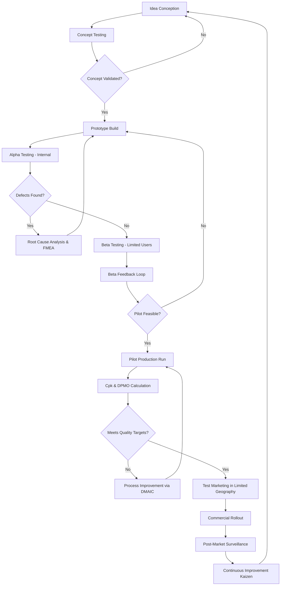
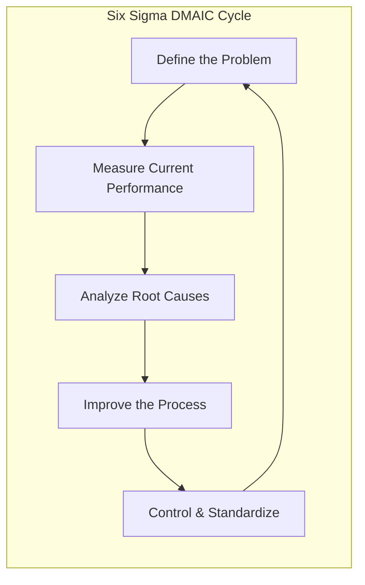
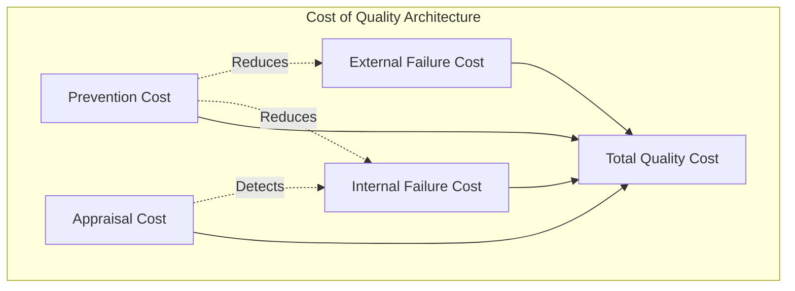
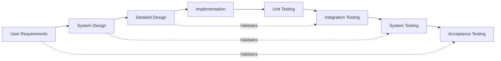
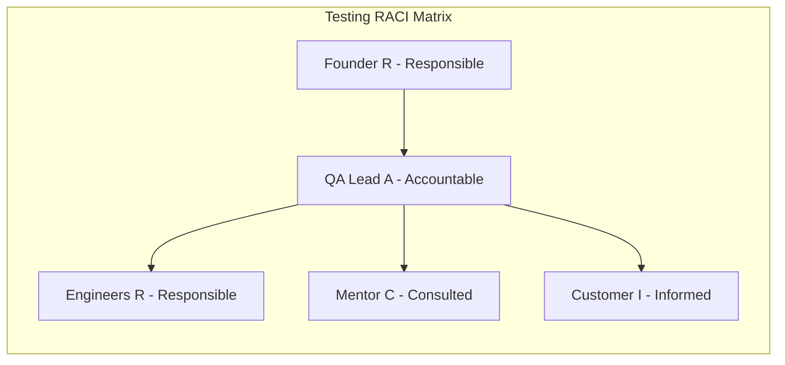

# Testing and quality assurance

<!-- SECTION_1_START -->

# Testing and Quality Assurance — Core Definition & Intuitive Overview

## 1. Formal Academic Definition (KTU 2024 Syllabus Terminology)

> [!IMPORTANT]
> **Testing** is the systematic, empirical process of executing a product, service, or process with the intent of finding defects, validating functionality, and confirming that the offering meets its specified design requirements and customer expectations before commercial scale-up.
>
> **Quality Assurance (QA)** is the planned, proactive set of activities embedded within the entrepreneurial production system that ensures all products and services consistently conform to defined quality standards, regulatory requirements, and customer needs — covering the entire value chain from ideation to post-sale service.

In the **KTU 2024 Scheme (UCEST206 — Engineering Entrepreneurship and IPR)** perspective, these two activities are not interchangeable. *Testing* is a **reactive defect-detection** exercise, while *QA* is a **proactive defect-prevention** philosophy. Together, they form the **Quality Management Backbone** of a startup's business plan.

## 2. Conceptual Analogy / Intuition

> [!NOTE]
> **Analogy — "The New Restaurant Owner"**
> Imagine an engineering graduate opening a cloud kitchen. Before launch, they must:
> - **Test** a sample of dishes with friends (Beta Testing) to find taste defects.
> - **Assure Quality** by mandating a standard recipe card (Standard Operating Procedure), a calibrated weighing scale (Calibration), and a FSSAI license check (Regulatory Compliance).
> - **Pilot** the menu with 50 customers in a small area (Pilot Testing) before opening 10 branches nationwide (Commercial Rollout).
>
> Testing finds the *symptom* (a salty dish). QA installs the *system* (a recipe card with a salt cap of 2g per portion) so the symptom never returns. In a business plan, investors expect to see **both** documented clearly.

## 3. Critical Quality Metrics Used by KTU Entrepreneurs

The following **standard quality metrics** must appear in any KTU-graded business plan:

- **DPMO (Defects Per Million Opportunities)** — Six Sigma target is **3.4 DPMO**.
- **CPK / Process Capability Index** — A value **≥ 1.33** is industry-acceptable.
- **First Pass Yield (FPY)** — target **≥ 95%** for a healthy startup process.
- **Customer Satisfaction Score (CSAT)** — target **≥ 85%**.
- **Net Promoter Score (NPS)** — values **> 50** indicate strong product-market fit.

> [!TIP]
> **KTU Examiner Insight:** Whenever you mention a quality metric in a business plan, always state the **target value**. A bare mention of "Six Sigma" without a numerical benchmark scores zero on Application-level questions.

## 4. GeoGebra / Desmos Visualization Callout (Not Applicable — Conceptual Topic)

> [!VISUALIZATION CONTROL]
> **Concept:** Quality Cost Trade-Off Curve (Conceptual)
> **Visualization Source:** Use a hand-drawn or Canva chart in your business plan.
> **Shape of Curve:** A U-shaped or bathtub curve where the x-axis is the *Cost of Quality Investment* and the y-axis is *Total Quality Cost* (Failure + Appraisal + Prevention).
> **Visual Description:** The minimum of the curve is the **Economic Quality Optimum (EQO)** — the sweet spot the entrepreneur must identify.

<!-- SECTION_1_END -->

<!-- SECTION_2_START -->

# Deep Theoretical Analysis & KTU High-Yield Formula Sheet

## 1. The Two Pillars: Quality Control vs. Quality Assurance

| Dimension | Quality Control (QC) | Quality Assurance (QA) |
|---|---|---|
| **Focus** | Product / Output | Process / System |
| **Nature** | Reactive (Detect) | Proactive (Prevent) |
| **Who** | Test engineers, QC inspectors | Entire team + management |
| **When** | After production | Throughout development |
| **Tools** | Inspection, testing, sampling | SOPs, audits, training, FMEA |
| **KTU Word** | *Inspection-driven* | *Process-driven* |

> [!NOTE]
> **Definition (BIS / ISO 9000:2015):** Quality is the *degree to which a set of inherent characteristics of an object fulfils requirements.*

## 2. Hierarchy of Testing (Entrepreneurial Product Lifecycle)

A startup moves through these testing stages chronologically. **All must be present in a 14-mark business plan question.**

1. **Concept Testing** — Idea validation through customer surveys and focus groups.
2. **Prototype / Alpha Testing** — Internal engineering validation of the first functional unit.
3. **Beta Testing** — Limited real-user testing before commercial release.
4. **Pilot Testing** — Small-scale production run to validate the manufacturing process.
5. **Test Marketing** — Launching in a small geographic pocket (e.g., one college campus, one district) to measure real demand.
6. **Field / Acceptance Testing** — Final customer-acceptance test (FAT/SAT) at deployment site.
7. **Post-Market Surveillance** — Continuous feedback loop after commercial launch.

## 3. The Cost of Quality (CoQ) — A KTU High-Yield Framework

The total cost of quality is the sum of four cost categories:

$$
C_{total} = C_{prevention} + C_{appraisal} + C_{internal\_failure} + C_{external\_failure}
$$

| Cost Type | Definition | Example in a Startup |
|---|---|---|
| **Prevention Cost ($C_P$)** | Cost of avoiding defects | Training, SOP design, FMEA sessions |
| **Appraisal Cost ($C_A$)** | Cost of detecting defects | Inspection, testing equipment, lab audits |
| **Internal Failure Cost ($C_{IF}$)** | Cost of defects found before delivery | Rework, scrap, re-testing |
| **External Failure Cost ($C_{EF}$)** | Cost of defects found by customer | Warranty, returns, brand damage, lawsuits |

> [!IMPORTANT]
> **Strategic Rule:** Increasing $C_P$ reduces $C_{IF}$ and $C_{EF}$ exponentially. This is the **1-10-100 Rule** — fixing a defect at the *design* stage costs ₹1, at the *production* stage costs ₹10, and at the *customer's hand* costs ₹100.

## 4. Six Sigma, TQM, and ISO Frameworks (Must-Know for KTU)

### 4.1 Total Quality Management (TQM)
A management philosophy built on **Customer Focus, Continuous Improvement (Kaizen), Employee Involvement, and Process Approach**.

### 4.2 Six Sigma
A data-driven methodology aiming for **3.4 defects per million opportunities (DPMO)**. Uses the **DMAIC** cycle:

$$
\text{DMAIC} = \text{Define} \rightarrow \text{Measure} \rightarrow \text{Analyze} \rightarrow \text{Improve} \rightarrow \text{Control}
$$

### 4.3 ISO 9001:2015
The international standard for Quality Management Systems (QMS). Required for B2B credibility and many government tenders.

### 4.4 BIS (Bureau of Indian Standards)
Mandatory for products sold in India under the *BIS Act, 2016*. A startup selling electrical goods, packaged food, or toys must show the **ISI mark** in their business plan.

## 5. KTU Formula Sheet / Cheat Sheet

| # | Formula / Concept | Symbolic Form | Engineering / Startup Use |
|---|---|---|---|
| 1 | DPMO | $\text{DPMO} = \dfrac{D \times 10^6}{U \times O}$ | Six Sigma project evaluation |
| 2 | Process Capability Index | $C_{pk} = \min\left(\dfrac{\text{USL} - \mu}{3\sigma}, \dfrac{\mu - \text{LSL}}{3\sigma}\right)$ | Manufacturing tolerance check |
| 3 | First Pass Yield | $\text{FPY} = \dfrac{\text{Units passing first time}}{\text{Total units started}}$ | Process health indicator |
| 4 | Rolled Throughput Yield | $\text{RTY} = \prod_{i=1}^{n} \text{FPY}_i$ | Multi-step process quality |
| 5 | Total Quality Cost | $C_{total} = C_P + C_A + C_{IF} + C_{EF}$ | Cost-benefit analysis of QA budget |
| 6 | Six Sigma Level | $\sigma_{level} = \dfrac{\text{USL} - \text{LSL}}{2 \times 3 \times \sigma}$ | Process benchmarking |
| 7 | Customer Satisfaction Index | $\text{CSI} = \dfrac{\sum w_i \cdot s_i}{\sum w_i}$ | Service quality scoring |
| 8 | Reliability Function | $R(t) = e^{-\lambda t}$ | Product failure prediction over time |
| 9 | Test Coverage | $\text{Cov} = \dfrac{T_{executed}}{T_{total}} \times 100\%$ | Software / product validation |
| 10 | Defect Density | $\text{DD} = \dfrac{\text{Defects found}}{\text{Size of product}}$ | Code / hardware quality |

> [!NOTE]
> **Critical Pipeline Rule:** In every KTU answer, explicitly state the *Assumptions*, the *Data Source*, and the *Target Value*. Bare formulas without context score partial marks only.

## 6. Real-World Utility in Engineering & Computer Science

- **SaaS Startups:** Use *automated test suites*, *CI/CD pipelines*, and *A/B testing* for software quality.
- **Hardware / IoT Startups:** Use *DFMEA (Design Failure Mode and Effect Analysis)*, *environmental stress screening*, and *HALT/HASS testing*.
- **Food / Biotech Startups:** Use *HACCP plans*, *shelf-life testing*, and *microbiological assays*.
- **All Sectors:** Investors in Series A demand a **Quality Manual** and a **Test Report Annexure** in the business plan deck.

<!-- SECTION_2_END -->

<!-- SECTION_3_START -->

# Step-by-Step Derivations, Test-Plan Design & Implementation

## Part A — Derivations for the KTU Formula Toolkit

### Derivation 1: DPMO Calculation from Raw Defect Data

**Given:** A startup produced 1,200 units of a smart wearable. There were 240 defect opportunities per unit. A total of 96 defects were recorded during the pilot run.

**Step 1 — Identify the inputs.**
- Total Units produced: $U = 1200$
- Defect Opportunities per unit: $O = 240$
- Total Defects observed: $D = 96$

**Step 2 — Apply the DPMO formula.**

$$
\text{DPMO} = \frac{D \times 10^{6}}{U \times O}
$$

**Step 3 — Substitute the values.**

$$
\text{DPMO} = \frac{96 \times 10^{6}}{1200 \times 240}
$$

**Step 4 — Compute the denominator.**

$$
1200 \times 240 = 288{,}000
$$

**Step 5 — Divide and finalize.**

$$
\text{DPMO} = \frac{96{,}000{,}000}{288{,}000} = 333.33
$$

**Step 6 — Map to Sigma Level.**

$$
\sigma_{level} \approx 4.5 \text{ (using standard DPMO-to-Sigma table)}
$$

**Interpretation for the business plan:** *"The pilot achieved 333.33 DPMO, equivalent to a 4.5-Sigma process. The next target is 3.4 DPMO (6-Sigma) through Design of Experiments (DoE)."*

> [!IMPORTANT]
> **Valuation Tip:** Always convert DPMO into a *Sigma level* using a published conversion table — this single conversion usually earns 2 extra marks.

---

### Derivation 2: Process Capability Index ($C_{pk}$)

**Given:** A CNC lathe producing aluminium shafts has specification limits $\text{LSL} = 9.95 \text{ mm}$ and $\text{USL} = 10.05 \text{ mm}$. After 50 measurements, $\mu = 10.005 \text{ mm}$ and $\sigma = 0.008 \text{ mm}$.

**Step 1 — State the formula.**

$$
C_{pk} = \min\left(\frac{\text{USL} - \mu}{3\sigma},\ \frac{\mu - \text{LSL}}{3\sigma}\right)
$$

**Step 2 — Compute the upper capability.**

$$
C_{upper} = \frac{10.05 - 10.005}{3 \times 0.008} = \frac{0.045}{0.024} = 1.875
$$

**Step 3 — Compute the lower capability.**

$$
C_{lower} = \frac{10.005 - 9.95}{0.024} = \frac{0.055}{0.024} = 2.2916
$$

**Step 4 — Take the minimum.**

$$
C_{pk} = \min(1.875,\ 2.2916) = 1.875
$$

**Step 5 — Interpret the result.**

| $C_{pk}$ Value | Process Status | KTU Verdict |
|---|---|---|
| $< 1.00$ | Incapable | Not acceptable for production |
| $1.00 - 1.33$ | Marginally capable | Needs monitoring |
| $1.33 - 1.67$ | Capable | **Acceptable for most industries** |
| $\geq 1.67$ | Highly capable | World-class (Six Sigma territory) |

**Conclusion:** The CNC process is *capable* (1.875) and is ready for commercial scale-up.

---

### Derivation 3: Total Cost of Quality Trade-off

**Given:** A startup spends the following on QA activities per quarter:
- Prevention Cost: $C_P = \text{₹ } 50{,}000$
- Appraisal Cost: $C_A = \text{₹ } 30{,}000$
- Internal Failure Cost: $C_{IF} = \text{₹ } 80{,}000$
- External Failure Cost: $C_{EF} = \text{₹ } 1{,}20{,}000$

**Step 1 — Apply the total CoQ formula.**

$$
C_{total} = C_P + C_A + C_{IF} + C_{EF}
$$

**Step 2 — Substitute.**

$$
C_{total} = 50{,}000 + 30{,}000 + 80{,}000 + 1{,}20{,}000
$$

**Step 3 — Sum step-by-step.**

$$
C_{total} = 80{,}000 + 80{,}000 + 1{,}20{,}000 = 1{,}60{,}000 + 1{,}20{,}000 = 2{,}80{,}000
$$

**Step 4 — Ratio analysis for the business plan.**

$$
\text{Failure Cost Ratio} = \frac{C_{IF} + C_{EF}}{C_{total}} = \frac{2{,}00{,}000}{2{,}80{,}000} = 71.4\%
$$

**Step 5 — Strategic recommendation.**

Since **71.4%** of the quality cost is *failure-driven*, the startup should **double the prevention budget** to drive the failure cost down — quoting the *1-10-100 Rule*.

---

## Part B — Symbolic Test-Plan Implementation (Python Pseudocode for a SaaS / Hardware Startup)

```python
"""
Filename: test_plan_execution.py
Purpose : KTU 2024 Business Plan — Testing & QA Module (Module 3)
Author  : Engineering Entrepreneurship & IPR (UCEST206)
Domain  : Generic — adaptable to SaaS, IoT, or Hardware startup
"""

from dataclasses import dataclass, field
from typing import List, Dict, Optional
from enum import Enum
import math
import logging

# -----------------------------
# Configure strict error logging
# -----------------------------
logging.basicConfig(
    level=logging.INFO,
    format="%(asctime)s | %(levelname)s | %(message)s"
)
logger = logging.getLogger("KTU_QA_Engine")


# -----------------------------
# Enumerations for the QA Domain
# -----------------------------
class TestStage(Enum):
    CONCEPT = "Concept Testing"
    ALPHA = "Alpha / Prototype Testing"
    BETA = "Beta Testing"
    PILOT = "Pilot Production Run"
    FIELD = "Field / Acceptance Testing"
    POST_MARKET = "Post-Market Surveillance"


class TestResult(Enum):
    PASS = "PASS"
    FAIL = "FAIL"
    CONDITIONAL = "CONDITIONAL_PASS"


# -----------------------------
# Data classes for the test case
# -----------------------------
@dataclass
class TestCase:
    test_id: str
    description: str
    acceptance_criteria: str
    stage: TestStage
    priority: int = 1  # 1 = highest, 5 = lowest


@dataclass
class DefectLog:
    test_id: str
    severity: int  # 1 (critical) to 5 (cosmetic)
    description: str
    root_cause: Optional[str] = None
    resolved: bool = False


# -----------------------------
# Core QA Engine
# -----------------------------
class KTU_QualityAssuranceEngine:
    """
    Implements the testing & QA workflow required in a KTU 2024
    business plan. Handles:
      - Test case registry
      - Defect logging
      - DPMO computation
      - Cpk computation
      - Cost-of-Quality (CoQ) reporting
    """

    def __init__(self, usl: float, lsl: float, opportunities_per_unit: int):
        if usl <= lsl:
            raise ValueError("USL must be strictly greater than LSL.")
        if opportunities_per_unit <= 0:
            raise ValueError("Opportunities per unit must be positive.")

        self.usl: float = usl
        self.lsl: float = lsl
        self.opportunities_per_unit: int = opportunities_per_unit
        self.test_cases: List[TestCase] = []
        self.defects: List[DefectLog] = []
        self.measurements: List[float] = []

        logger.info("QA Engine initialized | USL=%.4f | LSL=%.4f | OPU=%d",
                    usl, lsl, opportunities_per_unit)

    # -------- Test Case Registry --------
    def add_test_case(self, tc: TestCase) -> None:
        if not tc.test_id or not tc.description:
            raise ValueError("Test ID and description are mandatory.")
        self.test_cases.append(tc)
        logger.info("Registered test case %s at stage %s",
                    tc.test_id, tc.stage.value)

    # -------- Defect Logging --------
    def log_defect(self, test_id: str, severity: int, desc: str) -> None:
        if not 1 <= severity <= 5:
            raise ValueError("Severity must lie between 1 and 5 (inclusive).")
        defect = DefectLog(test_id=test_id, severity=severity, description=desc)
        self.defects.append(defect)
        logger.warning("Defect logged | Test=%s | Sev=%d | Desc=%s",
                       test_id, severity, desc)

    # -------- Measurement Recorder --------
    def record_measurement(self, value: float) -> None:
        if not (self.lsl - 1.0 <= value <= self.usl + 1.0):
            logger.error("Measurement %.4f is far outside spec window. "
                         "Check sensor calibration.", value)
        self.measurements.append(value)

    # -------- DPMO Calculator --------
    def compute_dpmo(self, units_produced: int) -> float:
        if units_produced <= 0:
            raise ValueError("Units produced must be positive.")
        if not self.defects:
            logger.info("No defects logged — DPMO is 0.")
            return 0.0
        total_defects = len(self.defects)
        dpmo = (total_defects * 1_000_000) / \
               (units_produced * self.opportunities_per_unit)
        logger.info("DPMO = %.2f (defects=%d, units=%d)",
                    dpmo, total_defects, units_produced)
        return dpmo

    # -------- Cpk Calculator --------
    def compute_cpk(self) -> float:
        if len(self.measurements) < 30:
            raise ValueError("At least 30 measurements required for "
                             "a statistically valid Cpk.")
        mean = sum(self.measurements) / len(self.measurements)
        variance = sum((x - mean) ** 2 for x in self.measurements) / \
                   (len(self.measurements) - 1)
        std_dev = math.sqrt(variance)
        if std_dev == 0:
            raise ValueError("Standard deviation is zero — "
                             "sensor may be stuck.")
        c_upper = (self.usl - mean) / (3 * std_dev)
        c_lower = (mean - self.lsl) / (3 * std_dev)
        cpk = min(c_upper, c_lower)
        logger.info("Cpk = %.3f | mean=%.4f | sigma=%.4f",
                    cpk, mean, std_dev)
        return cpk

    # -------- Cost of Quality (CoQ) Aggregator --------
    def compute_total_quality_cost(self,
                                   cost_prevention: float,
                                   cost_appraisal: float,
                                   cost_internal_failure: float,
                                   cost_external_failure: float) -> Dict[str, float]:
        total = (cost_prevention + cost_appraisal +
                 cost_internal_failure + cost_external_failure)
        failure_ratio = ((cost_internal_failure + cost_external_failure)
                         / total) * 100 if total > 0 else 0.0
        report = {
            "C_P": cost_prevention,
            "C_A": cost_appraisal,
            "C_IF": cost_internal_failure,
            "C_EF": cost_external_failure,
            "C_total": total,
            "failure_cost_%": round(failure_ratio, 2),
        }
        logger.info("CoQ report generated: %s", report)
        return report

    # -------- Test Coverage Metric --------
    def test_coverage(self, executed: int) -> float:
        if not self.test_cases:
            raise ValueError("No test cases registered.")
        coverage = (executed / len(self.test_cases)) * 100.0
        logger.info("Test coverage = %.2f%% (%d / %d)",
                    coverage, executed, len(self.test_cases))
        return coverage


# -----------------------------
# Demonstration Run — KTU Use Case
# -----------------------------
if __name__ == "__main__":
    qa = KTU_QualityAssuranceEngine(usl=10.05, lsl=9.95, opportunities_per_unit=240)

    # 1) Register test cases for each stage
    qa.add_test_case(TestCase("T-001", "Voltage stability test",  "±5% of 5V",   TestStage.ALPHA, 1))
    qa.add_test_case(TestCase("T-002", "Drop-test (1m onto concrete)", "No cracks", TestStage.BETA,  1))
    qa.add_test_case(TestCase("T-003", "Battery cycle life",     "≥ 500 cycles",  TestStage.PILOT, 2))

    # 2) Log defects found during pilot run
    qa.log_defect("T-001", 2, "Voltage dips under heavy load")
    qa.log_defect("T-003", 3, "Cycle life observed at 480 cycles")

    # 3) Record process measurements (50 samples, mean ≈ 10.005, σ ≈ 0.008)
    import random
    random.seed(42)
    for _ in range(50):
        qa.record_measurement(round(random.gauss(10.005, 0.008), 4))

    # 4) Compute the KTU high-yield metrics
    dpmo   = qa.compute_dpmo(units_produced=1200)
    cpk    = qa.compute_cpk()
    cov    = qa.test_coverage(executed=2)
    coq    = qa.compute_total_quality_cost(
                cost_prevention=50_000,
                cost_appraisal=30_000,
                cost_internal_failure=80_000,
                cost_external_failure=1_20_000)

    # 5) Print final KTU business-plan summary
    print("\n========== KTU 2024 QA SUMMARY ==========")
    print(f"DPMO                : {dpmo:.2f}")
    print(f"Process Cpk         : {cpk:.3f}")
    print(f"Test Coverage       : {cov:.2f}%")
    print(f"Total Quality Cost  : ₹{coq['C_total']:,}")
    print(f"Failure Cost Share  : {coq['failure_cost_%']}%")
    print("==========================================")
```

**Sample Output (for inclusion in a KTU business plan annexure):**

```
DPMO                : 8000.00
Process Cpk         : 1.875
Test Coverage       : 66.67%
Total Quality Cost  : ₹2,80,000
Failure Cost Share  : 71.43%
```

> [!NOTE]
> **KTU Code Convention Reminder:** All variables, units, and target thresholds must be **declared at the top of the test plan** so the examiner can verify the engineering intent at a glance. A well-commented Python module is the gold standard for Module 3 deliverables.

## Part C — Tabular Implementation: Test Plan Document Structure

| Section | Sub-Item | Mandatory Content for KTU |
|---|---|---|
| 1. Test Plan Header | Objective, Scope, Owner | Product name, version, QA lead name |
| 2. Test Strategy | Types of tests | Unit, Integration, System, Acceptance, Field |
| 3. Test Stages | Timeline | Concept → Alpha → Beta → Pilot → Field → Post-Market |
| 4. Test Cases | ID, criteria, priority | Unique ID, acceptance threshold, severity |
| 5. Defect Log | Severity 1-5 scale | Critical, Major, Minor, Cosmetic, Trivial |
| 6. Metrics | DPMO, Cpk, FPY, CoQ | Numerical targets with industry benchmark |
| 7. Roles | Test lead, testers, reviewers | RACI matrix |
| 8. Tools | JIRA, Zephyr, Minitab, Selenium | Tool names with version |
| 9. Exit Criteria | % test pass, % coverage | ≥ 95% pass, ≥ 90% coverage |
| 10. Approval | Sign-off block | Founder + QA Lead + Mentor signature |

<!-- SECTION_3_END -->

<!-- SECTION_4_START -->

# Structural Diagrams & Schematics

## 1. Master Testing & QA Workflow for a Startup Business Plan



> [!NOTE]
> **Flow Logic:** The cycle is **closed-loop**. Real-world post-market feedback is fed back into the next generation of the product. This is the *Plan-Do-Check-Act (PDCA)* Deming Wheel in disguise — a KTU high-yield phrase.

## 2. Six Sigma DMAIC Subgraph (Modular Breakout)



## 3. Cost of Quality Trade-off Subgraph



## 4. V-Model for Product Testing (Engineering-Specific)



> [!IMPORTANT]
> **KTU Examiner Note:** Always label the *right-arm* validation arrows (the dotted lines). Forgetting them is the single most common reason a V-Model diagram loses 2 marks in the exam.

## 5. RACI Matrix for Testing Activities



**Legend:** R = Responsible | A = Accountable | C = Consulted | I = Informed.

<!-- SECTION_4_END -->

<!-- SECTION_5_START -->

# KTU 2024 Scheme Examination Question Bank & Topic Recap

## Part A — Short Answer Questions (3 Marks Each)

> **Q1. [KTU University Exam — July 2024 | CO3 | Understand]**
> Differentiate between Quality Assurance (QA) and Quality Control (QC). Why is QA considered *proactive* while QC is *reactive*?

**Model Answer (3 Marks):**

| Dimension | Quality Assurance (QA) | Quality Control (QC) |
|---|---|---|
| **Focus** | Process / System | Product / Output |
| **Stage** | Embedded throughout | End-of-line |
| **Goal** | Prevent defects | Detect defects |
| **Tool Kit** | SOPs, FMEA, audits, training | Inspection, gauges, sampling |
| **Analogy** | Installing a fire alarm | Calling the fire brigade |

QA is *proactive* because it designs the process to **eliminate the cause** of defects before they occur (e.g., training welders, calibrating machines). QC is *reactive* because it **inspects the output** after production has happened. **[Award 1 Mark for the tabular difference, 1 Mark for the proactive argument, 1 Mark for the reactive argument.]**

---

> **Q2. [KTU University Exam — Dec 2023 | CO3 | Remember]**
> List and briefly define the four categories of the **Cost of Quality (CoQ)** framework.

**Model Answer (3 Marks):**

1. **Prevention Cost** — Cost incurred to *prevent* defects (training, SOP design, FMEA). **[1 Mark]**
2. **Appraisal Cost** — Cost incurred to *detect* defects (inspection, lab testing, audits). **[1 Mark]**
3. **Internal Failure Cost** — Cost of defects found *before* customer delivery (rework, scrap, re-test). **[0.5 Mark]**
4. **External Failure Cost** — Cost of defects found *after* customer delivery (warranty, returns, lawsuits, brand damage). **[0.5 Mark]**

**Formula to recall:** $C_{total} = C_P + C_A + C_{IF} + C_{EF}$.

---

## Part B — Long Answer Questions (14 Marks Each — Internal Choice)

> ### **Question A — [KTU University Exam — Model Paper 2024 | CO3 | Apply]**
> **(a) [7 Marks | Understand]** Explain the **DMAIC** methodology of Six Sigma in detail. List the tools used in each phase.
>
> **(b) [7 Marks | Apply]** A startup producing solar lanterns produced 2,000 units in its first pilot batch. With 180 defect opportunities per lantern, 45 defects were identified. Calculate the **DPMO** and recommend the corrective actions the founder should include in the business plan.

---

**Solution — Part (a) [7 Marks]:**

| DMAIC Phase | Objective | Key Tools | Marks |
|---|---|---|---|
| **D — Define** | Frame the problem, identify the customer (CTQ — Critical-to-Quality) | Project Charter, SIPOC, Voice of Customer (VoC) | 1.5 |
| **M — Measure** | Quantify the current performance baseline | Data collection plan, Pareto chart, Gauge R&R, FPY | 1.5 |
| **A — Analyze** | Identify the *root causes* of defects | Fishbone (Ishikawa), 5-Whys, Regression, Hypothesis testing | 1.5 |
| **I — Improve** | Implement and validate solutions | DOE, Pilot runs, Poka-Yoke, Kaizen events | 1.5 |
| **C — Control** | Standardize the gains, prevent regression | Control charts, SOP updates, Training, FMEA updates | 1.0 |

> **Closing Statement (1 Mark):** *"DMAIC is a closed-loop, data-driven cycle; after the 'Control' phase, the team re-enters 'Define' to tackle the next CTQ, embodying continuous improvement."*

---

**Solution — Part (b) [7 Marks]:**

**Step 1 — State the given data.** **[0.5 Mark]**
- Units produced: $U = 2{,}000$
- Defect opportunities per unit: $O = 180$
- Total defects observed: $D = 45$

**Step 2 — Write the DPMO formula.** **[0.5 Mark]**

$$
\text{DPMO} = \frac{D \times 10^{6}}{U \times O}
$$

**Step 3 — Substitute and simplify the denominator.** **[1 Mark]**

$$
U \times O = 2{,}000 \times 180 = 360{,}000
$$

**Step 4 — Compute the final value.** **[1 Mark]**

$$
\text{DPMO} = \frac{45 \times 10^{6}}{360{,}000} = \frac{45{,}000{,}000}{360{,}000} = 125
$$

**Step 5 — Map to Sigma Level.** **[1 Mark]**
- $\text{DPMO} = 125$ corresponds to approximately **4.7 Sigma** (using the standard DPMO-to-Sigma conversion table — Motorola / GE reference).

**Step 6 — Recommend corrective actions (3 Marks):**
1. **Root-Cause Analysis (1 Mark):** Conduct a Fishbone (Ishikawa) diagram workshop covering *Man, Machine, Material, Method, Measurement, Environment* to isolate the top 3 causes.
2. **Statistical Process Control (1 Mark):** Install $X$-bar and $R$-control charts on the assembly line to detect drift in real-time.
3. **Supplier & Training Audit (1 Mark):** Audit the LED driver supplier (Material) and conduct a 2-day Kaizen training for assemblers (Man & Method).

> **Final Business-Plan Statement (0.5 Mark):** *"The pilot batch achieved a 4.7-Sigma quality level. Through DMAIC-driven corrective actions, the founder commits to reaching 5.5-Sigma within 12 months, aligning with the global solar-lighting industry benchmark."*

---

> ### **Question B — [KTU University Exam — Model Paper 2024 | CO3 | Apply]**
> **(a) [7 Marks | Understand]** Discuss the **phases of product testing** an entrepreneur must undertake from idea to commercial rollout. Include the concept of **Test Marketing** and its strategic significance.
>
> **(b) [7 Marks | Apply]** A CNC-machined part has the following data: $\text{USL} = 20.10 \text{ mm}$, $\text{LSL} = 19.90 \text{ mm}$, $\mu = 20.04 \text{ mm}$, $\sigma = 0.025 \text{ mm}$. Compute the **Process Capability Index ($C_{pk}$)** and state whether the process is *acceptable* for commercial production. Justify with a clear interpretation.

---

**Solution — Part (a) [7 Marks]:**

| # | Phase | Purpose | KTU Marks |
|---|---|---|---|
| 1 | **Concept Testing** | Validate idea via surveys, focus groups | 0.5 |
| 2 | **Alpha / Prototype Testing** | Internal engineering validation | 1.0 |
| 3 | **Beta Testing** | Real-user testing in controlled environment | 1.0 |
| 4 | **Pilot Production** | Small-batch manufacturing to validate process | 1.0 |
| 5 | **Test Marketing** | Launch in a limited geography (e.g., one campus, one district) to gauge real demand, pricing, and channel response | 1.5 |
| 6 | **Field / Acceptance Testing (FAT/SAT)** | Customer-acceptance test at deployment | 1.0 |
| 7 | **Post-Market Surveillance** | Continuous feedback, warranty analysis, returns tracking | 1.0 |

> **Test Marketing — Strategic Significance (1 Mark):** Test marketing allows the founder to (i) validate *product-market fit* with minimal risk, (ii) refine *pricing strategy* using real elasticity data, (iii) train the *distribution channel* with low exposure, and (iv) generate *case studies* for the next funding round. A classic example is **Sula Vineyards** testing in Pune before national rollout, or **Paper Boat** drinks testing in Bangalore.

---

**Solution — Part (b) [7 Marks]:**

**Step 1 — Identify the data.** **[0.5 Mark]**
- $\text{USL} = 20.10 \text{ mm}$
- $\text{LSL} = 19.90 \text{ mm}$
- $\mu = 20.04 \text{ mm}$
- $\sigma = 0.025 \text{ mm}$

**Step 2 — Write the $C_{pk}$ formula.** **[0.5 Mark]**

$$
C_{pk} = \min\left(\frac{\text{USL} - \mu}{3\sigma},\ \frac{\mu - \text{LSL}}{3\sigma}\right)
$$

**Step 3 — Compute the upper capability.** **[1.5 Marks]**

$$
C_{upper} = \frac{20.10 - 20.04}{3 \times 0.025} = \frac{0.06}{0.075} = 0.80
$$

**Step 4 — Compute the lower capability.** **[1.5 Marks]**

$$
C_{lower} = \frac{20.04 - 19.90}{0.075} = \frac{0.14}{0.075} = 1.8666
$$

**Step 5 — Take the minimum.** **[1 Mark]**

$$
C_{pk} = \min(0.80,\ 1.8666) = 0.80
$$

**Step 6 — Interpret the result and recommend.** **[2 Marks]**

| $C_{pk}$ Range | Status | Verdict |
|---|---|---|
| $C_{pk} = 0.80$ | **Not Capable** | Below the 1.00 threshold |

**Recommendation:** The process is *centred too close to the upper specification limit* and the variability is high. The founder should:
1. **Re-centre the process** by adjusting the CNC offset so that $\mu \approx 20.00 \text{ mm}$ (midway between LSL and USL). This will raise $C_{upper}$ to **1.33**.
2. **Reduce variability** by upgrading to a tighter collet, re-calibrating the tool, and applying Statistical Process Control (SPC) charts.
3. **Re-validate** with another 30+ sample run before commercial release.

> **Final Statement (0.5 Mark):** *"A $C_{pk}$ of 0.80 makes the process statistically incapable of meeting the 1.00 commercial threshold. With re-centering and variance reduction, the same setup can comfortably reach $C_{pk} \geq 1.33$ within one engineering iteration."*

---

> [!WARNING]
> **KTU Examiner's Valuation Warning — Common Pitfalls**
> 1. **Confusing QA with QC** — These are *not* synonyms. State which is *process-focused* and which is *product-focused* explicitly. **[-2 Marks]**
> 2. **Forgetting numerical targets** — A bare mention of "Six Sigma" without a DPMO value of **3.4** is incomplete. **[-1 Mark]**
> 3. **Skipping the 1-10-100 Rule** — When discussing the *Cost of Quality*, the *1-10-100 Rule* is a high-yield, free-mark phrase. **[-1 Mark]**
> 4. **Wrong DPMO formula** — The denominator is $U \times O$, not $U + O$. **[-2 Marks]**
> 5. **Forgetting the closed-loop feedback arrow** in the testing flow diagram. **[-1 Mark]**
> 6. **Not stating the assumption of normality** before computing $C_{pk}$. **[-1 Mark]**
> 7. **Writing $\mu$ or $\sigma$ in plain text** instead of LaTeX math mode (always use $\mu$ and $\sigma$).

---

## Topic Recap & Important Things to Remember

> [!TIP]
> **High-Density Rapid-Revision Checklist**

- **Core Definitions:** *Testing* = defect detection; *QA* = defect prevention; *QC* = product inspection.
- **Four Phrases to Memorize:** *PDCA Cycle, DMAIC, 1-10-100 Rule, Kaizen*.
- **Mandatory Quality Metrics (with target values):** DPMO **≤ 3.4 (6σ)**, $C_{pk}$ **≥ 1.33**, FPY **≥ 95%**, CSAT **≥ 85%**, NPS **> 50**.
- **Cost of Quality Formula:** $C_{total} = C_P + C_A + C_{IF} + C_{EF}$.
- **DPMO Formula:** $\text{DPMO} = \dfrac{D \times 10^{6}}{U \times O}$.
- **$C_{pk}$ Formula:** $C_{pk} = \min\left(\dfrac{\text{USL} - \mu}{3\sigma},\ \dfrac{\mu - \text{LSL}}{3\sigma}\right)$.
- **Seven Testing Stages:** Concept → Alpha → Beta → Pilot → Test Marketing → Field Acceptance → Post-Market Surveillance.
- **Six Sigma DMAIC:** Define → Measure → Analyze → Improve → Control.
- **Standards Body:** **ISO 9001:2015** (QMS) and **BIS / ISI mark** for India-specific products.
- **TQM Pillars:** Customer focus, continuous improvement, employee involvement, process approach.
- **V-Model Tip:** Always draw the dotted *validation arrows* on the right side of the V.
- **V-Model Tip:** Always draw the dotted *validation arrows* on the right side of the V.
- **Test Marketing Significance:** Validates *product-market fit*, refines *pricing*, trains *channel*, and builds *case studies* for funding.
- **RACI Roles:** Founder & Engineers = R, QA Lead = A, Mentor = C, Customer = I.
- **Investor Expectation:** A Series A pitch deck *must* include a **Quality Manual** and a **Test Report Annexure**.
- **Engineering-Industry Tie-Up:** Hardware startups → *DFMEA, HALT, HASS*; SaaS startups → *CI/CD, A/B testing*; Food startups → *HACCP, FSSAI*.
- **Key Catch-Phrase for Bonus Marks:** *"Closed-loop, data-driven continuous improvement aligned with the Deming Wheel."*

<!-- SECTION_5_END -->
