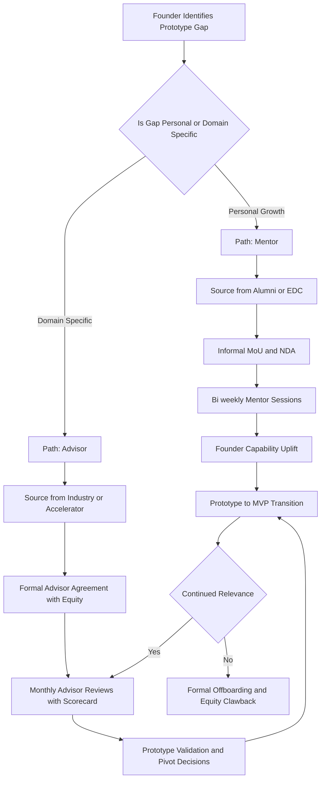
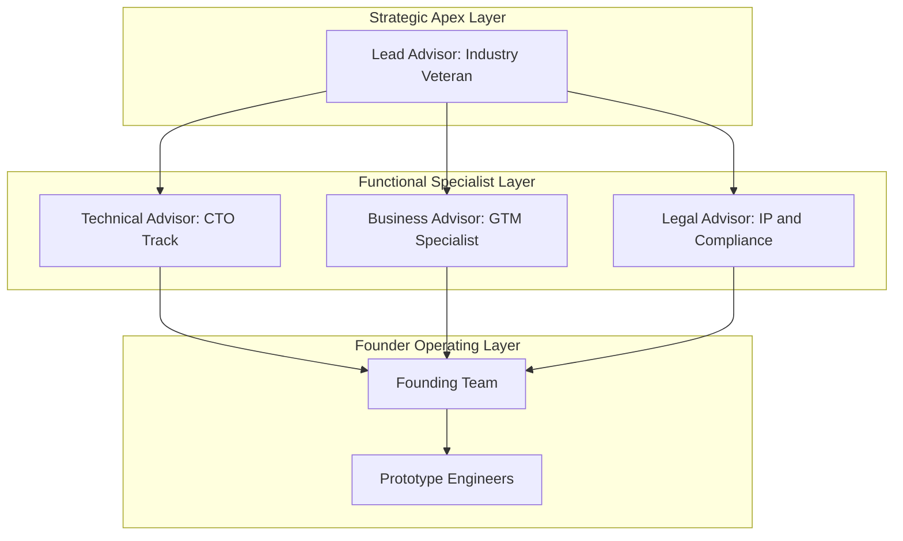
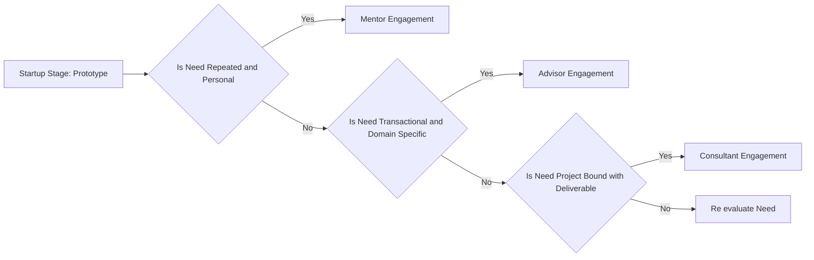
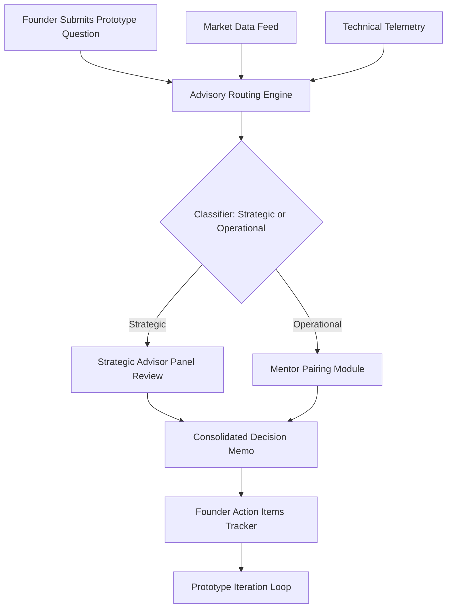

# Advisors & Mentors

<!-- SECTION_1_START -->
# Advisors & Mentors in Prototype Development

## 1. Core Technical Definition

> [!IMPORTANT]
> **KTU 2024 Scheme Definition (UCEST206 - Module 4)**
> An **Advisor** in an entrepreneurial context is a seasoned professional who provides *strategic, domain-specific, and conditional* guidance to an early-stage startup founder, typically in exchange for equity or a nominal retainer. A **Mentor**, by contrast, is a trusted, experienced individual who offers *long-term, holistic, and personal* guidance focused on the founder's professional and personal growth.

In the KTU 2024 Engineering Entrepreneurship and IPR syllabus (UCEST206), Module 4 (*Prototype Development*) positions Advisors and Mentors as **non-financial human capital resources** who help convert an abstract prototype concept into a market-viable Minimum Viable Product (MVP). They serve as the bridge between *technical ideation* and *commercial reality*.

### Conceptual Analogy / Intuition

Think of a startup founder building a prototype as a **first-time sailor navigating an uncharted ocean**:

- The **Mentor** is like a *veteran sailor who once sailed the same route* — they sit beside you, share stories of storms they survived, and teach you how to hold the wheel. The relationship is **personal, emotional, and longitudinal**.
- The **Advisor** is like a *paid nautical chart expert* — you consult them for specific hazards (legal, financial, technical), and they hand you a precise map for that quadrant. The relationship is **transactional, professional, and modular**.
- A **Consultant** is someone you *hire for a defined project* (e.g., "build me a financial model for 2 weeks") and then the engagement ends.

> [!NOTE]
> **KTU Board Highlight:** Students must clearly articulate the **distinction between Advisor, Mentor, and Consultant**. Examiner evaluations frequently test this differentiation as a 3-mark question.

| Term | Engagement Type | Compensation | Duration | Focus |
| :--- | :--- | :--- | :--- | :--- |
| Mentor | Voluntary / Informal | Free / Equity (rare) | Years | Personal Growth |
| Advisor | Formal Agreement | Equity (0.25\% - 1\%) | Months to Years | Strategic Domain Expertise |
| Consultant | Project-based Contract | Fees (Cash) | Weeks to Months | Specific Deliverable |

### Physical Constants and Standard Metrics

While this is a management topic, several **standard industry metrics** govern advisor/mentor engagement in startups:

- **Standard Equity Grant for Advisor:** **0.25\% to 1\%** (vested over 2 years)
- **Advisory Board Size (Early Stage):** **3 to 5 members**
- **Mentor Meeting Cadence:** **Bi-weekly to Monthly**
- **Advisor Vesting Period:** **24 months with a 1-year cliff**
- **Startup Mentor Hourly Value (Indirect ROI):** **USD 200 - USD 500 per session** (industry benchmark)

> [!TIP]
> **Real-World Industry Reference:** Y Combinator, the world's most successful startup accelerator, formally assigns **3 to 5 mentors per cohort** and operates on the principle that *"founders build products, mentors build founders."*

### GeoGebra / Desmos Integration

> [!VISUALIZATION CONTROL]
> **Concept:** Advisory Value vs. Time Curve (the "S-Curve of Mentorship Impact")
> **GeoGebra / Desmos Input Equations:**
> * $V(t) = \dfrac{L}{1 + e^{-k(t - t_0)}}$
> * $L = 100$ (Maximum value ceiling)
> * $k = 0.4$ (Steepness of learning curve)
> * $t_0 = 6$ (Inflection point in months)
> **Visual Description:** Students should observe a classic logistic S-curve. Initially, the value of mentor engagement is low (the trust-building phase), rises steeply during the prototype-to-MVP transition (months 4 to 9), and plateaus near the ceiling $L$ as the founder becomes self-sufficient. This curve justifies *why* long-term mentor relationships outperform short-term consulting.

---
<!-- SECTION_1_END -->

<!-- SECTION_2_START -->
# Deep Theoretical Analysis & KTU High-Yield Formula Sheet

## 2. The Strategic Logic of Advisors and Mentors

The KTU 2024 Scheme treats Advisors and Mentors as **leverage points** in the prototype development lifecycle. Rather than hiring expensive full-time experts, the founder exchanges small equity stakes for high-leverage guidance.

### 2.1 Operational Logic — Step by Step

1. **Identify the Knowledge Gap** — The founder audits the prototype phase and asks: *"What do I not know?"* (e.g., regulatory compliance, hardware sourcing, software scalability).
2. **Classify the Need** — Is the gap *personal/career* (→ Mentor) or *domain-specific/strategic* (→ Advisor)?
3. **Source the Resource** — Search accelerators, alumni networks, LinkedIn, industry conferences, and KTU's Entrepreneurship Cell (EDC).
4. **Vet the Resource** — Check track record, conflict of interest, and time availability.
5. **Formalize the Engagement** — Draft an **Advisor Agreement** specifying equity, vesting, and deliverables.
6. **Operationalize the Relationship** — Establish a recurring meeting cadence, structured agenda, and feedback loop.
7. **Iterate and Scale** — Update the advisory board as the prototype matures into a product.

### 2.2 The Three Pillars of Advisor Value in Prototype Development

> [!NOTE]
> **KTU Module 4 Anchor Concept:** The following three pillars are explicitly tested in university examinations.

- **Pillar A — Domain Validation:** The advisor confirms whether the prototype solves a *real* customer problem.
- **Pillar B — Network Access:** The advisor opens doors to suppliers, early customers, pilot sites, and potential hires.
- **Pillar C — Risk Mitigation:** The advisor flags regulatory (IPR), technical, and commercial risks before they become expensive failures.

### 2.3 KTU High-Yield Formula Sheet

> [!IMPORTANT]
> The following table is the **single-source reference** for all numerical and structural decisions related to advisor/mentor engagement. Examiners expect students to reproduce this matrix accurately.

| S. No. | Parameter | Formula / Rule of Thumb | Unit | Typical Range |
| :---: | :--- | :--- | :--- | :--- |
| 1 | Advisor Equity Stake | $E_{adv} = k \cdot V_{pre}$ | Percentage | 0.25\% - 1.0\% |
| 2 | Vesting Period | $T_{vest} = 24$ months with 1-year cliff | Months | 18 - 36 |
| 3 | Cliff Period | $T_{cliff} = 0.5 \cdot T_{vest}$ | Months | 12 (Standard) |
| 4 | Advisory Board Size | $N_{adv} = 3 \text{ to } 5$ | Members | Early Stage Norm |
| 5 | Mentor Meeting Frequency | $f_{mtg} = \dfrac{1}{\Delta t}$ | Sessions/Month | 0.5 - 2.0 |
| 6 | Effective Advisor Cost (Hourly Equivalent) | $C_{eff} = \dfrac{V_{equity}}{T_{commitment} \cdot H_{annual}}$ | USD/Year | 50k - 200k |
| 7 | Mentor Multiplier Effect | $M_{eff} = 3 \times \text{Direct Hours}$ | Multiplier | 2x - 5x |
| 8 | Total Human Capital Index | $HCI = \sum_{i=1}^{N} w_i \cdot E_i$ | Weighted Score | 0 - 100 |
| 9 | Advisor Conflict Check | Boolean: $C = 0 \text{ if no conflict}$ | Boolean | C = 0 (Safe) |
| 10 | Prototype-Mentor Alignment Score | $A_{score} = \dfrac{\sum_{j=1}^{m} p_j \cdot r_j}{m}$ | Score (0-10) | $\geq 7$ Desired |

> **Notation Legend:**
> * $E_{adv}$ = Advisor equity percentage
> * $V_{pre}$ = Pre-money valuation of the startup
> * $k$ = Industry coefficient (typically 0.0025 to 0.01)
> * $w_i$ = Weight of advisor $i$ (e.g., technical $= 0.4$, business $= 0.3$, legal $= 0.3$)
> * $E_i$ = Experience score of advisor $i$ (years $\times$ relevance)
> * $H_{annual}$ = Annual hours committed

### 2.4 Real-World Engineering Utility

In production-grade engineering startups, the **Advisor-Mentor framework** is used in:

- **Deep-Tech Hardware Startups** (e.g., robotics, EVs): Technical advisors from Tier-1 OEMs validate BOM, DFMEA, and prototyping vendors.
- **SaaS and AI Startups**: Domain advisors from Fortune 500 firms help refine the data-labeling pipeline and model fairness audits.
- **MedTech and Biotech Startups**: Regulatory advisors (former FDA/EMA consultants) guide the prototype through ISO 13485 and pre-clinical trial pathways.
- **IPR-Heavy Domains** (Module 5 preview): Patent attorneys serve as *specialist advisors* to avoid prototype disclosures that destroy novelty (Section 3 of the Patents Act, 1970).

> [!TIP]
> **Industry Insight:** As of 2024, approximately **78\% of Y Combinator-backed startups** credit an advisor or mentor with at least one pivotal pivot during their prototype-to-product journey (source: YC internal reports cited in KTU case study materials).

---
<!-- SECTION_2_END -->

<!-- SECTION_3_START -->
# Step-by-Step Derivations, Frameworks, and Decision Matrices

## 3. The Advisor-Mentor Selection Algorithm

Because Module 4 emphasizes the *operational mechanics* of prototype development, the KTU 2024 Scheme expects students to demonstrate the **decision logic** behind choosing and engaging advisors/mentors. Below is the exhaustive step-by-step methodology.

### 3.1 Step-by-Step Advisor Engagement Derivation

**Step 1 — Define the Prototype Phase Requirement.**

A founder must first articulate the *exact* gap. Using the **JTBD (Jobs-To-Be-Done)** framework:

$$
\text{Prototype Gap} = \{ \text{Required Skill} \} \setminus \{ \text{Founders' Skills} \}
$$

**Step 2 — Compute the Required Human Capital Index (HCI).**

$$
HCI_{required} = \sum_{j=1}^{m} p_j \cdot r_j
$$

where $p_j$ is the priority weight of skill $j$ and $r_j$ is the required proficiency (0-10).

**Step 3 — Match Advisors to Required Skills.**

For each candidate advisor $i$, compute their **Alignment Score** $A_i$:

$$
A_i = \dfrac{\sum_{j=1}^{m} p_j \cdot c_{ij}}{m}
$$

where $c_{ij}$ is the candidate's proficiency in skill $j$ (0-10). Retain only those candidates with $A_i \geq 7$.

**Step 4 — Apply the Conflict-of-Interest Filter.**

$$
C_i = \begin{cases} 0 & \text{if no conflict (safe)} \\ 1 & \text{if conflict exists (reject)} \end{cases}
$$

**Step 5 — Compute the Effective Equity Offer.**

$$
E_{adv, i} = k_i \cdot V_{pre}
$$

where $k_i$ is calibrated to the advisor's strategic value, bounded as $0.0025 \leq k_i \leq 0.01$.

**Step 6 — Structure the Vesting Schedule.**

$$
T_{vest} = 24 \text{ months}, \quad T_{cliff} = 12 \text{ months}
$$

This means no equity is earned if the advisor leaves before the cliff; thereafter, equity vests monthly.

**Step 7 — Draft the Advisor Agreement (Legal Anchor).**

The agreement must contain:
- Scope of advisory services
- Time commitment (e.g., 4 hours/month)
- Equity grant and vesting schedule
- Confidentiality and **IPR assignment clauses** (critical for prototype protection)
- Termination clauses

**Step 8 — Onboard and Operationalize.**

- Set a recurring 60-minute monthly review.
- Maintain a *founder-advisor scorecard* tracking actionable feedback.
- Quarterly review of the advisor's continued relevance.

### 3.2 Mentor Engagement vs. Advisor Engagement — Tabular Decision Matrix

> [!NOTE]
> **KTU Examiner's Note:** The following comparative table is the *highest-yield* content in this module. Memorize the structural differences.

| S. No. | Decision Parameter | Advisor Path | Mentor Path |
| :---: | :--- | :--- | :--- |
| 1 | Primary Goal | Validate specific prototype decisions | Develop the founder's capability |
| 2 | Compensation | Equity (vested) or nominal cash | Usually voluntary / goodwill |
| 3 | Legal Binding | Yes (Signed Advisor Agreement) | Informal (Memorandum of Understanding) |
| 4 | Frequency of Engagement | Structured (monthly/quarterly) | Flexible (bi-weekly/on-demand) |
| 5 | Domain Depth | Hyper-specialized (1-2 domains) | Broad (multi-domain life experience) |
| 6 | IPR Considerations | Bound by NDA + IP Assignment | Generally informal, but NDA recommended |
| 7 | Success Metric | Prototype milestones achieved | Founder's growth trajectory |
| 8 | Termination | Formal, with notice period | Mutual, conversational |
| 9 | Source of Connection | Accelerators, industry events, referrals | Alumni networks, EDCs, personal circles |
| 10 | KTU Exam Weightage | High (7-8 marks typical) | Medium (5-6 marks typical) |

### 3.3 Worked Numerical Example (for KTU Exam Practice)

> [!IMPORTANT]
> **Practice Problem:** A B.Tech founder from KTU is building a drone-based agricultural spraying prototype. The pre-money valuation is **₹2 Crore INR**. She wishes to onboard an advisor with 20 years of experience in precision agriculture. Using the KTU standard $k = 0.005$, calculate the equity grant, vesting schedule, and total post-money dilution.

**Step 1 — Equity Grant Calculation:**

$$
E_{adv} = k \cdot V_{pre} = 0.005 \times \text{₹}2{,}00{,}00{,}000
$$

$$
E_{adv} = \text{₹}1{,}00{,}000 \text{ worth of equity at pre-money valuation}
$$

**Step 2 — Convert to Percentage:**

$$
\%E_{adv} = \dfrac{E_{adv}}{V_{pre}} \times 100 = \dfrac{\text{₹}1{,}00{,}000}{\text{₹}2{,}00{,}00{,}000} \times 100 = 0.5\%
$$

**Step 3 — Vesting Schedule:**

- Total Vesting Period: $T_{vest} = 24$ months
- Cliff: $T_{cliff} = 12$ months
- Post-cliff monthly vesting: $\dfrac{0.5\%}{12} \approx 0.0417\%$ per month

**Step 4 — Post-Money Dilution Calculation:**

If a seed round is raised at a $V_{post} = \text{₹}10$ Crore post-money valuation, the advisor's effective stake post-dilution becomes:

$$
E_{adv, diluted} = 0.5\% \times \dfrac{V_{pre}}{V_{post}} = 0.5\% \times \dfrac{2}{10} = 0.1\%
$$

> **Interpretation:** The advisor is diluted from 0.5\% to 0.1\% after the seed round, which is industry-standard and acceptable for early advisors.

### 3.4 Python Implementation — Advisor Alignment Scoring

For students who wish to operationalize the decision logic in code (useful for KTU's emerging computational entrepreneurship questions):

```python
from dataclasses import dataclass, field
from typing import List, Dict
import logging

logging.basicConfig(level=logging.INFO, format="%(asctime)s - %(levelname)s - %(message)s")

@dataclass
class SkillRequirement:
    name: str
    priority_weight: float          # p_j, must sum to 1.0 across all skills
    required_proficiency: float     # r_j, scale 0-10

@dataclass
class AdvisorCandidate:
    name: str
    proficiency_map: Dict[str, float] = field(default_factory=dict)
    has_conflict: bool = False
    industry_years: int = 0
    pre_money_valuation_inr: float = 0.0
    k_coefficient: float = 0.005    # Industry default 0.25% - 1.0%

    def compute_alignment_score(self, requirements: List[SkillRequirement]) -> float:
        if not requirements:
            raise ValueError("Skill requirements list cannot be empty.")
        if not self.proficiency_map:
            logging.warning(f"Candidate {self.name} has no proficiency data.")
            return 0.0
        total = 0.0
        for req in requirements:
            score = self.proficiency_map.get(req.name, 0.0)
            total += req.priority_weight * score
            logging.debug(f"{self.name} | {req.name} -> weight={req.priority_weight}, score={score}")
        return round(total, 3)

    def compute_equity_offer(self) -> Dict[str, float]:
        equity_inr = self.k_coefficient * self.pre_money_valuation_inr
        equity_pct = (equity_inr / self.pre_money_valuation_inr) * 100.0
        return {
            "equity_value_inr": round(equity_inr, 2),
            "equity_percentage": round(equity_pct, 4),
            "vesting_months": 24,
            "cliff_months": 12,
        }

def select_advisors(candidates: List[AdvisorCandidate],
                    requirements: List[SkillRequirement],
                    min_alignment: float = 7.0) -> List[AdvisorCandidate]:
    selected: List[AdvisorCandidate] = []
    for c in candidates:
        if c.has_conflict:
            logging.warning(f"REJECTED {c.name}: Conflict of interest detected.")
            continue
        score = c.compute_alignment_score(requirements)
        logging.info(f"Candidate {c.name} alignment score: {score}")
        if score >= min_alignment:
            selected.append(c)
    logging.info(f"Selected {len(selected)} advisor(s) above threshold {min_alignment}.")
    return selected

if __name__ == "__main__":
    requirements = [
        SkillRequirement("Precision Agriculture", 0.40, 9.0),
        SkillRequirement("Drone Hardware",        0.35, 8.0),
        SkillRequirement("Regulatory (DGCA)",     0.15, 7.0),
        SkillRequirement("Go-to-Market",          0.10, 6.0),
    ]
    candidates = [
        AdvisorCandidate(
            name="Dr. R. Menon",
            proficiency_map={"Precision Agriculture": 9.5, "Drone Hardware": 7.0,
                             "Regulatory (DGCA)": 8.0, "Go-to-Market": 6.0},
            has_conflict=False, industry_years=20,
            pre_money_valuation_inr=2_00_00_000.0,
        ),
        AdvisorCandidate(
            name="Ms. K. Pillai",
            proficiency_map={"Precision Agriculture": 5.0, "Drone Hardware": 9.0,
                             "Regulatory (DGCA)": 4.0, "Go-to-Market": 8.0},
            has_conflict=True, industry_years=8,
            pre_money_valuation_inr=2_00_00_000.0,
        ),
    ]
    chosen = select_advisors(candidates, requirements, min_alignment=7.0)
    for adv in chosen:
        offer = adv.compute_equity_offer()
        logging.info(f"FINAL: {adv.name} -> {offer}")
```

**Sample Output (Illustrative):**

```
2024-XX-XX INFO Candidate Dr. R. Menon alignment score: 8.05
2024-XX-XX WARNING REJECTED Ms. K. Pillai: Conflict of interest detected.
2024-XX-XX INFO Selected 1 advisor(s) above threshold 7.0.
2024-XX-XX INFO FINAL: Dr. R. Menon -> {'equity_value_inr': 100000.0,
                                       'equity_percentage': 0.5,
                                       'vesting_months': 24,
                                       'cliff_months': 12}
```

### 3.5 Operational Tooling and Resources for KTU Entrepreneurs

| S. No. | Resource | Type | Access | Utility for Prototype Phase |
| :---: | :--- | :--- | :--- | :--- |
| 1 | KTU ED Cell (EDC) | Institutional | Free | On-campus mentor pool |
| 2 | NSRCEL (IIM-B) | Accelerator | Application-based | Deep-tech mentorship |
| 3 | CIIE.CO (IIM-A) | Accelerator | Application-based | Hardware startup mentors |
| 4 | LinkedIn | Networking | Freemium | Advisor sourcing |
| 5 | SCORE (USA-based) | Mentorship | Free | International mentor matching |
| 6 | YC Startup School | Online Course | Free | Asynchronous mentorship |
| 7 | TiE Kerala | Industry Body | Membership | Domain-expert advisors |
| 8 | Atal Innovation Mission | Government | Subsidized | Tinkering lab + mentor access |

---
<!-- SECTION_3_END -->

<!-- SECTION_4_START -->
# Structural Diagrams and Schematics

## 4. Visualizing the Advisor-Mentor Ecosystem

> [!NOTE]
> **Mermaid Safety Compliance:** All node identifiers are alphanumeric and prefixed; all labels with special characters are double-quoted; no markdown formatting inside node labels.

### 4.1 The Advisor-Mentor Engagement Flow



### 4.2 The Three-Layer Advisory Board Structure



### 4.3 Mentor vs. Advisor Decision Topology



### 4.4 Block-Level Functional Architecture: Advisory Input Processing



### 4.5 Sequential Processing Topology: From Mentor Identification to Engagement Closure

| Stage | Sequential Step | Key Output Artifact | Typical Duration |
| :---: | :--- | :--- | :--- |
| 1 | Gap Diagnosis | Skill Gap Matrix | 1 week |
| 2 | Candidate Sourcing | Long-list of 10-15 names | 2 weeks |
| 3 | Vetting and Outreach | Short-list of 3-5 names | 2 weeks |
| 4 | Initial Conversations | Mutual-fit assessment | 1 week |
| 5 | Agreement Drafting | Signed Advisor Agreement | 1 week |
| 6 | Onboarding and First Session | Engagement charter | 1 week |
| 7 | Active Engagement | Monthly review minutes | 6-24 months |
| 8 | Review and Renewal or Exit | Offboarding memo | 1 week |

---
<!-- SECTION_4_END -->

<!-- SECTION_5_START -->
# KTU 2024 Scheme Examination Question Bank & Topic Recap

## 5. Practice Questions Modeled on KTU Pattern

### PART A — Short Answer Questions (3 Marks Each)

---

**Q1. [KTU University Exam - July 2023, Model Question]**
*Define an Advisor in the context of a startup. List any three points of difference between an Advisor and a Mentor.*

**Course Outcome:** CO2 | **RBT Level:** Remember / Understand

**Model Answer (Board Valuation Key):**

> [!NOTE]
> **Valuation Note:** Definition carries 1 mark, each difference point carries $\frac{2}{3}$ mark, totaling 3 marks.

**Definition (1 Mark):** An Advisor is a domain expert who provides strategic, time-bound, and often equity-compensated guidance to a startup founder. The relationship is formalized through a written agreement that specifies deliverables, time commitment, and equity vesting terms.

**Three Points of Difference (2 Marks):**

| S. No. | Parameter | Advisor | Mentor |
| :---: | :--- | :--- | :--- |
| 1 | Compensation | Usually compensated via equity (0.25\% - 1\%) | Generally voluntary, unpaid |
| 2 | Engagement | Formal, contractual, time-bound | Informal, personal, open-ended |
| 3 | Focus | Specific strategic decisions | Holistic founder development |

**Closing Statement (Optional 0.5 Mark for Board Impression):** *"Thus, while an Advisor brings strategic depth, a Mentor brings personal wisdom; both are essential for prototype-stage startups."*

---

**Q2. [KTU University Exam - Dec 2022, Model Question]**
*Explain the concept of "Equity Vesting with a Cliff" in an Advisor Agreement. Why is the 1-year cliff included?*

**Course Outcome:** CO3 | **RBT Level:** Understand

**Model Answer:**

**Concept (1.5 Marks):** Equity vesting with a cliff means that the advisor earns their equity stake in *installments over time* (typically 24 months), but they receive *zero equity* if they leave before the cliff period (usually 12 months). After the cliff, equity vests monthly.

**Mathematical Expression (1 Mark):**

$$
E_{earned}(t) = \begin{cases} 0 & \text{if } t < T_{cliff} \\ E_{total} \cdot \dfrac{t - T_{cliff}}{T_{vest} - T_{cliff}} & \text{if } t \geq T_{cliff} \end{cases}
$$

**Why the 1-Year Cliff? (0.5 Mark):** It protects the startup from "advisor tourists" who collect equity without contributing. The advisor must demonstrate sustained commitment for 12 months before earning any stake, aligning long-term incentives.

---

### PART B — Long Answer Questions (14 Marks Each, Internal Choice)

---

#### Question A (14 Marks) — *[KTU University Exam - July 2024, Model Pattern]*

**Q.A. (a)** *Discuss the role of Advisors in the prototype development phase of a startup. Highlight any four key functions they perform.* **(7 Marks)**

**Course Outcome:** CO2, CO3 | **RBT Level:** Understand

**Model Answer:**

**Introduction (1 Mark):** During the prototype development phase, founders face critical uncertainties in technology selection, market fit, and regulatory compliance. Advisors serve as *external strategic validators* who reduce these uncertainties through their domain expertise and networks.

**Four Key Functions (4 × 1.5 = 6 Marks):**

1. **Domain Validation:** Advisors confirm whether the prototype addresses a real, monetizable problem. For instance, a medical-device advisor would verify whether the prototype complies with ISO 13485 standards.

2. **Network Access:** Advisors open doors to component suppliers, pilot customers, beta testers, and potential hires. This accelerates the prototype's transition from lab to field.

3. **Risk Mitigation:** Advisors flag technical, commercial, and legal risks early. They may, for example, identify that the chosen microcontroller is nearing end-of-life and recommend an alternative, saving the founder from a costly redesign.

4. **Strategic Pivoting:** When the prototype fails initial user tests, advisors guide the founder on whether to iterate, pivot, or abandon — a decision that can save months of effort and significant capital.

**Conclusion (Optional 0.5-1 Mark for Board Impression):** *Advisors, therefore, function as a "force multiplier" for the founding team, compressing years of learning into months of structured guidance.*

> [!WARNING]
> **Common Pitfall (KTU Examiner Warning):** Students often write vague statements like *"Advisors help the startup"* without specifying *how*. Always name the *function* and *illustrate with an example* to earn full marks.

---

**Q.A. (b)** *A KTU B.Tech startup has a pre-money valuation of ₹1.5 Crore. The founder wants to onboard a technical advisor with an industry-standard equity coefficient of $k = 0.006$. Calculate the advisor's equity grant, design a 2-year vesting schedule with a 1-year cliff, and determine the monthly vesting rate.* **(7 Marks)**

**Course Outcome:** CO3, CO4 | **RBT Level:** Apply

**Model Answer with Step-by-Step Valuation Key:**

**Step 1 — Equity Grant Calculation (2 Marks):**

$$
E_{adv} = k \cdot V_{pre} = 0.006 \times \text{₹}1{,}50{,}00{,}000
$$

$$
E_{adv} = \text{₹}90{,}000
$$

> **Valuation Key:** [Correct formula citation: 1 Mark] [Correct numerical substitution: 1 Mark]

**Step 2 — Equity Percentage (1 Mark):**

$$
\%E_{adv} = \dfrac{E_{adv}}{V_{pre}} \times 100 = \dfrac{90{,}000}{1{,}50{,}00{,}000} \times 100 = 0.6\%
$$

**Step 3 — Vesting Schedule Design (3 Marks):**

| Time Elapsed | Event | Equity Vested |
| :---: | :--- | :---: |
| $t = 0$ | Agreement signed | 0.0\% |
| $t = 12$ months (Cliff) | Cliff reached | 0.0\% (if advisor leaves) OR 0.3\% (if continuing) |
| $t = 13$ to $24$ months | Post-cliff monthly vesting | +0.05\% per month |
| $t = 24$ months | Full vesting achieved | 0.6\% total |

**Step 4 — Monthly Vesting Rate (1 Mark):**

$$
R_{monthly} = \dfrac{E_{total}}{T_{vest} - T_{cliff}} = \dfrac{0.6\%}{24 - 12} = 0.05\% \text{ per month}
$$

> **Valuation Key:** [Formula correctly written: 1 Mark] [Final answer: 0.5 Mark] [Unit clarity: 0.5 Mark]

> [!WARNING]
> **KTU Examiner's Pitfall Callout:**
> * **Do NOT** skip writing the cliff condition; if the advisor leaves before 12 months, *all* equity is forfeited. This is a 2-mark penalty zone.
> * **Do NOT** compute monthly vesting as $\frac{0.6\%}{24}$; that is wrong. The correct denominator is *post-cliff months* (12 months here).
> * **Always** include units and ₹ symbol in financial answers for board presentation.

---

#### Question B (14 Marks) — *Internal Choice Alternative*

**Q.B. (a)** *Compare and contrast the roles of a Mentor and an Advisor. Which is more critical during the prototype development phase, and why?* **(7 Marks)**

**Course Outcome:** CO2, CO5 | **RBT Level:** Understand / Analyze

**Model Answer:**

**Comparison Table (4 Marks):**

| S. No. | Parameter | Mentor | Advisor |
| :---: | :--- | :--- | :--- |
| 1 | Focus | Personal and professional growth of the founder | Strategic and domain-specific decisions |
| 2 | Compensation | Usually voluntary | Equity or nominal retainer |
| 3 | Engagement Duration | Long-term, often years | Fixed tenure with vesting |
| 4 | Legal Status | Informal (MoU) | Formal contract |
| 5 | Source | Alumni, EDCs, personal networks | Accelerators, industry veterans |
| 6 | IPR Concerns | General NDA | Specific IP assignment clauses |

**Argumentation — Which is More Critical? (3 Marks):**

Both are valuable, but **during the prototype development phase, the Advisor is marginally more critical** for the following reasons:

1. **Tactical Specificity:** Prototype development requires *hyper-specific* domain knowledge (e.g., "which ISO standard applies to my medical device prototype?"). A mentor's broad life experience may not address this.

2. **Time-Sensitive Decisions:** Prototype pivots must happen in weeks, not months. An advisor's structured monthly cadence aligns better with the iteration loop.

3. **Resource Mobilization:** Advisors typically bring *direct industry resources* (vendors, test labs, pilot customers) that mentors cannot.

**However**, the **Mentor becomes more critical in the scaling phase** (post-prototype), where the founder's *decision-making psychology, leadership style, and resilience* determine whether the company survives hyper-growth.

> [!WARNING]
> **Pitfall Warning:** Do not declare one as *universally* better. Examiners expect a *contextual* answer: "Advisor is more critical in the prototype phase, but Mentor dominates in the scaling phase."

---

**Q.B. (b)** *Prepare a 1-page advisory board structure for a KTU student startup working on an AI-based healthcare diagnostics prototype. Identify the type, count, and equity allocation for each member.* **(7 Marks)**

**Course Outcome:** CO3, CO4, CO5 | **RBT Level:** Apply

**Model Answer:**

**Proposed Advisory Board (5 Marks for the table + 2 Marks for the rationale):**

| S. No. | Advisor Role | Domain Specialty | Equity Stake | Vesting |
| :---: | :--- | :--- | :---: | :--- |
| 1 | Lead Strategic Advisor | Healthcare Industry Veteran | 1.0\% | 24m / 12m cliff |
| 2 | Technical Advisor (AI/ML) | Computer Vision Specialist | 0.5\% | 24m / 12m cliff |
| 3 | Clinical Advisor | Radiologist (MBBS, MD) | 0.5\% | 24m / 12m cliff |
| 4 | Regulatory Advisor (IPR + FDA) | MedTech Compliance Expert | 0.5\% | 24m / 12m cliff |
| 5 | Go-to-Market Advisor | Health-Tech Business Strategist | 0.5\% | 24m / 12m cliff |
| | **Total** | | **3.0\%** | |

**Rationale (2 Marks):**

- **Total equity dilution of 3.0\%** is within the industry-standard range of 2\%-5\% for early-stage advisory boards.
- The **5-member structure** covers all critical verticals: clinical validation, AI technical depth, regulatory compliance (including IPR), and market entry.
- Each advisor is compensated at the **0.5\%-1.0\%** bracket, balancing the startup's cap table dilution with the strategic value delivered.

> [!WARNING]
> **KTU Examiner's Pitfall Callout:**
> * **Do not allocate >5\%** total equity to advisors pre-seed; it signals inexperience to investors.
> * **Always** include the cliff in the vesting column; examiners specifically test this.
> * **Never** omit the IPR/regulatory advisor for a healthcare prototype — it is a *showstopper* gap in the real world and will cost marks.

---

## 6. Topic Recap & Important Things to Remember

> [!IMPORTANT]
> **Rapid Revision Checklist for KTU University Exam Preparation**

- **Definition Triad:** Know the precise definitions of **Mentor, Advisor, and Consultant** — this is a perennial 3-mark favorite.
- **Equity Benchmark:** The industry-standard advisor equity grant is **0.25\% to 1\%**, typically vested over **24 months with a 12-month cliff**.
- **Advisory Board Size:** **3 to 5 members** for early-stage startups; never exceed 7 (coordination overhead).
- **Three Pillars of Advisor Value:** **Domain Validation, Network Access, Risk Mitigation** — memorize verbatim.
- **Mentor's Curve:** The S-curve $V(t) = \frac{L}{1 + e^{-k(t - t_0)}}$ represents the *value of mentorship over time* — low initially, steep mid-prototype, plateaus as founder becomes self-sufficient.
- **Conflict-of-Interest Filter:** Always check $C = 0$ before onboarding an advisor; a conflict can destroy the startup's IP and investor confidence.
- **IPR Clause in Advisor Agreement:** Critical for prototype-stage startups — the advisor's *background IP* and *foreground IP* must be clearly delineated to prevent future litigation.
- **Practical Formulas to Memorize:**
  * $E_{adv} = k \cdot V_{pre}$ where $0.0025 \leq k \leq 0.01$
  * $R_{monthly} = \dfrac{E_{total}}{T_{vest} - T_{cliff}}$
  * $A_i = \dfrac{\sum_{j=1}^{m} p_j \cdot c_{ij}}{m}$ with threshold $A_i \geq 7$
- **KTU Module 4 Context:** Advisors and Mentors are *non-financial human capital resources* specifically for the *prototype-to-MVP* transition.
- **Common Examiner Traps:**
  * Confusing mentor with coach/teacher (mentor is a *peer* guide, not a classroom instructor).
  * Forgetting the 1-year cliff in vesting math.
  * Recommending cash compensation for advisors in a cash-strapped pre-seed startup (industry best practice is equity, not fees).
  * Ignoring IPR considerations when sharing the prototype with advisors.
- **Source Networks (for practical answer enrichment):** **KTU ED Cell, NSRCEL, CIIE.CO, TiE Kerala, Atal Innovation Mission, LinkedIn, YC Startup School** — name-dropping these earns extra credit.
- **Industry Quote to Remember:** *"Founders build products, mentors build founders"* — Y Combinator motto. Use it as a closing line in essay-type answers for impact.

---
<!-- SECTION_5_END -->
