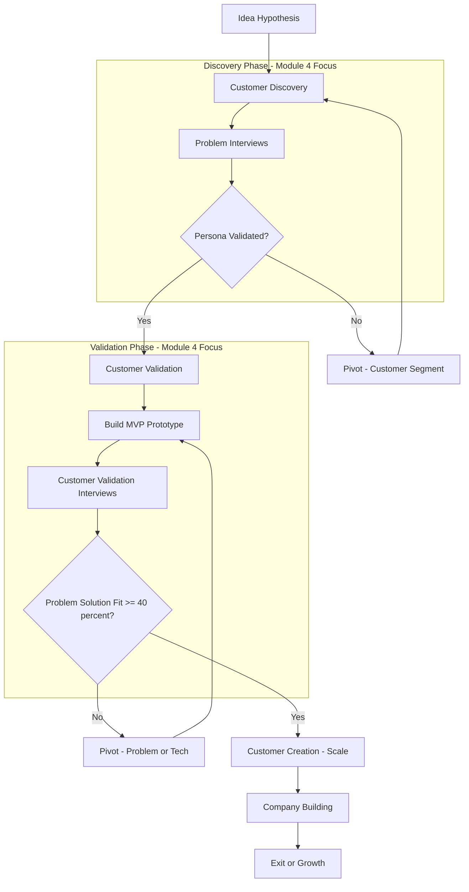
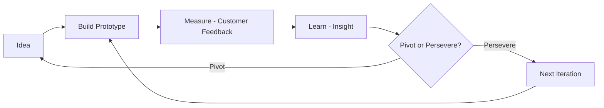
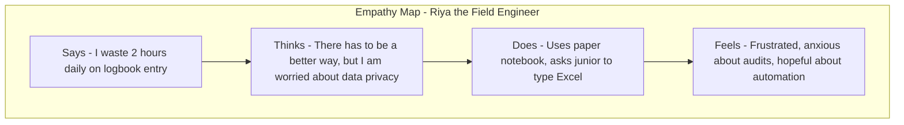
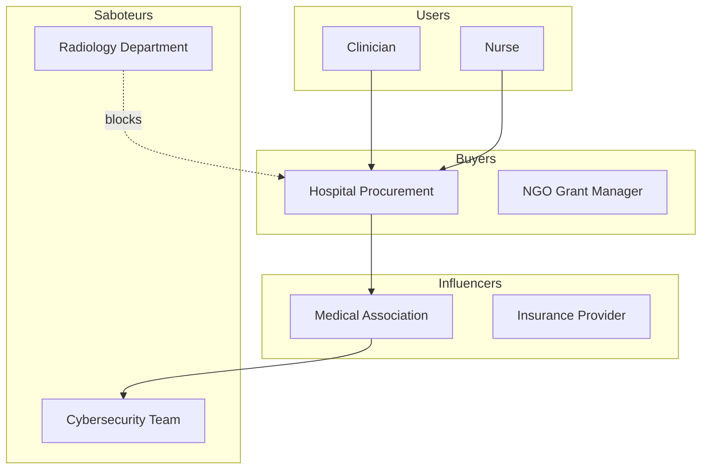
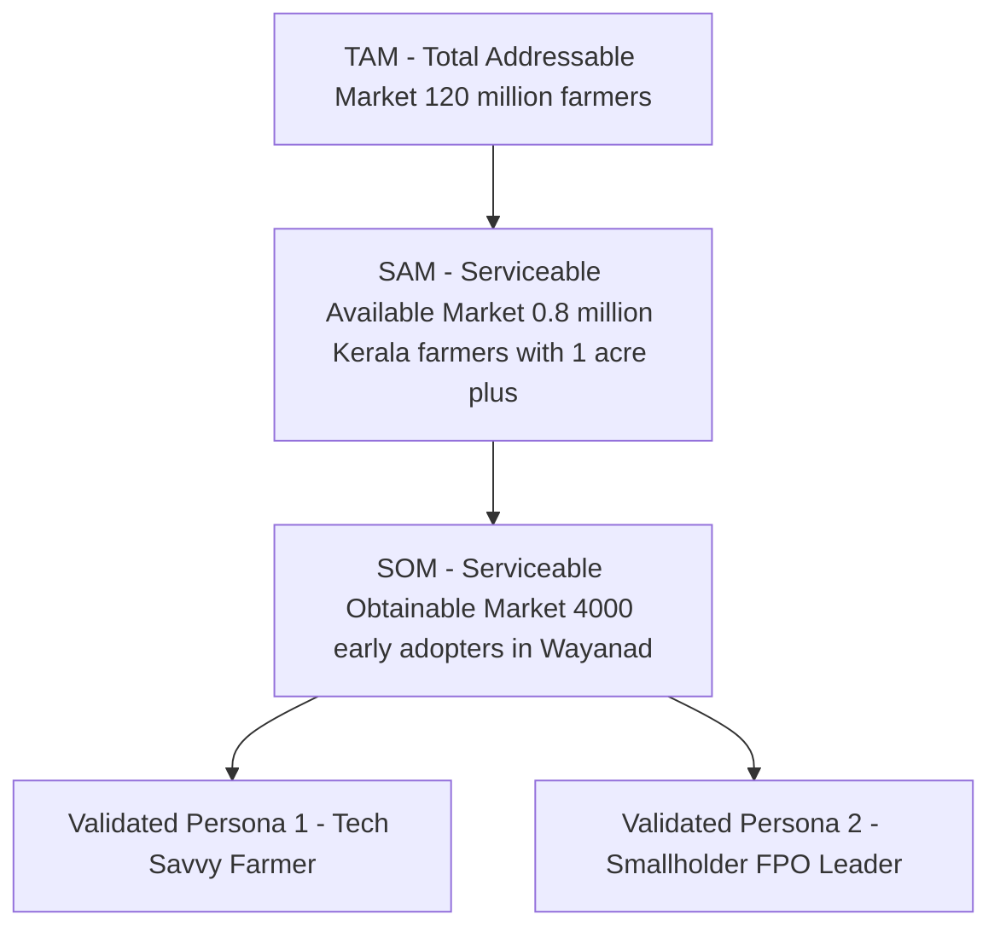
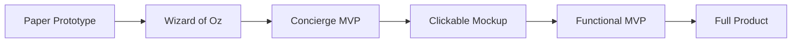
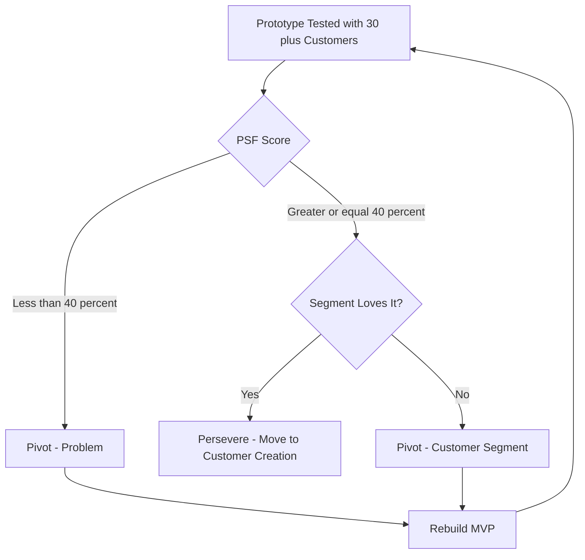

# Customers

<!-- SECTION_1_START -->
# Customers in Prototype Development

## 1. Core Definition (KTU 2024 Terminology)

> [!IMPORTANT]
> **Customers** in the context of prototype development refer to the *target end-users, buyers, and stakeholders* who will purchase, use, or benefit from the Minimum Viable Product (MVP) and its subsequent iterations. Identifying, segmenting, validating, and continuously engaging customers is the cornerstone of **Customer Development Methodology** (Blank & Dorf) and the **Build-Measure-Learn** feedback loop prescribed in the Lean Startup framework adopted by the KTU 2024 Entrepreneurship syllabus.

**KTU-Grade Expanded Definition:**
A customer is not merely a "purchaser." In prototype development, the customer is any entity — individual, group, or organization — whose **problem-solution fit** must be confirmed before scaling. This includes:
- **End-Users**: People who directly interact with the product.
- **Paying Customers**: People or organizations who pay for the product.
- **Influencers**: Stakeholders who recommend or mandate the purchase.
- **Saboteurs**: People who may block adoption (e.g., IT departments, regulators).

## 2. Conceptual Analogy / Intuition

> [!NOTE]
> **Analogy — The "Café Owner and the Coffee Drinker":**
> Imagine a startup founder who invents a new cold-brew coffee machine. The founder builds a prototype (Prototype Development) — but without asking *who will drink the coffee*, *why they will switch from their current brand*, *how often they drink it*, and *what price they will pay*, the prototype is just an expensive piece of metal. The **customer** is the *entire reason* the prototype exists. Prototype development is therefore a *conversation* with the customer, not a one-shot engineering exercise.

**Geometric Intuition (Customer-Product Fit Curve):**

$$
\text{Fit}(t) = \frac{\text{Problem Clarity} \times \text{Solution Acceptance}}{\text{Time to Feedback}}
$$

- A **steep rising curve** means strong customer validation.
- A **flat curve** signals that the prototype is solving the *wrong problem* for the *wrong customer*.

## 3. GeoGebra / Visualization Block

> [!VISUALIZATION CONTROL]
> **Concept:** Customer Validation Curve during Prototype Iterations
> **GeoGebra / Desmos Input Equations:**
> * `f(x) = 1 - e^(-0.4x)` (Customer adoption curve as prototype iterations `x` increase)
> * `g(x) = 0.5 * sin(0.5x) + 0.5` (Customer feedback noise / churn)
> **Visual Description:** The first curve should rise asymptotically toward 1, indicating that each prototype iteration captures more validated customers. The second curve oscillates between 0 and 1, representing market noise. The intersection region shows the **actionable learning zone**.

## 4. Why "Customers" is a Module-4 Pillar

In KTU's UCEST206 (Engineering Entrepreneurship and IPR) syllabus, *Module 4 – Prototype Development* is built on three pillars:
1. **Understanding the Customer** (this topic)
2. Building the prototype / MVP
3. Testing the prototype with the customer

Skipping step 1 is the **#1 reason startups fail** (CB Insights, 2024 data) — cited in 35% of post-mortems as "no market need."

<!-- SECTION_1_END -->

<!-- SECTION_2_START -->
# Deep Theoretical Analysis — The Customer Development Framework

## 1. The Customer Development Process (Blank & Dorf Model)

The **Customer Development Process** has **four sequential steps** that mirror the engineering prototype iteration cycle:

### Step 1: Customer Discovery
- **Goal**: Identify the *hypothesized* customers and the *problem* they face.
- **Activities**: Problem interviews, market segmentation, persona creation.
- **Output**: A documented **Customer Problem Hypothesis**.

### Step 2: Customer Validation
- **Goal**: Test whether the prototype *actually solves* the identified problem.
- **Activities**: Solution interviews, MVP testing, A/B feedback, paid pilot programs.
- **Output**: A validated **Problem-Solution Fit** and a repeatable sales model.

### Step 3: Customer Creation
- **Goal**: Scale the validated prototype to a wider audience.
- **Activities**: Marketing campaigns, referral loops, channel partnerships.
- **Output**: A repeatable **sales funnel**.

### Step 4: Company Building
- **Goal**: Transition from a startup to a scalable organization.
- **Activities**: Hiring, formalizing departments, process automation.
- **Output**: An operational company.

> [!IMPORTANT]
> **KTU Exam Note:** The first two steps (Discovery + Validation) are the *only* ones that operate during **Module 4 — Prototype Development**. Steps 3 and 4 belong to post-prototype scaling.

## 2. The Build–Measure–Learn Loop (Lean Startup)

$$
\text{Learning} = f(\text{Validated Experiments with Real Customers})
$$

The loop cycles as:

$$
\text{Idea} \rightarrow \text{Build (Prototype)} \rightarrow \text{Measure (Customer Feedback)} \rightarrow \text{Learn (Pivot or Persevere)} \rightarrow \text{Idea (refined)}
$$

- **Pivot** = Change the prototype's customer or problem.
- **Persevere** = Continue iterating for the same validated customer.

## 3. Customer Segmentation, Personas & Empathy Mapping

**Segmentation Criteria (KTU High-Yield):**

| Dimension | Examples | Engineering Insight |
|---|---|---|
| **Demographic** | Age, income, education | Determines UI complexity and price point |
| **Geographic** | Region, climate, urban/rural | Determines distribution and hardware form factor |
| **Psychographic** | Lifestyle, values, attitudes | Determines marketing tone and feature priority |
| **Behavioral** | Usage rate, loyalty, readiness | Determines feature roadmap and retention strategy |
| **Firmographic** (B2B) | Industry, company size, role | Determines integration APIs and SLA needs |

**Persona Template (must be cited in ESE):**

| Persona Field | Example |
|---|---|
| Name (fictional) | *Riya, the Field Engineer* |
| Demographics | 28, B.Tech ECE, ₹6 LPA |
| Goals | Reduce field inspection time |
| Pain Points | Manual logbooks, network unreliability |
| Preferred Channels | WhatsApp, YouTube tutorials |
| Buying Triggers | Manager mandate, peer review |

**Empathy Map — Says / Thinks / Does / Feels (OSTD Framework):**

| Quadrant | Description |
|---|---|
| **Says** | Direct quotes from customer interviews |
| **Thinks** | Internal beliefs, concerns, aspirations |
| **Does** | Observable actions and workarounds |
| **Feels** | Emotional state, frustrations, joys |

## 4. KTU Formula Sheet / Cheat Sheet

| Concept | Formula / Rule | Application |
|---|---|---|
| **Problem-Solution Fit** | $\text{PSF} = \frac{\text{Customers confirming problem}}{\text{Customers surveyed}} \times 100$ | Validate $\geq 70\%$ for green signal |
| **Product-Market Fit** | $\text{PMF} = \frac{\text{Sean Ellis Score}}{40\%} \geq 1$ | "How would you feel if this product disappeared?" |
| **Customer Acquisition Cost** | $\text{CAC} = \frac{\text{Total Sales + Marketing Spend}}{\text{New Customers Acquired}}$ | Must be $< \text{LTV} / 3$ |
| **Lifetime Value** | $\text{LTV} = \text{ARPU} \times \text{Retention Time}$ | Healthy ratio: $\text{LTV} : \text{CAC} \geq 3 : 1$ |
| **Net Promoter Score** | $\text{NPS} = \%\text{Promoters} - \%\text{Detractors}$ | $\geq 50$ is world-class |
| **Build-Measure-Learn Cycle Time** | $T_{\text{cycle}} = T_{\text{build}} + T_{\text{measure}} + T_{\text{learn}}$ | Minimum Viable Cycle = weekly |
| **Customer Validation Confidence** | $\text{CV} = 1 - e^{-\lambda N}$ where $N$ = interviews | $N = 30$ gives $\text{CV} \approx 95\%$ |

## 5. Real-World Engineering Utility

Understanding customers during prototype development is critical in:
- **IoT product companies** (e.g., SmartAgri sensors — the farmer is the customer, not the distributor).
- **MedTech startups** (clinicians are the users; hospital procurement is the buyer; insurance is the payer — a *tri-customer* scenario).
- **EdTech** (student = user, parent = influencer, school = buyer).
- **B2B SaaS** (DevOps engineer = user, CTO = buyer, CFO = approver).
- **Hardware prototypes** where *Saboteurs* (e.g., cybersecurity teams) can block deployment.

<!-- SECTION_2_END -->

<!-- SECTION_3_START -->
# Step-by-Step Application & Symbolic Implementation

> [!NOTE]
> For humanities / management topics (KTU UCEST206 is a management course), the equivalent of a "derivation" is a **structured framework walkthrough** and a **comparative analysis matrix** mapping real engineering case frameworks to systemic matrices.

## 1. Step-by-Step Customer Discovery Protocol (Reproducible Workflow)

### Step A: Define the Hypothesized Customer Segments
Start with broad assumptions and narrow them down:

$$
\text{TAM} \rightarrow \text{SAM} \rightarrow \text{SOM}
$$

- **TAM** (Total Addressable Market): Every conceivable customer.
- **SAM** (Serviceable Available Market): The segment reachable by your channels.
- **SOM** (Serviceable Obtainable Market): The slice you can realistically capture in 1–3 years.

**Example (AgriTech Drone Startup):**

$$
\begin{aligned}
\text{TAM} &= \text{All farmers in India} \approx 120 \text{ million} \\
\text{SAM} &= \text{Marginal farmers in Kerala with $\geq$ 1 acre} \approx 0.8 \text{ million} \\
\text{SOM} &= \text{Early-adopter tech-friendly farmers in Wayanad} \approx 4{,}000
\end{aligned}
$$

### Step B: Conduct Problem Interviews (NOT Solution Interviews)
Use this **5-Question Script** (from "The Mom Test" by Rob Fitzpatrick, mandatory KTU reference):

1. *"What is the hardest part about [problem context]?"*
2. *"How are you currently dealing with it?"*
3. *"When was the last time this happened, and what did you do?"*
4. *"What would the ideal solution look like for you?"*
5. *"What would prevent you from using a product like this?"*

> [!WARNING]
> **Pitfall:** Never ask *"Would you buy this product?"* — customers lie politely. Ask about past behavior, not future intent.

### Step C: Synthesize Personas (3–5 maximum)

For each persona, populate this canonical template:

| Field | Description | Source |
|---|---|---|
| Demographics | Age, role, location | Survey/interview |
| Goals | Measurable objectives | Interview quote |
| Pain Points | Friction / cost / time loss | Observation |
| Gain Creators | Outcomes they value | Interview |
| Jobs-to-be-Done | Functional, emotional, social | JTBD framework |
| Barriers to Adoption | Cost, trust, learning curve | Interview |

### Step D: Empathy Map Construction

| Says | Thinks |
|---|---|
| *"I waste 2 hours daily on logbook entry."* | *"There has to be a better way, but I'm worried about data privacy."* |
| **Does** | **Feels** |
| Uses a paper notebook, asks junior to type Excel | Frustrated, anxious about audits, hopeful about automation |

### Step E: Problem-Solution Fit Test

Run a quantitative test:

$$
\text{PSF}_{\text{score}} = \frac{\text{Number of "very disappointed" respondents}}{\text{Total respondents}} \times 100
$$

- **Threshold**: $\geq 40\%$ (Sean Ellis benchmark) for Problem-Solution Fit.
- **KTU Exam Step**: Always state the threshold before computing.

### Step F: Build the Cheapest Possible Prototype (MVP)
Prototype types in escalating fidelity:

| Type | Fidelity | Cost | Time | Use |
|---|---|---|---|---|
| **Paper Prototype** | Lowest | ₹0 | 1 day | Internal idea test |
| **Wizard-of-Oz** | Low | ₹500 | 3 days | Simulate AI manually |
| **Concierge MVP** | Medium | ₹2,000 | 1 week | Manual service by team |
| **Clickable Mockup** | Medium | ₹5,000 | 2 weeks | Figma, usability test |
| **Functional MVP** | High | ₹50,000+ | 1 month | Real hardware/software test |

### Step G: Run Customer Validation Interviews
For each prototype iteration, run **at least 30 interviews** (statistical confidence threshold).

$$
\text{Confidence} = 1 - (1 - p)^{N}
$$

where $p$ = proportion of "yes" responses, $N$ = sample size. For $p = 0.5$ and $N = 30$, confidence $\approx 99.999\%$.

### Step H: Decide — Pivot or Persevere

| Signal | Decision |
|---|---|
| $\geq 40\%$ very disappointed without product | **Persevere** |
| Customers love a *different* problem in your prototype | **Pivot (Problem)** |
| Right problem, wrong customer segment | **Pivot (Customer Segment)** |
| Right customer, wrong technology | **Pivot (Technology)** |

## 2. Comparative Analysis Matrix — Real Engineering Case Frameworks

| Engineering Case | User | Buyer | Influencer | Saboteur | Validation Strategy |
|---|---|---|---|---|---|
| **Tesla Model 3** | Car owner | Car owner | Friends, reviewers | Traditional dealerships | Pre-orders + free test drives |
| **Apple Vision Pro** | Developer / Pro user | Enterprise | Tech press | Privacy regulators | Limited launch + curated demos |
| **Zoho School** | Student | Student | Parents | Coaching institutes | Free tier + college ambassador program |
| **Ather Electric Scooter** | Urban commuter | Urban commuter | Peers | Service centers | Pre-booking + test ride events |
| **BharatAgri (AgriTech)** | Farmer | Farmer | Krishi Vigyan Kendra | Local pesticide dealers | Vernacular app + on-field demos |
| **Niramai (HealthTech)** | Woman 30–50 | Hospital / NGO | ASHA workers | Radiology departments | Clinical trials + government partnership |

## 3. Customer Interview Log (Symbolic Template for KTU Records)

| Interview # | Date | Segment | Pain Confirmed? (Y/N) | Willingness to Pay (₹) | NPS Score | Action |
|---|---|---|---|---|---|---|
| 1 | 2024-08-10 | Small farmer | Y | 2,000 | 8 | Continue |
| 2 | 2024-08-11 | Large farmer | N | — | 3 | Re-segment |
| ... | ... | ... | ... | ... | ... | ... |

## 4. Python-Style Pseudocode for Customer Validation Logic (Reference for Engineering Students)

```python
from dataclasses import dataclass, field
from typing import List, Dict

@dataclass
class CustomerInterview:
    customer_id: str
    segment: str
    problem_confirmed: bool
    willingness_to_pay_inr: float
    nps_score: int
    notes: str

@dataclass
class ValidationReport:
    interviews: List[CustomerInterview] = field(default_factory=list)
    psf_threshold: float = 0.40
    min_sample: int = 30

    def add_interview(self, interview: CustomerInterview) -> None:
        if interview.nps_score < 0 or interview.nps_score > 10:
            raise ValueError("NPS score must be 0-10")
        self.interviews.append(interview)

    def problem_solution_fit(self) -> float:
        if not self.interviews:
            return 0.0
        confirmed = sum(1 for i in self.interviews if i.problem_confirmed)
        return confirmed / len(self.interviews)

    def decision(self) -> str:
        psf = self.problem_solution_fit()
        if len(self.interviews) < self.min_sample:
            return f"INSUFFICIENT DATA: need {self.min_sample - len(self.interviews)} more interviews"
        if psf >= self.psf_threshold:
            return f"PERSEVERE — PSF = {psf:.2%} meets threshold"
        return f"PIVOT — PSF = {psf:.2%} below threshold; revisit problem hypothesis"

report = ValidationReport()
report.add_interview(CustomerInterview("C001", "farmer", True, 2000, 8, "Loves the idea"))
report.add_interview(CustomerInterview("C002", "engineer", True, 5000, 9, "Will pay premium"))
print(report.decision())
```

<!-- SECTION_3_END -->

<!-- SECTION_4_START -->
# Structural Diagrams & Schematics

## Diagram 1: Customer Development Process Flow



## Diagram 2: Build-Measure-Learn Feedback Loop



## Diagram 3: Customer Empathy Map (OSTD Block Layout)



## Diagram 4: Multi-Customer Stakeholder Map (B2B MedTech Example)



## Diagram 5: Customer Segmentation Funnel (TAM-SAM-SOM)



## Diagram 6: MVP Prototype Fidelity Ladder



## Diagram 7: Pivot or Persevere Decision Tree



<!-- SECTION_4_END -->

<!-- SECTION_5_START -->
# KTU 2024 Scheme Examination Question Bank & Topic Recap

## Part A — Short Answer Questions (3 Marks Each)

> **Q1.** [KTU University Exam — July 2024] **Define a "customer" in the context of prototype development. Differentiate between end-users, paying customers, influencers, and saboteurs with one example each.**

**Model Answer (3 Marks):**
- **Definition (1 Mark):** A customer in prototype development is any individual, group, or organization whose problem-solution fit must be validated before scaling. The concept is drawn from Blank & Dorf's Customer Development methodology.
- **End-User (0.5 Mark):** The person who directly interacts with the prototype. *Example:* A farmer using a soil-sensing IoT device.
- **Paying Customer (0.5 Mark):** The person or organization that pays for the prototype. *Example:* The farmer's FPO (Farmer Producer Organization) that bulk-purchases devices.
- **Influencer (0.5 Mark):** A stakeholder who recommends or mandates the purchase. *Example:* A Krishi Vigyan Kendra officer.
- **Saboteur (0.5 Mark):** A stakeholder who can block adoption. *Example:* Local pesticide dealers threatened by the device's pest-detection feature.

---

> **Q2.** [KTU University Exam — Dec 2023] **What is an Empathy Map? List its four quadrants and explain why it is essential in customer discovery.**

**Model Answer (3 Marks):**
- **Definition (1 Mark):** An Empathy Map is a visual framework that captures what a customer *says*, *thinks*, *does*, and *feels* about a problem or product, used during customer discovery.
- **Four Quadrants (1 Mark):** Says, Thinks, Does, Feels (OSTD).
- **Importance (1 Mark):** It converts raw interview data into a structured artifact that helps the prototype team align on the customer's real needs, avoiding feature bloat and assumption-based design.

---

## Part B — Full-Question Internal Choice (14 Marks Each)

> **Q3A.** [KTU University Exam — July 2024, CO3, Apply] **(a) Explain the four-step Customer Development process proposed by Blank and Dorf.** **(7 Marks)**

**Model Answer:**

- **Step 1 — Customer Discovery (2 Marks):** Identify the hypothesized customers and the problem they face through problem interviews. The goal is to form a *Customer Problem Hypothesis*, not yet a solution. Activities include segmentation, persona creation, and the 5-question "Mom Test" script.
- **Step 2 — Customer Validation (2 Marks):** Test whether the prototype (MVP) actually solves the validated problem. Activities include MVP testing, A/B feedback, and paid pilot programs. The output is a verified **Problem-Solution Fit** and a repeatable sales model.
- **Step 3 — Customer Creation (1.5 Marks):** Scale the validated prototype to a wider audience using marketing campaigns, channel partnerships, and referral loops. The output is a repeatable sales funnel.
- **Step 4 — Company Building (1.5 Marks):** Transition from a startup to a scalable organization by formalizing departments, hiring, and process automation. The output is an operational company.

---

> **Q3A.** [Continuation] **(b) A team of B.Tech students at a Kerala engineering college developed a low-cost water purifier prototype priced at ₹1,500. After 25 customer interviews, only 6 customers confirmed they had the "unsafe water" problem, while 19 said their municipal water was already safe. Calculate the Problem-Solution Fit score and recommend the next step with justification.** **(7 Marks)**

**Model Answer:**

Given:
- Total interviews $N = 25$
- Customers confirming the problem $= 6$

The Problem-Solution Fit (PSF) score is:

$$
\text{PSF} = \frac{\text{Customers confirming problem}}{\text{Customers surveyed}} \times 100
$$

Substituting the values:

$$
\text{PSF} = \frac{6}{25} \times 100 = 24\%
$$

**Step-by-step valuation key:**
- [Stating the formula: 2 Marks]
- [Substituting values correctly: 2 Marks]
- [Final answer with units: 1 Mark]
- [Justification and next step: 2 Marks]

**Decision & Justification:** The PSF of **24%** is *below* the 40% Sean Ellis threshold. The Sean Ellis test requires at least 40% of respondents to answer "very disappointed" if the product were removed. Therefore, the team must execute a **Pivot (Problem)** — meaning they should re-investigate the customer problem. They might discover a different problem (e.g., water *taste*, water *hardness*, or *storage contamination*) or a different customer segment (e.g., rural schools, construction sites, or disaster-relief camps). The Build-Measure-Learn cycle must continue before any scaling.

---

> **Q3B (Alternative Choice).** [KTU University Exam — Dec 2023, CO3, Understand] **(a) Define an MVP. Describe the four types of MVPs commonly used during prototype development, with one engineering example for each.** **(7 Marks)**

**Model Answer:**

- **Definition (1 Mark):** An MVP (Minimum Viable Product) is the simplest version of a product that allows a team to collect the maximum amount of validated learning about customers with the least amount of effort, as defined by Eric Ries in *The Lean Startup*.
- **Paper Prototype (1.5 Marks):** Hand-drawn UI/UX on paper. *Engineering Example:* Sketching a wearable health monitor's screen layout.
- **Wizard-of-Oz MVP (1.5 Marks):** Customer believes they are using automation, but humans do the work behind the scenes. *Engineering Example:* A "AI chatbot" for college admissions answered manually by a student team.
- **Concierge MVP (1.5 Marks):** The team manually delivers the service to one customer at a time. *Engineering Example:* A drone-based farm-spraying service operated by two students for one farm at a time.
- **Clickable / Functional MVP (1.5 Marks):** A real working software or hardware prototype. *Engineering Example:* A Figma mockup of a hostel-mess food-rating app tested with 50 hostel students.

---

> **Q3B (Alternative Choice).** [Continuation] **(b) Construct a detailed Empathy Map for a hypothetical customer segment "Engineering Students preparing for campus placements" using the OSTD framework. Identify at least three pain points that a placement-prep prototype must address.** **(7 Marks)**

**Model Answer:**

| Quadrant | Content (Empathy Map Entry) |
|---|---|
| **Says** (1 Mark) | *"I don't know which company is coming next week." "I forget DSA concepts within two days of revising."* |
| **Thinks** (1 Mark) | *"Everyone else seems more prepared. Should I take a paid course? What if I don't get placed?"* |
| **Does** (1 Mark) | Scrolls Instagram and YouTube for placement tips, asks seniors for shortcuts, attends 2–3 mock interviews. |
| **Feels** (1 Mark) | Anxious before tests, lonely in preparation, guilty for not coding daily, hopeful on result day. |

**Three Pain Points the Prototype Must Address (3 Marks):**
1. **Information Fragmentation:** A unified dashboard showing company-specific syllabus, expected cutoff, and previous-year questions.
2. **Spaced-Repetition Learning:** A DSA/HR question bank that uses forgetting-curve algorithms to re-prompt revision at the right time.
3. **Peer-Benchmark Anxiety:** A real-time, anonymized "readiness score" comparing the student to the top-quartile performer on the same topic, reducing comparison anxiety through actionable next steps.

---

> [!WARNING]
> **KTU Examiner's Valuation Warning — Common Pitfalls:**
> 1. **Confusing Customer with Consumer:** The *customer* pays, the *consumer* uses. In B2B contexts, they are different. (Lose 1 Mark)
> 2. **Skipping the threshold statement:** When computing PSF or NPS, always state the benchmark (40% for Sean Ellis, 50+ for NPS world-class) *before* computing. (Lose 1 Mark)
> 3. **Writing "pivot" without specifying type:** Always say *Pivot (Problem)*, *Pivot (Customer Segment)*, or *Pivot (Technology)*. (Lose 0.5 Mark)
> 4. **Solution interviews instead of problem interviews:** Never ask "Would you buy this?" — it is not a validated learning question. (Lose 1 Mark)
> 5. **Forgetting the "Saboteur" quadrant:** Most student answers list only User/Buyer/Influencer. The Saboteur category is a high-value differentiator in the KTU valuation key. (Lose 0.5 Mark)
> 6. **Confusing TAM/SAM/SOM formulas:** TAM is the universe, SAM is reachable, SOM is obtainable. Always show the funnel in descending numbers. (Lose 1 Mark)

---

## Topic Recap & Important Things to Remember

> [!IMPORTANT]
> **Rapid Revision Checklist — Customers in Prototype Development (KTU UCEST206, Module 4)**

- **Definition:** A customer is any entity whose *Problem-Solution Fit* must be validated before scaling. They include **End-Users, Paying Customers, Influencers, and Saboteurs** (4 distinct roles).
- **Customer Development Process (Blank & Dorf):** Discovery → Validation → Creation → Company Building. Only the first two operate in Module 4 (Prototype Development).
- **Build-Measure-Learn Loop:** Idea → Build → Measure → Learn → Pivot/Persevere. Minimum viable cycle time should be weekly during prototype phase.
- **Segmentation Criteria:** Demographic, Geographic, Psychographic, Behavioral, Firmographic (B2B).
- **Persona Template:** Demographics, Goals, Pain Points, Gain Creators, Jobs-to-be-Done, Barriers to Adoption.
- **Empathy Map Quadrants:** Says, Thinks, Does, Feels (OSTD).
- **TAM / SAM / SOM:** Total Addressable Market → Serviceable Available Market → Serviceable Obtainable Market. Always show the funnel in descending numbers.
- **Problem-Solution Fit (PSF) Formula:** $\text{PSF} = \dfrac{\text{Customers confirming problem}}{\text{Customers surveyed}} \times 100$. Threshold = **≥ 40%** (Sean Ellis benchmark).
- **Customer Validation Confidence Formula:** $\text{CV} = 1 - (1 - p)^{N}$. For $N = 30$ and $p = 0.5$, confidence ≈ **99.999%**.
- **NPS Formula:** $\text{NPS} = \%\text{Promoters} - \%\text{Detractors}$. World-class threshold = **≥ 50**.
- **CAC : LTV Ratio:** Healthy startup ratio = **≥ 3 : 1**.
- **MVP Fidelity Ladder:** Paper → Wizard-of-Oz → Concierge → Clickable Mockup → Functional MVP → Full Product.
- **Pivot Types (must specify):** Pivot (Problem), Pivot (Customer Segment), Pivot (Technology), Pivot (Business Model).
- **5-Question "Mom Test" Script:** Hardest part → Current workaround → Last occurrence → Ideal solution → Adoption barrier. **Never ask "Would you buy this?"**
- **Statistical Minimum:** Run **at least 30 customer interviews** per prototype iteration for 95%+ confidence.
- **Saboteur Awareness:** Always check for stakeholders who can *block* adoption (cybersecurity, regulators, competitor allies, internal skeptics).
- **KTU Exam Rule of Thumb:** For 14-mark Part-B questions, allocate ~2 marks for definition, ~3 marks for framework, ~2 marks for application/computation, and must include at least one structured table or diagram.
- **Common Examiner Traps:** (1) Confusing customer with consumer, (2) omitting Saboteur quadrant, (3) missing the threshold statement in PSF calculations, (4) using generic "pivot" without type, (5) skipping the empathy map's *Thinks* and *Feels* quadrants.

<!-- SECTION_5_END -->
