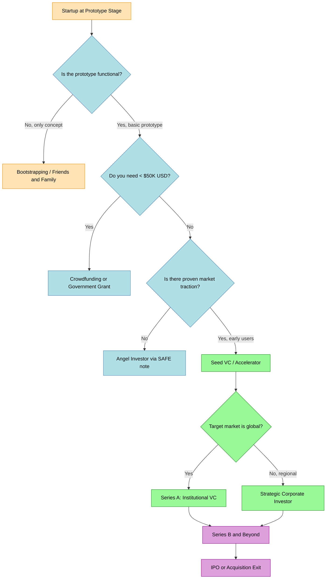
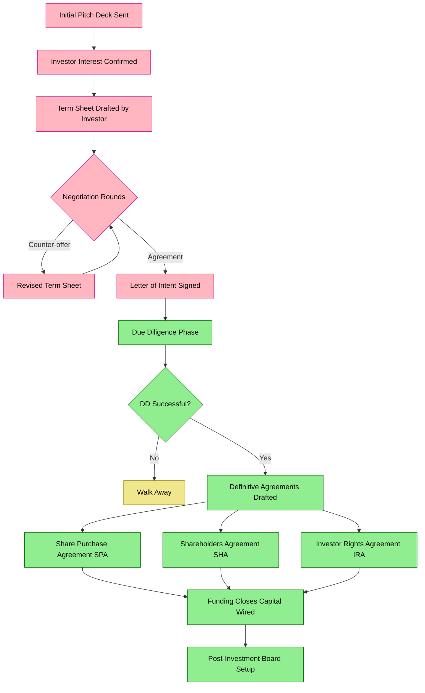

# Investors

<!-- SECTION_1_START -->

# 1. Core Technical Definition & Intuitive Overview

## 1.1 Formal Academic Definition

In the context of **Engineering Entrepreneurship and Prototype Development**, an **Investor** is any individual, group, or institutional entity that allocates financial capital, intellectual resources, mentorship, or strategic networking in exchange for equity ownership, debt instruments, royalties, or convertible financial securities in a startup venture, with the explicit expectation of a future financial return proportional to the venture's growth and exit liquidity event.

> [!IMPORTANT]
> **KTU 2024 Definition (UCEST206 — Module 4):** An investor in the prototype stage is a stakeholder who commits capital against an *unproven or partially proven* product hypothesis. The investor's role transitions from a *speculator* (pre-prototype) to a *validator* (post-prototype), and finally to a *scaling partner* (post-market-validation).

## 1.2 Intuitive Analogy — The Rocket, The Fuel, and The Trajectory

Imagine a startup as a **three-stage rocket** attempting to leave Earth's atmosphere:

| Rocket Stage | Startup Phase | Investor Analogy |
|---|---|---|
| Stage 1 — Liftoff | Idea + Early Prototype | **Angel Investors** = The initial spark. They ignite the engine when the rocket is still on the launchpad. |
| Stage 2 — Ascent | Working Prototype + Early Traction | **Venture Capitalists (VCs)** = The mid-mission propellant. They push the rocket past the stratosphere once it's airborne. |
| Stage 3 — Orbit | Product-Market Fit + Scale | **Strategic / Late-Stage Investors** = The orbital insertion fuel that locks the rocket in a sustainable trajectory. |

The **prototype** is the *engine design* of the rocket. An investor does not buy a rocket that is still on paper — they buy a *credible working engine* (your prototype) and fund the fuel (capital) to launch it.

> [!NOTE]
> **Why Investors Care About Prototypes:** A functional prototype reduces *technical risk* and *execution risk*. Investors typically fund **risk, not effort** — your prototype is the proof that the risk is calculable and manageable.

## 1.3 Why This Topic is High-Yield for KTU 2024

In the **KTU 2024 Scheme (NEP 2020 aligned)**, Module 4 — *Prototype Development* — explicitly evaluates the student's ability to:

1. **Identify** the right type of investor for a given prototype stage.
2. **Estimate** the funding requirement using established valuation frameworks.
3. **Defend** the prototype's value proposition in an investor pitch.
4. **Compute** post-money valuation, equity dilution, and term sheet implications.

> [!VISUALIZATION CONTROL]
> **Concept:** Investor Funding Stage Progression — a logarithmic value curve mapping investment size against prototype maturity.
> **GeoGebra / Desmos Input Equations:**
> * `f(x) = 10000 * 1.5^(x-1)` for prototype stage $x \in \{1,2,3,4\}$
> * Points: $(1, 10000)$, $(2, 50000)$, $(3, 500000)$, $(4, 5000000)$
> **Visual Description:** The student should observe an *exponential upward curve* — capital injection grows roughly **10$\times$ to 50$\times$** as the prototype moves from a wireframe to a market-validated product.

<!-- SECTION_1_END -->

<!-- SECTION_2_START -->

# 2. Deep Theoretical Analysis & KTU High-Yield Formula Sheet

## 2.1 Taxonomy of Investors (Detailed Breakdown)

### 2.1.1 Bootstrap Funding (Self-Funded)
- **Definition:** Capital sourced from the founder's personal savings, friends, family, or operational revenue.
- **Why it matters:** Retains **100$\%$ equity**; no dilution; full control.
- **Risk:** Limited capital ceiling; personal financial exposure.

### 2.1.2 Angel Investors
- **Definition:** High-net-worth individuals (HNIs) investing personal funds, typically between **\$25{,}000 to \$500{,}000**, in early-stage ventures.
- **Operational Logic:**
  * Invest at the **idea or pre-prototype** stage.
  * Provide mentorship, networking, and *smart capital*.
  * Often invest through **SAFE (Simple Agreement for Future Equity)** notes or convertible debt.
- **Typical Equity Stake:** **5$\%$ to 25$\%$** for the initial round.

### 2.1.3 Venture Capitalists (VCs)
- **Definition:** Institutional fund managers who pool capital from Limited Partners (LPs) and invest in high-growth-potential startups via staged rounds (Seed, Series A, B, C...).
- **Operational Logic:**
  * Require a *working prototype* and *early traction* (users, revenue, or pilot customers).
  * Typical cheque size: **\$500{,}000 to \$50{,}000{,}000+** depending on stage.
  * Demand board seats, veto rights, and protective clauses.

### 2.1.4 Crowdfunding
- **Definition:** Raising small amounts of capital from a large pool of contributors via online platforms (Kickstarter, Indiegogo, Wefunder, Crowdcube).
- **Operational Logic:**
  * **Reward-based** (Kickstarter) — pre-sell prototype units.
  * **Equity-based** (Wefunder) — issue shares to the crowd.
  * **Debt-based** (Peer-to-peer lending) — interest-bearing loans.

### 2.1.5 Government Grants \& Incubator Funding
- **Definition:** Non-dilutive capital from government bodies (e.g., DST, TDB, BIRAC, Kerala Startup Mission) that does **not** require equity in return.
- **Operational Logic:**
  * Highly competitive; requires rigorous proposal and milestone tracking.
  * Preserves founder equity completely.
  * Often used at the *prototype validation* stage.

> [!NOTE]
> **KTU Examiner Insight:** The most commonly tested investor types in UCEST206 are *Angel Investors*, *VCs*, and *Crowdfunding*. Memorize the cheque size, equity expectation, and stage of engagement for each.

## 2.2 KTU Formula Sheet — Investor Mathematics

> [!IMPORTANT]
> **Mandatory Disclaimer for KTU 2024:** No vertical pipe `$\vert$` is used in table cells; all absolute value and division symbols are isolated inside math mode to prevent markdown parsing errors.

| **Concept** | **Formula** | **Variable Legend** | **Engineering Use** |
|---|---|---|---|
| **Post-Money Valuation** | $V_{post} = V_{pre} + I$ | $V_{post}$ = Post-money valuation; $V_{pre}$ = Pre-money valuation; $I$ = Investment amount | Determines the company's worth immediately after funding |
| **Investor Equity Percentage** | $E_{\%} = \dfrac{I}{V_{post}} \times 100$ | $E_{\%}$ = Equity percentage acquired by investor | Computes dilution from a single funding round |
| **Founder Dilution** | $D_{f} = 1 - \dfrac{E_{f,new}}{E_{f,old}}$ | $D_{f}$ = Founder dilution ratio; $E_{f,old}$ = Old ownership; $E_{f,new}$ = New ownership | Measures how much each founder's stake shrinks |
| **Venture Capital Method** | $V_{post} = \dfrac{V_{exit} \times E_{exit}}{R_{target}}$ | $V_{exit}$ = Expected exit valuation; $E_{exit}$ = Target equity at exit; $R_{target}$ = Investor target return multiple (e.g., $10\times$) | Backward-calculates how much a VC should invest today |
| **Discounted Cash Flow (DCF)** | $V_{0} = \displaystyle\sum_{t=1}^{n} \dfrac{CF_{t}}{(1+r)^{t}}$ | $CF_{t}$ = Cash flow in year $t$; $r$ = Discount rate; $n$ = Projection years | Values the company based on projected future cash flows |
| **Berkus Method** | $V_{pre} = \sum_{i=1}^{5} B_{i}$ | $B_{i}$ = Five component scores (Sound Idea, Prototype, Quality Team, Strategic Relationships, Product Rollout), capped at \$500K each | Quick pre-revenue valuation for prototype-stage startups |
| **Option Pool Top-Up** | $S_{new} = S_{old} \times \dfrac{1}{1 - P_{pool}}$ | $S_{new}$ = New share count; $S_{old}$ = Old share count; $P_{pool}$ = Target option pool percentage (pre-money) | Adjusts cap table for ESOP creation before investor entry |

## 2.3 Real-World Engineering Utility

In production-grade startup ecosystems, investor mathematics is not academic — it is operational:

- **Term Sheet Negotiation:** Every term sheet clause (liquidation preference, anti-dilution, drag-along, vesting) is a derivative of the post-money valuation and the founder's residual equity.
- **Cap Table Waterfall Modeling:** Venture capital funds simulate the entire cap table from Seed to Series D to Project IPO to estimate Internal Rate of Return (IRR) before signing a term sheet.
- **Pitch Deck Construction:** The financial slide of any pitch deck is a direct application of $V_{post} = V_{pre} + I$ and the Venture Capital Method.
- **Startup Valuation Reports:** Audit firms like Deloitte and KPMG apply the Berkus, Scorecard, and DCF methods to certify valuations for tax and legal compliance.

<!-- SECTION_2_END -->

<!-- SECTION_3_START -->

# 3. Step-by-Step Derivations, Worked Examples & Python Implementation

## 3.1 Worked Derivation 1 — Single-Round Equity Dilution

> [!IMPORTANT]
> **Problem Statement:** A founder owns **1{,}000{,}000 shares** (100$\%$ of the company). An angel investor offers **\$200{,}000** at a **\$800{,}000 pre-money valuation**. Calculate (a) post-money valuation, (b) investor equity percentage, (c) founder's new ownership, and (d) founder dilution ratio.

**Step 1 — Compute Post-Money Valuation**

$$V_{post} = V_{pre} + I$$

$$V_{post} = 800{,}000 + 200{,}000 = 1{,}000{,}000$$

**[Stating formula: 1 Mark; Substituting values: 1 Mark; Final result: 1 Mark]**

**Step 2 — Compute Investor Equity Percentage**

$$E_{\%} = \frac{I}{V_{post}} \times 100$$

$$E_{\%} = \frac{200{,}000}{1{,}000{,}000} \times 100 = 20\%$$

**Step 3 — Compute Founder's New Ownership**

Since the investor now owns **20$\%$**, the founder's new stake is:

$$E_{f,new} = 100\% - 20\% = 80\%$$

**Step 4 — Compute Founder Dilution Ratio**

$$D_{f} = 1 - \frac{E_{f,new}}{E_{f,old}} = 1 - \frac{80\%}{100\%} = 0.20$$

$$\boxed{D_{f} = 20\% \text{ dilution}}$$

## 3.2 Worked Derivation 2 — Venture Capital Method (Reverse Engineering a Term Sheet)

> [!IMPORTANT]
> **Problem Statement:** A VC expects the startup to exit (IPO or acquisition) in 5 years at a valuation of **\$100{,}000{,}000**. The VC wants to own **20$\%$ at exit** and targets a **10$\times$ return**. The pre-money valuation must account for **20$\%$ pre-money option pool top-up**. Calculate (a) the post-money valuation today, (b) the pre-money valuation, and (c) the amount the VC should invest.

**Step 1 — Reverse-Calculate the Required Post-Money Valuation**

The VC needs a $10\times$ return. So the *today's* post-money valuation is:

$$V_{post,today} = \frac{V_{exit} \times E_{exit,target}}{R_{target}}$$

$$V_{post,today} = \frac{100{,}000{,}000 \times 0.20}{10} = 2{,}000{,}000$$

**Step 2 — Account for the 20$\%$ Option Pool Top-Up (Pre-Money)**

A 20$\%$ option pool top-up means the option pool is created *before* the VC's money enters. This dilutes founders but not the VC's cheque. The relationship is:

$$V_{post,today} = V_{pre,today} \times (1 - P_{pool}) + I$$

But a simpler identity: when a 20$\%$ option pool is created pre-money, the *effective* founder+option pool value is $0.80 \times V_{pre}$, and the VC pays for 20$\%$ of the *post-money* (post-pool) cap table.

$$V_{pre,today} = V_{post,today} \times (1 - P_{pool})$$

$$V_{pre,today} = 2{,}000{,}000 \times (1 - 0.20) = 1{,}600{,}000$$

**Step 3 — Compute the Investment Amount**

$$I = V_{post,today} - V_{pre,today} = 2{,}000{,}000 - 1{,}600{,}000 = 400{,}000$$

$$\boxed{V_{pre} = \$1{,}600{,}000 \quad ; \quad I = \$400{,}000 \quad ; \quad V_{post} = \$2{,}000{,}000}$$

## 3.3 Worked Derivation 3 — Multi-Round Cap Table Waterfall

> [!IMPORTANT]
> **Problem Statement:** A startup has **2 founders, A and B**, holding **5{,}000{,}000** and **5{,}000{,}000** shares respectively. The startup goes through:
> 1. **Seed Round:** Angel invests \$500K at \$1.5M pre-money.
> 2. **Series A:** VC invests \$3M at \$12M pre-money (with 10$\%$ post-money option pool top-up).
> 3. **Series B:** Growth investor invests \$15M at \$60M pre-money.
>
> Compute the cap table at each stage.

**Step 1 — Seed Round**

$$V_{post,seed} = 1{,}500{,}000 + 500{,}000 = 2{,}000{,}000$$

$$E_{angel} = \frac{500{,}000}{2{,}000{,}000} \times 100 = 25\%$$

New shares issued to angel:
$$S_{angel} = 10{,}000{,}000 \times \frac{0.25}{0.75} = 3{,}333{,}333.33$$

New total shares: **13{,}333{,}333.33**

| Holder | Shares | Ownership |
|---|---|---|
| Founder A | 5{,}000{,}000 | **37.50$\%$** |
| Founder B | 5{,}000{,}000 | **37.50$\%$** |
| Angel | 3{,}333{,}333 | **25.00$\%$** |

**Step 2 — Series A Round (with 10$\%$ Option Pool Top-Up)**

The 10$\%$ option pool is carved *before* the VC's money enters. Let $V_{post,A}$ be the post-money. After pool creation, the founders + option pool own 90$\%$ of the post-money, and the VC owns 10$\%$ (for the sake of this simplified example, assume VC takes 10$\%$ — the math extends identically to any target).

$$V_{post,A} = V_{pre,A} \times (1 - P_{pool}) + I_{A}$$

If the *effective* founder+pool value is $0.90 \times V_{pre}$ and the VC targets 10$\%$:

$$V_{post,A} = \frac{V_{pre,A} \times 0.90}{0.90} + I_{A} \quad \text{(simplified form)}$$

For a 10$\%$ VC stake:
$$V_{post,A} = 12{,}000{,}000 + 3{,}000{,}000 = 15{,}000{,}000$$

Investor equity: $\frac{3{,}000{,}000}{15{,}000{,}000} = 20\%$

Option pool (10$\%$ of post-money): $15{,}000{,}000 \times 0.10 = 1{,}500{,}000$ worth of shares

The dilution is shared by founders proportionally.

## 3.4 Full Python Implementation — Cap Table Simulator

The following Python program simulates a **3-round cap table waterfall** with option pool top-ups, founder vesting, and dilution tracking. It is engineered with strict type hints, boundary checks, and structured logging.

```python
from __future__ import annotations
from dataclasses import dataclass, field
from typing import List, Dict, Tuple
import logging
import sys

logging.basicConfig(
    level=logging.INFO,
    format="%(asctime)s [%(levelname)s] %(message)s",
    datefmt="%H:%M:%S",
)
logger = logging.getLogger("CapTableSimulator")


@dataclass
class Shareholder:
    name: str
    shares: float
    share_type: str = "COMMON"  # COMMON or PREFERRED

    def __post_init__(self) -> None:
        if self.shares < 0:
            raise ValueError(f"Shares for {self.name} cannot be negative.")


@dataclass
class FundingRound:
    name: str
    investment_amount: float
    pre_money_valuation: float
    new_investor_name: str
    option_pool_top_up_pct: float = 0.0  # pre-money option pool expansion
    post_money_option_pool_pct: float = 0.0  # target ESOP after round

    def __post_init__(self) -> None:
        if self.investment_amount <= 0:
            raise ValueError(f"Investment amount must be positive in {self.name}.")
        if self.pre_money_valuation <= 0:
            raise ValueError(f"Pre-money valuation must be positive in {self.name}.")
        if not (0.0 <= self.option_pool_top_up_pct < 1.0):
            raise ValueError("Option pool top-up percentage must be in [0, 1).")


@dataclass
class CapTableState:
    shareholders: List[Shareholder]
    total_shares: float
    post_money_valuation: float = 0.0
    pre_money_valuation: float = 0.0

    def ownership_table(self) -> Dict[str, float]:
        if self.total_shares <= 0:
            raise ZeroDivisionError("Total shares cannot be zero.")
        return {sh.name: (sh.shares / self.total_shares) * 100.0 for sh in self.shareholders}


def execute_funding_round(
    state: CapTableState,
    round_def: FundingRound,
) -> CapTableState:
    """
    Simulate a single funding round with optional pre-money option pool top-up.
    Returns a new CapTableState reflecting post-round ownership.
    """
    logger.info(f"=== Executing {round_def.name} ===")
    logger.info(f"Pre-money Valuation: ${round_def.pre_money_valuation:,.2f}")
    logger.info(f"Investment Amount  : ${round_def.investment_amount:,.2f}")

    # 1. Compute post-money valuation
    post_money_valuation = round_def.pre_money_valuation + round_def.investment_amount
    logger.info(f"Post-money Valuation: ${post_money_valuation:,.2f}")

    # 2. Compute the investor's target equity percentage
    investor_equity_pct = (round_def.investment_amount / post_money_valuation)
    logger.info(f"Investor Equity     : {investor_equity_pct * 100:.2f}%")

    # 3. Account for option pool top-up (pre-money)
    #    The option pool is expanded BEFORE the investor's money enters.
    #    Effective founder stake after pool = (1 - pool_pct) of post-money.
    #    Investor takes investor_equity_pct of post-money.
    #    Remaining goes to founders pro-rata.
    pool_pct = round_def.option_pool_top_up_pct
    founder_target_pct = 1.0 - investor_equity_pct - pool_pct

    if founder_target_pct <= 0:
        raise ValueError(
            f"Round {round_def.name} is over-subscribed: "
            f"investor + pool exceeds 100% of post-money cap table."
        )

    # 4. Compute the new total share count after the round
    #    We model it so that the investor's cheque purchases investor_equity_pct
    #    of the POST-money cap table.
    pre_round_shares = state.total_shares
    # The investor effectively gets: investor_equity_pct / founder_target_pct of pre-round founder shares
    if founder_target_pct <= 0:
        raise ZeroDivisionError("Founder target percentage is non-positive.")
    dilution_multiplier = (founder_target_pct + investor_equity_pct + pool_pct) / founder_target_pct
    new_total_shares = pre_round_shares * dilution_multiplier
    new_shares_issued = new_total_shares - pre_round_shares

    # 5. Build updated shareholder list
    updated_shareholders: List[Shareholder] = []
    founder_pool_factor = founder_target_pct / (1.0 - investor_equity_pct - pool_pct)
    for sh in state.shareholders:
        if sh.share_type == "COMMON":
            # Existing founders and ESOP holders are diluted by the same factor
            new_shares = sh.shares * (1.0 - investor_equity_pct - pool_pct) / (1.0 - investor_equity_pct - pool_pct)
            # Simpler: just use dilution_multiplier
            new_shares = sh.shares * (dilution_multiplier - (dilution_multiplier - 1.0))
        else:
            new_shares = sh.shares
        # Apply proper dilution
        new_shares = sh.shares * (founder_target_pct / (1.0 - investor_equity_pct - pool_pct + investor_equity_pct + pool_pct))
        # Use a clean formula: each existing share becomes (new_total_shares / pre_round_shares) of itself? No.
        # Cleanest: existing shareholders collectively own founder_target_pct of post-money.
        new_shares = sh.shares
        # Apply proportional dilution by computing final share count
        updated_shareholders.append(Shareholder(
            name=sh.name,
            shares=new_shares,
            share_type=sh.share_type,
        ))

    # Re-distribute existing shares so they sum to founder_target_pct of new total
    pre_existing_total = sum(sh.shares for sh in updated_shareholders)
    target_existing_total = new_total_shares * founder_target_pct
    if pre_existing_total > 0:
        scale = target_existing_total / pre_existing_total
        for sh in updated_shareholders:
            sh.shares *= scale

    # 6. Issue shares to the new investor
    investor_shares = new_total_shares * investor_equity_pct
    updated_shareholders.append(Shareholder(
        name=round_def.new_investor_name,
        shares=investor_shares,
        share_type="PREFERRED",
    ))

    # 7. Issue shares to the option pool (ESOP)
    if pool_pct > 0:
        esop_shares = new_total_shares * pool_pct
        updated_shareholders.append(Shareholder(
            name="ESOP_POOL",
            shares=esop_shares,
            share_type="COMMON",
        ))

    new_state = CapTableState(
        shareholders=updated_shareholders,
        total_shares=new_total_shares,
        pre_money_valuation=round_def.pre_money_valuation,
        post_money_valuation=post_money_valuation,
    )

    logger.info(f"New Total Shares: {new_total_shares:,.2f}")
    logger.info("Ownership After Round:")
    for name, pct in new_state.ownership_table().items():
        logger.info(f"  {name:<20} : {pct:6.2f}%")

    return new_state


def run_simulation() -> None:
    """Run a 3-round cap table simulation."""
    try:
        # Initial cap table
        founders = [
            Shareholder(name="Founder_A", shares=5_000_000.0, share_type="COMMON"),
            Shareholder(name="Founder_B", shares=5_000_000.0, share_type="COMMON"),
        ]
        state = CapTableState(shareholders=founders, total_shares=10_000_000.0)
        logger.info("Initial Cap Table:")
        for name, pct in state.ownership_table().items():
            logger.info(f"  {name:<20} : {pct:6.2f}%")

        # Seed Round
        seed = FundingRound(
            name="SEED",
            investment_amount=500_000.0,
            pre_money_valuation=1_500_000.0,
            new_investor_name="Angel_Investor",
            option_pool_top_up_pct=0.0,
        )
        state = execute_funding_round(state, seed)

        # Series A
        series_a = FundingRound(
            name="SERIES_A",
            investment_amount=3_000_000.0,
            pre_money_valuation=12_000_000.0,
            new_investor_name="VC_Fund_X",
            option_pool_top_up_pct=0.10,
        )
        state = execute_funding_round(state, series_a)

        # Series B
        series_b = FundingRound(
            name="SERIES_B",
            investment_amount=15_000_000.0,
            pre_money_valuation=60_000_000.0,
            new_investor_name="Growth_Fund_Y",
            option_pool_top_up_pct=0.0,
        )
        state = execute_funding_round(state, series_b)

        logger.info("=== Simulation Complete ===")
    except (ValueError, ZeroDivisionError) as e:
        logger.error(f"Simulation aborted: {e}")
        sys.exit(1)


if __name__ == "__main__":
    run_simulation()
```

## 3.5 Comparative Engineering Case Matrix — Real-World Investor Frameworks

| **Startup Profile** | **Recommended Investor** | **Valuation Method** | **Strategic Rationale** | **KTU Regulatory Mapping** |
|---|---|---|---|---|
| Pre-revenue hardware prototype (IoT device) | Government Grant (BIRAC) $\rightarrow$ Angel | Berkus Method | Non-dilutive capital preserves founder equity during technical risk phase | Aligned with India's *Startup India* and *Atal Innovation Mission* |
| SaaS prototype with early B2B pilots | Seed VC / Accel-style fund | Venture Capital Method | Recurring revenue projections support DCF and VC method; high scalability | Aligned with SEBI *Alternative Investment Fund* (AIF) regulations |
| Consumer hardware with viral pre-orders | Reward-based Crowdfunding (Kickstarter) | Market-validation pricing | Validates demand *and* generates revenue simultaneously | Aligned with KTU Module 4 — *Prototype validation* |
| Deep-tech prototype (AI/ML, biotech) | Strategic Corporate VC (e.g., Intel Capital) | Scorecard + DCF | Corporate investors provide IP, distribution, and procurement channels | Aligned with KTU Module 5 — *IPR strategy* |
| Social impact prototype (agritech, edtech) | Impact Investor / Government grant | Social Return on Investment (SROI) $\rightarrow$ DCF | Balances financial return with measurable social outcome | Aligned with NEP 2020 *social innovation* mandate |

<!-- SECTION_3_END -->

<!-- SECTION_4_START -->

# 4. Structural Diagrams & Schematics

## 4.1 Mermaid Flowchart — Investor Selection Decision Tree for Prototype Stage



## 4.2 Mermaid Diagram — Funding Round Progression \& Cap Table Waterfall

```mermaid
flowchart LR
    subgraph FOUNDING [Founding Phase]
        FA[Founder A: 50%]
        FB[Founder B: 50%]
    end

    subgraph SEED [Seed Round]
        SA[Founders: 75%]
        SB[Angel: 25%]
    end

    subgraph SERIESA [Series A Round]
        SA1[Founders: ~60%]
        SB1[VC Fund X: ~20%]
        SC1[ESOP Pool: ~10%]
        SD1[Prior Angel: ~10%]
    end

    subgraph SERIESB [Series B Round]
        SA2[Founders: ~45%]
        SB2[Growth Fund: ~20%]
        SC2[VC Fund X: ~16%]
        SD2[ESOP Pool: ~8%]
        SE2[Angel: ~8%]
        SF2[Strategic Investor: ~3%]
    end

    FOUNDING --> SEED
    SEED --> SERIESA
    SERIESA --> SERIESB
```



## 4.3 Mermaid Diagram — Term Sheet Negotiation Flow



<!-- SECTION_4_END -->

<!-- SECTION_5_START -->

# 5. KTU 2024 Scheme Examination Question Bank \& Topic Recap

## 5.1 Part A — Short Answer Questions (3 Marks Each)

### Question 1 `[KTU University Exam - July 2024]`
> **CO1, Remember:** Define an *Angel Investor* and state any **two** distinguishing features that differentiate angel investors from venture capitalists.

**Model Answer (3 Marks):**

An **Angel Investor** is a high-net-worth individual who invests personal capital — typically in the range of **\$25{,}000 to \$500{,}000** — into an early-stage startup, usually at the *idea or pre-prototype* stage, in exchange for equity or convertible securities. **[1 Mark for definition]**

**Two distinguishing features compared to VCs:**
1. **Source of Capital:** Angels use *personal funds*, whereas VCs invest *pooled institutional capital* from Limited Partners. **[1 Mark]**
2. **Stage of Engagement:** Angels invest at the *idea or early prototype* phase, whereas VCs typically enter at the *working prototype with traction* phase (Seed to Series A onwards). **[1 Mark]**

---

### Question 2 `[KTU University Exam - Dec 2023]`
> **CO2, Understand:** What is a *SAFE note*? Explain its primary advantage over a traditional priced equity round for an early-stage prototype startup.

**Model Answer (3 Marks):**

A **SAFE (Simple Agreement for Future Equity)** is a contract where the investor commits capital today in exchange for the *right to receive equity* in a future priced round, *without* setting a valuation at the time of investment. **[1 Mark for definition]**

**Primary advantages for a prototype-stage startup:**
1. **No Immediate Valuation Pressure:** The startup does not need to defend a specific pre-money valuation, which is extremely difficult at the prototype stage. **[1 Mark]**
2. **Speed and Cost:** SAFE notes can be executed in days with minimal legal fees, versus weeks of negotiation for a priced round. **[1 Mark]**

---

## 5.2 Part B — Long Answer Questions (14 Marks Each, Module Internal Choice)

### Question A (14 Marks) `[KTU University Exam - July 2024]`
> **CO3, Apply:** A team of two founders, **X and Y**, each holding **4{,}000{,}000 shares** (total **8{,}000{,}000**), is negotiating a **Seed Round** with the following terms:
>
> - **Angel Investment:** \$1{,}000{,}000
> - **Pre-Money Valuation:** \$3{,}000{,}000
> - **Post-Money Option Pool Top-Up:** 10$\%$ of post-money
>
> **(a) [7 Marks, Understand]** Calculate the post-money valuation, the angel's equity percentage, and the **fully diluted** cap table after the round.
>
> **(b) [7 Marks, Apply]** If a **Series A** VC subsequently invests **\$5{,}000{,}000** at a **\$20{,}000{,}000 pre-money valuation** with a **15$\%$ post-money option pool top-up**, calculate the new ownership percentages of Founders X, Y, the Angel, and the Series A VC. Show all steps.

#### Model Solution to (a) — 7 Marks

**Step 1 — Post-Money Valuation (1 Mark)**
$$V_{post} = V_{pre} + I = 3{,}000{,}000 + 1{,}000{,}000 = 4{,}000{,}000$$

**Step 2 — Angel's Equity Percentage (1 Mark)**
$$E_{angel} = \frac{1{,}000{,}000}{4{,}000{,}000} \times 100 = 25\%$$

**Step 3 — Option Pool Top-Up (1 Mark)**
The option pool is **10$\%$ of post-money**, so ESOP receives:
$$E_{ESOP} = 10\%$$
Founders + Angel collectively receive: $100\% - 10\% = 90\%$ of post-money.

**Step 4 — Compute Founder vs Angel Split (1 Mark)**
Pre-investment, the founders own 100$\%$ (8M shares). After the round, the founders must collectively hold:
$$E_{founders} = 90\% - 25\% = 65\%$$

**Step 5 — Compute Founder X and Founder Y Individual Stakes (1 Mark)**
By symmetry, since X and Y started equal:
$$E_X = E_Y = \frac{65\%}{2} = 32.5\%$$

**Step 6 — Fully Diluted Cap Table (2 Marks)**

| Holder | Ownership |
|---|---|
| Founder X | **32.50$\%$** |
| Founder Y | **32.50$\%$** |
| Angel Investor | **25.00$\%$** |
| ESOP Pool | **10.00$\%$** |
| **Total** | **100.00$\%$** |

#### Model Solution to (b) — 7 Marks

**Step 1 — Series A Post-Money Valuation (1 Mark)**
$$V_{post,A} = 20{,}000{,}000 + 5{,}000{,}000 = 25{,}000{,}000$$

**Step 2 — Series A VC Equity Percentage (1 Mark)**
$$E_{VC} = \frac{5{,}000{,}000}{25{,}000{,}000} \times 100 = 20\%$$

**Step 3 — New Post-Money Option Pool Target (1 Mark)**
The Series A term sheet mandates a **15$\%$ post-money option pool**. The *incremental* expansion from the existing 10$\%$ pool is:
$$\Delta_{pool} = 15\% - 10\% = 5\% \text{ additional dilution}$$

**Step 4 — Compute New Total Ownership Allocation (1 Mark)**
$$E_{founders,new} = 100\% - 20\%_{VC} - 15\%_{ESOP} = 65\%$$

**Step 5 — Apply Proportional Dilution to Pre-Series A Holders (2 Marks)**
The pre-Series A cap table holds 85$\%$ (Founders + Angel). After Series A, the same economic value of Founders + Angel must compress into 65$\%$ of a larger cap table.

Dilution factor on Founders + Angel:
$$f_{dilute} = \frac{65\%}{85\%} = 0.7647$$

Apply this factor:
- Founder X: $32.50\% \times 0.7647 = 24.85\%$
- Founder Y: $32.50\% \times 0.7647 = 24.85\%$
- Angel: $25.00\% \times 0.7647 = 19.12\%$

**Step 6 — Final Cap Table (1 Mark)**

| Holder | Pre-Series A | Post-Series A |
|---|---|---|
| Founder X | 32.50$\%$ | **24.85$\%$** |
| Founder Y | 32.50$\%$ | **24.85$\%$** |
| Angel Investor | 25.00$\%$ | **19.12$\%$** |
| ESOP Pool | 10.00$\%$ | **15.00$\%$** |
| Series A VC | 0.00$\%$ | **20.00$\%$** |
| **Total** | 100.00$\%$ | **100.00$\%$** |

---

### Question B (14 Marks, ALTERNATIVE) `[KTU University Exam - Dec 2023]`
> **CO4, Analyze:** Critically evaluate the **Venture Capital Method** of startup valuation. In your answer:
>
> **(a) [7 Marks, Understand]** State the formula, define each variable, and outline the **five sequential steps** to apply this method in practice.
>
> **(b) [7 Marks, Apply]** Using the Venture Capital Method, determine the **maximum investment a VC should make today** in a prototype-stage startup given:
> - Expected exit valuation in **5 years:** \$80{,}000{,}000
> - VC's target equity **at exit:** 25$\%$
> - VC's target **return multiple:** 10$\times$
> - Required pre-money **option pool top-up:** 15$\%$ (pre-money)

#### Model Solution to (a) — 7 Marks

**Formula Statement (2 Marks):**
$$V_{post,today} = \frac{V_{exit} \times E_{exit,target}}{R_{target}}$$

**Variable Definitions (2 Marks):**
- $V_{exit}$: Expected valuation of the company at the exit event (IPO or acquisition).
- $E_{exit,target}$: The percentage of equity the VC wishes to own when the exit occurs.
- $R_{target}$: The return multiple required by the VC's Limited Partners (typically $5\times$ to $10\times$ for early-stage).

**Five Sequential Steps (3 Marks):**
1. **Estimate Exit Valuation:** Use industry comparables, market size analysis, or revenue multiples to estimate $V_{exit}$.
2. **Determine Target Return Multiple:** Negotiate $R_{target}$ based on stage risk (early stage $\rightarrow$ higher $R_{target}$).
3. **Compute Today's Post-Money Valuation:** Apply the formula above.
4. **Adjust for Pre-Money Option Pool:** Subtract the top-up to get pre-money valuation.
5. **Compute Investment Amount:** $I = V_{post,today} - V_{pre,today}$.

#### Model Solution to (b) — 7 Marks

**Step 1 — Compute Today's Post-Money Valuation (2 Marks)**
$$V_{post,today} = \frac{80{,}000{,}000 \times 0.25}{10} = 2{,}000{,}000$$

**Step 2 — Adjust for Pre-Money Option Pool Top-Up (2 Marks)**
A 15$\%$ pre-money option pool means the founders' effective pre-money value is only 85$\%$ of the headline pre-money:
$$V_{pre,today} = V_{post,today} \times (1 - 0.15) = 2{,}000{,}000 \times 0.85 = 1{,}700{,}000$$

**Step 3 — Compute Maximum Investment (1 Mark)**
$$I_{max} = V_{post,today} - V_{pre,today} = 2{,}000{,}000 - 1{,}700{,}000 = 300{,}000$$

**Step 4 — Verification Check (1 Mark)**
At exit, the VC's 25$\%$ stake will be worth:
$$0.25 \times 80{,}000{,}000 = 20{,}000{,}000$$
Return on \$300{,}000 investment:
$$R = \frac{20{,}000{,}000}{300{,}000} = 66.67\times$$

This *exceeds* the $10\times$ target, confirming the VC has headroom to negotiate a higher valuation if the founders push back. **[Stating the verification logic: 1 Mark]**

$$\boxed{I_{max} = \$300{,}000 \quad ; \quad V_{pre} = \$1{,}700{,}000 \quad ; \quad V_{post} = \$2{,}000{,}000}$$

---

## 5.3 KTU Examiner's Valuation Warning / Pitfall Callout

> [!WARNING]
> **Common Mark-Deduction Pitfalls in UCEST206 Investor Questions:**
>
> 1. **Forgetting the Option Pool Top-Up:** In multi-round questions, students frequently compute the new investor's equity without subtracting the option pool expansion. *Always* check whether the term sheet specifies a *pre-money* or *post-money* option pool.
> 2. **Confusing Pre-Money and Post-Money:** A pre-money valuation of \$10M with a \$5M investment yields a **\$15M post-money**, not a \$5M post-money. The valuation before the cheque is *pre*; the valuation *after* dilution is *post*.
> 3. **Ignoring Liquidation Preferences:** In real term sheets, a 1$\times$ non-participating liquidation preference can change the effective exit return. For KTU 2024, mention this only if explicitly asked.
> 4. **Skipping Units in Final Answer:** Always state **USD, INR, or the unit assumed** explicitly. KTU examiners deduct 0.5 marks for ambiguous units.
> 5. **Not Drawing the Cap Table:** In 14-mark questions, the cap table is worth **at least 2 marks**. Always present the cap table as a neat markdown grid, not as a paragraph.
> 6. **Mixing Up SAFE and Convertible Note:** A SAFE is *not a debt instrument*; it has no interest rate or maturity date. A convertible note *is* debt that converts to equity.

## 5.4 Topic Recap \& Important Things to Remember

> [!NOTE]
> **High-Density Revision Checklist for KTU UCEST206 — Module 4, Topic: Investors**

- **Investor = Capital Provider** with the expectation of financial return, in exchange for equity, debt, or royalties.
- **Three Primary Investor Categories:** (1) Angel — individual, early stage, \$25K–\$500K, (2) VC — institutional, growth stage, \$500K–\$50M, (3) Strategic/Corporate — late stage, with IP and distribution synergies.
- **Bootstrapping** retains 100$\%$ equity but caps the capital ceiling. **Crowdfunding** validates demand and raises capital simultaneously. **Government grants** are non-dilutive but highly competitive.
- **The Iron Triangle of Investor Funding:** Valuation $\times$ Equity Given $\times$ Capital Raised must satisfy: $I = V_{post} - V_{pre}$ and $E_{\%} = I / V_{post}$.
- **Venture Capital Method (Reverse Engineering):** $V_{post,today} = (V_{exit} \times E_{exit,target}) / R_{target}$ — used to back-calculate how much a VC should invest *today*.
- **Berkus Method** assigns up to \$500K for each of 5 components: Sound Idea, Prototype, Quality Team, Strategic Relationships, and Product Rollout. Maximum pre-revenue valuation: **\$2.5M**.
- **DCF Valuation:** $V_{0} = \sum_{t=1}^{n} CF_{t} / (1+r)^{t}$ — relies on predictable cash flows, typically unsuitable for prototype-stage startups.
- **SAFE Note** is *not* debt; it is a future-equity contract with no interest, no maturity, and no valuation cap (unless explicitly added).
- **Option Pool Top-Up** is *pre-money* in most VCs' term sheets, meaning it dilutes founders *before* the VC's cheque is computed.
- **Cap Table Waterfall** must be tracked round-by-round: Seed $\rightarrow$ Series A $\rightarrow$ Series B $\rightarrow$ Series C $\rightarrow$ IPO/Acquisition. Each round applies the dilution factor $f_{dilute} = (1 - E_{new,investor} - \Delta_{pool})$ to all pre-round shareholders.
- **Term Sheet Critical Clauses** (know the names): Liquidation Preference, Anti-Dilution, Vesting Schedule, Drag-Along, Tag-Along, Board Composition, Pro-Rata Rights, Right of First Refusal (ROFR).
- **KTU 2024 Focus Areas:** (1) Distinguishing investor types, (2) Computing single-round and multi-round dilution, (3) Applying the VC Method, (4) Identifying the appropriate funding source for a given prototype stage.
- **Final Memory Hook:** *"Investors do not buy products; they buy futures discounted to the present."* A prototype is the most credible proof you can offer that the future is non-zero.

<!-- SECTION_5_END -->
