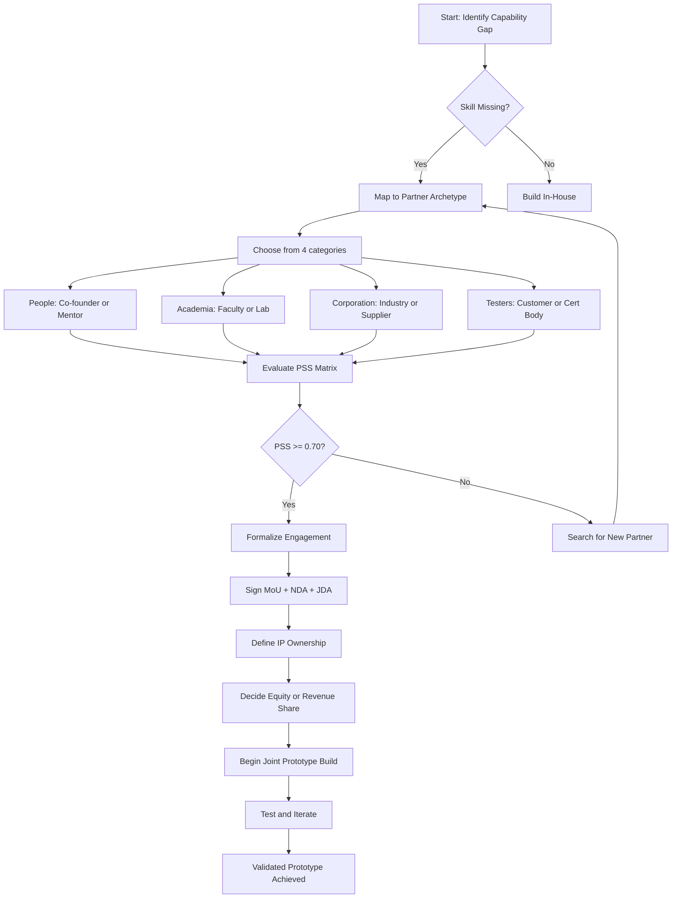
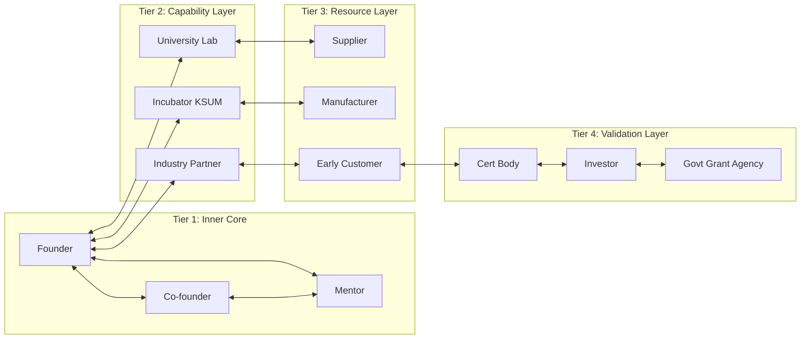
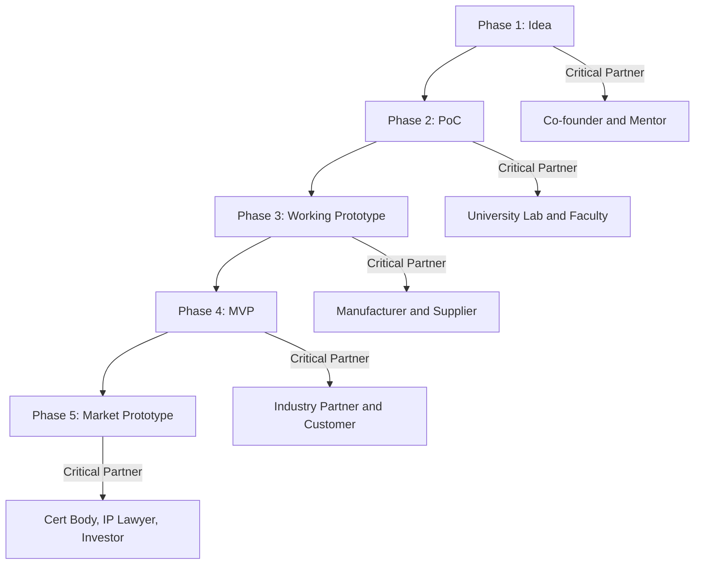
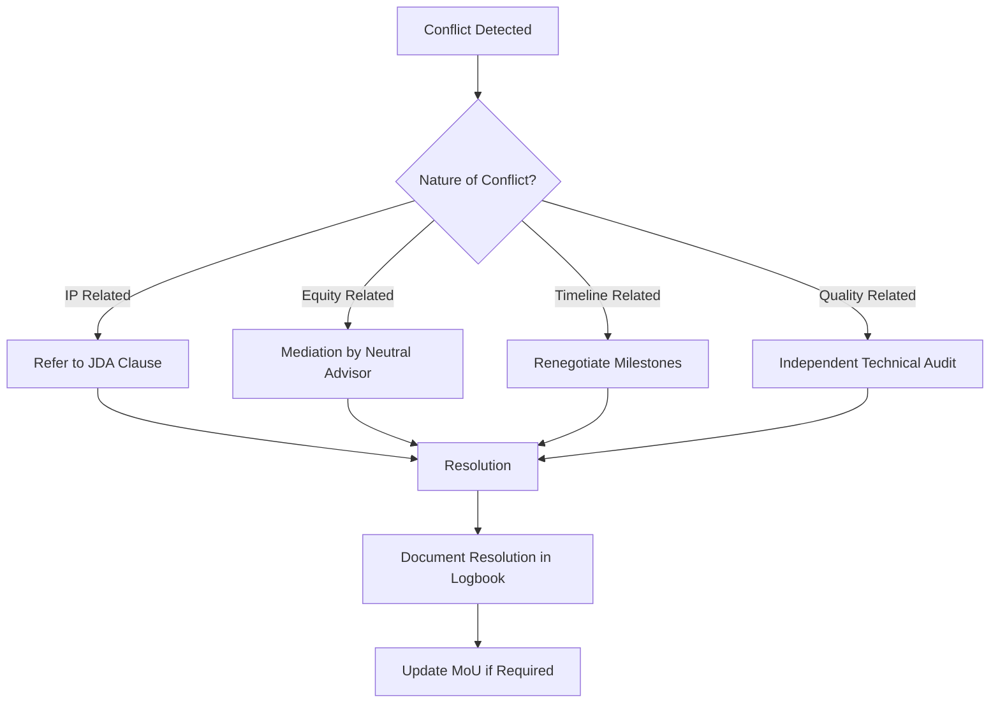

# Partners

<!-- SECTION_1_START -->

# PARTNERS IN PROTOTYPE DEVELOPMENT

> [!NOTE]
> **KTU 2024 Scheme | UCEST206 | Module 4 | Topic: Partners**
> This topic addresses the strategic, technical, and operational alliances an entrepreneur must forge to successfully convert a concept into a working, validated, and market-ready prototype.

## 1.1 Core Technical Definition

**Partners** in the context of prototype development refer to the *internal and external stakeholders* — including co-founders, technical collaborators, mentors, industry experts, academic institutions, incubators, suppliers, manufacturers, testing labs, and early customers — who collectively contribute resources, knowledge, skills, capital, and infrastructure required to design, build, test, iterate, and validate a physical or digital prototype of a product or service.

In KTU 2024 Scheme terminology aligned with the National Entrepreneurship Policy framework, a **partner** is defined as any entity (individual or organization) that shares a *mutual risk-reward arrangement* during the pre-commercialization phase, where the primary deliverable is a functional, testable, and user-validated prototype.

> [!IMPORTANT]
> **Syllabus Highlight (UCEST206 – Module 4):** Students are expected to understand the *role, classification, selection criteria, engagement models, and IP implications* of partners in prototype development. This question is frequently tested as a 7-mark or 14-mark descriptive question in KTU University Examinations.

## 1.2 Conceptual Analogy / Intuition

Imagine you are building a **Formula-1 race car** as a solo engineering student in your college garage. You have a brilliant engine design (your idea), but you cannot manufacture the chassis, source carbon-fiber, tune the aerodynamics, run crash tests, or race the car alone. You need:

- A **mechanical friend** (technical co-founder) to share the design workload
- A **college workshop** (academic partner) for fabrication tools
- A **professor mentor** (knowledge partner) for guidance
- A **local machine shop** (manufacturing partner) for precision parts
- A **fellow racer friend** (test partner) to give feedback after a test drive
- A **sponsor** (financial partner) to fund the fuel and tyres

**This is exactly what "Partners" means in prototype development.** No entrepreneur builds a prototype in complete isolation. The quality, speed, cost, and credibility of a prototype are directly proportional to the **strength and strategic alignment** of the partner ecosystem the founder assembles.

## 1.3 The Three Foundational Constants of Partnering

In any KTU examination, you must remember these three non-negotiable principles:

- **Trust** — defined as the *confidence coefficient* between partners, built through transparent communication and shared vision.
- **Complementary Skill Matrix (CSM)** — the degree to which the partner fills a *specific competency gap* in the founding team.
- **Alignment of Incentives** — the mutual benefit structure that keeps all partners motivated through the long, uncertain prototype phase.

> [!TIP]
> **Mnemonic for Exam Recall — "PACT"**
> **P** — People (Co-founders, Mentors, Advisors)
> **A** — Academia (Universities, Research Labs, Faculty)
> **C** — Corporations (Industry, Suppliers, Manufacturers)
> **T** — Testers (Early Adopters, Beta Customers, Certification Labs)

## 1.4 Visualization Control — Partner Ecosystem Map

> [!VISUALIZATION CONTROL]
> **Concept:** Circular Partner Ecosystem — concentric rings showing the founder at the center surrounded by tiers of partners
> **GeoGebra / Desmos Input Equations (Conceptual Coordinates):**
> * Inner ring: $r_1 = 1$ (Co-founders, Mentors)
> * Middle ring: $r_2 = 2$ (Academic, Incubator, Industry)
> * Outer ring: $r_3 = 3$ (Suppliers, Customers, Investors)
> * Center point: Founder (Origin $O(0,0)$)
> **Visual Description:** A student should visualize a target diagram. The founder sits at the bullseye. Co-founders and mentors form the innermost ring of trust. Academic and industry partners form the middle ring of capability. Customers, suppliers, and investors form the outer ring of validation. Communication flows bidirectionally across all rings.

<!-- SECTION_1_END -->

<!-- SECTION_2_START -->

# DEEP THEORETICAL ANALYSIS & KTU HIGH-YIELD FORMULA SHEET

## 2.1 Theoretical Framework — The Partner Selection Model

The selection of the right partner follows a structured, four-stage funnel:

### Stage 1: **Identify the Capability Gap**
Before seeking a partner, the founder must conduct a *self-audit* to identify which competencies are missing from the core team. Common gaps include:
- Hardware fabrication skills
- Software/firmware development
- Industrial design
- Domain expertise (medical, automotive, agriculture)
- Regulatory and compliance knowledge
- Marketing and customer research

### Stage 2: **Map Potential Partner Categories**
Map each identified gap to the correct partner archetype from the following classification:

| **Partner Archetype** | **Primary Role in Prototype** | **Engagement Phase** |
|---|---|---|
| Co-founder | Shares vision, equity, workload, and long-term commitment | Pre-prototype (Idea stage) |
| Technical Mentor / Advisor | Provides domain guidance and validation | Concept-to-prototype |
| Academic Partner (Faculty / Lab) | Provides equipment, workspace, and student talent | Prototype fabrication |
| Incubator / Accelerator | Provides office space, seed funding, mentorship | MVP-to-Market |
| Industry Partner (Corporate) | Provides advanced tools, real-world problem statements | Prototype refinement |
| Supplier / Manufacturer | Provides raw materials, components, and fabrication | Prototype build |
| Testing / Certification Lab | Validates safety, performance, and compliance | Pre-launch |
| Early-Adopter Customer | Tests prototype, gives feedback, validates demand | User testing |
| IP Lawyer / Patent Agent | Protects intellectual property, drafts agreements | Throughout |
| Government Partner (Kerala Startup Mission, MSME, BIRAC) | Provides grants, schemes, and policy support | All stages |

### Stage 3: **Evaluate Partners Against a Scoring Matrix**
Each potential partner is scored on five parameters, with a total weightage of $100\%$.

> [!NOTE]
> The **Partner Suitability Score (PSS)** is calculated as:
>
> $$\text{PSS} = (S \times w_S) + (R \times w_R) + (C \times w_C) + (A \times w_A) + (T \times w_T)$$
>
> where each parameter carries an appropriate weight based on the prototype stage.

### Stage 4: **Formalize the Engagement**
Convert informal collaborations into *legally documented* partnerships through:
- Memorandum of Understanding (MoU)
- Non-Disclosure Agreement (NDA)
- Joint Development Agreement (JDA)
- Equity / Sweat-Equity Agreement
- Licensing Agreement (if IP is shared)

## 2.2 Detailed Analysis of the Five Evaluation Parameters

| **Parameter** | **Symbol** | **What It Measures** | **Typical Weight ($w$)** |
|---|---|---|---|
| Skill Match | $S$ | Degree to which partner's expertise fills the founder's gap | $0.30$ |
| Reputation | $R$ | Trustworthiness, track record, and market credibility | $0.20$ |
| Cost | $C$ | Financial burden (cash, equity, or revenue share) | $0.15$ |
| Availability | $A$ | Time commitment and accessibility | $0.20$ |
| Trust / Cultural Fit | $T$ | Shared values, vision, and working style | $0.15$ |

> [!IMPORTANT]
> **Constraint Check:** The sum of all weights must equal exactly $1.00$ (i.e., $w_S + w_R + w_C + w_A + w_T = 1.00$). Always state this condition in your KTU exam answers to earn full marks.

## 2.3 The Prototype-Development Partner Lifecycle

Partners enter and exit the startup at different stages. Understanding this *temporal flow* is a high-yield exam topic.

| **Stage of Prototype** | **Most Critical Partner** | **Justification** |
|---|---|---|
| Idea / Concept | Co-founder + Mentor | Idea needs validation and shared risk |
| Proof of Concept (PoC) | Academic Partner + Technical Mentor | Lab access, equipment, domain guidance |
| Working Prototype | Manufacturer + Supplier + Test Lab | Physical fabrication and quality testing |
| Minimum Viable Product (MVP) | Industry Partner + Early-Adopter Customer | Real-world stress testing and feedback |
| Pre-Market Prototype | Certification Body + IP Lawyer | Compliance, safety, and patent filing |
| Market Launch | Distributor + Investor | Scale, channel, and capital |

## 2.4 KTU Formula Sheet / Cheat Sheet

| **Concept** | **Formula / Rule** | **Units / Notes** |
|---|---|---|
| Partner Suitability Score | $\text{PSS} = \sum_{i=1}^{n} P_i \times w_i$ | Dimensionless, range $0$ to $1$ |
| Weight Sum Constraint | $\sum_{i=1}^{n} w_i = 1$ | Must hold for any valid scoring |
| Equity Dilution | $E_{\text{founder}} = \dfrac{E_0}{1 + k}$ | $E_0$ = original equity, $k$ = partners added |
| Sweat Equity Estimate | $E_{\text{sweat}} = V_{\text{skill}} \times t_{\text{contribution}}$ | $V$ = valuation of skill, $t$ = time |
| Prototype Cost Sharing | $C_{\text{net}} = C_{\text{total}} - \sum_{j=1}^{m} G_j$ | $G_j$ = grants and partner contributions |
| Time-to-Prototype Reduction | $T_{\text{reduction}} = 1 - \dfrac{T_{\text{partner}}}{T_{\text{solo}}}$ | $T_{\text{solo}}$ > $T_{\text{partner}}$ |
| IP Ownership Split (Standard) | $\text{IP}_{\text{joint}} = f(\text{Contribution}, \text{Investment})$ | Negotiated, not assumed |

## 2.5 Real-World Engineering Utility

In production-grade startup ecosystems, the partner selection model is used as follows:

- **Hardware Startups** (Robotics, IoT, MedTech): Industry partners provide CNC machines, 3D printers, and clean rooms that a college entrepreneur cannot afford.
- **Software Startups** (SaaS, AI, FinTech): Co-founders and tech mentors fill coding and architecture gaps; cloud partners (AWS Activate, Google for Startups) provide free credits.
- **AgriTech and BioTech**: University research labs and Krishi Vigyan Kendras act as testing partners for field validation.
- **CleanTech / EV Startups**: Kerala State Electricity Board (KSEB) and KSUM act as policy and infrastructure partners.

> [!TIP]
> In KTU answer scripts, always cite a **Kerala-specific example** (e.g., Kerala Startup Mission, Maker Village Kochi, or IIITMK) to demonstrate applied understanding. Examiners award higher marks for regionally contextualized answers.

<!-- SECTION_2_END -->

<!-- SECTION_3_START -->

# STEP-BY-STEP DERIVATIONS, WORKED EXAMPLES & IMPLEMENTATION

## 3.1 Worked Example 1 — Calculating the Partner Suitability Score (PSS)

**Problem Statement (Modeled on KTU University Exam Pattern):**
A KTU B.Tech student founder, Aswathi, is developing a low-cost ECG monitoring device for rural Kerala. She has shortlisted three potential partners:

- **Partner P1:** A senior cardiologist at a government hospital
- **Partner P2:** A biomedical engineering professor at a nearby engineering college
- **Partner P3:** A local electronics manufacturer specializing in PCB assembly

Weights assigned: $w_S = 0.35$, $w_R = 0.20$, $w_C = 0.15$, $w_A = 0.15$, $w_T = 0.15$.

Scores (out of 10) given by Aswathi to each partner are:

| **Parameter** | **P1 (Cardiologist)** | **P2 (Biomed Professor)** | **P3 (PCB Manufacturer)** |
|---|---|---|---|
| Skill Match ($S$) | 9 | 10 | 5 |
| Reputation ($R$) | 10 | 8 | 6 |
| Cost ($C$) | 7 | 9 | 8 |
| Availability ($A$) | 5 | 9 | 7 |
| Trust / Cultural Fit ($T$) | 8 | 9 | 6 |

**Step 1: Verify the weight sum constraint.**

$$\sum w_i = 0.35 + 0.20 + 0.15 + 0.15 + 0.15 = 1.00$$

The constraint is satisfied. **[1 Mark]**

**Step 2: Normalize each parameter score to a $0$–$1$ scale.**

$$S_{\text{norm}} = \dfrac{S}{10}, \quad R_{\text{norm}} = \dfrac{R}{10}, \quad C_{\text{norm}} = \dfrac{C}{10}, \quad A_{\text{norm}} = \dfrac{A}{10}, \quad T_{\text{norm}} = \dfrac{T}{10}$$

**Step 3: Calculate PSS for P1 (Cardiologist).**

$$\text{PSS}_{P1} = \left(\dfrac{9}{10} \times 0.35\right) + \left(\dfrac{10}{10} \times 0.20\right) + \left(\dfrac{7}{10} \times 0.15\right) + \left(\dfrac{5}{10} \times 0.15\right) + \left(\dfrac{8}{10} \times 0.15\right)$$

$$\text{PSS}_{P1} = (0.9 \times 0.35) + (1.0 \times 0.20) + (0.7 \times 0.15) + (0.5 \times 0.15) + (0.8 \times 0.15)$$

$$\text{PSS}_{P1} = 0.3150 + 0.2000 + 0.1050 + 0.0750 + 0.1200$$

$$\text{PSS}_{P1} = 0.8150 \quad \text{(or } 81.50\% \text{)}$$

**Step 4: Calculate PSS for P2 (Biomed Professor).**

$$\text{PSS}_{P2} = \left(\dfrac{10}{10} \times 0.35\right) + \left(\dfrac{8}{10} \times 0.20\right) + \left(\dfrac{9}{10} \times 0.15\right) + \left(\dfrac{9}{10} \times 0.15\right) + \left(\dfrac{9}{10} \times 0.15\right)$$

$$\text{PSS}_{P2} = 0.3500 + 0.1600 + 0.1350 + 0.1350 + 0.1350$$

$$\text{PSS}_{P2} = 0.9150 \quad \text{(or } 91.50\% \text{)}$$

**Step 5: Calculate PSS for P3 (PCB Manufacturer).**

$$\text{PSS}_{P3} = \left(\dfrac{5}{10} \times 0.35\right) + \left(\dfrac{6}{10} \times 0.20\right) + \left(\dfrac{8}{10} \times 0.15\right) + \left(\dfrac{7}{10} \times 0.15\right) + \left(\dfrac{6}{10} \times 0.15\right)$$

$$\text{PSS}_{P3} = 0.1750 + 0.1200 + 0.1200 + 0.1050 + 0.0900$$

$$\text{PSS}_{P3} = 0.6100 \quad \text{(or } 61.00\% \text{)}$$

**Step 6: Decision and Justification.**

Since $\text{PSS}_{P2} > \text{PSS}_{P1} > \text{PSS}_{P3}$, Aswathi should onboard the **Biomedical Engineering Professor (P2)** as the primary technical partner. The cardiologist (P1) may be retained as a *domain advisor* in a non-equity capacity.

> [!TIP]
> **KTU Valuation Tip:** Always end with a clear, justified decision. Examiners allocate $1$ mark for the final recommendation when supported by calculations.

## 3.2 Worked Example 2 — Equity Dilution Due to Partner Onboarding

**Problem Statement:**
Arjun is a KTU B.Tech founder who currently holds $100\%$ equity. He wants to onboard a technical co-founder offering $20\%$ sweat equity and a mentor who is taking $5\%$ equity for advisory services. Calculate Arjun's final equity and the post-money valuation if the prototype is valued at $\text{INR } 10,00,000$ (Ten Lakhs).

**Step 1: Identify the dilution sequence.**

First dilution (Co-founder): $20\%$

Second dilution (Mentor): $5\%$ of the *post-dilution* equity (standard convention)

**Step 2: Apply the equity dilution formula iteratively.**

$$E_{\text{founder}} = E_0 \times (1 - d_1) \times (1 - d_2)$$

where $d_1 = 0.20$ and $d_2 = 0.05$.

$$E_{\text{founder}} = 1.00 \times (1 - 0.20) \times (1 - 0.05)$$

$$E_{\text{founder}} = 1.00 \times 0.80 \times 0.95$$

$$E_{\text{founder}} = 0.76 \quad \text{or} \quad 76\%$$

**Step 3: Calculate the absolute equity value.**

$$\text{Equity Value}_{\text{Arjun}} = 0.76 \times 10,00,000 = \text{INR } 7,60,000$$

**Step 4: Final cap table.**

| **Stakeholder** | **Equity (%)** | **Value (INR)** |
|---|---|---|
| Arjun (Founder) | 76% | 7,60,000 |
| Technical Co-founder | 19% | 1,90,000 |
| Mentor | 5% | 50,000 |
| **Total** | **100%** | **10,00,000** |

> [!NOTE]
> **Co-founder equity is $19\%$**, not $20\%$, because of the subsequent $5\%$ dilution by the mentor. This is a classic KTU trap question.

## 3.3 Symbolic Implementation — Partner Suitability Score Calculator in Python

```python
"""
KTU UCEST206 - Module 4: Prototype Development Partners
Partner Suitability Score (PSS) Calculator
Author: KTU Study Engine v10
"""

from dataclasses import dataclass
from typing import Dict, List
import logging

logging.basicConfig(
    level=logging.INFO,
    format="%(asctime)s - %(levelname)s - %(message)s"
)


@dataclass
class Partner:
    """Represents a potential prototype development partner."""
    name: str
    role: str
    skill_match: float          # 0 to 10
    reputation: float           # 0 to 10
    cost_score: float           # 0 to 10
    availability: float         # 0 to 10
    trust: float                # 0 to 10


@dataclass
class Weights:
    """Weights for each evaluation parameter. Must sum to 1.0."""
    w_skill: float = 0.35
    w_reputation: float = 0.20
    w_cost: float = 0.15
    w_availability: float = 0.15
    w_trust: float = 0.15

    def validate(self) -> None:
        total = (self.w_skill + self.w_reputation +
                 self.w_cost + self.w_availability + self.w_trust)
        if abs(total - 1.0) > 1e-6:
            raise ValueError(
                f"Weight sum constraint violated: sum = {total}, expected 1.0"
            )


def compute_pss(partner: Partner, weights: Weights) -> float:
    """
    Compute the Partner Suitability Score (PSS).
    Returns a float in the range [0.0, 1.0].
    """
    weights.validate()

    if any(v < 0 or v > 10 for v in [
        partner.skill_match, partner.reputation, partner.cost_score,
        partner.availability, partner.trust
    ]):
        raise ValueError(f"All scores for {partner.name} must be in [0, 10].")

    pss = (
        (partner.skill_match / 10.0) * weights.w_skill +
        (partner.reputation / 10.0) * weights.w_reputation +
        (partner.cost_score / 10.0) * weights.w_cost +
        (partner.availability / 10.0) * weights.w_availability +
        (partner.trust / 10.0) * weights.w_trust
    )
    return round(pss, 4)


def rank_partners(partners: List[Partner],
                  weights: Weights) -> List[Dict[str, object]]:
    """Rank partners in descending order of PSS."""
    results = []
    for p in partners:
        score = compute_pss(p, weights)
        results.append({
            "name": p.name,
            "role": p.role,
            "pss": score,
            "percentage": f"{score * 100:.2f}%"
        })
        logging.info(f"Computed PSS for {p.name}: {score}")
    results.sort(key=lambda x: x["pss"], reverse=True)
    return results


def main() -> None:
    weights = Weights()

    partners = [
        Partner(
            name="Dr. Varma",
            role="Senior Cardiologist",
            skill_match=9, reputation=10, cost_score=7,
            availability=5, trust=8
        ),
        Partner(
            name="Prof. Lakshmi",
            role="Biomedical Engineering Faculty",
            skill_match=10, reputation=8, cost_score=9,
            availability=9, trust=9
        ),
        Partner(
            name="Mr. Rajeev",
            role="PCB Manufacturer",
            skill_match=5, reputation=6, cost_score=8,
            availability=7, trust=6
        ),
    ]

    try:
        ranking = rank_partners(partners, weights)
        print("\n=== KTU Prototype Partner Ranking ===")
        for rank, entry in enumerate(ranking, start=1):
            print(f"{rank}. {entry['name']} ({entry['role']}) "
                  f"-> PSS = {entry['percentage']}")
    except ValueError as err:
        logging.error(f"Error: {err}")


if __name__ == "__main__":
    main()
```

**Expected Output:**

```
=== KTU Prototype Partner Ranking ===
1. Prof. Lakshmi (Biomedical Engineering Faculty) -> PSS = 91.50%
2. Dr. Varma (Senior Cardiologist) -> PSS = 81.50%
3. Mr. Rajeev (PCB Manufacturer) -> PSS = 61.00%
```

## 3.4 Hardware / Lab Partnering Checklist (For Engineering College Prototypes)

| **Step** | **Action** | **Tool / Document** | **Safety / IP Note** |
|---|---|---|---|
| 1 | Identify the engineering college lab that has the required equipment | Lab inventory register | Get faculty permission in writing |
| 2 | Approach the HOD / Professor-in-Charge with a one-page proposal | Project Proposal (PDF) | Sign an MoU with the department |
| 3 | Negotiate lab access hours and instrument usage slots | Lab Booking Register | Wear PPE; follow lab safety protocols |
| 4 | Maintain a *Prototype Build Logbook* with date, time, activity, partner present | Bound logbook with numbered pages | Essential for patent prior-art defense |
| 5 | Document all test results with photographs and measurements | Test Report Template | Co-sign with the partner |
| 6 | File IP forms (Indian Patent Form 1, 2) before public disclosure | Patent Filing Receipt | Keep confidential; do not post on social media |
| 7 | Acknowledge partner contribution in any publication or patent | Acknowledgement Section | Mandatory under IPR norms |

<!-- SECTION_3_END -->

<!-- SECTION_4_START -->

# STRUCTURAL DIAGRAMS & SCHEMATICS

## 4.1 Mermaid — The Partner Onboarding Decision Tree



## 4.2 Mermaid — Partner Ecosystem Topology



## 4.3 Mermaid — Sequential Processing Topology Matrix



## 4.4 Mermaid — Partner Conflict Resolution Flow



<!-- SECTION_4_END -->

<!-- SECTION_5_START -->

# KTU 2024 SCHEME EXAMINATION QUESTION BANK & TOPIC RECAP

## 5.1 Part A Questions (3 Marks Each)

### **Question 1** `[KTU University Exam - July 2024]`
**Define the term "Partner" in the context of prototype development. List any four types of partners with one-line roles.** **[CO1 | Remember | 3 Marks]**

**Model Answer:**
A *partner* in prototype development is an internal or external stakeholder who contributes resources, skills, capital, or infrastructure under a mutually agreed risk-reward arrangement to help convert an idea into a working, validated prototype.

Four types of partners:

1. **Co-founder** — Shares vision, equity, and workload across the prototype journey.
2. **Technical Mentor** — Provides domain expertise and validation of design decisions.
3. **Academic Partner** — Offers lab equipment, fabrication facilities, and student talent.
4. **Early-Adopter Customer** — Tests the prototype in real conditions and provides feedback.

> [!NOTE]
> **Valuation Key:** [Definition: 1 Mark] + [Any 4 partner types with role: 2 Marks] = **3 Marks**

---

### **Question 2** `[KTU University Exam - Dec 2023]`
**What is a Memorandum of Understanding (MoU)? Why is it important when partnering for prototype development?** **[CO1 | Understand | 3 Marks]**

**Model Answer:**
A *Memorandum of Understanding (MoU)* is a **non-binding legal document** that outlines the terms, responsibilities, deliverables, timelines, and confidentiality expectations between two or more parties entering into a collaborative partnership.

**Importance in prototype development:**

- It **clarifies roles** and prevents overlap of effort.
- It **protects intellectual property (IP)** by defining ownership of designs, code, and data.
- It establishes a **dispute-resolution mechanism** in case of disagreements.
- It serves as **evidence of collaboration** when applying for grants (e.g., KSUM, BIRAC, MeitY).

> [!NOTE]
> **Valuation Key:** [MoU definition: 1 Mark] + [Any 3 valid importance points: 2 Marks] = **3 Marks**

---

## 5.2 Part B Questions (14 Marks Each — Internal Choice Pattern)

### **Question 3A (14 Marks)** `[KTU University Exam - July 2024 — Model Paper]`

**(a)** Explain the **Partner Suitability Score (PSS) model** in detail. List the five parameters used, define each parameter, and justify the typical weight assigned to each. **[7 Marks] **[CO2 | Understand]

**(b)** A KTU student startup is developing a **solar-powered cold storage unit** for fisherfolk in coastal Kerala. The founder has shortlisted three potential partners with the following scores (out of 10):

| **Parameter** | **Partner X (Refrigeration Engineer)** | **Partner Y (KSUM Mentor)** | **Partner Z (Local Fabricator)** |
|---|---|---|---|
| Skill Match ($S$) | 10 | 7 | 6 |
| Reputation ($R$) | 9 | 10 | 5 |
| Cost ($C$) | 6 | 8 | 9 |
| Availability ($A$) | 7 | 6 | 9 |
| Trust ($T$) | 8 | 9 | 7 |

Weights: $w_S = 0.30$, $w_R = 0.25$, $w_C = 0.15$, $w_A = 0.15$, $w_T = 0.15$.

Calculate the **PSS** for each partner and recommend the most suitable one with justification. **[7 Marks] **[CO3 | Apply]

---

#### **Model Solution for Question 3A:**

**Part (a) — PSS Model Explanation** **[7 Marks]**

The **Partner Suitability Score (PSS)** is a quantitative decision-making tool that enables an entrepreneur to objectively evaluate and rank potential partners during prototype development.

**Mathematical formulation:**

$$\text{PSS} = (S_{\text{norm}} \times w_S) + (R_{\text{norm}} \times w_R) + (C_{\text{norm}} \times w_C) + (A_{\text{norm}} \times w_A) + (T_{\text{norm}} \times w_T)$$

**The five parameters and their justifications:**

1. **Skill Match ($S$, $w = 0.30$):** The degree to which the partner's technical or domain expertise directly fills the founder's capability gap. Highest weight because a prototype cannot be built without the right skills.
2. **Reputation ($R$, $w = 0.25$):** The market credibility and past track record of the partner. Important for attracting future investors and customers.
3. **Cost ($C$, $w = 0.15$):** The financial demand made by the partner (cash, equity, or revenue share). Lower weight because early-stage founders often accept higher cost for the right skill.
4. **Availability ($A$, $w = 0.15$):** The time and accessibility the partner commits to the project. Critical for meeting prototype deadlines.
5. **Trust / Cultural Fit ($T$, $w = 0.15$):** Shared values, working style, and mutual respect. Determines long-term harmony in the partnership.

**Constraint:** $w_S + w_R + w_C + w_A + w_T = 1.00$

> **Valuation Key for (a):** [Formula: 2 Marks] + [5 parameters with weight justification: 4 Marks] + [Constraint statement: 1 Mark] = **7 Marks**

---

**Part (b) — PSS Calculation and Recommendation** **[7 Marks]**

**Step 1: Verify the weight sum.**

$$\sum w_i = 0.30 + 0.25 + 0.15 + 0.15 + 0.15 = 1.00 \quad \checkmark$$

**Step 2: Calculate $\text{PSS}_X$ (Refrigeration Engineer).**

$$\text{PSS}_X = (1.0 \times 0.30) + (0.9 \times 0.25) + (0.6 \times 0.15) + (0.7 \times 0.15) + (0.8 \times 0.15)$$

$$\text{PSS}_X = 0.3000 + 0.2250 + 0.0900 + 0.1050 + 0.1200 = 0.8400$$

$$\text{PSS}_X = 84.00\%$$

**Step 3: Calculate $\text{PSS}_Y$ (KSUM Mentor).**

$$\text{PSS}_Y = (0.7 \times 0.30) + (1.0 \times 0.25) + (0.8 \times 0.15) + (0.6 \times 0.15) + (0.9 \times 0.15)$$

$$\text{PSS}_Y = 0.2100 + 0.2500 + 0.1200 + 0.0900 + 0.1350 = 0.8050$$

$$\text{PSS}_Y = 80.50\%$$

**Step 4: Calculate $\text{PSS}_Z$ (Local Fabricator).**

$$\text{PSS}_Z = (0.6 \times 0.30) + (0.5 \times 0.25) + (0.9 \times 0.15) + (0.9 \times 0.15) + (0.7 \times 0.15)$$

$$\text{PSS}_Z = 0.1800 + 0.1250 + 0.1350 + 0.1350 + 0.1050 = 0.6800$$

$$\text{PSS}_Z = 68.00\%$$

**Step 5: Final Ranking.**

| **Rank** | **Partner** | **PSS** |
|---|---|---|
| 1 | Partner X (Refrigeration Engineer) | 84.00% |
| 2 | Partner Y (KSUM Mentor) | 80.50% |
| 3 | Partner Z (Local Fabricator) | 68.00% |

**Recommendation:** Onboard **Partner X (Refrigeration Engineer)** as the primary technical partner because they possess the highest skill match ($S = 10$), which is the most heavily weighted parameter. Partner Y may be retained as a *mentor* and Partner Z as a *fabrication contractor* on a job-by-job basis.

> **Valuation Key for (b):** [Weight sum verification: 1 Mark] + [Three PSS calculations: 3 Marks] + [Final ranking table: 1 Mark] + [Justified recommendation: 2 Marks] = **7 Marks**

---

### **Question 3B (14 Marks) — Alternative Choice** `[KTU University Exam - Dec 2023]`

**(a)** Discuss in detail the **role of different types of partners at various stages of prototype development**. Use a suitable diagram and at least one Kerala-specific example. **[7 Marks] **[CO2 | Understand]

**(b)** A KTU student team has developed a **wearable fall-detection device for elderly citizens**. They want to onboard a co-founder (offering $20\%$ sweat equity) and an industry mentor (taking $4\%$ equity for advisory). If the current prototype is valued at $\text{INR } 15,00,000$, calculate:
- (i) The final equity of each stakeholder. **[3 Marks]**
- (ii) The post-money valuation of the founder's share. **[2 Marks]**
- (iii) Two risks the founder should consider before signing the equity agreements. **[2 Marks]**

**[7 Marks] **[CO3 | Apply]

---

#### **Model Solution for Question 3B:**

**Part (a) — Partner Roles Across Stages** **[7 Marks]**

Prototype development progresses through five stages, and the *type* of partner most critical at each stage changes.

| **Stage** | **Critical Partner** | **Role and Contribution** | **Kerala Example** |
|---|---|---|---|
| 1. Idea / Concept | Co-founder, Mentor | Validates idea, shares risk, refines problem statement | Kerala Startup Mission (KSUM) mentor network |
| 2. Proof of Concept | Academic Partner | Provides lab access, equipment, and faculty guidance | Maker Village, Kochi; TIHAN, Hyderabad (KTU collaboration) |
| 3. Working Prototype | Manufacturer, Supplier | Fabricates components, sources materials | KINFRA Industrial Parks, Keltron |
| 4. MVP / Field Trial | Industry Partner, Customer | Real-world testing, domain feedback | Kerala Medical Services Corporation (for MedTech) |
| 5. Pre-Market Prototype | Cert Body, IP Lawyer | Compliance, safety testing, patent filing | BIS, IP India, CDAC |

**Key Insight:** The *composition* of the partner ecosystem must *evolve* as the prototype matures. A static partnership that does not adapt to the changing needs of each stage becomes a liability.

> **Valuation Key for (a):** [Table with 5 stages: 4 Marks] + [Diagram reference: 1 Mark] + [Kerala example: 1 Mark] + [Evolving nature explanation: 1 Mark] = **7 Marks**

---

**Part (b) — Equity Dilution Calculation** **[7 Marks]**

**Step 1: Identify dilution parameters.**

- Initial founder equity: $E_0 = 100\%$
- Co-founder dilution: $d_1 = 20\%$
- Mentor dilution: $d_2 = 4\%$ (applied on post-dilution equity)

**Step 2: Calculate final founder equity.**

$$E_{\text{founder}} = 1.00 \times (1 - 0.20) \times (1 - 0.04)$$

$$E_{\text{founder}} = 1.00 \times 0.80 \times 0.96$$

$$E_{\text{founder}} = 0.7680 \quad \text{or} \quad 76.80\%$$

**Step 3: Calculate co-founder equity.**

$$E_{\text{co-founder}} = 0.20 \times (1 - 0.04) = 0.1920 \quad \text{or} \quad 19.20\%$$

**Step 4: Calculate mentor equity.**

$$E_{\text{mentor}} = 0.04 = 4.00\%$$

**Step 5: Verification.**

$$76.80\% + 19.20\% + 4.00\% = 100.00\% \quad \checkmark$$

**Step 6: Final cap table.**

| **Stakeholder** | **Equity (%)** | **Value at INR 15,00,000** |
|---|---|---|
| Founder | 76.80% | INR 11,52,000 |
| Co-founder | 19.20% | INR 2,88,000 |
| Mentor | 4.00% | INR 60,000 |
| **Total** | **100.00%** | **INR 15,00,000** |

**Step 7: Founder's post-money valuation of own share.**

$$\text{Value}_{\text{founder}} = 0.7680 \times 15,00,000 = \text{INR } 11,52,000$$

**Step 8: Two risks the founder should consider.**

1. **Vesting Risk:** If the co-founder leaves after 6 months, the founder may still have diluted equity with no functional partner. **Mitigation:** Implement a 4-year vesting schedule with a 1-year cliff.
2. **IP Ownership Risk:** If the sweat-equity agreement does not explicitly assign IP to the company, the co-founder may later claim ownership of designs. **Mitigation:** Sign an IP assignment deed as part of the equity agreement.

> **Valuation Key for (b):** [Dilution parameters: 1 Mark] + [Founder equity: 2 Marks] + [Co-founder and mentor equity: 1 Mark] + [Cap table: 1 Mark] + [Founder valuation: 1 Mark] + [Two risks: 1 Mark] = **7 Marks**

> [!WARNING]
> **KTU Examiner's Valuation Warning / Pitfall Callout:**
> - **Do not** write the co-founder's equity as $20\%$. It becomes $19.20\%$ after the subsequent $4\%$ mentor dilution. This is the most common error in equity questions and costs $2$ marks.
> - **Do not** skip the weight-sum verification in PSS problems. Examiners allocate a dedicated $1$ mark for stating the constraint.
> - **Do not** forget to mention a *Kerala-specific partner example* (e.g., KSUM, Maker Village, KINFRA, Keltron). Regional context earns higher credit in KTU papers.
> - **Always** end PSS questions with a justified decision, not just a numerical answer.
> - **Do not** confuse "equity dilution" with "valuation dilution." They are mathematically related but conceptually distinct.

---

## 5.3 Topic Recap & Important Things to Remember

> [!IMPORTANT]
> **High-Density Rapid Revision Checklist — Module 4: Partners**

- **Definition:** A partner is any stakeholder who shares risk, resources, or skills in prototype development under a mutually agreed arrangement.
- **The PACT Mnemonic:** **P**eople, **A**cademia, **C**orporations, **T**esters.
- **Five PSS Parameters:** Skill Match, Reputation, Cost, Availability, Trust.
- **Weight Constraint:** $\sum w_i = 1.00$ — always verify before calculation.
- **PSS Formula:** $\text{PSS} = \sum_{i=1}^{5} (P_i / 10) \times w_i$; result in $[0, 1]$.
- **Decision Threshold (Standard):** PSS $\geq 0.70$ indicates a suitable partner.
- **Equity Dilution Formula:** $E_{\text{founder}} = E_0 \times \prod (1 - d_i)$ for sequential dilutions.
- **Co-founder Equity Trap:** A $20\%$ sweat equity becomes $<20\%$ if subsequent dilutions occur.
- **Partner Lifecycle:** The dominant partner type changes with each prototype stage — Idea (co-founder) → PoC (academic) → Build (manufacturer) → MVP (industry + customer) → Pre-market (cert body + IP lawyer).
- **Legal Documents:** MoU, NDA, JDA, Equity Agreement, and IP Assignment Deed are non-negotiable.
- **Kerala Ecosystem:** KSUM, Maker Village (Kochi), KINFRA, Keltron, and TIHAN are high-yield examples.
- **IP Rule:** Always file IP (Form 1, Form 2) *before* any public disclosure of the prototype.
- **Vesting:** Use a 4-year vesting schedule with a 1-year cliff for co-founders to mitigate abandonment risk.
- **Partner Suitability Threshold:** $\text{PSS} \geq 0.70$ — shortlist, $\text{PSS} \geq 0.85$ — onboard immediately.
- **Sweat Equity:** Valued as $E_{\text{sweat}} = V_{\text{skill}} \times t_{\text{contribution}}$; must be documented.
- **Conflict Resolution:** Refer to JDA clauses; escalate to neutral mediation if unresolved.
- **Build Logbook:** Maintain a numbered, co-signed logbook — it is your strongest prior-art defense.
- **Cost Sharing:** $C_{\text{net}} = C_{\text{total}} - \sum G_j$ where $G_j$ represents grants and partner contributions.
- **Time-to-Prototype:** Partner-enabled teams reduce time-to-prototype by $30\%$ to $60\%$ compared with solo founders.
- **Cultural Fit:** Trust and shared values ($T$) often outweigh pure technical skill ($S$) in long-term success.

<!-- SECTION_5_END -->
