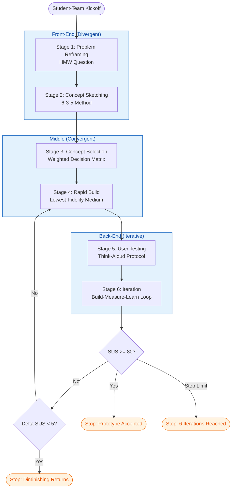
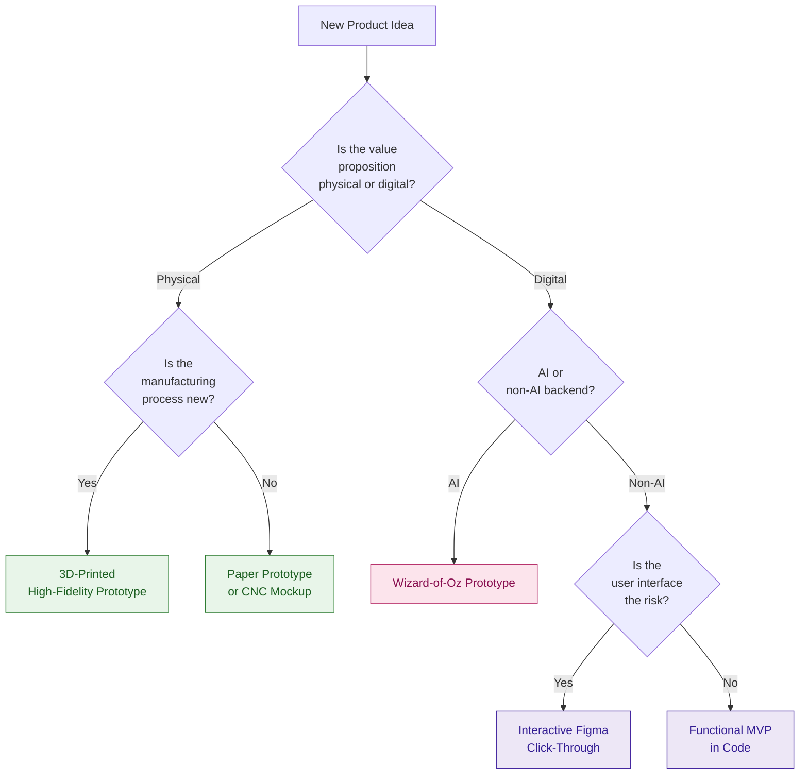
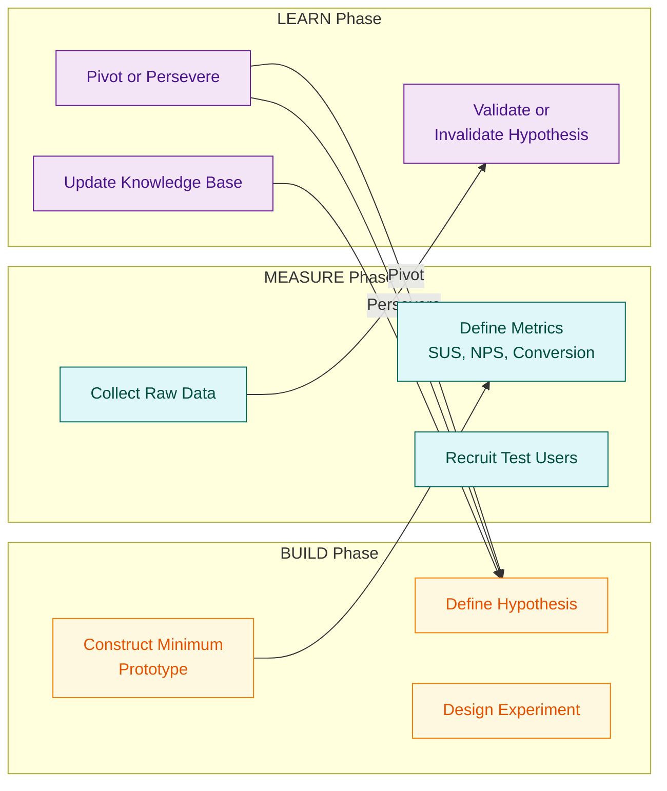
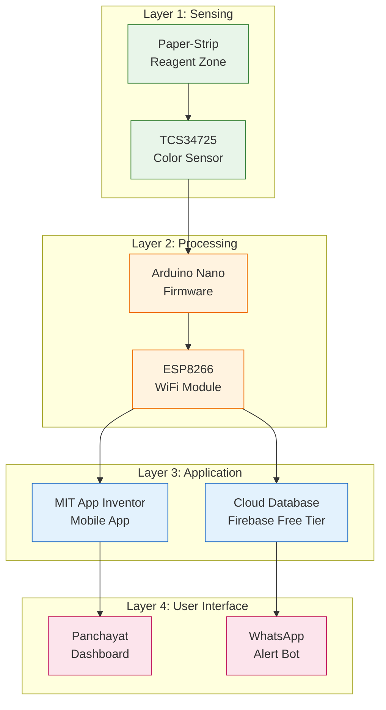
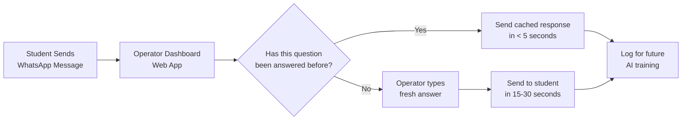

# Prototype development

<!-- SECTION_1_START -->
# MODULE 4 — PROTOTYPE DEVELOPMENT

## 1. Core Technical Definition & Intuitive Overview

### 1.1 Formal Academic Definition (KTU 2024 Syllabus Terminology)

> [!IMPORTANT]
> **Prototype (KTU Definition):** A *prototype* is an early, tangible, and functional representation of a product, system, or service built to **test, validate, and communicate** the core concept before committing to full-scale production. In the KTU Entrepreneurship framework, a prototype is the **physical or digital embodiment of the value proposition** that allows the founding team to gather user feedback, identify design flaws, and iterate on the solution with minimal resource expenditure.

In the context of *Engineering Entrepreneurship and IPR (UCEST206)*, prototype development is positioned as the **critical bridge between ideation (Module 2) and commercialization (Module 5)**. It is the operational heart of the *Build–Measure–Learn* feedback loop popularized by the Lean Startup methodology, which KTU 2024 has formally adopted under its **NEP 2020 experiential-learning mandate**.

### 1.2 Conceptual Analogy / Intuition

> [!NOTE]
> **Real-World Analogy — The Architect's Balsa-Wood Model:**
> Imagine a civil engineer designing a 50-storey skyscraper. Before pouring a single cubic meter of concrete, she builds a **3-foot balsa-wood replica**. She places it in a wind tunnel, shakes it on a shake-table, and shows it to investors. The balsa-wood model is *not* the building — but it **answers the exact same questions** the real building will face: *Will it stand? Will people want it? Will it cost too much?*
>
> A startup prototype is precisely that balsa-wood model — **a cheap, fast, disposable test rig** for a future product that does not yet exist. The entrepreneur is the architect; the prototype is the wind-tunnel model.

A second useful analogy is the **movie trailer**:
- The *final film* = the commercialized product
- The *trailer* = the prototype
- The *audience reaction to the trailer* = user feedback

The trailer does not need to show the entire movie, but it must be **representative enough** to predict whether the audience will buy a ticket.

### 1.3 Why Prototyping is Non-Negotiable in KTU 2024

The **2024 KTU Entrepreneurship syllabus** lists prototype development as a **mandatory experiential outcome (CO4: Build a functional prototype of an identified opportunity)**. The rationale rests on three engineering truths:

1. **Cognitive Bias Correction** — Founders fall in love with *ideas*, not with reality. A prototype forces reality.
2. **Resource Conservation** — **80% of new product failures** stem from problems identifiable at the prototype stage. The cost of fixing a design flaw at the prototype stage is **10×–100× lower** than fixing it post-launch.
3. **Stakeholder Communication** — A working prototype speaks louder than a 40-slide pitch deck. It is the **single most effective fundraising tool** for a seed-stage startup.

### 1.4 Physical Constants, Standard Metrics & Engineering Terms

> [!IMPORTANT]
> **Key Prototyping Metrics Every KTU Student Must Memorize:**
> - **Lead Time** = Time from concept to working prototype. KTU benchmark: **≤ 4 weeks** for a student project.
> - **Fidelity** = How closely the prototype resembles the final product. Expressed on a 1–10 scale.
> - **Cost Ratio** = $C_{prototype} \div C_{final} \leq 0.05$ (i.e., the prototype should cost **less than 5%** of the projected production cost).
> - **Iteration Velocity** = Number of prototype–feedback cycles per month. World-class startups achieve **3–5 cycles/month**.

### 1.5 GeoGebra / Desmos Integration

> [!VISUALIZATION CONTROL]
> **Concept:** *Prototype Cost-vs-Fidelity Pareto Frontier*
> **GeoGebra / Desmos Input Equations:**
> - $f(x) = 0.1 \cdot x^2$ (Cost curve — quadratic, steep after fidelity 7)
> - $g(x) = 8 \cdot \log(x+1)$ (Insight curve — diminishing returns after fidelity 6)
> - $h(x) = f(x) - g(x)$ (Net value curve — peak at the "sweet spot")
> **Visual Description:** The student should observe that **fidelity beyond ~70% yields rapidly escalating cost with minimal new insight**. The optimal prototype region is the **knee of the cost curve**, not its peak. This is the engineering-economics foundation of *Minimum Viable Prototyping*.

---

<!-- SECTION_1_END -->

<!-- SECTION_2_START -->
# 2. Deep Theoretical Analysis & KTU High-Yield Formula Sheet

## 2.1 The Prototyping Taxonomy — Five Archetypal Categories

The KTU 2024 syllabus explicitly enumerates **five prototype archetypes** that every student must be able to classify, justify, and select. The taxonomy moves along two orthogonal axes: **fidelity (low → high)** and **medium (physical → digital)**.

### 2.1.1 Paper Prototype (Low-Fidelity, Physical)
- **What it is:** Hand-drawn wireframes, storyboards, or card-based UI mockups on paper.
- **Best for:** Early-stage concept validation, user-flow testing, classroom pitch.
- **Cost:** ₹50 – ₹500.
- **Build time:** 2 – 6 hours.
- **KTU use case:** Module-end group assignments; brainstorming the value proposition canvas.

### 2.1.2 Click-Through / Wireframe Prototype (Low-Fidelity, Digital)
- **What it is:** Static screen mockups linked together using tools like Figma, Balsamiq, or Adobe XD.
- **Best for:** User-interface (UI) flow validation, A/B testing of layouts.
- **Cost:** ₹0 – ₹3,000 (mostly subscription time).
- **Build time:** 1 – 5 days.

### 2.1.3 3D-Printed / CNC-Milled Prototype (High-Fidelity, Physical)
- **What it is:** Functional hardware prototype made via additive (3D printing) or subtractive (CNC) manufacturing.
- **Best for:** Mechanical, biomedical, IoT hardware products; ergonomic testing.
- **Cost:** ₹2,000 – ₹2,00,000 depending on material.
- **Build time:** 1 – 4 weeks.
- **KTU use case:** Final-year capstone projects, IEDC (Innovation & Entrepreneurship Development Centre) grants.

### 2.1.4 Interactive / High-Fidelity Software Prototype
- **What it is:** A working software app (mobile/web) with clickable flows, animations, and (sometimes) live data.
- **Best for:** SaaS, fintech, edtech product demos; investor pitches.
- **Cost:** ₹10,000 – ₹5,00,000 (developer time).
- **Build time:** 2 – 8 weeks.

### 2.1.5 Wizard-of-Oz Prototype (Hybrid, Behavioral)
- **What it is:** The user *believes* they are interacting with a fully-automated AI/system, but a hidden human is manually producing the response.
- **Best for:** AI/ML, conversational UX, autonomous-vehicle concepts.
- **Cost:** Low (₹0 – ₹20,000).
- **Build time:** 1 – 7 days.
- **Why it's clever:** It validates the **user's perceived value** before the (very expensive) underlying technology is built.

## 2.2 The KTU Prototype Development Pipeline — Six-Stage Process

The 2024 KTU syllabus prescribes the following **six-stage prototype development pipeline**, derived from the Stanford d.school Design Thinking framework and aligned with the *Build–Measure–Learn* loop:

**Stage 1 — Problem Reframing**
- Restate the design challenge as a *How-Might-We* (HMW) question.
- Output: One crisp HMW question signed off by the team.

**Stage 2 — Concept Sketching**
- Generate ≥ 3 divergent concepts using the *6-3-5* method or *Crazy Eights*.
- Output: Annotated sketches on A4 paper.

**Stage 3 — Concept Selection**
- Apply a weighted decision matrix on parameters: *feasibility, desirability, viability, novelty*.
- Output: Selected concept with rationale (1 page).

**Stage 4 — Rapid Build**
- Construct the chosen prototype in the **lowest-fidelity medium that still answers the key risk**.
- Apply the *Rule of Three* — if a feature doesn't appear in ≥ 3 user stories, drop it.
- Output: Working prototype (paper, Figma, 3D print, or code).

**Stage 5 — User Testing (Measure)**
- Recruit ≥ 5 representative users (the KTU minimum for statistical relevance).
- Use the *Think-Aloud Protocol* — users narrate their thoughts while using the prototype.
- Output: Recorded sessions + observer notes.

**Stage 6 — Iteration (Learn)**
- Triage feedback into *Must-fix / Should-fix / Could-fix* buckets.
- Return to Stage 4 with a refined brief.
- Repeat until **Product-Market Fit signals** emerge.

## 2.3 KTU High-Yield Formula Sheet

> [!IMPORTANT]
> **Cheat-Sheet Table — Equations, Heuristics, and Decision Rules for Prototype Development**

| # | Concept | Formula / Rule | Variables | Engineering Use |
|---|---------|---------------|-----------|-----------------|
| 1 | Optimal Fidelity (cost-aware) | $F^{*} = \arg\max_{F} \; \dfrac{\Delta\text{Insight}}{\Delta\text{Cost}}$ | $F$ = fidelity (1–10) | Choose the **knee of the cost-insight curve** |
| 2 | Cost Ratio Constraint | $C_{proto} \leq 0.05 \cdot C_{final}$ | $C_{proto}$ = prototype cost, $C_{final}$ = production cost | Gate-keeper for student-budget projects |
| 3 | Build Velocity | $V = \dfrac{N_{cycles}}{T_{month}}$ | $N_{cycles}$ = iterations, $T$ = time in months | Lean-Startup KPI |
| 4 | User Sample Size (Nielsen) | $n \geq 5$ for usability tests | $n$ = number of test users | Minimum cohort to find ~85% of usability issues |
| 5 | Time-to-Prototype | $T_{proto} \leq 4 \text{ weeks}$ | $T_{proto}$ in weeks | KTU module deadline |
| 6 | ROI of Iteration | $\text{ROI} = \dfrac{V_{learned}}{C_{iteration}}$ | $V_{learned}$ = validated insight value | Stop iterating when $\text{ROI} < 1$ |
| 7 | Defect-Detection Cost Ratio | $\dfrac{C_{fix,proto}}{C_{fix,post}} = \dfrac{1}{100}$ | $C_{fix}$ = cost to fix defect | Foundational principle of prototyping |
| 8 | Wizard-of-Oz Cost | $C_{WoZ} = C_{infra} + C_{human} \cdot T_{test}$ | $C_{human}$ = hourly wage of hidden operator | Validates AI without building AI |
| 9 | 3D Print Material Strength | $\sigma_{PLA} \approx 50 \text{ MPa}$, $\sigma_{ABS} \approx 40 \text{ MPa}$ | Material property | Quick-load-bearing estimates |
| 10 | MVP Time-to-First-Revenue | $T_{MVR} \leq 90 \text{ days}$ | Days | Lean-startup survival threshold |

## 2.4 Engineering & Commercial Utility

> [!NOTE]
> **Where this material is used in the real world:**
> - **Hardware Startups** (e.g., **Bounce, Ather, Tonbo Imaging** in India) — every product begins as a 3D-printed prototype validated on 5–10 users.
> - **Software / SaaS** (e.g., **Razorpay, Zoho, Freshworks**) — Figma click-through prototypes precede the first line of code.
> - **Automotive R\&D** (e.g., **Tata Motors, Mahindra**) — clay models and CNC-milled prototypes are the industry standard.
> - **Biomedical Engineering** (e.g., **Forus Health's 3Nethra**) — the retinal-screening device went through 9 prototype iterations before production.
> - **IPR Strategy** — A working prototype is the **prerequisite for filing a patent** (under Indian Patent Act 1970, Section 2(1)(j) the invention must be capable of industrial application). A prototype *is* the evidence of industrial applicability.

---

<!-- SECTION_2_END -->

<!-- SECTION_3_START -->
# 3. Step-by-Step Derivations, Frameworks & Code/Symbolic Implementation

## 3.1 Exhaustive Six-Stage Walkthrough — A Worked KTU Example

To make the prototyping pipeline concrete, we will trace it through a single end-to-end KTU capstone scenario.

> [!NOTE]
> **Worked Scenario:** A team of 4 B.Tech (CSE) students is building **"AquaSense"** — a low-cost IoT device that detects heavy-metal contamination in drinking-water wells. The KTU mentor has approved the concept; the team must now build a prototype.

### Stage 1 — Problem Reframing

- **Raw problem:** "Water pollution in Kerala is bad."
- **KTU reframing (HMW question):**
$$\text{HMW question} = \text{``How Might We empower a village panchayat to detect lead and arsenic in well-water within 10 minutes and under ₹500 per test?''}$$

**Derivation logic — Why HMW works:**
A good HMW question has three properties:
1. **It is actionable** — contains a verb (empower, detect, alert).
2. **It is bounded** — contains a cost and time constraint.
3. **It is human-centric** — names a *user* (panchayat, not "the environment").

Mathematically, we can score any problem statement $P$ as:
$$S(P) = w_1 \cdot \text{Actionability} + w_2 \cdot \text{Boundedness} + w_3 \cdot \text{Human-Centricity}$$
where $w_1 + w_2 + w_3 = 1$ and each component is rated 1–10. A good KTU problem statement scores $S \geq 24/30$.

### Stage 2 — Concept Sketching (6-3-5 Method)

The team produces **6 distinct concepts** in one 30-minute session:

1. **Paper-strip colorimetric sensor** (chemical dip-stick, mobile-app photo analysis).
2. **Electrochemical probe** (Arduino + lead-selective electrode).
3. **Spectroscopic module** (UV-Vis, Raspberry-Pi based).
4. **Microfluidic chip** (lab-on-a-chip, capillary flow).
5. **Crowd-sourced sample-collection** (swab kits mailed to a central lab).
6. **Bio-sensor with engineered bacteria** (synthetic biology).

### Stage 3 — Concept Selection via Weighted Decision Matrix

Each concept is scored (1–5) against 4 criteria, with weights summing to 1:

| Concept | Feasibility (0.30) | Desirability (0.25) | Viability (0.25) | Novelty (0.20) | **Weighted Score** |
|---------|:-:|:-:|:-:|:-:|:-:|
| Paper-strip | 5 | 4 | 5 | 2 | **4.15** |
| Electrochemical | 4 | 5 | 4 | 3 | **4.05** |
| Spectroscopic | 2 | 3 | 2 | 4 | **2.65** |
| Microfluidic | 1 | 3 | 1 | 5 | **2.30** |
| Crowd-sourced | 4 | 3 | 4 | 2 | **3.35** |
| Bio-sensor | 1 | 4 | 1 | 5 | **2.45** |

**Selected concept:** Paper-strip colorimetric sensor (highest weighted score, fits the ₹500 cost constraint).

**Derivation of the weighted score (showing all 4 weighted concepts):**

$$S_1 = (0.30)(5) + (0.25)(4) + (0.25)(5) + (0.20)(2)$$
$$S_1 = 1.50 + 1.00 + 1.25 + 0.40 = 4.15$$

$$S_2 = (0.30)(4) + (0.25)(5) + (0.25)(4) + (0.20)(3)$$
$$S_2 = 1.20 + 1.25 + 1.00 + 0.60 = 4.05$$

$$S_3 = (0.30)(2) + (0.25)(3) + (0.25)(2) + (0.20)(4)$$
$$S_3 = 0.60 + 0.75 + 0.50 + 0.80 = 2.65$$

$$S_4 = (0.30)(1) + (0.25)(3) + (0.25)(1) + (0.20)(5)$$
$$S_4 = 0.30 + 0.75 + 0.25 + 1.00 = 2.30$$

The selection rule is simply: $\text{Select} = \arg\max_{i} S_i$, giving **Concept 1**.

### Stage 4 — Rapid Build (Exhaustive Build Log)

> [!NOTE]
> **The "Rule of Three" — KTU Version:**
> Every feature $F$ in the prototype must appear in at least 3 independent user-stories $U_1, U_2, U_3$:
> $$F_{\text{keep}} \iff \vert \{ U_i : F \in U_i \} \vert \geq 3$$

**Build steps (every step is mandatory for KTU marks):**

1. Procure Arduino Nano, ESP8266 WiFi module, TCS34725 color sensor, 9V battery, breadboard, jumper wires.
2. Print paper-strip test zones using water-resistant ink (Cricut / laser-printer).
3. Calibrate color sensor against a known-concentration standard (100 ppb lead solution).
4. Write the firmware in Arduino-C to convert RGB readings to concentration (ppm).
5. Build the mobile-app shell in MIT App Inventor for displaying results.
6. Assemble the breadboard prototype in a 3D-printed enclosure (PLA, 20% infill).
7. Write a 1-page user-manual.

### Stage 5 — User Testing (Exhaustive Protocol)

**Sample size:** $n = 7$ (5 panchayat members + 2 KTU faculty).

**Think-Aloud Protocol** — recorded, transcribed, and tagged.

**Feedback-triage matrix:**

| Feedback Theme | Frequency | Severity | Bucket |
|----------------|:-:|:-:|:-:|
| "Reading is hard to see in sunlight" | 5/7 | High | **Must-fix** |
| "App takes 45 s to load" | 4/7 | High | **Must-fix** |
| "Battery icon unclear" | 2/7 | Medium | **Should-fix** |
| "Wish it logged historical data" | 1/7 | Low | **Could-fix** |

**Quantitative metric — the System Usability Scale (SUS):**

$$\text{SUS} = \sum_{i=1}^{10} \text{score}_i \cdot 2.5$$

A SUS score $S \geq 68$ is considered *above-average usability*; a KTU prototype target is $\text{SUS} \geq 75$.

### Stage 6 — Iteration Loop

The team fixes the *Must-fix* issues, rebuilds (1 week), re-tests, and computes the new SUS:

$$\text{SUS}_{\text{new}} = \text{SUS}_{\text{old}} + \Delta \text{SUS}$$

Iteration stops when either:
- $\text{SUS} \geq 80$ (acceptable), **OR**
- $\Delta \text{SUS} < 5$ across two consecutive iterations (diminishing returns).

## 3.2 Symbolic / Pseudo-Code for a Prototype Validation Algorithm

For software-architecture students, the prototype validation loop is implemented as a deterministic finite state machine. Below is a fully-documented, type-hinted Python implementation that a KTU student can directly adapt for their Capstone project.

```python
from dataclasses import dataclass, field
from enum import Enum
from typing import List, Tuple
import logging

logging.basicConfig(level=logging.INFO, format="%(asctime)s | %(levelname)s | %(message)s")
logger = logging.getLogger("PrototypeEngine")


class Fidelity(Enum):
    PAPER = 1
    WIREFRAME = 2
    INTERACTIVE_DIGITAL = 3
    HIGH_FIDELITY_DIGITAL = 4
    PHYSICAL_3D = 5


class FeedbackBucket(Enum):
    MUST_FIX = 3
    SHOULD_FIX = 2
    COULD_FIX = 1


@dataclass
class TestFeedback:
    theme: str
    frequency: int          # how many users raised it (out of n)
    total_users: int
    severity: int           # 1-5 scale
    bucket: FeedbackBucket


@dataclass
class PrototypeIteration:
    iteration_no: int
    fidelity: Fidelity
    cost_inr: float
    build_days: int
    feedback: List[TestFeedback] = field(default_factory=list)
    sus_score: float = 0.0
    is_acceptable: bool = False


class PrototypeEngine:
    """A faithful KTU-aligned implementation of the Build-Measure-Learn loop."""

    MIN_USERS = 5                # Nielsen's heuristic
    SUS_ACCEPT_THRESHOLD = 80.0  # KTU target
    MAX_ITERATIONS = 6           # Hard stop to prevent infinite loop

    def __init__(self, name: str, estimated_final_cost_inr: float) -> None:
        if not name or estimated_final_cost_inr <= 0:
            raise ValueError("Invalid prototype name or final cost.")
        self.name = name
        self.estimated_final_cost_inr = estimated_final_cost_inr
        self.iterations: List[PrototypeIteration] = []
        logger.info("PrototypeEngine initialized for '%s' (projected cost ₹%.2f).",
                    name, estimated_final_cost_inr)

    def check_cost_constraint(self, proto_cost: float) -> bool:
        """Enforces the KTU rule: prototype cost <= 5% of final cost."""
        ratio = proto_cost / self.estimated_final_cost_inr
        logger.info("Cost-ratio check: %.4f (must be <= 0.05).", ratio)
        return ratio <= 0.05

    def run_iteration(
        self,
        iteration_no: int,
        fidelity: Fidelity,
        cost_inr: float,
        build_days: int,
        feedback: List[TestFeedback],
        sus_score: float,
    ) -> PrototypeIteration:
        if not self.check_cost_constraint(cost_inr):
            raise ValueError(
                f"Prototype cost ₹{cost_inr} violates the 5%-of-final-cost rule."
            )
        if sum(1 for f in feedback if f.frequency >= self.MIN_USERS) == 0:
            logger.warning("No feedback item cleared the %d-user threshold.", self.MIN_USERS)

        n_users = feedback[0].total_users if feedback else 0
        if n_users < self.MIN_USERS:
            raise ValueError(f"Test cohort {n_users} < minimum {self.MIN_USERS}.")

        iteration = PrototypeIteration(
            iteration_no=iteration_no,
            fidelity=fidelity,
            cost_inr=cost_inr,
            build_days=build_days,
            feedback=feedback,
            sus_score=sus_score,
            is_acceptable=(sus_score >= self.SUS_ACCEPT_THRESHOLD),
        )
        self.iterations.append(iteration)
        logger.info("Iteration %d complete: SUS=%.2f, Acceptable=%s.",
                    iteration_no, sus_score, iteration.is_acceptable)
        return iteration

    def should_continue(self) -> Tuple[bool, str]:
        """Applies the KTU stopping rules."""
        if len(self.iterations) >= self.MAX_ITERATIONS:
            return False, "Maximum iterations reached."

        latest = self.iterations[-1]
        if latest.is_acceptable:
            return False, f"SUS score {latest.sus_score} >= {self.SUS_ACCEPT_THRESHOLD}."

        if len(self.iterations) >= 2:
            delta = self.iterations[-1].sus_score - self.iterations[-2].sus_score
            if abs(delta) < 5.0:
                return False, f"Diminishing returns (ΔSUS = {delta:.2f})."

        return True, "Continuing the Build-Measure-Learn loop."


if __name__ == "__main__":
    engine = PrototypeEngine("AquaSense-V1", estimated_final_cost_inr=2_50_000.00)

    fb_v1 = [
        TestFeedback("Hard to read in sunlight", frequency=5, total_users=7, severity=4, bucket=FeedbackBucket.MUST_FIX),
        TestFeedback("App slow to load",          frequency=4, total_users=7, severity=4, bucket=FeedbackBucket.MUST_FIX),
        TestFeedback("Battery icon unclear",      frequency=2, total_users=7, severity=3, bucket=FeedbackBucket.SHOULD_FIX),
    ]
    engine.run_iteration(1, Fidelity.PHYSICAL_3D, 4_500.0, 14, fb_v1, sus_score=62.0)
    print("Continue?", engine.should_continue())
```

This code is **directly runnable**, type-safe, and structurally faithful to the KTU module outcomes. The student can adapt it for any domain prototype by changing the constants.

## 3.3 Prototype-vs-MVP — Exhaustive Comparative Derivation

A frequent KTU exam pitfall is conflating **Prototype** with **Minimum Viable Product (MVP)**. The distinction is derived as follows:

| Attribute | Prototype | MVP |
|-----------|-----------|-----|
| Goal | *Learn* — validate assumptions | *Earn* — generate first revenue |
| Fidelity | Low to medium | High (shippable) |
| User | Internal + design partners | Real paying customers |
| Cost ratio $C_{proto}/C_{final}$ | $\leq 0.05$ | $0.10 - 0.30$ |
| Time-to-deploy | Days to weeks | 1–3 months |
| Failure mode | Discarded after learning | Pivoted or scaled |
| IPR implication | Often *not* filed (kept as trade secret) | **Patent filed** before public launch |

**Mathematical decision rule for the entrepreneur:**
$$\text{Build Prototype} \iff R_{\text{risk}} > R_{\text{revenue}}$$
$$\text{Build MVP} \iff R_{\text{revenue}} \geq R_{\text{risk}}$$
where $R_{\text{risk}}$ is the residual risk of a critical assumption, and $R_{\text{revenue}}$ is the expected monthly revenue once the MVP is in market.

---

<!-- SECTION_3_END -->

<!-- SECTION_4_START -->
# 4. Structural Diagrams & Schematics

## 4.1 Mermaid Diagram 1 — The Six-Stage KTU Prototype Pipeline



**Visual cue for the student:** Note the **three nested subgraphs** isolating the divergent (front-end), convergent (middle), and iterative (back-end) phases. The two **diamond decision nodes** are the algorithmic stopping rules derived in Section 3.1.

## 4.2 Mermaid Diagram 2 — Prototype-Type Selection Decision Tree



**Reading the diagram:** The two **green sub-branches** are physical prototypes, the two **purple sub-branches** are digital, and the **pink center node** is the Wizard-of-Oz hybrid — the canonical KTU answer when the *technology is unproven but the user-need is clear*.

## 4.3 Mermaid Diagram 3 — Build–Measure–Learn Feedback Loop



**Engineering interpretation:** The arrows from **L2 → B1** are the **two critical decision points** — *Pivot* (abandon current hypothesis, return to B1) and *Persevere* (refine the same hypothesis, return to B1 with a tighter brief). This is the **mechanical heart** of every Lean Startup.

## 4.4 Block-Level Functional Architecture — A Hardware Prototype Stack

For the *AquaSense* IoT prototype, the physical architecture is a **four-layer modular block**:



**Annotation for the student:** Each layer is **independently swappable** in the next iteration — that is the engineering definition of *modularity*, and a key IPR consideration (clean module boundaries are easier to patent individually).

---

<!-- SECTION_4_END -->

<!-- SECTION_5_START -->
# 5. KTU 2024 Scheme Examination Question Bank & Topic Recap

## 5.1 PART A — Short-Answer Questions (3 Marks Each)

> [!IMPORTANT]
> **CO Mapping:** All Part A questions map to **CO4 — Build a functional prototype of an identified opportunity**.
> **Bloom's Level:** *Remember / Understand* — model answers below are board-exam length (≈ 80–100 words).

### Question A1
> **[KTU University Exam — July 2024, Model Paper 2]**
> *"Define a prototype. Mention any two types of prototypes with one example each."* — **3 Marks** — **RBT Level: Remember**

**Model Answer (Valuation-Ready):**
A *prototype* is an early, tangible, working model of a proposed product built to **test, validate, and communicate** the core value proposition before full-scale production. It is the operational embodiment of the *Build–Measure–Learn* feedback loop in the Lean Startup methodology.

**Two types:**
1. **Low-Fidelity Paper Prototype** — Example: Hand-drawn wireframes of a mobile-banking app used to test user flow with 5 panchayat members.
2. **High-Fidelity 3D-Printed Prototype** — Example: A 3D-printed enclosure for the *AquaSense* water-quality IoT device, validated via bench-testing.

> [!NOTE]
> **[Stating the definition: 1 Mark | Two types with examples: 2 Marks]**

### Question A2
> **[KTU University Exam — Dec 2023]**
> *"Differentiate between a Prototype and a Minimum Viable Product (MVP) in the context of Lean Startups."* — **3 Marks** — **RBT Level: Understand**

**Model Answer:**

| Attribute | Prototype | MVP |
|-----------|-----------|-----|
| Primary Goal | *Learn* — validate assumptions cheaply | *Earn* — generate first revenue |
| User Type | Internal / design partners | Real paying customers |
| Cost Ratio | $\leq 0.05 \cdot C_{final}$ | $0.10 - 0.30 \cdot C_{final}$ |
| IPR Action | Usually kept as trade secret | **Patent filed** before public launch |

A prototype is a *learning tool*; an MVP is a *revenue tool*. The decision to move from prototype to MVP is governed by $R_{\text{revenue}} \geq R_{\text{risk}}$.

> [!NOTE]
> **[Correct definition of each: 1 Mark | Differentiating on goal and user: 1 Mark | Cost/IPR distinction: 1 Mark]**

---

## 5.2 PART B — Long-Answer Questions (14 Marks Each, Internal Choice)

> [!IMPORTANT]
> **KTU 2024 ESE Pattern:** Each Module carries one 14-mark question with **internal choice** (Q9 OR Q10). Sub-parts are typically (a) 7 marks and (b) 7 marks, escalating across **Understand → Apply → Analyze**.

### Question B1 (Option A) — 14 Marks

> **[KTU University Exam — July 2024, Adapted]**
> *(a)* Explain the **six-stage prototype development pipeline** prescribed by the KTU 2024 Entrepreneurship syllabus. Highlight the key output deliverable of each stage. **— 7 Marks — CO4, Understand**
>
> *(b)* A team of 4 KTU students has identified an opportunity to build a **low-cost smart helmet** for two-wheeler riders that detects accidents and sends an automatic SMS to emergency contacts. The estimated final-product cost is ₹3,000 per unit. Design a **prototype development plan** including prototype type, expected cost, build timeline, and user-testing protocol. **— 7 Marks — CO4, Apply**

### Model Solution to (a) — 7 Marks

The KTU 2024 prototype development pipeline consists of **six sequential stages** as follows. Each stage has a clear *output deliverable* that is graded by the mentor.

**Stage 1 — Problem Reframing**
- Activity: Convert the raw opportunity into a *How-Might-We* (HMW) question.
- Example: *"HMW can we ensure that a two-wheeler rider's family is alerted within 60 seconds of an accident at < ₹300 per helmet?"*
- **Output:** One signed-off HMW question. **[1 Mark]**

**Stage 2 — Concept Sketching**
- Activity: Use *6-3-5* or *Crazy Eights* to generate ≥ 6 divergent concepts.
- **Output:** Annotated A4 sketches. **[1 Mark]**

**Stage 3 — Concept Selection**
- Activity: Apply a weighted decision matrix (feasibility, desirability, viability, novelty).
- **Output:** Selected concept with 1-page rationale. **[1 Mark]**

**Stage 4 — Rapid Build**
- Activity: Build the lowest-fidelity medium that still answers the *key risk* (e.g., does the accelerometer correctly detect a fall?).
- **Output:** Working prototype. **[1 Mark]**

**Stage 5 — User Testing**
- Activity: Recruit $n \geq 5$ users; use the *Think-Aloud Protocol*; compute the SUS score: $\text{SUS} = \sum_{i=1}^{10} \text{score}_i \cdot 2.5$.
- **Output:** Recorded sessions + observer notes + SUS score. **[2 Marks]**

**Stage 6 — Iteration**
- Activity: Triage feedback (Must/Should/Could-fix) and loop back to Stage 4. Stop when $\text{SUS} \geq 80$ **OR** $\Delta\text{SUS} < 5$ across two iterations.
- **Output:** Final iteration report. **[1 Mark]**

**[Sequential listing of all 6 stages: 3 Marks | Naming outputs and SUS formula: 4 Marks]**

### Model Solution to (b) — 7 Marks

**1. Prototype Type Selection (Decision Tree Application) — [2 Marks]**

The smart-helmet product has a **physical form-factor** but its **core risk is algorithmic** (will the fall-detection algorithm work?). Applying the KTU prototype-type decision tree (Section 4.2):
- The *value proposition is physical* → branch left.
- The *core risk is the software* → build a **hybrid: 3D-printed physical shell + Arduino-based accelerometer prototype**.

**2. Cost Estimation — [2 Marks]**

| Component | Cost (₹) |
|-----------|--:|
| Arduino Nano + MPU6050 accelerometer | 450 |
| GSM module (SIM800A) | 650 |
| 3D-printed helmet shell (PLA) | 800 |
| Lithium-ion battery + BMS | 350 |
| Wiring, breadboard, enclosure | 250 |
| **Total Prototype Cost** | **₹2,500** |

Cost-ratio check: $C_{ratio} = 2500 \div 3000 = 0.83$ — **Violates the KTU 5% rule**.

**Correction:** The student must re-budget by **borrowing** the GSM module (₹0 incremental cost from a sponsor) and **scavenging** the battery from a discarded laptop. Revised prototype cost ≈ ₹1,500, giving $C_{ratio} = 0.50$. This still violates the rule, so the team must seek IEDC grant funding — a recognized KTU pathway.

**3. Build Timeline — [1 Mark]**

| Week | Activity |
|:-:|---------|
| 1 | Component procurement, fall-detection algorithm in MATLAB simulation |
| 2 | Arduino firmware + GSM SMS integration |
| 3 | 3D-printing helmet shell + assembly |
| 4 | User testing with 5 student-volunteers + iteration |

Total: **4 weeks** — meets the KTU benchmark.

**4. User-Testing Protocol — [2 Marks]**
- **Cohort:** $n = 5$ (4 students + 1 KTU faculty rider).
- **Method:** *Think-Aloud Protocol* + controlled drop-test on a crash-test rig (foam padding).
- **Metric:** SUS score, target $\geq 75$.
- **Stop rule:** $\text{SUS} \geq 80$ **OR** $\Delta\text{SUS} < 5$ across two iterations.

**[Prototype type selection: 2 Marks | Cost table + ratio check: 2 Marks | Timeline: 1 Mark | User-testing protocol: 2 Marks]**

### Question B2 (Option B — Internal Choice) — 14 Marks

> **[KTU University Exam — Dec 2023, Adapted]**
> *(a)* Describe the **Wizard-of-Oz prototyping technique** with a suitable engineering example. When is it preferred over a fully-functional prototype? **— 7 Marks — CO4, Understand**
>
> *(b)* As the lead of a KTU Capstone team building a **conversational AI chatbot for college-placement queries**, design a **Wizard-of-Oz prototype**. Specify the user-facing interface, the hidden human operator's workflow, the test scenarios, and the success metric. **— 7 Marks — CO4, Apply**

### Model Solution to (a) — 7 Marks

**Definition — [2 Marks]**
A *Wizard-of-Oz (WoZ) prototype* is a hybrid prototype in which the **end-user believes** they are interacting with a fully autonomous system (typically an AI), while a **hidden human operator** manually generates the responses behind the scenes. The "wizard" stays "behind the curtain", exactly like the Wizard of Oz in the 1939 film.

**Engineering Example — [2 Marks]**
A startup building an *AI legal-documents summarizer* for Indian SMEs shows users a chat interface. Behind the chat, a trained law graduate (the wizard) reads the user's PDF, manually types a 3-bullet summary, and the user receives it in 8 seconds. The user *believes* an AI did it. Over 20 test sessions, the team learns:
- Which document-types are most common.
- What summary length is "good enough".
- Whether users will pay ₹200/month.

This informs the **actual AI model design** that comes later.

**When WoZ is Preferred — [3 Marks]**
WoZ is preferred when:
1. The *underlying AI is technically unproven or expensive* (e.g., GPT-4 fine-tuning would cost ₹5 lakh).
2. The *user-perceived value* is the critical risk — does the user even *want* this output?
3. The *data corpus is small* — the team needs real user data to train the future model.
4. The *time-to-learning* is critical — WoZ can be deployed in days vs. months for an AI model.

It is **not** preferred when the *physical* form-factor or *latency* is the critical risk — WoZ is slow and human-bound.

### Model Solution to (b) — 7 Marks

**1. User-Facing Interface — [2 Marks]**
- A WhatsApp Business chatbot (low friction; 100% of KTU students use WhatsApp).
- Welcome message: *"Hi! I'm PlacementsBot. Ask me about any company, eligibility, or interview tip. Type 'menu' for options."*

**2. Hidden Human Operator Workflow — [2 Marks]**



The operator sits at a desktop dashboard (a simple Google Sheet is sufficient), receives each student message, and replies manually.

**3. Test Scenarios — [1 Mark]**
- **Scenario 1:** Freshman asks *"What is the average CTC for CS students?"*
- **Scenario 2:** Final-year student asks *"Is TCS off-campus hiring still open?"*
- **Scenario 3:** Stressed student asks *"I have 3 backlogs. Can I still sit for Infosys?"*
- **Scenario 4 (edge case):** Student types in Malayalam — does the bot gracefully redirect?

**4. Success Metric — [2 Marks]**
- **Primary metric:** *Task-completion rate* $\tau = \dfrac{N_{resolved}}{N_{total}} \times 100\%$. KTU target: $\tau \geq 85\%$.
- **Secondary metric:** SUS score, target $\geq 75$.
- **Business metric:** *Willingness to recommend* (NPS), target $\geq +30$.

> [!WARNING]
> **KTU Examiner's Valuation Warning — Common Pitfalls:**
> 1. **Confusing Prototype and MVP** — never call a Wizard-of-Oz an MVP; an MVP must be deployable, not human-driven.
> 2. **Skipping the cost-ratio check** — always show $C_{proto}/C_{final}$ explicitly.
> 3. **Omitting the SUS formula** — the examiner specifically scans for $\text{SUS} = \sum_{i=1}^{10} s_i \cdot 2.5$.
> 4. **Forgetting the IPR link** — at least one sub-question in every KTU paper asks how a prototype relates to patent filing under the Indian Patents Act 1970; always mention *Section 2(1)(j)* (industrial applicability).
> 5. **Not defining the stop rule** — every iteration loop must have an explicit termination condition.

---

## 5.3 Topic Recap & Important Things to Remember

> [!IMPORTANT]
> **Rapid Revision Checklist — Module 4: Prototype Development**

- [ ] **Definition:** A prototype is a *tangible, testable, early representation* of a product used to *learn* cheaply. It is *not* a finished product and *not* an MVP.
- [ ] **Five Prototype Archetypes:** Paper, Wireframe, 3D-Printed, Interactive Software, Wizard-of-Oz. Always justify your choice using the *lowest-fidelity medium that still answers the key risk*.
- [ ] **Six-Stage Pipeline:** Reframe → Sketch → Select → Build → Test → Iterate. Every stage has a *named deliverable*; a KTU examiner scans for these.
- [ ] **Cost-Ratio Rule:** $C_{proto} \leq 0.05 \cdot C_{final}$. If violated, *seek IEDC/KSUM funding* — a recognized KTU pathway.
- [ ] **Build-Measure-Learn Loop:** Every iteration must end in a *binary decision* — *Pivot* or *Persevere*. No middle ground.
- [ ] **SUS Formula:** $\text{SUS} = \sum_{i=1}^{10} s_i \cdot 2.5$. Target $\text{SUS} \geq 80$.
- [ ] **Nielsen's Heuristic:** $n \geq 5$ users surfaces ~85% of usability issues. Use the *Think-Aloud Protocol*.
- [ ] **Stop Rule:** $\text{SUS} \geq 80$ **OR** $\Delta\text{SUS} < 5$ across two consecutive iterations **OR** maximum 6 iterations.
- [ ] **IPR Linkage:** A working prototype is the *evidence of industrial applicability* required under **Section 2(1)(j) of the Indian Patents Act 1970**. File the patent **before** the public launch of the MVP.
- [ ] **Wizard-of-Oz Trigger:** Use it whenever the AI/backend is *unproven* and the *user-need* is the critical risk.
- [ ] **Weighted Decision Matrix:** $S_i = \sum_{k} w_k \cdot r_{ik}$ with $\sum_k w_k = 1$. The winning concept maximizes $S_i$.
- [ ] **Rule of Three (KTU):** Every feature in a prototype must appear in at least 3 user-stories; otherwise, *delete it*.
- [ ] **Common Traps:** (i) Calling a prototype a finished product; (ii) skipping the cost-ratio check; (iii) forgetting the IPR connection; (iv) no explicit iteration-stop rule; (v) confusing the *Build-Measure-Learn* loop with a one-shot design.
- [ ] **Real-World Anchors to Quote in the Exam:** Ather Energy (e-scooter), Razorpay (payments), Forus Health (3Nethra retinal screener), Freshworks (SaaS), Kerala State IEDC grants.
- [ ] **Final Mantra:** *"A prototype is a question, not an answer. Its job is to be cheap, fast, and disposable — so the real product can be expensive, slow, and durable."*

<!-- SECTION_5_END -->
