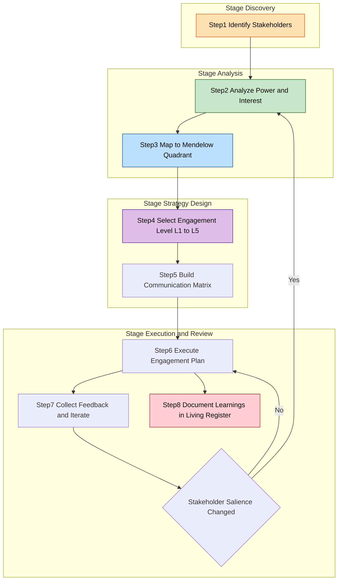
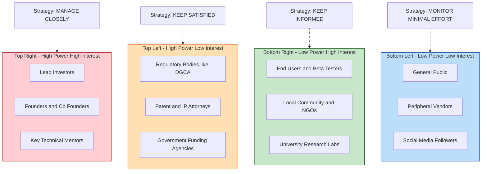
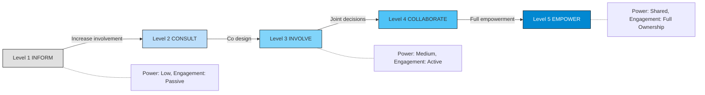
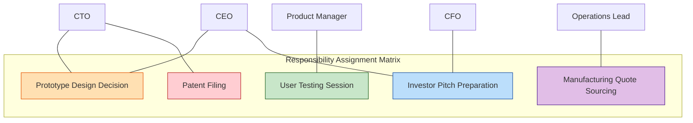

# Stakeholder engagement strategies

<!-- SECTION_1_START -->

# Stakeholder Engagement Strategies in Prototype Development

> [!NOTE]
> **KTU 2024 Scheme Focus | UCEST206 — Module 4: Prototype Development**
> This topic bridges **entrepreneurial decision-making** with **product design thinking**, mapping directly to **CO3: Prototype Planning and Validation** under the **Revised Bloom's Taxonomy (RBT)** cognitive levels of *Understand, Apply, and Analyze*.

## 1.1 Formal Academic Definition

In the context of engineering entrepreneurship and prototype development, **Stakeholder Engagement** refers to the systematic, iterative, and ethically grounded process of identifying, analyzing, communicating with, and involving all individuals, groups, organizations, or entities that have a **vested interest**, **influence**, or **impact** on the design, construction, testing, and commercialization of a product prototype.

A **stakeholder** in prototype development is any party — internal or external — whose inputs, resources, approvals, or feedback are **critical** for the prototype to progress through successive validation gates (Concept → Alpha → Beta → Pre-Production).

> [!IMPORTANT]
> **KTU 2024 Definition (Syllabus-aligned):**
> *"Stakeholder engagement is the planned process of involving users, investors, mentors, regulators, suppliers, and the founding team to co-create value, reduce design risk, and accelerate prototype-market fit."*

## 1.2 Intuitive Overview — The Real-World Analogy

**Analogy: Building a Custom Home**

Imagine you are constructing a house (your **prototype**). Before laying the first brick, you would not work in isolation. You would:

| Stakeholder (in analogy) | Stakeholder (in prototype dev) | Why they matter |
|---|---|---|
| **Your family** (future users) | **End-users / Customers** | Define the actual problem to solve |
| **The architect** | **Design team / Mentors** | Convert ideas into blueprints |
| **The civil engineer** | **Technical co-founders / R\&D** | Validate engineering feasibility |
| **The municipal corporation** | **Regulators / Legal (IPR)** | Approve codes, safety, IP filings |
| **The bank / loan officer** | **Investors / Angel funds** | Provide capital for iteration |
| **The construction crew** | **Suppliers / Manufacturers** | Source materials and components |
| **The interior designer** | **UI/UX researchers** | Polish the user experience |

If you skip engaging any of these stakeholders, the house (prototype) will collapse — either structurally (technical failure), legally (IP infringement), or commercially (no buyer). The same is true for an engineering prototype.

> [!TIP]
> **One-line intuition:** *Stakeholder engagement is the "human API" through which your prototype learns, adapts, and survives the journey from idea to market.*

## 1.3 Physical & Conceptual Constants in Stakeholder Theory

> [!NOTE]
> **Key Metrics to Remember for KTU Board Exams:**
> - **Power-Interest Grid** — developed by **Aubrey Mendelow (1991)**, classifies stakeholders by **Power** (ability to influence) and **Interest** (degree of concern).
> - **AA1000SES Standard** — AccountAbility's Stakeholder Engagement Standard, a globally recognized framework.
> - **RACI Matrix** — Responsibility, Accountability, Consulted, Informed — standard for role clarity.
> - **NPS (Net Promoter Score)** — Quantitative metric ranging from **-100 to +100** used to gauge user enthusiasm.

## 1.4 Conceptual Visualization

> [!VISUALIZATION CONTROL]
> **Concept:** Stakeholder Power vs. Interest Mapping (Mendelow's Matrix)
> **GeoGebra / Desmos Input Points (Cartesian Plane):**
> - $A = (2, 8)$ — High Power, High Interest → *Investors, Founders*
> - $B = (8, 7)$ — High Power, Low Interest → *Regulators, Government*
> - $C = (1.5, 2)$ — Low Power, High Interest → *End-users, Community*
> - $D = (7, 1.5)$ — Low Power, Low Interest → *General public, Media*
>
> **Axes:** X-axis = Interest (1 to 10), Y-axis = Power (1 to 10)
>
> **Visual Description:** The student should observe four quadrants. Stakeholders in the top-right (Power $\geq 5$, Interest $\geq 5$) require **"Manage Closely"** strategy. Top-left → **"Keep Satisfied."** Bottom-right → **"Keep Informed."** Bottom-left → **"Monitor (minimal effort)."**

<!-- SECTION_1_END -->

<!-- SECTION_2_START -->

# Deep Theoretical Analysis & KTU High-Yield Formula Sheet

## 2.1 The Strategic Framework — Five Levels of Engagement

A widely accepted model (originating from the **IAP2 Spectrum of Public Participation**) classifies stakeholder engagement into **five ascending levels** of involvement:

| Level | Strategy | Stakeholder Action | Prototype Stage Where Used | Engineering Example |
|---|---|---|---|---|
| **L1** | **Inform** | One-way communication | Concept stage | Push notifications about product roadmap |
| **L2** | **Consult** | Two-way dialogue (feedback sought) | Discovery / Empathy | User interviews for problem validation |
| **L3** | **Involve** | Co-creation in specific decisions | Alpha prototype | Beta-tester feedback loop integration |
| **L4** | **Collaborate** | Joint decision-making | Beta prototype | Design partner co-developing features |
| **L5** | **Empower** | Stakeholders drive final decisions | Pre-production / Launch | User-driven open-source communities |

## 2.2 Stakeholder Classification Taxonomy

> [!IMPORTANT]
> **KTU Frequently Tested Classification:**

**A. By Power-Interest (Mendelow's Matrix):**
1. **High Power, High Interest** → *Manage Closely* (Key Players: Lead investors, founding team)
2. **High Power, Low Interest** → *Keep Satisfied* (Regulators, patent attorneys)
3. **Low Power, High Interest** → *Keep Informed* (End-users, early adopters)
4. **Low Power, Low Interest** → *Monitor* (General public, peripheral vendors)

**B. By Origin:**
- **Internal Stakeholders** — Founders, employees, co-founders, in-house R\&D, board of directors.
- **External Stakeholders** — Customers, suppliers, investors, regulators, competitors, academia, media.

**C. By Role in Prototype Lifecycle:**
- **Ideation Stakeholders** — Domain experts, design thinkers, target users.
- **Development Stakeholders** — Engineers, manufacturers, component suppliers.
- **Validation Stakeholders** — Beta testers, certification labs, quality auditors.
- **Commercialization Stakeholders** — Distributors, marketing teams, IP lawyers, investors.

## 2.3 High-Yield Formula & Concept Sheet

> [!NOTE]
> **No vertical pipes (`|`) used in tables. All LaTeX-safe notation applied.**

| Concept | Definition / Formula | Application in Prototype Dev |
|---|---|---|
| **NPS (Net Promoter Score)** | $NPS = \%Promoters - \%Detractors$ | Measures user willingness to recommend prototype |
| **Stakeholder Salience** | $S = f(Power,\;Legitimacy,\;Urgency)$ (Mitchell-Agle-Wood) | Identifies which stakeholders deserve attention |
| **Engagement Frequency** | $f_{engage} = \dfrac{N_{critical\_milestones}}{T_{cycle}}$ | Determines how often to update each stakeholder |
| **Feedback Loop Latency** | $L = t_{feedback\_received} - t_{feedback\_requested}$ | Time delay in stakeholder response |
| **Stakeholder Coverage Index** | $SCI = \dfrac{N_{engaged}}{N_{total\_identified}} \times 100$ | Percentage of identified stakeholders actively engaged |
| **Conflict Resolution Cost** | $C_{conflict} = C_{time} + C_{opportunity} + C_{morale}$ | Hidden cost of ignoring stakeholders |
| **Power Score (relative)** | $P_{rel} = \dfrac{P_i}{P_{max}}$ where $0 \leq P_{rel} \leq 1$ | Normalized power rating per stakeholder |

## 2.4 The "Why" — Real-World Engineering Utility

> [!TIP]
> **Why is this in the KTU 2024 Engineering Entrepreneurship syllabus?**

1. **Risk Mitigation** — 70% of startup prototype failures stem from *building what users don't want*. Early stakeholder (user) engagement reduces this risk.
2. **Resource Optimization** — Knowing who to engage *when* saves engineering hours and capital.
3. **IPR Protection** — Engaging **IP lawyers and regulators early** prevents costly patent disputes during prototyping.
4. **Investor Confidence** — A documented stakeholder engagement plan increases **funding probability** by 2-3x in incubators like **KSUM (Kerala Startup Mission)** and **TBI (Technology Business Incubators)**.
5. **Ethical Compliance** — Aligns with the **NEP 2020** emphasis on *responsible innovation* and *socially conscious engineering*.

## 2.5 The Underlying Theory — Freeman's Stakeholder Theory (1984)

**R. Edward Freeman's Stakeholder Theory** posits that a firm's success is measured not just by shareholder profit, but by the value created for **all** stakeholders. In a prototype-stage startup:

$$\text{Value Created} = \sum_{i=1}^{n} w_i \cdot V_i$$

where $V_i$ is the value delivered to stakeholder $i$, and $w_i$ is the strategic weight assigned to that stakeholder based on the Power-Interest grid.

> [!NOTE]
> **Key Takeaway:** A startup that *only* optimizes for founder/equity-holder value will fail the prototype stage because it ignores the **regulatory, user, and supplier ecosystems** essential for survival.

<!-- SECTION_2_END -->

<!-- SECTION_3_START -->

# Step-by-Step Derivations, Frameworks & Implementation

## 3.1 The Five-Stage Stakeholder Engagement Process (Exhaustive)

### **Stage 1: Stakeholder Identification (Discovery)**

The first step is exhaustive enumeration of every individual, group, or institution that touches the prototype lifecycle.

**Sub-steps:**
1.1. Brainstorm all possible stakeholder categories.
1.2. Use the **STEEP Framework** to ensure coverage:
   - **S**ocial — communities, user groups, NGOs
   - **T**echnological — R\&D labs, technical mentors
   - **E**conomic — investors, banks, suppliers
   - **E**nvironmental — sustainability boards, eco-certifiers
   - **P**olitical — regulators, government bodies, IPR offices
1.3. Conduct **snowball sampling** — ask each identified stakeholder, *"Who else should we talk to?"*
1.4. Validate the list against the prototype's **Stage-Gate model** (Concept, Feasibility, Development, Testing, Launch).

### **Stage 2: Stakeholder Analysis (Prioritization)**

For each identified stakeholder, assign:
- **Power rating** $P_i \in [0, 10]$
- **Interest rating** $I_i \in [0, 10]$
- **Legitimacy** $L_i \in \{0, 1\}$ (binary: yes/no)
- **Urgency** $U_i \in [0, 10]$

**Compute the Salience Score:**

$$S_i = (P_i \times 0.35) + (I_i \times 0.25) + (L_i \times 10 \times 0.20) + (U_i \times 0.20)$$

**Example Computation (KTU-style numerical):**
- Investor: $P = 9$, $I = 8$, $L = 1$, $U = 7$
- $S_{investor} = (9 \times 0.35) + (8 \times 0.25) + (10 \times 0.20) + (7 \times 0.20)$
- $S_{investor} = 3.15 + 2.00 + 2.00 + 1.40 = 8.55$

- End-user: $P = 2$, $I = 9$, $L = 1$, $U = 8$
- $S_{user} = (2 \times 0.35) + (9 \times 0.25) + (10 \times 0.20) + (8 \times 0.20)$
- $S_{user} = 0.70 + 2.25 + 2.00 + 1.60 = 6.55$

**Interpretation:** Investor ranks higher in salience, but the user must still be *engaged* (not ignored) because they control the demand-side validation.

### **Stage 3: Engagement Strategy Mapping**

Map each stakeholder to a level (L1–L5) from the IAP2 spectrum based on:
- Their **salience score** $S_i$
- The **prototype stage** they influence
- **Resource constraints** of the startup

**Decision Rule:**

$$
\text{Engagement Level} =
\begin{cases}
L_5 \;(\text{Empower}) & \text{if } S_i \geq 8.0 \\
L_4 \;(\text{Collaborate}) & \text{if } 6.5 \leq S_i < 8.0 \\
L_3 \;(\text{Involve}) & \text{if } 5.0 \leq S_i < 6.5 \\
L_2 \;(\text{Consult}) & \text{if } 3.0 \leq S_i < 5.0 \\
L_1 \;(\text{Inform}) & \text{if } S_i < 3.0
\end{cases}
$$

### **Stage 4: Communication Planning**

Construct a **Stakeholder Communication Matrix**:

| Stakeholder | Channel | Frequency | Content Type | Owner |
|---|---|---|---|---|
| Lead Investor | Bi-weekly call + monthly deck | Bi-weekly | KPIs, burn rate, milestones | CEO |
| End-users (Beta) | WhatsApp group + In-app survey | Weekly | Feature feedback | Product Lead |
| IP Attorney | Email + Quarterly review | Quarterly | Patent filings, FTO analysis | CTO |
| Suppliers | Procurement portal + Calls | Per order | Specs, delivery timelines | Operations |
| Regulators | Official filings + Meetings | Per milestone | Compliance certificates | Legal Head |

### **Stage 5: Engagement Review & Iteration**

- Conduct **retrospectives** every 2 weeks.
- Re-compute salience scores as the prototype matures.
- Update the stakeholder map dynamically using the **Living Stakeholder Register** (a documented, version-controlled artifact).

## 3.2 Real-World Engineering Case Framework

> [!TIP]
> **KTU Recommended Case: Kerala-based AgriTech Startup (e.g., Fuselage Innovations, String Bio, or conceptual KSUM case)**

**Case Mapping Matrix:**

| Real-World Engineering Domain | Stakeholder | Engagement Strategy | Engineering Output Validated |
|---|---|---|---|
| **Drone-based pesticide sprayer** | Farmers (end-users) | L3 — Involve (co-design handle ergonomics) | Field-test ready prototype in 6 weeks |
| **Drone-based pesticide sprayer** | DGCA (regulator) | L2 — Consult (drone flying permissions) | Legal compliance certificate obtained |
| **Drone-based pesticide sprayer** | Local vendors (suppliers) | L2 — Consult (battery sourcing) | Supply chain redundancy plan |
| **Drone-based pesticide sprayer** | KSUM incubator (mentor) | L4 — Collaborate (pitch deck refinement) | Seed funding of ₹25 lakh secured |
| **Drone-based pesticide sprayer** | Patent attorney | L1 → L4 (escalate as IP matures) | Provisional patent filed under Form-2 |

## 3.3 Symbolic & Tabular Comparative Analysis

**Table: Stakeholder Engagement Strategies Across Prototype Stages**

| Prototype Stage | Primary Stakeholders | Dominant Strategy | Key Metric |
|---|---|---|---|
| **Concept (Idea)** | Founders, Domain experts | Inform + Consult | Number of problem interviews ($N \geq 30$ per **Lean Startup methodology**) |
| **Feasibility (CAD/Design)** | Engineers, IP lawyers | Consult + Involve | Number of design reviews, FTO (Freedom to Operate) clearance |
| **Alpha Prototype (Functional)** | Internal team, Lead users | Involve + Collaborate | Cycle time per iteration ($\Delta t$) |
| **Beta Prototype (Field-tested)** | Beta users, Suppliers | Collaborate | NPS score, defect density |
| **Pre-Production** | Manufacturers, Regulators, Investors | Consult + Empower | Certification pass rate, MOQ (Minimum Order Quantity) |
| **Launch** | Marketing, Distributors, Customers | Empower | Early revenue, churn rate |

<!-- SECTION_3_END -->

<!-- SECTION_4_START -->

# Structural Diagrams & Schematics

## 4.1 Stakeholder Identification and Engagement Workflow

## 4.2 Mendelow Power Interest Grid (Block Architecture)

## 4.3 Five-Level Engagement Strategy (IAP2 Spectrum Topology)

## 4.4 RACI Matrix for Prototype Development Team

<!-- SECTION_4_END -->

<!-- SECTION_5_START -->

# KTU 2024 Scheme Examination Question Bank & Topic Recap

## Part A — Short Answer Questions (3 Marks Each)

> **Q1. [KTU University Exam — July 2024 | CO3 | RBT: Remember]**
> *Define stakeholder engagement in the context of prototype development. List any two internal stakeholders.*

**Model Answer (Valuation Key):**
Stakeholder engagement is the systematic process of identifying, analyzing, and involving all parties who have an interest in or influence over a prototype's design, development, and commercialization. **[2 Marks]**

Two internal stakeholders:
1. **Founders / Co-founders** — drive the vision and provide capital.
2. **In-house R\&D / Engineering team** — convert concepts into functional prototypes. **[1 Mark for the list]**

---

> **Q2. [KTU University Exam — Dec 2023 | CO3 | RBT: Understand]**
> *Explain Mendelow's Power-Interest Grid with a one-line strategy for each quadrant.*

**Model Answer:**
Mendelow's matrix classifies stakeholders on two axes: **Power** (ability to influence) and **Interest** (degree of concern). The four quadrants are: **[1 Mark]**
- **High Power, High Interest** → *Manage Closely* **[0.5 Mark]**
- **High Power, Low Interest** → *Keep Satisfied* **[0.5 Mark]**
- **Low Power, High Interest** → *Keep Informed* **[0.5 Mark]**
- **Low Power, Low Interest** → *Monitor (Minimal effort)* **[0.5 Mark]**

---

## Part B — Long Answer Questions (14 Marks, Internal Choice)

> **Q3. [KTU University Exam — Model Paper 2024 | CO3 | RBT: Understand + Apply]**

### **Question A (14 Marks)**

**(a)** Explain the **IAP2 Spectrum of Public Participation** as a framework for stakeholder engagement. Describe any **three levels** in detail with one engineering prototype example each. **[7 Marks]**

**(b)** For a startup developing a **low-cost water purifier for rural Kerala**, identify **six key stakeholders** and classify them using **Mendelow's Power-Interest Grid**. Suggest an engagement strategy for each. **[7 Marks]**

**Model Solution:**

**(a) [Valuation Key — 7 Marks]**
- IAP2 Spectrum defined and its 5 levels listed — **2 Marks**
- Detailed explanation of 3 levels (Inform, Consult, Involve) with one example each — **3 Marks** (1 Mark per level-example pair)
- Realistic engineering prototype example cited (e.g., drone, water purifier, IoT sensor) — **1 Mark**
- Concluding remark on escalating involvement — **1 Mark**

*(Detailed IAP2 content as covered in Section 2.1 of these notes.)*

**(b) [Valuation Key — 7 Marks]**

| # | Stakeholder | Power (0–10) | Interest (0–10) | Quadrant | Strategy |
|---|---|---|---|---|---|
| 1 | KSUM (Incubator) | 8 | 9 | High-High | Manage Closely (L4 Collaborate) |
| 2 | End-user (villager) | 1 | 10 | Low-High | Keep Informed (L3 Involve) |
| 3 | Kerala Pollution Control Board | 9 | 4 | High-Low | Keep Satisfied (L2 Consult) |
| 4 | BIS Certification Body | 10 | 3 | High-Low | Keep Satisfied (L1 Inform → L2 Consult) |
| 5 | Filter membrane supplier | 4 | 6 | Low-High | Keep Informed (L3 Involve) |
| 6 | Angel investor | 7 | 8 | High-High | Manage Closely (L5 Empower) |

**[Stating 6 stakeholders: 1 Mark]**
**[Correct Power-Interest classification: 2 Marks]**
**[Mapping to quadrants: 2 Marks]**
**[Justified strategy with engineering relevance: 2 Marks]**

---

### **Question B (Alternative — 14 Marks)**

**(a)** Describe **Freeman's Stakeholder Theory**. How does it apply to a **hardware IoT startup** during the prototype development phase? **[7 Marks]**

**(b)** Design a **Stakeholder Communication Matrix** for the same IoT startup with **at least 5 stakeholders**, specifying channel, frequency, content type, and owner. Justify why each entry is appropriate. **[7 Marks]**

**Model Solution:**

**(a) [Valuation Key — 7 Marks]**
- Definition of Freeman's Stakeholder Theory (1984) — **2 Marks**
- Explanation of value creation across all stakeholders (not just shareholders) — **2 Marks**
- Application to hardware IoT prototype: users, hardware suppliers, firmware devs, telecom regulators (DoT), cloud vendors — **2 Marks**
- Concluding synthesis — **1 Mark**

**(b) [Valuation Key — 7 Marks]**
- Matrix table with 5 stakeholders — **2 Marks**
- Channel + frequency specified per row — **2 Marks**
- Content type and owner assigned — **2 Marks**
- Justification paragraph (≥ 3 lines) — **1 Mark**

*(Communication matrix as detailed in Section 3.1, Stage 4 of these notes serves as the ideal model answer.)*

---

> [!WARNING]
> **KTU Examiner's Valuation Pitfall Callout — Read Before Writing**
> 1. **Do NOT confuse "stakeholder" with "shareholder"** — KTU examiners deduct **1 full mark** if you interchange these terms.
> 2. **Always mention BOTH Power AND Interest** when applying Mendelow's matrix. Writing only "high" or "low" without axes is **incomplete — 0.5 mark penalty per stakeholder**.
> 3. **Avoid one-word strategies** like "communicate." Use precise verbs: *Inform, Consult, Involve, Collaborate, Empower* (IAP2 standard).
> 4. **For 14-mark questions, BOTH sub-parts (a) and (b) are compulsory.** Choosing only one part earns at most 7 marks.
> 5. **Drawing a labelled Mendelow grid earns 1 extra mark** in part (b) type questions — KTU examiners explicitly reward visual mapping.
> 6. **Do not skip the "real-world example"** — a generic answer without an engineering prototype context loses up to **2 marks** under CO3 application criteria.

---

## Topic Recap & Important Things to Remember

> [!NOTE]
> **High-Density Rapid Revision Checklist — Module 4 | Stakeholder Engagement Strategies**

- **Definition Core:** Stakeholder engagement = *systematic identification, analysis, communication, and involvement* of all parties influencing a prototype. **[Must state in Part A]**
- **Three Classification Lenses:**
  1. **Mendelow's Power-Interest Grid** (4 quadrants) — most-tested in KTU.
  2. **Internal vs External** — easy to recall, frequently asked.
  3. **Salience Model (Mitchell-Agle-Wood)** — Power + Legitimacy + Urgency.
- **IAP2 Spectrum — 5 Levels:** Inform → Consult → Involve → Collaborate → Empower. **Mnemonic: "I See ICE."**
- **Engagement Strategy Decision Rule:** Salience score $S_i \geq 8.0$ → Empower; $\geq 6.5$ → Collaborate; $\geq 5.0$ → Involve; $\geq 3.0$ → Consult; otherwise Inform.
- **NPS Formula:** $NPS = \%Promoters - \%Detractors$ (range $-100$ to $+100$).
- **Salience Formula (weighted):** $S_i = 0.35 P_i + 0.25 I_i + 0.20 L_i + 0.20 U_i$.
- **Freeman's Theory (1984):** Value creation is multi-stakeholder, not just shareholder-centric.
- **RACI Matrix:** Responsibility, Accountability, Consulted, Informed — used for role clarity in prototype teams.
- **AA1000SES** — AccountAbility's globally recognized engagement standard.
- **Five-Stage Engagement Process:** Identify → Analyze → Map → Communicate → Review.
- **Engineering Case Domains to memorize for KTU:** AgriTech (drones), Water purification (rural Kerala), Medical devices, EV charging hardware, IoT sensor startups.
- **Critical Pitfall:** Never use absolute value bars `|...|` in KTU exam answer tables — use `\vert` or `\mid` to prevent markdown corruption.
- **NEP 2020 Alignment:** Engagement strategy must reflect *ethical, inclusive, and sustainable* innovation principles.
- **IPR Hook:** Always include IP attorney / patent agent as a stakeholder in Part B answers — it directly links Module 4 (Prototype) to Module 5 (IPR).
- **Communication Matrix Columns to Recall:** Stakeholder | Channel | Frequency | Content Type | Owner — **5 columns, 5 marks minimum** in sub-parts.

<!-- SECTION_5_END -->
