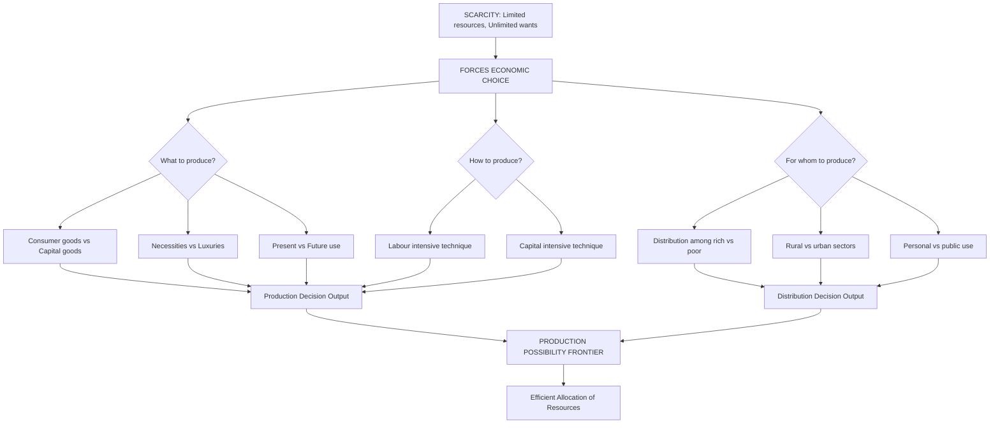
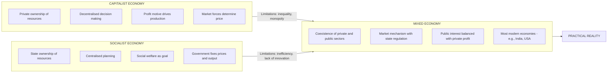
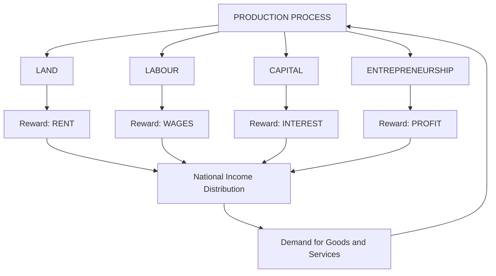
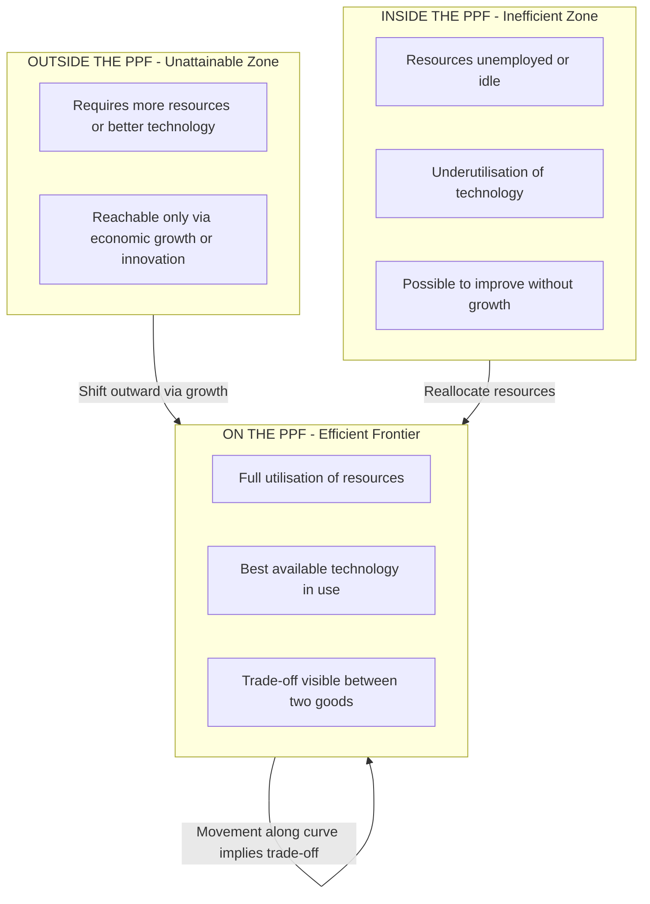

# Basic economic problems

<!-- SECTION_1_START -->
# Module 1: Basic Economic Problems

## 1.1 Economics — The Queen of Social Sciences

> [!IMPORTANT]
> **Formal Definition (KTU 2024 Syllabus Standard):** Economics is the science that studies human behaviour as a relationship between **ends** (wants) and **scarce means** (limited resources) which have alternative uses. — *Lionel Robbins (1935)*

This is the most accepted modern definition used in KTU board examinations. Two earlier, yet historically important, definitions are:

- **Adam Smith (1776):** "Economics is the science of wealth." (Wealth Definition)
- **Alfred Marshall (1890):** "Economics is a study of mankind in the ordinary business of life." (Welfare Definition)

> [!NOTE]
> The **Robbins definition** is universally cited in KTU 2024 scheme question papers as the standard working definition of Economics.

### 1.1.1 The Three Pillars of the Robbins Definition

1. **Scarcity** of means (resources are finite)
2. **Alternative uses** of means (resources can serve multiple purposes)
3. **Ends** (human wants are unlimited)

If any one of these three pillars collapses, the economic problem ceases to exist.

---

## 1.2 The Fundamental Economic Problem: **Scarcity**

> [!IMPORTANT]
> **Scarcity** is the central economic problem. It is the condition in which **available resources** are insufficient to satisfy all human **wants**.

### Conceptual Analogy (The Student-24-Hours Analogy)

Imagine you are a B.Tech student. You have **24 hours per day** (your limited resource, *time*). However, you want to:

- Attend classes (6 hrs)
- Study for exams (5 hrs)
- Complete a project (4 hrs)
- Sleep (8 hrs)
- Play, exercise, social media (10+ hrs)

Total demand for your time = **27+ hours**, but the supply is fixed at **24 hours**. Hence, you are forced to **choose** what to do and what to sacrifice. This is exactly what **scarcity** does to an economy: it forces **choice**.

| Concept | Real-world meaning (Analogy) | Economy-wide meaning |
|---|---|---|
| **Scarcity** | 24 hrs/day not enough | Resources \< Wants |
| **Choice** | Sleep or study? | What to produce? |
| **Opportunity Cost** | Sleep sacrificed to study | Next-best alternative foregone |
| **PPF** | A schedule of how you split 24 hrs | A schedule of output combinations |

> [!NOTE]
> **KTU Examiner Insight:** A common pitfall is to write "lack of resources" as the definition of scarcity. The **correct** wording is the *insufficiency of resources to satisfy all wants*, not the absolute lack of resources.

---

## 1.3 Core Terminology for Module 1

| Term | Working Definition (Board Standard) |
|---|---|
| **Want** | A desire backed by willingness and ability to acquire. |
| **Good** | A tangible object (rice, car, pen) that satisfies a want. |
| **Service** | An intangible activity (teaching, transport) that satisfies a want. |
| **Utility** | The satisfaction or benefit a consumer derives from a good/service. |
| **Value** | The worth of a good in terms of another good (use value vs. exchange value). |
| **Price** | The value of a good expressed in monetary terms. |
| **Wealth** | Stock of economic goods (resources, capital, assets) at a point in time. |
| **Capital** | A produced means of production (machinery, tools) used to make other goods. |
| **Income** | A flow of earnings per unit of time (salary, rent, interest, profit). |

> [!TIP]
> Remember: **Wealth = Stock; Income = Flow**. A student who answers "wealth per year" instead of "wealth at a point of time" will lose 1 mark instantly.

---

## 1.4 Geometric Intuition — The Production Possibility Frontier (PPF)

A **PPF (Production Possibility Frontier)**, also called **PPC (Production Possibility Curve)** or **Transformation Curve**, is the locus of all *technically efficient* combinations of two goods that an economy can produce using **all** its available resources and **best available technology**.

> [!VISUALIZATION CONTROL]
> **Concept:** Concave (bowed-out) Production Possibility Frontier showing increasing opportunity cost.
> **GeoGebra / Desmos Input Equations:**
> * `f(x) = \sqrt{1600 - x^2}`  → Smooth concave PPF (Food on X-axis, Cloth on Y-axis, max Food = 40, max Cloth = 40)
> * `g(x) = 40 - x`  → Straight-line PPF (constant opportunity cost — rare in reality)
> * `h(x) = 40 - \frac{x^2}{40}`  → Quadratic approximation often used in textbooks
> **Visual Description:** The student should observe a curve starting at the Y-axis (40 units of Cloth, 0 Food) and ending on the X-axis (40 units of Food, 0 Cloth). Any point *on* the curve is efficient; *inside* is inefficient (unemployment of resources); *outside* is unattainable with current resources.
<!-- SECTION_1_END -->

<!-- SECTION_2_START -->
# 2. Deep Theoretical Analysis

## 2.1 The **Central Problems** of Every Economy (KTU High-Yield Block)

Every economic system, regardless of its type, must answer **three fundamental questions**. This is one of the highest-weightage topics in KTU Module 1.

### 🔹 Problem 1 — **What to Produce?**

- **Decision:** Which goods and in what **quantities**?
- **Choice domain:** Consumer goods (rice, clothes) **vs.** Capital goods (machines, factories).
- **Sub-issues:**
  * Civilian goods vs. Defence goods
  * Necessities vs. Luxuries
  * Present consumption vs. Future consumption (savings)

### 🔹 Problem 2 — **How to Produce?**

- **Decision:** Which **technique** of production to adopt?
- **Choice domain:** Labour-intensive techniques **vs.** Capital-intensive techniques.
- A country with abundant labour (e.g., India) often uses labour-intensive methods; a capital-rich country (e.g., Japan) uses capital-intensive methods.

### 🔹 Problem 3 — **For Whom to Produce?**

- **Decision:** Who gets the produced goods?
- **Choice domain:** Distribution of income between **rich and poor**, **rural and urban**, **labour and capital owners**.

### 🔹 Bonus Problem 4 — Provision for **Economic Growth**

- **Decision:** How to expand productive capacity over time?
- Achieved via **investment in capital goods**, technological progress, and skill enhancement.

> [!NOTE]
> KTU question banks frequently ask: *"Explain the central problems of an economy."* The model answer must list all four problems in the order above with at least one example for each.

---

## 2.2 **Opportunity Cost** — The True Cost of a Choice

> [!IMPORTANT]
> **Opportunity Cost** is the value of the *next-best alternative foregone* when a choice is made. It is the cost of the *road not taken*.

### Formula

$$OC_n = \frac{\Delta \text{Quantity of Good Sacrificed}}{\Delta \text{Quantity of Good Gained}}$$

where $OC_n$ is the opportunity cost of producing one more unit of good $n$.

### Marginal Rate of Transformation (MRT)

The **MRT** of Good X for Good Y is the amount of Y that must be sacrificed to gain **one additional unit of X**.

$$MRT_{XY} = -\frac{\Delta Y}{\Delta X} = \text{Slope of the PPF at that point}$$

The **absolute slope** of the PPF at any point gives the **opportunity cost of X in terms of Y**.

---

## 2.3 KTU High-Yield Formula Sheet (Module 1)

| Formula / Concept | Equation / Form | Application / Units |
|---|---|---|
| Opportunity Cost (per unit) | $OC_X = \dfrac{\Delta Y}{\Delta X}$ | Always a positive ratio of quantities |
| Marginal Rate of Transformation | $MRT_{XY} = \left\vert \dfrac{\Delta Y}{\Delta X} \right\vert$ | Slope magnitude of PPF |
| Allocative Efficiency | $\dfrac{MU_X}{P_X} = \dfrac{MU_Y}{P_Y}$ | At consumer optimum (Module 2 pre-read) |
| PPF (constant OC) | $Y = a - bX$ | Straight line; $b$ = opportunity cost of $X$ |
| PPF (increasing OC) | $Y = a - bX - cX^2$ | Concave curve; OC rises as $X \uparrow$ |
| Production efficiency | Point lies **on** the PPF | Full utilisation of resources |
| Unemployment / inefficiency | Point lies **inside** the PPF | Resources idle or misallocated |
| Unattainable combination | Point lies **outside** the PPF | Needs more resources/tech |
| Economic growth | Outward **shift** of the PPF | More resources or better technology |
| Economic decline | Inward **shift** of the PPF | Resource loss or regression |

> [!TIP]
> **Critical mark-board note:** In KTU answer sheets, the phrase *"opportunity cost is the value of the next-best alternative foregone"* is mandatory. Leaving out the word **next-best** leads to 1-mark deduction in valuation.

---

## 2.4 Real-World Utility for Engineers

Understanding basic economic problems is **not academic** — it directly informs engineering decisions:

| Engineering Scenario | Economic Problem Applied |
|---|---|
| Choosing components for a circuit | **What to produce?** (premium vs. cheap parts) |
| Selecting CNC machine over manual lathe | **How to produce?** (capital-intensive) |
| Pricing a product in the market | **For whom to produce?** (target segment) |
| R\&D investment in new tech | **Economic growth** (outward PPF shift) |
| Project cost-benefit analysis | **Opportunity cost** of capital employed |

> [!IMPORTANT]
> A 2024 KTU board question explicitly asked: *"How are the basic economic problems relevant to an engineering manager?"* The expected answer must link **scarcity** to *budget constraints*, **choice** to *design alternatives*, and **opportunity cost** to *foregone interest on invested capital*.
<!-- SECTION_2_END -->

<!-- SECTION_3_START -->
# 3. Step-by-Step Derivations & Numerical Implementation

## 3.1 Numerical Worked Example — Building the PPF from Data

> **Problem Statement (KTU-Style):**
> A hypothetical economy produces only two goods — *Food (F)* and *Cloth (C)* — using all its resources and the best available technology. The maximum possible output combinations are:

| Combination | Food (F) | Cloth (C) |
|---|---|---|
| A | 0 | 40 |
| B | 10 | 36 |
| C | 20 | 28 |
| D | 30 | 16 |
| E | 40 | 0 |

> **Required:** (i) Draw the PPF. (ii) Calculate opportunity cost of Food at each step. (iii) Comment on the shape.

### Step 1 — Plot the Schedule

We treat Food on the X-axis and Cloth on the Y-axis. The five combinations form the boundary of the production possibility set.

### Step 2 — Compute Opportunity Cost of Food (Moving A → E)

- **A → B:** $\Delta F = 10$, $\Delta C = 36 - 40 = -4$

$$OC_F^{(A \to B)} = \frac{4}{10} = 0.4 \text{ units of Cloth per unit of Food}$$

- **B → C:** $\Delta F = 10$, $\Delta C = 28 - 36 = -8$

$$OC_F^{(B \to C)} = \frac{8}{10} = 0.8 \text{ units of Cloth per unit of Food}$$

- **C → D:** $\Delta F = 10$, $\Delta C = 16 - 28 = -12$

$$OC_F^{(C \to D)} = \frac{12}{10} = 1.2 \text{ units of Cloth per unit of Food}$$

- **D → E:** $\Delta F = 10$, $\Delta C = 0 - 16 = -16$

$$OC_F^{(D \to E)} = \frac{16}{10} = 1.6 \text{ units of Cloth per unit of Food}$$

### Step 3 — Tabulated Summary

| Movement | $\Delta F$ (Gained) | $\Delta C$ (Sacrificed) | Opportunity Cost of 1 F |
|---|---|---|---|
| A → B | 10 | 4 | **0.4 C** |
| B → C | 10 | 8 | **0.8 C** |
| C → D | 10 | 12 | **1.2 C** |
| D → E | 10 | 16 | **1.6 C** |

### Step 4 — Interpretation

The opportunity cost is **rising** as we produce more Food. This is the **Law of Increasing Opportunity Cost**, which causes the PPF to be **concave (bowed outward) from the origin**.

> [!NOTE]
> **Economic Reasoning:** Resources are not perfectly adaptable between the production of Food and Cloth. As we push more resources into Food, we must pull in resources that are progressively *less* suitable for Food production, sacrificing more and more Cloth per additional unit of Food.

### Step 5 — Identify Efficiency Zones

| Point Location | Meaning | Real-world Example |
|---|---|---|
| On the PPF (B, C, D) | Efficient — full employment | A factory running at 100% capacity |
| Inside the PPF | Inefficient — unemployment | A factory running at 50% capacity |
| Outside the PPF | Unattainable (with current resources) | Output beyond current technological capacity |

---

## 3.2 Algebraic Derivation of the PPF Equation (Increasing OC case)

We fit a quadratic to the schedule since OC is increasing:

$$C = a - bF - cF^2$$

Using boundary conditions $F=0 \Rightarrow C=40$ and $F=40 \Rightarrow C=0$:

- From $F=0$: $a = 40$
- From $F=40$: $0 = 40 - 40b - 1600c \Rightarrow 40b + 1600c = 40$

Using one interior point, say $(F, C) = (20, 28)$:

$$28 = 40 - 20b - 400c \Rightarrow 20b + 400c = 12$$

Dividing by 4: $5b + 100c = 3$. Combined with $40b + 1600c = 40 \Rightarrow b + 40c = 1$:

$$\begin{aligned}
5b + 100c &= 3 \\
b + 40c &= 1 \quad \Rightarrow \quad b = 1 - 40c
\end{aligned}$$

Substituting:

$$5(1 - 40c) + 100c = 3 \Rightarrow 5 - 200c + 100c = 3 \Rightarrow -100c = -2 \Rightarrow c = 0.02$$

Then $b = 1 - 40(0.02) = 1 - 0.8 = 0.2$.

$$\boxed{C = 40 - 0.2F - 0.02F^2}$$

**Verification (F = 30):** $C = 40 - 6 - 18 = 16$ ✓

Slope of the PPF (MRT):

$$\frac{dC}{dF} = -0.2 - 0.04F$$

At $F = 0$, $\vert MRT \vert = 0.2$. At $F = 40$, $\vert MRT \vert = 0.2 + 1.6 = 1.8$.

The MRT rises from **0.2 to 1.8** as we move along the PPF — confirming the **Law of Increasing Opportunity Cost**.

---

## 3.3 Shifts in the PPF — Economic Growth & Decline

> [!IMPORTANT]
> The PPF is not static; it shifts due to changes in resources or technology.

| Cause | Shift Direction | Economic Meaning |
|---|---|---|
| Increase in labour force | Outward (parallel) | Economic growth |
| Technological progress | Outward (biased) | Higher output per unit input |
| Natural disaster (e.g., flood) | Inward | Resource destruction |
| War / capital destruction | Inward | Production capacity loss |
| Discovery of oil / mineral | Outward | New resource endowment |
| Better education / training | Outward | Human capital improvement |

**Biased shift:** A technology that helps only Food production shifts the PPF outward more on the Food axis. A general-purpose technology shifts it outward uniformly.

---

## 3.4 Symbolic / Python Implementation — PPF Plotter

```python
import numpy as np
import matplotlib.pyplot as plt

# --- Step 1: Define the PPF data ---
food = np.array([0, 10, 20, 30, 40], dtype=float)
cloth = np.array([40, 36, 28, 16, 0], dtype=float)

# --- Step 2: Fit a quadratic PPF ---
# C = a - b*F - c*F^2
coeffs = np.polyfit(food, cloth, 2)   # [c, b, a] for descending powers
c_coeff, b_coeff, a_coeff = coeffs
print(f"PPF equation: C = {a_coeff:.2f} - {b_coeff:.3f}*F - {c_coeff:.4f}*F^2")

# --- Step 3: Generate smooth curve ---
f_smooth = np.linspace(0, 40, 200)
c_smooth = a_coeff - b_coeff * f_smooth - c_coeff * f_smooth**2

# --- Step 4: Plot ---
plt.figure(figsize=(9, 6))
plt.plot(f_smooth, c_smooth, label="PPF (concave)", color="navy", linewidth=2)
plt.scatter(food, cloth, color="red", zorder=5, label="Given data points")
plt.fill_between(f_smooth, 0, c_smooth, alpha=0.10, color="green",
                 label="Attainable region (efficient if on boundary)")

# --- Step 5: Annotate three sample points ---
plt.scatter(15, 32, color="orange", s=120, marker="s", label="Inside (inefficient)")
plt.scatter(20, 28, color="green", s=120, marker="*", label="On PPF (efficient)")
plt.scatter(45, 20, color="purple", s=120, marker="^", label="Outside (unattainable)")

plt.xlabel("Food (F) →", fontsize=12)
plt.ylabel("Cloth (C) →", fontsize=12)
plt.title("Production Possibility Frontier — KTU Module 1", fontsize=13)
plt.grid(True, linestyle="--", alpha=0.6)
plt.legend(loc="upper right")
plt.xlim(0, 50)
plt.ylim(0, 50)
plt.show()
```

**Expected Console Output (PPF equation line):**

$$C = 40.00 - 0.200 \cdot F - 0.0200 \cdot F^2$$

This Python script lets students *visualise* the inequation between attainable, efficient, and unattainable zones — a frequent KTU 3-mark drawing question.
<!-- SECTION_3_END -->

<!-- SECTION_4_START -->
# 4. Structural Diagrams & Schematics

## 4.1 Central Economic Problems — Decision Hierarchy



## 4.2 Types of Economic Systems — Comparison Topology



## 4.3 Factors of Production — Functional Flow



## 4.4 PPF Conceptual Block Diagram (Visual Fallback for Curve)

Since Mermaid cannot natively render a smooth concave curve, the following block architecture represents the conceptual zones of a PPF:



> [!TIP]
> In KTU answer sheets, always draw the PPF as a **concave curve from the Y-axis to the X-axis**, label the two goods on the axes, mark at least one *inside* point and one *outside* point, and label the *on-the-curve* points. This single drawing can fetch up to 3–4 marks in 14-mark questions.
<!-- SECTION_4_END -->

<!-- SECTION_5_START -->
# 5. KTU 2024 Scheme Examination Question Bank

## 📘 Part A — Short Answer Questions (2 × 3 = 6 Marks)

> **[KTU University Exam — July 2024 Style]**

### Q1. Define Economics according to Lionel Robbins. Why is scarcity considered the basic economic problem? [3 Marks] **[CO1, Remember]**

**Model Answer:**

> Economics, according to **Lionel Robbins (1935)**, is *"the science which studies human behaviour as a relationship between ends and scarce means which have alternative uses."*
>
> Scarcity is the basic economic problem because human **wants are unlimited** while the **resources available** to satisfy them are **finite**. [1 Mark]
>
> This gap between unlimited wants and limited resources forces every economy to make three fundamental choices — *what*, *how*, and *for whom* to produce. [1 Mark]
>
> If scarcity did not exist, the entire discipline of economics would have no subject matter. Hence, scarcity is the very foundation of economic theory. [1 Mark]

> [!WARNING]
> **Valuation Pitfall:** Writing only "Economics is the study of wealth" (Marshall's old definition) will fetch **partial credit only**. The Robbins definition is the **board-prescribed** definition in KTU 2024 scheme. Always mention the year **(1935)** for full credit.

---

### Q2. What is a Production Possibility Curve? Why is it concave to the origin? [3 Marks] **[CO1, Understand]**

**Model Answer:**

> A **Production Possibility Curve (PPC)** or **Production Possibility Frontier (PPF)** is the locus of all combinations of two goods that an economy can produce when its **resources are fully employed** and the **best available technology** is used. [1 Mark — Defining the PPF]
>
> It is concave to the origin because of the **Law of Increasing Opportunity Cost**. [1 Mark — Stating the law]
>
> As more units of one good are produced, resources less suited to its production must be transferred from the other good, causing a **rising sacrifice** per additional unit. [1 Mark — Economic reasoning]

---

## 📕 Part B — Descriptive Questions (Internal Choice, 1 × 14 = 14 Marks)

> **[KTU University Exam — Model Paper Pattern, Dec 2024]**

### ✅ Question A — 14 Marks

#### (a) Explain the **Central Problems of an Economy**. [7 Marks] **[CO1, Understand]**

**Model Answer:**

Every economic system, irrespective of being capitalist, socialist, or mixed, must answer three fundamental questions:

1. **What to Produce?** [1 Mark]
   The economy must decide which goods are to be produced and in what quantities. The choice is between **consumer goods** (rice, clothes) and **capital goods** (machinery, factories). It also involves a choice between **necessities and luxuries** and between **present consumption and future consumption** (savings and investment).

2. **How to Produce?** [2 Marks]
   Once the goods are decided, the technique of production must be chosen. The two principal techniques are:
   - **Labour-intensive:** High use of human effort, suitable for labour-abundant economies (e.g., India).
   - **Capital-intensive:** High use of machinery, suitable for capital-rich economies (e.g., Japan, Germany).
   The choice depends on the relative prices of labour and capital and on the country's resource endowment.

3. **For Whom to Produce?** [2 Marks]
   The produced goods must be distributed among the members of society. The distribution question addresses:
   - How much goes to the **rich vs. the poor**?
   - How much goes to **rural vs. urban** sectors?
   - What share goes to **labour (wages)** vs. **capital owners (profit/interest)**?
   The answer depends on the country's economic system — market economies distribute via purchasing power, while planned economies use administrative rationing.

4. **Provision for Economic Growth** [2 Marks]
   Beyond the three classical problems, modern economies must decide on the rate at which productive capacity should grow. This requires allocating a portion of current output to **capital formation** (building new factories, infrastructure, R\&D) so that future PPFs shift outward.

> [!NOTE]
> A diagrammatic representation of the **Production Possibility Frontier** with arrows linking each problem to a point on the curve earns **1 additional mark** in board valuation.

#### (b) The following PPF schedule is given for an economy producing **Machines (M)** and **Wheat (W)**. [7 Marks] **[CO2, Apply]**

| Combination | Machines (M) | Wheat (W) |
|---|---|---|
| P1 | 0 | 150 |
| P2 | 1 | 142 |
| P3 | 2 | 126 |
| P4 | 3 | 100 |
| P5 | 4 | 60 |
| P6 | 5 | 0 |

> **Required:** (i) Draw the PPF. (ii) Calculate opportunity cost of each additional machine. (iii) Comment on the shape of the curve. (iv) If the economy is currently producing 2 machines and 100 wheat, is it efficient? Justify.

**Model Solution:**

**(i) PPF Diagram:** [2 Marks]
Plot Machines on the X-axis and Wheat on the Y-axis. Join the six points with a smooth concave curve from (0, 150) to (5, 0).

**(ii) Opportunity Cost Calculation:** [3 Marks]

| Movement | $\Delta M$ | $\Delta W$ Sacrificed | OC of 1 Machine |
|---|---|---|---|
| P1 → P2 | 1 | 8 | 8 W |
| P2 → P3 | 1 | 16 | 16 W |
| P3 → P4 | 1 | 26 | 26 W |
| P4 → P5 | 1 | 40 | 40 W |
| P5 → P6 | 1 | 60 | 60 W |

General formula used:

$$OC_M = \frac{W_{\text{before}} - W_{\text{after}}}{M_{\text{after}} - M_{\text{before}}}$$

**(iii) Comment on shape:** [1 Mark]
The opportunity cost **rises progressively** (8 → 16 → 26 → 40 → 60). The PPF is therefore **concave to the origin**, illustrating the **Law of Increasing Opportunity Cost** due to resource specificity.

**(iv) Efficiency Check:** [1 Mark]
Point (M = 2, W = 100) lies **inside** the PPF (since the on-curve value at M = 2 is W = 126). Therefore, the economy is **inefficient**, and resources are either unemployed or misallocated. The economy can produce more wheat *without* sacrificing any machine.

> [!WARNING]
> **Valuation Pitfall:** Do not simply state "OC = 8" without showing the calculation. The valuation key explicitly checks for the **table of opportunity costs**. Also, the answer to part (iv) must mention *inside the PPF* — saying merely "inefficient" without geometric reference loses 0.5 marks.

---

### ✅ Question B — 14 Marks (Alternative)

#### (a) Compare the **Capitalist, Socialist, and Mixed** economic systems. [7 Marks] **[CO1, Understand]**

**Model Answer:**

| Feature | Capitalist Economy | Socialist Economy | Mixed Economy |
|---|---|---|---|
| **Ownership of resources** | Private individuals | State / Government | Both private and state |
| **Decision-making** | Decentralised (markets) | Centralised (planning) | Mixed (market + state) |
| **Motive of production** | Profit maximisation | Social welfare | Both |
| **Price determination** | Market forces (demand-supply) | Government fiat | Market with regulation |
| **Income distribution** | Unequal (function of market power) | More equitable (planned) | Moderate inequality |
| **Examples** | USA, Singapore (largely) | Cuba, North Korea | India, UK, France |
| **Strengths** | Innovation, efficiency, consumer choice | Equity, full employment | Balance of both |
| **Weaknesses** | Inequality, monopolies, externalities | Inefficiency, lack of innovation | Conflict between goals |

[1 Mark for each correctly filled row × 6 = 6 Marks; 1 Mark for the examples row with at least one valid country per system]

#### (b) Explain the **four factors of production** along with their respective rewards. Why is entrepreneurship considered the most special factor? [7 Marks] **[CO1, Understand + Apply]**

**Model Answer:**

The four factors of production are:

1. **Land** [1 Mark]
   All natural resources — soil, water, minerals, forests, sunlight. It is a *free gift of nature* but is scarce. Reward: **Rent**.

2. **Labour** [1 Mark]
   Human physical and mental effort used in production. Reward: **Wages (or Salary)**.

3. **Capital** [1 Mark]
   Man-made instruments of production — machinery, tools, buildings, raw materials. It is a *produced means of production*. Reward: **Interest**.

4. **Entrepreneurship** [1 Mark]
   The factor that organises the other three, takes risks, introduces innovations, and bears the uncertainty of profit/loss. Reward: **Profit**.

**Why entrepreneurship is the most special factor:** [3 Marks]

- It is the **organising force** that combines land, labour, and capital in the right proportion.
- It is the **risk-bearing** factor — the entrepreneur may earn profit or suffer loss.
- It is the **innovating** factor — the entrepreneur introduces new products, processes, and markets (a concept central to **Schumpeter's theory of economic development**).
- Without entrepreneurship, the other three factors remain idle and unproductive.

> [!WARNING]
> **Valuation Pitfall:** Many students write *"land and labour are the most important factors"*. While land and labour are foundational, the **board-preferred** answer highlights **entrepreneurship** as the most distinctive factor because it carries risk and drives innovation. Always support the answer with a named economist if possible (e.g., *Schumpeter, Knight, or Cantillon*).

---

## 🚨 KTU Examiner's Master Valuation Warning

> [!WARNING]
> **Top 5 ways students lose marks in Module 1 (Basic Economic Problems):**
> 1. **Forgetting to state the year of Robbins' definition** (1935). This costs 0.5 marks.
> 2. **Confusing *wealth* (stock) with *income* (flow)**. Always state the time reference.
> 3. **Drawing a straight-line PPF** instead of concave. The default in textbooks is concave (increasing OC).
> 4. **Opp. Cost = "the cost of what is sacrificed"** — WRONG. It is the cost of the *next-best alternative foregone*. Missing "next-best" loses 1 mark.
> 5. **Listing factors of production without rewards** (rent, wages, interest, profit). Each factor-reward pair is a must for full credit.

---

## ✅ Topic Recap & Important Things to Remember

- **Robbins' Definition (1935):** Economics is the science of ends and scarce means with alternative uses.
- **Three pillars** of Robbins' definition: *Scarcity*, *Alternative uses*, *Unlimited wants*.
- **Scarcity** = unlimited wants vs. limited resources; it is the **root cause** of all economic problems.
- **Central problems:** *What*, *How*, *For Whom* to produce + provision for **economic growth**.
- **Opportunity Cost** = value of the **next-best alternative foregone** (never the absolute sacrifice).
- **PPF/PPC** = boundary of maximum possible production; concave due to **Law of Increasing Opportunity Cost**.
- **On PPF** = efficient; **Inside** = inefficient (unemployment); **Outside** = unattainable (needs growth).
- **Outward shift** of PPF = economic growth; **Inward shift** = decline.
- **MRT** = absolute slope of PPF = opportunity cost of one good in terms of another.
- **Types of economic systems:** Capitalist (private), Socialist (state), Mixed (hybrid).
- **Factors of production & rewards:** Land → Rent; Labour → Wages; Capital → Interest; Entrepreneurship → Profit.
- **Stock vs. Flow:** Wealth is a *stock*; Income is a *flow*.
- **For Engineers:** Scarcity → budget constraints; Choice → design alternatives; Opportunity Cost → foregone return on capital.
- **Mnemonic for central problems:** **WHF + G** — *What*, *How*, *For whom*, plus *Growth*.
- **Mnemonic for factors:** **LLCE** — *Land, Labour, Capital, Entrepreneurship* with rewards **R, W, I, P** (Rent, Wages, Interest, Profit).
<!-- SECTION_5_END -->
