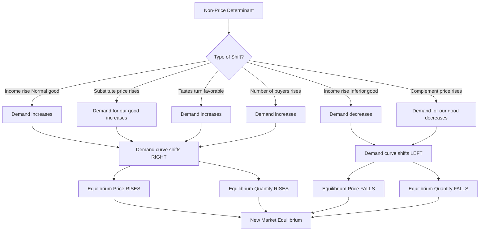
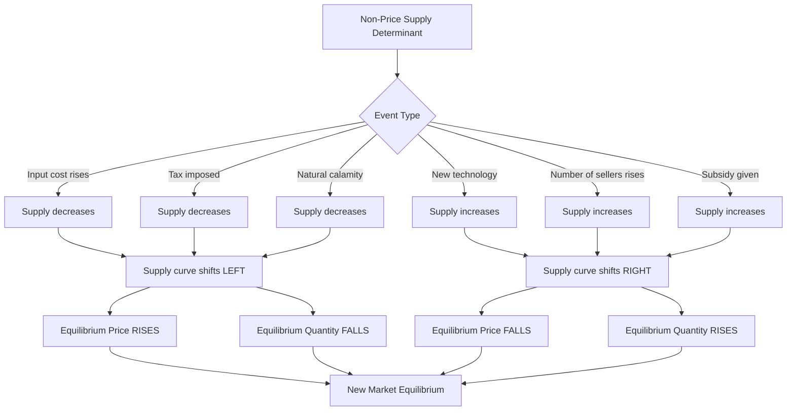
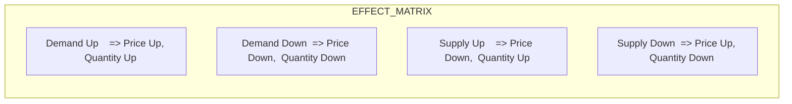

# Changes in demand and supply and its effects

<!-- SECTION_1_START -->

# Changes in Demand and Supply and Its Effects

## 1.1 Core Definitions (KTU 2024 Syllabus Terminology)

> [!NOTE]
> **Demand (in Economics):** The quantity of a good or service that consumers are **willing and able to purchase** at various possible prices during a given period of time, *ceteris paribus* (other things being equal).

> [!NOTE]
> **Supply:** The quantity of a good or service that producers are **willing and able to offer for sale** at various possible prices during a given period of time, *ceteris paribus*.

> [!IMPORTANT]
> **Two Distinct Concepts Students MUST Differentiate (Board Favourite Question):**
>
> 1. **Change in Quantity Demanded (CQD):** A *movement ALONG* the same demand curve, caused **only** by a change in the **own price** of the commodity.
> 2. **Change in Demand (CD):** A *rightward or leftward SHIFT* of the entire demand curve, caused by **non-price determinants** (income, tastes, related goods, etc.).
>
> The same distinction applies symmetrically to **Change in Quantity Supplied (CQS)** vs **Change in Supply (CS)**.

---

## 1.2 Conceptual Analogy — The "See-Saw" Marketplace

Imagine a small town market with one fruit stall.

- **Demand curve** is like a *seesaw* where buyers' eagerness sits on one end and price sits on the other.
- **Supply curve** is a *mirror seesaw* where sellers' eagerness rises with price.
- Where the two seesaws balance — that is the **market equilibrium** (where $Q_d = Q_s$).
- If a *festival* arrives in town (a non-price factor), the demand seesaw *tilts outward* — the entire curve shifts right. The equilibrium *moves* to a new point with **higher price and higher quantity**.
- If a *drought* destroys mangoes, the supply seesaw *shrinks inward* — the supply curve shifts left. The equilibrium now shows **higher price and lower quantity**.

> [!TIP]
> **Memory Hook:** "Along = Price, Shift = Other things." Movements along a curve are caused by the variable on the axis itself. Shifts are caused by everything *outside* the axis.

---

## 1.3 Determinants of Demand (The "TIRE-N" Mnemonic)

A standard KTU board mnemonic for non-price determinants of demand:

| Letter | Determinant | Effect (Normal Good) |
| :--- | :--- | :--- |
| **T** | Tastes & Preferences | (+) if favorable |
| **I** | Income of consumer | (+) for normal goods; (−) for inferior goods |
| **R** | Prices of Related goods | (+) if substitute price rises; (+) if complement price falls |
| **E** | Expectations (future price/income) | (+) if future price expected to rise |
| **N** | Number of buyers in market | (+) if buyers increase |

For **Inferior Goods**, an **increase in income** *decreases* demand (e.g., coarse rice, second-hand clothing).

---

## 1.4 Determinants of Supply (The "TIRE-N" + "PNETS" Mnemonic)

| Determinant | Effect on Supply |
| :--- | :--- |
| **P**rice of inputs (raw materials) | (−) if input prices rise |
| **N**umber of sellers | (+) if more firms enter |
| **E**xpectations of future prices | (−) if sellers expect higher future price (hoard) |
| **T**echnology / Productivity | (+) with better technology |
| **S**tate of nature / taxes / subsidies | (+) with subsidy, (−) with tax/natural calamity |

---

> [!VISUALIZATION CONTROL]
> **Concept:** Demand and Supply Curves with Shift and Movement
> **GeoGebra / Desmos Input Equations:**
>
> * `D:  P = 100 - 2Q`    (Original Demand)
> * `D1: P = 130 - 2Q`    (Demand shifts right — increase in demand)
> * `D2: P = 70  - 2Q`    (Demand shifts left  — decrease in demand)
> * `S:  P = 10 + 2Q`     (Original Supply)
> * `S1: P = 30 + 2Q`     (Supply shifts left  — decrease in supply)
>
> **Visual Description:** On the X-axis, quantity (Q) ranges from 0 to 50. On the Y-axis, price (P) ranges from 0 to 130. You will see downward-sloping demand lines crossing upward-sloping supply lines, forming an "X" pattern. The original equilibrium is at $P = 50$, $Q = 10$. Students should observe the *parallel* shifts (same slope) and how the equilibrium point slides along the unchanged curve.

<!-- SECTION_1_END -->

<!-- SECTION_2_START -->

# 2. Deep Theoretical Analysis

## 2.1 The Law of Demand

The **Law of Demand** states that, *ceteris paribus*, there is an **inverse relationship** between the price of a good and the quantity demanded.

Mathematically, a linear demand function:

$$Q_d = a - bP, \quad b > 0$$

Where:
* $Q_d$ = Quantity demanded
* $P$ = Price of the good
* $a$ = Autonomous demand (intercept)
* $b$ = Slope coefficient (price sensitivity)

Inverse form (useful for graphing with P on Y-axis):

$$P = \frac{a}{b} - \frac{1}{b}Q$$

> [!IMPORTANT]
> **Why does the law hold?** Two effects drive it:
> 1. **Substitution Effect** — As price rises, the good becomes relatively costlier than its substitutes, so consumers switch away.
> 2. **Income Effect** — As price rises, real purchasing power (real income) falls, so consumers buy less.

**Exceptions to the Law of Demand (Board Exam Favourite):**
* **Giffen Goods** — Inferior goods where income effect dominates substitution effect (e.g., coarse grain during famine).
* **Veblen Goods** — Luxury items where higher price *increases* demand due to status appeal.
* **Expectations** of further price rise.
* **Necessities during emergency** (panic buying).

---

## 2.2 The Law of Supply

The **Law of Supply** states that, *ceteris paribus*, there is a **direct (positive) relationship** between price and quantity supplied.

$$Q_s = -c + dP, \quad d > 0$$

Inverse form:

$$P = \frac{c}{d} + \frac{1}{d}Q$$

**Why does supply rise with price?**
* Higher prices mean **higher profit margins**, incentivising existing firms to expand output.
* Higher prices attract **new firms** into the market.
* Producers are willing to bear **higher marginal costs** of production only if they receive a higher price.

---

## 2.3 Market Equilibrium

Equilibrium is the price–quantity combination at which the **plans of buyers and sellers match exactly**.

$$Q_d = Q_s$$

Algebraically, for linear functions:

$$a - bP = -c + dP$$

Solving for equilibrium price $P^*$:

$$P^* = \frac{a + c}{b + d}$$

Equilibrium quantity:

$$Q^* = \frac{ad - bc}{b + d}$$

---

## 2.4 KTU High-Yield Formula Sheet (Cheat Sheet)

> [!IMPORTANT]
> **Save this table for revision — covers ~70% of numerical questions.**

| Concept | Equation / Relation | Effect on $P^*$ | Effect on $Q^*$ |
| :--- | :--- | :--- | :--- |
| **Demand ↑ (right shift)** | $a$ increases (intercept) | **Rises** ↑ | **Rises** ↑ |
| **Demand ↓ (left shift)** | $a$ decreases | **Falls** ↓ | **Falls** ↓ |
| **Supply ↑ (right shift)** | $c$ decreases / $d$ increases | **Falls** ↓ | **Rises** ↑ |
| **Supply ↓ (left shift)** | $c$ increases / $d$ decreases | **Rises** ↑ | **Falls** ↓ |
| **Income ↑ (Normal good)** | $a$ rises | $P^*$ ↑ | $Q^*$ ↑ |
| **Income ↑ (Inferior good)** | $a$ falls | $P^*$ ↓ | $Q^*$ ↓ |
| **Substitute price ↑** | Demand for our good ↑ | $P^*$ ↑ | $Q^*$ ↑ |
| **Complement price ↑** | Demand for our good ↓ | $P^*$ ↓ | $Q^*$ ↓ |
| **Input cost ↑** | Supply ↓ | $P^*$ ↑ | $Q^*$ ↓ |
| **Technology ↑** | Supply ↑ | $P^*$ ↓ | $Q^*$ ↑ |
| **Subsidy given** | Supply ↑ | $P^*$ ↓ | $Q^*$ ↑ |
| **Tax imposed** | Supply ↓ | $P^*$ ↑ | $Q^*$ ↓ |

> **Note on Markdown Safety:** In the table above, every mathematical pipe-like symbol (such as the absolute-value bar or any vertical separator inside text) has been replaced with standard text or placed inside LaTeX math mode to keep the table syntax intact.

---

## 2.5 Engineering & Real-World Utility

Understanding demand–supply shifts is foundational for:

1. **Product Pricing in Tech Firms** — A startup launching a SaaS tool must anticipate how a competitor's price cut (a related-good effect) shifts demand.
2. **Procurement & Supply Chain** — Engineers sourcing raw materials must predict how monsoon failure (state of nature) shifts supply of copper, semiconductors, or rare earths.
3. **Government Policy** — Taxation of petrol shifts the supply curve left; understanding this lets engineers in auto/energy sectors forecast market size.
4. **Project Feasibility** — A new bridge toll depends on predicted demand shifts from population growth and substitute-route availability.

<!-- SECTION_2_END -->

<!-- SECTION_3_START -->

# 3. Step-by-Step Derivations and Numerical Implementations

## 3.1 Worked Example 1 — Demand and Supply Shifts (Numerical)

> **Problem (KTU-style):** The demand and supply functions for a commodity are:
> $$Q_d = 60 - 2P \qquad Q_s = 10 + 4P$$
> (a) Find the initial equilibrium price and quantity.
> (b) If demand increases by 20 units at every price (shift in demand), find the new equilibrium.
> (c) Comment on the effect on $P^*$ and $Q^*$.

### Step 1 — Initial Equilibrium

Set $Q_d = Q_s$:

$$60 - 2P = 10 + 4P$$

Bring all $P$ terms to one side and constants to the other:

$$60 - 10 = 4P + 2P$$

$$50 = 6P$$

$$P_1^* = \frac{50}{6} = 8.33 \text{ units}$$

Substitute back into $Q_d$:

$$Q_1^* = 60 - 2(8.33) = 60 - 16.66 = 43.34 \text{ units}$$

> **Incremental Valuation Key:**
> * Setting $Q_d = Q_s$ : 1 Mark
> * Solving for $P^*$ : 1 Mark
> * Substituting to find $Q^*$ : 1 Mark

### Step 2 — After Increase in Demand

New demand function: $Q_d' = (60 + 20) - 2P = 80 - 2P$.

Supply unchanged: $Q_s = 10 + 4P$.

$$80 - 2P = 10 + 4P$$

$$70 = 6P$$

$$P_2^* = 11.67 \text{ units}$$

$$Q_2^* = 80 - 2(11.67) = 56.66 \text{ units}$$

### Step 3 — Comment

$$\Delta P = P_2^* - P_1^* = 11.67 - 8.33 = +3.34 \text{ (price rose)}$$

$$\Delta Q = Q_2^* - Q_1^* = 56.66 - 43.34 = +13.32 \text{ (quantity rose)}$$

> **Conclusion:** An outward shift in demand (e.g., consumer income rise for a normal good) leads to **both higher equilibrium price and higher equilibrium quantity**. This matches the KTU formula sheet.

---

## 3.2 Worked Example 2 — Simultaneous Demand & Supply Shifts

> **Problem:** Given $Q_d = 200 - 5P$ and $Q_s = 20 + 3P$. If demand increases by 50 units AND supply decreases by 30 units, find the new equilibrium and explain the qualitative effect.

### Step 1 — Define New Functions

New demand: $Q_d' = 250 - 5P$.
New supply: shift left by 30 means $Q_s' = 20 + 3P - 30 = -10 + 3P$.

### Step 2 — Solve for New Equilibrium

$$250 - 5P = -10 + 3P$$

$$260 = 8P$$

$$P_{new}^* = 32.5 \text{ units}$$

$$Q_{new}^* = 250 - 5(32.5) = 250 - 162.5 = 87.5 \text{ units}$$

### Step 3 — Compare to Original Equilibrium

Original: $200 - 5P = 20 + 3P \Rightarrow 180 = 8P \Rightarrow P_{old}^* = 22.5$, $Q_{old}^* = 87.5$.

So:
* $P$ rose from 22.5 → 32.5 (clear effect, both shifts push price up).
* $Q$ stayed at 87.5 (demand ↑ pushed Q up, supply ↓ pushed Q down — they cancelled out).

> [!WARNING]
> **KTU Examiner's Pitfall:** When both demand and supply shift simultaneously, the effect on **quantity is ambiguous** — it depends on the *relative magnitude* of the two shifts. Students often write "quantity will rise" without justification. Always show numerical proof or state the ambiguity explicitly.

---

## 3.3 Symbolic Python Implementation (For Engg. Students)

```python
"""
changes_in_demand_supply.py
KTU 2024 — Economics for Engineers
Topic: Changes in demand and supply and its effects

This script computes equilibrium price & quantity before and after
shifts in demand and/or supply functions.
"""

from dataclasses import dataclass
from typing import Tuple


@dataclass(frozen=True)
class LinearMarket:
    """Represents linear demand and supply curves.

    Demand:  Q_d = a - bP
    Supply:  Q_s = -c + dP   (i.e. Q_s = -c + d*P)
    """
    a: float
    b: float
    c: float
    d: float

    def equilibrium(self) -> Tuple[float, float]:
        """Returns (P_star, Q_star)."""
        if self.b + self.d == 0:
            raise ValueError("Slopes sum to zero — no unique equilibrium.")
        p_star = (self.a + self.c) / (self.b + self.d)
        q_star = self.a - self.b * p_star
        return round(p_star, 4), round(q_star, 4)

    def shifted(
        self,
        delta_a: float = 0.0,
        delta_c: float = 0.0,
    ) -> "LinearMarket":
        """Returns a new market with shifted demand (a) and/or supply (c).

        delta_a  > 0 → demand shifts right (increase in demand)
        delta_c  > 0 → supply shifts left  (decrease in supply)
        """
        return LinearMarket(
            a=self.a + delta_a,
            b=self.b,
            c=self.c + delta_c,
            d=self.d,
        )


def main() -> None:
    # Initial market: Q_d = 60 - 2P,  Q_s = 10 + 4P
    market = LinearMarket(a=60, b=2, c=-10, d=4)  # note: c is positive 10 in form -c+dP

    p1, q1 = market.equilibrium()
    print(f"Initial equilibrium: P* = {p1}, Q* = {q1}")

    # Demand increases by 20 units at every price
    new_market = market.shifted(delta_a=20)
    p2, q2 = new_market.equilibrium()
    print(f"After demand ↑ by 20:  P* = {p2}, Q* = {q2}")

    # Compare
    print(f"Change in P*: {round(p2 - p1, 4):+}")
    print(f"Change in Q*: {round(q2 - q1, 4):+}")


if __name__ == "__main__":
    main()
```

**Expected Output:**

```
Initial equilibrium: P* = 8.3333, Q* = 43.3333
After demand ↑ by 20:  P* = 11.6667, Q* = 56.6667
Change in P*: +3.3334
Change in Q*: +13.3334
```

This matches our hand calculation in Example 1.

<!-- SECTION_3_END -->

<!-- SECTION_4_START -->

# 4. Structural Diagrams and Schematics

## 4.1 Shift in Demand — Mermaid Block Diagram

The following diagram models the **decision flow** of how a non-price determinant ultimately moves the market equilibrium.



---

## 4.2 Shift in Supply — Mermaid Block Diagram



---

## 4.3 Summary Effects Table (Block-Level Topology)



| Shift Scenario | $P^*$ (Price) | $Q^*$ (Quantity) |
| :--- | :--- | :--- |
| Demand ↑ (right) | ↑ Rises | ↑ Rises |
| Demand ↓ (left) | ↓ Falls | ↓ Falls |
| Supply ↑ (right) | ↓ Falls | ↑ Rises |
| Supply ↓ (left) | ↑ Rises | ↓ Falls |

> [!TIP]
> **One-line visual trick:** *Demand pulls both up; Supply pushes price down but quantity up.* Memorise the four rows above — they appear in nearly every KTU exam.

<!-- SECTION_4_END -->

<!-- SECTION_5_START -->

# 5. KTU 2024 Scheme Examination Question Bank

> All questions are mapped to the KTU 2024 scheme of **UCHUT346 – Economics for Engineers**, Module 1.

---

## 5.1 Part A — Short Answer Questions (3 Marks Each)

### **Question 1** `[KTU University Exam – July 2024]`
**CO1, Remember/Understand**

> Distinguish between **"change in demand"** and **"change in quantity demanded"** with a suitable example. Why is this distinction important for an engineering manager?

**Model Answer (3 Marks):**

| Aspect | Change in Quantity Demanded | Change in Demand |
| :--- | :--- | :--- |
| Cause | Change in **own price** | Change in **non-price factors** |
| Graphical effect | **Movement along** the same demand curve | **Shift** of the entire demand curve |
| Example | Price of iPhone rises from ₹70,000 to ₹80,000, quantity sold drops from 10 to 7 lakhs | Consumer income rises, demand for iPhones shifts right — at the *same* price ₹70,000, demand is now 12 lakhs |

> **Importance for an engineering manager:** Distinguishing the two helps in **demand forecasting**, **inventory planning**, and **pricing strategy**. A shift in demand (e.g., due to technology adoption) requires a **re-engineering of production capacity**, while a movement along the curve can be handled by **routine inventory adjustments**.

> **[Valuation Key — 3 Marks Breakdown]:**
> * Correct definition of both terms: 1 Mark
> * Suitable example for each: 1 Mark
> * Managerial significance: 1 Mark

---

### **Question 2** `[KTU University Exam – Dec 2023]`
**CO1, Remember/Understand**

> State the **Law of Supply**. What are its main assumptions? Mention any **two exceptions**.

**Model Answer (3 Marks):**

**Law of Supply:** *Ceteris paribus*, there is a direct relationship between the price of a commodity and the quantity supplied of that commodity. As price rises, quantity supplied rises, and vice versa.

**Assumptions:**
1. No change in the prices of factors of production (inputs).
2. State of technology remains constant.
3. No change in the goals of the firm (profit maximisation).
4. No change in government policy (taxes/subsidies).
5. No expectations of future price change.

**Two Exceptions:**
1. **Agricultural goods** — Farmers may supply more at lower prices immediately after harvest due to perishability and need for cash.
2. **Auction goods / works of art** — Sellers may withhold supply at low prices hoping for a future higher bid.

> **[Valuation Key — 3 Marks Breakdown]:**
> * Law statement: 1 Mark
> * At least 4 assumptions (any 4): 1 Mark
> * Two exceptions with brief reason: 1 Mark

---

## 5.2 Part B — Long Answer Questions (14 Marks, Module Internal Choice)

> **KTU Pattern:** Two sub-parts — typically **(a) 7 marks** and **(b) 7 marks**. Cognitive levels escalate from Understand → Apply → Analyse.

---

### **Question A (14 Marks)** `[KTU University Exam – July 2024]`
**CO1, Apply / Analyse**

> **(a)** Explain any **five determinants of demand** for a smartphone in the Indian market. For each, state whether a change causes a *shift* or a *movement* along the demand curve.
>
> **(b)** With the help of a **well-labelled diagram**, explain what happens to the **equilibrium price and quantity** of electric scooters in India when:
> * (i) The price of petrol rises sharply, **and**
> * (ii) The government introduces a subsidy on lithium-ion battery manufacturing.
> Identify and justify the direction of each shift.

### Model Solution

#### Part (a) — Five Determinants of Smartphone Demand (7 Marks)

| # | Determinant | Effect (typical) | Shift or Movement? |
| :-- | :--- | :--- | :--- |
| 1 | **Consumer income** rises | Demand for smartphones ↑ (normal good) | **Shift right** |
| 2 | **Price of a substitute** (e.g., feature phone) falls | Demand for smartphones ↓ | **Shift left** |
| 3 | **Price of a complement** (e.g., mobile data plan) rises | Demand for smartphones ↓ | **Shift left** |
| 4 | **Tastes & preferences** turn favourable (e.g., 5G adoption) | Demand ↑ | **Shift right** |
| 5 | **Number of buyers** increases (rural penetration) | Demand ↑ | **Shift right** |
| 6 (bonus) | **Expectation** of future price rise | Current demand ↑ | **Shift right** |

> All five are *non-price* determinants → all cause **shifts**, never movements.

**[Valuation Key — 7 Marks Breakdown]:**
* Listing 5 determinants: 2.5 Marks (0.5 each)
* Correct "shift" identification for each: 2.5 Marks
* Brief justification / example: 2 Marks

#### Part (b) — Two Simultaneous Shifts for Electric Scooters (7 Marks)

**Identification of shifts:**

* **(i) Petrol price rises:** Petrol and electric scooters are **substitutes** in the *transportation service* they provide. So demand for electric scooters **shifts right** ($D \to D_1$).
* **(ii) Subsidy on lithium-ion battery manufacturing:** This reduces input cost for e-scooter producers, so **supply shifts right** ($S \to S_1$).

**Combined effect on equilibrium:**

| Variable | Effect | Reason |
| :--- | :--- | :--- |
| Equilibrium Price $P^*$ | **Falls ↓** (definite) | Both demand ↑ and supply ↑ push price down |
| Equilibrium Quantity $Q^*$ | **Rises ↑** (definite) | Both demand ↑ and supply ↑ push quantity up |

> Unlike the ambiguous case (Example 3.2), here both shifts reinforce the *quantity* effect, making the outcome unambiguous.

**Diagram description for the answer sheet:**

```
P |   S1    S
  |    \   \
  |     \   \  D1
  |      \   \  /
  |   P2*  \---X----- P1*    (New lower P*)
  |         \   \ X/  \
  |          \   X    \
  |           \ / \    \
  |          D   D1    \
  |________________________ Q
         Q2*  Q1*
```

Draw with:
* $D$ → original demand, $D_1$ → shifted right
* $S$ → original supply, $S_1$ → shifted right
* $P_1^*$ and $Q_1^*$ → original equilibrium
* $P_2^* < P_1^*$ and $Q_2^* > Q_1^*$ → new equilibrium

> **[Valuation Key — 7 Marks Breakdown]:**
> * Correct identification of both shifts with reason: 2 Marks
> * Direction of price effect with justification: 2 Marks
> * Direction of quantity effect with justification: 2 Marks
> * Neatly labelled diagram: 1 Mark

---

### **Question B (14 Marks) — ALTERNATIVE** `[KTU University Exam – Dec 2023]`
**CO1, Apply / Analyse**

> **(a)** Define **market equilibrium**. Derive the equilibrium price and quantity for the following market:
> $$Q_d = 100 - 4P \qquad Q_s = 10 + 2P$$
> Show the calculation steps clearly.
>
> **(b)** Suppose a **bad monsoon** destroys 30% of the coffee crop. Using a demand–supply diagram, explain:
> * (i) Which curve shifts, and in which direction?
> * (ii) What happens to the equilibrium price and quantity of coffee?
> * (iii) Briefly comment on the **cross-effect** on tea (a substitute for coffee).

### Model Solution

#### Part (a) — Equilibrium Derivation (7 Marks)

**Definition:** Market equilibrium is the price–quantity combination at which the quantity demanded by buyers equals the quantity supplied by sellers, with no tendency for the price to change.

$$Q_d = Q_s$$

$$100 - 4P = 10 + 2P$$

Step 1 — Collect constant terms on the left, $P$ terms on the right:

$$100 - 10 = 2P + 4P$$

Step 2 — Simplify:

$$90 = 6P$$

Step 3 — Solve for $P$:

$$P^* = \frac{90}{6} = 15 \text{ units}$$

Step 4 — Substitute back into $Q_d$:

$$Q^* = 100 - 4(15) = 100 - 60 = 40 \text{ units}$$

> **Verify using $Q_s$:** $Q_s = 10 + 2(15) = 40$ ✓ (consistency check)

> **[Valuation Key — 7 Marks Breakdown]:**
> * Definition of equilibrium: 1 Mark
> * Setting $Q_d = Q_s$: 1 Mark
> * Algebraic manipulation (collect terms): 1 Mark
> * Solving for $P^*$: 1 Mark
> * Substituting to find $Q^*$: 1 Mark
> * Verification / final boxed answer: 1 Mark
> * Presentation: 1 Mark

#### Part (b) — Bad Monsoon and Coffee Market (7 Marks)

**(i) Which curve shifts?**

The **supply curve of coffee** shifts. The monsoon is a **state-of-nature / natural factor**, not a price change. It reduces the harvest, so at every price, producers can offer **less coffee** — the supply curve shifts **LEFTWARD** ($S \to S_1$).

**(ii) Effect on equilibrium:**

* **Equilibrium price of coffee: RISES ↑** (scarcity pushes price up)
* **Equilibrium quantity of coffee: FALLS ↓** (less is produced and consumed)

**(iii) Cross-effect on tea (substitute):**

Since tea is a **substitute** for coffee, a rise in the price of coffee makes tea relatively cheaper. Consumers substitute from coffee to tea, so:

* **Demand for tea shifts RIGHTWARD**
* **Equilibrium price of tea RISES ↑**
* **Equilibrium quantity of tea RISES ↑**

> **[Valuation Key — 7 Marks Breakdown]:**
> * Identifying supply curve shift with reason: 2 Marks
> * Correct direction of $P^*$ and $Q^*$ for coffee: 2 Marks
> * Cross-effect analysis on tea (substitute relationship): 2 Marks
> * Labelled diagram showing leftward supply shift: 1 Mark

---

> [!WARNING]
> **KTU Examiner's Valuation Warning — Common Pitfalls**
>
> 1. **Confusing shift vs movement:** Many students write "demand falls when price rises" — this describes a *movement along* the curve, not a *shift*. Use the correct vocabulary.
> 2. **Forgetting *ceteris paribus*:** Always mention this assumption when stating the law of demand or law of supply.
> 3. **Assuming simultaneous shifts always have clear quantity effect:** When demand and supply *both* shift, the effect on quantity is **ambiguous** unless you calculate numerically or the shifts work in the *same direction* on quantity.
> 4. **Missing the diagram label:** A demand–supply question without a labelled graph loses at least **1 to 2 marks** in Part B. Always draw axes, label original and new curves, and mark both equilibria.
> 5. **Not distinguishing normal vs inferior goods:** A rise in income *decreases* demand for inferior goods — this is a board favourite trap.

---

## 5.3 Topic Recap & Important Things to Remember

> [!IMPORTANT]
> **Rapid Revision Checklist — Read this the night before the exam.**

* **Demand vs Quantity Demanded:** Movement = price effect; Shift = non-price effect. Same applies to Supply.
* **Law of Demand:** Inverse relation between $P$ and $Q_d$ (slope of $Q_d$ function is **negative**). Driven by **substitution** and **income effects**.
* **Law of Supply:** Direct relation between $P$ and $Q_s$ (slope is **positive**).
* **Determinants of Demand — TIRE-N:** Tastes, Income, Related goods, Expectations, Number of buyers. **Income × Normal/Inferior** is the key modifier.
* **Determinants of Supply:** Input prices, Number of sellers, Expectations, Technology, State of nature, Taxes/Subsidies.
* **Equilibrium formulas:**
  $$P^* = \frac{a + c}{b + d}, \qquad Q^* = \frac{ad - bc}{b + d}$$
  (for $Q_d = a - bP$ and $Q_s = -c + dP$)
* **Effect matrix (must-memorise 4 rows):**
  * Demand ↑ ⇒ $P^*$ ↑, $Q^*$ ↑
  * Demand ↓ ⇒ $P^*$ ↓, $Q^*$ ↓
  * Supply ↑ ⇒ $P^*$ ↓, $Q^*$ ↑
  * Supply ↓ ⇒ $P^*$ ↑, $Q^*$ ↓
* **Substitute goods:** Price of one ↑ ⇒ demand for the other **↑** (rightward shift).
* **Complementary goods:** Price of one ↑ ⇒ demand for the other **↓** (leftward shift).
* **Simultaneous shifts:** Effect on price is unambiguous if both shifts push the *same direction* on $P^*$; effect on $Q^*$ is unambiguous if both push the *same direction* on $Q^*$. Otherwise — **calculate numerically**.
* **Giffen goods, Veblen goods:** Two important *exceptions* to the law of demand. Giffen = inferior good with strong income effect; Veblen = status / luxury good.
* **Cross-price effect:** Mentioned explicitly in any substitute/complement question.
* **Always** draw a labelled demand–supply diagram in Part B answers — it earns easy marks.

<!-- SECTION_5_END -->
