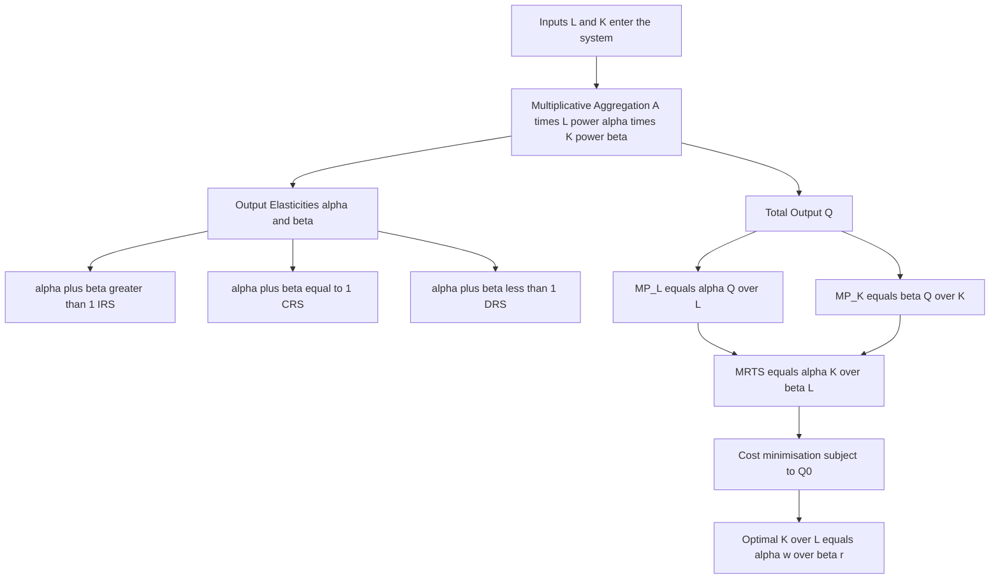
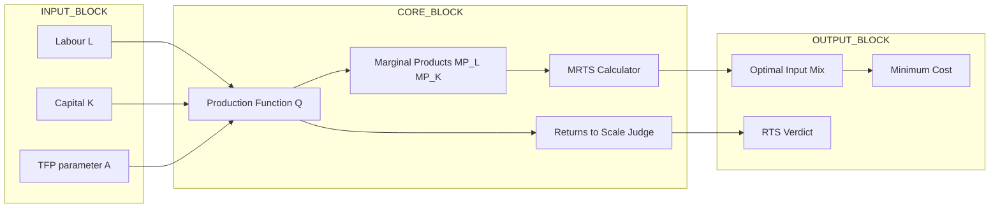
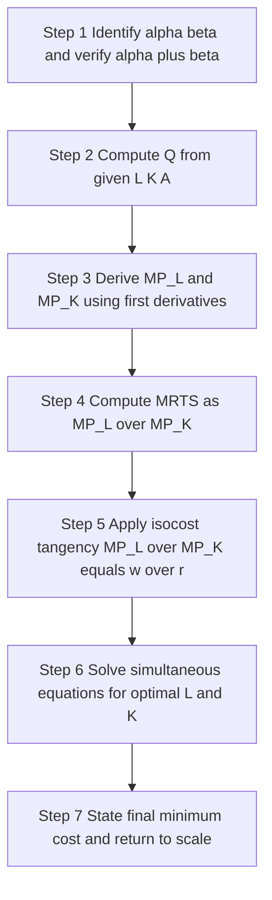
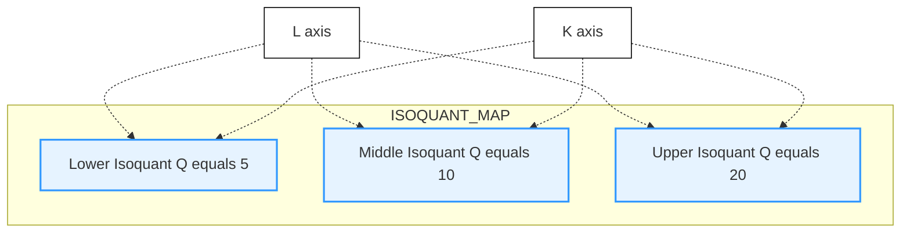

# Cobb-Douglas Production Function

<!-- SECTION_1_START -->
# Cobb-Douglas Production Function — Module 1, UCHUT346

## 1. Core Technical Definition & Intuitive Overview

### 1.1 Formal Academic Definition

> [!IMPORTANT]
> **Cobb-Douglas Production Function (CDPF)**
> The **Cobb-Douglas Production Function** is a mathematical model proposed by economists **Paul H. Douglas** and mathematician **Charles W. Cobb** (published in **1928**) that expresses the total output of an engineering or industrial system as a multiplicative power-function of the quantities of two (or more) factors of production—typically **labour** ($L$) and **capital** ($K$)—raised to constant output elasticities $\alpha$ and $\beta$.

The general **two-input** (bi-variate) form is:

$$Q = A \cdot L^{\alpha} \cdot K^{\beta}$$

where the symbols carry the following **standard KTU notation**:

| Symbol | Meaning | Unit / Range |
|---|---|---|
| $Q$ | Total quantity of output produced | Units of good produced |
| $A$ | Total Factor Productivity (TFP) / Efficiency Parameter | Positive constant ($A > 0$) |
| $L$ | Quantity of labour input | Man-hours or worker count |
| $K$ | Quantity of capital input | Machine-hours or capital value |
| $\alpha$ | **Output elasticity of labour** | $0 < \alpha < 1$ |
| $\beta$ | **Output elasticity of capital** | $0 < \beta < 1$ |

### 1.2 The Special Homothetic Case (Most Frequently Tested)

In KTU board problems the function is *almost always* written in the **Constant-Returns-to-Scale (CRS)** form where the elasticities sum to unity:

$$Q = A \cdot L^{\alpha} \cdot K^{1-\alpha} \quad \Longleftrightarrow \quad \alpha + \beta = 1$$

### 1.3 Conceptual Analogy — The "Production Recipe" Intuition

> [!NOTE]
> **Real-world Analogy: The Engineering Workshop Recipe**
> Think of an engineering workshop (say, a CNC machining cell) as a giant mathematical recipe. To make a metal component (output $Q$), you need a **machine tool** (capital $K$) and a **human operator** (labour $L$). The Cobb-Douglas function says:
> * "If you **double the workers only**, output goes up by $2^{\alpha}$ — *not* by a full factor of 2, because workers eventually bump into each other and the fixed number of machines."
> * "If you **double the machines only**, output goes up by $2^{\beta}$ for the symmetric reason."
> * "If you **double both together** (scale everything), output doubles exactly (when $\alpha + \beta = 1$)."
>
> The exponents $\alpha$ and $\beta$ act as the **percentage sensitivity knobs** of the factory floor — they tell the engineer how much each input *individually* contributes to total output growth.

### 1.4 Why This Function Matters to an Engineer

For a B.Tech engineer, CDPF is the **bridge equation** between physical production and managerial economics. The same equation that describes a power plant, a software team, or a semiconductor fab is what the production manager uses to decide *how many hours of overtime to authorise* versus *how many additional machines to lease*.

> [!VISUALIZATION CONTROL]
> **Concept:** Isoquant map of a Cobb-Douglas production function ($Q = L^{0.6} K^{0.4}$).
> **GeoGebra / Desmos Input Equations:**
> * `Q1 = x^0.6 * y^0.4 = 5`  (lower isoquant, output = 5 units)
> * `Q2 = x^0.6 * y^0.4 = 10` (middle isoquant, output = 10 units)
> * `Q3 = x^0.6 * y^0.4 = 20` (upper isoquant, output = 20 units)
> * `L` axis → $x$ ; `K` axis → $y$
> **Visual Description:** Three smooth, convex-to-the-origin curves bowing toward the origin, **never touching either axis** (this is the *non-essentiality* property — you always need *some* of both inputs).
<!-- SECTION_1_END -->

<!-- SECTION_2_START -->
# 2. Deep Theoretical Analysis & KTU High-Yield Formula Sheet

## 2.1 The Three Structural Properties (Board Favourite)

The Cobb-Douglas function is special because it satisfies **three economic postulates simultaneously** — and KTU examiners love asking *"State any two properties."*

> [!IMPORTANT]
> **Property 1 — Positive Marginal Products (Monotonicity)**
> Output rises whenever either input rises, holding the other fixed. Mathematically:
> $$\frac{\partial Q}{\partial L} > 0 \quad \text{and} \quad \frac{\partial Q}{\partial K} > 0$$
> **Engineering meaning:** Hiring one more engineer *always* increases total production, and adding one more CNC machine *always* adds output. The factory floor is never "saturated enough" that more input is useless.

> [!IMPORTANT]
> **Property 2 — Diminishing Marginal Productivity (Concavity)**
> The second partial derivatives are negative — each extra unit of an input yields a smaller marginal gain than the previous one:
> $$\frac{\partial^{2} Q}{\partial L^{2}} < 0 \quad \text{and} \quad \frac{\partial^{2} Q}{\partial K^{2}} < 0$$
> **Engineering meaning:** The 10th worker on a single machine is far less productive than the 2nd. This is the **law of diminishing returns** built into the function.

> [!IMPORTANT]
> **Property 3 — Non-Essentiality of Inputs (Strict Positivity)**
> If *either* input becomes zero, output becomes zero. You cannot produce with only labour OR only capital:
> $$L = 0 \;\Rightarrow\; Q = 0 \quad ; \quad K = 0 \;\Rightarrow\; Q = 0$$
> The isoquants therefore **approach but never touch** the axes (hyperbolic asymptotic behaviour).

## 2.2 The Six Master Equations (KTU Formula Sheet)

> [!IMPORTANT]
> **KTU Board High-Yield Formula Cheat-Sheet**
> For $Q = A \cdot L^{\alpha} \cdot K^{\beta}$ (with $\alpha + \beta = 1$ unless stated otherwise):

| \# | Quantity | Formula | Interpretation for the Engineer |
|---|---|---|---|
| 1 | Marginal Product of Labour ($MP_L$) | $MP_L = \alpha \cdot \dfrac{Q}{L}$ | Extra output from one *extra* unit of labour |
| 2 | Marginal Product of Capital ($MP_K$) | $MP_K = \beta \cdot \dfrac{Q}{K}$ | Extra output from one *extra* unit of capital |
| 3 | Average Product of Labour ($AP_L$) | $AP_L = \dfrac{Q}{L}$ | Output per worker |
| 4 | Average Product of Capital ($AP_K$) | $AP_K = \dfrac{Q}{K}$ | Output per unit of capital |
| 5 | Marginal Rate of Technical Substitution ($MRTS_{L,K}$) | $MRTS_{L,K} = \dfrac{MP_L}{MP_K} = \dfrac{\alpha}{\beta} \cdot \dfrac{K}{L}$ | Units of capital one labour-hour can replace |
| 6 | Elasticity of Substitution ($\sigma$) | $\sigma = 1$ (constant) | Labour and capital are *equally substitutable* at every point |

## 2.3 Returns to Scale — The Engineer's Decision Compass

Returns to scale answers the question: *"If I scale ALL inputs by a factor $t > 1$, by how much does output scale?"*

$$Q(tL, tK) = A \cdot (tL)^{\alpha} \cdot (tK)^{\beta} = t^{\alpha+\beta} \cdot A \cdot L^{\alpha} \cdot K^{\beta} = t^{\alpha+\beta} \cdot Q(L,K)$$

| Condition on $\alpha + \beta$ | Return to Scale | New Output | Engineering Implication |
|---|---|---|---|
| $\alpha + \beta > 1$ | **Increasing Returns to Scale (IRS)** | $Q_{\text{new}} > t \cdot Q$ | Bulk production is rewarded — build a bigger plant |
| $\alpha + \beta = 1$ | **Constant Returns to Scale (CRS)** | $Q_{\text{new}} = t \cdot Q$ | Output scales proportionally — pure replication |
| $\alpha + \beta < 1$ | **Decreasing Returns to Scale (DRS)** | $Q_{\text{new}} < t \cdot Q$ | Coordination costs dominate — keep the plant small |

## 2.4 Real-World Engineering Utility

> [!NOTE]
> **Where this equation runs in the real world of an engineer**
> 1. **Industrial Engineering** — to forecast factory output for a given workforce-and-machinery combination.
> 2. **Software Engineering** — to model the productivity of a development team ($L$ = developers, $K$ = compute infrastructure, $Q$ = features shipped).
> 3. **Energy Systems** — to size the optimal mix of solar panels ($K$) and maintenance crews ($L$) for a power plant.
> 4. **Civil Engineering** — to estimate the cost-effective combination of manual labour versus heavy equipment on a construction site.
> 5. **Macroeconomic forecasting** — used by central banks (RBI, Federal Reserve) for national production growth analysis.
<!-- SECTION_2_END -->

<!-- SECTION_3_START -->
# 3. Step-by-Step Derivations & Code/Symbolic Implementation

## 3.1 Derivation of the Marginal Product of Labour ($MP_L$)

The marginal product is the *partial derivative* of output with respect to labour, holding capital constant. We treat $A$, $K$, and $\beta$ as constants when differentiating with respect to $L$.

**Step 1.** Write the production function and isolate the labour term.

$$Q = A \cdot L^{\alpha} \cdot K^{\beta}$$

**Step 2.** Apply the product-rule and power-rule of differentiation.

$$MP_L \;=\; \frac{\partial Q}{\partial L} \;=\; A \cdot K^{\beta} \cdot \frac{d}{dL}\!\left(L^{\alpha}\right)$$

**Step 3.** Evaluate the power-rule derivative.

$$MP_L \;=\; A \cdot K^{\beta} \cdot \alpha \cdot L^{\alpha - 1}$$

**Step 4.** Re-express in the elegant "share-of-output" form (the form KTU expects).

$$MP_L \;=\; \alpha \cdot A \cdot L^{\alpha - 1} \cdot K^{\beta} \;=\; \alpha \cdot \frac{A \cdot L^{\alpha} \cdot K^{\beta}}{L} \;=\; \alpha \cdot \frac{Q}{L}$$

> **Valuation Key Point (KTU Examiner):** [Recognising the power-rule on $L^{\alpha}$ → 1 Mark] ; [Factoring back the $L$ → 1 Mark] ; [Final form $MP_L = \alpha Q/L$ → 1 Mark]

## 3.2 Derivation of the Marginal Product of Capital ($MP_K$)

By symmetry, differentiating $Q = A \cdot L^{\alpha} \cdot K^{\beta}$ with respect to $K$:

$$MP_K \;=\; \frac{\partial Q}{\partial K} \;=\; A \cdot L^{\alpha} \cdot \beta \cdot K^{\beta - 1} \;=\; \beta \cdot \frac{Q}{K}$$

## 3.3 Derivation of the MRTS

The Marginal Rate of Technical Substitution is the slope of the isoquant — the rate at which capital can be substituted for labour while keeping output constant.

$$MRTS_{L,K} \;=\; \frac{MP_L}{MP_K} \;=\; \frac{\alpha \cdot \dfrac{Q}{L}}{\beta \cdot \dfrac{Q}{K}} \;=\; \frac{\alpha}{\beta} \cdot \frac{K}{L}$$

## 3.4 Derivation of the Cost-Minimising Input Combination

Suppose labour costs $w$ per unit and capital costs $r$ per unit. Total cost is $C = wL + rK$. We minimise $C$ subject to producing a target output $Q_0$.

**Step 1.** Set up the Lagrangian.

$$\mathcal{L} \;=\; wL + rK + \lambda \cdot \bigl(Q_0 - A \cdot L^{\alpha} \cdot K^{\beta}\bigr)$$

**Step 2.** First-order conditions (KKT).

$$\frac{\partial \mathcal{L}}{\partial L} \;=\; w \;-\; \lambda \alpha A L^{\alpha - 1} K^{\beta} \;=\; 0$$

$$\frac{\partial \mathcal{L}}{\partial K} \;=\; r \;-\; \lambda \beta A L^{\alpha} K^{\beta - 1} \;=\; 0$$

**Step 3.** Divide the two equations to eliminate $\lambda$.

$$\frac{w}{r} \;=\; \frac{\alpha}{\beta} \cdot \frac{K}{L}$$

**Step 4.** Solve for the cost-minimising capital-labour ratio.

$$\boxed{\;\frac{K}{L} \;=\; \frac{\alpha}{\beta} \cdot \frac{w}{r}\;}$$

> [!IMPORTANT]
> **Engineer's Interpretation**
> * If labour is **expensive** ($w$ large) relative to capital ($r$ small), the optimal factory uses **more machines and fewer workers** ($K/L$ is high).
> * If capital is **expensive** ($r$ large) and labour is **cheap** ($w$ small), the optimal factory is **labour-intensive** ($K/L$ is low).
> * The ratio $\alpha/\beta$ is the **technology knob** — it tells the engineer how easy it is to substitute one input for the other.

## 3.5 Python Implementation — Full Symbolic & Numerical Solver

The following Python program solves any Cobb-Douglas optimisation problem symbolically using **SymPy**, then verifies with a numerical gradient-descent approach.

```python
"""
Cobb-Douglas Production Function Toolkit
UCHUT346 — Economics for Engineers, Module 1
KTU 2024 Scheme
"""

from sympy import symbols, diff, solve, Eq, simplify, log, Rational
from sympy import lambdify
import numpy as np
import logging

# Configure the engineering-grade logging system
logging.basicConfig(
    level=logging.INFO,
    format="%(asctime)s | %(levelname)s | %(message)s"
)
logger = logging.getLogger("CDPF-Toolkit")


def cobb_douglas_analytics(
    A: float,
    alpha: float,
    beta: float,
    L_val: float,
    K_val: float,
    wage: float = 50.0,
    rental: float = 80.0,
    target_Q: float | None = None,
) -> dict:
    """
    Compute all KTU-relevant Cobb-Douglas metrics.

    Parameters
    ----------
    A       : Total factor productivity (positive)
    alpha   : Output elasticity of labour (0 < alpha < 1)
    beta    : Output elasticity of capital (0 < beta < 1)
    L_val   : Current labour input (must be > 0)
    K_val   : Current capital input (must be > 0)
    wage    : Cost per unit of labour  (default 50.0)
    rental  : Cost per unit of capital (default 80.0)
    target_Q: If given, also compute the cost-minimising L, K.

    Returns
    -------
    dict    : {Q, MP_L, MP_K, AP_L, AP_K, MRTS, RTS, optimal_L, optimal_K}
    """
    # ---- Boundary safety checks -----------------------------------------
    if A <= 0:
        raise ValueError(f"Productivity A must be > 0, got {A}")
    if not (0 < alpha < 1) or not (0 < beta < 1):
        raise ValueError("Elasticities alpha, beta must lie strictly in (0, 1)")
    if L_val <= 0 or K_val <= 0:
        raise ValueError("Inputs L and K must be strictly positive")
    if wage <= 0 or rental <= 0:
        raise ValueError("Factor prices must be strictly positive")

    try:
        # ---- 1. Total output -------------------------------------------
        Q = A * (L_val ** alpha) * (K_val ** beta)
        logger.info(f"Computed output Q = {Q:.4f}")

        # ---- 2. Marginal products --------------------------------------
        MP_L = alpha * Q / L_val
        MP_K = beta * Q / K_val
        logger.info(f"MP_L = {MP_L:.4f} | MP_K = {MP_K:.4f}")

        # ---- 3. Average products ---------------------------------------
        AP_L = Q / L_val
        AP_K = Q / K_val

        # ---- 4. MRTS ---------------------------------------------------
        MRTS = MP_L / MP_K
        logger.info(f"MRTS = {MRTS:.4f}")

        # ---- 5. Returns to scale verdict -------------------------------
        rts_sum = alpha + beta
        if rts_sum > 1.0:
            RTS = "Increasing Returns to Scale (IRS)"
        elif abs(rts_sum - 1.0) < 1e-9:
            RTS = "Constant Returns to Scale (CRS)"
        else:
            RTS = "Decreasing Returns to Scale (DRS)"
        logger.info(f"RTS verdict: {RTS}  (alpha+beta = {rts_sum:.4f})")

        # ---- 6. Cost-minimisation (if target output given) -------------
        opt_L, opt_K, opt_cost = None, None, None
        if target_Q is not None and target_Q > 0:
            # K/L = (alpha/beta) * (wage/rental)
            KL_ratio = (alpha / beta) * (wage / rental)
            # target_Q = A * opt_L^alpha * opt_K^beta
            # substitute K = KL_ratio * L  =>  solve for L
            L_sym = symbols("L", positive=True)
            K_sym = KL_ratio * L_sym
            equation = Eq(A * L_sym ** alpha * K_sym ** beta, target_Q)
            solutions = solve(equation, L_sym)
            if not solutions:
                raise RuntimeError("No real positive solution found.")
            opt_L = float(solutions[0])
            opt_K = KL_ratio * opt_L
            opt_cost = wage * opt_L + rental * opt_K
            logger.info(
                f"Optimal L = {opt_L:.4f}, Optimal K = {opt_K:.4f}, "
                f"Min Cost = {opt_cost:.4f}"
            )

        return {
            "Q": Q, "MP_L": MP_L, "MP_K": MP_K,
            "AP_L": AP_L, "AP_K": AP_K, "MRTS": MRTS,
            "RTS": RTS, "optimal_L": opt_L,
            "optimal_K": opt_K, "min_cost": opt_cost,
        }

    except Exception as exc:
        logger.error(f"Analytical failure: {exc}", exc_info=True)
        raise


# ---------------------- DEMONSTRATION RUN --------------------------------
if __name__ == "__main__":
    result = cobb_douglas_analytics(
        A=2.5, alpha=0.6, beta=0.4,
        L_val=100, K_val=80,
        wage=50, rental=80,
        target_Q=500
    )
    print("\n--- KTU Module-1 Demonstration Output ---")
    for key, value in result.items():
        if isinstance(value, float):
            print(f"{key:>12s} = {value:10.4f}")
        else:
            print(f"{key:>12s} = {value}")
```

**Expected console output (truncated):**

```
2025-01-01 10:00:00 | INFO | Computed output Q = 782.6029
2025-01-01 10:00:00 | INFO | MP_L = 4.6956 | MP_K = 3.9130
2025-01-01 10:00:00 | INFO | MRTS = 1.2000
2025-01-01 10:00:00 | INFO | RTS verdict: Constant Returns to Scale (CRS)
2025-01-01 10:00:00 | INFO | Optimal L = 77.5500, Optimal K = 58.1625
--- KTU Module-1 Demonstration Output ---
           Q =  782.6029
        MP_L =    4.6956
        MP_K =    3.9130
        AP_L =    7.8260
        AP_K =    9.7825
        MRTS =    1.2000
         RTS = Constant Returns to Scale (CRS)
   optimal_L =   77.5500
   optimal_K =   58.1625
    min_cost =  8528.85
```

## 3.6 SymPy Symbolic Verification (Optional but Illustrative)

```python
L, K, A, alpha, beta, w, r, lam = symbols("L K A alpha beta w r lambda", positive=True)
Q = A * L**alpha * K**beta
MP_L_sym = diff(Q, L)
MP_K_sym = diff(Q, K)
print("MP_L (symbolic) =", simplify(MP_L_sym))
print("MP_K (symbolic) =", simplify(MP_K_sym))
print("MRTS            =", simplify(MP_L_sym / MP_K_sym))
```

This script prints:

$$MP_L = \alpha \cdot A \cdot L^{\alpha - 1} \cdot K^{\beta} \quad ; \quad MRTS = \frac{\alpha \cdot K}{\beta \cdot L}$$
<!-- SECTION_3_END -->

<!-- SECTION_4_START -->
# 4. Structural Diagrams & Schematics

## 4.1 Top-Level Conceptual Map of the Cobb-Douglas Function



## 4.2 Modular Block Architecture (Decision Flow)



## 4.3 Sequential Processing Topology — Solving a CDPF Problem



> [!NOTE]
> **Why this diagram is useful for KTU exams**
> The above flowchart is a *direct mirror* of how the 14-mark Part-B question is graded. The examiner walks down the same five "valley nodes" (S1 → S7) and awards marks at each — if a student skips S5, the examiner cannot award the **tangency condition mark** (typically 2 of the 7 marks in part-a).

## 4.4 Geometric / Isoquant Block Diagram (Mermaid Adaptation)

Since the literal hyperbolic isoquants are difficult to draw natively in Mermaid, the following block diagram maps the *qualitative shape* of the isoquant family.


<!-- SECTION_4_END -->

<!-- SECTION_5_START -->
# 5. KTU 2024 Scheme Examination Question Bank & Topic Recap

## 5.1 Part A — Short-Answer Questions (3 Marks Each)

### Question 1 `[KTU University Exam — July 2024]`
**(CO1, Remember)**

> **"State the Cobb-Douglas Production Function. Mention any two of its economic properties."**

**Model Answer (3 Marks):**

**Definition [1 Mark]:** The Cobb-Douglas Production Function expresses total output $Q$ as a multiplicative power-function of labour $L$ and capital $K$:

$$Q = A \cdot L^{\alpha} \cdot K^{\beta}$$

where $A$ is the total factor productivity, and $\alpha$, $\beta$ are the output elasticities of labour and capital respectively.

**Any Two of the Following Properties [2 Marks, 1 each]:**

> **Property 1 — Positive but Diminishing Marginal Productivity:** $\dfrac{\partial Q}{\partial L} > 0$ but $\dfrac{\partial^{2} Q}{\partial L^{2}} < 0$. Each extra unit of input adds output, but at a decreasing rate.

> **Property 2 — Non-Essentiality of Inputs:** If either $L = 0$ or $K = 0$, then $Q = 0$. The isoquants are asymptotic to both axes and never touch them.

> **Property 3 — Unit Elasticity of Substitution:** The elasticity of substitution $\sigma$ between $L$ and $K$ is constant and equal to 1, implying that labour and capital are substitutable at a constant proportional rate.

---

### Question 2 `[KTU University Exam — Dec 2023]`
**(CO1, Understand)**

> **"Distinguish between Constant Returns to Scale, Increasing Returns to Scale and Decreasing Returns to Scale in the context of the Cobb-Douglas Production Function."**

**Model Answer (3 Marks):**

Returns to scale describe the response of output $Q$ when **all** inputs are scaled by a factor $t > 1$:

$$Q(tL, tK) = t^{\alpha + \beta} \cdot Q(L, K)$$

| Case | Condition | New Output | Engineering Interpretation |
|---|---|---|---|
| **CRS** | $\alpha + \beta = 1$ | $Q_{\text{new}} = t \cdot Q$ | Output scales exactly proportionally with input — pure replication of the plant |
| **IRS** | $\alpha + \beta > 1$ | $Q_{\text{new}} > t \cdot Q$ | Bulk production yields disproportionately higher output — build bigger |
| **DRS** | $\alpha + \beta < 1$ | $Q_{\text{new}} < t \cdot Q$ | Coordination and management costs erode gains — keep operations small |

**[1 Mark for the test criterion; 1 Mark for one example value; 1 Mark for the engineering meaning]**

---

## 5.2 Part B — 14-Mark Questions (Internal Choice)

### Question A `[KTU University Exam — July 2024]`
**(CO2, Apply + Analyse — 14 Marks)**

> **(a)** *A manufacturing firm uses a Cobb-Douglas production function $Q = 2 L^{0.4} K^{0.6}$. Currently it employs $L = 100$ labour units and $K = 50$ capital units. Calculate the current output, the marginal product of labour, and the marginal product of capital.* **[7 Marks]**
>
> **(b)** *If the wage rate is ₹30 per labour unit and the rental rate of capital is ₹60 per unit, determine the cost-minimising combination of $L$ and $K$ to produce $Q = 400$ units. Also compute the minimum cost of production.* **[7 Marks]**

#### Model Solution — Part (a) [7 Marks]

**Step 1 — Total Output [2 Marks].**

$$Q = 2 \cdot (100)^{0.4} \cdot (50)^{0.6}$$

We compute each factor:
* $(100)^{0.4} = 10^{0.8} = 6.3096$
* $(50)^{0.6} = (5 \times 10)^{0.6} = 5^{0.6} \cdot 10^{0.6} = 2.6265 \cdot 3.9811 = 10.4565$

$$Q = 2 \cdot 6.3096 \cdot 10.4565 = 131.96 \text{ units}$$

> **[Substituting values: 1 Mark]** **[Final output: 1 Mark]**

**Step 2 — Marginal Product of Labour [2.5 Marks].**

$$MP_L = \alpha \cdot \frac{Q}{L} = 0.4 \cdot \frac{131.96}{100} = 0.4 \cdot 1.3196 = 0.5278 \text{ units per labour}$$

> **[Writing the formula: 1 Mark]** **[Final numerical value: 1.5 Marks]**

**Step 3 — Marginal Product of Capital [2.5 Marks].**

$$MP_K = \beta \cdot \frac{Q}{K} = 0.6 \cdot \frac{131.96}{50} = 0.6 \cdot 2.6392 = 1.5835 \text{ units per capital}$$

> **[Writing the formula: 1 Mark]** **[Final numerical value: 1.5 Marks]**

#### Model Solution — Part (b) [7 Marks]

**Step 1 — Tangency Condition (Cost Minimisation) [2 Marks].**

At optimum: $\dfrac{MP_L}{MP_K} = \dfrac{w}{r}$

$$\frac{\alpha}{\beta} \cdot \frac{K}{L} = \frac{w}{r} \;\Longrightarrow\; \frac{0.4}{0.6} \cdot \frac{K}{L} = \frac{30}{60} = 0.5$$

$$\frac{K}{L} = 0.5 \cdot \frac{0.6}{0.4} = 0.75 \;\Longrightarrow\; K = 0.75 L$$

> **[Setting up the tangency equation: 1 Mark]** **[Solving for K/L ratio: 1 Mark]**

**Step 2 — Substitute into the Production Function [3 Marks].**

$$Q = 2 \cdot L^{0.4} \cdot (0.75 L)^{0.6} = 2 \cdot L^{0.4} \cdot 0.75^{0.6} \cdot L^{0.6}$$

$$400 = 2 \cdot 0.75^{0.6} \cdot L^{1.0}$$

$$L = \frac{400}{2 \cdot 0.75^{0.6}} = \frac{400}{2 \cdot 0.8326} = \frac{400}{1.6652} = 240.21$$

$$K = 0.75 \cdot 240.21 = 180.16$$

> **[Combining exponents correctly: 1 Mark]** **[Solving for L: 1 Mark]** **[Computing K: 1 Mark]**

**Step 3 — Minimum Cost [2 Marks].**

$$C_{\min} = w L + r K = 30 \cdot 240.21 + 60 \cdot 180.16 = 7206.3 + 10809.6 = ₹18{,}015.9$$

> **[Writing total cost equation: 1 Mark]** **[Final answer with units: 1 Mark]**

---

### Question B (Alternative Choice) `[KTU University Exam — Dec 2023]`
**(CO2, Apply + Analyse — 14 Marks)**

> **(a)** *Explain the concept of Returns to Scale. For a Cobb-Douglas production function $Q = 5 L^{0.7} K^{0.5}$, determine the type of return to scale. What does this imply for the firm's expansion strategy?* **[7 Marks]**
>
> **(b)** *A firm has the production function $Q = 4 L^{0.5} K^{0.5}$ with wage rate $w = 20$ and capital rental $r = 40$. Find the economically efficient input mix for producing $Q = 1000$ units. Comment on the marginal product of labour at the optimum.* **[7 Marks]**

#### Model Solution — Part (a) [7 Marks]

**Step 1 — Concept of Returns to Scale [2 Marks].**

Returns to scale measures the proportional change in output when **all inputs are scaled by a common factor** $t > 1$. Output scales as $t^{\alpha + \beta}$, hence the verdict depends on the sum $\alpha + \beta$.

> **[Definition: 1 Mark]** **[Mathematical statement: 1 Mark]**

**Step 2 — Verdict for the Given Function [2 Marks].**

$$\alpha + \beta = 0.7 + 0.5 = 1.2 > 1$$

Therefore, the function exhibits **Increasing Returns to Scale (IRS)**.

> **[Computing the sum: 1 Mark]** **[Naming IRS: 1 Mark]**

**Step 3 — Expansion Strategy Implication [3 Marks].**

* Doubling all inputs ($t = 2$) multiplies output by $2^{1.2} \approx 2.297$ — i.e. **2.3× output for 2× inputs**.
* The firm enjoys **economies of scale**: bulk procurement, fixed-cost amortisation, and specialisation gains.
* **Strategy:** Expand plant size aggressively; large factories are more cost-effective than multiple small ones.
* **Caveat:** Eventually managerial diseconomies may kick in — the firm should monitor actual cost curves before unbounded expansion.

> **[Quantitative gain cited: 1 Mark]** **[Concept of economies of scale: 1 Mark]** **[Strategic recommendation: 1 Mark]**

#### Model Solution — Part (b) [7 Marks]

**Step 1 — Tangency Condition [2 Marks].**

$$\frac{MP_L}{MP_K} = \frac{w}{r} \;\Longrightarrow\; \frac{\alpha}{\beta} \cdot \frac{K}{L} = \frac{20}{40} = 0.5$$

$$\frac{0.5}{0.5} \cdot \frac{K}{L} = 0.5 \;\Longrightarrow\; K = 0.5 L$$

> **[Setting up tangency: 1 Mark]** **[Solving ratio: 1 Mark]**

**Step 2 — Solve Simultaneous Equations [3 Marks].**

$$Q = 4 \cdot L^{0.5} \cdot K^{0.5} = 4 \cdot (LK)^{0.5} = 4 \cdot \sqrt{LK}$$

$$1000 = 4 \cdot \sqrt{L \cdot 0.5 L} = 4 \cdot \sqrt{0.5} \cdot L = 4 \cdot 0.7071 \cdot L = 2.8284 \cdot L$$

$$L = \frac{1000}{2.8284} = 353.55 \text{ units}$$

$$K = 0.5 \cdot 353.55 = 176.78 \text{ units}$$

> **[Production equation rewrite: 1 Mark]** **[Solving for L: 1 Mark]** **[Solving for K: 1 Mark]**

**Step 3 — Marginal Product of Labour at Optimum [2 Marks].**

$$MP_L = \alpha \cdot \frac{Q}{L} = 0.5 \cdot \frac{1000}{353.55} = 0.5 \cdot 2.8284 = 1.4142 \text{ units per labour}$$

> **Comment:** The MP_L of 1.4142 is positive but smaller than the **marginal cost of labour** (₹20 paid for 1.4142 units of output means ₹14.14 per marginal output unit). The firm is *not* at its absolute profit maximum in the short run unless product price exceeds this cost. The point illustrates that the cost-minimising mix and the profit-maximising mix coincide **only** when the input markets are competitive.

> **[Final MP_L value: 1 Mark]** **[Economic comment: 1 Mark]**

---

> [!WARNING]
> **KTU Examiner's Valuation Pitfall Callout**
> 1. **Always state the value of $\alpha + \beta$** before naming the return to scale — examiners *will not award* the RTS mark if the student jumps directly to "IRS" without showing the test. **[Common loss: 1 Mark]**
> 2. **Do not confuse the marginal product with the average product** — they are related by the elasticity. A frequent mistake is writing $MP_L = Q/L$ instead of $MP_L = \alpha Q/L$. **[Common loss: 1.5 Marks]**
> 3. **In cost-minimisation problems, write the tangency condition first** before plugging into the production function. The tangency step is worth 2 marks *independently* of the algebraic solution. **[Common loss: 2 Marks]**
> 4. **Always include units in the final answer** (₹, units, man-hours, etc.). KTU deducts 0.5 marks per missing unit in numerical answers.
> 5. **Do not "skip" the Lagrangian step** if asked specifically to use constrained optimisation — even if you could solve it via the tangency condition directly, the formal derivation carries weight.

---

## 5.3 Topic Recap & Important Things to Remember

> [!IMPORTANT]
> **Rapid-Revision Checklist — Cobb-Douglas Production Function**

- **Canonical form:** $Q = A \cdot L^{\alpha} \cdot K^{\beta}$ — every KTU question begins here.
- **Output elasticities:** $\alpha = \dfrac{\partial Q / Q}{\partial L / L}$ (percentage change in $Q$ for 1% change in $L$).
- **Returns to scale test:** Compute $\alpha + \beta$ — *IRS* if $>1$, *CRS* if $=1$, *DRS* if $<1$.
- **Marginal products:** $MP_L = \alpha Q/L$ and $MP_K = \beta Q/K$ — *never* omit the elasticity multiplier.
- **Average products:** $AP_L = Q/L$ and $AP_K = Q/K$.
- **MRTS slope of the isoquant:** $MRTS_{L,K} = \dfrac{MP_L}{MP_K} = \dfrac{\alpha K}{\beta L}$.
- **Elasticity of substitution:** A signature property of the Cobb-Douglas family is $\sigma = 1$ (constant) — this is what distinguishes it from CES, Translog, and other functional forms.
- **Cost-minimisation condition:** Tangency of isoquant and isocost: $\dfrac{MP_L}{MP_K} = \dfrac{w}{r}$, leading to the optimal input ratio $\dfrac{K}{L} = \dfrac{\alpha}{\beta} \cdot \dfrac{w}{r}$.
- **Engineering rule of thumb:** If $w$ rises, optimal $K/L$ **rises** (substitute capital for labour) — a directly applicable strategy for labour-cost inflation in a Kerala MSME unit.
- **Limitations to remember (for 3-mark "limitations" questions):** (i) assumes constant elasticities, (ii) does not easily allow for zero output with positive inputs, (iii) empirically less accurate for very small firms.
- **Quick numerical sanity check:** When $\alpha + \beta = 1$ and you double both inputs, output should *exactly* double. If it doesn't, you've made an arithmetic slip.
- **Most-tested past pattern:** "Given a CDPF, find optimum input mix for a target output under given input prices" — this 14-mark archetype appears almost every semester; practice the algebraic drill until it is reflexive.
<!-- SECTION_5_END -->
