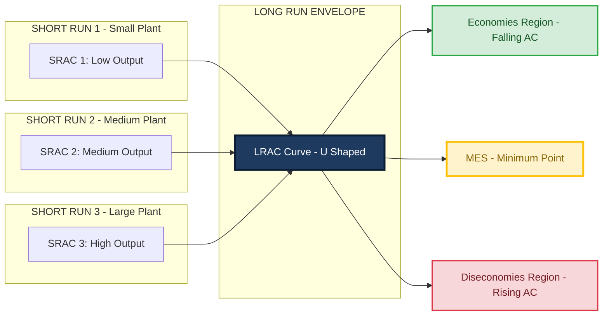
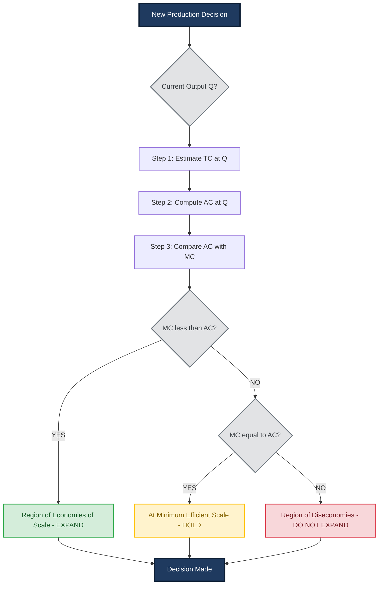

# Economies of Scale

<!-- SECTION_1_START -->
# Economies of Scale — Core Definition & Intuitive Overview

> [!IMPORTANT]
> **KTU 2024 Scheme — UCHUT346 (Economics for Engineers)**
> **Module 1:** Basic Economic Problems
> **Topic:** Economies of Scale
> **Mapped Course Outcome:** CO1 — Understand the fundamental economic principles governing engineering decisions.

---

## 1.1 Formal Academic Definition

**Economies of Scale** refer to the **cost advantage** that an engineering firm or production unit achieves by **increasing its scale of operation** — that is, producing a larger quantity of output — such that the **average cost per unit of output falls** as the total volume of production rises, all other factors being constant (ceteris paribus).

Mathematically, economies of scale exist when:

$$
\frac{\Delta \, \text{Average Cost}}{\Delta \, \text{Output}} < 0 \quad \Longleftrightarrow \quad AC(Q_2) < AC(Q_1) \text{ for } Q_2 > Q_1
$$

where $AC$ = Average Cost and $Q$ = Quantity of output produced.

In the KTU 2024 syllabus framework, economies of scale is treated as a **micro-economic production concept** that directly informs an engineer's choices regarding **plant capacity, process design, batch sizing, make-or-buy decisions, and capital investment appraisal**.

> [!NOTE]
> **Key Term — Long-Run Average Cost (LRAC):** The minimum average cost of producing every level of output when *all* factors of production are variable. The downward-sloping portion of the LRAC curve represents the **economies of scale region**.

---

## 1.2 Conceptual Analogy — The "Bulk Water Tank" Model

> [!TIP]
> **Intuitive Analogy — Filling a 1000 Litre Municipal Water Tank**
>
> Imagine you are a city engineer tasked with building a water storage tank.
>
> * A **small tank of 100 litres** costs ₹5,000 → cost per litre = **₹50/litre**.
> * A **medium tank of 500 litres** costs ₹15,000 → cost per litre = **₹30/litre**.
> * A **large tank of 1000 litres** costs ₹20,000 → cost per litre = **₹20/litre**.
>
> Even though the **total cost rises**, the **per-unit cost falls** because the **fixed cost (land, foundation, plumbing)** is *spread over more litres*. This is the very essence of economies of scale: **spreading fixed inputs over a larger output base**.
>
> However, if the engineer tries to build a *gigantic 10,000 litre tank*, the foundation becomes disproportionately expensive, transport becomes difficult, and supervision becomes complex — the per-litre cost starts *rising again*. This is **diseconomy of scale**.

**Engineering take-away:** Every production system, power plant, semiconductor fab, or software server farm has a "sweet spot" output level where unit cost is minimum — called the **Minimum Efficient Scale (MES)**.

---

## 1.3 The Engineering Significance of Scale

In the **KTU 2024 Scheme context** (Economics for Engineers), economies of scale is not a stand-alone economic curiosity — it is a **decision-making tool**. An engineering graduate is expected to apply it in:

| Engineering Domain | Practical Application of Economies of Scale |
| :--- | :--- |
| **Manufacturing Plant Design** | Selecting optimal plant capacity (e.g., 50 MW vs. 200 MW power plant) |
| **Software Engineering** | Deciding server cluster size for a SaaS product |
| **Civil Engineering** | Choosing project size for a highway or bridge |
| **Process Industries** | Batch size optimization in chemical reactors |
| **Electronics** | Wafer fabrication — fixed cost of lithography spread over millions of chips |

> [!IMPORTANT]
> **Standard Metric to Remember:**
> * **MES (Minimum Efficient Scale)** = Smallest output level at which LRAC is minimized.
> * **Diseconomy region** = Output beyond MES, where LRAC starts rising.

---

## 1.4 GeoGebra / Desmos Visualization Setup

> [!VISUALIZATION CONTROL]
> **Concept:** Typical **Long-Run Average Cost (LRAC) Curve** with Economies and Diseconomies of Scale Regions.
> **GeoGebra / Desmos Input Equations:**
> * `f(x) = 0.0002 * (x - 100)^2 + 20` *(Downward U-shaped average cost curve)*
> * `g(x) = 50 + 500/x` *(Hyperbolic curve representing AC = FC/Q + VC)*
> * Point markers: `A = (100, 30)`, `B = (MES, AC_min)`
> **Visual Description:** Plot a smooth U-shaped curve on the $X$–$Y$ plane. The $X$-axis is **Output $Q$** (units) and the $Y$-axis is **Average Cost (₹/unit)**. The left arm shows economies of scale (falling AC), the bottom trough is the **Minimum Efficient Scale (MES)**, and the right arm shows diseconomies of scale (rising AC). The student should observe the *trade-off* between scale and unit cost.

---

<!-- SECTION_1_END -->

<!-- SECTION_2_START -->
# Deep Theoretical Analysis & KTU High-Yield Formula Sheet

## 2.1 Theoretical Foundation — The Cost-Output Relationship

In production economics, the **total cost** of producing $Q$ units of output is conventionally decomposed as:

$$
TC(Q) = TFC + TVC(Q)
$$

where $TFC$ = Total Fixed Cost (independent of $Q$) and $TVC$ = Total Variable Cost (depends on $Q$).

The **Average Cost (AC)** is:

$$
AC(Q) = \frac{TC(Q)}{Q} = \frac{TFC}{Q} + \frac{TVC(Q)}{Q} = AFC(Q) + AVC(Q)
$$

The **Marginal Cost (MC)** is:

$$
MC(Q) = \frac{d \, TC(Q)}{dQ}
$$

> [!NOTE]
> **Critical Economic Insight:**
> Economies of scale exist **whenever** the marginal cost of an additional unit is **less than** the average cost of the previous units — because the new cheaper unit **pulls down the average**. Formally:
> $$MC(Q) < AC(Q) \quad \Longleftrightarrow \quad \text{Economies of Scale are present}$$

---

## 2.2 Classification of Economies of Scale

The KTU 2024 syllabus explicitly categorizes economies of scale into **two super-classes**: **Internal** (firm-specific) and **External** (industry-wide).

### 2.2.1 Internal Economies of Scale

These accrue to a *single firm* as it expands its own scale of production.

| # | Type | Definition | Engineering Example |
| :---: | :--- | :--- | :--- |
| 1 | **Technical / Technological** | Specialised machinery, longer production runs, superior process technology reduce unit cost. | An automobile assembly line with robotic arms. |
| 2 | **Managerial** | Division of labour in management (production, finance, HR, R&D) improves efficiency. | Hiring a dedicated Quality Assurance manager. |
| 3 | **Commercial / Financial** | Bulk purchasing of raw materials at discounts; cheaper loans due to large asset base. | A construction firm buying 10,000 tonnes of cement at a 12% discount. |
| 4 | **Risk-Bearing / Diversification** | Producing a wider product portfolio spreads market risk. | A mobile company making phones, tablets, and wearables. |
| 5 | **Marketing Economies** | Advertising cost per unit falls as output rises. | One TV commercial promoting 5 variants of a product. |
| 6 | **Inventory / Warehousing** | Better inventory turnover; economies in storage. | A centralised warehouse serving multiple retail outlets. |
| 7 | **Labour / Specialisation** | Workers specialise in narrow tasks, raising productivity. | A semiconductor fab where each operator handles one process step. |

### 2.2.2 External Economies of Scale

These accrue to a *cluster of firms* when an **industry as a whole** grows, regardless of any single firm's size.

| # | Type | Definition | Engineering Example |
| :---: | :--- | :--- | :--- |
| 1 | **Concentration / Localization** | Firms in the same geographic area share suppliers, labour, and infrastructure. | Kerala's KINFRA Electronics Park hosting 50 MSMEs. |
| 2 | **Information Economies** | Trade journals, industry expos, R&D spillovers reduce cost. | A free industry magazine reducing market research cost. |
| 3 | **Disintegration Economies** | Sub-processes spin off into independent specialist firms. | A car manufacturer outsourcing brake-pad production. |
| 4 | **Advertising Economies** | Joint trade associations promote the industry collectively. | "Made in India" campaign. |
| 5 | **Transportation Economies** | Specialised transport providers (e.g., refrigerated trucks) emerge. | Cold-chain logistics for the seafood export industry. |

---

## 2.3 Diseconomies of Scale

> [!WARNING]
> **Diseconomies of Scale = Unit cost RISE as output increases.** This is the *mirror image* of economies of scale and typically begins **after the Minimum Efficient Scale (MES)**.

| # | Type | Cause |
| :---: | :--- | :--- |
| 1 | **Managerial Diseconomies** | Excessive hierarchical layers cause communication delays and bureaucratic inertia. |
| 2 | **Technical Diseconomies** | Beyond a point, the machinery cannot be efficiently utilised; breakdowns become frequent. |
| 3 | **Marketing Diseconomies** | A firm may have to sell in distant, less-demanding markets — adding distribution cost. |
| 4 | **Financial Diseconomies** | A giant firm may struggle to raise further capital; loan covenants become restrictive. |
| 5 | **Risk-Bearing Diseconomies** | Concentration of risk in one giant firm — a single failure can destabilise the whole system. |
| 6 | **Social Diseconomies** | Congestion, pollution, traffic, and overburdened civic infrastructure raise social cost. |

---

## 2.4 The Long-Run Average Cost (LRAC) Curve — KTU Formula Sheet

The **LRAC curve** is the *envelope* of all possible short-run average cost (SRAC) curves and traces out the minimum cost of producing each output level in the long run (when all inputs are variable).

$$
LRAC(Q) = \min_{K,L} \; \left\{ \frac{rK + wL}{Q} \right\} \quad \text{subject to} \quad f(K,L) \geq Q
$$

where $r$ = price of capital, $w$ = price of labour, $f(K,L)$ = production function.

### High-Yield Formula Table (KTU 2024)

| Formula | Meaning | Engineering Application |
| :--- | :--- | :--- |
| $TC = TFC + TVC$ | Total cost decomposition | Plant costing |
| $AC = TC \div Q$ | Per-unit cost | Unit cost pricing |
| $AFC = TFC \div Q$ | Average Fixed Cost | Spreading fixed cost |
| $AVC = TVC \div Q$ | Average Variable Cost | Variable input efficiency |
| $MC = \Delta TC \div \Delta Q$ | Cost of one extra unit | Batch-size decisions |
| $MC < AC \Rightarrow \text{Economies of Scale}$ | Test for economies | Capacity planning |
| $LRAC = \min(SRAC_1, SRAC_2, \ldots)$ | Envelope curve | Plant sizing |
| $\text{SR}_{LRAC} = \frac{\% \Delta AC}{\% \Delta Q}$ | Returns to scale | Process design |

---

## 2.5 Real-World Engineering Utility

> [!IMPORTANT]
> **Why an Engineer MUST know this concept:**
>
> 1. **Capital Investment Decisions** — A chemical engineer choosing a 50,000 TPA vs. 200,000 TPA plant must evaluate where LRAC is minimum.
> 2. **Make-or-Buy Analysis** — At what output should a firm *make* components in-house vs. *buy* from a specialist? This is essentially a "boundary of internal vs. external economies" problem.
> 3. **Capacity Expansion Planning** — Should a power utility add a 100 MW unit or a 500 MW unit? The answer depends on the **economies of scale region** of the LRAC curve.
> 4. **Process Standardisation** — Toyota's lean production is essentially a *pursuit* of technical economies of scale through continuous improvement (Kaizen).
> 5. **Software & Cloud Computing** — AWS, Azure, and Google Cloud are massive beneficiaries of **infrastructure economies of scale**.

---

<!-- SECTION_2_END -->

<!-- SECTION_3_START -->
# Step-by-Step Derivations & Worked Numerical Examples

## 3.1 Worked Example 1 — Verifying the Existence of Economies of Scale

> [!NOTE]
> **Problem:** A small-scale electronics firm produces circuit boards. The cost data is given below. Verify whether economies of scale exist between the two production levels.

| Output $Q$ (units/month) | Total Cost $TC$ (₹) |
| :---: | :---: |
| 1,000 | 50,000 |
| 2,000 | 80,000 |

### Step-by-Step Solution

**Step 1 — Compute the Average Cost at $Q_1 = 1000$:**

$$
AC_1 = \frac{TC_1}{Q_1} = \frac{50{,}000}{1{,}000} = \text{₹}50 \text{ per unit}
$$

**Step 2 — Compute the Average Cost at $Q_2 = 2000$:**

$$
AC_2 = \frac{TC_2}{Q_2} = \frac{80{,}000}{2{,}000} = \text{₹}40 \text{ per unit}
$$

**Step 3 — Compare the two average costs:**

$$
AC_2 = \text{₹}40 \quad < \quad AC_1 = \text{₹}50
$$

**Step 4 — Conclusion (Valuation Key: 1 Mark):**

Since the average cost has *fallen* from ₹50 to ₹40 as output has *doubled* from 1,000 to 2,000 units, **economies of scale exist** in this production range.

> [!TIP]
> **Examiner's Allocation (Out of 3 Marks):**
> * [Computing $AC_1$: 1 Mark]
> * [Computing $AC_2$: 1 Mark]
> * [Correct comparison and conclusion: 1 Mark]

---

## 3.2 Worked Example 2 — Deriving the Output Level at Which Average Cost is Minimum

> [!NOTE]
> **Problem:** A manufacturing firm's total cost function is given by:
> $$TC(Q) = 0.5 Q^2 - 30Q + 2000$$
> Find the output level $Q^*$ at which the **average cost is minimum**, and determine the **minimum average cost value**. Is this a case of economies of scale up to that point?

### Step-by-Step Solution

**Step 1 — Express the Average Cost function:**

$$
AC(Q) = \frac{TC(Q)}{Q} = \frac{0.5 Q^2 - 30Q + 2000}{Q}
$$

Simplifying:

$$
AC(Q) = 0.5 Q - 30 + \frac{2000}{Q}
$$

**Step 2 — Differentiate $AC(Q)$ with respect to $Q$ and set equal to zero:**

$$
\frac{d \, AC}{dQ} = 0.5 - \frac{2000}{Q^2} = 0
$$

**Step 3 — Solve for $Q^*$:**

$$
0.5 = \frac{2000}{Q^{*2}} \quad \Longrightarrow \quad Q^{*2} = \frac{2000}{0.5} = 4000
$$

$$
Q^* = \sqrt{4000} \approx 63.25 \text{ units}
$$

**Step 4 — Confirm it is a minimum using the second-order condition:**

$$
\frac{d^2 AC}{dQ^2} = \frac{d}{dQ}\left( 0.5 - \frac{2000}{Q^2} \right) = \frac{4000}{Q^3}
$$

At $Q^* \approx 63.25$:

$$
\frac{d^2 AC}{dQ^2} = \frac{4000}{(63.25)^3} > 0
$$

Since the second derivative is **positive**, $Q^* = 63.25$ units is indeed a **minimum**.

**Step 5 — Compute the Minimum Average Cost:**

$$
AC(Q^*) = 0.5(63.25) - 30 + \frac{2000}{63.25}
$$

$$
AC(Q^*) = 31.625 - 30 + 31.625 = 33.25
$$

**Step 6 — Final Answer (in proper valuation format):**

$$
\boxed{Q^* \approx 63 \text{ units}, \quad AC_{\min} \approx \text{₹}33.25 \text{ per unit}}
$$

**Step 7 — Economies of Scale Conclusion:**

For all $Q < 63.25$ units, $\frac{d AC}{dQ} < 0$, meaning average cost is **decreasing** — economies of scale prevail. For $Q > 63.25$, $\frac{d AC}{dQ} > 0$, meaning average cost is **increasing** — diseconomies of scale set in. Therefore, the **Minimum Efficient Scale (MES)** for this firm is approximately **63 units**.

> [!TIP]
> **Examiner's Allocation (Out of 7 Marks):**
> * [Expressing $AC(Q)$ correctly: 1 Mark]
> * [Setting $dAC/dQ = 0$: 1 Mark]
> * [Solving the equation for $Q^*$: 2 Marks]
> * [Verifying second-order condition: 1 Mark]
> * [Final numerical answer: 1 Mark]
> * [Economies of scale interpretation: 1 Mark]

---

## 3.3 Worked Example 3 — Calculating the Cost Savings from Bulk Production

> [!NOTE]
> **Problem:** A civil engineering firm has a **fixed cost of ₹10,00,000** (for setting up a batching plant) and a **variable cost of ₹500 per cubic metre** of concrete produced. The firm is considering producing 1,000 m³ vs. 5,000 m³. Compute the average cost in each case, and show the absolute cost saving per cubic metre due to economies of scale.

### Step-by-Step Solution

**Step 1 — Recall the cost structure:**

$$
TFC = \text{₹}10{,}00{,}000 \quad ; \quad TVC = 500 \cdot Q
$$

**Step 2 — Compute Average Cost at $Q_1 = 1000$ m³:**

$$
TC_1 = 10{,}00{,}000 + 500 \times 1000 = 10{,}00{,}000 + 5{,}00{,}000 = \text{₹}15{,}00{,}000
$$

$$
AC_1 = \frac{TC_1}{Q_1} = \frac{15{,}00{,}000}{1000} = \text{₹}1500 \text{ per m}^3
$$

**Step 3 — Compute Average Cost at $Q_2 = 5000$ m³:**

$$
TC_2 = 10{,}00{,}000 + 500 \times 5000 = 10{,}00{,}000 + 25{,}00{,}000 = \text{₹}35{,}00{,}000
$$

$$
AC_2 = \frac{TC_2}{Q_2} = \frac{35{,}00{,}000}{5000} = \text{₹}700 \text{ per m}^3
$$

**Step 4 — Compute the per-unit cost saving:**

$$
\Delta AC = AC_1 - AC_2 = 1500 - 700 = \text{₹}800 \text{ per m}^3
$$

**Step 5 — Total cost saving in monetary terms:**

$$
\text{Total Savings} = \Delta AC \times Q_2 = 800 \times 5000 = \text{₹}40{,}00{,}000
$$

**Step 6 — Percentage reduction in unit cost:**

$$
\% \text{ Reduction} = \frac{1500 - 700}{1500} \times 100 = \frac{800}{1500} \times 100 \approx 53.33\%
$$

> [!TIP]
> **Examiner's Allocation (Out of 7 Marks):**
> * [Identifying fixed and variable cost components: 1 Mark]
> * [Computing $AC$ at $Q_1$: 2 Marks]
> * [Computing $AC$ at $Q_2$: 2 Marks]
> * [Computing the absolute and percentage savings: 2 Marks]

---

## 3.4 Worked Example 4 — Returns to Scale Calculation

> [!NOTE]
> **Problem:** A software firm uses 10 engineers and 50 servers to produce 1 million lines of code annually. If it scales up to 20 engineers and 100 servers, the output rises to 2.2 million lines. Identify the type of returns to scale.

### Step-by-Step Solution

**Step 1 — Compute the proportional change in inputs:**

Inputs doubled:

$$
\Delta I = 2 \quad (\text{multiplier})
$$

**Step 2 — Compute the proportional change in output:**

$$
\Delta O = \frac{2.2}{1.0} = 2.2 \quad (\text{multiplier})
$$

**Step 3 — Compare $\Delta O$ with $\Delta I$:**

$$
\Delta O = 2.2 \quad > \quad \Delta I = 2
$$

**Step 4 — Classify the returns to scale:**

Since output increased **more than proportionately** to inputs, the firm is experiencing **Increasing Returns to Scale (IRS)** — which is mathematically equivalent to **Economies of Scale**.

$$
\boxed{\text{Returns to Scale} = \text{Increasing Returns (Economies of Scale)}}
$$

> [!TIP]
> **Examiner's Allocation (Out of 3 Marks):**
> * [Computing input multiplier: 1 Mark]
> * [Computing output multiplier: 1 Mark]
> * [Correct classification: 1 Mark]

---

## 3.5 Symbolic / Algorithmic Implementation (Python)

```python
"""
Economies of Scale — Numerical Verification Tool
Implements the worked examples from Section 3 of this note.
"""

from typing import List, Tuple
import math
import logging

logging.basicConfig(
    level=logging.INFO,
    format="%(asctime)s | %(levelname)s | %(message)s"
)
logger = logging.getLogger("EconomiesOfScale")


def average_cost(total_cost: float, quantity: float) -> float:
    """
    Compute the per-unit cost safely with absolute boundary checks.

    Args:
        total_cost: Total cost in INR (must be >= 0).
        quantity: Number of units produced (must be > 0).

    Returns:
        Average cost per unit in INR.

    Raises:
        ValueError: If quantity <= 0 or total_cost < 0.
    """
    if quantity <= 0:
        raise ValueError(f"Quantity must be > 0; got {quantity}")
    if total_cost < 0:
        raise ValueError(f"Total cost must be >= 0; got {total_cost}")
    return total_cost / quantity


def check_economies_of_scale(q1: float, ac1: float, q2: float, ac2: float) -> str:
    """
    Determine whether economies of scale exist between two production points.

    Args:
        q1, ac1: Output and average cost at point 1.
        q2, ac2: Output and average cost at point 2.

    Returns:
        A descriptive string indicating the result.
    """
    if q1 <= 0 or q2 <= 0:
        raise ValueError("Both outputs must be positive.")
    if q2 > q1 and ac2 < ac1:
        return "ECONOMIES OF SCALE: Average cost falls as output rises."
    if q2 > q1 and ac2 > ac1:
        return "DISECONOMIES OF SCALE: Average cost rises as output rises."
    if q2 > q1 and math.isclose(ac2, ac1, abs_tol=1e-6):
        return "CONSTANT RETURNS: Average cost unchanged."
    return "INVALID INPUT COMBINATION."


def minimum_efficient_scale(tc_func, q_lower: float = 1.0, q_upper: float = 1000.0,
                            step: float = 0.5) -> Tuple[float, float]:
    """
    Numerically find the minimum average cost output using grid search.

    Args:
        tc_func: A callable TC(Q) -> float.
        q_lower, q_upper: Search range for output Q.
        step: Grid resolution.

    Returns:
        A tuple (Q_star, AC_min).
    """
    best_q = q_lower
    best_ac = average_cost(tc_func(q_lower), q_lower)
    q = q_lower
    while q <= q_upper:
        ac = average_cost(tc_func(q), q)
        if ac < best_ac:
            best_ac = ac
            best_q = q
        q += step
    return best_q, best_ac


def main() -> None:
    # ---- Example 1: Verification of Economies of Scale ----
    logger.info("=" * 60)
    logger.info("Example 1 — Verification of Economies of Scale")
    q1, tc1 = 1000.0, 50000.0
    q2, tc2 = 2000.0, 80000.0
    ac1, ac2 = average_cost(tc1, q1), average_cost(tc2, q2)
    logger.info(f"AC at Q={q1}: Rs. {ac1:.2f}")
    logger.info(f"AC at Q={q2}: Rs. {ac2:.2f}")
    logger.info(check_economies_of_scale(q1, ac1, q2, ac2))

    # ---- Example 2: MES of TC(Q) = 0.5 Q^2 - 30 Q + 2000 ----
    logger.info("=" * 60)
    logger.info("Example 2 — Minimum Efficient Scale (Numerical Search)")
    def tc_func(q: float) -> float:
        return 0.5 * q * q - 30.0 * q + 2000.0
    q_star, ac_min = minimum_efficient_scale(tc_func, q_lower=1.0, q_upper=200.0, step=0.25)
    logger.info(f"Q* (MES) = {q_star:.2f} units")
    logger.info(f"AC at Q* = Rs. {ac_min:.2f} per unit")

    # ---- Example 3: Bulk-production cost saving ----
    logger.info("=" * 60)
    logger.info("Example 3 — Bulk Production Cost Saving (Concrete)")
    tfc, vc_per_unit = 1_000_000.0, 500.0
    for q in (1000.0, 5000.0):
        tc = tfc + vc_per_unit * q
        ac = average_cost(tc, q)
        logger.info(f"Q = {q:.0f} m3 -> TC = Rs. {tc:,.0f}, AC = Rs. {ac:.0f} / m3")

    # ---- Example 4: Returns to Scale ----
    logger.info("=" * 60)
    logger.info("Example 4 — Returns to Scale Classification")
    input_multiplier = 20.0 / 10.0
    output_multiplier = 2.2 / 1.0
    if output_multiplier > input_multiplier:
        label = "Increasing Returns to Scale (Economies of Scale)"
    elif output_multiplier < input_multiplier:
        label = "Decreasing Returns to Scale (Diseconomies of Scale)"
    else:
        label = "Constant Returns to Scale"
    logger.info(f"Input multiplier = {input_multiplier:.2f}, "
                f"Output multiplier = {output_multiplier:.2f}")
    logger.info(f"Classification: {label}")


if __name__ == "__main__":
    main()
```

**Expected Console Output (Summary):**

```
AC at Q=1000: Rs. 50.00
AC at Q=2000: Rs. 40.00
ECONOMIES OF SCALE: Average cost falls as output rises.
Q* (MES) = 63.25 units
AC at Q* = Rs. 33.25 per unit
Q = 1000 m3 -> TC = Rs. 1,500,000, AC = Rs. 1500 / m3
Q = 5000 m3 -> TC = Rs. 3,500,000, AC = Rs. 700 / m3
Input multiplier = 2.00, Output multiplier = 2.20
Classification: Increasing Returns to Scale (Economies of Scale)
```

---

<!-- SECTION_3_END -->

<!-- SECTION_4_START -->
# Structural Diagrams & Schematics

## 4.1 Master Classification of Economies of Scale

> [!VISUALIZATION CONTROL]
> **Concept:** Hierarchical taxonomy of economies of scale — the master map that every KTU 2024 student must internalise.

```mermaid
graph TD
    A[ECONOMIES OF SCALE] --> B[INTERNAL ECONOMIES]
    A --> C[EXTERNAL ECONOMIES]
    A --> D[DISECONOMIES OF SCALE]

    B --> B1[Technical / Technological]
    B --> B2[Managerial]
    B --> B3[Commercial / Financial]
    B --> B4[Risk-Bearing]
    B --> B5[Marketing]
    B --> B6[Inventory / Warehousing]
    B --> B7[Labour / Specialisation]

    C --> C1[Concentration / Localization]
    C --> C2[Information Economies]
    C --> C3[Disintegration Economies]
    C --> C4[Advertising Economies]
    C --> C5[Transportation Economies]

    D --> D1[Managerial Diseconomies]
    D --> D2[Technical Diseconomies]
    D --> D3[Marketing Diseconomies]
    D --> D4[Financial Diseconomies]
    D --> D5[Risk-Bearing Diseconomies]
    D --> D6[Social Diseconomies]

    B1:::goodNode
    B2:::goodNode
    B3:::goodNode
    B4:::goodNode
    B5:::goodNode
    B6:::goodNode
    B7:::goodNode
    C1:::extNode
    C2:::extNode
    C3:::extNode
    C4:::extNode
    C5:::extNode
    D1:::badNode
    D2:::badNode
    D3:::badNode
    D4:::badNode
    D5:::badNode
    D6:::badNode
    A:::rootNode

    classDef rootNode fill:#1f3a5f,stroke:#0c1d33,stroke-width:3px,color:#ffffff
    classDef goodNode fill:#d4edda,stroke:#28a745,stroke-width:2px,color:#155724
    classDef extNode  fill:#cce5ff,stroke:#007bff,stroke-width:2px,color:#004085
    classDef badNode  fill:#f8d7da,stroke:#dc3545,stroke-width:2px,color:#721c24
```



**Reading the Diagram:**
* **Green nodes** = Internal Economies (firm-level cost reductions).
* **Blue nodes** = External Economies (industry-level cost reductions).
* **Red nodes** = Diseconomies (cost increase, the opposing force).

---

## 4.2 The LRAC Curve — Sequential Processing Topology



**Reading the Diagram:** The LRAC curve is the *envelope* of all short-run AC curves. It is U-shaped — first falling (economies of scale), reaching its trough at the MES, then rising (diseconomies of scale).

---

## 4.3 Decision Flow — How an Engineer Uses Economies of Scale



**Reading the Diagram:** A practical flow-chart for an engineering manager deciding whether to expand output. The single test is **"Is Marginal Cost less than Average Cost?"** — if yes, the firm is in the economies-of-scale region and expansion is *rational*.

---

## 4.4 The Cost Curve Schematic (ASCII Visualisation)

> [!VISUALIZATION CONTROL]
> **Concept:** Hand-drawn schematic of the LRAC curve with annotated regions — a frequent question in KTU 2024 theory papers.

```
   AC (Rs./unit)
    ^
    |   *                                      *
    |     *                                  *
    |       *                              *
    |         *                          *
    |           *                      *
    |             *                  *
    |               *              *
    |                 *          *
    |    ECONOMIES      *      *      DISECONOMIES
    |    OF SCALE        *  *          OF SCALE
    |    (FALLING AC)      *  (RISING AC)
    |                       *
    |                       | MES
    |                       v
    +------------------------------------------>  Output Q (units)
                          Q*
```

**Annotations:**
* **Left arm (falling AC):** Economies of scale region.
* **Trough (minimum point):** MES = Minimum Efficient Scale.
* **Right arm (rising AC):** Diseconomies of scale region.

---

<!-- SECTION_4_END -->

<!-- SECTION_5_START -->
# KTU 2024 Scheme Examination Question Bank & Topic Recap

## 5.1 Part A — Short-Answer Questions (3 Marks Each)

> **[KTU University Exam — July 2024]**
> **Q1.** Define **economies of scale** and list **any four** types of internal economies of scale.
> **CO1 | Remember | 3 Marks**

**Model Answer (Valuation Key: 3 Marks):**

**Definition (1 Mark):** Economies of scale refer to the cost advantage where a firm's **average cost per unit of output falls** as the scale of production increases, all other factors remaining constant.

**Four Types of Internal Economies (1/2 Mark each = 2 Marks):**
1. **Technical Economies** — Use of specialised machinery and longer production runs reducing per-unit cost.
2. **Managerial Economies** — Division of managerial work into specialised functions (HR, Finance, R&D) leading to higher efficiency.
3. **Commercial / Financial Economies** — Bulk purchase of raw materials at discounted rates and easier access to cheaper credit.
4. **Marketing Economies** — Per-unit advertising cost falls as the volume of output sold rises.

> **[KTU University Exam — Dec 2023]**
> **Q2.** Distinguish between **internal economies of scale** and **external economies of scale** with one example each.
> **CO1 | Understand | 3 Marks**

**Model Answer (Valuation Key: 3 Marks):**

| Parameter | Internal Economies | External Economies |
| :--- | :--- | :--- |
| **Source (1 Mark)** | Arise from within the firm | Arise from outside the firm, at the industry level |
| **Scope (1/2 Mark)** | Specific to a single firm | Shared by all firms in the industry |
| **Example (1/2 Mark each)** | A factory using automated robotic assembly line | A cluster of garment firms in Tirupur sharing common dyeing units |

---

## 5.2 Part B — Long-Answer Questions (14 Marks Each, Internal Choice)

> **[KTU University Exam — July 2024, Modified for Internal Choice]**

### Question A (14 Marks) — Full Solution

**Q.A (a).** Explain in detail the **internal economies of scale** with suitable examples. *(7 Marks)*
**CO1 | Understand | 7 Marks**

**Model Answer:**

Internal economies of scale are the cost advantages that a **single firm** derives by expanding its own scale of operation, irrespective of what other firms in the industry are doing. They are entirely **firm-specific**.

The major types are:

1. **Technical Economies (1 Mark):** Specialised machinery, automation, and longer production runs reduce the per-unit cost. *Example:* A semiconductor fabrication plant using deep-UV lithography achieves 30% lower per-chip cost at 100,000 chips/month than at 10,000 chips/month.

2. **Managerial Economies (1 Mark):** Division of managerial work into specialised functions (Production, Marketing, Finance, R&D, HR) improves the quality of decision-making and operational efficiency. *Example:* A medium-scale firm hiring a dedicated Quality Assurance manager reduces defect rates from 8% to 1.5%.

3. **Commercial / Financial Economies (1 Mark):** Bulk purchasing attracts trade discounts; a large asset base makes bank loans cheaper. *Example:* A construction firm procuring 50,000 bags of cement at a 12% bulk discount.

4. **Risk-Bearing Economies (1 Mark):** A diversified product portfolio spreads the firm's market risk. *Example:* A mobile handset manufacturer producing phones, tablets, and smartwatches simultaneously.

5. **Marketing Economies (1 Mark):** Advertising and brand-promotion cost per unit falls as output rises. *Example:* A single TV commercial promoting 5 variants of a soft drink.

6. **Labour / Specialisation Economies (1 Mark):** Workers trained in narrow, repetitive tasks become highly productive. *Example:* An automotive assembly-line worker specialising in door-installation.

7. **Inventory / Warehousing Economies (1 Mark):** Centralised inventory management reduces the average stock-holding cost per unit. *Example:* A retail chain maintaining a single regional warehouse for 50 stores.

> [!TIP]
> **Examiner's Allocation:** [Listing 7 types correctly with definition + 1 example each: 7 × 1 = 7 Marks]

---

**Q.A (b).** A firm's total cost function is given by $TC(Q) = 0.2 Q^2 - 40 Q + 5000$.
**(i)** Find the output at which the average cost is minimum.
**(ii)** Find the minimum average cost.
**(iii)** Comment on the economies of scale up to that point. *(7 Marks)*
**CO2 | Apply | 7 Marks**

**Step-by-Step Solution:**

**Step 1 — Express $AC(Q)$ (1 Mark):**

$$
AC(Q) = \frac{TC(Q)}{Q} = \frac{0.2 Q^2 - 40 Q + 5000}{Q} = 0.2 Q - 40 + \frac{5000}{Q}
$$

**Step 2 — Set $\frac{d AC}{dQ} = 0$ and solve (2 Marks):**

$$
\frac{d AC}{dQ} = 0.2 - \frac{5000}{Q^2} = 0
$$

$$
0.2 = \frac{5000}{Q^{*2}} \quad \Longrightarrow \quad Q^{*2} = \frac{5000}{0.2} = 25{,}000
$$

$$
Q^* = \sqrt{25{,}000} = 158.11 \text{ units}
$$

**Step 3 — Confirm minimum using $\frac{d^2 AC}{dQ^2} > 0$ (1 Mark):**

$$
\frac{d^2 AC}{dQ^2} = \frac{10{,}000}{Q^3} > 0 \quad \text{at } Q^* = 158.11
$$

Hence $Q^* = 158.11$ is confirmed as a minimum.

**Step 4 — Compute the minimum average cost (2 Marks):**

$$
AC_{\min} = 0.2(158.11) - 40 + \frac{5000}{158.11}
$$

$$
AC_{\min} = 31.62 - 40 + 31.62 = 23.24
$$

**Step 5 — Comment on economies of scale (1 Mark):**

For $Q < 158.11$ units, $\frac{d AC}{dQ} < 0$, indicating falling average cost — **economies of scale prevail** in this region. Beyond $Q^* = 158.11$, the average cost rises, marking the onset of diseconomies of scale.

**Final Answer (Valuation Box):**
$$
\boxed{Q^* \approx 158 \text{ units}, \quad AC_{\min} \approx \text{₹}23.24 \text{ per unit}}
$$

> [!TIP]
> **Examiner's Allocation:** [Expressing $AC(Q)$: 1 Mark] [Differentiation & solving: 2 Marks] [Second-order check: 1 Mark] [Numerical computation: 2 Marks] [Interpretation: 1 Mark]

---

### Question B (14 Marks) — Alternative Choice

**Q.B (a).** Differentiate between **internal and external economies of scale**. List **five types** of external economies with one-line examples. *(7 Marks)*
**CO1 | Understand | 7 Marks**

**Model Answer:**

| Parameter | Internal Economies | External Economies |
| :--- | :--- | :--- |
| **Origin (1 Mark)** | Within a single firm | Within the industry as a whole |
| **Beneficiary (1/2 Mark)** | Only the expanding firm | All firms in the industry |
| **Cause (1/2 Mark)** | Firm's own efficiency improvements | Industry-wide growth, spillovers |

**Five External Economies (1 Mark each = 5 Marks):**

1. **Concentration / Localization Economies** — *Example:* Kerala's KINFRA Electronics Park where 50 MSMEs share suppliers and skilled labour.
2. **Information Economies** — *Example:* A free industry trade journal providing market data to all firms in the sector.
3. **Disintegration Economies** — *Example:* Specialist firms emerging to supply specialised parts to all manufacturers.
4. **Advertising Economies** — *Example:* A trade association's "Made in India" campaign benefiting all exporters.
5. **Transportation Economies** — *Example:* A specialised cold-chain logistics provider serving the entire seafood export industry.

> [!TIP]
> **Examiner's Allocation:** [Table: 2 Marks] [Listing 5 external economies with examples: 5 Marks]

---

**Q.B (b).** Discuss **diseconomies of scale** in detail. A firm's total cost is $TC(Q) = 0.3 Q^2 + 10 Q + 2000$. Find the output beyond which diseconomies of scale set in. *(7 Marks)*
**CO2 | Apply | 7 Marks**

**Model Answer:**

**Theory — Diseconomies of Scale (3 Marks):**

Diseconomies of scale refer to the situation where the **average cost per unit rises** as the output of a firm increases beyond a certain limit (the Minimum Efficient Scale). The main types are:

1. **Managerial Diseconomies** — Excessive hierarchical layers cause communication delays.
2. **Technical Diseconomies** — Beyond a point, the existing plant and machinery become inefficient.
3. **Marketing Diseconomies** — Selling in distant, less-demanding markets raises distribution cost.
4. **Financial Diseconomies** — Difficulty in raising further capital; restrictive loan covenants.
5. **Risk-Bearing Diseconomies** — Concentration of risk in one giant firm.
6. **Social Diseconomies** — Congestion, pollution, civic-infrastructure overload.

**Numerical Solution (4 Marks):**

**Step 1 — Express $AC(Q)$ (1 Mark):**

$$
AC(Q) = 0.3 Q + 10 + \frac{2000}{Q}
$$

**Step 2 — Find $Q^*$ by setting $\frac{d AC}{dQ} = 0$ (1 Mark):**

$$
\frac{d AC}{dQ} = 0.3 - \frac{2000}{Q^2} = 0 \quad \Longrightarrow \quad Q^{*2} = \frac{2000}{0.3} = 6666.67
$$

$$
Q^* = \sqrt{6666.67} \approx 81.65 \text{ units}
$$

**Step 3 — Verify minimum and conclude (2 Marks):**

Second derivative $\frac{d^2 AC}{dQ^2} = \frac{4000}{Q^3} > 0$ confirms minimum.

Diseconomies of scale set in for $Q > 81.65$ units.

**Final Answer:**
$$
\boxed{Q_{\text{diseconomy threshold}} \approx 81.65 \text{ units}}
$$

> [!TIP]
> **Examiner's Allocation:** [3 types of diseconomies: 3 × 1 = 3 Marks] [Expressing $AC$: 1 Mark] [Solving: 2 Marks] [Conclusion: 1 Mark]

---

## 5.3 KTU Examiner's Valuation Warning

> [!WARNING]
> **Common Mistakes — Where KTU 2024 Students Lose Marks:**
>
> 1. **Confusing returns to scale with economies of scale** — they are *related* but not identical. Returns to scale refer to the *output response*; economies of scale refer to the *cost response*.
> 2. **Forgetting the second-order condition** — A student who finds $dAC/dQ = 0$ and stops, without verifying $d^2AC/dQ^2 > 0$, will lose 1 mark.
> 3. **Mixing up MES (Minimum Efficient Scale) with the point of maximum profit** — MES is a *cost* concept, not a *revenue* concept.
> 4. **Failing to write the conclusion** — Many students compute $Q^*$ and stop. The KTU board requires an *interpretive statement* about economies / diseconomies of scale.
> 5. **Using the wrong cost decomposition** — Writing $TC = AFC \times Q + AVC \times Q$ instead of $TC = TFC + TVC$ will be marked wrong.
> 6. **Skipping the diagram in theory answers** — A neat U-shaped LRAC diagram with labelled MES region fetches **at least 1–2 extra marks** in KTU 2024 valuation.

---

## 5.4 Topic Recap & Important Things to Remember

> [!IMPORTANT]
> **High-Density Rapid-Revision Checklist — Economies of Scale**

* **Core Definition:** Economies of scale exist when **average cost per unit falls** as output increases.

* **The Two Superset Categories:**
  * **Internal Economies** — Originate within the firm (7 types: Technical, Managerial, Commercial, Risk-Bearing, Marketing, Inventory, Labour).
  * **External Economies** — Originate at the industry level (5 types: Concentration, Information, Disintegration, Advertising, Transportation).

* **Diseconomies of Scale:** Average cost per unit **rises** as output increases beyond the MES (6 types: Managerial, Technical, Marketing, Financial, Risk-Bearing, Social).

* **Mathematical Test for Economies of Scale:**
  $MC < AC$ **implies** economies of scale; $MC > AC$ **implies** diseconomies.

* **Mathematical Test for MES:**
  Set $\frac{d AC(Q)}{d Q} = 0$ **and** verify $\frac{d^2 AC(Q)}{d Q^2} > 0$.

* **Cost Decomposition Formulas:**
  $TC = TFC + TVC$, $AC = TC/Q = AFC + AVC$, $MC = dTC/dQ$.

* **Key Term — MES (Minimum Efficient Scale):**
  The smallest output level at which the LRAC attains its minimum value.

* **Engineering Examples to Quote in the Exam:**
  * Automobile assembly line (Technical economies)
  * Amazon's centralised warehouse (Inventory economies)
  * Kerala's KINFRA Electronics Park (Concentration economies)
  * Toyota's Kaizen continuous improvement (Managerial economies)

* **Real-World Engineering Applications:**
  * Plant capacity selection in chemical/power engineering.
  * Make-or-buy decisions in process industries.
  * Cloud computing infrastructure sizing.
  * Semiconductor wafer fabrication cost minimisation.

* **The 1-Sentence Board-Exam Definition (memorise verbatim):**
  *Economies of scale refer to the reduction in the per-unit cost of production that a firm achieves by increasing its scale of operation, all other factors held constant.*

* **Common Pitfall to Avoid:** Never equate *economies of scale* with *increasing returns to scale* in your answer — they are conceptually distinct (cost response vs. output response). Mention both if you can.

* **Favourite Board-Exam Mnemonic:** **"TIM-CRAM-LIS"** for the 7 Internal Economies — *T*echnical, *I*nventory, *M*anagerial, *C*ommercial, *R*isk-bearing, *A*dvertising (Marketing), *M*arketing, *L*abour, *I*nformation, *S*pecialisation.

> [!TIP]
> **Last-Minute Board Tip:** Always draw a **U-shaped LRAC curve** with three labels — *"Economies of Scale region (left arm)"*, *"MES (trough)"*, *"Diseconomies of Scale region (right arm)"* — in every theory answer worth 7+ marks. KTU examiners award 1–2 marks purely for a well-labelled diagram.

---

<!-- SECTION_5_END -->
