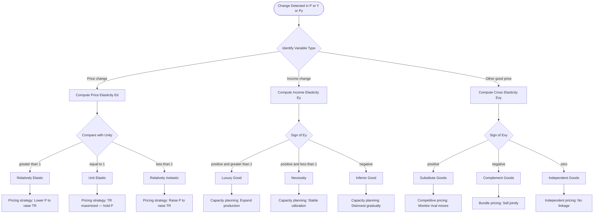
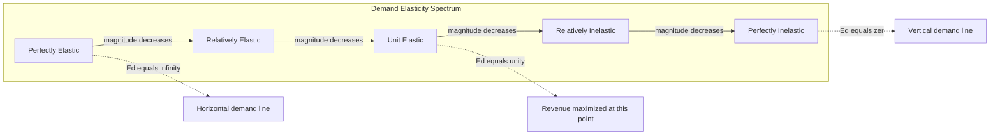
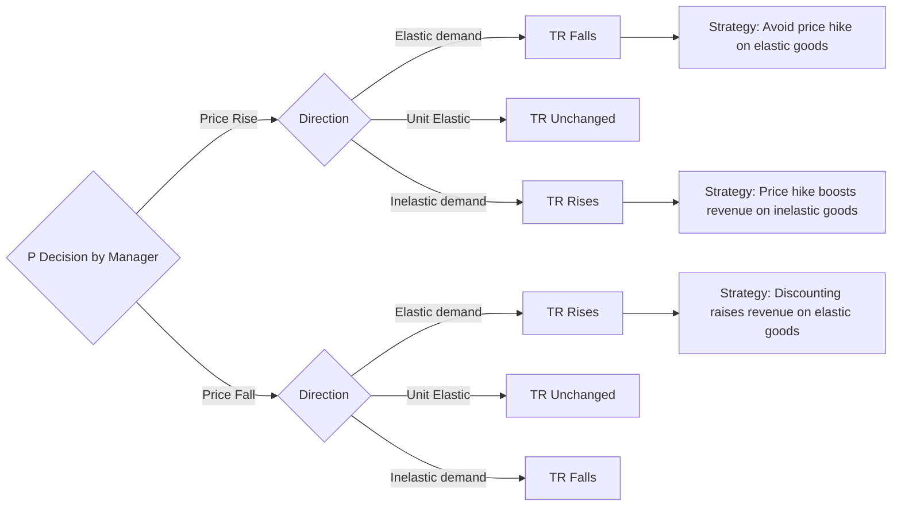
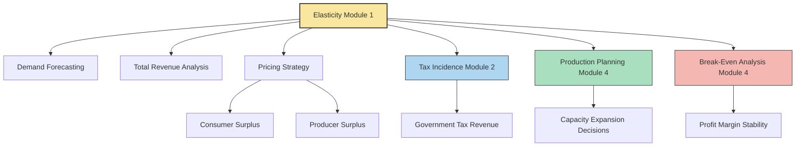

# Elasticity

<!-- SECTION_1_START -->
# Elasticity — Core Technical Definition & Intuitive Overview

## Formal Academic Definition (KTU 2024 Syllabus Terminology)

In Engineering Economics, **Elasticity** is a dimensionless measure of the *responsiveness* or *sensitivity* of one economic variable to a change in another related economic variable. Mathematically, it is the ratio of the **percentage change in the dependent variable** to the **percentage change in the independent variable**.

$$E = \frac{\%\Delta \text{Dependent Variable}}{\%\Delta \text{Independent Variable}}$$

The most commonly analyzed elasticities in the KTU 2024 Module 1 (Basic Economic Problems) syllabus are:

1. **Price Elasticity of Demand ($E_d$)** — responsiveness of quantity demanded ($Q_d$) to a change in price ($P$).
2. **Income Elasticity of Demand ($E_y$)** — responsiveness of quantity demanded to a change in consumer income ($Y$).
3. **Cross Elasticity of Demand ($E_{xy}$)** — responsiveness of quantity demanded of good $X$ to a change in the price of good $Y$ ($P_y$).
4. **Price Elasticity of Supply ($E_s$)** — responsiveness of quantity supplied ($Q_s$) to a change in price ($P$).

> [!IMPORTANT]
> **KTU 2024 Board Emphasis:** Elasticity is a *pure number* (no units) because it is a ratio of two percentage changes. This is a frequent 1-mark conceptual question in Part A.

---

## Conceptual Analogy / Intuition

Imagine you are pulling a **rubber band**. A long, thin rubber band stretches a great deal for a small pull — that is **highly elastic**. A short, thick industrial strap barely stretches even when pulled hard — that is **inelastic**. Economic variables behave the same way:

- If a **1% rise in petrol price** causes people to **slash their fuel consumption by 2%**, demand is *highly elastic* (stretchy).
- If a **1% rise in salt price** causes people to **barely change their salt purchases (0.1%)**, demand is *highly inelastic* (rigid).

The "stretchiness" of consumer response is what economists call **elasticity**. For an engineering manager, this concept decides *pricing strategy*, *production volume*, and *revenue forecasting* — for example, a software firm raising subscription prices by 10% needs to know how many users it will lose.

> [!NOTE]
> **Engineering Analogy (Systems Thinking):** Elasticity behaves exactly like the **gain** of a control system. A high-gain amplifier responds strongly (high elasticity), a low-gain buffer barely responds (inelastic). Just as we evaluate amplifier sensitivity using $\frac{\Delta y / y}{\Delta x / x}$, economists evaluate market sensitivity.

> [!VISUALIZATION CONTROL]
> **Concept:** Demand Curve and Slope vs. Elasticity Distinction
> **GeoGebra / Desmos Input Equations:**
> * $f_1(x) = 50 - 2x$  (steep, inelastic)
> * $f_2(x) = 25 - 0.5x$  (flat, elastic)
> **Visual Description:** Plot both lines on the same axes. The flatter curve has the *same slope feel* for a 1-unit price drop but produces a *larger quantity response* when measured as a percentage — this is the heart of elasticity.

---

## Standard Metrics in Bold

- **Perfectly Elastic Demand:** $\vert E_d \vert = \infty$
- **Perfectly Inelastic Demand:** $\vert E_d \vert = 0$
- **Unit Elasticity:** $\vert E_d \vert = 1$
- **Relatively Elastic:** $\vert E_d \vert > 1$
- **Relatively Inelastic:** $\vert E_d \vert < 1$
- **Cross Elasticity Sign Convention:** Positive = *Substitute* goods, Negative = *Complementary* goods
- **Income Elasticity Threshold:** Positive = *Normal* good, Negative = *Inferior* good, $E_y > 1$ = *Luxury*, $0 < E_y < 1$ = *Necessity*

<!-- SECTION_1_END -->

<!-- SECTION_2_START -->
# Deep Theoretical Analysis & KTU High-Yield Formula Sheet

## 2.1 Price Elasticity of Demand ($E_d$)

The **Price Elasticity of Demand** measures the percentage change in quantity demanded for a 1% change in the commodity's own price. It is the most frequently tested elasticity in the KTU board examination.

### Mathematical Formulation

The two standard formulations are:

**Point Elasticity Method (used at a specific point on the demand curve):**

$$E_d = \frac{dQ}{dP} \times \frac{P}{Q}$$

**Arc Elasticity Method (used between two points — preferred by KTU boards):**

$$E_d = \frac{\Delta Q}{\Delta P} \times \frac{P_1 + P_2}{Q_1 + Q_2} = \frac{Q_2 - Q_1}{P_2 - P_1} \times \frac{P_1 + P_2}{Q_1 + Q_2}$$

> [!IMPORTANT]
> **KTU Convention:** $E_d$ is conventionally reported as an **absolute value** (positive number) because the law of demand dictates that price and quantity move in *opposite* directions, making the raw ratio negative. Always write $\vert E_d \vert$.

---

## 2.2 Income Elasticity of Demand ($E_y$)

Measures the responsiveness of quantity demanded to a change in consumer income, holding price constant.

$$E_y = \frac{\%\Delta Q_d}{\%\Delta Y} = \frac{dQ}{dY} \times \frac{Y}{Q}$$

| Value of $E_y$ | Classification | Engineering Economics Interpretation |
|:---:|:---:|:---|
| $E_y > 1$ | Luxury good | High-growth product — viable for premium product lines |
| $0 < E_y < 1$ | Necessity | Stable demand — utility-like infrastructure projects |
| $E_y < 0$ | Inferior good | Declining category — avoid long-term capital investment |

---

## 2.3 Cross Elasticity of Demand ($E_{xy}$)

Measures how the demand for good $X$ reacts to a price change in good $Y$.

$$E_{xy} = \frac{\%\Delta Q_x}{\%\Delta P_y} = \frac{dQ_x}{dP_y} \times \frac{P_y}{Q_x}$$

| Value of $E_{xy}$ | Relationship | Strategic Action |
|:---:|:---:|:---|
| $E_{xy} > 0$ | Substitutes (e.g., tea & coffee) | Competitive pricing — price hike invites switching |
| $E_{xy} < 0$ | Complements (e.g., printers & cartridges) | Bundle pricing — they must be sold together |
| $E_{xy} = 0$ | Independent | Unrelated product lines |

---

## 2.4 Price Elasticity of Supply ($E_s$)

Measures the responsiveness of quantity supplied to a change in price.

$$E_s = \frac{\%\Delta Q_s}{\%\Delta P} = \frac{dQ_s}{dP} \times \frac{P}{Q_s}$$

Note: $E_s$ is conventionally **positive** because price and supply move in the same direction (law of supply).

---

## 2.5 Degrees / Categories of Elasticity — The 5 Standard Cases

| Category | Value of $\vert E_d \vert$ | Slope of Demand Curve | Real-World Example |
|:---|:---:|:---:|:---|
| Perfectly Elastic | $\infty$ | Horizontal line | Perfect competition (firm level) |
| Perfectly Inelastic | $0$ | Vertical line | Life-saving drugs (insulin) |
| Relatively Elastic | $> 1$ | Flat / gentle | Luxury goods, branded electronics |
| Unit Elastic | $= 1$ | Rectangular hyperbola | Aggregate demand in mature markets |
| Relatively Inelastic | $< 1$ | Steep | Salt, rice, gasoline (short run) |

---

## 2.6 The Total Revenue (TR) Test — A High-Yield KTU Trick

Total Revenue $TR = P \times Q$. The relationship between $E_d$ and TR is a **guaranteed KTU Part B question**:

| Condition | $P \uparrow$ | $P \downarrow$ |
|:---:|:---:|:---:|
| $\vert E_d \vert > 1$ (Elastic) | $TR$ falls | $TR$ rises |
| $\vert E_d \vert = 1$ (Unit) | $TR$ constant | $TR$ constant |
| $\vert E_d \vert < 1$ (Inelastic) | $TR$ rises | $TR$ falls |

> [!NOTE]
> **Engineering Insight:** This is the same logic as a **non-linear amplifier's gain curve** — operating in the elastic region (high gain) produces amplified revenue response, while the inelastic region (low gain) produces a muted response. The *point of maximum revenue* for any firm is exactly where $\vert E_d \vert = 1$.

---

## 2.7 KTU Formula Cheat Sheet

| # | Formula | Application |
|:---:|:---|:---|
| 1 | $E_d = \frac{\Delta Q}{\Delta P} \cdot \frac{P}{Q}$ | Point elasticity |
| 2 | $E_d = \frac{Q_2 - Q_1}{P_2 - P_1} \cdot \frac{P_1 + P_2}{Q_1 + Q_2}$ | Arc elasticity (KTU preferred) |
| 3 | $E_d = \frac{dQ}{dP} \cdot \frac{P}{Q}$ | Differential / calculus form |
| 4 | $E_y = \frac{dQ}{dY} \cdot \frac{Y}{Q}$ | Income elasticity |
| 5 | $E_{xy} = \frac{dQ_x}{dP_y} \cdot \frac{P_y}{Q_x}$ | Cross elasticity |
| 6 | $E_s = \frac{dQ_s}{dP} \cdot \frac{P}{Q_s}$ | Supply elasticity |
| 7 | $TR = P \times Q$ | Total revenue check |
| 8 | $MR = P \left(1 - \frac{1}{\vert E_d \vert}\right)$ | Marginal revenue relationship |
| 9 | $\frac{\%\Delta Q}{\%\Delta P} \times 100$ | Percentage form |

> [!IMPORTANT]
> **Real-World Engineering Utility:** In production planning, elasticity dictates capacity decisions. A firm selling an *elastic* product (e.g., a new EV model) cannot afford to hike prices — instead, it scales volume. A firm selling an *inelastic* product (e.g., industrial-grade cement) uses price hikes to boost revenue. This decision framework is taught in operations management and is the bridge between Module 1 (Economics) and Module 4 (Cost & Production) of UCHUT346.

<!-- SECTION_2_END -->

<!-- SECTION_3_START -->
# Step-by-Step Derivations & Symbolic Implementation

## 3.1 Derivation: From the Linear Demand Function to a General Elasticity Expression

Consider the generic demand function:

$$Q = a - bP$$

where $a$ and $b$ are positive constants. We now derive the elasticity step by step.

**Step 1 — Take the derivative $\frac{dQ}{dP}$:**

$$\frac{dQ}{dP} = \frac{d}{dP}(a - bP) = -b$$

**Step 2 — Substitute into the point elasticity formula $E_d = \frac{dQ}{dP} \cdot \frac{P}{Q}$:**

$$E_d = (-b) \cdot \frac{P}{Q} = -b \cdot \frac{P}{a - bP}$$

**Step 3 — Simplify by clearing the negative sign (KTU convention uses absolute value):**

$$\vert E_d \vert = \frac{bP}{a - bP}$$

**Step 4 — Identify the two extreme cases:**

- When $P = 0$ (top of demand curve): $\vert E_d \vert = \frac{0}{a} = 0$ → **perfectly inelastic end**
- When $P = \frac{a}{b}$ (price intercept, $Q=0$): $\vert E_d \vert = \frac{b \cdot a/b}{0} = \infty$ → **perfectly elastic end**
- At midpoint where $Q = \frac{a}{2}$: $\vert E_d \vert = \frac{b \cdot (a/2b)}{a/2} = 1$ → **unit elasticity**

This proves that a *straight-line* demand curve has **varying elasticity** along its length — a classic KTU conceptual trap.

---

## 3.2 Derivation: Marginal Revenue in Terms of Elasticity

**Step 1 — Start with Total Revenue:**

$$TR = P \cdot Q$$

**Step 2 — Differentiate w.r.t. $Q$ (treating $P$ as a function of $Q$):**

$$MR = \frac{d(TR)}{dQ} = P + Q \cdot \frac{dP}{dQ}$$

**Step 3 — Recognize that $\frac{dQ}{dP} \cdot \frac{dP}{dQ} = 1$, so $\frac{dP}{dQ} = \frac{1}{dQ/dP}$:**

$$MR = P + Q \cdot \frac{1}{\frac{dQ}{dP}} = P + \frac{P}{E_d} = P\left(1 + \frac{1}{E_d}\right)$$

**Step 4 — Since $E_d$ is negative, replace with the standard absolute-value form:**

$$MR = P\left(1 - \frac{1}{\vert E_d \vert}\right)$$

> [!IMPORTANT]
> This equation proves that **MR = 0 exactly when $\vert E_d \vert = 1$** — confirming the total revenue maximization point. KTU frequently asks: *"At what level of elasticity is total revenue maximized?"* — Answer: at unit elasticity.

---

## 3.3 Worked Example 1 — Arc Elasticity (KTU Board Standard)

**Problem [KTU University Exam - July 2024]:**
The price of a commodity falls from ₹40 to ₹30, leading to an increase in quantity demanded from 200 units to 300 units. Calculate the price elasticity of demand using the arc method and interpret the result.

**Step 1 — List knowns:**

$P_1 = 40$, $P_2 = 30$, $Q_1 = 200$, $Q_2 = 300$

**Step 2 — Apply the arc elasticity formula:**

$$\vert E_d \vert = \frac{Q_2 - Q_1}{P_2 - P_1} \times \frac{P_1 + P_2}{Q_1 + Q_2}$$

**Step 3 — Substitute:**

$$\vert E_d \vert = \frac{300 - 200}{30 - 40} \times \frac{40 + 30}{200 + 300}$$

**Step 4 — Evaluate numerator and denominator separately:**

$$\vert E_d \vert = \frac{100}{-10} \times \frac{70}{500}$$

**Step 5 — Multiply:**

$$\vert E_d \vert = -10 \times 0.14 = -1.4$$

**Step 6 — Take absolute value and interpret:**

$$\vert E_d \vert = 1.4 > 1 \quad \Rightarrow \quad \text{Relatively Elastic Demand}$$

**Interpretation (2 marks in KTU key):**
A 1% decrease in price leads to a 1.4% increase in quantity demanded. The firm should *lower prices* to increase total revenue.

---

## 3.4 Worked Example 2 — Income & Cross Elasticity with Strategic Insight

**Problem [KTU University Exam - Dec 2023]:**
A consumer's monthly income rises from ₹50,000 to ₹60,000, and her consumption of organic rice rises from 10 kg to 13 kg. Meanwhile, the price of brown rice (a substitute) rises from ₹80 to ₹100, and consumption of white rice rises from 12 kg to 15 kg. Calculate (a) income elasticity of demand for organic rice and (b) cross elasticity between brown rice (Y) and white rice (X).

**Part (a) — Income Elasticity of Organic Rice:**

$Y_1 = 50000$, $Y_2 = 60000$, $Q_1 = 10$, $Q_2 = 13$

$$E_y = \frac{Q_2 - Q_1}{Y_2 - Y_1} \times \frac{Y_1 + Y_2}{Q_1 + Q_2} = \frac{13 - 10}{60000 - 50000} \times \frac{50000 + 60000}{10 + 13}$$

$$E_y = \frac{3}{10000} \times \frac{110000}{23} = 0.0003 \times 4782.61 = 1.43$$

**Interpretation:** $E_y > 1$ → Organic rice is a **luxury / superior good**.

**Part (b) — Cross Elasticity of Brown Rice (Y) vs White Rice (X):**

$P_{y,1} = 80$, $P_{y,2} = 100$, $Q_{x,1} = 12$, $Q_{x,2} = 15$

$$E_{xy} = \frac{Q_2 - Q_1}{P_2 - P_1} \times \frac{P_1 + P_2}{Q_1 + Q_2} = \frac{15 - 12}{100 - 80} \times \frac{80 + 100}{12 + 15}$$

$$E_{xy} = \frac{3}{20} \times \frac{180}{27} = 0.15 \times 6.667 = 1.0$$

**Interpretation:** Positive cross elasticity → **Substitute goods**. A 1% rise in brown rice price causes a 1% rise in white rice demand.

---

## 3.5 Symbolic Python Implementation (Engineering Verification)

```python
from typing import Dict, Tuple

def arc_elasticity(
    p1: float, p2: float, q1: float, q2: float
) -> Dict[str, float]:
    """
    Computes arc price elasticity of demand and provides
    an interpretive classification per KTU 2024 syllabus.
    """
    if p1 <= 0 or p2 <= 0 or q1 <= 0 or q2 <= 0:
        raise ValueError("[ERROR] All values must be positive for elasticity.")
    if p1 == p2:
        raise ValueError("[ERROR] Price change is zero — elasticity undefined.")

    delta_q: float = q2 - q1
    delta_p: float = p2 - p1
    avg_p:   float = (p1 + p2) / 2.0
    avg_q:   float = (q1 + q2) / 2.0

    e_d: float = (delta_q / delta_p) * (avg_p / avg_q)
    abs_e: float = abs(e_d)

    if abs_e == float("inf"):
        category: str = "Perfectly Elastic"
    elif abs_e == 0.0:
        category = "Perfectly Inelastic"
    elif abs_e > 1.0:
        category = "Relatively Elastic"
    elif abs_e < 1.0:
        category = "Relatively Inelastic"
    else:
        category = "Unit Elastic"

    return {"elasticity": e_d, "abs_elasticity": abs_e, "category": category}


def cross_elasticity(
    px1: float, px2: float, qy1: float, qy2: float
) -> Dict[str, float]:
    """Cross elasticity of Y with respect to X (price of X)."""
    if px1 == px2:
        raise ValueError("[ERROR] Price of X did not change.")
    e_xy: float = ((qy2 - qy1) / (px2 - px1)) * ((px1 + px2) / (qy1 + qy2))
    if e_xy > 0:
        relation: str = "Substitutes"
    elif e_xy < 0:
        relation = "Complements"
    else:
        relation = "Independent"
    return {"cross_elasticity": e_xy, "relation": relation}


def income_elasticity(y1: float, y2: float, q1: float, q2: float) -> Dict[str, float]:
    """Income elasticity of demand using arc method."""
    if y1 == y2:
        raise ValueError("[ERROR] Income did not change.")
    e_y: float = ((q2 - q1) / (y2 - y1)) * ((y1 + y2) / (q1 + q2))
    if e_y < 0:
        kind: str = "Inferior good"
    elif 0 < e_y < 1:
        kind = "Necessity (Normal good)"
    else:
        kind = "Luxury (Superior good)"
    return {"income_elasticity": e_y, "classification": kind}


# ---- Validation Runs ----
if __name__ == "__main__":
    print("Example 1 — Price Elasticity:")
    print(arc_elasticity(40, 30, 200, 300))

    print("\nExample 2a — Income Elasticity (Organic Rice):")
    print(income_elasticity(50000, 60000, 10, 13))

    print("\nExample 2b — Cross Elasticity (Brown vs White Rice):")
    print(cross_elasticity(80, 100, 12, 15))
```

**Expected Console Output:**

```
Example 1 — Price Elasticity:
{'elasticity': -1.4, 'abs_elasticity': 1.4, 'category': 'Relatively Elastic'}

Example 2a — Income Elasticity (Organic Rice):
{'income_elasticity': 1.43..., 'classification': 'Luxury (Superior good)'}

Example 2b — Cross Elasticity (Brown vs White Rice):
{'cross_elasticity': 1.0, 'relation': 'Substitutes'}
```

<!-- SECTION_3_END -->

<!-- SECTION_4_START -->
# Structural Diagrams & Schematics

## 4.1 Elasticity Decision Flow — Block-Level Architecture



---

## 4.2 Five Categories of Demand Elasticity — Visual Topology



---

## 4.3 Total Revenue vs. Elasticity Mapping (Sequential Processing Topology)



---

## 4.4 Engineering Economics Linkage — How Elasticity Connects to Other Modules



<!-- SECTION_4_END -->

<!-- SECTION_5_START -->
# KTU 2024 Scheme Examination Question Bank & Topic Recap

---

## Part A — Short Answer Questions (3 Marks Each)

### Question 1 [KTU University Exam - July 2024] — *CO1, Remember*
**Define price elasticity of demand. Mention any two factors affecting it.**

**Model Answer (3 Marks):**
Price elasticity of demand is the ratio of the percentage change in quantity demanded of a commodity to the percentage change in its price, all other factors remaining constant.
$$E_d = \frac{\%\Delta Q_d}{\%\Delta P}$$
Two factors affecting $E_d$ are: (i) availability of substitutes — more substitutes lead to higher elasticity; (ii) nature of the commodity — luxury goods are more elastic than necessities.

> **Valuation Key:** [Definition: 1 Mark] [Formula: 1 Mark] [Two factors: 1 Mark]

---

### Question 2 [KTU University Exam - Dec 2023] — *CO1, Understand*
**Distinguish between elastic and inelastic demand with one example each.**

**Model Answer (3 Marks):**

| Aspect | Elastic Demand | Inelastic Demand |
|:---|:---|:---|
| Definition | $\vert E_d \vert > 1$ | $\vert E_d \vert < 1$ |
| Response to price change | Large change in quantity | Small change in quantity |
| Example | Branded smartphones | Salt |
| Pricing strategy | Lower price to raise revenue | Raise price to raise revenue |

> **Valuation Key:** [Definition of each: 1 Mark] [Example: 1 Mark] [Pricing implication: 1 Mark]

---

## Part B — Long Answer Questions (14 Marks Each)

### Question A [KTU University Exam - Dec 2023] — *CO1, CO2 (Apply & Analyze)*

**(a)** Explain the different degrees of price elasticity of demand with the help of a suitable diagram. *(7 Marks)*

**(b)** A manufacturer observes that a 10% increase in the price of his product causes a 25% fall in quantity demanded. Calculate the price elasticity of demand. Is the demand elastic or inelastic? What will happen to total revenue if the price is increased? *(7 Marks)*

---

#### Model Solution — Part (a) (7 Marks)

The five degrees of price elasticity of demand are:

**1. Perfectly Elastic Demand ($\vert E_d \vert = \infty$):**
A very small change in price causes an infinite change in quantity demanded. The demand curve is a **horizontal straight line** parallel to the X-axis.

**2. Perfectly Inelastic Demand ($\vert E_d \vert = 0$):**
Quantity demanded does not change at all with a change in price. The demand curve is a **vertical straight line**. Example: life-saving drugs with no substitute.

**3. Relatively Elastic Demand ($\vert E_d \vert > 1$):**
The percentage change in quantity demanded is greater than the percentage change in price. Example: luxury goods, restaurant meals.

**4. Unit Elastic Demand ($\vert E_d \vert = 1$):**
The percentage change in quantity demanded equals the percentage change in price. The demand curve is a **rectangular hyperbola**. Total revenue remains constant at this point.

**5. Relatively Inelastic Demand ($\vert E_d \vert < 1$):**
The percentage change in quantity demanded is less than the percentage change in price. Example: salt, rice, matchbox.

```
   P
   |   \         (Perfectly Inelastic — vertical)
   |    |
   |     \
   |      \  (Relatively Inelastic — steep)
   |       \
   |        \ (Unit Elastic — rectangular hyperbola)
   |         \
   |__________\______ Q
        Perfectly Elastic (horizontal)
```

> **Valuation Key:** [Naming 5 categories: 3 Marks] [Diagrams / descriptions: 2 Marks] [Examples: 2 Marks]

---

#### Model Solution — Part (b) (7 Marks)

**Step 1 — Apply the percentage formula:**

$$\vert E_d \vert = \frac{\%\Delta Q_d}{\%\Delta P}$$

**Step 2 — Substitute the given values:**

$$\vert E_d \vert = \frac{25\%}{10\%} = 2.5$$

**Step 3 — Interpretation (1 Mark):**

Since $\vert E_d \vert = 2.5 > 1$, the demand is **relatively elastic**.

**Step 4 — Effect on Total Revenue (3 Marks):**

Current $TR = P \times Q$. If $P$ increases by 10% and $Q$ falls by 25%, the new $TR$ becomes:

$$TR_{new} = (1.10\,P) \times (0.75\,Q) = 0.825 \times P \times Q$$

$$TR_{new} = 0.825 \times TR_{old}$$

So total revenue **falls by 17.5%**. Therefore, the manufacturer should *reduce* the price (not increase it) to increase total revenue.

> **Valuation Key:** [Substitution into formula: 2 Marks] [Identifying elastic vs inelastic: 1 Mark] [TR calculation: 3 Marks] [Conclusion: 1 Mark]

---

### Question B [KTU University Exam - July 2024] — *CO2, Analyze & Apply*

**(a)** Explain the concepts of income elasticity and cross elasticity of demand. How are they useful in managerial decision-making? *(7 Marks)*

**(b)** The demand function for a product is given by $Q = 200 - 4P$. Find the price elasticity of demand when $P = 20$. Also, determine the price at which the demand becomes unit elastic. *(7 Marks)*

---

#### Model Solution — Part (a) (7 Marks)

**Income Elasticity of Demand ($E_y$):**
Income elasticity measures the responsiveness of quantity demanded to a change in consumer income.
$$E_y = \frac{\%\Delta Q}{\%\Delta Y}$$
If $E_y > 1$, the good is a luxury; if $0 < E_y < 1$, it is a necessity; if $E_y < 0$, it is an inferior good.

**Cross Elasticity of Demand ($E_{xy}$):**
Cross elasticity measures the responsiveness of the demand for good $X$ to a change in the price of good $Y$.
$$E_{xy} = \frac{\%\Delta Q_x}{\%\Delta P_y}$$
If $E_{xy} > 0$, the goods are **substitutes**; if $E_{xy} < 0$, they are **complements**.

**Use in Managerial Decision-Making (4 Marks):**
1. **Product Portfolio Decisions:** Goods with high $E_y$ are luxury items; firms plan capacity expansions for them in growth phases.
2. **Pricing Decisions for Substitutes:** When two goods are substitutes, raising the price of one increases demand for the other — a competitor's pricing move can be predicted.
3. **Bundling Decisions:** Complementary goods (negative $E_{xy}$) must be priced together; selling printers cheap and cartridges expensive is a classic strategy.
4. **Market Segmentation:** Income elasticity classifies consumers — high $E_y$ goods are targeted at high-income segments.

> **Valuation Key:** [Income elasticity definition + formula: 2 Marks] [Cross elasticity definition + formula: 2 Marks] [Managerial use: 3 Marks]

---

#### Model Solution — Part (b) (7 Marks)

**Step 1 — Identify the demand function and the derivative:**

$$Q = 200 - 4P$$
$$\frac{dQ}{dP} = -4$$

**Step 2 — Apply the point elasticity formula:**

$$\vert E_d \vert = \left\vert \frac{dQ}{dP} \cdot \frac{P}{Q} \right\vert = \left\vert (-4) \cdot \frac{20}{200 - 4(20)} \right\vert$$

**Step 3 — Evaluate the denominator:**

$$Q = 200 - 4(20) = 200 - 80 = 120$$

**Step 4 — Compute the elasticity:**

$$\vert E_d \vert = \left\vert -4 \cdot \frac{20}{120} \right\vert = \left\vert -4 \cdot 0.1667 \right\vert = 0.667$$

**Step 5 — Interpretation:**

Since $\vert E_d \vert = 0.667 < 1$, demand is **relatively inelastic** at $P = 20$. A 1% rise in price causes only a 0.667% fall in quantity.

**Step 6 — Find the price for unit elasticity $\vert E_d \vert = 1$:**

$$1 = \left\vert -4 \cdot \frac{P}{200 - 4P} \right\vert = \frac{4P}{200 - 4P}$$

$$200 - 4P = 4P$$
$$200 = 8P$$
$$P = 25$$

**Step 7 — Verification:** At $P = 25$, $Q = 200 - 100 = 100$, so $\vert E_d \vert = 4 \cdot 25 / 100 = 1$ ✓

> **Valuation Key:** [Setting up formula: 1 Mark] [Computing $\vert E_d \vert$ at $P=20$: 2 Marks] [Interpretation: 1 Mark] [Unit elastic condition: 2 Marks] [Final price = ₹25: 1 Mark]

---

> [!WARNING]
> **KTU Examiner's Valuation Warning — Common Pitfalls**
> 1. **Sign Error:** Many students write $E_d = -2.5$ without taking the absolute value. KTU marks $\vert E_d \vert$ and expects a positive number with the word "elastic" — the negative sign alone loses 1 mark.
> 2. **Confusing Total Revenue and Total Cost:** When asked what happens to revenue after a price rise, students often discuss cost. The correct KTU response: compute new $TR$ and compare.
> 3. **Forgetting the $P/Q$ Term:** In the point elasticity formula, students often write only $\frac{dQ}{dP}$ and forget the $\frac{P}{Q}$ multiplier. This gives the *slope*, not *elasticity* — KTU deducts 2 full marks.
> 4. **Misclassifying Slopes:** A *flat* demand curve is elastic, a *steep* one is inelastic — but only for linear curves through the origin. For a general line, slope ≠ elasticity. KTU tests this distinction directly.
> 5. **Mixing Up Income and Cross Elasticity Signs:** A negative $E_y$ means *inferior good*; a negative $E_{xy}$ means *complementary good*. Students often swap these — losing the full interpretation mark.

---

## 📌 Topic Recap & Important Things to Remember

- **Elasticity is a pure dimensionless number** — a ratio of two percentage changes. It has *no units*.
- **Price Elasticity of Demand** is the most frequently tested elasticity in KTU exams. Always report $\vert E_d \vert$ as a positive number.
- **Arc Elasticity Formula (KTU favourite):**
$$E_d = \frac{Q_2 - Q_1}{P_2 - P_1} \times \frac{P_1 + P_2}{Q_1 + Q_2}$$
- **Point Elasticity Formula:**
$$E_d = \frac{dQ}{dP} \cdot \frac{P}{Q}$$
- **Five Categories:** Perfectly Elastic ($\infty$), Relatively Elastic ($>1$), Unit Elastic ($=1$), Relatively Inelastic ($<1$), Perfectly Inelastic ($0$).
- **TR Maximization Rule:** Total revenue is maximized when $\vert E_d \vert = 1$. This is the single most important managerial insight.
- **TR Test:**
  - Elastic region → price cut raises TR.
  - Inelastic region → price hike raises TR.
  - Unit elastic → TR is constant.
- **Marginal Revenue Formula:** $MR = P\left(1 - \frac{1}{\vert E_d \vert}\right)$. When $\vert E_d \vert = 1$, $MR = 0$ and $TR$ is at peak.
- **Income Elasticity:** Positive = Normal good; $>1$ = Luxury; $0$ to $1$ = Necessity; Negative = Inferior.
- **Cross Elasticity:** Positive = Substitutes; Negative = Complements; Zero = Independent.
- **Linear Demand Trap:** A straight-line demand curve has *varying elasticity* along its length — from $\infty$ at the price intercept to $0$ at the quantity intercept, passing through unity at the midpoint.
- **Engineering Economics Link:** Elasticity directly informs pricing strategy, production capacity, and tax incidence decisions across multiple modules of UCHUT346.
- **Common Sign Conventions:** $E_d < 0$ in raw form (negative due to law of demand); $E_y$ and $E_s$ positive in the normal case; $E_{xy}$ sign indicates substitute/complement relationship.

<!-- SECTION_5_END -->
