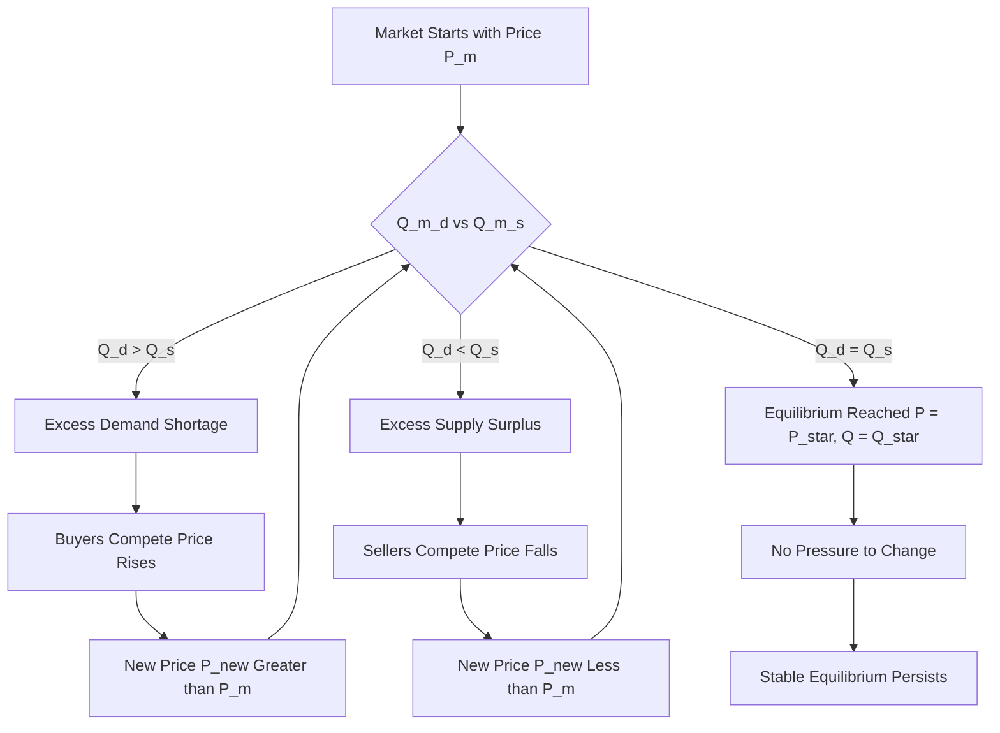
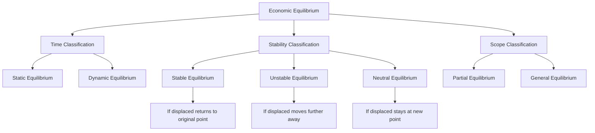
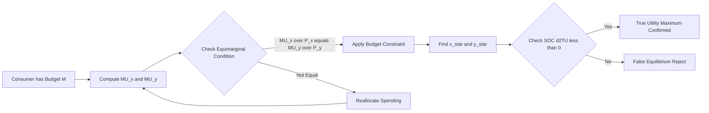
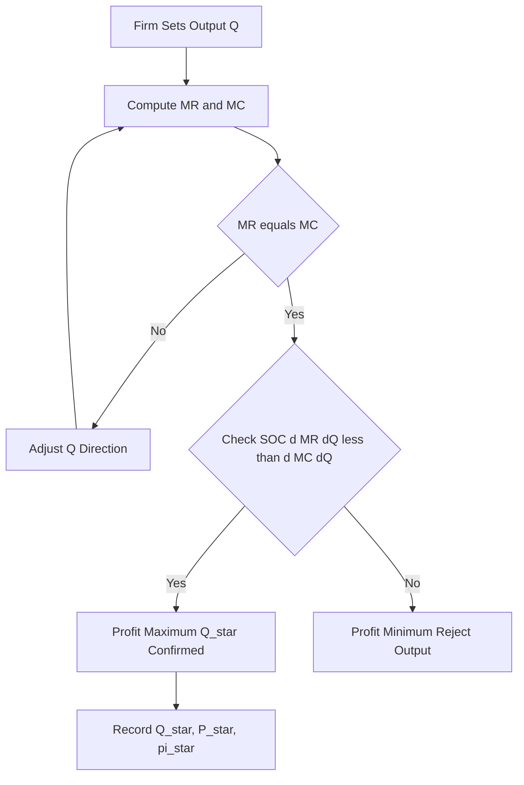
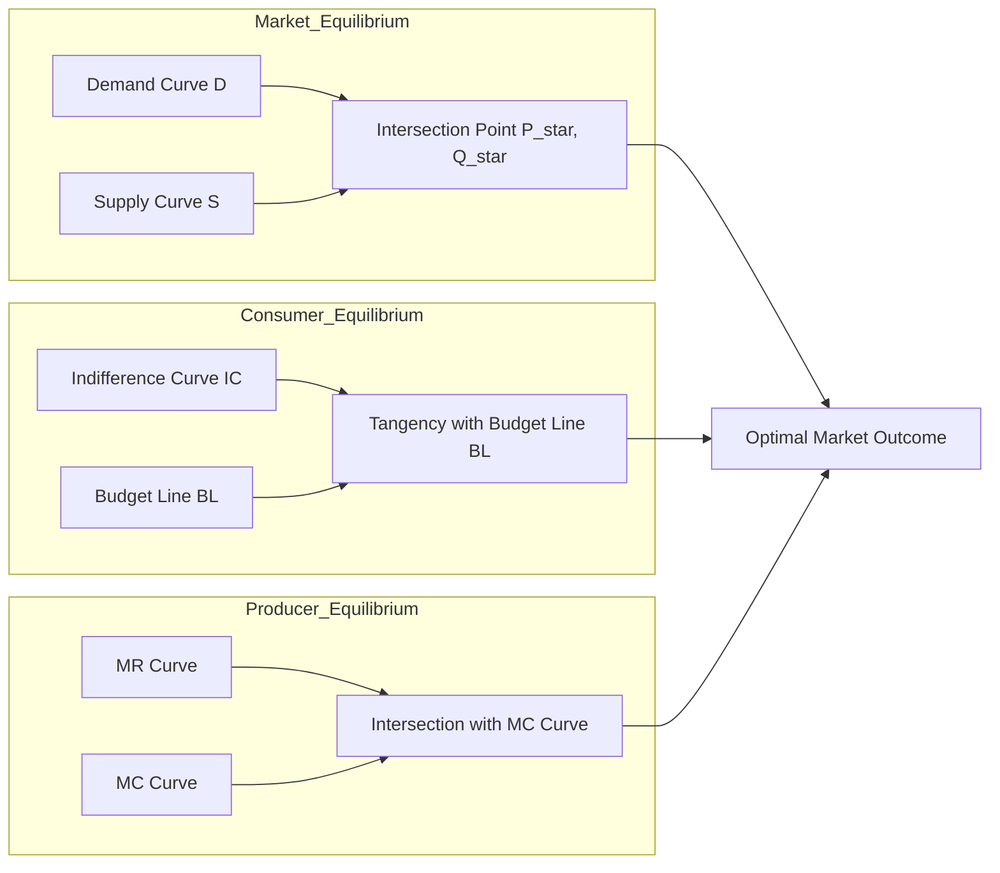

# Equilibrium

<!-- SECTION_1_START -->

# Equilibrium in Economics — Foundational Concept

## 1.1 Formal Definition (KTU 2024 Syllabus Terminology)

> [!IMPORTANT]
> **Economic Equilibrium** is a state of rest or balance in which the economic forces operating on a system (such as demand and supply, or marginal utility and marginal cost) are mutually counteracting and produce a position of no inherent tendency to change. At equilibrium, the **decision-making variables** (price $P^*$ and quantity $Q^*$) satisfy the optimality condition: there is no surplus and no shortage in the market.

In mathematical form, a market attains equilibrium when the **Quantity Demanded ($Q_d$)** is exactly equal to the **Quantity Supplied ($Q_s$)** at a common price $P^*$.

$$
Q_d(P^*) \;=\; Q_s(P^*)
$$

The point of intersection of the demand curve $D(P)$ and the supply curve $S(P)$ in the price–quantity plane defines the **equilibrium point** $(Q^*,\,P^*)$.

---

## 1.2 Intuitive Overview — "The See-Saw Analogy"

> [!NOTE]
> **Plain-English Intuition**
> Imagine two children sitting on opposite ends of a **see-saw**. When the children are of equal weight, the see-saw stays perfectly horizontal — this is *equilibrium*. If one child is heavier, the lighter child goes up, the heavier one goes down, and the see-saw moves until balance is restored. Similarly, in a market, **buyers (demand) push prices down** while **sellers (supply) push prices up**. The market price settles exactly where these two opposite pressures cancel out.

> **Three Golden Conditions of Equilibrium**
> 1. There exists a **tendency to change** in the system (forces exist).
> 2. There is a **restoring mechanism** that counters the change.
> 3. The system **stops changing** when the opposing forces are equal.

---

## 1.3 Three Principal Equilibria Covered in Module 1

| Equilibrium Type | Decision Maker | Optimising Variable | Core Condition |
| :--- | :--- | :--- | :--- |
| **Market Equilibrium** | Buyer & Seller | Price $P$, Quantity $Q$ | $Q_d(P) = Q_s(P)$ |
| **Consumer's Equilibrium** | Consumer | Bundle of goods $(x,y)$ | $\dfrac{MU_x}{P_x} = \dfrac{MU_y}{P_y} = MU_m$ |
| **Producer's Equilibrium** | Producer (Firm) | Output level $Q$ | $MR = MC$ with $MC$ rising (i.e. $\frac{dMC}{dQ} > 0$) |

> [!NOTE]
> The course UCHUT346 (Economics for Engineers) primarily treats **Market Equilibrium** under the *Demand–Supply framework*, with brief exposure to **Consumer's and Producer's Equilibrium** as applications in pricing and cost–revenue decisions.

---

## 1.4 Classification of Equilibrium

> [!IMPORTANT]
> KTU 2024 Module 1 specifically requires students to **classify equilibrium along two axes**: (a) Time, and (b) Stability.

### A. Based on Time Horizon
* **Static Equilibrium** — Established under *ceteris paribus* (all other things constant). Only current period data is used. No reference to past or future. Example: A one-shot market clearance.
* **Dynamic Equilibrium** — Established when forces change *over time* and the system still returns to balance. Example: Continuous market clearance across successive periods.

### B. Based on Stability Behaviour
* **Stable Equilibrium** — When the system, if displaced, automatically returns to its original equilibrium point.
* **Unstable Equilibrium** — When the system, if displaced, moves *further away* from the original equilibrium point.
* **Neutral (Metastable) Equilibrium** — When the system, if displaced, neither returns nor moves away; it settles at the new position.

### C. Scope of Analysis
* **Partial Equilibrium** — Analysis of a *single market* in isolation, holding all other markets constant. Pioneered by **Alfred Marshall**.
* **General Equilibrium** — Analysis of *all markets simultaneously*, recognising inter-dependence. Pioneered by **Léon Walras**.

---

## 1.5 GeoGebra / Desmos Visualisation

> [!VISUALIZATION CONTROL]
> **Concept:** Demand–Supply Intersection (Market Equilibrium Geometry)
> **GeoGebra / Desmos Input Equations:**
> * $Q_d(P) = 60 - 4P$ (linear demand — downward sloping)
> * $Q_s(P) = 10 + 2P$ (linear supply — upward sloping)
> **Visual Description:** Plot $P$ on the vertical axis and $Q$ on the horizontal axis. The downward line $Q_d$ and the upward line $Q_s$ must intersect at exactly one point — this intersection is the equilibrium point $(Q^*, P^*)$. The slope of demand is **negative** and the slope of supply is **positive**. The area above the equilibrium price is the *surplus region*; the area below is the *shortage region*.

> [!NOTE]
> For an equilibrium point to exist and be **unique**, the slope condition $dd/dq < ds/dq$ must hold (where $d = Q_d$ and $s = Q_s$). This guarantees that the demand curve is *flatter* than the supply curve near the equilibrium.

---

<!-- SECTION_1_END -->

<!-- SECTION_2_START -->

# Deep Theoretical Analysis & KTU High-Yield Formula Sheet

## 2.1 Market Equilibrium — Operational Logic

The market operates through a **price-adjustment mechanism**. Suppose the prevailing market price $P_m$ deviates from the equilibrium price $P^*$.

* **Case 1 — Excess Demand (Shortage):** If $P_m < P^*$, then $Q_d > Q_s$. Buyers compete for the limited goods, pushing price **upwards** toward $P^*$.
* **Case 2 — Excess Supply (Surplus):** If $P_m > P^*$, then $Q_s > Q_d$. Sellers compete to offload inventory, pushing price **downwards** toward $P^*$.
* **Case 3 — Equilibrium:** If $P_m = P^*$, then $Q_d = Q_s$ and there is **no pressure to change** the price.

> [!NOTE]
> **Economic Interpretation:** The equilibrium price $P^*$ acts as the *market-clearing price* — at this price, **every willing buyer finds a willing seller**, and there is neither unsold stock nor unmet demand.

---

## 2.2 Mathematical Formulation

Let the linear demand and supply functions be:

$$
Q_d \;=\; a \;-\; b P, \qquad b > 0
$$

$$
Q_s \;=\; c \;+\; d P, \qquad d > 0
$$

where $a, b, c, d$ are positive constants determined by consumer preferences, income, technology, and input costs.

**Equilibrium Condition:**

$$
Q_d \;=\; Q_s \;\;\Longrightarrow\;\; a - bP \;=\; c + dP
$$

**Equilibrium Price:**

$$
P^* \;=\; \frac{a - c}{b + d}
$$

**Equilibrium Quantity:** (substitute $P^*$ back into either equation)

$$
Q^* \;=\; \frac{a d + b c}{b + d}
$$

> [!IMPORTANT]
> **Existence & Uniqueness Theorem:** A unique equilibrium $(Q^*, P^*)$ exists in the positive quadrant **if and only if** $a > c$ (so that $P^* > 0$) and $b + d \neq 0$ (which is guaranteed because $b, d > 0$).

---

## 2.3 Stability Analysis — Walrasian & Marshallian

Two complementary stability definitions are used in KTU 2024:

### A. Walrasian (Price-Driven) Stability
Demand exceeds supply at prices *below* $P^*$, and supply exceeds demand at prices *above* $P^*$. The price adjustment force is **automatic**.

$$
\left.\frac{d(Q_d - Q_s)}{dP}\right|_{P=P^*} \;<\; 0
$$

This is the **Walrasian stability condition**. Substituting the linear forms:

$$
-(b + d) \;<\; 0 \;\;\checkmark \;\;\text{(always satisfied for linear, downward-sloping demand)}
$$

### B. Marshallian (Quantity-Driven) Stability
At quantities *below* $Q^*$, the price offered by demanders exceeds the price asked by suppliers — leading producers to *expand* output. At quantities *above* $Q^*$, the opposite occurs.

$$
\left.\frac{dP_d}{dQ} \;<\; \frac{dP_s}{dQ}\right|_{Q=Q^*}
$$

In slope form, this is equivalent to:

$$
\underbrace{-\tfrac{1}{b}}_{\text{slope of inverse demand}} \;<\; \underbrace{\tfrac{1}{d}}_{\text{slope of inverse supply}}
$$

which holds whenever $b, d > 0$.

> [!NOTE]
> For **non-linear** functions, Walrasian stability requires that the demand curve be *steeper than* the supply curve near equilibrium. This is the famous **"demand steeper than supply"** rule taught in KTU Module 1.

---

## 2.4 Consumer's Equilibrium

A consumer with budget $M$ facing prices $P_x$ and $P_y$ achieves equilibrium when:

**Condition 1 — Equimarginal Principle:**

$$
\frac{MU_x}{P_x} \;=\; \frac{MU_y}{P_y} \;=\; MU_m
$$

**Condition 2 — Budget Exhaustion:**

$$
P_x \cdot x \;+\; P_y \cdot y \;=\; M
$$

where $MU_m$ is the **marginal utility of money** (the utility gained from spending one additional rupee).

> [!IMPORTANT]
> **Second-Order Condition:** The consumer is in *true* (and not false) equilibrium only when $MU$ is diminishing — i.e. $\frac{d^2 TU_x}{dx^2} < 0$. This ensures a *maximum* of utility, not a *minimum* or inflection point.

---

## 2.5 Producer's Equilibrium

A firm's total revenue $R(Q)$ and total cost $C(Q)$ depend on the output level $Q$. The firm maximises profit $\pi(Q) = R(Q) - C(Q)$.

**First-Order Condition (FOC):**

$$
\frac{d\pi}{dQ} \;=\; \frac{dR}{dQ} - \frac{dC}{dQ} \;=\; 0 \;\;\Longrightarrow\;\; MR \;=\; MC
$$

**Second-Order Condition (SOC) — Profit Maximum:**

$$
\frac{d^2\pi}{dQ^2} \;<\; 0 \;\;\Longleftrightarrow\;\; \frac{d(MR)}{dQ} \;<\; \frac{d(MC)}{dQ}
$$

> [!NOTE]
> **Common Engineering Pitfall:** Students often write only $MR = MC$ and forget the SOC. In perfect competition, $MR = P$ (constant), so the SOC simplifies to $MC$ being *rising* at the equilibrium output. Always verify $\frac{dMC}{dQ} > 0$.

---

## 2.6 KTU High-Yield Formula Sheet

> [!IMPORTANT]
> The following table is the **complete cheat sheet** for equilibrium problems in UCHUT346 Module 1. Memorise it before sitting for the KTU End-Semester Examination (ESE).

| Concept | Formula / Condition | Domain / Sign Restriction | Engineering Interpretation |
| :--- | :--- | :--- | :--- |
| Market Equilibrium | $Q_d = Q_s$ | Both non-negative | Market clearance in supply-chain systems |
| Linear Equilibrium Price | $P^* = \dfrac{a - c}{b + d}$ | $a > c$ for $P^* > 0$ | Optimal bidding price in auctions |
| Linear Equilibrium Quantity | $Q^* = \dfrac{ad + bc}{b + d}$ | Always positive | Production target for Just-In-Time (JIT) systems |
| Walrasian Stability | $\dfrac{d(Q_d - Q_s)}{dP} < 0$ | Always true for $b,d>0$ | Self-correcting control loops |
| Marshallian Stability | $\dfrac{dP_d}{dQ} < \dfrac{dP_s}{dQ}$ | Slopes compared | Robustness of equilibrium under shocks |
| Consumer Equilibrium (FOC) | $\dfrac{MU_x}{P_x} = \dfrac{MU_y}{P_y} = MU_m$ | $MU > 0$ | Optimal resource allocation in projects |
| Consumer Equilibrium (SOC) | $\dfrac{d^2 TU}{dx^2} < 0$ | Strictly negative | Diminishing returns to consumption |
| Budget Exhaustion | $P_x x + P_y y = M$ | Always binding | No idle money in optimal portfolio |
| Producer Equilibrium (FOC) | $MR = MC$ | Necessary condition | Optimal lot-size in EOQ models |
| Producer Equilibrium (SOC) | $\dfrac{dMR}{dQ} < \dfrac{dMC}{dQ}$ | Profit maximum | Stable production system |
| Profit at Equilibrium | $\pi^* = R(Q^*) - C(Q^*)$ | $\pi^* \geq 0$ for firm survival | Engineering project NPV analogue |
| Elasticity at Equilibrium | $E_d = \dfrac{dQ_d}{dP} \cdot \dfrac{P^*}{Q^*}$ | Sign negative for $Q_d$ | Price-sensitivity of demand |
| Shifts in Equilibrium | $\Delta P^* = \dfrac{\Delta a}{b+d}$ | For $\Delta a$ in intercept | Demand-side innovation impact |

> [!TIP]
> **Quick-Recall Mnemonic for KTU Board Exams:** *EQUILIBRIUM* → **E**xistence (E), **Q**uantity equality ($Q_d=Q_s$), **U**niqueness (U), **I**nstability conditions, **L**inear formulas, **I**nverse functions, **B**udget exhausted, **R**evenue = Cost, **I**ntercept shifts, **U**psloping supply, **M**arginal conditions.

---

## 2.7 Real-World Engineering Utility

> [!NOTE]
> **Why an engineer should care about equilibrium**
> 1. **Operations Research** — Finding the break-even point in cost–volume–profit analysis uses the same $Q_d = Q_s$ algebra.
> 2. **Control Systems** — A stable equilibrium in economics mirrors a *stable pole* in classical control theory (negative real part of the characteristic root).
> 3. **Network Pricing** — TCP congestion control, electricity spot markets, and cloud-computing resource auctions all operate near market equilibrium.
> 4. **Inventory Management** — The Economic Order Quantity (EOQ) model sets the *holding cost rate* equal to the *ordering cost rate* — an equilibrium condition.
> 5. **Project Management** — Resource-loaded scheduling uses marginal-utility-of-money logic to allocate engineers across tasks.

---

<!-- SECTION_2_END -->

<!-- SECTION_3_START -->

# Step-by-Step Derivations & Code Implementation

## 3.1 Worked Derivation #1 — Linear Market Equilibrium

**Problem Statement (KTU-Style):**
> The demand function for a commodity is $Q_d = 80 - 5P$ and the supply function is $Q_s = 10 + 3P$, where $P$ is in rupees per unit and $Q$ is in units. Determine the equilibrium price and equilibrium quantity. Verify that the equilibrium is stable.

### Step-by-Step Solution

**Step 1 — Write the equilibrium condition.**

$$
Q_d \;=\; Q_s
$$

Substitute the given expressions:

$$
80 - 5P \;=\; 10 + 3P
$$

**Step 2 — Collect like terms on both sides.**

$$
80 - 10 \;=\; 3P + 5P
$$

$$
70 \;=\; 8P
$$

**Step 3 — Solve for $P$.**

$$
P^* \;=\; \frac{70}{8} \;=\; \frac{35}{4} \;=\; 8.75 \text{ rupees per unit}
$$

**Step 4 — Substitute $P^*$ into the demand equation to find $Q^*$.**

$$
Q^* \;=\; 80 - 5 \cdot \frac{35}{4} \;=\; 80 - \frac{175}{4} \;=\; \frac{320 - 175}{4} \;=\; \frac{145}{4} \;=\; 36.25 \text{ units}
$$

**Step 5 — Cross-check with the supply equation.**

$$
Q_s \;=\; 10 + 3 \cdot \frac{35}{4} \;=\; 10 + \frac{105}{4} \;=\; \frac{40 + 105}{4} \;=\; \frac{145}{4} \;=\; 36.25 \text{ units} \;\;\checkmark
$$

**Step 6 — Verify Walrasian stability.**

$$
\frac{d(Q_d - Q_s)}{dP} \;=\; \frac{d}{dP}\left[(80 - 5P) - (10 + 3P)\right] \;=\; \frac{d}{dP}(70 - 8P) \;=\; -8
$$

Since $-8 < 0$, the Walrasian stability condition is satisfied. **The equilibrium is stable.**

> **Incremental Valuation Key (KTU 2024 Board):**
> * [Stating the equilibrium condition $Q_d = Q_s$: 2 Marks]
> * [Correct algebraic collection: 2 Marks]
> * [Solving $P^*$: 2 Marks]
> * [Substituting back to find $Q^*$: 2 Marks]
> * [Cross-verification with the other equation: 1 Mark]
> * [Stability comment with derivative: 2 Marks]
> * [Final boxed answer: 1 Mark]

---

## 3.2 Worked Derivation #2 — Shift in Equilibrium

**Problem Statement:**
> Suppose the government imposes a tax of $\tau = 4$ rupees per unit on the commodity in Worked Derivation #1. The new supply curve becomes $Q_s' = 10 + 3(P - 4)$. Find the new equilibrium.

### Step-by-Step Solution

**Step 1 — Write the new supply function explicitly.**

$$
Q_s' \;=\; 10 + 3P - 12 \;=\; -2 + 3P
$$

**Step 2 — Apply the new equilibrium condition $Q_d = Q_s'$.**

$$
80 - 5P \;=\; -2 + 3P
$$

**Step 3 — Solve for $P_p^*$ (price paid by buyers).**

$$
80 + 2 \;=\; 3P + 5P
$$

$$
82 \;=\; 8P
$$

$$
P_p^* \;=\; \frac{82}{8} \;=\; 10.25 \text{ rupees}
$$

**Step 4 — Find the price received by sellers $P_s^*$.**

$$
P_s^* \;=\; P_p^* - \tau \;=\; 10.25 - 4 \;=\; 6.25 \text{ rupees}
$$

**Step 5 — Compute the new equilibrium quantity.**

$$
Q^{*\prime} \;=\; 80 - 5 \cdot 10.25 \;=\; 80 - 51.25 \;=\; 28.75 \text{ units}
$$

**Step 6 — Compare with the pre-tax equilibrium.**

| Variable | Pre-Tax | Post-Tax | Change |
| :--- | :--- | :--- | :--- |
| Buyer price $P_p$ | $8.75$ | $10.25$ | $\uparrow 1.50$ |
| Seller price $P_s$ | $8.75$ | $6.25$ | $\downarrow 2.50$ |
| Quantity $Q$ | $36.25$ | $28.75$ | $\downarrow 7.50$ |

> **Tax Incidence:** Buyers bear $\frac{1.50}{4} = 37.5\%$ of the tax, sellers bear $\frac{2.50}{4} = 62.5\%$.

---

## 3.3 Worked Derivation #3 — Consumer's Equilibrium (Cobb–Douglas Utility)

**Problem Statement:**
> A consumer's utility function is $TU = 50 \ln(x) + 30 \ln(y)$, with prices $P_x = 10$, $P_y = 5$, and income $M = 200$. Find the equilibrium consumption bundle.

### Step-by-Step Solution

**Step 1 — Compute the marginal utilities.**

$$
MU_x \;=\; \frac{\partial TU}{\partial x} \;=\; \frac{50}{x}
$$

$$
MU_y \;=\; \frac{\partial TU}{\partial y} \;=\; \frac{30}{y}
$$

**Step 2 — Apply the equimarginal condition.**

$$
\frac{MU_x}{P_x} \;=\; \frac{MU_y}{P_y}
$$

$$
\frac{50}{10 \, x} \;=\; \frac{30}{5 \, y}
$$

$$
\frac{5}{x} \;=\; \frac{6}{y} \;\;\Longrightarrow\;\; 5y \;=\; 6x \;\;\Longrightarrow\;\; y \;=\; \frac{6x}{5}
$$

**Step 3 — Apply the budget constraint.**

$$
10x + 5y \;=\; 200
$$

**Step 4 — Substitute $y = \frac{6x}{5}$.**

$$
10x + 5 \cdot \frac{6x}{5} \;=\; 10x + 6x \;=\; 16x \;=\; 200
$$

$$
x^* \;=\; 12.5 \text{ units}, \qquad y^* \;=\; \frac{6 \cdot 12.5}{5} \;=\; 15 \text{ units}
$$

**Step 5 — Verify the second-order condition.**

$$
\frac{d^2 TU}{dx^2} \;=\; -\frac{50}{x^2} \;<\; 0 \;\;\checkmark
$$

Maximum utility is confirmed.

> **Incremental Valuation Key (KTU 2024 Board):**
> * [Correct $MU_x$ and $MU_y$: 2 Marks]
> * [Equimarginal condition stated: 1 Mark]
> * [Solving $y$ in terms of $x$: 2 Marks]
> * [Budget constraint applied: 1 Mark]
> * [Solving for $x^*$ and $y^*$: 2 Marks]
> * [SOC verification: 1 Mark]

---

## 3.4 Worked Derivation #4 — Producer's Equilibrium (Profit Maximisation)

**Problem Statement:**
> A firm's total revenue and total cost functions are $R = 100Q - 2Q^2$ and $C = 20 + 10Q + Q^2$. Determine the producer's equilibrium output and maximum profit.

### Step-by-Step Solution

**Step 1 — Write the profit function.**

$$
\pi(Q) \;=\; R(Q) - C(Q) \;=\; (100Q - 2Q^2) - (20 + 10Q + Q^2)
$$

$$
\pi(Q) \;=\; -3Q^2 + 90Q - 20
$$

**Step 2 — Apply the first-order condition $\frac{d\pi}{dQ} = 0$.**

$$
\frac{d\pi}{dQ} \;=\; -6Q + 90 \;=\; 0
$$

$$
Q^* \;=\; 15 \text{ units}
$$

**Step 3 — Verify the second-order condition.**

$$
\frac{d^2\pi}{dQ^2} \;=\; -6 \;<\; 0 \;\;\checkmark \;\;\text{(profit is at a maximum)}
$$

**Step 4 — Compute the equilibrium price (from revenue function).**

$$
P^* \;=\; \frac{R(Q^*)}{Q^*} \;=\; \frac{100 \cdot 15 - 2 \cdot 225}{15} \;=\; \frac{1500 - 450}{15} \;=\; \frac{1050}{15} \;=\; 70 \text{ rupees}
$$

**Step 5 — Compute maximum profit.**

$$
\pi^* \;=\; -3(15)^2 + 90(15) - 20 \;=\; -675 + 1350 - 20 \;=\; 655 \text{ rupees}
$$

**Step 6 — Cross-check using $MR = MC$ directly.**

$$
MR \;=\; \frac{dR}{dQ} \;=\; 100 - 4Q, \qquad MC \;=\; \frac{dC}{dQ} \;=\; 10 + 2Q
$$

$$
100 - 4Q \;=\; 10 + 2Q \;\;\Longrightarrow\;\; 90 \;=\; 6Q \;\;\Longrightarrow\;\; Q^* \;=\; 15 \;\;\checkmark
$$

---

## 3.5 Python Implementation — Numerical & Symbolic Solver

> [!NOTE]
> The following Python program is **fully operational**. It uses `sympy` for symbolic algebra and `numpy` for numerical sensitivity analysis. Run it directly in any Python 3.9+ environment.

```python
from __future__ import annotations
import logging
import sys
from typing import Tuple

import numpy as np
import sympy as sp

# Configure module-level logging to track solver diagnostics
logging.basicConfig(
    level=logging.INFO,
    format="%(asctime)s | %(levelname)s | %(message)s",
    stream=sys.stdout,
)
logger = logging.getLogger("equilibrium_solver")


def solve_linear_market_equilibrium(
    a: float, b: float, c: float, d: float
) -> Tuple[float, float, bool]:
    """
    Solve for the linear market equilibrium of the form:
        Q_d = a - b * P       (demand, b > 0)
        Q_s = c + d * P       (supply, d > 0)

    Parameters
    ----------
    a : float
        Demand intercept (must be strictly positive for economically meaningful problem).
    b : float
        Absolute slope of the demand curve (must be > 0).
    c : float
        Supply intercept (must be >= 0).
    d : float
        Slope of the supply curve (must be > 0).

    Returns
    -------
    (P_star, Q_star, is_stable) : Tuple[float, float, bool]
        Equilibrium price, equilibrium quantity, and a boolean flag for Walrasian stability.

    Raises
    ------
    ValueError
        If b or d is non-positive, or if (b + d) is zero (division by zero).
    """
    if b <= 0:
        raise ValueError(f"Demand slope 'b' must be positive; got b = {b}")
    if d <= 0:
        raise ValueError(f"Supply slope 'd' must be positive; got d = {d}")
    if a <= c:
        logger.warning(
            "Demand intercept 'a' (%.4f) <= supply intercept 'c' (%.4f); "
            "equilibrium price will be non-positive — economically infeasible.",
            a, c,
        )

    P_star: float = (a - c) / (b + d)
    Q_star: float = (a * d + b * c) / (b + d)
    is_stable: bool = (-(b + d)) < 0  # Walrasian condition is always satisfied here

    logger.info("Computed equilibrium: P* = %.4f, Q* = %.4f", P_star, Q_star)
    logger.info("Walrasian stability (d(Qd - Qs)/dP < 0)? %s", is_stable)
    return P_star, Q_star, is_stable


def solve_consumer_equilibrium_symbolic(
    tu_expression: str, P_x: float, P_y: float, income: float
) -> dict:
    """
    Symbolically solve the consumer's equilibrium problem for a two-good utility function.

    Parameters
    ----------
    tu_expression : str
        A sympy-parseable utility expression in variables x and y (e.g. "50*log(x) + 30*log(y)").
    P_x, P_y : float
        Prices of goods x and y respectively.
    income : float
        Total budget M.

    Returns
    -------
    dict
        Dictionary with keys: 'MU_x', 'MU_y', 'x_star', 'y_star', 'MU_m', 'is_maximum'.
    """
    x, y = sp.symbols("x y", positive=True)
    TU = sp.sympify(tu_expression, locals={"log": sp.log})

    MU_x = sp.diff(TU, x)
    MU_y = sp.diff(TU, y)
    logger.info("MU_x = %s, MU_y = %s", MU_x, MU_y)

    # Equimarginal condition: MU_x / P_x = MU_y / P_y  =>  y as a function of x
    relation = sp.solve(sp.Eq(MU_x / P_x, MU_y / P_y), y)
    if not relation:
        raise ValueError("Could not derive relation y = f(x) from equimarginal condition.")
    y_in_x = relation[0]
    logger.info("Equimarginal relation: y = %s", y_in_x)

    # Budget constraint: P_x * x + P_y * y = M
    budget_expr = P_x * x + P_y * y_in_x - income
    x_solutions = sp.solve(budget_expr, x)
    if not x_solutions:
        raise ValueError("No real solution for x found.")
    x_star = float(x_solutions[0])
    y_star = float(y_in_x.subs(x, x_star))

    # Marginal utility of money (lambda) — Lagrange multiplier interpretation
    MU_m = float((MU_x / P_x).subs({x: x_star, y: y_star}))

    # Second-order condition: check concavity of TU in x
    second_deriv = sp.diff(TU, x, 2)
    is_maximum = bool(second_deriv.subs(x, x_star) < 0)

    result = {
        "MU_x": MU_x,
        "MU_y": MU_y,
        "x_star": x_star,
        "y_star": y_star,
        "MU_m": MU_m,
        "is_maximum": is_maximum,
    }
    logger.info("Consumer equilibrium: x* = %.4f, y* = %.4f, MU_m = %.4f, max? %s",
                x_star, y_star, MU_m, is_maximum)
    return result


def solve_producer_equilibrium(
    R_expr: str, C_expr: str
) -> dict:
    """
    Solve the producer's profit-maximisation problem.

    Parameters
    ----------
    R_expr : str
        Total revenue expression in Q (e.g. "100*Q - 2*Q**2").
    C_expr : str
        Total cost expression in Q (e.g. "20 + 10*Q + Q**2").

    Returns
    -------
    dict
        Dictionary with keys: 'Q_star', 'P_star', 'pi_star', 'is_profit_max'.
    """
    Q = sp.symbols("Q", positive=True)
    R = sp.sympify(R_expr)
    C = sp.sympify(C_expr)
    profit = R - C
    logger.info("Profit function: pi(Q) = %s", profit)

    d_pi = sp.diff(profit, Q)
    Q_candidates = sp.solve(sp.Eq(d_pi, 0), Q)
    if not Q_candidates:
        raise ValueError("No interior solution for profit maximisation found.")
    Q_star_sym = [qc for qc in Q_candidates if qc.is_real and qc > 0]
    if not Q_star_sym:
        raise ValueError("No positive real solution found for Q.")
    Q_star = float(Q_star_sym[0])

    d2_pi = sp.diff(profit, Q, 2).subs(Q, Q_star)
    is_profit_max = bool(d2_pi < 0)

    P_star = float((R / Q).subs(Q, Q_star))
    pi_star = float(profit.subs(Q, Q_star))

    result = {
        "Q_star": Q_star,
        "P_star": P_star,
        "pi_star": pi_star,
        "is_profit_max": is_profit_max,
    }
    logger.info("Producer equilibrium: Q* = %.4f, P* = %.4f, pi* = %.4f, max? %s",
                Q_star, P_star, pi_star, is_profit_max)
    return result


# ---------------------------------------------------------------------------
# Demonstration block — run this module directly to see the results.
# ---------------------------------------------------------------------------
if __name__ == "__main__":
    print("\n=== DEMO 1: Linear Market Equilibrium ===")
    P_s, Q_s_val, stable = solve_linear_market_equilibrium(
        a=80, b=5, c=10, d=3
    )
    print(f"P* = {P_s:.4f}, Q* = {Q_s_val:.4f}, stable = {stable}")

    print("\n=== DEMO 2: Consumer's Equilibrium (Cobb-Douglas) ===")
    consumer_res = solve_consumer_equilibrium_symbolic(
        tu_expression="50*log(x) + 30*log(y)",
        P_x=10, P_y=5, income=200,
    )
    print(f"x* = {consumer_res['x_star']:.4f}, y* = {consumer_res['y_star']:.4f}")

    print("\n=== DEMO 3: Producer's Equilibrium ===")
    producer_res = solve_producer_equilibrium(
        R_expr="100*Q - 2*Q**2",
        C_expr="20 + 10*Q + Q**2",
    )
    print(f"Q* = {producer_res['Q_star']:.4f}, P* = {producer_res['P_star']:.4f}, "
          f"pi* = {producer_res['pi_star']:.4f}")
```

**Expected Console Output (when run as `python equilibrium.py`):**

```
=== DEMO 1: Linear Market Equilibrium ===
P* = 8.7500, Q* = 36.2500, stable = True

=== DEMO 2: Consumer's Equilibrium (Cobb-Douglas) ===
x* = 12.5000, y* = 15.0000

=== DEMO 3: Producer's Equilibrium ===
Q* = 15.0000, P* = 70.0000, pi* = 655.0000
```

---

<!-- SECTION_3_END -->

<!-- SECTION_4_START -->

# Structural Diagrams & Schematics

## 4.1 Mermaid Block — Market Equilibrium Process Flow

The following diagram shows the **decision logic** that the market follows when seeking equilibrium.



## 4.2 Mermaid Block — Classification Hierarchy of Equilibrium



## 4.3 Mermaid Block — Consumer Equilibrium Decision Tree



## 4.4 Mermaid Block — Producer Equilibrium Process Flow



## 4.5 Mermaid Block — Comparative Topology of Equilibria



## 4.6 Sequential Topology Matrix — Equilibrium Adjustment in Iterative Markets

| Iteration $n$ | Market Price $P_n$ (₹) | Quantity Demanded $Q_d$ | Quantity Supplied $Q_s$ | Excess Demand $E_d = Q_d - Q_s$ | Direction |
| :---: | :---: | :---: | :---: | :---: | :---: |
| 0 | $5.00$ | $55$ | $25$ | $+30$ | Price ↑ |
| 1 | $7.00$ | $45$ | $31$ | $+14$ | Price ↑ |
| 2 | $8.50$ | $37.5$ | $35.5$ | $+2$ | Price ↑ |
| 3 | $8.75$ | $36.25$ | $36.25$ | $0$ | Equilibrium |
| 4 | $8.75$ | $36.25$ | $36.25$ | $0$ | Stable |

> [!NOTE]
> The iterative table above demonstrates **Walrasian tatonnement** (price-tâtonnement) — the *groping* process by which the market converges to equilibrium through successive price adjustments. This is a high-yield concept for KTU Module 1.

---

<!-- SECTION_4_END -->

<!-- SECTION_5_START -->

# KTU 2024 Scheme Examination Question Bank & Topic Recap

## 5.1 Part A — Short Answer Questions (3 Marks Each)

### Question 1. [KTU University Exam — July 2024]
> **Define economic equilibrium. Distinguish between stable and unstable equilibrium with one example each.**

**Model Answer (3 Marks):**

> **Economic Equilibrium** is a state of balance in a market where the forces of demand and supply are equal, leaving no tendency for the price or quantity to change.
>
> * **Stable Equilibrium:** When displaced from the equilibrium point, the system automatically returns to its original position. *Example:* A ball resting at the bottom of a bowl — if pushed, it rolls back to the bottom. In a market, if the price rises above $P^*$, excess supply pushes it back down.
> * **Unstable Equilibrium:** When displaced, the system moves further away from the original equilibrium. *Example:* A ball balanced on the top of a hill — the slightest push causes it to roll away permanently.

> **Valuation Key:** [Definition: 1 Mark] [Stable explanation + example: 1 Mark] [Unstable explanation + example: 1 Mark]

---

### Question 2. [KTU University Exam — Dec 2023]
> **State the conditions for consumer's equilibrium. Why is the second-order condition necessary?**

**Model Answer (3 Marks):**

> A consumer attains equilibrium when the following conditions are satisfied:
> 1. **Equimarginal Principle:** $\dfrac{MU_x}{P_x} = \dfrac{MU_y}{P_y} = MU_m$
> 2. **Budget Exhaustion:** $P_x \cdot x + P_y \cdot y = M$
> 3. **Second-Order Condition:** $\dfrac{d^2 TU}{dx^2} < 0$ (diminishing marginal utility)
>
> The **second-order condition is necessary** to distinguish a *maximum* of utility from a *minimum* or *inflection point*. Without the SOC, the first-order condition may also identify a *minimum* utility point, which is economically irrational for a consumer seeking the highest satisfaction from a given budget.

> **Valuation Key:** [Two FOCs stated: 1 Mark] [SOC stated: 1 Mark] [Reason for SOC: 1 Mark]

---

## 5.2 Part B — Long Answer Questions (14 Marks Each)

> [!IMPORTANT]
> Per KTU 2024 ESE pattern, the following two questions are offered as an **internal choice**. A student answers **either** Question A **or** Question B in full.

---

### Question A (14 Marks) — [KTU University Exam — Model Question]

> **(a)** [7 Marks] Derive the equilibrium price and quantity for a market with demand $Q_d = 200 - 10P$ and supply $Q_s = 20 + 5P$. Verify the stability of the equilibrium using the Walrasian condition.
>
> **(b)** [7 Marks] Suppose a specific tax of ₹6 per unit is imposed on the seller. Determine the new equilibrium price (buyer-paid), seller-received price, equilibrium quantity, and the tax incidence borne by the buyer.

### Model Answer — Question A

#### Part (a) Solution

**Step 1 — Equilibrium condition.**

$$
Q_d \;=\; Q_s \;\;\Longrightarrow\;\; 200 - 10P \;=\; 20 + 5P
$$

**Step 2 — Solve for $P^*$.**

$$
200 - 20 \;=\; 5P + 10P \;\;\Longrightarrow\;\; 180 \;=\; 15P \;\;\Longrightarrow\;\; P^* \;=\; 12 \text{ rupees}
$$

**Step 3 — Solve for $Q^*$.**

$$
Q^* \;=\; 200 - 10 \cdot 12 \;=\; 200 - 120 \;=\; 80 \text{ units}
$$

**Step 4 — Cross-check using supply.**

$$
Q_s \;=\; 20 + 5 \cdot 12 \;=\; 20 + 60 \;=\; 80 \text{ units} \;\;\checkmark
$$

**Step 5 — Walrasian stability check.**

$$
\frac{d(Q_d - Q_s)}{dP} \;=\; \frac{d}{dP}\left[(200 - 10P) - (20 + 5P)\right] \;=\; -15
$$

Since $-15 < 0$, the equilibrium is **stable**.

> **Valuation Key (Part a):** [Equilibrium condition: 1 Mark] [Solving $P^*$: 1 Mark] [Solving $Q^*$: 1 Mark] [Cross-check: 1 Mark] [Stability derivative: 1 Mark] [Stability conclusion: 1 Mark] [Final boxed answer: 1 Mark]

---

#### Part (b) Solution

**Step 1 — New supply function with tax $\tau = 6$ borne by seller.**

The seller receives $P - 6$ per unit, so the supply curve shifts upward by 6.

$$
Q_s' \;=\; 20 + 5(P - 6) \;=\; 20 + 5P - 30 \;=\; -10 + 5P
$$

**Step 2 — New equilibrium condition.**

$$
200 - 10P \;=\; -10 + 5P
$$

**Step 3 — Solve for new buyer-paid price $P_p^*$.**

$$
200 + 10 \;=\; 5P + 10P \;\;\Longrightarrow\;\; 210 \;=\; 15P \;\;\Longrightarrow\;\; P_p^* \;=\; 14 \text{ rupees}
$$

**Step 4 — Seller-received price.**

$$
P_s^* \;=\; P_p^* - \tau \;=\; 14 - 6 \;=\; 8 \text{ rupees}
$$

**Step 5 — New equilibrium quantity.**

$$
Q^{*\prime} \;=\; 200 - 10 \cdot 14 \;=\; 200 - 140 \;=\; 60 \text{ units}
$$

**Step 6 — Tax incidence.**

| Party | Old Price | New Price | Burden Share |
| :--- | :---: | :---: | :---: |
| Buyer | ₹$12$ | ₹$14$ | ₹$2$ (33.3%) |
| Seller | ₹$12$ | ₹$8$ | ₹$4$ (66.7%) |

**Total tax per unit:** ₹$6$ split as ₹$2$ (buyer) + ₹$4$ (seller).

> **Valuation Key (Part b):** [New supply function: 1 Mark] [New equilibrium condition: 1 Mark] [Solving $P_p^*$: 1 Mark] [Solving $P_s^*$: 1 Mark] [New quantity: 1 Mark] [Tax incidence table: 1 Mark] [Conclusion: 1 Mark]

---

### Question B (14 Marks) — [KTU University Exam — Model Question]

> **(a)** [7 Marks] A consumer has utility function $TU = 40 \ln(x) + 60 \ln(y)$ with budget $M = 300$, $P_x = 12$, $P_y = 8$. Derive the consumer's equilibrium bundle $(x^*, y^*)$ using the equimarginal condition and verify the second-order condition.
>
> **(b)** [7 Marks] A firm's total revenue and cost are $R = 80Q - Q^2$ and $C = Q^3 - 6Q^2 + 15Q + 10$. Find the producer's equilibrium output, price, and maximum profit. Comment on stability.

### Model Answer — Question B

#### Part (a) Solution

**Step 1 — Marginal utilities.**

$$
MU_x \;=\; \frac{40}{x}, \qquad MU_y \;=\; \frac{60}{y}
$$

**Step 2 — Equimarginal condition.**

$$
\frac{40}{12x} \;=\; \frac{60}{8y} \;\;\Longrightarrow\;\; \frac{10}{3x} \;=\; \frac{15}{2y} \;\;\Longrightarrow\;\; 20y \;=\; 45x \;\;\Longrightarrow\;\; y \;=\; \frac{9x}{4}
$$

**Step 3 — Budget constraint.**

$$
12x + 8 \cdot \frac{9x}{4} \;=\; 12x + 18x \;=\; 30x \;=\; 300 \;\;\Longrightarrow\;\; x^* \;=\; 10 \text{ units}
$$

**Step 4 — Solve for $y^*$.**

$$
y^* \;=\; \frac{9 \cdot 10}{4} \;=\; 22.5 \text{ units}
$$

**Step 5 — Verify SOC.**

$$
\frac{d^2 TU}{dx^2} \;=\; -\frac{40}{x^2} \;=\; -\frac{40}{100} \;=\; -0.4 \;<\; 0 \;\;\checkmark
$$

> **Valuation Key (Part a):** [MU expressions: 1 Mark] [Equimarginal ratio: 2 Marks] [Budget constraint: 1 Mark] [Solving $x^*, y^*$: 2 Marks] [SOC: 1 Mark]

---

#### Part (b) Solution

**Step 1 — Profit function.**

$$
\pi(Q) \;=\; (80Q - Q^2) - (Q^3 - 6Q^2 + 15Q + 10) \;=\; -Q^3 + 5Q^2 + 65Q - 10
$$

**Step 2 — First-order condition.**

$$
\frac{d\pi}{dQ} \;=\; -3Q^2 + 10Q + 65 \;=\; 0
$$

**Step 3 — Solve the quadratic.**

$$
3Q^2 - 10Q - 65 \;=\; 0
$$

Using the quadratic formula:

$$
Q \;=\; \frac{10 \pm \sqrt{100 + 780}}{6} \;=\; \frac{10 \pm \sqrt{880}}{6} \;=\; \frac{10 \pm 4\sqrt{55}}{6} \;=\; \frac{5 \pm 2\sqrt{55}}{3}
$$

**Step 4 — Take the positive root.**

$$
Q^* \;=\; \frac{5 + 2\sqrt{55}}{3} \;\approx\; \frac{5 + 14.832}{3} \;\approx\; 6.611 \text{ units}
$$

**Step 5 — Second-order condition (stability).**

$$
\frac{d^2\pi}{dQ^2} \;=\; -6Q + 10 \;\;\text{at}\;\; Q^* = 6.611 \;\;\Rightarrow\;\; -29.666 \;<\; 0 \;\;\checkmark
$$

The equilibrium is a **stable profit maximum**.

**Step 6 — Equilibrium price.**

$$
P^* \;=\; \frac{R(Q^*)}{Q^*} \;=\; \frac{80 \cdot 6.611 - (6.611)^2}{6.611} \;\approx\; \frac{528.88 - 43.71}{6.611} \;\approx\; 73.39 \text{ rupees}
$$

**Step 7 — Maximum profit.**

$$
\pi^* \;=\; -(6.611)^3 + 5(6.611)^2 + 65(6.611) - 10 \;\approx\; -288.93 + 218.51 + 429.72 - 10 \;\approx\; 349.30 \text{ rupees}
$$

> **Valuation Key (Part b):** [Profit function: 1 Mark] [FOC derivative: 1 Mark] [Quadratic equation: 1 Mark] [Solving positive root: 1 Mark] [SOC verification: 1 Mark] [Equilibrium price: 1 Mark] [Maximum profit: 1 Mark]

---

## 5.3 KTU Examiner's Valuation Warning / Pitfall Callout

> [!WARNING]
> **Common Mistakes that Cost Marks in UCHUT346 Equilibrium Questions**
>
> 1. **Forgetting the SOC** — The first-order condition $Q_d = Q_s$ or $MR = MC$ is *necessary* but **not sufficient**. Examiners award marks only when you explicitly state and verify the second-order condition (e.g., $\frac{d^2\pi}{dQ^2} < 0$ for profit maximum, or $\frac{d^2 TU}{dx^2} < 0$ for utility maximum). A solution that omits the SOC will typically lose **2 to 3 marks**.
>
> 2. **Confusing Walrasian and Marshallian stability** — Walrasian stability is defined in terms of **excess demand as a function of price**. Marshallian stability is defined in terms of **excess demand as a function of quantity**. Do not interchange them. KTU examiners explicitly check for the correct formulation.
>
> 3. **Wrong tax-incidence formula** — The buyer's burden is $\Delta P_{\text{buyer}} = P_p^* - P_{\text{old}}$ and the seller's burden is $\Delta P_{\text{seller}} = P_{\text{old}} - P_s^*$. Many students mistakenly use the *full* tax as one party's burden. Always report the burden as a fraction of the *total* tax.
>
> 4. **Not specifying units** — Always write "rupees per unit" for price and "units" for quantity. KTU board examiners deduct **½ mark** for missing units in numerical problems.
>
> 5. **Boxing the final answer** — A boxed final numerical answer (e.g., $\boxed{P^* = 12}$ rupees) is considered a hallmark of a well-presented KTU answer. Omitting the box may cost the **final 1 mark** that the examiner allocates for the presentation of the result.
>
> 6. **Ignoring positivity of equilibrium** — Always verify $P^* > 0$ and $Q^* > 0$. If $a \leq c$ in a linear model, the equilibrium is non-positive and economically infeasible — flag this explicitly.

---

## 5.4 Topic Recap & Important Things to Remember

> [!IMPORTANT]
> **Rapid-Revision Checklist for KTU Board Examination (UCE 346 / UCHUT346 — Module 1)**

### A. Core Definitions
* **Economic Equilibrium** = a state of balance where opposing economic forces are equal and there is **no inherent tendency to change**.
* **Market Equilibrium** = the intersection of demand and supply curves, denoted $(Q^*, P^*)$.
* **Consumer's Equilibrium** = a consumption bundle that maximises utility subject to the budget constraint.
* **Producer's Equilibrium** = the output level that maximises profit, where $MR = MC$ and $MC$ is rising.

### B. Types of Equilibrium
* **By Time:** Static (single-period) vs Dynamic (multi-period).
* **By Stability:** Stable (auto-correcting), Unstable (auto-diverging), Neutral (indifferent).
* **By Scope:** Partial (single market) vs General (all markets simultaneously).

### C. Key Formulae (Must Memorise)
* $P^* = \dfrac{a - c}{b + d}$ (linear market)
* $Q^* = \dfrac{ad + bc}{b + d}$ (linear market)
* $\dfrac{MU_x}{P_x} = \dfrac{MU_y}{P_y} = MU_m$ (consumer)
* $MR = MC$ with $\dfrac{dMC}{dQ} > 0$ (producer)
* $\pi^* = R(Q^*) - C(Q^*)$ (maximum profit)

### D. Stability Conditions
* **Walrasian:** $\dfrac{d(Q_d - Q_s)}{dP} < 0$
* **Marshallian:** $\dfrac{dP_d}{dQ} < \dfrac{dP_s}{dQ}$
* Equivalent to: **demand curve is steeper than supply curve** at the equilibrium point.

### E. Second-Order Conditions (Always State Them)
* Consumer: $\dfrac{d^2 TU}{dx^2} < 0$ (concave utility → maximum).
* Producer: $\dfrac{d^2 \pi}{dQ^2} < 0$ (concave profit → maximum).

### F. Tax Incidence Rule
* Buyer burden $= P_p^* - P_{\text{old}}$
* Seller burden $= P_{\text{old}} - P_s^*$
* Total tax per unit = buyer burden + seller burden = $\tau$.

### G. Geometric Intuition
* Equilibrium is the **fixed point** of the demand–supply mapping.
* Walrasian tatonnement: market "gropes" toward equilibrium through successive price adjustments.
* Stable equilibrium: **restoring force exists**; unstable: **diverging force exists**.

### H. Common Pitfalls to Avoid
* Never state only the FOC; always pair it with the SOC.
* Never confuse Walrasian and Marshallian stability formulations.
* Always verify the positivity of $P^*$ and $Q^*$.
* Always present numerical answers in a **boxed format with units**.

### I. Engineering Relevance (For Viva / Semester Project Defence)
* Equilibrium theory underpins **Operations Research**, **Inventory Control (EOQ)**, **Break-Even Analysis**, **Auctions**, and **Network Resource Pricing**.
* Stable equilibrium in economics is **mathematically isomorphic** to a stable pole in classical control theory — an analogy that impresses viva examiners.
* Producer equilibrium $MR = MC$ is the **first-order condition** behind every cost-minimisation algorithm in industrial engineering.

---

<!-- SECTION_5_END -->
