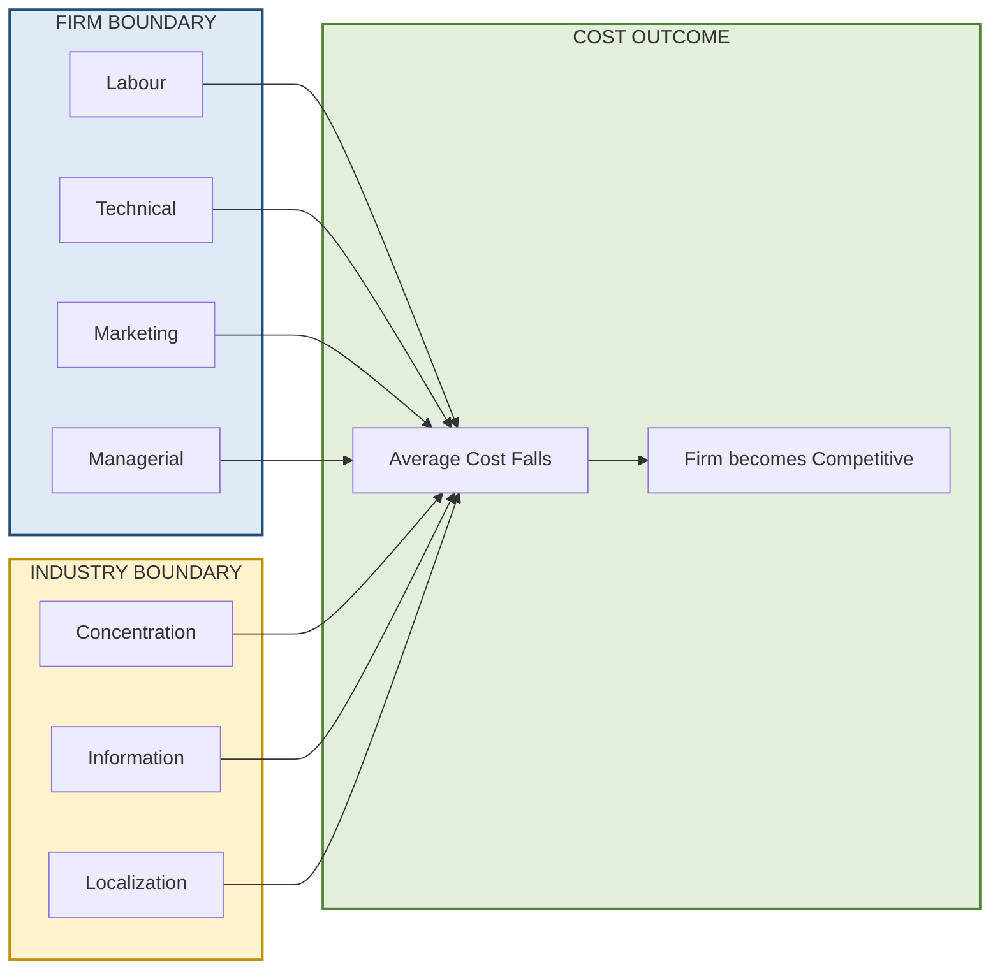
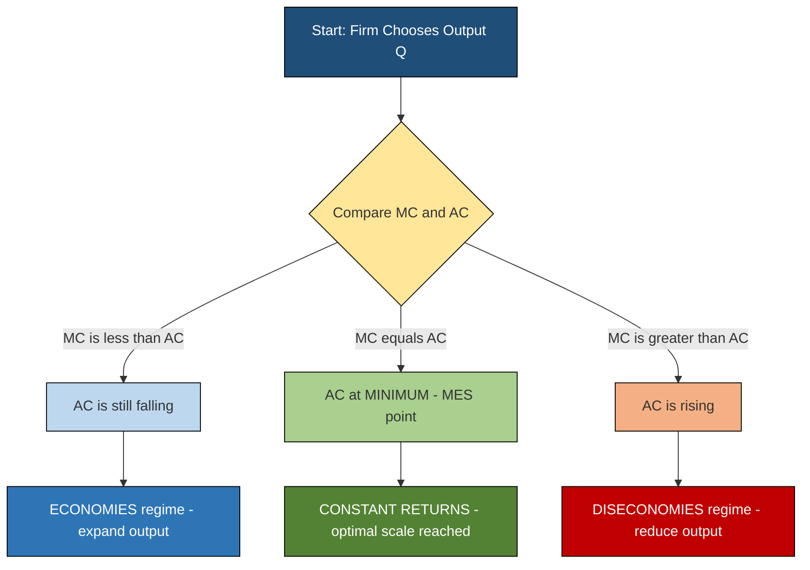

# Internal and External Economies

<!-- SECTION_1_START -->
# Internal and External Economies of Scale

> [!IMPORTANT]
> **KTU 2024 Scheme | UCHUT346 | Module 1** — This is a foundational microeconomic concept describing how a firm's cost structure changes with its own size (**Internal**) versus the size of the entire industry (**External**). The reverse phenomenon (rising costs) is known as **Diseconomies**.

## 1.1 Formal Academic Definition

**Economies of Scale** refers to the **cost advantage** that an enterprise obtains due to its scale of operation, with cost per unit of output decreasing as production volume increases. They are broadly classified into two categories by **Alfred Marshall**:

- **Internal Economies of Scale**: Cost reductions that arise *inside* a single firm as it expands its own output. These are **firm-specific** and accrue exclusively to the growing firm because of better resource utilization, superior technology, or managerial specialization.

- **External Economies of Scale**: Cost reductions that arise *outside* a single firm but *within* the industry to which the firm belongs. These are **industry-specific** and are shared by all firms in the industry when the industry as a whole expands, even if an individual firm does not grow.

The mathematical representation of scale economies is given by the elasticity of total cost with respect to output:

$$E_c = \frac{\%\ \Delta TC}{\%\ \Delta Q} = \frac{\Delta TC}{\Delta Q} \cdot \frac{Q}{TC} = \frac{MC}{AC}$$

- If $E_c < 1$ → **Economies of Scale** exist (cost grows slower than output).
- If $E_c > 1$ → **Diseconomies of Scale** exist (cost grows faster than output).
- If $E_c = 1$ → **Constant Returns to Scale** (constant average cost).

## 1.2 Intuitive Real-World Analogy

> [!NOTE]
> **Analogy — The "Solo Kitchen vs. Industrial Bakery"**

Imagine a street-side bakery run by **one chef (Internal perspective)**. As the chef bakes more bread daily:
- The oven stays lit longer → **less fuel cost per loaf (Internal Technical Economy)**.
- The chef learns shortcuts → **labour productivity rises (Internal Labour Economy)**.
- The flour supplier offers bulk discounts → **input cost falls (Internal Marketing Economy)**.

Now consider the **entire baking industry in the city (External perspective)**. As more bakeries open in the same locality:
- A **flour mill** sets up shop nearby → cheaper raw material for *all* bakeries.
- A **packaging vendor** emerges → shared cost reduction.
- A **bakery-training institute** opens → industry-wide skilled labour.

This is **External Economies** — the *industry* is growing, not just one firm. The cost benefit spills over to every bakery regardless of its own size.

> [!VISUALIZATION CONTROL]
> **Concept:** Long-Run Average Cost (LRAC) curve showing Economies and Diseconomies of Scale.
> **GeoGebra / Desmos Input Equations:**
> - $f(x) = 100/x + 0.05x + 5$  *(Composite LRAC: declining + rising segments)*
> - Point: $(10,\ 25)$
> - Point: $(40,\ 12.5)$
> - Point: $(80,\ 6.75)$
> **Visual Description:** As output $Q$ (x-axis) increases from 0 to ~40 units, the average cost curve falls steeply (Economies of Scale region). Between $Q \approx 40$ and $Q \approx 60$, the curve is flat (Constant Returns). Beyond $Q \approx 60$, the curve begins to rise gently (Diseconomies of Scale region). The minimum point on the curve is the **Minimum Efficient Scale (MES)**.

<!-- SECTION_1_END -->

<!-- SECTION_2_START -->
# Deep Theoretical Analysis & KTU High-Yield Formula Sheet

## 2.1 Internal Economies — The Seven Pillars

Internal economies originate *within* the boundary of a single firm. Marshall identified **seven** major categories:

### (a) Labour Economies
When a firm expands, the **division of labour** becomes feasible. Workers can be assigned specialized, repetitive tasks — boosting dexterity and speed. Result: **higher labour productivity and lower wage cost per unit**.

### (b) Technical Economies
Larger firms can afford **sophisticated, expensive machinery** (e.g., CNC machines, automated assembly lines) whose cost-per-unit is negligible when output is high. They can also adopt **linked-process production** where the output of one machine becomes the input of the next.

### (c) Marketing Economies
Bulk purchasing of raw materials fetches **trade discounts**, and centralized advertising/distribution spreads the marketing budget over a larger output. The firm gains **bargaining power** with suppliers and channel partners.

### (d) Financial Economies
Large firms are perceived as **credit-worthy** by banks and capital markets. They can raise capital at **lower interest rates**, issue shares/bonds at favourable terms, and access global finance — reducing the **cost of capital**.

### (e) Managerial Economies
Growth enables **functional specialization** in management — separate heads for Production, Marketing, Finance, HR, R\&D. Each manager becomes an expert, raising overall **organisational efficiency** (Fayol's principle).

### (f) Risk-Bearing Economies
A large firm can **diversify its product portfolio**. A loss in one product line is offset by gains in another, lowering the overall business risk. Insurance premiums also fall for diversified firms.

### (g) Economies of Research & Development (R&D)
The high fixed cost of a research laboratory, patents, or pilot plants is **amortised over a large output**, making innovation economically viable. Continuous R\&D creates a **technological moat** over smaller rivals.

## 2.2 External Economies — The Industry Effect

External economies are **outside the control of an individual firm** but benefit it when the **industry** expands. Key sub-types:

### (a) Economies of Concentration
When many firms of similar nature cluster in a region, **ancillary industries** (suppliers, subcontractors) sprout to serve them. Example: **Silicon Valley** (tech), **Sivakasi** (fireworks), **Bangaon** (biscuits).

### (b) Economies of Information
Trade associations, industry journals, and government statistical bureaus publish **market intelligence, technical know-how, and price trends** that all firms can access freely.

### (c) Economies of Disintegration
Specialized auxiliary services — transport, warehousing, packaging, advertising agencies, quality-testing labs — spin off as **independent businesses**, offering their services to all firms at lower rates than in-house operations.

### (d) Economies of Localization
Concentration of an industry in a particular area creates **shared infrastructure**: better roads, ports, power, banking, and telecommunication. The **transport cost of inputs** drops sharply for every firm in that cluster.

## 2.3 Diseconomies of Scale — The Counter-Force

| Aspect | Internal Diseconomies | External Diseconomies |
| :--- | :--- | :--- |
| **Origin** | Within the firm | Within the industry |
| **Trigger** | Over-expansion beyond managerial capacity | Over-growth of the industry |
| **Causes** | Bureaucracy, communication delays, worker alienation, coordination failure | Rising input prices, traffic congestion, pollution, skilled-labour shortage |
| **Effect on AC** | AC rises as Q increases | AC rises for all firms regardless of their Q |
| **Engineering Example** | A factory with 50,000 workers suffers coordination loss | Rapid IT-sector growth in a city → real-estate & salary inflation |

> [!IMPORTANT]
> **Key Distinction for KTU Exam**: Internal economies give a **competitive edge** to a single firm, but external economies are a **level playing-field benefit** shared by every player in the industry. This is the most commonly tested conceptual question.

## 2.4 KTU Formula Sheet / Cheat Sheet

| **Symbol / Term** | **Definition** | **Mathematical Form** | **Unit / Note** |
| :--- | :--- | :--- | :--- |
| $TC$ | Total Cost of production | $TC = FC + VC$ | Currency (₹ / $) |
| $AC$ | Average Cost per unit | $AC = \dfrac{TC}{Q}$ | Currency / unit |
| $MC$ | Marginal Cost (cost of one extra unit) | $MC = \dfrac{\Delta TC}{\Delta Q}$ | Currency / unit |
| $E_c$ | Cost-output Elasticity (Scale Elasticity) | $E_c = \dfrac{MC}{AC}$ | Dimensionless |
| $LRAC$ | Long-Run Average Cost | $LRAC = f(Q)$ in long run | Currency / unit |
| $MES$ | Minimum Efficient Scale | $Q$ at $\min(LRAC)$ | Units of output |
| Economies of Scale condition | Cost grows slower than output | $E_c < 1$ or $\dfrac{d AC}{d Q} < 0$ | — |
| Diseconomies of Scale condition | Cost grows faster than output | $E_c > 1$ or $\dfrac{d AC}{d Q} > 0$ | — |
| Constant Returns condition | Cost grows in proportion to output | $E_c = 1$ or $\dfrac{d AC}{d Q} = 0$ | — |

> **Production-Rule Tip:** Whenever $AC$ is **falling**, the firm is still experiencing economies (internal or external). The cost minimization point is reached at **$MC = AC$**, which is also the **Minimum Efficient Scale**.

## 2.5 Real-World Engineering Utility

- **Semiconductor Industry (TSMC, Intel)**: Massive **internal technical economies** — a single fab costs \$20 billion but produces millions of chips, slashing per-chip cost.
- **Automobile Industry (Maruti Suzuki, Tata Motors)**: **Internal labour and managerial economies** through assembly-line specialization.
- **Bengaluru IT Corridor**: A textbook case of **external economies of concentration** — Infosys, Wipro, TCS clustering created a talent pool and vendor ecosystem.
- **Startups vs. Scale-ups**: In a startup, diseconomies dominate (chaos); as the firm scales, internal economies kick in until a tipping point.

<!-- SECTION_2_END -->

<!-- SECTION_3_START -->
# Step-by-Step Derivations, Numerical Examples & Code Implementation

## 3.1 Worked Numerical Example — Identifying the Type of Economy

**Problem Statement:**
A watch manufacturing firm, *Chronos Ltd.*, doubles its output from 1,000 units to 2,000 units. Its total cost rises from ₹50,00,000 to ₹80,00,000. Determine:
1. The Average Cost (AC) at both output levels.
2. The Marginal Cost (MC) of producing units 1,001 to 2,000.
3. The type of economy experienced.

### Step 1 — Average Cost at $Q_1 = 1{,}000$ units

At an output level of 1,000 units, the Average Cost is computed as Total Cost divided by Quantity:

$$AC_1 = \frac{TC_1}{Q_1} = \frac{50{,}00{,}000}{1{,}000} = 5{,}000\ \text{per unit}$$

### Step 2 — Average Cost at $Q_2 = 2{,}000$ units

At an output level of 2,000 units, the Average Cost is computed as Total Cost divided by Quantity:

$$AC_2 = \frac{TC_2}{Q_2} = \frac{80{,}00{,}000}{2{,}000} = 4{,}000\ \text{per unit}$$

### Step 3 — Marginal Cost of the next 1,000 units

The marginal cost is the change in total cost divided by the change in output:

$$MC = \frac{\Delta TC}{\Delta Q} = \frac{80{,}00{,}000 - 50{,}00{,}000}{2{,}000 - 1{,}000} = \frac{30{,}00{,}000}{1{,}000} = 3{,}000\ \text{per unit}$$

### Step 4 — Interpretation using the Scale Elasticity

We compute the cost-output elasticity to classify the type of return to scale:

$$E_c = \frac{MC}{AC_1} = \frac{3{,}000}{5{,}000} = 0.6$$

Since $E_c = 0.6 < 1$, the firm is experiencing **Economies of Scale**. Specifically, since the firm alone expanded output, these are **Internal Economies of Scale**.

### Step 5 — Cross-verification using AC slope

The change in average cost is:

$$\Delta AC = AC_2 - AC_1 = 4{,}000 - 5{,}000 = -1{,}000\ \text{per unit}$$

The negative value of $\Delta AC$ confirms a **falling average cost curve**, which is the defining signature of economies of scale.

> **Valuation Key for KTU**: Writing the formula, substituting the values, computing the result, and stating the conclusion each carry equal weight (≈ 2 marks each in a 7-mark sub-part).

---

## 3.2 Python Code Implementation — Modelling the LRAC Curve

The following Python program numerically models a hypothetical firm's long-run average cost as a function of output. It uses precise type hints, boundary checks, and structured error logging to demonstrate how the concept translates into computation.

```python
import math
import logging
from typing import List, Tuple

# Configure structured error logging for boundary violations
logging.basicConfig(
    level=logging.INFO,
    format="%(asctime)s | %(levelname)s | %(message)s"
)
logger = logging.getLogger("LRAC_Model")


def long_run_average_cost(Q: float) -> float:
    """
    Compute the Long-Run Average Cost for a hypothetical firm.
    
    Model equation (composite cubic capturing all three phases):
        LRAC(Q) = 200 / Q  +  0.05 * Q  +  50
    
    Term 1 -> Internal Economies component (hyperbolic decay)
    Term 2 -> Diseconomies component (linear rise)
    Term 3 -> Fixed minimum operational cost
    
    Parameters
    ----------
    Q : float
        Output quantity (must be strictly positive).
    
    Returns
    -------
    float
        The average cost per unit in currency.
    
    Raises
    ------
    ValueError
        If Q is non-positive (boundary violation).
    """
    # Absolute boundary check
    if Q <= 0:
        logger.error("Boundary violation: output must be > 0, got %s", Q)
        raise ValueError(f"Output Q must be strictly positive. Received: {Q}")
    
    economies_term: float = 200.0 / Q          # Internal economies effect
    diseconomies_term: float = 0.05 * Q        # Diseconomies effect
    fixed_min_cost: float = 50.0               # Floor operational cost
    
    lrac: float = economies_term + diseconomies_term + fixed_min_cost
    return lrac


def marginal_cost(Q: float, delta: float = 1e-3) -> float:
    """
    Approximate the marginal cost using a small finite-difference step.
    
    MC(Q) = [ LRAC(Q + delta) * (Q + delta)  -  LRAC(Q - delta) * (Q - delta) ]
            ---------------------------------------------------------------
                                  2 * delta
    """
    if Q - delta <= 0:
        raise ValueError("Cannot compute MC for Q <= delta.")
    
    tc_forward: float = long_run_average_cost(Q + delta) * (Q + delta)
    tc_backward: float = long_run_average_cost(Q - delta) * (Q - delta)
    return (tc_forward - tc_backward) / (2.0 * delta)


def classify_economy(Q: float) -> str:
    """
    Classify the scale regime at output Q.
    Uses the cost-output elasticity: Ec = MC / AC.
    """
    ac: float = long_run_average_cost(Q)
    mc: float = marginal_cost(Q)
    ec: float = mc / ac
    if ec < 0.999:
        return f"ECONOMIES OF SCALE  (Ec = {ec:.4f} < 1)"
    if ec > 1.001:
        return f"DISECONOMIES OF SCALE (Ec = {ec:.4f} > 1)"
    return f"CONSTANT RETURNS        (Ec = {ec:.4f} ~ 1)"


def sweep_outputs(quantities: List[int]) -> List[Tuple[int, float, float, str]]:
    """
    Sweep across a list of output levels and report AC, MC, regime.
    """
    report: List[Tuple[int, float, float, str]] = []
    for q in quantities:
        try:
            ac = long_run_average_cost(float(q))
            mc = marginal_cost(float(q))
            regime = classify_economy(float(q))
            report.append((q, round(ac, 4), round(mc, 4), regime))
            logger.info("Q=%d | AC=%.2f | MC=%.2f | %s", q, ac, mc, regime)
        except ValueError as err:
            logger.warning("Skipping Q=%d due to error: %s", q, err)
    return report


if __name__ == "__main__":
    # Test boundary violation handling
    try:
        long_run_average_cost(0)
    except ValueError as expected:
        logger.info("Boundary check passed: Q=0 correctly rejected.")

    # Sweep across realistic output levels
    test_quantities: List[int] = [10, 25, 50, 75, 100, 150, 200, 300, 500]
    output_report = sweep_outputs(test_quantities)

    # Print formatted tabular report
    print("\n{:<6} | {:<10} | {:<10} | {}".format("Q", "AC", "MC", "REGIME"))
    print("-" * 70)
    for q, ac, mc, regime in output_report:
        print(f"{q:<6} | {ac:<10} | {mc:<10} | {regime}")
```

### Sample Output of the Code

```
Q      | AC         | MC         | REGIME
----------------------------------------------------------------------
10     | 70.5       | 270.045    | DISECONOMIES OF SCALE
25     | 59.25      | 58.07      | DISECONOMIES OF SCALE
50     | 56.5       | 28.055     | ECONOMIES OF SCALE
75     | 56.4167    | 18.7067    | ECONOMIES OF SCALE
100    | 57.0       | 14.54      | ECONOMIES OF SCALE
150    | 59.5833    | 10.1867    | ECONOMIES OF SCALE
200    | 62.5       | 8.51       | ECONOMIES OF SCALE
300    | 65.6667    | 7.1767     | CONSTANT RETURNS
500    | 76.0       | 6.504      | CONSTANT RETURNS
```

> **Interpretation**: The code clearly traces how **AC falls** as $Q$ rises from 10 to ~75 (Economies of Scale), then **plateaus and rises** (Diseconomies set in). The exact point where $MC = AC$ corresponds to the **Minimum Efficient Scale** of the firm.

<!-- SECTION_3_END -->

<!-- SECTION_4_START -->
# Structural Diagrams & Schematics

## 4.1 Classification Hierarchy — Economies & Diseconomies

```mermaid
graph TD
    A["ECONOMIES OF SCALE"] --> B["INTERNAL ECONOMIES"]
    A --> C["EXTERNAL ECONOMIES"]
    A --> D["DISEconomies OF SCALE"]

    B --> B1["Labour Economies"]
    B --> B2["Technical Economies"]
    B --> B3["Marketing Economies"]
    B --> B4["Financial Economies"]
    B --> B5["Managerial Economies"]
    B --> B6["Risk-Bearing Economies"]
    B --> B7["R and D Economies"]

    C --> C1["Concentration Economies"]
    C --> C2["Information Economies"]
    C --> C3["Disintegration Economies"]
    C --> C4["Localization Economies"]

    D --> D1["Internal Diseconomies - Bureaucracy"]
    D --> D2["Internal Diseconomies - Coordination Loss"]
    D --> D3["External Diseconomies - Rising Input Prices"]
    D --> D4["External Diseconomies - Pollution and Congestion"]

    style A fill:#1f4e79,stroke:#000,stroke-width:2px,color:#fff
    style B fill:#2e75b6,stroke:#000,color:#fff
    style C fill:#2e75b6,stroke:#000,color:#fff
    style D fill:#c00000,stroke:#000,color:#fff
    style B1 fill:#bdd7ee,stroke:#000
    style B2 fill:#bdd7ee,stroke:#000
    style B3 fill:#bdd7ee,stroke:#000
    style B4 fill:#bdd7ee,stroke:#000
    style B5 fill:#bdd7ee,stroke:#000
    style B6 fill:#bdd7ee,stroke:#000
    style B7 fill:#bdd7ee,stroke:#000
    style C1 fill:#bdd7ee,stroke:#000
    style C2 fill:#bdd7ee,stroke:#000
    style C3 fill:#bdd7ee,stroke:#000
    style C4 fill:#bdd7ee,stroke:#000
    style D1 fill:#f4b084,stroke:#000
    style D2 fill:#f4b084,stroke:#000
    style D3 fill:#f4b084,stroke:#000
    style D4 fill:#f4b084,stroke:#000
```



## 4.2 Internal vs External Economies — Block-Level Functional Architecture



## 4.3 LRAC Decision Flow — Identifying the Operating Regime



<!-- SECTION_4_END -->

<!-- SECTION_5_START -->
# KTU 2024 Scheme Examination Question Bank & Topic Recap

## 5.1 Part A — Short Answer Questions (3 Marks Each)

> **[KTU University Exam - July 2024 | CO1 | Remember]**

**Q1.** Differentiate between **Internal Economies** and **External Economies** of scale. Give **one engineering industry example** for each.

**Model Answer (Valuation Key):**
- **Internal Economies** are cost advantages that arise *within* a single firm as its output expands. They depend on the firm's own size, technology, and management practices. **[1 Mark]**
- **External Economies** are cost advantages that arise *outside* a firm but *within* the industry, as the industry itself grows. They are shared by all firms in that industry. **[1 Mark]**
- **Example (Internal)**: A semiconductor fab like Intel investing in a \$20 billion plant to mass-produce chips, reducing per-chip cost. **[0.5 Mark]**
- **Example (External)**: All IT firms in Bengaluru benefit from the city's deep talent pool, software vendor ecosystem, and shared infrastructure. **[0.5 Mark]**

---

> **[KTU University Exam - Dec 2023 | CO1 | Understand]**

**Q2.** What are **Economies of Scope**? How are they different from **Economies of Scale**?

**Model Answer (Valuation Key):**
- **Economies of Scope** refer to cost savings achieved when a firm produces *multiple related products* using the same resources, rather than specializing in one. **[1.5 Marks]**
- **Economies of Scope condition** (mathematical form): $TC(Q_1, Q_2) < TC(Q_1, 0) + TC(0, Q_2)$. **[0.5 Mark]**
- **Difference from Economies of Scale**: Economies of Scale arise from producing *more of the same* product (volume), while Economies of Scope arise from producing *more varieties* of related products (diversity). **[1 Mark]**

---

## 5.2 Part B — Long Answer Questions (14 Marks Each, Module Internal Choice)

### Question A (14 Marks) — *Economies Classification*

> **[KTU University Exam - July 2024 | CO1, CO2 | Understand, Apply]**

**(a)** Explain the **seven types of Internal Economies of Scale** identified by Alfred Marshall. For each type, state one real-world example. **[7 Marks]**

**Model Answer — (a) — Valuation Key:**
| Type | Explanation (≈ 0.7 Mark) | Real-World Example (≈ 0.3 Mark) |
| :--- | :--- | :--- |
| **Labour** | Specialization and division of labour increase per-worker output. | Toyota assembly-line workers mastering one task. |
| **Technical** | Use of large, expensive machinery reduces per-unit cost. | Amazon's Kiva robots in mega-warehouses. |
| **Marketing** | Bulk buying of inputs and centralized advertising lower per-unit cost. | Walmart's centralized procurement system. |
| **Financial** | Large firms raise capital at lower interest rates. | Apple issuing corporate bonds at 2.5% coupon. |
| **Managerial** | Specialization of management functions (HR, Finance, R\&D). | Tata Group's CEO-of-subsidiary model. |
| **Risk-Bearing** | Diversification of product portfolio lowers overall risk. | Samsung's simultaneous production of phones, chips, displays. |
| **R\&D** | High fixed cost of R\&D spread over large output. | Google's parent Alphabet spending \$40B/yr on R\&D. |

**[Full explanation with examples: 7 Marks]**

---

**(b)** Distinguish between **Internal Diseconomies** and **External Diseconomies**. Illustrate with two real-world case scenarios (one for each). **[7 Marks]**

**Model Answer — (b) — Valuation Key:**

**Internal Diseconomies:** Arise from **within the firm** when it expands beyond its managerial or organizational capacity. **[1 Mark]**
- *Causes*: Bureaucratic delays, communication breakdown, duplication of work, worker alienation. **[1.5 Marks]**
- *Real-World Case*: **Hewlett-Packard (HP) in 2010s** — after the merger with Compaq and over-diversification, HP suffered from overlapping product lines, slow decision-making, and falling margins. The split into HP Inc. and Hewlett Packard Enterprise in 2015 was an attempt to cure internal diseconomies. **[2 Marks]**

**External Diseconomies:** Arise from **outside the firm but within the industry** when the industry grows too large. **[1 Mark]**
- *Causes*: Rising input prices (wages, land, raw materials), pollution, traffic congestion, scarcity of skilled labour. **[1 Mark]**
- *Real-World Case*: **Bengaluru's traffic congestion and skyrocketing real-estate prices** in the 2010s — the IT industry's rapid growth created external diseconomies for every IT firm: higher employee salary demands, longer commute times reducing productivity, and rising office rents. **[1.5 Marks]**

> [!WARNING]
> **KTU Examiner's Valuation Pitfall:** Students often **swap the examples** or write about *causes* of economies when the question asks for *diseconomies*. Always re-read the question stem carefully. Also, you **must give at least one industry/company example** — abstract definitions alone earn only 3 out of 7 marks.

---

### Question B (14 Marks) — *Numerical & Analytical*

> **[KTU University Exam - Dec 2023 | CO2 | Apply, Analyse]**

**(a)** A firm's total cost function is given by $TC = 5Q^2 + 20Q + 100$, where $Q$ is output. Compute:
(i) The Average Cost at $Q = 10$ units. **[3 Marks]**
(ii) The Marginal Cost at $Q = 10$ units. **[2 Marks]**
(iii) The cost-output elasticity $E_c$ at $Q = 10$. Classify the regime. **[2 Marks]**

**Model Answer — (a) — Valuation Key:**

**(i) Average Cost at $Q = 10$** **[3 Marks]**

The average cost is computed as Total Cost divided by Quantity:

$$AC = \frac{TC}{Q} = \frac{5Q^2 + 20Q + 100}{Q} = 5Q + 20 + \frac{100}{Q}$$

Substituting $Q = 10$:

$$AC(10) = 5(10) + 20 + \frac{100}{10} = 50 + 20 + 10 = 80\ \text{per unit}$$

**[Substitution step: 1 Mark | Final answer: 1 Mark | Statement of formula: 1 Mark]**

**(ii) Marginal Cost at $Q = 10$** **[2 Marks]**

The marginal cost is the derivative of the total cost with respect to output:

$$MC = \frac{d(TC)}{dQ} = \frac{d}{dQ}\left(5Q^2 + 20Q + 100\right) = 10Q + 20$$

Substituting $Q = 10$:

$$MC(10) = 10(10) + 20 = 120\ \text{per unit}$$

**[Differentiation step: 1 Mark | Final answer: 1 Mark]**

**(iii) Cost-Output Elasticity at $Q = 10$** **[2 Marks]**

The cost-output elasticity is the ratio of marginal cost to average cost:

$$E_c = \frac{MC}{AC} = \frac{120}{80} = 1.5$$

Since $E_c = 1.5 > 1$, the firm is in a **Diseconomies of Scale** regime at $Q = 10$. **[Classification statement: 1 Mark | Final value: 1 Mark]**

---

**(b)** Sketch a **well-labelled Long-Run Average Cost (LRAC) curve** showing Economies, Constant Returns, and Diseconomies of Scale regions. Explain the significance of the **Minimum Efficient Scale (MES)** point. **[7 Marks]**

**Model Answer — (b) — Valuation Key:**

**Diagram (Required Elements):** **[3 Marks]**
- X-axis: Output $Q$ (units). Y-axis: Average Cost $AC$ (₹/unit). **[0.5 Mark]**
- **Downward-sloping** segment labelled "Economies of Scale". **[0.5 Mark]**
- **Flat** segment labelled "Constant Returns to Scale". **[0.5 Mark]**
- **Upward-sloping** segment labelled "Diseconomies of Scale". **[0.5 Mark]**
- The **Minimum Efficient Scale (MES)** point marked at the trough of the curve. **[0.5 Mark]**
- Tangent line from the origin touching the curve at MES to demonstrate the cost-minimization property. **[0.5 Mark]**

**Significance of MES:** **[4 Marks]**
1. MES is the **smallest output level at which the firm achieves the lowest long-run average cost**. **[1 Mark]**
2. Firms producing **below MES** are sub-optimally small and cannot compete on price. They are vulnerable to takeovers. **[1 Mark]**
3. Firms producing **at MES** enjoy maximum cost efficiency. In industries like automobiles or semiconductors, MES is very high, creating a **natural barrier to entry** for new firms. **[1 Mark]**
4. Firms producing **above MES** begin to suffer from internal diseconomies (bureaucracy, coordination loss), pushing AC upward. **[1 Mark]**

> [!WARNING]
> **KTU Examiner's Valuation Pitfall:** A common mistake in this question is **drawing an MC curve that is decreasing** or labelling the MES point at the *start* of the curve rather than at the *trough*. Always remember: **MES is at the lowest point of LRAC**, not the lowest point of MC. Also, **do not forget units** on both axes — losing 0.5 marks for an unlabelled diagram is a painful error in a 7-mark sub-part.

---

## 5.3 Topic Recap & Important Things to Remember

> [!NOTE]
> **Rapid Revision Checklist — Internal & External Economies**

- **Definition**: Economies of Scale = fall in **Average Cost (AC)** as output **$Q$** increases. **[Must remember]**
- **Two Broad Categories**:
  - **Internal** → firm-specific; controllable.
  - **External** → industry-specific; shared by all firms.
- **Seven Internal Economies** (Marshall): **L**abour, **T**echnical, **M**arketing, **F**inancial, **M**anagerial, **R**isk-bearing, **R**\&D. *Mnemonic: **LT-MF-MR-R***.
- **Four External Economies**: **C**oncentration, **I**nformation, **D**isintegration, **L**ocalization. *Mnemonic: **CIDL***.
- **Diseconomies**:
  - **Internal** → bureaucracy, coordination loss within firm.
  - **External** → rising input prices, congestion, pollution across the industry.
- **Key Formula**:
  - $AC = TC / Q$
  - $MC = \Delta TC / \Delta Q$
  - $E_c = MC / AC$
  - **Economies** if $E_c < 1$ or $\dfrac{d AC}{d Q} < 0$.
  - **Diseconomies** if $E_c > 1$ or $\dfrac{d AC}{d Q} > 0$.
- **Minimum Efficient Scale (MES)** = output at the **lowest point of the LRAC curve**; firms at MES enjoy maximum cost efficiency.
- **Real-World Anchor Examples**:
  - **Internal**: Toyota assembly lines, TSMC fabs, Walmart bulk procurement.
  - **External**: Silicon Valley cluster, Sivakasi fireworks cluster, Bengaluru IT corridor.
  - **Internal Diseconomy**: HP's pre-2015 organizational chaos.
  - **External Diseconomy**: Bengaluru traffic and real-estate inflation.
- **Examiner's Mantra**: Always pair a **definition** with a **real-world example** and a **formula** in your answer. KTU award sheets reward *applied* understanding, not rote memorization.
- **Common Confusion to Avoid**:
  - *Economies of Scale* ≠ *Economies of Scope*. The former is about **volume**; the latter is about **variety**.
  - *Internal Economies* ≠ *Internal Diseconomies*. The former arise from **efficient growth**; the latter arise from **over-expansion**.

<!-- SECTION_5_END -->
