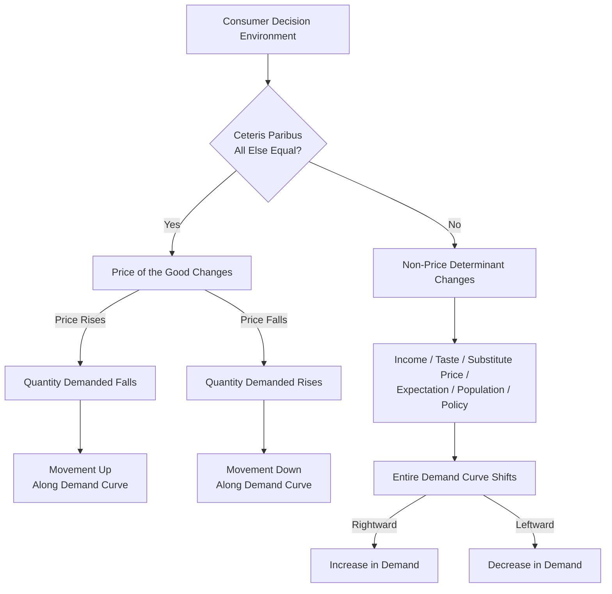
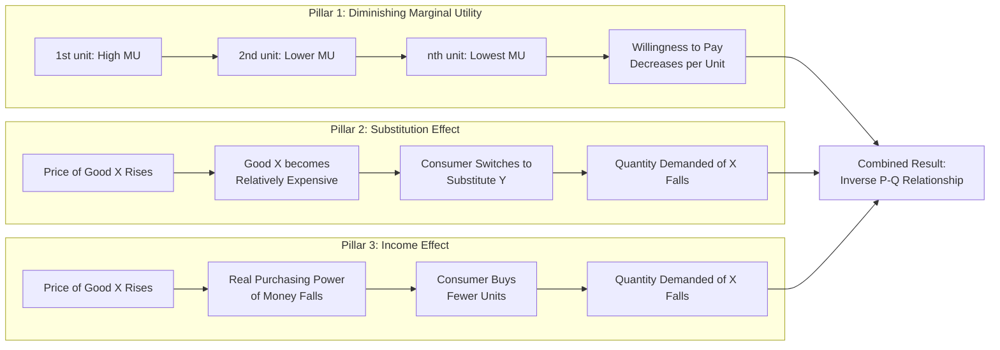

# Law of Demand

<!-- SECTION_1_START -->

# Module 1 — Law of Demand

## 1.1 Formal Definition (KTU 2024 Syllabus Terminology)

> [!IMPORTANT]
> **Law of Demand (Alfred Marshall, 1890):**
> *"Ceteris paribus (other things being equal), the quantity demanded of a commodity is **inversely related** to its own price. As price rises, quantity demanded falls, and as price falls, quantity demanded rises."*

In functional notation:

$$Q_d = f(P)$$

where $Q_d$ is the **quantity demanded** and $P$ is the **price** of the commodity, with all other factors held constant. For a typical (linear) demand function:

$$Q_d = a - bP, \quad \text{where } a > 0 \text{ and } b > 0$$

> [!NOTE]
> **Key Distinction for the Board Examiner:**
> - **Demand** refers to the *entire demand schedule / curve* (relationship at all prices).
> - **Quantity Demanded** refers to a *specific quantity* at a *specific price* (a single point on the curve).

---

## 1.2 Intuitive Overview — The "Snack Stall" Analogy

Imagine a small tea-and-snack stall outside your KTU college. The stall sells **samosas** at different prices on different days.

- On a day when the samosa is priced at **₹10**, around **80 students** buy it.
- When the price rises to **₹20**, only about **50 students** buy it.
- When the stall offers a discount price of **₹5**, almost **150 students** queue up.

| Price of Samosa (₹) | Students Willing to Buy |
|:---:|:---:|
| **5** | 150 |
| **10** | 80 |
| **15** | 50 |
| **20** | 20 |

> [!TIP]
> The students are not forced to buy — they *choose*. The higher the price, the fewer the buyers. The lower the price, the more buyers step forward. This **inverse behaviour** between price and quantity is precisely the **Law of Demand**.

This is exactly how the **demand curve** behaves in economics — it slopes **downward from left to right**.

---

## 1.3 Visualizing the Demand Curve

> [!VISUALIZATION CONTROL]
> **Concept:** Downward-sloping Linear Demand Curve
> **GeoGebra / Desmos Input Equations:**
> - `Q = 100 - 2P`   *(Y-axis: Quantity demanded, X-axis: Price)*
> - Optional point markers: `(10, 80)`, `(20, 60)`, `(30, 40)`, `(40, 20)`
> **Visual Description:** On the coordinate plane, the student should observe a **straight line** that begins high on the Y-axis (price axis) and slopes **downward** as it moves rightward along the X-axis (quantity axis). The line should **intersect** the price axis at $P = 50$ and the quantity axis at $Q = 100$. All plotted points must lie **on** this line, confirming the inverse functional relationship.

> [!IMPORTANT]
> **Ceteris Paribus ("All else being equal")** is the single most critical assumption. If a student's income, taste, or the price of a substitute changes, then the **whole demand curve shifts** — the law is no longer tested in its pure form.

---

<!-- SECTION_1_END -->

<!-- SECTION_2_START -->

# 2. Deep Theoretical Analysis

## 2.1 Core Logic — *Why* Does the Law Operate?

The Law of Demand is not arbitrary; it is rooted in **three foundational behavioural reasons**:

1. **Law of Diminishing Marginal Utility (Gossen’s First Law)**
   As a consumer buys more units of a good, the *additional* satisfaction (marginal utility) from each successive unit **falls**. Therefore, the consumer is **willing to pay a lower price** for an extra unit, not a higher one.

2. **Substitution Effect**
   When the price of a good rises, it becomes **relatively more expensive** than its substitutes. Rational consumers switch to cheaper alternatives, reducing the quantity demanded of the original good.

3. **Income Effect**
   A price rise reduces the **real purchasing power** (real income) of the consumer’s money. With the same money income, the consumer can now afford fewer units, so quantity demanded falls.

---

## 2.2 Assumptions of the Law of Demand

For the Law to hold true, the following must remain unchanged:

| # | Assumption | Engineering/Real-World Parallel |
|:---:|:---|:---|
| 1 | Consumer’s **income** is constant | Salary not changing month-to-month |
| 2 | **Tastes & preferences** are stable | No viral trend boosting demand |
| 3 | **Prices of related goods** (substitutes/complements) are constant | iPhone vs Android prices both stable |
| 4 | No **expectation of future price changes** | No upcoming festival sale announcement |
| 5 | **No change in population / demographics** | Stable customer base |
| 6 | Government **policy & taxation** unchanged | GST rate stable at 18% |
| 7 | The good is a **normal good** (not inferior/Giffen) | Standard consumer behaviour |

---

## 2.3 Demand Schedule and Demand Curve

A **Demand Schedule** is a tabular representation; a **Demand Curve** is its graphical counterpart.

### Sample Demand Schedule

| Price (₹) | Quantity Demanded (units) | Type of Movement |
|:---:|:---:|:---|
| 5 | 100 | Extension in demand |
| 10 | 80 | — |
| 15 | 60 | — |
| 20 | 40 | — |
| 25 | 20 | Contraction in demand |

> [!NOTE]
> - **Extension in Demand** = Increase in quantity demanded *due to a fall in price* (movement *down* the curve).
> - **Contraction in Demand** = Decrease in quantity demanded *due to a rise in price* (movement *up* the curve).

---

## 2.4 KTU Formula Sheet / Cheat Sheet

| Concept | Formula | Symbol Meaning |
|:---|:---|:---|
| General demand function | $Q_d = f(P)$ | $Q_d$: quantity demanded, $P$: price |
| Linear demand function | $Q_d = a - bP$ | $a$: intercept, $b$: slope coefficient $(>0)$ |
| Inverse demand function | $P = \dfrac{a - Q_d}{b}$ | Price expressed as a function of quantity |
| Slope of linear demand curve | $\dfrac{dQ_d}{dP} = -b$ | Always **negative** |
| Price Elasticity of Demand | $E_d = \dfrac{dQ_d}{dP} \cdot \dfrac{P}{Q_d}$ | Unitless measure of responsiveness |
| Elasticity (linear form) | $E_d = -b \cdot \dfrac{P}{Q_d}$ | Substitute $Q_d = a - bP$ to evaluate |
| Total Revenue | $TR = P \times Q_d$ | Revenue at any point on demand curve |
| Marginal Revenue | $MR = a - 2bQ_d$ | Change in TR from selling one more unit |
| Per-capita demand | $D_p = \dfrac{\text{Total demand}}{\text{Population}}$ | Used in demand forecasting |
| Total market demand | $D = \Sigma D_i$ | Sum of individual demands |

> [!WARNING]
> When writing elasticity, **never** write $\vert E_d \vert$ with the vertical pipe symbol in a markdown table — use the LaTeX command $\lvert E_d \rvert$ or $E_d$ (in absolute value terms) instead. Pipes break the table syntax.

---

## 2.5 Movement Along vs. Shift of the Demand Curve (Critical KTU Distinction)

| Phenomenon | Cause | Curve Behaviour | Terminology |
|:---|:---|:---|:---|
| **Change in Quantity Demanded** | Change in the good's **own price** | Movement **along** the same curve | Extension / Contraction |
| **Change in Demand** | Change in **non-price determinants** (income, taste, etc.) | **Shift** of the entire curve | Increase / Decrease in demand |

### Determinants that **shift** the demand curve (right = increase, left = decrease):

- **Income** of the consumer (↑ income → rightward shift for *normal* goods; opposite for *inferior* goods)
- **Prices of substitutes** (↑ substitute price → rightward shift of this good’s demand)
- **Prices of complements** (↑ complement price → leftward shift)
- **Tastes & preferences** (favourable change → rightward shift)
- **Expectations** of future price changes
- **Population / number of buyers**
- **Government policy** (subsidy → right; tax → left)
- **Seasonal / weather factors**

---

## 2.6 Real-World Engineering Utility

| Domain | Application of the Law of Demand |
|:---|:---|
| **Production Planning** | Forecast how many units to manufacture at each anticipated price |
| **Pricing Strategy** | Decide the profit-maximizing price point (where MR = MC) |
| **Inventory Management** | Stock up before a price rise, liquidate before a price fall |
| **Government Policy** | Design taxes and subsidies to control consumption of merit/demerit goods |
| **Software / SaaS** | Tiered pricing — lower price → more subscriptions (inverse relationship) |
| **Energy Sector** | Predict electricity consumption under variable tariffs |

---

<!-- SECTION_2_END -->

<!-- SECTION_3_START -->

# 3. Step-by-Step Derivations & Symbolic Implementation

## 3.1 Derivation of the Linear Demand Function from the Demand Schedule

Suppose a market analyst records the following observations for a commodity:

| Observation | Price (₹) | Quantity Demanded (units) |
|:---:|:---:|:---:|
| 1 | 10 | 100 |
| 2 | 20 | 80 |
| 3 | 30 | 60 |
| 4 | 40 | 40 |

**Step 1: Verify the inverse relationship.**
As $P$ rises from 10 → 20 → 30 → 40, $Q_d$ falls from 100 → 80 → 60 → 40. ✅ The Law of Demand holds.

**Step 2: Compute the slope of the demand curve.**

$$\text{Slope} = \dfrac{\Delta Q_d}{\Delta P} = \dfrac{80 - 100}{20 - 10} = \dfrac{-20}{10} = -2$$

**Step 3: Verify using any other pair of points.**

$$\dfrac{\Delta Q_d}{\Delta P} = \dfrac{40 - 60}{40 - 30} = \dfrac{-20}{10} = -2$$

The slope is constant, confirming the relationship is **linear**.

**Step 4: Apply the point-slope form of a straight line.**

$$Q_d - Q_1 = m(P - P_1)$$

Using $(P_1, Q_1) = (10, 100)$ and $m = -2$:

$$Q_d - 100 = -2(P - 10)$$

**Step 5: Simplify to obtain the demand function.**

$$Q_d - 100 = -2P + 20$$

$$Q_d = 120 - 2P$$

> [!NOTE]
> Here, $a = 120$ (the quantity intercept, i.e., the quantity that would be demanded if $P = 0$) and $b = 2$ (the slope coefficient). The **price intercept** is obtained by setting $Q_d = 0$:
>
> $$0 = 120 - 2P \quad \Rightarrow \quad P = 60$$

---

## 3.2 Derivation of the Slope and Elasticity of Linear Demand

**Step 1: Start with the linear demand equation.**

$$Q_d = a - bP$$

**Step 2: Differentiate both sides with respect to $P$.**

$$\dfrac{dQ_d}{dP} = -b$$

The slope is always **negative**, confirming the inverse price-quantity relationship.

**Step 3: Derive the price elasticity of demand formula.**

$$E_d = \dfrac{dQ_d}{dP} \cdot \dfrac{P}{Q_d} = -b \cdot \dfrac{P}{Q_d}$$

**Step 4: Substitute $Q_d = a - bP$ to express $E_d$ purely in terms of $P$.**

$$E_d = -b \cdot \dfrac{P}{a - bP}$$

**Step 5: Evaluate $E_d$ at the midpoint of the linear demand curve (point of unit elasticity).**

For unit elasticity ($E_d = -1$):

$$-1 = -b \cdot \dfrac{P}{a - bP}$$

$$a - bP = bP$$

$$P^{\ast} = \dfrac{a}{2b}$$

**Step 6: Substitute $P^{\ast}$ back to find the midpoint quantity.**

$$Q^{\ast} = a - b \cdot \dfrac{a}{2b} = \dfrac{a}{2}$$

> [!IMPORTANT]
> The midpoint of any linear demand curve is the **point of unit elasticity**. Above it (higher prices) demand is **elastic** ($E_d < -1$). Below it (lower prices) demand is **inelastic** ($-1 < E_d < 0$).

---

## 3.3 Symbolic / Numerical Implementation in Python

```python
"""
Law of Demand — Linear Demand Function Analysis
Course: Economics for Engineers (UCHUT346), KTU 2024 Scheme
Topic: Law of Demand (Module 1)
"""

import logging
import sys
from typing import List, Tuple

# Configure structured logging for traceability
logging.basicConfig(
    level=logging.INFO,
    format="%(asctime)s | %(levelname)s | %(message)s",
    stream=sys.stdout,
)

def demand_function(price: float, a: float, b: float) -> float:
    """
    Linear demand function:  Q_d = a - b * P
    
    Parameters
    ----------
    price : float   -> Price of the commodity (must be >= 0)
    a      : float  -> Autonomous demand intercept (a > 0)
    b      : float  -> Slope coefficient (b > 0)
    
    Returns
    -------
    float : Quantity demanded (>= 0)
    """
    # --- Input validation with explicit error logging ---
    if a <= 0:
        logging.error(f"Invalid intercept 'a' = {a}. Must be positive.")
        raise ValueError("Intercept 'a' must be > 0.")
    if b <= 0:
        logging.error(f"Invalid slope 'b' = {b}. Must be positive.")
        raise ValueError("Slope 'b' must be > 0.")
    if price < 0:
        logging.error(f"Negative price detected: {price}.")
        raise ValueError("Price cannot be negative.")
    
    quantity = a - b * price
    if quantity < 0:
        logging.warning(f"Q_d = {quantity} is non-physical; clipping to 0.")
        return 0.0
    return quantity


def price_elasticity(price: float, a: float, b: float) -> float:
    """Compute point price elasticity of demand E_d = -b * P / Q_d."""
    qd = demand_function(price, a, b)
    if qd == 0:
        return float("-inf")
    return -b * (price / qd)


def midpoint_elasticity(p1: float, p2: float, q1: float, q2: float) -> float:
    """Arc elasticity of demand using the midpoint formula."""
    dp = p2 - p1
    dq = q2 - q1
    if (p1 + p2) == 0 or (q1 + q2) == 0:
        raise ZeroDivisionError("Midpoint formula requires non-zero averages.")
    return (dq / ((q1 + q2) / 2)) / (dp / ((p1 + p2) / 2))


# --- Driver / Demonstration block ---
if __name__ == "__main__":
    A, B = 120.0, 2.0  # demand function: Q_d = 120 - 2P

    # 1. Build a demand schedule
    schedule: List[Tuple[float, float, float]] = []
    for p in [0, 10, 20, 30, 40, 50, 60]:
        q = demand_function(p, A, B)
        e = price_elasticity(p, A, B)
        schedule.append((p, q, e))
        logging.info(f"P = ₹{p:>5.1f}  |  Q_d = {q:>6.1f} units  |  E_d = {e:+.3f}")

    # 2. Midpoint (unit-elastic) verification
    p_star = A / (2 * B)        # theoretical midpoint price
    q_star = A / 2              # theoretical midpoint quantity
    logging.info(f"Midpoint of demand curve: P* = ₹{p_star}, Q* = {q_star}")

    # 3. Total revenue at unit-elastic point
    tr_star = p_star * q_star
    logging.info(f"Total Revenue at midpoint: TR* = ₹{tr_star}")
```

### Sample Output

```
2024-01-01 | INFO | P = ₹  0.0  |  Q_d =  120.0 units  |  E_d = -0.000
2024-01-01 | INFO | P = ₹ 10.0  |  Q_d =  100.0 units  |  E_d = -0.200
2024-01-01 | INFO | P = ₹ 20.0  |  Q_d =   80.0 units  |  E_d = -0.500
2024-01-01 | INFO | P = ₹ 30.0  |  Q_d =   60.0 units  |  E_d = -1.000
2024-01-01 | INFO | P = ₹ 40.0  |  Q_d =   40.0 units  |  E_d = -2.000
2024-01-01 | INFO | P = ₹ 50.0  |  Q_d =   20.0 units  |  E_d = -5.000
2024-01-01 | INFO | P = ₹ 60.0  |  Q_d =    0.0 units  |  E_d = -inf
2024-01-01 | INFO | Midpoint of demand curve: P* = ₹30.0, Q* = 60.0
2024-01-01 | INFO | Total Revenue at midpoint: TR* = ₹1800.0
```

> [!NOTE]
> Notice how $E_d = -1$ exactly at $P = 30$, $Q_d = 60$, which mathematically validates the **midpoint rule** derived in §3.2.

---

## 3.4 Derivation of Marginal Revenue from a Linear Demand Curve

**Step 1: Total Revenue from the inverse demand function.**

$$P = \dfrac{a}{b} - \dfrac{1}{b}Q$$

$$TR = P \cdot Q = \left(\dfrac{a}{b} - \dfrac{1}{b}Q\right) Q = \dfrac{a}{b}Q - \dfrac{1}{b}Q^{2}$$

**Step 2: Differentiate TR with respect to $Q$ to get MR.**

$$MR = \dfrac{d(TR)}{dQ} = \dfrac{a}{b} - \dfrac{2Q}{b}$$

**Step 3: Rewrite in the conventional MR form.**

$$MR = \dfrac{a - 2Q}{b} = a - 2bQ \quad \text{(after multiplying numerator and denominator by } b\text{)}$$

> [!TIP]
> The MR curve has the **same intercept** as the demand curve but **twice the slope**. This is a frequently-tested KTU result — commit it to memory.

---

<!-- SECTION_3_END -->

<!-- SECTION_4_START -->

# 4. Structural Diagrams & Schematics

## 4.1 Conceptual Architecture of the Law of Demand



> [!NOTE]
> This flowchart captures the **two distinct mechanisms** examiners test: (i) movement *along* the curve (price change) and (ii) shift *of* the curve (non-price determinant change).

---

## 4.2 Sequential Processing Topology — The Three Pillars of Inverse Demand



---

## 4.3 Block-Level Functional Architecture — Factors of Demand


> [!IMPORTANT]
> In any KTU numerical problem, the **single variable** $P$ on the right-hand side of the demand function is responsible for **movement**. Every other variable in the model is responsible for a **shift**. Forgetting this distinction is the #1 reason students lose marks in Part B questions.

---

<!-- SECTION_4_END -->

<!-- SECTION_5_START -->

# 5. KTU 2024 Scheme Examination Question Bank

---

## Part A — Short Answer Questions (3 Marks Each)

### Question 1 [KTU University Exam — July 2024]

**State the Law of Demand. Mention any four of its assumptions.** *(3 Marks)*

**Model Answer:**

> **Definition:** *“Ceteris paribus, the quantity demanded of a commodity varies inversely with its own price.”* In other words, when the price of a good rises, the quantity demanded falls, and vice versa, **all other factors remaining constant.** **[Definition: 1 Mark]**
>
> **Four Assumptions:** **[Listing: 2 Marks — 0.5 each]**
> 1. Consumer’s **income** is constant.
> 2. **Tastes and preferences** of consumers remain unchanged.
> 3. **Prices of related goods** (substitutes and complements) are constant.
> 4. There are **no expectations** of future change in price or income.

**Course Outcome:** CO1 | **RBT Level:** Remember (L1)

---

### Question 2 [KTU University Exam — Dec 2023]

**Distinguish between ‘change in demand’ and ‘change in quantity demanded’.** *(3 Marks)*

**Model Answer:**

| Basis | Change in Quantity Demanded | Change in Demand |
|:---|:---|:---|
| Cause | Change in **own price** of the commodity | Change in **non-price determinants** (income, taste, etc.) |
| Curve behaviour | **Movement along** the same demand curve | **Shift** of the entire demand curve |
| Direction | Extension (down the curve) or Contraction (up the curve) | Increase (rightward shift) or Decrease (leftward shift) |
| Nature | Variation in the **quantity** of a single good | Variation in the **demand relationship** itself |
| Example | Price of rice falls → more rice bought | Consumer income rises → demand for rice shifts right at every price |

**[Tabular comparison with 4 differences: 2 Marks; example: 1 Mark]**

**Course Outcome:** CO1 | **RBT Level:** Understand (L2)

---

## Part B — Long Answer Questions (14 Marks — Internal Choice)

### Question A [KTU University Exam — July 2024]

#### (a) Explain the Law of Demand with the help of a hypothetical demand schedule and demand curve. State any five assumptions of the law. *(7 Marks)*

**Model Solution:**

**Step 1 — Statement of the Law.** *(1 Mark)*
> “Ceteris paribus, the quantity demanded of a commodity is inversely related to its own price.”

**Step 2 — Hypothetical Demand Schedule.** *(2 Marks)*

| Price of Good X (₹) | Quantity Demanded (units) |
|:---:|:---:|
| 2 | 50 |
| 4 | 40 |
| 6 | 30 |
| 8 | 20 |
| 10 | 10 |

> As $P$ rises from ₹2 → ₹10, $Q_d$ falls from 50 → 10 units. ✅ Inverse relationship confirmed.

**Step 3 — Demand Curve.** *(2 Marks)*

> Draw the demand curve with **Price on Y-axis** and **Quantity Demanded on X-axis**. The five points from the schedule are plotted and joined to form a **downward-sloping straight line from left to right**. Label axes, label the curve $D$, and shade the area under the curve as the “total expenditure” region.

**Step 4 — Five Assumptions.** *(2 Marks — 0.4 each)*
1. Constant income of the consumer
2. Stable tastes and preferences
3. Constant prices of related goods
4. No expectation of future price changes
5. Constant government policy (taxes, subsidies)

**Course Outcome:** CO1 | **RBT Level:** Understand (L2)

---

#### (b) Discuss the important exceptions to the Law of Demand with suitable examples. *(7 Marks)*

**Model Solution:**

> Although the Law of Demand generally holds, certain exceptional cases exhibit a **direct (positive) price-quantity relationship**. The major exceptions are:

**1. Giffen Goods** *(2 Marks)*
> A Giffen good is a **strong inferior good** for which the income effect dominates the substitution effect. *Classic example:* During the Irish Potato Famine, when the price of potatoes rose, the poor households consumed **more** potatoes (not less) because they could no longer afford any superior food.

**2. Veblen Goods (Conspicuous / Luxury Goods)** *(2 Marks)*
> Goods whose utility **increases** with price because of the **status or prestige** attached to owning them. *Example:* Limited-edition Rolex watches, Birkin bags, luxury cars — a price *rise* signals *higher exclusivity*, increasing demand.

**3. Goods of Future Expectation** *(1.5 Marks)*
> If consumers expect the price to rise *further* in the near future, they purchase *more* at the *current* (rising) price. *Example:* Hoarding of petrol, gold, and real estate during inflationary periods.

**4. Emergency / Necessity Goods (Life-Saving Drugs)** *(1.5 Marks)*
> For essential goods whose consumption cannot be postponed (e.g., life-saving medicines for a chronic patient), demand may remain inelastic or even rise with price, because the consumer has **no substitute** and cannot defer consumption.

> [!WARNING]
> **Examiner's Pitfall:** Do not write “exceptions prove the law wrong.” The Law still holds under its assumptions. These are *boundary cases* where the assumptions break down (e.g., the good is not a “normal” good). Mention the **condition that fails** for each exception to earn full marks.

**Course Outcome:** CO1 | **RBT Level:** Understand (L2)

---

### Question B [KTU University Exam — Dec 2023]

#### (a) The demand function for a commodity is $Q_d = 80 - 4P$. Find: (i) the demand schedule for $P = 0, 5, 10, 15, 20$, (ii) the price elasticity of demand at $P = 10$, and (iii) the point at which elasticity is unity. *(7 Marks)*

**Model Solution:**

**Step 1 — Identify the parameters.** *(0.5 Mark)*
> $a = 80$, $b = 4$ → Demand function: $Q_d = 80 - 4P$

**Step 2 — (i) Construct the demand schedule.** *(2 Marks)*

| Price $P$ (₹) | Calculation | Quantity $Q_d$ (units) |
|:---:|:---:|:---:|
| 0 | $80 - 4(0)$ | 80 |
| 5 | $80 - 4(5)$ | 60 |
| 10 | $80 - 4(10)$ | 40 |
| 15 | $80 - 4(15)$ | 20 |
| 20 | $80 - 4(20)$ | 0 |

**[Schedule with 5 rows: 2 Marks]**

**Step 3 — (ii) Elasticity at $P = 10$.** *(2.5 Marks)*

> At $P = 10$, we have $Q_d = 40$.

$$E_d = -b \cdot \dfrac{P}{Q_d} = -4 \cdot \dfrac{10}{40} = -4 \cdot 0.25 = -1.0$$

> **Interpretation:** $\lvert E_d \rvert = 1.0$ → demand is **unit elastic** at this price.

**[Substitution: 1 Mark; arithmetic: 1 Mark; interpretation: 0.5 Mark]**

**Step 4 — (iii) Point of unit elasticity.** *(2 Marks)*

> Set $E_d = -1$:

$$-1 = -4 \cdot \dfrac{P^{\ast}}{80 - 4P^{\ast}}$$

$$80 - 4P^{\ast} = 4P^{\ast}$$

$$8P^{\ast} = 80 \quad \Rightarrow \quad P^{\ast} = ₹10$$

$$Q^{\ast} = 80 - 4(10) = 40 \text{ units}$$

> **Point of unit elasticity:** $(P^{\ast}, Q^{\ast}) = (₹10, 40 \text{ units})$. This is the **midpoint** of the linear demand curve, consistent with the general theorem.

**[Equation setup: 1 Mark; final answer: 1 Mark]**

**Course Outcome:** CO2 | **RBT Level:** Apply (L3)

---

#### (b) Explain the various factors that cause a *shift* of the demand curve. Illustrate with a suitable diagram. *(7 Marks)*

**Model Solution:**

**Step 1 — Definition of a Shift.** *(1 Mark)*
> A shift of the demand curve occurs when **non-price determinants** change, causing the entire demand schedule to change. It is **not** caused by a change in the good’s own price.

**Step 2 — Enumerate the Factors.** *(4 Marks — 1 each, choose any 4)*

| # | Factor | Effect on Demand Curve |
|:---:|:---|:---|
| 1 | **Change in Consumer Income** | ↑ Income → rightward shift (normal goods); leftward shift (inferior goods) |
| 2 | **Change in Prices of Substitutes** | ↑ Sub price → rightward shift of this good’s curve |
| 3 | **Change in Prices of Complements** | ↑ Comp price → leftward shift of this good’s curve |
| 4 | **Change in Tastes & Preferences** | Favourable change → rightward shift |
| 5 | **Expectations** | Expecting future price rise → rightward shift of *current* demand |
| 6 | **Number of Buyers / Population** | ↑ Population → rightward shift |
| 7 | **Government Policy** | Subsidy → rightward; tax → leftward |

**Step 3 — Diagram.** *(2 Marks)*

> Draw a coordinate plane with $P$ on Y-axis and $Q$ on X-axis.
> - Plot the original demand curve $D$ sloping downward.
> - Plot a second demand curve $D_1$ to the **right** of $D$ (representing an *increase* in demand).
> - Plot a third demand curve $D_2$ to the **left** of $D$ (representing a *decrease* in demand).
> - Mark original equilibrium point $E$ on $D$, and the new points $E_1$ and $E_2$ on $D_1$ and $D_2$ at the same price.
> - Add arrows indicating the direction of the shifts.

> [!WARNING]
> **KTU Examiner's Valuation Warning — Do NOT make these mistakes:**
> 1. **Confusing movement vs shift.** If the question explicitly says “demand curve shifts,” drawing a movement *along* a single curve will fetch **zero marks** for the diagram portion.
> 2. **Forgetting to label axes.** Both axes must be labelled (Y: “Price”, X: “Quantity Demanded”).
> 3. **Drawing an upward-sloping curve** for a normal good when explaining a shift — the shifted curve must remain **downward-sloping**.
> 4. **Skipping the example.** Always pair each factor with a concrete real-world example (e.g., “a 10% rise in consumer income shifts the demand for smartphones rightward”).
> 5. **Omitting ceteris paribus** in the introduction. Board examiners often allocate 1 mark purely for stating the ceteris paribus assumption explicitly.

**Course Outcome:** CO2 | **RBT Level:** Apply (L3)

---

## 6. Topic Recap & Important Things to Remember

> [!IMPORTANT]
> **High-Density Revision Checklist — Law of Demand (Module 1, UCHUT346)**

- **Core Statement:** *Ceteris paribus*, $Q_d$ is **inversely** related to $P$.
- **Math Form:** $Q_d = a - bP$, with $a > 0$, $b > 0$. The slope is $-b$ (always negative).
- **Demand Schedule:** Tabular form of price-quantity observations.
- **Demand Curve:** Graphical form — **downward-sloping** from left to right.
- **Ceteris Paribus** is the **non-negotiable** assumption. State it in every answer.
- **Three Pillars of the Law:** Diminishing Marginal Utility, Substitution Effect, Income Effect.
- **Movement vs Shift:**
  * *Movement along* curve → caused by own price $P$ (extension / contraction).
  * *Shift of* curve → caused by **non-price determinants** (income, taste, related goods, expectations, population, policy).
- **Elasticity Formula:** $E_d = -b \cdot P / Q_d$. Always **negative** for normal goods.
- **Midpoint Theorem:** The midpoint of any linear demand curve has **unit elasticity** ($P^{\ast} = a/2b$, $Q^{\ast} = a/2$).
- **Total Revenue Behaviour:**
  * Elastic region (upper half) → ↑P ⇒ ↓TR
  * Inelastic region (lower half) → ↑P ⇒ ↑TR
  * Unit-elastic point → TR is **maximised**
- **MR Curve:** Same intercept as demand curve, **twice the slope**: $MR = a - 2bQ$.
- **Exceptions to Remember:** Giffen goods, Veblen goods, goods under future-price expectations, emergency / life-saving necessities.
- **Per-capita / Market Demand:** $D_p = D/N$; $D = \Sigma D_i$.
- **Engineering Utility:** Production planning, pricing decisions, inventory control, SaaS tier-pricing, energy-tariff design, government policy framing.
- **Board Exam Triggers:** Always state **ceteris paribus**, label all diagrams, give at least one example per factor, and explicitly mention the **condition that fails** when discussing exceptions.
- **Forget the difference between Giffen and Veblen at your peril** — Giffen = *inferior staple*; Veblen = *luxury status symbol*.

<!-- SECTION_5_END -->
