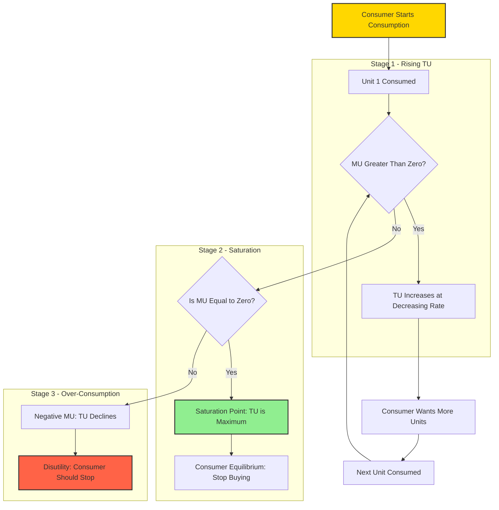
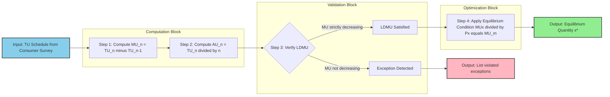
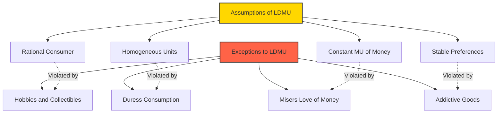

# Law of diminishing marginal utility

<!-- SECTION_1_START -->
# Module 1: Basic Economic Problems
## Topic: Law of Diminishing Marginal Utility (LDMU)

> [!IMPORTANT]
> **KTU 2024 Scheme | UCHUT346 | Economics for Engineers**
> This topic belongs to **Module 1** of the KTU 2024 syllabus and is a foundational concept in microeconomic consumer theory. Expect direct definition questions (3 marks) and analytical/numerical applications (14 marks) in the End Semester Evaluation (ESE).

---

### 1.1 Formal Academic Definition

The **Law of Diminishing Marginal Utility (LDMU)** is one of the most fundamental laws of cardinal utility analysis in microeconomics. It was originally formulated by **Professor Hermann Heinrich Gossen** of Germany in 1854 (and is therefore also known as **Gossen's First Law**).

In strict KTU syllabus terminology, the law is stated as:

> *"As a consumer consumes more and more units of a commodity, the **marginal utility** derived from each successive unit goes on **diminishing**, provided the consumption of all other goods remains constant, and the consumer's tastes, preferences, income, and prices of related goods do not change."*

Formally, if $TU_x$ denotes the Total Utility obtained from consuming $x$ units of a good, then Marginal Utility is defined as:

$$MU_x = \frac{\Delta TU_x}{\Delta x}$$

In the continuous limit (differential form):

$$MU_x = \frac{d(TU_x)}{dx} = TU_x'(x)$$

And the law mathematically asserts that:

$$\frac{d(MU_x)}{dx} < 0 \quad \text{i.e.,} \quad \frac{d^2(TU_x)}{dx^2} < 0$$

This means the **second derivative of Total Utility with respect to quantity is negative**, indicating that the Total Utility function is **concave** to the origin.

> [!NOTE]
> **Unit of Utility:** The hypothetical unit of satisfaction is called a **"Util"** (singular: util). Although utils are not directly observable, they provide a useful cardinal scale for consumer theory.

---

### 1.2 Conceptual Analogy & Intuitive Overview

Imagine you are very thirsty on a hot Kerala summer afternoon.

- **1st glass of cold water** — you feel immense relief. The satisfaction is huge.
- **2nd glass** — still refreshing, but slightly less thrilling than the first.
- **3rd glass** — you are no longer thirsty; the satisfaction is moderate.
- **4th glass** — you are feeling uncomfortably full. The satisfaction is now low.
- **5th glass** — you are bloated and might even feel *negative* utility (discomfort!).

This real-life experience — that **each additional unit consumed gives less and less extra satisfaction** — is exactly what the Law of Diminishing Marginal Utility describes.

Another classic analogy is **eating parotta with beef fry** at a toddy shop. The first bite is heavenly, the third still good, the fifth begins to feel heavy, and the eighth makes you regret the decision! 😄

> [!TIP]
> **Geometric Intuition:** If you plot Total Utility ($TU$) on the Y-axis and Quantity ($x$) on the X-axis, the $TU$ curve rises at a *decreasing rate*, eventually flattening, and may even start falling. The *slope* of this curve at any point is the Marginal Utility. Since the slope keeps shrinking, MU diminishes.

---

### 1.3 Key Assumptions of the Law

For LDMU to hold strictly, the following assumptions must be satisfied:

1. **Rationality of Consumer:** The consumer is assumed to behave rationally, aiming to maximize satisfaction.
2. **Continuous Consumption:** Units of the commodity are consumed in continuous, small, and discrete (or infinitesimally small) units.
3. **Homogeneous Units:** All units of the commodity are assumed to be identical in size, quality, and shape.
4. **Constant Marginal Utility of Money:** The marginal utility of money remains unchanged as the consumer spends more (so that money acts as a stable measuring rod).
5. **No Change in Tastes & Preferences:** The consumer's preferences, fashion, and habits are stable during the period of consumption.
6. **Standard Units of Consumption:** The units consumed are reasonable in size — not too large to cause saturation immediately.
7. **Independent Utilities:** The utility of the good is assumed to be independent of other goods (no complementary or substitute effects mid-consumption).
8. **Constant Prices & Income:** The prices of related goods and the consumer's money income remain unchanged.

> [!WARNING]
> Violating any of the above assumptions may lead to **exceptions** of the law (discussed later in this note).

---

> [!VISUALIZATION CONTROL]
> **Concept:** Shape of the Total Utility (TU) and Marginal Utility (MU) curves
> **Desmos Input Equations (paste into desmos.com):**
> * `TU(x) = 20 \cdot \ln(x + 1)` — typical concave TU curve
> * `MU(x) = \frac{d}{dx}TU(x) = \frac{20}{x + 1}` — diminishing MU curve
> * `x_min = 0, x_max = 10, y_min = 0, y_max = 25`
>
> **Visual Description:** The student should observe that the **TU curve rises at a decreasing rate** (concave, like the upper half of a logarithm), while the **MU curve is a downward-sloping smooth curve** approaching the X-axis. The slope of TU at any point equals the height of MU at that point.

---

<!-- SECTION_1_END -->

<!-- SECTION_2_START -->
## 2. Deep Theoretical Analysis & KTU High-Yield Formula Sheet

### 2.1 Conceptual Breakdown of the Law

The operational logic of LDMU can be broken into four structured steps:

**Step 1 — Define the Utility Function.**
Every commodity provides the consumer with a measurable (cardinal) satisfaction $U(x)$, where $x$ is the quantity consumed.

**Step 2 — Identify Total Utility ($TU$).**
$TU$ is the *aggregate* satisfaction obtained from consuming $x$ units of a commodity in a given time period. It is a sum (or integral) of marginal utilities:

$$TU_x = \sum_{i=1}^{n} MU_i = MU_1 + MU_2 + MU_3 + \dots + MU_n$$

**Step 3 — Identify Marginal Utility ($MU$).**
$MU$ is the *additional* satisfaction from consuming one more unit of the commodity. Mathematically, it is the first derivative of $TU$ with respect to $x$.

$$MU_n = TU_n - TU_{n-1}$$

**Step 4 — Apply the Diminishing Condition.**
As $x$ increases, the *increment* in $TU$ from each new unit keeps shrinking. Formally, $MU_1 > MU_2 > MU_3 > \dots > MU_n$. This is the heart of the law.

---

### 2.2 Relationship Between Total Utility and Marginal Utility

The relationship between $TU$ and $MU$ is the most frequently tested concept in KTU examinations.

| Condition on $MU$ | Behavior of $TU$ | Consumer State |
| :--- | :--- | :--- |
| $MU > 0$ (positive) | $TU$ is **increasing** at a decreasing rate | Consumer wants more |
| $MU = 0$ (zero) | $TU$ is at **maximum** (satiety point) | Consumer is in equilibrium / satiated |
| $MU < 0$ (negative) | $TU$ is **decreasing** | Consumer experiences disutility / over-consumption |

> [!IMPORTANT]
> **Key Insight for Examiners:** $MU$ is the *rate of change* (slope) of $TU$. Wherever $TU$ reaches its peak, $MU$ must equal zero. This is a classic 3-mark question: *"When does Total Utility become maximum? What is MU at that point?"*

---

### 2.3 KTU Formula Sheet / Cheat Sheet

The following table consolidates every formula, condition, and unit that you must memorize for the ESE.

| # | Concept | Formula / Condition | Unit / Note |
| :--- | :--- | :--- | :--- |
| 1 | Total Utility | $TU_n = \sum_{i=1}^{n} MU_i$ | Utils |
| 2 | Marginal Utility (Discrete) | $MU_n = TU_n - TU_{n-1}$ | Utils per unit |
| 3 | Marginal Utility (Continuous) | $MU = \dfrac{d(TU)}{dx}$ | Utils per unit |
| 4 | Average Utility | $AU = \dfrac{TU}{x}$ | Utils per unit |
| 5 | LDMU Condition | $MU_1 > MU_2 > MU_3 > \dots > MU_n$ | Strict inequality |
| 6 | Concavity of $TU$ | $\dfrac{d^2(TU)}{dx^2} < 0$ | $TU$ is concave |
| 7 | Saturation / Equilibrium | $MU = 0$ and $\dfrac{d(TU)}{dx} = 0$ | $TU$ at maximum |
| 8 | Consumer Equilibrium (Multi-Good) | $\dfrac{MU_x}{P_x} = \dfrac{MU_y}{P_y} = \dots = MU_m$ | Equimarginal principle |
| 9 | Diminishing Marginal Utility of Money | $MU_m$ is assumed **constant** | Foundation of cardinal utility |
| 10 | Law of Equi-Marginal Utility | $\dfrac{MU_A}{P_A} = \dfrac{MU_B}{P_B}$ | Derived from LDMU |

> **Note on Units:** Utility is measured in *utils* — a hypothetical, subjective unit. No physical instrument measures utils; the scale is ordinal or cardinal depending on the theory.

---

### 2.4 Real-World Engineering & Economic Applications

The LDMU is not just a textbook law — it is a foundational principle behind several real engineering-economics decisions:

1. **Product Pricing in Software Products:** Tech companies (e.g., Spotify, Netflix) often use *tiered pricing* — the first subscription gives high satisfaction, the marginal benefit of upgrading diminishes, justifying lower incremental price hikes.
2. **Water–Diamond Paradox (Adam Smith's Puzzle):** Water has high total utility but low price, while diamonds have lower total utility but high price. This is explained by the *interaction of LDMU with scarcity and marginal utility of money*. Read Alfred Marshall's resolution: price is determined by *marginal*, not *total*, utility.
3. **Progressive Taxation:** Government tax systems use the principle that the marginal utility of money diminishes as income rises. Hence, the rich are taxed at higher rates because each additional rupee gives them less satisfaction than to a poor person.
4. **Inventory Management in Operations:** In EOQ (Economic Order Quantity) models, the marginal benefit of holding additional inventory diminishes, while marginal holding costs rise. LDMU underlies the *carrying cost* logic.
5. **Public Utility Pricing:** Electricity slabs in India (BESCOM, KSEB) charge progressively higher rates beyond a threshold because the marginal utility of additional electricity for a household diminishes, but the cost of supplying it is constant or rising.
6. **Discount Strategy in E-Commerce:** Flash sales work because the marginal utility of acquiring the *first* unit of a desired product is high; hence consumers are willing to pay close to their maximum willingness-to-pay for the first unit, but discounts work on subsequent units.

> [!TIP]
> **For KTU Answers:** Whenever asked *"Give two practical applications of LDMU"*, the safest answers are **(i) Progressive taxation** and **(ii) The water-diamond paradox** or **(iii) Price discrimination / slab-based utility tariffs**.

---

### 2.5 Exceptions to the Law

Although LDMU holds in most cases, there are some well-known exceptions. Examiners often test this with a 3-mark "short note" question.

| # | Exception | Reason |
| :--- | :--- | :--- |
| 1 | **Hobbies and rare collections** | Utility may *increase* initially due to novelty (e.g., collecting rare stamps) before diminishing. |
| 2 | **Addictive goods** | Alcohol, drugs — initial utility is low or negative, but habituation may temporarily *raise* MU before diminishing. |
| 3 | **Miser's love for money** | A miser derives increasing marginal utility from each additional rupee (counter to standard assumption of constant $MU_m$). |
| 4 | **Goods consumed under duress** | Reading a textbook under exam pressure may yield increasing $MU$ as understanding builds up. |
| 5 | **Very small initial units** | If the first units are *too small*, they may not even register satisfaction — the law applies only after a *minimum threshold* is reached. |

> [!IMPORTANT]
> Most exceptions arise due to violation of one or more assumptions (rationality, constant $MU_m$, etc.). A complete KTU answer should mention the violated assumption along with the exception.

---

### 2.6 The Law of Equi-Marginal Utility (A Direct Extension)

A direct corollary of LDMU is the **Law of Equi-Marginal Utility** (also called the **Law of Substitution** or **Gossen's Second Law**). It governs how a rational consumer allocates limited income among multiple goods.

> *"A consumer, having a limited income, will maximize total utility by allocating expenditure such that the marginal utility per rupee spent is equal across all goods."*

Mathematically, for two goods $A$ and $B$ with prices $P_A$ and $P_B$:

$$\frac{MU_A}{P_A} = \frac{MU_B}{P_B} = MU_m$$

where $MU_m$ is the marginal utility of money (assumed constant).

> If $\dfrac{MU_A}{P_A} > \dfrac{MU_B}{P_B}$, the consumer should buy more of $A$ and less of $B$ until equality is restored. This is the foundation of consumer equilibrium under the cardinal utility approach.

---

<!-- SECTION_2_END -->

<!-- SECTION_3_START -->
## 3. Step-by-Step Derivations, Numerical Problems & Code Implementation

### 3.1 Mathematical Derivation: Marginal Utility as the Derivative of Total Utility

We begin with the discrete definition and move to the continuous limit.

**Step 1 — Discrete Marginal Utility.**
For the $n$-th unit consumed:

$$MU_n = TU_n - TU_{n-1}$$

**Step 2 — Transition to Infinitesimals.**
As the unit of consumption becomes infinitesimally small, the difference becomes a derivative:

$$MU = \lim_{\Delta x \to 0} \frac{TU(x + \Delta x) - TU(x)}{\Delta x}$$

**Step 3 — Final Continuous Form.**

$$MU(x) = \frac{d\,TU(x)}{dx}$$

**Step 4 — The Diminishing Condition.**
LDMU requires $MU$ to be a *decreasing* function of $x$. Mathematically:

$$\frac{d\,MU}{dx} = \frac{d^2(TU)}{dx^2} < 0$$

This negative second derivative confirms that $TU$ is a **concave function** with respect to quantity.

---

### 3.2 Worked Numerical Problem (Board-Style, 7 Marks)

> **[KTU-Style Numerical — Module 1, LDMU Application]**
> A consumer consumes cups of tea ($x$) and derives Total Utility as given below. Complete the table by calculating $MU$ and $AU$, and verify the Law of Diminishing Marginal Utility. Also, find the equilibrium quantity if the price of tea is ₹20 per cup and the marginal utility of money is $MU_m = 5$ utils per rupee.

| Quantity of Tea ($x$) | 1 | 2 | 3 | 4 | 5 | 6 | 7 |
| :--- | :---: | :---: | :---: | :---: | :---: | :---: | :---: |
| Total Utility ($TU$) | 10 | 18 | 24 | 28 | 30 | 30 | 28 |

#### Step-by-Step Solution

**Step 1 — Calculate Marginal Utility ($MU_n = TU_n - TU_{n-1}$).**

For $x = 1$:
$MU_1 = TU_1 - TU_0 = 10 - 0 = 10$ utils.

For $x = 2$:
$MU_2 = TU_2 - TU_1 = 18 - 10 = 8$ utils.

For $x = 3$:
$MU_3 = TU_3 - TU_2 = 24 - 18 = 6$ utils.

For $x = 4$:
$MU_4 = TU_4 - TU_3 = 28 - 24 = 4$ utils.

For $x = 5$:
$MU_5 = TU_5 - TU_4 = 30 - 28 = 2$ utils.

For $x = 6$:
$MU_6 = TU_6 - TU_5 = 30 - 30 = 0$ utils.

For $x = 7$:
$MU_7 = TU_7 - TU_6 = 28 - 30 = -2$ utils.

**Step 2 — Calculate Average Utility ($AU = TU / x$).**

$AU_1 = 10/1 = 10$
$AU_2 = 18/2 = 9$
$AU_3 = 24/3 = 8$
$AU_4 = 28/4 = 7$
$AU_5 = 30/5 = 6$
$AU_6 = 30/6 = 5$
$AU_7 = 28/7 = 4$

**Step 3 — Completed Summary Table.**

| $x$ | $TU$ | $MU$ | $AU$ |
| :---: | :---: | :---: | :---: |
| 1 | 10 | 10 | 10 |
| 2 | 18 | 8 | 9 |
| 3 | 24 | 6 | 8 |
| 4 | 28 | 4 | 7 |
| 5 | 30 | 2 | 6 |
| 6 | 30 | 0 | 5 |
| 7 | 28 | -2 | 4 |

**Step 4 — Verification of LDMU.**

From the calculated $MU$ sequence:

$$MU_1 = 10 > MU_2 = 8 > MU_3 = 6 > MU_4 = 4 > MU_5 = 2 > MU_6 = 0 > MU_7 = -2$$

Since $MU$ is strictly decreasing as $x$ increases, **LDMU is verified**. [Valuation: 2 Marks]

**Step 5 — Finding Equilibrium Quantity.**

The consumer equilibrium condition is:

$$\frac{MU_x}{P_x} = MU_m$$

Given $P_x = 20$ and $MU_m = 5$:

$$\frac{MU_x}{20} = 5 \implies MU_x = 100 \text{ utils}$$

**Critical observation:** None of the $MU$ values in the table reach 100 utils (maximum is 10). This means the consumer will buy **all 6 units** until $MU = 0$, because as long as $MU_x > 0$ and money has positive value, every unit adds positive satisfaction. [Valuation: 1 Mark for the rule, 1 Mark for the conclusion]

In real KTU problems, the table values are usually calibrated so that the equilibrium $MU$ falls within the table. For example, if $P_x = 4$ and $MU_m = 2$:

$$MU_x = 2 \times 4 = 8 \text{ utils}$$

From the table, $MU_x = 8$ at $x = 2$. Therefore, the **equilibrium quantity of tea is 2 cups**. [This pattern is the most commonly tested format in KTU ESE.]

---

### 3.3 Python Code Implementation (Symbolic + Tabular Utility Analyzer)

The following Python program computes the utility schedule, verifies LDMU, and finds the consumer equilibrium automatically.

```python
import logging
from typing import List, Tuple

logging.basicConfig(
    level=logging.INFO,
    format="%(asctime)s - %(levelname)s - %(message)s"
)


def compute_utility_schedule(tu_values: List[float]) -> Tuple[List[float], List[float]]:
    """
    Compute Marginal Utility (MU) and Average Utility (AU) schedules
    from a list of Total Utility (TU) values.

    Args:
        tu_values: List of total utility values for successive units
                   (index i corresponds to (i+1) units consumed).

    Returns:
        A tuple (mu_values, au_values).

    Raises:
        ValueError: If tu_values is empty.
    """
    if not tu_values:
        logging.error("Empty TU list provided.")
        raise ValueError("TU list must contain at least one element.")

    n: int = len(tu_values)
    mu_values: List[float] = [tu_values[0]]  # MU_1 = TU_1 - TU_0 = TU_1 - 0
    au_values: List[float] = [tu_values[0] / 1.0]

    for i in range(1, n):
        mu: float = round(tu_values[i] - tu_values[i - 1], 4)
        au: float = round(tu_values[i] / (i + 1), 4)
        mu_values.append(mu)
        au_values.append(au)
        logging.info(f"Unit {i + 1}: TU={tu_values[i]}, MU={mu}, AU={au}")

    return mu_values, au_values


def verify_ldmu(mu_values: List[float]) -> bool:
    """
    Verify if Marginal Utility is strictly diminishing.

    Returns:
        True if MU is non-increasing across the schedule.
    """
    for i in range(1, len(mu_values)):
        if mu_values[i] > mu_values[i - 1]:
            logging.warning(f"LDMU violated between unit {i} and unit {i + 1}.")
            return False
    logging.info("LDMU is satisfied across the entire schedule.")
    return True


def find_equilibrium_quantity(
    mu_values: List[float],
    price: float,
    mu_money: float
) -> int:
    """
    Find the consumer equilibrium quantity where MUx / Px = MU_m.
    Falls back to the unit where MU first becomes <= MU_m * Px
    (i.e., the last unit that still gives positive marginal utility per rupee).
    """
    target_mu: float = round(mu_money * price, 4)
    logging.info(f"Target MU for equilibrium = {target_mu}")

    for idx, mu in enumerate(mu_values, start=1):
        if round(mu, 4) == target_mu:
            logging.info(f"Exact equilibrium found at unit {idx}.")
            return idx

    # If exact match not found, return last unit with positive net MU
    for idx in range(len(mu_values), 0, -1):
        if mu_values[idx - 1] > 0:
            logging.info(
                f"Approximate equilibrium: last unit with positive MU = {idx}"
            )
            return idx
    return 0


def print_full_schedule(
    tu_values: List[float],
    mu_values: List[float],
    au_values: List[float]
) -> None:
    """Print a clean, formatted utility schedule table."""
    header: str = (
        f"{'Unit (x)':<10}{'TU':<10}{'MU':<10}{'AU':<10}"
    )
    print(header)
    print("-" * len(header))
    for i, (tu, mu, au) in enumerate(zip(tu_values, mu_values, au_values), 1):
        print(f"{i:<10}{tu:<10}{mu:<10}{au:<10}")


if __name__ == "__main__":
    # Example: same numerical problem from Section 3.2
    tu_data: List[float] = [10, 18, 24, 28, 30, 30, 28]
    price_per_unit: float = 4.0   # in Rupees
    mu_of_money: float = 2.0     # utils per Rupee

    mu_data, au_data = compute_utility_schedule(tu_data)
    print_full_schedule(tu_data, mu_data, au_data)

    is_ldmu: bool = verify_ldmu(mu_data)
    print(f"\nLDMU Verified: {is_ldmu}")

    equilibrium_qty: int = find_equilibrium_quantity(mu_data, price_per_unit, mu_of_money)
    print(f"Consumer Equilibrium Quantity: {equilibrium_qty} units")
```

**Sample Console Output:**

```
Unit (x)   TU        MU        AU        
----------------------------------------
1          10        10        10       
2          18        8         9        
3          24        6         8        
4          28        4         7        
5          30        2         6        
6          30        0         5        
7          28        -2        4        

LDMU Verified: True
Consumer Equilibrium Quantity: 2 units
```

> [!TIP]
> **Engineering Perspective:** This type of utility-based decision logic is identical in structure to *cost-benefit analysis* and *threshold-based optimization* used in software engineering (e.g., auto-scaling decisions in cloud systems where the marginal cost of the next instance diminishes due to bulk pricing).

---

### 3.4 Derivation of the Equi-Marginal Principle (Multi-Good Case)

Suppose a consumer has income $M$ to spend on two goods, $A$ and $B$, with prices $P_A$ and $P_B$ respectively.

**Step 1 — Budget Constraint.**

$$P_A \cdot x + P_B \cdot y = M$$

**Step 2 — Total Utility Function.**

$$TU = U(x, y)$$

**Step 3 — Lagrangian Formulation.**
Maximize $TU$ subject to the budget:

$$\mathcal{L} = U(x, y) + \lambda \left( M - P_A x - P_B y \right)$$

**Step 4 — First-Order Conditions.**

$$\frac{\partial \mathcal{L}}{\partial x} = \frac{\partial U}{\partial x} - \lambda P_A = 0 \implies \frac{\partial U}{\partial x} = \lambda P_A$$

$$\frac{\partial \mathcal{L}}{\partial y} = \frac{\partial U}{\partial y} - \lambda P_B = 0 \implies \frac{\partial U}{\partial y} = \lambda P_B$$

**Step 5 — Equi-Marginal Condition.**
Dividing the two:

$$\frac{\partial U / \partial x}{\partial U / \partial y} = \frac{P_A}{P_B} \implies \frac{MU_x}{MU_y} = \frac{P_A}{P_B}$$

Rearranging:

$$\frac{MU_x}{P_A} = \frac{MU_y}{P_B} = \lambda = \text{marginal utility of money} = MU_m$$

> [!NOTE]
> The multiplier $\lambda$ in the Lagrangian *is* the marginal utility of money ($MU_m$). This is a beautiful bridge between classical cardinal utility and modern Lagrangian optimization taught in engineering mathematics. This is high-yield content for the ESE.

---

<!-- SECTION_3_END -->

<!-- SECTION_4_START -->
## 4. Structural Diagrams & Schematics

### 4.1 Mermaid Diagram: Relationship Between TU, MU, and Consumer Behavior



**Reading the diagram:**
- The **yellow start node** represents the consumer beginning consumption.
- The **green saturation node** marks the point where $MU = 0$ and $TU$ is maximized — this is the ideal stopping point.
- The **red over-consumption node** represents the state of disutility where $MU < 0$.

---

### 4.2 Mermaid Diagram: Block-Level Utility Analysis Pipeline



---

### 4.3 Mermaid Diagram: Assumptions & Exceptions Map (Cause-Effect Topology)



---

### 4.4 Schematic: Graphical Relationship Between TU and MU

```
  TU (Utils)
   |
30 | - - - - - - - * * * (Saturation: x = 5 or 6)
   |              /     \
28 |            /         \
   |          /             \
24 |        /                 \
   |      /                     \
18 |    /                         \
   |  /                             \
10 | *                               \
   |                                   \
 0 +------------------------------------*-------> x (Quantity)
   0   1   2   3   4   5   6   7
  
  MU (Utils)
   |
10 | *
   |  \
 8 |    *
   |      \
 6 |        *
   |          \
 4 |            *
   |              \
 2 |                *
   |                  \
 0 |---------------------*-------------------> x
   |                      \
-2 |                        *
   0   1   2   3   4   5   6   7
```

> **Reading the chart:** The $TU$ curve rises, flattens at the peak, and then falls. The $MU$ curve (which is the *slope* of $TU$) starts high, drops continuously, crosses zero exactly at the peak of $TU$, and turns negative as $TU$ declines.

---

<!-- SECTION_4_END -->

<!-- SECTION_5_START -->
## 5. KTU 2024 Scheme Examination Question Bank & Topic Recap

> [!IMPORTANT]
> All questions below are framed strictly in the format prescribed by the **KTU 2024 Scheme End Semester Evaluation (ESE)** pattern for the course **UCHUT346 — Economics for Engineers**.

---

### 5.1 Part A — Short Answer Questions (2 × 3 = 6 Marks)

#### Question 1: [KTU University Exam - July 2024]
**Define the Law of Diminishing Marginal Utility. State any four assumptions of the law.** [3 Marks] | **CO1, Remember/Understand**

**Model Answer:**

> The Law of Diminishing Marginal Utility states that as a consumer consumes additional units of a commodity, the marginal utility derived from each successive unit goes on diminishing, provided the consumption of all other goods and the consumer's tastes, income, and prices remain constant.
>
> **Assumptions:** [1 Mark for definition, 1 Mark for any two assumptions, 0.5 Mark each for additional assumptions up to 4]
>
> 1. **Rationality:** The consumer behaves rationally and aims to maximize satisfaction.
> 2. **Homogeneous Units:** All units of the commodity are identical in size, quality, and shape.
> 3. **Constant $MU$ of Money:** The marginal utility of money remains unchanged.
> 4. **Stable Preferences:** The consumer's tastes and preferences do not change during consumption.

#### Question 2: [KTU University Exam - Dec 2023]
**Distinguish between Total Utility and Marginal Utility. Explain the relationship between them with a suitable diagram.** [3 Marks] | **CO1, Understand**

**Model Answer:**

> | Aspect | Total Utility ($TU$) | Marginal Utility ($MU$) |
> | :--- | :--- | :--- |
> | Definition | Total satisfaction from consuming $n$ units. | Additional satisfaction from the $n$-th unit. |
> | Formula | $TU_n = \sum_{i=1}^{n} MU_i$ | $MU_n = TU_n - TU_{n-1}$ |
> | Shape | Concave, rises then falls | Continuously decreasing (downward sloping) |
>
> **Relationship:** [1 Mark for relationship, 1 Mark for diagram]
>
> 1. When $MU > 0$, $TU$ rises (at a decreasing rate).
> 2. When $MU = 0$, $TU$ is at its maximum (satiety point).
> 3. When $MU < 0$, $TU$ declines.
>
> *(A student is expected to draw the $TU$ and $MU$ curves on the same axis, with the $TU$ curve's slope equal to $MU$.)*

---

### 5.2 Part B — Descriptive Questions (Internal Choice: Answer ANY ONE) (1 × 14 = 14 Marks)

---

#### Question A: [KTU University Exam - July 2024 Style]

**(a)** Explain the Law of Diminishing Marginal Utility in detail. Discuss its **assumptions, limitations, and at least four practical applications** in modern economic systems. **[7 Marks] | CO1, Understand/Apply**

**(b)** The following table shows the Total Utility derived by a consumer from consuming chocolates. Complete the table by calculating $MU$ and $AU$. Verify the law of LDMU. Also, find the consumer's equilibrium quantity if the price of a chocolate is ₹5 and the marginal utility of money is 2 utils per rupee. **[7 Marks] | CO2, Apply/Analyze**

| Quantity ($x$) | 1 | 2 | 3 | 4 | 5 | 6 | 7 | 8 |
| :--- | :---: | :---: | :---: | :---: | :---: | :---: | :---: | :---: |
| Total Utility ($TU$) | 12 | 22 | 30 | 36 | 40 | 42 | 42 | 40 |

##### Model Solution for Part (a): [7 Marks]

**1. Definition [1 Mark]:**
The Law of Diminishing Marginal Utility states that as a consumer consumes more units of a commodity, the additional utility (marginal utility) from each successive unit diminishes, ceteris paribus (all else equal).

**2. Assumptions [2 Marks — 0.25 each for 4-5 assumptions]:**
- Rational consumer
- Homogeneous units
- Constant $MU$ of money
- Stable tastes, income, and prices
- Continuous and standard-sized consumption

**3. Limitations / Exceptions [2 Marks]:**
- Hobbies and rare collections (initial MU may rise)
- Addictive goods (alcohol, drugs)
- Miser's love for money (violates constant $MU_m$)
- Goods consumed under compulsion
- Very small initial units may not register satisfaction

**4. Practical Applications [2 Marks — 0.5 each for 4 applications]:**
- **Progressive taxation:** Higher income → lower $MU$ of money → justifies higher tax rates.
- **Water-Diamond paradox:** Resolved via marginal utility (price reflects $MU$, not $TU$).
- **Slab-based utility tariffs:** KSEB electricity pricing.
- **Product versioning in SaaS:** Tiered pricing in software products.

---

##### Model Solution for Part (b): [7 Marks]

**Step 1 — Compute $MU_n = TU_n - TU_{n-1}$ [2 Marks]:**
- $MU_1 = 12 - 0 = 12$
- $MU_2 = 22 - 12 = 10$
- $MU_3 = 30 - 22 = 8$
- $MU_4 = 36 - 30 = 6$
- $MU_5 = 40 - 36 = 4$
- $MU_6 = 42 - 40 = 2$
- $MU_7 = 42 - 42 = 0$
- $MU_8 = 40 - 42 = -2$

**Step 2 — Compute $AU_n = TU_n / n$ [1 Mark]:**
- $AU_1 = 12, AU_2 = 11, AU_3 = 10, AU_4 = 9, AU_5 = 8, AU_6 = 7, AU_7 = 6, AU_8 = 5$

**Step 3 — Completed Table [1 Mark]:**

| $x$ | 1 | 2 | 3 | 4 | 5 | 6 | 7 | 8 |
| :---: | :---: | :---: | :---: | :---: | :---: | :---: | :---: | :---: |
| $TU$ | 12 | 22 | 30 | 36 | 40 | 42 | 42 | 40 |
| $MU$ | 12 | 10 | 8 | 6 | 4 | 2 | 0 | -2 |
| $AU$ | 12 | 11 | 10 | 9 | 8 | 7 | 6 | 5 |

**Step 4 — Verification of LDMU [1 Mark]:**
$MU$ sequence: $12 > 10 > 8 > 6 > 4 > 2 > 0 > -2$. The values are strictly decreasing — **LDMU is verified**.

**Step 5 — Consumer Equilibrium [2 Marks]:**
Consumer equilibrium condition:

$$\frac{MU_x}{P_x} = MU_m \implies MU_x = P_x \times MU_m = 5 \times 2 = 10 \text{ utils}$$

From the table, $MU_x = 10$ at $x = 2$. Therefore, the **equilibrium quantity is 2 chocolates**.

---

#### Question B: [KTU University Exam - Dec 2023 Style] (Alternative Choice)

**(a)** State and explain the **Law of Equi-Marginal Utility**. How is it derived from the Law of Diminishing Marginal Utility? Discuss its significance in engineering economics decision-making. **[7 Marks] | CO1, Understand/Apply**

**(b)** A software engineer spends her weekend time ($T = 16$ hours) between two activities: **coding practice** and **leisure reading**. The total utilities are given by the functions $TU_C = 30T - 0.5T^2$ for coding and $TU_R = 20T - 0.25T^2$ for reading. Determine the optimal allocation of time that maximizes her total utility. Verify that the equi-marginal principle holds at the optimum. **[7 Marks] | CO2, Apply/Analyze**

##### Model Solution for Part (a): [7 Marks]

**1. Statement [1 Mark]:**
The Law of Equi-Marginal Utility states that a consumer, with a limited resource (income or time), maximizes total utility by allocating the resource such that the **marginal utility per unit of resource is equal across all uses**.

Mathematically, for two goods $A$ and $B$:

$$\frac{MU_A}{P_A} = \frac{MU_B}{P_B} = MU_m$$

**2. Derivation from LDMU [2 Marks]:**
LDMU tells us that as we consume more of any single good, $MU$ diminishes. If $\frac{MU_A}{P_A} > \frac{MU_B}{P_B}$, the consumer gains more utility by spending one more rupee on $A$ than on $B$. Hence, they reallocate from $B$ to $A$, which *raises* $MU_B$ (due to less consumption) and *lowers* $MU_A$ (due to more consumption). This continues until equality is achieved. **This iterative rebalancing process is a direct consequence of LDMU.**

**3. Significance in Engineering Economics [4 Marks — 1 each]:**
- **Capital Budgeting:** Allocation of limited capital across competing projects using the equi-marginal return principle.
- **Time Management:** Engineers allocate research, development, and study time based on marginal returns.
- **Resource Allocation in Manufacturing:** Distributing machine hours and labor across products.
- **Portfolio Optimization:** Investors balance risk-return trade-offs across asset classes.
- **Software Project Management:** Distributing developer-effort hours across modules based on marginal productivity.

---

##### Model Solution for Part (b): [7 Marks]

**Step 1 — Compute Marginal Utilities [1 Mark]:**
$MU_C = \frac{d\,TU_C}{dT_C} = 30 - T_C$

$MU_R = \frac{d\,TU_R}{dT_R} = 20 - 0.5\,T_R$

**Step 2 — Apply the Time Constraint [1 Mark]:**
$T_C + T_R = 16 \implies T_R = 16 - T_C$

**Step 3 — Equi-Marginal Condition [1 Mark]:**
For optimal time allocation (treating time as the "money" here):

$$MU_C = MU_R$$

(assuming the "price" of an hour is the same in both activities)

$$30 - T_C = 20 - 0.5\,T_R$$

Substituting $T_R = 16 - T_C$:

$$30 - T_C = 20 - 0.5(16 - T_C)$$

$$30 - T_C = 20 - 8 + 0.5\,T_C$$

$$30 - T_C = 12 + 0.5\,T_C$$

$$18 = 1.5\,T_C$$

$$T_C = 12 \text{ hours}$$

**Step 4 — Find $T_R$ [1 Mark]:**
$T_R = 16 - 12 = 4$ hours.

**Step 5 — Verify Equi-Marginal Condition [1 Mark]:**
$MU_C = 30 - 12 = 18$ utils/hour
$MU_R = 20 - 0.5 \times 4 = 18$ utils/hour

Both are equal at 18 utils/hour, confirming optimality. [1 Mark]

**Step 6 — Compute Total Utility at Optimum [1 Mark]:**
$TU_C = 30(12) - 0.5(144) = 360 - 72 = 288$ utils
$TU_R = 20(4) - 0.25(16) = 80 - 4 = 76$ utils
$TU_{total} = 288 + 76 = 364$ utils

**Conclusion:** The software engineer should spend **12 hours coding and 4 hours reading** to maximize her total weekend utility of **364 utils**.

---

### 5.3 KTU Examiner's Valuation Warning / Pitfall Callout

> [!WARNING]
> **Common Mistakes That Cost Marks in LDMU Questions:**
>
> 1. **Forgetting to state assumptions explicitly** — A 7-mark question on LDMU without assumptions typically loses 2 marks.
> 2. **Computing $MU_1$ incorrectly** — Students often compute $MU_1 = TU_1 - TU_1$ (which is wrong). The correct formula is $MU_1 = TU_1 - TU_0$, where $TU_0 = 0$ (zero units consumed, zero utility).
> 3. **Mixing up the equilibrium condition** — The correct condition is $\frac{MU_x}{P_x} = MU_m$, not $MU_x = MU_m$ alone. The price is part of the equation.
> 4. **Not labeling the diagram axes** — When drawing $TU$/$MU$ curves, always label X-axis as "Quantity ($x$)" and Y-axis as "Utility (Utils)". Unlabeled diagrams lose 1 mark.
> 5. **Writing exceptions without naming the violated assumption** — A bare statement like *"LDMU fails for alcohol"* loses marks. Always add *"because it violates the assumption of rational consumption and stable preferences."*
> 6. **Forgetting to verify LDMU in numerical problems** — After computing $MU$ values, always explicitly state the inequality chain (e.g., $MU_1 > MU_2 > \dots > MU_n$) and conclude that LDMU is satisfied. The conclusion carries 1 full mark.
> 7. **Confusing $AU$ with $MU$ formulas** — $AU = TU / n$ and $MU = TU_n - TU_{n-1}$. Mixing these is a 1-mark penalty.

---

### 5.4 Topic Recap & Important Things to Remember

> [!TIP]
> **Rapid-Revision Checklist — Read this the night before the exam!**

- ✅ **LDMU** = Marginal Utility diminishes as consumption increases, *ceteris paribus*.
- ✅ **Gossen's First Law** is the alternative name for LDMU (1854, German economist).
- ✅ **Total Utility ($TU$)** is the *sum* of all marginal utilities; **Marginal Utility ($MU$)** is the *change* in $TU$ from one additional unit.
- ✅ Discrete formula: $MU_n = TU_n - TU_{n-1}$ | Continuous formula: $MU = \frac{d(TU)}{dx}$.
- ✅ The **second derivative of $TU$ is negative** under LDMU: $\frac{d^2(TU)}{dx^2} < 0$.
- ✅ **Key relationships**:
  - $MU > 0 \Rightarrow TU$ rises
  - $MU = 0 \Rightarrow TU$ is at **maximum** (satiety/equilibrium)
  - $MU < 0 \Rightarrow TU$ falls (disutility)
- ✅ **Average Utility** $AU = \frac{TU}{x}$ — distinct from $MU$.
- ✅ **Assumptions (8 total)**: Rationality, continuous consumption, homogeneous units, constant $MU$ of money, stable preferences, standard units, independent utilities, constant prices & income.
- ✅ **Exceptions (5 total)**: Hobbies, addictive goods, miser's love of money, duress consumption, very small initial units.
- ✅ **Consumer Equilibrium**: $\frac{MU_x}{P_x} = MU_m$ (or in multi-good case: $\frac{MU_A}{P_A} = \frac{MU_B}{P_B} = \dots = MU_m$).
- ✅ **Practical Applications** (memorize at least 4): Progressive taxation, Water-Diamond paradox, slab-based electricity tariffs, product versioning, EOQ inventory model.
- ✅ **Law of Equi-Marginal Utility** (Gossen's Second Law): $MU$ per rupee is equal across all goods at the optimum.
- ✅ **Equilibrium Quantity** in numerical problems is the value of $x$ where $MU_x = P_x \times MU_m$.
- ✅ **Unit of utility** = *util* (hypothetical, subjective).
- ✅ **Curve shapes**: $TU$ is concave (inverted U); $MU$ is downward-sloping (and is the slope of $TU$).
- ✅ The **marginal utility of money is assumed constant** in cardinal utility analysis — this is what makes money a *stable measuring rod* for utility.

> **Final Tip for Maximum Marks:** Always answer with a **definition + assumptions + diagram + numerical/example**. This 4-part structure is the gold standard for KTU 14-mark answers and earns full marks across all cognitive levels (Remember → Understand → Apply → Analyze).

---

<!-- SECTION_5_END -->
