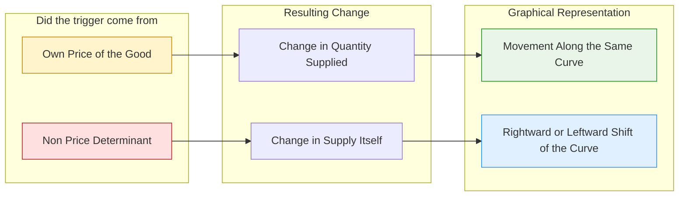
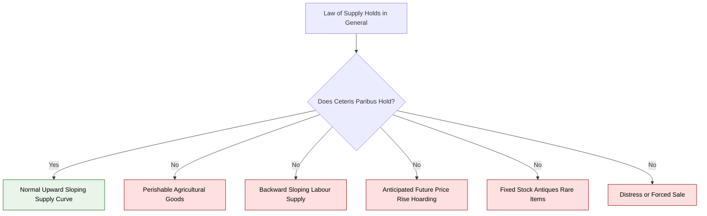
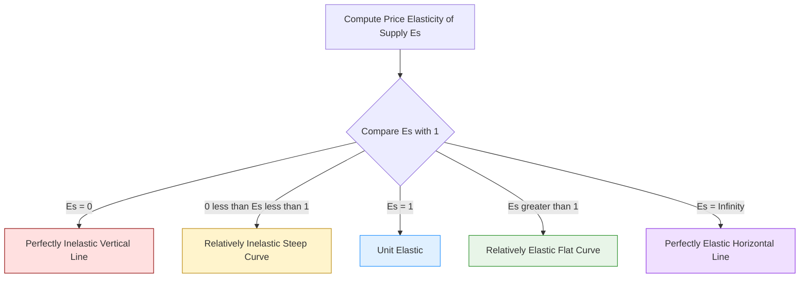

# Law of supply

<!-- SECTION_1_START -->

# Law of Supply — Core Definition & Intuitive Overview

## 1.1 Formal Academic Definition

> [!NOTE]
> **Law of Supply (KTU 2024 UCHUT346 — Module 1)**
> *"Other factors remaining constant (ceteris paribus), the quantity supplied of a commodity varies directly with its own price. As price rises, quantity supplied rises; as price falls, quantity supplied falls."*
>
> Symbolically, $\dfrac{\partial Q_s}{\partial P} > 0$, where $Q_s$ is quantity supplied and $P$ is price.

This is a **direct (positive) functional relationship** between the price of a good and the quantity of that good that producers are willing and able to offer for sale in the market over a given period of time.

## 1.2 Conceptual Analogy & Plain-English Intuition

> [!IMPORTANT]
> **The "Fruit Stall" Analogy**
> Imagine you run a mango stall in Kochi. When mangoes fetch **₹100/kg**, you bring only 20 kg from the wholesale market because the profit margin is tight. But when the same mangoes sell for **₹300/kg**, you rush back and bring 60 kg — the higher reward justifies the extra effort, transport cost, and risk.
>
> **The same instinct drives every factory, farmer, and software firm in the world:** *higher price → higher production motivation.*

**Intuitive Summary for Engineers:**
Just as Ohm's Law states that current is directly proportional to voltage (for a fixed resistor), the **Law of Supply** states that quantity supplied is directly proportional to price (with other factors held constant). Both laws express a **monotonic, direct functional relationship** under a *ceteris paribus* assumption.

## 1.3 Physical / Economic Constants & Standard Metrics

| Parameter | Symbol | Standard Range | Engineering Analogy |
|---|---|---|---|
| Price elasticity of supply (perfectly inelastic) | $E_s$ | **0** | Rigid body (no deformation) |
| Price elasticity of supply (unit elastic) | $E_s$ | **1** | Linear spring at unit slope |
| Price elasticity of supply (perfectly elastic) | $E_s$ | **$\infty$** | Frictionless slider |

## 1.4 Visualization Control

> [!VISUALIZATION CONTROL]
> **Concept:** Upward-sloping linear Supply Curve on a Price-Quantity plane.
>
> **GeoGebra / Desmos Input Equations:**
> * `f(x) = 2x + 10`  (Quantity Supplied as a function of Price)
> * `g(x) = 2x - 10`  (Optional — comparison: a steeper, less elastic supply)
> * `h(x) = 0.5x + 20` (Optional — comparison: a flatter, more elastic supply)
>
> **Visual Description:** Plot $P$ (price) on the Y-axis and $Q$ (quantity) on the X-axis. All supply curves slope **upwards from left to right**. The Y-intercept is the **minimum supply price** (the choke price below which producers exit the market). A steeper curve indicates lower elasticity (less responsive suppliers); a flatter curve indicates higher elasticity (more responsive suppliers).

---

<!-- SECTION_1_END -->

<!-- SECTION_2_START -->

# Deep Theoretical Analysis & KTU High-Yield Formula Sheet

## 2.1 Operational Logic — Step-by-Step Decomposition

The Law of Supply operates on the following structured logic:

1. **Ceteris Paribus Assumption Lock:** Hold all non-price determinants (input cost, technology, number of sellers, taxes, producer expectations, prices of related goods) **constant**.
2. **Producer's Profit Calculus:** Sellers are rational profit-maximizers. Marginal Revenue must equal or exceed Marginal Cost ($MR \geq MC$) for production to be profitable.
3. **Price Signal Transduction:** An increase in market price raises the **per-unit margin**. This signal "transduces" (like an amplifier) into a higher output decision.
4. **Quantity Response:** Producers allocate more resources (raw materials, labor hours, machine cycles) to expand output, raising $Q_s$.
5. **Diminishing Returns Cap:** Eventually, capacity constraints (machine hours, skilled labor) cap the expansion, but the relationship remains **positive** in the relevant range.

## 2.2 Supply Schedule — A Worked Tabular Example

> [!NOTE]
> **Linear Supply Schedule for "Branded Notebooks" (hypothetical)**
>
> | Price per unit (₹) | Quantity Supplied (units/day) |
> |---|---|
> | 10 | 50 |
> | 20 | 80 |
> | 30 | 110 |
> | 40 | 140 |
> | 50 | 170 |
>
> Observation: Every ₹10 increase in price produces a **+30 units** rise in supply — a perfectly linear schedule.

## 2.3 Supply Function — Mathematical Form

The general supply function:

$$Q_s = f(P, \text{Input Costs}, \text{Technology}, T, N, E, G)$$

Where:
- $Q_s$ = Quantity Supplied
- $P$ = Price of the good
- Input Costs = Raw material, labor, energy
- Technology = Production technique
- $T$ = Taxes / Subsidies
- $N$ = Number of firms
- $E$ = Producer expectations
- $G$ = Government policy

**Simplified linear form (ceteris paribus):**

$$Q_s = a + b \cdot P$$

Where $b > 0$ is the slope coefficient (the *responsiveness* of supply to price).

## 2.4 KTU Formula Sheet / Cheat Sheet

| # | Formula / Concept | Expression | Description |
|---|---|---|---|
| 1 | Supply Function (Linear) | $Q_s = a + b P$, with $b > 0$ | $a$ = intercept, $b$ = slope |
| 2 | Inverse Supply Function | $P = \alpha + \beta Q_s$, with $\beta > 0$ | Price expressed as function of quantity |
| 3 | Price Elasticity of Supply | $E_s = \dfrac{\%\Delta Q_s}{\%\Delta P} = \dfrac{\Delta Q_s}{\Delta P} \cdot \dfrac{P}{Q_s}$ | Degree of responsiveness |
| 4 | Point Elasticity | $E_s = \dfrac{b \cdot P}{Q_s}$ | For linear supply $Q_s = a + bP$ |
| 5 | Arc Elasticity | $E_s = \dfrac{Q_2 - Q_1}{Q_2 + Q_1} \cdot \dfrac{P_2 + P_1}{P_2 - P_1}$ | Between two points on the curve |
| 6 | Supply = - Demand at equilibrium | $Q_s = Q_d$ | Market clearing condition (relevant for Module 2) |
| 7 | Total Revenue | $TR = P \cdot Q_s$ | Producer's gross income |
| 8 | Choke Price | $P_{min} = -\dfrac{a}{b}$ | Minimum price to enter market ($Q_s = 0$) |

## 2.5 Real-World Engineering & Industry Utility

> [!IMPORTANT]
> The Law of Supply is **not just textbook economics** — it is a working tool in:
> * **Production Planning:** Manufacturing firms forecast output levels at various selling prices before bidding in tenders.
> * **Inventory & Logistics:** A higher projected selling price justifies higher safety stock and faster replenishment cycles.
> * **Software Pricing & Cloud Capacity:** A SaaS company provisions more server capacity when subscription prices (and therefore revenue per user) are higher.
> * **Energy Sector:** Power producers' willingness to generate from peaker plants increases sharply when electricity spot prices rise.
> * **Bids & Tendering (Engineers' context):** Higher contract value → firms commit more resources to the project.

---

<!-- SECTION_2_END -->

<!-- SECTION_3_START -->

# Step-by-Step Derivations, Numerical Worked Examples & Implementation

## 3.1 Derivation: Building a Supply Function from a Supply Schedule

### Given Data (from Section 2.2)

| Price $P$ (₹) | Quantity $Q_s$ (units) |
|---|---|
| 10 | 50 |
| 20 | 80 |
| 30 | 110 |
| 40 | 140 |
| 50 | 170 |

### Derivation Steps

**Step 1 — Identify the linear pattern.**
Observe that for every increase of ₹10 in $P$, $Q_s$ increases by 30 units.

**Step 2 — Compute the slope $b$.**

$$b = \dfrac{\Delta Q_s}{\Delta P} = \dfrac{80 - 50}{20 - 10} = \dfrac{30}{10} = 3$$

**Step 3 — Compute the intercept $a$ using the point $(P=10, Q_s=50)$.**

$$Q_s = a + bP$$
$$50 = a + 3(10)$$
$$50 = a + 30$$
$$a = 20$$

**Step 4 — Verify with another point, say $(P=50, Q_s=170)$.**

$$Q_s = 20 + 3(50) = 20 + 150 = 170 \checkmark$$

**Step 5 — Write the final supply function.**

$$Q_s = 20 + 3P$$

**Step 6 — State the inverse supply function and the choke price.**

$$P = \dfrac{Q_s - 20}{3}$$

$$P_{min} = -\dfrac{a}{b} = -\dfrac{20}{3} \approx -6.67$$

> Since price cannot be negative in practice, the **economically meaningful range** is $P \geq 0$, which gives $Q_s \geq 20$ units (autonomous supply at zero price).

## 3.2 Numerical Worked Example — Price Elasticity of Supply

> [!NOTE]
> **Problem:** A firm supplies 200 units at ₹50 and 260 units at ₹80. Calculate the price elasticity of supply using the arc (mid-point) formula. Classify the elasticity.

### Step-by-Step Solution

**Step 1 — Identify the variables.**

$$P_1 = 50, \quad Q_1 = 200$$
$$P_2 = 80, \quad Q_2 = 260$$

**Step 2 — Compute $\Delta Q_s$ and $\Delta P$.**

$$\Delta Q_s = Q_2 - Q_1 = 260 - 200 = 60$$
$$\Delta P = P_2 - P_1 = 80 - 50 = 30$$

**Step 3 — Compute the averages (arc method).**

$$\bar{Q_s} = \dfrac{Q_1 + Q_2}{2} = \dfrac{200 + 260}{2} = 230$$
$$\bar{P} = \dfrac{P_1 + P_2}{2} = \dfrac{50 + 80}{2} = 65$$

**Step 4 — Apply the arc elasticity formula.**

$$E_s = \dfrac{\Delta Q_s}{\Delta P} \cdot \dfrac{\bar{P}}{\bar{Q_s}}$$

$$E_s = \dfrac{60}{30} \cdot \dfrac{65}{230}$$

$$E_s = 2 \cdot \dfrac{65}{230}$$

$$E_s = \dfrac{130}{230} = \dfrac{13}{23} \approx 0.565$$

**Step 5 — Classify the elasticity.**

$$E_s \approx 0.565 \quad \Rightarrow \quad 0 < E_s < 1$$

Therefore, supply is **inelastic but not perfectly so** (relatively unresponsive to price changes — typical of agricultural products in the short run).

## 3.3 Assumptions & Limitations of the Law of Supply

The Law of Supply rests on the following ceteris paribus conditions:

1. **Constant technology** — no innovation or disruption during the analysis period.
2. **Stable input prices** — wages, raw material costs unchanged.
3. **Constant number of sellers** — no new firms entering or exiting.
4. **Rational profit motive** — sellers aim to maximize profit.
5. **No change in producer expectations** about future prices.
6. **No change in government policy** (taxes, subsidies, regulations).
7. **No change in prices of related goods** (substitutes/complements in production).

> [!IMPORTANT]
> **Violating any assumption causes the entire supply curve to shift** — it does not invalidate the law, only its ceteris paribus scope.

## 3.4 Exceptions to the Law of Supply (Engineers' Note)

| # | Exception | Reason | Real-World Example |
|---|---|---|---|
| 1 | **Agricultural goods (perishable)** | Farmers cannot withhold supply even at low prices because of spoilage. | Tomato prices crash during harvest, yet supply continues. |
| 2 | **Backward-sloping supply of labour** | Higher wages → workers prefer leisure over more hours (income effect dominates substitution effect). | A senior engineer refusing overtime despite high pay. |
| 3 | **Anticipated future price changes** | Sellers may *hoard* at low current prices expecting future price rise. | Gold traders in inflationary periods. |
| 4 | **Rare / antique goods** | Supply is fixed by historical availability. | Limited-edition classic cars. |
| 5 | **Auction / distress sale scenarios** | Forced sale at low price due to liquidity crunch. | Liquidation of bankrupt firms. |

## 3.5 Movement Along vs. Shift of the Supply Curve

> [!NOTE]
> **Movement Along the Curve (Change in Quantity Supplied):**
> *Caused by a change in the good's **own price**.*
> * Represented by sliding from Point A to Point B **on the same curve**.
> * $E_s$ is measured along this movement.

> [!NOTE]
> **Shift of the Curve (Change in Supply):**
> *Caused by a change in any **non-price determinant** (input cost, technology, taxes, etc.).*
> * The entire curve translates **rightward (increase in supply)** or **leftward (decrease in supply)**.
> * $E_s$ is *not* measured across a shift.

---

<!-- SECTION_3_END -->

<!-- SECTION_4_START -->

# Structural Diagrams & Schematics

## 4.1 Determinants of Supply — Causal Architecture Flow

```mermaid
flowchart TD
    A[Supply of a Commodity Qs] --> B[Own Price of the Good]
    A --> C[Input Costs]
    A --> D[State of Technology]
    A --> E[Number of Sellers]
    A --> F[Government Policy]
    A --> G[Producer Expectations]
    A --> H[Prices of Related Goods]
    A --> I[Natural / External Shocks]

    B:::price
    C:::cost
    D:::tech
    E:::sellers
    F:::gov
    G:::exp
    H:::related
    I:::shock

    classDef price fill:#FFF4CC,stroke:#B8860B,color:#000
    classDef cost fill:#FFE0E0,stroke:#B22222,color:#000
    classDef tech fill:#E0F0FF,stroke:#1E90FF,color:#000
    classDef sellers fill:#E8F5E8,stroke:#228B22,color:#000
    classDef gov fill:#F0E0FF,stroke:#8A2BE2,color:#000
    classDef exp fill:#FFF0E0,stroke:#FF8C00,color:#000
    classDef related fill:#E0FFFF,stroke:#008B8B,color:#000
    classDef shock fill:#FFE0F0,stroke:#C71585,color:#000
```

**Reading the diagram:** The central node $Q_s$ receives **eight causal arrows** representing the eight determinants. Only the **own price** causes a *movement along* the supply curve; the other seven cause *shifts* of the curve.

## 4.2 Movement vs. Shift — Decision Topology

## 4.3 Exceptions to the Law — Classification Matrix

## 4.4 Sequential Elasticity Classification Topology

---

<!-- SECTION_4_END -->

<!-- SECTION_5_START -->

# KTU 2024 Scheme Examination Question Bank & Topic Recap

## 5.1 Part A — Short-Answer Questions (3 Marks Each)

### Question A1 (3 Marks)  `[KTU University Exam - Dec 2023]`
**State and explain the Law of Supply. Why is the supply curve typically upward-sloping?**

**Model Answer (Valuation Key):**
* **Statement:** "Ceteris paribus, the quantity supplied of a commodity is directly (positively) related to its own price."  **[1 Mark]**
* **Reason for upward slope:** Producers are rational profit-maximizers. A higher price raises the per-unit margin, incentivising greater output (more labour, more raw material, more machine hours). **[1 Mark]**
* **Formal condition:** $\dfrac{\partial Q_s}{\partial P} > 0$.  **[1 Mark]**

> [!WARNING]
> **Examiner Pitfall:** Students often write "supply increases with price" but forget the critical phrase **"other things being equal"** (ceteris paribus). Without it, the answer is incomplete and loses 1 mark.

---

### Question A2 (3 Marks)  `[KTU University Exam - July 2024]`
**Distinguish between *change in supply* and *change in quantity supplied*.**

**Model Answer (Valuation Key):**
* **Change in Quantity Supplied:** Movement *along* the same supply curve caused by a change in the **own price** of the good.  **[1.5 Marks]**
* **Change in Supply:** Rightward or leftward **shift** of the entire supply curve caused by a change in any **non-price determinant** (input cost, technology, taxes, etc.).  **[1.5 Marks]**

> [!WARNING]
> **Examiner Pitfall:** Do NOT write "change in supply is when the whole curve moves" without specifying the **cause** (non-price factor). Examiners specifically award 1 mark for naming the *cause* and 1 mark for naming the *graphical effect*.

---

## 5.2 Part B — Long-Answer Questions (14 Marks Each, with Internal Choice)

### Question B1 — Option A (14 Marks)  `[KTU University Exam - Dec 2023]`

**(a)** *Explain any **six assumptions** underlying the Law of Supply with examples. **[7 Marks]***

**Model Answer (Valuation Key):**

| Assumption | Example | Marks |
|---|---|---|
| 1. Constant technology | CNC machines operating with the same efficiency | 1 |
| 2. Stable input prices | Steel price unchanged during analysis period | 1 |
| 3. Constant number of sellers | No new entrants into the smartphone market | 1 |
| 4. Rational profit motive | Firms produce up to $MR = MC$ | 1 |
| 5. No change in producer expectations | Sellers do not anticipate price rise next month | 1 |
| 6. Unchanged government policy | GST rate remains at 18% | 1 |
| 7. No change in related goods' prices | Price of petrol stable (affects transport goods) | (bonus) |

> *(Any six well-explained assumptions with examples = 6 marks. Logical flow and presentation = 1 mark.)*

---

**(b)** *Given the supply schedule: at $P = 20$ ₹, $Q_s = 100$ units; at $P = 40$ ₹, $Q_s = 200$ units. Derive the supply function, find the choke price, and comment on the elasticity at $P = 30$ ₹. **[7 Marks]***

**Model Answer (Valuation Key):**

**Step 1 — Compute the slope.**

$$b = \dfrac{200 - 100}{40 - 20} = \dfrac{100}{20} = 5 \quad \text{[1 Mark]}$$

**Step 2 — Compute the intercept using $(P=20, Q_s=100)$.**

$$100 = a + 5(20) \;\Rightarrow\; a = 0 \quad \text{[1 Mark]}$$

**Step 3 — State the supply function.**

$$Q_s = 5P \quad \text{[1 Mark]}$$

**Step 4 — Find the choke price (where $Q_s = 0$).**

$$0 = 5P \;\Rightarrow\; P_{min} = 0 \quad \text{[1 Mark]}$$

(The producer enters the market even at zero price — characteristic of *free goods* or *subsidized* supply.)

**Step 5 — Find the quantity at $P = 30$ ₹.**

$$Q_s = 5(30) = 150 \text{ units} \quad \text{[1 Mark]}$$

**Step 6 — Compute the elasticity at $P = 30$.**

$$E_s = \dfrac{b \cdot P}{Q_s} = \dfrac{5 \cdot 30}{150} = \dfrac{150}{150} = 1 \quad \text{[1.5 Marks]}$$

**Step 7 — Comment.**

Since $E_s = 1$ exactly, supply is **unit elastic** at this price — a 1% rise in price produces exactly a 1% rise in quantity supplied. **[0.5 Mark]**

> [!WARNING]
> **Examiner Pitfall:** Students frequently compute the slope correctly but **forget the intercept**, leaving the supply function incomplete (loses 1 mark). Also, the **comment on elasticity** carries 0.5 mark — do not skip it.

---

### Question B1 — Option B (14 Marks, Alternative Choice)  `[KTU University Exam - July 2024]`

**(a)** *Explain the **price elasticity of supply**. Discuss the **five degrees** of elasticity with diagrams in description. **[7 Marks]***

**Model Answer (Valuation Key):**

**Definition:** Price elasticity of supply is the **degree of responsiveness** of quantity supplied to a change in the good's own price.

$$E_s = \dfrac{\%\Delta Q_s}{\%\Delta P} = \dfrac{\Delta Q_s}{\Delta P} \cdot \dfrac{P}{Q_s} \quad \text{[1.5 Marks]}$$

**Five Degrees — Tabular Description:**

| Degree | Value | Shape of Curve | Real Example | Marks |
|---|---|---|---|---|
| Perfectly Inelastic | $E_s = 0$ | Vertical line | Fresh milk on a single day | 1 |
| Relatively Inelastic | $0 < E_s < 1$ | Steep upward | Agricultural produce (short run) | 1 |
| Unit Elastic | $E_s = 1$ | 45° from origin through origin | Manufactured goods with idle capacity | 1 |
| Relatively Elastic | $E_s > 1$ | Flatter upward | Luxury goods, fashion items | 1 |
| Perfectly Elastic | $E_s = \infty$ | Horizontal line | Homogeneous commodities in perfect competition | 1 |

**Conclusion (0.5 mark):** A linear supply curve passing through the origin is always unit elastic. A linear supply curve intersecting the Y-axis becomes increasingly elastic as we move up-right.

---

**(b)** *The supply function of a commodity is $Q_s = -20 + 4P$. Find (i) the price at which supply equals 100 units, (ii) the choke price, (iii) the elasticity at $P = 20$ ₹, and (iv) the supply at $P = 5$ ₹. Interpret the result. **[7 Marks]***

**Model Answer (Valuation Key):**

**(i) Price at which $Q_s = 100$:**  **[1.5 Marks]**

$$100 = -20 + 4P \;\Rightarrow\; 4P = 120 \;\Rightarrow\; P = 30 \text{ ₹}$$

**(ii) Choke price ($Q_s = 0$):**  **[1.5 Marks]**

$$0 = -20 + 4P \;\Rightarrow\; P_{min} = 5 \text{ ₹}$$

**(iii) Elasticity at $P = 20$:**  **[2 Marks]**

$$Q_s = -20 + 4(20) = -20 + 80 = 60 \text{ units}$$
$$E_s = \dfrac{b \cdot P}{Q_s} = \dfrac{4 \cdot 20}{60} = \dfrac{80}{60} = \dfrac{4}{3} \approx 1.33$$

**(iv) Supply at $P = 5$ ₹:**  **[1 Mark]**

$$Q_s = -20 + 4(5) = -20 + 20 = 0 \text{ units}$$

**Interpretation (1 mark):** At ₹5, the price equals the choke price, so producers are **just indifferent** between producing and not producing. Below ₹5, no firm supplies the good — they would rather shut down.

> [!WARNING]
> **Examiner Pitfall:** When the supply function has a **negative intercept** (here, $-20$), many students ignore the choke price calculation entirely. The choke price is a **mandatory part of KTU valuation** — leaving it out costs 1.5 marks.

---

## 5.3 Topic Recap & Important Things to Remember

> [!IMPORTANT]
> **Rapid-Revision Checklist for Law of Supply**

- **Core Law:** $Q_s \uparrow \iff P \uparrow$ (direct relationship, ceteris paribus).
- **Slope Sign:** Supply curve slopes **upward** from left to right; mathematically, $\dfrac{\partial Q_s}{\partial P} > 0$.
- **Standard Form:** $Q_s = a + bP$ with $b > 0$.
- **Choke Price:** $P_{min} = -\dfrac{a}{b}$ (the minimum price at which producers will supply).
- **Elasticity Formula (Point):** $E_s = \dfrac{bP}{Q_s}$.
- **Elasticity Formula (Arc):** $E_s = \dfrac{\Delta Q_s}{\Delta P} \cdot \dfrac{\bar{P}}{\bar{Q_s}}$.
- **Five Degrees of Elasticity:** $0$, $0<E_s<1$, $E_s=1$, $E_s>1$, $\infty$.
- **Key Distinction:** *Change in quantity supplied* = movement along curve (own price change). *Change in supply* = shift of entire curve (non-price determinant change).
- **Determinants of Supply (Seven Plus):** Own price, input cost, technology, number of sellers, government policy, producer expectations, related goods' prices, natural shocks.
- **Exceptions to Remember:** Perishable goods, backward-bending labour supply, hoarding, antiques, distress sales.
- **Assumptions (Memorize 6):** Constant technology, stable input cost, fixed number of sellers, profit motive, no expectation change, stable government policy.
- **Engineer's Application:** Production planning, capacity allocation, tender pricing, energy dispatch, inventory control.
- **Numerical Tip:** When the supply function passes through the origin, elasticity is always $E_s = 1$ (unit elastic). When it intersects the Y-axis, elasticity rises as you move up the curve.

<!-- SECTION_5_END -->
