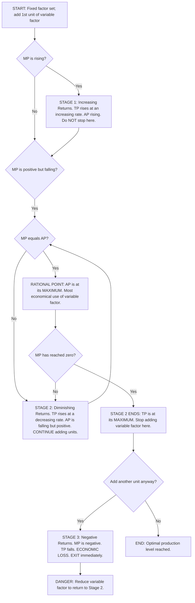
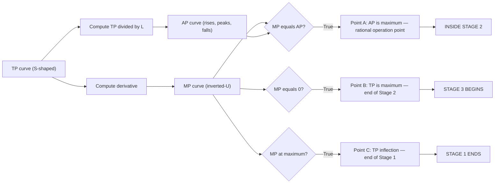

# Law of variable proportion

<!-- SECTION_1_START -->
# Law of Variable Proportions

## 1.1 Formal Academic Definition (KTU 2024 Syllabus Terminology)

> [!IMPORTANT]
> **Law of Variable Proportions (LVP):** A fundamental short-run production law in engineering economics which states that *as successive units of a variable factor (e.g., labour, raw material) are combined with a fixed factor (e.g., land, capital, machinery), the Total Product (TP) first increases at an **increasing rate**, then at a **decreasing rate**, and finally becomes negative — provided the **state of technology** remains constant.*

The law is a **short-run phenomenon** because at least one factor of production is held constant. It is also called the **Law of Non-Proportional Returns** or the **Law of Diminishing Returns** (in its later phase).

---

## 1.2 Conceptual Analogy / Intuitive Overview

Imagine a **fixed-size kitchen** (the fixed factor) and you keep hiring more chefs (the variable factor):

- **1st–2nd chef:** They have ample space, equipment, and ingredients. Adding them *more than doubles* the dishes prepared. → **Increasing Returns**
- **3rd–5th chef:** The kitchen gets crowded. Each new chef helps, but the *extra benefit per chef shrinks*. → **Diminishing Returns**
- **6th+ chef:** They are now tripping over each other, blocking the stove, and breaking plates. Adding more chefs *reduces* total output. → **Negative Returns**

> [!NOTE]
> The "**kitchen**" cannot be expanded in the short run (rented, fixed size). The "**chefs**" can be hired or fired daily. This is exactly the production environment in which the Law of Variable Proportions applies.

---

## 1.3 Core Production Metrics

> [!IMPORTANT]
> Three derived measures from Total Product must be mastered for KTU board exams:
> - **Total Product (TP)** — total output produced with a given factor combination.
> - **Average Product (AP)** — output per unit of the variable factor: $AP = \dfrac{TP}{L}$
> - **Marginal Product (MP)** — addition to total output from one more unit of variable factor: $MP_n = TP_n - TP_{n-1} = \dfrac{\Delta TP}{\Delta L}$

The law applies under the following standard **KTU assumptions**:
1. The state of **technology is constant** (no innovation during analysis).
2. **One factor is fixed**; all others are variable.
3. Factors are **homogeneous** (all units of labour are equally skilled).
4. The **law is short-run** in nature.

---

> [!VISUALIZATION CONTROL]
> **Concept:** Relationship among TP, AP, and MP curves across the three production stages.
> **Plot Setup (Desmos):**
> * $x$-axis: Units of Labour $L$ (variable factor), domain $[0, 12]$
> * $y$-axis: Output $Q$
> * $TP(x) = -0.5x^3 + 6x^2 + 2x$
> * $AP(x) = \dfrac{TP(x)}{x} = -0.5x^2 + 6x + 2$
> * $MP(x) = \dfrac{d(TP)}{dx} = -1.5x^2 + 12x + 2$
> **Visual Description:** The student should observe (i) an **S-shaped TP curve** rising, (ii) an **inverted-U MP curve** peaking early and crossing zero, and (iii) an **AP curve** that rises first, peaks later than MP, then falls.
<!-- SECTION_1_END -->

<!-- SECTION_2_START -->
# Deep Theoretical Analysis & KTU High-Yield Formula Sheet

## 2.1 The Three Stages of Production (KTU Board-Favourite)

The Law of Variable Proportions divides short-run production into **three distinct stages** based on the behaviour of TP, AP, and MP.

### Stage 1 — Stage of Increasing Returns
- TP rises at an **increasing rate**.
- MP is **positive and rising**; MP $>$ AP.
- AP is **rising** (approaching its maximum).
- *Cause:* The fixed factor is *under-utilised*; the variable factor operates on the most productive resources first.
- **Rational decision:** Producer will *not* voluntarily stop in this stage.

### Stage 2 — Stage of Diminishing Returns
- TP rises at a **decreasing rate**.
- MP is **positive but falling**.
- AP first **rises**, reaches its **maximum when $MP = AP$**, then **falls**.
- *Cause:* The fixed factor is now optimally utilised; further units of the variable factor have less of the fixed factor to work with.
- **Rational decision:** **This is the producer's zone of operation** — every additional variable input still adds positively to output.

### Stage 3 — Stage of Negative Returns
- TP **declines** (the production curve bends downwards).
- MP becomes **negative** ($MP < 0$).
- AP continues to **fall** but stays positive.
- *Cause:* The fixed factor is *over-utilised*; the variable factor is now a hindrance (overcrowding, fatigue, coordination failure).
- **Rational decision:** A rational producer will *never* operate here.

> [!NOTE]
> **KTU Examiner Insight:** A common 7-mark question is *"Why does a rational producer always operate in Stage 2?"* The answer lies in Stage 1 being unexploited (unused capacity) and Stage 3 being counter-productive (negative MP). Stage 2 is the *only economically rational zone*.

---

## 2.2 Phase Boundaries — Critical Reference Points

| Boundary | Condition | Economic Meaning |
| :--- | :--- | :--- |
| End of Stage 1 $\rightarrow$ Start of Stage 2 | $MP$ is at its **maximum** | TP changes from $\uparrow\uparrow$ to $\uparrow$ (inflection point of TP) |
| Inside Stage 2 | $MP = AP$ | **AP is at its maximum** — most efficient use of variable factor |
| End of Stage 2 $\rightarrow$ Start of Stage 3 | $MP = 0$ | TP is at its **maximum** |
| Stage 3 | $MP < 0$ | TP starts falling |

---

## 2.3 KTU High-Yield Formula Sheet

| Concept | Formula | Symbol Notes | Unit / Magnitude |
| :--- | :--- | :--- | :--- |
| Total Product | $TP = AP \times L$ | $L$ = units of variable factor | Output units (e.g., tonnes, pieces) |
| Average Product | $AP = \dfrac{TP}{L}$ | Output per variable input | Output per worker / per hour |
| Marginal Product | $MP = TP_n - TP_{n-1}$ | Discrete change in TP | Additional output |
| Marginal Product (continuous) | $MP = \dfrac{d(TP)}{dL}$ | Derivative form | Additional output |
| Optimal AP | $MP = AP$ | Critical point inside Stage 2 | Where AP is maximised |
| Maximum TP | $MP = 0$ | End of Stage 2 | TP cannot grow further |
| Production elasticity | $E_p = \dfrac{MP}{AP}$ | Stage 1: $E_p > 1$; Stage 2: $0 < E_p < 1$; Stage 3: $E_p < 0$ | Dimensionless ratio |

> [!TIP]
> Production Elasticity ($E_p$) is a **favourite KTU conceptual question** because it lets examiners test all three stages using a single metric.

---

## 2.4 Real-World Engineering & Industry Utility

| Domain | Application of LVP |
| :--- | :--- |
| Manufacturing Plant | A factory has **fixed machinery**; engineers analyse how output changes as more **labour shifts** are added. |
| Civil Engineering | A **fixed construction site** with cranes; adding more workers beyond capacity causes bottlenecks and accidents. |
| Software Industry | A **fixed server cluster**; adding virtual machines eventually hits CPU/RAM ceiling — performance drops. |
| Agriculture | A **fixed plot of land** cultivated with **increasing doses of fertilizer & labour**. |
| Process Engineering | A **reactor of fixed volume**; throughput vs. catalyst loading curve. |

> [!IMPORTANT]
> The law guides **capacity planning** in industry: managers stop hiring when $MP$ no longer justifies the **marginal cost of labour**. This is the foundation of the firm's short-run **cost curves** (MC, AC, AVC) studied later in the module.
<!-- SECTION_2_END -->

<!-- SECTION_3_START -->
# Step-by-Step Derivations & Numerical Implementation

## 3.1 Canonical Numerical Problem (KTU Board Pattern)

A manufacturing firm uses a **fixed machine** and varying units of labour. The Total Physical Product schedule is given below. Required:
1. Compute AP and MP for each level of labour.
2. Identify the three stages of production.
3. Determine the most economical level of labour.

| Labour $L$ | Total Product $TP$ |
| :---: | :---: |
| 0 | 0 |
| 1 | 10 |
| 2 | 25 |
| 3 | 45 |
| 4 | 60 |
| 5 | 70 |
| 6 | 75 |
| 7 | 75 |
| 8 | 70 |

---

### Step 1 — Compute Average Product (AP)

Using $AP = \dfrac{TP}{L}$ for $L \ge 1$:

$$AP_1 = \frac{10}{1} = 10 \text{ units}$$

$$AP_2 = \frac{25}{2} = 12.5 \text{ units}$$

$$AP_3 = \frac{45}{3} = 15 \text{ units}$$

$$AP_4 = \frac{60}{4} = 15 \text{ units}$$

$$AP_5 = \frac{70}{5} = 14 \text{ units}$$

$$AP_6 = \frac{75}{6} = 12.5 \text{ units}$$

$$AP_7 = \frac{75}{7} \approx 10.71 \text{ units}$$

$$AP_8 = \frac{70}{8} = 8.75 \text{ units}$$

---

### Step 2 — Compute Marginal Product (MP)

Using $MP_n = TP_n - TP_{n-1}$:

$$MP_1 = 10 - 0 = 10 \text{ units}$$

$$MP_2 = 25 - 10 = 15 \text{ units}$$

$$MP_3 = 45 - 25 = 20 \text{ units}$$

$$MP_4 = 60 - 45 = 15 \text{ units}$$

$$MP_5 = 70 - 60 = 10 \text{ units}$$

$$MP_6 = 75 - 70 = 5 \text{ units}$$

$$MP_7 = 75 - 75 = 0 \text{ units}$$

$$MP_8 = 70 - 75 = -5 \text{ units}$$

---

### Step 3 — Consolidated Production Schedule

| $L$ | $TP$ | $AP = TP \div L$ | $MP = \Delta TP$ | Stage | $E_p = MP \div AP$ |
| :---: | :---: | :---: | :---: | :---: | :---: |
| 0 | 0 | — | — | — | — |
| 1 | 10 | 10.0 | +10 | **I** | 1.00 |
| 2 | 25 | 12.5 | +15 | **I** | 1.20 |
| 3 | 45 | 15.0 | +20 | **I $\rightarrow$ II** | 1.33 |
| 4 | 60 | 15.0 | +15 | **II** | 1.00 |
| 5 | 70 | 14.0 | +10 | **II** | 0.71 |
| 6 | 75 | 12.5 | +5 | **II** | 0.40 |
| 7 | 75 | 10.71 | 0 | **II $\rightarrow$ III** | 0.00 |
| 8 | 70 | 8.75 | −5 | **III** | −0.57 |

---

### Step 4 — Identify the Three Stages

- **Stage 1 (Increasing Returns):** $L = 1$ to $L = 3$ — TP rises at an *increasing* rate; MP rises from 10 to 20.
- **Stage 2 (Diminishing Returns):** $L = 3$ to $L = 7$ — TP rises at a *decreasing* rate; MP falls from 20 to 0; AP is maximised at $L = 4$ where $MP = AP = 15$.
- **Stage 3 (Negative Returns):** $L > 7$ — TP falls from 75 to 70; MP becomes negative.

---

### Step 5 — Determine the Most Economical Level of Labour

> [!IMPORTANT]
> **Most Economical Level:** $L = 4$ units of labour, where **AP is at its maximum (= 15 units)** and $MP = AP = 15$.

> **Reasoning:** Up to $L=4$, every additional worker adds more than the average (pulling AP up). Beyond $L=4$, additional workers add *less* than the average (pulling AP down). Hence $L=4$ is the **most efficient use of labour** within the rational stage.

---

## 3.2 Continuous-Case Derivation (Engineering Mathematics Bridge)

Suppose the production function is given as:

$$TP(L) = -0.5L^3 + 6L^2 + 2L$$

**Step A — Find MP by differentiation:**

$$MP(L) = \frac{d(TP)}{dL} = -1.5L^2 + 12L + 2$$

**Step B — Maximum MP (end of Stage 1):** Set $\dfrac{d(MP)}{dL} = 0$:

$$\frac{d(MP)}{dL} = -3L + 12 = 0 \implies L = 4$$

**Step C — AP function:**

$$AP(L) = \frac{TP(L)}{L} = -0.5L^2 + 6L + 2$$

**Step D — Maximum AP (most efficient point):** Set $\dfrac{d(AP)}{dL} = 0$:

$$\frac{d(AP)}{dL} = -L + 6 = 0 \implies L = 6$$

**Step E — Maximum TP (end of Stage 2):** Set $MP(L) = 0$:

$$-1.5L^2 + 12L + 2 = 0 \implies L = \frac{-12 \pm \sqrt{144 + 12}}{-3} = \frac{-12 \pm \sqrt{156}}{-3}$$

Taking the positive root:

$$L \approx \frac{-12 + 12.49}{-3} \approx -0.16 \text{ (rejected)} \quad \text{or} \quad L \approx 8.16 \text{ units}$$

> **Conclusion:** $L \approx 4$ (max MP, end of Stage 1), $L \approx 6$ (max AP, rational point), $L \approx 8.16$ (max TP, end of Stage 2). This matches the canonical numerical result qualitatively.
<!-- SECTION_3_END -->

<!-- SECTION_4_START -->
# Structural Diagrams & Schematics

## 4.1 Production Stage Flowchart

> [!NOTE]
> The following Mermaid flowchart visualises the **decision flow** a firm follows as it adds more units of the variable factor in the short run.

---

## 4.2 Stage Identification Sub-Graph Matrix

---

## 4.3 Sequential Processing Topology — How TP, AP, MP Interact

> [!NOTE]
> **Reading the diagram:** A KTU student should memorise that *as $L$ increases*, the **TP curve first bends upwards (concave up), then bends downwards (concave down)**, forming the classical **S-shape**. The MP curve always leads the AP curve — MP peaks first, then crosses AP from above at the AP maximum, and finally hits zero at the TP maximum.
<!-- SECTION_4_END -->

<!-- SECTION_5_START -->
# KTU 2024 Scheme Examination Question Bank & Topic Recap

---

## Part A — Short Answer Questions (3 Marks Each)

### Question 1
`[KTU University Exam - July 2023]`
**State the Law of Variable Proportions. Mention any two of its assumptions.** (3 Marks, CO1, Remember)

**Model Answer:**
The Law of Variable Proportions states that *"in the short run, as successive units of a variable factor are combined with a fixed factor, the total product first increases at an increasing rate, then at a decreasing rate, and finally becomes negative."*
*[Definition: 2 Marks]*

**Assumptions (any two):**
1. The state of technology remains constant. *[1 Mark]*
2. One factor of production is fixed while others are variable.
3. The factors of production are homogeneous.

---

### Question 2
`[KTU University Exam - Dec 2022]`
**Differentiate between the Average Product and the Marginal Product of a variable input.** (3 Marks, CO1, Understand)

**Model Answer:**

| Basis | Average Product (AP) | Marginal Product (MP) |
| :--- | :--- | :--- |
| Definition | Output per unit of variable factor | Addition to total output from one more unit |
| Formula | $AP = TP \div L$ | $MP = TP_n - TP_{n-1}$ |
| Behaviour | Rises, reaches maximum when $MP = AP$, then falls | Rises, reaches max, falls, becomes zero, then negative |

*[Tabular distinction: 2 Marks; Example / Formula: 1 Mark]*

---

## Part B — Long Answer Questions (14 Marks with Internal Choice)

### Question A (14 Marks)
`[KTU University Exam - Dec 2023]`
**(a)** Explain the **three stages of production** under the Law of Variable Proportions with the help of a neat diagram. **(7 Marks, CO2, Understand)**

**(b)** From the following data, compute the **Average Product** and **Marginal Product**, and identify the **stages of production** and the **most economical level of labour**. **(7 Marks, CO2, Apply)**

| Units of Labour | 1 | 2 | 3 | 4 | 5 | 6 | 7 | 8 |
| :---: | :---: | :---: | :---: | :---: | :---: | :---: | :---: | :---: |
| Total Product | 8 | 22 | 42 | 56 | 66 | 72 | 72 | 66 |

---

#### Model Solution to (a) — 7 Marks

**Stage 1 — Increasing Returns:** TP rises at an *increasing* rate; MP rises; AP rises. Fixed factor is under-utilised. *[2 Marks for explanation]*

**Stage 2 — Diminishing Returns:** TP rises at a *decreasing* rate; MP falls but is positive; AP reaches its **maximum** at the point where $MP = AP$. This is the **rational zone of production**. *[2 Marks for explanation]*

**Stage 3 — Negative Returns:** TP falls; MP becomes negative; AP continues to fall. Fixed factor is *over-utilised*. *[1 Mark for explanation]*

**Neat diagram:** S-shaped TP curve, inverted-U MP curve, hump-shaped AP curve; label all three stages and the points $MP_{max}$, $MP = AP$, and $MP = 0$. *[2 Marks for diagram]*

#### Model Solution to (b) — 7 Marks

**Computation of AP and MP** (showing the table):

| $L$ | $TP$ | $AP = TP \div L$ | $MP = \Delta TP$ |
| :---: | :---: | :---: | :---: |
| 1 | 8 | 8.00 | +8 |
| 2 | 22 | 11.00 | +14 |
| 3 | 42 | 14.00 | +20 |
| 4 | 56 | 14.00 | +14 |
| 5 | 66 | 13.20 | +10 |
| 6 | 72 | 12.00 | +6 |
| 7 | 72 | 10.29 | 0 |
| 8 | 66 | 8.25 | −6 |

*[Correct AP and MP values: 3 Marks — 1 Mark for AP, 1 Mark for MP, 1 Mark for the table layout]*

**Identification of Stages:**
- **Stage 1:** $L = 1$ to $L = 3$ (MP rises from 8 to 20). *[1 Mark]*
- **Stage 2:** $L = 3$ to $L = 7$ (MP falls from 20 to 0; AP peaks at $L=4$). *[1 Mark]*
- **Stage 3:** $L > 7$ (MP = −6, TP falls). *[1 Mark]*

**Most Economical Level of Labour:** $L = 4$, where **AP is maximum (= 14 units)** and $MP = AP = 14$. *[1 Mark — final conclusion]*

---

### Question B (14 Marks — Internal Choice Alternative)
`[KTU University Exam - July 2024]`
**(a)** State the **assumptions** and **limitations** of the Law of Variable Proportions. **(7 Marks, CO1, Understand)**

**(b)** Discuss the **relationship between Total Product, Average Product, and Marginal Product** with the help of a hypothetical schedule and a diagram. **(7 Marks, CO2, Analyze)**

---

#### Model Solution to (a) — 7 Marks

**Assumptions:** *[3 Marks — 1 Mark each for any three]*
1. Short-run analysis (one factor fixed, others variable).
2. Constant state of technology.
3. Homogeneous units of the variable factor.
4. The variable factor is divisible into small units.

**Limitations:** *[4 Marks — 1 Mark each for any four]*
1. **Short-run limitation:** Not applicable to long-run production decisions.
2. **Constant technology assumption:** Unrealistic in industries undergoing rapid automation.
3. **Homogeneity assumption:** In reality, labour quality varies with training and experience.
4. **Single fixed factor:** Real production involves multiple fixed and variable inputs simultaneously.
5. **Aggregation problem:** The law is difficult to verify in practice for a multi-product firm.

---

#### Model Solution to (b) — 7 Marks

**The relationships are:** *[2 Marks for stating the rules]*
1. When $MP > AP$, AP is **rising**.
2. When $MP < AP$, AP is **falling**.
3. When $MP = AP$, AP is at its **maximum**.
4. When $MP = 0$, TP is at its **maximum**.
5. When $MP < 0$, TP is **falling**.

**Hypothetical schedule** (use the same numerical table as in Question A part (b)):

| $L$ | $TP$ | $AP$ | $MP$ |
| :---: | :---: | :---: | :---: |
| 1 | 8 | 8.0 | 8 |
| 2 | 22 | 11.0 | 14 |
| 3 | 42 | 14.0 | 20 |
| 4 | 56 | 14.0 | 14 |
| 5 | 66 | 13.2 | 10 |
| 6 | 72 | 12.0 | 6 |
| 7 | 72 | 10.3 | 0 |
| 8 | 66 | 8.3 | −6 |

*[Schedule: 2 Marks]*

**Diagram:** *[3 Marks]*
- $x$-axis: Labour $L$; $y$-axis: Output.
- S-shaped **TP** curve, hump-shaped **AP** curve, inverted-U **MP** curve.
- Mark the three critical points: (i) $MP_{max}$ at $L=3$, (ii) $MP=AP$ at $L=4$ (AP peak), (iii) $MP=0$ at $L=7$ (TP peak).
- Label the three stages clearly.

---

> [!WARNING]
> **KTU Examiner's Valuation Warning — Common Pitfalls**
> 1. **Do not skip the diagram.** A 14-mark question on LVP *always* expects a labelled diagram showing TP, AP, and MP curves. Skipping the diagram typically costs **2–3 marks**.
> 2. **Do not confuse AP-max with TP-max.** Students often wrongly state that "the most economical level is where TP is maximum." The correct answer is **where AP is maximum**, i.e., where $MP = AP$. TP-maximum is the *boundary* of Stage 2, not the *operating point*.
> 3. **Always state the units.** AP and MP are "units of output per worker" or "units of output" respectively. KTU examiners explicitly look for units in numerical problems.
> 4. **Failing to identify the fixed factor** in the question costs a mark. Always re-state which factor is fixed and which is variable at the start of the answer.
> 5. **Do not write "LVP is the same as Law of Returns to Scale."** They are *different*: LVP is **short-run** (one factor fixed); Returns to Scale is **long-run** (all factors variable).

---

## Topic Recap & Important Things to Remember

- **Law of Variable Proportions (LVP)** is a **short-run** production law applicable when **one factor is fixed** and the state of technology is constant.
- The three core metrics are **Total Product (TP)**, **Average Product (AP)**, and **Marginal Product (MP)**, with $AP = TP \div L$ and $MP = \Delta TP \div \Delta L$.
- The law operates in **three stages**: **Stage 1 (Increasing Returns)**, **Stage 2 (Diminishing Returns)**, and **Stage 3 (Negative Returns)**.
- **Critical reference points:** (i) $MP$ is maximum at the **end of Stage 1**; (ii) $MP = AP$ at the **AP maximum** — the most economical operating point; (iii) $MP = 0$ at the **TP maximum** — the end of Stage 2.
- **A rational producer always operates in Stage 2**, because Stage 1 under-utilises the fixed factor and Stage 3 over-utilises it.
- **Production Elasticity** $E_p = MP \div AP$ categorises stages cleanly: $E_p > 1$ (Stage 1), $0 < E_p < 1$ (Stage 2), $E_p < 0$ (Stage 3).
- **LVP is NOT the same as the Law of Returns to Scale** — the latter is a long-run concept with all factors variable.
- **Engineering applications:** capacity planning, factory labour scheduling, server scaling, and reactor throughput optimisation.
- **In a KTU 14-mark answer:** always include the diagram, the schedule, the stage identification, and the most economical level — all four components are mandatory for full marks.
<!-- SECTION_5_END -->
