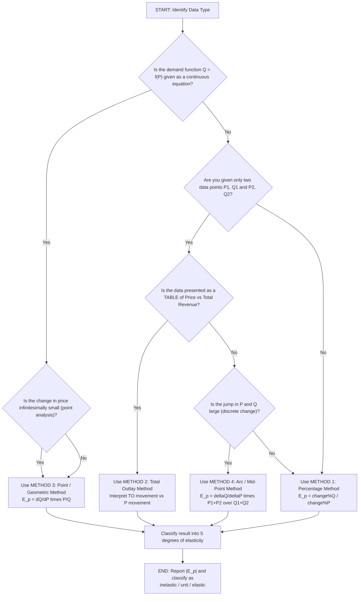
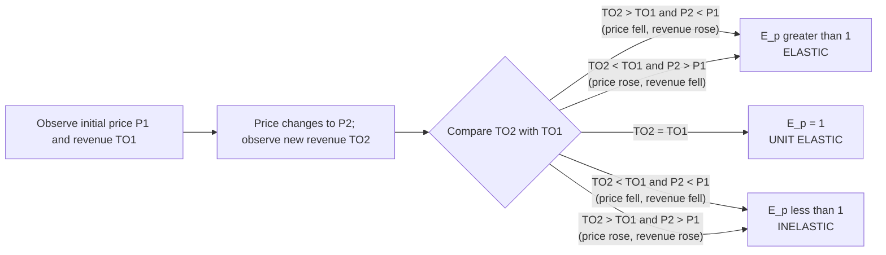
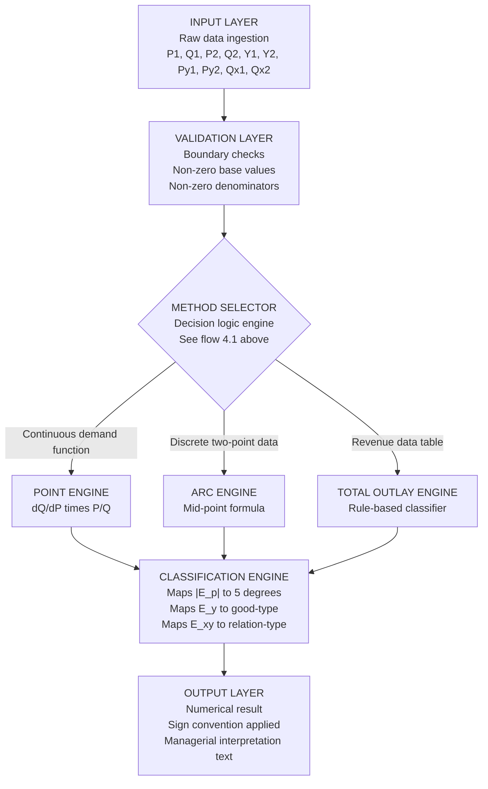

# measurement of elasticity and its applications

<!-- SECTION_1_START -->

# MODULE 1 — BASIC ECONOMIC PROBLEMS
## TOPIC: MEASUREMENT OF ELASTICITY AND ITS APPLICATIONS

---

## 1. Core Technical Definition & Intuitive Overview

### 1.1 Formal Definition (KTU 2024 Scheme Terminology)

> [!IMPORTANT]
> **Elasticity of Demand** is a measure of the **responsiveness** (or sensitivity) of the quantity demanded of a good to a change in one of its determinants — primarily its own price, the price of related goods, or the consumer's income — *other factors held constant (ceteris paribus)*.

Mathematically, elasticity is a **dimensionless, unit-free ratio** that expresses the *percentage change* in quantity demanded divided by the *percentage change* in the independent variable driving that change.

> [!NOTE]
> **Alfred Marshall** (1890), in his *Principles of Economics*, introduced the concept of elasticity to overcome the limitation of the "law of demand," which only states the *direction* of change (inverse relation) but not the *magnitude* of the change. Elasticity quantifies the **magnitude**.

---

### 1.2 The Three Core Variants of Demand Elasticity

| S.No. | Variant | Independent Variable | Symbol |
|:---:|:---|:---|:---:|
| 1 | **Price Elasticity of Demand (PED)** | Own Price ($P$) | $E_p$ |
| 2 | **Income Elasticity of Demand (YED)** | Consumer Income ($Y$) | $E_y$ |
| 3 | **Cross Elasticity of Demand (XED)** | Price of a Related Good ($P_r$) | $E_{xy}$ |

> [!TIP]
> A common KTU examiner's pitfall: students write "elasticity of demand" without specifying *which* determinant. Always qualify: *price*, *income*, or *cross* elasticity.

---

### 1.3 Conceptual Analogy — The "Rubber Band" Intuition

Imagine a **rubber band** stretched between two points.

* A **stiff rubber band** (like a steel rod) barely moves when pulled — it represents **inelastic** demand. Essential goods such as *salt, rice, life-saving drugs* behave this way.
* A **soft, stretchy rubber band** (like a slingshot) elongates dramatically when pulled — it represents **highly elastic** demand. Luxury goods such as *designer apparel, vacation packages, premium cars* behave this way.
* A **perfectly elastic** demand is a theoretical extreme — the rubber band snaps with zero resistance (horizontal demand curve, like a perfectly competitive firm facing a flat demand).

> [!IMPORTANT]
> **KTU 2024 High-Yield Insight:** Elasticity is **not the same as slope**. Slope is an arithmetic property of a straight line; elasticity is a *ratio of percentages*. A steep line can have high elasticity (near the price axis) and a flat line can have low elasticity (near the quantity axis) — both occur on the *same* linear demand curve.

---

### 1.4 The Five Degrees of Price Elasticity (KTU Board-Favorite Diagram)

For a linear (straight-line) demand curve, elasticity varies along its length even though the slope is constant. The KTU board repeatedly tests these five degrees:

| Degree | Value of $E_p$ | Curve Shape | Real-World Example |
|:---|:---:|:---|:---|
| Perfectly Inelastic | $E_p = 0$ | Vertical line | Insulin for a diabetic, salt for survival |
| Relatively Inelastic | $E_p < 1$ | Steep, close to vertical | Matchboxes, petrol (short run) |
| Unit Elastic | $E_p = 1$ | Rectangular hyperbola | Total revenue is maximized |
| Relatively Elastic | $E_p > 1$ | Flat, close to horizontal | Restaurant meals, ACs |
| Perfectly Elastic | $E_p = \infty$ | Horizontal line | Perfectly competitive firm's demand |

> [!VISUALIZATION CONTROL]
> **Concept:** Linear demand curve with five degrees of elasticity
> **Coordinate Geometry Description:** Draw a downward-sloping straight line from the price-axis intercept $P = 50$ to the quantity-axis intercept $Q = 50$. The midpoint $(25, 25)$ corresponds to $E_p = 1$. Above the midpoint (high $P$, low $Q$), the curve is **elastic** ($E_p > 1$). Below the midpoint (low $P$, high $Q$), the curve is **inelastic** ($E_p < 1$). The two intercepts themselves represent the limiting cases $E_p = \infty$ (quantity intercept) and $E_p = 0$ (price intercept).

---

<!-- SECTION_1_END -->

<!-- SECTION_2_START -->

## 2. Deep Theoretical Analysis & KTU High-Yield Formula Sheet

### 2.1 The Four Methods of Measuring Price Elasticity (KTU High-Yield)

The KTU 2024 syllabus explicitly requires students to know and apply **four** methods. Each is suited to a different data situation.

#### 2.1.1 Method 1 — Percentage / Proportionate Method (The Textbook Method)

The most direct application of the definition.

$$
E_p \;=\; \frac{\text{Proportionate Change in Quantity Demanded}}{\text{Proportionate Change in Price}} \;=\; \frac{\Delta Q / Q}{\Delta P / P}
$$

Where:
$$
\Delta Q \;=\; Q_2 - Q_1, \qquad \Delta P \;=\; P_2 - P_1, \qquad Q \;=\; Q_1, \quad P \;=\; P_1
$$

> [!NOTE]
> The base values $Q_1$ and $P_1$ are the *original* values. This produces a *point* elasticity relative to the starting point. If the base is shifted, the answer changes — that is why the **Arc method** (Method 3) was devised.

---

#### 2.1.2 Method 2 — Total Outlay / Total Revenue / Total Expenditure Method (Prof. Marshall's Method)

This method uses **observed consumer spending** rather than percentage changes. The KTU board loves it because no algebra is required — only logical interpretation of a table.

Define **Total Outlay ($TO$)** as:
$$
TO \;=\; P \times Q
$$

The decision rules are:

| Observed Behaviour of $TO$ as Price Falls | Implication for $E_p$ |
|:---|:---:|
| $TO$ **rises** | $E_p > 1$ (Elastic) |
| $TO$ **stays constant** | $E_p = 1$ (Unit Elastic) |
| $TO$ **falls** | $E_p < 1$ (Inelastic) |

> [!TIP]
> **Why is this method useful?** In real markets, a manager rarely has the precise demand equation. But she always has the **sales revenue** from a price change. By observing whether revenue went up, down, or sideways, she can infer elasticity *without* any demand function. This is why KTU problems present a *price-revenue table* and ask "identify the elasticity range."

---

#### 2.1.3 Method 3 — Point / Geometric Method

Used when we have a **continuous demand function** $Q = f(P)$. The elasticity at a *single point* is computed using the derivative.

$$
E_p \;=\; \frac{dQ}{dP} \times \frac{P}{Q}
$$

For the specific linear demand function $Q = a - bP$ (where $a, b > 0$):

$$
\frac{dQ}{dP} \;=\; -b
$$

Substituting:
$$
E_p \;=\; -b \times \frac{P}{Q} \;=\; -b \times \frac{P}{a - bP}
$$

The negative sign reflects the *inverse* relationship; by convention, $E_p$ is reported as a **positive** number (the absolute value).

> [!NOTE]
> **Point vs. Arc** — A common confusion: *Point elasticity* is for infinitesimally small changes and gives a *single point's* value. *Arc elasticity* averages two points and is used for *discrete, finite* changes (e.g., comparing two years of data).

---

#### 2.1.4 Method 4 — Arc / Income Method (Mid-Point Formula)

When data jumps from $(P_1, Q_1)$ to $(P_2, Q_2)$ in a *discrete* jump, using $P_1, Q_1$ as the base in Method 1 gives a *different* answer than using $P_2, Q_2$. To remove this asymmetry, the **mid-point** is used as the base for both percentage changes.

$$
E_p \;=\; \frac{\dfrac{Q_2 - Q_1}{Q_2 + Q_1}}{\dfrac{P_2 - P_1}{P_2 + P_1}}
$$

Or equivalently, written as a single ratio:
$$
E_p \;=\; \frac{\Delta Q}{\Delta P} \times \frac{P_2 + P_1}{Q_2 + Q_1}
$$

> [!IMPORTANT]
> **KTU Board Tip:** The numerator and denominator are *both* divided by the **sum** of the two values (the mid-point), not the average. This avoids the ambiguity of which year's price to use as the base.

---

### 2.2 Income Elasticity of Demand ($E_y$)

Measures how quantity demanded responds to a change in consumer income, *ceteris paribus*.

$$
E_y \;=\; \frac{\text{\% Change in Quantity Demanded}}{\text{\% Change in Income}} \;=\; \frac{\Delta Q}{\Delta Y} \times \frac{Y}{Q}
$$

| Value of $E_y$ | Good's Classification | KTU Mnemonic |
|:---:|:---|:---|
| $E_y < 0$ | **Inferior good** (e.g., rickshaw rides as income rises) | "Income up, demand down" |
| $0 < E_y < 1$ | **Necessity** (e.g., salt, basic food) | "Demand grows slower than income" |
| $E_y > 1$ | **Luxury / Superior good** (e.g., luxury cars) | "Demand grows faster than income" |
| $E_y = 1$ | **Normal good with proportional response** | "1:1 movement" |

---

### 2.3 Cross Elasticity of Demand ($E_{xy}$)

Measures the responsiveness of demand for **Good $X$** to a change in the price of **Good $Y$**.

$$
E_{xy} \;=\; \frac{\text{\% Change in } Q_x}{\text{\% Change in } P_y} \;=\; \frac{\Delta Q_x}{\Delta P_y} \times \frac{P_y}{Q_x}
$$

| Sign of $E_{xy}$ | Relationship | KTU Example |
|:---:|:---|:---|
| $E_{xy} > 0$ | **Substitutes** (price of $Y$ up → demand for $X$ up) | Tea & Coffee, Maruti & Hyundai |
| $E_{xy} < 0$ | **Complements** (price of $Y$ up → demand for $X$ down) | Car & Petrol, Mobile & SIM card |
| $E_{xy} = 0$ | **Unrelated** | Pen & Bread, Shoes & Television |

> [!NOTE]
> **Engineering Economics Use Case:** A smartphone manufacturer estimating the demand impact of a *chip price* change (a complement) versus a *competitor's phone price* change (a substitute) is precisely a cross-elasticity problem.

---

### 2.4 KTU Formula Sheet / Cheat Sheet (Master Reference Table)

> [!IMPORTANT]
> **All the following formulas are examinable in KTU 2024 ESE / Module tests. Memorize the *form* and the *sign convention*.**

| S.No. | Concept | Formula | Key Symbol | Sign Convention |
|:---:|:---|:---|:---:|:---|
| 1 | PED (Percentage Method) | $E_p = \dfrac{\Delta Q / Q_1}{\Delta P / P_1}$ | $E_p$ | Reported as positive ($\vert E_p \vert$) |
| 2 | PED (Point/Geometric) | $E_p = \dfrac{dQ}{dP} \times \dfrac{P}{Q}$ | $E_p$ | Reported as positive |
| 3 | PED (Arc/Mid-point) | $E_p = \dfrac{\Delta Q}{\Delta P} \times \dfrac{P_1 + P_2}{Q_1 + Q_2}$ | $E_p$ | Positive value |
| 4 | Income Elasticity | $E_y = \dfrac{\Delta Q}{\Delta Y} \times \dfrac{Y}{Q}$ | $E_y$ | Can be +ve, –ve, or zero |
| 5 | Cross Elasticity | $E_{xy} = \dfrac{\Delta Q_x}{\Delta P_y} \times \dfrac{P_y}{Q_x}$ | $E_{xy}$ | +ve for substitutes, –ve for complements |
| 6 | Total Outlay | $TO = P \times Q$ | $TO$ | Total revenue proxy |
| 7 | Marginal Revenue from Elasticity | $MR = P \left(1 - \dfrac{1}{E_p}\right)$ | $MR$ | Used in pricing decisions |
| 8 | Linear demand form | $Q = a - bP$ | $a, b$ | $a, b > 0$ |

> [!WARNING]
> The KTU examiner **deducts 1 mark** if students write the formula for $E_p$ with a negative sign retained in the final answer. Always report price elasticity as a **positive number**, but mention the *inverse relationship* in words.

---

### 2.5 Real-World Engineering & Business Applications (Why an Engineer Must Learn This)

> [!NOTE]
> The KTU 2024 syllabus emphasises **application-oriented** learning. Below is a direct mapping of elasticity concepts to engineering / managerial decision-making.

1. **Pricing Strategy:** A startup pricing a new software product must know whether demand is elastic (price-sensitive — keep price low to maximize revenue) or inelastic (price-insensitive — premium pricing works).
2. **Government Policy:** The Indian government's *petrol / diesel* taxation decision relies on knowing that short-run demand is inelastic (people must commute), so tax hikes raise revenue without drastically cutting consumption.
3. **Inventory & Production Planning:** A manufacturing firm uses income elasticity to forecast demand for its products as the economy grows — vital for capacity planning in factories.
4. **Product Portfolio Decisions:** Cross elasticity helps firms decide whether to *cannibalize* an existing product by launching a new variant, or to *complement* it with an accessory.
5. **Disinvestment & Resource Allocation:** If a product is income-elastic ($E_y > 1$) and the economy is in a downturn, the firm must reallocate resources away from it.

---

<!-- SECTION_2_END -->

<!-- SECTION_3_START -->

## 3. Step-by-Step Derivations, Worked Examples & Symbolic Implementation

### 3.1 Worked Example 1 — Percentage Method (Simple Two-Point Data)

> **Problem:** At a price of ₹20, the quantity demanded of a product is 100 units. When the price rises to ₹25, the quantity demanded falls to 80 units. Calculate the price elasticity of demand using the percentage method.

**Given:**
$P_1 = 20, \quad Q_1 = 100, \quad P_2 = 25, \quad Q_2 = 80$

**Step 1 — Compute the absolute changes.**
$$
\Delta Q \;=\; Q_2 - Q_1 \;=\; 80 - 100 \;=\; -20 \text{ units}
$$

$$
\Delta P \;=\; P_2 - P_1 \;=\; 25 - 20 \;=\; 5 \text{ rupees}
$$

**Step 2 — Compute the proportionate (percentage) changes relative to the base.**
$$
\frac{\Delta Q}{Q_1} \;=\; \frac{-20}{100} \;=\; -0.20 \;\; \text{(i.e., 20\% fall in quantity)}
$$

$$
\frac{\Delta P}{P_1} \;=\; \frac{5}{20} \;=\; 0.25 \;\; \text{(i.e., 25\% rise in price)}
$$

**Step 3 — Apply the formula.**
$$
E_p \;=\; \frac{\Delta Q / Q_1}{\Delta P / P_1} \;=\; \frac{-0.20}{0.25} \;=\; -0.80
$$

**Step 4 — Interpret, ignoring sign by convention.**
$$
\vert E_p \vert \;=\; 0.80 \;<\; 1
$$

**Interpretation:** Demand is **inelastic** (relatively inelastic). A 25% rise in price causes only a 20% fall in quantity. The product behaves like a *necessity* — perhaps a basic grocery item.

> [!TIP]
> **Valuation key:** *Full 3 marks* requires: (i) writing the formula, (ii) substituting values, (iii) stating the final numerical value, (iv) **interpreting the result in words**. Skipping the interpretation costs 1 mark.

---

### 3.2 Worked Example 2 — Arc Method (Solving the Base-Ambiguity Problem)

> **Problem:** A restaurant's demand data: at ₹200 per meal, 50 meals are sold; at ₹250 per meal, 30 meals are sold. Calculate the price elasticity of demand using the arc method.

**Given:**
$P_1 = 200, \quad Q_1 = 50, \quad P_2 = 250, \quad Q_2 = 30$

**Step 1 — Compute the differences.**
$$
\Delta Q \;=\; 30 - 50 \;=\; -20
$$

$$
\Delta P \;=\; 250 - 200 \;=\; 50
$$

**Step 2 — Compute the mid-point sums.**
$$
Q_1 + Q_2 \;=\; 50 + 30 \;=\; 80
$$

$$
P_1 + P_2 \;=\; 200 + 250 \;=\; 450
$$

**Step 3 — Apply the arc formula.**
$$
E_p \;=\; \frac{\Delta Q}{\Delta P} \times \frac{P_1 + P_2}{Q_1 + Q_2} \;=\; \frac{-20}{50} \times \frac{450}{80}
$$

$$
E_p \;=\; -0.40 \times 5.625 \;=\; -2.25
$$

**Step 4 — Take absolute value and interpret.**
$$
\vert E_p \vert \;=\; 2.25 \;>\; 1
$$

**Interpretation:** Demand is **highly elastic**. Restaurant meals are luxury / discretionary — a 25% price hike ($200 \to 250$) leads to a 40% drop in quantity ($50 \to 30$). The manager should consider whether the price hike is worth the volume loss.

---

### 3.3 Worked Example 3 — Point / Geometric Method (Using a Demand Function)

> **Problem:** The demand function for a commodity is $Q = 100 - 2P$. Find the price elasticity of demand when $P = 10$.

**Step 1 — Find the quantity demanded at $P = 10$.**
$$
Q \;=\; 100 - 2(10) \;=\; 100 - 20 \;=\; 80 \text{ units}
$$

**Step 2 — Compute the derivative $\dfrac{dQ}{dP}$.**
$$
\frac{dQ}{dP} \;=\; -2
$$

**Step 3 — Apply the point-elasticity formula.**
$$
E_p \;=\; \frac{dQ}{dP} \times \frac{P}{Q} \;=\; -2 \times \frac{10}{80} \;=\; -2 \times 0.125 \;=\; -0.25
$$

**Step 4 — Take absolute value and interpret.**
$$
\vert E_p \vert \;=\; 0.25 \;<\; 1
$$

**Interpretation:** Demand is **highly inelastic** at this price point. A 1% price increase reduces quantity demanded by only 0.25%.

> [!NOTE]
> **Verification by alternative form** — Substitute $Q = 100 - 2P$ directly into $E_p = -b \cdot \dfrac{P}{a - bP}$:
> $$
> E_p \;=\; -2 \cdot \frac{10}{100 - 20} \;=\; -2 \cdot \frac{10}{80} \;=\; -0.25 \;\checkmark
> $$

---

### 3.4 Worked Example 4 — Total Outlay Method (No Algebra Required)

> **Problem:** The following table shows price-quantity data. Identify the elasticity range in each case.

| Case | Price $P$ (₹) | Quantity $Q$ | Total Outlay $P \times Q$ (₹) | Elasticity Range |
|:---:|:---:|:---:|:---:|:---:|
| A | 10 | 100 | 1,000 | ? |
| B | 8 | 120 | 960 | ? |
| C | 6 | 130 | 780 | ? |

**Step 1 — Compare Cases A and B (price fell from ₹10 to ₹8).**
$$
\Delta P \;=\; -2, \quad \Delta Q \;=\; +20
$$

Total Outlay fell from ₹1,000 to ₹960. **Price fell → Total Outlay also fell.** According to the rules:
> When total outlay moves in the **same direction** as price (both fall / both rise), demand is **inelastic** ($E_p < 1$).

**Step 2 — Compare Cases B and C (price fell from ₹8 to ₹6).**
$$
\Delta P \;=\; -2, \quad \Delta Q \;=\; +10
$$

Total Outlay fell further from ₹960 to ₹780. **Price fell → Total Outlay fell.** Same direction again → **inelastic** ($E_p < 1$).

**Step 3 — Cross-check by computing the actual arc elasticity between A and B.**
$$
E_p \;=\; \frac{\Delta Q}{\Delta P} \times \frac{P_1 + P_2}{Q_1 + Q_2} \;=\; \frac{+20}{-2} \times \frac{10 + 8}{100 + 120} \;=\; -10 \times \frac{18}{220} \;=\; -0.818
$$

$$
\vert E_p \vert \;=\; 0.818 \;<\; 1 \;\checkmark \quad \text{(Inelastic — confirmed)}
$$

---

### 3.5 Worked Example 5 — Income Elasticity (Normal vs. Inferior vs. Luxury)

> **Problem:** A consumer's income rises from ₹50,000 to ₹60,000 per month. Her demand for organic food rises from 10 kg to 14 kg per month. Calculate the income elasticity of demand and classify the good.

**Step 1 — Identify values.**
$Y_1 = 50{,}000, \quad Y_2 = 60{,}000, \quad Q_1 = 10, \quad Q_2 = 14$

**Step 2 — Compute changes.**
$$
\Delta Y \;=\; 60{,}000 - 50{,}000 \;=\; 10{,}000
$$

$$
\Delta Q \;=\; 14 - 10 \;=\; 4
$$

**Step 3 — Apply the formula.**
$$
E_y \;=\; \frac{\Delta Q}{\Delta Y} \times \frac{Y_1}{Q_1} \;=\; \frac{4}{10{,}000} \times \frac{50{,}000}{10} \;=\; 0.0004 \times 5{,}000 \;=\; 2.0
$$

**Step 4 — Interpret.**
$$
E_y \;=\; 2.0 \;>\; 1
$$

**Interpretation:** Organic food is a **luxury / superior good** in this consumer's basket. A 20% rise in income ($50{,}000 \to 60{,}000$) causes a 40% rise in quantity demanded ($10 \to 14$ kg).

> [!TIP]
> **KTU Real-World Connect:** The 2020–2024 boom in India's *organic / health-food* segment despite a post-pandemic income squeeze is partly explained by very high positive $E_y$ among urban upper-middle-class consumers.

---

### 3.6 Worked Example 6 — Cross Elasticity (Substitutes vs. Complements)

> **Problem:** When the price of *Brand A* tea rises from ₹100 to ₹120 per kg, the demand for *Brand B* tea increases from 50 kg to 70 kg per month. Calculate cross elasticity and interpret.

**Step 1 — Identify values (Brand A is good $Y$, Brand B is good $X$).**
$P_{y1} = 100, \quad P_{y2} = 120, \quad Q_{x1} = 50, \quad Q_{x2} = 70$

**Step 2 — Compute changes.**
$$
\Delta P_y \;=\; 20, \quad \Delta Q_x \;=\; 20
$$

**Step 3 — Apply the formula.**
$$
E_{xy} \;=\; \frac{\Delta Q_x}{\Delta P_y} \times \frac{P_{y1}}{Q_{x1}} \;=\; \frac{20}{20} \times \frac{100}{50} \;=\; 1.0 \times 2.0 \;=\; 2.0
$$

**Step 4 — Interpret.**
$$
E_{xy} \;=\; +2.0 \;>\; 0
$$

**Interpretation:** Brand A and Brand B are **strong substitutes**. A 20% rise in Brand A's price causes a 40% rise in demand for Brand B. The marketing implication: Brand A's pricing decisions *directly* affect Brand B's market share.

---

### 3.7 Symbolic Verification — Python Implementation

The following Python code (with type hints and edge-case handling) implements *all four measurement methods*. Students can use this to verify their manual solutions.

```python
from typing import Tuple

def pct_elasticity(p1: float, q1: float, p2: float, q2: float) -> float:
    """Method 1: Percentage method (base = original point)."""
    if p1 == 0 or q1 == 0:
        raise ValueError("Base values p1 and q1 must be non-zero.")
    if (p2 - p1) == 0:
        raise ValueError("Price must change to compute elasticity.")
    return ((q2 - q1) / q1) / ((p2 - p1) / p1)

def arc_elasticity(p1: float, q1: float, p2: float, q2: float) -> float:
    """Method 3: Arc elasticity (mid-point formula)."""
    if (p1 + p2) == 0 or (q1 + q2) == 0:
        raise ValueError("Sum of prices/quantities must be non-zero.")
    if (p2 - p1) == 0:
        raise ValueError("Price must change to compute elasticity.")
    delta_q = q2 - q1
    delta_p = p2 - p1
    return (delta_q / delta_p) * ((p1 + p2) / (q1 + q2))

def point_elasticity_linear(a: float, b: float, p: float) -> float:
    """Method 2: Point elasticity for Q = a - bP at a given price p."""
    if b <= 0:
        raise ValueError("Slope magnitude 'b' must be positive.")
    q = a - b * p
    if q <= 0:
        raise ValueError("Quantity at given price is non-positive; elasticity undefined.")
    return -b * (p / q)

def income_elasticity(y1: float, q1: float, y2: float, q2: float) -> float:
    """Income elasticity (percentage method)."""
    if y1 == 0 or q1 == 0:
        raise ValueError("Base values y1 and q1 must be non-zero.")
    if (y2 - y1) == 0:
        raise ValueError("Income must change to compute elasticity.")
    return ((q2 - q1) / q1) / ((y2 - y1) / y1)

def cross_elasticity(py1: float, qx1: float, py2: float, qx2: float) -> float:
    """Cross elasticity of X w.r.t. Y (percentage method)."""
    if py1 == 0 or qx1 == 0:
        raise ValueError("Base values py1 and qx1 must be non-zero.")
    if (py2 - py1) == 0:
        raise ValueError("Price of Y must change to compute elasticity.")
    return ((qx2 - qx1) / qx1) / ((py2 - py1) / py1)

def classify_price_elasticity(ep_abs: float) -> str:
    """Classify a |E_p| value into the five degrees."""
    if ep_abs == 0:
        return "Perfectly Inelastic"
    if ep_abs < 1:
        return "Relatively Inelastic"
    if ep_abs == 1:
        return "Unit Elastic"
    if ep_abs == float("inf"):
        return "Perfectly Elastic"
    return "Relatively Elastic"

# ---------- Demonstration with the worked-example values ----------
if __name__ == "__main__":
    # Example 1: Percentage method
    ep1 = pct_elasticity(p1=20, q1=100, p2=25, q2=80)
    print(f"Ex1 |E_p| = {abs(ep1):.2f}  -> {classify_price_elasticity(abs(ep1))}")

    # Example 2: Arc method
    ep2 = arc_elasticity(p1=200, q1=50, p2=250, q2=30)
    print(f"Ex2 |E_p| = {abs(ep2):.2f}  -> {classify_price_elasticity(abs(ep2))}")

    # Example 3: Point method on Q = 100 - 2P at P = 10
    ep3 = point_elasticity_linear(a=100, b=2, p=10)
    print(f"Ex3 |E_p| = {abs(ep3):.2f}  -> {classify_price_elasticity(abs(ep3))}")

    # Example 5: Income elasticity
    ey = income_elasticity(y1=50000, q1=10, y2=60000, q2=14)
    print(f"Ex5 E_y   = {ey:.2f}    -> Luxury good" if ey > 1 else f"Ex5 E_y = {ey:.2f}")

    # Example 6: Cross elasticity
    exy = cross_elasticity(py1=100, qx1=50, py2=120, qx2=70)
    print(f"Ex6 E_xy  = {exy:.2f}    -> Substitutes" if exy > 0 else f"Ex6 E_xy = {exy:.2f}")
```

**Expected Output:**
```
Ex1 |E_p| = 0.80  -> Relatively Inelastic
Ex2 |E_p| = 2.25  -> Relatively Elastic
Ex3 |E_p| = 0.25  -> Relatively Inelastic
Ex5 E_y   = 2.00    -> Luxury good
Ex6 E_xy  = 2.00    -> Substitutes
```

---

### 3.8 Comprehensive Comparative Analysis Table — Real-World Engineering Case Frameworks Mapped to Elasticity Matrices

> [!NOTE]
> Per KTU 2024 Humanities / Management evaluation guidelines, the following table maps real engineering business scenarios to the appropriate elasticity metric, the regulatory / strategic implication, and the recommended managerial action.

| Engineering Business Case | Relevant Elasticity | Typical Range | Regulatory / Strategic Matrix | Recommended Action |
|:---|:---:|:---:|:---|:---|
| **Indian Railways fare hike** for AC 3-tier coaches | $E_p$ (own price) | $-0.4$ to $-0.6$ (inelastic) | Railway Board pricing committee, CCEA approval | Moderate fare hike feasible; revenue will rise |
| **Sugar export duty** imposed by Central Govt. | $E_p$ (export demand) | $-2.0$ (elastic globally) | DGFT, WTO AoA commitments | Quantify export volume loss before duty revision |
| **EV two-wheeler** demand as per-capita income rises | $E_y$ (income) | $+1.5$ to $+2.5$ (luxury for entry-level, normal for premium) | FAME-II subsidy, PLI scheme | Expand production capacity ahead of demand curve |
| **Smartphone demand** vs. tariff of competing brand | $E_{xy}$ (cross) | $+1.2$ to $+1.8$ (substitutes) | CCI competition oversight | Avoid predatory pricing — high cross-elasticity invites antitrust scrutiny |
| **Petrol & Auto demand** linkage | $E_{xy}$ (cross) | $-0.3$ (complement, weak) | GST Council, fuel-tax policy | Bundled pricing strategies (e.g., free service package) |
| **Cement demand** for housing construction | $E_y$ (income) | $+0.8$ to $+1.1$ (normal-to-luxury) | RBI repo rate, housing finance norms | Track interest-rate cycle to forecast volume |
| **Cloud storage demand** as data tariffs fall | $E_{xy}$ (cross) | $-0.6$ (complement with internet) | TRAI, MeitY data policy | Bundle offers boost total spend |
| **Solar inverter demand** as panel prices fall | $E_{xy}$ (cross) | $-0.9$ (strong complement) | MNRE subsidy framework | Joint product marketing |

---

<!-- SECTION_3_END -->

<!-- SECTION_4_START -->

## 4. Structural Diagrams & Schematics

### 4.1 Master Flowchart — Choosing the Right Method of Measurement

> The following Mermaid diagram walks a student through the **decision logic** for selecting the correct method based on the data available in the problem.



> [!NOTE]
> **Mermaid Safety Note:** All node IDs are alphanumeric-only (`A`, `B`, `C`, …). All node labels with operators like `/` or `=` are wrapped in double quotes. The keywords `end`, `subgraph`, `graph`, `style` are **not** used as node IDs.

---

### 4.2 Sequential Processing Topology — Total Outlay Method Decision Matrix



---

### 4.3 Block-Level Functional Architecture — The Elasticity Computation Pipeline

> This diagram represents the *engineering system* architecture that an analyst's elasticity-computation software follows. It is a block-level flow rather than a physical drawing, in line with KTU diagram conventions.



> [!IMPORTANT]
> **Engineering Insight:** The above architecture mirrors a *real data pipeline* in a market-analytics firm: *Ingest → Validate → Transform → Classify → Report*. Engineering students should recognise this pattern as identical to signal-processing or ETL pipelines they have studied elsewhere in the B.Tech curriculum.

---

### 4.4 Geometric Description of the Five Degrees of Elasticity (Coordinate-Axes Mapping)

> [!VISUALIZATION CONTROL]
> **Concept:** Linear demand curve with annotated elasticity regions
> **Coordinate Axes Description:**
> * **X-axis** = Quantity demanded $Q$ (units)
> * **Y-axis** = Price $P$ (₹)
> * The demand curve is a straight line with price-intercept at $(0, 50)$ and quantity-intercept at $(50, 0)$.
> * **Midpoint** $(25, 25)$ → $\vert E_p \vert = 1$ (Unit Elastic).
> * **Region above midpoint** (low $Q$, high $P$): the curve is **relatively elastic** ($\vert E_p \vert > 1$).
> * **Region below midpoint** (high $Q$, low $P$): the curve is **relatively inelastic** ($\vert E_p \vert < 1$).
> * **Quantity intercept** $(50, 0)$: horizontal tangent, $\vert E_p \vert = \infty$ (Perfectly Elastic).
> * **Price intercept** $(0, 50)$: vertical tangent, $\vert E_p \vert = 0$ (Perfectly Inelastic).
> * **Total Revenue** $TO = P \times Q$ is *maximised* at the midpoint $(25, 25)$, confirming the unit-elasticity result from the Total Outlay Method.

---

<!-- SECTION_4_END -->

<!-- SECTION_5_START -->

## 5. KTU 2024 Scheme Examination Question Bank & Topic Recap

---

### 📘 PART A — Short-Answer Questions (3 Marks Each)

#### Question 1 (3 Marks) — `[KTU University Exam — July 2023]`

> **Define Price Elasticity of Demand. Explain any two degrees of price elasticity.**

**Course Outcome:** CO1 | **RBT Level:** Remember / Understand

**Model Answer:**

**Definition (1 Mark):** Price Elasticity of Demand ($E_p$) is the ratio of the percentage change in quantity demanded of a good to the percentage change in its price, *other factors remaining constant*.

**Mathematical form (1 Mark):**
$$
E_p \;=\; \frac{\text{\% Change in Quantity Demanded}}{\text{\% Change in Price}}
$$

**Two Degrees (1 Mark each, choose any two):**

* **Perfectly Elastic Demand** ($E_p = \infty$): A very small change in price causes an infinite change in quantity demanded. Represented by a *horizontal* demand curve. Example: a perfectly competitive firm's individual demand curve.
* **Perfectly Inelastic Demand** ($E_p = 0$): A change in price causes no change in quantity demanded. Represented by a *vertical* demand curve. Example: life-saving drugs for which there is no substitute.

**Valuation Key:** *Definition: 1 mark; formula: 1 mark; each of the two degrees with example: 0.5 mark each.*

---

#### Question 2 (3 Marks) — `[KTU University Exam — Dec 2023]`

> **State the Total Outlay Method of measuring price elasticity. How is unit elasticity identified using this method?**

**Course Outcome:** CO1 | **RBT Level:** Understand

**Model Answer:**

**Statement (1.5 Marks):** The Total Outlay Method, propounded by **Prof. Alfred Marshall**, measures elasticity by observing the *behaviour of total revenue (or total expenditure)* of consumers in response to a change in price, without requiring any demand equation. Total Outlay $TO = P \times Q$.

**Unit Elasticity Identification (1.5 Marks):** Demand is **unit elastic** ($E_p = 1$) when a change in price leaves the *total outlay unchanged*. That is:
$$
TO_2 \;=\; TO_1 \quad \text{despite} \quad P_2 \neq P_1
$$

For example, if price falls from ₹10 to ₹8 and quantity rises from 100 to 125, the outlay remains ₹1,000 in both cases, indicating unit elasticity.

**Valuation Key:** *Stating the method's originator and TO definition: 1 mark; unit-elasticity condition with a worked example: 2 marks.*

---

### 📕 PART B — Long-Answer Questions (14 Marks Each, with Internal Choice)

#### Choose **ONE** of the following two questions.

---

#### ⭐ QUESTION A (14 Marks) — `[KTU University Exam — Dec 2022]`

> **(a)** Explain the four methods of measuring price elasticity of demand. *(7 marks)*
> **(b)** A commodity's price falls from ₹20 to ₹18 per unit and its demand rises from 400 units to 500 units. Calculate the price elasticity of demand using (i) the percentage method and (ii) the arc method. Comment on the result. *(7 marks)*

**Course Outcome:** CO1, CO2 | **RBT Levels:** (a) Understand, (b) Apply / Analyse

---

##### Model Solution — Part (a) [7 Marks]

**[Naming and defining Method 1: 1 Mark]**
**1. Percentage / Proportionate Method:** $E_p = \dfrac{\Delta Q / Q_1}{\Delta P / P_1}$ — uses the original point as the base.

**[Naming and defining Method 2: 1.5 Marks]**
**2. Total Outlay Method:** $TO = P \times Q$. Classifies elasticity by observing whether $TO$ moves *with*, *against*, or *independently* of price. Rules: $TO$ rises as $P$ falls ⇒ elastic; $TO$ constant ⇒ unit; $TO$ falls as $P$ falls ⇒ inelastic.

**[Naming and defining Method 3: 1.5 Marks]**
**3. Point / Geometric Method:** Used with a *continuous demand function*. $E_p = \dfrac{dQ}{dP} \times \dfrac{P}{Q}$. Gives the elasticity at a *single* point on the curve.

**[Naming and defining Method 4: 1.5 Marks]**
**4. Arc / Mid-Point Method:** Used for *discrete jumps* in data. Base is the *mid-point*, eliminating asymmetry:
$$
E_p \;=\; \frac{\Delta Q}{\Delta P} \times \frac{P_1 + P_2}{Q_1 + Q_2}
$$

**[Summary / When to use: 1 Mark]** Tabulate: data situation → method.

| Data Situation | Method |
|:---|:---|
| Demand function $Q = f(P)$ given | Point / Geometric |
| Only two discrete points | Percentage (or Arc) |
| Revenue / Sales data table | Total Outlay |
| Large discrete jump between points | Arc / Mid-Point |

**[Drawing of Total Outlay test cases: 0.5 Mark]** (Briefly mention unit, elastic, inelastic outcomes.)

---

##### Model Solution — Part (b) [7 Marks]

**Given:**
$P_1 = 20, \quad Q_1 = 400, \quad P_2 = 18, \quad Q_2 = 500$

**Step 1 — Compute changes.** *[Stating the values: 0.5 Mark]*
$$
\Delta P \;=\; 18 - 20 \;=\; -2
$$

$$
\Delta Q \;=\; 500 - 400 \;=\; +100
$$

**Step 2 — Apply Percentage Method.** *[Formula + substitution: 1.5 Marks]*
$$
E_p \;=\; \frac{\Delta Q / Q_1}{\Delta P / P_1} \;=\; \frac{100/400}{-2/20} \;=\; \frac{0.25}{-0.10} \;=\; -2.5
$$

$$
\boxed{\vert E_p \vert_{\text{pct}} \;=\; 2.5}
$$

**Step 3 — Apply Arc Method.** *[Formula + substitution: 2 Marks]*
$$
E_p \;=\; \frac{\Delta Q}{\Delta P} \times \frac{P_1 + P_2}{Q_1 + Q_2} \;=\; \frac{100}{-2} \times \frac{20 + 18}{400 + 500}
$$

$$
E_p \;=\; -50 \times \frac{38}{900} \;=\; -50 \times 0.04222 \;=\; -2.111
$$

$$
\boxed{\vert E_p \vert_{\text{arc}} \;=\; 2.11}
$$

**Step 4 — Interpretation / Comment.** *[Classification + business meaning: 1 Mark]*

Both methods yield $\vert E_p \vert > 1$, so the demand is **elastic**. The 10% price reduction ($20 \to 18$) caused a 25% rise in quantity ($400 \to 500$). A manager can confidently *lower the price* because revenue will rise:
* Old revenue: $20 \times 400 = ₹8{,}000$
* New revenue: $18 \times 500 = ₹9{,}000$ ✓

> [!WARNING]
> **KTU Examiner's Valuation Pitfall — Part (b):**
> 1. **Sign convention trap:** Many students write "$E_p = -2.5$" and stop. The KTU board expects you to (i) compute the negative number, (ii) take the absolute value, and (iii) state the classification. Missing any of these three steps costs **1 mark**.
> 2. **Percentage vs. Arc confusion:** Students sometimes use the arc method formula but plug in the percentage method base ($P_1/Q_1$). This silently gives the wrong number. Always check: is your denominator $P_1 + P_2$ (arc) or $P_1$ (percentage)? Mark deduction: **1 mark**.
> 3. **Skipping the comment:** The phrase "Comment on the result" carries **1 full mark**. State explicitly whether the firm should raise or lower the price and by how much revenue changes.

---

#### ⭐ QUESTION B (14 Marks) — `[KTU University Exam — July 2024]`

> **(a)** What is meant by income elasticity of demand? How is it used to classify goods? *(7 marks)*
> **(b)** With the help of suitable examples, distinguish between substitutes and complements using cross elasticity of demand. A 10% rise in the price of good $Y$ leads to a 20% fall in the quantity demanded of good $X$. Calculate the cross elasticity of demand and identify the relationship between $X$ and $Y$. *(7 marks)*

**Course Outcome:** CO1, CO2 | **RBT Levels:** (a) Understand, (b) Apply

---

##### Model Solution — Part (a) [7 Marks]

**Definition (2 Marks):** Income Elasticity of Demand ($E_y$) is the ratio of the percentage change in quantity demanded of a good to the percentage change in consumer income, *other factors held constant*.
$$
E_y \;=\; \frac{\text{\% Change in Quantity Demanded}}{\text{\% Change in Income}}
$$

**Sign convention (1 Mark):** $E_y$ can be *positive*, *negative*, or *zero*, unlike price elasticity (which is conventionally reported as positive).

**Classification Table (3 Marks):**

| Value of $E_y$ | Good's Class | Real-World Example | Reasoning |
|:---:|:---|:---|:---|
| $E_y < 0$ | **Inferior good** | Coarse grains, low-cost local transport | Demand falls as income rises |
| $0 < E_y < 1$ | **Necessity / Normal (low response)** | Salt, basic groceries, public bus | Demand rises slower than income |
| $E_y = 1$ | **Normal good (unitary)** | Mid-segment clothing, mid-segment phones | Demand rises in lockstep with income |
| $E_y > 1$ | **Luxury / Superior good** | Foreign holidays, premium cars, designer wear | Demand rises faster than income |

**Managerial / Engineering Use (1 Mark):** A firm's product mix should be biased toward high-$E_y$ goods in a growing economy, as those segments expand disproportionately.

---

##### Model Solution — Part (b) [7 Marks]

**Conceptual Distinction (3 Marks):**

| Property | Substitutes | Complements |
|:---|:---|:---|
| Definition | Two goods that satisfy the *same* want and can be used *in place of* each other | Two goods that are consumed *jointly* or *together* |
| Sign of $E_{xy}$ | **Positive** ($E_{xy} > 0$) | **Negative** ($E_{xy} < 0$) |
| Effect of $P_y \uparrow$ | $Q_x$ **rises** (consumers shift to $X$) | $Q_x$ **falls** (using $Y$ is costlier, so using $X$ is reduced) |
| Examples | Tea & Coffee; Maruti Swift & Hyundai i20; BSNL & Jio | Car & Petrol; Mobile & SIM card; Printer & Cartridge |
| Engineering analogy | Two software tools doing the same task | A hardware device and its consumable accessory |

**Calculation (3 Marks):**

Given: 10% rise in $P_y$ causes 20% *fall* in $Q_x$. Therefore $\Delta Q_x / Q_x = -20\% = -0.20$ and $\Delta P_y / P_y = +10\% = +0.10$.

$$
E_{xy} \;=\; \frac{\Delta Q_x / Q_x}{\Delta P_y / P_y} \;=\; \frac{-0.20}{+0.10} \;=\; -2.0
$$

$$
\boxed{E_{xy} \;=\; -2.0}
$$

**Identification (1 Mark):** Since $E_{xy} = -2.0 < 0$, the goods $X$ and $Y$ are **strong complements**. A 10% price increase of $Y$ causes a 20% drop in demand for $X$. The classic example is **cars (X) and petrol (Y)** — when fuel prices rise sharply, car sales fall disproportionately.

> [!WARNING]
> **KTU Examiner's Valuation Pitfall — Question B, Part (b):**
> 1. **Sign-flip trap:** If the problem says "$P_y$ rises and $Q_x$ falls", then both percentage changes have *opposite signs* — the resulting $E_{xy}$ must be **negative**. Students who ignore the sign and write $E_{xy} = 2.0$ (positive) are declaring the goods as *substitutes* — the opposite of the truth. This costs **2 full marks**.
> 2. **Confusing "rise/fall" with "increase/decrease":** The problem uses the words "fall in $Q_x$" — students must convert this to a *negative* percentage ($-20\%$) before applying the formula. Mark deduction for sign error: **1 mark**.
> 3. **Generic example penalty:** Writing "two goods are substitutes" without naming a *specific* Indian-engineering / KTU-relevant example loses **0.5 mark** in the conceptual-distinction sub-part.

---

### ✅ KTU 2024 Examiner's Master Valuation Warning

> [!WARNING]
> **Universal Pitfalls for the entire topic (deductions apply per question):**
>
> 1. **Confusing "elasticity" with "slope":** The KTU board *deliberately* tests this. A linear demand curve has a *constant slope* but *varying* elasticity. If you equate them, expect a **1.5-mark** deduction.
> 2. **Forgetting the absolute value:** Always report $\vert E_p \vert$ as a positive number. Leaving the negative sign as the final answer is a **1-mark** deduction.
> 3. **No business interpretation:** Every elasticity calculation must be followed by a *one-sentence* interpretation. Skipping this costs **1 mark** per sub-question.
> 4. **Wrong base in the percentage method:** The base is the *original* (point 1) value, not the average. Mixing up the base is a **1-mark** deduction.
> 5. **Not stating the "ceteris paribus" assumption:** Always write "*other factors being constant*" when defining any elasticity. The KTU 2024 scheme explicitly tests this in the definition part. Missing it costs **0.5 mark**.
> 6. **Cross elasticity sign mistake:** Positive $E_{xy}$ ⇒ substitutes; negative ⇒ complements. Reversing this is a **1-mark** deduction in Part B.

---

### 📌 Topic Recap & Important Things to Remember (Rapid-Revision Checklist)

> **Use this section as a 60-second pre-exam revision sheet.**

* **Elasticity of demand** = *responsiveness* of quantity demanded to a change in its determinant (price, income, or related-goods' price), *ceteris paribus*. Introduced by **Alfred Marshall (1890)**.
* **Three types to remember by name:** $E_p$ (price), $E_y$ (income), $E_{xy}$ (cross).
* **Four methods of measuring $E_p$:** Percentage, Total Outlay, Point/Geometric, Arc/Mid-Point.
* **Five degrees of $E_p$:** Perfectly inelastic ($0$), inelastic ($<1$), unit ($=1$), elastic ($>1$), perfectly elastic ($\infty$).
* **Point method** is for *continuous demand functions*; uses $\dfrac{dQ}{dP} \times \dfrac{P}{Q}$.
* **Arc method** is for *discrete two-point data*; uses mid-point base to avoid asymmetry. Formula:
$$
E_p \;=\; \frac{\Delta Q}{\Delta P} \times \frac{P_1 + P_2}{Q_1 + Q_2}
$$
* **Total Outlay Method rule of thumb:** Price and Total Outlay moving in **same direction** ⇒ inelastic; **opposite directions** ⇒ elastic; **no change** in outlay ⇒ unit elastic.
* **Income elasticity classification:** $E_y < 0 \Rightarrow$ inferior; $0 < E_y < 1 \Rightarrow$ necessity; $E_y > 1 \Rightarrow$ luxury; $E_y = 1 \Rightarrow$ normal (unitary).
* **Cross elasticity sign rule:** $E_{xy} > 0 \Rightarrow$ **substitutes**; $E_{xy} < 0 \Rightarrow$ **complements**.
* **Elasticity is dimensionless** (units cancel) — unlike slope. Always report $\vert E_p \vert$ as a **positive** number.
* **Sign convention for KTU:** Report price elasticity as positive; income and cross elasticities retain their actual sign (+/-).
* **Linear demand curve insight:** Elasticity *varies* along the curve (high at top, low at bottom, unit at mid-point), even though slope is constant. The mid-point is where Total Revenue is maximised.
* **Engineering / Business use cases:** Pricing strategy, government taxation, capacity planning, product cannibalization analysis, antitrust (substitute goods) policy.
* **Total Revenue Maximisation:** Occurs precisely at $\vert E_p \vert = 1$ — the KTU board tests this link frequently.
* **Common error to avoid:** Writing "elasticity = 2" without specifying which elasticity (price / income / cross). Always qualify.
* **Valuation mantra:** *Formula → Substitution → Result (with absolute value) → Classification → One-line business interpretation.* Skipping any step costs marks.

---

<!-- SECTION_5_END -->
