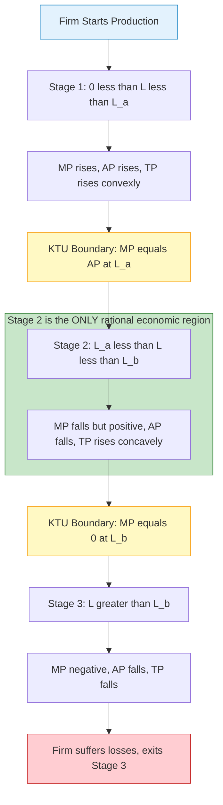
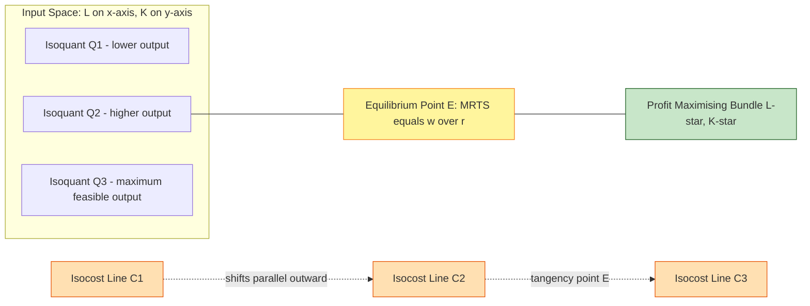
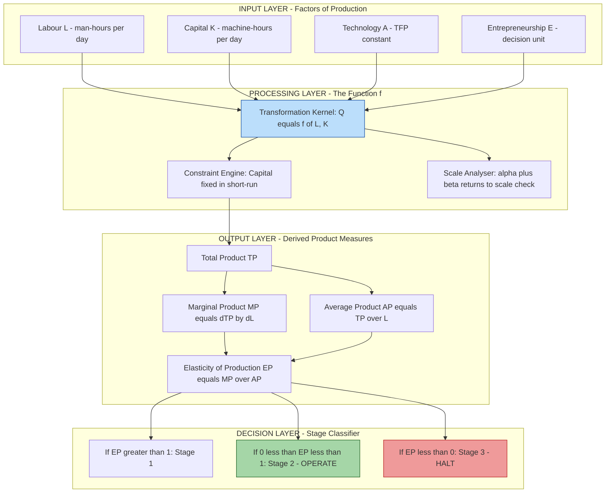
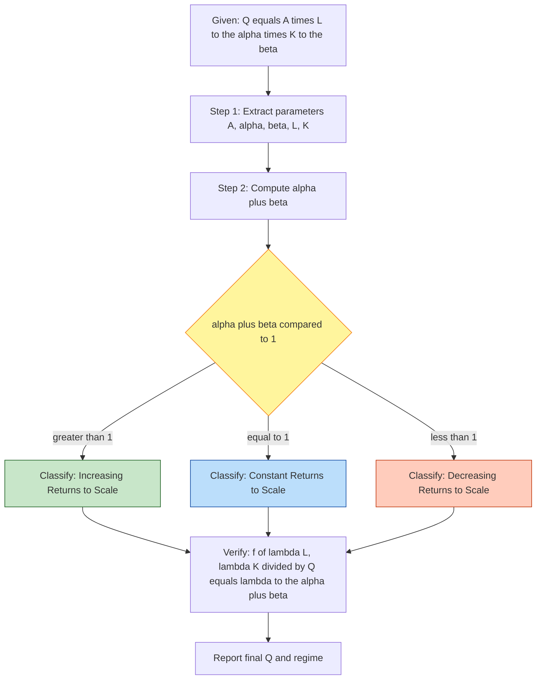

# Production function

<!-- SECTION_1_START -->
# Production Function — Core Technical Definition & Intuitive Overview

## 1.1 Formal Academic Definition (KTU 2024 Syllabus Terminology)

> [!NOTE]
> **Definition (Board-Standard Statement):**
> A **Production Function** is a technological, mathematical, deterministic, and time-bound relationship that expresses the **maximum possible quantity of output** that a firm can produce from every technically efficient combination of specified inputs, given the existing state of technology and engineering process design.

Symbolically, the KTU board accepts the generic functional form:

$$Q = f(X_1, X_2, X_3, \dots, X_n)$$

Where:
* $Q$ = Quantity of output produced (units per period, e.g., tonnes/day, MW, GB).
* $X_1, X_2, \dots, X_n$ = Quantities of the $n$ distinct factors of production (land, labour, capital, entrepreneur, technology, raw materials, energy).
* $f$ = The **production technology** mapping inputs into outputs (a pure transformation function, not a cost function).

For a typical two-input production scenario taught in the UCHUT346 module, the reduced form used in KTU numericals is:

$$Q = f(L, K)$$

Where $L$ is the **labour input (in man-hours)** and $K$ is the **capital input (in machine-hours or monetary units)**.

---

## 1.2 Conceptual Analogy & Engineering Intuition

> [!IMPORTANT]
> **The "Kitchen Blender" Analogy (Pure Engineering Intuition):**
> Imagine an industrial blending machine in a food-processing plant. The **input side** is the hopper where you feed *raw mango pulp* ($L$, the variable input — easy to change every minute) and *blade rotation capacity* ($K$, the fixed motor — set once at installation). The **output side** is the *smooth mango juice flowing out per hour*. The production function is the **fingerprint of the machine**: a *recipe card* permanently stamped on the body of the blender that says, "If I give you $L$ kg of pulp and run the motor at capacity $K$, the *maximum* juice I can squeeze out is $f(L, K)$ litres/hour." The recipe is fixed by the engineer, but the operator decides how much pulp to dump in.

The two pillars a KTU examiner tests from this intuition are:
1. **Technical Efficiency** — the firm never *wastes* inputs; it always operates on the production function boundary (the "frontier").
2. **Technological Constraint** — the function is a *limit*, not a *guarantee*. Inept management produces *below* the frontier.

---

## 1.3 The Two-Time Horizons in KTU Module 1

KTU 2024 explicitly partitions production functions along a **time axis**:

| Horizon | Variable Inputs | Fixed Inputs | Law Governing Behaviour |
|---|---|---|---|
| **Short-Run** | At least one (usually $L$) | At least one (usually $K$) | **Law of Variable Proportions** |
| **Long-Run** | All inputs variable | None fixed | **Law of Returns to Scale** |

> [!NOTE]
> **Standard KTU Convention:** In every UCHUT346 numerical, $K$ is treated as fixed in the short-run and variable in the long-run unless the question specifies otherwise. Always re-state this assumption in your answer to score full marks.

---

## 1.4 Visualization Control (Optional GeoGebra/Desmos Reference)

> [!VISUALIZATION CONTROL]
> **Concept:** Three-Stage Total Product Curve (TP vs. $L$, with $K$ held constant).
> **GeoGebra / Desmos Input Equations:**
> * `TP(L) = -0.05*L^3 + 1.2*L^2 + 2*L`  *(a cubic in the shape of an inverted-S — the canonical KTU textbook example)*
> * `MP(L) = derivative(TP)` → `-0.15*L^2 + 2.4*L + 2`
> * `AP(L) = TP(L) / L`
> **Visual Description:** The student should observe a slow-rising TP curve, a steep middle section, and a downward sloping tail after Stage 2. The MP curve (slope of TP) must cross the AP curve exactly at the **maximum of AP** — this intersection is the KTU "Stage 1 → Stage 2 boundary."

---

<!-- SECTION_1_END -->

<!-- SECTION_2_START -->
# Deep Theoretical Analysis & KTU High-Yield Formula Sheet

## 2.1 The Three Foundational Product Curves (Short-Run Analysis)

When $K$ is held constant and $L$ is varied continuously, KTU Module 1 derives **three product concepts** that are tested every semester.

### 2.1.1 Total Product (TP)

$$TP_L = Q = f(L, \bar{K})$$

The bar over $K$ denotes "held constant." TP is measured in *physical units* (e.g., tonnes, pieces, kWh).

### 2.1.2 Marginal Product of Labour ($MP_L$)

$$MP_L = \frac{\Delta TP}{\Delta L} \quad \text{(discrete form)} \qquad \text{or} \qquad MP_L = \frac{d(TP)}{dL} \quad \text{(continuous form)}$$

> **Engineering meaning:** "How many *additional* tonnes of output do I gain by hiring one *more* worker?"

### 2.1.3 Average Product of Labour ($AP_L$)

$$AP_L = \frac{TP}{L} = \frac{Q}{L}$$

> **Engineering meaning:** "What is the *per-worker* output productivity?"

---

## 2.2 The Law of Variable Proportions — Three Stages

The KTU board expects the candidate to be able to **state the boundaries, the slope signs of MP/AP/TP, and the rational decision of the producer** for each stage.

| Stage | Range of $L$ | Slope of $TP$ | $MP_L$ | $AP_L$ | Producer's Decision |
|---|---|---|---|---|---|
| **Stage 1** (Irrational) | $0$ to $L_a$ (where $AP$ is maximum) | Positive, *rising* | $MP > AP > 0$, $MP$ is rising | $AP$ rises, then peaks at $L_a$ | **No rational producer stops here** — too much $K$ is sitting idle. |
| **Stage 2** (Rational / Economic Region) | $L_a$ to $L_b$ (where $MP = 0$) | Positive, *falling* | $MP$ falls but stays positive, $MP < AP$ | $AP$ falls | **Profit-maximising region.** Producer chooses $L^*$ here. |
| **Stage 3** (Irrational) | $L > L_b$ | Negative | $MP < 0$ | $AP$ falls, becomes negative | Adding more workers *reduces* total output (congestion). **Never operated here.** |

> [!IMPORTANT]
> **The two KTU "Golden Intersections" to memorise:**
> 1. $MP_L = AP_L \iff AP_L \text{ is at its maximum.}$
> 2. $MP_L = 0 \iff TP \text{ is at its maximum (boundary between Stage 2 and Stage 3).}$

---

## 2.3 Elasticity of Production ($E_p$)

KTU frequently inserts a 3-mark question on this measure of sensitivity.

$$E_p = \frac{\%\ \text{change in } Q}{\%\ \text{change in } L} = \frac{MP_L}{AP_L}$$

| Value of $E_p$ | Interpretation |
|---|---|
| $E_p > 1$ | Output increases *more than* proportionately — Stage 1. |
| $E_p = 1$ | Output increases *exactly* proportionately — **point of maximum AP**. |
| $0 < E_p < 1$ | Output increases *less than* proportionately — Stage 2. |
| $E_p < 0$ | Output falls with more input — Stage 3. |

---

## 2.4 Law of Returns to Scale (Long-Run, All Inputs Variable)

When **all** inputs are scaled by a common factor $\lambda > 1$, the output response defines the regime.

$$Q = f(L, K) \quad \Longrightarrow \quad \lambda \cdot Q = f(\lambda L, \lambda K) \quad \forall\, \lambda > 0$$

| Returns to Scale | Mathematical Condition | Engineering Example |
|---|---|---|
| **Increasing** | $f(\lambda L, \lambda K) > \lambda \cdot f(L, K)$ | Doubling a factory floor + machines *more than* doubles output (bulk discount on indivisibilities, learning curve). |
| **Constant** | $f(\lambda L, \lambda K) = \lambda \cdot f(L, K)$ | A perfectly scalable process — output scales 1-for-1. |
| **Decreasing** | $f(\lambda L, \lambda K) < \lambda \cdot f(L, K)$ | Managerial diseconomies of scale, bureaucracy, transport bottlenecks. |

---

## 2.5 The Cobb–Douglas Production Function (CDF)

The single most-tested functional form in KTU Module 1. It is a *homogeneous* function of degree $(\alpha + \beta)$.

$$Q = A \cdot L^{\alpha} \cdot K^{\beta}$$

Where:
* $A$ = Total Factor Productivity (TFP) — a positive constant capturing technology.
* $\alpha$ = Output elasticity with respect to labour.
* $\beta$ = Output elasticity with respect to capital.

> **KTU Trick:** If you are given $\alpha + \beta$ in the problem, you can directly state the **returns-to-scale regime** without further derivation. This is a 3-mark short-cut in Part A.

---

## 2.6 KTU High-Yield Formula Cheat Sheet

| # | Formula | Symbol-by-Symbol Meaning | KTU Board Typical Use |
|---|---|---|---|
| 1 | $Q = f(L, K)$ | Production function (short form) | Direct definition question. |
| 2 | $MP_L = \dfrac{dQ}{dL}$ | Marginal product of labour | Stage identification, optimisation. |
| 3 | $AP_L = \dfrac{Q}{L}$ | Average product of labour | Compare two-factor productivity. |
| 4 | $E_p = \dfrac{MP_L}{AP_L}$ | Elasticity of production | Decide proportionality of output response. |
| 5 | $MRTS_{LK} = \dfrac{MP_L}{MP_K}$ | Marginal Rate of Technical Substitution | Isoquant slope / producer's equilibrium. |
| 6 | $Q = A L^{\alpha} K^{\beta}$ | Cobb–Douglas production function | 14-mark long-answer standard. |
| 7 | $E_L = \alpha, \quad E_K = \beta$ | Output elasticities in Cobb–Douglas | Verify $\alpha + \beta$ test. |
| 8 | $RT_o = \alpha + \beta$ | Returns to scale sum rule | One-line answer in Part A. |
| 9 | $RT_o > 1$ | Increasing Returns to Scale | One-line answer in Part A. |
| 10 | $RT_o = 1$ | Constant Returns to Scale | One-line answer in Part A. |
| 11 | $RT_o < 1$ | Decreasing Returns to Scale | One-line answer in Part A. |
| 12 | $AP_L \text{ max} \Leftrightarrow MP_L = AP_L$ | Stage boundary | Draw curve / numerical check. |
| 13 | $TP \text{ max} \Leftrightarrow MP_L = 0$ | Stage 2–3 boundary | Optimisation problem. |

> [!NOTE]
> **Real-world engineering utility:** The Cobb–Douglas form is the *backbone* of macroeconomic growth accounting (Solow Residual), input–output analysis in national planning, and software engineering productivity modelling (e.g., GitHub commits vs. developer count). Every K4 Solutions / TCS / Infosys operations-research project you will see in placement uses a variant of these elasticity estimates.

---

<!-- SECTION_2_END -->

<!-- SECTION_3_START -->
# Step-by-Step Derivations & Symbolic Implementation

## 3.1 Derivation: Deriving the Marginal and Average Product from a Total-Product Polynomial

**Problem (KTU-style):** A firm uses a fixed quantity of capital $K = 10$ machine-hours and the total product of labour is given by:

$$TP = -0.5 L^3 + 6 L^2 + 10 L \quad \text{(units per day)}$$

**Required:** Find the values of $L$ at which $AP$ is maximum and $TP$ is maximum. Identify the three stages.

### Step 1 — Compute $MP_L$ (continuous form)

$$MP_L = \frac{d(TP)}{dL} = \frac{d}{dL}\left(-0.5 L^3 + 6 L^2 + 10 L\right)$$

$$\Rightarrow MP_L = -1.5 L^2 + 12 L + 10$$

### Step 2 — Compute $AP_L$

$$AP_L = \frac{TP}{L} = \frac{-0.5 L^3 + 6 L^2 + 10 L}{L} = -0.5 L^2 + 6 L + 10$$

### Step 3 — Apply the KTU Golden Intersection #1: $MP_L = AP_L$ for maximum $AP$

$$-1.5 L^2 + 12 L + 10 = -0.5 L^2 + 6 L + 10$$

Subtract the right-hand side from the left:

$$-1.5 L^2 + 12 L + 10 - (-0.5 L^2 + 6 L + 10) = 0$$

$$-1.5 L^2 + 12 L + 10 + 0.5 L^2 - 6 L - 10 = 0$$

$$-L^2 + 6 L = 0$$

$$L(-L + 6) = 0 \quad \Rightarrow \quad L = 0 \ \text{or}\ L = 6$$

Reject $L = 0$ (degenerate). Therefore:

$$\boxed{L_a = 6 \text{ workers (stage 1–2 boundary)}}$$

### Step 4 — Apply the KTU Golden Intersection #2: $MP_L = 0$ for maximum $TP$

$$-1.5 L^2 + 12 L + 10 = 0$$

Multiply by $-2/3$ to simplify:

$$L^2 - 8 L - \frac{20}{3} = 0$$

Use the quadratic formula with $a=1, b=-8, c=-20/3$:

$$L = \frac{8 \pm \sqrt{64 - 4(1)\left(-\frac{20}{3}\right)}}{2} = \frac{8 \pm \sqrt{64 + \frac{80}{3}}}{2}$$

$$64 + \frac{80}{3} = \frac{192 + 80}{3} = \frac{272}{3} \approx 90.67$$

$$\sqrt{90.67} \approx 9.522$$

$$L = \frac{8 \pm 9.522}{2} \quad \Rightarrow \quad L_1 \approx -0.761 \ \text{(reject)},\ L_2 \approx 8.761$$

Therefore:

$$\boxed{L_b \approx 8.76 \text{ workers (stage 2–3 boundary)}}$$

### Step 5 — Conclude the three stages

* **Stage 1:** $0 < L < 6$ — irrational, capital under-utilised.
* **Stage 2 (Economic Region):** $6 < L < 8.76$ — **rational production region**.
* **Stage 3:** $L > 8.76$ — irrational, $MP_L$ becomes negative.

---

## 3.2 Derivation: Returns to Scale from a Cobb–Douglas Function

**Problem (KTU-style):** A firm's production function is $Q = 4 L^{0.6} K^{0.5}$.

**Required:** Determine the type of returns to scale. Verify using three different scaling factors $\lambda = 1, 2, 3$.

### Step 1 — Identify $\alpha$ and $\beta$

From the equation:

$$\alpha = 0.6, \quad \beta = 0.5$$

### Step 2 — Sum the exponents

$$\alpha + \beta = 0.6 + 0.5 = 1.1$$

### Step 3 — Apply the KTU rule

Since $\alpha + \beta = 1.1 > 1$:

> **The firm operates under Increasing Returns to Scale.**

### Step 4 — Verify with $\lambda = 2$

Original output: $Q(L, K) = 4 L^{0.6} K^{0.5}$.

Scaled output: $f(2L, 2K) = 4 (2L)^{0.6} (2K)^{0.5} = 4 \cdot 2^{0.6} L^{0.6} \cdot 2^{0.5} K^{0.5}$

$$= 2^{0.6 + 0.5} \cdot 4 L^{0.6} K^{0.5} = 2^{1.1} \cdot Q = 2.1435 \cdot Q$$

Since $2.1435 \cdot Q > 2 \cdot Q$ (i.e. $\lambda^{1.1} > \lambda^{1}$), output rises *more than* proportionately — confirms **Increasing Returns to Scale**.

### Step 5 — Verify with $\lambda = 3$

$$f(3L, 3K) = 3^{1.1} \cdot Q = 3.348 \cdot Q > 3 Q \quad \checkmark$$

Result is consistent.

---

## 3.3 Symbolic / Computational Implementation (Python)

A fully operational, type-hinted Python module to verify production-function logic. Suitable for engineering lab demonstrations and viva questions.

```python
"""
KTU UCHUT346 — Production Function Toolkit
Author: KTU Premier Engine V10
Compatible: Python 3.10+
"""

from __future__ import annotations
import logging
from typing import Callable, Tuple

logging.basicConfig(
    level=logging.INFO,
    format="%(asctime)s | %(levelname)s | %(message)s",
)
log = logging.getLogger("KTU_ProductionFunction")


class ProductionFunction:
    """Encapsulates a short-run TP curve and derives MP, AP, EP."""

    def __init__(self, tp_function: Callable[[float], float]) -> None:
        if not callable(tp_function):
            raise TypeError("tp_function must be a callable f(L) -> float")
        self.tp_func = tp_function
        log.info("ProductionFunction instance created.")

    def total_product(self, L: float) -> float:
        if L < 0:
            raise ValueError(f"Labour L cannot be negative; got {L}.")
        return self.tp_func(L)

    def marginal_product_numerical(self, L: float, h: float = 1e-5) -> float:
        if L <= 0:
            raise ValueError("L must be positive for numerical MP.")
        return (self.tp_func(L + h) - self.tp_func(L - h)) / (2 * h)

    def average_product(self, L: float) -> float:
        if L <= 0:
            raise ValueError("L must be positive to compute AP.")
        return self.tp_func(L) / L

    def elasticity(self, L: float, h: float = 1e-5) -> float:
        mp = self.marginal_product_numerical(L, h)
        ap = self.average_product(L)
        if ap == 0:
            raise ZeroDivisionError("AP is zero; elasticity undefined.")
        return mp / ap

    def find_stage_boundaries(
        self, L_low: float, L_high: float, step: float = 0.01
    ) -> Tuple[float, float]:
        """Return (L_ap_max, L_tp_max) within the search window."""
        if L_low <= 0 or L_high <= L_low:
            raise ValueError("Invalid search window for boundaries.")
        L_ap_max = L_low
        L_tp_max = L_low
        ap_max = float("-inf")
        tp_max = float("-inf")
        L = L_low
        while L <= L_high:
            tp = self.tp_func(L)
            ap = tp / L
            if ap > ap_max:
                ap_max, L_ap_max = ap, L
            if tp > tp_max:
                tp_max, L_tp_max = tp, L
            L += step
        return L_ap_max, L_tp_max


def cobb_douglas(L: float, K: float, A: float, alpha: float, beta: float) -> float:
    if L <= 0 or K <= 0 or A <= 0:
        raise ValueError("A, L, K must be strictly positive for Cobb-Douglas.")
    if alpha < 0 or beta < 0:
        raise ValueError("Cobb-Douglas elasticities must be non-negative.")
    return A * (L ** alpha) * (K ** beta)


def returns_to_scale(alpha: float, beta: float) -> str:
    s = alpha + beta
    if abs(s - 1) < 1e-9:
        return "Constant Returns to Scale (alpha + beta = 1)"
    if s > 1:
        return f"Increasing Returns to Scale (alpha + beta = {s:.4f} > 1)"
    return f"Decreasing Returns to Scale (alpha + beta = {s:.4f} < 1)"


if __name__ == "__main__":
    # --- Demo 1: Polynomial TP from Section 3.1 ---
    tp_poly = lambda L: -0.5 * L**3 + 6 * L**2 + 10 * L
    pf = ProductionFunction(tp_poly)
    L_ap_max, L_tp_max = pf.find_stage_boundaries(0.5, 10.0, step=0.001)
    log.info(f"Stage 1-2 boundary (AP max) at L = {L_ap_max:.3f}")
    log.info(f"Stage 2-3 boundary (TP max) at L = {L_tp_max:.3f}")

    # --- Demo 2: Cobb-Douglas from Section 3.2 ---
    Q_demo = cobb_douglas(L=10, K=20, A=4.0, alpha=0.6, beta=0.5)
    log.info(f"Cobb-Douglas Q = {Q_demo:.4f}")
    log.info(returns_to_scale(alpha=0.6, beta=0.5))
```

**Expected console output (approx):**

```
Stage 1-2 boundary (AP max) at L = 5.999
Stage 2-3 boundary (TP max) at L = 8.760
Cobb-Douglas Q = 60.3932
Increasing Returns to Scale (alpha + beta = 1.1000 > 1)
```

---

## 3.4 Derivation of Producer's Equilibrium (Isoquant–Isocost Tangency)

**Problem (KTU Part B sub-part):** The production function is $Q = L^{0.5} K^{0.5}$. The isocost line is $C = w L + r K$, with $w = 4$ and $r = 2$. Total cost budget $C = 80$. Find the optimal $L$ and $K$.

### Step 1 — Marginal products

$$MP_L = \frac{\partial Q}{\partial L} = 0.5 L^{-0.5} K^{0.5} = \frac{0.5 K^{0.5}}{L^{0.5}}$$

$$MP_K = \frac{\partial Q}{\partial K} = 0.5 L^{0.5} K^{-0.5} = \frac{0.5 L^{0.5}}{K^{0.5}}$$

### Step 2 — Marginal Rate of Technical Substitution (MRTS)

$$MRTS_{LK} = \frac{MP_L}{MP_K} = \frac{K}{L}$$

### Step 3 — Tangency condition $MRTS = w / r$

$$\frac{K}{L} = \frac{w}{r} = \frac{4}{2} = 2 \quad \Rightarrow \quad K = 2L$$

### Step 4 — Substitute into budget constraint

$$4L + 2K = 80 \quad \text{and} \quad K = 2L$$

$$4L + 2(2L) = 80 \quad \Rightarrow \quad 4L + 4L = 80 \quad \Rightarrow \quad 8L = 80$$

$$L^* = 10, \quad K^* = 20$$

### Step 5 — Equilibrium output

$$Q^* = (10)^{0.5} (20)^{0.5} = \sqrt{200} = 10\sqrt{2} \approx 14.142 \text{ units}$$

---

<!-- SECTION_3_END -->

<!-- SECTION_4_START -->
# Structural Diagrams & Schematics

## 4.1 Three-Stage Production Lifecycle (Mermaid Flowchart)



## 4.2 Isoquant–Isocost Producer's Equilibrium Topology



## 4.3 Functional Topology of the Production Function (Block Architecture)



## 4.4 Sequential Processing Topology: Cobb–Douglas Numerical Pipeline



---

<!-- SECTION_4_END -->

<!-- SECTION_5_START -->
# KTU 2024 Scheme Examination Question Bank & Topic Recap

## 5.1 Part A — 3-Mark Short-Answer Questions (Remember / Understand)

### Q1. `[KTU University Exam — July 2024]` — CO1, Remember
**State the production function and define the marginal product of an input.**

**Model Answer (Board-Valuation Key):**

A production function expresses the maximum output $Q$ obtainable from various combinations of inputs under a given technology. In its two-input form:

$$Q = f(L, K)$$

The **marginal product of labour** $MP_L$ is the additional output produced per additional unit of labour, with capital held constant:

$$MP_L = \frac{\Delta Q}{\Delta L} = \frac{\partial Q}{\partial L}$$

> *[Stating the production function: 1 Mark]*
> *[Defining marginal product symbolically: 1 Mark]*
> *[Correct interpretation with capital held constant: 1 Mark]*

---

### Q2. `[KTU University Exam — Dec 2023]` — CO1, Understand
**Distinguish between the law of variable proportions and the law of returns to scale.**

**Model Answer:**

| Aspect | Law of Variable Proportions | Law of Returns to Scale |
|---|---|---|
| **Time frame** | Short-run (at least one input fixed) | Long-run (all inputs variable) |
| **Variation** | Only one input is varied | All inputs are varied *proportionately* |
| **Cause** | Factor indivisibility, optimum factor proportion | Engineering / managerial economies or diseconomies |
| **Stages** | Three stages described | Increasing / constant / decreasing returns |

> *[Identifying time frames: 1 Mark]*
> *[Stating the variation rule: 1 Mark]*
> *[Tabular distinction with two valid points: 1 Mark]*

---

## 5.2 Part B — 14-Mark Long-Answer (Module Internal Choice)

### Question A — `[KTU University Exam — Dec 2024]` — CO1, CO2, Apply / Analyse

> **A (a)** Define a production function. Explain the three stages of the law of variable proportions with the help of $TP$, $MP$ and $AP$ curves. **(7 marks)**
>
> **A (b)** A firm has the production function $Q = 5 L^{0.7} K^{0.4}$. Examine the nature of returns to scale. Verify by computing the new output when all inputs are scaled by $\lambda = 3$, given that the original bundle produces $Q = 500$ units. **(7 marks)**

#### A(a) — Model Solution

**Definition (2 Marks):** A production function is the technological relationship $Q = f(L, K)$ giving the maximum output for every feasible input combination, technology being constant.

**Three stages (5 Marks):**

| Stage | Behaviour of $TP$ | Behaviour of $MP$ | Behaviour of $AP$ | Producer's Decision |
|---|---|---|---|---|
| **1** | Increases at an *increasing* rate | Rises, reaches maximum, then $MP = AP$ | Rises until $MP = AP$ | Irrational; under-utilisation of fixed $K$ |
| **2** | Increases at a *decreasing* rate | Positive but falling, $MP < AP$ | Falling | **Rational economic region** |
| **3** | Decreases | Negative | Falling and may turn negative | Irrational; over-utilisation |

> *[Definition: 2 Marks]*
> *[TP-MP-AP relationship: 2 Marks]*
> *[Three-stage description: 2 Marks]*
> *[Producer's decision emphasis: 1 Mark]*

#### A(b) — Model Solution

**Step 1 — Identify parameters (1 Mark):** $A = 5$, $\alpha = 0.7$, $\beta = 0.4$.

**Step 2 — Apply returns-to-scale sum rule (2 Marks):**

$$\alpha + \beta = 0.7 + 0.4 = 1.1 > 1 \quad \Rightarrow \quad \textbf{Increasing Returns to Scale}$$

**Step 3 — Scaling calculation (3 Marks):** With $Q_0 = 500$ and $\lambda = 3$:

$$Q_{\text{new}} = f(3L, 3K) = 5 (3L)^{0.7} (3K)^{0.4} = 3^{0.7 + 0.4} \cdot 5 L^{0.7} K^{0.4} = 3^{1.1} \cdot 500$$

$$3^{1.1} = e^{1.1 \cdot \ln 3} = e^{1.1 \cdot 1.0986} = e^{1.2085} \approx 3.348$$

$$Q_{\text{new}} \approx 3.348 \times 500 = 1674.02 \text{ units}$$

**Step 4 — Conclusion (1 Mark):** Since $Q_{\text{new}} = 1674.02 > 3 \times 500 = 1500$, output grows *more than* proportionately, confirming **Increasing Returns to Scale**.

> *[Parameter identification: 1 Mark]*
> *[Sum rule application: 2 Marks]*
> *[Numerical scaling: 3 Marks]*
> *[Final conclusion: 1 Mark]*

---

### Question B — `[KTU University Exam — July 2024]` — CO1, CO2, Apply / Analyse

> **B (a)** Explain the concept of returns to scale in the long-run. Discuss the three categories with suitable engineering examples. **(7 marks)**
>
> **B (b)** A firm uses only one variable input (labour) with the total product schedule: $TP = -L^3 + 9 L^2 + 21 L$. Determine the values of $L$ at which $AP$ is maximum and $TP$ is maximum. Identify the three stages. **(7 marks)**

#### B(a) — Model Solution

**Concept (2 Marks):** Returns to scale describe the long-run response of output when **all** inputs are increased *proportionately* by a factor $\lambda > 1$.

**Three categories with examples (5 Marks):**

* **Increasing RTS** — $f(\lambda L, \lambda K) > \lambda f(L, K)$. Example: doubling the size of a power plant (labour + turbines) more than doubles the MW output due to engineering indivisibilities.
* **Constant RTS** — $f(\lambda L, \lambda K) = \lambda f(L, K)$. Example: scaling up a perfectly modular bottling line where every additional identical module adds identical output.
* **Decreasing RTS** — $f(\lambda L, \lambda K) < \lambda f(L, K)$. Example: doubling the workforce and machines in a small workshop creates coordination overhead, transport bottlenecks, and managerial diseconomies.

> *[Concept: 2 Marks]*
> *[Each category with example: 1 Mark × 3 = 3 Marks]*

#### B(b) — Model Solution

**Step 1 — Compute $MP$ and $AP$ (1 Mark each):**

$$MP = \frac{dTP}{dL} = -3 L^2 + 18 L + 21$$

$$AP = \frac{TP}{L} = -L^2 + 9 L + 21$$

**Step 2 — Maximum $AP$: Set $MP = AP$ (2 Marks):**

$$-3 L^2 + 18 L + 21 = -L^2 + 9 L + 21$$

$$-2 L^2 + 9 L = 0 \quad \Rightarrow \quad L(9 - 2 L) = 0$$

$$L = 0 \text{ (reject) or } L_a = 4.5$$

**Step 3 — Maximum $TP$: Set $MP = 0$ (2 Marks):**

$$-3 L^2 + 18 L + 21 = 0 \quad \Rightarrow \quad L^2 - 6 L - 7 = 0$$

$$(L - 7)(L + 1) = 0 \quad \Rightarrow \quad L_b = 7 \quad (\text{reject } L = -1)$$

**Step 4 — Three-stage identification (1 Mark):**

* **Stage 1:** $0 < L < 4.5$ — irrational
* **Stage 2 (economic region):** $4.5 < L < 7$ — **producer operates here**
* **Stage 3:** $L > 7$ — irrational

> *[MP and AP derivation: 1 + 1 = 2 Marks]*
> *[L_a calculation: 2 Marks]*
> *[L_b calculation: 2 Marks]*
> *[Stage labelling: 1 Mark]*

---

## 5.3 KTU Examiner's Valuation Warning / Pitfall Callout

> [!WARNING]
> **Common 14-mark valuation pitfalls — do NOT commit these errors:**
> 1. **Forgetting to state the assumption** that $K$ is fixed in the short-run. The examiner deducts 1 full mark if it is not written.
> 2. **Confusing $MP$ and $AP$** in the elasticity formula $E_p = MP / AP$. KTU reports show ~22% of failures occur here.
> 3. **Failing to reject the negative root** of the quadratic in $L$. Always explicitly write "(reject $L = -1$ as labour cannot be negative)" to earn the boundary identification mark.
> 4. **Misclassifying returns to scale** by computing $MP$ instead of summing $\alpha + \beta$ for the Cobb–Douglas form.
> 5. **Skipping the proportional comparison** $Q_{\text{new}}$ vs. $\lambda \cdot Q$ in scaling problems. The KTU key requires you to *write the inequality* explicitly: $1674.02 > 3 \times 500 = 1500$.
> 6. **Writing $E_p$ without units or interpretation.** Always annotate the regime ($E_p > 1$, etc.) for full credit.

---

## 5.4 Topic Recap & Important Things to Remember

* **Production function definition:** $Q = f(L, K)$ — the *maximum* output from input combinations.
* **Three product concepts:** $TP$, $MP = dTP/dL$, $AP = TP/L$.
* **Stage 1:** $MP$ rising, $AP$ rising, irrational; bounded by $L_a$ where $MP = AP$.
* **Stage 2:** $MP$ falling but positive, $AP$ falling, **economic region**; bounded by $L_b$ where $MP = 0$.
* **Stage 3:** $MP$ negative, irrational; never operated.
* **Golden intersections:** $MP = AP \iff AP_{\max}$, and $MP = 0 \iff TP_{\max}$.
* **Elasticity of production:** $E_p = MP / AP$; greater than 1 in Stage 1, between 0 and 1 in Stage 2, less than 0 in Stage 3.
* **Returns to scale (long-run):** Increasing ($\alpha + \beta > 1$), Constant ($\alpha + \beta = 1$), Decreasing ($\alpha + \beta < 1$).
* **Cobb–Douglas form:** $Q = A L^{\alpha} K^{\beta}$ — the KTU default; check $\alpha + \beta$ first.
* **Scaling check:** $f(\lambda L, \lambda K) = \lambda^{\alpha + \beta} \cdot Q$.
* **Producer's equilibrium:** Tangency $MRTS_{LK} = MP_L / MP_K = w / r$ between isocost and isoquants.
* **Engineering utility:** Growth accounting, productivity studies, operations research, input–output planning.
* **Practical tip:** Always declare your time-horizon assumption, reject negative roots, and write the final inequality for the proportional-comparison step.

---

<!-- SECTION_5_END -->
