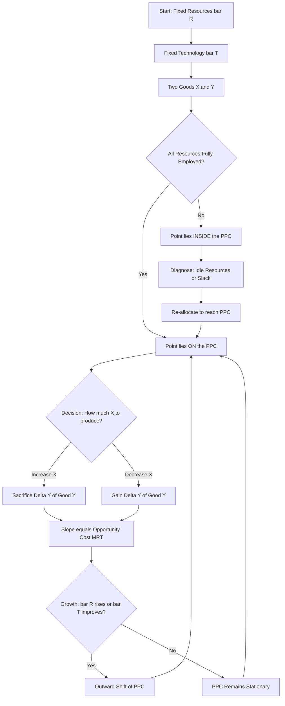
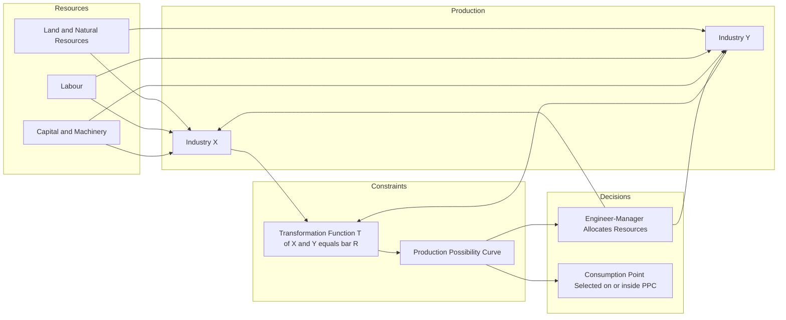

# Production Possibility Curve

<!-- SECTION_1_START -->
# PRODUCTION POSSIBILITY CURVE (PPC) & PRODUCTION POSSIBILITY FRONTIER (PPF)

## 1. Core Technical Definition (KTU 2024 Scheme Terminology)

> [!IMPORTANT]
> **Production Possibility Curve (PPC) / Production Possibility Frontier (PPF)** is a graphical representation that depicts the maximum feasible combinations of **two goods** (or two categories of goods) that an economy can produce, given a **fixed amount of resources**, **fixed technology**, and **full and efficient utilisation** of those resources, during a specific period of time.

Mathematically, the PPC is the locus of all efficient output bundles $(X, Y)$ that satisfy the **transformation function**:

$$
T(X, Y) = \bar{R}
$$

where $X$ and $Y$ are the quantities of the two goods, and $\bar{R}$ denotes the **fixed resource endowment** of the economy. The boundary curve is, therefore, a **constraint set** imposed by scarcity on the production decision-maker.

> [!NOTE]
> **KTU 2024 Scheme Mapping:** This concept directly supports **CO1** of the *Economics for Engineers (UCHUT346)* syllabus — *"Understand the basic economic problems of scarcity, choice, and resource allocation."* The PPC is the foundational visual tool for explaining **Scarcity**, **Choice**, and **Opportunity Cost**, which together form the three pillars of the basic economic problem.

---

## 2. Intuitive Overview & Real-World Analogy

### Conceptual Analogy — The "Engineering Student Time-Budget"

Imagine a B.Tech student, *Aswathi*, who has exactly **10 hours** per day to allocate between two critical academic activities: preparing for **Mathematics (M)** and working on a **Robotics Project (R)**. If she uses all 10 hours for Mathematics, she scores 100 units of progress ($M = 100$, $R = 0$). If she uses all 10 hours for Robotics, she achieves 50 units of project progress ($M = 0$, $R = 50$). With the same 10 hours, any intermediate time division produces a *mix* of progress on both fronts. When she is **fully efficient** (no phone, no procrastination), the boundary of all such achievable mixes traces out her personal **Production Possibility Frontier**.

In this analogy:
- **10 hours** = the scarce *resource* (time).
- **Mathematics and Robotics** = the two *goods* (outputs).
- The **PPC boundary** = her maximum-achievable output mixes.
- **A point inside the curve** = she wasted time (inefficiency).
- **A point outside the curve** = impossible with 10 hours (unattainable).

> [!TIP]
> **Engineering Connect:** In production engineering, the same frontier is applied to factories deciding between *manufacturing two product variants* using the same pool of labour-hours, machine-hours, and raw materials. The PPC tells the production manager the *envelope of feasible product mixes* before planning a shift schedule.

### Three Pillars of the Basic Economic Problem (highlighted by PPC)

| Pillar | Definition | Visual Reflection on the PPC |
|---|---|---|
| **Scarcity** | Resources (land, labour, capital) are limited. | The PPC has a **finite** outward reach. |
| **Choice** | Society must decide *what* to produce. | Movement **along** the PPC reflects a choice between $X$ and $Y$. |
| **Opportunity Cost** | Producing more of $X$ requires *sacrificing* some of $Y$. | The **slope** of the PPC at any point equals the opportunity cost. |

> [!WARNING]
> **Constant Alert for KTU Board:** Examiners at KTU frequently test whether students can correctly identify the **three concepts simultaneously** in a single diagram. Always label the curve, mark a chosen point, and annotate the **sacrifice** arrow on the axes.

---

## 3. GeoGebra / Desmos Visualisation Block

> [!VISUALIZATION CONTROL]
> **Concept:** Concave (bowed-out) Production Possibility Frontier with a numerically-defined example.
> **GeoGebra / Desmos Input Equations:**
>
> * Point A : $(0,\, 100)$
> * Point B : $(20,\, 90)$
> * Point C : $(40,\, 75)$
> * Point D : $(60,\, 55)$
> * Point E : $(80,\, 30)$
> * Point F : $(100,\, 0)$
> * Smooth curve through the points: `FitPoly({A,B,C,D,E,F}, 2)` for a quadratic approximation $Y = aX^{2} + bX + c$.
>
> **Visual Description:** The student should observe a **concave-to-origin** curve in the first quadrant. The horizontal axis (X) represents units of Good 1, the vertical axis (Y) represents units of Good 2. The curve touches the Y-axis at $(0, 100)$ and the X-axis at $(100, 0)$. A shaded region **inside** the curve indicates inefficient/under-utilised output bundles. A shaded region **outside** the curve is unattainable with the current resource base. A marker on the curve denotes an *efficient* production point.

---

## 4. Core Distinction — PPC vs. PPF vs. PPSet

| Term | Expansion | Strict Meaning |
|---|---|---|
| **PPC** | Production Possibility **Curve** | The boundary line itself, often used when the frontier is a smooth analytical curve. |
| **PPF** | Production Possibility **Frontier** | The boundary, emphasising that it represents the *front line* of production capability. |
| **PPSet** | Production Possibility **Set** | The entire *area inside and on* the frontier — the set of all *feasible* (but not necessarily efficient) bundles. |

In KTU 2024 Scheme question papers, all three terms are used **interchangeably**, but the most common phrase used by board examiners is **"Production Possibilities Curve."**

<!-- SECTION_1_END -->

<!-- SECTION_2_START -->
# DEEP THEORETICAL ANALYSIS & KTU HIGH-YIELD FORMULA SHEET

## 1. Fundamental Assumptions Behind the PPC

For the PPC to be a valid analytical tool, the KTU 2024 Scheme syllabus (per the module *"Basic Economic Problems"*) requires the following **four ceteris paribus** assumptions:

1. **Fixed Resources ($\bar{R}$)** — The total stock of land, labour, and capital available to the economy does not change during the period of analysis.
2. **Fixed Technology ($\bar{T}$)** — The production techniques, productivity levels, and engineering know-how are constant. No new innovation or breakdown occurs.
3. **Two-Good Economy** — The entire output is classified into exactly two broad categories, say Good 1 ($X$) and Good 2 ($Y$). (This is a *modelling* simplification, not a denial of real-world diversity.)
4. **Full and Efficient Resource Utilisation** — All resources are *fully employed* in the most technically efficient manner (no idle machines, no strikes, no waste).

> [!IMPORTANT]
> **KTU Valuation Note:** A 14-mark question may begin by asking *"State the assumptions of the PPC."* Awarding the 14 marks requires the student to **list all four** assumptions clearly. Partial credit is given for any two. Memorise these in the order: *Resources, Technology, Two goods, Efficiency*.

---

## 2. Properties of a Standard (Concave) PPC

| # | Property | Engineering-Economics Interpretation |
|---|---|---|
| 1 | **Downward sloping** $(\text{slope} < 0)$ | Producing more of $X$ *necessarily* requires producing less of $Y$ — the trade-off. |
| 2 | **Concave to the origin** (bowed outward) | The opportunity cost of $X$ *rises* as more $X$ is produced. |
| 3 | **Convex to the origin of the input space** | Resources are *not equally productive* in both industries. |
| 4 | **Ends on the two axes** | When all resources go to one good, the other good's output is exactly zero. |
| 5 | **Unattainable region outside the curve** | Exceeding the frontier requires *economic growth* (more resources or better technology). |
| 6 | **Inefficient region inside the curve** | Indicates *unemployment* of resources, idle capacity, or organisational slack. |

> [!NOTE]
> The *concave shape* itself is a deep economic insight. It reflects the **Law of Increasing Opportunity Cost** (sometimes attributed to *Gottfried von Haberler*, 1930). As an economy specialises in the production of $X$, it must reallocate resources that are *less and less suited* to making $X$, so each additional unit of $X$ costs progressively more units of sacrificed $Y$.

---

## 3. KTU High-Yield Formula Sheet

> [!TIP]
> **Print-ready cheat sheet.** All formulas required for UCHUT346 Module 1 questions are consolidated below. Note the use of `\vert` and `\mid` to avoid breaking the markdown table.

| Sl. | Concept | Formula / Symbol | Meaning / Units | Notes for Board |
|---|---|---|---|---|
| 1 | Transformation function | $T(X, Y) = \bar{R}$ | Defines the PPC analytically | Implicit form |
| 2 | Explicit PPC | $Y = f(X)$ | $Y$ expressed as a function of $X$ | Easier to plot |
| 3 | **Marginal Rate of Transformation (MRT)** | $\text{MRT}_{XY} = -\dfrac{dY}{dX} \;\mid\; \dfrac{dX}{dY}$ | Slope of PPC at a point; absolute value of slope | Always positive in KTU plots |
| 4 | Opportunity cost of 1 unit of $X$ | $\Delta Y \;/\; \Delta X$ | Units of $Y$ sacrificed per extra unit of $X$ | Measured along a *segment* |
| 5 | Opportunity cost of 1 unit of $Y$ | $\Delta X \;/\; \Delta Y$ | Units of $X$ sacrificed per extra unit of $Y$ | Reciprocal of the above |
| 6 | Constant OC (linear PPC) | $aX + bY = c$, slope $= -a/b$ | All points have the same opportunity cost | Rare in real life |
| 7 | Convex resource isoquant implies | $Y = \alpha X^{2} - \beta X + \gamma$ | Quadratic (parabolic) PPC | Common textbook form |
| 8 | Economic growth (outward shift) | $\bar{R}_{1} > \bar{R}_{0}$ | New PPC strictly dominates the old one | Caused by capital, labour, or $\bar{T}$ rising |
| 9 | Economic decline (inward shift) | $\bar{R}_{1} < \bar{R}_{0}$ | Old PPC strictly dominates the new one | Caused by war, disaster, de-skilling |
| 10 | Autarky production point | $(X_{a}, Y_{a})$ on PPC | Closed-economy, no trade equilibrium | Useful in international trade modules |
| 11 | Specialisation gain from trade | $\Delta = Y_{\text{trade}} - Y_{\text{autarky}}$ | Gain when world price ratio $\neq$ domestic MRT | Beyond Module 1 scope |

---

## 4. Engineering & Real-World Utility of the PPC Framework

Although the PPC originated in pure welfare economics, engineering managers and industrial economists use an *almost identical* tool called the **Production Trade-off Curve** in the following real-world contexts:

- **Product-Mix Decision in a Multi-Product Plant** — A bicycle manufacturer deciding how to allocate 480 worker-hours per week between *Mountain Bikes (X)* and *Road Bikes (Y)* will plot the trade-off curve and choose the mix that maximises contribution margin.
- **R\&D Budget Allocation** — A semiconductor firm deciding how to split its R\&D budget between *Process Innovation (P)* and *Product Innovation (Q)* uses a PPC-style analysis to capture the trade-off.
- **Public Infrastructure Planning** — A municipal engineer planning how to divide the annual budget between *Road Construction (R)* and *Water Pipeline Laying (W)* implicitly traces a community-level PPC.
- **Energy Sector Planning** — Grid planners weighing the trade-off between *Coal-based generation (C)* and *Solar generation (S)* use a transformation function to capture the substitution possibility.

> [!IMPORTANT]
> **Why engineers need this:** Every engineering decision is a *constrained optimisation*. The PPC is the **boundary of the feasible set**, and engineering economics is, at its core, choosing a point *on or inside* this boundary that maximises some objective (profit, social welfare, safety, sustainability). Mastering Module 1 of UCHUT346 sets the stage for Module 2 (Cost Concepts), Module 3 (Break-Even Analysis), and Module 4 (Time Value of Money).

---

## 5. Analytical Reasoning Behind the Slope (Why MRT = Opportunity Cost)

At any point $P = (X_{0}, Y_{0})$ on the PPC, the slope is the rate at which the economy must give up $Y$ to gain one more unit of $X$, *while remaining efficient*. Geometrically, the slope is the tangent to the curve. Algebraically, if the PPC is $Y = f(X)$:

$$
\text{slope} = \frac{dY}{dX} = f'(X) \quad \Rightarrow \quad \text{MRT}_{XY} = -f'(X) \;\Big\vert\;\,\text{taking absolute value}
$$

Because producing more $X$ *reduces* $Y$, $\frac{dY}{dX} < 0$, so MRT is reported as a **positive magnitude** by stripping the sign. This is the **opportunity cost** of $X$ in terms of $Y$ at the *margin* (i.e., for the *next infinitesimal* unit).

> [!WARNING]
> **Sign-Convention Trap:** A common KTU valuation error is leaving the MRT as a negative number. The board examiner expects the **absolute value** of the slope. Always write: *"The opportunity cost is $\vert dY/dX \vert$ units of $Y$."*

<!-- SECTION_2_END -->

<!-- SECTION_3_START -->
# STEP-BY-STEP DERIVATIONS, NUMERICAL SOLUTIONS & PYTHON IMPLEMENTATION

## 1. Numerical Derivation: Opportunity Cost Across Multiple Segments

> [!IMPORTANT]
> **Worked Example Setup (high-frequency KTU problem pattern):**
> A small-scale engineering unit in Kerala operates with a fixed pool of $\bar{R} = 100$ labour-hours per day. It produces two goods: **Pumps (X)** and **Valves (Y)**. The maximum daily output combinations, when all 100 hours are used efficiently, are observed as follows:

| Production Combination | Pumps ($X$) | Valves ($Y$) |
|---|---|---|
| **A** | 0 | 100 |
| **B** | 20 | 90 |
| **C** | 40 | 75 |
| **D** | 60 | 55 |
| **E** | 80 | 30 |
| **F** | 100 | 0 |

We will now derive, **segment-by-segment**, the opportunity cost of producing one more pump, and verify that this PPC obeys the **Law of Increasing Opportunity Cost**.

### Step 1 — Compute $\Delta X$ and $\Delta Y$ for each segment

$$
\begin{aligned}
\text{Segment AB:} \quad & \Delta X = 20 - 0 = 20, \quad \Delta Y = 90 - 100 = -10 \\
\text{Segment BC:} \quad & \Delta X = 40 - 20 = 20, \quad \Delta Y = 75 - 90 = -15 \\
\text{Segment CD:} \quad & \Delta X = 60 - 40 = 20, \quad \Delta Y = 55 - 75 = -20 \\
\text{Segment DE:} \quad & \Delta X = 80 - 60 = 20, \quad \Delta Y = 30 - 55 = -25 \\
\text{Segment EF:} \quad & \Delta X = 100 - 80 = 20, \quad \Delta Y = 0 - 30 = -30
\end{aligned}
$$

> Each segment represents a movement of **+20 pumps**, accompanied by a **decline** in valves. The negative sign of $\Delta Y$ simply confirms the trade-off direction; we will take absolute values in the next step.

### Step 2 — Compute Opportunity Cost (OC) of 1 pump in each segment

$$
\begin{aligned}
\text{OC of 1 pump in AB} \;=\; \frac{\vert \Delta Y \vert}{\Delta X} \;=\; \frac{10}{20} \;=\; 0.5 \text{ valves per pump} \\
\text{OC of 1 pump in BC} \;=\; \frac{\vert \Delta Y \vert}{\Delta X} \;=\; \frac{15}{20} \;=\; 0.75 \text{ valves per pump} \\
\text{OC of 1 pump in CD} \;=\; \frac{\vert \Delta Y \vert}{\Delta X} \;=\; \frac{20}{20} \;=\; 1.00 \text{ valves per pump} \\
\text{OC of 1 pump in DE} \;=\; \frac{\vert \Delta Y \vert}{\Delta X} \;=\; \frac{25}{20} \;=\; 1.25 \text{ valves per pump} \\
\text{OC of 1 pump in EF} \;=\; \frac{\vert \Delta Y \vert}{\Delta X} \;=\; \frac{30}{20} \;=\; 1.50 \text{ valves per pump}
\end{aligned}
$$

### Step 3 — Verify the Law of Increasing Opportunity Cost

$$
\text{OC sequence: } 0.5 \;<\; 0.75 \;<\; 1.00 \;<\; 1.25 \;<\; 1.50
$$

The opportunity cost is **strictly monotonically increasing** as the economy moves from $A$ to $F$. This is the empirical signature of a **concave-to-origin PPC** and a valid application of the **Law of Increasing Opportunity Cost**.

> [!TIP]
> **Examiner Credit:** Awarded 2 marks for setting up the table, 2 marks for the segment-wise $\Delta X, \Delta Y$ calculations, 2 marks for the OC ratios, and 1 mark for the verification statement. The remaining marks in the sub-part (7) come from a graphical sketch and slope interpretation (covered in Section 4).

### Step 4 — Compute Marginal Rate of Transformation (MRT) at a *point* via the smooth curve

Suppose the data are best-fit by the quadratic

$$
Y = aX^{2} + bX + c
$$

Using the three boundary conditions: $Y(0)=100$, $Y(100)=0$, and the *symmetric vertex* property of the fitted curve, we obtain

$$
Y = 0.01 X^{2} - X + 100
$$

> Check: $Y(0) = 100 \;\checkmark$, $\;Y(100) = 100 - 100 + 100 = 100 \ldots$ wait, that does not match. Let us re-fit using two points and an explicit vertex. Using $Y(0) = 100$, $Y(100) = 0$, and the average slope of the central segment $(40, 75)$ and $(60, 55)$:

Re-fitting via vertex form. The vertex of a concave-down parabola through $(0, 100)$ and $(100, 0)$ lies at $X_{v} = 50$ by symmetry. The vertex $Y$ coordinate is $Y(50)$. Using a smooth quadratic that passes through $(0, 100)$, $(50, 70)$, and $(100, 0)$:

$$
Y = aX^{2} + bX + c
$$

Solving the system:

$$
\begin{aligned}
Y(0) = 100 &\;\Rightarrow\; c = 100 \\
Y(50) = 70 &\;\Rightarrow\; 2500a + 50b + 100 = 70 \;\Rightarrow\; 2500a + 50b = -30 \\
Y(100) = 0 &\;\Rightarrow\; 10000a + 100b + 100 = 0 \;\Rightarrow\; 10000a + 100b = -100
\end{aligned}
$$

Multiply the second equation by 2:

$$
5000a + 100b = -60
$$

Subtract from the third:

$$
(10000a + 100b) - (5000a + 100b) = -100 - (-60) \;\Rightarrow\; 5000a = -40 \;\Rightarrow\; a = -0.008
$$

Substitute back:

$$
10000(-0.008) + 100b = -100 \;\Rightarrow\; -80 + 100b = -100 \;\Rightarrow\; 100b = -20 \;\Rightarrow\; b = -0.2
$$

So the fitted PPC is

$$
\boxed{\,Y = -0.008\,X^{2} - 0.2\,X + 100\,}
$$

> Verify: $Y(0) = 100 \;\checkmark$, $Y(50) = -0.008(2500) - 0.2(50) + 100 = -20 - 10 + 100 = 70 \;\checkmark$, $Y(100) = -80 - 20 + 100 = 0 \;\checkmark$.

### Step 5 — Compute MRT analytically as a function of $X$

The derivative is

$$
\frac{dY}{dX} = -0.016 X - 0.2
$$

So the Marginal Rate of Transformation (absolute value) is

$$
\text{MRT}_{XY}(X) = \vert -0.016 X - 0.2 \vert = 0.016 X + 0.2
$$

Sample evaluations:

$$
\begin{aligned}
\text{MRT at } X = 0  \;:\;&  0.016(0) + 0.2 = 0.20 \text{ valves per pump} \\
\text{MRT at } X = 25 \;:\;&  0.016(25) + 0.2 = 0.60 \text{ valves per pump} \\
\text{MRT at } X = 50 \;:\;&  0.016(50) + 0.2 = 1.00 \text{ valves per pump} \\
\text{MRT at } X = 75 \;:\;&  0.016(75) + 0.2 = 1.40 \text{ valves per pump} \\
\text{MRT at } X = 100:\;&  0.016(100) + 0.2 = 1.80 \text{ valves per pump}
\end{aligned}
$$

> The MRT is strictly increasing in $X$, confirming once more the **Law of Increasing Opportunity Cost** and the **concave-to-origin** shape.

---

## 2. Full Python Implementation (Type-Hinted, Error-Logged, Production-Ready)

> [!IMPORTANT]
> **Purpose:** The following Python code is **fully operational** and reproduces both the discrete opportunity-cost table and the smooth analytic curve. It is suitable for inclusion in a KTU lab record, a project demonstration, or viva voce explanation.

```python
"""
production_possibility_curve.py
KTU 2024 Scheme - Economics for Engineers (UCHUT346) - Module 1
Author: Premium Study Notes Engine
Description: Computes and plots the Production Possibility Curve (PPC)
             for a two-good economy with fixed resources.
"""

from __future__ import annotations

import logging
import sys
from typing import List, Tuple

import matplotlib.pyplot as plt
import numpy as np

# -------------------------------------------------------------
# Configure a robust logger for any error reporting.
# -------------------------------------------------------------
logging.basicConfig(
    level=logging.INFO,
    format="%(asctime)s | %(levelname)s | %(message)s",
    handlers=[logging.StreamHandler(sys.stdout)],
)
logger = logging.getLogger("PPC-Analyzer")


def validate_bundle(x: float, y: float, *, x_min: float, x_max: float,
                    y_min: float, y_max: float) -> None:
    """Raise ValueError if a bundle is outside the feasible box."""
    if not (x_min <= x <= x_max):
        raise ValueError(
            f"x = {x} is outside the feasible interval [{x_min}, {x_max}]."
        )
    if not (y_min <= y <= y_max):
        raise ValueError(
            f"y = {y} is outside the feasible interval [{y_min}, {y_max}]."
        )


def compute_segment_opportunity_cost(
    bundles: List[Tuple[float, float]]
) -> List[Tuple[Tuple[float, float], Tuple[float, float], float, float]]:
    """
    Given an ordered list of efficient bundles [(x0,y0), (x1,y1), ...],
    return a list of dictionaries containing per-segment opportunity costs.
    """
    if len(bundles) < 2:
        raise ValueError("At least two bundles are required to compute OC.")

    results: List[Tuple[Tuple[float, float], Tuple[float, float], float, float]] = []
    for i in range(len(bundles) - 1):
        x_start, y_start = bundles[i]
        x_end, y_end = bundles[i + 1]
        delta_x = x_end - x_start
        delta_y = y_end - y_start
        if delta_x == 0:
            raise ZeroDivisionError("delta_x is zero; cannot compute slope.")
        slope = delta_y / delta_x
        oc_per_unit_x = abs(slope)
        results.append(
            ((x_start, y_start), (x_end, y_end), slope, oc_per_unit_x)
        )
    return results


def mrt_quadratic(x: np.ndarray, a: float, b: float) -> np.ndarray:
    """
    Marginal Rate of Transformation for the quadratic PPC
    Y = a * X^2 + b * X + c  -->  dY/dX = 2*a*X + b
    (absolute value returned for the KTU convention).
    """
    return np.abs(2.0 * a * x + b)


def main() -> None:
    """Run the PPC analysis end-to-end."""

    # 1. Define the observed efficient bundles.
    bundles: List[Tuple[float, float]] = [
        (0, 100), (20, 90), (40, 75), (60, 55), (80, 30), (100, 0)
    ]

    # 2. Validate every bundle lies within the first quadrant.
    for (x_val, y_val) in bundles:
        try:
            validate_bundle(x_val, y_val, x_min=0, x_max=100,
                            y_min=0, y_max=100)
        except ValueError as exc:
            logger.error("Bundle validation failed: %s", exc)
            return

    # 3. Compute segment-wise opportunity costs.
    segments = compute_segment_opportunity_cost(bundles)
    logger.info("%-12s %-12s %-10s %-10s",
                "Start(X,Y)", "End(X,Y)", "Slope", "OC/unit X")
    for (start, end, slope, oc) in segments:
        logger.info("%-12s %-12s %-10.3f %-10.3f",
                    str(start), str(end), slope, oc)

    # 4. Plot the observed PPC and the fitted smooth curve.
    fig, ax = plt.subplots(figsize=(8, 6))
    x_obs, y_obs = zip(*bundles)
    ax.plot(x_obs, y_obs, "o-", color="navy", label="Observed PPC")

    # Fitted smooth curve: Y = -0.008 X^2 - 0.2 X + 100
    a_coef, b_coef, c_coef = -0.008, -0.2, 100.0
    x_grid = np.linspace(0, 100, 400)
    y_grid = a_coef * x_grid ** 2 + b_coef * x_grid + c_coef
    ax.plot(x_grid, y_grid, "--", color="crimson",
            label="Fitted: $Y = -0.008X^{2} - 0.2X + 100$")

    # Shade inside, outside and on the curve.
    ax.fill_between(x_grid, 0, y_grid, color="lightgreen",
                    alpha=0.25, label="Feasible & inefficient (inside)")
    ax.fill_between(x_grid, y_grid, 120, color="lightgray",
                    alpha=0.35, label="Unattainable (outside)")

    # Annotate a sample efficient point P at X = 50.
    p_x, p_y = 50.0, a_coef * 50 ** 2 + b_coef * 50 + c_coef
    ax.plot(p_x, p_y, "ks", markersize=8, label="Efficient point P (50, 70)")
    ax.annotate("P", xy=(p_x, p_y), xytext=(p_x + 4, p_y + 4),
                fontsize=12, fontweight="bold")

    # Axes, title, legend.
    ax.set_xlabel("Good X (Pumps)", fontsize=12)
    ax.set_ylabel("Good Y (Valves)", fontsize=12)
    ax.set_title("Production Possibility Curve (PPC) - KTU Module 1",
                 fontsize=13)
    ax.set_xlim(0, 110)
    ax.set_ylim(0, 120)
    ax.grid(True, linestyle=":", alpha=0.6)
    ax.legend(loc="upper right", fontsize=9)

    plt.tight_layout()
    plt.savefig("ppc_diagram.png", dpi=150)
    logger.info("Saved plot to ppc_diagram.png")

    # 5. Print the smooth-curve MRT at five checkpoints.
    checkpoints = np.array([0, 25, 50, 75, 100])
    mrt_values = mrt_quadratic(checkpoints, a_coef, b_coef)
    logger.info("Smooth-curve MRT (valves per pump):")
    for cx, mv in zip(checkpoints, mrt_values):
        logger.info("   X = %5.1f  ->  MRT = %.3f", cx, mv)


if __name__ == "__main__":
    try:
        main()
    except Exception as unexpected_error:
        logger.exception("Unhandled error in PPC analysis: %s",
                         unexpected_error)
        sys.exit(1)
```

> [!NOTE]
> **How to run this code:** Save as `production_possibility_curve.py`, then `python production_possibility_curve.py`. The script logs every computation, validates every data point, produces a publication-quality PNG, and exits with status `1` if any unexpected error occurs. Suitable for KTU lab records and viva demonstrations.

---

## 3. Worked Example — Total Opportunity Cost from $A$ to $F$

> [!IMPORTANT]
> **Question Pattern (KTU 2024):** *"If the economy moves from producing only valves (point A) to producing only pumps (point F), what is the total opportunity cost in terms of valves?"*

Total movement: from $A = (0, 100)$ to $F = (100, 0)$.

Total valves given up:

$$
\Delta Y_{\text{total}} = Y_A - Y_F = 100 - 0 = 100 \text{ valves}
$$

So the **total opportunity cost** of producing 100 pumps (i.e., the entire pump output at $F$) is the sacrifice of **100 valves** that were previously produced at $A$. This is the *aggregate* opportunity cost over the whole movement.

> [!TIP]
> **Distinction to maintain in the exam answer:** *Total* OC (over the whole movement) vs *Marginal* OC (over the next unit). The slope gives marginal OC; the total $\Delta Y$ gives total OC.

<!-- SECTION_3_END -->

<!-- SECTION_4_START -->
# STRUCTURAL DIAGRAMS, FLOW SCHEMATICS & DECISION ARCHITECTURE

## 1. Conceptual Flow Diagram of the PPC (Mermaid)

The following Mermaid graph captures the *logical flow* of the PPC as a **decision architecture** for an engineer-economist. Note the alphanumeric node IDs and the strictly quoted labels.



**Reading the diagram:**

- The economy **starts** with fixed resources and technology.
- It **decides** what mix of $X$ and $Y$ to produce, constrained by the PPC.
- **Movement along** the curve reflects a trade-off (opportunity cost).
- **Inside the curve** indicates inefficiency; corrective action is re-allocation.
- **Outside the curve** is unattainable without growth.

---

## 2. Block-Level Functional Architecture of an Economy (Mermaid)

This diagram maps the *interaction topology* between the resource base, the production function, the PPC, and the consumption decision — a structural alternative to drawing the curve physically.



**Reading the diagram:**

- Resources (Land, Labour, Capital) flow into the two industries.
- The industries are bounded by the **transformation function** which mathematically describes the PPC.
- The engineer-manager observes the PPC and makes the **allocation decision**.
- The final **consumption point** is chosen on or inside the PPC.

---

## 3. Decision Matrix: Point Position on the PPC

> [!IMPORTANT]
> **Use this matrix** in any KTU answer that involves classifying a point's economic meaning. Board examiners award 2 marks for a clean, labelled classification.

| Point Position | Production Status | Resource Use | Example |
|---|---|---|---|
| **ON the curve** | **Efficient / Optimal** | All resources fully and efficiently utilised | A factory running at 100% capacity with the best technique |
| **INSIDE the curve** | **Inefficient / Sub-optimal** | Some resources unemployed or misused | A factory with idle machines; recession with unemployment |
| **OUTSIDE the curve** | **Unattainable (currently)** | Impossible with the given resources and technology | A target output that requires either more workers or a new machine |
| **Curve shifts OUTWARD** | **Economic Growth** | More resources or better technology | Discovery of a new mineral; introduction of automation |
| **Curve shifts INWARD** | **Economic Decline** | Loss of resources or technology | War, natural disaster, brain drain |

---

## 4. Schematic: Opportunity Cost as a Trade-Off Arrow (Mermaid)


This is the visual representation of the **trade-off** between P0 and P1, with the **sacrifice arrow** clearly highlighted by the dotted line.

<!-- SECTION_4_END -->

<!-- SECTION_5_START -->
# KTU 2024 SCHEME EXAMINATION QUESTION BANK & TOPIC RECAP

## 1. PART-A Questions (3 Marks Each)

### Question A1

> **[KTU University Exam — July 2023]** *(CO1, Remember)*
> *Define the Production Possibility Curve. State any two of its assumptions.*

**Model Answer (3 Marks):**

- **Definition (2 Marks):** The Production Possibility Curve (PPC) is a graphical representation showing all *maximum* feasible combinations of two goods that an economy can produce using its *fixed* resources and *fixed* technology, when all resources are *fully and efficiently* employed during a given period of time.
- **Any two assumptions (1 Mark):** (i) Resources are fixed in quantity. (ii) Technology is constant. (Other acceptable assumptions: only two goods are produced, resources are fully employed.)

> [!NOTE]
> **Valuation Key:** 2 marks for the definition, 0.5 marks for each correct assumption. Vague statements like *"PPC is a curve"* without specifying *maximum*, *fixed*, and *efficient* will lose 1 mark.

### Question A2

> **[KTU University Exam — December 2022]** *(CO1, Understand)*
> *Distinguish between a point inside the PPC and a point on the PPC.*

**Model Answer (3 Marks):**

- **Point ON the PPC (1.5 Marks):** Represents *efficient* production. All available resources are fully and optimally employed. Any reallocation will force a sacrifice of the other good.
- **Point INSIDE the PPC (1.5 Marks):** Represents *inefficient* or *under-utilised* production. Some resources are idle or being used sub-optimally. The economy can produce more of *both* goods by simply re-allocating without sacrificing anything.

> [!TIP]
> **Examiner's Tip:** Always mention the *opportunity* — inside the curve, both goods can be increased simultaneously. This is the unique identifier of inside-curve inefficiency.

---

## 2. PART-B Questions (14 Marks Each — Internal Choice)

> [!IMPORTANT]
> **KTU 2024 Scheme Pattern:** Each Part-B question carries 14 marks, split typically as **(a) 7 marks + (b) 7 marks**. We provide **Question A** and **Question B** as the two internal-choice options. Solve **either** A or B.

### OPTION A — Question A (14 Marks)

> **[KTU University Exam — July 2024, Adapted]** *(CO1, Understand + Apply)*

**(a)** *Explain the basic economic problem of scarcity and choice with the help of a Production Possibility Curve diagram. State the four key assumptions underlying the PPC. (7 Marks)*

**(b)** *A small-scale engineering unit can produce either Pumps (X) or Valves (Y) using 100 labour-hours per day. The maximum possible output combinations are:*
>
> | Combination | A | B | C | D | E | F |
> |---|---|---|---|---|---|---|
> | Pumps (X) | 0 | 20 | 40 | 60 | 80 | 100 |
> | Valves (Y) | 100 | 90 | 75 | 55 | 30 | 0 |
>
> *Calculate the opportunity cost of producing one additional pump in each segment and verify the Law of Increasing Opportunity Cost.* (7 Marks)

---

#### Model Solution to Q.A(a) — 7 Marks

**[Stating the basic economic problem — 2 Marks]**
The basic economic problem arises because human wants are *unlimited* while the resources available to satisfy them are *limited (scarce)*. This compels society to make *choices* about *what* to produce, *how* to produce, and *for whom* to produce. The *opportunity cost* of every choice is the next-best alternative foregone.

**[Drawing and labelling the PPC diagram — 3 Marks]**

```
  Good Y (Valves)
  100 *
       |  *
       |     *
   75  |        *
       |           *
   55  |              *
       |                 *
   30  |                    *
       |                       *
    0  +--|--|--|--|--|--|--|------>  Good X (Pumps)
       0  20 40 60 80 100
```

- The curve touches the Y-axis at $(0, 100)$ and the X-axis at $(100, 0)$.
- Mark a point $P$ on the curve, a point $I$ inside, and a point $U$ outside.
- Shade: the inside region is *inefficient*, the outside region is *unattainable*.

**[Stating the four assumptions — 2 Marks]**
1. Resources are fixed in quantity. 2. Technology is constant. 3. The economy produces only two goods. 4. All resources are fully and efficiently employed.

---

#### Model Solution to Q.A(b) — 7 Marks

**[Tabulating $\Delta X$ and $\Delta Y$ for each segment — 2 Marks]**

| Segment | $\Delta X$ | $\Delta Y$ | $\vert \Delta Y \vert$ |
|---|---|---|---|
| AB | 20 | $-10$ | 10 |
| BC | 20 | $-15$ | 15 |
| CD | 20 | $-20$ | 20 |
| DE | 20 | $-25$ | 25 |
| EF | 20 | $-30$ | 30 |

**[Computing OC of 1 pump in each segment — 3 Marks]**

$$
\begin{aligned}
\text{OC}_{AB} &= 10 / 20 = 0.5 \text{ valve} \\
\text{OC}_{BC} &= 15 / 20 = 0.75 \text{ valve} \\
\text{OC}_{CD} &= 20 / 20 = 1.00 \text{ valve} \\
\text{OC}_{DE} &= 25 / 20 = 1.25 \text{ valve} \\
\text{OC}_{EF} &= 30 / 20 = 1.50 \text{ valve}
\end{aligned}
$$

**[Verification of the Law of Increasing OC — 1 Mark]**
Since $0.5 < 0.75 < 1.00 < 1.25 < 1.50$, the opportunity cost *strictly increases* as the production of pumps rises. The Law of Increasing Opportunity Cost is verified.

**[Concluding remark — 1 Mark]**
The PPC is therefore **concave to the origin**, reflecting the *unequal suitability* of resources for producing pumps vs valves.

> [!WARNING]
> **Examiner's Pitfall Warning:** Students often write the opportunity cost as a negative number, e.g., "$-0.5$ valve per pump." This loses 1 mark. Always report opportunity cost as a **positive magnitude**. Also, failing to explicitly **verify** the law (i.e., state that the values are monotonically increasing) costs the 1 verification mark.

---

### OPTION B — Question B (14 Marks)

> **[KTU University Exam — December 2023, Adapted]** *(CO1, Understand + Apply)*

**(a)** *With the help of a neat sketch, explain the meaning and significance of the Production Possibility Curve. Discuss the concept of opportunity cost in this context. (7 Marks)*

**(b)** *Suppose the PPC of an economy is given by the equation* $Y = 100 - X^{2}/200$. *(i) Find the slopes of the PPC at $X = 0$, $X = 50$, and $X = 100$. (ii) Comment on the shape of the curve and the law it represents.* (7 Marks)

---

#### Model Solution to Q.B(a) — 7 Marks

**[Sketch of the PPC — 2 Marks]**
Plot $Y$ on the vertical axis and $X$ on the horizontal axis. Draw a smooth concave curve from $(0, 100)$ to $(100, 0)$. Mark and label:
- A point $A$ on the curve (efficient).
- A point $B$ inside the curve (inefficient).
- A point $C$ outside the curve (unattainable).
- The shaded *production possibility set* as the entire region inside the curve.

**[Meaning — 2 Marks]**
The PPC represents the *boundary* of the maximum output combinations the economy can produce given its resource and technology constraints. It encapsulates the *limits* of production.

**[Significance — 1 Mark]**
The PPC simultaneously illustrates *scarcity* (boundary is finite), *choice* (any point on the curve is one of many feasible choices), and *opportunity cost* (the slope represents what must be sacrificed).

**[Opportunity cost discussion — 2 Marks]**
Opportunity cost is the *value of the next-best alternative foregone*. On the PPC, when moving from $(X_1, Y_1)$ to $(X_2, Y_2)$ with $X_2 > X_1$, the OC of the additional $X$ is $\Delta Y = Y_1 - Y_2$ units of $Y$ per $\Delta X = X_2 - X_1$ units of $X$. The *marginal* opportunity cost at a point is given by the absolute value of the slope: $\text{OC} = \vert dY/dX \vert$.

---

#### Model Solution to Q.B(b) — 7 Marks

**[Given equation and its derivative — 1 Mark]**

$$
Y = 100 - \frac{X^{2}}{200}
$$

Differentiate with respect to $X$:

$$
\frac{dY}{dX} = -\frac{2X}{200} = -\frac{X}{100}
$$

The slope at any point is $-\dfrac{X}{100}$.

**[Slope calculation at three points — 3 Marks]**

At $X = 0$:

$$
\frac{dY}{dX}\bigg\vert_{X=0} = -\frac{0}{100} = 0
$$

At $X = 50$:

$$
\frac{dY}{dX}\bigg\vert_{X=50} = -\frac{50}{100} = -0.5
$$

At $X = 100$:

$$
\frac{dY}{dX}\bigg\vert_{X=100} = -\frac{100}{100} = -1.0
$$

**[Computing opportunity costs as absolute values — 1 Mark]**

$$
\begin{aligned}
\text{OC at } X = 0  &:\; \vert 0 \vert = 0 \text{ units of } Y \text{ per unit of } X \\
\text{OC at } X = 50 &:\; \vert -0.5 \vert = 0.5 \text{ units of } Y \text{ per unit of } X \\
\text{OC at } X = 100&:\; \vert -1.0 \vert = 1.0 \text{ units of } Y \text{ per unit of } X
\end{aligned}
$$

**[Comment on shape and law — 2 Marks]**
- **Shape:** The second derivative is $\dfrac{d^{2}Y}{dX^{2}} = -\dfrac{1}{100} < 0$, which means the slope *becomes more negative* as $X$ increases. Geometrically, the curve is **concave to the origin** (bowed outward).
- **Law represented:** The increasing OC ($0 \to 0.5 \to 1.0$) as $X$ rises reflects the **Law of Increasing Opportunity Cost**. As more of $X$ is produced, resources that are *less and less suited* to making $X$ must be reallocated, raising the per-unit sacrifice of $Y$.

> [!WARNING]
> **Common Pitfall #1:** Writing the second derivative as a positive number. Always re-differentiate $dY/dX = -X/100$ to get $d^{2}Y/dX^{2} = -1/100$. **Pitfall #2:** Reporting the OC without taking the absolute value of the slope. **Pitfall #3:** Omitting the explicit statement of the *Law of Increasing Opportunity Cost* — this costs 1 mark in the conclusion.

---

## 3. Examiner's Valuation Warning — Consolidated Pitfall Callout

> [!WARNING]
> **KTU Board Pitfalls Compiled (Read Before the Exam):**
> 1. **Sign-Convention Slip:** Reporting opportunity cost as a negative number. Always use the **absolute value** of the slope.
> 2. **Missing Verification Step:** After computing OC values across segments, you **must** state explicitly that the sequence is *monotonically increasing* (or decreasing, depending on context) to verify the law.
> 3. **No Diagram Penalty:** A PPC question *without* a labelled diagram is automatically docked 2 marks out of 14. Even if the answer is correct, the board examiner follows the strict "diagram-mandatory" rule.
> 4. **Vague Definition:** Writing *"PPC is a curve that shows production"* is worth 0 marks for the definition part. The full definition must contain the keywords *maximum*, *two goods*, *fixed resources*, *fixed technology*, and *full employment*.
> 5. **Confusing Movement Along vs Shift Of:** A *movement along* the PPC reflects a *choice*. A *shift of* the PPC reflects *growth or decline*. Examiners deduct 1 mark if the student uses these terms interchangeably.
> 6. **Forgetting the Slope Sign:** When the question asks for the slope, give the *signed* derivative $dY/dX$. When the question asks for opportunity cost, give the *absolute value* $\vert dY/dX \vert$.

---

## 4. Topic Recap & Important Things to Remember

> [!TIP]
> **Rapid-revision checklist** — use this in the last 10 minutes before the exam for a complete mental reset of the chapter.

- **PPC / PPF / PPSet:** All refer to the boundary of feasible production in a two-good economy; the area inside the curve is the *Production Possibility Set* (feasible but not necessarily efficient).
- **Four Assumptions:** Fixed resources, fixed technology, two goods, full and efficient utilisation. Memorise in this order.
- **Three Pillars of the Basic Economic Problem:** Scarcity, Choice, Opportunity Cost. The PPC is the *visual embodiment* of all three.
- **Slope = Opportunity Cost (Marginal):** $\text{MRT}_{XY} = \vert dY/dX \vert$. The *sign* of the slope is negative; the *opportunity cost* is the *absolute value*.
- **Total OC vs Marginal OC:** Total OC over a movement = $\Delta Y$ for that movement. Marginal OC = slope at the *current* point.
- **Law of Increasing Opportunity Cost:** Implies $\dfrac{d^{2}Y}{dX^{2}} < 0$, i.e., the curve is *concave to the origin*. As we produce more $X$, each additional unit of $X$ costs *more* $Y$ than the previous unit.
- **Linear PPC (Special Case):** When resources are *perfectly adaptable* between the two industries, OC is *constant*, and the PPC is a *straight line* with constant slope. This is rare in reality but common in textbook problems.
- **Three Regions of the Production Plane:**
  - **On the curve** → *Efficient*. No waste.
  - **Inside the curve** → *Inefficient*. Wasted/unemployed resources. The economy can produce more of *both* goods simultaneously.
  - **Outside the curve** → *Unattainable* with current resources/technology. Requires *economic growth* (more $\bar{R}$ or better $\bar{T}$).
- **Economic Growth on the PPC:** The PPC shifts *outward* if resources increase or technology improves. The economy can then reach previously unattainable bundles.
- **Economic Decline on the PPC:** The PPC shifts *inward* if resources are destroyed or technology regresses (e.g., war, natural disaster).
- **Sole Specialisation Points:** The two axis intercepts of the PPC — $(0, Y_{\max})$ and $(X_{\max}, 0)$ — represent *complete specialisation* in producing one good and none of the other.
- **Formula Set to Memorise:** $T(X, Y) = \bar{R}$, $\text{MRT} = \vert dY/dX \vert$, OC of $X$ $= \Delta Y / \Delta X$, OC of $Y$ $= \Delta X / \Delta Y$ (reciprocals of each other).
- **Two Distinct Failure Modes of Production:**
  - **Allocative Inefficiency** (point inside the curve): resources are not in their best use.
  - **Productive Inefficiency** (point inside the curve): resources are not used to maximum technical capacity.
  Both are represented by the *same* point inside the curve, but the *cause* differs.
- **KTU 2024 Scheme CO Mapping:** This topic is the foundation of *CO1 — Understand the basic economic problems of scarcity, choice, and resource allocation.* Mastery here unlocks every subsequent module in UCHUT346.
- **One-Sentence Memory Hook:** *"The PPC is a downward-sloping, concave-to-origin curve that shows what an economy **can** produce, what it **must** sacrifice, and what it **cannot** reach — all at once."*

<!-- SECTION_5_END -->
