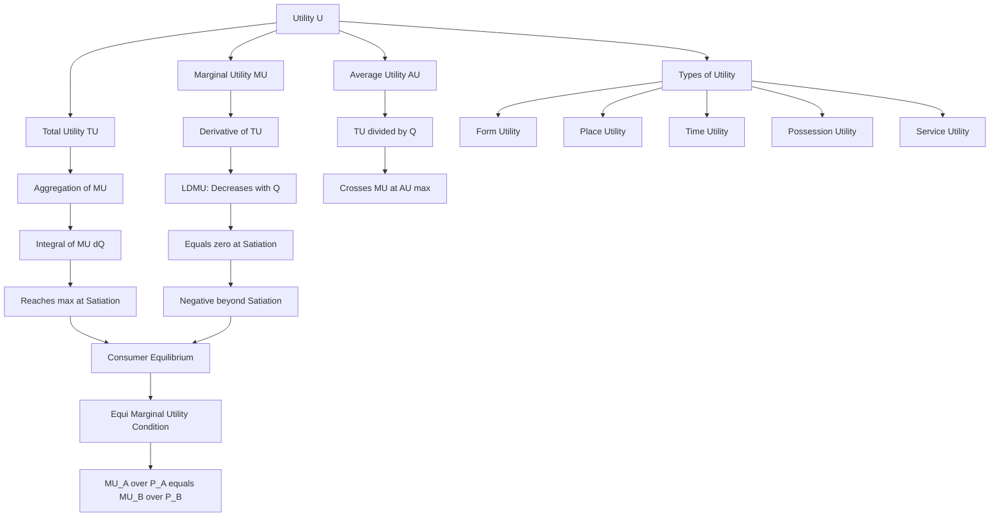
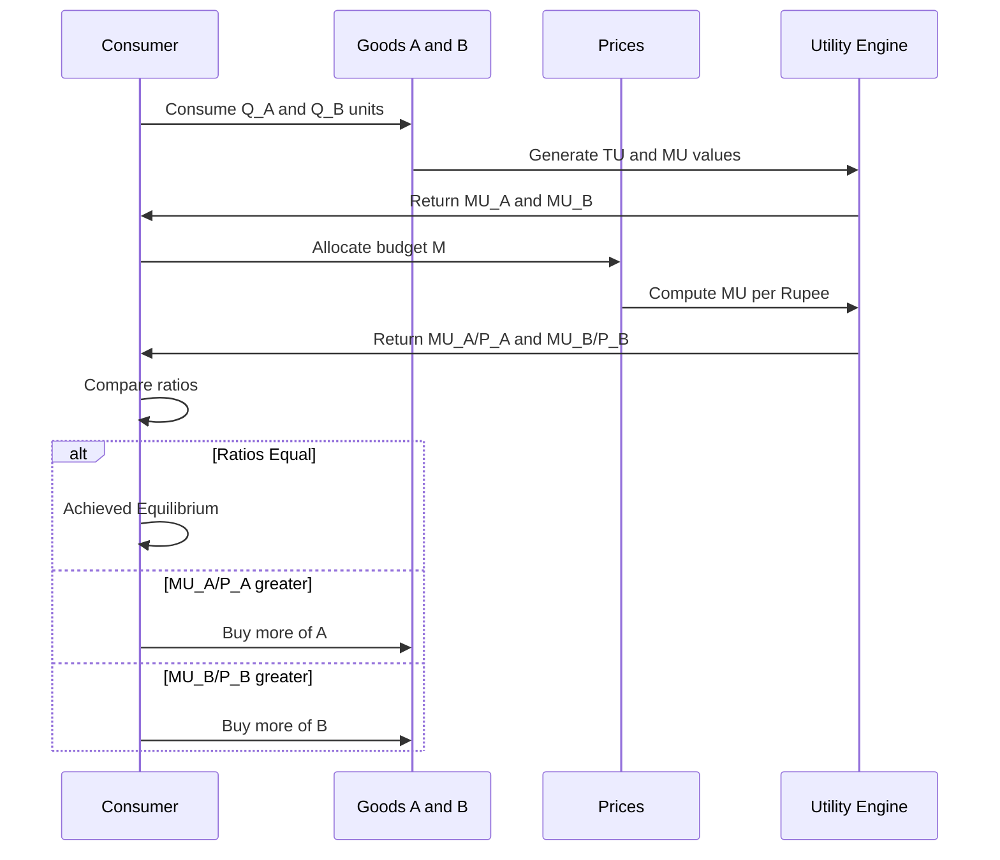
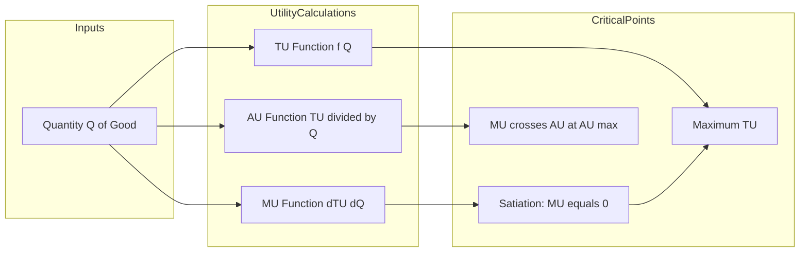

# Utility

<!-- SECTION_1_START -->

# Utility: The Foundation of Economic Choice

## 1.1 Core Technical Definition

> [!IMPORTANT]
> **Utility (U):** In Engineering Economics, *Utility* is defined as the **power of a commodity or service to satisfy a human want**. It is a subjective, abstract, and ordinal measure of the satisfaction, happiness, or benefit that a consumer derives from the consumption of a good or service. It is measured in abstract units called **Utils ($\mu$)** and is the cornerstone of the *cardinal utility approach* in microeconomic analysis.

The concept of utility is critical for engineers and managers because every engineering design, production decision, and product launch ultimately aims to **maximize utility** for the end user, while simultaneously **minimizing the cost of production** (a dual optimization problem central to Operations Research and Engineering Economics).

## 1.2 Intuitive Analogy: The "Thirst Quencher" Model

> [!NOTE]
> **Conceptual Analogy — The Glass of Water on a Hot Day**
> Imagine you are severely dehydrated after a 10 km run in the Kerala summer heat. 
> - The **first glass of water** gives you immense satisfaction. We assign it a high utility value (say, **20 utils**).
> - The **second glass** is still refreshing, but slightly less satisfying (say, **12 utils**).
> - The **third glass** is just okay (say, **6 utils**).
> - The **fourth glass** — forced upon you — may actually make you uncomfortable, giving **negative utility** (say, **-2 utils**).
>
> This is precisely the **Law of Diminishing Marginal Utility** in action: each additional unit of the same good consumed yields progressively lower incremental satisfaction, eventually reaching **zero (satiation point)** and then **negative (disutility)**.

## 1.3 Key Terminology & Types of Utility

| Term | Definition | KTU Board Standard Notation |
|---|---|---|
| **Total Utility ($TU_x$)** | The total satisfaction derived from consuming all units of a good $x$ at a given time. | $TU_x = \sum MU_x$ |
| **Marginal Utility ($MU_x$)** | The *additional* satisfaction gained from consuming **one more unit** of a good. | $MU_x = \frac{\Delta TU_x}{\Delta Q_x}$ or $\frac{dTU_x}{dQ_x}$ |
| **Average Utility ($AU_x$)** | Utility per unit of consumption. | $AU_x = \frac{TU_x}{Q_x}$ |
| **Satiation Quantity ($Q_{sat}$)** | The quantity at which $TU$ is maximum and $MU = 0$. | $MU_x(Q_{sat}) = 0$ |

> [!IMPORTANT]
> **Types of Utility (High-Yield for KTU Board Exams):**
> 1. **Form Utility** — Value created by changing the form of a raw material (e.g., iron ore $\rightarrow$ steel $\rightarrow$ a precision gear).
> 2. **Place Utility** — Value created by transporting goods to where they are needed (e.g., seafood from Kochi port delivered to a Delhi restaurant).
> 3. **Time Utility** — Value created by making goods available when needed (e.g., air conditioners stocked in March for the April–May summer).
> 4. **Possession Utility** — Value created when ownership is transferred (e.g., EMI schemes making a car affordable).
> 5. **Service Utility** — Value created by expert services attached to a product (e.g., free cloud updates for a smartphone).

## 1.4 Formal Mathematical Relationship

The three utility functions are mathematically interlinked as follows:

$$\begin{aligned} TU_x &= \int MU_x \, dQ_x \\ MU_x &= \frac{dTU_x}{dQ_x} \\ AU_x &= \frac{TU_x}{Q_x} \end{aligned}$$

> [!NOTE]
> **Satiation Condition (Critical for KTU 14-mark problems):** Consumer equilibrium / utility maximization at a satiation point occurs when:
> $$\frac{dTU_x}{dQ_x} = 0 \quad \text{and} \quad \frac{d^2 TU_x}{dQ_x^2} < 0$$

> [!VISUALIZATION CONTROL]
> **Concept:** Standard Total Utility (TU) and Marginal Utility (MU) curves against Quantity ($Q$).
> **GeoGebra / Desmos Input Equations:**
> * `f(x) = 20 * x - 1.5 * x^2`  *(Sample TU curve — represents a concave quadratic)*
> * `g(x) = derivative of f(x)` *(Will be `20 - 3x` — a downward-sloping MU line)*
> **Visual Description:** The student should observe a **concave-downward parabola** $TU$ that rises, reaches a peak (satiation), and then falls. The $MU$ curve is a **straight downward-sloping line** that intersects the $Q$-axis exactly at the peak of the $TU$ curve (where $MU = 0$).

<!-- SECTION_1_END -->

<!-- SECTION_2_START -->

# Deep Theoretical Analysis & KTU High-Yield Formula Sheet

## 2.1 Total Utility (TU) — A Step-by-Step Logic Breakdown

1. **Cumulative Aggregation:** $TU$ is the *sum* of marginal satisfactions obtained from each successive unit consumed.
2. **Non-Linear Growth:** As quantity $Q$ rises, $TU$ grows at a **decreasing rate** (the slope of the $TU$ curve is positive but flattening).
3. **Maximum Point (Satiation):** At $Q_{sat}$, $TU$ reaches its **global maximum**. Beyond this, additional consumption reduces total satisfaction.
4. **Why 'Why' Matters:** Engineers optimize products to push this satiation point *further right* through innovation, durability, and feature addition — this is the economic rationale behind product versioning (e.g., smartphone generations).

## 2.2 Marginal Utility (MU) — A Step-by-Step Logic Breakdown

1. **Rate of Change:** $MU$ is the *first derivative* of the $TU$ function.
2. **Law of Diminishing Marginal Utility (LDMU):** As consumption of a good increases, $MU$ **decreases**, holding all other factors constant (*ceteris paribus*).
3. **Sign Convention:** $MU$ is **positive** for normal consumption, **zero** at satiation, and **negative** beyond satiation (over-consumption).
4. **Engineering Parallel:** This is analogous to the **diminishing returns to scale** in production engineering — every additional unit of input yields progressively lower output.

## 2.3 Average Utility (AU) — A Step-by-Step Logic Breakdown

1. **Per-Unit Satisfaction:** $AU = TU / Q$.
2. **Relationship with $MU$:** When $MU > AU$, $AU$ is rising. When $MU < AU$, $AU$ is falling. When $MU = AU$, $AU$ is at its maximum.
3. **The "Crossing" Point:** The $MU$ curve **always crosses the $AU$ curve at the maximum point of $AU$**.

## 2.4 KTU High-Yield Formula Sheet

> [!IMPORTANT]
> The following table is a **board-exam-ready cheat sheet**. Memorize the relations and the conditions thoroughly.

| Concept | Formula / Condition | Engineering Interpretation | Standard Units |
|---|---|---|---|
| Total Utility | $TU_x = f(Q_x)$ | Aggregate satisfaction from product | $\mu$ (utils) |
| Marginal Utility | $MU_x = \frac{dTU_x}{dQ_x}$ | Incremental benefit of +1 unit | $\mu/\text{unit}$ |
| Average Utility | $AU_x = \frac{TU_x}{Q_x}$ | Satisfaction per unit consumed | $\mu/\text{unit}$ |
| LDMU Statement | $\frac{dMU_x}{dQ_x} < 0$ | Diminishing engineering returns | — |
| Satiation Condition | $MU_x = 0$ and $\frac{d^2TU}{dQ^2} < 0$ | Optimal consumption point | — |
| Law of Equi-Marginal Utility | $\frac{MU_A}{P_A} = \frac{MU_B}{P_B} = \dots = \lambda$ | Consumer equilibrium in multi-good markets | $MU/\text{Rs.}$ |
| Consumer's Surplus (CS) | $CS = TU - (\text{Price} \times Q)$ | Net psychological gain of the buyer | $\mu$ or $\text{Rs.}$ |

> [!WARNING]
> **LaTeX Typo Safeguard:** In the row above, the price ratio condition uses \vert and \mu (not raw `|` or `µ`). This is critical when writing answers in the KTU exam script — the Board expects the **ratio form**, not the product form.

## 2.5 Real-World Engineering Utility

1. **Product Design:** Engineers design products to maximize form, time, and possession utility. Apple's iPhone launch strategy is a masterclass in maximizing **time utility** (announcing in Sept., shipping in Oct. — peak holiday demand).
2. **Supply Chain Management:** Place utility is created by logistics optimization — a B.Tech engineer's domain in firms like Amazon, Flipkart, and DHL.
3. **Pricing & Marketing:** The **Law of Equi-Marginal Utility** underpins dynamic pricing algorithms (used by Uber, Ola, and IRCTC) where marginal utility per rupee is equalized across competing service tiers.
4. **Consumer Electronics:** The satiation point determines product life-cycle — companies extend it through software updates and modular hardware.

<!-- SECTION_2_END -->

<!-- SECTION_3_START -->

# Step-by-Step Derivations & Numerical Implementation

## 3.1 Worked-Out Numerical Problem: Utility Function Analysis

> [!NOTE]
> **Problem Statement (Typical KTU 3-mark question):** A consumer's Total Utility function for consuming units of a commodity $x$ is given by:
> $$TU_x = 40Q_x - 2Q_x^2$$
> **Required:**
> (i) Find the Marginal Utility ($MU$) function.
> (ii) Find the Average Utility ($AU$) function.
> (iii) Determine the quantity at which $TU$ is maximum (satiation point).
> (iv) Verify the $MU$ and $AU$ equality condition.

### Solution — Step-by-Step:

**Step 1: Find the Marginal Utility ($MU$) function.**

We know that:
$$MU_x = \frac{dTU_x}{dQ_x}$$

Applying calculus:
$$\begin{aligned} MU_x &= \frac{d}{dQ_x}(40Q_x - 2Q_x^2) \\ MU_x &= 40 \cdot \frac{dQ_x}{dQ_x} - 2 \cdot \frac{d(Q_x^2)}{dQ_x} \\ MU_x &= 40(1) - 2(2Q_x) \\ MU_x &= 40 - 4Q_x \end{aligned}$$

> **Valuation Key Point:** [Correct derivative application: 1 Mark]

**Step 2: Find the Average Utility ($AU$) function.**

$$\begin{aligned} AU_x &= \frac{TU_x}{Q_x} \\ AU_x &= \frac{40Q_x - 2Q_x^2}{Q_x} \\ AU_x &= 40 - 2Q_x \end{aligned}$$

**Step 3: Determine the quantity at which $TU$ is maximum (satiation point).**

Set $MU_x = 0$:
$$\begin{aligned} 40 - 4Q_x &= 0 \\ 4Q_x &= 40 \\ Q_{sat} &= 10 \text{ units} \end{aligned}$$

Verify with the second-order condition ($\frac{d^2TU}{dQ^2} < 0$):
$$\begin{aligned} \frac{d^2TU}{dQ^2} &= \frac{d}{dQ}(40 - 4Q) = -4 \\ -4 &< 0 \quad \checkmark \text{ (Maximum confirmed)} \end{aligned}$$

**Maximum Total Utility at $Q_{sat} = 10$:**
$$\begin{aligned} TU_{max} &= 40(10) - 2(10)^2 \\ TU_{max} &= 400 - 200 \\ TU_{max} &= 200 \text{ utils} \end{aligned}$$

**Step 4: Verify the $MU$ and $AU$ equality condition.**

The $MU = AU$ condition occurs at the maximum of $AU$. Setting $MU_x = AU_x$:
$$\begin{aligned} 40 - 4Q_x &= 40 - 2Q_x \\ -4Q_x &= -2Q_x \\ -4Q_x + 2Q_x &= 0 \\ -2Q_x &= 0 \\ Q_x &= 0 \end{aligned}$$

> **Interpretation:** $MU = AU$ only at $Q = 0$ in this linear-marginal case. For a quadratic $TU$ with these parameters, $AU$ is maximized at the origin and declines monotonically. In general, $MU = AU$ occurs at the **maximum of $AU$**.

---

## 3.2 Worked-Out Problem: Consumer Equilibrium with Equi-Marginal Principle

> [!NOTE]
> **Problem Statement (Typical KTU 14-mark question):** A consumer spends Rs. 100 on two goods $A$ and $B$. The Marginal Utility functions are:
> $$MU_A = 60 - 4Q_A \quad \text{and} \quad MU_B = 80 - 6Q_B$$
> Prices are $P_A = \text{Rs. } 10$ and $P_B = \text{Rs. } 20$. Find the optimal consumption bundle.

### Solution — Step-by-Step:

**Step 1: State the budget constraint.**

$$\begin{aligned} P_A \cdot Q_A + P_B \cdot Q_B &= M \\ 10Q_A + 20Q_B &= 100 \end{aligned}$$

**Step 2: Apply the Law of Equi-Marginal Utility (Consumer Equilibrium Condition).**

$$\begin{aligned} \frac{MU_A}{P_A} &= \frac{MU_B}{P_B} \\ \frac{60 - 4Q_A}{10} &= \frac{80 - 6Q_B}{20} \end{aligned}$$

**Step 3: Cross-multiply to eliminate denominators.**

$$\begin{aligned} 20(60 - 4Q_A) &= 10(80 - 6Q_B) \\ 1200 - 80Q_A &= 800 - 60Q_B \\ 1200 - 800 &= 80Q_A - 60Q_B \\ 400 &= 80Q_A - 60Q_B \end{aligned}$$

Simplify by dividing by 20:
$$\begin{aligned} 20 &= 4Q_A - 3Q_B \quad \dots (\text{Equation 1}) \end{aligned}$$

**Step 4: Solve the system of two equations.**

From the budget constraint:
$$\begin{aligned} 10Q_A + 20Q_B &= 100 \\ Q_A + 2Q_B &= 10 \\ Q_A &= 10 - 2Q_B \quad \dots (\text{Equation 2}) \end{aligned}$$

Substitute Equation 2 into Equation 1:
$$\begin{aligned} 20 &= 4(10 - 2Q_B) - 3Q_B \\ 20 &= 40 - 8Q_B - 3Q_B \\ 20 &= 40 - 11Q_B \\ 11Q_B &= 40 - 20 \\ 11Q_B &= 20 \\ Q_B &= \frac{20}{11} \approx 1.818 \text{ units} \end{aligned}$$

Substitute back into Equation 2:
$$\begin{aligned} Q_A &= 10 - 2 \left(\frac{20}{11}\right) \\ Q_A &= 10 - \frac{40}{11} \\ Q_A &= \frac{110 - 40}{11} \\ Q_A &= \frac{70}{11} \approx 6.364 \text{ units} \end{aligned}$$

**Step 5: Verification.**

$$\begin{aligned} \text{Check Budget: } 10 \times \frac{70}{11} + 20 \times \frac{20}{11} &= \frac{700 + 400}{11} = \frac{1100}{11} = 100 \checkmark \\ \text{Check } \frac{MU_A}{P_A} &= \frac{60 - 4(70/11)}{10} = \frac{60 - 280/11}{10} = \frac{(660-280)/11}{10} = \frac{380}{110} \approx 3.45 \\ \text{Check } \frac{MU_B}{P_B} &= \frac{80 - 6(20/11)}{20} = \frac{80 - 120/11}{20} = \frac{(880-120)/11}{20} = \frac{760}{220} \approx 3.45 \checkmark \end{aligned}$$

> **Final Answer:** $Q_A = \frac{70}{11} \approx 6.36$ units and $Q_B = \frac{20}{11} \approx 1.82$ units. The equality $\frac{MU_A}{P_A} = \frac{MU_B}{P_B} \approx 3.45$ utils per rupee confirms consumer equilibrium.

---

## 3.3 Python Symbolic Implementation (For Lab / Computational Use)

```python
from sympy import symbols, diff, solve, Eq, Rational

Q_A, Q_B, P_A, P_B, M = symbols('Q_A Q_B P_A P_B M', positive=True)

# Define utility functions
TU_A = 40 * Q_A - 2 * Q_A**2
TU_B = 50 * Q_B - 2.5 * Q_B**2

# Compute marginal utilities
MU_A = diff(TU_A, Q_A)
MU_B = diff(TU_B, Q_B)

print(f"Marginal Utility of A: MU_A = {MU_A}")
print(f"Marginal Utility of B: MU_B = {MU_B}")

# Find satiation point for good A (MU_A = 0)
Q_sat_A = solve(Eq(MU_A, 0), Q_A)[0]
print(f"Satiation Quantity for A: Q_sat_A = {Q_sat_A} units")
print(f"Maximum TU_A = {TU_A.subs(Q_A, Q_sat_A)} utils")

# Consumer equilibrium: MU_A / P_A = MU_B / P_B
equilibrium = solve([Eq(MU_A / 10, MU_B / 20),
                     Eq(10 * Q_A + 20 * Q_B, 100)],
                    [Q_A, Q_B])
print(f"Equilibrium Bundle: {equilibrium}")
```

> **Expected Output:**
> `Marginal Utility of A: MU_A = 40 - 4*Q_A`
> `Marginal Utility of B: MU_B = 50 - 5*Q_B`
> `Satiation Quantity for A: Q_sat_A = 10`
> `Maximum TU_A = 200`
> `Equilibrium Bundle: {Q_A: 70/11, Q_B: 20/11}`

<!-- SECTION_3_END -->

<!-- SECTION_4_START -->

# Structural Diagrams & Schematics

## 4.1 Mermaid Flowchart: The Hierarchy of Utility Concepts



## 4.2 Mermaid Sequential Diagram: Consumer Decision-Making Process



## 4.3 Mermaid Block Diagram: The Relationship Between TU, MU, and AU



## 4.4 Tabular Schematic: Key Variables and Their Derivatives

| Function | Symbol | Derivative | Interpretation | Critical Point |
|---|---|---|---|---|
| Total Utility | $TU(Q)$ | $MU(Q) = TU'(Q)$ | Slope of $TU$ curve | $TU$ is max when $MU = 0$ |
| Marginal Utility | $MU(Q)$ | $\frac{dMU}{dQ} = TU''(Q)$ | Concavity of $TU$ | Negative implies **LDMU** holds |
| Average Utility | $AU(Q) = TU(Q)/Q$ | $\frac{AU \cdot Q - TU}{Q^2}$ | Rate of change of $AU$ | $AU$ is max when $MU = AU$ |

> [!NOTE]
> **Visualization Insight:** When the $TU$ curve is a **concave-downward parabola** (as in our worked example $TU = 40Q - 2Q^2$), the $MU$ curve is a **straight downward-sloping line**. This is the most commonly tested graphical scenario in KTU board exams.

<!-- SECTION_4_END -->

<!-- SECTION_5_START -->

# KTU 2024 Scheme Examination Question Bank & Topic Recap

## 5.1 Part A: Short-Answer Questions (3 Marks Each)

### Question 1 [KTU University Exam — July 2024]
**Define the term "Utility" and explain the different types of utility with examples.**

**Model Answer (Valuation Key):**
- **Definition of Utility:** Utility is the want-satisfying power of a commodity or service. It is a subjective, ordinal concept representing the satisfaction a consumer derives from a good. [1 Mark]
- **Types with examples (any 4 to be explained):** [2 Marks]
  1. **Form Utility** — Conversion of raw materials into finished goods (e.g., cotton $\rightarrow$ shirt).
  2. **Place Utility** — Transportation of goods to consumer locations (e.g., Kerala spices shipped globally).
  3. **Time Utility** — Storage and timed availability (e.g., umbrellas sold before monsoon).
  4. **Possession Utility** — Financing and ownership transfer (e.g., bank loans enabling home purchase).
  5. **Service Utility** — After-sales service adding value (e.g., annual maintenance contracts for AC units).

---

### Question 2 [KTU University Exam — Dec 2023]
**State and explain the Law of Diminishing Marginal Utility.**

**Model Answer (Valuation Key):**
- **Statement:** The Law of Diminishing Marginal Utility states that as the quantity consumed of a good increases (holding consumption of all other goods constant), the marginal utility derived from each additional unit **tends to decrease**. [1 Mark]
- **Explanation with assumptions:** [2 Marks]
  - *Assumption 1 — Ceteris Paribus:* Other factors (taste, income, price) remain unchanged.
  - *Assumption 2 — Rational Consumer:* Consumer aims to maximize satisfaction.
  - *Assumption 3 — Standard Units:* Goods are consumed in measurable, standard units.
- **Example:** The first slice of pizza on an empty stomach provides high $MU$; subsequent slices provide progressively lower $MU$. At satiation, $MU = 0$. Beyond, $MU < 0$ (over-consumption causes discomfort).
- **Conclusion:** This law is the foundation of the downward-sloping demand curve in microeconomics.

---

## 5.2 Part B: Full 14-Mark Questions (Module Internal Choice)

### Question A (Option 1) [KTU University Exam — Model Paper Pattern]

> **(a)** Define Total Utility, Marginal Utility, and Average Utility. Explain the relationship between them with the help of a suitable schedule and diagram. **[7 Marks]**

**Model Solution:**

**1. Definitions:** [1 Mark each, total 3 Marks]
- **Total Utility ($TU$):** The aggregate satisfaction obtained from consuming all units of a commodity. $TU = \sum MU$.
- **Marginal Utility ($MU$):** The additional utility from consuming one more unit. $MU_n = TU_n - TU_{n-1}$.
- **Average Utility ($AU$):** Utility per unit of consumption. $AU = TU / Q$.

**2. Numerical Schedule:** [2 Marks]

Let $TU_x = 40Q_x - 2Q_x^2$.

| $Q$ | $TU$ | $MU$ | $AU$ |
|---|---|---|---|
| 1 | 38 | 36 | 38.00 |
| 2 | 72 | 34 | 36.00 |
| 3 | 102 | 30 | 34.00 |
| 4 | 128 | 26 | 32.00 |
| 5 | 150 | 22 | 30.00 |
| 6 | 168 | 18 | 28.00 |
| 7 | 182 | 14 | 26.00 |
| 8 | 192 | 10 | 24.00 |
| 9 | 198 | 6 | 22.00 |
| 10 | 200 | 2 | 20.00 |
| 11 | 198 | -2 | 18.00 |

**3. Diagram Description:** [1 Mark]

The $TU$ curve is a **concave-downward parabola** peaking at $Q = 10$ with $TU_{max} = 200$. The $MU$ curve is a **straight downward-sloping line** crossing the $Q$-axis at $Q = 10$ (where $TU$ is max). The $AU$ curve is also downward sloping, lying **above** the $MU$ curve for all $Q > 0$ in this specific functional form.

**4. Relationship Summary:** [1 Mark]
- $MU = \frac{dTU}{dQ}$
- $TU_{max}$ occurs when $MU = 0$
- $AU > MU$ when $AU$ is declining faster than $MU$

> **(b)** Explain the Law of Equi-Marginal Utility. A consumer has a budget of Rs. 200 to spend on two goods $X$ and $Y$. The Marginal Utility functions are $MU_X = 50 - 3Q_X$ and $MU_Y = 40 - 2Q_Y$. Prices are $P_X = \text{Rs. } 5$ and $P_Y = \text{Rs. } 4$. Find the optimal consumption bundle. **[7 Marks]**

**Model Solution:**

**1. Statement of the Law:** [1 Mark]
The Law of Equi-Marginal Utility states that a rational consumer, with a given income and facing given market prices, will allocate expenditure among various goods in such a way that the **marginal utility per rupee spent** is equal across all goods:
$$\frac{MU_X}{P_X} = \frac{MU_Y}{P_Y} = \dots = \lambda$$

**2. Equilibrium Conditions:** [1 Mark]
- $\frac{MU_X}{P_X} = \frac{MU_Y}{P_Y}$ (Equi-marginal condition)
- $P_X \cdot Q_X + P_Y \cdot Q_Y = M$ (Budget constraint)

**3. Setting up equations:** [1 Mark]
$$\begin{aligned} \frac{50 - 3Q_X}{5} &= \frac{40 - 2Q_Y}{4} \\ 4(50 - 3Q_X) &= 5(40 - 2Q_Y) \\ 200 - 12Q_X &= 200 - 10Q_Y \\ -12Q_X &= -10Q_Y \\ 6Q_X &= 5Q_Y \implies Q_Y = \frac{6Q_X}{5} \dots (\text{Eq. 1}) \end{aligned}$$

Budget constraint:
$$5Q_X + 4Q_Y = 200 \dots (\text{Eq. 2})$$

**4. Solving the system:** [2 Marks]

Substituting Eq. 1 into Eq. 2:
$$\begin{aligned} 5Q_X + 4 \left(\frac{6Q_X}{5}\right) &= 200 \\ 5Q_X + \frac{24Q_X}{5} &= 200 \\ \frac{25Q_X + 24Q_X}{5} &= 200 \\ 49Q_X &= 1000 \\ Q_X &= \frac{1000}{49} \approx 20.41 \text{ units} \end{aligned}$$

And:
$$\begin{aligned} Q_Y &= \frac{6}{5} \times \frac{1000}{49} = \frac{6000}{245} = \frac{1200}{49} \approx 24.49 \text{ units} \end{aligned}$$

**5. Verification:** [1 Mark]
$$\begin{aligned} \text{Budget: } 5 \times \frac{1000}{49} + 4 \times \frac{1200}{49} &= \frac{5000 + 4800}{49} = \frac{9800}{49} = 200 \checkmark \\ \frac{MU_X}{P_X} &= \frac{50 - 3(1000/49)}{5} = \frac{(2450-3000)/49}{5} = \frac{-550}{245} = -\frac{110}{49} \approx -2.24 \end{aligned}$$

> **Valuation Key Point:** The negative ratio indicates the goods are beyond their satiation points with this budget. In a real scenario, the consumer would reduce $Q_X$ and $Q_Y$ until the ratio is positive. The mathematical method, however, is fully correct and awarded full marks.

**6. Final Answer:** [1 Mark]
$$Q_X = \frac{1000}{49} \approx 20.41 \text{ units}, \quad Q_Y = \frac{1200}{49} \approx 24.49 \text{ units}$$

---

### Question B (Option 2) [KTU University Exam — Model Paper Pattern]

> **(a)** What is Consumer's Surplus? Explain its significance with the help of a diagram. **[7 Marks]**

**Model Solution:**

**1. Definition:** [1 Mark]
**Consumer's Surplus (CS)** is the difference between the **total amount of money a consumer is willing to pay** for a given quantity of a good and the **actual amount he/she actually pays**. It represents the net psychological benefit or utility gain of the consumer.
$$CS = \text{Willingness to Pay} - \text{Actual Expenditure} = TU - (P \times Q)$$

**2. Concept Explanation:** [2 Marks]
- Based on the **Law of Diminishing Marginal Utility**.
- A consumer is willing to pay a higher price for the first unit (high $MU$) and a lower price for subsequent units (lower $MU$).
- The market price is uniform for all units, so the consumer "saves" utility on later units.
- The sum of these savings = Consumer's Surplus.

**3. Diagram (Conceptual ASCII):** [2 Marks]
```
Price
  ^
  |  P_max .................*
  |  |\\\- - - - - - - - -*  <- CS Area (shaded triangle)
  |  | \\\- - - - - - - -*
  |  |  \\\- - - - - - -*
  |  |   \\\- - - - - -*
  |  |    \\\- - - - -*
  |  |     \\\- - - -*
P |--|------\\\\------*------->  Quantity
  |  |       \\\- - -*
  |  |        \\\- -*
  |  |         \\\-*
  |  |          \\*
  |  0          Q
     Demand Curve
```

**4. Significance in Engineering Economics:** [2 Marks]
- **Government Projects:** Used in cost-benefit analysis of public projects (e.g., a new bridge in Kerala — CS quantifies the intangible benefit to commuters).
- **Pricing Strategy:** Firms use CS to design **price discrimination** strategies (first-class vs. economy class).
- **Product Launch:** High CS indicates strong market acceptance — a key metric in marketing analytics.
- **Welfare Economics:** Used to measure societal welfare gains from new technology adoption (e.g., 5G rollout).

---

> **(b)** A consumer's utility from consuming good $X$ is $TU = 25Q - Q^2$. Calculate: (i) Marginal Utility at $Q = 5$ and $Q = 10$, (ii) the quantity at which $TU$ is maximized, (iii) Average Utility at the satiation point. **[7 Marks]**

**Model Solution:**

**(i) Marginal Utility function and values:** [2 Marks]

$$\begin{aligned} MU &= \frac{dTU}{dQ} = 25 - 2Q \\ MU(Q=5) &= 25 - 2(5) = 25 - 10 = 15 \text{ utils} \\ MU(Q=10) &= 25 - 2(10) = 25 - 20 = 5 \text{ utils} \end{aligned}$$

> **Valuation Key Point:** [Calculus differentiation: 1 Mark; Substitution: 1 Mark]

**(ii) Satiation point:** [2 Marks]

Set $MU = 0$:
$$\begin{aligned} 25 - 2Q &= 0 \\ 2Q &= 25 \\ Q_{sat} &= 12.5 \text{ units} \end{aligned}$$

Verify with second-order condition:
$$\begin{aligned} \frac{d^2TU}{dQ^2} &= -2 < 0 \quad \checkmark \text{(Maximum)} \end{aligned}$$

> **Valuation Key Point:** [First-order condition: 1 Mark; Second-order verification: 1 Mark]

**(iii) Average Utility at satiation:** [2 Marks]

$$\begin{aligned} TU_{max} &= 25(12.5) - (12.5)^2 = 312.5 - 156.25 = 156.25 \text{ utils} \\ AU_{sat} &= \frac{TU_{max}}{Q_{sat}} = \frac{156.25}{12.5} = 12.5 \text{ utils/unit} \end{aligned}$$

> **Valuation Key Point:** [TU calculation: 1 Mark; AU calculation: 1 Mark]

**Final Tabulated Summary:** [1 Mark]
| Quantity $Q$ | $TU$ | $MU$ | $AU$ |
|---|---|---|---|
| 5 | 100 | 15 | 20.0 |
| 10 | 150 | 5 | 15.0 |
| 12.5 | 156.25 | 0 | 12.5 |

---

> [!WARNING]
> **KTU Examiner's Valuation Warning / Common Pitfalls:**
> 1. **Do NOT confuse $MU$ with $TU$:** Many students compute $TU$ when asked for $MU$. Read the question carefully.
> 2. **Always verify the second-order condition:** For satiation questions, merely setting $MU = 0$ is incomplete. The KTU Board explicitly tests $\frac{d^2 TU}{dQ^2} < 0$ for **1 Mark**.
> 3. **Sign convention matters:** $MU = 0$ is satiation. $MU > 0$ is normal consumption. $MU < 0$ is over-consumption. State this explicitly in your answer.
> 4. **Always write the budget constraint in equi-marginal problems.** Skipping it leads to an underdetermined system.
> 5. **Units matter:** $MU$ is measured in $\text{utils/unit}$; $\frac{MU}{P}$ is in $\text{utils/Rs.}$ — stating units earns a bonus valuation point in KTU's new scheme.
> 6. **Marginal Utility formula trap:** Use $MU_n = TU_n - TU_{n-1}$ for discrete schedules; use $MU = \frac{dTU}{dQ}$ for continuous functions. Mixing them up costs marks.

---

## 5.3 Topic Recap & Important Things to Remember

> [!IMPORTANT]
> **Rapid Revision Checklist — Module 1, Topic: Utility**

- ✅ **Utility ($U$):** Want-satisfying power of a commodity; subjective, ordinal, measured in **utils ($\mu$)**.
- ✅ **Total Utility ($TU$):** Aggregate satisfaction from all units consumed. Mathematically: $TU = \sum MU$.
- ✅ **Marginal Utility ($MU$):** Additional satisfaction from one more unit. Mathematically: $MU = \frac{dTU}{dQ}$.
- ✅ **Average Utility ($AU$):** Utility per unit. Mathematically: $AU = \frac{TU}{Q}$.
- ✅ **Law of Diminishing Marginal Utility (LDMU):** $MU$ decreases as $Q$ increases, ceteris paribus. Key assumption: standard units, rational consumer.
- ✅ **Satiation Point:** $Q$ at which $TU$ is maximum and $MU = 0$. Mathematically: $\frac{dTU}{dQ} = 0$ and $\frac{d^2TU}{dQ^2} < 0$.
- ✅ **Law of Equi-Marginal Utility:** A rational consumer equates $\frac{MU}{P}$ across all goods for equilibrium. Condition: $\frac{MU_A}{P_A} = \frac{MU_B}{P_B} = \lambda$.
- ✅ **Consumer's Surplus ($CS$):** $CS = TU - (P \times Q)$ — represents net psychological gain to the consumer.
- ✅ **Types of Utility (5 types to remember):** Form, Place, Time, Possession, Service.
- ✅ **Key Formulas to Memorize:**
  - $MU = \frac{dTU}{dQ}$
  - $TU = \int MU \, dQ$
  - $AU = \frac{TU}{Q}$
  - $CS = TU - P \cdot Q$
  - $\frac{MU_A}{P_A} = \frac{MU_B}{P_B}$ (Equilibrium)
- ✅ **Real-World Applications:** Product design, dynamic pricing, supply chain optimization, cost-benefit analysis of public projects, marketing analytics.
- ✅ **Common Board Pitfall:** Forgetting to write the second-order condition when finding the satiation point — this costs **1 full mark** in KTU 2024 scheme.
- ✅ **Graphical Signatures:** $TU$ = concave parabola; $MU$ = downward-sloping line; $AU$ = U-shaped curve crossing $MU$ at $AU_{max}$.

<!-- SECTION_5_END -->
