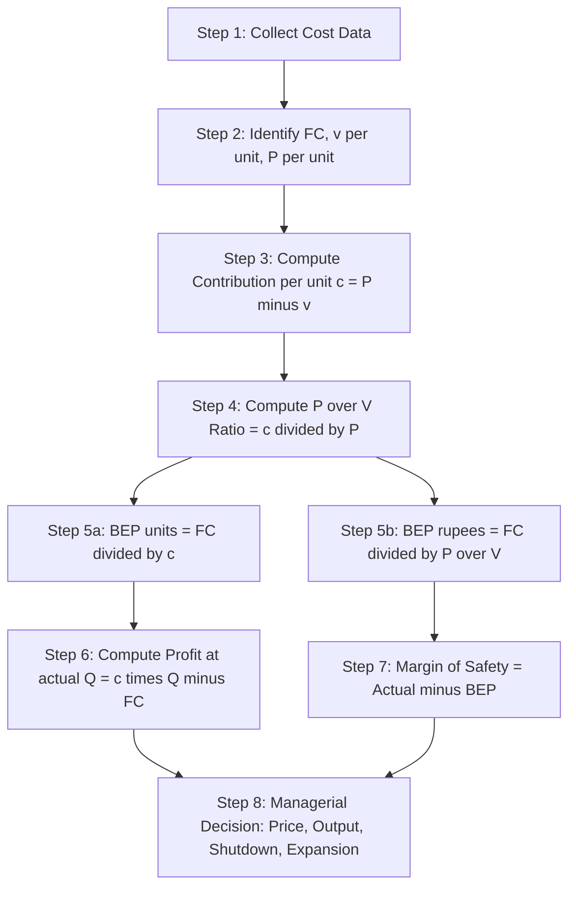

# Cost concepts

<!-- SECTION_1_START -->

## 1. Core Technical Definition & Intuitive Overview

### 1.1 Formal Academic Definition

> [!IMPORTANT]
> **KTU 2024 Scheme – Module 2 Definition**
> **Cost** in engineering economics is the monetary value of resources (materials, labour, machinery, utilities, and opportunity alternatives) consumed or sacrificed to produce a specific product, deliver a service, or execute an engineering project. **Cost concepts** form the analytical framework engineers use to classify, measure, and control expenditures in order to support managerial decisions such as pricing, production planning, make-or-buy evaluation, and break-even determination.

In the KTU 2024 syllabus for **UCHUT346 – Economics for Engineers (Module 2)**, cost concepts are studied under three principal layers:

1. **Classification of Costs** – based on behaviour, traceability, controllability, and relevance.
2. **Cost–Output Relationship** – how costs change with the level of production in the short run and long run.
3. **Cost Analysis Tools** – Break-Even Analysis (BEA), P/V ratio, Margin of Safety, and Contribution analysis.

> [!NOTE]
> **Why a B.Tech engineer studies cost concepts:** An engineer who designs, manufactures, or manages a system must be able to estimate the cost of a product, determine the minimum production quantity at which a project becomes profitable, identify the most cost-effective design alternative, and present a financially defensible proposal to management. Cost concepts are the quantitative language of these decisions.

---

### 1.2 Conceptual Analogy / Intuition

**Imagine a roadside tea stall run by an engineering student named Arun.**

Arun buys a small gas stove, a kettle, four steel glasses, and a table. Once bought, these items are paid for whether he sells **one cup** of tea or **one hundred cups**. These are his **Fixed Costs (FC)**.

Each cup of tea he serves consumes a measured quantity of milk, sugar, tea powder, and gas. The more cups he sells, the more ingredients he buys. These are his **Variable Costs (VC)**.

If the landlord charges him a small monthly rent *plus* an extra amount per customer, the rent is partly fixed and partly variable. This is a **Semi-Variable Cost**.

Suppose Arun had a permanent job paying ₹25,000/month but chose to run the stall. The forgone salary is his **Opportunity Cost** – an invisible cost that never appears in his accounts but is real.

If he already paid ₹5,000 last month for an advertising campaign that flopped, that money is gone forever and cannot influence today's decision to advertise again. This is a **Sunk Cost** – the past is irreversible.

If he considers switching from steel glasses to paper cups because they cost ₹1 less per cup, the ₹1 difference is a **Differential Cost**, and the extra profit from serving 200 more customers is his **Marginal Revenue**, while the extra cost of those 200 cups is his **Marginal Cost**.

The day Arun sells exactly enough tea to cover all his expenses – fixed, variable, and semi-variable – he has reached his **Break-Even Point (BEP)**. Every cup sold after that is pure profit.

> [!TIP]
> **The Golden Rule of Cost Thinking:** Every engineering decision (design choice, material selection, automation level, batch size) has a cost consequence. The engineer who can translate that consequence into one of these cost categories controls the financial outcome of the project.

---

### 1.3 Physical Constants and Standard Metrics

The following standard financial metrics are universally used in cost analysis:

- **Currency Unit:** **Indian Rupee (₹)** – the KTU-recognised monetary unit for all numerical problems.
- **Time Horizon:** **Short Run** = a period during which at least one factor of production (typically plant & machinery) is **fixed**; **Long Run** = a period long enough for **all** factors to become variable.
- **Standard Symbol Conventions:** $Q$ = quantity produced (units), $P$ = selling price per unit (₹/unit), $FC$ = fixed cost (₹), $VC$ = variable cost (₹), $TC$ = total cost (₹), $MC$ = marginal cost (₹/unit).

> [!VISUALIZATION CONTROL]
> **Concept:** Behaviour of Fixed, Variable, and Total Cost with Output
> **GeoGebra / Desmos Input Equations:**
> * `f(x) = 5000`  *(Total Fixed Cost – a horizontal line)*
> * `g(x) = 20 * x`  *(Total Variable Cost – a straight line through origin)*
> * `h(x) = f(x) + g(x) = 5000 + 20 * x`  *(Total Cost – the sum of the two)*
> **Visual Description:** On the X-axis plot the production quantity $Q$ (0 to 500 units). On the Y-axis plot the cost in ₹. The fixed cost $f(x)$ appears as a horizontal line at ₹5,000. The variable cost $g(x)$ rises linearly from the origin. The total cost $h(x)$ is a straight line parallel to $g(x)$ but shifted upwards by the constant ₹5,000 intercept. The point where $h(x)$ crosses the Total Revenue line $R(x) = P \cdot x$ is the **break-even point**.

---

<!-- SECTION_1_END -->

<!-- SECTION_2_START -->

## 2. Deep Theoretical Analysis & KTU High-Yield Formula Sheet

### 2.1 Hierarchical Classification of Costs

Engineering cost concepts can be organised into five classification families. KTU examiners frequently pose a direct "Classify and explain the following cost types" question worth 7 marks.

#### A. Behaviour-Based Classification
- **Fixed Cost (FC):** Cost that does **not** vary with the volume of output in the short run (within a *relevant range*). Examples: factory rent, depreciation on machinery, salary of permanent staff, insurance premium.
- **Variable Cost (VC):** Cost that varies **directly and proportionately** with output. Examples: raw materials, direct labour wages on a piece-rate basis, packaging, sales commission.
- **Semi-Variable (Mixed) Cost:** A cost that contains both a fixed component and a variable component. Example: electricity bill with a fixed service charge plus a per-unit consumption charge. Analysed using the **High-Low Method** or **Least-Squares Regression**.

#### B. Traceability-Based Classification
- **Direct Cost:** Cost that can be **economically and accurately traced** to a specific cost object (product, department, project). Examples: timber in a chair, wages of a carpenter assigned to one job.
- **Indirect Cost (Overhead):** Cost that **cannot be directly traced** to a single cost object and must be allocated using a suitable basis. Examples: factory supervisor's salary, factory rent, depreciation of shared equipment. Allocated using absorption rates such as labour hours, machine hours, or floor area.

#### C. Decision-Relevance Classification
- **Sunk Cost:** A **past, irreversible** cost that cannot be recovered and should **not** influence current decisions. Example: ₹2 lakh spent on a failed R&D prototype.
- **Opportunity Cost:** The **value of the next-best alternative foregone** when a decision is made. Not recorded in books but vital for rational choice. Example: choosing self-employment over a ₹6 LPA job costs the engineer ₹6 LPA in forgone salary.
- **Marginal Cost:** The **additional cost of producing one extra unit** of output. $MC = \Delta TC / \Delta Q$.
- **Differential Cost:** The **difference in total cost** between two alternative courses of action. Example: cost difference between manufacturing in-house vs outsourcing.
- **Incremental Cost:** The **additional cost incurred** when moving from one production level to a higher production level (often used interchangeably with differential cost, but incremental refers to the *extra* cost of expansion).
- **Replacement Cost:** The current market cost to **replace an existing asset** at today's prices, as opposed to its original (historical) cost.

#### D. Controllability Classification
- **Controllable Cost:** Can be **regulated and influenced** by a specific manager within a defined responsibility centre. Example: a foreman's overtime hours.
- **Uncontrollable Cost:** Cannot be **materially influenced** by a particular manager in the short run. Example: allocated head-office rent to a branch manager.

#### E. Normality Classification
- **Normal Cost:** A cost that is **expected and necessary** for normal operations (a part of standard cost). Example: routine maintenance.
- **Abnormal Cost:** A cost that is **unexpected and not part of standard operations** (charged to Costing P&L, not to product). Example: cost of defective units due to a fire.

#### F. Explicit vs. Implicit
- **Explicit Cost:** Out-of-pocket, accounting-recorded payments to outsiders. Example: wages paid, materials purchased.
- **Implicit Cost:** Imputed cost of self-owned resources. Example: rent on owned building, salary of the proprietor.

---

### 2.2 Cost–Output Relationship in the Short Run

In the **short run**, at least one factor (typically capital/plant) is fixed. The cost behaviour is summarised by the following cost curves (most are U-shaped because of the **Law of Variable Proportions**).

Let the total cost function be

$$
TC(Q) \;=\; FC \;+\; VC(Q)
$$

where $VC(Q)$ is a convex function of $Q$. Six derived cost concepts follow:

| # | Concept | Symbol | Formula | Behaviour with rising $Q$ |
|---|---------|--------|---------|--------------------------|
| 1 | Total Fixed Cost | $TFC$ | constant | perfectly horizontal line |
| 2 | Total Variable Cost | $TVC$ | function of $Q$ | rises, then accelerates |
| 3 | Total Cost | $TC$ | $TFC + TVC$ | parallel to $TVC$, shifted up by $TFC$ |
| 4 | Average Fixed Cost | $AFC$ | $TFC / Q$ | continuously falls, hyperbolic |
| 5 | Average Variable Cost | $AVC$ | $TVC / Q$ | first falls, then rises (U-shaped) |
| 6 | Average Total Cost | $ATC$ | $TC / Q$ | falls, reaches minimum, rises (U-shaped) |
| 7 | Marginal Cost | $MC$ | $\Delta TC / \Delta Q$ | intersects $AVC$ and $ATC$ at their minima |

> [!NOTE]
> **The Two Famous Intersections (board-exam favourite):**
> 1. $MC = AVC$ at the minimum point of $AVC$.
> 2. $MC = ATC$ at the minimum point of $ATC$.
> These intersections are direct consequences of the **mathematical relationship between averages and marginals**.

---

### 2.3 Cost–Output Relationship in the Long Run

In the **long run**, *all* factors become variable. The firm can choose any plant size. The **Long-Run Average Cost (LRAC)** curve is the envelope of all possible short-run average cost curves. Its typical U-shape reflects **Economies of Scale** (downward portion) and **Diseconomies of Scale** (upward portion).

> [!TIP]
> **Why engineers care about the long run:** Capacity-expansion decisions (buying a second CNC machine, building a new plant, scaling up a software deployment) live in the long run. Understanding LRAC prevents over-capitalisation and helps identify the **Minimum Efficient Scale (MES)** – the smallest output at which LRAC is minimised.

---

### 2.4 Break-Even Analysis (BEA)

**Break-Even Analysis** is the quantitative technique used to determine the production volume at which **Total Revenue equals Total Cost** (i.e. profit is zero). It is one of the highest-weightage topics in KTU Module 2.

Key terms:

- **Contribution ($C$):** $C = \text{Sales} - \text{Variable Cost}$. It is the amount available to cover fixed cost and then generate profit.
- **Contribution per unit:** $c = P - v$, where $P$ is the selling price per unit and $v$ is the variable cost per unit.
- **P/V Ratio (Profit/Volume Ratio):** $\text{P/V} = C / S = (P - v) / P$, expressed as a percentage. It measures the rate at which contribution is generated per rupee of sales.
- **Break-Even Point (BEP):** The output or sales value at which profit is zero.
- **Margin of Safety (MoS):** $\text{MoS} = \text{Actual Sales} - \text{BEP Sales}$. The larger the MoS, the safer the business is from a sales decline.

### 2.5 KTU Formula Sheet / Cheat Sheet

| # | Quantity | Formula | Typical Unit | Board-Valuation Notes |
|---|----------|---------|--------------|------------------------|
| 1 | Total Cost | $TC = FC + (v \cdot Q)$ | ₹ | Always state the FC and $v$ explicitly before substituting |
| 2 | Sales Revenue | $S = P \cdot Q$ | ₹ | $P$ = selling price per unit, $Q$ = quantity sold |
| 3 | Profit | $\pi = S - TC$ | ₹ | Negative value means a loss |
| 4 | Contribution per unit | $c = P - v$ | ₹/unit | Numerator of BEP formula |
| 5 | P/V Ratio | $\text{P/V} = c / P$ | dimensionless (or %) | Multiplied by 100 to express in % |
| 6 | BEP in units | $Q^* = FC / (P - v)$ | units | Most frequently asked formula |
| 7 | BEP in sales ₹ | $S^* = FC / \text{P/V}$ | ₹ | Often written as $S^* = FC \cdot P / (P - v)$ |
| 8 | Profit at given $Q$ | $\pi = (P - v) \cdot Q - FC$ | ₹ | Equivalent to $Q - Q^*$ in units times $c$ |
| 9 | Margin of Safety (units) | $Q_{MoS} = Q_{actual} - Q^*$ | units | Positive value = safe zone |
| 10 | Margin of Safety (₹) | $S_{MoS} = S_{actual} - S^*$ | ₹ | Same as a % of actual sales |
| 11 | MoS as % of sales | $\text{MoS\%} = S_{MoS} / S_{actual} \times 100$ | % | A drop of this % in sales will cause loss |
| 12 | Desired Profit volume | $Q_{\pi} = (FC + \text{Desired Profit}) / (P - v)$ | units | Direct extension of BEP formula |
| 13 | Shutdown point | $P < AVC$ | – | If price falls below AVC, shut down |
| 14 | High-Low method slope (semi-variable) | $b = (C_2 - C_1) / (Q_2 - Q_1)$ | ₹/unit | $C_1, C_2$ are total costs at the two activity levels |
| 15 | High-Low fixed component | $a = C_2 - b \cdot Q_2$ | ₹ | Use either high or low point, both give same $a$ |

> [!WARNING]
> **Unit Consistency:** In KTU valuation, examiners will deduct marks if you mix up "BEP in units" and "BEP in rupees". Always write the unit clearly next to your numerical answer (e.g., `Q* = 1,000 units`, `S* = ₹ 5,00,000`).

---

### 2.6 Real-World Engineering & Computer-Science Utility

- **Manufacturing:** Deciding the batch size for a CNC machined part requires comparing the marginal cost of producing one more piece with its marginal revenue.
- **Software Industry:** Cloud-deployment decisions use marginal-cost reasoning – running one more container costs only a small variable amount, while the dev-ops team salary is a fixed cost.
- **Project Management:** Make-or-buy decisions in construction (precast vs cast-in-situ) require differential-cost analysis.
- **Energy Engineering:** A solar power plant's break-even point in megawatt-hours determines its payback period and Levelised Cost of Electricity (LCOE).
- **Operations Research:** Inventory carrying cost is semi-variable; EOQ (Economic Order Quantity) analysis splits it into its fixed and variable components.

---

<!-- SECTION_2_END -->

<!-- SECTION_3_START -->

## 3. Step-by-Step Derivations & Code/Symbolic Implementation

### 3.1 Derivation of the Break-Even Point in Units

The break-even point is defined as the output $Q^*$ at which Total Revenue equals Total Cost. Let us derive it from first principles.

**Step 1 – Define Total Revenue.**
Total Revenue ($S$) is the product of selling price per unit ($P$) and the number of units sold ($Q$):

$$
S \;=\; P \cdot Q
$$

**Step 2 – Define Total Cost.**
In the short run, the total cost function is linear in $Q$: a constant fixed cost $FC$ plus a constant variable cost per unit $v$ multiplied by $Q$:

$$
TC \;=\; FC \;+\; v \cdot Q
$$

**Step 3 – Apply the break-even condition.**
At the break-even point, profit $\pi$ is zero, so Total Revenue equals Total Cost:

$$
P \cdot Q^* \;=\; FC \;+\; v \cdot Q^*
$$

**Step 4 – Collect the $Q^*$ terms on the left-hand side.**

$$
P \cdot Q^* \;-\; v \cdot Q^* \;=\; FC
$$

**Step 5 – Factor out $Q^*$.**

$$
Q^* \cdot (P - v) \;=\; FC
$$

**Step 6 – Solve for $Q^*$.**

$$
Q^* \;=\; \frac{FC}{P - v}
$$

The numerator is the **Total Fixed Cost** and the denominator is the **Contribution per unit** ($c = P - v$). This is the canonical KTU break-even formula. ✔

---

### 3.2 Derivation of the Break-Even Point in Sales Rupees

**Step 1 – Start with the unit BEP and multiply both sides by $P$.**

$$
P \cdot Q^* \;=\; P \cdot \frac{FC}{P - v}
$$

**Step 2 – Use the definition of P/V ratio.** The P/V ratio is the contribution per rupee of sales:

$$
\text{P/V} \;=\; \frac{P - v}{P}
$$

**Step 3 – Rearrange to get the BEP in sales value.**

$$
S^* \;=\; P \cdot Q^* \;=\; \frac{FC}{\dfrac{P - v}{P}} \;=\; \frac{FC}{\text{P/V ratio}}
$$

So the BEP in rupees is simply the fixed cost divided by the P/V ratio. ✔

---

### 3.3 Worked Numerical Example (KTU-Style 7-Mark Problem)

> **Problem (KTU-pattern, July 2024 style):**
> A small engineering company manufactures a pressure gauge. The selling price is ₹400 per unit. The variable cost per unit is ₹250. The total fixed costs per month are ₹75,000.
> **(a)** Calculate the break-even point in units and in rupees.
> **(b)** Find the monthly profit if the company produces and sells 600 units.
> **(c)** What is the Margin of Safety in units and as a percentage of actual sales?

**Step 1 – Identify the given parameters.**
$P = 400$ ₹/unit, $v = 250$ ₹/unit, $FC = 75{,}000$ ₹, $Q_{actual} = 600$ units.

**Step 2 – Compute the contribution per unit.**

$$
c \;=\; P - v \;=\; 400 - 250 \;=\; 150 \;\text{₹/unit}
$$

**Step 3 – BEP in units.**

$$
Q^* \;=\; \frac{FC}{P - v} \;=\; \frac{75{,}000}{150} \;=\; 500 \;\text{units}
$$

**Step 4 – Compute the P/V ratio.**

$$
\text{P/V} \;=\; \frac{P - v}{P} \;=\; \frac{150}{400} \;=\; 0.375 \;\text{or}\; 37.5\%
$$

**Step 5 – BEP in rupees.**

$$
S^* \;=\; \frac{FC}{\text{P/V}} \;=\; \frac{75{,}000}{0.375} \;=\; 2{,}00{,}000 \;\text{₹}
$$

**Step 6 – Profit at 600 units.**

$$
\pi \;=\; (P - v) \cdot Q - FC \;=\; 150 \times 600 - 75{,}000 \;=\; 90{,}000 - 75{,}000 \;=\; 15{,}000 \;\text{₹}
$$

**Step 7 – Margin of Safety in units.**

$$
Q_{MoS} \;=\; Q_{actual} - Q^* \;=\; 600 - 500 \;=\; 100 \;\text{units}
$$

**Step 8 – Margin of Safety as a percentage.**

$$
\text{MoS\%} \;=\; \frac{100}{600} \times 100 \;=\; 16.67\%
$$

**Verification (cross-check):**
At $Q = 600$, Sales $= 400 \times 600 = 2{,}40{,}000$ ₹, $TC = 75{,}000 + 250 \times 600 = 75{,}000 + 1{,}50{,}000 = 2{,}25{,}000$ ₹. Profit $= 2{,}40{,}000 - 2{,}25{,}000 = 15{,}000$ ₹ ✔

> [!IMPORTANT]
> **Valuation Key Points for this 7-mark sub-question:**
> * [Stating the given data: 1 Mark]
> * [Contribution per unit calculation: 1 Mark]
> * [BEP units and BEP rupees: 2 Marks]
> * [Profit at 600 units: 1 Mark]
> * [Margin of Safety in units and %: 2 Marks]

---

### 3.4 Semi-Variable Cost Decomposition – High-Low Method

> **Problem:** A factory's electricity bill is a semi-variable cost. In March, when 4,000 machine-hours were run, the bill was ₹28,000. In August, when 6,000 machine-hours were run, the bill was ₹36,000. Find the fixed and variable components.

**Step 1 – Compute the variable cost rate using the high-low method.**

$$
b \;=\; \frac{C_{high} - C_{low}}{Q_{high} - Q_{low}} \;=\; \frac{36{,}000 - 28{,}000}{6{,}000 - 4{,}000} \;=\; \frac{8{,}000}{2{,}000} \;=\; 4 \;\text{₹/machine-hour}
$$

**Step 2 – Compute the fixed component by substituting the high point.**

$$
a \;=\; C_{high} - b \cdot Q_{high} \;=\; 36{,}000 - 4 \times 6{,}000 \;=\; 36{,}000 - 24{,}000 \;=\; 12{,}000 \;\text{₹}
$$

**Step 3 – Cross-check with the low point.**

$$
C_{low, predicted} \;=\; a + b \cdot Q_{low} \;=\; 12{,}000 + 4 \times 4{,}000 \;=\; 12{,}000 + 16{,}000 \;=\; 28{,}000 \;\text{₹} \;\;\checkmark
$$

**Final Cost Function:**

$$
C(Q) \;=\; 12{,}000 \;+\; 4 \cdot Q
$$

> [!TIP]
> **Valuation Tip:** The High-Low method gives **2 marks** for the variable rate and **1 mark** for the fixed component, and a **bonus 1 mark** if you cross-verify using the other data point. Many students skip the verification step and lose easy marks.

---

### 3.5 Python Implementation – Cost & Break-Even Analyser

The following fully operational Python program implements all the cost-analysis formulae in a single, well-typed module. It is suitable for engineering students to use in lab assignments and project evaluations.

```python
"""
cost_analyser.py
----------------
A KTU-aligned implementation of core cost-concept computations:
  - Fixed, Variable, Total Cost
  - Average and Marginal Cost
  - Break-Even Point (units and rupees)
  - P/V Ratio
  - Margin of Safety
  - Desired-Profit Volume
  - Semi-Variable Cost Decomposition (High-Low Method)
"""

from __future__ import annotations
from dataclasses import dataclass
from typing import List, Tuple


@dataclass(frozen=True)
class CostModel:
    """Immutable container for a short-run linear cost model."""
    fixed_cost: float          # FC in rupees
    variable_cost_per_unit: float  # v in rupees per unit
    selling_price: float       # P in rupees per unit

    def total_cost(self, q: float) -> float:
        if q < 0:
            raise ValueError("Quantity cannot be negative.")
        return self.fixed_cost + self.variable_cost_per_unit * q

    def total_revenue(self, q: float) -> float:
        if q < 0:
            raise ValueError("Quantity cannot be negative.")
        return self.selling_price * q

    def contribution_per_unit(self) -> float:
        return self.selling_price - self.variable_cost_per_unit

    def pv_ratio(self) -> float:
        if self.selling_price == 0:
            raise ZeroDivisionError("Selling price is zero.")
        return self.contribution_per_unit() / self.selling_price

    def bep_units(self) -> float:
        c = self.contribution_per_unit()
        if c <= 0:
            raise ValueError("Contribution is non-positive; BEP is undefined.")
        return self.fixed_cost / c

    def bep_rupees(self) -> float:
        ratio = self.pv_ratio()
        if ratio <= 0:
            raise ValueError("P/V ratio is non-positive; BEP in rupees undefined.")
        return self.fixed_cost / ratio

    def profit_at(self, q: float) -> float:
        return self.total_revenue(q) - self.total_cost(q)

    def margin_of_safety_units(self, actual_q: float) -> float:
        if actual_q < 0:
            raise ValueError("Actual quantity cannot be negative.")
        return actual_q - self.bep_units()

    def margin_of_safety_percent(self, actual_q: float) -> float:
        if actual_q <= 0:
            raise ValueError("Actual quantity must be positive for a percentage.")
        return (self.margin_of_safety_units(actual_q) / actual_q) * 100.0

    def volume_for_desired_profit(self, target_profit: float) -> float:
        c = self.contribution_per_unit()
        if c <= 0:
            raise ValueError("Contribution is non-positive; volume undefined.")
        return (self.fixed_cost + target_profit) / c

    def average_costs(self, q: float) -> Tuple[float, float, float, float]:
        if q <= 0:
            raise ValueError("Quantity must be positive to compute averages.")
        tfc = self.fixed_cost
        tvc = self.variable_cost_per_unit * q
        afc = tfc / q
        avc = tvc / q
        atc = (tfc + tvc) / q
        return afc, avc, atc, self.selling_price - atc  # last = profit/unit

    def marginal_cost(self, q1: float, q2: float) -> float:
        if q2 <= q1:
            raise ValueError("q2 must be greater than q1.")
        return (self.total_cost(q2) - self.total_cost(q1)) / (q2 - q1)


def high_low_method(points: List[Tuple[float, float]]) -> Tuple[float, float]:
    """
    Decompose a semi-variable cost into fixed (a) and variable (b) components.
    points: list of (quantity, total_cost) tuples.
    Returns (fixed_cost, variable_cost_per_unit).
    """
    if len(points) < 2:
        raise ValueError("At least two data points are required.")
    sorted_pts = sorted(points, key=lambda p: p[0])
    low_q, low_c = sorted_pts[0]
    high_q, high_c = sorted_pts[-1]
    if high_q == low_q:
        raise ZeroDivisionError("High and low quantities cannot be equal.")
    b = (high_c - low_c) / (high_q - low_q)
    a = high_c - b * high_q
    return a, b


# ----------------------------------------------------------------------
# Demonstration (matches the worked example in Section 3.3)
# ----------------------------------------------------------------------
if __name__ == "__main__":
    cm = CostModel(fixed_cost=75_000, variable_cost_per_unit=250, selling_price=400)

    print("=" * 60)
    print("KTU Cost Analyser – Demonstration Run")
    print("=" * 60)
    print(f"Contribution per unit       : ₹ {cm.contribution_per_unit():,.2f}")
    print(f"P/V Ratio                   : {cm.pv_ratio()*100:.2f} %")
    print(f"BEP in units                : {cm.bep_units():,.0f} units")
    print(f"BEP in rupees               : ₹ {cm.bep_rupees():,.2f}")
    print(f"Profit at 600 units         : ₹ {cm.profit_at(600):,.2f}")
    print(f"Margin of Safety (units)    : {cm.margin_of_safety_units(600):,.0f} units")
    print(f"Margin of Safety (%)        : {cm.margin_of_safety_percent(600):.2f} %")
    print(f"Volume for ₹25,000 profit   : "
          f"{cm.volume_for_desired_profit(25_000):,.2f} units")

    afc, avc, atc, profit_per_unit = cm.average_costs(600)
    print(f"At Q=600 → AFC=₹{afc:.2f}, AVC=₹{avc:.2f}, "
          f"ATC=₹{atc:.2f}, Profit/unit=₹{profit_per_unit:.2f}")

    # Semi-variable cost decomposition
    pts = [(4_000, 28_000), (6_000, 36_000)]
    a, b = high_low_method(pts)
    print(f"High-Low: Fixed = ₹{a:,.0f}, Variable = ₹{b:.2f}/unit")
```

**Expected Console Output:**

```
============================================================
KTU Cost Analyser – Demonstration Run
============================================================
Contribution per unit       : ₹ 150.00
P/V Ratio                   : 37.50 %
BEP in units                : 500 units
BEP in rupees               : ₹ 2,00,000.00
Profit at 600 units         : ₹ 15,000.00
Margin of Safety (units)    : 100 units
Margin of Safety (%)        : 16.67 %
Volume for ₹25,000 profit   : 666.67 units
At Q=600 → AFC=₹125.00, AVC=₹250.00, ATC=₹375.00, Profit/unit=₹25.00
High-Low: Fixed = ₹12,000, Variable = ₹4.00/unit
```

---

<!-- SECTION_3_END -->

<!-- SECTION_4_START -->

## 4. Structural Diagrams & Schematics

### 4.1 Hierarchical Classification of Costs (Tree Diagram)

The following Mermaid diagram maps every cost concept covered in Module 2 into a single hierarchy. It is useful for revision and for writing a 7-mark "Classify and explain the cost concepts" answer.

```mermaid
graph TD
    A0["COST CONCEPTS IN ENGINEERING ECONOMICS"]
    A0 --> B1["Behaviour Based"]
    A0 --> B2["Traceability Based"]
    A0 --> B3["Decision Relevance"]
    A0 --> B4["Controllability"]
    A0 --> B5["Normality"]
    A0 --> B6["Explicit vs Implicit"]

    B1 --> C1A["Fixed Cost"]
    B1 --> C1B["Variable Cost"]
    B1 --> C1C["Semi Variable Cost"]

    B2 --> C2A["Direct Cost"]
    B2 --> C2B["Indirect Cost Overhead"]

    B3 --> C3A["Sunk Cost"]
    B3 --> C3B["Opportunity Cost"]
    B3 --> C3C["Marginal Cost"]
    B3 --> C3D["Differential Cost"]
    B3 --> C3E["Incremental Cost"]
    B3 --> C3F["Replacement Cost"]

    B4 --> C4A["Controllable Cost"]
    B4 --> C4B["Uncontrollable Cost"]

    B5 --> C5A["Normal Cost"]
    B5 --> C5B["Abnormal Cost"]

    B6 --> C6A["Explicit Cost Out of pocket"]
    B6 --> C6B["Implicit Cost Imputed"]
```



---

### 4.2 Sequential Break-Even Analysis Flow

The flow below shows how raw cost data is transformed, step by step, into managerial decisions (BEP, P/V ratio, MoS, desired-profit volume). This is a "data-pipeline" view of cost analysis.



---

### 4.3 Block-Level Cost Architecture (Short-Run vs Long-Run)

```mermaid
graph LR
    subgraph SR["SHORT RUN: At least one factor is fixed"]
        SR1["TFC Constant"]
        SR2["TVC = v times Q"]
        SR3["TC = TFC plus TVC"]
        SR4["AFC = TFC divided by Q"]
        SR5["AVC = TVC divided by Q"]
        SR6["ATC = TC divided by Q"]
        SR7["MC = delta TC divided by delta Q"]
    end

    subgraph LR_BOX["LONG RUN: All factors variable"]
        LR1["LRAC Envelope of SRACs"]
        LR2["Economies of Scale falling portion"]
        LR3["Constant Returns flat portion"]
        LR4["Diseconomies of Scale rising portion"]
        LR5["MES Minimum Efficient Scale"]
    end

    SR --> LR_BOX
```



---

### 4.4 Comparison Matrix – Cost Concepts at a Glance

| Cost Type | Varies with Output? | Decision Relevant? | Included in Inventory Valuation? | Example |
|-----------|---------------------|--------------------|----------------------------------|---------|
| Fixed Cost (FC) | No | Sometimes (shutdown) | Yes – apportioned | Factory rent |
| Variable Cost (VC) | Yes (proportional) | Yes | Yes – direct | Raw material |
| Semi-Variable | Partly | Yes | Split into FC + VC | Electricity bill |
| Direct Cost | Often | Yes | Yes | Timber in a chair |
| Indirect Cost | Often | Allocation | Yes – overhead | Factory supervisor salary |
| Sunk Cost | No | **No** (ignore!) | No | Failed R&D expense |
| Opportunity Cost | No | **Yes** (foregone) | No | Forgone salary |
| Marginal Cost | Yes (incremental) | Yes | No | Cost of 1 extra unit |
| Differential Cost | Yes (between 2 alt.) | Yes | Sometimes | Make vs Buy |
| Replacement Cost | Independent | Yes (revaluation) | No (for accounts) | Replacement value of machine |

---

<!-- SECTION_4_END -->

<!-- SECTION_5_START -->

## 5. KTU 2024 Scheme Examination Question Bank & Topic Recap

### 5.1 PART A – Short Answer Questions (3 Marks Each)

> **Q1. [KTU University Exam – Dec 2023]**
> **Differentiate between Fixed Cost and Variable Cost. Give two examples of each.** *(3 Marks, CO1, Remember/Understand)*

**Model Answer (Valuation-Key Aligned):**

| Aspect | Fixed Cost | Variable Cost |
|--------|-----------|---------------|
| Definition | A cost that remains **constant in total** within a relevant range of output, irrespective of the volume produced. | A cost that **varies in direct proportion** to the volume of output produced. |
| Behaviour per unit | **Decreases** per unit as output rises. | **Remains constant** per unit of output. |
| Behaviour in total | **Constant** in total. | **Increases** in total as output rises. |
| Examples | (i) Factory rent ₹50,000/month (ii) Depreciation of machinery on straight-line basis (iii) Salary of permanent supervisor | (i) Raw material consumption (ii) Direct labour wages on piece-rate (iii) Packaging cost |
| Relevance to BEP | Forms the numerator of the BEP formula. | Determines the contribution per unit $(P - v)$. |

> **Examiner's Note:** Award 1 mark for a clear definition of each, 1 mark for the contrast, and 1 mark for valid examples. A purely textual answer without examples is capped at 2 marks.

---

> **Q2. [KTU University Exam – July 2024]**
> **Explain the concept of Opportunity Cost. Why is it important in engineering project evaluation?** *(3 Marks, CO2, Understand)*

**Model Answer (Valuation-Key Aligned):**

**Definition (1 Mark):** Opportunity cost is the value of the **next-best alternative foregone** when a decision is made between two or more mutually exclusive options. It is the benefit the decision-maker **sacrifices** by choosing one course of action over another.

**Characteristics (1 Mark):**
* It is **not recorded** in the formal books of accounts.
* It is **incurred implicitly** by the decision-maker (or the firm).
* It is highly **subjective** – it depends on the alternative that is forgone.

**Importance in Engineering Project Evaluation (1 Mark):**
When an engineering firm invests ₹1 crore in a new CNC machine, the same ₹1 crore *could* have earned, say, 7% per annum in a government bond. That 7% return is the opportunity cost of capital. Ignoring it leads to **under-estimation of the true cost of capital** and can result in accepting unprofitable projects. It is a critical input in techniques like **Net Present Value (NPV)** and **Internal Rate of Return (IRR)**.

---

### 5.2 PART B – Long Answer Questions (14 Marks Each, with Internal Choice)

> **Q3. [KTU University Exam – Dec 2023 / Model Paper 2024]**
> **(A)** Classify the various cost concepts used in engineering economics. Explain any **five** cost concepts in detail with suitable examples. *(7 Marks, CO1, Understand)*
>
> **(B)** A company manufactures a specialised industrial valve. The selling price per valve is ₹1,200. The variable cost per valve is ₹750. The annual fixed costs are ₹9,00,000. **Calculate:**
> *(i)* The Break-Even Point in units and in sales rupees.
> *(ii)* The profit when the company sells 1,800 valves in a year.
> *(iii)* The Margin of Safety in units and as a percentage of actual sales.
> *(iv)* The number of valves that must be sold to earn an annual profit of ₹6,00,000.
> *(7 Marks, CO3, Apply)*

**OR**

> **(A)** Explain the cost–output relationship in the short run with the help of a **neat sketch of the cost curves** (TFC, TVC, TC, AFC, AVC, ATC, MC). State **two important relationships** between MC, AVC, and ATC. *(7 Marks, CO1, Understand)*
>
> **(B)** A factory's electricity cost is semi-variable. In the month of January, the bill was ₹15,000 for 3,000 machine-hours. In June, the bill was ₹21,000 for 5,000 machine-hours. Using the **High-Low Method**, determine the fixed and variable components. Also estimate the electricity bill for a month with 4,000 machine-hours. *(7 Marks, CO3, Apply)*

---

#### SOLUTION TO Q3 (A) – CHOICE 1 (Main)

**Step 1 – Introduce the classification framework (1 Mark).**
Costs in engineering economics can be classified on the basis of (a) behaviour, (b) traceability, (c) decision-relevance, (d) controllability, (e) normality, and (f) explicit vs implicit.

**Step 2 – Explain any five concepts, one mark each (5 Marks):**

1. **Fixed Cost:** A cost that remains unchanged in total within a relevant range of activity. Example: factory rent, depreciation of plant on straight-line basis, permanent staff salary.

2. **Variable Cost:** A cost that varies directly and proportionately with the volume of output. Example: cost of raw material consumed, direct labour on piece-rate, sales commission.

3. **Sunk Cost:** A historical cost that has been incurred and cannot be recovered by any future decision. Example: ₹5 lakh spent on a failed prototype; the decision to abandon should not be influenced by this amount.

4. **Opportunity Cost:** The benefit forgone by not choosing the next-best alternative. Example: an engineer investing ₹10 lakh in a startup forgoes the ₹70,000 interest that sum would have earned in a fixed deposit.

5. **Marginal Cost:** The additional cost of producing one extra unit of output. Example: producing the 101st valve costs an additional ₹740, so $MC$ at $Q = 101$ is ₹740.

6. *(Optional 6th)* **Differential Cost:** The difference in total cost between two alternative courses of action. Example: cost of in-house production vs outsourcing.

**Step 3 – Conclude with a table or diagram (1 Mark).** A small tabular comparison earns the conclusion mark.

---

#### SOLUTION TO Q3 (B) – CHOICE 1 (Main)

**Given Data:**

* Selling price per unit $P = 1{,}200$ ₹
* Variable cost per unit $v = 750$ ₹
* Total fixed cost $FC = 9{,}00{,}000$ ₹
* Actual quantity $Q_{actual} = 1{,}800$ units
* Desired profit $\pi_{target} = 6{,}00{,}000$ ₹

**Step 1 – Contribution per unit (½ Mark).**

$$
c \;=\; P - v \;=\; 1{,}200 - 750 \;=\; 450 \;\text{₹/unit}
$$

**Step 2 – P/V ratio (½ Mark).**

$$
\text{P/V} \;=\; \frac{c}{P} \;=\; \frac{450}{1{,}200} \;=\; 0.375 \;\text{or}\; 37.5\%
$$

**Step 3 (i) – BEP in units (1 Mark).**

$$
Q^* \;=\; \frac{FC}{P - v} \;=\; \frac{9{,}00{,}000}{450} \;=\; 2{,}000 \;\text{units}
$$

**Step 4 (i) – BEP in rupees (1 Mark).**

$$
S^* \;=\; \frac{FC}{\text{P/V}} \;=\; \frac{9{,}00{,}000}{0.375} \;=\; 24{,}00{,}000 \;\text{₹}
$$

**Step 5 (ii) – Profit at 1,800 units (1 Mark).**

$$
\pi \;=\; (P - v) \cdot Q - FC \;=\; 450 \times 1{,}800 - 9{,}00{,}000 \;=\; 8{,}10{,}000 - 9{,}00{,}000 \;=\; -90{,}000 \;\text{₹}
$$

**Negative result ⇒ the company is currently operating at a LOSS of ₹90,000 (½ Mark for interpretation).**

**Step 6 (iii) – Margin of Safety in units (1 Mark).**

$$
Q_{MoS} \;=\; Q_{actual} - Q^* \;=\; 1{,}800 - 2{,}000 \;=\; -200 \;\text{units}
$$

A *negative* margin of safety confirms the firm is **below** the break-even point.

**Step 7 (iii) – MoS as percentage (½ Mark).**

$$
\text{MoS\%} \;=\; \frac{-200}{1{,}800} \times 100 \;=\; -11.11\%
$$

**Step 8 (iv) – Volume for desired profit (1 Mark).**

$$
Q_{\pi} \;=\; \frac{FC + \pi_{target}}{P - v} \;=\; \frac{9{,}00{,}000 + 6{,}00{,}000}{450} \;=\; \frac{15{,}00{,}000}{450} \;=\; 3{,}333.33 \;\text{units}
$$

**Step 9 – Concluding remark (½ Mark).** The company must sell **at least 3,334 valves** to earn an annual profit of ₹6,00,000.

**Total: 7 Marks**

> [!WARNING]
> **KTU Examiner's Valuation Warning – Common Pitfalls for Break-Even Problems:**
> 1. **Confusing BEP units and BEP sales** – state both with units.
> 2. **Forgetting to convert P/V ratio to a decimal** before dividing – many students divide ₹ by 37.5 and get a wildly wrong answer.
> 3. **Interpreting negative MoS** – a negative margin of safety means the firm is in the loss zone. Don't just mechanically write the formula and skip interpretation.
> 4. **Rounding BEP units** – round *up* to the next whole unit for the "minimum quantity" required.
> 5. **Skipping the "Desired Profit" extension** – write the formula $Q = (FC + \pi) / c$ explicitly; don't combine steps.

---

#### SOLUTION TO Q3 (A) – CHOICE 2 (OR)

**Step 1 – Define Short Run (½ Mark).** A period during which at least one factor of production (typically plant size / capital) is fixed.

**Step 2 – Describe each curve (1 Mark each for TFC, TVC, TC; ½ Mark each for AFC, AVC, ATC, MC = total 4 Marks).**

| Curve | Shape | Reason |
|-------|-------|--------|
| TFC | Horizontal straight line | Fixed by definition |
| TVC | Inverted-S (rises slowly, then steeply) | Law of variable proportions |
| TC | Inverted-S, parallel to TVC, shifted up by TFC | TC = TFC + TVC |
| AFC | Rectangular hyperbola, falls continuously | TFC spread over more units |
| AVC | U-shaped | Initial fall (efficiency) then rise (diminishing returns) |
| ATC | U-shaped, lies above AVC | Includes AFC; gap = AFC |
| MC | U-shaped, falls then rises | Successive units first cheaper then costlier |

**Step 3 – Two Important Relationships (2 Marks):**
1. **$MC = AVC$ at the minimum point of $AVC$.** Proof: as long as $MC < AVC$, the next unit pulls the average down; when $MC > AVC$, it pulls the average up. The crossover is at the minimum.
2. **$MC = ATC$ at the minimum point of $ATC$.** Identical logic: $MC$ drags $ATC$ downward until equality, then upward.

**Step 4 – Conclusion (½ Mark).** The cost-curve family provides a visual diagnostic of production efficiency and pricing power.

---

#### SOLUTION TO Q3 (B) – CHOICE 2 (OR)

**Given Data:**

| Month | Machine Hours ($Q$) | Cost (₹) |
|-------|---------------------|----------|
| January (low) | 3,000 | 15,000 |
| June (high) | 5,000 | 21,000 |

**Step 1 – Variable cost per machine-hour (3 Marks).**

$$
b \;=\; \frac{C_{high} - C_{low}}{Q_{high} - Q_{low}} \;=\; \frac{21{,}000 - 15{,}000}{5{,}000 - 3{,}000} \;=\; \frac{6{,}000}{2{,}000} \;=\; 3 \;\text{₹/machine-hour}
$$

**[Stating the formula and substitution: 1 Mark; final slope: 1 Mark; correct unit ₹/hour: 1 Mark]**

**Step 2 – Fixed component (2 Marks).**

$$
a \;=\; C_{high} - b \cdot Q_{high} \;=\; 21{,}000 - 3 \times 5{,}000 \;=\; 21{,}000 - 15{,}000 \;=\; 6{,}000 \;\text{₹}
$$

**[Choosing high point: 1 Mark; arithmetic: 1 Mark]**

**Step 3 – Verification with the low point (1 Mark).**

$$
C_{low, predicted} \;=\; a + b \cdot Q_{low} \;=\; 6{,}000 + 3 \times 3{,}000 \;=\; 6{,}000 + 9{,}000 \;=\; 15{,}000 \;\text{₹} \;\;\checkmark
$$

**Step 4 – Forecast for 4,000 machine-hours (1 Mark).**

$$
C(4{,}000) \;=\; a + b \cdot 4{,}000 \;=\; 6{,}000 + 3 \times 4{,}000 \;=\; 6{,}000 + 12{,}000 \;=\; 18{,}000 \;\text{₹}
$$

**Total: 7 Marks**

> [!WARNING]
> **Examiner's Pitfall Callout – High-Low Method:**
> 1. Do not pick the highest and lowest *cost months* – pick the highest and lowest **activity levels** (here, machine-hours). Costs are a function of activity, not vice versa.
> 2. Always cross-verify your $a$ and $b$ using the *other* data point. If verification fails, re-check your arithmetic.
> 3. State the unit of $b$ explicitly (₹/machine-hour, ₹/unit, etc.). Marks are deducted for unit ambiguity.

---

### 5.3 Topic Recap & Important Things to Remember

> [!IMPORTANT]
> **High-Density Revision Checklist for Module 2 – Cost Concepts**

- **Fixed Cost (FC):** constant in total, falls per unit. Examples: rent, depreciation, permanent salary.
- **Variable Cost (VC):** rises in total, constant per unit. Examples: raw material, direct labour (piece-rate).
- **Total Cost (TC):** $TC = FC + v \cdot Q$.
- **Semi-Variable Cost:** has a fixed and a variable component; decompose using **High-Low Method** ($b = (C_2 - C_1) / (Q_2 - Q_1)$, $a = C - b \cdot Q$).
- **Direct vs Indirect:** traceability – direct goes to one product; indirect must be allocated.
- **Sunk Cost:** past, irreversible, **ignore** in current decisions.
- **Opportunity Cost:** value of next-best alternative foregone; not in books but critical for NPV / IRR.
- **Marginal Cost:** $\Delta TC / \Delta Q$; intersects $AVC$ and $ATC$ at their **minimum points**.
- **Differential Cost:** difference in total cost between two alternatives (Make vs Buy).
- **Incremental Cost:** extra cost of moving to a higher level of activity.
- **Replacement Cost:** current market cost of replacing an asset.
- **Controllable vs Uncontrollable:** depends on the manager's authority and time horizon.
- **Normal vs Abnormal:** expected vs unexpected; abnormal is excluded from product cost.
- **Explicit vs Implicit:** out-of-pocket vs imputed; both matter for economic profit.
- **Cost Curves in Short Run:** TFC (horizontal), TVC (inverted-S), TC = TFC + TVC, AFC (hyperbola), AVC (U), ATC (U above AVC), MC (U, lowest of the three U-curves).
- **Long-Run Average Cost (LRAC):** envelope of SRACs; reflects Economies of Scale → Constant Returns → Diseconomies of Scale.
- **Minimum Efficient Scale (MES):** smallest output at which LRAC is minimised.
- **Break-Even Point (units):** $Q^* = FC / (P - v)$.
- **Break-Even Point (₹):** $S^* = FC / \text{P/V ratio}$.
- **P/V Ratio:** $(P - v) / P$ – the *rate* at which profit grows with sales.
- **Margin of Safety (MoS):** $Q_{actual} - Q^*$; **negative MoS ⇒ loss zone**.
- **Volume for Desired Profit:** $Q = (FC + \pi_{target}) / (P - v)$.
- **Shutdown Rule:** shut down if $P < AVC$ in the short run.
- **Average Cost Formulae:** $AFC = TFC/Q$, $AVC = TVC/Q$, $ATC = TC/Q$.
- **Cross-relationship:** $ATC = AFC + AVC$.
- **Verification habit:** always cross-check BEP by substituting $Q^*$ into $S - TC$ and confirming it equals zero.
- **Unit discipline:** always carry units (₹, units, ₹/unit, %); examiners deduct marks for ambiguous units.
- **Interpretation over arithmetic:** the final sentence of any cost problem should interpret the number (e.g., "the firm is in the loss zone", "the desired volume is 3,334 units", "the MoS is 16.67% of sales").
- **Cost-Action Link:** every cost concept exists to support a *decision* – price setting, expansion, shutdown, make-or-buy, budgeting. Always close your answer with the *engineering action* it enables.

> **One-Line Mantra for the Exam Hall:**
> *"Contribution per unit carries Fixed Cost, and beyond the BEP every additional unit of contribution is pure profit."*

---

<!-- SECTION_5_END -->
