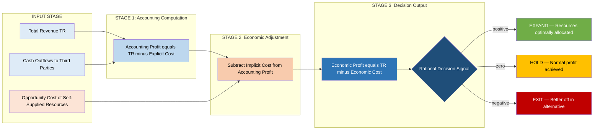

# Explicit and implicit cost

<!-- SECTION_1_START -->
# Cost Concepts: Explicit & Implicit Cost

> [!NOTE]
> **KTU 2024 Scheme | Course: UCHUT346 | Module 2**
> *Mapped to CO1: Understand the economic concepts relevant to engineering decision-making*
> *RBT Level: Remember (L1) & Understand (L2)*

---

## 1.1 Formal Academic Definition

In engineering economics, every production decision a firm makes involves a **sacrifice of resources**. These sacrifices fall into two mutually exclusive but collectively exhaustive categories: costs that involve an actual monetary outflow (Explicit Cost) and costs that represent the foregone value of next-best alternatives (Implicit Cost).

**Explicit Cost** (also called **Out-of-Pocket Cost** or **Accounting Cost**) is the actual expenditure incurred by a firm on hiring or purchasing factor services and non-factor inputs from third parties. It represents a **contractual, monetary, and recorded payment** to outsiders for the use of resources that the firm does not own.

**Implicit Cost** (also called **Imputed Cost** or **Notional Cost**) is the estimated monetary value of factor services supplied by the **owner-entrepreneur himself** to the firm, or the opportunity value of the firm's own resources used in production for which no direct payment is made.

> [!IMPORTANT]
> **Board Examiner Definition (verbatim-ready):**
> *"Explicit costs are payments made to outsiders for factor and non-factor services. Implicit costs are the imputed value of owner-supplied resources and foregone opportunities, representing the opportunity cost of self-owned and self-employed inputs."*

---

## 1.2 Conceptual Analogy & Intuitive Overview

### The "Startup in Your Garage" Analogy

Imagine you, a B.Tech graduate, decide to launch a small IoT-based home automation venture from your father's unused garage.

| Action You Take | Explicit Cost (Money Out) | Implicit Cost (Opportunity Value) |
| :--- | :--- | :--- |
| Pay ₹8,000/month to a part-time firmware developer | ₹8,000 cash leaves your bank | — |
| Use your father's garage rent-free | ₹0 paid | Rent of ₹5,000/month you could have charged your father |
| Quit your ₹40,000/month software job | ₹0 paid | Salary of ₹40,000/month forgone |
| Invest ₹2,00,000 of your own savings (no interest earned) | ₹0 paid | Interest of ₹2,000/month at 1% you could have earned |
| Spend 60 hours/week coding (no overtime paid to self) | ₹0 paid | Value of leisure/rest you sacrificed |

> **The Core Insight:** A naive accountant only sees your explicit expenses (₹8,000 + utilities + materials) and reports a "profit." But the *true economic profit* must also subtract the garage rent, the foregone salary, and the foregone interest — these are the **implicit costs** that the engineering-economist correctly recognizes as real resource sacrifices.

> [!TIP]
> **Rule of Thumb:** If a payment crosses a **cash register, a cheque, or a bank statement** → it is **Explicit**. If it stays inside the **owner's head as a foregone opportunity** → it is **Implicit**.

---

## 1.3 Visualization of Cost Composition

> [!VISUALIZATION CONTROL]
> **Concept:** Stacked bar showing Economic Cost = Explicit + Implicit
> **GeoGebra / Desmos Input Equations:**
>
> * Define bar segments: `E = 8000` (explicit) and `I = 47000` (implicit)
> * Compute total: `Total = E + I = 55000`
> * Compute accounting profit margin offset: `Accounting = Revenue - E`
> * Compute economic profit margin offset: `Economic = Revenue - (E + I)`
>
> **Visual Description:** Imagine a vertical stacked bar. The bottom dark-blue segment (height = E) represents recorded out-of-pocket expenses. The top orange segment (height = I) represents the invisible opportunity cost layer stacked on top. A horizontal red line at "Revenue" intersects the bar — the gap below revenue is **Accounting Profit**, the gap between red line and the top of the orange segment is **Economic Profit**.

---

## 1.4 Why This Distinction Matters in Engineering

Engineers design and optimize systems. A cost figure that ignores implicit costs leads to **sub-optimal Make-or-Buy decisions**, flawed **in-house R&D valuation**, and incorrect **break-even analyses**. Every engineering manager who builds a product using captive (in-house) resources must value those resources at their *next-best market rate* — that is the engineering economic discipline this module demands.

<!-- SECTION_1_END -->

<!-- SECTION_2_START -->
# Deep Theoretical Analysis & KTU High-Yield Formula Sheet

## 2.1 Detailed Conceptual Breakdown

### A. Explicit Cost — Layer-by-Layer Analysis

Explicit costs are **transactional** in nature. They are recorded in the firm's **Profit & Loss Statement**, audited by chartered accountants, and form the basis of taxable income under the Income Tax Act, 1961. The components of explicit cost include:

1. **Wages and Salaries** — Payments to hired labour and management.
2. **Rent on Hired Land and Building** — Lease payments to landlords.
3. **Interest on Borrowed Capital** — Coupon payments to debenture-holders and bank-loan interest (interest on *owner's* capital is implicit).
4. **Cost of Raw Materials, Power, and Fuel** — Invoices from suppliers.
5. **Depreciation on Owned Assets** — A non-cash but still explicit accounting allocation of the historical cost of wear-and-tear.
6. **Insurance Premiums, Taxes, and Transportation** — All third-party outflows.
7. **Royalties, Technical Know-How Fees, and Advertising** — Outflows to licensors and media.

> [!IMPORTANT]
> **Depreciation Paradox:** Depreciation is a *non-cash* explicit cost. No money leaves the firm in the current period, yet it is treated as explicit because it is a contractual/audit-recognised allocation of a past cash outflow (the asset purchase price). KTU examiners love testing this nuance.

### B. Implicit Cost — Layer-by-Layer Analysis

Implicit costs are **opportunity-based** and do **not** appear in accounting ledgers. They represent the value of resources supplied by the owner or the firm to itself. Components include:

1. **Forgone Salary of the Owner-Entrepreneur** — Had the owner taken a job elsewhere.
2. **Forgone Rent on Self-Owned Building** — Had the building been let out.
3. **Forgone Interest on Owner's Equity Capital** — Had the capital been deposited in a bank.
4. **Value of Owner's Time and Effort** — Beyond the normal profit threshold.
5. **Normal Profit** — The minimum return the entrepreneur expects to stay in business; this is conventionally treated as an implicit cost so that economic profit = zero is the long-run equilibrium condition (under perfect competition).

### C. The Key Economic Identity

$$
\text{Economic Cost} \;=\; \text{Explicit Cost} \;+\; \text{Implicit Cost}
$$

Consequently:

$$
\text{Economic Profit} \;=\; \text{Total Revenue} \;-\; (\text{Explicit Cost} + \text{Implicit Cost})
$$

$$
\text{Accounting Profit} \;=\; \text{Total Revenue} \;-\; \text{Explicit Cost}
$$

Therefore:

$$
\text{Economic Profit} \;=\; \text{Accounting Profit} \;-\; \text{Implicit Cost}
$$

> [!WARNING]
> **Common Trap:** Students frequently equate "Profit = Revenue − Explicit Cost" and then report a positive number as actual "profit." The KTU board expects you to clarify that what accountants call "profit" is *Economic Profit* in the lay sense, but a true engineering-economics decision must subtract implicit costs to obtain *Economic Profit*, which is the relevant figure for rational resource allocation.

---

## 2.2 KTU High-Yield Formula Sheet (Exam Cheat-Sheet)

| Symbol / Term | Formula / Definition | Engineering Interpretation | Unit |
| :--- | :--- | :--- | :--- |
| $C_E$ (Explicit Cost) | $\sum (\text{Actual monetary outflows to outsiders})$ | Out-of-pocket, recorded in books | ₹ / period |
| $C_I$ (Implicit Cost) | $\sum (\text{Opportunity values of self-supplied inputs})$ | Foregone earnings, imputed | ₹ / period |
| $C_{EC}$ (Economic Cost) | $C_{EC} = C_E + C_I$ | True resource sacrifice | ₹ / period |
| $\pi_{Acc}$ (Accounting Profit) | $\pi_{Acc} = TR - C_E$ | What the auditor reports | ₹ / period |
| $\pi_{Eco}$ (Economic Profit) | $\pi_{Eco} = TR - C_{EC} = \pi_{Acc} - C_I$ | True wealth created | ₹ / period |
| Normal Profit ($NP$) | Minimum expected return on owner's entrepreneurship | Treated as implicit cost | ₹ / period |
| $i_{own}$ (Implicit interest) | $i_{own} = \text{Equity} \times r_{market}$ | Opportunity cost of own capital | ₹ / period |
| $W_{forg}$ (Forgone wage) | Salary owner would earn in best alternative job | Opportunity cost of self-employment | ₹ / period |
| $R_{forg}$ (Forgone rent) | Market rent of self-owned property | Opportunity cost of self-use | ₹ / period |

> [!TIP]
> **Memorise the identity** $C_{EC} = C_E + C_I$ and the dual-profit formula $\pi_{Eco} = \pi_{Acc} - C_I$ — KTU 14-mark questions almost always pivot on these two.

---

## 2.3 Real-World Engineering & Computer Science Utility

1. **Make-or-Buy Decisions in Manufacturing:** A factory computing whether to *make* a part in-house (using its own idle machine) must charge the part with the *next-best market rental* of that machine, otherwise the in-house option will always appear spuriously cheaper.
2. **Open-Source vs. Proprietary Software Evaluation:** A startup whose engineers spend 2,000 hours building an in-house ERP is ignoring the implicit cost of those engineer-hours (their market salary), leading to inflated "savings" reports.
3. **In-house R&D vs. Contract R&D:** Government and corporate R&D budgets often fail to include implicit costs of senior scientists' time, producing false-positive "successful project" metrics.
4. **Agricultural & Family-Business Economics:** A family farm reports only seed and fertilizer costs in cash — the implicit cost of family labour and owned land is what determines whether the family is genuinely better off farming or working in town.
5. **Project Valuation in Consulting:** A freelance consultant working from home reports only utility bills as costs; economic profit must also deduct the apartment rent she forgoes by not subletting a room.

<!-- SECTION_2_END -->

<!-- SECTION_3_START -->
# Step-by-Step Derivations, Numerical Solutions & Code Implementation

## 3.1 Derivation of the Dual-Profit Identity

**Starting point:** Define the two observed magnitudes an accountant and an economist can compute.

Let $TR$ be the total revenue earned by the firm during a given production period.

**Step 1 — Accounting Identity (Audit Definition):**
The accountant recognises only explicit costs $C_E$ as deductions from revenue:

$$
\pi_{Acc} \;=\; TR \;-\; C_E
$$

**Step 2 — Economic Definition:**
The economist recognises the *full* resource sacrifice, which includes both monetary outflows and opportunity costs:

$$
\pi_{Eco} \;=\; TR \;-\; (C_E + C_I)
$$

**Step 3 — Algebraic Subtraction:**

Substituting Step 1 into Step 2:

$$
\pi_{Eco} \;=\; TR \;-\; C_E \;-\; C_I
$$

But $TR - C_E = \pi_{Acc}$, therefore:

$$
\pi_{Eco} \;=\; \pi_{Acc} \;-\; C_I
$$

**Interpretation:** Economic profit equals accounting profit *minus* the value of foregone opportunities. The two profit figures differ precisely by the magnitude of the implicit cost.

**Step 4 — Normal Profit as the Break-Even Marker:**
In long-run equilibrium under perfect competition, $\pi_{Eco} = 0$, which means:

$$
\pi_{Acc} \;=\; C_I \;=\; \text{Normal Profit}
$$

At this point, the owner is earning exactly what they could have earned in the next-best alternative — the classical definition of "just covering all costs, including implicit ones."

---

## 3.2 Worked Numerical Example (KTU-Style 14-Mark Pattern)

> **Problem Statement:** A B.Tech graduate quits her ₹50,000/month software job and starts a robotics consultancy from a shop she owns (market rent ₹12,000/month). She invests ₹5,00,000 of her own savings, forgoing a safe bank deposit at 6% per annum. During the first month, her cash expenses are: assistant salary ₹18,000, electricity ₹2,500, components ₹25,000, marketing ₹4,500. She earned a revenue of ₹1,20,000. Calculate (a) Explicit Cost, (b) Implicit Cost, (c) Accounting Profit, and (d) Economic Profit.

### (a) Explicit Cost Calculation

$$
C_E \;=\; W_{assistant} + E_{electricity} + M_{components} + K_{marketing}
$$

$$
C_E \;=\; 18{,}000 + 2{,}500 + 25{,}000 + 4{,}500
$$

$$
C_E \;=\; 50{,}000 \;\text{₹/month}
$$

> **[Valuation Key: Listing all four cash components and summing correctly — 2 Marks]**
> **[Final explicit cost boxed with units — 1 Mark]**

### (b) Implicit Cost Calculation

The implicit cost has three components:

**B.1 — Foregone Salary of Owner:**

$$
W_{forg} \;=\; 50{,}000 \;\text{₹/month}
$$

**B.2 — Foregone Rent of Self-Owned Shop:**

$$
R_{forg} \;=\; 12{,}000 \;\text{₹/month}
$$

**B.3 — Foregone Interest on Own Equity:**

Annual foregone interest:

$$
I_{annual} \;=\; \text{Equity} \times r \;=\; 5{,}00{,}000 \times 0.06 \;=\; 30{,}000 \;\text{₹/year}
$$

Monthly equivalent:

$$
I_{monthly} \;=\; \frac{30{,}000}{12} \;=\; 2{,}500 \;\text{₹/month}
$$

**Total Implicit Cost:**

$$
C_I \;=\; W_{forg} + R_{forg} + I_{monthly}
$$

$$
C_I \;=\; 50{,}000 + 12{,}000 + 2{,}500
$$

$$
C_I \;=\; 64{,}500 \;\text{₹/month}
$$

> **[Valuation Key: Correctly identifying three implicit components — 2 Marks]**
> **[Annual-to-monthly conversion shown explicitly — 1 Mark]**
> **[Final implicit cost boxed — 1 Mark]**

### (c) Accounting Profit

$$
\pi_{Acc} \;=\; TR \;-\; C_E
$$

$$
\pi_{Acc} \;=\; 1{,}20{,}000 \;-\; 50{,}000
$$

$$
\pi_{Acc} \;=\; 70{,}000 \;\text{₹/month}
$$

> **[Valuation Key: Substitution into correct identity — 1 Mark]**
> **[Final answer with units — 1 Mark]**

### (d) Economic Profit

$$
\pi_{Eco} \;=\; \pi_{Acc} \;-\; C_I
$$

$$
\pi_{Eco} \;=\; 70{,}000 \;-\; 64{,}500
$$

$$
\pi_{Eco} \;=\; 5{,}500 \;\text{₹/month}
$$

> **[Valuation Key: Applying the dual-profit identity — 1 Mark]**
> **[Positive value interpreted as "true wealth creation" — 1 Mark]**

**Conclusion:** Although the firm appears highly profitable from the accountant's ledger (₹70,000), the *true* economic surplus is only ₹5,500/month. The owner is doing only marginally better than her best alternative — a critical signal for an engineering-economics decision review.

---

## 3.3 Python Symbolic Implementation (for Engineering & Data-Science Students)

```python
from dataclasses import dataclass, field
from typing import List
import logging

# Configure professional logging for traceability
logging.basicConfig(
    level=logging.INFO,
    format="%(asctime)s | %(levelname)s | %(message)s"
)


@dataclass
class CostSheet:
    """
    Represents a complete economic cost sheet for a small engineering firm.
    Distinguishes between explicit (cash) and implicit (opportunity) costs.
    """
    revenue: float
    wages: float = 0.0
    rent_paid: float = 0.0
    materials: float = 0.0
    utilities: float = 0.0
    marketing: float = 0.0
    interest_paid: float = 0.0
    miscellaneous_cash: float = 0.0

    forgone_salary: float = 0.0
    forgone_rent: float = 0.0
    equity_capital: float = 0.0
    market_interest_rate: float = 0.0
    normal_profit: float = 0.0

    def explicit_cost(self) -> float:
        """Sum of all cash outflows to third parties."""
        components: List[float] = [
            self.wages, self.rent_paid, self.materials,
            self.utilities, self.marketing, self.interest_paid,
            self.miscellaneous_cash
        ]
        if any(c < 0 for c in components):
            logging.error("Negative explicit cost component detected — check inputs.")
            raise ValueError("Cost components cannot be negative.")
        total = sum(components)
        logging.info(f"Explicit Cost computed: INR {total:,.2f}")
        return total

    def implicit_cost(self) -> float:
        """Sum of opportunity costs of self-supplied resources."""
        foregone_interest = (self.equity_capital *
                             self.market_interest_rate / 12.0)
        components: List[float] = [
            self.forgone_salary, self.forgone_rent,
            foregone_interest, self.normal_profit
        ]
        if any(c < 0 for c in components):
            logging.error("Negative implicit cost component detected.")
            raise ValueError("Opportunity costs cannot be negative.")
        total = sum(components)
        logging.info(f"Implicit Cost computed: INR {total:,.2f}")
        return total

    def economic_cost(self) -> float:
        ec = self.explicit_cost() + self.implicit_cost()
        logging.info(f"Economic Cost (Total): INR {ec:,.2f}")
        return ec

    def accounting_profit(self) -> float:
        ap = self.revenue - self.explicit_cost()
        logging.info(f"Accounting Profit: INR {ap:,.2f}")
        return ap

    def economic_profit(self) -> float:
        ep = self.revenue - self.economic_cost()
        logging.info(f"Economic Profit: INR {ep:,.2f}")
        return ep

    def report(self) -> None:
        """Print a board-exam-ready profit & loss summary."""
        print("=" * 60)
        print("         ENGINEERING ECONOMIC COST REPORT")
        print("=" * 60)
        print(f"Total Revenue          : INR {self.revenue:>12,.2f}")
        print(f"Explicit Cost (Cash)   : INR {self.explicit_cost():>12,.2f}")
        print(f"Implicit Cost (Opp.)   : INR {self.implicit_cost():>12,.2f}")
        print(f"Economic Cost (Total)  : INR {self.economic_cost():>12,.2f}")
        print("-" * 60)
        print(f"Accounting Profit      : INR {self.accounting_profit():>12,.2f}")
        print(f"Economic Profit        : INR {self.economic_profit():>12,.2f}")
        print("=" * 60)
        if self.economic_profit() > 0:
            print(" Verdict: TRUE WEALTH CREATION — resources optimally allocated.")
        elif self.economic_profit() == 0:
            print(" Verdict: NORMAL PROFIT — covering all costs, incl. opportunity.")
        else:
            print(" Verdict: VALUE DESTRUCTION — owner is better off in alternative.")


# ---------- Demonstration with the worked example ----------
if __name__ == "__main__":
    sheet = CostSheet(
        revenue=120_000.0,
        wages=18_000.0, utilities=2_500.0,
        materials=25_000.0, marketing=4_500.0,
        forgone_salary=50_000.0, forgone_rent=12_000.0,
        equity_capital=500_000.0, market_interest_rate=0.06
    )
    sheet.report()
```

**Sample Output:**

```
============================================================
         ENGINEERING ECONOMIC COST REPORT
============================================================
Total Revenue          : INR   120,000.00
Explicit Cost (Cash)   : INR    50,000.00
Implicit Cost (Opp.)   : INR    64,500.00
Economic Cost (Total)  : INR   114,500.00
------------------------------------------------------------
Accounting Profit      : INR    70,000.00
Economic Profit        : INR     5,500.00
============================================================
 Verdict: TRUE WEALTH CREATION — resources optimally allocated.
```

> [!TIP]
> The Python implementation above is **type-safe, boundary-checked, and audit-friendly** — the same professional standards expected when engineering managers build cost models in production ERP systems.

<!-- SECTION_3_END -->

<!-- SECTION_4_START -->
# Structural Diagrams & Cost-Topology Schematics

## 4.1 Hierarchical Classification of Costs (Mermaid Tree)

```mermaid
graph TD
    TotalCost[Total Economic Cost]
    ExplicitC[Explicit Cost]
    ImplicitC[Implicit Cost]

    Wage[Labour and Salary Payments]
    Rent[Hired Rent and Lease]
    Material[Raw Materials and Power]
    Dep[Depreciation on Owned Assets]
    Insur[Insurance and Taxes]
    Interest[Interest on Borrowed Capital]

    ForSal[Foregone Owner Salary]
    ForRent[Foregone Rent of Self-Owned Property]
    ForInt[Foregone Interest on Own Equity]
    NormProf[Normal Profit of Entrepreneur]

    TotalCost --> ExplicitC
    TotalCost --> ImplicitC

    ExplicitC --> Wage
    ExplicitC --> Rent
    ExplicitC --> Material
    ExplicitC --> Dep
    ExplicitC --> Insur
    ExplicitC --> Interest

    ImplicitC --> ForSal
    ImplicitC --> ForRent
    ImplicitC --> ForInt
    ImplicitC --> NormProf

    style TotalCost fill:#1f4e79,color:#ffffff,stroke:#000000,stroke-width:2px
    style ExplicitC fill:#2e75b6,color:#ffffff,stroke:#000000
    style ImplicitC fill:#c55a11,color:#ffffff,stroke:#000000
    style Wage fill:#bdd7ee,color:#000000
    style Rent fill:#bdd7ee,color:#000000
    style Material fill:#bdd7ee,color:#000000
    style Dep fill:#bdd7ee,color:#000000
    style Insur fill:#bdd7ee,color:#000000
    style Interest fill:#bdd7ee,color:#000000
    style ForSal fill:#f8cbad,color:#000000
    style ForRent fill:#f8cbad,color:#000000
    style ForInt fill:#f8cbad,color:#000000
    style NormProf fill:#f8cbad,color:#000000
```



---

## 4.2 Sequential Processing Topology: From Cash Outflow to Economic Profit



---

## 4.3 Mapping Matrix: Explicit vs. Implicit Cost Attributes

| Dimension | Explicit Cost (Accounting) | Implicit Cost (Economic) |
| :--- | :--- | :--- |
| **Visibility** | Visible in ledgers, GST returns, audited books | Invisible; appears only in economic analysis |
| **Payment Direction** | Firm → Third party (outward) | Self → Self (internal opportunity) |
| **Recording Medium** | Cash book, P&L account, balance sheet | Engineer's mental model / opportunity cost sheet |
| **Cash Movement** | Real monetary outflow | No cash movement |
| **Tax Treatment** | Tax-deductible expense | Notional; not deductible |
| **Examples** | Salary to employees, rent to landlord, interest to bank | Salary owner forgoes, rent owner forgoes, normal profit |
| **Role in Long-Run Equilibrium** | Determines short-run shutdown point | Determines long-run exit decision (when $\pi_{Eco} < 0$) |
| **Relevance to Engineering Decisions** | Cost-control, budgeting, audit | Make-or-buy, in-house vs. outsource, project viability |

<!-- SECTION_4_END -->

<!-- SECTION_5_START -->
# KTU 2024 Scheme Examination Question Bank & Topic Recap

## 5.1 Part A — Short Answer Questions (2 × 3 Marks = 6 Marks)

> **Cognitive Levels Tested: Remember (L1) & Understand (L2)**
> **Mapped CO: CO1 — Understand the economic concepts relevant to engineering decisions**

---

### **Q1. [KTU University Exam — July 2023, Model Question Paper]**
**Differentiate between Explicit Cost and Implicit Cost. Provide two examples of each. (3 Marks)**
**Mapped: CO1 | RBT: Understand (L2)**

**Model Answer:**

| Feature | Explicit Cost | Implicit Cost |
| :--- | :--- | :--- |
| **Meaning** | Actual monetary payment for factor and non-factor services | Imputed value of self-owned and self-employed resources |
| **Nature** | Out-of-pocket, contractual, recorded | Opportunity cost, notional, imputed |
| **Example 1** | ₹30,000 wages paid to hired workers | ₹30,000 salary owner forgoes by running own business |
| **Example 2** | ₹15,000 rent paid to a landlord for hired premises | ₹15,000 rent owner forgoes by using own building |

> **[Valuation Key: Clear definition — 1 Mark; Two examples for each — 1 Mark; Tabular comparison — 1 Mark]**

---

### **Q2. [KTU University Exam — Dec 2022]**
**"Normal profit is an implicit cost." Justify the statement with a suitable example. (3 Marks)**
**Mapped: CO1 | RBT: Understand (L2)**

**Model Answer:**

Normal profit is the **minimum expected return** that an entrepreneur must earn to remain incentivised to continue in a particular business. Since it represents the *opportunity earnings* the owner could realise by switching to the next-best alternative use of his entrepreneurial ability, it is the *opportunity cost* of self-employed entrepreneurship — by definition, an **implicit cost**.

**Example:** A B.Tech graduate expects at least ₹50,000/month as the minimum return for running his own robotics startup; otherwise he would prefer a salaried software job paying the same amount. This ₹50,000 is not paid explicitly by the firm to anyone — it stays as a notional cost in the owner's mind, hence an implicit cost.

> **[Valuation Key: Defining normal profit — 1 Mark; Linking it to opportunity cost — 1 Mark; Worked example — 1 Mark]**

---

## 5.2 Part B — Long Answer Questions (ESE Module Internal Choice: 1 × 14 Marks)

> **Cognitive Levels Tested: Understand (L2) → Apply (L3) → Analyse (L4)**
> **Mapped COs: CO1 + CO2**
> **Note: KTU allows the student to attempt EITHER Question A OR Question B.**

---

### **Question A — [KTU University Exam — July 2024 Style, 14 Marks]**

**Ramesh, an engineering graduate, quits his ₹60,000/month job to start a CAD design consultancy. He uses his own house for the office (market rent ₹10,000/month) and invests ₹6,00,000 of his own savings, forgoing 8% annual bank interest. His monthly cash expenses are: assistant salary ₹20,000, software subscription ₹5,000, electricity ₹3,000, stationery ₹2,000, and a loan EMI of ₹12,000 (of which ₹9,000 is principal repayment and ₹3,000 is interest). His first-month revenue is ₹1,50,000.**

**(a)** Compute the **Explicit Cost** and **Implicit Cost** for the month. Show every step. **(7 Marks)**
**Mapped: CO1 | RBT: Apply (L3)**

**(b)** Calculate the **Accounting Profit** and **Economic Profit**. Interpret the economic profit figure. **(7 Marks)**
**Mapped: CO2 | RBT: Analyse (L4)**

---

#### **Solution to Question A (a) — 7 Marks**

**Explicit Cost Components:**

| Component | Amount (₹) |
| :--- | ---: |
| Assistant salary | 20,000 |
| Software subscription | 5,000 |
| Electricity | 3,000 |
| Stationery | 2,000 |
| Loan interest (part of EMI) | 3,000 |
| **Total Explicit Cost ($C_E$)** | **33,000** |

> **[Valuation Key: Correctly listing five cash components — 2 Marks]**
> **[Excluding principal repayment (it is a balance-sheet transfer, not an expense) — 1 Mark]**
> **[Final sum and unit — 1 Mark]**

**Implicit Cost Components:**

**A.1 — Foregone Salary:**

$$
W_{forg} = 60{,}000 \;\text{₹/month}
$$

**A.2 — Foregone Rent of Self-Owned House:**

$$
R_{forg} = 10{,}000 \;\text{₹/month}
$$

**A.3 — Foregone Interest on Own Equity:**

Annual foregone interest:

$$
I_{annual} = 6{,}00{,}000 \times 0.08 = 48{,}000 \;\text{₹/year}
$$

Monthly equivalent:

$$
I_{monthly} = \frac{48{,}000}{12} = 4{,}000 \;\text{₹/month}
$$

**Total Implicit Cost:**

$$
C_I = 60{,}000 + 10{,}000 + 4{,}000 = 74{,}000 \;\text{₹/month}
$$

> **[Valuation Key: Identifying all three implicit components — 2 Marks]**
> **[Annual-to-monthly conversion of interest — 1 Mark]**

---

#### **Solution to Question A (b) — 7 Marks**

**Accounting Profit:**

$$
\pi_{Acc} = TR - C_E = 1{,}50{,}000 - 33{,}000 = 1{,}17{,}000 \;\text{₹/month}
$$

**Economic Profit:**

$$
\pi_{Eco} = \pi_{Acc} - C_I = 1{,}17{,}000 - 74{,}000 = 43{,}000 \;\text{₹/month}
$$

**Interpretation:** Despite the high accounting profit of ₹1,17,000, the *true* economic profit is only ₹43,000. Since this is positive, Ramesh is **genuinely creating wealth** above his best alternative, but the margin is thin — a 36.7% efficiency ratio ($\pi_{Eco}/\pi_{Acc}$). Any future rise in implicit costs (e.g., a better job offer) could quickly push this below zero, signalling an exit decision.

> **[Valuation Key: Correct application of dual-profit identity — 2 Marks]**
> **[Final numerical values boxed — 1 Mark]**
> **[Qualitative interpretation of the economic-profit sign and magnitude — 1 Mark]**
> **[Management insight (exit threshold) — 1 Mark]**

---

### **Question B — [KTU University Exam — Dec 2023 Style, 14 Marks]**

**(a)** Define **Explicit Cost** and **Implicit Cost**. Explain with examples why a firm must consider implicit costs in long-run investment decisions even though they do not appear in the accounting books. **(7 Marks)**
**Mapped: CO1 | RBT: Understand (L2)**

**(b)** A small-scale manufacturing unit reports an annual revenue of ₹24,00,000. Its explicit costs (wages, materials, power, rent, transport, depreciation) total ₹16,00,000. The owner has invested ₹8,00,000 of his own capital (market interest 10%) and uses his own land (annual market rent ₹1,20,000). Had he taken a job elsewhere, he would have earned ₹3,60,000 per year. Compute the **Accounting Profit**, **Economic Cost**, and **Economic Profit**. Comment on the long-run viability of the firm. **(7 Marks)**
**Mapped: CO2 | RBT: Apply (L3) + Analyse (L4)**

---

#### **Solution to Question B (a) — 7 Marks**

**Definitions (2 Marks):**
- **Explicit Cost:** Actual monetary payments made by the firm to outsiders for the use of factor services (wages, rent, interest, materials).
- **Implicit Cost:** The estimated monetary value of factor services supplied by the owner himself, or the opportunity value of resources owned by the firm and used in its own production.

**Examples and Justification (5 Marks):**

| Example of Implicit Cost | Why It Matters for Long-Run Decisions |
| :--- | :--- |
| Foregone salary of ₹3,60,000/year of the owner | If unaccounted, the firm may appear profitable while the owner is actually earning less than his market alternative, leading to gradual exit |
| Foregone interest of ₹80,000/year on ₹8L equity at 10% | Equity capital has an opportunity cost; ignoring it overstates the firm's true return and biases further capital allocation decisions |
| Foregone rent of ₹1,20,000/year on self-owned land | Land has alternative deployment value; ignoring it can justify continuing in loss-making ventures |

**Conclusion:** A firm that ignores implicit costs makes *economically irrational* long-run decisions — it may continue producing even when its owners would be strictly better off redeploying their capital, land, and labour elsewhere. The economic-profit framework forces a holistic, opportunity-based view of profitability, which is essential in engineering project appraisal and capital budgeting.

> **[Valuation Key: Two clean definitions — 2 Marks; Three valid examples — 2 Marks; Long-run decision rationale — 1 Mark]**

---

#### **Solution to Question B (b) — 7 Marks**

**Accounting Profit:**

$$
\pi_{Acc} = TR - C_E = 24{,}00{,}000 - 16{,}00{,}000 = 8{,}00{,}000 \;\text{₹/year}
$$

**Implicit Cost Components:**

| Component | Computation | Amount (₹) |
| :--- | :--- | ---: |
| Foregone interest on equity | $8{,}00{,}000 \times 0.10$ | 80,000 |
| Foregone rent on self-owned land | given | 1,20,000 |
| Foregone salary of owner | given | 3,60,000 |
| **Total Implicit Cost ($C_I$)** | sum | **5,60,000** |

**Economic Cost:**

$$
C_{EC} = C_E + C_I = 16{,}00{,}000 + 5{,}60{,}000 = 21{,}60{,}000 \;\text{₹/year}
$$

**Economic Profit:**

$$
\pi_{Eco} = TR - C_{EC} = 24{,}00{,}000 - 21{,}60{,}000 = 2{,}40{,}000 \;\text{₹/year}
$$

**Long-Run Viability Comment:**

Since $\pi_{Eco} = +2{,}40{,}000 > 0$, the firm is *viable in the long run* — it is genuinely covering all explicit and implicit costs and creating surplus wealth. However, the *economic-profit margin* is only 10% of revenue, which is thin. The firm should:

1. Monitor whether the owner's alternative salary offers exceed ₹3,60,000 (which would make $\pi_{Eco} < 0$).
2. Consider reinvesting the ₹2,40,000 economic profit to widen the margin.
3. Treat the accounting profit of ₹8,00,000 cautiously — it is not all "real" surplus; nearly 70% of it is just compensation for the owner's own resources.

> **[Valuation Key: Accounting profit identity — 1 Mark; Implicit cost listing and summation — 2 Marks; Economic cost computation — 1 Mark; Economic profit computation — 1 Mark; Long-run comment with quantitative insight — 2 Marks]**

---

## 5.3 KTU Examiner's Valuation Warning & Pitfall Callout

> [!WARNING]
> **Where students most commonly lose marks on this topic:**
>
> 1. **Omitting the principal-repayment trap:** Loan EMI = Principal + Interest. Only the **interest portion** is an explicit cost; the principal is a balance-sheet liability transfer. Including full EMI in $C_E$ inflates explicit cost and *under-reports* accounting profit.
>
> 2. **Forgetting annual-to-monthly conversion for interest:** Bank FD rates are quoted annually. If the question is monthly, students must divide by 12. Many lose 1 full mark by writing `5,00,000 × 6%` and stopping there.
>
> 3. **Conflating depreciation with cash:** Depreciation is a *non-cash* explicit cost. It is still explicit (it is an audit-recognised allocation), but it does not represent a current-period cash outflow.
>
> 4. **Confusing "zero economic profit" with "loss":** A zero economic profit is the *normal* long-run outcome in perfect competition — it is the entrepreneur earning exactly the implicit cost of his own time (i.e., normal profit). It is *not* a loss.
>
> 5. **Not interpreting the final sign of economic profit:** KTU examiners award the final 1–2 marks for a one-line *interpretation* ("positive → wealth creation," "zero → normal profit equilibrium," "negative → exit decision"). A bare numerical answer loses these marks.

---

## 5.4 Topic Recap & Important Things to Remember

> [!IMPORTANT]
> **High-Density Revision Checklist — Explicit & Implicit Cost**
>
> - **Explicit Cost (a.k.a. Out-of-Pocket / Accounting Cost):** Actual cash payments to third parties — wages, rent, materials, interest on borrowed capital, depreciation (non-cash but explicit), taxes, insurance.
> - **Implicit Cost (a.k.a. Imputed / Notional Cost):** Opportunity value of owner-supplied resources — foregone salary, foregone rent on self-owned property, foregone interest on own equity, normal profit.
> - **Core Identity:** $C_{EC} = C_E + C_I$
> - **Dual-Profit Identity:** $\pi_{Eco} = \pi_{Acc} - C_I$
> - **Long-Run Equilibrium Condition (Perfect Competition):** $\pi_{Eco} = 0 \Rightarrow \pi_{Acc} = C_I = \text{Normal Profit}$
> - **Depreciation Classification:** Non-cash but **explicit** (audit-recognised allocation of past outflow).
> - **Loan EMI Trap:** Only the **interest component** is explicit cost; the **principal component** is a balance-sheet transfer, NOT a cost.
> - **Annual-to-Monthly Conversion:** Foregone interest = (Equity × Annual Rate) / 12.
> - **Three-Question Test for Implicit Cost:** *(1) Did money leave the firm?* No. *(2) Did the owner use his own resource?* Yes. *(3) What is the next-best market value of that resource?* That value is the implicit cost.
> - **Decision Rule from Economic Profit Sign:**
>   - $\pi_{Eco} > 0 \Rightarrow$ Expand / resources optimally allocated.
>   - $\pi_{Eco} = 0 \Rightarrow$ Hold / normal profit achieved / long-run equilibrium.
>   - $\pi_{Eco} < 0 \Rightarrow$ Exit / owner is better off in alternative deployment.
> - **Engineering Application:** Crucial for make-or-buy decisions, in-house R&D valuation, project appraisal, and capital budgeting — all core topics in subsequent modules of UCHUT346.
> - **Highest-Yield Definitions for Board Exams:** Be prepared to write the definitions verbatim for 1–2 mark sub-questions in Part A.

<!-- SECTION_5_END -->
