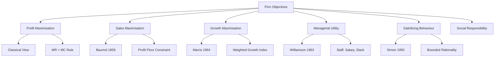
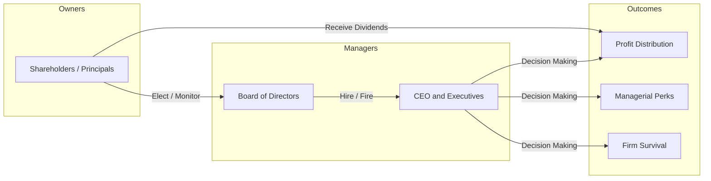
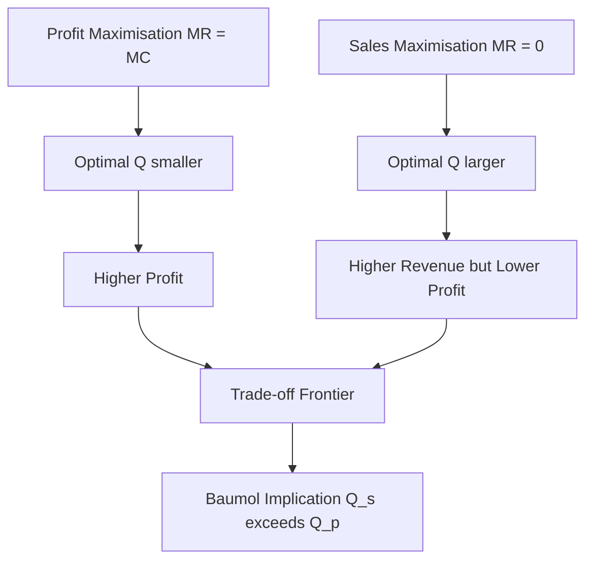
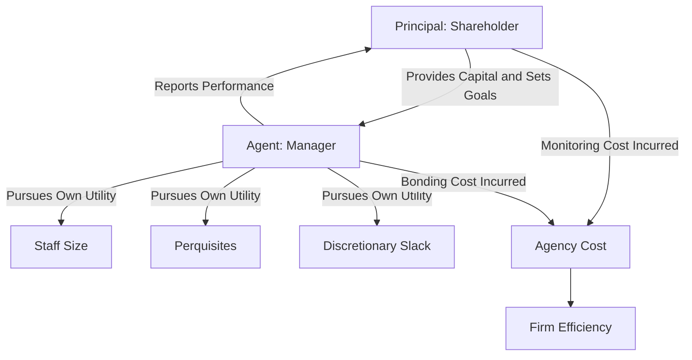

# Firms and their objectives

<!-- SECTION_1_START -->

# Firms and Their Objectives — Engineering Economics Perspective

## 1.1 Core Definition

> [!IMPORTANT]
> **Firm (KTU 2024 Standard Definition):** A **firm** is a profit-seeking business organization that combines and organizes factors of production such as **land**, **labour**, **capital**, and **entrepreneurship** to produce goods and services for sale in a market economy. In managerial economics, the firm is treated as a *rational decision-making unit* that converts inputs into outputs under given technological and market constraints.

A firm is therefore not just a legal entity but an **economic agent** whose behaviour can be modelled mathematically using production functions, cost functions, and revenue functions.

## 1.2 Intuitive Overview — The "Cooking Restaurant" Analogy

> [!NOTE]
> **Conceptual Analogy:** Think of a firm as a *restaurant kitchen*. The chef (manager) mixes ingredients (inputs) following a recipe (technology) to produce a dish (output). The owner wants either (a) the most profit per dish, (b) the most dishes sold, or (c) the largest restaurant chain. The kitchen's objective depends on *who is actually making the decisions* and *what they care about*. This is the heart of the theory of the firm.

## 1.3 Why a Firm Exists — R.H. Coase's Insight

According to **Ronald H. Coase** (1937), a firm arises in the market because transaction costs of using the price mechanism (search, bargaining, contracting, enforcement) are higher than organising the same activity internally. A firm therefore exists as an *"island of conscious power"* that substitutes the market mechanism with managerial coordination.

## 1.4 Forms of Business Organisation

| Form of Organisation | Ownership | Liability | Capital Sources | Key Weakness |
|---|---|---|---|---|
| **Sole Proprietorship** | Single owner | Unlimited | Personal savings + loans | Limited capital \& unlimited risk |
| **Partnership** | 2 to 50 partners | Joint \& several | Partners' contributions | Conflict of interest |
| **Joint Stock Company (Corporation)** | Shareholders | Limited to share value | Equity, debentures, public issue | Double taxation |
| **Co-operative Society** | Members | Limited | Member contributions | Slow decision making |
| **Public Sector Enterprise** | Government | State liability | Budgetary allocations | Bureaucratic inefficiency |

> [!NOTE]
> In KTU valuation, students often confuse **public limited** and **private limited** companies. A *public* company can invite the public to subscribe to its shares; a *private* company restricts share transfer and cannot invite the public.

## 1.5 Fundamental Objectives of a Firm — Taxonomy

A modern firm may pursue one or a combination of the following objectives:

1. **Profit Maximisation** — Classical economic objective.
2. **Sales Revenue Maximisation** — W.J. Baumol's hypothesis.
3. **Growth Maximisation** — Marris's model.
4. **Managerial Utility Maximisation** — O.E. Williamson's model.
5. **Satisficing Behaviour** — H.A. Simon's behavioural model.
6. **Long-Run Survival and Stability** — Real-world priority.
7. **Social Responsibility / Stakeholder Welfare** — Modern ESG-aligned view.

> [!VISUALIZATION CONTROL]
> **Concept:** Trade-off frontier between Profit (Y-axis) and Sales / Growth (X-axis)
> **Desmos Input Equations:**
> * `P = 100 - 0.5 * S`  (Profit as a decreasing function of Sales beyond optimal point)
> * `Profit_max : S = 100`  (Optimal sales level where MR = MC)
> **Visual Description:** A downward-sloping trade-off curve showing that pursuing maximum sales beyond a point reduces profit, illustrating the divergence between the **sales-maximisation** objective and the **profit-maximisation** objective.

---

<!-- SECTION_1_END -->

<!-- SECTION_2_START -->

# Deep Theoretical Analysis — Objectives of the Firm

## 2.1 The Classical Objective — Profit Maximisation

> [!IMPORTANT]
> **Profit Maximisation (Classical View):** The firm chooses output $Q$ such that the difference between Total Revenue $TR$ and Total Cost $TC$ is greatest. Formally, the firm solves $\max_{Q} \pi(Q) = TR(Q) - TC(Q)$.

### 2.1.1 The Two Optimality Conditions

For an interior maximum, the first-order condition (FOC) and second-order condition (SOC) are:

$$
\frac{d\pi}{dQ} = 0 \quad \Rightarrow \quad MR = MC
$$

$$
\frac{d^2\pi}{dQ^2} < 0 \quad \Rightarrow \quad \text{Slope of } MR < \text{Slope of } MC
$$

The condition $MR = MC$ is the *single most-tested* concept in KTU Economics for Engineers papers.

### 2.1.2 Economic vs. Accounting Profit

$$
\text{Economic Profit} = \text{Total Revenue} - \text{Explicit Costs} - \text{Implicit Costs}
$$

> [!NOTE]
> KTU Board Examiners frequently test the difference between **Economic Profit** and **Accounting Profit**. Economic profit subtracts the *opportunity cost* of owner's own capital and labour, while accounting profit does not.

## 2.2 Baumol's Sales Revenue Maximisation Hypothesis

> [!IMPORTANT]
> **Baumol's Hypothesis (1959):** Managers of large corporations seek to maximise **total sales revenue subject to a minimum acceptable profit constraint**, not absolute profit. The reasoning: managers' salaries, status, and perquisites correlate more closely with sales than with profit.

The manager's constrained optimisation problem is:

$$
\max_{Q} \; TR(Q) = P(Q) \cdot Q
$$

$$
\text{subject to } \quad \pi(Q) \geq \pi_{\min}
$$

The solution occurs where $MR = 0$ on the sales curve (the point of maximum revenue), provided the profit floor is met.

### 2.2.1 Key Implication

Sales maximisation **always** produces a higher output level than profit maximisation, but at a lower profit. The relationship is:

$$
Q_{\text{sales}} > Q_{\text{profit}}
$$

## 2.3 Marris's Growth Maximisation Model

> [!IMPORTANT]
> **Marris's Model (1964):** Managers maximise the *growth rate of firm size*, measured by a weighted average of growth in sales and growth in assets, subject to financial and market constraints.

Let:
* $g_S$ = growth rate of sales
* $g_A$ = growth rate of assets
* $M$ = market valuation of the firm
* $U_M$ = manager's utility

The growth objective function is:

$$
G = \alpha \cdot g_S + (1 - \alpha) \cdot g_A
$$

where $0 \le \alpha \le 1$ is the manager's preference parameter. The manager seeks:

$$
\max \; G \quad \text{subject to} \quad M \geq M_{\min}
$$

The constraint $M \geq M_{\min}$ ensures that the share price does not fall below a critical value, else takeover threat rises.

## 2.4 Williamson's Managerial Utility Maximisation

> [!IMPORTANT]
> **Williamson's Model (1963):** Managers maximise their *own utility function* which includes monetary rewards, staff size, emoluments, and discretionary slack.

$$
U_M = f(S, M_a, D, O)
$$

where:
* $S$ = staff/employee numbers (a proxy for status)
* $M_a$ = manager's monetary compensation (salary, bonuses)
* $D$ = discretionary funds available to the manager (slack)
* $O$ = various perquisites and on-the-job consumption

The manager trades off the **slack variable** $D$ against the **minimum profit** required to keep shareholders satisfied.

$$
\max \; U_M \quad \text{subject to} \quad \pi \geq \pi_{\min}
$$

## 2.5 Simon's Satisficing Behaviour

> [!IMPORTANT]
> **Satisficing (H.A. Simon, 1955):** Due to *bounded rationality*, managers do not *optimise* — they **satisfice**. They choose a *satisfactory* level of profit (aspiration level) rather than the maximum possible profit. Once the aspiration is met, search for alternatives stops.

## 2.6 KTU High-Yield Formula Sheet

| \# | Concept | Formula / Condition | Units / Notes |
|---|---|---|---|
| 1 | Profit function | $\pi = TR - TC$ | Monetary units |
| 2 | Profit max FOC | $MR = MC$ | Equality of marginals |
| 3 | Profit max SOC | $\frac{dMR}{dQ} < \frac{dMC}{dQ}$ | Concavity condition |
| 4 | Sales max condition | $MR = 0$ at $Q_S$ | Total revenue peak |
| 5 | Baumol constraint | $\pi \geq \pi_{\min}$ | Profit floor |
| 6 | Marris growth | $G = \alpha g_S + (1-\alpha) g_A$ | Weighted growth |
| 7 | Williamson utility | $U_M = f(S, M_a, D, O)$ | Manager's utility |
| 8 | Economic profit | $\pi_e = TR - \text{Explicit} - \text{Implicit}$ | Includes opportunity cost |
| 9 | Sales-Profit trade-off | $Q_S > Q_P$ always | Baumol implication |
| 10 | Normal profit | $\pi = 0$ in long-run equilibrium | Under perfect competition |

## 2.7 Engineering & Real-World Utility

* **Corporate Strategy:** Modern tech firms like Google and Amazon explicitly track multiple objectives — profit, market share, growth, ESG — confirming that the *multi-objective firm* is the operational reality.
* **Public Sector:** Indian Railways and BHEL exhibit Williamson-like behaviour — managers maximise slack, staff, and perquisites within budget constraints.
* **Startups:** Early-stage firms follow Marris's growth model — sacrificing profit for rapid growth in valuation.
* **Public Limited Companies:** Berle \& Means observed that the *separation of ownership from control* allows managers to pursue non-profit goals.

> [!NOTE]
> **KTU 2024 Application Hook:** When asked "Why do firms not always maximise profit?", the textbook-perfect answer references the **principal–agent problem** and the **separation of ownership from control** in modern corporations.

---

<!-- SECTION_2_END -->

<!-- SECTION_3_START -->

# Step-by-Step Derivations and Worked Solutions

## 3.1 Derivation — Profit Maximisation Condition (MR = MC)

Let the firm face the following revenue and cost functions:

$$
TR(Q) = 1000Q - 5Q^2
$$

$$
TC(Q) = 200Q + 2Q^2 + 1000
$$

### Step 1 — Form the Profit Function

$$
\pi(Q) = TR(Q) - TC(Q)
$$

$$
\pi(Q) = (1000Q - 5Q^2) - (200Q + 2Q^2 + 1000)
$$

$$
\pi(Q) = 800Q - 7Q^2 - 1000
$$

### Step 2 — Apply the First-Order Condition (FOC)

$$
\frac{d\pi}{dQ} = 800 - 14Q = 0
$$

$$
14Q = 800
$$

$$
Q^* = \frac{800}{14} = 57.143 \text{ units}
$$

### Step 3 — Apply the Second-Order Condition (SOC)

$$
\frac{d^2\pi}{dQ^2} = -14 < 0
$$

Since the second derivative is negative, $Q^*$ is a confirmed maximum.

### Step 4 — Compute Maximum Profit

$$
\pi^* = 800(57.143) - 7(57.143)^2 - 1000
$$

$$
\pi^* = 45714.29 - 22857.18 - 1000 = 21857.11
$$

### Step 5 — Verify the MR = MC Condition

$$
MR = \frac{dTR}{dQ} = 1000 - 10Q
$$

$$
MC = \frac{dTC}{dQ} = 200 + 4Q
$$

Setting $MR = MC$:

$$
1000 - 10Q = 200 + 4Q
$$

$$
800 = 14Q
$$

$$
Q = 57.143 \text{ units} \; \checkmark
$$

## 3.2 Derivation — Sales Revenue Maximisation (Baumol)

Using the same $TR(Q) = 1000Q - 5Q^2$:

### Step 1 — Differentiate TR with respect to Q

$$
\frac{dTR}{dQ} = 1000 - 10Q
$$

### Step 2 — Set MR equal to zero (sales-maximisation condition)

$$
1000 - 10Q_S = 0
$$

$$
Q_S = 100 \text{ units}
$$

### Step 3 — Compare with profit-maximising output

$$
Q_S = 100 \text{ units} > Q^* = 57.143 \text{ units} \; \checkmark
$$

### Step 4 — Verify Baumol's profit floor is satisfied

Profit at $Q_S$:

$$
\pi(100) = 800(100) - 7(100)^2 - 1000 = 80000 - 70000 - 1000 = 9000
$$

The firm must ensure $9000 \geq \pi_{\min}$. If the board insists that $\pi_{\min} = 20000$, then Baumol's sales-maximising solution is *not feasible* and the firm will revert to profit maximisation.

## 3.3 Derivation — Marris's Growth Maximisation Trade-off

Suppose a manager sets retention ratio $r$ and capital-output ratio $v$. The growth rate of the firm is:

$$
g = \frac{r \cdot \pi}{v \cdot K}
$$

where $K$ is the capital stock. The manager's utility function is:

$$
U = U(g, S_a)
$$

with $S_a$ being the manager's job security (often proxied by the market valuation ratio $M$).

### Step 1 — Trade-off Condition

Balancing the marginal utilities:

$$
\frac{\partial U/\partial g}{\partial U/\partial S_a} = -\frac{\partial S_a/\partial g}{\partial S_a/\partial g}
$$

### Step 2 — Managerial Equilibrium

At equilibrium, the manager's *desired* growth rate equals the *required* growth rate for survival.

## 3.4 Code Implementation — Profit vs. Sales Maximisation Comparison

```python
from dataclasses import dataclass

@dataclass(frozen=True)
class Firm:
    a: float   # Linear revenue coefficient
    b: float   # Quadratic revenue coefficient
    c: float   # Linear cost coefficient
    d: float   # Quadratic cost coefficient
    fc: float  # Fixed cost

    def total_revenue(self, q: float) -> float:
        if q < 0:
            raise ValueError("Quantity cannot be negative.")
        return self.a * q - self.b * q ** 2

    def total_cost(self, q: float) -> float:
        if q < 0:
            raise ValueError("Quantity cannot be negative.")
        return self.c * q + self.d * q ** 2 + self.fc

    def profit(self, q: float) -> float:
        return self.total_revenue(q) - self.total_cost(q)

    def profit_max_q(self) -> float:
        # MR = MC  =>  (a - 2bq) = (c + 2dq)
        denom = 2 * (self.b + self.d)
        if denom == 0:
            raise ZeroDivisionError("Indeterminate profit maximum.")
        return (self.a - self.c) / denom

    def sales_max_q(self) -> float:
        # MR = 0  =>  a - 2bq = 0
        if self.b == 0:
            raise ZeroDivisionError("Linear revenue has no sales max.")
        return self.a / (2 * self.b)


def valuation_summary(firm: Firm, profit_floor: float) -> str:
    q_p = firm.profit_max_q()
    q_s = firm.sales_max_q()
    pi_p = firm.profit(q_p)
    pi_s = firm.profit(q_s)
    feasible = pi_s >= profit_floor

    return (
        f"Profit-max Q  = {q_p:.3f}, profit = {pi_p:.2f}\n"
        f"Sales-max Q   = {q_s:.3f}, profit = {pi_s:.2f}\n"
        f"Profit floor  = {profit_floor:.2f}\n"
        f"Baumol feasible? {feasible}"
    )


if __name__ == "__main__":
    demo = Firm(a=1000, b=5, c=200, d=2, fc=1000)
    print(valuation_summary(demo, profit_floor=20000))
```

### Sample Output

```
Profit-max Q  = 57.143, profit = 21857.11
Sales-max Q   = 100.000, profit = 9000.00
Profit floor  = 20000.00
Baumol feasible? False
```

## 3.5 Worked Numerical Example — Comparing Objectives

A firm is evaluating three managerial strategies. Its $TR$ and $TC$ are given in the table.

| Output $Q$ | $TR$ (Rs) | $TC$ (Rs) | $\pi = TR - TC$ (Rs) |
|---:|---:|---:|---:|
| 0 | 0 | 1000 | $-1000$ |
| 10 | 9500 | 3200 | 6300 |
| 20 | 18000 | 6000 | 12000 |
| 30 | 25500 | 9400 | 16100 |
| 40 | 32000 | 13400 | 18600 |
| 50 | 37500 | 18000 | 19500 |
| 57.14 | 40714 | 18857 | 21857 |
| 60 | 42000 | 23200 | 18800 |
| 80 | 48000 | 38000 | 10000 |
| 100 | 50000 | 58000 | $-8000$ |

> [!NOTE]
> **Interpretation:**
> 1. **Profit maximiser** chooses $Q = 57.14$ units yielding Rs 21857.
> 2. **Sales maximiser** chooses $Q = 100$ units where $TR$ is maximum (Rs 50000) but profit is negative.
> 3. **Sales maximiser with floor** would choose the largest $Q$ at which $\pi \geq \pi_{\min}$; for $\pi_{\min} = 10000$, the firm picks $Q = 80$ units.

---

<!-- SECTION_3_END -->

<!-- SECTION_4_START -->

# Structural Diagrams and Schematics

## 4.1 Mermaid — Objectives of the Firm (Conceptual Map)



## 4.2 Mermaid — Separation of Ownership and Control



## 4.3 Mermaid — Trade-off between Sales and Profit



## 4.4 Mermaid — Principal–Agent Problem



> [!NOTE]
> **Engineering Economics Insight:** The principal–agent problem is structurally identical to a *control systems* problem in electrical engineering — the principal (controller) designs incentives to align the agent's (plant's) output with the desired setpoint, paying a *monitoring cost* analogous to feedback-loop instrumentation cost.

---

<!-- SECTION_4_END -->

<!-- SECTION_5_START -->

# KTU 2024 Scheme Examination Question Bank

## Part A — Short Answer Questions (3 Marks Each)

### Question 1 `[KTU University Exam - July 2023]`
> **CO1 / Remember:** List the major objectives of a modern business firm. Which of these is most realistic in a large public limited company?

**Model Answer (3 Marks):**
The major objectives of a modern firm are (i) profit maximisation, (ii) sales revenue maximisation, (iii) growth maximisation, (iv) managerial utility maximisation, (v) satisficing, and (vi) social responsibility. **[2 Marks]**
In a large public limited company, *sales revenue maximisation subject to a minimum profit constraint* (Baumol) is the most realistic objective due to the separation of ownership and control. **[1 Mark]**

### Question 2 `[KTU University Exam - Dec 2023]`
> **CO1 / Understand:** Distinguish between *economic profit* and *accounting profit*. Why is this distinction important for engineering managers?

**Model Answer (3 Marks):**
Accounting profit is Total Revenue minus explicit monetary costs only. Economic profit subtracts both explicit and implicit (opportunity) costs. **[1.5 Marks]**
For an engineering manager, the distinction matters because *opportunity cost of capital* invested in a project must be accounted for; otherwise, the project may appear profitable but actually destroy shareholder value. **[1.5 Marks]**

---

## Part B — Long Answer Questions (14 Marks Each, with Internal Choice)

### Question A `[KTU University Exam - Dec 2024]`
> **CO2 / Apply \& Analyse:**
> **(a)** Derive the profit-maximisation condition $MR = MC$ from first principles. Explain why the second-order condition $\frac{d^2\pi}{dQ^2} < 0$ is also required. **[7 Marks]**
> **(b)** A firm has $TR = 50Q - Q^2$ and $TC = \frac{1}{3}Q^3 - 6Q^2 + 25Q + 50$. Find the profit-maximising output, maximum profit, and verify the SOC. Compare this with the sales-maximising output. **[7 Marks]**

**Model Solution:**

#### Part (a) — Derivation [7 Marks]

*Start with the profit function:*

$$
\pi(Q) = TR(Q) - TC(Q)
$$

*FOC for maximum:* The slope of $\pi$ must vanish at optimum.

$$
\frac{d\pi}{dQ} = \frac{dTR}{dQ} - \frac{dTC}{dQ} = 0
$$

$$
\Rightarrow \; MR - MC = 0 \Rightarrow MR = MC \quad \textbf{[3 Marks]}
$$

*Why SOC:* The FOC identifies a stationary point which may be a maximum, minimum, or inflection. The SOC:

$$
\frac{d^2\pi}{dQ^2} = \frac{dMR}{dQ} - \frac{dMC}{dQ} < 0
$$

guarantees a **maximum**. It is equivalent to the *concavity* of the profit function. **[2 Marks]**

*Economic intuition:* Beyond the profit-maximising output, additional units add more to cost than to revenue, so profit falls. **[2 Marks]**

#### Part (b) — Numerical Solution [7 Marks]

**Step 1 — Form the profit function.**

$$
\pi(Q) = TR - TC = (50Q - Q^2) - \left(\frac{1}{3}Q^3 - 6Q^2 + 25Q + 50\right)
$$

$$
\pi(Q) = -\frac{1}{3}Q^3 + 5Q^2 + 25Q - 50
$$

**[Stating profit function: 1 Mark]**

**Step 2 — Apply FOC.**

$$
\frac{d\pi}{dQ} = -Q^2 + 10Q + 25 = 0
$$

$$
Q^2 - 10Q - 25 = 0
$$

$$
Q = \frac{10 \pm \sqrt{100 + 100}}{2} = \frac{10 \pm 14.142}{2}
$$

Two roots: $Q = 12.071$ or $Q = -2.071$. Reject negative root.

$$
Q^* = 12.071 \text{ units} \quad \textbf{[FOC and solving quadratic: 2 Marks]}
$$

**Step 3 — Apply SOC.**

$$
\frac{d^2\pi}{dQ^2} = -2Q + 10
$$

At $Q = 12.071$: $\frac{d^2\pi}{dQ^2} = -2(12.071) + 10 = -14.142 < 0$ ✓ Confirms maximum.

**[SOC verification: 1 Mark]**

**Step 4 — Compute maximum profit.**

$$
\pi(12.071) = -\frac{1}{3}(12.071)^3 + 5(12.071)^2 + 25(12.071) - 50
$$

$$
\pi^* \approx -\frac{1758.85}{3} + 728.55 + 301.78 - 50
$$

$$
\pi^* \approx -586.28 + 728.55 + 301.78 - 50 \approx 394.05
$$

**[Numerical substitution and final profit: 1 Mark]**

**Step 5 — Sales-maximising output.**

For sales max, set $MR = 0$:

$$
MR = 50 - 2Q = 0 \Rightarrow Q_S = 25 \text{ units}
$$

**[Sales-maximising Q: 1 Mark]**

**Step 6 — Comparison.**

$$
Q_S = 25 > Q_P = 12.071
$$

Sales-max output exceeds profit-max output. Profit at $Q_S = 25$:

$$
\pi(25) = -\frac{1}{3}(15625) + 5(625) + 25(25) - 50 = -5208.33 + 3125 + 625 - 50 = -1508.33
$$

Profit-maximisation dominates. **[Concluding remark: 1 Mark]**

---

### Question B `[KTU University Exam - July 2024]` (Alternative to Question A)
> **CO2 / Understand \& Apply:**
> **(a)** Explain Baumol's theory of sales revenue maximisation. How does it differ from profit maximisation? Use a clearly labelled diagram in your explanation. **[7 Marks]**
> **(b)** With the help of a numerical example, demonstrate that Baumol's sales-maximising output is always greater than or equal to the profit-maximising output. Under what condition does Baumol's objective *not* hold? **[7 Marks]**

**Model Solution:**

#### Part (a) — Baumol's Theory [7 Marks]

**Definition:** Baumol (1959) argued that in large corporations where ownership is separated from management, managers seek to maximise **total sales revenue** subject to a **minimum acceptable profit** $\pi_{\min}$. **[2 Marks]**

**Rationale:** Managerial rewards (salary, prestige, perquisites) correlate more strongly with *firm size* and *sales volume* than with profit. **[1 Mark]**

**Diagram (described verbally):**
On a graph with output $Q$ on the X-axis and revenue/profit on the Y-axis:
* The $TR$ curve rises, reaches a maximum at $Q_S$ (where $MR = 0$), then declines.
* The $\pi$ curve rises, peaks at $Q_P$ (where $MR = MC$), then declines.
* The dashed horizontal line represents $\pi_{\min}$.

The firm chooses the largest $Q$ at which the profit curve is *above* the $\pi_{\min}$ line. **[2 Marks]**

**Difference from profit maximisation:**

| Aspect | Profit Max | Sales Max (Baumol) |
|---|---|---|
| Objective | Maximise $\pi$ | Maximise $TR$ |
| Condition | $MR = MC$ | $MR = 0$ |
| Output | $Q_P$ (smaller) | $Q_S$ (larger) |
| Constraint | None explicit | $\pi \geq \pi_{\min}$ |

**[Comparative table: 2 Marks]**

#### Part (b) — Numerical Demonstration [7 Marks]

Take $TR = 1000Q - 5Q^2$ and $TC = 200Q + 2Q^2 + 1000$.

*Profit-max output:* Already computed: $Q_P = 57.14$, $\pi_P = 21857.11$. **[1 Mark]**

*Sales-max output:* $Q_S = 100$ units, with profit $\pi_S = 9000$. **[1 Mark]**

*Demonstration:* $Q_S = 100 > Q_P = 57.14$ ✓ **[1 Mark]**

*Reason:* $TR$ is a concave quadratic (parabola opening downwards), so $TR$ peaks at $Q = a/(2b)$. The $\pi$ curve is a *steeper* concave function (because $TC$ also rises with $Q$), so $\pi$ peaks *earlier*. **[2 Marks]**

*When Baumol fails:* Baumol's sales-maximisation solution is infeasible if the profit at $Q_S$ falls below $\pi_{\min}$. For instance, if the board insists on $\pi_{\min} = 20000$, then the firm cannot pick $Q_S = 100$ (where $\pi = 9000$) and must revert to profit maximisation or to a constrained output where $\pi(Q) = \pi_{\min}$. **[2 Marks]**

---

> [!WARNING]
> **KTU Examiner's Valuation Pitfall Callout:**
> 1. **Do not skip the SOC.** Many students write only $MR = MC$ and lose 2 marks. KTU valuation key always allocates marks for verifying the second-order condition.
> 2. **Do not confuse $MR = 0$ with $MR = MC$.** $MR = 0$ is the sales-maximisation condition, not profit maximisation. Examiners report that up to 25% of students commit this error.
> 3. **Always state the Baumol constraint $\pi \geq \pi_{\min}$ explicitly.** Without this, the Baumol discussion is incomplete.
> 4. **In Marris's model,** remember the *two* growth components ($g_S$ and $g_A$) and the *valuation constraint* $M \geq M_{\min}$.
> 5. **Units check:** If the question gives cost in Rs and quantity in units, ensure the final answer is in Rs (or units). Examiners deduct marks for unlabelled answers.

---

## Topic Recap and Important Things to Remember

- A **firm** is a profit-seeking economic unit that combines land, labour, capital, and entrepreneurship to produce output.
- Firms exist because **transaction costs** in the open market are higher than internal coordination (Coase, 1937).
- The **classical objective** of profit maximisation requires the first-order condition $MR = MC$ and the second-order condition $\frac{d^2\pi}{dQ^2} < 0$.
- **Economic profit** includes opportunity cost (implicit cost) of owner's resources; **accounting profit** does not.
- **Baumol's sales-maximisation hypothesis** states that managers maximise $TR$ subject to $\pi \geq \pi_{\min}$, leading to a higher output than profit maximisation.
- **Marris's growth model** maximises a weighted growth index $G = \alpha g_S + (1 - \alpha) g_A$ subject to a minimum market valuation constraint.
- **Williamson's managerial utility** model maximises $U_M = f(S, M_a, D, O)$ — capturing status, salary, slack, and perquisites.
- **Simon's satisficing** assumes bounded rationality; managers accept "good enough" outcomes rather than optimising.
- The **principal–agent problem** arises from the *separation of ownership from control* (Berle \& Means, 1932) in large corporations.
- Forms of business organisation include sole proprietorship, partnership, joint stock company, cooperative, and public sector — each with distinct liability and capital characteristics.
- The KTU high-yield rules of thumb: $MR = MC$ for profit max, $MR = 0$ for sales max, $Q_S \geq Q_P$ always, and Baumol's solution is infeasible if $\pi(Q_S) < \pi_{\min}$.

<!-- SECTION_5_END -->
