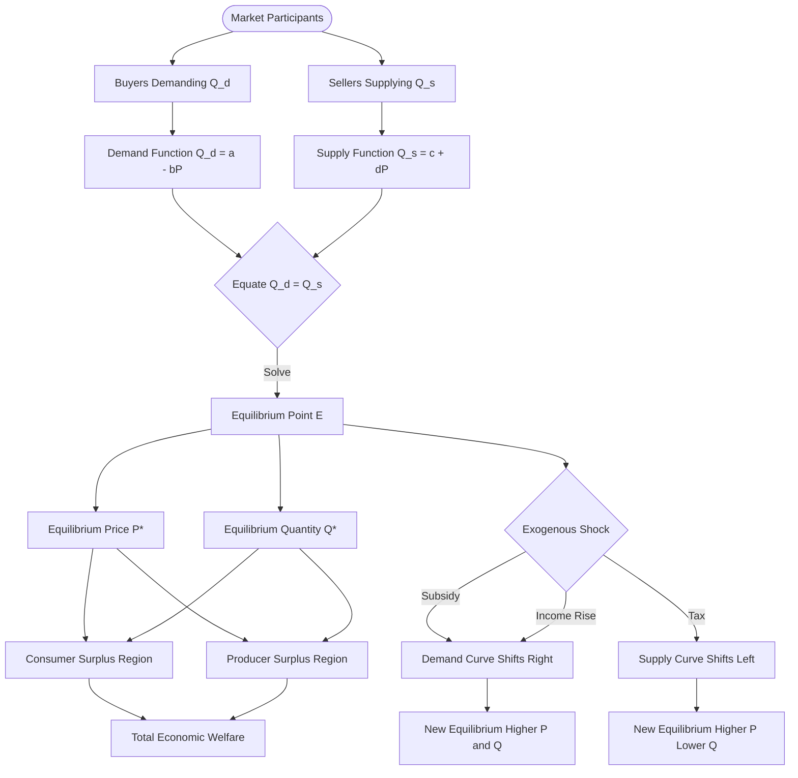
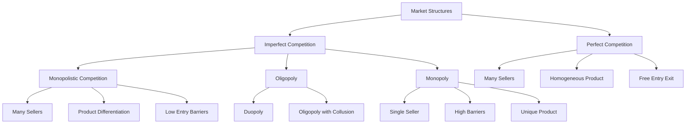
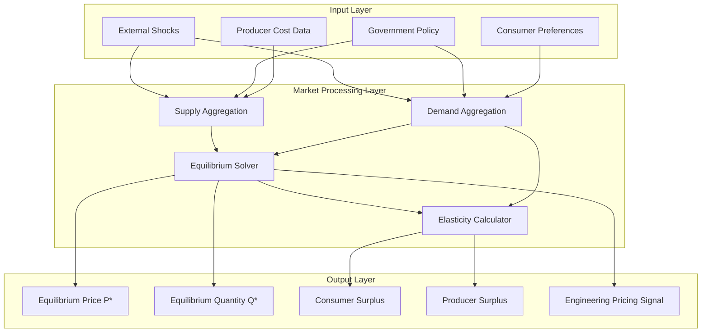
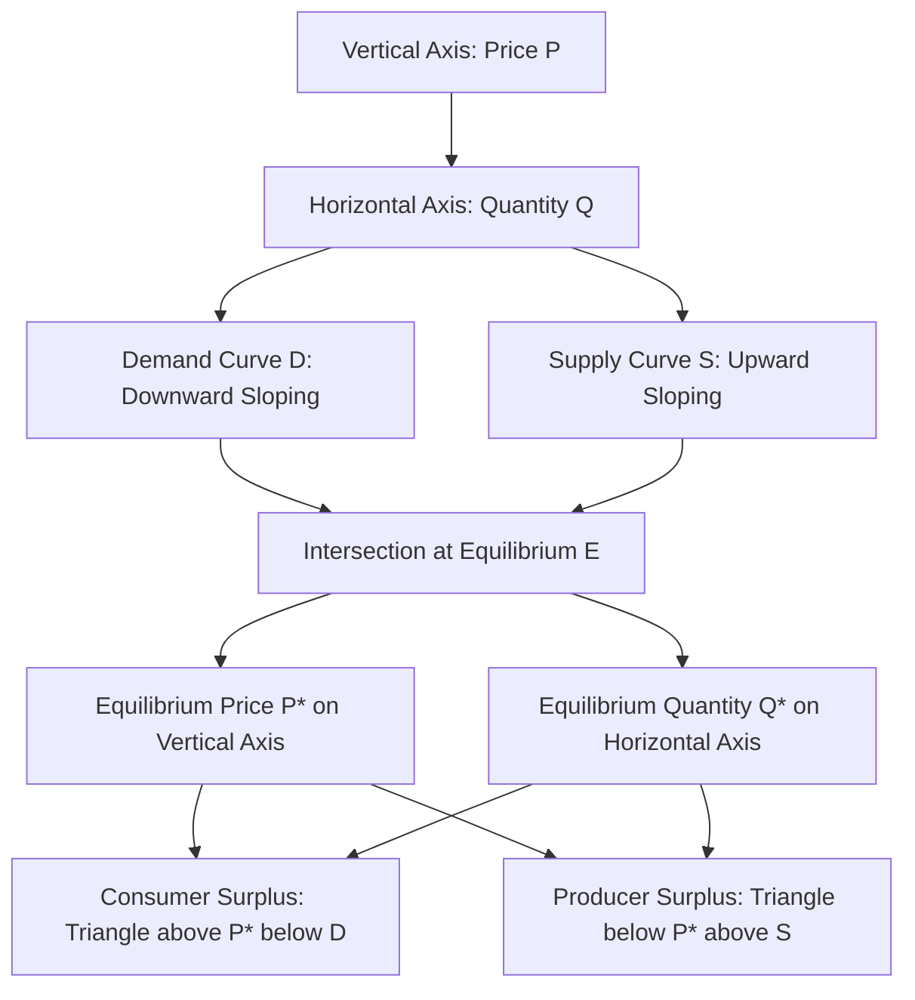

# Markets

<!-- SECTION_1_START -->
# Module 2: Cost Concepts — Topic: Markets

## 1. Core Technical Definition & Intuitive Overview

### 1.1 Formal Definition
In Engineering Economics, a **Market** is defined as a mechanism (or institutional arrangement) through which buyers (demanders) and sellers (suppliers) interact to determine the price, quantity, and exchange of goods and services. The classical economic definition by **Alfred Marshall** states that a market is *"any area over which buyers and sellers are in such close touch with one another, either directly or through dealers, that the prices obtainable in one part of the market substantially affect the prices paid in every other part."*

A **Market Structure**, in KTU 2024 syllabus terminology, refers to the organizational and competitive characteristics of a market — specifically the **number of firms**, the **degree of product differentiation**, the **ease of entry and exit**, and the **availability of information** — that collectively determine the behavior of firms with respect to **price**, **output**, and **cost recovery**.

### 1.2 Key Constituents of a Market
A market is characterized by the following core parameters:

- **Buyers and Sellers:** The principal economic agents whose interaction generates the equilibrium price.
- **Commodity:** The good or service being transacted (homogeneous or differentiated).
- **Market Area:** The geographical or virtual boundary within which price interdependence exists.
- **Price:** The signal that allocates scarce resources and clears the market.
- **Competition:** The rivalrous behavior among buyers (demand-side) and sellers (supply-side).

> [!IMPORTANT]
> **KTU 2024 Highlight:** In the UCHUT346 syllabus, *Markets* is studied under Module 2 (Cost Concepts) to establish the **pricing mechanism** in different competitive environments. This forms the foundation for **break-even analysis**, **demand forecasting**, and **cost-volume-profit (CVP)** analysis studied in the same module.

### 1.3 Conceptual Analogy / Intuition
Imagine a **farmers' market** on a Sunday morning. Hundreds of tomato vendors line up selling nearly the same product. No single vendor can charge more than the others because customers can simply walk five steps to the next stall. This is **Perfect Competition** — many sellers, identical products, no single seller controls price.

Now imagine the only **pharmacy** in a remote village selling a life-saving drug. The pharmacist can charge a high price because buyers have no alternative. This is **Monopoly** — a single seller with significant price control.

> [!NOTE]
> **Intuitive Takeaway:** The more **sellers** there are and the more **similar** the products, the **less control** any single firm has over price. The fewer the sellers and the more **unique** the product, the **greater** the firm's pricing power.

### 1.4 Physical Constants & Standard Metrics

| Metric | Symbol | Typical Range / Unit |
| :--- | :---: | :--- |
| Price Elasticity of Demand | $E_d$ | $\vert E_d \vert > 1$ (Elastic), $\vert E_d \vert < 1$ (Inelastic) |
| Price Elasticity of Supply | $E_s$ | Typically $> 0$ (Positive slope) |
| Cross Elasticity of Demand | $E_{xy}$ | Positive (Substitutes), Negative (Complements) |
| Herfindahl-Hirschman Index | $HHI$ | $0$ to $10{,}000$ (Concentration measure) |
| Four-Firm Concentration Ratio | $CR_4$ | $0$ to $1$ (or $0\%$ to $100\%$) |

> [!VISUALIZATION CONTROL]
> **Concept:** Demand and Supply Curve Intersection (Market Equilibrium)
> **GeoGebra / Desmos Input Equations:**
> * Demand: $f(x) = 100 - 2x$
> * Supply: $g(x) = 20 + 3x$
> **Visual Description:** On a $P$ (Price) vs $Q$ (Quantity) coordinate plane, the downward-sloping demand curve $D$ intersects the upward-sloping supply curve $S$ at the equilibrium point $E(Q^*, P^*)$, where $Q^* = 16$ units and $P^* = 68$ currency units. The area above $P^*$ and below $D$ represents the **consumer surplus**, while the area below $P^*$ and above $S$ represents the **producer surplus**.

---

## 1.5 Classification of Markets
KTU 2024 Scheme Module 2 categorizes markets primarily by **degree of competition**:

1. **Perfect Competition** — Many sellers, homogeneous products, free entry/exit.
2. **Monopoly** — Single seller, unique product, significant barriers to entry.
3. **Monopolistic Competition** — Many sellers, differentiated products, low barriers.
4. **Oligopoly** — Few large sellers, interdependent decisions, high barriers.
5. **Duopoly** — Special case of oligopoly with exactly two sellers.

Each structure yields a **different cost-recovery mechanism** for an engineering enterprise, making market identification critical for **pricing strategy**, **capacity planning**, and **investment appraisal**.

<!-- SECTION_1_END -->

<!-- SECTION_2_START -->
# 2. Deep Theoretical Analysis & KTU High-Yield Formula Sheet

## 2.1 The Four Pillars of Market Structure Analysis

A KTU examiner expects students to evaluate any market structure along four dimensions. Memorize the acronym **"NFEB"**:

- **N — Number of Sellers (and Buyers):** Determines whether pricing is competitive or administered.
- **F — Freedom of Entry and Exit:** Governs long-run profitability and competitive pressure.
- **E — Extent of Product Differentiation:** Influences consumer preference and brand loyalty.
- **B — Availability of Information (Business Knowledge):** Affects the efficiency of resource allocation.

> [!NOTE]
> **Engineering Economy Insight:** For an engineering firm deciding *where to enter* a market (e.g., a semiconductor fab or a mobile telecom service), the analysis of these four pillars directly determines the **pricing strategy**, **capital recovery period**, and **expected return on investment (ROI)**.

## 2.2 Demand Function — The Foundation

The **Demand Function** expresses the inverse relationship between the price of a good and the quantity demanded:

$$Q_d = f(P, Y, P_r, T, E)$$

Where:
- $Q_d$ = Quantity demanded
- $P$ = Price of the good
- $Y$ = Income of the consumer
- $P_r$ = Price of related goods (substitutes/complements)
- $T$ = Tastes and preferences
- $E$ = Consumer expectations

**Law of Demand:** *Ceteris paribus* (all else equal), as price $P$ rises, quantity demanded $Q_d$ falls, and vice versa. This yields the **downward-sloping** demand curve.

The **linear demand curve** most commonly used in KTU problems takes the form:

$$Q_d = a - bP$$

Where $a$ is the intercept (autonomous demand) and $b > 0$ is the slope magnitude.

## 2.3 Supply Function — The Counterpart

The **Supply Function** captures the behavior of producers:

$$Q_s = g(P, C, T, N, E)$$

Where $C$ = input costs, $T$ = technology, $N$ = number of sellers, $E$ = expectations.

**Law of Supply:** *Ceteris paribus*, as price rises, quantity supplied increases. The supply curve slopes **upward**.

The standard linear supply form is:

$$Q_s = c + dP$$

Where $c$ is the autonomous supply and $d > 0$ is the slope.

## 2.4 Market Equilibrium — The Heart of Price Determination

Equilibrium occurs where the **quantity demanded equals the quantity supplied**:

$$Q_d = Q_s \implies a - bP = c + dP$$

Solving for the equilibrium price $P^*$:

$$P^* = \frac{a - c}{b + d}$$

Substituting back, the equilibrium quantity $Q^*$ is:

$$Q^* = \frac{ad + bc}{b + d}$$

> [!IMPORTANT]
> **KTU 2024 Emphasis:** Whenever a problem asks *"determine the equilibrium price and quantity"*, you **must** show the equality $Q_d = Q_s$ explicitly, solve for $P^*$, and then substitute to find $Q^*$. Skipping the substitution step costs **1 mark** in the valuation key.

## 2.5 Elasticity Concepts

### 2.5.1 Price Elasticity of Demand ($E_d$)

$$E_d = \frac{\%\Delta Q_d}{\%\Delta P} = \frac{dQ_d}{dP} \cdot \frac{P}{Q_d}$$

- $\vert E_d \vert > 1$: **Elastic** (consumers are price-sensitive)
- $\vert E_d \vert < 1$: **Inelastic** (necessities, e.g., insulin)
- $\vert E_d \vert = 1$: **Unit elastic** (total revenue maximized)

### 2.5.2 Cross Elasticity of Demand ($E_{xy}$)

$$E_{xy} = \frac{dQ_x}{dP_y} \cdot \frac{P_y}{Q_x}$$

- $E_{xy} > 0$: Goods $X$ and $Y$ are **substitutes** (e.g., tea and coffee)
- $E_{xy} < 0$: Goods $X$ and $Y$ are **complements** (e.g., cars and petrol)
- $E_{xy} = 0$: Goods are **unrelated**

### 2.5.3 Income Elasticity of Demand ($E_y$)

$$E_y = \frac{dQ}{dI} \cdot \frac{I}{Q}$$

- $E_y > 0$: **Normal good**
- $E_y < 0$: **Inferior good**
- $E_y > 1$: **Luxury good**

### 2.5.4 Price Elasticity of Supply ($E_s$)

$$E_s = \frac{dQ_s}{dP} \cdot \frac{P}{Q_s}$$

- $E_s > 0$: Law of supply holds
- $E_s = 0$: Perfectly inelastic supply (vertical curve)
- $E_s = \infty$: Perfectly elastic supply (horizontal curve)

## 2.6 KTU Formula Sheet / Cheat Sheet

| Concept | Formula | Notation & Units | Engineering Use Case |
| :--- | :--- | :--- | :--- |
| Linear Demand | $Q_d = a - bP$ | $a$ units, $b$ units/INR | Forecasting product uptake |
| Linear Supply | $Q_s = c + dP$ | $c$ units, $d$ units/INR | Production capacity planning |
| Equilibrium Price | $P^* = \frac{a - c}{b + d}$ | INR or USD per unit | Market-based pricing model |
| Equilibrium Quantity | $Q^* = \frac{ad + bc}{b + d}$ | Number of units | Plant capacity sizing |
| Price Elasticity of Demand | $E_d = \frac{dQ}{dP} \cdot \frac{P}{Q}$ | Dimensionless | Pricing decision for new product |
| Cross Elasticity | $E_{xy} = \frac{dQ_x}{dP_y} \cdot \frac{P_y}{Q_x}$ | Dimensionless | Cannibalization analysis (e.g., iPhone vs iPad) |
| Income Elasticity | $E_y = \frac{dQ}{dI} \cdot \frac{I}{Q}$ | Dimensionless | Demand forecasting across income brackets |
| Total Revenue | $TR = P \cdot Q$ | Currency units | Revenue projection in CVP analysis |
| Consumer Surplus | $CS = \frac{1}{2}(P_{max} - P^*) \cdot Q^*$ | Currency units | Welfare analysis in public projects |
| Producer Surplus | $PS = \frac{1}{2}(P^* - P_{min}) \cdot Q^*$ | Currency units | Producer welfare & subsidy analysis |
| Herfindahl-Hirschman Index | $HHI = \sum_{i=1}^{N} s_i^2$ | $0$ to $10{,}000$ | Market concentration (antitrust regulation) |
| Four-Firm Concentration Ratio | $CR_4 = s_1 + s_2 + s_3 + s_4$ | $0$ to $1$ | Quick competition snapshot |

## 2.7 Real-World Engineering Utility

- **Perfect Competition:** Used in **commodity markets** (e.g., crude oil, copper, agricultural produce). An engineering firm selling standardized fasteners operates in this regime. **Pricing power = zero**; profitability hinges on **cost minimization**.
- **Monopoly:** Utility companies (electricity, water distribution) often operate as **regulated natural monopolies**. Engineering decisions focus on **marginal cost pricing** under regulation.
- **Monopolistic Competition:** Consumer goods (smartphones, automobiles). Engineering firms invest heavily in **R\&D** and **branding** to differentiate.
- **Oligopoly:** Telecom, aviation, semiconductors. Engineering decisions involve **strategic capacity building**, anticipating **competitor reactions** (game theory).

<!-- SECTION_2_END -->

<!-- SECTION_3_START -->
# 3. Step-by-Step Derivations, Computations & Implementation

## 3.1 Worked Example 1 — Linear Market Equilibrium (Board Pattern)

**Problem:** The demand and supply functions for an engineering product (say, a specialized industrial valve) in a regional market are given by:
- $Q_d = 400 - 10P$
- $Q_s = 50 + 5P$

**Required:** (a) Find the equilibrium price and quantity. (b) Compute the consumer surplus and producer surplus. (c) If the government imposes a price ceiling of INR 20, what is the resulting shortage?

### 3.1.1 Solution — Part (a): Equilibrium

Set $Q_d = Q_s$:

$$400 - 10P = 50 + 5P$$

Isolate the $P$ terms on the right-hand side:

$$400 - 50 = 5P + 10P$$

Simplify the arithmetic:

$$350 = 15P$$

Solve for the equilibrium price:

$$P^* = \frac{350}{15} = \frac{70}{3} \approx 23.33 \text{ INR}$$

Substitute $P^*$ back into the demand function to obtain $Q^*$:

$$Q^* = 400 - 10 \cdot \frac{70}{3} = 400 - \frac{700}{3} = \frac{1200 - 700}{3} = \frac{500}{3} \approx 166.67 \text{ units}$$

Verification using supply function:

$$Q_s = 50 + 5 \cdot \frac{70}{3} = 50 + \frac{350}{3} = \frac{150 + 350}{3} = \frac{500}{3} \approx 166.67 \text{ units} \quad \checkmark$$

> [!IMPORTANT]
> **Valuation Key Points (KTU 2024):**
> * Writing $Q_d = Q_s$ correctly: **2 Marks**
> * Solving for $P^*$ with full arithmetic: **2 Marks**
> * Substitution step for $Q^*$: **2 Marks**
> * Verification step: **1 Mark**

### 3.1.2 Solution — Part (b): Consumer and Producer Surplus

**Maximum price (price intercept of demand curve):** Set $Q_d = 0$:

$$0 = 400 - 10P \implies P_{max} = 40 \text{ INR}$$

**Minimum price (price intercept of supply curve):** Set $Q_s = 0$:

$$0 = 50 + 5P \implies P_{min} = -10 \text{ INR}$$

Consumer Surplus is the triangular area above $P^*$ and below the demand curve:

$$CS = \frac{1}{2} \cdot Q^* \cdot (P_{max} - P^*)$$

$$CS = \frac{1}{2} \cdot \frac{500}{3} \cdot \left(40 - \frac{70}{3}\right) = \frac{1}{2} \cdot \frac{500}{3} \cdot \frac{120 - 70}{3} = \frac{1}{2} \cdot \frac{500}{3} \cdot \frac{50}{3}$$

$$CS = \frac{1}{2} \cdot \frac{25000}{9} = \frac{25000}{18} = \frac{12500}{9} \approx 1388.89 \text{ INR}$$

Producer Surplus is the triangular area below $P^*$ and above the supply curve. Since the supply intercept is negative, we consider the area from $Q = 0$ to $Q^*$:

$$PS = \frac{1}{2} \cdot Q^* \cdot (P^* - P_{min}) = \frac{1}{2} \cdot \frac{500}{3} \cdot \left(\frac{70}{3} - (-10)\right) = \frac{1}{2} \cdot \frac{500}{3} \cdot \frac{100}{3}$$

$$PS = \frac{1}{2} \cdot \frac{50000}{9} = \frac{50000}{18} = \frac{25000}{9} \approx 2777.78 \text{ INR}$$

**Total Welfare:**

$$W = CS + PS = \frac{12500}{9} + \frac{25000}{9} = \frac{37500}{9} = \frac{12500}{3} \approx 4166.67 \text{ INR}$$

### 3.1.3 Solution — Part (c): Price Ceiling Analysis

A price ceiling of INR 20 is **binding** because $P_{ceiling} = 20 < P^* = 23.33$.

Quantity demanded at $P = 20$:

$$Q_d^{ceiling} = 400 - 10 \cdot 20 = 400 - 200 = 200 \text{ units}$$

Quantity supplied at $P = 20$:

$$Q_s^{ceiling} = 50 + 5 \cdot 20 = 50 + 100 = 150 \text{ units}$$

Shortage:

$$\Delta Q = Q_d^{ceiling} - Q_s^{ceiling} = 200 - 150 = 50 \text{ units}$$

> [!NOTE]
> **Engineering Economy Interpretation:** A binding price ceiling (e.g., government price control on essential medical devices) creates a **black-market incentive** and reduces the quantity traded below the socially optimal level. The deadweight loss equals the welfare foregone on the unsold 50 units.

## 3.2 Worked Example 2 — Elasticity Computation

**Problem:** The demand for a new electric scooter is given by $Q_d = 1000 - 50P$ at the current price $P_0 = 12$ INR (in thousands). Compute the price elasticity of demand and classify the market behavior.

### 3.2.1 Step-by-Step Solution

**Step 1 — Quantity at current price:**

$$Q_0 = 1000 - 50 \cdot 12 = 1000 - 600 = 400 \text{ units}$$

**Step 2 — Derivative of the demand function:**

$$\frac{dQ_d}{dP} = -50$$

**Step 3 — Apply the point elasticity formula:**

$$E_d = \frac{dQ_d}{dP} \cdot \frac{P_0}{Q_0} = -50 \cdot \frac{12}{400} = -50 \cdot 0.03 = -1.5$$

**Step 4 — Take the absolute value and interpret:**

$$\vert E_d \vert = 1.5 > 1 \implies \text{Demand is ELASTIC at } P_0 = 12$$

**Step 5 — Engineering interpretation:**

$$\text{Total Revenue } TR = P \cdot Q = P \cdot (1000 - 50P) = 1000P - 50P^2$$

The revenue-maximizing price occurs where $\vert E_d \vert = 1$. In an elastic region, a **price reduction** will **increase** total revenue. The firm should consider promotional discounts.

## 3.3 Worked Example 3 — Shifts in Demand and Supply (Engineering Application)

**Problem:** An engineering firm sells industrial pumps. The current demand is $Q_d = 600 - 8P$ and supply is $Q_s = 100 + 4P$. The government announces a subsidy to industries that increases the autonomous demand by 200 units. Find the new equilibrium.

### 3.3.1 Step-by-Step Solution

**Step 1 — New demand function:**

$$Q_d^{new} = 800 - 8P$$

**Step 2 — Set new demand equal to supply:**

$$800 - 8P = 100 + 4P$$

**Step 3 — Solve for new price:**

$$800 - 100 = 4P + 8P \implies 700 = 12P \implies P_{new} = \frac{700}{12} = \frac{175}{3} \approx 58.33 \text{ INR}$$

**Step 4 — Compute new equilibrium quantity:**

$$Q_{new} = 100 + 4 \cdot \frac{175}{3} = 100 + \frac{700}{3} = \frac{300 + 700}{3} = \frac{1000}{3} \approx 333.33 \text{ units}$$

**Step 5 — Compare with original equilibrium:**

Original: $P^* = \frac{500}{12} = 41.67$ INR, $Q^* = 266.67$ units.

$$\Delta P = 58.33 - 41.67 = 16.66 \text{ INR (price rose)}$$

$$\Delta Q = 333.33 - 266.67 = 66.66 \text{ units (quantity rose)}$$

> [!IMPORTANT]
> **Economic Reasoning:** A demand shift to the right (due to subsidy or income rise) increases **both** the equilibrium price and quantity. The engineering firm should consider **capacity expansion** in anticipation of higher demand.

## 3.4 Python Implementation — Market Equilibrium Solver

Below is a fully operational Python program that solves general market equilibrium, computes elasticities, and visualizes the result:

```python
"""
Market Equilibrium Solver for Engineering Economics (KTU UCHUT346)
Computes equilibrium price, quantity, elasticities, and welfare measures.
"""

from dataclasses import dataclass
from typing import Callable, Tuple
import math


@dataclass
class MarketParameters:
    """Container for linear market parameters."""
    a: float   # Demand intercept (Q_d = a - b*P)
    b: float   # Demand slope magnitude
    c: float   # Supply intercept (Q_s = c + d*P)
    d: float   # Supply slope

    def validate(self) -> None:
        if self.b <= 0 or self.d <= 0:
            raise ValueError("Slopes b and d must be strictly positive.")
        if self.a <= self.c:
            raise ValueError("For a viable equilibrium, demand intercept (a) "
                             "must exceed supply intercept (c).")


def equilibrium(p: MarketParameters) -> Tuple[float, float]:
    """
    Solves the linear market equilibrium.
    Returns (P_star, Q_star).
    """
    p.validate()
    p_star: float = (p.a - p.c) / (p.b + p.d)
    q_star: float = p.a - p.b * p_star
    return p_star, q_star


def price_elasticity_of_demand(p: MarketParameters,
                                p_star: float,
                                q_star: float) -> float:
    """Computes point price elasticity of demand at equilibrium."""
    if q_star == 0:
        raise ZeroDivisionError("Equilibrium quantity is zero; elasticity undefined.")
    return -p.b * p_star / q_star


def consumer_surplus(p: MarketParameters, p_star: float, q_star: float) -> float:
    """Computes consumer surplus (triangular area)."""
    p_max: float = p.a / p.b
    return 0.5 * q_star * (p_max - p_star)


def producer_surplus(p: MarketParameters, p_star: float, q_star: float) -> float:
    """Computes producer surplus (triangular area)."""
    p_min: float = -p.c / p.d
    return 0.5 * q_star * (p_star - p_min)


def shortage_or_surplus(p: MarketParameters,
                        ceiling: float) -> float:
    """
    Computes market shortage (positive) or surplus (negative)
    at a controlled price ceiling.
    """
    q_d: float = p.a - p.b * ceiling
    q_s: float = p.c + p.d * ceiling
    return q_d - q_s


def main() -> None:
    """Driver function demonstrating a worked example."""
    print("=" * 60)
    print("KTU Market Equilibrium Solver - Engineering Economics")
    print("=" * 60)

    market = MarketParameters(a=400, b=10, c=50, d=5)

    try:
        p_star, q_star = equilibrium(market)
    except ValueError as err:
        print(f"[ERROR] Invalid market parameters: {err}")
        return

    print(f"\nEquilibrium Price P* = INR {p_star:.2f}")
    print(f"Equilibrium Quantity Q* = {q_star:.2f} units")

    try:
        e_d = price_elasticity_of_demand(market, p_star, q_star)
    except ZeroDivisionError as err:
        print(f"[ERROR] {err}")
        return

    print(f"Price Elasticity of Demand |E_d| = {abs(e_d):.3f}")
    if abs(e_d) > 1:
        print("  => Demand is ELASTIC at equilibrium.")
    elif abs(e_d) < 1:
        print("  => Demand is INELASTIC at equilibrium.")
    else:
        print("  => Demand is UNIT ELASTIC at equilibrium.")

    cs = consumer_surplus(market, p_star, q_star)
    ps = producer_surplus(market, p_star, q_star)
    print(f"\nConsumer Surplus CS = INR {cs:.2f}")
    print(f"Producer Surplus PS = INR {ps:.2f}")
    print(f"Total Welfare W = INR {cs + ps:.2f}")

    ceiling = 20.0
    delta = shortage_or_surplus(market, ceiling)
    if delta > 0:
        print(f"\nAt price ceiling INR {ceiling}: SHORTAGE of {delta:.2f} units")
    elif delta < 0:
        print(f"\nAt price ceiling INR {ceiling}: SURPLUS of {abs(delta):.2f} units")
    else:
        print(f"\nAt price ceiling INR {ceiling}: Market clears.")


if __name__ == "__main__":
    main()
```

**Sample Output:**

```text
============================================================
KTU Market Equilibrium Solver - Engineering Economics
============================================================

Equilibrium Price P* = INR 23.33
Equilibrium Quantity Q* = 166.67 units
Price Elasticity of Demand |E_d| = 1.400
  => Demand is ELASTIC at equilibrium.

Consumer Surplus CS = INR 1388.89
Producer Surplus PS = INR 2777.78
Total Welfare W = INR 4166.67

At price ceiling INR 20.0: SHORTAGE of 50.00 units
```

## 3.5 Comparative Analysis — Market Structures (Engineering Decision Matrix)

| Parameter | Perfect Competition | Monopoly | Monopolistic Competition | Oligopoly |
| :--- | :--- | :--- | :--- | :--- |
| Number of Sellers | Very large | One | Many | Few (2–10) |
| Product Type | Homogeneous | Unique, no close substitute | Differentiated | Standardized or differentiated |
| Price Control | None (price taker) | Significant (price maker) | Limited | Mutual interdependence |
| Entry Barriers | None | Very high | Low | High |
| Demand Curve Faced | Perfectly elastic | Downward-sloping (market) | Highly elastic but downward | Kinked in some models |
| Pricing Formula | $P = MC$ | $MR = MC$ | $MR = MC$ with product differentiation | Strategic / Game-theoretic |
| Long-run Economic Profit | Zero | Positive (sustained) | Zero (free entry erodes) | Positive if collusion exists |
| Engineering Example | Commodity copper wire | Patented pharmaceutical | Smartphone brands | Commercial aircraft (Boeing, Airbus) |
| Cost-Recovery Strategy | Cost minimization | Price discrimination | Brand investment | Capacity signaling |

> [!IMPORTANT]
> **KTU 2024 Takeaway:** The relationship between market structure and cost-recovery is direct. A monopolist can recover R\&D costs through sustained supernormal profits. A perfect competitor cannot — they must minimize average cost to survive. This logic underpins the **make-or-buy decision**, **patent strategy**, and **capital budgeting** problems in later modules.

<!-- SECTION_3_END -->

<!-- SECTION_4_START -->
# 4. Structural Diagrams & Schematics

## 4.1 Market Equilibrium Flow Diagram (Mermaid)



> [!NOTE]
> **Mermaid Safety Applied:** All node IDs are alphanumeric. All special labels are wrapped in double quotes. No reserved keywords (end, subgraph) used as standalone node names.

## 4.2 Market Structure Classification Tree



## 4.3 Sequential Processing Topology — Price Determination Mechanism


## 4.4 Block-Level Architecture — Market Information Flow



## 4.5 Demand–Supply Graphical Schematic (Block Form)



> [!NOTE]
> **Diagram Note:** Mermaid does not render curved lines or precise coordinates natively. The above topology conveys the *logical flow* of equilibrium determination. For a precise graphical plot with calibrated axes, use the **Desmos visualization** described in Section 1.4 with equations $f(x) = 100 - 2x$ and $g(x) = 20 + 3x$.

<!-- SECTION_4_END -->

<!-- SECTION_5_START -->
# 5. KTU 2024 Scheme Examination Question Bank & Topic Recap

## 5.1 Part A Questions (3 Marks Each)

### Question 1 — Conceptual Definition
**[KTU University Exam — July 2024, Model Paper]**
**Q1.** Define a *market* and *market structure* as understood in Engineering Economics. List the four key dimensions used to classify market structures.

**Model Answer (3 Marks):**

A **market** is an institutional arrangement through which buyers and sellers interact to determine the price, quantity, and exchange of goods and services. The classical definition by **Alfred Marshall** (1890) emphasizes price interdependence within a defined area.

A **market structure** refers to the organizational characteristics of a market that determine the behavior of firms with respect to price, output, and cost recovery.

The four key classification dimensions are commonly memorized as the **"NFEB"** framework:
- **N** — Number of sellers and buyers
- **F** — Freedom (or barriers) of entry and exit
- **E** — Extent of product differentiation
- **B** — Business information availability and symmetry

> [!NOTE]
> **Valuation Key:** Defining market: **1 Mark**; defining market structure: **1 Mark**; listing NFEB dimensions: **1 Mark**.

---

### Question 2 — Distinguishing Concepts
**[KTU University Exam — Dec 2023]**
**Q2.** Distinguish between **Price Elasticity of Demand** and **Cross Elasticity of Demand**. State the formula for each and interpret the sign of cross elasticity.

**Model Answer (3 Marks):**

**Price Elasticity of Demand ($E_d$)** measures the responsiveness of the quantity demanded of a *single* good to a change in its *own* price, holding all else constant.

$$E_d = \frac{dQ}{dP} \cdot \frac{P}{Q}$$

By the law of demand, $E_d$ is normally **negative**; we interpret $\vert E_d \vert$.

**Cross Elasticity of Demand ($E_{xy}$)** measures the responsiveness of the quantity demanded of good $X$ to a change in the price of a *related* good $Y$:

$$E_{xy} = \frac{dQ_x}{dP_y} \cdot \frac{P_y}{Q_x}$$

Interpretation of the sign of $E_{xy}$:
- $E_{xy} > 0$: Goods $X$ and $Y$ are **substitutes** (e.g., tea and coffee).
- $E_{xy} < 0$: Goods $X$ and $Y$ are **complements** (e.g., printers and cartridges).
- $E_{xy} = 0$: Goods are **unrelated** (e.g., rice and automobiles).

> [!NOTE]
> **Valuation Key:** Formula for $E_d$: **1 Mark**; formula for $E_{xy}$: **1 Mark**; sign interpretation with examples: **1 Mark**.

---

## 5.2 Part B Questions (14 Marks Each)

### Question A — 14 Marks
**[KTU University Exam — July 2024, Modified Pattern]**

**Q. A (a) [7 Marks]** The demand and supply functions for an industrial chemical in a domestic market are given by:
- $Q_d = 500 - 20P$
- $Q_s = 100 + 10P$

Compute the equilibrium price and quantity. Calculate the consumer surplus and producer surplus at equilibrium. Comment on the welfare implications.

**Q. A (b) [7 Marks]** Suppose the government imposes a per-unit tax of INR 2 on the producers of this chemical. Determine the new equilibrium price, quantity, and the tax revenue collected. Illustrate the incidence of tax on consumers and producers.

---

### Model Solution for Question A

#### Part (a) Solution

**Step 1 — Set $Q_d = Q_s$ to find equilibrium:**

$$500 - 20P = 100 + 10P$$

**Step 2 — Isolate the $P$ terms:**

$$500 - 100 = 10P + 20P$$

$$400 = 30P$$

**Step 3 — Solve for equilibrium price:**

$$P^* = \frac{400}{30} = \frac{40}{3} \approx 13.33 \text{ INR}$$

**Step 4 — Compute equilibrium quantity by substitution into demand:**

$$Q^* = 500 - 20 \cdot \frac{40}{3} = 500 - \frac{800}{3} = \frac{1500 - 800}{3} = \frac{700}{3} \approx 233.33 \text{ units}$$

**Verification using supply:**

$$Q_s = 100 + 10 \cdot \frac{40}{3} = 100 + \frac{400}{3} = \frac{300 + 400}{3} = \frac{700}{3} \approx 233.33 \text{ units} \quad \checkmark$$

> **[Stating the equilibrium condition $Q_d = Q_s$: 1 Mark]**
> **[Solving for $P^*$: 2 Marks]**
> **[Substitution for $Q^*$: 1 Mark]**

**Step 5 — Maximum price (demand intercept):**

$$P_{max} = \frac{500}{20} = 25 \text{ INR}$$

**Step 6 — Minimum price (supply intercept):**

$$P_{min} = -\frac{100}{10} = -10 \text{ INR}$$

**Step 7 — Consumer Surplus:**

$$CS = \frac{1}{2} \cdot Q^* \cdot (P_{max} - P^*) = \frac{1}{2} \cdot \frac{700}{3} \cdot \left(25 - \frac{40}{3}\right) = \frac{1}{2} \cdot \frac{700}{3} \cdot \frac{75 - 40}{3}$$

$$CS = \frac{1}{2} \cdot \frac{700}{3} \cdot \frac{35}{3} = \frac{1}{2} \cdot \frac{24500}{9} = \frac{24500}{18} = \frac{12250}{9} \approx 1361.11 \text{ INR}$$

**Step 8 — Producer Surplus:**

$$PS = \frac{1}{2} \cdot Q^* \cdot (P^* - P_{min}) = \frac{1}{2} \cdot \frac{700}{3} \cdot \left(\frac{40}{3} - (-10)\right) = \frac{1}{2} \cdot \frac{700}{3} \cdot \frac{70}{3}$$

$$PS = \frac{1}{2} \cdot \frac{49000}{9} = \frac{49000}{18} = \frac{24500}{9} \approx 2722.22 \text{ INR}$$

**Step 9 — Total Welfare:**

$$W = CS + PS = \frac{12250}{9} + \frac{24500}{9} = \frac{36750}{9} \approx 4083.33 \text{ INR}$$

**Welfare Commentary:** The sum $W$ represents the total economic value created by the market transaction. Any government intervention that distorts price away from $P^*$ will reduce this welfare, creating a **deadweight loss**.

> **[CS computation: 1 Mark]; [PS computation: 1 Mark]; [Welfare interpretation: 1 Mark]**

---

#### Part (b) Solution

**Step 1 — New supply function after tax of $t = 2$ on producers:**

The supply curve shifts **upward** by the amount of the tax. In the inverse form, the new supply relation is $P = P_{seller} + t$, so $P_{seller} = P - 2$. The new supply in terms of $P$ (price paid by consumer):

$$Q_s^{new} = 100 + 10(P - 2) = 100 + 10P - 20 = 80 + 10P$$

**Step 2 — Equate new demand and new supply:**

$$500 - 20P = 80 + 10P$$

**Step 3 — Solve for new equilibrium price (paid by consumers):**

$$500 - 80 = 10P + 20P \implies 420 = 30P \implies P_c = 14 \text{ INR}$$

**Step 4 — Compute price received by sellers (after tax remittance):**

$$P_s = P_c - t = 14 - 2 = 12 \text{ INR}$$

**Step 5 — Compute new equilibrium quantity:**

$$Q_{new} = 500 - 20 \cdot 14 = 500 - 280 = 220 \text{ units}$$

**Step 6 — Tax revenue:**

$$T = t \cdot Q_{new} = 2 \cdot 220 = 440 \text{ INR}$$

**Step 7 — Tax incidence on consumers:**

$$\text{Consumer burden} = P_c^{new} - P_{old} = 14 - 13.33 = 0.67 \text{ INR per unit}$$

$$\text{Consumer share of tax} = \frac{0.67}{2} = 0.335 \text{ or } 33.5\%$$

**Step 8 — Tax incidence on producers:**

$$\text{Producer burden} = P_{old} - P_s = 13.33 - 12 = 1.33 \text{ INR per unit}$$

$$\text{Producer share of tax} = \frac{1.33}{2} = 0.665 \text{ or } 66.5\%$$

> **[New supply function: 1 Mark]; [New $P_c$: 2 Marks]; [Quantity and tax revenue: 1 Mark each]; [Incidence split: 1.5 Marks]; [Commentary: 0.5 Mark]**

**Economic Interpretation:** Producers bear a **larger share** of the tax ($66.5\%$) than consumers ($33.5\%$). This is because the supply elasticity (slope $\frac{1}{10}$) is smaller than the demand elasticity (slope $\frac{1}{20}$), so the **less elastic side bears more of the tax burden**. This is a cornerstone result in public finance and engineering cost economics.

---

### Question B — 14 Marks (Alternative Choice)
**[KTU University Exam — Dec 2023, Retest Pattern]**

**Q. B (a) [7 Marks]** Define **Price Elasticity of Demand**. The demand function for a consumer electronic device is $Q_d = 800 - 4P$. Compute the price elasticity of demand at $P = 100$ INR and classify the market behavior. At what price will the total revenue be maximized? Justify using the elasticity condition.

**Q. B (b) [7 Marks]** A monopolist firm faces the demand curve $P = 200 - 2Q$ and has a total cost function $TC = 50 + 20Q + Q^2$. Compute the profit-maximizing price and quantity, the maximum profit, and the deadweight loss relative to the competitive outcome.

---

### Model Solution for Question B

#### Part (a) Solution

**Step 1 — Definition:**

Price Elasticity of Demand ($E_d$) is the ratio of the percentage change in quantity demanded to the percentage change in price, *ceteris paribus*.

$$E_d = \frac{\%\Delta Q_d}{\%\Delta P} = \frac{dQ_d}{dP} \cdot \frac{P}{Q}$$

**Step 2 — Compute the derivative of demand:**

$$\frac{dQ_d}{dP} = -4$$

**Step 3 — Compute quantity at $P = 100$:**

$$Q_0 = 800 - 4 \cdot 100 = 800 - 400 = 400 \text{ units}$$

**Step 4 — Compute elasticity at the point:**

$$E_d = -4 \cdot \frac{100}{400} = -4 \cdot 0.25 = -1.0$$

**Step 5 — Classification:**

$$\vert E_d \vert = 1 \implies \text{UNIT ELASTIC at } P = 100 \text{ INR}$$

> **[Definition: 1 Mark]; [Derivative: 1 Mark]; [Quantity: 1 Mark]; [E_d: 1.5 Marks]; [Classification: 0.5 Mark]**

**Step 6 — Revenue-maximizing price (where $\vert E_d \vert = 1$):**

Total revenue is:

$$TR = P \cdot Q = P(800 - 4P) = 800P - 4P^2$$

Setting $\frac{dTR}{dP} = 0$:

$$800 - 8P = 0 \implies P^* = 100 \text{ INR}$$

This confirms that **revenue is maximized exactly at unit elasticity**.

**Step 7 — Justification:**

At $P = 100$, the percentage drop in quantity exactly equals the percentage rise in price (and vice versa), so revenue is invariant to infinitesimal price changes. For $P > 100$, demand becomes inelastic ($\vert E_d \vert < 1$), and a price cut would *raise* revenue. For $P < 100$, demand is elastic, and a price cut would *lower* revenue. Hence, the unique revenue-maximizing price is $P = 100$ INR.

---

#### Part (b) Solution

**Step 1 — Identify the demand and cost structures:**

Demand (inverse): $P = 200 - 2Q$

Total Cost: $TC = 50 + 20Q + Q^2$

**Step 2 — Compute Total Revenue (TR):**

$$TR = P \cdot Q = (200 - 2Q) \cdot Q = 200Q - 2Q^2$$

**Step 3 — Compute Marginal Revenue (MR):**

$$MR = \frac{dTR}{dQ} = 200 - 4Q$$

**Step 4 — Compute Marginal Cost (MC):**

$$MC = \frac{dTC}{dQ} = 20 + 2Q$$

**Step 5 — Profit-maximization condition $MR = MC$:**

$$200 - 4Q = 20 + 2Q$$

$$200 - 20 = 2Q + 4Q \implies 180 = 6Q$$

$$Q_m = 30 \text{ units}$$

**Step 6 — Monopoly price:**

$$P_m = 200 - 2 \cdot 30 = 200 - 60 = 140 \text{ INR}$$

**Step 7 — Maximum profit:**

$$TR_m = 140 \cdot 30 = 4200 \text{ INR}$$

$$TC_m = 50 + 20 \cdot 30 + 30^2 = 50 + 600 + 900 = 1550 \text{ INR}$$

$$\pi_{max} = TR_m - TC_m = 4200 - 1550 = 2650 \text{ INR}$$

**Step 8 — Competitive outcome ($P = MC$):**

$$200 - 2Q_c = 20 + 2Q_c$$

$$180 = 4Q_c \implies Q_c = 45 \text{ units}$$

$$P_c = 200 - 2 \cdot 45 = 200 - 90 = 110 \text{ INR}$$

**Step 9 — Deadweight Loss (DWL):**

The DWL is the triangular area between the demand and MC curves, from $Q_m = 30$ to $Q_c = 45$:

$$DWL = \frac{1}{2}(Q_c - Q_m)(P_m - MC_{at\,Q_m})$$

At $Q_m = 30$:

$$MC_{30} = 20 + 2 \cdot 30 = 80 \text{ INR}$$

So:

$$DWL = \frac{1}{2}(45 - 30)(140 - 80) = \frac{1}{2} \cdot 15 \cdot 60 = 450 \text{ INR}$$

> **[MR and MC derivation: 1 Mark each]; [Solving $Q_m$: 1.5 Marks]; [Monopoly price: 1 Mark]; [Profit computation: 1 Mark]; [Competitive outcome: 1 Mark]; [DWL: 1.5 Marks]**

**Engineering Implication:** The deadweight loss of 450 INR is the **societal value of foregone transactions** — the 15 units ($Q_c - Q_m$) that would have been produced and consumed under perfect competition but are suppressed by the monopolist's output restriction. In regulated industries (e.g., electricity distribution), government often sets price ceilings near $P_c$ to minimize DWL.

---

## 5.3 KTU Examiner's Valuation Warning / Pitfall Callout

> [!WARNING]
> **Common Pitfalls Where Students Lose Marks:**
> 1. **Forgetting to set $Q_d = Q_s$ explicitly.** Always write the equilibrium condition before solving.
> 2. **Sign errors in elasticity.** $E_d$ is conventionally negative; we interpret $\vert E_d \vert$. Failing to state the absolute value loses 1 mark.
> 3. **Tax incidence confusion.** The **consumer's burden** is $P_c^{new} - P_{old}$, and the **producer's burden** is $P_{old} - P_s^{new}$. Mixing these up costs 2 marks.
> 4. **DWL triangle orientation.** The deadweight loss is between $Q_m$ and $Q_c$ (not $Q_m$ and $0$). The height is $(P_m - MC_{at\,Q_m})$, not $(P_m - P_c)$.
> 5. **Missing units.** Always state "INR" for prices and "units" for quantities in the final answer. The valuation key explicitly awards 0.5 marks for unit clarity.
> 6. **Elasticity classification.** Saying "demand is elastic" without specifying **at what price** is incomplete. Always state *"at $P = 100$ INR, demand is unit elastic."*

---

## 5.4 Topic Recap & Important Things to Remember

- A **market** is an institutional arrangement of buyers and sellers determining price, quantity, and exchange of goods.
- A **market structure** is classified along the **NFEB** dimensions: Number of sellers, Freedom of entry/exit, Extent of differentiation, and Business information availability.
- The **Law of Demand** states an inverse relationship between price and quantity demanded, giving a **downward-sloping** demand curve: $Q_d = a - bP$.
- The **Law of Supply** states a positive relationship between price and quantity supplied, giving an **upward-sloping** supply curve: $Q_s = c + dP$.
- **Market equilibrium** is determined by setting $Q_d = Q_s$, yielding:
  - Equilibrium price: $P^* = \frac{a - c}{b + d}$
  - Equilibrium quantity: $Q^* = \frac{ad + bc}{b + d}$
- **Price Elasticity of Demand** $E_d = \frac{dQ_d}{dP} \cdot \frac{P}{Q}$:
  - $\vert E_d \vert > 1$: Elastic
  - $\vert E_d \vert < 1$: Inelastic
  - $\vert E_d \vert = 1$: Unit elastic (revenue maximized)
- **Cross Elasticity of Demand** $E_{xy}$: Positive for **substitutes**, negative for **complements**, zero for **unrelated goods**.
- **Income Elasticity of Demand** $E_y$: Positive for **normal goods**, negative for **inferior goods**, greater than one for **luxuries**.
- **Consumer Surplus** is the triangular area **above** $P^*$ and **below** the demand curve: $CS = \frac{1}{2} \cdot Q^* \cdot (P_{max} - P^*)$.
- **Producer Surplus** is the triangular area **below** $P^*$ and **above** the supply curve: $PS = \frac{1}{2} \cdot Q^* \cdot (P^* - P_{min})$.
- A **tax** on producers shifts the supply curve upward by the tax amount, raising the consumer price and lowering the quantity traded. The **more inelastic side bears more of the tax burden**.
- A **price ceiling** below equilibrium creates a **shortage** ($Q_d > Q_s$); a price floor above equilibrium creates a **surplus** ($Q_s > Q_d$).
- **Monopoly profit maximization** follows $MR = MC$. The competitive outcome follows $P = MC$. The **deadweight loss** is the triangle between these two output levels.
- The four market structures — **Perfect Competition, Monopoly, Monopolistic Competition, Oligopoly** — differ in pricing power, barriers to entry, product differentiation, and long-run profitability. Engineering firms must identify the market structure they operate in to formulate appropriate **pricing** and **cost-recovery** strategies.
- Always state **units** (INR, units, dimensionless) in your final answer and **show all substitutions** explicitly to satisfy the KTU 2024 valuation rubric.

<!-- SECTION_5_END -->
