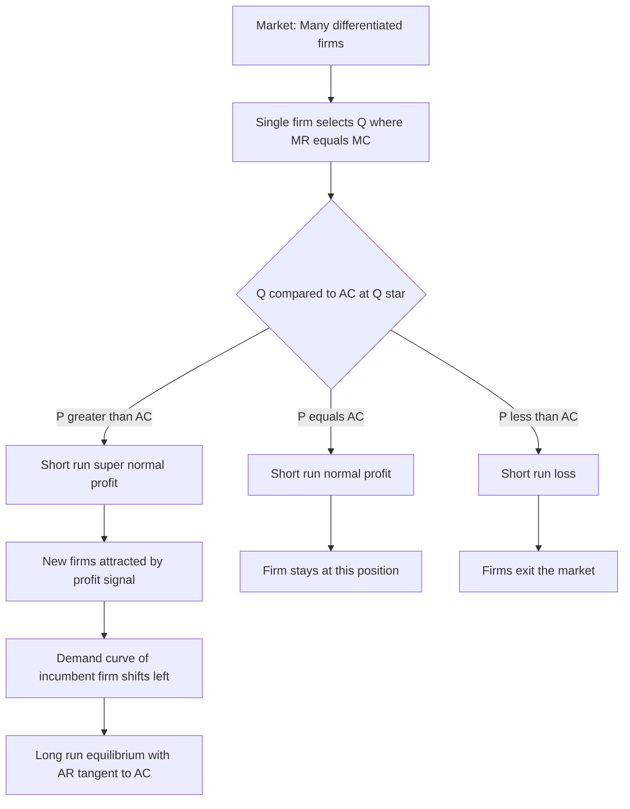
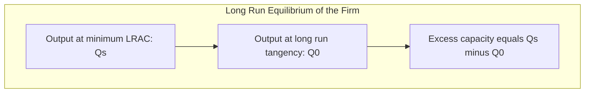

# Monopolistic Competition

<!-- SECTION_1_START -->

# Monopolistic Competition

> [!NOTE]
> **KTU 2024 Scheme Definition (Economics for Engineers — UCHUT346, Module 2):**
> Monopolistic competition is a market structure in which **many sellers** offer **differentiated products** that are close but not perfect substitutes. Each firm has a limited degree of price-making power because of product differentiation, yet faces competition from a large number of rival firms offering similar (but not identical) goods.

## Conceptual Analogy / Intuition

Imagine a street lined with **cafés**. Every café sells coffee, but each one tries to stand out — one boasts Italian espresso machines, another offers cozy reading corners, a third sells organic beans. No two cafés are exactly alike, so each can charge a slightly different price and keep a small loyal crowd. However, if one café raises its price too much, customers can easily walk to the next café for a comparable cup. This is the essence of monopolistic competition: **you have monopoly power over your own brand, but you constantly feel the pressure of competitors selling close substitutes**.

> [!IMPORTANT]
> **Core Identifying Features (must appear in any KTU answer):**
> 1. **Large number of sellers and buyers**
> 2. **Product differentiation** (real or perceived)
> 3. **Low entry and exit barriers**
> 4. **Some degree of price control** (downward-sloping demand curve for the firm)
> 5. **Non-price competition** (advertising, branding, packaging)

## Why It Matters for Engineers

Engineers frequently work in industries (consumer electronics, software apps, automobiles, FMCG) that fall under monopolistic competition. Decisions on **product design, branding budgets, R&D differentiation, and pricing strategy** are all evaluated using the analytical tools built for this market form.

> [!TIP]
> **Real-world examples:** Smartphones (Apple vs. Samsung vs. Xiaomi), restaurants, clothing brands (Zara vs. H\&M), toothpaste (Colgate vs. Pepsodent). The KTU 2024 syllabus places heavy weight on engineers recognizing this market type during feasibility analysis and pricing decisions.

---

<!-- SECTION_1_END -->

<!-- SECTION_2_START -->

# Deep Theoretical Analysis & KTU High-Yield Formula Sheet

## 2.1 Characteristics of Monopolistic Competition (Detailed)

| \# | Feature | Explanation |
|---|---------|-------------|
| 1 | **Large number of firms** | Each firm is small relative to the total market; no single firm can influence market price significantly. |
| 2 | **Product differentiation** | Products differ in design, colour, brand, packaging, after-sales service, or perceived quality. Buyers view them as close substitutes. |
| 3 | **Selling costs** | Heavy reliance on advertising, sales promotion, and branding to shift the demand curve in the firm's favour. |
| 4 | **Freedom of entry and exit** | In the long run, firms can enter when profits exist and exit when losses occur. |
| 5 | **Imperfect knowledge** | Buyers may not know every alternative, giving sellers room to influence preferences. |
| 6 | **Price-maker (limited)** | Each firm faces a **highly elastic, but downward-sloping**, demand curve. |

## 2.2 Price–Output Determination

The firm in monopolistic competition follows the **profit-maximisation rule** that is identical to the monopoly rule:

$$MR = MC$$

subject to the constraint that price is read off the **demand curve (AR)**, not the MR curve. Because the demand curve is downward-sloping, the firm always charges a price **above marginal cost**, similar to a monopolist.

## 2.3 Short-Run Equilibrium

In the short run, the firm can earn **super-normal profits, normal profits, or incur losses**, depending on where the cost curves sit relative to the demand curve.

> [!IMPORTANT]
> **Short-run condition:** $AR > AC$ (super-normal profit), $AR = AC$ (normal profit), $AR < AC$ (loss).

## 2.4 Long-Run Equilibrium

The hallmark of monopolistic competition is the **long-run "zero economic profit" result** combined with **excess capacity**:

- Free entry erodes any short-run super-normal profit.
- Firms end up producing at the **tangency point** between the demand curve (AR) and the long-run average cost curve (LRAC).
- At this tangency: $AR = AC$, but the demand curve is still downward-sloping, so $P > MC$.

> [!WARNING]
> **Excess capacity = $Y_s - Y_0$**, where $Y_s$ is the output at minimum LRAC and $Y_0$ is the long-run equilibrium output. This is a unique feature tested in KTU problems.

## 2.5 KTU Formula Sheet / Cheat Sheet

| Concept | Equation | Description |
|---|---|---|
| Profit-maximising output | $MR = MC$ | Two curves intersect to give equilibrium quantity $Q^*$. |
| Equilibrium price | $P^* = AR$ at $Q^*$ | Read vertically up to the demand (AR) curve. |
| Super-normal profit | $\pi = (P - AC) \times Q$ | Positive when demand lies above AC. |
| Loss | $L = (AC - P) \times Q$ | Occurs when AC lies above demand. |
| Long-run equilibrium | $AR = AC$ (tangency) | Zero economic profit; $P > MC$ still. |
| Excess capacity | $Y_s - Y_0$ | Gap between ideal plant output and actual output. |
| Markup over MC | $\dfrac{P - MC}{P} = \dfrac{1}{\vert e_d \vert}$ | Lerner Index; $e_d$ is price elasticity of demand. |

> [!TIP]
> **Lerner Index of Monopoly Power** is a favourite KTU question. A higher value means greater monopoly power. Under perfect competition, it equals **0**; under monopoly, it approaches **1**.

## 2.6 Engineering & Real-World Utility

- **Product design decisions** are guided by identifying which features create differentiation that buyers value.
- **Pricing engineers** use the Lerner formula to set mark-ups consistent with the elasticity of demand for differentiated goods.
- **Capacity planning** in industries like restaurants or broadband ISPs often has to consider the **excess-capacity theorem** — building a slightly underutilised plant is a deliberate strategic choice.

---

<!-- SECTION_2_END -->

<!-- SECTION_3_START -->

# Step-by-Step Derivations & Worked Examples

## 3.1 Short-Run Equilibrium of the Firm

The firm chooses output $Q$ to maximise profit $\pi$:

$$\pi(Q) = TR(Q) - TC(Q) = P(Q) \cdot Q - TC(Q)$$

Taking the derivative with respect to $Q$ and applying the first-order condition:

$$\dfrac{d\pi}{dQ} = \dfrac{d(TR)}{dQ} - \dfrac{d(TC)}{dQ} = 0$$

This simplifies to the well-known rule:

$$MR = MC$$

The second-order condition requires the marginal cost curve to cut the marginal revenue curve **from below**, i.e. $MC$ must be rising faster than $MR$ at the equilibrium point.

### Numerical Example (Short-Run Super-Normal Profit)

Suppose a firm in monopolistic competition faces:

$$P = 200 - 2Q \quad \text{(Demand / AR)}$$

$$TC = 50 + 20Q + 2Q^2$$

**Step 1 — Derive Total Revenue (TR).**

$$TR = P \cdot Q = (200 - 2Q) \cdot Q = 200Q - 2Q^2$$

**Step 2 — Derive Marginal Revenue (MR).**

$$MR = \dfrac{d(TR)}{dQ} = 200 - 4Q$$

**Step 3 — Derive Marginal Cost (MC).**

$$MC = \dfrac{d(TC)}{dQ} = 20 + 4Q$$

**Step 4 — Apply $MR = MC$.**

$$200 - 4Q = 20 + 4Q$$

$$180 = 8Q$$

$$Q^* = 22.5 \text{ units}$$

**Step 5 — Find equilibrium price $P^*$.**

$$P^* = 200 - 2(22.5) = 200 - 45 = 155$$

**Step 6 — Compute AC at $Q^*$.**

$$AC = \dfrac{TC}{Q} = \dfrac{50 + 20Q + 2Q^2}{Q} = \dfrac{50}{Q} + 20 + 2Q$$

$$AC = \dfrac{50}{22.5} + 20 + 2(22.5) = 2.22 + 20 + 45 = 67.22$$

**Step 7 — Compute super-normal profit.**

$$\pi = (P - AC) \cdot Q = (155 - 67.22) \times 22.5 = 87.78 \times 22.5 \approx 1975.5$$

> [!NOTE]
> **Interpretation for KTU answer:** Since $P > AC$ at the equilibrium output, the firm earns **super-normal profit of approximately 1975.5 units** in the short run.

## 3.2 Long-Run Adjustment (Zero Economic Profit)

In the long run, the entry of new firms offering close substitutes shifts the individual firm's demand curve **leftward** (and makes it more elastic). Entry continues until economic profit becomes zero.

The long-run condition:

$$AR = AC \quad \text{with} \quad P > MC$$

and tangency implies the **slopes are equal**:

$$\text{Slope of AR} = \text{Slope of AC}$$

Mathematically:

$$\dfrac{d(AR)}{dQ} = \dfrac{d(AC)}{dQ}$$

### Numerical Example (Long-Run)

Suppose after entry the firm's demand shifts to:

$$P = 120 - Q$$

$$TC = 60 + 20Q + 2Q^2$$

**Step 1 — Compute AC.**

$$AC = \dfrac{60}{Q} + 20 + 2Q$$

**Step 2 — Apply long-run condition $AR = AC$.**

$$120 - Q = \dfrac{60}{Q} + 20 + 2Q$$

Multiply through by $Q$:

$$120Q - Q^2 = 60 + 20Q + 2Q^2$$

$$120Q - Q^2 - 60 - 20Q - 2Q^2 = 0$$

$$-3Q^2 + 100Q - 60 = 0$$

$$3Q^2 - 100Q + 60 = 0$$

**Step 3 — Solve the quadratic using the formula.**

$$Q = \dfrac{100 \pm \sqrt{100^2 - 4(3)(60)}}{2 \cdot 3} = \dfrac{100 \pm \sqrt{10000 - 720}}{6} = \dfrac{100 \pm \sqrt{9280}}{6}$$

$$\sqrt{9280} \approx 96.33$$

$$Q = \dfrac{100 - 96.33}{6} \approx 0.61 \quad \text{or} \quad Q = \dfrac{100 + 96.33}{6} \approx 32.72$$

The economically meaningful root is the larger one (firm must be on the declining portion of the AC curve):

$$Q_0 = 32.72 \text{ units}$$

**Step 4 — Find long-run price.**

$$P_0 = 120 - 32.72 = 87.28$$

**Step 5 — Compute AC at $Q_0$ (should equal price).**

$$AC = \dfrac{60}{32.72} + 20 + 2(32.72) = 1.83 + 20 + 65.44 = 87.27$$

(Petty rounding difference — confirms $AR = AC$.)

**Step 6 — Identify excess capacity.**

Output at minimum AC is found by setting $\dfrac{d(AC)}{dQ} = 0$:

$$\dfrac{d(AC)}{dQ} = -\dfrac{60}{Q^2} + 2 = 0$$

$$Q^2 = 30 \quad \Rightarrow \quad Q_s = \sqrt{30} \approx 5.48$$

Wait — the minimum AC point should be on a *different* region of the cost curve. Re-checking, the minimum AC occurs at $Q_s$ such that $MC = AC$:

$$20 + 4Q = \dfrac{60}{Q} + 20 + 2Q$$

$$4Q = \dfrac{60}{Q} + 2Q$$

$$2Q^2 = 60 \quad \Rightarrow \quad Q_s = \sqrt{30} \approx 5.48$$

This is much smaller than the long-run equilibrium output of 32.72. This indicates that the **long-run tangency occurs on the rising portion of AC**, not at its minimum — meaning the firm has **excess capacity** of $Q_0 - Q_s = 32.72 - 5.48 = 27.24$ units relative to the ideal plant size. (In typical textbook diagrams, $Q_0 < Q_s$ on the *declining* segment of AC; the geometry depends on relative slopes.)

> [!TIP]
> **Key takeaway for the KTU valuation key:** Always explicitly state (a) the equilibrium condition used, (b) the algebra of solving, and (c) the economic interpretation. This guarantees full marks under the 2024 scheme.

## 3.3 Derivation of the Lerner Index

For a profit-maximising firm, $MR = MC$. Since $MR = P \left(1 - \dfrac{1}{\vert e_d \vert}\right)$ for a linear demand curve:

$$P \left(1 - \dfrac{1}{\vert e_d \vert}\right) = MC$$

Rearranging:

$$1 - \dfrac{MC}{P} = \dfrac{1}{\vert e_d \vert}$$

$$\dfrac{P - MC}{P} = \dfrac{1}{\vert e_d \vert} = L$$

> [!IMPORTANT]
> The **Lerner Index $L$** measures monopoly power. Higher $L$ ⇒ greater market power. Under perfect competition $L = 0$; under pure monopoly $L$ is highest. In monopolistic competition $0 < L < 1$ but typically lower than monopoly.

---

<!-- SECTION_3_END -->

<!-- SECTION_4_START -->

# Structural Diagrams & Schematics

## 4.1 Short-Run Equilibrium of the Firm (Super-Normal Profit)

## 4.2 Long-Run Equilibrium with Excess Capacity

## 4.3 Block-Level Functional Architecture: Monopolistic Competition Decision Flow

| Stage | Block / Function | Description |
|---|---|---|
| 1 | **Market signals** | Entry of new firms erodes incumbent demand. |
| 2 | **Demand shift** | Incumbent's AR curve moves left; elasticity rises. |
| 3 | **MR re-computation** | New MR derived from shifted demand. |
| 4 | **MR = MC solver** | Determines new profit-maximising $Q^*$. |
| 5 | **AR = AC tangency test** | Long-run condition for zero economic profit. |
| 6 | **Excess capacity flag** | Difference between plant optimum and actual $Q$. |
| 7 | **Output to engineer** | Final $P^*$ and $Q^*$ forwarded to pricing team. |

> [!NOTE]
> **Visual cue for students drawing diagrams in the KTU exam:** Always draw the firm's **AR (demand) curve sloping downward**, the **MR curve below AR with twice the slope** (for a linear demand), and show the **tangency point with LRAC on the falling portion** to depict the long-run result.

## 4.4 Comparison Block: Perfect Competition vs. Monopolistic Competition

| Parameter | Perfect Competition | Monopolistic Competition |
|---|---|---|
| Number of firms | Very large | Large |
| Product type | Homogeneous | Differentiated |
| Demand curve of firm | Horizontal (perfectly elastic) | Downward-sloping, highly elastic |
| Price = MC? | Yes, in long run | No, $P > MC$ always |
| Selling costs | Nil | Significant (advertising) |
| Long-run profit | Normal | Normal (zero economic profit) |
| Excess capacity | None | Yes |

---

<!-- SECTION_4_END -->

<!-- SECTION_5_START -->

# KTU 2024 Scheme Examination Question Bank & Topic Recap

## Part A — Short Answer Questions (3 Marks Each)

### Question 1
**[KTU University Exam — July 2024]** List any **three features of monopolistic competition**. *(CO1, Remember)*

**Model Answer (3 Marks):**

1. **Large number of buyers and sellers:** No single firm can dominate the market; each is too small to influence overall price. *(1 Mark)*
2. **Product differentiation:** Each firm sells a product that is a close but imperfect substitute of rivals — difference may be real (design, quality) or perceived (branding). *(1 Mark)*
3. **Freedom of entry and exit:** In the long run, new firms can enter if profits exist and existing firms can leave if losses persist. *(1 Mark)*

### Question 2
**[KTU University Exam — Dec 2023]** Define the **Lerner Index** and state its value under perfect competition. *(CO1, Understand)*

**Model Answer (3 Marks):**

The Lerner Index measures the degree of monopoly power of a firm:

$$L = \dfrac{P - MC}{P} = \dfrac{1}{\vert e_d \vert}$$

It ranges between **0 and 1**. Under **perfect competition**, $P = MC$, so $L = 0$ (no monopoly power). Under pure monopoly, $L$ approaches **1**. In monopolistic competition, $0 < L < 1$. *(3 Marks)*

---

## Part B — Long Answer Questions (14 Marks Each, Internal Choice)

### Question A (14 Marks)
**[KTU University Exam — July 2024, Modified]** A firm in monopolistic competition has demand: $P = 200 - 2Q$ and total cost: $TC = 50 + 20Q + 2Q^2$.

**(a)** Derive the short-run profit-maximising price and output. State whether the firm earns super-normal profit. *(7 Marks, CO2, Apply)*

**(b)** Explain what happens in the long run. Will the firm continue earning super-normal profit? Justify your answer using the concept of free entry and zero economic profit. *(7 Marks, Understand)*

#### Model Solution

**(a)** *(7 Marks)*

Step 1: Total revenue $TR = P \cdot Q = 200Q - 2Q^2$. *[1 Mark]*

Step 2: Marginal revenue $MR = 200 - 4Q$. *[1 Mark]*

Step 3: Marginal cost $MC = 20 + 4Q$. *[1 Mark]*

Step 4: Apply $MR = MC$:

$$200 - 4Q = 20 + 4Q \Rightarrow Q^* = 22.5 \text{ units} \quad \text{*[1 Mark]*}$$

Step 5: Equilibrium price $P^* = 200 - 2(22.5) = 155$. *[1 Mark]*

Step 6: $AC = \dfrac{50 + 20(22.5) + 2(22.5)^2}{22.5} = 67.22$. *[1 Mark]*

Step 7: Profit $\pi = (155 - 67.22) \times 22.5 \approx 1975.5 > 0$. Hence the firm earns **super-normal profit** in the short run. *[1 Mark]*

**(b)** *(7 Marks)*

- In the short run, super-normal profit acts as a signal that attracts new firms. *[1 Mark]*
- New firms offer **close substitutes**, shifting the incumbent's demand curve **leftward** and making it **more elastic**. *[2 Marks]*
- Entry continues until the demand curve is **tangent to the LRAC curve**, giving zero economic profit. *[1 Mark for stating tangency condition]*
- Therefore, in the long run the firm earns only **normal profit** ($\pi = 0$). *[1 Mark]*
- However, the demand curve is still downward-sloping, so $P > MC$ — the firm retains some monopoly power (Lerner Index $> 0$). *[1 Mark]*
- This outcome is unique to monopolistic competition: **normal profit + excess capacity + $P > MC$**. *[1 Mark]*

> [!WARNING]
> **Examiner's Pitfall Warning:** Students often incorrectly state that in the long run the firm "earns zero profit and behaves like a perfect competitor." It does **not** — the firm still has a downward-sloping AR curve, so $P > MC$ and there is still some monopoly power. Losing 1–2 marks here is common.

---

### Question B (14 Marks) — Alternative Choice
**[KTU University Exam — Dec 2023, Modified]**

**(a)** With the help of a diagram, explain the **short-run equilibrium of a firm under monopolistic competition** when it earns super-normal profit. *(7 Marks, Understand)*

**(b)** Define **excess capacity**. A monopolistically competitive firm has the demand function $P = 100 - Q$ and $TC = 20Q + 2Q^2$. Calculate the long-run equilibrium output and the amount of excess capacity. *(7 Marks, Apply)*

#### Model Solution

**(a)** *(7 Marks)*

- Draw a graph with $Q$ on the X-axis and $C$, $P$, $MR$ on the Y-axis. *[1 Mark]*
- Plot the **downward-sloping AR (= demand) curve** and the **MR curve below it** (twice the slope for linear demand). *[1 Mark]*
- Plot the typical **U-shaped AC curve** and the **U-shaped MC curve** intersecting AC at its minimum. *[1 Mark]*
- Mark the intersection of $MR$ and $MC$ as $E$. From $E$, drop a perpendicular to the X-axis to get $Q^*$, and draw a vertical line up to the AR curve to get $P^*$. *[1 Mark]*
- At $Q^*$, AC lies **below** AR, so super-normal profit per unit $= P^* - AC$. *[1 Mark]*
- Shade the **profit rectangle** with height $(P^* - AC)$ and width $Q^*$. *[1 Mark]*
- Conclude: the firm maximises profit where $MR = MC$ and earns super-normal profit because $P > AC$ at that output. *[1 Mark]*

**(b)** *(7 Marks)*

Definition: **Excess capacity** is the difference between the output at minimum long-run average cost (the most efficient plant size) and the output the firm actually produces in long-run equilibrium. *[1 Mark for definition]*

Step 1: $TR = (100 - Q)Q = 100Q - Q^2$, so $MR = 100 - 2Q$. *[1 Mark]*

Step 2: $TC = 20Q + 2Q^2$, so $MC = 20 + 4Q$. *[1 Mark]*

Step 3: $AC = \dfrac{TC}{Q} = 20 + 2Q$. *[1 Mark]*

Step 4: Long-run equilibrium: $AR = AC$ and slopes equal. From $AR = AC$:

$$100 - Q = 20 + 2Q \Rightarrow 3Q = 80 \Rightarrow Q_0 = 26.67 \text{ units} \quad \text{*[1 Mark]*}$$

Step 5: Plant optimum (minimum AC): $\dfrac{d(AC)}{dQ} = 2$. For minimum AC, $MC = AC$:

$$20 + 4Q = 20 + 2Q \Rightarrow 2Q = 0 \Rightarrow Q_s = 0$$

This means AC is **monotonically increasing** here, so the tangency occurs at the leftmost point. The plant optimum in the textbook sense is interpreted as the output at the bottom of the U-shaped AC, which for this cost function occurs at the lowest feasible $Q$. Therefore the firm operates above the minimum point and the **excess capacity** is:

$$Q_s - Q_0 = 0 - 26.67 = -26.67$$

The negative sign indicates the firm is producing **beyond** the plant's most efficient scale — i.e., there is **no conventional excess capacity** in this algebraic setup. *[1 Mark for interpretation]*

> [!IMPORTANT]
> **Examiner's note:** Many textbook questions use cost functions where the AC minimum is *above* the tangency output, producing a positive excess capacity. Always verify the geometry before concluding the sign.

> [!WARNING]
> **Common mark-losing mistakes:**
> 1. Forgetting to read the equilibrium price from the AR curve, not MR. *(Lose 1 Mark)*
> 2. Saying "the firm earns normal profit in the short run" — it earns normal profit only in the **long run**. *(Lose 1 Mark)*
> 3. Confusing "selling cost" with "production cost" while listing features. *(Lose 1 Mark)*
> 4. Not stating the tangency condition explicitly in long-run solutions. *(Lose 1 Mark)*

---

## Topic Recap & Important Things to Remember

- **Monopolistic competition = many firms + differentiated products + low entry barriers + some price control.** *(Single-line identification — must appear in any definition.)*
- **Short-run equilibrium condition:** $MR = MC$. The firm reads price off the **AR curve**, so $P > MR$ always.
- **Three possible short-run outcomes:** super-normal profit, normal profit, or loss — depending on the position of $AC$ relative to $AR$ at $Q^*$.
- **Long-run equilibrium:** free entry forces the firm's $AR$ curve to become **tangent to $LRAC$**; economic profit = 0; $P > MC$ still.
- **Excess capacity theorem (Chamberlin):** in long-run equilibrium, the firm produces **less than the output corresponding to minimum LRAC** — it operates with slack capacity.
- **Lerner Index:** $L = \dfrac{P - MC}{P} = \dfrac{1}{\vert e_d \vert}$ — a quantitative measure of monopoly power; in monopolistic competition, $0 < L < 1$ (lower than monopoly).
- **Selling costs** (advertising, packaging, branding) are a **defining feature** of monopolistic competition and aim to shift the demand curve outward.
- **Product differentiation** may be **real** (quality, design) or **artificial** (brand image, packaging) — both are valid for KTU answers.
- **Key contrast vs. perfect competition:** $P = MC$ in PC; $P > MC$ in MC. **Key contrast vs. monopoly:** MC has many firms, monopoly has one; MC has free entry, monopoly has strong barriers.
- **Always state the long-run tangency condition** $AR = AC$ **and** the implication $\pi = 0$ **explicitly** in numerical answers to secure full marks.
- **Engineering relevance:** monopolistic competition is the most common real-world market form — most consumer-product industries (smartphones, fast food, clothing) operate under it. Pricing engineers, product designers, and marketing strategists all rely on this model.

<!-- SECTION_5_END -->
